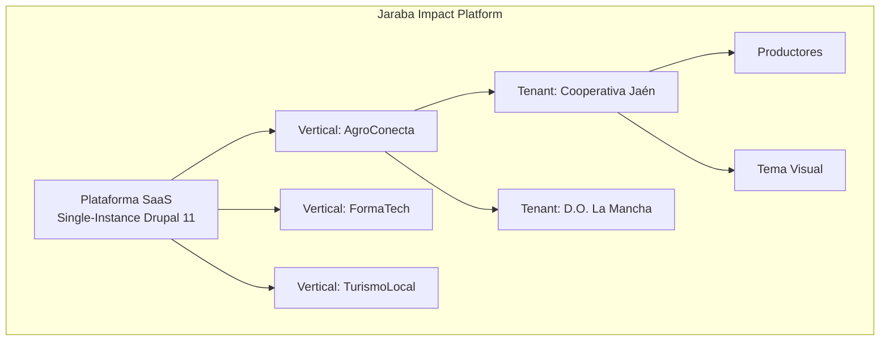

# 📋 DIRECTRICES DEL PROYECTO - JarabaImpactPlatformSaaS

> **⚠️ DOCUMENTO MAESTRO**: Este documento debe leerse y memorizarse al inicio de cada conversación o al reanudarla.

**Fecha de creación:** 2026-01-09 15:28  
**Última actualización:** 2026-01-11 14:50  
**Versión:** 2.1.0 (KB AI-Nativa + RAG Qdrant)

---

## 📑 Tabla de Contenidos (TOC)

1. [Información General del Proyecto](#1-información-general-del-proyecto)
2. [Stack Tecnológico](#2-stack-tecnológico)
3. [Arquitectura Multi-tenant](#3-arquitectura-multi-tenant)
4. [Seguridad y Permisos](#4-seguridad-y-permisos)
5. [Principios de Desarrollo](#5-principios-de-desarrollo)
6. [Entornos de Desarrollo](#6-entornos-de-desarrollo)
7. [Estructura de Documentación](#7-estructura-de-documentación)
8. [Convenciones de Nomenclatura](#8-convenciones-de-nomenclatura)
9. [Formato de Documentos](#9-formato-de-documentos)
10. [Flujo de Trabajo de Documentación](#10-flujo-de-trabajo-de-documentación)
11. [Estándares de Código y Comentarios](#11-estándares-de-código-y-comentarios)
12. [Control de Versiones](#12-control-de-versiones)
13. [Procedimientos de Actualización](#13-procedimientos-de-actualización)
14. [Glosario de Términos](#14-glosario-de-términos)
15. [Registro de Cambios](#15-registro-de-cambios)

---

## 1. Información General del Proyecto

### 1.1 Nombre del Proyecto
**JarabaImpactPlatformSaaS**

### 1.2 Descripción
Plataforma SaaS de impacto desarrollada por Jaraba que permite la gestión de ecosistemas de productores locales con capacidades de e-commerce, trazabilidad, certificación digital y asistencia mediante agentes de IA.

### 1.3 Visión
Crear una plataforma tecnológica que empodere a productores locales, facilitando su acceso al mercado digital con herramientas de trazabilidad, certificación y marketing inteligente.

### 1.4 Módulos Principales
- **Gestión de Tenants**: Organizaciones cliente que utilizan la plataforma
- **E-commerce**: Drupal Commerce 3.x nativo con Stripe Connect (split payments)
- **Trazabilidad**: Seguimiento de productos desde origen
- **Certificación Digital**: Firma electrónica con FNMT/AutoFirma
- **Agentes IA**: Asistentes inteligentes para marketing, storytelling, experiencia de cliente
- **Theming**: Personalización visual por Tenant

### 1.5 Idioma de Documentación
- **Documentación**: Español
- **Comentarios de código**: Español (suficientemente descriptivos para que cualquier diseñador o desarrollador pueda entender)
- **Nombres de variables/funciones**: Inglés (convención técnica)

---

## 2. Stack Tecnológico

### 2.1 Backend y CMS

| Tecnología | Versión | Propósito |
|------------|---------|----------|
| **Drupal** | 11.x | CMS principal, gestión de contenido y entidades |
| **PHP** | 8.4+ | Lenguaje backend |
| **MySQL/MariaDB** | 8.0+ / 10.5+ | Base de datos |
| **Composer** | 2.x | Gestión de dependencias PHP |

### 2.2 Frontend

| Tecnología | Propósito |
|------------|----------|
| **Twig** | Motor de plantillas Drupal |
| **CSS/SCSS** | Estilos con variables dinámicas por sede |
| **JavaScript (ES6+)** | Interactividad y agentes IA |
| **Tema personalizado** | `agroconecta_theme` con sistema de sedes |

#### 2.2.1 Flujo de Trabajo SCSS

> **⚠️ IMPORTANTE**: En este proyecto usamos **archivos SCSS** que se compilan a CSS.
> **NUNCA** edites directamente los archivos `.css` en `/css/`. Siempre edita los `.scss` en `/scss/`.

**Estructura de archivos SCSS por módulo:**

```
scss/
├── _variables.scss     # Variables SCSS (colores, fuentes, etc.)
├── _mixins.scss        # Mixins reutilizables
├── _injectable.scss    # CSS custom properties (runtime)
├── _components.scss    # Componentes base
├── _onboarding.scss    # Estilos de onboarding
├── _tenant-dashboard.scss  # Dashboard del Tenant
└── main.scss          # Archivo principal que importa todos
```

**Comando de compilación:**

```bash
# Desde el directorio del módulo (ej: ecosistema_jaraba_core)
npx sass scss/main.scss:css/ecosistema-jaraba-core.css --style=compressed

# Para desarrollo con watch:
npx sass scss/main.scss:css/ecosistema-jaraba-core.css --watch
```

**Reglas:**
- Crear archivos parciales con prefijo `_` (ej: `_tenant-dashboard.scss`)
- Importar parciales en `main.scss` con `@use 'nombre-sin-guion-bajo'`
- Usar variables definidas en `_variables.scss`
- Compilar antes de commitear cambios de estilos

### 2.3 Integraciones Externas

> **Evolución v2.0 (Enero 2026)**: Arquitectura AI-First Commerce reemplazando Ecwid
> Ver: [Documento Técnico Maestro v2](./tecnicos/20260110e-Documento_Tecnico_Maestro_v2_Claude.md)

| Servicio | Propósito |
|----------|----------|
| **Drupal Commerce 3.x** | E-commerce nativo con Server-Side Rendering (GEO-optimizado) |
| **Stripe Connect** | Split payments automáticos plataforma/tenant |
| **Make.com** | Hub de integración (Facebook, Instagram, TikTok, Pinterest, Google) |
| **FNMT / AutoFirma** | Certificados digitales y firma electrónica |
| **APIs de IA** | OpenAI, Anthropic, Google - generación de Answer Capsules |

#### 2.3.1 Estrategia GEO (Generative Engine Optimization)

> **PRINCIPIO RECTOR**: "La primera plataforma de comercio diseñada para que la IA venda tus productos"

La arquitectura Commerce 3.x proporciona Server-Side Rendering que permite:
- **Answer Capsules**: Primeros 150 caracteres optimizados para extracción por LLMs
- **Schema.org completo**: JSON-LD para Product, Offer, FAQ, Organization
- **Indexación 100%**: Todo el contenido visible para GPTBot, PerplexityBot, ClaudeBot

#### 2.3.2 Knowledge Base AI-Nativa (RAG + Qdrant)

> **Módulo**: `jaraba_rag` | **Estado**: ✅ Operativo (v5.1, 2026-01-11)
> Ver: [Guía Técnica KB RAG](./tecnicos/20260111-Guia_Tecnica_KB_RAG_Qdrant.md)

| Componente | Descripción |
|------------|-------------|
| **Qdrant** | Base de datos vectorial para embeddings (1536D, OpenAI) |
| **Arquitectura Dual** | Lando (`http://qdrant:6333`) + IONOS Cloud (HTTPS) |
| **Colección** | `jaraba_kb` - Knowledge Base multi-tenant |
| **Indexación** | Automática via `hook_entity_insert/update/delete` |

**Servicios Core:**
- `KbIndexerService`: Extrae contenido, chunking, embeddings, upsert
- `QdrantDirectClient`: Cliente HTTP directo para API Qdrant
- `TenantContextService`: Filtros multi-tenant para búsquedas

**Fallbacks Robustos (Lección Aprendida v5.1):**
```php
// ❌ No funciona si config devuelve ""
$value = $config->get('key') ?? 'default';

// ✅ Funciona con null Y ""
$value = $config->get('key') ?: 'default';
```

**Rutas Admin:**
- `/admin/config/jaraba/rag` - Configuración general
- Ver logs: `/admin/reports/dblog?type[]=jaraba_rag`

### 2.4 Desarrollo Local

| Herramienta | Propósito |
|-------------|----------|
| **Lando** | Entorno de desarrollo local containerizado |
| **Drush** | CLI para administración Drupal |
| **WSL2 + Ubuntu** | Subsistema Linux en Windows |

---

## 3. Arquitectura Multi-tenant

> **Decisión Arquitectónica**: Single-Instance + Group Module (NO multisite)
> 
> Ver análisis en [Documento Técnico Maestro](./tecnicos/20260109e-DOCUMENTO_TECNICO_MAESTRO_SaaS_CONSOLIDADO_Claude.md)

### 3.1 Jerarquía del Ecosistema



### 3.2 Módulos de Multi-Tenancy

| Módulo | Función |
|--------|---------|
| **Group** | Aislamiento lógico de contenido por Tenant |
| **Domain Access** | URLs personalizadas por Tenant/Vertical |
| **Group Content** | Asociar entidades (nodos, usuarios) a grupos |

### 3.3 Entidades Core (Content Entities)

| Entidad | Descripción | Relaciones |
|---------|-------------|------------|
| **Vertical** | Segmento de negocio (Agro, Formación, Turismo) | Contiene Tenants |
| **Tenant** | Inquilino/cliente (antes "Sede") | Pertenece a Vertical, contiene Productores |
| **Plan SaaS** | Límites y features | Referenciado por Tenant |

### 3.4 Aislamiento de Datos

| Aspecto | Estrategia |
|---------|------------|
| **Base de datos** | Única (Single-Instance), aislamiento por Group |
| **Contenido** | Group Content: nodos pertenecen a un Group |
| **Usuarios** | Group Membership: roles por grupo |
| **Archivos** | Público/privado con control de acceso por Group |
| **Búsqueda** | Search API con filtros de Group para efecto red |

### 3.5 Ventajas de Single-Instance + Group

| Ventaja | Descripción |
|---------|-------------|
| **Efecto Red** | Queries cruzadas entre Tenants (matching talento ↔ empresas) |
| **Mantenimiento** | 1 actualización de core para toda la plataforma |
| **Escalabilidad** | Horizontal, sin límite de Tenants |
| **Datos compartidos** | Taxonomías, usuarios, catálogos entre Verticales |

### 3.6 Configuración por Nivel

| Nivel | Qué se configura | Quién configura |
|-------|------------------|-----------------|
| **Plataforma** | Módulos core, APIs, agentes IA base | Desarrollo |
| **Vertical** | Tipos de contenido, taxonomías, tema base | Admin Vertical |
| **Tenant** | Logo, colores, credenciales Ecwid, límites | Admin Tenant |

---

## 4. Seguridad y Permisos

### 4.1 Roles de Usuario

| Rol | Permisos Principales |
|-----|----------------------|
| **Administrador** | Acceso completo, gestión de sedes, configuración global |
| **Gestor de Sede** | Administrar productores y productos de su sede |
| **Productor** | Gestionar su tienda, productos, pedidos |
| **Cliente** | Navegar, comprar, ver historial |
| **Anónimo** | Navegación pública limitada |

### 4.2 Políticas de Acceso a APIs

| API | Autenticación | Notas |
|-----|---------------|-------|
| Drupal REST | Sesión cookie + CSRF token | Usuarios autenticados |
| Ecwid | Token de tienda | Almacenado en config Drupal |
| Agentes IA | API Key por proveedor | Variables de entorno |
| AutoFirma | Certificado cliente | FNMT o similar |

### 4.3 Manejo de Credenciales

> **⚠️ IMPORTANTE**: Nunca commitear credenciales al repositorio.

- **Desarrollo**: Archivo `settings.local.php` (excluido de git)
- **Producción**: Variables de entorno del servidor
- **APIs externas**: Configuración Drupal encriptada o env vars

### 4.4 Validación de Datos

- Toda entrada de usuario debe validarse en backend
- Usar Form API de Drupal con validadores
- Sanitizar salidas con `check_plain()` / `Html::escape()`
- Prevenir XSS, CSRF, SQL Injection

---

## 5. Principios de Desarrollo

> **⚠️ DIRECTRIZ CRÍTICA**: Toda configuración de negocio debe ser editable desde la interfaz de Drupal mediante **Content Entities con campos configurables**. **NO se permiten valores hardcodeados en el código** para configuraciones que puedan variar entre sedes, planes o a lo largo del tiempo.

### 5.1 Entidades de Contenido (Content Entities)

El proyecto utiliza **Content Entities** de Drupal para configuraciones de negocio porque permiten:

| Capacidad | Beneficio |
|-----------|-----------|
| **Field UI** | Añadir/quitar campos desde UI sin código |
| **Views** | Crear listados, filtros, exportaciones |
| **Bundles** | Tipos diferentes con campos distintos |
| **Revisiones** | Historial de cambios automático |
| **Entity API** | CRUD estándar, hooks, eventos |
| **Entity Reference** | Relaciones entre entidades |

### 5.2 Cuándo Usar Cada Tipo de Entidad

| Tipo | Uso | Ejemplo | Views? | Field UI? |
|------|-----|---------|--------|-----------|
| **Content Entity** | Datos de negocio editables | `SaasPlan`, `Sede`, `Productor` | ✅ | ✅ |
| **Config Entity** | Configuración técnica exportable | Features, AI Agents, permisos | ❌ | ❌ |
| **State API** | Estado temporal del sistema | Tokens, cachés | ❌ | ❌ |
| **Settings** | Config por entorno | Credenciales BD, API keys | ❌ | ❌ |

> **⚠️ IMPORTANTE**: Para datos de negocio que necesitan listados, filtros o ser referenciados, usar **siempre Content Entity**.

### 5.3 Config Entities del Proyecto

Además de Content Entities, el proyecto utiliza **Config Entities** para configuraciones administrativas zero-code:

| Entidad | ID | Admin URL | Propósito |
|---------|----|-----------|-----------|
| **Feature** | `feature` | `/admin/structure/features` | Funcionalidades habilitables por Vertical |
| **AIAgent** | `ai_agent` | `/admin/structure/ai-agents` | Registro de agentes IA disponibles |

Estas Config Entities permiten:
- Añadir/deshabilitar features sin código
- Gestionar agentes IA desde la UI
- Referenciar desde Vertical via `entity_reference`

### 5.3 Regla: No Hardcodear Configuraciones

```php
// ❌ INCORRECTO: Límites hardcodeados
public function validateProducer($sede) {
    if ($sede->getProducerCount() >= 10) {  // ¡NO! Límite fijo
        throw new Exception("Límite alcanzado");
    }
}

// ✅ CORRECTO: Límites desde Content Entity (SaasPlan)
public function validateProducer($sede) {
    // Cargar plan como Content Entity con campos configurables
    $plan = $sede->get('plan')->entity;  // Entity Reference
    $maxProductores = $plan->get('field_max_productores')->value;
    
    if ($sede->getProducerCount() >= $maxProductores) {
        throw new Exception("Límite del plan alcanzado");
    }
}
```

### 5.4 Configuraciones que DEBEN ser Content Entities

| Entidad | Campos UI Configurables | Integración Views |
|---------|------------------------|-------------------|
| **SaasPlan** | Max productores, storage, features, precio | Lista de planes, comparativa |
| **Sede** | Nombre, dominio, plan (ref), tema, logo | Listado de sedes, filtros |
| **Productor** | Nombre, email, sede (ref), tienda Ecwid | Productores por sede |
| **Producto** | Nombre, precio, productor (ref), stock | Catálogo, filtros, busqueda |
| **Lote** | Código, origen, fecha, producto (ref) | Trazabilidad, historial |
| **Certificado** | Tipo, lote (ref), validez, firma | Certificados emitidos |
| **Prompt IA** | Nombre, agente, texto, variables | Gestión de prompts |

### 5.5 Beneficios del Enfoque Content Entity

1. **Field UI**: Administradores añaden campos sin desarrollo
2. **Views**: Listados potentes sin código custom
3. **Exportación**: Views Data Export para CSV/Excel
4. **Búsqueda**: Integración con Search API
5. **REST/JSON:API**: Exposición automática como API
6. **Revisiones**: Historial de cambios para auditoría
7. **Traducciones**: Soporte multilenguaje nativo


### 5.6 Implementación de Content Entities

#### Definición de Content Entity (ejemplo: SaasPlan)

```php
<?php

namespace Drupal\ecosistema_jaraba_core\Entity;

use Drupal\Core\Entity\ContentEntityBase;
use Drupal\Core\Entity\EntityTypeInterface;
use Drupal\Core\Field\BaseFieldDefinition;

/**
 * Define la entidad de contenido para Planes SaaS.
 *
 * PROPÓSITO:
 * Permite definir planes de suscripción con límites y features
 * configurables desde la UI de Drupal con Field UI y Views.
 *
 * BENEFICIOS CONTENT ENTITY:
 * - Campos configurables desde UI
 * - Integración nativa con Views
 * - Entity Reference para relaciones
 * - Revisiones para historial
 *
 * @ContentEntityType(
 *   id = "saas_plan",
 *   label = @Translation("Plan SaaS"),
 *   label_collection = @Translation("Planes SaaS"),
 *   handlers = {
 *     "view_builder" = "Drupal\Core\Entity\EntityViewBuilder",
 *     "list_builder" = "Drupal\ecosistema_jaraba_core\SaasPlanListBuilder",
 *     "form" = {
 *       "default" = "Drupal\ecosistema_jaraba_core\Form\SaasPlanForm",
 *       "add" = "Drupal\ecosistema_jaraba_core\Form\SaasPlanForm",
 *       "edit" = "Drupal\ecosistema_jaraba_core\Form\SaasPlanForm",
 *       "delete" = "Drupal\Core\Entity\ContentEntityDeleteForm",
 *     },
 *     "views_data" = "Drupal\views\EntityViewsData",
 *     "route_provider" = {
 *       "html" = "Drupal\Core\Entity\Routing\AdminHtmlRouteProvider",
 *     },
 *   },
 *   base_table = "saas_plan",
 *   admin_permission = "administer saas plans",
 *   fieldable = TRUE,
 *   entity_keys = {
 *     "id" = "id",
 *     "label" = "name",
 *     "uuid" = "uuid",
 *   },
 *   links = {
 *     "collection" = "/admin/structure/saas-plan",
 *     "add-form" = "/admin/structure/saas-plan/add",
 *     "canonical" = "/admin/structure/saas-plan/{saas_plan}",
 *     "edit-form" = "/admin/structure/saas-plan/{saas_plan}/edit",
 *     "delete-form" = "/admin/structure/saas-plan/{saas_plan}/delete",
 *   },
 *   field_ui_base_route = "entity.saas_plan.collection",
 * )
 */
class SaasPlan extends ContentEntityBase implements SaasPlanInterface {

  /**
   * Define campos base de la entidad.
   */
  public static function baseFieldDefinitions(EntityTypeInterface $entity_type) {
    $fields = parent::baseFieldDefinitions($entity_type);

    $fields['name'] = BaseFieldDefinition::create('string')
      ->setLabel(t('Nombre del Plan'))
      ->setRequired(TRUE)
      ->setDisplayOptions('form', ['weight' => 0]);

    $fields['max_productores'] = BaseFieldDefinition::create('integer')
      ->setLabel(t('Máximo de Productores'))
      ->setDescription(t('-1 para ilimitado'))
      ->setDefaultValue(10)
      ->setDisplayOptions('view', ['weight' => 1])
      ->setDisplayOptions('form', ['weight' => 1])
      ->setDisplayConfigurable('form', TRUE)
      ->setDisplayConfigurable('view', TRUE);

    $fields['max_storage_gb'] = BaseFieldDefinition::create('integer')
      ->setLabel(t('Almacenamiento Máximo (GB)'))
      ->setDefaultValue(5)
      ->setDisplayConfigurable('form', TRUE)
      ->setDisplayConfigurable('view', TRUE);

    // Campos adicionales se pueden añadir desde Field UI
    return $fields;
  }
}
```

#### Uso en Servicios con Content Entity

```php
/**
 * Servicio que valida límites usando Content Entities.
 *
 * LÓGICA:
 * Carga el plan como Content Entity y accede a los campos
 * configurables para obtener los límites.
 */
class PlanValidatorService {

  /**
   * Verifica si la sede puede añadir más productores.
   */
  public function canAddProducer(SedeInterface $sede): bool {
    // Obtener plan via Entity Reference en la Sede
    $plan = $sede->get('field_plan')->entity;

    if (!$plan) {
      return FALSE;
    }

    // Acceder a campo configurable (Field UI)
    $maxProductores = (int) $plan->get('max_productores')->value;

    // -1 significa ilimitado
    if ($maxProductores === -1) {
      return TRUE;
    }

    $currentCount = $this->countProducers($sede);
    return $currentCount < $maxProductores;
  }
}
```

### 5.7 Checklist para Nuevas Features

Antes de implementar cualquier feature, verificar:

- [ ] ¿Es Content Entity para permitir Field UI?
- [ ] ¿Tiene handler `views_data` para integración Views?
- [ ] ¿Los campos son configurables desde UI?
- [ ] ¿Las relaciones usan Entity Reference?
- [ ] ¿Tiene revisiones habilitadas si necesita historial?

Si la respuesta a cualquiera es "No" y debería ser "Sí", **refactorizar antes de continuar**.

---

## 6. Entornos de Desarrollo

### 6.1 Entornos Disponibles

| Entorno | URL | Base de Datos | Propósito |
|---------|-----|---------------|----------|
| **Local** | `*.lndo.site` | Lando containers | Desarrollo activo |
| **Staging** | TBD | Copia de producción | Pruebas pre-release |
| **Producción** | TBD | Producción | Usuarios finales |

### 6.2 Configuración Lando

El proyecto utiliza Lando para desarrollo local. Sitios disponibles:

| Sitio | URL Local |
|-------|----------|
| Principal | `plataformadeecosistemas.lndo.site` |
| AgroConecta | `jarabaagroconecta.lndo.site` |
| PepeJaraba | `pepejaraba.lndo.site` |

### 6.3 Comandos Útiles

```bash
# Iniciar entorno
lando start

# Acceder a Drush
lando drush cr                    # Limpiar caché
lando drush @agroconecta cr       # Alias específico

# Exportar/importar config
lando drush cex -y
lando drush cim -y

# Base de datos
lando db-export backup.sql
lando db-import backup.sql
```

---

## 7. Estructura de Documentación

### 7.1 Ubicación Principal
```
/docs/
```

### 7.2 Subcarpetas y Propósitos

| Carpeta | Propósito | Contenido Típico |
|---------|-----------|------------------|
| `arquitectura/` | Estructura técnica del sistema | Diagramas de componentes, APIs, base de datos, infraestructura, patrones de diseño |
| `logica/` | Reglas de negocio y flujos | Flujos de usuario, reglas de validación, procesos de negocio, casos de uso |
| `planificacion/` | Gestión de planes y roadmaps | Cronogramas, sprints, milestones, estimaciones, prioridades |
| `tareas/` | Seguimiento de trabajo | Definiciones de tareas, estados, asignaciones, progreso |
| `implementacion/` | Guías de desarrollo | Guías de instalación, configuración, despliegue, tutoriales técnicos |
| `tecnicos/` | Documentos externos | Especificaciones técnicas proporcionadas por stakeholders |
| `assets/` | Recursos visuales | Imágenes, diagramas, mockups, logos, capturas de pantalla |
| `plantillas/` | Plantillas de documentos | Plantillas estándar para cada tipo de documento |

### 7.3 Documentos Raíz
- `00_DIRECTRICES_PROYECTO.md` - **Este documento** (directrices maestras)
- `00_INDICE_GENERAL.md` - Índice navegable de toda la documentación

---

## 8. Convenciones de Nomenclatura

### 8.1 Formato de Nombre de Archivo
```
YYYY-MM-DD_HHmm_nombre-descriptivo.md
```

### 8.2 Componentes del Nombre

| Componente | Descripción | Ejemplo |
|------------|-------------|---------|
| `YYYY` | Año (4 dígitos) | 2026 |
| `MM` | Mes (2 dígitos) | 01 |
| `DD` | Día (2 dígitos) | 09 |
| `HHmm` | Hora y minutos (24h) | 1528 |
| `nombre-descriptivo` | Nombre en minúsculas con guiones | arquitectura-modulos-core |

### 8.3 Ejemplos Válidos
```
2026-01-09_1528_arquitectura-sistema-multisite.md
2026-01-09_1530_logica-flujo-autenticacion.md
2026-01-10_0900_planificacion-sprint-01.md
2026-01-10_1000_tarea-implementar-api-usuarios.md
```

### 8.4 Excepciones
- Documentos raíz (`00_DIRECTRICES_PROYECTO.md`, `00_INDICE_GENERAL.md`)
- Plantillas (prefijo `plantilla_`)

---

## 9. Formato de Documentos

### 8.1 Estructura Obligatoria
Todo documento debe contener:

```markdown
# Título del Documento

**Fecha de creación:** YYYY-MM-DD HH:mm  
**Última actualización:** YYYY-MM-DD HH:mm  
**Autor:** [Nombre o "IA Asistente"]  
**Versión:** X.Y.Z  

---

## 📑 Tabla de Contenidos (TOC)

1. [Sección 1](#sección-1)
2. [Sección 2](#sección-2)
...

---

## Sección 1
[Contenido]

## Sección 2
[Contenido]

---

## Registro de Cambios
| Fecha | Versión | Descripción |
|-------|---------|-------------|
| YYYY-MM-DD | X.Y.Z | Descripción del cambio |
```

### 8.2 Reglas de TOC
- Toda sección principal (H2) debe aparecer en el TOC
- Los enlaces deben ser navegables (formato anchor)
- Usar numeración correlativa

### 8.3 Formato Markdown
- Usar GitHub Flavored Markdown
- Tablas para datos estructurados
- Bloques de código con sintaxis highlighting
- Diagramas Mermaid cuando sea apropiado

---

## 9. Flujo de Trabajo de Documentación

### 9.1 Creación de Nuevo Documento
1. Determinar la subcarpeta apropiada
2. Generar nombre con fecha/hora actual
3. Copiar plantilla correspondiente
4. Completar contenido
5. Actualizar `00_INDICE_GENERAL.md`

### 9.2 Actualización de Documento Existente
1. Modificar contenido necesario
2. Actualizar "Última actualización"
3. Incrementar versión según semántica
4. Añadir entrada al Registro de Cambios
5. Actualizar índice si cambia el título

### 9.3 Eliminación de Documento
1. Mover a carpeta `/docs/_archivo/` (no eliminar físicamente)
2. Actualizar `00_INDICE_GENERAL.md`
3. Documentar razón de archivo

---

## 10. Estándares de Código y Comentarios

> **⚠️ DIRECTRIZ CRÍTICA**: Los comentarios de código son fundamentales para la mantenibilidad del proyecto. Deben permitir que cualquier diseñador o programador entienda perfectamente y al completo la estructura, lógica y sintaxis para futuros desarrollos o escalados.

### 10.1 Idioma de Comentarios
**Español** - Todos los comentarios de código deben estar en español, siendo suficientemente descriptivos y completos.

### 10.2 Requisitos Obligatorios de Comentarios

Los comentarios deben cubrir **tres dimensiones esenciales**:

#### 10.2.1 Estructura
- **Organización del código**: Explicar cómo está organizado el archivo/módulo/clase
- **Relaciones entre componentes**: Documentar dependencias y conexiones
- **Patrones utilizados**: Identificar patrones de diseño aplicados
- **Jerarquía**: Describir la relación padre-hijo entre clases/componentes

#### 10.2.2 Lógica
- **Propósito**: ¿Por qué existe este código? ¿Qué problema resuelve?
- **Flujo de ejecución**: ¿Cómo fluyen los datos a través del código?
- **Reglas de negocio**: ¿Qué reglas de negocio implementa?
- **Decisiones**: ¿Por qué se eligió esta aproximación sobre otras alternativas?
- **Casos especiales**: Documentar edge cases y su manejo

#### 10.2.3 Sintaxis
- **Parámetros**: Explicar cada parámetro con su tipo y propósito
- **Retornos**: Documentar qué devuelve y en qué formato
- **Excepciones**: Listar posibles errores y cuándo ocurren
- **Tipos complejos**: Explicar estructuras de datos no obvias

### 10.3 Nivel de Detalle Requerido

| Elemento | Nivel Mínimo de Documentación |
|----------|------------------------------|
| **Archivos/Módulos** | Descripción general, propósito, dependencias principales |
| **Clases** | Responsabilidad, relaciones, estado que mantiene |
| **Métodos públicos** | Propósito, parámetros, retorno, excepciones, ejemplo de uso |
| **Métodos privados** | Propósito y lógica interna |
| **Variables de clase** | Propósito y valores esperados |
| **Bloques complejos** | Explicación paso a paso de la lógica |
| **Condicionales críticos** | Por qué existe la condición y qué casos maneja |
| **Bucles** | Qué itera, condición de salida, transformaciones |

### 10.4 Ejemplos de Comentarios Adecuados

#### Ejemplo 1: Encabezado de Clase
```php
<?php

/**
 * GESTOR DE PRODUCTORES - ProducerManager
 * 
 * ESTRUCTURA:
 * Esta clase actúa como servicio central para la gestión de productores
 * en el ecosistema AgroConecta. Depende de SedeManager para validar
 * ubicaciones y de EcwidService para la integración con e-commerce.
 * 
 * LÓGICA DE NEGOCIO:
 * - Cada productor pertenece a exactamente una Sede
 * - Las Sedes tienen límites de productores según el plan SaaS
 * - Al crear un productor, automáticamente se crea su tienda en Ecwid
 * 
 * RELACIONES:
 * - ProducerManager -> SedeManager (dependencia)
 * - ProducerManager -> EcwidService (dependencia)
 * - ProducerManager <- ProducerController (usado por)
 * 
 * @package Drupal\agroconecta_core\Service
 * @see SedeManager Para gestión de sedes
 * @see EcwidService Para integración con e-commerce
 */
class ProducerManager {
```

#### Ejemplo 2: Método con Documentación Completa
```php
/**
 * Registra un nuevo productor en el ecosistema.
 * 
 * PROPÓSITO:
 * Este método es el punto de entrada principal para crear nuevos
 * productores. Orquesta la validación, creación en Ecwid, y
 * persistencia en la base de datos local.
 * 
 * FLUJO DE EJECUCIÓN:
 * 1. Valida que la sede existe y tiene capacidad
 * 2. Verifica que el email no esté registrado
 * 3. Crea la tienda en Ecwid via API
 * 4. Persiste el productor en Drupal
 * 5. Envía email de bienvenida
 * 
 * REGLAS DE NEGOCIO:
 * - El email debe ser único en todo el ecosistema
 * - La sede debe tener slots disponibles según su plan
 * - El productor hereda la configuración de la sede
 * 
 * @param array $producerData Datos del productor:
 *   - 'name' (string): Nombre completo del productor
 *   - 'email' (string): Email único para login
 *   - 'sede_id' (int): ID de la sede a la que pertenece
 *   - 'phone' (string, opcional): Teléfono de contacto
 * 
 * @return ProducerEntity El productor creado con su tienda asociada
 * 
 * @throws InvalidSedeException Si la sede no existe o está inactiva
 * @throws SedeCapacityException Si la sede alcanzó su límite de productores
 * @throws DuplicateEmailException Si el email ya está registrado
 * @throws EcwidApiException Si falla la creación de tienda en Ecwid
 */
public function registerProducer(array $producerData): ProducerEntity {
    // ═══════════════════════════════════════════════════════════════
    // PASO 1: VALIDACIÓN DE SEDE
    // Verificamos que la sede exista y tenga capacidad disponible.
    // Esto es crítico porque cada plan SaaS define un límite máximo.
    // ═══════════════════════════════════════════════════════════════
    $sede = $this->sedeManager->getById($producerData['sede_id']);
    
    if (!$sede) {
        // La sede no existe - esto puede ocurrir si se manipuló el formulario
        throw new InvalidSedeException(
            "La sede con ID {$producerData['sede_id']} no existe"
        );
    }
    
    // Verificamos capacidad según el plan contratado
    // Planes: básico=10, profesional=50, enterprise=ilimitado
    if (!$sede->hasCapacity()) {
        throw new SedeCapacityException(
            "La sede '{$sede->getName()}' alcanzó su límite de productores"
        );
    }
    
    // ═══════════════════════════════════════════════════════════════
    // PASO 2: VALIDACIÓN DE EMAIL ÚNICO
    // El email es el identificador principal del productor en todo
    // el ecosistema, no puede repetirse entre sedes.
    // ═══════════════════════════════════════════════════════════════
    if ($this->emailExists($producerData['email'])) {
        throw new DuplicateEmailException(
            "El email {$producerData['email']} ya está registrado"
        );
    }
    
    // ... continúa implementación
}
```

#### Ejemplo 3: Lógica Compleja con Explicación
```javascript
/**
 * Calcula el precio final aplicando descuentos escalonados.
 * 
 * LÓGICA DE DESCUENTOS (definida por negocio):
 * - 0-99€: Sin descuento
 * - 100-299€: 5% de descuento
 * - 300-499€: 10% de descuento  
 * - 500€+: 15% de descuento
 * 
 * NOTA: Los descuentos NO son acumulativos, se aplica el tramo correspondiente.
 */
function calculateFinalPrice(subtotal) {
    // Definimos los tramos de descuento como array de objetos
    // Ordenados de mayor a menor para encontrar el primer match
    const discountTiers = [
        { minAmount: 500, discount: 0.15 },  // 15% para compras >= 500€
        { minAmount: 300, discount: 0.10 },  // 10% para compras >= 300€
        { minAmount: 100, discount: 0.05 },  // 5% para compras >= 100€
        { minAmount: 0,   discount: 0.00 },  // Sin descuento por defecto
    ];
    
    // Buscamos el primer tramo donde el subtotal sea >= minAmount
    // Al estar ordenados de mayor a menor, el primer match es el correcto
    const applicableTier = discountTiers.find(tier => subtotal >= tier.minAmount);
    
    // Calculamos el descuento y lo restamos del subtotal
    const discountAmount = subtotal * applicableTier.discount;
    
    return subtotal - discountAmount;
}
```

### 10.5 Anti-patrones de Comentarios (Evitar)

```php
// ❌ INCORRECTO: Comentario que repite el código
$count = $count + 1; // Incrementa count en 1

// ❌ INCORRECTO: Comentario vago
$result = processData($input); // Procesa los datos

// ❌ INCORRECTO: Comentario desactualizado
// Envía email al administrador (NOTA: ya no se usa email, ahora es Slack)
$this->sendNotification($message);

// ✅ CORRECTO: Explica el por qué
// Incrementamos el contador de reintentos para implementar backoff exponencial
// Esto evita saturar el API externo cuando hay errores temporales
$retryCount++;

// ✅ CORRECTO: Documenta decisión de diseño
// Usamos procesamiento síncrono aquí en lugar de cola porque
// el usuario necesita feedback inmediato del resultado
$result = $this->processImmediately($input);
```

### 10.6 Comentarios para Escalabilidad

Incluir siempre notas sobre:
- **Puntos de extensión**: Dónde y cómo añadir nueva funcionalidad
- **Limitaciones conocidas**: Qué no soporta actualmente y por qué
- **Dependencias de configuración**: Qué cambios de config afectan el código
- **Consideraciones de rendimiento**: Advertencias sobre volúmenes grandes

---

## 11. Control de Versiones

### 11.1 Versionado Semántico
```
MAJOR.MINOR.PATCH
```

| Tipo | Cuándo incrementar |
|------|-------------------|
| MAJOR | Cambios incompatibles o reestructuración completa |
| MINOR | Nueva funcionalidad o sección importante |
| PATCH | Correcciones, clarificaciones, actualizaciones menores |

### 11.2 Nomenclatura con Fecha/Hora
La fecha/hora en el nombre del archivo actúa como:
- Identificador único
- Registro histórico automático
- Facilidad para ordenar cronológicamente

---

## 12. Procedimientos de Actualización

### 12.1 Al Inicio de Cada Conversación
El asistente IA debe:
1. Leer este documento (`00_DIRECTRICES_PROYECTO.md`)
2. Revisar `00_INDICE_GENERAL.md` para estado actual
3. Verificar documentos relevantes a la tarea

### 12.2 Durante el Desarrollo
- Actualizar documentación en paralelo con cambios de código
- Mantener índice sincronizado
- Documentar decisiones arquitectónicas importantes

### 12.3 Al Finalizar Tareas
- Verificar que documentación refleja estado actual
- Actualizar versiones de documentos modificados
- Confirmar integridad del índice

---

## 13. Glosario de Términos

| Término | Definición |
|---------|------------|
| **Sede** | Entidad organizativa que agrupa productores en una ubicación geográfica |
| **Productor** | Usuario que vende productos a través de la plataforma |
| **Ecosistema** | Conjunto de sedes y productores bajo una marca paraguas |
| **TOC** | Table of Contents - Tabla de Contenidos |
| **SaaS** | Software as a Service - Modelo de distribución de software |

*Este glosario se expandirá conforme se documente el proyecto.*

---

## 14. Registro de Cambios

| Fecha | Versión | Descripción |
|-------|---------|-------------|
| 2026-01-09 | 1.0.0 | Creación inicial del documento de directrices |
| 2026-01-09 | 1.1.0 | Ampliación de sección Estándares de Código |
| 2026-01-09 | 1.2.0 | Añadidas secciones: Stack, Arquitectura, Seguridad, Entornos |
| 2026-01-09 | 1.3.0 | Añadida sección 5: Principios de Desarrollo (Config Entities) |
| 2026-01-09 | 1.4.0 | **Corregido**: Sección 5 ahora usa **Content Entities** (Field UI, Views) |
| 2026-01-10 | 1.5.0 | Añadido flujo de trabajo SCSS |
| 2026-01-10 | 1.6.0 | Actualización menor |
| 2026-01-10 | 1.7.0 | Añadidas Config Entities (Feature, AIAgent) para admin zero-code |
| 2026-01-10 | 2.0.1 | AI-First Commerce desplegado en IONOS |
| 2026-01-11 | 2.1.0 | **KB AI-Nativa:** Sección 2.3.2 con Qdrant, servicios RAG, lecciones aprendidas |

---

> **📌 RECORDATORIO**: Este documento es la fuente de verdad para todos los estándares del proyecto. Cualquier duda sobre formato, nomenclatura o procedimientos debe resolverse consultando este documento.
