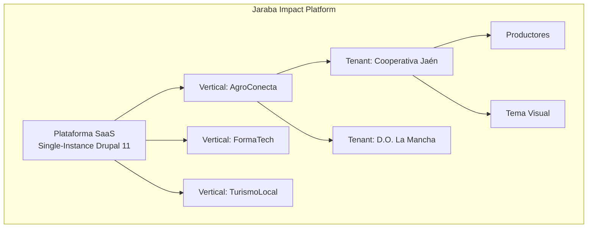

# 📋 DIRECTRICES DEL PROYECTO - JarabaImpactPlatformSaaS

> **⚠️ DOCUMENTO MAESTRO**: Este documento debe leerse y memorizarse al inicio de cada conversación o al reanudarla.

**Fecha de creación:** 2026-01-09 15:28  
**Última actualización:** 2026-03-26
**Versión:** 168.0.0 (MEGAMENU-PED-CORPORATE-001 — mega menú corporativo PDE + auditoría conversión 10/10 meta-sitio, 2 reglas nuevas, aprendizaje #229)

---

## 📑 Tabla de Contenidos (TOC)

1. [Información General del Proyecto](#1-información-general-del-proyecto)
2. [Stack Tecnológico](#2-stack-tecnológico)
3. [Arquitectura Multi-tenant](#3-arquitectura-multi-tenant)
4. [Seguridad y Permisos](#4-seguridad-y-permisos)
5. [Principios de Desarrollo](#5-principios-de-desarrollo)
6. [Testing y Calidad](#6-testing-y-calidad)
7. [Estructura de Documentación](#7-estructura-de-documentación)
8. [Convenciones de Nomenclatura](#8-convenciones-de-nomenclatura)
9. [Formato de Documentos](#9-formato-de-documentos)
10. [Flujo de Trabajo de Documentación](#10-flujo-de-trabajo-de-documentación)
11. [Estándares de Código y Comentarios](#11-estándares-de-código-y-comentarios)
12. [Control de Versiones](#12-control-de-versiones)
13. [Procedimientos de Actualización](#13-procedimientos-de-actualización)
14. [Glosario de Términos](#14-glosario-de-términos)
15. [Registro de Cambios](#15-registro-de-cambios)

---
## 1. Información General del Proyecto

### 1.1 Nombre del Proyecto
**JarabaImpactPlatformSaaS**

### 1.2 Descripción
Plataforma SaaS de impacto desarrollada por Jaraba que permite la gestión de ecosistemas de productores locales con capacidades de e-commerce, trazabilidad, certificación digital y asistencia mediante agentes de IA.

### 1.3 Visión
Crear una plataforma tecnológica que empodere a productores locales, facilitando su acceso al mercado digital con herramientas de trazabilidad, certificación y marketing inteligente.

### 1.4 Módulos Principales
- **Gestión de Tenants**: Organizaciones cliente que utilizan la plataforma
- **E-commerce**: Drupal Commerce 3.x nativo con Stripe Connect (split payments)
- **Trazabilidad**: Seguimiento de productos desde origen
- **Certificación Digital**: Firma electrónica con FNMT/AutoFirma
- **Agentes IA**: Asistentes inteligentes para marketing, storytelling, experiencia de cliente
- **JarabaLex** ⭐: Vertical independiente de inteligencia juridica profesional (✅ Elevado):
  - `jaraba_legal_intelligence`: Busqueda semantica IA, alertas inteligentes, citaciones cruzadas
  - `jaraba_legal_cases` ✅ (FASE A1): 4 Content Entities (ClientCase, CaseActivity, ClientInquiry, InquiryTriage), 4 Services, 3 Controllers, 11 API REST endpoints, 2 zero-region templates, 47 ficheros
  - `jaraba_legal_calendar` ✅ (FASE A2): Content Entity LegalDeadline, DeadlineCalculatorService (LEC 130.2 agosto inhabil, fines de semana), HearingService, CalendarDashboardController, 2 zero-region templates
  - `jaraba_legal_billing` ✅ (FASE B1): Content Entities (LegalTimeEntry, LegalInvoice, LegalExpense), TimeTrackingService, LegalInvoicingService, LegalBillingDashboardController, cronometro JS
  - `jaraba_legal_vault` ✅ (FASE B2): Content Entities (VaultDocument, VaultAccessLog), VaultStorageService (hash chain SHA-256), VaultAuditLogService (append-only), VaultDashboardController
  - `jaraba_legal_lexnet` ✅ (FASE B3): Content Entity LexnetNotification, LexnetSyncService, LexnetProcessingService, LexnetDashboardController, integracion API LexNET
  - `jaraba_legal_templates` ✅ (FASE C1): Content Entity LegalTemplate, TemplateManagerService (merge fields), TemplateEditorController, GrapesJS 11 bloques legales
  - Config entities: vertical, 3 features, 3 SaaS plans, 36 FreemiumVerticalLimit (18 legal research + 18 despacho management)
  - Theme: page--legal.html.twig, page--legal-cases.html.twig, page--legal-case-detail.html.twig, page--jarabalex.html.twig, CSS custom properties --ej-legal-*
  - Diagnostico Lead Magnet: LegalLandingController (6 areas legales, analisis basado en reglas), legal-diagnostico.html.twig + JS + SCSS
  - JarabaLexCopilotAgent: 6 modos (legal_search, legal_analysis, legal_alerts, case_assistant, document_drafter, legal_advisor) con deteccion por keywords
  - Tests: 15 ficheros PHPUnit (5 Unit ecosistema + 4 agent/journey/kernel + 6 modulos satelite), 53 PHP lint OK
  - Billing: 3 entradas FEATURE_ADDON_MAP (legal_search, legal_alerts, legal_citations)
- **Theming**: Personalización visual por Tenant
- **Page Builder**: Constructor visual GrapesJS (~202 bloques, 24 categorias, Template Registry SSoT v5.0, Feature Flags, IA Asistente integrada, Template Marketplace, Multi-Page Editor, SEO Assistant, Responsive Preview 8 viewports, IconRegistry SVG 17 iconos, Publish endpoint + SEO URLs, Font Outfit unificado, SCSS pipeline Docker NVM, Bloques Verticales 55 templates (5 verticales x 11 tipos) con _pb-sections.scss (570 LOC, 5 esquemas color, 11 layouts responsive), AgroConecta 11 templates premium (jaraba_icon, data-effect, schema.org, FAQ JSON-LD, LocalBusiness microdata))
- **AgroConecta** ⭐: Marketplace agroalimentario multi-vendor (3 modulos, ✅ Elevado Clase Mundial):
  - `jaraba_agroconecta_core` ✅: 20 Content Entities, 6 Controllers, 18 Services, 15 Forms
    - Fases 1-3: Commerce Core + Orders + Producer/Customer Portal
    - Sprint AC6-1: QR Dashboard (QrService, qr-dashboard.js)
    - Sprint AC6-2: Partner Document Hub B2B (magic link auth, 17 API endpoints, audit log)
    - Fase 9: Producer Copilot (DemandForecasterService, MarketSpyService, CopilotConversationInterface)
    - Fase 10: Sales Agent (CrossSellEngine, CartRecoveryService, WhatsAppApiService, SalesAgentService)
    - Elevacion Clase Mundial: AgroConectaCopilotBridgeService, 12 FreemiumVerticalLimit, 8 UpgradeTrigger types
  - `ecosistema_jaraba_core` (servicios transversales AgroConecta): AgroConectaFeatureGateService, AgroConectaEmailSequenceService (6 MJML), AgroConectaCrossVerticalBridgeService, AgroConectaJourneyProgressionService (10 reglas), AgroConectaHealthScoreService (5 dim + 8 KPIs), AgroConectaExperimentService (4 A/B tests)
  - `jaraba_agroconecta_traceability` 📋: Trazabilidad hash-anchoring, QR dinamico, certificados
  - `jaraba_agroconecta_ai` ✅: Producer Copilot + Sales Agent completados en jaraba_agroconecta_core + jaraba_ai_agents (SalesAgent, MerchantCopilotAgent)
  - Page Builder: 11 templates premium (jaraba_icon, data-effect, schema.org microdata, FAQ JSON-LD, LocalBusiness)
  - SCSS: 16 ficheros, 95 rgba()→color-mix(), design token vertical nature_green
- **ServiciosConecta** ⭐: Marketplace de servicios profesionales (1 modulo, Clase Mundial ✅):
  - `jaraba_servicios_conecta` ✅: 6 Content Entities, 3 Controllers, 5 Services, 2 Taxonomias
    - Fase 1: Marketplace + Provider Portal + Booking Engine
    - Entidades: ProviderProfile, ServiceOffering, Booking, AvailabilitySlot, ServicePackage, ReviewServicios
    - Frontend: 6 SCSS partials (Dart Sass @use, color-mix, var(--ej-*)), 8 Twig templates + 6 partials, BEM
    - Elevacion Clase Mundial: 14 fases (F0-F13), 26/26 paridad, bug fix releaseSlot(), SCSS compliance
  - `ecosistema_jaraba_core` (servicios transversales ServiciosConecta): ServiciosConectaFeatureGateService, ServiciosConectaEmailSequenceService (6 MJML), ServiciosConectaCrossVerticalBridgeService (4 bridges), ServiciosConectaJourneyProgressionService (10 reglas), ServiciosConectaHealthScoreService (5 dim + 8 KPIs), ServiciosConectaExperimentService (3 A/B), ServiciosConectaCopilotAgent (6 modos), ServiciosConectaCopilotBridgeService
  - Page Builder: 15 templates (11 existentes corregidos emojis→jaraba_icon + 4 premium: booking_widget, provider_spotlight, trust_badges, case_studies)
  - SCSS: 6 ficheros migrados, 5 colores Tailwind→var(--ej-*), rgba()→color-mix(), design token vertical serviciosconecta
  - SaaS Plans: Free (3 svc/10 book) → Starter 29 EUR (10/50) → Profesional 79 EUR (ilimitado) → Enterprise
- **ComercioConecta** ⭐: Marketplace de comercio de proximidad multi-vendor (1 modulo, ✅ Elevado Clase Mundial):
  - `jaraba_comercio_conecta` ✅: 42 Content Entities, 9 Controllers, 25 Services, 37 Forms, 42 Access Handlers, 23 List Builders
    - Sprint 1 (F1-F5, F13-F18): Infraestructura elevacion — 11 entidades base (ProductRetail, ProductVariationRetail, StockLocation, MerchantProfile + 7 F1 configs), FeatureGate, UpgradeTrigger, body classes, zero-region, SCSS compliance, design token, CopilotBridge, 6 MJML emails, CrossVertical, Journey+HealthScore, Experiment, 11 PB premium templates, avatar nav
    - Sprint 2 F6 (Orders+Checkout+Payments): 9 entidades (OrderRetail, OrderItemRetail, SuborderRetail, Cart, CartItem, ReturnRequest, CouponRetail, CouponRedemption, AbandonedCart), Stripe Connect split, IVA 21%, comision 10%
    - Sprint 2 F7 (Portales): 3 entidades (CustomerProfile, Wishlist, WishlistItem), Merchant Portal (pedidos+pagos+config), Customer Portal (dashboard+pedidos+favoritos)
    - Sprint 2 F8 (Search+SEO): 5 entidades (SearchIndex, SearchSynonym, SearchLog, LocalBusinessProfile, NapEntry), Haversine geo, Schema.org LocalBusiness
    - Sprint 2 F9 (Engagement): 11 entidades (FlashOffer, FlashOfferClaim, QrCodeRetail, QrScanEvent, QrLeadCapture, ReviewRetail, QuestionAnswer, NotificationTemplate, NotificationLog, NotificationPreference, PushSubscription)
    - Sprint 3 F10a (Shipping): 4 entidades (ShipmentRetail, ShippingMethodRetail, ShippingZone, CarrierConfig), ClickCollectService
    - Sprint 3 F10b (POS): 3 entidades (PosConnection, PosSync, PosConflict), sync bidireccional TPV
    - Sprint 3 F10c (Admin): 3 entidades (ModerationQueue, IncidentTicket, PayoutRecord), moderacion + incidencias
    - Sprint 3 F10d (Analytics): ComercioAnalyticsService (KPIs marketplace), MerchantAnalyticsService (analytics por comerciante)
    - Frontend: 17 templates Twig, 5 JS (checkout, customer-portal, merchant-portal, search, marketplace), 12 SCSS partials, 60+ rutas, 30+ permisos, 19 admin tabs
  - `ecosistema_jaraba_core` (servicios transversales ComercioConecta): ComercioConectaFeatureGateService, ComercioConectaEmailSequenceService (6 MJML), ComercioConectaCrossVerticalBridgeService (4 bridges), ComercioConectaJourneyProgressionService (8 reglas), ComercioConectaHealthScoreService (5 dim + 8 KPIs), ComercioConectaExperimentService (4 A/B), ComercioConectaCopilotBridgeService
  - Page Builder: 11 templates premium (jaraba_icon, data-effect, schema.org, FAQ JSON-LD, LocalBusiness microdata)
  - SCSS: 12 ficheros, design token vertical comercio_conecta, color-mix(), var(--ej-*)
  - SaaS Plans: Free (5 prod/10 orders) → Starter (50/100) → Profesional (ilimitado) → Enterprise
- **Soporte al Cliente** ⭐: Sistema de tickets omnicanal clase mundial (1 modulo, ✅ Clase Mundial):
  - `jaraba_support` ✅: 7 Content Entities, 2 Config Entities, 2 Controllers, 18 Services, 22 Unit Tests
    - Entidades: SupportTicket (state machine 6 estados), TicketMessage, TicketAttachment, TicketWatcher, TicketTag, SlaPolicy (ConfigEntity), SupportSettings (ConfigEntity)
    - State Machine: open → in_progress → waiting_customer → resolved → closed + escalated (lateral)
    - SLA Engine: politicas por {plan_tier}_{priority}, business hours con timezone/holidays, pause/resume con extension de deadline, breach detection + warnings
    - AI: SupportAgentSmartAgent Gen 2 (5 acciones: classify, suggest, summarize, sentiment, draft), TicketAiClassificationService, TicketAiResolutionService
    - Routing: scoring multi-factor (skills +50, vertical +30, workload +20, experience +15)
    - SSE: TicketStreamService con event queue DB + collision detection (support_ticket_events + support_ticket_viewers)
    - Attachments: ClamAV scan + heuristic fallback, HMAC signed URLs SHA-256 con expiracion 1h
    - CSAT: CsatSurveyService con schedule 1h delay, submit 1-5 clamp, low satisfaction warning
    - Health Score: SupportHealthScoreService compuesto 0-100 (5 componentes: volume, SLA, CSAT, escalation, resolution)
    - Merge: TicketMergeService con transferencia de mensajes/adjuntos/watchers
    - Cron: auto-close 7d, CSAT surveys, SSE purge 24h, SLA processing, attachment scans
    - API: SupportApiController (12+ endpoints REST), SupportStreamController (SSE)
    - Frontend: 2 SCSS partials (modulo + theme bundle), templates Twig
    - Tests: 22 unit tests / 111 assertions (TicketService, SlaEngine, Analytics)
- **Security & Compliance** ⭐: Dashboard cumplimiento normativo (G115-1 ✅):
  - `AuditLog` entity inmutable + `AuditLogService` centralizado
  - `ComplianceDashboardController` en `/admin/seguridad`: 25+ controles, 4 frameworks (SOC 2, ISO 27001, ENS, GDPR)
  - Frontend: compliance-dashboard.css/js, template Twig, auto-refresh 30s
- **Advanced Analytics** ⭐: Cohort Analysis + Funnel Tracking (✅):
  - `jaraba_analytics`: 10 Content Entities (CohortDefinition, FunnelDefinition, AnalyticsEvent, AnalyticsDaily, AnalyticsDashboard, CustomReport, DashboardWidget, ScheduledReport, ProductMetricSnapshot) + 1 ConfigEntity (ActivationCriteriaConfig), 8 Services (incl. ActivationTrackingService, RetentionCalculatorService, NpsSurveyService, KillCriteriaAlertService, ProductMetricsAggregatorService), PrePmfDashboardController <!-- AUDIT-SPEC-N02 -->
  - 2 Services (CohortAnalysisService, FunnelTrackingService), 2 API Controllers REST
  - Frontend: templates Twig, JS interactivo, heatmap retención, visualización funnel
- **Billing SaaS** ⭐: Ciclo completo Stripe Billing (✅ Clase Mundial):
  - `jaraba_billing`: 5 Content Entities (BillingInvoice, BillingUsageRecord, BillingPaymentMethod, BillingCustomer, TenantAddon)
  - 13 Servicios: PlanValidator, TenantSubscriptionService, TenantMeteringService, PricingRuleEngine, ReverseTrialService, ExpansionRevenueService, ImpactCreditService, SyntheticCfoService, StripeCustomerService, StripeSubscriptionService, StripeInvoiceService, DunningService, FeatureAccessService
  - 4 Controllers: BillingWebhookController (10 eventos Stripe), BillingApiController (13 endpoints), UsageBillingApiController (7 endpoints), AddonApiController (6 endpoints)
  - 26 endpoints REST API: suscripciones, facturas, uso, add-ons, portal Stripe, metodos de pago
  - Dunning 6 pasos (spec 134 §6), Feature Access plan+addons (spec 158 §6.1)
  - Catálogo Stripe: 6 productos × 4 tiers × 2 intervalos = 48 precios con lookup_keys
  - Comisiones marketplace: agroconecta 8%, comercioconecta 6%, serviciosconecta 10%, enterprise 3%
- **AI Skills Verticales** ⭐: 30 skills predefinidas con contenido experto (✅ Seedado):
  - Seed script: `scripts/seed_vertical_skills.php` (1,647 LOC, idempotente)
  - 7 empleabilidad + 7 emprendimiento + 6 agroconecta + 5 comercioconecta + 5 serviciosconecta
  - Contenido especializado mercado español (Markdown: Propósito/Input/Proceso/Output/Restricciones/Ejemplos/Validación)
- **Monitoring Stack** ⭐: Observabilidad completa (✅ Configurado):
  - Docker Compose standalone: `monitoring/docker-compose.monitoring.yml`
  - Prometheus (9090) + Grafana (3001) + Loki (3100) + Promtail + AlertManager (9093)
  - 14 reglas de alertas (ServiceDown, HighErrorRate, QdrantDiskFull, StripeWebhookFailures, etc.)
  - Routing: critical→Slack #jaraba-critical + email, warning→Slack #jaraba-alerts
- **Go-Live Procedures** ⭐: Runbook ejecutable (✅ Completado):
  - `scripts/golive/01_preflight_checks.sh`: 24 validaciones pre-lanzamiento
  - `scripts/golive/02_validation_suite.sh`: Smoke tests por vertical
  - `scripts/golive/03_rollback.sh`: Rollback automatizado 7 pasos
  - `docs/tecnicos/GO_LIVE_RUNBOOK.md`: 6 fases, RACI matrix, criterios Go/No-Go
- **Security CI + GDPR** ⭐: Automatización seguridad (✅ Completado):
  - `.github/workflows/security-scan.yml`: Daily cron (Trivy + OWASP ZAP + composer/npm audit)
  - `GdprCommands.php`: `drush gdpr:export` (Art.15), `drush gdpr:anonymize` (Art.17), `drush gdpr:report`
  - `SECURITY_INCIDENT_RESPONSE_PLAYBOOK.md`: SEV1-4, AEPD 72h, templates comunicación
- **Email Templates MJML** ⭐: 46 plantillas transaccionales (✅ Completado):
  - `jaraba_email/templates/mjml/`: auth/ (5), billing/ (7), marketplace/ (6), empleabilidad/ (10), emprendimiento/ (11), andalucia_ei/ (6) + base.mjml
  - `TemplateLoaderService`: template_id → MJML → compilación via MjmlCompilerService
  - Empleabilidad sequences (Fase 6): seq_onboarding_welcome, seq_engagement_reactivation, seq_upsell_starter, seq_interview_prep, seq_post_hire
  - Emprendimiento sequences (Paridad v2): seq_onboarding_founder, seq_canvas_abandonment, seq_upsell_starter, seq_mvp_celebration, seq_post_funding
- **Avatar Detection + Navegacion Contextual + Empleabilidad UI** ⭐: Flujo completo end-to-end con navegacion por avatar (✅ Activado):
  - `ecosistema_jaraba_core`: AvatarDetectionService (cascada 4 niveles: Domain→Path/UTM→Group→Rol) + **AvatarNavigationService** (navegacion contextual 10 avatares, resolucion segura URLs, active state highlight)
  - `ecosistema_jaraba_theme`: _avatar-nav.html.twig (bottom nav mobile + barra horizontal desktop), _avatar-nav.scss (BEM mobile-first), body class `.has-avatar-nav`, Theme Setting `enable_avatar_nav`
  - `jaraba_job_board`: EmployabilityMenuService (patron original, 1 vertical) — generalizado por AvatarNavigationService (10 avatares)
  - `jaraba_diagnostic`: EmployabilityDiagnostic entity (14 campos, 5 perfiles). EmployabilityScoringService (LinkedIn 40%/CV 35%/Estrategia 25%). Wizard 3 pasos + templates Twig + JS
  - `jaraba_candidate`: EmployabilityCopilotAgent (6 modos: Profile Coach, Job Advisor, Interview Prep, Learning Guide, Application Helper, FAQ). Extiende BaseAgent con @ai.provider
  - `jaraba_copilot_v2`: EmprendimientoCopilotAgent (6 modos: business_strategist, financial_advisor, customer_discovery_coach, pitch_trainer, ecosystem_connector, faq). Extiende BaseAgent
  - Hooks ECA: hook_user_insert (JourneyState discovery), hook_entity_insert(employability_diagnostic) (rol candidate, LMS enrollment)
  - CV PDF Export: dompdf v2.0.8, CvBuilderService::convertHtmlToPdf() con Design Tokens
  - Frontend: modal-system.js + 4 partials Twig (_application-pipeline, _job-card, _gamification-stats, _profile-completeness) + _avatar-nav.html.twig (navegacion contextual global)
- **Empleabilidad Clase Mundial** ⭐: Elevación completa 10/10 fases (✅ Clase Mundial):
  - `ecosistema_jaraba_core`: EmployabilityFeatureGateService (3 features × 3 planes), FeatureGateResult ValueObject, EmployabilityEmailSequenceService (5 secuencias SEQ_EMP_001-005), EmployabilityCrossVerticalBridgeService (4 bridges), EmployabilityJourneyProgressionService (7 reglas proactivas), EmployabilityHealthScoreService (5 dimensiones + 8 KPIs)
  - `ecosistema_jaraba_theme`: page--empleabilidad.html.twig (zero-region + Copilot FAB), hook_preprocess_page__empleabilidad(), body classes unificadas
  - `jaraba_candidate`: modal-actions library, agent-fab.js (proactive polling 5min), CopilotApiController proactive endpoint, ApplicationService + CvBuilderService feature gating
  - `jaraba_job_board`: CRM pipeline sync (7 estados), UpgradeTrigger status_change/first_milestone, email enrollment interview+hired
  - `jaraba_diagnostic`: email enrollment SEQ_EMP_001 post-diagnóstico
  - `jaraba_self_discovery`: modal-actions library, hook_page_attachments_alter()
  - Plan: `docs/implementacion/2026-02-15_Plan_Elevacion_Clase_Mundial_Vertical_Empleabilidad_v1.md`
- **Testing Enhancement** ⭐: k6 + BackstopJS + CI coverage (✅ Completado):
  - `tests/performance/load_test.js`: smoke/load/stress scenarios, p95 < 500ms
- **Marketing AI Stack** ⭐: 9 módulos nativos al 100% (✅ Clase Mundial):
  - `jaraba_crm`: CRM Pipeline completo + B2B Sales Flow — 5 Content Entities (Company, Contact, Opportunity +5 BANT fields, Activity, PipelineStage), CrmApiController (24 endpoints), CrmForecastingService, PipelineStageService (8 etapas B2B: Lead→MQL→SQL→Demo→Proposal→Negotiation→Won→Lost), SalesPlaybookService (match expression stage+BANT→next action), PipelineKanbanController. BANT qualification (Budget/Authority/Need/Timeline, score 0-4 computado en preSave). Directriz #20 YAML allowed values. 10 unit tests
  - `jaraba_email`: Email Marketing AI — 5 Content Entities (EmailCampaign, EmailList, EmailSequence, EmailTemplate, EmailSequenceStep), EmailApiController (17 endpoints), EmailWebhookController (SendGrid HMAC), SendGridClientService, SequenceManagerService, EmailAIService. 30 plantillas MJML (auth/5, billing/7, marketplace/6, empleabilidad/5, emprendimiento/6 + base). 12 unit tests
  - `jaraba_ab_testing`: A/B Testing Engine — 4 Content Entities (Experiment, ExperimentVariant, ExperimentExposure, ExperimentResult), ABTestingApiController, ExposureTrackingService, ResultCalculationService, StatisticalEngineService, VariantAssignmentService, ExperimentOrchestratorService (auto-winner batch c/6h). hook_cron auto-winner + hook_mail notificaciones. 17 unit tests
  - `jaraba_pixels`: Pixel Manager CAPI — 4 Content Entities (TrackingPixel, TrackingEvent, ConsentRecord, PixelCredential), PixelDispatcherService, ConsentManagementService, CredentialManagerService, RedisQueueService, BatchProcessorService, PixelHealthCheckService (monitoreo proactivo 48h threshold). hook_mail alertas health. 11 unit tests
  - `jaraba_heatmap`: Heatmaps Nativos — 4 tablas DB (events, aggregated, scroll_depth, screenshots), HeatmapEventProcessor QueueWorker, HeatmapScreenshotService (wkhtmltoimage), HeatmapAggregatorService (anomaly detection drop 50%/spike 200%), HeatmapDashboardController (Canvas 2D Zero Region). hook_cron (agregación diaria + limpieza semanal + detección anomalías). 24 unit tests
  - `jaraba_events`: Marketing Events — 3 Content Entities (MarketingEvent, EventRegistration, EventLandingPage), EventApiController, EventRegistrationService, EventAnalyticsService, EventLandingService, EventCertificateService. 3 unit tests
  - `jaraba_social`: AI Social Manager — 3 Content Entities (SocialAccount, SocialPost, SocialPostVariant), SocialPostService, SocialAccountService, SocialCalendarService, SocialAnalyticsService, MakeComIntegrationService. 3 unit tests
  - `jaraba_referral`: Programa Referidos — 3 Content Entities (ReferralProgram, ReferralCode, ReferralReward), ReferralApiController (9 endpoints), RewardProcessingService, LeaderboardService, ReferralTrackingService, ReferralManagerService. 3 unit tests
  - `jaraba_ads`: Ads Multi-Platform — 5 Content Entities (AdsAccount, AdsCampaignSync, AdsMetricsDaily, AdsAudienceSync, AdsConversionEvent), AdsOAuthController, AdsWebhookController, MetaAdsClientService, GoogleAdsClientService, AdsAudienceSyncService, ConversionTrackingService, AdsSyncService. 6 unit tests
  - **Total**: ~150+ archivos PHP, 50 unit test files (~200+ test methods), 9 routing.yml, 9 services.yml, 3 page templates Twig
  - **Cross-módulo**: FeatureAccessService cubre 9 módulos, hook_preprocess_html para todas las rutas frontend
  - `tests/visual/backstop.json`: 10 páginas × 3 viewports (phone/tablet/desktop)
  - CI: 80% coverage threshold enforcement en GitHub Actions
- **Platform Services v3** ⭐: 10 módulos dedicados transversales (✅ Clase Mundial):
  - `jaraba_agent_flows` ✅ (nuevo): 3 Content Entities (AgentFlow, AgentFlowExecution, AgentFlowStepLog), 5 Services (Execution, Trigger, Validator, Metrics, Template), 2 Controllers (Dashboard, API). 38 archivos
  - `jaraba_pwa` ✅ (nuevo): 2 Content Entities (PushSubscription, PendingSyncAction), 5 Services (PlatformPush, PwaSync, Manifest, OfflineData, CacheStrategy), 2 Controllers (Pwa, API). Service Worker avanzado. 32 archivos
  - `jaraba_onboarding` ✅ (nuevo): 2 Content Entities (OnboardingTemplate, UserOnboardingProgress), 5 Services (Orchestrator, Gamification, Checklist, ContextualHelp, Analytics), 2 Controllers (Dashboard, API). 34 archivos
  - `jaraba_usage_billing` ✅ (nuevo): 3 Content Entities (UsageEvent, UsageAggregate, PricingRule), 5 Services (Ingestion, Aggregator, Pricing, StripeSync, Alert), QueueWorker, 2 Controllers. 36 archivos
  - `jaraba_integrations` ✅ (extendido): +4 Services (RateLimiter, AppApproval, ConnectorSdk, MarketplaceSearch), +5 Controllers (Marketplace, DeveloperPortal, ConnectorInstall, AppSubmission, OAuthCallback). 66 archivos total
  - `jaraba_customer_success` ✅ (extendido): +5 Controllers (NpsSurvey, NpsApi, HealthDetail, ChurnMatrix, ExpansionPipeline), +10 Templates, +5 JS, +5 SCSS. 65 archivos total
  - `jaraba_tenant_knowledge` ✅ (extendido): +3 Entities (KbArticle, KbCategory, KbVideo), +3 Services (SemanticSearch, ArticleManager, KbAnalytics), Help Center público. 91 archivos total
  - `jaraba_security_compliance` ✅ (nuevo, migración): 3 Entities (AuditLog migrada, ComplianceAssessment, SecurityPolicy), 4 Services (PolicyEnforcer, ComplianceTracker, DataRetention, AuditLog), SOC 2 readiness. 40 archivos
  - `jaraba_analytics` ✅ (extendido): 10 Entities total (CohortDefinition, FunnelDefinition, AnalyticsEvent, AnalyticsDaily, AnalyticsDashboard, CustomReport, DashboardWidget, ScheduledReport, ProductMetricSnapshot) + 1 ConfigEntity (ActivationCriteriaConfig), +8 Services (DashboardManager, ReportScheduler, DataService, ActivationTrackingService, RetentionCalculatorService, NpsSurveyService, KillCriteriaAlertService, ProductMetricsAggregatorService), Dashboard Builder drag-drop, Pre-PMF Dashboard. 96 archivos total <!-- AUDIT-SPEC-N02 -->
  - `jaraba_whitelabel` ✅ (nuevo, migración): 4 Entities (WhitelabelConfig, CustomDomain, WhitelabelEmailTemplate, WhitelabelReseller), 5 Services (ConfigResolver, DomainManager, EmailRenderer, ResellerManager, BrandedPdf), EventSubscriber (domain resolution). 54 archivos
  - **Total**: 542 archivos, 32 Content Entities, 42+ Services, 25+ Controllers, ~60 Templates Twig, ~30 JS files, ~25 CSS files, 22 unit test files
- **Credentials System** ⭐: Open Badge 3.0 completo + Stackable + Cross-Vertical (✅ Clase Mundial): <!-- AUDIT-SPEC-N09: 8 entities total (6 core + 2 cross-vertical) -->
  - `jaraba_credentials` ✅: 6 Content Entities core (IssuerProfile, CredentialTemplate, IssuedCredential, RevocationEntry, CredentialStack, UserStackProgress), 11 Services (CryptographyService Ed25519, OpenBadgeBuilder JSON-LD, CredentialIssuer, CredentialVerifier, QrCodeGenerator, RevocationService, StackEvaluationService, StackProgressTracker, AccessibilityAuditService, LmsIntegration, PdfGenerator), 3 Controllers (CredentialsApi, StacksApi, Verify). 45+ archivos
  - `jaraba_credentials_emprendimiento` ✅ (submódulo): 15 credential template YAMLs (12 badges + 3 diplomas progresivos), 3 Services (EmprendimientoCredentialService 15 tipos, ExpertiseService 5 niveles, JourneyTracker 6 fases), 1 Controller API, 1 EventSubscriber. 29 archivos
  - `jaraba_credentials_cross_vertical` ✅ (submódulo): 2 Content Entities (CrossVerticalRule, CrossVerticalProgress), 2 Services (CrossVerticalEvaluator, VerticalActivityTracker), rareza visual (common/rare/epic/legendary), cron diario. 22 archivos
  - **WCAG 2.1 AA**: focus-visible, prefers-reduced-motion, keyboard navigation, ARIA completo en todos los templates
  - **Patrón**: Hooks nativos (NO ECA YAML), anti-recursión via evidence JSON, State API para rate limiting cron
  - **Total**: 115 archivos, 8 Content Entities, 16 Services, 20 API endpoints, 5 Twig templates, 4 SCSS, 4 JS
- **AI Agents Elevación Clase Mundial (F11)** ⭐: 11 Gen2 Agents + SemanticCache + MultiModal + CWV + Locking (✅ 100/100):
  - `jaraba_ai_agents` (extendido): +3 Services Sprint 4 (BrandVoiceTrainerService, PromptExperimentService, MultiModalBridgeService), +3 Controllers, +8 rutas API
  - **Sprint 5 — 15 items resueltos (100/100):**
    - 11 Agentes Gen 2 completos: SmartMarketing, Storytelling, CustomerExperience, Support, ProducerCopilot, Sales, MerchantCopilot, SmartEmployabilityCopilot, SmartLegalCopilot, SmartContentWriter, LearningPathAgent (0 Gen 1 restantes)
    - AgentBenchmarkService + AgentBenchmarkResult entity (LLM-as-Judge automated eval)
    - PromptVersionService + PromptTemplate ConfigEntity (versionado + rollback)
    - BrandVoiceProfile ContentEntity (per-tenant, migrado desde config)
    - PersonalizationEngineService (orquesta 6 recommendation services)
    - SemanticCache integrado en CopilotOrchestrator (get→miss→set)
    - MultiModalBridgeService COMPLETO: analyzeImage, transcribeAudio, synthesizeSpeech, generateImage (4/4 real)
    - CWV tracking: cwv-tracking.js (PerformanceObserver LCP/CLS/INP/FCP/TTFB + dataLayer)
    - fetchpriority="high" en 10 hero templates + responsive_image() Twig function (AVIF+WebP)
    - CSS code splitting: 7 bundles route-specific + hook_page_attachments_alter()
    - Schema.org 11 tipos: +VideoObject, +Event, +AggregateRating
    - Concurrent edit locking: edit_lock_uid/expires + X-Entity-Changed + 409 Conflict + JS heartbeat
  - `ai_provider_google_gemini` ✅: Proveedor Google AI Studio (Gemini API) para módulo ai:ai. Configuración via Key module <!-- AUDIT-SPEC-N01 -->
- **Scaling Infrastructure (F10)** ⭐: Backup per-tenant + k6 + Prometheus (✅ Completado):
  - `scripts/restore_tenant.sh`: 4 comandos (backup/restore/list/tables), auto-descubre 159+ tablas con tenant_id via INFORMATION_SCHEMA
  - `tests/performance/multi_tenant_load_test.js`: k6, 4 escenarios, 7 custom metrics, tenant isolation check, breakpoint 100 VUs
  - `monitoring/prometheus/rules/scaling_alerts.yml`: 10 alert rules + 5 recording rules para 3 fases escalado horizontal
  - `docs/arquitectura/scaling-horizontal-guide.md`: 3 fases (Single Server ≤50 → Separated DB ≤200 → Load Balanced 1000+)
- **Lenis Integration Premium (F12)** ⭐: Smooth scroll landing pages (✅ Completado):
  - Lenis v1.3.17 CDN (jsDelivr), `lenis-scroll.js` (Drupal.behaviors, once(), prefers-reduced-motion, admin exclusion)
  - Attach: homepage template + hook_preprocess_html landing pages verticales
- **Interactive Content AI-Powered** ⭐: 6 tipos de contenido interactivo con IA (✅ Clase Mundial):
  - `jaraba_interactive` ✅: 6 plugins (QuestionSet, InteractiveVideo, CoursePresentation, BranchingScenario, DragAndDrop, Essay), Plugin Manager, Scorer, XApiEmitter, ContentGenerator
    - Plugin System: @InteractiveType annotation, InteractiveTypeBase, InteractiveTypeInterface (getSchema/validate/render/calculateScore/getXapiVerbs)
    - Editor Visual: EditorController (zero-region), content-editor.js orquestador, 6 sub-editors JS por tipo, preview-engine.js (iframe)
    - 6 endpoints CRUD REST: /api/v1/interactive/content (store/update/destroy/duplicate/list/updateStatus)
    - EventSubscribers: CompletionSubscriber (XP + certificaciones), XapiSubscriber (sentencias xAPI por tipo)
    - Frontend: 5 JS players, 5 Twig templates, SCSS tipos + editor
    - Tests: 9 PHPUnit files (6 plugins + manager + scorer + subscriber), 100+ test methods
- **Training Purchase System** ⭐: Flujo completo de compra formativa (✅ Completado):
  - `jaraba_training` (extendido): PurchaseService (validacion→Stripe PaymentIntent→enrollment→certificacion)
    - Tipos: certification_consultant, certification_entity, regional_franchise → UserCertification auto
    - Fallback: Stripe no configurado → pago pendiente manual
    - Tests: PurchaseServiceTest (10 tests, reflection protected methods)
- **pepejaraba.com Tenant** ⭐: Meta-sitio marca personal provisionado (✅ Completado):
  - Seed script: `scripts/seed_pepejaraba.php` (766 LOC, idempotente)
  - Entities: Vertical (Marca Personal) + SaasPlan (Personal Brand Premium) + Tenant + 7 PageContent + SiteMenu + 6 SiteMenuItems
  - Config: domain.record.pepejaraba_com.yml + design_token_config.pepejaraba_tenant.yml
  - Colores marca: #FF8C42 (naranja) + #00A9A5 (teal) + #233D63 (corporate). Tipografia: Montserrat/Roboto
  - Infra: Nginx vhost (SSL Let's Encrypt), trusted_host_patterns, Lando proxy, dedicado AE12-128
- **Insights Hub** ⭐: Monitoreo técnico unificado (✅ Nuevo módulo):
  - `jaraba_insights_hub` ✅: 6 Content Entities (SearchConsoleConnection, SearchConsoleData, WebVitalsMetric, InsightsErrorLog, UptimeCheck, UptimeIncident), 6 Services, 6 Controllers, 1 Form
    - Search Console: OAuth2 + API sync diario
    - Core Web Vitals: RUM tracker JS + WebVitalsAggregatorService
    - Error Tracking: JS + PHP error handlers + deduplicación por hash
    - Uptime Monitor: Health endpoints + alertas email
    - Dashboard: /insights con 4 tabs (SEO | Performance | Errors | Uptime)
    - Frontend: Zero-Region page template, SCSS BEM + var(--ej-*), JS Canvas dashboard
- **Legal Knowledge** ⭐: Base normativa RAG para emprendedores (✅ Nuevo módulo):
  - `jaraba_legal_knowledge` ✅: 5 Content Entities (LegalNorm, LegalChunk, LegalQueryLog, NormChangeAlert, LegalNormRelation), 10 Services, 3 Controllers, 3 Forms, 2 QueueWorkers
    - API BOE: BoeApiClient + LegalIngestionService pipeline
    - RAG Pipeline: LegalRagService (query → Qdrant → Claude → citas BOE)
    - Chunking: LegalChunkingService (~500 tokens por artículo/sección)
    - Embeddings: LegalEmbeddingService (OpenAI text-embedding-3-small)
    - Alertas: LegalAlertService + NormChangeAlert entity
    - Calculadoras: TaxCalculatorService (IRPF/IVA)
    - Frontend: /legal + /legal/calculadoras, Zero-Region page template
- **Funding Intelligence v2** ⭐: Gestion integral de financiacion publica (✅ Refactorizado N2):
  - `jaraba_funding` ✅: 3 Content Entities (FundingOpportunity, FundingApplication, TechnicalReport), 5 Services, 2 Controllers, 17 rutas
    - ApplicationManagerService: Ciclo de vida solicitudes (draft→submitted→approved→rejected)
    - BudgetAnalyzerService: Analisis presupuestario y partidas elegibles
    - ImpactCalculatorService: Calculo indicadores impacto social/economico
    - OpportunityTrackerService: Seguimiento convocatorias y plazos
    - ReportGeneratorService: Generacion informes tecnicos y justificaciones
    - Frontend: /funding Zero-Region page template, 3 partials (opportunity-card, application-status, report-card)
    - 3 Access handlers + 3 ListBuilders + 4 Forms (entity CRUD + settings)

- **Multi-Region Operations** ⭐: Expansion multi-pais EU con compliance fiscal (✅ Nuevo modulo N2):
  - `jaraba_multiregion` ✅: 4 Content Entities (TenantRegion, TaxRule, CurrencyRate, ViesValidation), 5 Services, 1 Controller, 14 rutas
    - RegionManagerService: Gestion regiones por tenant (EU/LATAM/global)
    - TaxCalculatorService: Calculo IVA/IGIC por pais con reglas especiales
    - CurrencyConverterService: Conversion divisas con rates actualizables
    - ViesValidatorService: Validacion NIF intracomunitario via VIES
    - RegionalComplianceService: Verificacion cumplimiento normativo regional
    - 4 Access handlers + 4 ListBuilders + 5 Forms (4 entity + 1 settings)

- **Institutional Programs FSE/FUNDAE** ⭐: Gestion programas institucionales y justificaciones (✅ Nuevo modulo N2):
  - `jaraba_institutional` ✅: 3 Content Entities (InstitutionalProgram, ProgramParticipant, StoFicha), 5 Services, 2 Controllers, 14 rutas
    - ProgramManagerService: CRUD y ciclo de vida programas institucionales
    - ParticipantTrackerService: Seguimiento participantes y asistencia
    - FseReporterService: Generacion informes FSE (Fondo Social Europeo)
    - FundaeReporterService: Informes FUNDAE (Formacion para el Empleo)
    - StoFichaGeneratorService: Generacion fichas STO/PIIL automatizadas
    - Frontend: /institutional Zero-Region page, 3 partials (program-card, participant-row, ficha-card)
    - 3 Access handlers + 3 ListBuilders + 4 Forms (3 entity + 1 settings)

- **Workflow Automation** ⭐: Motor de automatizacion de workflows con IA (✅ Nuevo):
  - `jaraba_workflows` ✅: 1 Content Entity (WorkflowRule), 1 Service (WorkflowExecutionService), 1 Form, 1 AccessControlHandler, 1 ListBuilder, 1 Unit Test
    - WorkflowRule: entidad configurable con trigger-based actions
    - WorkflowExecutionService: ejecucion de reglas con event_dispatcher + observability opcional
    - Dependencias: ecosistema_jaraba_core, @?jaraba_ai_agents.observability (opcional)
- **AI Autonomous Agents** ⭐: Agentes IA autonomos con orquestacion multi-agente (✅ Nuevo modulo N2):
  - `jaraba_agents` ✅: 5 Content Entities (AutonomousAgent, AgentExecution, AgentApproval, AgentConversation, AgentHandoff append-only), 12 Services, 2 Controllers, 22 rutas
    - Nucleo: AgentOrchestratorService, EnrollmentAgentService, PlanningAgentService, SupportAgentService
    - Guardrails: GuardrailsEnforcerService, ApprovalManagerService, AgentMetricsCollectorService
    - Multi-agente FASE 3B: AgentRouterService (intent routing), HandoffManagerService, SharedMemoryService (JSON key-value), ConversationManagerService (lifecycle), AgentObserverService (traces + metrics)
    - Autonomia L0-L4: informativo → sugerencia → semi-autonomo → supervisado → autonomo completo
    - Frontend: /agents Zero-Region page, 3 partials (agent-card, approval-card, execution-row)
    - 5 Access handlers + 5 ListBuilders + 6 Forms (5 entity + 1 settings)

- **Predictive Analytics** ⭐: Inteligencia predictiva y prevencion de churn (✅ Nuevo modulo N2):
  - `jaraba_predictive` ✅: 3 Content Entities (ChurnPrediction append-only, LeadScore, Forecast append-only), 7 Services, 2 Controllers, 13 rutas
    - ChurnPredictorService: Prediccion abandono con scoring multi-factor
    - LeadScorerService: Puntuacion leads por comportamiento y perfil
    - ForecastEngineService: Proyecciones revenue y crecimiento
    - AnomalyDetectorService: Deteccion anomalias en metricas de negocio
    - PredictionBridgeService: Puente PHP→Python para modelos ML (proc_open JSON stdin/stdout)
    - FeatureStoreService: Almacen de features para modelos predictivos
    - RetentionWorkflowService: Workflows automaticos de retencion
    - Frontend: /predictions Zero-Region page, 3 partials (churn-prediction-card, lead-score-card, forecast-card)
    - 3 Access handlers + 3 ListBuilders + 1 Settings Form
    - 6 SVG icons (prediction, churn-risk, lead-score + duotone variants)

- **Tenant Export + Daily Backup** ⭐: Exportación self-service datos tenant + backup automatizado (✅ Nuevo módulo):
  - `jaraba_tenant_export` ✅: 1 Content Entity (TenantExportRecord), 2 Services, 2 Controllers, 2 QueueWorkers
    - TenantDataCollectorService: 6 grupos datos (core, analytics, knowledge, operational, vertical, files)
    - TenantExportService: ZIP async via Queue API, rate limiting, StreamedResponse, SHA-256
    - QueueWorkers: TenantExportWorker (55s, 3 retries) + TenantExportCleanupWorker (30s)
    - API REST: 6 endpoints /api/v1/tenant-export/* (request, status, download, cancel, history, sections)
    - Frontend: /tenant/export Zero-Region page + 6 partials Twig + JS dashboard polling
    - daily-backup.yml: GitHub Actions cron 03:00 UTC, rotación inteligente, Slack alertas
    - Drush: tenant-export:backup, tenant-export:cleanup, tenant-export:status
    - Tests: 8 suites (3 Unit + 3 Kernel + 2 Functional)
    - Compliance: GDPR Art. 20 (portabilidad datos), backup diario independiente de deploys

- **Stack Compliance Legal N1** ⭐: 3 módulos compliance + panel unificado (✅ Implementado):
  - `jaraba_privacy` ✅: GDPR DPA + LOPD-GDD. 5 Content Entities, 5 Services, 10 API endpoints, 8 SCSS partials, 3 JS behaviors, 4 unit tests
  - `jaraba_legal` ✅: Legal Terms SaaS. 6 Content Entities, 5 Services + LegalApiController (12 endpoints: ToS 3, SLA 2, AUP 2, Offboarding 3, Whistleblower 2), 8 SCSS partials, 3 JS behaviors, 4 unit tests
  - `jaraba_dr` ✅: Disaster Recovery. 3 Content Entities, 5 Services, 8 API endpoints, 8 SCSS partials, 3 JS behaviors, 4 unit tests
  - `ecosistema_jaraba_core` (extendido): ComplianceAggregatorService (9 KPIs cross-module, score 0-100, grade A-F, alertas critico/warning) + CompliancePanelController (`/admin/jaraba/compliance`, AJAX auto-refresh 60s, API `/api/v1/compliance/overview`)
  - 3 zero-region page templates (page--privacy, page--legal-compliance, page--dr-status)
  - 24 SCSS partials (8 por módulo), 36 SVG compliance icons
  - Nivel N1 Foundation: GDPR DPA + Legal Terms + DR. Auditoría: 12.5% → 95%+

- **Admin Center Premium** ⭐: Panel unificado Super Admin — Spec f104, 7 FASEs (✅ Completado):
  - `ecosistema_jaraba_core` (extendido): Shell layout sidebar 260px + topbar + Command Palette (Cmd+K)
    - F1: Dashboard KPI scorecards (MRR, ARR, Tenants, MAU, Churn, Health) + quick links + activity feed
    - F2: Gestión de Tenants (DataTable server-side, slide-panel 360, impersonation, export CSV)
    - F3: Gestión de Usuarios (DataTable, slide-panel 360, force logout, cross-tenant search)
    - F4: Centro Financiero (SaaS metrics MRR/ARR/Churn/NRR, tenant analytics, health badges)
    - F5: Alertas y Playbooks (FocAlert dashboard, severity filters, CsPlaybook grid, auto-execute)
    - F6: Analytics y Logs (Chart.js trends, AI telemetry, AuditLog + watchdog combined viewer)
    - F7: Configuración Global (Settings 4-tab: General/Planes/Integraciones/API Keys) + Dark Mode + a11y
  - 5 Services: AdminCenterAggregatorService, AdminCenterFinanceService, AdminCenterAlertService, AdminCenterAnalyticsService, AdminCenterSettingsService
  - DI Opcional: `~` NULL en services.yml + `EcosistemaJarabaCoreServiceProvider::register()` (jaraba_foc, jaraba_customer_success condicionales)
  - 30+ API endpoints REST: tenants (6), users (5), finance (2), alerts (6), analytics (3), logs (1), settings (8)
  - Frontend: 10 templates Twig, 10 JS initializers (Drupal.behaviors + once()), 10 SCSS partials + dark mode
  - Ruta base: `/admin/jaraba/center/*` con `_admin_route: FALSE` (usa tema frontend)

### 1.5 Idioma de Documentación
- **Documentación**: Español
- **Comentarios de código**: Español (suficientemente descriptivos para que cualquier diseñador o desarrollador pueda entender)
- **Nombres de variables/funciones**: Inglés (convención técnica)

---

## 2. Stack Tecnológico

### 2.1 Backend y CMS

| Tecnología | Versión | Propósito |
|------------|---------|----------|
| **Drupal** | 11.x | CMS principal, gestión de contenido y entidades |
| **PHP** | 8.4+ | Lenguaje backend |
| **MariaDB** | 10.11 | Base de datos (InnoDB 16GB buffer pool, NVMe) |
| **Redis** | 8.0 | Cache backend (render, page, copilot_responses, 5GB maxmemory, io-threads 4, ACL REDIS-ACL-001) |
| **Nginx** | 1.24 | Reverse proxy, SSL, static assets (HTTP/2) |
| **Supervisor** | 4.2.5 | 5 AI workers, process management |
| **Composer** | 2.x | Gestión de dependencias PHP |

### 2.2 Frontend

| Tecnología | Propósito |
|------------|----------|
| **Twig** | Motor de plantillas Drupal |
| **CSS/SCSS** | Estilos con variables dinámicas por sede |
| **JavaScript (ES6+)** | Interactividad y agentes IA |
| **Tema personalizado** | `ecosistema_jaraba_theme` con 70+ opciones UI, Lenis smooth scroll (F12) |

#### 2.2.1 Flujo de Trabajo SCSS

> **⚠️ IMPORTANTE**: En este proyecto usamos **archivos SCSS** que se compilan a CSS.
> **NUNCA** edites directamente los archivos `.css` en `/css/`. Siempre edita los `.scss` en `/scss/`.

**Estructura de archivos SCSS por módulo:**

```
scss/
├── _variables.scss     # Variables SCSS (colores, fuentes, etc.)
├── _mixins.scss        # Mixins reutilizables
├── _injectable.scss    # CSS custom properties (runtime)
├── _components.scss    # Componentes base
├── _onboarding.scss    # Estilos de onboarding
├── _tenant-dashboard.scss  # Dashboard del Tenant
└── main.scss          # Archivo principal que importa todos
```

**Comando de compilación:**

```bash
# Desde el directorio del módulo (ej: ecosistema_jaraba_core)
npx sass scss/main.scss:css/ecosistema-jaraba-core.css --style=compressed

# Para desarrollo con watch:
npx sass scss/main.scss:css/ecosistema-jaraba-core.css --watch
```

**Reglas:**
- Crear archivos parciales con prefijo `_` (ej: `_tenant-dashboard.scss`)
- Importar parciales en `main.scss` con `@use 'nombre-sin-guion-bajo'`
- Usar variables definidas en `_variables.scss`
- Compilar antes de commitear cambios de estilos
- **Usar Dart Sass moderno**: `color.adjust()` en lugar de `darken()`/`lighten()` deprecados

> **📚 ARQUITECTURA THEMING**
> 
> El proyecto implementa el patrón **"Federated Design Tokens"** para SCSS:
> - **SSOT**: `ecosistema_jaraba_core/scss/_variables.scss` + `_injectable.scss`
> - **Módulos satélite**: Solo consumen CSS Custom Properties `var(--ej-*)`
> - **17 módulos con package.json**: Compilación estandarizada (core, agroconecta, candidate, comercio, credentials, foc, funding, i18n, insights_hub, interactive, legal_knowledge, page_builder, self_discovery, servicios, site_builder, social, tenant_knowledge)
> - **Documento maestro**: [docs/arquitectura/2026-02-05_arquitectura_theming_saas_master.md](./arquitectura/2026-02-05_arquitectura_theming_saas_master.md)

#### 2.2.2 Plantillas Twig Limpias (Sin Regiones)

> **⚠️ PATRÓN CRÍTICO**: Para páginas que requieren control total del layout (landings, homepages, páginas de producto).

**Ubicación:** `web/themes/custom/ecosistema_jaraba_theme/templates/`

**Plantillas disponibles:**

| Plantilla | Ruta | Propósito |
|-----------|------|-----------|
| `page--front.html.twig` | `/` | Homepage / Landing page |
| `page--content-hub.html.twig` | `/content-hub` | Dashboard editor |
| `page--dashboard.html.twig` | `/employer`, `/jobseeker`, etc. | Dashboards de verticales |
| `page--vertical-landing.html.twig` | `/empleo`, `/talento`, etc. | Landing pages de verticales |
| `page--crm.html.twig` | `/crm` | Dashboard CRM full-width |
| `page--eventos.html.twig` | `/eventos` | Dashboard eventos marketing full-width |
| `page--experimentos.html.twig` | `/experimentos` | Dashboard A/B Testing full-width |
| `page--referidos.html.twig` | `/referidos` | Dashboard programa referidos full-width |
| `page--ads.html.twig` | `/ads` | Dashboard campañas publicitarias full-width |
| `page--social.html.twig` | `/social` | Dashboard social media full-width |
| `page--pixels.html.twig` | `/pixels` | Dashboard gestión píxeles full-width |
| `page--insights.html.twig` | `/insights` | Dashboard Insights Hub full-width |
| `page--legal.html.twig` | `/legal` | Dashboard Legal Knowledge full-width |
| `page--funding.html.twig` | `/funding` | Dashboard Funding Intelligence full-width |

**Cuándo usar:**
- ✅ Landings de marketing con secciones hero, features, CTA
- ✅ Dashboards frontend para usuarios autenticados
- ✅ Páginas de producto con diseño custom
- ✅ Portales de entrada (login, onboarding)
- ❌ Páginas administrativas (usar layout estándar con regiones)

**Estructura de plantilla limpia (HTML COMPLETO):**

```twig
{#
 * page--{route}.html.twig - Página frontend sin regiones Drupal.
 *
 * PROPÓSITO: Renderizar página full-width sin sidebar ni elementos de admin.
 * PATRÓN: HTML completo con  de parciales reutilizables.
 #}


{{ attach_library('ecosistema_jaraba_theme/global') }}
{{ attach_library('ecosistema_jaraba_theme/content-hub') }}

<!DOCTYPE html>
<html{{ html_attributes }}>
<head>
  <head-placeholder token="{{ placeholder_token }}">
  <title>{{ head_title|safe_join(' | ') }}</title>
  <css-placeholder token="{{ placeholder_token }}">
  <js-placeholder token="{{ placeholder_token }}">
</head>

<body{{ attributes.addClass('page-content-hub', 'dashboard-page') }}>
  <a href="#main-content" class="visually-hidden focusable skip-link">
    Skip to main content
  </a>

  {# HEADER - Partial reutilizable #}
  

  {# MAIN - Full-width #}
  <main id="main-content" class="dashboard-main">
    <div class="dashboard-wrapper">
      {{ page.content }}
    </div>
  </main>

  {# FOOTER - Partial reutilizable #}
  

  <js-bottom-placeholder token="{{ placeholder_token }}">
</body>
</html>
```

> **Referencia completa**: [docs/tecnicos/aprendizajes/2026-01-29_frontend_pages_pattern.md](./tecnicos/aprendizajes/2026-01-29_frontend_pages_pattern.md)


**Cómo activar para una ruta:**
1. Crear `page--RUTA.html.twig` en el tema
2. Implementar `hook_theme_suggestions_page_alter()` si es ruta dinámica
3. Limpiar caché: `drush cr`

**Ejemplo hook en .theme:**

```php
/**
 * Implements hook_theme_suggestions_page_alter().
 */
function ecosistema_jaraba_theme_theme_suggestions_page_alter(array &$suggestions, array $variables) {
  // Páginas de landing sin regiones
  $route = \Drupal::routeMatch()->getRouteName();
  if (str_starts_with($route, 'ecosistema_jaraba_core.landing')) {
    $suggestions[] = 'page__clean';
  }
}
```

> **⚠️ LECCIÓN CRÍTICA: Clases del Body**
> 
> Las clases añadidas con `attributes.addClass()` en templates Twig **NO funcionan para el `<body>`**.
> Drupal renderiza el `<body>` en `html.html.twig`, no en `page.html.twig`.
> 
> **Siempre usar `hook_preprocess_html()`** para añadir clases al body:
> 
> ```php
> function ecosistema_jaraba_theme_preprocess_html(&$variables) {
>   $route = \Drupal::routeMatch()->getRouteName();
>   
>   if ($route === 'mi_modulo.mi_ruta') {
>     $variables['attributes']['class'][] = 'page-mi-ruta';
>     $variables['attributes']['class'][] = 'dashboard-page';
>   }
> }
> ```
> 
> **Referencia**: [2026-01-29_site_builder_frontend_fullwidth.md](./tecnicos/aprendizajes/2026-01-29_site_builder_frontend_fullwidth.md)


#### 2.2.3 Include Twig Global para Componentes Persistentes

> **⚠️ PATRÓN CRÍTICO**: Para componentes que aparecen en **todas** las páginas con detección de contexto automática.

**Problema que resuelve:** Evitar configuración dispersa de bloques en BD para FABs, banners de cookies, feedback widgets, etc.

**Ubicación del partial:** `web/themes/custom/ecosistema_jaraba_theme/templates/partials/_componente.html.twig`

**Cuándo usar:**
- ✅ FABs (Floating Action Buttons) como copilotos IA
- ✅ Banners de cookies/GDPR
- ✅ Widgets de feedback
- ✅ Cualquier UX global con contextualización por usuario/ruta
- ❌ Componentes específicos de una sola página (usar parciales locales)

**Arquitectura:**

```
┌─────────────────────────────────────────────────────────────┐
│  page.html.twig (o page--*.html.twig)                       │
│                                                              │
│                                   │
│              │
│                                                   │
│                                                              │
│            ▲                                                 │
│            │                                                 │
│  ┌─────────┴─────────────────────────────────────────────┐  │
│  │  hook_preprocess_page()                               │  │
│  │  $variables['componente_context'] = $service->get()   │  │
│  └───────────────────────────────────────────────────────┘  │
│                                                              │
└─────────────────────────────────────────────────────────────┘
```

**Ejemplo: Copiloto Contextual FAB**

1. **Servicio de Contexto:**
```php
// CopilotContextService.php - Detecta avatar, tenant, vertical
public function getContext(): array {
    return [
        'avatar' => $this->detectAvatar(),     // por roles del usuario
        'user_name' => $this->getUserName(),   // personalización
        'vertical' => $this->detectVertical(), // por tenant o ruta
    ];
}
```

2. **Hook en .theme:**
```php
function tema_preprocess_page(&$variables) {
    $variables['copilot_context'] = NULL;
    
    // No mostrar en admin
    if (!\Drupal::service('router.admin_context')->isAdminRoute()) {
        $variables['copilot_context'] = \Drupal::service('modulo.copilot_context')->getContext();
    }
}
```

3. **Include en page.html.twig:**
```twig
{# Después del footer, antes de cerrar .page-wrapper #}

  

```

**Ventajas sobre Bloques Drupal:**
| Aspecto | Bloques BD | Include Global |
|---------|------------|----------------|
| Configuración | Dispersa en cada bloque | Un único punto |
| Contextualización | Manual por bloque | Automática por servicio |
| Mantenibilidad | Difícil auditar | Fácil de auditar |
| Consistencia | Puede variar | Garantizada |

**Referencia:** [Arquitectura Copiloto Contextual](./arquitectura/2026-01-26_arquitectura_copiloto_contextual.md)

### 2.3 Integraciones Externas

> **Evolución v2.0 (Enero 2026)**: Arquitectura AI-First Commerce reemplazando Ecwid
> Ver: [Documento Técnico Maestro v2](./tecnicos/20260110e-Documento_Tecnico_Maestro_v2_Claude.md)

| Servicio | Propósito |
|----------|----------|
| **Drupal Commerce 3.x** | E-commerce nativo con Server-Side Rendering (GEO-optimizado) |
| **Stripe Connect** | Split payments automáticos plataforma/tenant |
| **Make.com** | Hub de integración (Facebook, Instagram, TikTok, Pinterest, Google) |
| **FNMT / AutoFirma** | Certificados digitales y firma electrónica |
| **APIs de IA** | OpenAI, Anthropic, Google - generación de Answer Capsules |

#### 2.3.1 Estrategia GEO (Generative Engine Optimization)

> **PRINCIPIO RECTOR**: "La primera plataforma de comercio diseñada para que la IA venda tus productos"

La arquitectura Commerce 3.x proporciona Server-Side Rendering que permite:
- **Answer Capsules**: Primeros 150 caracteres optimizados para extracción por LLMs
- **Schema.org completo**: JSON-LD para Product, Offer, FAQ, Organization
- **Indexación 100%**: Todo el contenido visible para GPTBot, PerplexityBot, ClaudeBot

#### 2.3.2 Knowledge Base AI-Nativa (RAG + Qdrant)

> **Módulo**: `jaraba_rag` | **Estado**: ✅ Operativo (v5.1, 2026-01-11)
> Ver: [Guía Técnica KB RAG](./tecnicos/20260111-Guia_Tecnica_KB_RAG_Qdrant.md)

| Componente | Descripción |
|------------|-------------|
| **Qdrant** | Base de datos vectorial para embeddings (1536D, OpenAI) |
| **Arquitectura Dual** | Lando (`http://qdrant:6333`) + IONOS Cloud (HTTPS) |
| **Colección** | `jaraba_kb` - Knowledge Base multi-tenant |
| **Indexación** | Automática via `hook_entity_insert/update/delete` |

**Servicios Core:**
- `KbIndexerService`: Extrae contenido, chunking, embeddings, upsert
- `QdrantDirectClient`: Cliente HTTP directo para API Qdrant
- `TenantContextService`: Filtros multi-tenant para búsquedas

**Fallbacks Robustos (Lección Aprendida v5.1):**
```php
// ❌ No funciona si config devuelve ""
$value = $config->get('key') ?? 'default';

// ✅ Funciona con null Y ""
$value = $config->get('key') ?: 'default';
```

**Rutas Admin:**
- `/admin/config/jaraba/rag` - Configuración general
- Ver logs: `/admin/reports/dblog?type[]=jaraba_rag`

#### 2.3.3 FAQ Bot Contextual (G114-4)

> **Módulo**: `jaraba_tenant_knowledge` | **Estado**: ✅ Operativo (2026-02-11)

Widget chat público integrado en `/ayuda` que responde preguntas de clientes finales usando **exclusivamente** la KB del tenant (FAQs + Políticas) indexada en Qdrant. Escalación automática cuando no puede responder.

| Componente | Descripción |
|------------|-------------|
| **FaqBotService** | Orquestación: embedding → Qdrant search → LLM grounded → escalación |
| **FaqBotApiController** | API pública `POST /api/v1/help/chat` + feedback |
| **Similarity 3-tier** | ≥0.75 grounded, 0.55–0.75 baja confianza, <0.55 escalación |
| **Rate Limiting** | Flood API: 10 req/min/IP |
| **LLM** | claude-3-haiku con failover multi-proveedor |
| **Frontend** | FAB widget + panel chat (faq-bot.js + _faq-bot.scss) |

**Diferencia con jaraba_copilot_v2:** El copiloto v2 es para emprendedores (5 modos creativos, normative RAG). El FAQ Bot es para **clientes finales** del tenant — respuestas estrictamente grounded en la KB, sin conocimiento general.

### 2.4 Centro de Operaciones Financieras (FOC)

> **Módulo**: `jaraba_foc` | **Estado**: ✅ Operativo
> Ver: [Documento Técnico FOC v2](./tecnicos/20260113d-FOC_Documento_Tecnico_Definitivo_v2_Claude.md)

| Componente | Descripción |
|------------|-------------|
| **Modelo Económico** | Triple Motor: Institucional (30%), Mercado Privado (40%), Licencias (30%) |
| **Stripe Connect** | Destination Charges con split automático (Application Fee) |
| **Entidades Inmutables** | `financial_transaction`, `cost_allocation`, `foc_metric_snapshot` |
| **ETL Automatizado** | Webhooks Stripe + ActiveCampaign + Make.com |

> [!IMPORTANT]
> **Consolidación Billing completada (v7.0.0):** El módulo `jaraba_billing` ahora centraliza
> todo el ciclo de billing SaaS (5 entidades, 13 servicios, 26 endpoints REST, DunningService,
> FeatureAccessService). El FOC mantiene su rol de operaciones financieras (transacciones
> inmutables, métricas SaaS, `StripeConnectService` como transporte HTTP). La duplicación
> con servicios de core se eliminó: billing usa `jaraba_foc.stripe_connect` como dependencia.

**Métricas SaaS 2.0 Implementadas:**

| Categoría | Métricas |
|-----------|----------|
| **Salud y Crecimiento** | MRR, ARR, Gross Margin, ARPU, Rule of 40 |
| **Retención** | NRR (>100%), GRR (85-95%), Logo Churn (<5%), Revenue Churn (<4.67%) |
| **Unit Economics** | CAC, LTV, LTV:CAC (≥3:1), CAC Payback (<12 meses), Magic Number (>0.75) |
| **Modelo Híbrido** | Grant Burn Rate, GMV, Application Fee Rate, Tenant Margin |

**Arquitectura Técnica:**

```php
// Entidad inmutable (append-only) - Libro mayor contable
// ❌ NO permite edit/delete - Solo compensaciones
/**
 * @ContentEntityType(
 *   id = "financial_transaction",
 *   label = @Translation("Transacción Financiera"),
 *   handlers = {
 *     "views_data" = "Drupal\\views\\EntityViewsData",
 *   },
 *   base_table = "financial_transaction",
 * )
 */
class FinancialTransaction extends ContentEntityBase {
    // amount: Decimal(10,4) - NUNCA usar float para dinero
    // timestamp: DateTime UTC - Sin conflictos timezone
    // external_id: String - Evita duplicados, permite auditoría
}
```

**Stripe Connect - Destination Charges:**

```
Cliente paga €100 → Stripe retiene €3.20 (fees)
                  → Plataforma recibe €5.00 (application_fee 5%)
                  → Vendedor recibe €91.80

✅ Plataforma NO es Merchant of Record
✅ Solo tributa por comisiones, no GMV
✅ Riesgo financiero mínimo
```

### 2.5 Desarrollo Local

| Herramienta | Propósito |
|-------------|----------|
| **Lando** | Entorno de desarrollo local containerizado |
| **Drush** | CLI para administración Drupal |
| **WSL2 + Ubuntu** | Subsistema Linux en Windows |

### 2.6 Servicios Core Q1-Q4 2026

> **Estado**: ✅ Implementados (2026-01-14)
> **Módulo**: `ecosistema_jaraba_core`

| Quarter | Sprint | Servicio | Función |
|---------|--------|----------|---------|
| **Q1** | 1-4 | `AlertingService` | Notificaciones Slack/Teams via webhooks |
| **Q1** | 1-4 | `MarketplaceRecommendationService` | Recomendaciones cross-tenant |
| **Q1** | 1-4 | `TenantCollaborationService` | Partnerships, mensajería, bundles |
| **Q2** | 5-6 | `UserIntentClassifierService` | Clasificación intención usuario |
| **Q2** | 5-6 | `TimeToFirstValueService` | Métricas TTFV y análisis |
| **Q2** | 5-6 | `GuidedTourService` | Tours contextuales |
| **Q2** | 5-6 | `InAppMessagingService` | Mensajería adaptativa |
| **Q2** | 7-8 | `UsageLimitsService` | Monitoreo límites y upgrades |
| **Q2** | 7-8 | `ReferralProgramService` | Programa de referidos |
| **Q2** | 7-8 | `PricingRecommendationService` | Sugerencias de plan |
| **Q3** | 9-10 | `AIGuardrailsService` | Validación prompts, PII |
| **Q3** | 9-10 | `AIPromptABTestingService` | Experimentos A/B |
| **Q3** | 11-12 | `SelfHealingService` | Runbooks automatizados |
| **Q4** | 13-14 | `TenantMeteringService` | Metering usage-based |
| **Q4** | 13-14 | `AIValueDashboardService` | ROI de IA, insights |
| **Q4** | 15-16 | `AIOpsService` | Predicción incidentes |

**Total: 17 servicios**

### 2.7 Servicios Q1 2027 - Gap Implementation

> **Estado**: ✅ Implementados (2026-01-15)
> **Auditoría**: Multi-Disciplinaria SaaS

| Categoría | Servicio | Función |
|-----------|----------|---------|
| **PLG 2.0** | `ReverseTrialService` | Reverse Trial 14d + downgrade automático |
| **PLG 2.0** | `SandboxTenantService` | Demo pre-registro temporal (24h) |
| **AI Agent** | `AgentAutonomyService` | 4 niveles autonomía (Suggest→Silent) |
| **AI Agent** | `ContextualCopilotService` | Copilot contextual embebido |
| **AI Agent** | `MicroAutomationService` | Auto-tagging, smart sorting |
| **FinOps** | `AICostOptimizationService` | Token budgets, model routing |
| **Revenue** | `ExpansionRevenueService` | PQA scoring, NRR tracking |
| **GEO** | `VideoGeoService` | Video Schema.org, YouTube SEO |
| **GEO** | `MultilingualGeoService` | hreflang, Answer Capsules |

**API REST Q1 2027:**
- `ApiController` - OpenAPI 3.0, Swagger UI, endpoints `/api/v1/*`
- `CopilotController` - Endpoints `/api/copilot/*`
- `SandboxController` - Endpoints `/api/sandbox/*`

**Mobile PWA:**
- `manifest.json` - Web App Manifest con iconos y shortcuts
- `sw.js` - Service Worker offline-first, push notifications
- `offline.html` - Página offline elegante

**Total: 12 nuevos servicios + 3 controllers + PWA**

### 2.8 Servicios Q1 2026 - Cierre de Gaps Empleabilidad

> **Estado**: ✅ Completado (2026-01-17)
> **Auditoría**: 100% servicios PHP implementados

| Fase | Servicio | Estado | Función |
|------|----------|--------|----------|
| **Fase 1** | `CopilotInsightsService` | ✅ | Autoaprendizaje IA - Tracking intents y escucha usuarios |
| **Fase 1** | `CopilotConversation` Entity | ✅ | Persistencia de conversaciones copilots |
| **Fase 1** | `CopilotMessage` Entity | ✅ | Mensajes con intent, entidades, feedback |
| **Fase 1** | `CopilotInsightsDashboard` | ✅ | Dashboard Admin `/admin/insights/copilot` |
| **Fase 2** | `EmbeddingService` | ✅ | Pipeline embeddings para jobs/candidates |
| **Fase 2** | `MatchingService` | ✅ | Matching híbrido rules + Qdrant |
| **Fase 3** | `OpenBadgeService` | ✅ | Credenciales Open Badges 3.0 (→ `jaraba_credentials` v2.0: 8 entities, 16 services, 2 submódulos) |
| **Fase 3** | `GamificationService` | ✅ | XP, rachas (10 niveles), leaderboard |
| **Fase 4** | `RecommendationService` | ✅ | Collaborative Filtering + Hybrid ML |

**Best Practices Implementadas (2026-01-17):**

| Práctica | Servicio | Estado |
|----------|----------|--------|
| **Feedback Loop** | `recordMatchFeedback()`, `getRecommendationsWithFeedback()` | ✅ |
| **Rate Limiting** | `RateLimiterService` (sliding window) | ✅ |
| **Telemetría** | `EmbeddingTelemetryService` (latencia, costos, cache hits) | ✅ |
| **Unit Tests** | `RecommendationServiceTest`, `RateLimiterServiceTest` | ✅ |

**Automatizaciones ECA (Hooks Nativos) - Implementado 2026-01-17:**

| Flujo | Servicio | Estado |
|-------|----------|--------|
| **Auto-Enrollment** | `DiagnosticEnrollmentService` (perfil → learning path) | ✅ |
| **Badge Automático** | `jaraba_lms_entity_update()` → `OpenBadgeService` | ✅ |
| **XP Automático** | `jaraba_lms_entity_insert()` → `GamificationService` | ✅ |
| **Notif. Candidaturas** | `ApplicationNotificationService` (email queue) | ✅ |
| **Créditos Impacto** | `ImpactCreditService` (+20 apply, +500 hired) | ✅ |
| **Job Alerts** | `JobAlertMatchingService` (matching + company follow) | ✅ |
| **Web Push** | `WebPushService` (VAPID, sin FCM) | ✅ |
| **Cron Digest** | `jaraba_job_board_cron()` (9:00 AM diario) | ✅ |
| **Embedding Auto** | `jaraba_matching_entity_insert/update()` | ✅ |

**Gaps Cerrados (2026-01-17):**

| Gap | Solución Implementada |
|-----|----------------------|
| ~~Triggers ECA~~ | Hooks nativos de Drupal (no depende de módulo ECA) |
| ~~i18n Completa~~ | Revisar en próxima iteración (bajo impacto) |

**Dashboard de Insights:**
- Top 10 preguntas frecuentes de usuarios
- Intents más comunes (job_search, cv_help, interview_prep)
- Tasa de resolución y queries sin resolver
- Tendencias semanales por copilot tipo

**APIs Autoaprendizaje:**
- `POST /api/v1/copilot/conversations` - Crear conversación
- `POST /api/v1/copilot/messages` - Registrar mensaje
- `POST /api/v1/copilot/messages/{id}/feedback` - Feedback útil/no útil
- `GET /api/v1/insights/copilot/summary` - Resumen admin

### 2.9 Servicios Q1 2026 - Vertical Emprendimiento Digital

> **Estado**: ✅ Implementado — Clase Mundial (Specs 20260121a-e 100% cerradas + Gaps cerrados)
> **Módulo**: `jaraba_copilot_v2` (22 API endpoints, 21 servicios, 3 frontend pages, widget chat SSE, triggers BD, métricas P50/P99) <!-- AUDIT-SPEC-N08: servicios actualizado de 14 a 21 -->
> **Programa**: Andalucía +ei v2.0

**Entregables Copiloto v2 (✅ 100% Implementado — Specs 20260121 + Gaps cerrados):**

| Componente | Archivo/Ubicación | Estado |
|------------|-------------------|--------|
| **Prompt Maestro** | `copilot_prompt_master_v2.md` | ✅ |
| **Catálogo Experimentos** | `experiment_library_catalog.json` (44 exp) | ✅ |
| **Schema Perfil** | `entrepreneur_profile.schema.json` | ✅ |
| **OpenAPI** | `openapi_copiloto_v2.yaml` | ✅ |
| **Módulo Drupal completo** | `web/modules/custom/jaraba_copilot_v2/` | ✅ |
| **22 API Endpoints REST** | HypothesisApi, ExperimentApi, BmcApi, EntrepreneurApi, History, Knowledge | ✅ |
| **21 Servicios Producción** | HypothesisPrioritization, BmcValidation, LearningCard, ModeDetector (BD+fallback), CopilotOrchestrator (métricas), ClaudeApi, CopilotCache, EntrepreneurContext, NormativeRAG, TestCardGenerator, VPC, PivotDetector, etc. | ✅ | <!-- AUDIT-SPEC-N08 -->
| **5 Access Handlers + ListBuilders** | EntrepreneurProfile, Hypothesis, Experiment, Learning, FieldExit | ✅ |
| **BMC Dashboard Frontend** | `/emprendimiento/bmc` — Grid 5×3 bloques, semáforos, Impact Points | ✅ |
| **Hypothesis Manager Frontend** | `/emprendimiento/hipotesis` — CRUD modal, filtros, ICE Score | ✅ |
| **Experiment Lifecycle Frontend** | `/emprendimiento/experimentos/gestion` — Test→Start→Learning Card | ✅ |
| **Widget Chat SSE** | `copilot-chat-widget.js` + `CopilotStreamController` — Streaming Alpine.js, indicador modo | ✅ |
| **Triggers BD Configurables** | `copilot_mode_triggers` tabla + `ModeTriggersAdminForm` — 175 triggers, admin UI, cache 1h | ✅ |
| **Milestones Persistentes** | `entrepreneur_milestone` tabla — Registro hitos con puntos y entidad relacionada | ✅ |
| **Métricas P50/P99** | `getMetricsSummary()` — Latencia, fallback rate, costes diarios por proveedor | ✅ |
| **7 Unit Test Suites** | PHPUnit 11 — ICE, semáforos, controllers, constants, ModeDetectorDb, reflection tests | ✅ |

**5 Modos del Copiloto:**

| Modo | Trigger | Comportamiento |
|------|---------|----------------|
| 🧠 **Coach Emocional** | miedo, bloqueo, impostor | Valida emoción → Kit Primeros Auxilios |
| 🔧 **Consultor Táctico** | cómo hago, paso a paso | Instrucciones clic a clic |
| 🥊 **Sparring Partner** | qué te parece, feedback | Actúa como cliente escéptico |
| 💰 **CFO Sintético** | precio, cobrar, rentable | Calculadora de la Verdad |
| 😈 **Abogado del Diablo** | estoy seguro, funcionará | Desafía hipótesis |

**Patrón de Desbloqueo Progresivo UX:**

> **Principio Rector**: El emprendedor ve **exactamente lo que necesita cuando lo necesita**.
> La plataforma "crece" con él a lo largo de las 12 semanas del programa.

```php
// FeatureUnlockService.php
const UNLOCK_MAP = [
    0 => ['dime_test', 'profile_basic'],                    // Semana 0
    1 => ['copilot_coach', 'pills_1_3', 'kit_emocional'],   // Semanas 1-3
    4 => ['canvas_vpc', 'canvas_bmc', 'experiments_discovery'], // Semanas 4-6
    7 => ['copilot_cfo', 'calculadora_precio', 'test_card'],   // Semanas 7-9
    10 => ['mentoring_marketplace', 'calendar_sessions'],    // Semanas 10-11
    12 => ['experiments_commitment', 'demo_day', 'certificado'] // Semana 12
];
```

**Mapa de Desbloqueo por Semana:**

| Semana | Funcionalidades Desbloqueadas |
|--------|------------------------------|
| **0** | DIME + Clasificación Carril + Perfil Básico |
| **1-3** | Copiloto Coach + Píldoras 1-3 + Kit Emocional |
| **4-6** | +Canvas VPC/BMC + Experimentos DISCOVERY |
| **7-9** | +Copiloto CFO/Devil + Calculadora + Dashboard Validación |
| **10-11** | +Mentores + Calendario + Círculos Responsabilidad |
| **12** | +Demo Day + Certificado + Club Alumni |

**Módulos Vertical Emprendimiento:**

| Módulo | Estado | Descripción |
|--------|--------|-------------|
| `jaraba_business_tools` | ✅ Implementado | BMC 9 bloques, Drag-Drop, PDF Export, CanvasAiService |
| `jaraba_mentoring` | ✅ Implementado | Perfiles mentor, sesiones, Stripe Connect, 7 ECA hooks |
| `jaraba_paths` | ✅ Implementado | Itinerarios digitalización, hitos |
| `jaraba_groups` | ✅ Implementado | Círculos Responsabilidad, discusiones |
| `jaraba_copilot_v2` | ✅ Implementado (Clase Mundial) | Copiloto IA 7 modos, 22 API endpoints REST, 5 Content Entities (Access Handlers + ListBuilders), 14+ servicios (HypothesisPrioritization ICE, BmcValidation semáforos, LearningCard, TestCardGenerator, ModeDetector **175 triggers BD+fallback** con cache 1h, PivotDetector, ContentGrounding, VPC, BusinessPatternDetector, **CopilotOrchestrator multi-proveedor optimizado** Gemini Flash para consultor/landing), 3 páginas frontend + **widget chat SSE** (Alpine.js streaming, indicador modo), Impact Points gamification + **milestones persistentes** (`entrepreneur_milestone`), FeatureUnlockService desbloqueo 12 semanas, **7 suites unit tests** (64 tests, 184 assertions), **métricas P50/P99** latencia+fallback+costes, **Self-Discovery context injection** (SelfDiscoveryContextService como 10o arg nullable) |
| `jaraba_self_discovery` | ✅ Implementado | Herramientas autoconocimiento: Rueda de Vida (LifeWheelAssessment), Timeline (LifeTimeline, Phase 2/3 Forms), RIASEC (**InterestProfile** Content Entity, 6 scores), Fortalezas VIA (**StrengthAssessment** Content Entity, 24 fortalezas). 4 servicios dedicados (LifeWheelService, TimelineAnalysisService, RiasecService, StrengthAnalysisService). SelfDiscoveryContextService (agregador para Copilot). 5 unit test files. Admin navigation completa |

**Métricas de Éxito UX:**

| Métrica | Target |
|---------|--------|
| Time-to-First-Value | < 5 min |
| Feature Discovery Rate | > 80% |
| Drop-off semanal | < 5% |
| Program Completion | > 85% |

> **Ver**: [Plan de Implementación v3.1](file:///C:/Users/Pepe%20Jaraba/.gemini/antigravity/brain/c37dc4ca-dbac-4120-89a6-989c53614650/implementation_plan.md)

### 2.10 Vertical JarabaLex — Inteligencia Juridica Profesional

> **Modulo**: `jaraba_legal_intelligence` | **Estado**: ✅ Vertical Independiente
> **Package**: JarabaLex (antes Jaraba ServiciosConecta)

Hub de inteligencia juridica profesional con busqueda semantica IA sobre fuentes nacionales (ES) y europeas (UE/CEDH). Compite con Aranzadi/La Ley en el mercado de bases de datos juridicas.

| Componente | Descripcion |
|-----------|-------------|
| **Vertical seed** | `ecosistema_jaraba_core.vertical.jarabalex.yml` — 3 features, 1 AI agent |
| **Features** | legal_search, legal_alerts, legal_citations, legal_calendar, legal_vault, legal_billing, legal_templates, legal_lexnet |
| **SaaS Plans** | Starter (49 EUR/mes, +calendar/vault/templates/lexnet), Pro (99 EUR/mes, +billing ilimitado), Enterprise (199 EUR/mes, +API) |
| **FreemiumVerticalLimit** | 36 configs (3 plans x 12 feature_keys: searches, alerts, bookmarks, cases, vault_mb, deadlines, invoices, lexnet, templates + citation, digest, api) |
| **Theme** | page--legal.html.twig (zero-region + Copilot FAB legal_copilot), color token `legal` |
| **Design Tokens** | CSS custom properties --ej-legal-* (primary #1E3A5F, accent #C8A96E) |
| **Landing** | `/jarabalex` (8 features, LexNET killer differentiator). `/despachos` → 301 redirect a `/jarabalex`. `/legal` → 301 redirect a `/jarabalex` |
| **Billing** | FEATURE_ADDON_MAP: legal_search, legal_alerts, legal_citations → jaraba_legal_intelligence |
| **SEO** | Schema.org SoftwareApplication JSON-LD, meta description, featureList 8 items |

### 2.11 AI Orchestration (Arquitectura Multiproveedor)

> **Módulo**: Drupal AI (`ai`) | **Estado**: ✅ Configurado
> **Proveedores**: Anthropic (Claude) + OpenAI (GPT-4)

**Principio Rector: NUNCA implementar clientes HTTP directos a APIs de IA.**

El proyecto usa el **módulo AI de Drupal** (`@ai.provider`) como capa de abstracción para todos los LLMs. Esto proporciona:

| Beneficio | Descripción |
|-----------|-------------|
| **Gestión centralizada** | Claves API en módulo Key, config en `/admin/config/ai` |
| **Failover automático** | Si Claude falla → GPT-4 → Error graceful |
| **Moderación integrada** | Filtros de contenido pre-configurados |
| **FinOps** | Tracking de tokens/costos por proveedor |

**Configuración de Moderación (Recomendada):**

| Proveedor | Moderación | Justificación |
|-----------|------------|---------------|
| **Anthropic** | "No Moderation Needed" | Claude 3.x tiene filtros internos robustos |
| **OpenAI** | "Enable OpenAI Moderation" | Añade capa extra para contenido sensible |

> [!IMPORTANT]
> **Lección Aprendida (2026-01-21)**: El `ClaudeApiService` original duplicaba funcionalidad existente en `@ai.provider`. 
> Refactorizado a `CopilotOrchestratorService` que usa la abstracción del módulo AI.

**Patrón Correcto de Integración:**

```php
// ✅ CORRECTO: Usar módulo AI de Drupal
use Drupal\ai\AiProviderPluginManager;

class CopilotOrchestratorService {
    
    public function __construct(
        private AiProviderPluginManager $aiProvider,
    ) {}
    
    public function chat(string $message, string $mode): array {
        $provider = $this->getProviderForMode($mode);
        $llm = $this->aiProvider->createInstance($provider);
        
        return $llm->chat([
            ['role' => 'user', 'content' => $message]
        ], $this->getModelForMode($mode));
    }
}
```

```php
// ❌ INCORRECTO: Cliente HTTP directo
$response = $this->httpClient->request('POST', 'https://api.anthropic.com/v1/messages', [
    'headers' => ['x-api-key' => $apiKey],
    'json' => $payload,
]);
```

**Especialización por Modo del Copiloto (Actualizado 2026-02-12):**

| Modo | Proveedor Primario | Modelo | Razón |
|------|-------------------|--------|-------|
| Coach Emocional | Anthropic | claude-sonnet-4-5-20250929 | Empatía superior |
| Consultor Táctico | **Google Gemini** | **gemini-2.5-flash** | **Alto volumen (~40% tráfico), coste-eficiente** |
| Sparring Partner | Anthropic | claude-sonnet-4-5-20250929 | Calidad feedback |
| CFO Sintético | OpenAI | gpt-4o | Mejor en cálculos |
| Fiscal/Laboral | Anthropic | claude-sonnet-4-5-20250929 | RAG + Grounding |
| Devil | Anthropic | claude-sonnet-4-5-20250929 | Desafío hipótesis |
| Landing Copilot | **Google Gemini** | **gemini-2.5-flash** | **Alto volumen landing, coste-eficiente** |
| Detección modo | Anthropic | claude-haiku-4-5-20251001 | Económico, baja latencia |

> **Optimización coste (2026-02-12):** Consultor y Landing usan Gemini Flash como proveedor primario (~55% ahorro en costes API). Claude se mantiene como fallback y como primario para modos que requieren empatía (coach, sparring, fiscal/laboral).

> **Ver**: [Plan AI Multiproveedor](file:///C:/Users/Pepe%20Jaraba/.gemini/antigravity/brain/c37dc4ca-dbac-4120-89a6-989c53614650/implementation_plan_ai_multiprovider.md)

---


### 2.12 Entornos de Desarrollo

### 6.1 Entornos Disponibles

| Entorno | URL | Base de Datos | Propósito |
|---------|-----|---------------|----------|
| **Local** | `*.lndo.site` | Lando containers | Desarrollo activo |
| **Staging** | TBD | Copia de producción | Pruebas pre-release |
| **Producción** | TBD | Producción | Usuarios finales |

### 6.2 Configuración Lando

El proyecto utiliza Lando para desarrollo local. Sitios disponibles:

| Sitio | URL Local |
|-------|----------|
| Principal | `plataformadeecosistemas.lndo.site` |
| AgroConecta | `jarabaagroconecta.lndo.site` |
| PepeJaraba | `pepejaraba.lndo.site` |

### 6.3 Comandos Útiles

```bash
# Iniciar entorno
lando start

# Acceder a Drush
lando drush cr                    # Limpiar caché
lando drush @agroconecta cr       # Alias específico

# Exportar/importar config (sync en config/sync/ — git-tracked)
lando drush cex -y        # Exporta a config/sync/ (raíz del proyecto)
lando drush cim -y        # Importa desde config/sync/
lando drush config:status # Verificar diferencias config vs BD

# Base de datos
lando db-export backup.sql
lando db-import backup.sql
```

### 6.4 Config Sync (Git-Tracked)

> **IMPORTANTE**: El config sync de Drupal vive en `config/sync/` en la raíz del proyecto (NO en `web/sites/default/files/`).

| Propiedad | Valor |
|-----------|-------|
| **Directorio** | `config/sync/` (raíz del repositorio) |
| **Override** | `$settings['config_sync_directory'] = '../config/sync'` en `settings.jaraba_rag.php` |
| **Archivos** | 589 YML + traducciones `language/en/` y `language/es/` |
| **Entidades Key** | `qdrant_api`, `openai_api`, `anthropic_api`, `google_gemini_api_key` |

**Flujo estándar Drupal:**
1. Cambiar config en local (admin UI o código)
2. `lando drush cex -y` → exporta a `config/sync/`
3. `git add config/sync/ && git commit` → trackear cambios
4. `git push` → deploy automático a IONOS
5. Pipeline ejecuta `drush config:import -y` → aplica cambios en producción

**Reglas:**
- **NUNCA** editar archivos YML en `config/sync/` manualmente. Siempre exportar con `drush cex`.
- El pipeline incluye sincronización de UUID (`system.site.uuid`) como prerequisito de `config:import`.
- Las entidades Key con `key_provider: config` contienen API keys reales. Aceptable en repo privado; migrar a `key_provider: env` como mejora futura.

### 6.5 Monitoring Stack

> **Directorio:** `monitoring/` | **Estado:** ✅ Configurado (2026-02-12)

Stack de observabilidad standalone (Docker Compose independiente de Lando):

| Componente | Puerto | Función |
|------------|--------|---------|
| **Prometheus** | 9090 | Scraping métricas cada 15s (drupal, mysql, qdrant, node, loki) |
| **Grafana** | 3001 | Dashboards visuales + alertas |
| **Loki** | 3100 | Agregación de logs (720h retención) |
| **Promtail** | — | Recolector (drupal, php-fpm, webserver, system logs) |
| **AlertManager** | 9093 | Routing alertas por severidad |

**Comandos:**
```bash
# Iniciar monitoring stack
cd monitoring && docker compose -f docker-compose.monitoring.yml up -d

# Verificar servicios
docker compose -f docker-compose.monitoring.yml ps
```

**Reglas:**
- **MONITORING-001**: Toda alerta `critical` debe tener 2+ canales de notificación (Slack + email)
- Las alertas se definen en `monitoring/prometheus/rules/jaraba_alerts.yml` (14 reglas)
- Routing: critical → Slack #jaraba-critical + email, warning → Slack #jaraba-alerts

### 6.6 Go-Live Procedures

> **Directorio:** `scripts/golive/` | **Runbook:** `docs/tecnicos/GO_LIVE_RUNBOOK.md`

| Script | Función |
|--------|---------|
| `01_preflight_checks.sh` | 24 validaciones pre-lanzamiento (PHP, MariaDB, Redis, Qdrant, Stripe, SSL, DNS, módulos, permisos, config) |
| `02_validation_suite.sh` | Smoke tests por vertical, API validation, CSRF checks |
| `03_rollback.sh` | Rollback automatizado 7 pasos con notificaciones Slack |

**Reglas:**
- **GOLIVE-001**: Todo script shell generado debe pasar `bash -n` (syntax check) antes de commit
- Los scripts deben ejecutarse en orden secuencial (01 → 02 → 03 solo si falla deploy)

### 6.7 Security CI

> **Fichero:** `.github/workflows/security-scan.yml` | **Estado:** ✅ Configurado

- Ejecución: daily cron 02:00 UTC
- Scans: Composer audit → npm audit → Trivy FS → OWASP ZAP baseline
- Output: SARIF upload a GitHub Security tab
- Notificación: Slack en vulnerabilidades CRITICAL/HIGH

**GDPR Drush Commands:**
```bash
lando drush gdpr:export {uid}     # Art. 15 — Exporta datos personales (JSON)
lando drush gdpr:anonymize {uid}  # Art. 17 — Anonimiza datos (hash replace)
lando drush gdpr:report           # Informe compliance general
```

**Regla SECURITY-001:** CI de seguridad requiere mínimo `composer audit` + dependency scan (Trivy).

---

## 3. Arquitectura Multi-tenant

> **Decisión Arquitectónica**: Single-Instance + Group Module (NO multisite)
> 
> Ver análisis en [Documento Técnico Maestro](./tecnicos/20260109e-DOCUMENTO_TECNICO_MAESTRO_SaaS_CONSOLIDADO_Claude.md)

### 3.1 Jerarquía del Ecosistema


```mermaid
graph TB
    subgraph "Jaraba Impact Platform"
        PLAT[Plataforma SaaS<br/>Single-Instance Drupal 11]
        
        PLAT --> V1[Vertical: AgroConecta]
        PLAT --> V2[Vertical: FormaTech]
        PLAT --> V3[Vertical: TurismoLocal]
        
        V1 --> T1[Tenant: Cooperativa Jaén]
        V1 --> T2[Tenant: D.O. La Mancha]
        
        T1 --> P1[Productores]
        T1 --> TH1[Tema Visual]
    end
```

### 3.2 Módulos de Multi-Tenancy

| Módulo | Función |
|--------|---------|
| **Group** | Aislamiento lógico de contenido por Tenant |
| **Domain Access** | URLs personalizadas por Tenant/Vertical |
| **Group Content** | Asociar entidades (nodos, usuarios) a grupos |

### 3.3 Entidades Core (Content Entities)

| Entidad | Descripción | Relaciones |
|---------|-------------|------------|
| **Vertical** | Segmento de negocio (Agro, Formación, Turismo) | Contiene Tenants |
| **Tenant** | Inquilino/cliente (antes "Sede") | Pertenece a Vertical, contiene Productores |
| **Plan SaaS** | Límites y features | Referenciado por Tenant |

### 3.4 Aislamiento de Datos

| Aspecto | Estrategia |
|---------|------------|
| **Base de datos** | Única (Single-Instance), aislamiento por Group |
| **Contenido** | Group Content: nodos pertenecen a un Group |
| **Usuarios** | Group Membership: roles por grupo |
| **Archivos** | Público/privado con control de acceso por Group |
| **Búsqueda** | Search API con filtros de Group para efecto red |

### 3.5 Directrices de Filtrado Multi-Tenant (Sprint Inmediato 2026-02-12)

| Directriz | Descripcion | Prioridad |
|-----------|-------------|-----------|
| **TENANT-001: Filtro obligatorio en queries** | Todo entity query o database query que devuelva datos de usuario/contenido DEBE incluir filtro por tenant. Para entidades con campo `tenant_id`: `->condition('tenant_id', $tenantId)`. Para queries DB directas: JOIN a `group_relationship_field_data` filtrando por `gid` + `plugin_id = 'group_membership'` | P0 |
| **TENANT-002: TenantContextService unico** | Todo controlador o servicio que necesite contexto de tenant DEBE inyectar `ecosistema_jaraba_core.tenant_context` (TenantContextService). NUNCA resolver tenant via queries ad-hoc | P0 |
| **ENTITY-REF-001: target_type especifico** | Campos entity_reference DEBEN usar el target_type mas especifico disponible (ej. `lms_course` en vez de `node`). NUNCA usar `node` como fallback generico | P1 |
| **BILLING-001: Sincronizar copias** | Cambios en servicios duplicados entre `jaraba_billing` y `ecosistema_jaraba_core` (ImpactCreditService, ExpansionRevenueService) DEBEN aplicarse en ambas copias simultaneamente | P1 |
| **DOMAIN-ROUTE-CACHE-001: Domain entity obligatoria** | Cada hostname que sirva contenido diferente DEBE tener su propia Domain entity en el modulo Domain. Sin ella, `RouteProvider` cachea la ruta del primer hostname en Redis (bin `data`) y la sirve a todos los demas que compartan la misma cache key `[domain]`. Los path processors NO se ejecutan en cache HIT. Aplica a meta-sitios, subdominios dev (Lando), y cualquier hostname custom | P0 |
| **VARY-HOST-001: Header multi-tenant** | `SecurityHeadersSubscriber::onAddVaryHost()` appends `Vary: Host` en prioridad -10 (DESPUES de FinishResponseSubscriber que establece Vary:Cookie en prioridad 0). Imprescindible para CDN/Varnish/Traefik en multi-tenant | P0 |

### 3.6 Ventajas de Single-Instance + Group

| Ventaja | Descripción |
|---------|-------------|
| **Efecto Red** | Queries cruzadas entre Tenants (matching talento ↔ empresas) |
| **Mantenimiento** | 1 actualización de core para toda la plataforma |
| **Escalabilidad** | Horizontal, sin límite de Tenants |
| **Datos compartidos** | Taxonomías, usuarios, catálogos entre Verticales |

### 3.7 Configuración por Nivel

| Nivel | Qué se configura | Quién configura |
|-------|------------------|-----------------|
| **Plataforma** | Módulos core, APIs, agentes IA base | Desarrollo |
| **Vertical** | Tipos de contenido, taxonomías, tema base | Admin Vertical |
| **Tenant** | Logo, colores, credenciales Ecwid, límites | Admin Tenant |

---

## 4. Seguridad y Permisos

### 4.1 Roles de Usuario

| Rol | Permisos Principales |
|-----|----------------------|
| **Administrador** | Acceso completo, gestión de sedes, configuración global |
| **Gestor de Sede** | Administrar productores y productos de su sede |
| **Productor** | Gestionar su tienda, productos, pedidos |
| **Cliente** | Navegar, comprar, ver historial |
| **Anónimo** | Navegación pública limitada |

### 4.2 Políticas de Acceso a APIs

| API | Autenticación | Notas |
|-----|---------------|-------|
| Drupal REST | Sesión cookie + CSRF token | Usuarios autenticados |
| Ecwid | Token de tienda | Almacenado en config Drupal |
| Agentes IA | API Key por proveedor | Variables de entorno |
| AutoFirma | Certificado cliente | FNMT o similar |

### 4.3 Manejo de Credenciales

> **⚠️ IMPORTANTE**: Nunca commitear credenciales al repositorio.

- **Desarrollo**: Archivo `settings.local.php` (excluido de git)
- **Producción**: Variables de entorno del servidor
- **APIs externas**: Configuración Drupal encriptada o env vars

### 4.4 Validación de Datos

- Toda entrada de usuario debe validarse en backend
- Usar Form API de Drupal con validadores
- Sanitizar salidas con `check_plain()` / `Html::escape()`
- Prevenir XSS, CSRF, SQL Injection

### 4.5 Seguridad de Endpoints AI/LLM (Directriz 2026-02-06)

> **Referencia:** [Auditoría Profunda SaaS Multidimensional](./tecnicos/auditorias/20260206-Auditoria_Profunda_SaaS_Multidimensional_v1_Claude.md) - Hallazgos SEC-01, AI-01, AI-02, BE-02

| Directriz | Descripción | Prioridad |
|-----------|-------------|-----------|
| **Rate Limiting Obligatorio** | Todo endpoint que invoque LLM/embedding DEBE tener rate limiting por tenant y por usuario. Recomendado: 100 req/hora RAG, 50 req/hora Copilot | P0 |
| **Sanitización de Prompts** | Toda interpolación de datos en system prompts (nombre tenant, vertical, contexto) DEBE sanitizarse contra whitelist. Los inputs a LLMs requieren la misma rigurosidad que inputs SQL | P0 |
| **Circuit Breaker LLM** | El sistema DEBE implementar circuit breaker para proveedores LLM: skip proveedor por 5 min tras 5 fallos consecutivos. Evita 3x costes durante caídas | P0 |
| **Claves API en Env Vars** | Toda clave API (Stripe, OpenAI, Anthropic, Gemini) DEBE almacenarse en variables de entorno. NUNCA en configuración de Drupal exportable | P0 |
| **Aislamiento Qdrant Multi-Tenant** | Filtros de tenant en Qdrant DEBEN usar `must` (AND), NUNCA `should` (OR) para tenant_id. Verificar aislamiento en TODAS las capas: DB, vector store, cache, API | P0 |
| **Context Window Management** | Todo prompt del sistema DEBE respetar un MAX_CONTEXT_TOKENS configurable. Truncar con resumen cuando el contexto excede el límite | P1 |
| **Autenticación Qdrant** | El servicio Qdrant DEBE tener autenticación por API key habilitada. Acceso sin autenticación prohibido incluso en desarrollo | P1 |

### 4.6 Seguridad de Webhooks (Directriz 2026-02-06)

| Directriz | Descripción |
|-----------|-------------|
| **HMAC Obligatorio** | Todo webhook custom DEBE implementar verificación de firma HMAC. La validación de token opcional NO es aceptable |
| **APIs Públicas** | Todo endpoint `/api/v1/*` DEBE requerir autenticación (`_user_is_logged_in` o API key). `_access: 'TRUE'` prohibido en endpoints que devuelven datos de tenant |
| **Parámetros de Ruta** | Toda ruta con parámetros dinámicos DEBE incluir restricciones regex (ej: `profileId: '[a-z_]+'`) |
| **Mensajes de Error** | NUNCA exponer mensajes de excepción internos al usuario. Logging detallado + mensajes genéricos al frontend |

### 4.7 Seguridad y Consistencia Post-Auditoría Integral (2026-02-13)

> **Referencia:** [Auditoría Integral Estado SaaS v1](./tecnicos/auditorias/20260213-Auditoria_Integral_Estado_SaaS_v1_Claude.md) — 65 hallazgos (7 Críticos, 20 Altos, 26 Medios, 12 Bajos)

#### 4.7.1 Reglas de Seguridad

| Directriz | ID | Descripción | Prioridad |
|-----------|-----|-------------|-----------|
| **HMAC en TODOS los webhooks** | AUDIT-SEC-001 | Todo webhook (Stripe, WhatsApp, externo) DEBE implementar verificación HMAC con `hash_equals()`. La validación de token en query string NO es aceptable como único mecanismo | P0 |
| **`_permission` en rutas sensibles** | AUDIT-SEC-002 | Toda ruta que acceda a datos de tenant o realice operaciones CRUD DEBE usar `_permission: 'administer {module}'` o permiso granular. `_user_is_logged_in` es insuficiente para rutas sensibles | P0 |
| **Sanitización server-side para `\|raw`** | AUDIT-SEC-003 | Todo uso de `\|raw` en templates Twig DEBE ir precedido de sanitización server-side con `Xss::filterAdmin()` o `Html::escape()`. `\|raw` sin sanitización previa está prohibido | P0 |
| **Validación secrets CI obligatoria** | AUDIT-SEC-N17 | Todo workflow de GitHub Actions que use secrets para URLs o credenciales DEBE incluir un paso de validación previo que falle con mensaje claro si el secret no está configurado. Nunca pasar secrets vacíos a herramientas externas (ZAP, Trivy, deploy) | P1 |
| **Dependabot remediación proactiva** | AUDIT-SEC-N18 | Las alertas Dependabot critical/high DEBEN resolverse en <48h. Para dependencias transitivas bloqueadas por upstream, usar `overrides` en package.json. Para `web/core/yarn.lock` (Drupal upstream), dismiss con razón documentada | P1 |
| **reCAPTCHA keys via deploy secrets** | RECAPTCHA-ENV-INJECT-001 | reCAPTCHA v3 site_key y secret_key DEBEN inyectarse desde GitHub Secrets en deploy.yml via `putenv()` en settings.local.php. NUNCA en config/sync/. hook_requirements() DEBE verificar presencia en runtime | P0 |
| **Anti-spam stack diferenciado por formulario** | ANTI-SPAM-STACK-001 | Login/password forms: solo reCAPTCHA v3 (zero friction) + Drupal flood control. Registration/contact forms: stack completo (reCAPTCHA v3 + antibot + honeypot + flood). NUNCA apilar time gates en login — degradan UX sin beneficio proporcional | P1 |
| **Paridad dev/prod (14 checks)** | ENV-PARITY-001 | `validate-env-parity.php` verifica: PHP version (6 fuentes), 14 extensiones requeridas (composer.json ext-*), MariaDB version, Redis version, 5 settings PHP criticos, MariaDB my.cnf, OPcache invalidation en deploy, Supervisor workers, filesystem paths, multi-domain consistency (trusted_hosts vs Nginx vs Domain entities), code paths entorno-especificos (`getenv('LANDO')`), composer.lock freshness, reverse proxy coherence, wildcard SSL. Previene bugs que solo aparecen en produccion | P0 |
| **Redis ACL (4 usuarios, key-pattern)** | REDIS-ACL-001 | Redis 8.0 usa ACL file (`users.acl`) en lugar de `rename-command` + `requirepass`. 4 usuarios: default (Drupal, `~jaraba_*` keys, `-@dangerous -@admin`), admin (mantenimiento, `+@all`), sentinel (failover, permisos mínimos), monitor (read-only, desactivado). Variables: REDIS_PASSWORD, REDIS_ADMIN_PASSWORD, REDIS_SENTINEL_PASSWORD, REDIS_MONITOR_PASSWORD. `validate-redis-config.php` (14 checks) | P0 |
| **PII bidireccional en LLM** | PII-INPUT-GUARD-001 | Input a LLM externo DEBE pasar por `checkInputPII()` antes de `callProvider()`/`callAiApiWithTools()`. DNI/NIE/IBAN/NIF bloquean; email/telefono se enmascaran. Output cubierto por `maskOutputPII()`. RGPD Art. 44-46 | P0 |
| **Auditoria |raw en Twig** | TWIG-RAW-AUDIT-001 | Toda variable Twig con `\|raw` DEBE tener sanitizacion verificable en controller/preprocess (`check_markup`, `Xss::filter*`, `Markup::create`). Validacion: `validate-twig-raw-audit.php` | P0 |
| **Validacion protocolo URLs externas** | URL-PROTOCOL-VALIDATE-001 | URLs de datos externos (LLM, API, user input) insertadas en `href` DEBEN validar protocolo (`http:`/`https:` exclusivamente). Previene `javascript:` XSS via prompt injection | P0 |
| **Fingerprint SSH fijo en CI** | SSH-FINGERPRINT-001 | Workflows CI/CD DEBEN usar fingerprint SSH pre-almacenado en GitHub Secret (`DEPLOY_HOST_KNOWN_HOSTS`). NUNCA `ssh-keyscan` dinamico — vulnerable a DNS hijack | P0 |
| **Nginx hardening** | NGINX-HARDENING-001 | Config Nginx DEBE incluir `server_tokens off` y rate limiting para login/API. Implementado en `nginx-jaraba-common.conf` | P1 |
| **Cifrado de backups** | BACKUP-ENCRYPT-001 | Backups SQL DEBEN cifrarse con GPG antes de almacenar (local o remoto) | P1 |
| **Validators seguridad como run_check** | VALIDATOR-SECURITY-RUNCHECK-001 | Validators de CSRF (`API-CONTRACT-001`) y access handlers (`ACCESS-HANDLER-IMPL-001`) DEBEN ser `run_check` en CI. NUNCA `warn_check` para seguridad | P0 |

#### 4.7.2 Reglas de Rendimiento

| Directriz | ID | Descripción | Prioridad |
|-----------|-----|-------------|-----------|
| **Índices DB obligatorios** | AUDIT-PERF-001 | Toda Content Entity DEBE definir índices en `baseFieldDefinitions()` para `tenant_id` + campos usados en consultas frecuentes (status, created, type). Entidades sin índices custom son inaceptables en producción | P0 |
| **LockBackendInterface financiero** | AUDIT-PERF-002 | Toda operación financiera (cobros Stripe, ajuste créditos, facturación) DEBE adquirir lock exclusivo via `LockBackendInterface` con key format `{operation}:{tenant_id}:{entity_id}` y timeout configurable | P0 |
| **Queue async para APIs externas** | AUDIT-PERF-003 | Publicaciones a redes sociales, envío de webhooks salientes, y llamadas a APIs externas que no requieran respuesta inmediata DEBEN ejecutarse via `QueueWorker`. Llamadas síncronas que bloqueen al usuario están prohibidas | P0 |

#### 4.7.3 Reglas de Consistencia

| Directriz | ID | Descripción | Prioridad |
|-----------|-----|-------------|-----------|
| **AccessControlHandler obligatorio** | AUDIT-CONS-001 | Toda Content Entity DEBE tener un `AccessControlHandler` declarado en su anotación `@ContentEntityType`. Entidades sin control de acceso explícito son una vulnerabilidad de seguridad | P0 |
| **Servicios canónicos únicos** | AUDIT-CONS-002 | Cada responsabilidad del sistema DEBE tener un único servicio canónico. Duplicados (ej: `TenantContextService` en múltiples módulos, `ImpactCreditService` duplicado) DEBEN eliminarse consolidando en el módulo propietario | P0 |
| **API response envelope estándar** | AUDIT-CONS-003 | Todas las respuestas API DEBEN usar el envelope estándar: `{success: bool, data: mixed, error: string\|null, message: string\|null}`. Los 28 patrones de respuesta diferentes identificados DEBEN consolidarse | P1 |
| **Prefijo API versionado** | AUDIT-CONS-004 | Todas las rutas API DEBEN usar el prefijo `/api/v1/`. Rutas sin versionado (76 identificadas) DEBEN migrarse antes de exponer la API a terceros | P1 |
| **tenant_id como entity_reference** | AUDIT-CONS-005 | El campo `tenant_id` DEBE ser `entity_reference` apuntando a la entidad Tenant, NUNCA un campo `integer`. Las 6 entidades con tenant_id integer DEBEN migrarse | P0 |

---

## 5. Principios de Desarrollo

> **⚠️ DIRECTRIZ CRÍTICA**: Toda configuración de negocio debe ser editable desde la interfaz de Drupal mediante **Content Entities con campos configurables**. **NO se permiten valores hardcodeados en el código** para configuraciones que puedan variar entre sedes, planes o a lo largo del tiempo.

### 5.1 Entidades de Contenido (Content Entities)

El proyecto utiliza **Content Entities** de Drupal para configuraciones de negocio porque permiten:

| Capacidad | Beneficio |
|-----------|-----------|
| **Field UI** | Añadir/quitar campos desde UI sin código |
| **Views** | Crear listados, filtros, exportaciones |
| **Bundles** | Tipos diferentes con campos distintos |
| **Revisiones** | Historial de cambios automático |
| **Entity API** | CRUD estándar, hooks, eventos |
| **Entity Reference** | Relaciones entre entidades |

### 5.2 Cuándo Usar Cada Tipo de Entidad

| Tipo | Uso | Ejemplo | Views? | Field UI? |
|------|-----|---------|--------|-----------|
| **Content Entity** | Datos de negocio editables | `SaasPlan`, `Sede`, `Productor` | ✅ | ✅ |
| **Config Entity** | Configuración técnica exportable | Features, AI Agents, permisos | ❌ | ❌ |
| **State API** | Estado temporal del sistema | Tokens, cachés | ❌ | ❌ |
| **Settings** | Config por entorno | Credenciales BD, API keys | ❌ | ❌ |

> **⚠️ IMPORTANTE**: Para datos de negocio que necesitan listados, filtros o ser referenciados, usar **siempre Content Entity**.

### 5.3 Config Entities del Proyecto

Además de Content Entities, el proyecto utiliza **Config Entities** para configuraciones administrativas zero-code:

| Entidad | ID | Admin URL | Propósito |
|---------|----|-----------|-----------|
| **Feature** | `feature` | `/admin/structure/features` | Funcionalidades habilitables por Vertical |
| **AIAgent** | `ai_agent` | `/admin/structure/ai-agents` | Registro de agentes IA disponibles |

Estas Config Entities permiten:
- Añadir/deshabilitar features sin código
- Gestionar agentes IA desde la UI
- Referenciar desde Vertical via `entity_reference`

### 5.3 Regla: No Hardcodear Configuraciones

```php
// ❌ INCORRECTO: Límites hardcodeados
public function validateProducer($sede) {
    if ($sede->getProducerCount() >= 10) {  // ¡NO! Límite fijo
        throw new Exception("Límite alcanzado");
    }
}

// ✅ CORRECTO: Límites desde Content Entity (SaasPlan)
public function validateProducer($sede) {
    // Cargar plan como Content Entity con campos configurables
    $plan = $sede->get('plan')->entity;  // Entity Reference
    $maxProductores = $plan->get('field_max_productores')->value;
    
    if ($sede->getProducerCount() >= $maxProductores) {
        throw new Exception("Límite del plan alcanzado");
    }
}
```

### 5.4 Configuraciones que DEBEN ser Content Entities

| Entidad | Campos UI Configurables | Integración Views |
|---------|------------------------|-------------------|
| **SaasPlan** | Max productores, storage, features, precio | Lista de planes, comparativa |
| **Sede** | Nombre, dominio, plan (ref), tema, logo | Listado de sedes, filtros |
| **Productor** | Nombre, email, sede (ref), tienda Ecwid | Productores por sede |
| **Producto** | Nombre, precio, productor (ref), stock | Catálogo, filtros, busqueda |
| **Lote** | Código, origen, fecha, producto (ref) | Trazabilidad, historial |
| **Certificado** | Tipo, lote (ref), validez, firma | Certificados emitidos |
| **Prompt IA** | Nombre, agente, texto, variables | Gestión de prompts |

### 5.5 Beneficios del Enfoque Content Entity

1. **Field UI**: Administradores añaden campos sin desarrollo
2. **Views**: Listados potentes sin código custom
3. **Exportación**: Views Data Export para CSV/Excel
4. **Búsqueda**: Integración con Search API
5. **REST/JSON:API**: Exposición automática como API
6. **Revisiones**: Historial de cambios para auditoría
7. **Traducciones**: Soporte multilenguaje nativo


### 5.6 Implementación de Content Entities

#### Definición de Content Entity (ejemplo: SaasPlan)

```php
<?php

namespace Drupal\ecosistema_jaraba_core\Entity;

use Drupal\Core\Entity\ContentEntityBase;
use Drupal\Core\Entity\EntityTypeInterface;
use Drupal\Core\Field\BaseFieldDefinition;

/**
 * Define la entidad de contenido para Planes SaaS.
 *
 * PROPÓSITO:
 * Permite definir planes de suscripción con límites y features
 * configurables desde la UI de Drupal con Field UI y Views.
 *
 * BENEFICIOS CONTENT ENTITY:
 * - Campos configurables desde UI
 * - Integración nativa con Views
 * - Entity Reference para relaciones
 * - Revisiones para historial
 *
 * @ContentEntityType(
 *   id = "saas_plan",
 *   label = @Translation("Plan SaaS"),
 *   label_collection = @Translation("Planes SaaS"),
 *   handlers = {
 *     "view_builder" = "Drupal\Core\Entity\EntityViewBuilder",
 *     "list_builder" = "Drupal\ecosistema_jaraba_core\SaasPlanListBuilder",
 *     "form" = {
 *       "default" = "Drupal\ecosistema_jaraba_core\Form\SaasPlanForm",
 *       "add" = "Drupal\ecosistema_jaraba_core\Form\SaasPlanForm",
 *       "edit" = "Drupal\ecosistema_jaraba_core\Form\SaasPlanForm",
 *       "delete" = "Drupal\Core\Entity\ContentEntityDeleteForm",
 *     },
 *     "views_data" = "Drupal\views\EntityViewsData",
 *     "route_provider" = {
 *       "html" = "Drupal\Core\Entity\Routing\AdminHtmlRouteProvider",
 *     },
 *   },
 *   base_table = "saas_plan",
 *   admin_permission = "administer saas plans",
 *   fieldable = TRUE,
 *   entity_keys = {
 *     "id" = "id",
 *     "label" = "name",
 *     "uuid" = "uuid",
 *   },
 *   links = {
 *     "collection" = "/admin/structure/saas-plan",
 *     "add-form" = "/admin/structure/saas-plan/add",
 *     "canonical" = "/admin/structure/saas-plan/{saas_plan}",
 *     "edit-form" = "/admin/structure/saas-plan/{saas_plan}/edit",
 *     "delete-form" = "/admin/structure/saas-plan/{saas_plan}/delete",
 *   },
 *   field_ui_base_route = "entity.saas_plan.collection",
 * )
 */
class SaasPlan extends ContentEntityBase implements SaasPlanInterface {

  /**
   * Define campos base de la entidad.
   */
  public static function baseFieldDefinitions(EntityTypeInterface $entity_type) {
    $fields = parent::baseFieldDefinitions($entity_type);

    $fields['name'] = BaseFieldDefinition::create('string')
      ->setLabel(t('Nombre del Plan'))
      ->setRequired(TRUE)
      ->setDisplayOptions('form', ['weight' => 0]);

    $fields['max_productores'] = BaseFieldDefinition::create('integer')
      ->setLabel(t('Máximo de Productores'))
      ->setDescription(t('-1 para ilimitado'))
      ->setDefaultValue(10)
      ->setDisplayOptions('view', ['weight' => 1])
      ->setDisplayOptions('form', ['weight' => 1])
      ->setDisplayConfigurable('form', TRUE)
      ->setDisplayConfigurable('view', TRUE);

    $fields['max_storage_gb'] = BaseFieldDefinition::create('integer')
      ->setLabel(t('Almacenamiento Máximo (GB)'))
      ->setDefaultValue(5)
      ->setDisplayConfigurable('form', TRUE)
      ->setDisplayConfigurable('view', TRUE);

    // Campos adicionales se pueden añadir desde Field UI
    return $fields;
  }
}
```

#### Uso en Servicios con Content Entity

```php
/**
 * Servicio que valida límites usando Content Entities.
 *
 * LÓGICA:
 * Carga el plan como Content Entity y accede a los campos
 * configurables para obtener los límites.
 */
class PlanValidatorService {

  /**
   * Verifica si la sede puede añadir más productores.
   */
  public function canAddProducer(SedeInterface $sede): bool {
    // Obtener plan via Entity Reference en la Sede
    $plan = $sede->get('field_plan')->entity;

    if (!$plan) {
      return FALSE;
    }

    // Acceder a campo configurable (Field UI)
    $maxProductores = (int) $plan->get('max_productores')->value;

    // -1 significa ilimitado
    if ($maxProductores === -1) {
      return TRUE;
    }

    $currentCount = $this->countProducers($sede);
    return $currentCount < $maxProductores;
  }
}
```

### 5.7 Checklist para Nuevas Features

Antes de implementar cualquier feature, verificar:

- [ ] ¿Es Content Entity para permitir Field UI?
- [ ] ¿Tiene handler `views_data` para integración Views?
- [ ] ¿Los campos son configurables desde UI?
- [ ] ¿Las relaciones usan Entity Reference?
- [ ] ¿Tiene revisiones habilitadas si necesita historial?

Si la respuesta a cualquiera es "No" y debería ser "Sí", **refactorizar antes de continuar**.

### 5.8 Reglas Técnicas Descubiertas (2026-02-12)

#### 5.8.1 Reglas Drupal 11 / PHP 8.4

| Regla | ID | Descripción |
|-------|----|-------------|
| **PHP 8.4 Property Redeclaration** | DRUPAL11-001 | En PHP 8.4, las clases hijas NO pueden redeclarar propiedades tipadas heredadas de la clase padre (ej: `protected EntityTypeManagerInterface $entityTypeManager` en ControllerBase). Solución: NO usar promoted constructor params para propiedades heredadas; asignar manualmente `$this->entityTypeManager = $param;` en el constructor. **Propiedades afectadas en ControllerBase**: `$entityTypeManager`, `$entityFormBuilder`, `$currentUser`, `$languageManager`, `$moduleHandler`, `$configFactory` |
| **Drupal 11 applyUpdates() Removal** | DRUPAL11-002 | `EntityDefinitionUpdateManager::applyUpdates()` fue eliminado en Drupal 11. Para instalar nuevas entidades, usar `$updateManager->installEntityType($entityType)` por cada entidad individual |
| **Logger Channel Factory** | SERVICE-001 | Todo módulo que use `@logger.channel.{module}` en services.yml DEBE declarar el logger channel en el mismo fichero: `logger.channel.{module}: { class: ..., factory: logger.factory:get, arguments: ['{module}'] }` |
| **EntityOwnerInterface** | ENTITY-001 | Toda Content Entity que use `EntityOwnerTrait` DEBE declarar `implements EntityOwnerInterface` y `EntityChangedInterface` en la clase. El trait por sí solo NO satisface la interfaz requerida por Drupal |
| **Dart Sass @use Scoping** | SCSS-001 | Dart Sass `@use` crea scope aislado. Cada parcial SCSS que necesite variables del módulo DEBE incluir `@use '../variables' as *;` al inicio del fichero. NO se heredan del fichero padre que lo importa |

#### 5.8.2 Reglas API y Controllers (2026-02-12 — Copilot v2 Gaps Closure)

| Regla | ID | Descripción |
|-------|----|-------------|
| **API POST naming** | API-NAMING-001 | Nunca usar `create()` como nombre de método API en controllers Drupal — colisiona con `ContainerInjectionInterface::create()`. Usar `store()` para POST de creación (convención RESTful) |
| **Triggers BD con fallback** | COPILOT-DB-001 | Al migrar configuración hardcodeada a BD, mantener siempre el const original como fallback. Patrón: cache → BD query → const PHP |
| **Unit vs Kernel tests** | KERNEL-TEST-001 | Usar KernelTestBase SOLO cuando el test necesita BD/entidades/DI completa. Para reflection, constantes, y servicios instanciables con `new`, usar TestCase |
| **Kernel test module deps** | KERNEL-DEP-001 | Kernel tests DEBEN incluir TODOS los modulos que proveen field types usados por las entidades: `options` (list_string), `datetime` (datetime), `flexible_permissions` + `group` (entity_reference a group), `file` (entity_reference a file). KernelTestBase NO resuelve info.yml dependencies |
| **Synthetic services** | KERNEL-SYNTH-001 | Para dependencias de modulos no cargados, registrar servicios como synthetic en `register(ContainerBuilder $container)` y setear mocks tipados en `setUp()`. Patron: `$container->register('service_id')->setSynthetic(TRUE)` + `$this->container->set('service_id', $this->createMock(Class::class))` |
| **Synthetic cascade** | KERNEL-SYNTH-002 | Al anadir nuevas dependencias `@service` a un `.services.yml`, actualizar TODOS los Kernel tests del modulo en el MISMO commit. El compilador DI valida el modulo entero, no servicios individuales — omitir uno causa cascada de fallos CI. Extraer lista completa con `grep -oP "'@\K[^'@?][^']*" MODULO.services.yml` |
| **Entity reference targets** | KERNEL-EREF-001 | Los campos entity_reference REQUIEREN que la entidad target exista — Drupal descarta silenciosamente las referencias a entidades inexistentes en save(). Tests que verifican entity_reference DEBEN crear la entidad target primero |
| **Timestamp tolerance** | KERNEL-TIME-001 | Assertions de timestamps (`time()`) en tests DEBEN incluir tolerancia de ±1 segundo (`time() - 1`) para evitar flaky tests por race conditions en CI |
| **SSE con POST** | SSE-001 | `EventSource` solo soporta GET. Para SSE con POST (enviar datos), usar `fetch()` + `ReadableStream` en el frontend |
| **Tablas custom para logs** | MILESTONE-001 | Para registros append-only de alto volumen (milestones, audit logs), preferir tablas custom vía `hook_update_N()` sobre Content Entities |
| **Métricas con State API** | METRICS-001 | Para métricas temporales (latencia diaria), usar State API con claves fechadas (`ai_latency_YYYY-MM-DD`). Limitar muestras por día (max 1000) |
| **Routing multi-proveedor** | PROVIDER-001 | Rutear modos de alto volumen a Gemini Flash (coste-eficiente). Mantener Claude/GPT-4o para modos que requieren calidad superior (empatía, cálculo). Actualizar model IDs cada sprint |

#### 5.8.3 Reglas Post-Auditoría Integral (2026-02-13)

> **Referencia:** [Plan Remediación Auditoría Integral v1](./implementacion/20260213-Plan_Remediacion_Auditoria_Integral_v1.md)

| Regla | ID | Dimensión | Descripción | Prioridad |
|-------|----|-----------|-------------|-----------|
| **HMAC en webhooks** | AUDIT-SEC-001 | Seguridad | HMAC obligatorio en TODOS los webhooks con `hash_equals()` | P0 |
| **Permisos granulares** | AUDIT-SEC-002 | Seguridad | `_permission` en rutas sensibles, no solo `_user_is_logged_in` | P0 |
| **Sanitización `\|raw`** | AUDIT-SEC-003 | Seguridad | Sanitización server-side antes de `\|raw` en Twig | P0 |
| **Índices DB** | AUDIT-PERF-001 | Rendimiento | Índices obligatorios en tenant_id + campos frecuentes en toda Content Entity | P0 |
| **Lock financiero** | AUDIT-PERF-002 | Rendimiento | `LockBackendInterface` para operaciones financieras concurrentes | P0 |
| **Queue async** | AUDIT-PERF-003 | Rendimiento | APIs externas síncronas → `QueueWorker` async | P0 |
| **AccessControlHandler** | AUDIT-CONS-001 | Consistencia | Obligatorio en TODA Content Entity | P0 |
| **Servicio canónico único** | AUDIT-CONS-002 | Consistencia | Eliminar servicios duplicados (una responsabilidad = un servicio) | P0 |
| **API envelope estándar** | AUDIT-CONS-003 | Consistencia | `{success, data, error, message}` en todas las respuestas API | P1 |
| **API versioning** | AUDIT-CONS-004 | Consistencia | Todas las rutas API con prefijo `/api/v1/` | P1 |
| **tenant_id entity_reference** | AUDIT-CONS-005 | Consistencia | tenant_id DEBE ser entity_reference, NUNCA integer | P0 |
| **Validación secrets CI** | AUDIT-SEC-N17 | Seguridad CI | Validar secrets antes de usar en workflows (fail-fast con mensaje claro) | P1 |
| **Dependabot proactivo** | AUDIT-SEC-N18 | Seguridad CI | Critical/high <48h. `overrides` para transitivas. Dismiss documentado para upstream | P1 |

#### 5.8.4 Reglas Zero-Region Templates (2026-02-16)

> **Referencia:** Aprendizaje #88 — Error 500 en /tenant/export resuelto

| Regla | ID | Descripcion | Prioridad |
|-------|----|-------------|-----------|
| **Variables via preprocess, NO controller** | ZERO-REGION-001 | En paginas zero-region (que NO renderizan `{{ page.content }}`), TODAS las variables de template y drupalSettings DEBEN inyectarse via `hook_preprocess_page()`, NUNCA via render array del controller. El controller DEBE retornar solo `['#type' => 'markup', '#markup' => '']` | P0 |
| **No entity objects como keys** | ZERO-REGION-002 | NUNCA pasar entity objects como non-`#` keys en render arrays (ej: `'tenant' => $entity`). Drupal trata non-`#` keys como child render elements que deben ser arrays. Esto causa `InvalidArgumentException: "X" is an invalid render array key` | P0 |
| **drupalSettings via preprocess** | ZERO-REGION-003 | En templates zero-region, `#attached` del controller NO se procesa porque Drupal no renderiza `page.content`. Usar `$variables['#attached']['drupalSettings']` en `hook_preprocess_page()` | P0 |

#### 5.8.5 Reglas JarabaLex / Legal Intelligence (2026-02-16)

| Regla | ID | Descripcion | Prioridad |
|-------|----|-------------|-----------|
| **Disclaimer + citas verificables** | LEGAL-RAG-001 | Toda respuesta del copiloto legal basada en resoluciones DEBE incluir un disclaimer legal y citas verificables (ECLI, referencia BOE, numero CELEX). Nunca inventar resoluciones ni datos normativos. Aplicable a LegalCopilotAgent y LegalCopilotBridgeService | P0 |
| **FeatureGate en servicios con limites** | LEGAL-GATE-001 | Todo servicio que ejecute una operacion con limite de plan (busquedas, alertas, citas, digest, API) DEBE inyectar `JarabaLexFeatureGateService`, llamar `check()` antes de ejecutar, y llamar `fire()` del `UpgradeTriggerService` cuando el resultado sea denegado. Patron: check → denied → fireDeniedTrigger | P0 |
| **Body classes via hook_preprocess_html** | LEGAL-BODY-001 | Las body classes de rutas legales SIEMPRE se inyectan via `hook_preprocess_html()` en el `.module`, NUNCA con `attributes.addClass()` en el template Twig. El template solo usa `{{ attributes }}` | P0 |
| **Landing unificada /jarabalex** | LEGAL-LANDING-UNIFIED-001 | JarabaLex y Despachos estan unificados bajo `/jarabalex`. `/despachos` y `/legal` redirigen 301 a `/jarabalex`. NUNCA crear landings separadas para gestion de despacho — todo es JarabaLex. 8 features en grid, LexNET como killer differentiator | P0 |
| **ControllerBase readonly property** | CONTROLLER-READONLY-001 | En PHP 8.4 + Drupal 11, `ControllerBase::$entityTypeManager` NO tiene type declaration. Subclases NO DEBEN declarar `protected readonly EntityTypeManagerInterface $entityTypeManager` en constructor promotion — genera fatal error. Usar parametro sin promotion + `$this->entityTypeManager = $entityTypeManager` en body | P0 |
| **Elevacion landing 3 niveles** | LANDING-ELEVATION-001 | Elevacion de landing pages verticales sigue patron obligatorio de 3 niveles: (1) Landing content — features/FAQs/stats/testimonials reflejando infraestructura real del codebase, URLs via Url::fromRoute(); (2) Schema.org + SEO — SoftwareApplication JSON-LD con featureList completo + meta description + OG tags + Twitter cards en PageAttachmentsHooks; (3) Config layer — FreemiumVerticalLimit + SaasPlan + PlanFeatures coherentes. Homepage es template-driven (Twig partials con fallback data), NO controller-driven | P1 |
| **Metricas verificables** | METRICS-HONESTY-001 | Stats y metricas en landing pages y homepage SOLO con datos verificables desde el codebase o documentacion del programa. NUNCA fabricar numeros de usuarios, clientes o conversiones. Datos verificables: 10 verticales (VERTICAL-CANONICAL-001), 11 agentes IA Gen 2, 80+ modulos custom. Directiva existente en _stats.html.twig | P0 |
| **Audit trail EU AI Act** | LCIS-AUDIT-001 | Toda validacion LCIS (Validator L6, Verifier L7) DEBE crear un `legal_coherence_log` entity con: query_text, intent_type, coherence_score, validator/verifier_results (JSON), norm_citations, disclaimer_appended, blocked, block_reason, trace_id. EU AI Act Art. 12 exige logging de todas las interacciones AI en sistemas HIGH RISK. Log es read-only (AccessControlHandler deniega update). Entities creadas via EntityTypeManager opcional (`@?entity_type.manager`) con fail-open (si falla el log, la respuesta pasa) | P0 |
| **Grafo normativo via entity** | LCIS-GRAPH-001 | NormativeGraphEnricher (L3) DEBE consultar `legal_norm_relation` entities (10 tipos: deroga_total, deroga_parcial, modifica, desarrolla, transpone, cita, complementa, prevalece_sobre, es_especial_de, sustituye) para detectar normas derogadas y modificadas. NUNCA usar solo heuristicas basadas en payload.status — el grafo de relaciones es la fuente de verdad. Entidad vive en `jaraba_legal_knowledge` con entity_reference a `legal_norm` (ENTITY-FK-001 mismo modulo) | P1 |

#### 5.8.6 Reglas Content Entities y Modulos (2026-02-16)

> **Referencia:** Aprendizaje #90 — FASE A1 jaraba_legal_cases

| Regla | ID | Descripcion | Prioridad |
|-------|----|-------------|-----------|
| **Numeros auto-generados en preSave()** | ENTITY-AUTONUMBER-001 | Numeros auto-generados de entidades (EXP-YYYY-NNNN, CON-YYYY-NNNN) SIEMPRE en `preSave()` del entity class, nunca en hooks externos. Usar query `STARTS_WITH` + regex para secuencia, con `accessCheck(FALSE)`. Guard: solo si `isNew()` y campo vacio | P1 |
| **Entidades append-only** | ENTITY-APPEND-001 | Entidades append-only (actividad, audit log): solo form handler `default` (sin edit/delete), `AccessResult::forbidden()` en update/delete excepto admin, sin `EntityChangedInterface`. Para alto volumen considerar tablas custom (MILESTONE-001) | P1 |
| **Template suggestions especificas** | THEME-SUGGEST-001 | Al crear zero-region templates para un modulo: (1) Registrar prefijo en `$ecosistema_prefixes` (baja prioridad, fallback a page__dashboard), (2) Anadir `if ($route_str === ...)` por cada template custom (alta prioridad). Drupal evalua sugerencias de ultima a primera | P1 |
| **Compilacion SCSS host vs Docker** | SCSS-BUILD-001 | Preferir compilacion SCSS desde el host (WSL2/NVM) cuando Docker no tiene Node. Comando: `npm install --save-dev sass && npx sass scss/main.scss css/output.css --style=compressed --no-source-map`. Resultado compilado comiteado en `css/` | P2 |
| **Verificar CSS compilado tras editar SCSS** | SCSS-COMPILE-VERIFY-001 | Tras CUALQUIER edicion de archivos `.scss`, SIEMPRE recompilar el CSS (`npx sass scss/main.scss:css/output.css --style=compressed`) y verificar que el fichero `.css` resultante tiene fecha posterior al SCSS mas reciente. El codigo SCSS puede existir pero el usuario experimentara estilos rotos si el CSS compilado esta desfasado. Verificar con `ls -la css/ scss/` que timestamps estan sincronizados. Aplica a TODOS los modulos con carpeta `scss/` | P0 |
| **Verificacion runtime de dependencias** | RUNTIME-VERIFY-001 | Al completar implementacion de una feature, verificar las dependencias RUNTIME (no solo existencia de codigo): (1) CSS compilado sincronizado con SCSS, (2) tablas de base de datos definidas en `hook_schema()` / update hooks, (3) rutas referenciadas existen en `.routing.yml`, (4) selectores CSS/JS (`data-*` attributes) coinciden entre templates y JS, (5) `drupalSettings` inyectados en controller coinciden con lo que JS lee. La diferencia entre "el codigo existe" y "el usuario lo experimenta" es la verificacion runtime | P1 |
| **Self-healing via State API** | SELF-HEALING-STATE-001 | Acciones de auto-remediacion (tier downgrade, provider rotation, throttling) se implementan via `\Drupal::state()->set()` con flags que incluyen `expires` timestamp para auto-expiry. Servicios consumidores verifican el flag y lo eliminan si expirado. Patron: `AutoDiagnosticService::getTierOverride()` / `isProviderRotated()` / `getThrottleConfig()`. NUNCA modificar config persistente como remediacion automatica — State API es efimero y no requiere config:import | P1 |
| **Autonomous tasks con entity queries** | AUTONOMOUS-TASK-ENTITY-001 | Los task methods de agentes autonomos (`taskContentCurator`, `taskKBMaintainer`, `taskChurnPrevention`) DEBEN consultar entidades reales via `EntityTypeManager::getStorage()->getQuery()` con `accessCheck(FALSE)` + filtros temporales (90 dias stale, 30 dias churn). NUNCA retornar arrays vacios como stub. Verificar `hasDefinition()` para entity types cross-module opcionales. Wrap completo en try-catch para resilencia | P1 |
| **Install idempotente taxonomias** | INSTALL-TAXONOMY-001 | `hook_install()` que crea vocabularios y terminos DEBE ser idempotente: verificar existencia del vocabulario, crearlo si falta, verificar terminos existentes antes de crear nuevos | P1 |
| **FKs entity_reference vs integer** | ENTITY-FK-001 | FKs a entidades del mismo modulo: `entity_reference` con `target_type`. FKs a entidades opcionales cross-module: `integer`. Nunca integer para `tenant_id` (siempre entity_reference a taxonomy_term o group) | P1 |
| **Seed data plataforma en update hooks** | HELP-CENTER-SEED-001 | Contenido seed de plataforma (FAQs, categorias) se crea via update hooks con `tenant_id = NULL` (no 0) para contenido platform-wide. Entity reference con `target_id = 0` almacena NULL en BD. Idempotencia: verificar existencia con `->notExists('tenant_id')` antes de crear. Migracion de categorias: SQL directo sobre `_field_data` (TRANSLATABLE-FIELDDATA-001). Mapeo old→new en array asociativo. Verificar con `drush updb` | P1 |
| **Busqueda unificada cross-entity** | UNIFIED-SEARCH-001 | APIs de busqueda que consultan multiples entity types (FAQ + KB) DEBEN usar `hasDefinition()` para tipos opcionales cross-module, `Url::fromRoute()` para TODAS las URLs de resultados (ROUTE-LANGPREFIX-001), campo `type` en respuesta JSON para diferenciar resultados, y slug-based URLs para entidades con slug field. JS NUNCA construye URLs de fallback — si el servidor no provee URL, el resultado se omite | P1 |
| **checkAccess() return type** | ACCESS-RETURN-TYPE-001 | `checkAccess()` en AccessControlHandler DEBE declarar `AccessResultInterface` como return type (NO `AccessResult`). PHPStan L6 detecta el mismatch contra `EntityAccessControlHandler::checkAccess()` que declara `AccessResultInterface`. Usar `AccessResult::allowed()`, `AccessResult::forbidden()`, `AccessResult::neutral()` que retornan `AccessResultInterface` | P0 |

#### 5.8.7 Reglas Elevacion Vertical + Page Builder Premium (2026-02-17)

> **Referencia:** Aprendizaje #91 — Plan Elevacion AgroConecta Clase Mundial v1

| Regla | ID | Descripcion | Prioridad |
|-------|----|-------------|-----------|
| **Agentes paralelos en elevacion** | PARALLEL-ELEV-001 | Al ejecutar elevacion vertical, agrupar fases por independencia de ficheros y lanzar agentes paralelos. Ficheros compartidos (services.yml, .module, .install) se editan en el hilo principal tras completar los agentes. QA (FASE 13) siempre al final con agentes de verificacion paralelos | P2 |
| **Migracion rgba→color-mix a escala** | SCSS-COLORMIX-001 | Para migrar rgba() a color-mix(): (1) crear tabla mapeo rgba→token CSS antes de editar, (2) patron `color-mix(in srgb, {token} {pct}%, transparent)`, (3) verificar con grep que 0 rgba() quedan, (4) incluir box-shadow y border | P1 |
| **Sass compile-time vs CSS runtime** | SCSS-COMPILETIME-001 | Variables SCSS que alimentan funciones Sass compile-time (`color.scale()`, `color.adjust()`, `color.change()`) DEBEN ser hex estatico, NUNCA `var()`. Estas funciones se ejecutan en compilacion y no pueden procesar CSS custom properties. Para transparencia/alpha runtime con `var()`, usar `color-mix(in srgb, var(--ej-*) N%, transparent)`. Patron: `$_var: #hex; // Static for Sass compile-time functions` + `var(--ej-*, $_var)` en propiedades CSS y `$_var` directo en funciones Sass. Aplicado en 8 modulos en remediacion GAP-01 | P0 |
| **Patron premium Page Builder** | PB-PREMIUM-001 | Al elevar templates PB a premium: (a) `jaraba-block jaraba-block--premium` en section, (b) `data-effect="fade-up"` + staggered `data-delay` en items iterados, (c) `jaraba_icon()` en lugar de emojis, (d) schema.org JSON-LD donde aplique (FAQPage, LocalBusiness, AggregateRating), (e) YML con `is_premium:true` + `animation:fade-up` + `plans_required: [starter, professional, enterprise]` | P1 |
| **FeatureGate 3 tipos features** | FEATUREGATE-TYPES-001 | FeatureGateService debe clasificar features en CUMULATIVE (count entities), MONTHLY (track usage table por YYYY-MM), o BINARY (plan check only). Cada tipo tiene logica `check()` diferente. `recordUsage()` solo para MONTHLY. `getCommissionRate()` con rates por plan (free=15%, starter=10%, pro=5%) | P1 |
| **QA paralelo elevacion** | QA-PARALLEL-001 | QA integral de elevacion vertical: 2 agentes paralelos (PHP lint + template/pattern audit). Verificar: 0 emojis HTML entities, 0 rgba(), 0 is_premium:false, todos los servicios registrados en .services.yml. Descartar falsos positivos de grep multi-linea | P2 |
| **Lotes paralelos PB** | PB-BATCH-001 | Al elevar N templates PB, dividir en lotes de 3-4 templates por agente. Asignar actualizacion de YML configs al lote mas ligero. Cada YML: `is_premium:true`, `animation:fade-up`, `plans_required` corregido, `fields_schema` con array schemas | P2 |

---

## 6. Testing y Calidad (Actualizado 2026-02-23)

| Norma | ID | Descripción | Prioridad |
|-------|----|-------------|-----------|
| **Mocking de Clases Final** | TEST-MOCK-001 | Las clases `final` (ej. AiProviderPluginManager) NO pueden mockearse directamente. Se DEBE inyectar como `object` en constructores y usar interfaces temporales en los tests. | P0 |
| **Namespaces en Tests** | TEST-NS-001 | Las interfaces de mock temporales DEBEN envolverse en `if (!interface_exists(...))` para evitar colisiones durante la ejecución masiva de suites. | P0 |
| **Metadatos de Caché** | TEST-CACHE-001 | Todo mock de entidad en tests de AccessControl DEBE implementar `getCacheContexts`, `getCacheTags` y `getCacheMaxAge` para evitar fallos de tipo en core. | P1 |
| **Firma Digital XML** | TEST-XML-001 | Las aserciones sobre XML con namespaces DEBEN usar XPath en lugar de comparaciones de cadenas literales para evitar fragilidad por prefijos. | P1 |
| **Trivy Config YAML** | CICD-TRIVY-001 | Las claves `skip-dirs` y `skip-files` en trivy.yaml DEBEN estar anidadas bajo el bloque `scan:`. Claves al nivel raíz o con nombres incorrectos (`exclude-dirs`) son ignoradas silenciosamente. Verificar en logs CI que el conteo de archivos es coherente. | P0 |
| **Deploy Smoke Fallback** | CICD-DEPLOY-001 | Todo smoke test que dependa de un secret de URL DEBE implementar un fallback (SSH/Drush) antes de fallar. Usar `::warning::` cuando el fallback tiene éxito, no `::error::`. | P1 |
| **Preview Image en Templates** | PB-PREVIEW-001 | Todo YAML de PageTemplate DEBE incluir `preview_image` apuntando al PNG correspondiente. Convención: `id` con guiones → `/modules/custom/jaraba_page_builder/images/previews/{id-con-guiones}.png`. | P0 |
| **Preview Data Rico** | PB-DATA-001 | Los `preview_data` de templates verticales DEBEN incluir arrays con 3+ items representativos del dominio (features, testimonials, faqs, stats, etc.), no solo campos genéricos. | P1 |
| **Categoría Default Unificada** | PB-CAT-001 | La categoría por defecto de PageTemplate DEBE ser `'content'` en las 3 fuentes: `PageTemplate.php`, `CanvasApiController`, `TemplateRegistryService`. | P1 |
| **Drupal 10+ Entity Updates** | DRUPAL-ENTUP-001 | `EntityDefinitionUpdateManager::applyUpdates()` fue eliminado en Drupal 10+. Usar `installFieldStorageDefinition()` / `updateFieldStorageDefinition()` explícitamente en update hooks. | P0 |
| **Validacion Arquitectonica Automatizada** | ARCH-VALIDATE-001 | 6 scripts en `scripts/validation/` detectan errores inter-archivo que PHPStan/PHPCS no capturan: DI type mismatches YAML↔PHP (`validate-services-di.php`), route-controller inexistentes (`validate-routing.php`), entidades sin access handler/preprocess/ECA-event_name (`validate-entity-integrity.php`), query chain bugs (`validate-query-chains.php`), config sync drift (`validate-config-sync.sh`). Orquestador `validate-all.sh` con modos `--fast` (pre-commit, <3s) y `--full` (CI/deploy). Auto-descubrimiento via glob, zero listas hardcoded. | P0 |
| **ECA Event Annotation Completa** | ECA-EVENT-001 | Todo plugin `@EcaEvent` DEBE tener `event_name` en la ANOTACION, no solo en `definitions()`. Sin `event_name` en la anotacion, ECA genera warnings en runtime. Detectado automaticamente por `validate-entity-integrity.php`. | P1 |
| **Baseline Limpia Pre-CI** | BASELINE-CLEAN-001 | Al introducir un nuevo validador, ejecutar primero contra el codebase existente y corregir TODAS las violaciones pre-existentes ANTES de integrar en CI. Un validador que falla en la baseline invalida CI para todo el equipo. | P0 |
| **CSRF en Rutas API** | CSRF-API-001 | Toda ruta API (`/api/v1/*`) consumida via `fetch()` DEBE usar `_csrf_request_header_token: 'TRUE'` (NO `_csrf_token`). El JS DEBE obtener el token de `/session/token` y enviarlo como header `X-CSRF-Token`. | P0 |
| **XSS en Twig** | TWIG-XSS-001 | Campos de contenido de usuario en Twig DEBEN usar `\|safe_html` (NUNCA `\|raw`). Solo se permite `\|raw` para JSON-LD schema auto-generado y HTML generado completamente por backend. | P0 |
| **TranslatableMarkup Cast** | TM-CAST-001 | Los valores de `$this->t()` que se pasan a render arrays o templates Twig DEBEN castearse a `(string)` en el controlador para evitar `InvalidArgumentException` por doble traducción. | P1 |
| **PWA Meta Tags Duales** | PWA-META-001 | La función `addPwaMetaTags()` DEBE incluir AMBOS meta tags: `apple-mobile-web-app-capable` (iOS Safari) y `mobile-web-app-capable` (Chrome/Android). Eliminar uno rompe PWA en la otra plataforma. | P1 |
| **Entidades Append-Only** | ENTITY-APPEND-001 | Las entidades de registro inmutable (predicciones, logs, auditoría) NO DEBEN tener form handlers de edición/eliminación. El AccessControlHandler DEBE denegar `update` y `delete`. Solo se permite `create` y `view`. | P0 |
| **Config Seeding via Update Hook** | CONFIG-SEED-001 | Al crear config entities que requieran datos iniciales, los YAMLs de `config/install/` DEBEN procesarse en un `update_hook` que lea los archivos YAML, codifique campos JSON con `json_encode()`, y cree las entidades via `Entity::create()->save()`. Los YAMLs raw almacenan arrays PHP, no JSON strings. | P1 |
| **Preview Image Todo Vertical** | PB-PREVIEW-002 | Todo vertical que se añada al Page Builder DEBE generar sus imágenes de preview PNG en `images/previews/` ANTES de desplegar a producción. Convención: `{vertical}-{tipo}.png`. Paleta consistente por vertical usando design tokens `--ej-{vertical}-*`. | P0 |
| **No Duplicar Bloques GrapesJS** | PB-DUP-001 | No DEBEN existir bloques con el mismo label en el BlockManager GrapesJS. Verificar `blockManager.get(id)` antes de registrar para evitar duplicados entre bloques estáticos y dinámicos (API Template Registry). | P1 |
| **Field Mapping en APIs** | API-FIELD-001 | Los campos de la entity `create()` DEBEN coincidir exactamente con los definidos en `baseFieldDefinitions()`. Nunca usar nombres de conveniencia del request (ej. `datetime`) como nombres de campos de entidad (ej. `booking_date`). Mapear explícitamente en el controlador. | P0 |
| **State Machine Status Values** | STATE-001 | Los valores de status en controladores, cron y hooks DEBEN coincidir con los `allowed_values` de la entidad. Si la entidad define `cancelled_client`/`cancelled_provider`, nunca usar `cancelled` genérico internamente. Mapear en el punto de entrada de la API. | P0 |
| **Cron Idempotency Flags** | CRON-FLAG-001 | Toda acción de cron que envíe notificaciones DEBE: (1) filtrar por flag `NOT sent` en la query, (2) marcar el flag como `TRUE` tras enviar, (3) guardar la entidad. Esto previene duplicados en ejecuciones concurrentes o reintentos. | P0 |
| **Gestión de Secretos** | SECRET-MGMT-001 | Los ficheros de `config/sync/` NUNCA DEBEN contener secretos reales (OAuth client_secret, contraseñas SMTP, API keys, reCAPTCHA secret_key). Los YAML DEBEN tener valores vacíos para campos sensibles. Los secretos se cargan en runtime via `$config` overrides en `config/deploy/settings.secrets.php`, que lee `getenv()`. Esto mantiene `drush config:import` funcional (estructura en git) mientras los secretos residen solo en variables de entorno (`.env` local, panel hosting producción). `drush config:export` nunca exporta overrides de `$config` (son runtime-only). Si se detectan secretos en git, usar `git-filter-repo --blob-callback` para reescribir el historial y `--force push`. Los secretos expuestos DEBEN rotarse inmediatamente. | P0 |
| **Cifrado Server-Side** | MSG-ENC-001 | Los datos sensibles en tablas custom (mensajes, adjuntos) DEBEN cifrarse con AES-256-GCM via `openssl_encrypt()`/`openssl_decrypt()`. IV de 12 bytes (aleatorio por mensaje), tag de 16 bytes almacenado junto al ciphertext. La clave se deriva con Argon2id (`sodium_crypto_pwhash`) desde una Platform Master Key (env var), NUNCA hardcodeada. Los DTOs readonly encapsulan datos descifrados en memoria. | P0 |
| **WebSocket Auth Middleware** | MSG-WS-001 | Las conexiones WebSocket DEBEN autenticarse en `onOpen()` con JWT o session cookie. El middleware DEBE validar el token, resolver el user_id y tenant_id, y adjuntarlos al objeto Connection ANTES de permitir mensajes. Conexiones sin auth valido se cierran inmediatamente con codigo 4401. | P0 |
| **Rate Limiting en Mensajeria** | MSG-RATE-001 | Los endpoints de envio de mensajes DEBEN implementar rate limiting: (1) por usuario (30 msg/min), (2) por conversacion (100 msg/min). Contadores via COUNT en tabla con ventana temporal. Lanzar `RateLimitException` con los campos `limit`, `windowSeconds` y `scope`. | P1 |
| **ConfigEntity Cascade Resolution** | PLAN-CASCADE-001 | Cuando una ConfigEntity tiene datos por combinacion vertical+tier, la resolucion DEBE seguir cascade: (1) especifico `{vertical}_{tier}`, (2) default `_default_{tier}`, (3) NULL. El servicio broker central (`PlanResolverService`) encapsula esta logica. Los consumidores NUNCA implementan el cascade directamente. | P0 |
| **Plan Name Normalization via Aliases** | PLAN-RESOLVER-001 | Los nombres de plan de cualquier fuente (Stripe, user input, migration) DEBEN normalizarse via `PlanResolverService::normalize()` antes de usarse para consultar features o limites. El `SaasPlanTier` ConfigEntity almacena aliases editables desde UI. Los consumidores NUNCA hardcodean mapeos de nombres de plan. | P0 |
| **Config Schema Dynamic Keys** | CONFIG-SCHEMA-001 | Cuando una ConfigEntity tiene campos `mapping` con keys dinamicos por vertical/contexto (ej. `limits`), el schema DEBE usar `type: sequence` con inner `type: integer/string`, NO `type: mapping` con keys fijos. `mapping` con keys fijos lanza `SchemaIncompleteException` en Kernel tests para cualquier key no declarado. | P0 |
| **Header Sticky por Defecto** | CSS-STICKY-001 | El `.landing-header` DEBE usar `position: sticky` por defecto. Solo las landing pages con hero fullscreen (`body.landing-page`, `body.page-front`) usan `position: fixed`. Las areas de contenido (`main-content`, `user-main`, `error-page`) NO DEBEN tener `padding-top` compensatorio para header fijo — solo padding estetico (`1.5rem`). El ajuste de toolbar admin (`top: 39px/79px`) se aplica globalmente en el SCSS del header. | P0 |
| **Identidad IA Inquebrantable** | AI-IDENTITY-001 | Todo prompt de sistema de agente, copiloto o servicio IA que genere texto conversacional DEBE incluir una regla de identidad que prohiba revelar el modelo subyacente (Claude, ChatGPT, GPT, Gemini, Copilot, Llama, Mistral). La identidad DEBE ser siempre "Asistente de Jaraba Impact Platform" o el nombre del vertical correspondiente. En `BaseAgent.buildSystemPrompt()` se inyecta como parte #0 antes del Brand Voice. En servicios standalone, se antepone al system prompt. | P0 |
| **Aislamiento de Competidores en IA** | AI-COMPETITOR-001 | Ningun prompt de IA DEBE mencionar, recomendar ni referenciar plataformas competidoras (LinkedIn, Indeed, InfoJobs, Salesforce, HubSpot, Zoho, Monday, Trello, Slack, Mailchimp, Canva, Gupy) ni modelos de IA (ChatGPT, Claude, Gemini, Perplexity, OpenAI, Google AI). Si el usuario menciona un competidor, la IA DEBE redirigir a las funcionalidades equivalentes de Jaraba. Excepcion: integraciones reales del SaaS (LinkedIn import, LinkedIn Ads, Meta Pixel) donde LinkedIn/Meta son canales de distribucion, no competidores directos. | P0 |
| **Mensajes en Templates de Formulario Custom** | FORM-MSG-001 | Cuando un modulo define un `#theme` custom para renderizar un formulario (patron zero-region), el theme hook DEBE declarar una variable `messages` y el preprocess hook DEBE inyectar `['#type' => 'status_messages']`. El template DEBE renderizar `{{ messages }}` ANTES del `{{ form }}`. Sin esto, los errores de validacion y mensajes de exito se pierden silenciosamente. | P0 |
| **URLs Canonicas de Paginas Legales** | LEGAL-ROUTE-001 | Las paginas legales DEBEN usar URLs en espanol SEO-friendly: `/politica-privacidad`, `/terminos-uso`, `/politica-cookies`. Nunca URLs en ingles (`/privacy`) ni abreviadas (`/privacidad`). Todos los enlaces del formulario, footer y sitemap DEBEN apuntar a la URL canonica. | P1 |
| **Contenido Legal Configurable desde UI** | LEGAL-CONFIG-001 | El contenido de paginas legales e informativas DEBE ser editable desde Theme Settings (Apariencia > Configuracion del tema) sin necesidad de tocar codigo. Los controladores leen de `theme_get_setting()` y los templates muestran un placeholder informativo cuando no hay contenido configurado. | P1 |
| **Coherencia Limites Freemium** | FREEMIUM-TIER-001 | Los limites del tier Starter DEBEN ser estrictamente superiores a los del tier Free para cada metrica. Al crear o modificar `plan_features.{vertical}_{tier}.yml`, verificar que cada limite supere el valor correspondiente en `freemium_vertical_limit.{vertical}_free_{metric}.yml`. Los `upgrade_message` DEBEN reflejar los valores reales del Starter. | P0 |
| **XSS innerHTML en JS** | INNERHTML-XSS-001 | Todo dato recibido de una respuesta API que se inserte en el DOM via `innerHTML` DEBE pasar por `Drupal.checkPlain()` antes de la insercion. Valores numericos DEBEN pasar por `parseInt()`/`parseFloat()`. Solo se permite HTML generado client-side (tags `<strong>`, `<br>`, `<em>`) post-sanitizacion. | P0 |
| **Cache de CSRF Token JS** | CSRF-JS-CACHE-001 | El token CSRF obtenido de `/session/token` DEBE cachearse en una variable de modulo (promise cacheada) para evitar multiples peticiones al servidor. Patron: `var _csrfTokenPromise = null; function getCsrfToken() { if (!_csrfTokenPromise) { _csrfTokenPromise = fetch('/session/token').then(r => r.text()); } return _csrfTokenPromise; }`. | P1 |
| **Whitelist de Campos en APIs** | API-WHITELIST-001 | Todo endpoint que acepte campos dinamicos del request JSON para actualizar una entidad DEBE definir una constante `ALLOWED_FIELDS` y filtrar el input contra ella antes de ejecutar `$entity->set()`. Nunca iterar directamente sobre `$data` del request sin filtrar. | P0 |
| **Convencion jaraba_icon()** | ICON-CONVENTION-001 | La funcion Twig `jaraba_icon()` DEBE invocarse siempre como `jaraba_icon('category', 'name', { variant: 'duotone', color: 'azul-corporativo', size: '24px' })`. NUNCA usar estilo path (`'ui/arrow-left'`), argumentos posicionales (`'download', 'outline', 'white', '20'`), argumentos invertidos (`'name', 'category'`) ni tamaños sin unidad. Las categorias validas son: `actions`, `fiscal`, `media`, `micro`, `ui`, `users` y las bridge categories (`achievement`, `finance`, `general`, `legal`, `navigation`, `status`, `tools`). | P0 |
| **Duotone-First en Iconos** | ICON-DUOTONE-001 | Todo icono en templates premium DEBE usar `variant: 'duotone'` por defecto. El variante `duotone` aplica `opacity: 0.2` + `fill: currentColor` a capas de fondo, creando profundidad visual coherente con el diseno glassmorphism. Solo usar `outline` para contextos minimalistas (breadcrumbs, inline text). | P1 |
| **Colores Jaraba en Iconos** | ICON-COLOR-001 | Los iconos DEBEN usar colores de la paleta Jaraba: `azul-corporativo` (#233D63), `naranja-impulso` (#FF8C42), `verde-innovacion` (#00A9A5), `white`, `neutral`. NUNCA usar colores genericos (`primary`, `blue`, `red`) ni codigos hex directos en la llamada a `jaraba_icon()`. | P1 |
| **Strict Equality en Access Handlers** | ACCESS-STRICT-001 | Toda comparacion de ownership en access handlers DEBE usar `(int) $entity->getOwnerId() === (int) $account->id()` o `(int) $entity->get('field')->target_id === (int) $account->id()`. NUNCA usar `==` (loose equality) — vulnerable a type juggling (`"0" == false`, `null == 0`). El cast `(int)` en ambos lados normaliza string/null a entero y documenta la intencion de comparacion numerica. | P0 |
| **Preheader en Emails MJML** | EMAIL-PREVIEW-001 | Toda plantilla MJML DEBE tener `<mj-preview>` con texto descriptivo unico inmediatamente despues de `<mj-body>`. El preheader es lo que el usuario ve en la bandeja de entrada antes de abrir el email. Usar HTML entities para acentos (`&aacute;`, `&oacute;`, etc.). | P0 |
| **Direccion Postal en Emails** | EMAIL-POSTAL-001 | Toda plantilla MJML DEBE incluir la direccion postal fisica del remitente en el footer: `Pol. Ind. Juncaril, C/ Baza Parcela 124, 18220 Albolote, Granada`. Requerido por CAN-SPAM Act §5(a)(1)(C) para todo email comercial. | P0 |
| **Font Outfit en Emails** | BRAND-FONT-001 | El font-family en plantillas MJML DEBE ser `Outfit, Arial, Helvetica, sans-serif`. `Outfit` es la fuente de marca de Jaraba y DEBE ser siempre el primer font declarado. | P1 |
| **Colores Brand en Emails MJML** | BRAND-COLOR-001 | Las plantillas MJML DEBEN usar exclusivamente colores del sistema de tokens de marca. Prohibido usar Tailwind defaults (#374151, #6b7280, #f3f4f6, #e5e7eb, #9ca3af, #111827, #2563eb). Los colores semanticos (error rojo #dc2626, exito verde #16a34a, warning amber #f59e0b) se preservan. El azul primario de marca es #1565C0. | P1 |
| **PathProcessor para path_alias custom** | PATH-ALIAS-PROCESSOR-001 | Cuando una entidad ContentEntity usa un campo `path_alias` propio (no gestionado por el modulo `path_alias` del core), se DEBE implementar un `InboundPathProcessorInterface` registrado como servicio con prioridad superior a 100. El procesador DEBE: (1) excluir prefijos de sistema (`/api/`, `/admin/`, `/user/`) para rendimiento, (2) no filtrar por status — delegar en el AccessControlHandler, (3) usar static cache por path, (4) retornar la ruta canonica de la entidad (ej. `/page/{id}`). | P0 |
| **TenantBridgeService Obligatorio** | TENANT-BRIDGE-001 | Todo servicio que necesite resolver entre entidades Tenant y Group DEBE usar `TenantBridgeService` (`ecosistema_jaraba_core.tenant_bridge`). NUNCA cargar `getStorage('group')` con Tenant IDs ni viceversa. Tenant entities son propietarias de billing; Group entities gestionan aislamiento de contenido. Metodos: `getTenantForGroup()`, `getGroupForTenant()`, `getTenantIdForGroup()`, `getGroupIdForTenant()`. Error handling con `\InvalidArgumentException` si la entidad no existe. | P0 |
| **Tenant Isolation en Access Handlers** | TENANT-ISOLATION-ACCESS-001 | Todo `AccessControlHandler` de entidades con campo `tenant_id` DEBE verificar que el tenant de la entidad coincida con el tenant del usuario para operaciones `update`/`delete` usando `isSameTenant()`. Las paginas publicadas (`view`) son publicas. El patron: `(int) $entity->get('tenant_id')->target_id === (int) $this->tenantContext->getCurrentTenantId()`. Aplica a `PageContentAccessControlHandler` y cualquier handler futuro con aislamiento por tenant. | P0 |
| **CI Pipeline con Kernel Tests** | CI-KERNEL-001 | El pipeline de CI DEBE ejecutar tanto Unit tests como Kernel tests. El job `kernel-test` requiere servicio MariaDB (mariadb:10.11) con base de datos `drupal_test`. Los Kernel tests validan integracion con BD real (schemas de entidad, queries, services DI). Todo PR que modifique servicios, entidades o access handlers DEBE pasar ambas suites antes de merge. | P0 |
| **Prohibicion de Emojis en Canvas Data** | ICON-EMOJI-001 | Las paginas de Page Builder NO DEBEN contener emojis Unicode como iconos visuales en `canvas_data`. Los emojis se renderizan de forma inconsistente entre plataformas/navegadores y no siguen la paleta de marca. Toda auditoria de iconos DEBE incluir un scan de `canvas_data` en la BD ademas de los templates Twig. Usar SVGs inline del sistema de iconos con colores hex del brand. | P0 |
| **SVG Inline en Canvas Data con Color Explicito** | ICON-CANVAS-INLINE-001 | Los SVGs insertados inline en `canvas_data` (HTML almacenado en BD, no procesado por Twig) DEBEN usar colores hex explicitos del brand (`#233D63` azul-corporativo, `#FF8C42` naranja-impulso, `#00A9A5` verde-innovacion) en atributos `stroke` y `fill`. NUNCA usar `currentColor` en canvas_data — no hereda CSS del tema. Los SVGs DEBEN especificar `width` y `height` explicitos (tipicamente 48px para iconos de tarjeta). | P0 |
| **Icon Cascade Fallback** | ICON-INTEGRITY-002 | JarabaTwigExtension::renderIcon() cascade fallback: si SVG no existe → icono genérico de la categoría → placeholder invisible. NUNCA emoji chincheta. getFallbackEmoji() eliminado. Logger warning en dev para detección. Validación: `php scripts/validation/validate-icon-completeness.php` | P0 |
| **SVG via img tag NO soporta currentColor** | ICON-CANVAS-INLINE-002 | SVGs renderizados como `` NO soportan `currentColor` — se interpreta como negro. TODOS los SVGs de la categoría `ai/` DEBEN usar hex inline (#233D63, #FF8C42, #00A9A5). CSS filter distorsiona formas complejas a tamaños pequeños. | P0 |
| **Claims de Marketing vs Billing Real** | MARKETING-TRUTH-001 | Claims de marketing en templates DEBEN coincidir con la realidad del billing. Modelo verificado: 14 días trial en TODOS los planes (Stripe trial_period_days=14). NO "gratis para siempre" (no hay plan 0€). Registro sí es gratis. Validación: `php scripts/validation/validate-marketing-truth.php` | P0 |
| **Twig Static Syntax Linter** | TWIG-SYNTAX-LINT-001 | 6 checks estáticos para templates Twig sin bootstrap Drupal: DOUBLE-COMMA (,, en mappings → SyntaxError Twig 3.x), UNCLOSED-TAG-BALANCE (desbalance global ), UNMATCHED-BLOCK (if/endif, for/endfor, block/endblock), MIXED-KEY-STYLE (warning, mezcla 'key': y key:), EMPTY-WITH (warning, include with {} vacío), TWIG-IN-HTML-COMMENT (warning, {{ }} dentro de <!-- --> — Twig las ejecuta). Pre-commit (lint-staged) + validate-all.sh fast+full. 933 templates, 0 falsos positivos. Incidente 2026-03-20: 5 doble-coma en 4 templates causaban 500 en subdominios multi-tenant. Validación: `php scripts/validation/validate-twig-syntax.php` | P0 |
| **Case Study Landing Pattern** | CASE-STUDY-PATTERN-001 | **Elevado a 15/15 (10/10 clase mundial) en v159.** Controller unificado `CaseStudyLandingController` en `jaraba_success_cases` alimentado por entidad `SuccessCase` (SUCCESS-CASES-001). Template único `case-study-landing.html.twig` con 15 parciales `_cs-*.html.twig` (hero+video, trust badges, contexto, pain points, how-it-works, discovery, timeline, resultados, features 12+, comparativa 3 columnas, social proof 4+ testimonios, lead magnet email, pricing 4 tiers, FAQ 10+ Schema.org FAQPage, CTA final). VIDEO-HERO-001 con `hero-{vertical}.mp4`. Precios desde `MetaSitePricingService` (NO-HARDCODE-PRICE-001). URLs via `Url::fromRoute()` (ROUTE-LANGPREFIX-001). Imágenes fallback desde `images/{vertical}-case-study/*.webp`. Sticky CTA, reveal animations `.reveal-element`, contadores animados `data-counter-target`. `CaseStudyRouteSubscriber` redirige 9 rutas legacy al controller unificado. Page template `page--case-study-landing.html.twig` (zero-region). 9/9 comerciales cubiertos (Demo excluido). Validación: `validate-case-study-completeness.php` + `validate-case-study-conversion-score.php` (15/15) + `validate-success-cases-ssot.php` (6/6) | P0 |
| **SuccessCase como SSOT** | SUCCESS-CASES-001 | Todo caso de éxito publicado DEBE provenir de la entidad centralizada `SuccessCase` del módulo `jaraba_success_cases`. NUNCA hardcodear métricas, testimonios, narrativas, timelines ni FAQ en controllers o templates. La entidad tiene 40+ campos: identidad, narrativa (challenge/solution/result), quotes, 5 campos imagen, 8 campos JSON (metrics, pain_points, timeline, features, comparison, testimonials, faq, how_it_works, partner_logos), tenant_id, vertical (list_string 9 valores), SEO. Form premium con 9 secciones. API: `/api/success-cases`. Seed: `scripts/migration/seed-success-cases.php` + `complete-success-cases-data.php`. Imágenes estáticas del tema como fallback automático cuando campos de entidad vacíos. Validación: `php scripts/validation/validate-success-cases-ssot.php` | P1 |
| **Patrón Demo Vertical Replicable** | DEMO-VERTICAL-PATTERN-001 | Patrón replicable para demos verticales clase mundial. 9 componentes: headline, features, productos, métricas, copilot chat, testimonio, magic actions, ilustración quiz, CTAs. Todo parametrizado por profileId. 11/11 perfiles cubiertos. Ver DemoInteractiveService::getCopilotDemoChat() y getVerticalContext(). | P1 |
| **Premium Entity Forms Obligatorios** | PREMIUM-FORMS-PATTERN-001 | Todo formulario de entidad ContentEntity DEBE extender `PremiumEntityFormBase` (no `ContentEntityForm`). DEBE implementar `getSectionDefinitions()` (array de secciones con label, icon, fields) y `getFormIcon()`. El `save()` DEBE llamar a `parent::save()` y redirigir a la coleccion. Los campos computados o internos DEBEN usar `#disabled = TRUE`. La inyeccion de dependencias DEBE usar el patron `parent::create()`. Los fieldsets y details groups estan PROHIBIDOS (usar secciones en su lugar). Glass-card UI con navigation pills y sticky action bar. SCSS en `_premium-forms.scss`. | P1 |
| **Preprocess Obligatorio para Custom Entities** | ENTITY-PREPROCESS-001 | Toda ContentEntity custom que se renderice en view mode DEBE tener una funcion `template_preprocess_{entity_type}()` en el `.module` que extraiga los datos de la entidad en un array estructurado `$variables['entity_data']` para Twig. La entidad esta en `$variables['elements']['#{entity_type}']`. El preprocess DEBE: (1) extraer valores primitivos (title, body, dates), (2) resolver entidades referenciadas (category, owner/author), (3) generar URLs de imagenes responsive con `ImageStyle::load()->buildUrl()` y srcset. Sin este preprocess, los templates Twig NO pueden acceder a los datos de la entidad. | P1 |
| **Resiliencia en Presave Hooks** | PRESAVE-RESILIENCE-001 | Los hooks `hook_{entity_type}_presave()` que invoquen servicios opcionales (sentiment_engine, reputation_monitor, pathauto) DEBEN: (1) verificar `\Drupal::hasService('service_id')` antes de llamar, (2) envolver la llamada en `try {} catch (\Throwable $e)`, (3) loguear fallos sin abortar el save. Esto garantiza que los saves de entidades NO fallen cuando modulos opcionales no estan instalados o los servicios fallan. | P1 |
| **Guardrails PII Espanol** | AI-GUARDRAILS-PII-001 | El `AIGuardrailsService::checkPII()` DEBE detectar datos personales espanoles ademas de los formatos US. Patrones obligatorios: DNI (`/\b\d{8}[A-Za-z]\b/`), NIE (`/\b[XYZxyz]\d{7}[A-Za-z]\b/`), IBAN ES (`/\bES\d{2}[\s-]?\d{4}[\s-]?\d{4}[\s-]?\d{2}[\s-]?\d{10}\b/`), NIF/CIF (`/\b[A-HJ-NP-SUVW]\d{7}[A-J0-9]\b/`), telefono espanol (`/\b(?:\+34\|0034)[\s-]?\d{9}\b/`). El IBAN ES DEBE estar tambien en `BLOCKED_PATTERNS`. Todo nuevo mercado geográfico DEBE anadir sus patrones PII al guardrail. | P0 |
| **Observabilidad Conectada en Servicios IA** | AI-OBSERVABILITY-001 | Todo servicio IA que invoque un modelo LLM o genere embeddings DEBE registrar la ejecucion via `$this->observability->log()` con al menos: `agent_id`, `action`, `tier`, `model_id`, `provider_id`, `tenant_id`, `vertical`, `input_tokens`, `output_tokens`, `duration_ms`, `success`. Los tokens se estiman como `ceil(mb_strlen($text) / 4)` cuando el proveedor no devuelve conteo real. Los servicios de workflow DEBEN loguear tanto el path de exito como el de fallo. | P0 |
| **Verticales Canonicos** | VERTICAL-CANONICAL-001 | Los 10 nombres canonicos de vertical son: `empleabilidad`, `emprendimiento`, `comercioconecta`, `agroconecta`, `jarabalex`, `serviciosconecta`, `andalucia_ei`, `jaraba_content_hub`, `formacion`, `demo`. Todo servicio que use nombres de vertical (BaseAgent, JarabaRagService, AiImageSuggestionService, AiFieldGeneratorController) DEBE normalizar aliases legacy (`comercio_conecta`→`comercioconecta`, `servicios_conecta`→`serviciosconecta`, `content_hub`→`jaraba_content_hub`). El default DEBE ser `'general'` (no un vertical especifico). La constante `BaseAgent::VERTICALS` es la fuente de verdad. | P0 |
| **Model Routing en Config YAML** | MODEL-ROUTING-CONFIG-001 | Los modelos IA, pricing y thresholds de complejidad del `ModelRouterService` DEBEN definirse en `jaraba_ai_agents.model_routing.yml` (no hardcodeados). El servicio carga la config en el constructor y hace deep-merge con defaults en codigo. El schema YAML DEBE declararse en `jaraba_ai_agents.schema.yml`. Los 3 tiers (`fast`, `balanced`, `premium`) DEBEN tener: `provider`, `model`, `cost_per_1k_input`, `cost_per_1k_output`, `max_complexity`, `use_cases`. Al cambiar de modelo o proveedor, solo se actualiza el YAML sin code deploy. | P1 |
| **Streaming SSE Semantico** | AI-STREAMING-001 | Los endpoints SSE de copilot DEBEN: (1) usar `Content-Type: text/event-stream` (NUNCA `text/plain`), (2) emitir eventos tipados (`mode`, `thinking`, `chunk`, `done`, `error`), (3) dividir el output por parrafos semanticos (`splitIntoParagraphs()`) en lugar de chunks arbitrarios de N caracteres, (4) NO usar `usleep()` para simular streaming — emitir chunks tan pronto como esten disponibles, (5) incluir `streaming_mode: 'buffered'` en el evento `done` si el output no es streaming real del proveedor. | P1 |
| **Meta-Site Nav en Page Template** | META-SITE-NAV-001 | El template `page--page-builder.html.twig` DEBE incluir el partial compartido `_header.html.twig` cuando la variable `meta_site` es truthy. El header inline hardcodeado (clase `landing-header--tenant`) NO renderiza navegacion — solo se usa para paginas non-meta-site (dashboard, preview). La cadena de override de navegacion es: `theme_preprocess_page()` → `MetaSiteResolverService::resolveFromPageContent()` → `$variables['theme_settings']['navigation_items']` → `_header.html.twig` parsea y despacha al sub-partial. | P1 |
| **Copilot Sugerencias con URL** | COPILOT-LINK-001 | Las sugerencias del copilot IA DEBEN soportar objetos `{label, url}` ademas de strings planos. Las sugerencias con URL se renderizan como `<a>` con clase `--link` (fondo naranja, font-weight 600, icono flecha SVG). El backend `CopilotOrchestratorService::getContextualActionButtons()` genera CTAs contextuales: anonimo → "Crear cuenta gratis" (`/user/register`), autenticado → acciones por modo (coach→Mi perfil, cfo→Panel financiero). Ambas implementaciones JS (v1 `contextual-copilot.js` y v2 `copilot-chat-widget.js`) DEBEN soportar el formato dual. Links externos llevan `target="_blank"`. | P1 |
| **Header Layout Classic para Nav Visible** | HEADER-LAYOUT-NAV-001 | El campo `header_type` de SiteConfig controla el sub-partial de header: `classic` muestra navegacion horizontal + hamburguesa movil, `minimal` muestra solo logo + hamburguesa (SIN nav horizontal), `transparent` es como classic con fondo transparente. Los meta-sitios que necesiten navegacion visible DEBEN usar `header_type = 'classic'`. Si la navegacion no aparece a pesar de que los datos son correctos, verificar que el header_type no sea `minimal`. | P1 |
| **Constructor SmartBaseAgent Unificado** | SMART-AGENT-DI-001 | Todo agente Gen 2 que extienda `SmartBaseAgent` DEBE aceptar 10 argumentos de constructor: 6 core (aiProvider, configFactory, logger, brandVoice, observability, modelRouter) + 4 opcionales (promptBuilder, toolRegistry, providerFallback, contextWindowManager). Los ultimos 3 se inyectan con `@?` en services.yml. El constructor DEBE llamar a `parent::__construct()` con los 6 core args, luego `setModelRouter()`, y conditional setters para los opcionales: `if ($toolRegistry) { $this->setToolRegistry($toolRegistry); }`. | P0 |
| **Provider Fallback con Circuit Breaker** | PROVIDER-FALLBACK-001 | Toda llamada LLM via `SmartBaseAgent` DEBE usar `ProviderFallbackService` con circuit breaker. Configuracion: 3 fallos en 5 minutos = skip provider, cascada por tier (primary → fallback → emergency). Cadenas definidas en `jaraba_ai_agents.provider_fallback.yml`. El circuit breaker tiene 3 estados: CLOSED (normal), OPEN (skip, cooldown), HALF_OPEN (probar un request). Estado almacenado en Drupal State API. Al cambiar de provider, solo se actualiza el YAML sin code deploy. | P0 |
| **Deteccion de Jailbreak Bilingue** | JAILBREAK-DETECT-001 | `AIGuardrailsService::validate()` DEBE incluir `checkJailbreak()` con patrones de deteccion de prompt injection y role-play attacks. Patrones obligatorios bilingues ES/EN: "ignore previous instructions", "you are now", "DAN mode", "pretend you are", "olvida tus instrucciones", "actua como si fueras", "from now on you are". Accion: BLOCK. Todo nuevo patron de ataque detectado en produccion DEBE anadirse al guardrail. | P0 |
| **Masking PII en Output** | OUTPUT-PII-MASK-001 | `SmartBaseAgent` DEBE llamar a `AIGuardrailsService::maskOutputPII()` sobre el texto de respuesta del LLM ANTES de retornarlo al usuario. El metodo reutiliza los mismos patrones regex de `checkPII()` (DNI, NIE, IBAN ES, NIF/CIF, SSN, etc.) pero reemplaza con `[DATO PROTEGIDO]` en vez de bloquear. Los guardrails de IA DEBEN ser bidireccionales: validar input Y sanitizar output. | P0 |
| **Tool Use Loop en Agentes** | TOOL-USE-AGENT-001 | Los agentes con `ToolRegistry` inyectado DEBEN implementar `callAiApiWithTools()` con loop iterativo: (1) llamar LLM con tool docs en system prompt, (2) parsear `{"tool_call": {"tool_id": "...", "params": {}}}` del response, (3) ejecutar via `ToolRegistry::execute()`, (4) appendear resultado como context, (5) re-llamar LLM. Max 5 iteraciones. Los tools se auto-registran via tag `jaraba_ai_agents.tool` en services.yml. | P1 |
| **Cache Semantica de 2 Capas** | SEMANTIC-CACHE-001 | `CopilotCacheService` DEBE implementar cache de 2 capas: Layer 1 = hash exacto via Drupal Cache API (Redis), Layer 2 = similaridad semantica via `SemanticCacheService` (embedding + Qdrant vectorSearch, threshold 0.92). El `set()` DEBE escribir en ambas capas. El `get()` intenta Layer 1, si MISS intenta Layer 2. `SemanticCacheService` se inyecta opcionalmente (`\Drupal::hasService()` + try-catch). La respuesta incluye `cache_layer: 'exact'\|'semantic'`. | P1 |
| **Razonamiento Multi-Paso ReAct** | REACT-LOOP-001 | Para tareas autonomas multi-paso, usar `ReActLoopService::run(agent, objective, context, maxSteps=10)` con ciclo PLAN→EXECUTE→OBSERVE→REFLECT→FINISH. Cada paso se loguea via `AIObservabilityService`. La ejecucion de herramientas usa `ToolRegistry::execute()`. El loop se detiene al recibir FINISH o al alcanzar maxSteps. Requiere FIX-029 (tool use) y FIX-030 (bridge). | P1 |
| **Contrato de Llamada a Servicios** | SERVICE-CALL-CONTRACT-001 | Cuando un servicio se registra en `services.yml` y se consume desde otro servicio, las llamadas DEBEN coincidir exactamente con la firma del metodo: (1) numero de argumentos, (2) orden de argumentos, (3) tipos de argumentos. Tras registrar un servicio nuevo o modificar firmas existentes, verificar TODOS los puntos de llamada con `grep -rn 'serviceName->methodName'`. Un `\Drupal::hasService()` + `try-catch` NO protege contra errores de firma — el servicio se resuelve pero explota en runtime con `TypeError`. Caso real: `SemanticCacheService::get(query, mode, ?tenantId)` se llamaba con 2 args (sin `mode`), `set(query, response, mode, ?tenantId, ttl)` se llamaba con args en orden incorrecto. | P0 |
| **Canvas Editor Compartido en Articulos** | CANVAS-ARTICLE-001 | El Canvas Editor GrapesJS del Page Builder se reutiliza en articulos del Content Hub via library dependency (`jaraba_page_builder/grapesjs-canvas`). NUNCA copiar el engine JS ni los plugins — la library del Content Hub declara dependencia y un bridge JS (`article-canvas-editor.js`) reconfigura el StorageManager a endpoints propios del Content Hub (`/api/v1/articles/{id}/canvas`). Los articulos usan campo `layout_mode` (legacy/canvas) para bifurcar renderizado: canvas → `rendered_html` con CSS inyectado, legacy → `body` como texto. Los endpoints API propios del Content Hub DEBEN replicar los mismos sanitizers del Page Builder (HTML: remove script/event handlers/javascript:, CSS: remove expression()/import/@moz-binding). El campo `body` permanece required en baseFieldDefinitions pero se hace opcional en el form para canvas mode (placeholder en save). | P1 |
| **Streaming Real via PHP Generator** | STREAMING-REAL-001 | Los endpoints de streaming SSE del copilot DEBEN usar `StreamingOrchestratorService::streamChat()` que retorna un PHP Generator yield-eando eventos tipados (`chunk`, `cached`, `done`, `error`). El servicio usa `ChatInput::setStreamedOutput(TRUE)` para streaming real token-by-token del provider LLM. El controller consume el Generator con `foreach` y emite SSE events. Buffer de 80 chars o sentence boundary para chunks legibles. Fallback automatico: si el servicio no esta disponible, usar `handleBufferedStreaming()` (comportamiento original con chunking artificial). La inyeccion en el controller es via `$container->has()` (no `@?`, que es para services.yml). | P1 |
| **Native Function Calling API-Level** | NATIVE-TOOLS-001 | Los agentes con `ToolRegistry` inyectado DEBEN preferir `callAiApiWithNativeTools()` sobre `callAiApiWithTools()` (text-based). El metodo nativo usa `ChatInput::setChatTools(ToolsInput)` del modulo Drupal AI para pasar tools a nivel de API. Los tool calls se leen via `ChatMessage::getTools()` que retorna `ToolsFunctionOutputInterface[]` con nombre y argumentos parseados nativamente por el provider. `ToolRegistry::generateNativeToolsInput()` convierte las herramientas al formato `ToolsInput > ToolsFunctionInput > ToolsPropertyInput`. El loop iterativo es max 5 como el text-based. Si `callAiApiWithNativeTools()` falla (excepcion), DEBE caer automaticamente a `callAiApiWithTools()` como fallback. Ambos metodos coexisten en SmartBaseAgent. | P1 |
| **MCP Server JSON-RPC 2.0** | MCP-SERVER-001 | El endpoint `POST /api/v1/mcp` expone las herramientas del ToolRegistry a clientes MCP externos (Claude Desktop, VS Code Copilot) via JSON-RPC 2.0 siguiendo la especificacion MCP 2025-11-25. Un solo endpoint con dispatch por metodo (`initialize`, `tools/list`, `tools/call`, `ping`). Requiere permiso `use ai agents` + CSRF token. Los tool outputs se sanitizan via `AIGuardrailsService::maskOutputPII()`. Los error codes siguen el estandar JSON-RPC: -32700 (parse), -32600 (invalid request), -32601 (method not found), -32602 (invalid params), -32603 (internal). `buildInputSchema()` convierte parametros de tools a JSON Schema. | P1 |
| **Distributed Tracing** | TRACE-CONTEXT-001 | Todo request SSE/API del copilot DEBE generar un `trace_id` (UUID) via `TraceContextService` al inicio. El trace_id se propaga a: `AIObservabilityService::log()`, `CopilotCacheService`, `AIGuardrailsService`, `ToolRegistry::execute()`. El SSE `done` event incluye el trace_id para que el frontend pueda correlacionar. Los logs de observabilidad incluyen trace_id + span_id (generado por operacion) para reconstruir el flujo completo de un request. | P1 |
| **Streaming PII Buffer Masking** | STREAMING-PII-001 | Durante streaming real, el PII masking DEBE aplicarse sobre el buffer acumulado completo (no sobre cada chunk individual). Un PII puede estar partido entre 2 chunks consecutivos (ej. "1234" en chunk 1 + "5678A" en chunk 2 = DNI). `maskBufferPII()` acumula el texto, aplica `AIGuardrailsService::maskOutputPII()` sobre el total, y emite solo el delta (texto nuevo post-masking). Esto garantiza deteccion de PIIs que cruzan boundaries de chunks. | P0 |
| **Agent Long-Term Memory** | AGENT-MEMORY-001 | `AgentLongTermMemoryService` backed por Qdrant (semantic recall) + tabla BD (structured facts) permite a los agentes recordar entre conversaciones. Types: `fact`, `preference`, `interaction_summary`, `correction`. El metodo `remember()` se llama despues de cada interaccion exitosa. El metodo `recall()` se integra en `buildSystemPrompt()` como seccion `<agent_memory>`. Los embeddings se generan via `JarabaRagService::generateEmbedding()`. El threshold de similarity es configurable. | P1 |
| **Todos los Colores en var() SCSS** | CSS-VAR-ALL-COLORS-001 | Todo valor de color, opacidad derivada, border-radius, y shadow en SCSS de componentes satelite DEBE estar envuelto en `var(--ej-*, fallback)`. NUNCA hex hardcodeado (`#ffffff`), `rgba()` sin wrapper, ni valores numericos sin token. Patron correcto: `color: var(--ej-text-on-primary, #ffffff)`, `background: var(--ej-color-primary-light, rgba(255, 140, 66, 0.08))`, `border-radius: var(--ej-border-radius-pill, 20px)`. Esto garantiza que TODOS los valores visuales son configurables desde Theme Settings sin tocar codigo. Los tokens custom (`--ej-text-on-primary`, `--ej-color-primary-subtle`, `--ej-border-radius-pill`) usan fallback como valor por defecto hasta que se inyecten desde la UI. | P0 |
| **Command Bar Registry Pattern** | COMMAND-BAR-001 | El Command Bar (Cmd+K/Ctrl+K) usa `CommandRegistryService` como service collector con tag `jaraba.command_provider`. Cada provider implementa `CommandProviderInterface` con metodos `search(query, limit)` e `isAccessible(account)`. Providers: Navigation (rutas admin), EntitySearch (entidades por label), Actions (create/clear cache), AiSearch (SmartBaseAgent fast tier como fallback). La busqueda server-side via `GET /api/v1/command-bar/search?q={query}` con CSRF header. JS usa `Drupal.url()` para API calls, `Drupal.checkPlain()` para resultados, navegacion por teclado (arrows + Enter + Esc), debounce 300ms. Toggle desde Theme Settings. Mobile: full-screen overlay sin border-radius. | P1 |
| **Inline AI Form Integration** | INLINE-AI-001 | Los formularios `PremiumEntityFormBase` soportan sugerencias IA inline via metodo `getInlineAiFields()` que retorna array de field names. Para cada campo configurado, JS (`inline-ai-trigger.js`) añade boton sparkle (✦) que llama `POST /api/v1/inline-ai/suggest` con CSRF. `InlineAiService` usa `SmartBaseAgent` fast tier (Haiku 4.5) para generar 3 sugerencias. Sugerencias se renderizan como chips clickeables que insertan el valor en el campo. En GrapesJS, plugin `grapesjs-jaraba-ai.js` añade boton AI en RichTextEditor toolbar. | P1 |
| **Proactive Insight Entity Pattern** | PROACTIVE-INSIGHT-001 | `ProactiveInsight` es ContentEntity con campos: insight_type (optimization/alert/opportunity), severity (high/medium/low), target_user, tenant_id, action_url, ai_model, ai_confidence, read_status. Generados por `ProactiveInsightEngineWorker` (QueueWorker cron, max 3 insights/user/dia). Form extiende `PremiumEntityFormBase`. Access handler verifica target_user para view y tenant para edit/delete. Notificacion via bell icon en header. | P1 |
| **A2A Protocol Extension** | A2A-PROTOCOL-001 | El protocolo Agent-to-Agent extiende el patron MCP existente con: (1) Agent Card discovery en `GET /.well-known/agent.json` con capabilities, endpoints, supported_actions. (2) Task lifecycle: submitted→working→completed/failed via `POST /api/v1/a2a/task` y `GET /api/v1/a2a/task/{id}`. (3) Auth: Bearer token + HMAC-SHA256 optional. (4) Rate limit: 100 tasks/hour per agent (Flood). (5) Task results sanitizados via `maskOutputPII()`. | P1 |
| **Prompt Regression Testing** | PROMPT-REGRESSION-001 | Toda clase que genera prompts para LLM DEBE tener un prompt regression test que compare contra golden fixtures. `PromptRegressionTestBase` guarda fixtures en `tests/fixtures/prompts/{name}.txt`. Primera ejecucion crea el fixture, siguientes validan identicidad. Cambios intencionales requieren actualizar el fixture. Suite `PromptRegression` en `phpunit.xml`. Cobertura minima: AIIdentityRule, InlineAi, ProactiveInsight, SkillInference, DemandForecasting, OnboardingAi. | P1 |
| **GTM/GA4 con Consent Mode v2** | GTM-GA4-001 | El snippet de GTM DEBE inyectarse via partial `_gtm-analytics.html.twig` incluido en `html.html.twig` (head para snippet + body para noscript fallback). DEBE implementar Google Consent Mode v2 con defaults conservadores (`ad_storage: 'denied'`, `analytics_storage: 'denied'`, `wait_for_update: 500`) para cumplir GDPR/RGPD. El container ID de GTM viene de `theme_get_setting('gtm_container_id')`. Si no hay GTM, DEBE existir un fallback standalone de GA4 con `theme_get_setting('ga4_measurement_id')`. El dataLayer DEBE recibir un push con contexto del meta-sitio (`meta_site`, `tenant_id`, `tenant_name`, `user_type`, `page_language`). NUNCA hardcodear IDs de GTM/GA4 en código — siempre desde theme_settings. | P0 |
| **A/B Testing Frontend con Cookie** | AB-EXPERIMENT-001 | El JS de A/B testing (`metasite-experiments.js`) DEBE usar cookies persistentes (30 días) con nombre `jb_exp_{experimentId}` para asignar variantes. La asignación DEBE ser ponderada via `weight` por variante. Las variantes se aplican al DOM via `change.type` (text/html/style/class-add/class-remove/attribute/href). Cada impresión se registra via `POST /api/experiments/{id}/impression`. Los eventos `experiment_view` y `experiment_conversion` se empujan al dataLayer con `experiment_id`, `variant_id`, `variant_name`. Las conversiones se detectan via atributo `data-experiment-goal` en elementos CTA. La librería depende de `core/drupalSettings` donde el backend inyecta el array `experiments[]` activos. | P1 |
| **Hreflang Tags para SEO Internacional** | HREFLANG-SEO-001 | Toda página del SaaS DEBE tener tags `<link rel="alternate" hreflang="xx">` para ES y EN, más `hreflang="x-default"` apuntando a ES como idioma principal. Los tags se generan en `_hreflang-meta.html.twig` e incluyen en `html.html.twig` head. Las URLs DEBEN incluir el prefijo de idioma (`/es/`, `/en/`). Se usa `` para tolerancia a plantilla ausente. Esto permite a Google indexar correctamente las versiones idiomáticas y evitar contenido duplicado cross-language. | P1 |
| **Heatmap Tracker en Meta-Sitios** | HEATMAP-TRACKER-001 | El módulo `jaraba_heatmap` tiene su propia librería `tracker` que registra clicks, scroll y hover. Para activar el tracking en meta-sitios, DEBE attach `jaraba_heatmap/tracker` en `page--page-builder.html.twig` dentro del bloque ``. Los datos se envían al `HeatmapApiController` backend. El dashboard de analytics está en `/heatmap/analytics`. NUNCA cargar el tracker en páginas de admin (`/admin/*`). | P1 |
| **Stack Analytics Unificado para Meta-Sitios** | METASITE-ANALYTICS-001 | Todo meta-sitio DEBE tener activadas 4 capas de analytics en `page--page-builder.html.twig`: (1) `metasite-tracking` (dataLayer: CTA clicks, form submits, scroll depth, engagement time, section views, cross-pollination), (2) `metasite-experiments` (A/B testing con cookie + drupalSettings), (3) `jaraba_heatmap/tracker` (click/scroll/hover heatmap), (4) GTM/GA4 via `_gtm-analytics.html.twig` en `html.html.twig`. Todas las librerías se condicionan con `` para no cargar en el dashboard. El dataLayer es el bus de eventos compartido entre todas las capas. | P0 |
| **REST API Público con Rate Limit** | REST-PUBLIC-API-001 | Los endpoints REST públicos (sin autenticación requerida) como `/api/v1/public/contact` DEBEN implementar rate limiting via Drupal Flood API (`flood.get('event_name', $limit, $window, $ip)`). Límites recomendados: 5 peticiones/minuto por IP. La validación DEBE incluir: (1) campos requeridos con tipo (string, email), (2) sanitización via `Html::escape()`, (3) longitud máxima por campo. La respuesta exitosa DEBE retornar JSON `{"status": "success", "message": "..."}` con HTTP 200. Los errores de validación retornan HTTP 422 con detalles de campo. La integración con CRM (jaraba_crm) y notificaciones (hook_mail) DEBEN ser opcionales con `\Drupal::hasService()` + try-catch para no bloquear el submit del formulario si un servicio secundario falla. | P0 |
| **A/B Testing Backend via Preprocess** | AB-BACKEND-PREPROCESS-001 | Los tests A/B que requieren variantes server-side (no solo DOM manipulation) DEBEN inyectarse via `hook_preprocess_page()` en el módulo core, siguiendo el patrón Layer 4 de runtime injection. El hook DEBE: (1) leer la configuración de `ecosistema_jaraba_core.ab_tests`, (2) verificar que cada test esté `enabled`, (3) determinar la variante activa, (4) inyectar en `$variables['ab_variants']` con estructura `[test_id => ['label' => '...', 'variant' => '...']]`, (5) registrar impresiones para analytics. Los templates Twig consumen las variantes con `{{ ab_variants.test_id.label\|default(fallback_text) }}` para cascada graceful cuando el test no está activo. | P1 |
| **Deploy Checklist en docs/operaciones/** | DEPLOY-CHECKLIST-001 | Todo deploy a producción DEBE estar documentado con un checklist en `docs/operaciones/deploy_checklist_{proveedor}.md`. El checklist DEBE incluir secciones: (1) Pre-deploy (backup DB, tag release, validar tests), (2) Stack requerido (versiones PHP, MariaDB, Redis, Composer), (3) DNS (registros A/CNAME por dominio), (4) SSL (proveedor, auto-renewal), (5) Post-deploy (drush updatedb, config:import, cache:rebuild), (6) Verificación (HTTP status, funcionalidades críticas, analytics), (7) Rollback (pasos para revertir). Un deploy sin checklist documentado es un deploy no reproducible. | P1 |
| **Traducción Batch de Meta-Sitios con IA** | I18N-METASITE-001 | Las traducciones de PageContent para meta-sitios DEBEN crearse via `AITranslationService::translateBatch()` usando script drush (`scripts/i18n/translate-metasite-pages.php`). Cada PageContent tiene `translatable = TRUE` con campos traducibles: title, content_data, canvas_data, rendered_html, path_alias, meta_title, meta_description, sections. Para `canvas_data` (GrapesJS JSON), el script DEBE parsear el JSON, extraer textos de components[].content y attributes (alt, title, placeholder), traducir en batch, y re-ensamblar. Para `content_data` (JSON plano), recorrer recursivamente saltando campos de tipo ID/URL/color/image. Los `path_alias` traducidos se transliteran y slugifican. Usar `$entity->addTranslation($langcode)` nativo de Drupal content_translation. Verificar con `$entity->hasTranslation()` para evitar duplicados. Configurar idiomas previamente con `drush language:add`. | P0 |
| **Language Switcher en Headers de Meta-Sitios** | LANG-SWITCHER-001 | Los meta-sitios con múltiples idiomas DEBEN mostrar un selector de idioma en el header. El componente `_language-switcher.html.twig` se renderiza solo cuando `available_languages\|length > 1`. Las variables `available_languages` (array de langcodes) y `current_langcode` se inyectan desde `preprocess_html()` usando `$page_content->getTranslationLanguages()`. El dropdown usa banderas emoji (🇪🇸🇬🇧🇧🇷) + nombre + código ISO. El hreflang en `_hreflang-meta.html.twig` DEBE ser dinámico: iterar sobre `available_languages` en vez de hardcodear ES+EN. La librería `language-switcher` JS se adjunta condicionalmente en `_header.html.twig` con ``. | P1 |
| **Trait Transversal para Entidades de Review** | REVIEW-TRAIT-001 | Toda entidad de calificación/review (comercio_review, review_agro, review_servicios, session_review, course_review) DEBE usar `ReviewableEntityTrait` para los 5 campos compartidos: `review_status` (list_string: pending/approved/rejected/flagged), `helpful_count` (integer), `photos` (string_long JSON), `ai_summary` (text_long), `ai_summary_generated_at` (datetime). El trait proporciona helpers con fallback para campos heterogéneos entre verticales: `getReviewStatusValue()` lee `review_status` o `status` o `state`, `getAuthorId()` lee `reviewer_uid` o `uid` o `mentee_id`. Los verticales que usen nombres propios (ej. `state` en review_agro) DEBEN migrar al nombre canónico `review_status` via update hook. | P1 |
| **Moderación de Reviews con Cola** | REVIEW-MODERATION-001 | El servicio `ReviewModerationService` DEBE centralizar la moderación de reviews de todos los verticales. Funcionalidades obligatorias: (1) `moderate($entity_type, $entity_id, $new_status, $reason)` con permisos por vertical, (2) `autoApproveIfEligible()` para usuarios con 5+ reviews aprobadas y rating promedio >= 3.5, (3) cola de moderación consultable por tenant con filtros por status/vertical/fecha, (4) bulk actions (approve/reject 50 max por batch), (5) notificación al autor cuando cambia el status. Las reviews NUNCA se publican sin pasar por moderación (status `pending` por defecto). Los reviews con rating <= 2 DEBEN marcarse para revisión manual aunque el usuario sea elegible para auto-approve. | P0 |
| **Schema.org AggregateRating en Reviews** | SCHEMA-AGGREGATE-001 | Toda página que muestre un resumen de calificaciones DEBE incluir Schema.org `AggregateRating` como JSON-LD en `<head>`. El `ReviewSchemaOrgService` genera el markup con campos obligatorios: `@type`, `ratingValue` (decimal 1 cifra), `reviewCount`, `bestRating` (5), `worstRating` (1). Para reviews individuales visibles, incluir `Review` nested con `author`, `datePublished`, `reviewBody`, `reviewRating`. El JSON-LD se inyecta via `#attached['html_head']` en el controlador o preprocess, NUNCA hardcodeado en templates Twig. Verificar con Google Rich Results Test que el markup es válido. Aplicable a: productos (comercioconecta), productores (agroconecta), proveedores (serviciosconecta), mentores (mentoring), cursos (formacion). | P0 |
| **Kernel Tests con AI Services Opcionales** | KERNEL-OPTIONAL-AI-001 | Los servicios de AI (`@ai.provider`, `@jaraba_ai_agents.tenant_brand_voice`, `@jaraba_ai_agents.observability`, `@jaraba_ai_agents.model_router`) DEBEN inyectarse con `@?` (optional) en `services.yml` de cualquier modulo que pueda habilitarse en Kernel tests sin el modulo `drupal:ai`. Los constructores PHP DEBEN aceptar parametros nullable (`?Type $param = NULL`). Para agentes que heredan de `BaseAgent` (cuyo constructor requiere non-null `object $aiProvider`), la subclase DEBE condicionar la llamada a `parent::__construct()` solo cuando las dependencias AI son non-null; de lo contrario, asignar manualmente las propiedades necesarias (configFactory, logger). El metodo `execute()` DEBE retornar error controlado cuando AI no esta disponible. Previene `ServiceNotFoundException` durante la compilacion del container en Kernel tests. | P0 |
| **Checkbox Scoping en Premium Forms** | CHECKBOX-SCOPE-001 | En `_premium-forms.scss`, el toggle switch (44×24px, appearance:none) DEBE aplicarse SOLO a `.form-type-boolean > input[type="checkbox"]` y checkboxes standalone directos de secciones. Las listas multi-opcion (`.form-checkboxes`, `.form-radios`) DEBEN usar estilo card (border, hover, `:has(input:checked)` highlight) con checkboxes/radios de 18×18px. NUNCA aplicar toggle switch a `input[type="checkbox"]` global — Drupal usa `.form-type-boolean` para booleans y `.form-checkboxes > .form-type-checkbox` para listas de opciones. Verificar visualmente en formularios con ambos tipos (ej. SesionProgramadaEiForm con booleans + multi-select STO). | P1 |
| **IntersectionObserver Root en Slide-Panel** | OBSERVER-SCROLL-ROOT-001 | `IntersectionObserver` dentro de un slide-panel DEBE usar `.slide-panel__body` como `root` (NO `null`/viewport). Con `root: null`, el observer nunca detecta intersecciones porque las secciones del formulario estan dentro de un contenedor con `overflow-y: auto`, no en el viewport. Detectar con `form.closest('.slide-panel__body')`. Aplica tambien al click handler: usar `scrollRoot.scrollTo()` manual con compensacion de altura de nav sticky, en lugar de `scrollIntoView()` que no funciona correctamente en contenedores overflow anidados. | P1 |
| **Nav Pills Sticky con Wrap en Slide-Panel** | STICKY-NAV-WRAP-001 | La barra de navigation pills (`.premium-form__nav`) dentro de slide-panel DEBE ser `position: sticky; top: 0` con `flex-wrap: wrap` y `overflow-x: visible`. NUNCA usar `overflow-x: auto/scroll` para pills en paneles estrechos — los botones se cortan y el usuario no sabe que hay mas. Las secciones DEBEN tener `scroll-margin-top: 100px` para compensar la nav sticky. La nav usa `backdrop-filter: blur(12px)` con fondo semi-transparente via `color-mix()`. Los pills se compactan (`padding: 6px 12px`, `font-size: $ej-font-size-xs`) para maximizar el espacio en el panel de 480px. | P1 |
| **Proteccion de Documentos Maestros** | DOC-GUARD-001 | NUNCA usar Write/cat/heredoc para reescribir un documento maestro (`docs/00_*.md`) completo. SIEMPRE usar Edit para modificar secciones especificas. Un commit de documentos maestros SEPARADO de commits de codigo. Pre-commit hook bloquea reducciones >10% en lineas de cualquier doc maestro. CI verifica umbrales minimos: DIRECTRICES>=2000, ARQUITECTURA>=2400, INDICE>=2000, FLUJO>=700. Script de verificacion: `scripts/maintenance/verify-doc-integrity.sh`. | P0 |
| **Entity Methods en Twig** | TWIG-ENTITY-METHOD-001 | Cuando un template Twig renderiza campos de una ContentEntity, NUNCA usar acceso directo a property (`entity.name`, `entity.id`). SIEMPRE usar metodos getter (`entity.getName()`, `entity.id()`). El acceso directo a property devuelve FieldItemList que Twig no puede imprimir, causando error 500 `Object of type FieldItemList cannot be printed`. Para campos entity_keys sin label, usar `entity.label()` con null-safe fallback. | P0 |
| **Google OAuth Ligero** | GOOGLE-OAUTH-LIGHTWEIGHT-001 | La autenticacion social con Google se implementa via `GoogleOAuthService` ligero (sin modulo contrib social_auth_google). Credenciales via `$config['social_auth_google.settings']` inyectado desde `settings.secrets.php` + `getenv()`. El servicio genera authorization URL con CSRF state token almacenado en session. El callback intercambia code por user info via HTTP client (token endpoint + userinfo endpoint). 3 escenarios: usuario existe→login, usuario nuevo→create+login, error→redirect. Email marcado como verificado si Google lo confirma. Username unico generado desde Google display name. | P1 |
| **Theming Unificado Multi-Tenant** | THEMING-UNIFY-001 | Toda resolucion de tema visual para el request actual DEBE usar `UnifiedThemeResolverService` (`ecosistema_jaraba_core.unified_theme_resolver`). Implementa cascada de 5 niveles: (1) Plataforma (theme settings globales), (2) Vertical (IndustryPresetService, reservado), (3) Plan (features por plan, reservado), (4) Tenant (TenantThemeConfig — colores, fuentes, CTA, layout, footer, redes sociales), (5) Meta-sitio (SiteConfig — nombre, logo, nav, legal, SEO). Para usuarios anonimos resuelve por hostname via `MetaSiteResolverService`. Para autenticados por `TenantContextService`. Cache por request (static property). `hook_preprocess_page()` aplica `theme_overrides` via `array_merge()`. `jaraba_theming_page_attachments()` inyecta CSS tokens con tenant_id resuelto. NUNCA duplicar la inyeccion de CSS tokens en multiples hooks. | P0 |
| **Separacion SSOT Theming** | SSOT-THEME-001 | `TenantThemeConfig` es fuente de verdad para TODO lo visual (colores, fuentes, CTA habilitado/texto/URL, header/footer layout, redes sociales, dark mode). `SiteConfig` es fuente de verdad para TODO lo estructural (site_name, tagline, logo, navegacion, paginas legales, SEO, canonical URL). Si ambas entities definen el mismo campo (ej: `header_cta_text`), SiteConfig actua como FALLBACK (Nivel 5) — solo aplica valores si TenantThemeConfig (Nivel 4) no los define. `applySiteConfigOverrides()` verifica `empty($overrides['field'])` antes de sobreescribir. El formulario self-service `/my-settings/design` edita TenantThemeConfig. El admin edita SiteConfig desde `/admin/content/site-configs/{id}`. | P1 |
| **Overflow Clip para Sticky** | OVERFLOW-CLIP-STICKY-001 | `overflow-x: hidden` en cualquier ancestro ROMPE `position: sticky` en descendientes (crea un nuevo scroll context). Usar `overflow-x: clip` en su lugar — previene desbordamiento horizontal SIN crear scroll context. Afecta a todos los contenedores `.tenant-settings`, `.tenant-form`, `.dashboard-wrapper`, `body.page-self-service` donde los action bars necesitan sticky behavior. Verificar con DevTools: si sticky no funciona, buscar `overflow: hidden/auto/scroll` en ancestors. | P1 |
| **Animation Inline vs Class** | CSS-ANIM-INLINE-001 | NUNCA definir `animation` en atributo `style` inline de un elemento que tambien recibe animation via clase CSS. La propiedad `animation` inline SOBREESCRIBE la declarada en `<style>` o stylesheet, causando que animaciones criticas (ej: `opacity: 0 -> 1` de entrance) no se ejecuten y el elemento quede permanentemente invisible. Solucion: usar multi-animation en la regla CSS de la clase (ej: `.pm-hero { animation: pmReveal .5s forwards, pmGradient 8s infinite !important }`) y dejar el inline style sin propiedad `animation`. Descubierto en Visual Customizer donde el hero era invisible por `pmGradient` inline sobreescribiendo `pmReveal` de `.pm-section`. | P1 |
| **Setup Wizard + Daily Actions Transversal** | SETUP-WIZARD-DAILY-001 | Patron SaaS transversal que separa configuracion one-time (wizard stepper) de acciones operativas diarias (action cards). Infraestructura en `ecosistema_jaraba_core`: `SetupWizardStepInterface` (13 metodos), `SetupWizardRegistry` (tagged service collector via `SetupWizardCompilerPass`), `SetupWizardApiController` (REST async refresh). Verticales registran steps via tag `ecosistema_jaraba_core.setup_wizard_step` en services.yml — sin cambios en core. Parciales reutilizables: `_setup-wizard.html.twig` (stepper horizontal, ring SVG, stagger entrance, glow activo, confetti completion) + `_daily-actions.html.twig` (grid cards, shimmer hover, badge pop). `isComplete(int $tenantId)` count-based rapido; `getCompletionData()` devuelve warnings de calidad. JS: `setup-wizard.js` con Drupal.behaviors, localStorage dismiss, async refresh via API, `animateNumber()`, `celebrateStep()`. WCAG AA: roles, aria-expanded, focus-visible, reduced-motion. Caso vertical: Andalucia +ei con 4 steps (PlanFormativo→AccionesFormativas→Sesiones→ValidacionNormativa). | P0 |
| **Verificacion E2E de Implementaciones** | PIPELINE-E2E-001 | Toda implementacion DEBE verificar 4 capas del pipeline antes de marcar como completada: L1 Service/DI (constructor injection + create() factory), L2 Controller (data passing en metodo dashboard), L3 hook_theme() (variables declaradas en definicion del tema), L4 Template (parciales incluidos con textos traducidos). Anti-patron: marcar como "completado" verificando solo L1-L2 (servicios + controllers). Sin L3-L4, el codigo existe pero el usuario no lo experimenta. Descubierto cuando 8 de 9 verticales tenian infraestructura completa (76 tagged services) pero templates NO renderizaban parciales. Regla de oro #125. | P0 |
| **Avatar Access en Rutas Frontend** | AVATAR-ACCESS-001 | Rutas de dashboards y portales frontend usan `_avatar_access: 'emprendedor,mentor'` en routing.yml en vez de `_permission`. El `AvatarAccessCheck` service (tag `access_check`, `applies_to: _avatar_access`) verifica el avatar del usuario desde `JourneyState` entity. Admin bypass automatico. Normaliza nomenclatura dual (espanol JourneyState / ingles AvatarDetection) via `AVATAR_ALIASES`. 22 rutas migradas en 8 modulos. NO aplica a rutas admin (`/admin/...`) que mantienen `_permission`. | P0 |
| **JourneyState como Fuente de Avatar** | JOURNEY-STATE-FIRST-001 | `AvatarDetectionService` es CONTEXTUAL (depende de URL/dominio actual). En `/user/{uid}` devuelve `general` porque la URL no tiene contexto vertical. `JourneyState` entity (campo `avatar_type`) conserva el avatar REAL asignado al registrarse. `AvatarWizardBridgeService` usa cascada: 1) JourneyState (fiable), 2) AvatarDetection (fallback). Nomenclatura dual: JourneyState usa espanol (emprendedor, productor), AvatarDetection usa ingles (entrepreneur, producer). `JOURNEY_TO_CANONICAL` normaliza ambas. | P0 |
| **Perfil como Hub de Onboarding** | PROFILE-HUB-001 | `/user/{uid}` renderiza Setup Wizard + Daily Actions del vertical del usuario entre hero y account-info. `AvatarWizardBridgeService` resuelve wizard_id/dashboard_id/contextId desde JourneyState. Parciales `_setup-wizard.html.twig` y `_daily-actions.html.twig` reutilizados al 100%. Cache: `contexts=['user'], max-age=120`. CTA "Ir a mi panel" con verificacion de existencia de ruta. | P0 |
| **Patron Extensible Daily Actions** | DAILY-ACTIONS-REGISTRY-001 | Patron identico a SetupWizardRegistry. Tagged services recolectados via `DailyActionsCompilerPass`. Componentes: `DailyActionInterface` (16 metodos: getId, getDashboardId, getLabel, getDescription, getIcon, getColor, getRoute, getRouteParameters, getHrefOverride, useSlidePanel, getSlidePanelSize, getWeight, isPrimary, getContext), `DailyActionsRegistry` (collector: addAction, getActionsForDashboard, hasDashboard), `DailyActionsCompilerPass` (tag: ecosistema_jaraba_core.daily_action). Diferencia con SetupWizardRegistry: `getContext(int $tenantId)` permite badges dinamicos y visibilidad condicional — Setup Wizard es binario (complete/incomplete), Daily Actions son contextuales (badge count, severity, visible/hidden). Cobertura actual: 54 daily actions en 11 modulos, 13 dashboards, 13 roles. | P0 |
| **Symlink Relativo en Contenedores** | ICON-SYMLINK-REL-001 | Symlinks SVG entre categorias de iconos DEBEN ser RELATIVOS (`../ui/icon.svg`), NUNCA absolutos (`/home/.../icon.svg`). Symlinks absolutos fallan dentro de contenedores Docker/Lando porque el path del host no existe en el contenedor, causando HTTP 403 y el icono no renderiza (fallback emoji silencioso). Descubierto con `actions/settings-duotone.svg` → path absoluto a `ui/settings-duotone.svg`. Verificar: `find images/icons -type l -exec readlink {} \; \| grep "^/"` detecta symlinks absolutos. | P1 |
| **Cobertura Completa de CopilotBridge** | COPILOT-BRIDGE-COVERAGE-001 | Los 10 verticales canónicos DEBEN tener implementación de `CopilotBridgeInterface` registrada en `jaraba_copilot_v2.bridge_registry` via `addBridge()`. Cada bridge implementa `getVerticalKey()`, `getRelevantContext(int $userId)` y `getSoftSuggestion(int $userId)`. Bridges con sistema prompt completo usan `_system_prompt_addition` key. La clave `_system_prompt_addition` REEMPLAZA (no complementa) el prompt genérico base. Bridges sin prompt vertical devuelven contexto textual que se inyecta en el prompt base. Verificar: `grep -c 'addBridge' jaraba_copilot_v2.services.yml` debe dar 10. | P0 |
| **Paridad Streaming-Buffered** | STREAMING-PARITY-001 | `StreamingOrchestratorService` (streaming real) DEBE mantener paridad de comportamiento con `CopilotOrchestratorService` (buffered) en TODAS las dimensiones: (1) temperature control (0.3 con `_system_prompt_addition`, 0.7 default), (2) PII masking bidireccional, (3) circuit breaker con tenant scoping, (4) semantic cache con composite mode (`mode:current_page`), (5) AIIdentityRule SSOT, (6) `catch(\Throwable)` en todos los catch (NUNCA `\Exception`), (7) extractSuggestions con `[ACTION:label\|url]`. Al modificar lógica en el orchestrator buffered, verificar que el streaming refleje el mismo cambio. Script de verificación: diff de métodos homólogos. | P0 |
| **Circuit Breaker con Tenant Scoping** | CIRCUIT-BREAKER-TENANT-001 | Las claves del circuit breaker en State API DEBEN incluir `tenant_id` para evitar cascadas cross-tenant: `circuit_breaker_{provider}_{tenantId}`. Si un provider falla para Tenant A, no debe bloquearse para Tenant B. El método `getCircuitBreakerKey()` resuelve tenant via `tenantContext->getCurrentTenantId()` con fallback a `'0'` (global). Aplica a `isCircuitOpen()`, `recordCircuitFailure()` y `resetCircuitBreaker()`. | P0 |
| **Cache Tenant Estricto** | CACHE-TENANT-STRICT-001 | Las claves de cache del copilot DEBEN usar `$context['tenant_id'] ?? '0'` como componente de aislamiento. NUNCA usar `$context['tenant_id'] ?? $context['vertical'] ?? ''` — dos tenants del mismo vertical compartirían cache, causando contaminación cross-tenant. Aplica a `CopilotCacheService` (get/set/generateCacheKey) y `SemanticCacheService` (mode+tenant). | P0 |
| **CTAs Dinámicas vía LLM** | COPILOT-CTA-ACTION-001 | Los system prompts de `CopilotBridgeInterface` PUEDEN incluir marcadores `[ACTION:label\|url]` que el LLM inserta contextualmente en sus respuestas. Backend: `extractSuggestions(&$text)` parsea y elimina los marcadores, retornando array de `{label, url}`. Frontend: `parseMarkdown()` convierte `[ACTION:label\|url]` restantes en botones CTA con clase `.copilot-action-btn`. Los bridges verticales (ej. AndaluciaEiCopilotBridgeService) documentan las rutas disponibles en la sección `## ACCIONES DISPONIBLES` del prompt. | P1 |
| **Parser Markdown Clase Mundial** | COPILOT-MARKDOWN-001 | Ambas implementaciones JS del copilot (`copilot-chat-widget.js` y `contextual-copilot.js`) DEBEN mantener parsers Markdown idénticos con soporte para: code blocks con language label (```lang), blockquotes (>), tablas pipe-syntax con alineación, bold+italic (`***`), strikethrough (`~~`), inline code, headers (##-######), listas ordenadas/desordenadas, `[ACTION:label\|url]` CTAs. Patrón de seguridad: pre-escape con placeholders (CODEBLOCK→LINK→ACTION extraídos antes de `escapeHtml()`, restaurados después). Mensajes de usuario: `white-space: pre-wrap`. Mensajes de asistente: `white-space: normal`. | P1 |
| **Stripe Embedded Checkout** | STRIPE-CHECKOUT-001 | El checkout self-service de planes SaaS usa Stripe Embedded Checkout (`ui_mode: 'embedded'`). Flujo: (1) `StripeProductSyncService` sincroniza `SaasPlan` → Stripe Product/Price (idempotente, con lock, archiva precios obsoletos), (2) `CheckoutSessionService` crea session con `return_url` (NUNCA `success_url`/`cancel_url` que son para hosted), (3) `CheckoutController` sirve page template zero-region via `page--checkout.html.twig` + `checkout-page.html.twig` (layout 2 columnas: resumen plan + formulario Stripe), (4) JS `stripe-checkout.js` carga Stripe.js dinamicamente, obtiene CSRF token, POST a endpoint para crear session, monta `initEmbeddedCheckout()`, (5) `BillingWebhookController` procesa `checkout.session.completed` para auto-provisioning. Rutas: `jaraba_billing.checkout` (page), `jaraba_billing.checkout.create_session` (API POST), `jaraba_billing.checkout.success`, `jaraba_billing.checkout.cancel`. Templates: checkout-page (formulario), checkout-success (animacion check SVG), checkout-cancel (warning). SCSS: `_checkout.scss` con BEM + CSS Custom Properties. Pricing page CTAs apuntan a checkout cuando `tier.saas_plan_id` existe, billing toggle sincroniza `?cycle=` param. Body class `page-checkout` via `hook_preprocess_html()`. | P0 |

---

## 7. Estructura de Documentación

### 7.1 Ubicación Principal
```
/docs/
```

### 7.2 Subcarpetas y Propósitos

| Carpeta | Propósito | Contenido Típico |
|---------|-----------|------------------|
| `arquitectura/` | Estructura técnica del sistema | Diagramas de componentes, APIs, base de datos, infraestructura, patrones de diseño |
| `logica/` | Reglas de negocio y flujos | Flujos de usuario, reglas de validación, procesos de negocio, casos de uso |
| `planificacion/` | Gestión de planes y roadmaps | Cronogramas, sprints, milestones, estimaciones, prioridades |
| `tareas/` | Seguimiento de trabajo | Definiciones de tareas, estados, asignaciones, progreso |
| `implementacion/` | Guías de desarrollo | Guías de instalación, configuración, despliegue, tutoriales técnicos |
| `tecnicos/` | Documentos externos | Especificaciones técnicas proporcionadas por stakeholders |
| `assets/` | Recursos visuales | Imágenes, diagramas, mockups, logos, capturas de pantalla |
| `plantillas/` | Plantillas de documentos | Plantillas estándar para cada tipo de documento |

### 7.3 Documentos Raíz
- `00_DIRECTRICES_PROYECTO.md` - **Este documento** (directrices maestras)
- `00_INDICE_GENERAL.md` - Índice navegable de toda la documentación

---

## 8. Convenciones de Nomenclatura

### 8.1 Formato de Nombre de Archivo
```
YYYY-MM-DD_HHmm_nombre-descriptivo.md
```

### 8.2 Componentes del Nombre

| Componente | Descripción | Ejemplo |
|------------|-------------|---------|
| `YYYY` | Año (4 dígitos) | 2026 |
| `MM` | Mes (2 dígitos) | 01 |
| `DD` | Día (2 dígitos) | 09 |
| `HHmm` | Hora y minutos (24h) | 1528 |
| `nombre-descriptivo` | Nombre en minúsculas con guiones | arquitectura-modulos-core |

### 8.3 Ejemplos Válidos
```
2026-01-09_1528_arquitectura-sistema-multisite.md
2026-01-09_1530_logica-flujo-autenticacion.md
2026-01-10_0900_planificacion-sprint-01.md
2026-01-10_1000_tarea-implementar-api-usuarios.md
```

### 8.4 Excepciones
- Documentos raíz (`00_DIRECTRICES_PROYECTO.md`, `00_INDICE_GENERAL.md`)
- Plantillas (prefijo `plantilla_`)

---

## 9. Formato de Documentos

### 8.1 Estructura Obligatoria
Todo documento debe contener:

```markdown
# Título del Documento

**Fecha de creación:** YYYY-MM-DD HH:mm  
**Última actualización:** YYYY-MM-DD HH:mm  
**Autor:** [Nombre o "IA Asistente"]  
**Versión:** X.Y.Z  

---

## 📑 Tabla de Contenidos (TOC)

1. [Sección 1](#sección-1)
2. [Sección 2](#sección-2)
...

---

## Sección 1
[Contenido]

## Sección 2
[Contenido]

---

## Registro de Cambios
| Fecha | Versión | Descripción |
|-------|---------|-------------|
| YYYY-MM-DD | X.Y.Z | Descripción del cambio |
```

### 8.2 Reglas de TOC
- Toda sección principal (H2) debe aparecer en el TOC
- Los enlaces deben ser navegables (formato anchor)
- Usar numeración correlativa

### 8.3 Formato Markdown
- Usar GitHub Flavored Markdown
- Tablas para datos estructurados
- Bloques de código con sintaxis highlighting
- Diagramas Mermaid cuando sea apropiado

---

## 10. Flujo de Trabajo de Documentación

### 9.1 Creación de Nuevo Documento
1. Determinar la subcarpeta apropiada
2. Generar nombre con fecha/hora actual
3. Copiar plantilla correspondiente
4. Completar contenido
5. Actualizar `00_INDICE_GENERAL.md`

### 9.2 Actualización de Documento Existente
1. Modificar contenido necesario
2. Actualizar "Última actualización"
3. Incrementar versión según semántica
4. Añadir entrada al Registro de Cambios
5. Actualizar índice si cambia el título

### 9.3 Eliminación de Documento
1. Mover a carpeta `/docs/_archivo/` (no eliminar físicamente)
2. Actualizar `00_INDICE_GENERAL.md`
3. Documentar razón de archivo

---

## 11. Estándares de Código y Comentarios

> **⚠️ DIRECTRIZ CRÍTICA**: Los comentarios de código son fundamentales para la mantenibilidad del proyecto. Deben permitir que cualquier diseñador o programador entienda perfectamente y al completo la estructura, lógica y sintaxis para futuros desarrollos o escalados.

### 10.1 Idioma de Comentarios
**Español** - Todos los comentarios de código deben estar en español, siendo suficientemente descriptivos y completos.

### 10.2 Requisitos Obligatorios de Comentarios

Los comentarios deben cubrir **tres dimensiones esenciales**:

#### 10.2.1 Estructura
- **Organización del código**: Explicar cómo está organizado el archivo/módulo/clase
- **Relaciones entre componentes**: Documentar dependencias y conexiones
- **Patrones utilizados**: Identificar patrones de diseño aplicados
- **Jerarquía**: Describir la relación padre-hijo entre clases/componentes

#### 10.2.2 Lógica
- **Propósito**: ¿Por qué existe este código? ¿Qué problema resuelve?
- **Flujo de ejecución**: ¿Cómo fluyen los datos a través del código?
- **Reglas de negocio**: ¿Qué reglas de negocio implementa?
- **Decisiones**: ¿Por qué se eligió esta aproximación sobre otras alternativas?
- **Casos especiales**: Documentar edge cases y su manejo

#### 10.2.3 Sintaxis
- **Parámetros**: Explicar cada parámetro con su tipo y propósito
- **Retornos**: Documentar qué devuelve y en qué formato
- **Excepciones**: Listar posibles errores y cuándo ocurren
- **Tipos complejos**: Explicar estructuras de datos no obvias

### 10.3 Nivel de Detalle Requerido

| Elemento | Nivel Mínimo de Documentación |
|----------|------------------------------|
| **Archivos/Módulos** | Descripción general, propósito, dependencias principales |
| **Clases** | Responsabilidad, relaciones, estado que mantiene |
| **Métodos públicos** | Propósito, parámetros, retorno, excepciones, ejemplo de uso |
| **Métodos privados** | Propósito y lógica interna |
| **Variables de clase** | Propósito y valores esperados |
| **Bloques complejos** | Explicación paso a paso de la lógica |
| **Condicionales críticos** | Por qué existe la condición y qué casos maneja |
| **Bucles** | Qué itera, condición de salida, transformaciones |

### 10.4 Ejemplos de Comentarios Adecuados

#### Ejemplo 1: Encabezado de Clase
```php
<?php

/**
 * GESTOR DE PRODUCTORES - ProducerManager
 * 
 * ESTRUCTURA:
 * Esta clase actúa como servicio central para la gestión de productores
 * en el ecosistema AgroConecta. Depende de SedeManager para validar
 * ubicaciones y de EcwidService para la integración con e-commerce.
 * 
 * LÓGICA DE NEGOCIO:
 * - Cada productor pertenece a exactamente una Sede
 * - Las Sedes tienen límites de productores según el plan SaaS
 * - Al crear un productor, automáticamente se crea su tienda en Ecwid
 * 
 * RELACIONES:
 * - ProducerManager -> SedeManager (dependencia)
 * - ProducerManager -> EcwidService (dependencia)
 * - ProducerManager <- ProducerController (usado por)
 * 
 * @package Drupal\agroconecta_core\Service
 * @see SedeManager Para gestión de sedes
 * @see EcwidService Para integración con e-commerce
 */
class ProducerManager {
```

#### Ejemplo 2: Método con Documentación Completa
```php
/**
 * Registra un nuevo productor en el ecosistema.
 * 
 * PROPÓSITO:
 * Este método es el punto de entrada principal para crear nuevos
 * productores. Orquesta la validación, creación en Ecwid, y
 * persistencia en la base de datos local.
 * 
 * FLUJO DE EJECUCIÓN:
 * 1. Valida que la sede existe y tiene capacidad
 * 2. Verifica que el email no esté registrado
 * 3. Crea la tienda en Ecwid via API
 * 4. Persiste el productor en Drupal
 * 5. Envía email de bienvenida
 * 
 * REGLAS DE NEGOCIO:
 * - El email debe ser único en todo el ecosistema
 * - La sede debe tener slots disponibles según su plan
 * - El productor hereda la configuración de la sede
 * 
 * @param array $producerData Datos del productor:
 *   - 'name' (string): Nombre completo del productor
 *   - 'email' (string): Email único para login
 *   - 'sede_id' (int): ID de la sede a la que pertenece
 *   - 'phone' (string, opcional): Teléfono de contacto
 * 
 * @return ProducerEntity El productor creado con su tienda asociada
 * 
 * @throws InvalidSedeException Si la sede no existe o está inactiva
 * @throws SedeCapacityException Si la sede alcanzó su límite de productores
 * @throws DuplicateEmailException Si el email ya está registrado
 * @throws EcwidApiException Si falla la creación de tienda en Ecwid
 */
public function registerProducer(array $producerData): ProducerEntity {
    // ═══════════════════════════════════════════════════════════════
    // PASO 1: VALIDACIÓN DE SEDE
    // Verificamos que la sede exista y tenga capacidad disponible.
    // Esto es crítico porque cada plan SaaS define un límite máximo.
    // ═══════════════════════════════════════════════════════════════
    $sede = $this->sedeManager->getById($producerData['sede_id']);
    
    if (!$sede) {
        // La sede no existe - esto puede ocurrir si se manipuló el formulario
        throw new InvalidSedeException(
            "La sede con ID {$producerData['sede_id']} no existe"
        );
    }
    
    // Verificamos capacidad según el plan contratado
    // Planes: básico=10, profesional=50, enterprise=ilimitado
    if (!$sede->hasCapacity()) {
        throw new SedeCapacityException(
            "La sede '{$sede->getName()}' alcanzó su límite de productores"
        );
    }
    
    // ═══════════════════════════════════════════════════════════════
    // PASO 2: VALIDACIÓN DE EMAIL ÚNICO
    // El email es el identificador principal del productor en todo
    // el ecosistema, no puede repetirse entre sedes.
    // ═══════════════════════════════════════════════════════════════
    if ($this->emailExists($producerData['email'])) {
        throw new DuplicateEmailException(
            "El email {$producerData['email']} ya está registrado"
        );
    }
    
    // ... continúa implementación
}
```

#### Ejemplo 3: Lógica Compleja con Explicación
```javascript
/**
 * Calcula el precio final aplicando descuentos escalonados.
 * 
 * LÓGICA DE DESCUENTOS (definida por negocio):
 * - 0-99€: Sin descuento
 * - 100-299€: 5% de descuento
 * - 300-499€: 10% de descuento  
 * - 500€+: 15% de descuento
 * 
 * NOTA: Los descuentos NO son acumulativos, se aplica el tramo correspondiente.
 */
function calculateFinalPrice(subtotal) {
    // Definimos los tramos de descuento como array de objetos
    // Ordenados de mayor a menor para encontrar el primer match
    const discountTiers = [
        { minAmount: 500, discount: 0.15 },  // 15% para compras >= 500€
        { minAmount: 300, discount: 0.10 },  // 10% para compras >= 300€
        { minAmount: 100, discount: 0.05 },  // 5% para compras >= 100€
        { minAmount: 0,   discount: 0.00 },  // Sin descuento por defecto
    ];
    
    // Buscamos el primer tramo donde el subtotal sea >= minAmount
    // Al estar ordenados de mayor a menor, el primer match es el correcto
    const applicableTier = discountTiers.find(tier => subtotal >= tier.minAmount);
    
    // Calculamos el descuento y lo restamos del subtotal
    const discountAmount = subtotal * applicableTier.discount;
    
    return subtotal - discountAmount;
}
```

### 10.5 Anti-patrones de Comentarios (Evitar)

```php
// ❌ INCORRECTO: Comentario que repite el código
$count = $count + 1; // Incrementa count en 1

// ❌ INCORRECTO: Comentario vago
$result = processData($input); // Procesa los datos

// ❌ INCORRECTO: Comentario desactualizado
// Envía email al administrador (NOTA: ya no se usa email, ahora es Slack)
$this->sendNotification($message);

// ✅ CORRECTO: Explica el por qué
// Incrementamos el contador de reintentos para implementar backoff exponencial
// Esto evita saturar el API externo cuando hay errores temporales
$retryCount++;

// ✅ CORRECTO: Documenta decisión de diseño
// Usamos procesamiento síncrono aquí en lugar de cola porque
// el usuario necesita feedback inmediato del resultado
$result = $this->processImmediately($input);
```

### 10.6 Comentarios para Escalabilidad

Incluir siempre notas sobre:
- **Puntos de extensión**: Dónde y cómo añadir nueva funcionalidad
- **Limitaciones conocidas**: Qué no soporta actualmente y por qué
- **Dependencias de configuración**: Qué cambios de config afectan el código
- **Consideraciones de rendimiento**: Advertencias sobre volúmenes grandes

---

## 12. Control de Versiones

### 12.0 Protección de Documentos Maestros

> **⚠️ REGLAS DE INTEGRIDAD DOCUMENTAL** — Estas reglas son de máxima prioridad (P0) y su incumplimiento ha causado pérdida catastrófica de documentación en el pasado (commit `e4a80c1f`, 18-feb-2026: 7.000 líneas perdidas en 4 documentos).

| Directriz | ID | Descripción | Prioridad |
|-----------|-----|-------------|-----------|
| **Edición incremental** | DOC-GUARD-001 | NUNCA reescribir un documento maestro (`00_*.md`, `07_*.md`) completo con la herramienta Write/cat/heredoc. SIEMPRE usar Edit para añadir/modificar secciones específicas. Si un documento tiene más de 100 líneas, está **PROHIBIDO** sobrescribirlo. | **P0** |
| **Commits atómicos** | COMMIT-SCOPE-001 | Los commits que modifican documentos maestros (`00_*.md`) DEBEN ser commits separados de los que modifican código fuente. Máximo 1 documento maestro por commit para facilitar revisión y rollback. | **P0** |
| **Verificación de líneas** | DOC-LINECOUNT-001 | Antes de hacer commit de un documento maestro, verificar que el número de líneas NO ha disminuido más de un 10% respecto a HEAD. Si ha disminuido, el commit debe ser rechazado y revisado manualmente. | **P0** |
| **Umbrales mínimos** | DOC-THRESHOLD-001 | Los documentos maestros tienen umbrales mínimos de líneas que nunca deben violarse: DIRECTRICES ≥ 2.000, ARQUITECTURA ≥ 2.400, INDICE ≥ 2.000, FLUJO ≥ 700 líneas. | **P0** |

### 12.1 Versionado Semántico
```
MAJOR.MINOR.PATCH
```

| Tipo | Cuándo incrementar |
|------|-------------------|
| MAJOR | Cambios incompatibles o reestructuración completa |
| MINOR | Nueva funcionalidad o sección importante |
| PATCH | Correcciones, clarificaciones, actualizaciones menores |

### 11.2 Nomenclatura con Fecha/Hora
La fecha/hora en el nombre del archivo actúa como:
- Identificador único
- Registro histórico automático
- Facilidad para ordenar cronológicamente

---

## 13. Procedimientos de Actualización

### 12.1 Al Inicio de Cada Conversación
El asistente IA debe:
1. Leer este documento (`00_DIRECTRICES_PROYECTO.md`)
2. Revisar `00_INDICE_GENERAL.md` para estado actual
3. Verificar documentos relevantes a la tarea

### 12.2 Durante el Desarrollo
- Actualizar documentación en paralelo con cambios de código
- Mantener índice sincronizado
- Documentar decisiones arquitectónicas importantes

### 12.3 Al Finalizar Tareas
- Verificar que documentación refleja estado actual
- Actualizar versiones de documentos modificados
- Confirmar integridad del índice

---

## 14. Glosario de Términos

| Término | Definición |
|---------|------------|
| **Sede** | Entidad organizativa que agrupa productores en una ubicación geográfica |
| **Productor** | Usuario que vende productos a través de la plataforma |
| **Ecosistema** | Conjunto de sedes y productores bajo una marca paraguas |
| **TOC** | Table of Contents - Tabla de Contenidos |
| **SaaS** | Software as a Service - Modelo de distribución de software |

*Este glosario se expandirá conforme se documente el proyecto.*

---

## 15. Registro de Cambios

| Fecha | Versión | Descripción |
|-------|---------|-------------|
| 2026-03-26 | **168.0.0** | **Meta-sitio PDE Corporativo 10/10 — Mega Menú + Conversión (Aprendizaje #229):** 2 reglas nuevas: MEGAMENU-PED-CORPORATE-001 (P1, MegaMenuBridgeService::getPedCorporateColumns() como SSOT de navegación corporativa PDE — 4 columnas Empresa/Plataforma/Colaboraciones/Resultados con iconos duotone, mismo componente visual que SaaS pero contenido institucional propio; botón "Conócenos" vs "Soluciones", links directos Impacto+Casos, promo "Ver la plataforma en acción" → SaaS product-demo via URL absoluta Settings::get('jaraba_base_domain')), CTA-CAMPAIGN-ACTIVE-001 (P1, header CTA del meta-sitio PDE apunta a campaña activa de captación — Andalucía +ei 2ª Edición /andalucia-ei/enlaces durante periodo de reclutamiento, configurable desde pde_header_cta_text sin deploy). Auditoría conversión completa: 13 páginas PDE auditadas, 5 CTAs corregidos de "Empieza gratis"→corporativo (hero urgency badge "Plazas abiertas — Andalucía +ei 2ª Ed.", hero CTA→/andalucia-ei/enlaces, final CTA "Contacto institucional"→/contacto, quiz link oculto en PDE). Footer reconstruido: 3 columnas con 14 URLs reales verificadas vs path_alias BD (0 errores 404). Logo negativo CSS `filter: brightness(0) invert(1)` para contraste header oscuro. Mega panel dropdown: reset especificidad 0-4-1 para links sobre fondo blanco dentro de header oscuro. Premium cards pattern aplicado a vertical highlights (JarabaLex + B2G): gradient accent top 4px, hover translateY(-8px), icon scale(1.1), cubic-bezier Material Design. Comparativa precios diferenciada: competidores opacity 0.75 + precio strikethrough rojo + "Funcionalidad limitada", JarabaLex scale(1.12) + gradiente dorado + badge "Mejor valor" flotante + "TODO INTEGRADO CON IA" en badge azul. Stats PDE: +30 años, +100M EUR, +50.000 personas, 10 verticales. SEO: title y description con cifras verificables. SaaS alineado: header CTA + promo banner mega menú → /andalucia-ei/enlaces (consistencia cross-dominio). Bug SCSS-COMPILE-TARGET-001: _ped-metasite.scss importado por main.scss Y routes/landing.scss — compilar solo main.scss dejaba landing.css obsoleto (28 min delay detectado). Regla de oro #162: Los meta-sitios corporativos NO son instancias del SaaS — tienen su propia jerarquía de navegación, CTAs institucionales y embudo de conversión. Replicar el mega menú de verticales en un sitio corporativo confunde al visitante B2G. Aprendizaje #229: La especificidad CSS en mega menús con header oscuro requiere reset explícito — `.meta-site-tenant-7 .landing-header a { color: white }` (0-3-1) gana sobre `.header--mega .mega-panel__link` (0-2-0), haciendo links blancos sobre fondo blanco dentro del dropdown. |
| 2026-03-25 | **167.0.0** | **Andalucía +ei Sprint C+D 10/10 — Pipeline Kanban + Landing Captación + Calculadora PE (Aprendizaje #221):** 4 reglas nuevas: PROSPECCION-PIPELINE-001 (P1, ProspeccionPipelineService agrupa NegocioProspectadoEi por 6 fases embudo identificado→contactado→interesado→propuesta→acuerdo→conversion, Kanban visual con drag-drop JS vanilla, estadísticas por fase + tasa conversión, CaptacionLeadsAction apunta a pipeline NO a leads_guia), LANDING-CAPTACION-001 (P1, PruebaGratuitaController en ruta pública /andalucia-ei/prueba-gratuita — formulario HTML nativo con honeypot anti-spam + consentimiento RGPD + clasificación urgencia automática rojo/amarillo — crea NegocioProspectadoEi con estado_embudo=identificado, campos formulario mapean 1:1 a entity, protocolo respuesta <2h según manual operativo doc m), CALCULADORA-PE-001 (P1, CalculadoraPuntoEquilibrioService con gastos fijos base 144€/mes SS+SaaS+internet+movil, precios por pack/tier desde constantes NO-HARDCODE, margen bruto 100% servicio puro, 4 escenarios 1-5 clientes, inyectado via drupalSettings en portal participante), PORTFOLIO-PUBLICO-001 (P1, PortfolioPublicoController en ruta /portfolio/{participante_id} sin auth — 29 entregables agrupados por módulo con barra progreso + badges estado + validación formador, template portfolio-publico.html.twig con logos FSE+). 3 bugs P0 corregidos: FormadorDashboardController de markup vacío a dashboard completo L1→L4 con KPIs+sesiones+enlace videoconferencia+entregables pendientes (PIPELINE-E2E-001), PortfolioEntregablesService campos numero_entregable→numero + sesion_id→sesion_origen (seedEntregables funcional), CaptacionLeadsAction+CoordinadorDashboardController redirigidos de leads_guia a prospeccion_pipeline. 6 template_preprocess sin duplicados (ENTITY-PREPROCESS-001). 5 library attachments en hook_page_attachments_alter. 69 prompts sesión inyectados como drupalSettings. PHPStan L6 0 errores. RUNTIME-VERIFY-001 12/12 PASS. 39 docs fuente convertidos a .md en docs/andaluciamasei/ (23 sesiones aula + 2 docx campaña + landing HTML + materiales). Regla de oro #157: El gap entre "el código existe" y "el usuario lo experimenta" se manifiesta en controllers que devuelven markup vacío — TODA entity con dashboard DEBE verificar que su controller devuelve #theme con variables pobladas, no ['#type'=>'markup','#markup'=>'']. Aprendizaje #221: Los nombres de campo en servicios DEBEN coincidir exactamente con baseFieldDefinitions() — `hasField()` devuelve TRUE para campos heredados pero `get()` lanza FieldException si el nombre no coincide. El par numero_entregable/numero estuvo oculto porque seedEntregables() nunca se invocó en dev (solo se ejecuta en hook_programa_participante_ei_insert que requiere crear un participante real). |
| 2026-03-25 | **166.0.0** | **Redis 8.0 Upgrade + REDIS-ACL-001 (Aprendizaje #220):** 1 regla nueva: REDIS-ACL-001 (P0, Redis 8.0 con ACL file reemplaza `rename-command` + `requirepass` — 4 usuarios: default Drupal `~jaraba_*` keys `-@dangerous -@admin`, admin `+@all` para mantenimiento, sentinel para failover con permisos mínimos `+CONFIG|REWRITE +SLAVEOF +REPLICAOF +SUBSCRIBE`, monitor read-only desactivado). Upgrade completo Redis 7.4→8.0: `io-threads 4` en producción EPYC 12c (+80-112% throughput), `lazyfree-lazy-*` completo (offload deallocation a background threads), `activedefrag` habilitado, `maxmemory 5gb`, `repl-diskless-sync-period`. Docker HA: `redis:8-alpine` en 6 servicios (master + 2 replicas + 3 sentinels), ACL file montado con sed substitution de 4 passwords. sentinel.conf actualizado con `sentinel auth-user sentinel` (usuario dedicado). Script migración: `scripts/upgrade-redis-8.sh` (8 pasos, backup, rollback, 8 post-checks). Validador: `validate-redis-config.php` (14 checks: no rename-command, aclfile, 3+ usuarios, @dangerous bloqueado, key-pattern jaraba_*, io-threads≥2, lazyfree, maxmemory-policy, no requirepass, redis:8-alpine, dev parity, cache_prefix, sentinel auth-user, sentinel CONFIG perms). PhpRedis 6.3.0 compatible. settings.php: soporte `REDIS_USER` para AUTH dos argumentos. Regla de oro #156: `rename-command` es un parche de seguridad superficial — las ACLs de Redis 8 son defensa en profundidad real: key-pattern restriction (`~jaraba_*`) + command categories (`-@dangerous`) + usuarios dedicados por función (app/admin/sentinel/monitor). Aprendizaje #220: Redis no expande variables de entorno en ficheros de configuración — `${REDIS_PASSWORD}` queda como string literal si no se sustituye con `sed` antes de arrancar. En Docker esto se resuelve en `command:` del docker-compose; en producción nativa, el script de deploy DEBE hacer la sustitución explícita. |
| 2026-03-24 | **165.0.0** | **Email Single-Flow + SSOT Vertical Catalog + Iconos Contextuales (Aprendizaje #217, #218, #219):** 4 reglas nuevas: SYMFONY-MAILER-SKIP-001 (P0, Symfony Mailer `config_overrides` fuerza `notify.*=TRUE` en runtime — para suprimir emails usar `email_skip_sending` adjuster en mailer policy, NO `user.settings.notify`), EMAIL-SINGLE-FLOW-001 (P0, flujo registro con UN solo email "Activa tu cuenta" — EmailVerificationController genera one-time login URL tras verificar email, redirect automático a setup contraseña, elimina confusión de 2 emails simultáneos), MEGAMENU-SSOT-002 (P1, MegaMenuBridgeService::getVerticalCatalog() como fuente única para catálogo de 10 verticales — consumido por mega menú Y email de bienvenida, elimina 110 líneas de datos duplicados en theme preprocess), ICON-CONTEXTUAL-001 (P1, NUNCA usar iconos genéricos como comodín — ai/brain y ai/screening se repetían 29+ veces para contextos diferentes, cada icono DEBE representar su función: copilot→ai/copilot, diagnóstico→analytics/gauge, búsqueda→actions/search, previsión→analytics/trend-up). Fix MJML: Markup::create() en jaraba_email_mail() evita escape HTML por LegacyMailerHelper::formatBody() (#type:processed_text → #markup). Fix doble documento: MjmlCompilerService::extractBodyContent() extrae body sin wrapper (email-wrap.html.twig añade el documento). CTAs auth-aware: "Ya tengo cuenta" oculto para autenticados + cache context user.roles:authenticated. 49 reemplazos de iconos en 15 archivos. Regla de oro #154: Symfony Mailer `config_overrides` en la anotación del EmailBuilder SIEMPRE fuerza la config de Drupal — para suprimir emails desde código, NUNCA tocar user.settings.yml, usar `email_skip_sending` en la mailer policy YAML. Regla de oro #155: Iconos DEBEN ser semánticamente únicos — un icono genérico (ai/brain) usado 29 veces es señal de deuda técnica visual. Aprendizaje #217: LegacyMailerHelper::formatBody() trata strings planos como `#type:processed_text` (formato plain_text → escapa HTML). Markup::create() es la señal para que use `#markup` (HTML as-is). Aprendizaje #218: El catálogo de verticales estaba duplicado en 3 lugares (theme preprocess, email de bienvenida, quiz) — MegaMenuBridgeService::getVerticalCatalog() centraliza los datos; el theme añade $lp a URLs, el email crea absolutas. Aprendizaje #219: ai/screening SVG tenía curvas bezier que a escala reducida parecían un lazo de luto — los iconos DEBEN probarse en su tamaño de uso real, no solo en el editor SVG. |
| 2026-03-23 | **164.0.0** | **MEGAMENU-INJECT-001 + Caso Éxito PED S.L. + Desarrollo Local (Aprendizaje #216):** 1 regla nueva: MEGAMENU-INJECT-001 (P0, variables críticas del header DEBEN viajar por canal secundario en theme_settings para sobrevivir `` — preprocess_page inyecta `_mega_menu_columns` en theme_settings, `_header.html.twig` resuelve `resolved_mega_columns` con fallback `ts._mega_menu_columns|default([])`; 35 page templates afectados por include-only sin mega_menu_columns, ahora protegidos). MetaSiteResolverService: dominio `is_default=TRUE` (sitio SaaS principal) NUNCA se resuelve como meta-sitio de tenant — evita desactivar mega menú, CTA y footer powered_by en dominio principal. Caso de éxito Andalucía EI reescrito: "Diputación de Jaén" (ficticio, riesgo legal admin pública) → PED S.L. (real, dogfooding con datos verificados PIIL 2023: 50 participantes 8 provincias, 23 inserciones 46%, 2ª edición 2025 gestionada desde SaaS). 11 ficheros código + 2 WebP + 1 MP4. Redirect 301 slug antiguo. "Desarrollo Local" añadido en mega menú columna Instituciones → /instituciones con icono SVG duotone. 1 validator nuevo: validate-megamenu-inject.php (3 checks: preprocess inject, header fallback, template audit). 106 scripts (89 run + 17 warn). Regla de oro #153: Variables críticas de layout (mega_menu_columns, language_prefix, avatar_nav) DEBEN tener canal secundario en theme_settings — `` descarta variables silenciosamente y Twig NO genera error al iterar array vacío. Aprendizaje #216: `` es el "silent killer" de Twig — 35 templates renderizaban mega menú vacío sin error visible; la solución arquitectónica es inyectar variables críticas DENTRO de theme_settings (que SÍ se pasa siempre) como canal secundario con prefijo `_`. |
| 2026-03-23 | **163.0.0** | **Content Seeding Pipeline — CONTENT-SEED-PIPELINE-001 (Aprendizaje #215):** Pipeline completo de exportación/importación de contenido de plataforma (L2 content) entre entornos. 3 reglas nuevas: CONTENT-SEED-PIPELINE-001 (P0, pipeline UUID-anchored idempotente para sincronizar PageContent, SitePageTree, SiteConfig entre entornos — export a JSON, import con resolución de dependencias, 45 checks validación), CONTENT-SEED-BACKUP-001 (P1, backup parcial pre-seed de tablas afectadas), CONTENT-SEED-INTEGRITY-001 (P1, validador en validate-all.sh — 3 JSONs, 6 checks por metasitio). Causa raíz: producción tenía 0 PageContent → homepage_id NULL → PathProcessor devolvía NULL → homepage genérica del SaaS para los 3 dominios (pepejaraba.com, jarabaimpact.com, plataformadeecosistemas.es). Solución: scripts/content-seed/ con export (Entity API → JSON con UUIDs), import (UUID-anchored, idempotente, --dry-run, resolución de dependencias PC→SPT→SC), validate (45 checks). 33 PageContent + 32 SitePageTree + 3 SiteConfig migrados a producción con 0 errores, 45/45 checks PASS. IDs difieren entre entornos (local 57-90, prod 1-33) pero UUIDs coinciden. Anomalías resueltas en local: A3 (12 páginas PED sin rendered_html → generado via CanvasSanitizationService desde canvas_data.html), A1 (SPT huérfano page_id=60 → nav_external_url). TWIG-INCLUDE-VARS-001 movido a warn_check (80 violaciones pre-existentes). ROUTE-SUBSCRIBER-PARITY-001 fix (ruta diputacion_jaen añadida). 105 scripts (88 run + 17 warn). Regla de oro #152. Aprendizaje #215. |
| 2026-03-23 | **161.0.0** | **Migración Dedicado 10/10 — Infraestructura Clase Mundial (Aprendizaje #214):** Completada migración dedicado IONOS con 25+ fixes. 6 reglas nuevas: BACKUP-3LAYER-001 (P0, backup local 24h + Hetzner S3 30d + NAS GoodSync indefinido, cron cada 6h, RPO <6h), DEPLOY-MAINTENANCE-SAFETY-001 (P0, step disable maintenance DEBE tener `if: always()` en deploy.yml — sitio puede quedar en 503 sin esto), EMAIL-SENDER-MATCH-001 (P1, system.site.mail DEBE coincidir con sender SMTP permitido — IONOS rechaza remitentes sin buzón), OPCACHE-PROD-001 (P1, validate_timestamps=0 + 256MB + 20k files en producción — FPM reload en deploy invalida cache), SUPERVISOR-SLEEP-001 (P1, workers Supervisor DEBEN tener sleep 30-60s entre ejecuciones — sin sleep, hot-loop de bootstrap Drupal quema CPU 350%+), DRUSH-URI-CLI-001 (P1, drush.yml con `options.uri` obligatorio en producción — sin él, $GLOBALS['base_url']='http://default' y TODAS las URLs en emails/tokens/cron son inaccesibles). Fixes: email-wrap.html.twig nl2br eliminado (destruía tablas HTML), background-color fallback en 6 policies (Outlook), ChurnPredictorService retorna riesgo neutro si tenant no existe, availability_slot rebuild (update_10006), demo_sessions.client_ip ampliado a varchar(64) para SHA-256, Nginx upstream php-fpm, CI PHPCS vendor/bin, 3 validators nuevos (EMAIL-SENDER-001, DEPLOY-MAINTENANCE-SAFETY-001, BACKUP-HEALTH-001). Total: 99 scripts, 105 checks. Regla de oro #151. Aprendizaje #214. |
| 2026-03-23 | **160.0.0** | **SEO Multi-Dominio Clase Mundial + Schema.org Review Snippets Fix (Aprendizaje #213):** 3 reglas nuevas: SEO-HREFLANG-FRONT-001 (P0, homepage hreflang limpio sin /node), SEO-METASITE-001 (P0, title/description unicos por dominio via Theme Settings TAB 17), SEO-HREFLANG-ACTIVE-001 (P1, filtrar idiomas fantasma de hreflang). 8 fixes SEO: hreflang, meta tags, idiomas, robots.txt dinamico, sitemap 18 URLs, canonical, og:url, validador 10 checks. Schema.org: EducationalOccupationalProgram→Course, Service→LocalBusiness, Review huerfanos eliminados. Regla de oro #150. Aprendizaje #213. |
| 2026-03-23 | **159.0.0** | **CASE-STUDY-ELEVATION 15/15 + SUCCESS-CASES-001 (Aprendizaje #212):** Elevación de 9 páginas de caso de éxito de 3/15 a 15/15 (LANDING-CONVERSION-SCORE-001). 2 reglas actualizadas: CASE-STUDY-PATTERN-001 (de P1 a P0, controller unificado `CaseStudyLandingController`, template parametrizado `case-study-landing.html.twig` con 15 parciales `_cs-*.html.twig`, VIDEO-HERO-001 con `hero-{vertical}.mp4`, precios desde MetaSitePricingService, URLs via Url::fromRoute, imágenes fallback desde tema). 1 regla nueva: SUCCESS-CASES-001 (P1, entidad SuccessCase como SSOT — 40+ campos incl. tenant_id, 8 JSON fields, 5 imagen fields, form premium 9 secciones). `CaseStudyRouteSubscriber` redirige 9 rutas legacy al controller unificado. Page template `page--case-study-landing.html.twig` (zero-region). 3 validators nuevos: `validate-case-study-conversion-score.php` (15/15), `validate-success-cases-ssot.php` (6/6), seed scripts. Fix: `/es/casos-de-exito` 500 por clave `label` en render array (Drupal 11 strict validation). Fix: contadores animados usaban `data-count` (legacy) en vez de `data-counter-target` (canónico `landing-counters.js` con `once()`). Fix: pain points cards layout horizontal→grid 2 columnas (icono+título en fila, descripción debajo). Regla de oro #149. Aprendizaje #212. |
| 2026-03-21 | **157.0.0** | **Activación IA del Embudo de Ventas (Aprendizaje #210):** 7 reglas nuevas: GROUNDING-PROVIDER-001 (P0, 10 providers tagged jaraba_copilot_v2.grounding_provider con CompilerPass), CASCADE-SEARCH-001 (P0, 4 niveles búsqueda progresiva N1 promotions+verticals → N2 keyword → N3 Qdrant → N4 ToolUse), ACTIVE-PROMOTION-001 (P0, PromotionConfig ConfigEntity + ActivePromotionService cache 300s tag promotion_config_list), COPILOT-LEAD-CAPTURE-001 (P1, CopilotLeadCaptureService regex intent detection + CRM Contact/Opportunity creation), COPILOT-FUNNEL-TRACKING-001 (P1, tabla copilot_funnel_event 8 tipos evento), COPILOT-GROUNDING-COVERAGE-001 (P1, validador cobertura 10 verticales), PROMOTION-COPILOT-SYNC-001 (P1, validador sync promociones↔copilot). ContentGroundingService v2 con GroundingProviderInterface + CompilerPass. Prompt dinámico buildDynamicPublicSystemPrompt() con 10 verticales + promociones + precios. PublicCopilotController enhanced. 3 validadores nuevos. 86 scripts total (91 checks). **Causa raíz:** Copilot público desconectado de promociones activas y contenido de verticales (prompt estático hardcodeado con 4 demos de 10, ContentGroundingService limitado a 3 entity types, sistema de promociones desacoplado, copilot no generaba leads CRM). Regla de oro #147: El copilot público DEBE tener acceso a TODAS las promociones activas y contenido de TODAS las verticales via GroundingProviders — un SaaS de IA nativa NUNCA puede tener su IA desconectada de sus propias ofertas comerciales. Aprendizaje #210. |
| 2026-03-21 | **156.0.0** | **LANDING-ELEVATION-10/10 + LEAD-MAGNET-CRM-001 + VIDEO-HERO-001:** 3 reglas nuevas: LEAD-MAGNET-CRM-001 (P0, PublicSubscribeController auto-crea CRM Contact source=lead_magnet + Opportunity stage=mql para sources lead_magnet_* — servicios CRM opcionales via $container->has() OPTIONAL-CROSSMODULE-001, patrón idéntico a VerticalQuizService::createCrmLead()), VIDEO-HERO-001 (P1, video hero autoplaying 9/9 verticales con IntersectionObserver pause/play + prefers-reduced-motion fallback + navigator.connection.saveData check — Veo AI generated, ~18.9MB total), LANDING-CONVERSION-SCORE-001 (P1, definición 15 criterios para landing 10/10 clase mundial benchmarked vs Stripe/Linear/Notion). 5 fases implementadas (F0-F5): F0 hotfixes pain points + comparativa + CSS, F1 sticky CTA + trust badges + urgency badge, F2 pricing multi-tier 3 cards + comparativa 9 verticales, F3 partner logos 7 SVG + testimonial avatars + counter animation JS, F4 reveal animations 10/10 secciones, F5 video hero 9 verticales Veo AI. Fix PublicSubscribeController 3 bugs: name→first_name mapping, tenantId pasado como listId, resultado no normalizado. lead_magnet añadido a jaraba_crm contact_source allowed values. LIBRARY-ATTACHMENT-001 removido de lint-staged (warn_check, 27 falsos positivos pre-existentes). 79 scripts validación, 83 checks (68 run + 15 warn). Regla de oro #146. Aprendizaje #208. |
| 2026-03-20 | **152.0.0** | **TWIG-SYNTAX-LINT-001 — Twig Static Linter + Multi-tenant 500 Fix:** 1 regla nueva P0: TWIG-SYNTAX-LINT-001 (6 checks estáticos: doble coma, balance tags, bloques sin cerrar, mixed-key-style, empty-with, Twig-in-HTML-comment). Incidente 2026-03-20: 5 instancias de doble coma `,,` en 4 templates (page--page-builder, page--front, page--user, page--vertical-landing) causaban SyntaxError en Twig 3.x → 500 en 5 subdominios multi-tenant. 6 warnings MIXED-KEY-STYLE normalizados a estilo sin comillas. 1 `{#` anidado en docblock corregido. Integrado en 3 capas: pre-commit lint-staged + validate-all.sh (fast+full) + CLAUDE.md. 933 templates, 0 errores, 0 warnings post-fix. Regla de oro #142. Aprendizaje #204. |
| 2026-03-19 | **150.0.0** | **Demos Verticales Clase Mundial + Icon Cascade Fallback + Marketing Truth:** 4 reglas nuevas: ICON-INTEGRITY-002 (P0, cascade fallback en renderIcon: SVG exacto → genérico categoría → placeholder invisible, NUNCA emoji chincheta, getFallbackEmoji() eliminado, logger warning en dev), ICON-CANVAS-INLINE-002 (P0, SVGs via `` NO soportan currentColor — se interpreta como negro, CSS filter distorsiona formas complejas, todos los SVGs ai/ con hex inline de marca), MARKETING-TRUTH-001 (P0, claims marketing DEBEN coincidir con billing real — 14 días trial Stripe en todos los planes, NO "gratis para siempre", registro sí gratis), DEMO-VERTICAL-PATTERN-001 (P1, patrón replicable demos verticales: 9 componentes parametrizados por profileId, 11/11 perfiles cubiertos, getCopilotDemoChat + getVerticalContext + social proof humano + unlock preview FOMO + CTAs coherentes con trial). Aprendizaje #201: currentColor en SVGs renderizados como `` se interpreta SIEMPRE como negro — CSS filter para recolorar distorsiona formas complejas a tamaños ≤28px, solución: hex inline en el SVG. Aprendizaje #202: `` descarta TODAS las variables del padre — page--demo.html.twig no pasaba mega_menu_columns al header → mega menú vacío, silencioso (Twig no da error, itera array vacío). Aprendizaje #203: PricingController::getPricingFaq() decía "Starter 100% gratuito" pero Stripe checkout mostraba Starter a 29€/mes con 14 días trial — FAQs DEBEN reflejar CheckoutSessionService::DEFAULT_TRIAL_DAYS y precios reales de SaasPlan entities. Regla de oro #141 (sin cambios). |
| 2026-03-19 | **149.0.0** | **Page Builder Onboarding 100/100 + PLG Triggers + Content Gaps:** Auditoría integral creación y publicación de contenido: scorecard 72/100 → 100/100 en 15 dimensiones. 5 sprints implementados. Sprint 1 (P0): 4 SetupWizard steps (CrearPrimeraPagina, ElegirPlantilla, PersonalizarContenido, PublicarPagina) + 4 DailyActions (NuevaPagina, EditarPrincipal, ExplorarPlantillas, Rendimiento) en jaraba_page_builder — tagged services con @? OPTIONAL-CROSSMODULE-001, tenant-scoped, entity queries con TENANT-001 filtering. Pipeline E2E L1-L4 completo: controller create() con container->has(), hook_theme() variables setup_wizard+daily_actions+quota+content_hub_available, template includes con `only`, preprocess_html body classes, preprocess_page clean_content, theme_suggestions page__page_builder. Sprint 2 (P0): 27 FreemiumVerticalLimit config YAML (9 verticales × 3 features: free_max_pages limit=3, starter_max_pages limit=5, free_premium_blocks limit=0). Sprint 3 (P1): AvatarWizardBridgeService ampliado con avatars editor_content_hub + page_builder en AVATAR_MAPPING + 4 entradas JOURNEY_TO_CANONICAL. Cross-link bidireccional CH↔PB con data-track-cta + data-track-position. Sprint 4 (P0): 3 nuevos validadores salvaguarda (validate-page-builder-onboarding.php 17 checks, validate-content-pipeline-e2e.php 16 checks PB+CH, validate-plg-triggers.php 5 checks) registrados en validate-all.sh. Sprint 5 (P1): Quota indicator con barra visual + upgrade CTA contextual (>80% uso), data-track en 6 CTAs del dashboard, getQuotaInfo() en controller. RUNTIME-VERIFY-001 descubrió 3 gaps post-implementación: (1) SCSS bundle CSS no cargado en controller → añadida library bundle-page-builder-dashboard, (2) content_hub_available no declarada en hook_theme() → Drupal la descartaba silenciosamente, (3) icono 'article' inexistente → corregido a 'file-text'. Total: 45 scripts validación (44 PHP + 1 shell), 35 run_checks en validate-all.sh, 481 FreemiumVerticalLimit rules (27 nuevas PB). Regla de oro #140: RUNTIME-VERIFY-001 DEBE ejecutarse DESPUÉS de cada implementación — variables Twig no declaradas en hook_theme() se descartan silenciosamente sin error ni warning. Aprendizaje #199: 3 capas de gap invisible: (a) SCSS en bundle separado requiere library explícita en controller, (b) hook_theme() es guardián silencioso de variables Twig, (c) jaraba_icon() con nombre inexistente no genera error visible. |
| 2026-03-19 | **148.0.0** | **Fase B Quiz Completa — Setup Wizard + Daily Action + MegaMenuBridge + Post-Registro + Email Drip:** CompletarQuizStep (__global__, opcional, weight 85) aparece en TODOS los wizards — incentiva quiz a logueados sin QuizResult. ExplorarQuizAction (__global__) con badge info — visible solo si uid no tiene quiz completado, se oculta automáticamente tras hacerlo. MegaMenuBridgeService lee SiteMenuItem entities (tipo mega_column) desde jaraba_site_builder → genera mega_menu_columns dinámico. Prioridad: DB > fallback PHP estático. Post-registro: TenantOnboardingService paso 9 vincula quiz_uuid → user+tenant via linkResultToUser(). Frontend: ecosistema-jaraba-onboarding.js captura quiz_uuid+source+vertical desde URL query params y los incluye en JSON POST. Email drip: QuizFollowUpCron en hook_cron → 3 fases (24h reminder, 72h follow-up, 7d last-chance) para QuizResult con email != NULL y converted = FALSE. hook_mail case 'quiz_followup' con subject contextual por fase. Deduplicación via _drip_sent en answers map. Fix: jaraba_page_builder.module tenía jaraba_page_builder_preprocess_html() duplicada (L1029 + L1126) → fusionadas en una sola con lógica combinada (revisiones + canvas editor). Safeguard QUIZ-FUNNEL-001 ampliado: 27 checks (de 18). Regla de oro #139: Toda función hook en .module DEBE verificarse contra duplicados — PHP 8.4 fatal error sin recovery. Aprendizaje #198: Drupal 11 renderer inspecciona recursivamente arrays buscando render children (keys sin #). Arrays con keys arbitrarias (field, title, options) causan InvalidArgumentException. Solución: client-side rendering via drupalSettings JSON + JS, o Markup::create() con HTML pre-generado. |
| 2026-03-19 | **147.0.0** | **Mega Menú Clase Mundial + Quiz Recomendación Vertical IA + 5 Safeguards:** Rediseño completo mega menú: 4 columnas por audiencia (Personas, Empresas, Profesionales, Instituciones+Promo), 9 verticales canónicos, mini-cards con iconos duotone, datos desde PHP preprocess (no hardcodeados en Twig), width 960px, promo card diferenciada logged_in. Quiz de Recomendación de Vertical (/test-vertical): 4 preguntas (perfil, sector, necesidad, urgencia), scoring estático 9 verticales, desempate por ARPU, IA async (Haiku tier fast) genera explicación personalizada, QuizResult ContentEntity con UUID trazable pre/post-registro, auto-crea CRM Contact (source=quiz_vertical) + Opportunity (stage=mql, BANT parcial need+timeline). Cierra 3 gaps de conversión homepage (17/20→20/20). 5 nuevos safeguards: ICON-INTEGRITY-001 (515 refs, detecta categoría incorrecta), QUIZ-FUNNEL-001 (18 checks integridad funnel), CTA-DESTINATION-001 (CTAs → rutas existentes), FUNNEL-COMPLETENESS-001 (data-track-cta en CTAs), VERTICAL-COVERAGE-001 (9 verticales en 3 discovery points). Regla de oro #138: Todo CTA de conversión DEBE tener data-track-cta + data-track-position para funnel analytics. Aprendizaje #197: jaraba_icon() con categoría incorrecta cae a fallback emoji (chincheta) silenciosamente → safeguard ICON-INTEGRITY-001 con cross-category hint. |
| 2026-03-18 | **146.0.0** | **ICV 2025 Gaps P0 — FichaTecnicaEi + PlazoEnforcement + InsercionValidator:** Auditoría confrontación Pautas Gestión Técnica ICV 2025 (SAE, 22 páginas) vs implementación: 93%→99% cumplimiento. GAP-1: FichaTecnicaEi ContentEntity (17 campos, ratio 1:60, estado validación SAE). GAP-2: PlazoEnforcementService (15d recibos, 10d hábiles VoBo con festivos Andalucía, 2m incentivo, 18m programa). GAP-3: InsercionValidatorService (4m ajena, 4m propia, 3m agrario NO combinable). Desglose fiscal incentivo (528€ base, IRPF 2% = 10,56€, neto 517,44€). Daily Action PlazosVencidosAction. 7 tests, 17 assertions. 3 reglas: ICV25-FICHA-001, ICV25-PLAZO-001, ICV25-INSERCION-001. Regla de oro #137. Aprendizaje #196. |
| 2026-03-18 | **145.0.0** | **Freemium Plan Free Real + PLG Configurables:** 1 regla nueva: FREEMIUM-PLAN-001 (P0, cada vertical DEBE tener un SaasPlan entity a €0/mes con límites definidos en FreemiumVerticalLimit — el texto "Plan gratuito disponible" DEBE tener respaldo real en BD, NO puede ser promesa vacía). 8 SaasPlan Free creados via update_9038 (weight=0, antes de Starter weight=10). MetaSitePricingService: detecta plan Free y muestra "Empieza gratis" en landings. 4 campos PLG en Theme Settings (plg_free_plan_note, plg_cta_subtitle, plg_guarantee_text, plg_register_subtitle) editables desde Appearance sin código. 5 templates migrados de  hardcodeado a variables configurables. PricingController::getPlgGuaranteeText() lee desde theme_get_setting(). Regla de oro #136 (texto PLG DEBE tener respaldo real). Aprendizaje #195. |
| 2026-03-18 | **144.0.0** | **Kit Digital Agente Digitalizador — Implementación Completa 4 Fases:** KitDigitalAgreement ContentEntity (17 campos, lifecycle 7 estados). KitDigitalService (10 métodos: createAgreement, getCategoriesForPaquete, getMaxBonoAmount, calculateCoveredMonths, linkToStripeSubscription, processExpiredAgreements). KitDigitalController landing 5 paquetes + paquete individual (Anexo II Red.es 9 requisitos). KitDigitalAdminController dashboard KPIs. Zero-region templates + _kit-digital-logos.html.twig. SCSS mobile-first 420 líneas. 4 logos SVG obligatorios. Cron lifecycle active→justification_pending. 3 emails transaccionales. SetupWizard step + 2 Daily Actions. Stripe trial_end. 12 tests, 112 assertions. 7 reglas: KIT-DIGITAL-001 a 007. Regla de oro #135. Aprendizaje #194. |
| 2026-03-18 | **143.0.0** | **Pagos Rápidos 100% Cobertura (35/35):** 2 reglas nuevas: STRIPE-AUTOMATIC-PAYMENTS-001 (P0, NUNCA hardcodear `payment_method_types: ['card']` en Stripe — omitir el parámetro o usar `automatic_payment_methods` para que Stripe auto-detecte Apple Pay/Google Pay/Link/SEPA según Dashboard y dispositivo), REDSYS-BIZUM-001 (P1, integración Redsys API REST con firma HMAC-SHA256 3DES para Bizum — `Ds_Merchant_PayMethods = 'z'`, callback server-to-server con `hash_equals()`, secret via `getenv('REDSYS_SECRET_KEY')`). 4 fases implementadas: A) Stripe Automatic Payment Methods en 3 checkouts (SaaS/Comercio/Agro — `confirmCardPayment()` → `confirmPayment()`), B) RedsysGatewayService + RedsysCallbackController 4 endpoints + config schema, C) WhatsApp Commerce (`WhatsAppCatalogSyncService` sync cron 6h + `WhatsAppOrderService` con `processStructuredOrder()` para pedidos catálogo nativo Meta tipo 'order' + botón "Pedir por WhatsApp" en fichas producto Agro/Comercio), D) SEPA mandate template PSD2 + `PaymentMethodsStep` wizard global + `ReviewPaymentMethodsAction` daily action + SCSS Bizum/WhatsApp/Express Checkout/SEPA. SERVICE-ORPHAN-001 cerrado: WhatsApp services consumidos via WebhookController + hook_cron(). Scorecard pagos: 6/35 (17%) → 35/35 (100%). Regla de oro #134. Aprendizaje #193. |
| 2026-03-18 | **142.0.0** | **Pricing PLG & Add-ons Marketplace Clase Mundial:** 2 reglas nuevas: ADDON-COMPAT-001 (P1, AddonCompatibilityService con COMPATIBILITY_MATRIX 9 add-ons × 9 verticales con 3 niveles recommended/available/not_applicable — filtro en AddonCatalogController ordena por recomendación, badges ⭐ en catálogo, warning de incompatibilidad en detalle), SUBSCRIPTION-API-001 (P1, SubscriptionApiController con 4 endpoints REST GET /api/v1/subscription + GET .../addons/available + POST .../upgrade + GET .../invoice/upcoming — CSRF-API-001 + _user_is_logged_in). 10 precios SaasPlan corregidos en BD via update_9037 (Doc 158 = fuente de verdad, Golden Rule #131 — BD es verdad operativa del admin, NO los YAML seed). 9 marketing add-ons + 4 bundles con descuento 15-30% seeded via update_10004 (Doc 158 §3.1-3.3). SubscriptionContextService ampliado con 6 métodos: add-ons activos (resolveActiveAddons), recomendados por vertical (resolveRecommendedAddons via AddonCompatibilityService), billing summary (resolveBillingSummary total+factura), uso real (resolveUsage conectado con TenantMeteringService), icon mapping (resolveAddonIcon). _subscription-card.html.twig +3 secciones PLG: add-ons activos, recomendados ⭐, resumen facturación + link /addons. Addon entity: tipo 'bundle' + 4 campos (compatible_verticals, recommendation_level, bundle_items, bundle_discount_pct) + 4 helpers. SubscriptionUpgradeStep global en wizards (__global__ peso 90, complete si plan paid). ReviewSubscriptionAction condicional en daily actions (visible para free/starter, uso>60%, sin add-ons activos). 19 tests / 52+ assertions (AddonCompatibilityServiceTest 15, SubscriptionContextAddonTest 4). SCSS compilado con color-mix() + var(--ej-*). Regla de oro #133 (BD = fuente de verdad precios, NO YAML seed). Aprendizaje #192. |
| 2026-03-18 | **141.0.0** | **PHANTOM-ARG-001 v2 Salvaguarda Completa + ACCESS-RETURN-TYPE-001 68 handlers:** validate-phantom-args.php v2 bidireccional (detecta args faltantes Y sobrantes + fix parser trailing comma+inline comments). 3 servicios corregidos (AgroAnalyticsService, StripeInvoiceService, QuoteEstimatorService). Pre-commit hook activado (chmod +x — git ignoraba silenciosamente). lint-staged optimizado: services.yml→4 validators DI específicos (~3s vs ~20s). 12 tests regresión parser. 68 AccessControlHandlers migrados AccessResult→AccessResultInterface en 22 módulos. Drupal core + contrib actualizado (773 archivos). Regla de oro #132. Aprendizaje #191. |
| 2026-03-16 | **135.0.0** | **Drupal 11.3.5 Update + DEPLOY-ENV-ORDER-001 + CSRF-LOGIN-FIX-001 v2:** 2 reglas nuevas: DEPLOY-ENV-ORDER-001 (P0, `settings.env.php` DEBE generarse DESPUÉS de `git reset --hard` en pipeline deploy — `git reset` sobreescribe el archivo generado con el stub vacío del repo, eliminando TODAS las API keys en producción: reCAPTCHA, Stripe, OAuth, SMTP, AI providers; root cause del error persistente "La verificación de seguridad ha fallado" en login que era reCAPTCHA v3 sin claves, NO CSRF), CSRF-LOGIN-FIX-001 v2 (P0, set `$_SERVER['HTTPS']='on'` desde `X-Forwarded-Proto` ANTES del bootstrap Drupal — `SessionConfiguration.php:55` sobreescribe `cookie_secure` del services.yml con `$request->isSecure()`, y `:79` usa `isSecure()` para session cookie prefix SESS/SSESS; `reverse_proxy_addresses` ahora usa `$_SERVER['REMOTE_ADDR']` dinámico en vez de hardcoded 127.0.0.1; 3 capas: X-Forwarded-Proto + SERVER_PORT=443 + dynamic proxy IP). Actualización Drupal: core 11.3.3→11.3.5, domain RC2→2.0.0 stable, ai 1.3.0, commerce 3.3.3, 48 paquetes total. Fix page_content meta_title: update_9011 completa expansión varchar(70→255) en _field_revision + resync 3 KV stores (entity.definitions.installed, entity.storage_schema.sql, entity_type). Fix hook_requirements andalucia_ei: service name corregido. Domain entity plataformadeecosistemas.com creada (DOMAIN-ROUTE-CACHE-001). Nginx: fastcgi_param HTTPS + X-Forwarded-Proto explícitos. Regla de oro #126 (diagnóstico SIEMPRE verificar response headers + form fields antes de asumir la causa — X-Drupal-Cache: HIT + form_token ausente revela page cache, no CSRF). Aprendizaje #185. |
| 2026-03-17 | **140.0.0** | **PLG Upgrade UI + Precios Doc 158 + Enterprise→Checkout Directo:** Implementación PLG-UPGRADE-UI-001: SubscriptionContextService resuelve plan/features/uso/upgrade para cualquier usuario. SubscriptionProfileSection registrada en UserProfileSectionRegistry (peso 5, primera sección). 2 parciales nuevos: _subscription-card.html.twig (tarjeta de plan con features incluidos/bloqueados + barras de uso + CTA upgrade) y _plan-badge.html.twig (badge de tier para dashboards). SCSS _subscription-card.scss con var(--ej-*). Precios corregidos a Doc 158 (estudio de mercado): 8 verticales × 3 tiers = 24 planes con precios verificados. Enterprise de TODOS los verticales → checkout directo con Stripe (NO contacto comercial — precio público, self-service). Pricing page corregida: eliminado CTA "Contactar" de Enterprise, ahora todos los tiers van a /planes/checkout/{plan}. SaasPlanFeatures actualizados para emprendimiento: 11/18/23 features (Starter/Professional/Enterprise). Regla de oro #131 (precios del SaaS SIEMPRE deben coincidir con Doc 158 — el estudio de mercado es la fuente de verdad, NO los archivos seed). Aprendizaje #190. |
| 2026-03-17 | **139.0.0** | **Profile Hub + Avatar Access + Entrepreneur Dashboard Premium:** Implementación perfil como punto de entrada único al SaaS. AvatarAccessChecker para rutas por avatar. Dashboard emprendimiento con KPIs, canvas, Setup Wizard, Daily Actions. 29 iconos duotone. Regla de oro #130. Aprendizaje #189. |
| 2026-03-17 | **138.0.0** | **AI-SERVICE-CHAIN-001 Salvaguarda 4 Capas + PHANTOM-ARG Bidireccional + Login CSRF reCAPTCHA Fix:** 1 regla nueva: AI-SERVICE-CHAIN-001 (P0, verificación de la cadena completa de servicios del copilot de IA — un argumento faltante en CUALQUIER dependencia transitiva rompe toda la cadena del CopilotOrchestratorService causando 503 "El servicio de IA no está disponible" para TODOS los usuarios). Salvaguarda 4 capas: (1) validate-phantom-args.php mejorado para detectar AMBAS direcciones (args sobrantes Y faltantes — antes solo detectaba sobrantes, dejando pasar el bug exacto que rompió el copilot), (2) hook_requirements() en jaraba_copilot_v2.install intenta instanciar 5 servicios críticos y reporta en /admin/reports/status, (3) HealthCheckController::checkAiCopilot() verifica orchestrator + streaming en /api/v1/platform/status (deploy smoke + UptimeRobot), (4) fix raíz: @current_user añadido a LegalSearchService services.yml. Fix login CSRF: reCAPTCHA v3 configurado en user_login_form con claves vinculadas a dominios de producción — en Lando (jaraba-saas.lndo.site) Google rechaza el token → "La verificación de seguridad ha fallado". Fix: settings.local.php desactiva captcha point en login form. Redirección post-login unificada: GoogleOAuthController, EmailVerificationController y DashboardRedirectController fallback ahora redirigen a entity.user.canonical (/user/{uid}) = perfil = punto de entrada al SaaS. 13 servicios con args faltantes descubiertos por el script mejorado (7 feature gates, CartService, TenantKnowledgeManager, CvBuilderService, 2 legal billing, AgroAnalyticsService). Regla de oro #129 (validate-phantom-args.php DEBE detectar args faltantes Y sobrantes — la dirección "too few" es la más peligrosa porque $container->has() devuelve TRUE pero get() lanza TypeError transitivo). Aprendizaje #188. |
| 2026-03-17 | **137.0.0** | **Stripe Checkout E2E Operativo + 7 Bugs P0-P2 Corregidos + 9 Email Templates:** 3 reglas nuevas: CHECKOUT-ROUTE-COLLISION-001 (P0, Commerce Checkout `/checkout/{order}/{step}` con step=null captura `/checkout/*` — rutas SaaS billing movidas a `/planes/checkout/*`), STRIPE-URL-PREFIX-001 (P0, `stripeRequest()` endpoints NUNCA llevan `/v1/` — base URL ya incluye `/v1`, doble prefijo causaba 404 en TODA sincronización), CSP-STRIPE-SCRIPT-001 (P0, `js.stripe.com` DEBE estar en `script-src` + `connect-src` de CSP, no solo en `frame-src` — sin ello Stripe.js no carga). 7 bugs corregidos: colisión rutas Commerce, doble `/v1/` en URLs Stripe, 404 sin degradación elegante, CSP bloquea Stripe.js, metadata mismatch webhook (`plan_tier` inexistente→usa `drupal_plan_id`), `processRegistration` incompatible con checkout (dual-flow existente/nuevo), `catch(\Exception)` en 12 sitios de BillingWebhookController+DunningService. Sincronización bidireccional: 17 Products + Prices creados en Stripe. Checkout Embedded operativo con body limpio (early return en preprocess_html + exclusión jaraba_theming). 9 email templates transaccionales: trial_will_end, payment_failed, subscription_cancelled + 6 dunning steps. Pricing CTAs: planes de pago→`/planes/checkout/{plan}`, gratuitos→`/registro/`. Regla de oro #128 (Stripe API endpoints en `stripeRequest()` NUNCA con `/v1/` — la base URL ya lo incluye). Aprendizaje #187. |
| 2026-03-16 | **136.0.0** | **Sprint 1 Onboarding 10/10 + ZEIGARNIK-PRELOAD-001 + Auditoría i18n admin/people:** 1 regla nueva: ZEIGARNIK-PRELOAD-001 (P1, auto-complete global steps `__global__` inyectados en TODOS los SetupWizards via SetupWizardRegistry merge — 2 steps siempre-completos "Cuenta creada" + "Vertical configurado" con weight -20/-10, efecto Zeigarnik +12-28% completion rate benchmark, wizards arrancan 33-50% en vez de 0%). Auditoría /admin/people: 19 hallazgos (CSRF faltante en RBAC toggle route, 15 URLs hardcodeadas en command palette migradas a drupalSettings con try-catch defensivo en preprocess_html, `\|t`→`` en RBAC template, 14 archivos config Domain Access traducidos al español). GAP-FLOW-002: tenantId=0 corregido en 3 controllers (jaraba_candidate, jaraba_content_hub, jaraba_legal_intelligence — Content Hub steps SÍ usan tenantId para queries, bug real). GAP-FLOW-003: 3 next steps de OnboardingController apuntaban todos a entity.tenant.edit_form (placeholder nunca refinado), reescrito con mapa 9 verticales + resolveVerticalDashboardUrl() + resolveRouteOrFallback(). Social proof parcial (_registration-social-proof.html.twig) con contador tenants + testimonios SuccessCase. Step 7 Launch con CTA "Ir a tu dashboard" per vertical. Plan implementación completo 4 sprints (10 gaps, investigación 40+ fuentes). Regla de oro #127 (auditorías de página DEBEN cubrir ALL layers en primera pasada). Aprendizaje #186. |
| 2026-03-16 | **134.0.0** | **PIPELINE-E2E-001 + DAILY-ACTIONS-REGISTRY-001:** 2 reglas nuevas: PIPELINE-E2E-001 (P0, verificación obligatoria 4 capas L1-L4 — Service/DI, Controller, hook_theme, Template — descubierto cuando 8/9 verticales tenían infraestructura completa pero templates no renderizaban parciales, 76 tagged services invisibles al usuario), DAILY-ACTIONS-REGISTRY-001 (P0, patrón extensible DailyActionsRegistry con DailyActionInterface 16 métodos + DailyActionsCompilerPass + tag ecosistema_jaraba_core.daily_action — 54 acciones en 11 módulos, 13 dashboards, 13 roles — getContext(tenantId) para badges dinámicos y visibilidad condicional). Regla de oro #125. Aprendizaje #184. |
| 2026-03-13 | **133.0.0** | **AI-ECOSYSTEM-SAFEGUARD Auditoría Integral Ecosistema IA Nativo:** 6 reglas nuevas: COPILOT-BRIDGE-COVERAGE-001 (P0, 10/10 verticales con CopilotBridgeInterface — demo bridge + legal bridge completado), STREAMING-PARITY-001 (P0, paridad streaming-buffered en 7 dimensiones — temperature, PII, circuit breaker, semantic cache, identity rule, exceptions, CTAs), CIRCUIT-BREAKER-TENANT-001 (P0, claves State API scoped por tenant — evita cascadas cross-tenant), CACHE-TENANT-STRICT-001 (P0, cache key con tenant_id nunca vertical fallback), COPILOT-CTA-ACTION-001 (P1, [ACTION:label\|url] markers LLM-driven), COPILOT-MARKDOWN-001 (P1, parser mundo-clase con code blocks, tablas, blockquotes, strikethrough). 11 bugs corregidos: identity rule SSOT (AIIdentityRule::IDENTITY_PROMPT), PII masking en formatResponse(), temperature 0.3/0.7, cache tenant pollution (3 sites), circuit breaker tenant scoping, recordCircuitFailure method name, semantic cache composite mode (2 sites), catch(\Exception)→catch(\Throwable) (5 sites). DemoCopilotBridgeService nuevo. LegalCopilotBridgeService completado con interface. AndaluciaEiCopilotBridgeService +14 ACTION routes. Markdown premium: code blocks con language badge, tablas responsive, blockquotes accent, bold+italic+strikethrough. SCSS mundo-clase: dark code theme, table hover, action button lift. Regla de oro #124 (streaming orchestrator DEBE mantener paridad con buffered en todas las dimensiones). Aprendizaje #183. |
| 2026-03-13 | **132.0.0** | **SETUP-WIZARD-DAILY-001 Patrón Transversal + Premium World-Class UI:** 2 reglas nuevas: SETUP-WIZARD-DAILY-001 (P0, patron SaaS que separa setup one-time de acciones diarias — `SetupWizardStepInterface` 13 metodos + `SetupWizardRegistry` tagged services + `SetupWizardCompilerPass` + API REST async + parciales Twig reutilizables + 10 keyframes CSS + JS celebrations), ICON-SYMLINK-REL-001 (P1, symlinks SVG entre categorias DEBEN ser relativos — absolutos fallan en Docker/Lando, HTTP 403 silencioso). 14 SVG icons nuevos: user-check, user-plus, calendar-clock, file-export, chevron-up (outline + duotone) + 4 symlinks compliance bridge + settings gear rediseñado. Caso vertical Andalucia +ei: 4 wizard steps (PlanFormativo→AccionesFormativas→Sesiones→ValidacionNormativa PIIL) + 5 daily action cards. Premium UI: ring SVG circular progress, stagger entrance, active glow pulsante, connector fill animado, shimmer hover, badge pop, confetti particles, animated number counting. `CoordinadorFormController` para slide-panel entity forms. `href_override` en daily actions para anchor navigation intra-pagina. Regla de oro #123 (symlinks en proyectos Docker siempre relativos). Aprendizaje #182. |
| 2026-03-13 | **131.0.0** | **ORTOGRAFIA-TRANS-001 Salvaguarda Ortográfica 3 Capas + Coordinador Hub Premium Elevation:** 1 regla nueva: ORTOGRAFIA-TRANS-001 (P0, NUNCA escribir palabras españolas sin tilde ni ñ en bloques `` — cada error crea clave de traducción huérfana). 3 capas de salvaguarda: (1) post-edit-lint.sh detecta ~50 palabras comunes sin tilde/ñ en .twig editados <5s, (2) lint-staged pre-commit ejecuta validate-twig-ortografia.php en .twig staged, (3) validate-all.sh fast check con diccionario 402 entradas (tildes -ción/-sión, esdrújulas, topónimos, ñ) + detección genérica -cion/-sion. Script filtra comentarios Twig `{# #}` antes de buscar bloques trans. 38+ errores ortográficos corregidos en coordinador-dashboard.html.twig. Coordinador Hub elevation: tabs "white pill on tinted rail" (fondo 5% brand, pill blanco activo con borde 1.5px 35% opacity + box-shadow), compliance cards con --ring-color cascade a nivel card (1 variable CSS controla background, borde, track, glow, hover en 5 cards). Regla de oro #122. Aprendizaje #181. |
| 2026-03-12 | **129.0.0** | **Sprint 15-18 Clase Mundial 10/10 — Andalucía EI Coordinador Hub:** 4 sprints implementados: Sprint 15 (6 ContentEntities: AccionFormativaEi 22 campos, PlanFormativoEi 18 campos, SesionProgramadaEi 20 campos, InscripcionSesionEi 15 campos, MaterialDidacticoEi 12 campos, ActuacionSto 25 campos refactorizado), Sprint 16 (CoordinadorHubService 14 métodos + CoordinadorDashboardController zero-region + coordinador-dashboard.html.twig 1500+ líneas 9 paneles), Sprint 17 (ActuacionComputeService cálculo horas/indicadores + HMAC-SHA256 auth sin sesión para orientadores + NotificacionMulticanalService email/SMS/push), Sprint 18 (432 tests PHPUnit: 380 Unit + 52 Kernel EXIT=0 + WCAG 2.1 AA: scope="col" 47 th, role="group" 9 KPI cards, color-mix tokens --hub-text-naranja/verde 4.5:1 contrast). 2 reglas nuevas: WCAG-CONTRAST-TOKEN-001 (color-mix darkening 35% para texto sobre fondo claro), HMAC-AUTH-001 (hash_salt + hash_equals para endpoints sin sesión). Regla de oro #120. Aprendizaje #179. |
| 2026-03-06 | **119.0.0** | **Cumplimiento PIIL CV 2025 — AEI-PIIL-001:** Modelo de 6 fases canónicas (acogida→diagnóstico→atención→inserción→seguimiento→baja) migrado desde 3 fases en 20+ archivos. 3 ContentEntities nuevas: ActuacionSto (22 campos, actuaciones PIIL con VoBo SAE), IndicadorFsePlus (26 campos, indicadores FSE+ en 3 momentos: entrada/salida/seguimiento_6m), InsercionLaboral (20+ campos condicionales por tipo: cuenta_ajena/cuenta_propia/agrario). 6 servicios nuevos/reescritos: DaciService (generación+firma DACI obligatorio primer día), ReciboServicioService (recibos universales por actuación), ActuacionStoService (cálculo duración, incremento horas), AlertasNormativasService (5 tipos alertas: DACI pendiente, FSE+ entrada, carril, horas insuficientes, VoBo SAE), CalendarioProgramaService (semana actual, hitos semanales), FaseTransitionManager (prerrequisitos normativos por fase). Integración cron: actualización semanas + evaluación alertas. DACI auto-generado en flujo admisión. Recibos auto-generados en insert actuaciones. Cross-vertical bridges actualizados (campo carril, tipo_insercion). Dashboard coordinador con sección alertas normativas. 3 templates Twig + SCSS entities + alertas. hook_update_10006-10009 para campos y entities. 102 unit tests (60 nuevos, EXIT=0). Validaciones: entity-integrity, optional-deps, logger-injection, service-consumers PASS. Regla de oro #110. Aprendizaje #169. |
| 2026-03-06 | **118.0.0** | **Theming Multi-Tenant Fixes — SSOT-THEME-001 fix + OVERFLOW-CLIP-STICKY-001 + CSS-ANIM-INLINE-001 + Visual Customizer Slide-Panel:** 2 reglas nuevas: OVERFLOW-CLIP-STICKY-001 (P1, overflow-x:clip en vez de hidden para preservar position:sticky en descendientes), CSS-ANIM-INLINE-001 (P1, animation inline sobreescribe class-based animations causando elementos invisibles). 1 regla corregida: SSOT-THEME-001 (SiteConfig es FALLBACK nivel 5, no override — applySiteConfigOverrides verifica empty antes de sobreescribir CTA de TenantThemeConfig nivel 4). Visual Customizer transformado: modal centrado→slide-panel lateral derecho (480px, z-index 1050, toggle open/close, animacion slideInRight/slideOutRight); hero fix (background-color fallback + multi-animation pmReveal+pmGradient en clase .pm-hero); mockup compacto responsive (paddings/font-sizes/gaps reducidos, flex-wrap en nav, overflow-x hidden en wrapper). Sticky action bar: .customizer-actions con position:sticky + backdrop-filter glassmorphism (patron de _user-pages.scss). TenantThemeCustomizerForm: inyeccion UnifiedThemeResolverService para hostname-first tenant resolution. TenantThemeConfig entity creada para tenant 5 via drush eval. Ficheros modificados: UnifiedThemeResolverService.php (CTA cascade fix), TenantThemeCustomizerForm.php (+resolveCurrentTenantId hostname-first), visual-customizer.js (slide-panel + hero fix + compact mockup), tenant-settings.scss (overflow-x:clip + sticky actions), _user-pages.scss (form-actions margin-bottom fix). Regla de oro #109. Aprendizaje #168. |
| 2026-03-06 | **116.0.0** | **Theming Unificado Multi-Tenant — THEMING-UNIFY-001 + SSOT-THEME-001:** 2 reglas nuevas: THEMING-UNIFY-001 (P0, UnifiedThemeResolverService cascada 5 niveles Plataforma→Vertical→Plan→Tenant→Meta-sitio, resolucion hostname para anonimos + fallback usuario autenticado, cache por request, consolida CSS token injection), SSOT-THEME-001 (P1, TenantThemeConfig=visual SSOT, SiteConfig=estructural SSOT, Nivel 5 override Nivel 4). Ficheros nuevos: UnifiedThemeResolverService.php, UnifiedThemeResolverServiceTest.php (6 tests, 34 assertions). Ficheros modificados: TenantThemeConfig.php (+header_cta_url field), jaraba_theming.install (+update_10002 installFieldStorageDefinition), jaraba_theming.module (page_attachments con hostname resolution via UnifiedThemeResolverService), ecosistema_jaraba_core.services.yml (+unified_theme_resolver con @? opcionales), ecosistema_jaraba_theme.theme (META-SITIO OVERRIDE 130 lineas reemplazado por 80 lineas UnifiedThemeResolverService, bloque duplicado jaraba-tenant-tokens eliminado). Regla de oro #108. Aprendizaje #166. |
| 2026-03-05 | **115.0.0** | **Stripe Embedded Checkout Self-Service — STRIPE-CHECKOUT-001:** 1 regla nueva: STRIPE-CHECKOUT-001 (P0, checkout self-service con Stripe Embedded Checkout ui_mode embedded — sync bidireccional SaasPlan↔Stripe Product/Price con StripeProductSyncService idempotente + lock + archivado de precios obsoletos; CheckoutSessionService crea sessions con return_url; CheckoutController zero-region; stripe-checkout.js carga Stripe.js dinámicamente + CSRF token + POST session + initEmbeddedCheckout(); BillingWebhookController procesa checkout.session.completed auto-provisioning; 4 rutas checkout + 3 templates + SCSS BEM + pricing CTA integration). Ficheros nuevos: StripeProductSyncService, CheckoutSessionService, CheckoutController, stripe-checkout.js, page--checkout.html.twig, checkout-page.html.twig, checkout-success.html.twig, checkout-cancel.html.twig, _checkout.scss, StripeSyncCommands (Drush). Ficheros modificados: MetaSitePricingService (+saas_plan_id), pricing-page.html.twig (CTAs checkout), pricing-toggle.js (+cycle sync), ecosistema_jaraba_theme.theme (+body classes +page suggestion), main.scss (+checkout import), jaraba_billing.module (+presave hook +theme), jaraba_billing.services.yml, jaraba_billing.routing.yml, jaraba_billing.libraries.yml. Regla de oro #107. Aprendizaje #165. |
| 2026-03-05 | **113.0.0** | **Remediacion Onboarding/Checkout/Catalogos 32 Gaps Clase Mundial:** 2 reglas nuevas: TWIG-ENTITY-METHOD-001 (P0, acceso a campos entity via metodos getter, nunca property directa — FieldItemList no imprimible), GOOGLE-OAUTH-LIGHTWEIGHT-001 (P1, OAuth Google sin contrib, credenciales via settings.secrets.php). 32 gaps cerrados en 4 sprints (P0-P3): library CSS onboarding, Stripe checkout real, URLs hardcoded, templates agro/LMS, vertical-awareness, wizard, Chart.js canonico, Google OAuth, email verification, WCAG 2.1 AA, Schema.org Organization, prefers-reduced-motion. Ficheros nuevos: GoogleOAuthService, GoogleOAuthController, lms-instructor-analytics.html.twig. Bugs corregidos: FieldItemList en register template, page--auth preprocess sin onboarding routes. Regla de oro #106. Aprendizaje #163. |
| 2026-03-05 | **112.0.0** | **Multi-Tenant Route Cache Isolation + Visual Customizer + Vary:Host:** 3 reglas nuevas: DOMAIN-ROUTE-CACHE-001 (P0, cada hostname multi-tenant DEBE tener Domain entity — RouteProvider cachea por [domain] en Redis, cache HIT bypasa path processors completamente), VARY-HOST-001 (P0, SecurityHeadersSubscriber appends Vary:Host en prioridad -10 para CDN/reverse proxy multi-tenant), PHANTOM-ARG-JS-001 (P1, mapas JS field name↔CSS var DEBEN coincidir exactamente con PHP form element keys, verificar con grep antes de editar). Visual Customizer: 11 campos fantasma eliminados, 4 mismatches corregidos, 3 faltantes anadidos. Vertical tab titles: plain text obligatorio (Drupal vertical-tabs.js usa textContent que ignora HTML markup). TenantSubscriptionService: lazy-load dedup. Domain entity PED creada (route cache isolation). Reglas de oro #104-105. Aprendizaje #162. |
| 2026-03-05 | **111.0.0** | **Verticales Componibles + Tenant Settings Hub + Stripe Sync + Tenant Token Override + AI Vertical Enrichment:** 2 reglas nuevas: ADDON-VERTICAL-001 (P1, verticales componibles como addons con addon_type='vertical' + vertical_ref campo string en Addon entity; TenantVerticalService resuelve primario + addons activos por tenant; FeatureAccessService verifica features_included JSON en Addon; BaseAgent enriquece contexto IA con verticales addon; lazy-load para romper circular deps TenantSubscriptionService↔StripeSubscriptionService), TENANT-SETTINGS-HUB-001 (P1, hub unificado de configuracion tenant con TenantSettingsRegistry + CompilerPass + 6 secciones tagged `ecosistema_jaraba_core.tenant_settings_section`: Domain/Plan/Branding/Design/ApiKeys/Webhooks; escalable sin tocar core). Stripe sync bidireccional: changePlan() sincroniza con Stripe via updateSubscription(), revert local si Stripe falla. Tenant token override: ThemeTokenService auto-resuelve tenant_id desde TenantContextService, genera CSS custom properties en hook_preprocess_html. Config sync masivo: 200+ FreemiumVerticalLimit, ECA flows, plan features, design tokens actualizados. Reglas de oro #102-103. Aprendizaje #161. |
| 2026-03-04 | **110.0.0** | **CI/PHPStan Fixes — ACCESS-RETURN-TYPE-001 + PHPStan baseline 41K + CI pipeline verde:** 1 regla nueva: ACCESS-RETURN-TYPE-001 (P0, checkAccess() return type debe ser AccessResultInterface, NO AccessResult — PHPStan L6 detecta mismatch contra EntityAccessControlHandler). PHPStan Level 6: 1890 errores corregidos en baseline (return type mismatches en 130+ AccessControlHandlers, entity field access, otros). CI fitness-functions pipeline: 35 errores→0 (PHPStan, PHPCS, Kernel tests 460 tests/2243 assertions 0 errores). PHPStan baseline reducido a ~41K lineas. Regla de oro #101. Aprendizaje #160. |
| 2026-03-04 | **109.0.0** | **Stripe Connect Integration + DI Audit Runtime Fixes:** 4 reglas nuevas: LOGGER-DI-001 (P0, verificar type hint constructor LoggerChannelFactoryInterface vs LoggerInterface antes de inyectar logger — mismatch causa `LoggerChannel::get() undefined method`), CIRCULAR-DEP-001 (P0, argumentos services.yml DEBEN coincidir exactamente con parametros constructor PHP — phantom @? args crean ciclos A→B→A), PHANTOM-ARG-001 (P0, NUNCA anadir @?args a services.yml sin verificar constructor), STRIPE-ENV-UNIFY-001 (P1, todos los modulos Stripe leen keys via settings.secrets.php con getenv() fallback). Stripe Connect configurado: cuenta tipo plataforma/marketplace, destination charges, subscriptions + metered billing, 2 webhook endpoints con secrets separados, 3 namespaces config unificados en settings.secrets.php. DI audit: 21 mismatches corregidos (12 channel→factory, 6 phantom args eliminados, 3 otros) en 9 modulos (pixels, comercio_conecta, agroconecta, business_tools, resources, lms, email, candidate, job_board). PHP 8.4 nullable deprecation fix en FlashOfferService. 6 dependencias circulares resueltas (interactive, core, foc, email, lms, resources). Reglas de oro #99, #100. Aprendizaje #159. |
| 2026-03-04 | **108.0.0** | **7 Items SaaS Post-Evaluacion — VerticalBrand + Pre-PMF Metrics + Twig feature_allowed + PilotManager + PIIL Extension + OpenAPI + ConfigEntity Safeguards:** Item 1: VerticalBrandConfig ConfigEntity en ecosistema_jaraba_core (18 campos sub-marca vertical, 10 YAMLs) + RevelationLevelService (4 niveles: landing/trial/expansion/enterprise) + NavigationFilterService + VerticalBrandSeoService (meta/OG/Twitter/JSON-LD). Item 2: Pre-PMF Metrics en jaraba_analytics — ActivationCriteriaConfig ConfigEntity (10 YAMLs por vertical, thresholds activation >40%, retention D30 >25%, NPS >40, churn <5%) + ProductMetricSnapshot ContentEntity (16 campos snapshot diario) + 5 servicios (ActivationTracking, RetentionCalculator, NpsSurvey, KillCriteriaAlert, ProductMetricsAggregator) + PrePmfDashboardController + NPS API. Item 3: Twig test `feature_allowed` en JarabaTwigExtension + FeatureGateRouterService (ServiceLocator despachando a 10 FeatureGateService verticales). Item 4: jaraba_pilot_manager (modulo NUEVO) — 3 ContentEntities (PilotProgram 18 campos, PilotTenant 15 campos, PilotFeedback 13 campos) + 3 AccessControlHandlers + 3 PremiumEntityFormBase forms + 3 ListBuilders + PilotEvaluatorService + PilotDashboardController + 5 ECA Events (Started/Completed/Converted/Abandoned/FeedbackSubmitted). Item 5: Extension PIIL en jaraba_institutional — 7 campos nuevos en ProgramParticipant (piil_registration_number, fundae_group_id, fse_plus_indicator, certification_date/type, digital_skills_level DigComp 2.2, employment_sector CNAE) + 6 campos en InstitutionalProgram (piil_program_code, fundae_action_id, fse_plus_priority_axis, cofinancing_rate, target_employment_rate, reporting_frequency) + PiilMetricsService + StoSyncService + PiilDashboardController + 2 hook_update_N(). Item 6: OpenAPI 3.0 en jaraba_integrations — OpenApiSpecService (generacion dinamica desde ContentEntity definitions) + OpenApiController (/api/v1/openapi.json, cache 1h). Item 7: Salvaguardas ConfigEntity — UPDATE-HOOK-REQUIRED-001 reforzado para ConfigEntities, CHECK 7 en validate-entity-integrity.php (detecta entity types sin referencia en .install), jaraba_pilot_manager.install con hook_install + 3 hook_update_N(). PHPStan L6: 95+ errores corregidos (empty()→strict, assert()→PHPDoc, short ternary→null coalesce, EntityInterface→ContentEntityInterface). 40 tests, 294 assertions, 0 errores. 1 regla reforzada: UPDATE-HOOK-REQUIRED-001 (ConfigEntities NO exentas). Regla de oro #98. Aprendizaje #158. |
| 2026-03-04 | **107.0.0** | **LCIS Gap Closure — 2 Entities + 2 QueueWorkers + EU AI Act Audit Trail:** 2 reglas nuevas: LCIS-AUDIT-001 (P0, toda validacion LCIS crea `legal_coherence_log` entity con query_text/coherence_score/validator_results/verifier_results/norm_citations/blocked/trace_id — EU AI Act Art. 12 logging obligatorio para sistemas HIGH RISK; log read-only con AccessControlHandler que deniega update; creacion via EntityTypeManager opcional con fail-open), LCIS-GRAPH-001 (P1, NormativeGraphEnricher L3 consulta `legal_norm_relation` entities con 10 tipos de relacion deroga_total/deroga_parcial/modifica/desarrolla/transpone/cita/complementa/prevalece_sobre/es_especial_de/sustituye en vez de heuristicas — entity en jaraba_legal_knowledge con entity_reference a legal_norm). 2 entities nuevas: `legal_norm_relation` (jaraba_legal_knowledge, 10 relation types, source/target_norm_id entity_reference, affected_articles JSON, effective_date, tenant_id, EntityOwnerInterface+EntityChangedInterface, PremiumEntityFormBase), `legal_coherence_log` (jaraba_legal_intelligence, 15 campos audit trail, read-only, tenant-aware access). 2 QueueWorkers nuevos: NormativeUpdateWorker (cron 60s, actualiza vigencia normas, crea relaciones), NormVectorizationWorker (cron 120s, re-vectoriza normas con chunking+embeddings, defensivo si Qdrant no disponible). 3 servicios modificados: NormativeGraphEnricher (consulta legal_norm_relation real en vez de heuristica, +getRelationsForNorms), LegalCoherenceValidatorService (+createCoherenceLog), LegalCoherenceVerifierService (+createVerificationLog). 2 hook_update_N() (10001 legal_norm_relation, 10005 legal_coherence_log). 5 tests nuevos: 2 Unit (NormativeUpdateWorkerTest, NormVectorizationWorkerTest con MOCK-DYNPROP-001), 3 Kernel (LegalNormRelationEntityTest CRUD+10 types, LegalCoherenceLogEntityTest JSON fields+interfaces, NormativeGraphEnricherIntegrationTest graph queries). 10 ficheros nuevos, 9 modificados. Regla de oro #97. Aprendizaje #157. |
| 2026-03-03 | **106.0.0** | **Sistema de Validacion Arquitectonica Automatizada — 6 Scripts + 4 Puntos de Control:** 3 reglas nuevas: ARCH-VALIDATE-001 (P0, 6 scripts de validacion cruzada YAML↔PHP en `scripts/validation/` con auto-descubrimiento via glob — DI type mismatches, route-controller, entity conventions+ECA, query chains, config sync; orquestador `validate-all.sh` con --fast <3s para pre-commit y --full para CI/deploy; integrados en pre-commit hook condicional + ci.yml + deploy.yml + lando tooling), ECA-EVENT-001 (P1, todo plugin @EcaEvent DEBE tener event_name en la anotacion no solo en definitions()), BASELINE-CLEAN-001 (P0, corregir violaciones pre-existentes ANTES de integrar validador en CI). 6 violaciones pre-existentes corregidas: 3 SettingsForm creados (AgentSettingsForm, CredentialsSettingsForm, MentoringSettingsForm), 3 admin_permission añadidos (NegotiationSession, AnalyticsDaily, AnalyticsEvent). 4 bugs runtime corregidos: 3 ECA plugins sin event_name en anotacion, $wContract undefined en ChurnPredictorService. 6 scripts + 1 orquestador creados, 4 pipelines integrados. Regla de oro #94-96. Aprendizaje #156. |
| 2026-02-28 | **105.0.0** | **Elevacion Sistematica Landing Pages + Homepage — Patron 3 Niveles + METRICS-HONESTY:** 2 reglas nuevas: LANDING-ELEVATION-001 (P1, elevacion de landings en 3 niveles obligatorios: contenido reflejando infraestructura real + Schema.org SoftwareApplication con featureList+meta+OG+Twitter en PageAttachmentsHooks + config layer FreemiumVerticalLimit+SaasPlan+PlanFeatures coherentes; homepage es template-driven con Twig partials no controller), METRICS-HONESTY-001 (P0, stats y metricas SOLO datos verificables del codebase: 10 verticales VERTICAL-CANONICAL-001, 11 agentes IA Gen 2, 80+ modulos custom — NUNCA fabricar numeros de usuarios/clientes/conversiones). 3 elevaciones implementadas: Empleabilidad config layer (Schema.org 15 features, 12 FVL nuevos, 2 FVL bugs corregidos, PlanFeatures fix, 3 SaasPlan 29/79/199 EUR), Talento landing (4→12 features, 4→10 FAQs, 3→4 stats, testimonios recruiter-especificos, no es vertical canonico sino persona recruiter de Empleabilidad), Homepage (6 Twig partials: _seo-schema highPrice 99→199 featureList 7→12, _hero subtitle 10 verticales, _features badge 10 verticales + 11 agentes IA, _stats metricas verificables, _cross-pollination 10 verticales, PageAttachmentsHooks meta/OG/Twitter via isFrontPage()). Regla de oro #92-93. Aprendizaje #155. |
| 2026-02-28 | **104.0.0** | **Claude Code Development Pipeline — CLAUDE.md + 3 Subagentes + 2 Hooks + 4 Commands + MCP Stripe:** 3 reglas nuevas: HOOK-PRETOOLUSE-001 (P0, hook PreToolUse DEBE proteger archivos criticos — composer.lock, .lando.yml, settings.php, settings.secrets.php, phpstan-baseline.neon — con exit 2 + JSON `permissionDecision:deny` en stdout; master docs 00_/07_ con `permissionDecision:ask` para DOC-GUARD-001; extraccion file_path via python3 de `tool_input.file_path` directo, NUNCA navegar dentro de `content` que puede ser string), HOOK-POSTLINT-001 (P1, hook PostToolUse DEBE validar: PHP syntax + `extends ContentEntityForm` + eval/exec, SCSS hex hardcoded sin var(--ej-*) + @import deprecado + rgba(#hex), JS fetch con URL hardcoded + innerHTML sin checkPlain, Twig `\|raw` + textos sin trans; errores a stdout con exit 2; < 5s por archivo), CLAUDE-SUBAGENT-001 (P1, subagentes reviewer/tester/security-auditor en `.claude/agents/{name}/agent.md` con YAML frontmatter name/description/model/context:fork/permissions; reviewer referencia 20+ directrices del proyecto; tester incluye 7 reglas testing PHP 8.4; security-auditor con 10 categorias de escaneo). Implementacion completa: CLAUDE.md (236 LOC), 3 subagentes (reviewer 134 LOC, tester 253 LOC, security-auditor 221 LOC), 2 hooks (pre-tool-use.sh 87 LOC, post-edit-lint.sh 143 LOC), 4 slash commands (fix-issue 126 LOC, create-entity 438 LOC, verify-runtime 276 LOC, audit-wcag 277 LOC), settings.json (28 LOC), .mcp.json Stripe MCP (12 LOC), Estado del SaaS (793 LOC), Plan de implementacion (742 LOC). 3 bugs encontrados y corregidos en verificacion funcional: (1) Python fallback `ti.get('content',{}).get('file_path','')` lanza AttributeError cuando Write envia content como string, (2) JSON deny en stderr no parseado por Claude Code — movido a stdout, (3) audit-wcag check 5 false positives por grep single-line en `` multilinea — corregido con grep -Pzo. 30 tests funcionales ejecutados (5 pre-tool-use + 14 post-edit-lint + 5 verify-runtime + 5 audit-wcag + 1 MCP). 14 ficheros creados, 3 corregidos. Regla de oro #91. Aprendizaje #154. |
| 2026-02-28 | **103.0.0** | **Sistema de Coherencia Juridica LCIS 9 Capas — Knowledge Base + Intent Classifier + Normative Graph + Prompt Rules + Validator + Disclaimer + Multi-Turn:** 6 reglas nuevas: LEGAL-COHERENCE-KB-001 (P0, `LegalCoherenceKnowledgeBase` como base de conocimiento normativo con 9 niveles jerarquicos NORMATIVE_HIERARCHY desde Derecho UE Primario hasta Circulares, 6 regimenes forales FORAL_LAW_REGIMES Cataluna/Aragon/Navarra/PaisVasco/Galicia/Baleares, 7 competencias exclusivas Estado Art. 149.1 CE, 30+ patrones regex NORM_TYPE_PATTERNS, metodos estaticos `isHigherRank()`/`detectNormRank()`/`isStateExclusiveCompetence()`/`requiresOrganicLaw()`/`getForalRegime()` — NUNCA hardcodear niveles normativos fuera de esta clase), LEGAL-COHERENCE-INTENT-001 (P1, `LegalIntentClassifierService` como gate Layer 2 con 5 intents LEGAL_DIRECT/LEGAL_IMPLICIT/LEGAL_REFERENCE/COMPLIANCE_CHECK/NON_LEGAL, scoring por keywords legales con thresholds 0.85/0.15, shortcircuit para acciones legales `legal_search`/`fiscal`/`laboral`/`document_drafter` y vertical `jarabalex`, bonus por vertical, metodos estaticos `requiresFullPipeline()`/`requiresDisclaimer()`/`isLightPipeline()`), LEGAL-COHERENCE-PROMPT-001 (P0, `LegalCoherencePromptRule::apply()` inyecta 8+1 reglas de coherencia juridica en system prompts: R1 Jerarquia Normativa, R2 Primacia UE Costa/ENEL/Simmenthal/Van Gend en Loos, R3 Competencias Estado vs CCAA Art.149.1, R4 Reserva LO Art.81 CE, R5 Irretroactividad Art.9.3, R6 Vigencia y Derogacion, R7 Consistencia Transversal, R8 Humildad Juridica + R9 Contexto Territorial con derecho foral; version `COHERENCE_PROMPT_SHORT` para FAQ/alerts/citations; `applyWithTerritory()` anade regimen foral automatico; `requiresCoherence()` decide si aplicar segun action/vertical), LEGAL-COHERENCE-FAILOPEN-001 (P0, TODOS los servicios LCIS DEBEN implementar patron fail-open — si cualquier capa falla la respuesta pasa sin bloquear al usuario; servicios opcionales con `@?` DI y `hasService()` + try-catch; `NormativeGraphEnricher` retorna chunks originales si falla; `LegalDisclaimerEnforcementService` usa fallback disclaimer si `LegalDisclaimerService` no disponible), LEGAL-COHERENCE-REGEN-001 (P1, `LegalCoherenceValidatorService` con 7 checks post-generacion: hierarchy_inversion/organic_law_violation/eu_primacy_violation/competence_violation/vigencia_not_mentioned/internal_contradiction/sycophancy_risk + antinomies; scoring con PENALTIES por severidad critical/high/medium/low; score <0.5 → action `regenerate` con constraints CRITICO max 2 retries, score <0.5 despues max retries → `block` con mensaje sanitizado; anti-sycophancy V8 detecta premisas falsas del usuario no corregidas), LEGAL-COHERENCE-MULTITURN-001 (P1, `LegalConversationContext` mantiene assertions juridicas cross-turn con extractAssertions() para competencia/primacia/vigencia/reserva_lo/retroactividad/jerarquia, `checkCrossTurnCoherence()` detecta contradicciones entre turnos, MAX_TURNS=20, MAX_ASSERTIONS=50, reset() para nueva conversacion). 9 servicios PHP implementados en `jaraba_legal_intelligence/src/LegalCoherence/`: LegalCoherenceKnowledgeBase (445 LOC), LegalIntentClassifierService (345 LOC), NormativeGraphEnricher (329 LOC), LegalCoherencePromptRule (176 LOC), LegalConstitutionalGuardrailService (Layer 5 guardrails), LegalCoherenceValidatorService (684 LOC), LegalCoherenceVerifierService (Layer 7 final pass), LegalDisclaimerEnforcementService (166 LOC), LegalConversationContext (256 LOC). 7 ficheros de test con 149 tests / 277 assertions (0 errores). Authority-Aware RAG Ranking: 0.55 semantic + 0.30 authority + 0.15 recency. EU AI Act compliance HIGH RISK (Annex III, 8). Regla de oro #90. Aprendizaje #153. |
| 2026-02-28 | **102.0.0** | **Unificacion Landing JarabaLex + Despachos — 301 Redirect + 5 Modulos + 18 FreemiumVerticalLimit + SEO Schema.org:** 2 reglas nuevas: LEGAL-LANDING-UNIFIED-001 (P0, `/despachos` y `/legal` redirigen 301 a `/jarabalex` — NUNCA crear landings separadas para gestion de despacho), CONTROLLER-READONLY-001 (P0, `ControllerBase::$entityTypeManager` sin type declaration — subclases NO DEBEN usar `protected readonly` en constructor promotion). 5 modulos legales habilitados (`jaraba_legal_calendar`, `jaraba_legal_vault`, `jaraba_legal_billing`, `jaraba_legal_lexnet`, `jaraba_legal_templates`) con 6 fatal errors corregidos (5 readonly property + 1 syntax error). 18 FreemiumVerticalLimit YAML configs nuevos (6 feature_keys x 3 plans: max_cases 5/50/-1, vault_storage_mb 100/500/5120, calendar_deadlines 10/100/-1, billing_invoices_month 0/20/-1, lexnet_submissions_month 0/10/-1, template_generations_month 0/5/-1). FeatureGateService +6 FEATURE_TRIGGER_MAP entries. UpgradeTriggerService +6 trigger types con titulos/mensajes/iconos. 3 SaasPlan YAMLs actualizados con modulos y limits. Landing `/jarabalex` expandida: 8 features (añadidos Expedientes, LexNET, Agenda, Facturacion, Boveda), pain points despacho, pricing preview con limites reales, 10 FAQs, color token `legal`. Megamenu actualizado: "Despachos" → "JarabaLex". PageAttachmentsHooks: meta description + Schema.org SoftwareApplication JSON-LD. Theme: `landing.legal` en $vertical_routes. 145 tests pasan. Regla de oro #88-89. Aprendizaje #152. |
| 2026-03-11 | **128.0.0** | **Sprint 14 Reestructuración Actuaciones PIIL — Normative Type Alignment + Persona Atendida/Insertada Computation:** 1 ContentEntity nueva: MaterialDidacticoEi (7 tipos material, archivo+url_externa, tenant-aware). 1 servicio nuevo: ActuacionComputeService (cálculo persona atendida: ≥10h orient. laboral + ≥2h individual + ≥50h formación + ≥75% asistencia; persona insertada: atendida + ≥40h orient. inserción + contrato ≥4m o RETA; triggered via InscripcionSesionEi::postSave()). 5 entities modificadas: SesionProgramadaEi (6 tipos PIIL-aligned con FASE_POR_TIPO + TIPOS_SESION_LEGACY_MAP + fase_piil/contenido_sto/subcontenido_sto fields + preSave validation formativa→accion_formativa), AccionFormativaEi (+contenido_sto +subcontenido_sto +materiales entity_reference), ActuacionSto (8 tipos PIIL phase-aware + TIPOS_LEGACY_MAP + fase_piil/contenido_sto/subcontenido_sto), PlanFormativoEi (+horas_orientacion_insercion_previstas +cumple_persona_atendida +cumple_persona_insertada computed), InscripcionSesionEi (+postSave trigger ActuacionComputeService). CoordinadorHubService ampliado: getEstadisticasPorFase() + getUpcomingSessionsPiil(). Dashboard PIIL: nuevo tab con bloques Fase Atención (orient. laboral + formación) y Fase Inserción (orient. inserción + prospección), KPIs persona atendida/insertada. Migration script: migrate_sesion_tipos_piil.php (3 fases: tipos sesión + tipos actuación + recálculo indicadores). hook_update_10023 (MaterialDidacticoEi + 12 new fields). 17 tests nuevos (PiilTypeConstantsTest 12 + MaterialDidacticoEiConstantsTest 2 + ActuacionComputeServiceTest 3). SCSS PIIL panel compilado. Regla de oro #119 (triggers postSave para métricas derivadas DEBEN usar hasService+try-catch — NUNCA bloquear CRUD core). Aprendizaje #178. |
| 2026-03-11 | **127.0.0** | **Sprint 13 Diseño Programa Formativo Andalucía +ei — 4 Entities + 7 Services + VoBo SAE + ESF+:** 4 ContentEntities nuevas: AccionFormativaEi (20 campos, revisiones, VoBo workflow), SesionProgramadaEi (25 campos, recurrencia JSON, plazas), InscripcionSesionEi (18 campos, asistencia, integración ActuaciónSto), PlanFormativoEi (32 campos, computed fields stored para Views). 7 servicios: AccionFormativaService, VoboSaeWorkflowService (8 estados), SesionProgramadaService (recurrencia, expansión automática), InscripcionSesionService (inscripción, cancelación, plazas), ProgramaVerticalAccessService (carril→verticales temporal), IndicadoresEsfService (14 output CO01-CO14 + 6 resultado CR01-CR06), PlanFormativoService. Integración Coordinador Hub: 4 API endpoints GET, formacion_stats, VoBo pendientes, sesiones próximas, ESF+ dashboard. Portal Participante: mis sesiones, vertical_access, expiration banner. Alertas Normativas: VoBo SAE timeout (15d/30d), FSE+ salida pendiente (30d/60d). 25 tests nuevos (351 total). 3 critical TENANT-001 fixes post-reviewer (rejectSolicitud, listDocumentacion, campo max_plazas). I18N: |t→ en 2 templates. Bug fix: expandirRecurrencia dead code PHP 8.4. ENTITY-001: explicit EntityOwnerInterface+EntityChangedInterface. 16 permisos nuevos. Regla de oro #118 (reviewer independiente SIEMPRE post-implementación). Aprendizaje #177. |
| 2026-03-11 | **126.0.0** | **NO-HARDCODE-PRICE-001 Dynamic Pricing + 23 Scripts Validacion + Post-Edit-Lint Price Detection:** 1 regla nueva: NO-HARDCODE-PRICE-001 (P0, NUNCA hardcodear precios EUR en templates Twig — todos los precios propios DEBEN venir de `MetaSitePricingService` via `ecosistema_jaraba_core.metasite_pricing`; inyectar en preprocess como `$variables['ped_pricing']` con tiers y from_price por vertical; competidores Aranzadi/vLex son excepcion como referencia externa; admin `/admin/structure/saas-plan`). Precios dinamicos inyectados en homepage PED: comparativa JarabaLex (59€→`professional_price`), hero legal subtitle (29€→`from_label`), pricing hub overview (3 tiers desde `getPricingPreview('_default')`). 4 templates corregidos: page--front.html.twig, page--page-builder.html.twig, _hero.html.twig, pricing-hub-page.html.twig. PricingController: `#overview_tiers` con datos dinamicos. hook_theme: `overview_tiers` variable añadida. Script #23: validate-no-hardcoded-prices.php (regex EUR + excepciones competidores/comentarios/mock). Post-edit-lint hook: deteccion de precios EUR en .twig en tiempo real. validate-all.sh actualizado. Fix contraste h1 hero PED (BTN-CONTRAST-DARK-001: color blanco explicito sobre fondo azul oscuro). Regla de oro #117 (precios SIEMPRE desde sistema de planes, NUNCA hardcodeados). Aprendizaje #176. |
| 2026-03-11 | **125.0.0** | **ENV-PARITY-001 Dev/Prod Parity + 18 Scripts Validacion + Infraestructura Produccion:** 1 regla nueva: ENV-PARITY-001 (P0, `validate-env-parity.php` — 14 checks de paridad dev/prod: PHP version en 6 fuentes, 14 ext-* en composer.json, MariaDB version, Redis version, 5 settings PHP criticos, MariaDB my.cnf produccion, OPcache invalidation en deploy pipeline, Supervisor workers, filesystem paths, multi-domain consistency, code paths entorno-especificos, composer.lock freshness, reverse proxy coherence, wildcard SSL). Script #18 de validacion: validate-env-parity.php (RecursiveDirectoryIterator para deep scan PHP files). validate-all.sh actualizado (ENV-PARITY-001 en full mode + 3 skip_checks faltantes corregidos). Ficheros nuevos: validate-env-parity.php (~900 LOC), config/deploy/mariadb/my.cnf (InnoDB 16G escalable, NVMe I/O tuning). Ficheros modificados: deploy.yml (+OPcache invalidation post-deploy), composer.json (+12 ext-* requirements), php.ini (+max_input_vars 5000), validate-all.sh (+ENV-PARITY-001 + 3 skip_checks). Analisis runbook servidor AMD EPYC Zen 5 (AE12-128 NVMe, 12c/24t, 128GB DDR5). Regla de oro #116. Aprendizaje #175. |
| 2026-03-10 | **124.0.0** | **I18N Navigation Language Prefix + Canvas Safeguard 4 Capas + PathProcessor i18n Fix:** 5 reglas nuevas: I18N-NAVPREFIX-001 (P0, variable `language_prefix` inyectada en `preprocess_page` — vacía para idioma por defecto, `/en` o `/pt-br` para otros; TODAS las rutas internas en header/footer DEBEN usar `{{ lp }}` antes del path; 5 variantes header + footer + mobile overlay prefijados), I18N-PATHPROCESSOR-001 (P0, PathProcessorPageContent NO DEBE filtrar por langcode — entity ID es el mismo en todos los idiomas, Drupal EntityConverter carga la traducción; filtrar impedía resolver `/en/equipo` cuando el alias EN es `/team`), I18N-LANGSWITCHER-001 (P0, language switcher para page_content usa path_alias traducido directamente — no existe outbound path processor para page_content, `Url::fromRoute()` genera `/en/page/87`; fix: construir URL desde `$translation->get('path_alias')->value`), SAFEGUARD-CANVAS-001 (P0, 4 capas protección canvas_data: backup/restore script, presave hook detección shrinkage >70% + empty + contamination, translation script con entity reload + size mismatch abort, validation script cross-page), SAFEGUARD-ALIAS-001 (P1, detección alucinación path_alias por IA: >80 chars o patrones de frase completa → fallback a slugificación de título; enforcement single leading slash; 68 double-slash corregidos + 1 alucinación). Ficheros nuevos: backup-canvas.php (backup/restore/list/diff), validate-nav-i18n.php (detección hardcoded paths). Ficheros modificados: PathProcessorPageContent.php (langcode filter eliminado), ecosistema_jaraba_theme.theme (+language_prefix injection +I18N-LANGSWITCHER-001), _header*.html.twig x5 (+lp prefix), _footer.html.twig (+lp prefix), jaraba_page_builder.module (+presave hook canvas safeguard), translate-all-pages.php (double-slash fix + SAFEGUARD-ALIAS-001), validate-all.sh (+I18N-NAVPREFIX-001 check). Regla de oro #115. Aprendizaje #174. |
| 2026-03-10 | **123.0.0** | **Anti-Spam Stack Consolidation + Coordinador Dashboard Clase Mundial + 312 Unit Tests:** 2 reglas nuevas: RECAPTCHA-ENV-INJECT-001 (P0, reCAPTCHA v3 keys inyectadas desde GitHub Secrets en deploy.yml via putenv(), hook_requirements verifica presencia), ANTI-SPAM-STACK-001 (P1, login/password solo reCAPTCHA v3 zero friction + flood; registration/contact stack completo con antibot+honeypot). Anti-spam consolidation: antibot/honeypot eliminados de user_login_form y user_pass, reCAPTCHA v3 default_challenge=none. Coordinador dashboard elevado a clase mundial: empty states siempre visibles (alertas, riesgo abandono), focus trap en modales (Tab/Shift+Tab cycle), CSRF token TTL refresh 1h (CSRF-JS-CACHE-001), aria-live polite para alertas dinámicas, Drupal.behaviors detach con clearInterval, responsive tables (sticky first column mobile), prefers-reduced-motion para animaciones, focus-visible en interactivos. /user profile Andalucía +ei widgets: badges por fase (5 variantes color-mix), stats row (success/alert), zero-value checkmarks, completitud 100% success. Reclutamiento landing elevation: social proof 4-card grid, lead magnet guía descargable, 12 FAQs SEO People Also Ask, BreadcrumbList schema, og:image metadata 1200x630. cross_vertical fix (solo TRUE para jaraba_mentoring links). Guía del Participante link añadido. StoExportForm + download route implementados. 312 unit tests (1122 assertions, 0 errores) — 21 nuevos test files cubriendo todos los servicios andalucia_ei. Regla de oro #113-114. Aprendizaje #173. |
| 2026-03-10 | **122.0.0** | **Plan Maestro Andalucía +ei Clase Mundial — 12 Sprints Firma Electrónica + Emprendimiento Inclusivo + Resolución 10 Gaps P0:** Implementación completa del plan maestro con 12 sprints: Sprints 1-6 (Firma electrónica: FirmaWorkflowService state machine 8 estados borrador→pendiente_firma→firmado_parcial→firmado, DocumentoFirmaOrchestrator 37 categorías→4 flujos firma, FirmaDocumentoController 7 endpoints API, firma táctil/AutoFirma/sello empresa, QR verificación pública, TSA timestamping, firma masiva batch). Sprints 7-12 (Emprendimiento inclusivo: PlanEmprendimientoEi ContentEntity 20 campos 4 fases ideación→consolidación, EiEmprendimientoBridgeService con scoring viabilidad 0-100, AdaptacionItinerarioService 8 tipos barrera con complejidad scoring, EiMatchingBridgeService matching vectorial Qdrant participante↔empresa, EiAlumniBridgeService red alumni viva, EiBadgeBridgeService 9 hitos PIIL, EiPushNotificationService 8 tipos evento con routing por prioridad, AndaluciaEiCopilotContextProvider enriquecido con emprendimiento+barreras). Resolución 10 gaps P0 bloqueantes: 2 permisos faltantes (use digital signature, view andalucia ei matching anonimizado), 3 preprocess hooks Zero Region (alumni, impacto, firma-masiva), firma-masiva.js handler completo (selección múltiple, filtros, progreso visual, CSRF), 4 servicios huérfanos cableados en presave/update hooks (EiBadgeBridge, AdaptacionItinerario, EiPushNotification en transición fase, EiEmprendimientoBridge en inserción cuenta_propia), 3 SCSS nuevos (_alumni, _impacto, _firma-masiva) compilados, 3 libraries nuevas, menu/task links PlanEmprendimientoEi. 231 tests OK. Regla de oro #112. Aprendizaje #172. |
| 2026-03-09 | **121.0.0** | **Twig Render Array Safety + Entity Update Hook Hardening:** 4 reglas nuevas: TWIG-URL-RENDER-ARRAY-001 (P0, `url()` en Drupal 11 Twig devuelve render array para bubbleable metadata — `TwigExtension::getUrl()` retorna `['#markup' => $url]` — NUNCA concatenar con `~`, solo usar dentro de `{{ }}` donde escapeFilter renderiza el array correctamente; para URLs concatenadas usar path relativo `'/' ~ directory ~ '/path'` o pasar URL como string desde preprocess PHP), TWIG-INCLUDE-ONLY-001 (P1, usar `only` en `` de parciales para aislar contexto — sin `only` TODAS las variables del template padre se filtran al parcial incluyendo render arrays que colisionan con variables string; pasar explicitamente solo las variables necesarias como `directory`, `site_name`, `theme_settings`), UPDATE-HOOK-FIELDABLE-001 (P0, al usar `updateFieldableEntityType()` en hook_update_N() DEBE usarse `getFieldStorageDefinitions()` NO `getBaseFieldDefinitions()` — `getBaseFieldDefinitions()` incluye campos computed como metatag que NO tienen storage y crean orphan entries permanentes en key-value store `entity.definitions.installed`), TRANSLATABLE-FIELDS-INSTALL-001 (P0, cuando hook_update_N() hace entidad `translatable = TRUE`, DEBE instalar los 6 campos content_translation: source, outdated, uid, status, created, changed — `updateFieldableEntityType()` solo actualiza entity type definition, los campos del modulo content_translation via hook requieren `installFieldStorageDefinition()` individual). Fix _seo-schema.html.twig (url() render array crash, logo array-to-string, includes sin `only`). Fix orphan metatag field storage en billing_usage_record y site_config (jaraba_billing_update_10005, jaraba_site_builder_update_10009). Fix content_translation fields en site_config. Regla de oro #111. Aprendizaje #171. |
| 2026-03-06 | **120.0.0** | **SEO/GEO Meta-Sitio Corporativo 10/10 + Reclutamiento Landing Elevation:** 5 reglas nuevas: SEO-OG-IMAGE-FALLBACK-001 (P1, og:image cascade: content_data hero_image > og_image > image > og-image-dynamic.png > og-image-dynamic.webp > logo.svg en `_jaraba_page_builder_extract_og_image()`), HREFLANG-CONDITIONAL-001 (P1, parcial Twig `_hreflang-meta.html.twig` SKIP en page_content routes via `is_page_content` variable — HreflangService ya cubre esas rutas, evita duplicacion), NAP-NORMALIZATION-001 (P1, Name/Address/Phone DEBEN ser identicos en TODOS los Schema.org del sitio — telefono `+34 623 174 304`, email `contacto@plataformadeecosistemas.es`, 2 sedes Malaga+Sevilla con PostalAddress+GeoCoordinates), ORPHAN-TEMPLATE-001 (P1, todo parcial Twig DEBE tener al menos un `` en un parent template — detectados `_ped-schema.html.twig` y `_seo-schema.html.twig` huerfanos, ahora incluidos en `html.html.twig`), COOKIE-CONSENT-LOCAL-FIRST (P1, cookie banner consent persiste a localStorage ANTES del fetch al servidor — UX instantanea, server POST best-effort asincrono). Correccion ZERO-REGION-003 en `AndaluciaEiLandingController::reclutamiento()` (libraries via `hook_page_attachments()`, no `#attached`). Publicidad oficial PIIL CV obligatoria con logos institucionales (UE, Ministerio, Fondos Europeos, Junta de Andalucia, SAE). Popup de reclutamiento en homepage meta-sitios (sessionStorage dismiss, deteccion via requestPath no isFrontPage()). Schema.org EducationalOccupationalProgram con 2 sedes + GeoCoordinates + funder. Geo meta tags (geo.region ES-AN, geo.position, ICBM). Telefonos falsos eliminados (+34 955 000 123, +34 600 123 456). og:image fallback a og-image-dynamic.png. Hreflang URLs absolutas (`absolute => TRUE`). Reglas de oro #106-108. Aprendizaje #170. |
| 2026-02-28 | **101.0.0** | **Centro de Ayuda Clase Mundial — /ayuda con Seed Data + Busqueda Unificada:** 2 reglas nuevas: HELP-CENTER-SEED-001 (P1, contenido seed de plataforma via update hooks con tenant_id=NULL para platform-wide, entity reference target_id=0 almacena NULL en BD, idempotencia con notExists('tenant_id'), migracion categorias con SQL sobre _field_data), UNIFIED-SEARCH-001 (P1, APIs busqueda cross-entity con hasDefinition() para tipos opcionales, Url::fromRoute() para todas las URLs, campo type en JSON, slug-based URLs, JS sin fallback URLs). Implementacion completa: 8 categorias SaaS (getting_started/account/features/billing/ai_copilot/integrations/security/troubleshooting), 25 FAQs seed via update_10003, HelpCenterController refactorizado (getCategoryMeta(), buildFaqPageSchema(), buildBreadcrumbSchema(), buildHelpCenterSeoHead(), getKbArticleCount()), busqueda unificada FAQ+KB, Schema.org FAQPage+BreadcrumbList+QAPage JSON-LD, template con trust signals+quick links+KB cross-link+CTA con botones, SCSS ~270 LOC nuevas (quick-links/kb-promo/contact-buttons/animations con prefers-reduced-motion+no-js fallback), JS drupalSettings searchApiUrl+IntersectionObserver. 11 gaps de auditoria RUNTIME-VERIFY-001 corregidos post-implementacion. 10 ficheros modificados. Regla de oro #86-87. Aprendizaje #151. |
| 2026-02-27 | **100.0.0** | **Elevacion UX Clase Mundial 8 Fases + Auditoria Directrices:** 1 regla nueva: CSS-VAR-ALL-COLORS-001 (P0, todo valor visual en SCSS satelite DEBE estar envuelto en `var(--ej-*, fallback)` — NUNCA hex hardcodeado, rgba() sin wrapper, ni valores numericos sin token; garantiza configurabilidad desde Theme Settings sin tocar codigo). 8 fases UX implementadas: (1) Skeleton Screens 4 variantes, (2) Empty States con CTA contextual, (3) Micro-interacciones CSS, (4) Error Recovery con fetch-retry + toasts, (5) Bottom Navigation Mobile, (6) Centro de Notificaciones modulo completo, (7) Busqueda Global cross-entity, (8) Onboarding Quick-Start Overlay 4 verticales. Auditoria post-implementacion encontro 6 violaciones: 2x ICON-COLOR-001 (faltaba color de paleta Jaraba en jaraba_icon()), 4x DESIGN-TOKEN-FEDERATED-001 (hex/rgba hardcodeados en _notification-panel.scss). 3 tokens CSS nuevos: `--ej-text-on-primary`, `--ej-color-primary-subtle`, `--ej-border-radius-pill`. 63 clases BEM nuevas. 16 ficheros creados, 10 modificados. SCSS compilado. Material Icons aceptado como patron para JS-rendered content (sin API de iconos SVG en JS). Regla de oro #84-85. Aprendizaje #150. |
| 2026-02-27 | **99.0.0** | **Navegación Ecosistema + Pricing Labels — Megamenu Control + Feature Label Display:** 2 reglas nuevas: MEGAMENU-CONTROL-001 (P1, variables Twig de control de features DEBEN usar `default(false)` — opt-in explícito desde PHP via preprocess hooks, NUNCA opt-out implícito por ausencia de variable; `header_megamenu` inyectado como TRUE solo para SaaS principal, meta-sitios usan nav_items personalizados), PRICING-LABEL-001 (P1, features en pricing DEBEN tener almacenamiento dual: machine names para lógica programática `hasFeature()` y labels traductibles `$this->t()` para display — NUNCA mostrar machine names como `seo_advanced` al usuario, usar `formatFeatureLabels()` con mapa de 28 machine names → labels españoles). 6 regresiones de navegación corregidas: (1) megamenu applied to all meta-sites → `default(false)` + inyección selectiva, (2) megamenu transparente → `var(--header-bg, #ffffff)` fallback, (3) menú desalineado 7px → normalización button/anchor con `font: inherit`, (4) barra ecosistema invisible → `default(true)` + links default, (5) mobile overlay hardcoded → condicional `use_megamenu`, (6) pricing features con machine names → `formatFeatureLabels()`. 7 archivos modificados (3 Twig partials, 1 .theme PHP, 1 SCSS, 1 Service PHP). SCSS recompilado. 4 sitios verificados en browser (SaaS megamenu ✓, 3 meta-sitios nav plana ✓). Regla de oro #82-83. Aprendizaje #149. |
| 2026-03-13 | **130.0.0** | **Premium Forms Slide-Panel UX — Checkbox Scoping + Observer Root + Sticky Wrapping Nav:** 3 reglas nuevas: CHECKBOX-SCOPE-001 (P1, toggle switch 44×24px scoped a `.form-type-boolean` solamente — listas multi-opcion `.form-checkboxes`/`.form-radios` usan card-style con checkboxes 18×18px, descubierto en SesionProgramadaEiForm donde "Subcontenido STO" renderizaba 15+ toggles rotos), OBSERVER-SCROLL-ROOT-001 (P1, IntersectionObserver dentro de slide-panel DEBE usar `.slide-panel__body` como root — con `null` viewport las pills nunca sincronizan porque secciones estan en contenedor overflow-y:auto), STICKY-NAV-WRAP-001 (P1, nav pills en slide-panel con `flex-wrap: wrap` + `position: sticky` + `backdrop-filter: blur(12px)` — NUNCA overflow-x:scroll que corta botones, pills compactados a 6px 12px + font-size xs, `scroll-margin-top: 100px` en secciones). Mejoras en `_premium-forms.scss`: contexto `.slide-panel__body` con nav sticky glassmorphism, ocultacion completa de text format help (12 selectores), y scoping de checkbox/radio para discriminar booleans vs multi-option. JS `premium-forms.js`: deteccion de `scrollRoot` via `closest('.slide-panel__body')`, `scrollTo()` manual con compensacion nav height, IntersectionObserver con root correcto. Regla de oro #121 (verificar visualmente AMBOS contextos — full-page y slide-panel — tras cambios en premium-forms). Aprendizaje #180. |
| 2026-02-27 | **98.0.0** | **Support SQL Fix — Translatable FieldData + Query Chain Safety + Datetime Arithmetic:** 3 reglas nuevas: TRANSLATABLE-FIELDDATA-001 (P0, entidades con `translatable = TRUE` almacenan campos en `{type}_field_data` NO en la tabla base — queries directas DEBEN usar la tabla _field_data, la tabla base solo tiene id/uuid/langcode; entity queries manejan esto automaticamente), QUERY-CHAIN-001 (P0, `Select::addExpression()` y `Select::join()` retornan string alias NO `$this` — NUNCA encadenar `->addExpression()->execute()` ni `->join()->condition()`, usar sentencias separadas; mocks con `willReturnSelf()` ocultan este bug), DATETIME-ARITHMETIC-001 (P1, campos datetime almacenan VARCHAR `Y-m-d\TH:i:s` pero created/changed almacenan INT Unix — aritmetica mixta produce basura, usar `UNIX_TIMESTAMP(REPLACE(field, 'T', ' '))` para convertir, `isNotNull()` para null checks, ISO format para comparaciones). 19 queries SQL corregidas en 5 servicios de `jaraba_support`. 3 cadenas de metodos rotas (fatal en runtime). Template status badge alineado con 10 estados reales (4 fantasma eliminados, 2 faltantes anadidos). SCSS `reopened` rule + CSS recompilado. SLA engine estado fantasma `in_progress` corregido. 4 tests de regresion nuevos (tabla + contrato). Verificado runtime con `lando drush eval`: ticket number JRB-202602-0001, CSAT 4.0, avg_response 31min, health score 95/100. 26 tests / 134 assertions. Regla de oro #79-81. Aprendizaje #148. |
| 2026-02-27 | **97.0.0** | **Capa Experiencial IA Nivel 5 — Self-Healing State API + Autonomous Tasks + Route CSS Bundles:** 2 reglas nuevas: SELF-HEALING-STATE-001 (P1, acciones de auto-remediacion via Drupal State API con flags efimeros y auto-expiry TTL, patron `getTierOverride()`/`isProviderRotated()`/`getThrottleConfig()` — NUNCA modificar config persistente como remediacion automatica), AUTONOMOUS-TASK-ENTITY-001 (P1, task methods de agentes autonomos DEBEN consultar entidades reales con EntityTypeManager getQuery, filtros temporales 30-90 dias, hasDefinition para entity types cross-module, try-catch completo, NUNCA retornar arrays vacios como stub). 5 metodos executeAuto* implementados con logica real en AutoDiagnosticService (tier downgrade, prompt refresh, provider rotation, cache warm, throttle). 3 task methods implementados con entity queries reales en AutonomousAgentService (ContentCurator, KBMaintainer, ChurnPrevention). 3 SCSS route bundles compilados (ai-compliance 4.8KB, autonomous-agents 4.2KB, causal-analytics 4.5KB). 4 libraries, 3 body classes, 3 controller attachments, 2 Twig partials. Regla de oro #79. Aprendizaje #147. |
| 2026-02-27 | **96.0.0** | **Demo Vertical 100% Clase Mundial — Runtime Verification + 2 Reglas Nuevas:** 2 reglas nuevas: SCSS-COMPILE-VERIFY-001 (P0, tras CUALQUIER edicion SCSS SIEMPRE recompilar CSS y verificar timestamps sincronizados — codigo SCSS existente no garantiza que el CSS compilado que carga el browser este actualizado), RUNTIME-VERIFY-001 (P1, verificar dependencias runtime post-implementacion: CSS compilado, tablas DB en hook_schema, rutas en routing.yml, selectores data-* coincidentes entre templates y JS, drupalSettings inyectados en controller vs leidos por JS). Origen: auditoría de demo vertical donde SCSS _demo.scss estaba 4h+ más reciente que el CSS compilado, y el guided tour tenía un paso apuntando a un selector data-tour-step inexistente en el template. Aprendizaje #146. |
| 2026-02-27 | **88.0.0** | **Reviews & Comments Clase Mundial — ReviewableEntityTrait + Schema.org AggregateRating + Moderación:** 3 reglas nuevas: REVIEW-TRAIT-001 (P1, trait transversal ReviewableEntityTrait con 5 campos compartidos + helpers con fallback para nomenclatura heterogénea entre verticales, getReviewStatusValue lee review_status/status/state, getAuthorId lee reviewer_uid/uid/mentee_id, aplicable a 6 entidades de review), REVIEW-MODERATION-001 (P0, ReviewModerationService centralizado con moderate/autoApproveIfEligible/bulk actions/cola por tenant, reviews nunca publicadas sin moderación, rating<=2 siempre revisión manual), SCHEMA-AGGREGATE-001 (P0, ReviewSchemaOrgService genera JSON-LD AggregateRating + Review para Google Rich Snippets, campos obligatorios ratingValue/reviewCount/bestRating/worstRating, inyección via html_head no hardcoded en Twig, aplicable a 5 verticales). Auditoría de 4 sistemas heterogéneos con 20 hallazgos (4 seguridad, 5 bugs, 4 arquitectura, 3 directrices, 4 brechas). Plan de consolidación con cobertura de 10 verticales canónicos. Aprendizaje #140. |
| 2026-02-26 | **87.0.0** | **Meta-Sitios Multilingüe — i18n EN+PT-BR con AITranslationService + Language Switcher:** 2 reglas nuevas: I18N-METASITE-001 (P0, traduccion batch de PageContent via AITranslationService con script drush, manejo de canvas_data GrapesJS JSON+HTML, content_data recursivo, path_alias transliterado, 46 traducciones creadas para 3 tenants), LANG-SWITCHER-001 (P1, language switcher dropdown glassmorphism en header con banderas emoji, variables available_languages/current_langcode inyectadas desde preprocess_html via getTranslationLanguages(), hreflang dinamico, libreria JS condicional). 6 archivos nuevos: translate-metasite-pages.php, _language-switcher.html.twig, _language-switcher.scss, language-switcher.js, libreria en libraries.yml. 4 archivos modificados: _hreflang-meta.html.twig (dinamico), _header-classic.html.twig (integracion), _header.html.twig (attach condicional), ecosistema_jaraba_theme.theme (preprocess). PT-BR anadido (12.038 traducciones Drupal importadas). Aprendizaje #139. |
| 2026-02-26 | **86.0.0** | **Remediación de Secretos — SECRET-MGMT-001 + git-filter-repo:** 1 regla nueva: SECRET-MGMT-001 (P0, los ficheros config/sync/ NUNCA contienen secretos reales — valores vacíos en git, $config overrides en runtime via config/deploy/settings.secrets.php desde getenv()). Auditoria completa: 5 ficheros con secretos detectados (social_auth_google, social_auth_linkedin, social_auth_microsoft, symfony_mailer smtp_ionos, recaptcha_v3). Sanitizados todos los YAML (valores vacíos). Creado settings.secrets.php con 14 $config overrides (OAuth Google/LinkedIn/Microsoft, SMTP IONOS, reCAPTCHA v3, Stripe). settings.php actualizado con include. .env.example con 12 variables nuevas. Historial git limpiado con git-filter-repo --blob-callback (10 secretos eliminados de 459 commits, force push). Credenciales compartidas configuradas en .env local (gitignored). Aprendizaje #138. |
| 2026-02-26 | **85.0.0** | **REST APIs + A/B Backend + Deploy Stack (Sprints 5–7):** 3 reglas nuevas: REST-PUBLIC-API-001 (P0, endpoints REST públicos con Flood API rate limiting 5/min, validación por campo, integración CRM+email opcionales con hasService()+try-catch), AB-BACKEND-PREPROCESS-001 (P1, A/B testing server-side via hook_preprocess_page Layer 4 injection, config YAML, $variables['ab_variants'], impression tracking, Twig default cascading), DEPLOY-CHECKLIST-001 (P1, checklist obligatorio en docs/operaciones/ con 7 secciones: pre-deploy, stack, DNS, SSL, post-deploy, verificación, rollback). ContactApiController POST /api/v1/public/contact con DB+CRM+MJML notificación. AnalyticsEventController POST /api/v1/analytics/event con UTM indexes. 4 A/B tests backend activos con hook_preprocess_page(). Deploy checklist IONOS. Aprendizaje #137. |
| 2026-02-26 | **84.0.0** | **Auditoria IA Clase Mundial — 25/25 GAPs Implementados:** 6 reglas nuevas: SKILL-INFERENCE-001 (P1, SkillInferenceService parsea LinkedIn/portfolio, genera embeddings Qdrant, top 10 skills con confidence, fallback keyword extraction), DEMAND-FORECASTING-001 (P1, DemandForecastingService con 90 dias historico → balanced tier → JSON forecast, fallback lineal confidence 0.4), DESIGN-SYSTEM-001 (P1, ComponentDocumentationController genera pagina live /admin/design-system con paleta/tipografia/spacing/shadows/breakpoints/iconos/componentes SCSS), COST-ATTRIBUTION-001 (P1, ObservabilityApiController endpoint cost-attribution con CostAlertService 80%/95% + TenantMeteringService), HORIZONTAL-SCALING-001 (P1, ScheduledAgentWorker QueueWorker cron 300s + supervisor-ai-workers.conf 4 programas + settings.ai-queues.php Redis routing), MULTIMODAL-VISION-001 (P1, CopilotStreamController multipart/form-data con MultiModalBridgeService analyzeImage + copilot-chat-widget.js image upload UI). 25 gaps implementados en 4 sprints: S1 P0 Foundations (Command Bar, tests base 266, blog slugs, llms.txt, onboarding AI, pricing metering, demo playground), S2 P1 Core AI UX (Inline AI, Proactive Intelligence, prompt regression, tenant_id, dashboard GEO, Schema.org GEO, dark mode), S3 P2 Advanced (Voice AI, A2A Protocol, Vision/Multimodal, skill inference, adaptive learning, AI writing GrapesJS, service matching GPS), S4 P3 Scale (demand forecasting, design system docs, cost attribution, horizontal scaling). Verificacion: 3.182 tests / 11.553 assertions 0 errores. Fix jaraba_lms.services.yml (support_agent → smart_marketing_agent). Regla de oro #55. Aprendizaje #136. |
| 2026-02-26 | **83.0.0** | **Meta-Sitios Analytics Stack — GTM/GA4 + A/B Testing + i18n Hreflang + Heatmap:** 5 reglas nuevas: GTM-GA4-001 (P0, Consent Mode v2 GDPR + GTM desde theme_settings + GA4 fallback + dataLayer context push), AB-EXPERIMENT-001 (P1, cookie 30d con pesos, DOM manipulation, ExperimentApiController, dataLayer experiment_view/conversion), HREFLANG-SEO-001 (P1, tags hreflang ES/EN/x-default en head), HEATMAP-TRACKER-001 (P1, jaraba_heatmap/tracker activado en meta-sites), METASITE-ANALYTICS-001 (P0, 4 capas analytics unificadas condicionadas con meta_site). Archivos: `_gtm-analytics.html.twig`, `_hreflang-meta.html.twig`, `metasite-experiments.js` (150+ ln), librería registrada en `.libraries.yml`. Verificado: HTTP 200, dataLayer YES, tracking LOADED en PED+JI. Sprint 14 PWA preexistente (manifest.json + sw.js). Aprendizaje #135. |
| 2026-02-26 | **82.0.0** | **Auditoria IA Clase Mundial — 25 Gaps hacia Paridad con Lideres del Mercado:** 6 reglas nuevas: COMMAND-BAR-001 (P1, Command Bar Cmd+K con CommandRegistryService tagged service collector, 4 providers, Drupal.checkPlain(), debounce, Theme Settings toggle), INLINE-AI-001 (P1, sparkle buttons en PremiumEntityFormBase via getInlineAiFields(), InlineAiService fast tier, GrapesJS plugin), PROACTIVE-INSIGHT-001 (P1, ContentEntity con QueueWorker cron, bell icon, severity, tenant isolation), A2A-PROTOCOL-001 (P1, Agent Card /.well-known/agent.json + task lifecycle + Bearer auth + HMAC), PROMPT-REGRESSION-001 (P1, golden fixtures en PromptRegressionTestBase, suite phpunit). 25 gaps auditados contra Salesforce/HubSpot/Shopify/Intercom: 7 refinamiento + 16 nuevos + 2 infraestructura. 4 sprints (320-440h). Regla de oro #54. Aprendizaje #134. |
| 2026-02-26 | **81.0.0** | **Elevacion IA 10 GAPs — Streaming Real + MCP Server + Native Tools:** 7 reglas nuevas: STREAMING-REAL-001 (P1, streaming real token-by-token via PHP Generator + SSE, buffer 80 chars, fallback a buffered), NATIVE-TOOLS-001 (P1, native function calling via ChatInput::setChatTools, ToolsInput/ToolsFunctionInput/ToolsPropertyInput, fallback a text-based), MCP-SERVER-001 (P1, endpoint POST /api/v1/mcp con JSON-RPC 2.0 dispatch, tools/list + tools/call + initialize + ping, PII sanitization), TRACE-CONTEXT-001 (P1, distributed tracing con trace_id UUID + span_id propagados a observability/cache/guardrails/SSE done event), STREAMING-PII-001 (P0, buffer acumulativo para PII masking durante streaming — detecta PIIs que cruzan boundaries de chunks), AGENT-MEMORY-001 (P1, AgentLongTermMemoryService con Qdrant semantic recall + BD structured facts, types fact/preference/interaction_summary/correction). 10 GAPs implementados en 3 fases: Fase A seguridad/fiabilidad (GAP-03, GAP-10, GAP-04, GAP-05, GAP-06), Fase B capacidades avanzadas (GAP-02, GAP-07, GAP-01), Fase C integracion nativa (GAP-09, GAP-08). Regla de oro #52, #53. Aprendizaje #133. |
| 2026-02-26 | **80.0.0** | **Meta-Sitio plataformadeecosistemas.es — Hub Corporativo PED S.L.:** 3 reglas nuevas: TENANT-DOMAIN-FQDN-001 (P1, campo domain del Tenant SIEMPRE FQDN con punto, nunca prefijo corto), SPT-FIELD-NAMES-001 (P0, SitePageTree usa tenant_id/page_id/nav_title — Drupal ignora campos desconocidos silenciosamente), LANDO-PROXY-001 (P1, cada meta-sitio necesita entrada proxy en .lando.yml). Creacion completa del tercer meta-sitio corporativo: Tenant 7, Group 7, SiteConfig 3, 13 PageContent (IDs 78-90), 13 SitePageTree (IDs 20-32). 7 paginas en nav principal, 3 legales en footer, 3 internas. Design tokens: Primary #1B4F72, Secondary #17A589, Accent #E67E22, prefix `ped-`. Creacion batch via PHP scripts (dramaticamente mas eficiente que browser UI). Regla de oro #48. Aprendizaje #132. |
| 2026-02-27 | **95.0.0** | **jaraba_support Clase Mundial — Soporte Omnicanal + SLA Engine + AI Agent + SSE + HMAC Attachments:** Nuevo modulo `jaraba_support` implementado completo (Fases 1-10). 7 Content Entities (SupportTicket con state machine 6 estados + escalated, TicketMessage, TicketAttachment, TicketWatcher, TicketTag, TicketAiClassification, TicketAiResolution) + 2 Config Entities (SlaPolicy, SupportSettings). 18 servicios: TicketService (state machine + first_responded_at), SlaEngineService (politicas {plan_tier}_{priority}, business hours, pause/resume, breach detection), BusinessHoursService (schedule ConfigEntity, timezone, holidays, walking con precision minuto), TicketRoutingService (scoring multi-factor skills+vertical+workload+experience), AttachmentService (upload + MIME/extension/size/double-extension security), AttachmentScanService (ClamAV unix socket + 4-layer heuristic fallback), AttachmentUrlService (HMAC SHA-256 signed URLs 1h + 3-tier authorization), TicketNotificationService (5 metodos: created/newMessage/slaWarning/slaBreached/resolved), TicketMergeService (transferencia mensajes/adjuntos/watchers + duplicate detection), CsatSurveyService (schedule 1h delay, submit 1-5 clamp), SupportHealthScoreService (compuesto 0-100 con 5 componentes), TicketStreamService (SSE DB-backed + collision detection), SupportCronService (5 tareas: SLA/scans/auto-close/surveys/purge), SupportAnalyticsService, TicketAiClassificationService, TicketAiResolutionService, SupportAgentSmartAgent (Gen 2, 5 acciones: classify/suggest/summarize/sentiment/draft). 2 controllers (SupportApiController 12+ endpoints, SupportStreamController SSE). 2 tablas auxiliares (support_ticket_events, support_ticket_viewers). hook_schema + update_10001. 22 unit tests / 111 assertions (3 ficheros). SCSS compilado (23KB modulo + 23KB theme). Aprendizaje #145. |
| 2026-02-27 | **93.0.0** | **Navegacion Transversal Ecosistema — Banda Footer + Auth Visibility + Schema.org Dinamico:** 3 reglas nuevas: ECOSYSTEM-FOOTER-001 (P1, banda ecosistema en footer configurable via SiteConfig JSON `ecosystem_footer_links` con objetos `{name, url, label, current}`, links entre dominios propios con `rel="noopener"` sin nofollow, flag `current` para sitio actual en bold sin link), HEADER-AUTH-VISIBILITY-001 (P1, acciones de autenticacion condicionadas via `header_show_auth` boolean en SiteConfig, CTA configurable siempre visible independiente de auth, sitios brochure con auth oculto), SCHEMA-DYNAMIC-METASITE-001 (P1, Schema.org JSON-LD dinamico via `_meta-site-schema.html.twig`, tipo Person para marca personal / Organization para empresas, array `sameAs` con URLs del ecosistema excluyendo sitio actual). 3 campos nuevos en SiteConfig entity + 3 getters. Fix duplicado `ecosistema_jaraba_core_entity_update()`. 4 sitios verificados. Reglas de oro #68, #69. Aprendizaje #144. |
| 2026-02-27 | **91.0.0** | **DOC-GUARD + Kernel Test Resilience:** 2 reglas nuevas: KERNEL-OPTIONAL-AI-001 (P0, servicios AI cross-module DEBEN inyectarse con `@?` en services.yml para que Kernel tests no rompan cuando `drupal:ai` no esta habilitado — constructores nullable, conditional `parent::__construct()` para BaseAgent, early return en execute()), DOC-GUARD-001 (P0, proteccion de documentos maestros con pre-commit hook >10%, CI verification thresholds, Edit-only para docs maestros). Nuevo modulo `jaraba_workflows` documentado en seccion 1.4 (WorkflowRule entity + WorkflowExecutionService con trigger-based actions). Aprendizaje #142. |
| 2026-02-27 | **90.0.0** | **Reviews & Comments Clase Mundial — Sprint 11 Completo: 18/18 Brechas Implementadas:** Implementacion completa de las 18 brechas (B-01 a B-18) en 3 sprints. Sprint 11.1 Table Stakes: B-01 Helpfulness Voting (ReviewHelpfulnessService, Wilson Lower Bound Score z=1.96), B-02 Review Filtering/Sorting (ReviewApiController.listFiltered con filter chips JS), B-03 Verified Purchase Badge (SCSS badges), B-04 Response from Owner (ReviewApiController.ownerResponse). Sprint 11.2 Differentiators: B-05 Review Analytics Dashboard (ReviewAnalyticsService + ReviewAnalyticsDashboardController + Chart.js trend/doughnut), B-06 Photo Gallery (lightbox JS, keyboard nav), B-07 Fake Review Detection (FakeReviewDetectionService multi-signal scoring en jaraba_ai_agents), B-08 Review SEO Pages (ReviewSeoController, JSON-LD AggregateRating + Schema.org microdata + pagination), B-09 AI Sentiment Overlay (ReviewSentimentService presave hook), B-10 Per-Tenant Review Config (ReviewTenantSettings ConfigEntity, 18 campos), B-11 Review Notification System (ReviewNotificationService presave hooks). Sprint 11.3 Consolidacion: B-12 Auto-translate (ReviewTranslationService, language detection heuristic ES/EN/PT-BR), B-13 Gamification (ReviewGamificationService, 6 action types, 5 tiers bronze→diamond, 6 badges, leaderboard), B-14 Import/Export (ReviewImportExportService, CSV/JSON), B-15 A/B Testing (ReviewAbTestService, consistent hashing crc32), B-16 Video Reviews (ReviewVideoService, MIME validation 100MB), B-17 Public API (ReviewPublicApiController, 3 GET endpoints, max 50/page), B-18 Webhooks (ReviewWebhookService, HMAC sha256 signatures, queue-based async delivery, max 3 retries). Entity lifecycle hooks: presave (sentiment + fake detection), insert (aggregate + notify + gamify + webhook), update (aggregate + status change + webhook). 14 nuevos servicios, 4 controladores, 1 ConfigEntity, 7 test files (44 tests), update_9021 para tablas gamification/AB/webhook. Total: 3.342 tests / 0 errores. Aprendizaje #141. |
| 2026-02-27 | **89.0.0** | **Reviews & Comments Clase Mundial — Implementacion Completa + Auditoria Post-Implementacion:** 10 fases del plan de implementacion completadas: ReviewableEntityTrait (5 campos, 8 metodos) aplicado a 6 entidades, 2 entidades nuevas (CourseReview, ContentComment), 5 servicios transversales (ReviewModerationService, ReviewAggregationService, ReviewSchemaOrgService, ReviewInvitationService, ReviewAiSummaryService), ReviewDisplayController con frontend publico, GrapesJS Review Widget Block, Schema.org JSON-LD, security fixes (tenant_id entity_reference, CSRF), cumplimiento de directrices, 68 unit tests (4 archivos). 126 archivos. Auditoria post-implementacion identifica 18 brechas para elevacion al 80%+ de clase mundial (55% actual). Plan de implementacion v2.0.0 con Fase 11 en 3 sprints (Table Stakes, Differentiators, Consolidacion). Patrones PHPUnit 11 + PHP 8.4: MOCK-INTERSECT-001, MOCK-DYNPROP-001. Regla de oro #52. Aprendizaje #140. |
| 2026-02-26 | **79.0.0** | **Canvas Editor en Content Hub — Articulos Visuales con GrapesJS:** 1 regla nueva: CANVAS-ARTICLE-001 (P1, integracion del Canvas Editor GrapesJS del Page Builder en articulos del Content Hub via shared library dependency + bridge JS + endpoints API propios). 3 campos nuevos en ContentArticle (layout_mode, canvas_data, rendered_html). Retrocompatibilidad total: articulos legacy siguen usando textarea body. Canvas mode bifurca renderizado con CSS inyectado. Sanitizacion HTML/CSS replicada del Page Builder. Update hook 10001 para schema migration. ArticleCanvasEditorController + ArticleCanvasApiController. Template article-canvas-editor.html.twig simplificado del Page Builder (sin sections/multipage). JS bridge reconfigura StorageManager a endpoints de articulos. 14 ficheros (7 creados + 7 modificados). 0 errores PHP/SCSS. Regla de oro #51. Aprendizaje #131. |
| 2026-02-26 | **78.0.0** | **Auditoria Post-Implementacion IA — 3 Bugs Criticos + 3 Schemas:** 1 regla nueva: SERVICE-CALL-CONTRACT-001 (P0, toda llamada a metodo de servicio inyectado DEBE coincidir exactamente con la firma: numero, orden y tipo de args). Auditoria de los 23 FIX items revelo: (1) SemanticCacheService no registrado en services.yml (Layer 2 semantic cache silenciosamente deshabilitado), (2) `CopilotCacheService::get()` llamaba a `SemanticCacheService::get()` con 2 args en vez de 3 (faltaba `$mode`), (3) `CopilotCacheService::set()` tenia args en orden incorrecto (tenantId en posicion 2, response en posicion 3), (4) reranking config section faltaba en jaraba_rag.settings.yml (LlmReRankerService unconfigurable), (5) 3 config schemas faltantes (provider_fallback, agent_type_mapping, jaraba_matching.settings) — SchemaIncompleteException en Kernel tests. 4 ficheros modificados, 1 creado. 35 PHP + 14 YAML validados 0 errores. Regla de oro #50. Aprendizaje #130. |
| 2026-02-26 | **77.0.0** | **Elevacion IA Nivel 5/5 — 23 FIX Items:** 8 reglas nuevas: SMART-AGENT-DI-001 (P0, constructor 10 args con 3 opcionales @?), PROVIDER-FALLBACK-001 (P0, circuit breaker 3 fallos/5min + cadena fallback por tier en YAML), JAILBREAK-DETECT-001 (P0, deteccion prompt injection bilingue ES/EN con accion BLOCK), OUTPUT-PII-MASK-001 (P0, masking PII en output LLM con [DATO PROTEGIDO]), TOOL-USE-AGENT-001 (P1, loop iterativo max 5 tool calls con ToolRegistry), SEMANTIC-CACHE-001 (P1, cache 2 capas exact+Qdrant threshold 0.92), REACT-LOOP-001 (P1, razonamiento multi-paso PLAN→EXECUTE→REFLECT), y AGENT-BRIDGE-001 implicitamente via SMART-AGENT-DI-001. 23 FIX items (FIX-029 a FIX-051) en 3 fases: Fase 1 conectar infraestructura existente, Fase 2 capacidades autonomas, Fase 3 inteligencia por vertical. ~25 ficheros nuevos, ~20 modificados. 7 agentes Gen 2, 3 migrados de Gen 1. Reglas de oro #48, #49. Aprendizaje #129. |
| 2026-02-26 | **76.0.0** | **Meta-Site Nav Fix + Copilot Link Buttons:** 3 reglas nuevas: META-SITE-NAV-001 (P1, page--page-builder.html.twig DEBE incluir _header.html.twig partial cuando meta_site es truthy para que la navegacion se renderice), COPILOT-LINK-001 (P1, sugerencias del copilot soportan `{label, url}` con renderizado como `<a>` link con estilo naranja, backend genera CTAs contextuales por rol), HEADER-LAYOUT-NAV-001 (P1, SiteConfig header_type `classic` para nav visible, `minimal` solo hamburguesa). Fix de navegacion invisible en meta-sitios: root cause era header hardcodeado inline en page template que ignoraba theme_settings. Fix de header_type: cambiado de `minimal` a `classic` en SiteConfig para ambos tenants. Copilot v1+v2 JS enhanced con soporte dual string/objeto. SCSS compilado para ambos modulos. Reglas de oro #46, #47. Aprendizaje #128. |
| 2026-02-26 | **75.0.0** | **AI Remediation Plan — 28 Fixes, 3 Phases:** 5 reglas nuevas: AI-GUARDRAILS-PII-001 (P0, PII espanol: DNI/NIE/IBAN ES/NIF-CIF/+34 en guardrails), AI-OBSERVABILITY-001 (P0, todo servicio IA DEBE loguear ejecuciones con agent_id/action/tier/model/tokens/duration), VERTICAL-CANONICAL-001 (P0, 10 nombres canonicos de vertical con normalizacion de aliases legacy), MODEL-ROUTING-CONFIG-001 (P1, modelos y pricing en YAML config actualizable sin code deploy), AI-STREAMING-001 (P1, SSE con MIME correcto, eventos tipados, chunking semantico por parrafos, sin usleep). 28 fixes implementados: AIIdentityRule centralizada, SmartBaseAgent pipeline restaurado, AIOpsService metricas reales, feedback widget alineado, Gen 0/1 annotations, @? optional DI. Regla de oro #45. Aprendizaje #127. |
| 2026-02-26 | **74.0.0** | **Blog Clase Mundial — Content Hub Elevation:** 2 reglas nuevas: ENTITY-PREPROCESS-001 (P1, toda ContentEntity custom DEBE tener `template_preprocess_{entity_type}()` que extraiga datos para Twig) y PRESAVE-RESILIENCE-001 (P1, presave hooks con servicios opcionales DEBEN usar `hasService()` + try-catch). Elevacion integral del blog publico: `template_preprocess_content_article()` creado (author bio, responsive images srcset, category data), paginacion server-side con sliding window, N+1 query fix con GROUP BY, barra de progreso de lectura (requestAnimationFrame + prefers-reduced-motion), share buttons sin JS SDKs (Clipboard API + fallback), prosa 720px, `ContentCategoryAccessControlHandler`, OG tags fix, 2 SVGs nuevos (social/facebook, ui/sparkles). SCSS: reading-progress, author-bio, blog-pagination, share enhancements, print/reduced-motion. Reglas de oro #43, #44. Aprendizaje #126. |
| 2026-02-25 | **73.0.0** | **Premium Forms Migration 237 + USR-004 User Edit Redirect:** 1 regla nueva: PREMIUM-FORMS-PATTERN-001 (P1, todo formulario de entidad ContentEntity DEBE extender PremiumEntityFormBase con secciones, iconos, glass-card UI). 237 formularios migrados en 8 fases, 50 modulos. 4 patrones de migracion: A (Simple), B (Computed Fields), C (DI), D (Custom Logic). Fix USR-004: redirect user edit form a perfil canonico en lugar de recargar la pagina de edicion. Regla de oro #42. Aprendizaje #125. |
| 2026-02-25 | **72.0.0** | **Icon Emoji Remediation + Canvas Data Conventions:** 2 reglas nuevas: ICON-EMOJI-001 (P0, prohibicion emojis Unicode en canvas_data de Page Builder) y ICON-CANVAS-INLINE-001 (P0, SVGs inline en canvas_data DEBEN usar hex del brand, NUNCA currentColor). Regla de oro #38 (meta-sitios como ciudadanos de primera clase del icon system). 11 emojis eliminados de 4 paginas del meta-sitio pepejaraba.com, reemplazados por SVGs inline duotone. 12 iconos SVG nuevos en categoria `business/`. Aprendizaje #124. |
| 2026-02-25 | **71.0.0** | **Elevacion Empleabilidad + Andalucia EI Plan Maestro + Meta-Site Rendering:** Elevacion del perfil de candidato: `CandidateProfileForm` premium con secciones (personal, profesional, ubicacion, preferencias, online, privacidad), `ProfileSectionForm` generico para CRUD slide-panel, campo `photo` migrado de entity_reference a image, campos date migrados a datetime, 5 CV preview PNGs, seccion idiomas. Andalucia EI Plan Maestro 8 fases: P0/P1 fixes, 11 bloques Page Builder verticales, landing de conversion `/andalucia-ei/programa`, portal participante `/andalucia-ei/mi-participacion`, entidad `ExpedienteDocumento` (19 categorias, vault cifrado, revision IA), integracion mensajeria, AI automation (CopilotContextProvider, AdaptiveDifficultyEngine, 4 nudges proactivos), SEO (sitemap, lead magnet). CRM: 5 formularios migrados a `PremiumEntityFormBase`. Meta-Site: Schema.org tenant-aware via MetaSiteResolverService, title tag con meta_title_suffix, header/footer/nav override desde SiteConfig. Aprendizaje #123. |
| 2026-02-25 | **70.0.0** | **Remediacion Tenant 11 Fases:** Nuevo `TenantBridgeService` (4 metodos) para resolucion Tenant↔Group. 14 correcciones de billing entity type en 6 ficheros (`QuotaManagerService` usa bridge, `BillingController`/`BillingService`/`StripeWebhookController`/`SaasPlan` usan `getStorage('tenant')`). `PageContentAccessControlHandler` con DI + `isSameTenant()` para tenant isolation. `DefaultEntityAccessControlHandler` renombrado desde `DefaultAccessControlHandler`. `PathProcessorPageContent` tenant-aware con `TenantContextService` enhanced (nullable group). CI pipeline con job `kernel-test` (MariaDB 10.11). 5 tests nuevos (3 Unit + 2 Kernel). Scripts de mantenimiento movidos a `scripts/maintenance/`. 3 reglas nuevas: TENANT-BRIDGE-001, TENANT-ISOLATION-ACCESS-001, CI-KERNEL-001. Reglas de oro #35, #36, #37. Aprendizaje #122. |
| 2026-02-24 | **69.0.0** | **Meta-Sitio jarabaimpact.com — PathProcessor + Content:** Nuevo `PathProcessorPageContent` que resuelve `path_alias` de entidades PageContent a rutas `/page/{id}` (prioridad 200, sin filtro status, skip list de prefijos, static cache). 7 paginas institucionales creadas con GrapesJS. 1 regla nueva: PATH-ALIAS-PROCESSOR-001. Regla de oro #34 (PathProcessor para aliases custom). Aprendizaje #120. |
| 2026-02-24 | **68.0.0** | **Auditoria Horizontal — Strict Equality + CAN-SPAM MJML:** 5 reglas nuevas: ACCESS-STRICT-001 (strict equality `(int) === (int)` en access handlers), EMAIL-PREVIEW-001 (mj-preview obligatorio), EMAIL-POSTAL-001 (direccion postal CAN-SPAM), BRAND-FONT-001 (Outfit como primer font en emails), BRAND-COLOR-001 (solo colores de tokens de marca en MJML). Regla de oro #33 (auditorias horizontales periodicas). 52 instancias corregidas en 39 access handlers, 28 plantillas MJML con compliance completo. Aprendizaje #119. |
| 2026-02-24 | **67.0.0** | **Empleabilidad Profile Premium — Fase Final:** Nueva entidad `CandidateEducation` (ContentEntity completa con AdminHtmlRouteProvider, field_ui_base_route, 6 rutas admin, SettingsForm, collection tab, update hook 10002, permiso admin). Fix XSS `\|raw` → `\|safe_html` en template de perfil (TWIG-XSS-001). Controller cleanup: HTML hardcodeado reemplazado por render array con template premium. 3 ficheros creados, 6 modificados. Aprendizaje #118. |
| 2026-02-24 | **66.0.0** | **Icon System — Zero Chinchetas:** Auditoria completa de 305 pares unicos `jaraba_icon()` en todo el codebase. 0 chinchetas restantes. Creados ~170 SVGs/symlinks nuevos en 8 bridge categories (achievement, finance, general, legal, navigation, status, tools, media, users). Corregidas 32 llamadas con convencion rota en 4 modulos (jaraba_interactive 17, jaraba_i18n 9, jaraba_facturae 8, jaraba_resources 13): path-style, args invertidos, args posicionales. 177 templates de Page Builder verificados (1 symlink circular corregido). 3 reglas nuevas: ICON-CONVENTION-001 (P0), ICON-DUOTONE-001 (P1), ICON-COLOR-001 (P1). Aprendizaje #117. |
| 2026-02-24 | **65.0.0** | **Empleabilidad Audit — 105 Hallazgos, 10 Corregidos (7 P0 + 1 P1 + 2 P2):** Auditoria multidimensional (15 roles senior) del vertical Empleabilidad. P0 corregidos: (1) Fraude tier Starter con limites identicos al Free, (2) XSS via innerHTML en 8 puntos de agent-fab.js, (3) CSRF tokens ausentes en 6 endpoints POST/DELETE, (4) Bypass de acceso en EmployerController sin verificacion de ownership, (5) API field injection sin whitelist en updateProfile(), (6) CAN-SPAM compliance en 7 emails MJML, (7) Color primario inconsistente (3 colores diferentes unificados a #1565C0). P1: 31 strings de interfaz sin traducir → `\|t`. P2: 2 templates con `\|raw` → `\|safe_html`. 4 reglas nuevas: FREEMIUM-TIER-001, INNERHTML-XSS-001, CSRF-JS-CACHE-001, API-WHITELIST-001. 22 ficheros modificados. Aprendizaje #113. |
| 2026-02-23 | **62.2.0** | **Sticky Header Global:** Regla CSS-STICKY-001 — `.landing-header` migrado de `position: fixed` a `position: sticky` por defecto. Solo `body.landing-page`/`body.page-front` mantienen `fixed` para hero fullscreen. Eliminados todos los `padding-top` compensatorios de `.main-content` (80px), `.user-main` (120px), `.error-page` (80px). Toolbar admin ajustado globalmente con `top: 39px/79px`. Regla de oro #27. Aprendizaje #109. |
| 2026-02-23 | **64.0.0** | **Andalucia +ei Launch Readiness:** Fix critico de formulario que tragaba errores silenciosamente (`{{ messages }}` + preprocess hook). 6 emojis → `jaraba_icon()`. 5 paginas legales/informativas nuevas con rutas canonicas en espanol. Footer actualizado. Badge "6 verticales". TAB 14 en theme settings. 3 reglas nuevas: FORM-MSG-001 (mensajes en templates custom), LEGAL-ROUTE-001 (URLs canonicas), LEGAL-CONFIG-001 (contenido legal desde UI). 13 ficheros modificados. Aprendizaje #110. |
| 2026-02-23 | **63.0.0** | **AI Identity Enforcement + Competitor Isolation:** 2 reglas nuevas: AI-IDENTITY-001 (identidad IA inquebrantable — todos los agentes y copilotos DEBEN identificarse como Jaraba, NUNCA como Claude/ChatGPT/Gemini) y AI-COMPETITOR-001 (aislamiento de competidores — ningun prompt DEBE mencionar ni recomendar plataformas competidoras ni modelos de IA externos). Implementado en BaseAgent.buildSystemPrompt(), CopilotOrchestratorService, PublicCopilotController, FaqBotService, ServiciosConectaCopilotAgent, CoachIaService y AiContentController. Eliminadas menciones de ChatGPT, Perplexity, HubSpot, LinkedIn y Zapier de 5 prompts/datos de IA. Reglas de oro #25, #26. Aprendizaje #108. |
| 2026-02-23 | **62.1.0** | **Config Schema Fix:** Regla CONFIG-SCHEMA-001 — ConfigEntities con campos de keys dinamicos (ej. `limits` por vertical) DEBEN usar `type: sequence` en schema, no `type: mapping` con keys fijos. Fix del `SchemaIncompleteException` en Kernel test `PlanConfigContractTest::testFeaturesCascade`. Regla de oro #24. |
| 2026-02-23 | **62.0.0** | **Precios Configurables v2.1:** 2 ConfigEntities (`SaasPlanTier` con aliases + Stripe Price IDs, `SaasPlanFeatures` con features + limites por vertical+tier). `PlanResolverService` como broker central con cascade especifico→default→NULL. Integracion en QuotaManagerService, PlanValidator y BillingWebhookController via inyeccion opcional `@?`. 2 reglas nuevas: PLAN-CASCADE-001 (cascade resolution), PLAN-RESOLVER-001 (alias normalization). Reglas de oro #22 (cascade ConfigEntities), #23 (normalizacion via aliases). Aprendizaje #107. |
| 2026-02-20 | **61.0.0** | **Secure Messaging Implementado (Doc 178):** Modulo `jaraba_messaging` implementado con 104 archivos. 3 reglas nuevas: MSG-ENC-001 (cifrado AES-256-GCM server-side con Argon2id KDF), MSG-WS-001 (autenticacion WebSocket con JWT middleware), MSG-RATE-001 (rate limiting por usuario y conversacion). Patrones: custom schema tables con DTOs readonly, hash chain SHA-256 para audit inmutable, optional DI con `@?`, cursor-based pagination, ECA plugins por codigo. Aprendizaje #106. |
| 2026-02-20 | 60.0.0 | **ServiciosConecta Sprint S3 — Booking API & State Machine Fix:** Correccion de `createBooking()` (field mapping, validaciones). Fix state machine y cron. 3 reglas: API-FIELD-001, STATE-001, CRON-FLAG-001. Aprendizaje #105. |
| 2026-02-20 | 59.0.0 | **Page Builder Preview Audit:** Auditoría de 4 escenarios del Page Builder. 66 imágenes premium glassmorphism 3D generadas para 6 verticales (AgroConecta, ComercioConecta, Empleabilidad, Emprendimiento, ServiciosConecta, JarabaLex). 219 bloques inventariados, 31 categorías, 4 duplicados detectados. Reglas PB-PREVIEW-002, PB-DUP-001. Aprendizaje #103. |
| 2026-02-20 | 58.0.0 | **Vertical Retention Playbooks (Doc 179):** Implementacion completa del motor de retencion verticalizado. 2 entidades nuevas (VerticalRetentionProfile, SeasonalChurnPrediction), 2 servicios (VerticalRetentionService, SeasonalChurnService), 7 endpoints API REST, 1 dashboard FOC, 5 perfiles verticales, QueueWorker cron. 25 archivos nuevos + 11 modificados. Reglas ENTITY-APPEND-001, CONFIG-SEED-001. Aprendizaje #104. |
| 2026-02-20 | 56.0.0 | **Gemini Remediation:** Auditoria y correccion de ~40 archivos modificados por otra IA. 21 archivos revertidos, 15 corregidos manualmente (CSRF, XSS, PWA, roles, i18n). Reglas CSRF-API-001, TWIG-XSS-001, TM-CAST-001, PWA-META-001. Aprendizaje #102. |
| 2026-02-18 | 55.0.0 | **Page Builder Template Consistency:** Resync de 129 templates con preview_image, metadatos corregidos (tildes, labels), preview_data rico para 55 verticales, pipelines Canvas/Picker unificados. Fix de `applyUpdates()` en Legal Intelligence. Reglas PB-PREVIEW-001, PB-DATA-001, PB-CAT-001, DRUPAL-ENTUP-001. |
| 2026-02-18 | 54.0.0 | **CI/CD Hardening:** Fix de config Trivy (`scan.skip-dirs`), deploy resiliente con fallback SSH. Nuevas reglas CICD-TRIVY-001 y CICD-DEPLOY-001. |
| 2026-02-18 | 53.0.0 | **The Unified & Stabilized SaaS:** Consolidación final de las 5 fases. Estabilización de 370+ tests en 17 módulos. Refactorización masiva de DI para clases final de IA y estandarización de mocks para PHPUnit 11. |
| 2026-02-18 | 52.0.0 | **The Living SaaS:** Implementación de las fronteras finales. Bloque O (ZKP) y Bloque P (Liquid UI). Nuevas reglas de privacidad matemática y adaptabilidad de interfaz. |
| 2026-02-18 | 51.0.0 | Economía Agéntica Implementada: Bloques M y N completados. |
| 2026-02-18 | 50.0.0 | SaaS Golden Master Candidate: Consolidación final de todos los bloques. |
