# 📋 DIRECTRICES DEL PROYECTO - JarabaImpactPlatformSaaS

> **⚠️ DOCUMENTO MAESTRO**: Este documento debe leerse y memorizarse al inicio de cada conversación o al reanudarla.

**Fecha de creación:** 2026-01-09 15:28  
**Última actualización:** 2026-02-26
**Versión:** 88.0.0 (Reviews & Comments Clase Mundial — ReviewableEntityTrait + Schema.org AggregateRating + Moderación)

---

## 📑 Tabla de Contenidos (TOC)

1. [Información General del Proyecto](#1-información-general-del-proyecto)
2. [Stack Tecnológico](#2-stack-tecnológico)
3. [Arquitectura Multi-tenant](#3-arquitectura-multi-tenant)
4. [Seguridad y Permisos](#4-seguridad-y-permisos)
5. [Principios de Desarrollo](#5-principios-de-desarrollo)
6. [Testing y Calidad](#6-testing-y-calidad)
7. [Estructura de Documentación](#7-estructura-de-documentación)
8. [Convenciones de Nomenclatura](#8-convenciones-de-nomenclatura)
9. [Formato de Documentos](#9-formato-de-documentos)
10. [Flujo de Trabajo de Documentación](#10-flujo-de-trabajo-de-documentación)
11. [Estándares de Código y Comentarios](#11-estándares-de-código-y-comentarios)
12. [Control de Versiones](#12-control-de-versiones)
13. [Procedimientos de Actualización](#13-procedimientos-de-actualización)
14. [Glosario de Términos](#14-glosario-de-términos)
15. [Registro de Cambios](#15-registro-de-cambios)

---
## 1. Información General del Proyecto

### 1.1 Nombre del Proyecto
**JarabaImpactPlatformSaaS**

### 1.2 Descripción
Plataforma SaaS de impacto desarrollada por Jaraba que permite la gestión de ecosistemas de productores locales con capacidades de e-commerce, trazabilidad, certificación digital y asistencia mediante agentes de IA.

### 1.3 Visión
Crear una plataforma tecnológica que empodere a productores locales, facilitando su acceso al mercado digital con herramientas de trazabilidad, certificación y marketing inteligente.

### 1.4 Módulos Principales
- **Gestión de Tenants**: Organizaciones cliente que utilizan la plataforma
- **E-commerce**: Drupal Commerce 3.x nativo con Stripe Connect (split payments)
- **Trazabilidad**: Seguimiento de productos desde origen
- **Certificación Digital**: Firma electrónica con FNMT/AutoFirma
- **Agentes IA**: Asistentes inteligentes para marketing, storytelling, experiencia de cliente
- **JarabaLex** ⭐: Vertical independiente de inteligencia juridica profesional (✅ Elevado):
  - `jaraba_legal_intelligence`: Busqueda semantica IA, alertas inteligentes, citaciones cruzadas
  - `jaraba_legal_cases` ✅ (FASE A1): 4 Content Entities (ClientCase, CaseActivity, ClientInquiry, InquiryTriage), 4 Services, 3 Controllers, 11 API REST endpoints, 2 zero-region templates, 47 ficheros
  - `jaraba_legal_calendar` ✅ (FASE A2): Content Entity LegalDeadline, DeadlineCalculatorService (LEC 130.2 agosto inhabil, fines de semana), HearingService, CalendarDashboardController, 2 zero-region templates
  - `jaraba_legal_billing` ✅ (FASE B1): Content Entities (LegalTimeEntry, LegalInvoice, LegalExpense), TimeTrackingService, LegalInvoicingService, LegalBillingDashboardController, cronometro JS
  - `jaraba_legal_vault` ✅ (FASE B2): Content Entities (VaultDocument, VaultAccessLog), VaultStorageService (hash chain SHA-256), VaultAuditLogService (append-only), VaultDashboardController
  - `jaraba_legal_lexnet` ✅ (FASE B3): Content Entity LexnetNotification, LexnetSyncService, LexnetProcessingService, LexnetDashboardController, integracion API LexNET
  - `jaraba_legal_templates` ✅ (FASE C1): Content Entity LegalTemplate, TemplateManagerService (merge fields), TemplateEditorController, GrapesJS 11 bloques legales
  - Config entities: vertical, 3 features, 3 SaaS plans, 9 FreemiumVerticalLimit
  - Theme: page--legal.html.twig, page--legal-cases.html.twig, page--legal-case-detail.html.twig, page--jarabalex.html.twig, CSS custom properties --ej-legal-*
  - Diagnostico Lead Magnet: LegalLandingController (6 areas legales, analisis basado en reglas), legal-diagnostico.html.twig + JS + SCSS
  - JarabaLexCopilotAgent: 6 modos (legal_search, legal_analysis, legal_alerts, case_assistant, document_drafter, legal_advisor) con deteccion por keywords
  - Tests: 15 ficheros PHPUnit (5 Unit ecosistema + 4 agent/journey/kernel + 6 modulos satelite), 53 PHP lint OK
  - Billing: 3 entradas FEATURE_ADDON_MAP (legal_search, legal_alerts, legal_citations)
- **Theming**: Personalización visual por Tenant
- **Page Builder**: Constructor visual GrapesJS (~202 bloques, 24 categorias, Template Registry SSoT v5.0, Feature Flags, IA Asistente integrada, Template Marketplace, Multi-Page Editor, SEO Assistant, Responsive Preview 8 viewports, IconRegistry SVG 17 iconos, Publish endpoint + SEO URLs, Font Outfit unificado, SCSS pipeline Docker NVM, Bloques Verticales 55 templates (5 verticales x 11 tipos) con _pb-sections.scss (570 LOC, 5 esquemas color, 11 layouts responsive), AgroConecta 11 templates premium (jaraba_icon, data-effect, schema.org, FAQ JSON-LD, LocalBusiness microdata))
- **AgroConecta** ⭐: Marketplace agroalimentario multi-vendor (3 modulos, ✅ Elevado Clase Mundial):
  - `jaraba_agroconecta_core` ✅: 20 Content Entities, 6 Controllers, 18 Services, 15 Forms
    - Fases 1-3: Commerce Core + Orders + Producer/Customer Portal
    - Sprint AC6-1: QR Dashboard (QrService, qr-dashboard.js)
    - Sprint AC6-2: Partner Document Hub B2B (magic link auth, 17 API endpoints, audit log)
    - Fase 9: Producer Copilot (DemandForecasterService, MarketSpyService, CopilotConversationInterface)
    - Fase 10: Sales Agent (CrossSellEngine, CartRecoveryService, WhatsAppApiService, SalesAgentService)
    - Elevacion Clase Mundial: AgroConectaCopilotBridgeService, 12 FreemiumVerticalLimit, 8 UpgradeTrigger types
  - `ecosistema_jaraba_core` (servicios transversales AgroConecta): AgroConectaFeatureGateService, AgroConectaEmailSequenceService (6 MJML), AgroConectaCrossVerticalBridgeService, AgroConectaJourneyProgressionService (10 reglas), AgroConectaHealthScoreService (5 dim + 8 KPIs), AgroConectaExperimentService (4 A/B tests)
  - `jaraba_agroconecta_traceability` 📋: Trazabilidad hash-anchoring, QR dinamico, certificados
  - `jaraba_agroconecta_ai` ✅: Producer Copilot + Sales Agent completados en jaraba_agroconecta_core + jaraba_ai_agents (SalesAgent, MerchantCopilotAgent)
  - Page Builder: 11 templates premium (jaraba_icon, data-effect, schema.org microdata, FAQ JSON-LD, LocalBusiness)
  - SCSS: 16 ficheros, 95 rgba()→color-mix(), design token vertical nature_green
- **ServiciosConecta** ⭐: Marketplace de servicios profesionales (1 modulo, Clase Mundial ✅):
  - `jaraba_servicios_conecta` ✅: 6 Content Entities, 3 Controllers, 5 Services, 2 Taxonomias
    - Fase 1: Marketplace + Provider Portal + Booking Engine
    - Entidades: ProviderProfile, ServiceOffering, Booking, AvailabilitySlot, ServicePackage, ReviewServicios
    - Frontend: 6 SCSS partials (Dart Sass @use, color-mix, var(--ej-*)), 8 Twig templates + 6 partials, BEM
    - Elevacion Clase Mundial: 14 fases (F0-F13), 26/26 paridad, bug fix releaseSlot(), SCSS compliance
  - `ecosistema_jaraba_core` (servicios transversales ServiciosConecta): ServiciosConectaFeatureGateService, ServiciosConectaEmailSequenceService (6 MJML), ServiciosConectaCrossVerticalBridgeService (4 bridges), ServiciosConectaJourneyProgressionService (10 reglas), ServiciosConectaHealthScoreService (5 dim + 8 KPIs), ServiciosConectaExperimentService (3 A/B), ServiciosConectaCopilotAgent (6 modos), ServiciosConectaCopilotBridgeService
  - Page Builder: 15 templates (11 existentes corregidos emojis→jaraba_icon + 4 premium: booking_widget, provider_spotlight, trust_badges, case_studies)
  - SCSS: 6 ficheros migrados, 5 colores Tailwind→var(--ej-*), rgba()→color-mix(), design token vertical serviciosconecta
  - SaaS Plans: Free (3 svc/10 book) → Starter 29 EUR (10/50) → Profesional 79 EUR (ilimitado) → Enterprise
- **ComercioConecta** ⭐: Marketplace de comercio de proximidad multi-vendor (1 modulo, ✅ Elevado Clase Mundial):
  - `jaraba_comercio_conecta` ✅: 42 Content Entities, 9 Controllers, 25 Services, 37 Forms, 42 Access Handlers, 23 List Builders
    - Sprint 1 (F1-F5, F13-F18): Infraestructura elevacion — 11 entidades base (ProductRetail, ProductVariationRetail, StockLocation, MerchantProfile + 7 F1 configs), FeatureGate, UpgradeTrigger, body classes, zero-region, SCSS compliance, design token, CopilotBridge, 6 MJML emails, CrossVertical, Journey+HealthScore, Experiment, 11 PB premium templates, avatar nav
    - Sprint 2 F6 (Orders+Checkout+Payments): 9 entidades (OrderRetail, OrderItemRetail, SuborderRetail, Cart, CartItem, ReturnRequest, CouponRetail, CouponRedemption, AbandonedCart), Stripe Connect split, IVA 21%, comision 10%
    - Sprint 2 F7 (Portales): 3 entidades (CustomerProfile, Wishlist, WishlistItem), Merchant Portal (pedidos+pagos+config), Customer Portal (dashboard+pedidos+favoritos)
    - Sprint 2 F8 (Search+SEO): 5 entidades (SearchIndex, SearchSynonym, SearchLog, LocalBusinessProfile, NapEntry), Haversine geo, Schema.org LocalBusiness
    - Sprint 2 F9 (Engagement): 11 entidades (FlashOffer, FlashOfferClaim, QrCodeRetail, QrScanEvent, QrLeadCapture, ReviewRetail, QuestionAnswer, NotificationTemplate, NotificationLog, NotificationPreference, PushSubscription)
    - Sprint 3 F10a (Shipping): 4 entidades (ShipmentRetail, ShippingMethodRetail, ShippingZone, CarrierConfig), ClickCollectService
    - Sprint 3 F10b (POS): 3 entidades (PosConnection, PosSync, PosConflict), sync bidireccional TPV
    - Sprint 3 F10c (Admin): 3 entidades (ModerationQueue, IncidentTicket, PayoutRecord), moderacion + incidencias
    - Sprint 3 F10d (Analytics): ComercioAnalyticsService (KPIs marketplace), MerchantAnalyticsService (analytics por comerciante)
    - Frontend: 17 templates Twig, 5 JS (checkout, customer-portal, merchant-portal, search, marketplace), 12 SCSS partials, 60+ rutas, 30+ permisos, 19 admin tabs
  - `ecosistema_jaraba_core` (servicios transversales ComercioConecta): ComercioConectaFeatureGateService, ComercioConectaEmailSequenceService (6 MJML), ComercioConectaCrossVerticalBridgeService (4 bridges), ComercioConectaJourneyProgressionService (8 reglas), ComercioConectaHealthScoreService (5 dim + 8 KPIs), ComercioConectaExperimentService (4 A/B), ComercioConectaCopilotBridgeService
  - Page Builder: 11 templates premium (jaraba_icon, data-effect, schema.org, FAQ JSON-LD, LocalBusiness microdata)
  - SCSS: 12 ficheros, design token vertical comercio_conecta, color-mix(), var(--ej-*)
  - SaaS Plans: Free (5 prod/10 orders) → Starter (50/100) → Profesional (ilimitado) → Enterprise
- **Security & Compliance** ⭐: Dashboard cumplimiento normativo (G115-1 ✅):
  - `AuditLog` entity inmutable + `AuditLogService` centralizado
  - `ComplianceDashboardController` en `/admin/seguridad`: 25+ controles, 4 frameworks (SOC 2, ISO 27001, ENS, GDPR)
  - Frontend: compliance-dashboard.css/js, template Twig, auto-refresh 30s
- **Advanced Analytics** ⭐: Cohort Analysis + Funnel Tracking (✅):
  - `jaraba_analytics`: 8 Content Entities (CohortDefinition, FunnelDefinition, AnalyticsEvent, AnalyticsDaily, AnalyticsDashboard, CustomReport, DashboardWidget, ScheduledReport) <!-- AUDIT-SPEC-N02 -->
  - 2 Services (CohortAnalysisService, FunnelTrackingService), 2 API Controllers REST
  - Frontend: templates Twig, JS interactivo, heatmap retención, visualización funnel
- **Billing SaaS** ⭐: Ciclo completo Stripe Billing (✅ Clase Mundial):
  - `jaraba_billing`: 5 Content Entities (BillingInvoice, BillingUsageRecord, BillingPaymentMethod, BillingCustomer, TenantAddon)
  - 13 Servicios: PlanValidator, TenantSubscriptionService, TenantMeteringService, PricingRuleEngine, ReverseTrialService, ExpansionRevenueService, ImpactCreditService, SyntheticCfoService, StripeCustomerService, StripeSubscriptionService, StripeInvoiceService, DunningService, FeatureAccessService
  - 4 Controllers: BillingWebhookController (10 eventos Stripe), BillingApiController (13 endpoints), UsageBillingApiController (7 endpoints), AddonApiController (6 endpoints)
  - 26 endpoints REST API: suscripciones, facturas, uso, add-ons, portal Stripe, metodos de pago
  - Dunning 6 pasos (spec 134 §6), Feature Access plan+addons (spec 158 §6.1)
  - Catálogo Stripe: 6 productos × 4 tiers × 2 intervalos = 48 precios con lookup_keys
  - Comisiones marketplace: agroconecta 8%, comercioconecta 6%, serviciosconecta 10%, enterprise 3%
- **AI Skills Verticales** ⭐: 30 skills predefinidas con contenido experto (✅ Seedado):
  - Seed script: `scripts/seed_vertical_skills.php` (1,647 LOC, idempotente)
  - 7 empleabilidad + 7 emprendimiento + 6 agroconecta + 5 comercioconecta + 5 serviciosconecta
  - Contenido especializado mercado español (Markdown: Propósito/Input/Proceso/Output/Restricciones/Ejemplos/Validación)
- **Monitoring Stack** ⭐: Observabilidad completa (✅ Configurado):
  - Docker Compose standalone: `monitoring/docker-compose.monitoring.yml`
  - Prometheus (9090) + Grafana (3001) + Loki (3100) + Promtail + AlertManager (9093)
  - 14 reglas de alertas (ServiceDown, HighErrorRate, QdrantDiskFull, StripeWebhookFailures, etc.)
  - Routing: critical→Slack #jaraba-critical + email, warning→Slack #jaraba-alerts
- **Go-Live Procedures** ⭐: Runbook ejecutable (✅ Completado):
  - `scripts/golive/01_preflight_checks.sh`: 24 validaciones pre-lanzamiento
  - `scripts/golive/02_validation_suite.sh`: Smoke tests por vertical
  - `scripts/golive/03_rollback.sh`: Rollback automatizado 7 pasos
  - `docs/tecnicos/GO_LIVE_RUNBOOK.md`: 6 fases, RACI matrix, criterios Go/No-Go
- **Security CI + GDPR** ⭐: Automatización seguridad (✅ Completado):
  - `.github/workflows/security-scan.yml`: Daily cron (Trivy + OWASP ZAP + composer/npm audit)
  - `GdprCommands.php`: `drush gdpr:export` (Art.15), `drush gdpr:anonymize` (Art.17), `drush gdpr:report`
  - `SECURITY_INCIDENT_RESPONSE_PLAYBOOK.md`: SEV1-4, AEPD 72h, templates comunicación
- **Email Templates MJML** ⭐: 46 plantillas transaccionales (✅ Completado):
  - `jaraba_email/templates/mjml/`: auth/ (5), billing/ (7), marketplace/ (6), empleabilidad/ (10), emprendimiento/ (11), andalucia_ei/ (6) + base.mjml
  - `TemplateLoaderService`: template_id → MJML → compilación via MjmlCompilerService
  - Empleabilidad sequences (Fase 6): seq_onboarding_welcome, seq_engagement_reactivation, seq_upsell_starter, seq_interview_prep, seq_post_hire
  - Emprendimiento sequences (Paridad v2): seq_onboarding_founder, seq_canvas_abandonment, seq_upsell_starter, seq_mvp_celebration, seq_post_funding
- **Avatar Detection + Navegacion Contextual + Empleabilidad UI** ⭐: Flujo completo end-to-end con navegacion por avatar (✅ Activado):
  - `ecosistema_jaraba_core`: AvatarDetectionService (cascada 4 niveles: Domain→Path/UTM→Group→Rol) + **AvatarNavigationService** (navegacion contextual 10 avatares, resolucion segura URLs, active state highlight)
  - `ecosistema_jaraba_theme`: _avatar-nav.html.twig (bottom nav mobile + barra horizontal desktop), _avatar-nav.scss (BEM mobile-first), body class `.has-avatar-nav`, Theme Setting `enable_avatar_nav`
  - `jaraba_job_board`: EmployabilityMenuService (patron original, 1 vertical) — generalizado por AvatarNavigationService (10 avatares)
  - `jaraba_diagnostic`: EmployabilityDiagnostic entity (14 campos, 5 perfiles). EmployabilityScoringService (LinkedIn 40%/CV 35%/Estrategia 25%). Wizard 3 pasos + templates Twig + JS
  - `jaraba_candidate`: EmployabilityCopilotAgent (6 modos: Profile Coach, Job Advisor, Interview Prep, Learning Guide, Application Helper, FAQ). Extiende BaseAgent con @ai.provider
  - `jaraba_copilot_v2`: EmprendimientoCopilotAgent (6 modos: business_strategist, financial_advisor, customer_discovery_coach, pitch_trainer, ecosystem_connector, faq). Extiende BaseAgent
  - Hooks ECA: hook_user_insert (JourneyState discovery), hook_entity_insert(employability_diagnostic) (rol candidate, LMS enrollment)
  - CV PDF Export: dompdf v2.0.8, CvBuilderService::convertHtmlToPdf() con Design Tokens
  - Frontend: modal-system.js + 4 partials Twig (_application-pipeline, _job-card, _gamification-stats, _profile-completeness) + _avatar-nav.html.twig (navegacion contextual global)
- **Empleabilidad Clase Mundial** ⭐: Elevación completa 10/10 fases (✅ Clase Mundial):
  - `ecosistema_jaraba_core`: EmployabilityFeatureGateService (3 features × 3 planes), FeatureGateResult ValueObject, EmployabilityEmailSequenceService (5 secuencias SEQ_EMP_001-005), EmployabilityCrossVerticalBridgeService (4 bridges), EmployabilityJourneyProgressionService (7 reglas proactivas), EmployabilityHealthScoreService (5 dimensiones + 8 KPIs)
  - `ecosistema_jaraba_theme`: page--empleabilidad.html.twig (zero-region + Copilot FAB), hook_preprocess_page__empleabilidad(), body classes unificadas
  - `jaraba_candidate`: modal-actions library, agent-fab.js (proactive polling 5min), CopilotApiController proactive endpoint, ApplicationService + CvBuilderService feature gating
  - `jaraba_job_board`: CRM pipeline sync (7 estados), UpgradeTrigger status_change/first_milestone, email enrollment interview+hired
  - `jaraba_diagnostic`: email enrollment SEQ_EMP_001 post-diagnóstico
  - `jaraba_self_discovery`: modal-actions library, hook_page_attachments_alter()
  - Plan: `docs/implementacion/2026-02-15_Plan_Elevacion_Clase_Mundial_Vertical_Empleabilidad_v1.md`
- **Testing Enhancement** ⭐: k6 + BackstopJS + CI coverage (✅ Completado):
  - `tests/performance/load_test.js`: smoke/load/stress scenarios, p95 < 500ms
- **Marketing AI Stack** ⭐: 9 módulos nativos al 100% (✅ Clase Mundial):
  - `jaraba_crm`: CRM Pipeline completo + B2B Sales Flow — 5 Content Entities (Company, Contact, Opportunity +5 BANT fields, Activity, PipelineStage), CrmApiController (24 endpoints), CrmForecastingService, PipelineStageService (8 etapas B2B: Lead→MQL→SQL→Demo→Proposal→Negotiation→Won→Lost), SalesPlaybookService (match expression stage+BANT→next action), PipelineKanbanController. BANT qualification (Budget/Authority/Need/Timeline, score 0-4 computado en preSave). Directriz #20 YAML allowed values. 10 unit tests
  - `jaraba_email`: Email Marketing AI — 5 Content Entities (EmailCampaign, EmailList, EmailSequence, EmailTemplate, EmailSequenceStep), EmailApiController (17 endpoints), EmailWebhookController (SendGrid HMAC), SendGridClientService, SequenceManagerService, EmailAIService. 30 plantillas MJML (auth/5, billing/7, marketplace/6, empleabilidad/5, emprendimiento/6 + base). 12 unit tests
  - `jaraba_ab_testing`: A/B Testing Engine — 4 Content Entities (Experiment, ExperimentVariant, ExperimentExposure, ExperimentResult), ABTestingApiController, ExposureTrackingService, ResultCalculationService, StatisticalEngineService, VariantAssignmentService, ExperimentOrchestratorService (auto-winner batch c/6h). hook_cron auto-winner + hook_mail notificaciones. 17 unit tests
  - `jaraba_pixels`: Pixel Manager CAPI — 4 Content Entities (TrackingPixel, TrackingEvent, ConsentRecord, PixelCredential), PixelDispatcherService, ConsentManagementService, CredentialManagerService, RedisQueueService, BatchProcessorService, PixelHealthCheckService (monitoreo proactivo 48h threshold). hook_mail alertas health. 11 unit tests
  - `jaraba_heatmap`: Heatmaps Nativos — 4 tablas DB (events, aggregated, scroll_depth, screenshots), HeatmapEventProcessor QueueWorker, HeatmapScreenshotService (wkhtmltoimage), HeatmapAggregatorService (anomaly detection drop 50%/spike 200%), HeatmapDashboardController (Canvas 2D Zero Region). hook_cron (agregación diaria + limpieza semanal + detección anomalías). 24 unit tests
  - `jaraba_events`: Marketing Events — 3 Content Entities (MarketingEvent, EventRegistration, EventLandingPage), EventApiController, EventRegistrationService, EventAnalyticsService, EventLandingService, EventCertificateService. 3 unit tests
  - `jaraba_social`: AI Social Manager — 3 Content Entities (SocialAccount, SocialPost, SocialPostVariant), SocialPostService, SocialAccountService, SocialCalendarService, SocialAnalyticsService, MakeComIntegrationService. 3 unit tests
  - `jaraba_referral`: Programa Referidos — 3 Content Entities (ReferralProgram, ReferralCode, ReferralReward), ReferralApiController (9 endpoints), RewardProcessingService, LeaderboardService, ReferralTrackingService, ReferralManagerService. 3 unit tests
  - `jaraba_ads`: Ads Multi-Platform — 5 Content Entities (AdsAccount, AdsCampaignSync, AdsMetricsDaily, AdsAudienceSync, AdsConversionEvent), AdsOAuthController, AdsWebhookController, MetaAdsClientService, GoogleAdsClientService, AdsAudienceSyncService, ConversionTrackingService, AdsSyncService. 6 unit tests
  - **Total**: ~150+ archivos PHP, 50 unit test files (~200+ test methods), 9 routing.yml, 9 services.yml, 3 page templates Twig
  - **Cross-módulo**: FeatureAccessService cubre 9 módulos, hook_preprocess_html para todas las rutas frontend
  - `tests/visual/backstop.json`: 10 páginas × 3 viewports (phone/tablet/desktop)
  - CI: 80% coverage threshold enforcement en GitHub Actions
- **Platform Services v3** ⭐: 10 módulos dedicados transversales (✅ Clase Mundial):
  - `jaraba_agent_flows` ✅ (nuevo): 3 Content Entities (AgentFlow, AgentFlowExecution, AgentFlowStepLog), 5 Services (Execution, Trigger, Validator, Metrics, Template), 2 Controllers (Dashboard, API). 38 archivos
  - `jaraba_pwa` ✅ (nuevo): 2 Content Entities (PushSubscription, PendingSyncAction), 5 Services (PlatformPush, PwaSync, Manifest, OfflineData, CacheStrategy), 2 Controllers (Pwa, API). Service Worker avanzado. 32 archivos
  - `jaraba_onboarding` ✅ (nuevo): 2 Content Entities (OnboardingTemplate, UserOnboardingProgress), 5 Services (Orchestrator, Gamification, Checklist, ContextualHelp, Analytics), 2 Controllers (Dashboard, API). 34 archivos
  - `jaraba_usage_billing` ✅ (nuevo): 3 Content Entities (UsageEvent, UsageAggregate, PricingRule), 5 Services (Ingestion, Aggregator, Pricing, StripeSync, Alert), QueueWorker, 2 Controllers. 36 archivos
  - `jaraba_integrations` ✅ (extendido): +4 Services (RateLimiter, AppApproval, ConnectorSdk, MarketplaceSearch), +5 Controllers (Marketplace, DeveloperPortal, ConnectorInstall, AppSubmission, OAuthCallback). 66 archivos total
  - `jaraba_customer_success` ✅ (extendido): +5 Controllers (NpsSurvey, NpsApi, HealthDetail, ChurnMatrix, ExpansionPipeline), +10 Templates, +5 JS, +5 SCSS. 65 archivos total
  - `jaraba_tenant_knowledge` ✅ (extendido): +3 Entities (KbArticle, KbCategory, KbVideo), +3 Services (SemanticSearch, ArticleManager, KbAnalytics), Help Center público. 91 archivos total
  - `jaraba_security_compliance` ✅ (nuevo, migración): 3 Entities (AuditLog migrada, ComplianceAssessment, SecurityPolicy), 4 Services (PolicyEnforcer, ComplianceTracker, DataRetention, AuditLog), SOC 2 readiness. 40 archivos
  - `jaraba_analytics` ✅ (extendido): 8 Entities total (CohortDefinition, FunnelDefinition, AnalyticsEvent, AnalyticsDaily, AnalyticsDashboard, CustomReport, DashboardWidget, ScheduledReport), +3 Services (DashboardManager, ReportScheduler, DataService), Dashboard Builder drag-drop. 86 archivos total <!-- AUDIT-SPEC-N02 -->
  - `jaraba_whitelabel` ✅ (nuevo, migración): 4 Entities (WhitelabelConfig, CustomDomain, WhitelabelEmailTemplate, WhitelabelReseller), 5 Services (ConfigResolver, DomainManager, EmailRenderer, ResellerManager, BrandedPdf), EventSubscriber (domain resolution). 54 archivos
  - **Total**: 542 archivos, 32 Content Entities, 42+ Services, 25+ Controllers, ~60 Templates Twig, ~30 JS files, ~25 CSS files, 22 unit test files
- **Credentials System** ⭐: Open Badge 3.0 completo + Stackable + Cross-Vertical (✅ Clase Mundial): <!-- AUDIT-SPEC-N09: 8 entities total (6 core + 2 cross-vertical) -->
  - `jaraba_credentials` ✅: 6 Content Entities core (IssuerProfile, CredentialTemplate, IssuedCredential, RevocationEntry, CredentialStack, UserStackProgress), 11 Services (CryptographyService Ed25519, OpenBadgeBuilder JSON-LD, CredentialIssuer, CredentialVerifier, QrCodeGenerator, RevocationService, StackEvaluationService, StackProgressTracker, AccessibilityAuditService, LmsIntegration, PdfGenerator), 3 Controllers (CredentialsApi, StacksApi, Verify). 45+ archivos
  - `jaraba_credentials_emprendimiento` ✅ (submódulo): 15 credential template YAMLs (12 badges + 3 diplomas progresivos), 3 Services (EmprendimientoCredentialService 15 tipos, ExpertiseService 5 niveles, JourneyTracker 6 fases), 1 Controller API, 1 EventSubscriber. 29 archivos
  - `jaraba_credentials_cross_vertical` ✅ (submódulo): 2 Content Entities (CrossVerticalRule, CrossVerticalProgress), 2 Services (CrossVerticalEvaluator, VerticalActivityTracker), rareza visual (common/rare/epic/legendary), cron diario. 22 archivos
  - **WCAG 2.1 AA**: focus-visible, prefers-reduced-motion, keyboard navigation, ARIA completo en todos los templates
  - **Patrón**: Hooks nativos (NO ECA YAML), anti-recursión via evidence JSON, State API para rate limiting cron
  - **Total**: 115 archivos, 8 Content Entities, 16 Services, 20 API endpoints, 5 Twig templates, 4 SCSS, 4 JS
- **AI Agents Elevación Clase Mundial (F11)** ⭐: Brand Voice Training + Prompt A/B + MultiModal (✅ Completado):
  - `jaraba_ai_agents` (extendido): +3 Services (BrandVoiceTrainerService, PromptExperimentService, MultiModalBridgeService), +3 Controllers (BrandVoiceTrainerApiController, PromptExperimentApiController, MultiModalApiController), +8 rutas API, +1 permiso
  - BrandVoiceTrainerService: Qdrant collection `jaraba_brand_voice` (1536 dims), feedback loop (approve/reject/edit), alineación coseno, refinamiento LLM
  - PromptExperimentService: experiment_type='prompt_variant', integrado con jaraba_ab_testing (StatisticalEngineService + QualityEvaluatorService auto-conversion score>=0.7)
  - MultiModal Preparation: PHP interfaces (MultiModalInputInterface, MultiModalOutputInterface), exception custom, bridge stub para futuro Whisper/ElevenLabs/DALL-E
  - `ai_provider_google_gemini` ✅: Proveedor Google AI Studio (Gemini API) para módulo ai:ai. Configuración via Key module <!-- AUDIT-SPEC-N01 -->
- **Scaling Infrastructure (F10)** ⭐: Backup per-tenant + k6 + Prometheus (✅ Completado):
  - `scripts/restore_tenant.sh`: 4 comandos (backup/restore/list/tables), auto-descubre 159+ tablas con tenant_id via INFORMATION_SCHEMA
  - `tests/performance/multi_tenant_load_test.js`: k6, 4 escenarios, 7 custom metrics, tenant isolation check, breakpoint 100 VUs
  - `monitoring/prometheus/rules/scaling_alerts.yml`: 10 alert rules + 5 recording rules para 3 fases escalado horizontal
  - `docs/arquitectura/scaling-horizontal-guide.md`: 3 fases (Single Server ≤50 → Separated DB ≤200 → Load Balanced 1000+)
- **Lenis Integration Premium (F12)** ⭐: Smooth scroll landing pages (✅ Completado):
  - Lenis v1.3.17 CDN (jsDelivr), `lenis-scroll.js` (Drupal.behaviors, once(), prefers-reduced-motion, admin exclusion)
  - Attach: homepage template + hook_preprocess_html landing pages verticales
- **Interactive Content AI-Powered** ⭐: 6 tipos de contenido interactivo con IA (✅ Clase Mundial):
  - `jaraba_interactive` ✅: 6 plugins (QuestionSet, InteractiveVideo, CoursePresentation, BranchingScenario, DragAndDrop, Essay), Plugin Manager, Scorer, XApiEmitter, ContentGenerator
    - Plugin System: @InteractiveType annotation, InteractiveTypeBase, InteractiveTypeInterface (getSchema/validate/render/calculateScore/getXapiVerbs)
    - Editor Visual: EditorController (zero-region), content-editor.js orquestador, 6 sub-editors JS por tipo, preview-engine.js (iframe)
    - 6 endpoints CRUD REST: /api/v1/interactive/content (store/update/destroy/duplicate/list/updateStatus)
    - EventSubscribers: CompletionSubscriber (XP + certificaciones), XapiSubscriber (sentencias xAPI por tipo)
    - Frontend: 5 JS players, 5 Twig templates, SCSS tipos + editor
    - Tests: 9 PHPUnit files (6 plugins + manager + scorer + subscriber), 100+ test methods
- **Training Purchase System** ⭐: Flujo completo de compra formativa (✅ Completado):
  - `jaraba_training` (extendido): PurchaseService (validacion→Stripe PaymentIntent→enrollment→certificacion)
    - Tipos: certification_consultant, certification_entity, regional_franchise → UserCertification auto
    - Fallback: Stripe no configurado → pago pendiente manual
    - Tests: PurchaseServiceTest (10 tests, reflection protected methods)
- **pepejaraba.com Tenant** ⭐: Meta-sitio marca personal provisionado (✅ Completado):
  - Seed script: `scripts/seed_pepejaraba.php` (766 LOC, idempotente)
  - Entities: Vertical (Marca Personal) + SaasPlan (Personal Brand Premium) + Tenant + 7 PageContent + SiteMenu + 6 SiteMenuItems
  - Config: domain.record.pepejaraba_com.yml + design_token_config.pepejaraba_tenant.yml
  - Colores marca: #FF8C42 (naranja) + #00A9A5 (teal) + #233D63 (corporate). Tipografia: Montserrat/Roboto
  - Infra: Nginx vhost (SSL Let's Encrypt), trusted_host_patterns, Lando proxy
- **Insights Hub** ⭐: Monitoreo técnico unificado (✅ Nuevo módulo):
  - `jaraba_insights_hub` ✅: 6 Content Entities (SearchConsoleConnection, SearchConsoleData, WebVitalsMetric, InsightsErrorLog, UptimeCheck, UptimeIncident), 6 Services, 6 Controllers, 1 Form
    - Search Console: OAuth2 + API sync diario
    - Core Web Vitals: RUM tracker JS + WebVitalsAggregatorService
    - Error Tracking: JS + PHP error handlers + deduplicación por hash
    - Uptime Monitor: Health endpoints + alertas email
    - Dashboard: /insights con 4 tabs (SEO | Performance | Errors | Uptime)
    - Frontend: Zero-Region page template, SCSS BEM + var(--ej-*), JS Canvas dashboard
- **Legal Knowledge** ⭐: Base normativa RAG para emprendedores (✅ Nuevo módulo):
  - `jaraba_legal_knowledge` ✅: 4 Content Entities (LegalNorm, LegalChunk, LegalQueryLog, NormChangeAlert), 10 Services, 3 Controllers, 2 Forms, 2 QueueWorkers
    - API BOE: BoeApiClient + LegalIngestionService pipeline
    - RAG Pipeline: LegalRagService (query → Qdrant → Claude → citas BOE)
    - Chunking: LegalChunkingService (~500 tokens por artículo/sección)
    - Embeddings: LegalEmbeddingService (OpenAI text-embedding-3-small)
    - Alertas: LegalAlertService + NormChangeAlert entity
    - Calculadoras: TaxCalculatorService (IRPF/IVA)
    - Frontend: /legal + /legal/calculadoras, Zero-Region page template
- **Funding Intelligence v2** ⭐: Gestion integral de financiacion publica (✅ Refactorizado N2):
  - `jaraba_funding` ✅: 3 Content Entities (FundingOpportunity, FundingApplication, TechnicalReport), 5 Services, 2 Controllers, 17 rutas
    - ApplicationManagerService: Ciclo de vida solicitudes (draft→submitted→approved→rejected)
    - BudgetAnalyzerService: Analisis presupuestario y partidas elegibles
    - ImpactCalculatorService: Calculo indicadores impacto social/economico
    - OpportunityTrackerService: Seguimiento convocatorias y plazos
    - ReportGeneratorService: Generacion informes tecnicos y justificaciones
    - Frontend: /funding Zero-Region page template, 3 partials (opportunity-card, application-status, report-card)
    - 3 Access handlers + 3 ListBuilders + 4 Forms (entity CRUD + settings)

- **Multi-Region Operations** ⭐: Expansion multi-pais EU con compliance fiscal (✅ Nuevo modulo N2):
  - `jaraba_multiregion` ✅: 4 Content Entities (TenantRegion, TaxRule, CurrencyRate, ViesValidation), 5 Services, 1 Controller, 14 rutas
    - RegionManagerService: Gestion regiones por tenant (EU/LATAM/global)
    - TaxCalculatorService: Calculo IVA/IGIC por pais con reglas especiales
    - CurrencyConverterService: Conversion divisas con rates actualizables
    - ViesValidatorService: Validacion NIF intracomunitario via VIES
    - RegionalComplianceService: Verificacion cumplimiento normativo regional
    - 4 Access handlers + 4 ListBuilders + 5 Forms (4 entity + 1 settings)

- **Institutional Programs FSE/FUNDAE** ⭐: Gestion programas institucionales y justificaciones (✅ Nuevo modulo N2):
  - `jaraba_institutional` ✅: 3 Content Entities (InstitutionalProgram, ProgramParticipant, StoFicha), 5 Services, 2 Controllers, 14 rutas
    - ProgramManagerService: CRUD y ciclo de vida programas institucionales
    - ParticipantTrackerService: Seguimiento participantes y asistencia
    - FseReporterService: Generacion informes FSE (Fondo Social Europeo)
    - FundaeReporterService: Informes FUNDAE (Formacion para el Empleo)
    - StoFichaGeneratorService: Generacion fichas STO/PIIL automatizadas
    - Frontend: /institutional Zero-Region page, 3 partials (program-card, participant-row, ficha-card)
    - 3 Access handlers + 3 ListBuilders + 4 Forms (3 entity + 1 settings)

- **AI Autonomous Agents** ⭐: Agentes IA autonomos con orquestacion multi-agente (✅ Nuevo modulo N2):
  - `jaraba_agents` ✅: 5 Content Entities (AutonomousAgent, AgentExecution, AgentApproval, AgentConversation, AgentHandoff append-only), 12 Services, 2 Controllers, 22 rutas
    - Nucleo: AgentOrchestratorService, EnrollmentAgentService, PlanningAgentService, SupportAgentService
    - Guardrails: GuardrailsEnforcerService, ApprovalManagerService, AgentMetricsCollectorService
    - Multi-agente FASE 3B: AgentRouterService (intent routing), HandoffManagerService, SharedMemoryService (JSON key-value), ConversationManagerService (lifecycle), AgentObserverService (traces + metrics)
    - Autonomia L0-L4: informativo → sugerencia → semi-autonomo → supervisado → autonomo completo
    - Frontend: /agents Zero-Region page, 3 partials (agent-card, approval-card, execution-row)
    - 5 Access handlers + 5 ListBuilders + 6 Forms (5 entity + 1 settings)

- **Predictive Analytics** ⭐: Inteligencia predictiva y prevencion de churn (✅ Nuevo modulo N2):
  - `jaraba_predictive` ✅: 3 Content Entities (ChurnPrediction append-only, LeadScore, Forecast append-only), 7 Services, 2 Controllers, 13 rutas
    - ChurnPredictorService: Prediccion abandono con scoring multi-factor
    - LeadScorerService: Puntuacion leads por comportamiento y perfil
    - ForecastEngineService: Proyecciones revenue y crecimiento
    - AnomalyDetectorService: Deteccion anomalias en metricas de negocio
    - PredictionBridgeService: Puente PHP→Python para modelos ML (proc_open JSON stdin/stdout)
    - FeatureStoreService: Almacen de features para modelos predictivos
    - RetentionWorkflowService: Workflows automaticos de retencion
    - Frontend: /predictions Zero-Region page, 3 partials (churn-prediction-card, lead-score-card, forecast-card)
    - 3 Access handlers + 3 ListBuilders + 1 Settings Form
    - 6 SVG icons (prediction, churn-risk, lead-score + duotone variants)

- **Tenant Export + Daily Backup** ⭐: Exportación self-service datos tenant + backup automatizado (✅ Nuevo módulo):
  - `jaraba_tenant_export` ✅: 1 Content Entity (TenantExportRecord), 2 Services, 2 Controllers, 2 QueueWorkers
    - TenantDataCollectorService: 6 grupos datos (core, analytics, knowledge, operational, vertical, files)
    - TenantExportService: ZIP async via Queue API, rate limiting, StreamedResponse, SHA-256
    - QueueWorkers: TenantExportWorker (55s, 3 retries) + TenantExportCleanupWorker (30s)
    - API REST: 6 endpoints /api/v1/tenant-export/* (request, status, download, cancel, history, sections)
    - Frontend: /tenant/export Zero-Region page + 6 partials Twig + JS dashboard polling
    - daily-backup.yml: GitHub Actions cron 03:00 UTC, rotación inteligente, Slack alertas
    - Drush: tenant-export:backup, tenant-export:cleanup, tenant-export:status
    - Tests: 8 suites (3 Unit + 3 Kernel + 2 Functional)
    - Compliance: GDPR Art. 20 (portabilidad datos), backup diario independiente de deploys

- **Stack Compliance Legal N1** ⭐: 3 módulos compliance + panel unificado (✅ Implementado):
  - `jaraba_privacy` ✅: GDPR DPA + LOPD-GDD. 5 Content Entities, 5 Services, 10 API endpoints, 8 SCSS partials, 3 JS behaviors, 4 unit tests
  - `jaraba_legal` ✅: Legal Terms SaaS. 6 Content Entities, 5 Services + LegalApiController (12 endpoints: ToS 3, SLA 2, AUP 2, Offboarding 3, Whistleblower 2), 8 SCSS partials, 3 JS behaviors, 4 unit tests
  - `jaraba_dr` ✅: Disaster Recovery. 3 Content Entities, 5 Services, 8 API endpoints, 8 SCSS partials, 3 JS behaviors, 4 unit tests
  - `ecosistema_jaraba_core` (extendido): ComplianceAggregatorService (9 KPIs cross-module, score 0-100, grade A-F, alertas critico/warning) + CompliancePanelController (`/admin/jaraba/compliance`, AJAX auto-refresh 60s, API `/api/v1/compliance/overview`)
  - 3 zero-region page templates (page--privacy, page--legal-compliance, page--dr-status)
  - 24 SCSS partials (8 por módulo), 36 SVG compliance icons
  - Nivel N1 Foundation: GDPR DPA + Legal Terms + DR. Auditoría: 12.5% → 95%+

- **Admin Center Premium** ⭐: Panel unificado Super Admin — Spec f104, 7 FASEs (✅ Completado):
  - `ecosistema_jaraba_core` (extendido): Shell layout sidebar 260px + topbar + Command Palette (Cmd+K)
    - F1: Dashboard KPI scorecards (MRR, ARR, Tenants, MAU, Churn, Health) + quick links + activity feed
    - F2: Gestión de Tenants (DataTable server-side, slide-panel 360, impersonation, export CSV)
    - F3: Gestión de Usuarios (DataTable, slide-panel 360, force logout, cross-tenant search)
    - F4: Centro Financiero (SaaS metrics MRR/ARR/Churn/NRR, tenant analytics, health badges)
    - F5: Alertas y Playbooks (FocAlert dashboard, severity filters, CsPlaybook grid, auto-execute)
    - F6: Analytics y Logs (Chart.js trends, AI telemetry, AuditLog + watchdog combined viewer)
    - F7: Configuración Global (Settings 4-tab: General/Planes/Integraciones/API Keys) + Dark Mode + a11y
  - 5 Services: AdminCenterAggregatorService, AdminCenterFinanceService, AdminCenterAlertService, AdminCenterAnalyticsService, AdminCenterSettingsService
  - DI Opcional: `~` NULL en services.yml + `EcosistemaJarabaCoreServiceProvider::register()` (jaraba_foc, jaraba_customer_success condicionales)
  - 30+ API endpoints REST: tenants (6), users (5), finance (2), alerts (6), analytics (3), logs (1), settings (8)
  - Frontend: 10 templates Twig, 10 JS initializers (Drupal.behaviors + once()), 10 SCSS partials + dark mode
  - Ruta base: `/admin/jaraba/center/*` con `_admin_route: FALSE` (usa tema frontend)

### 1.5 Idioma de Documentación
- **Documentación**: Español
- **Comentarios de código**: Español (suficientemente descriptivos para que cualquier diseñador o desarrollador pueda entender)
- **Nombres de variables/funciones**: Inglés (convención técnica)

---

## 2. Stack Tecnológico

### 2.1 Backend y CMS

| Tecnología | Versión | Propósito |
|------------|---------|----------|
| **Drupal** | 11.x | CMS principal, gestión de contenido y entidades |
| **PHP** | 8.4+ | Lenguaje backend |
| **MySQL/MariaDB** | 8.0+ / 10.5+ | Base de datos |
| **Redis** | 7.x | Cache backend (render, page, copilot_responses) |
| **Composer** | 2.x | Gestión de dependencias PHP |

### 2.2 Frontend

| Tecnología | Propósito |
|------------|----------|
| **Twig** | Motor de plantillas Drupal |
| **CSS/SCSS** | Estilos con variables dinámicas por sede |
| **JavaScript (ES6+)** | Interactividad y agentes IA |
| **Tema personalizado** | `ecosistema_jaraba_theme` con 70+ opciones UI, Lenis smooth scroll (F12) |

#### 2.2.1 Flujo de Trabajo SCSS

> **⚠️ IMPORTANTE**: En este proyecto usamos **archivos SCSS** que se compilan a CSS.
> **NUNCA** edites directamente los archivos `.css` en `/css/`. Siempre edita los `.scss` en `/scss/`.

**Estructura de archivos SCSS por módulo:**

```
scss/
├── _variables.scss     # Variables SCSS (colores, fuentes, etc.)
├── _mixins.scss        # Mixins reutilizables
├── _injectable.scss    # CSS custom properties (runtime)
├── _components.scss    # Componentes base
├── _onboarding.scss    # Estilos de onboarding
├── _tenant-dashboard.scss  # Dashboard del Tenant
└── main.scss          # Archivo principal que importa todos
```

**Comando de compilación:**

```bash
# Desde el directorio del módulo (ej: ecosistema_jaraba_core)
npx sass scss/main.scss:css/ecosistema-jaraba-core.css --style=compressed

# Para desarrollo con watch:
npx sass scss/main.scss:css/ecosistema-jaraba-core.css --watch
```

**Reglas:**
- Crear archivos parciales con prefijo `_` (ej: `_tenant-dashboard.scss`)
- Importar parciales en `main.scss` con `@use 'nombre-sin-guion-bajo'`
- Usar variables definidas en `_variables.scss`
- Compilar antes de commitear cambios de estilos
- **Usar Dart Sass moderno**: `color.adjust()` en lugar de `darken()`/`lighten()` deprecados

> **📚 ARQUITECTURA THEMING**
> 
> El proyecto implementa el patrón **"Federated Design Tokens"** para SCSS:
> - **SSOT**: `ecosistema_jaraba_core/scss/_variables.scss` + `_injectable.scss`
> - **Módulos satélite**: Solo consumen CSS Custom Properties `var(--ej-*)`
> - **17 módulos con package.json**: Compilación estandarizada (core, agroconecta, candidate, comercio, credentials, foc, funding, i18n, insights_hub, interactive, legal_knowledge, page_builder, self_discovery, servicios, site_builder, social, tenant_knowledge)
> - **Documento maestro**: [docs/arquitectura/2026-02-05_arquitectura_theming_saas_master.md](./arquitectura/2026-02-05_arquitectura_theming_saas_master.md)

#### 2.2.2 Plantillas Twig Limpias (Sin Regiones)

> **⚠️ PATRÓN CRÍTICO**: Para páginas que requieren control total del layout (landings, homepages, páginas de producto).

**Ubicación:** `web/themes/custom/ecosistema_jaraba_theme/templates/`

**Plantillas disponibles:**

| Plantilla | Ruta | Propósito |
|-----------|------|-----------|
| `page--front.html.twig` | `/` | Homepage / Landing page |
| `page--content-hub.html.twig` | `/content-hub` | Dashboard editor |
| `page--dashboard.html.twig` | `/employer`, `/jobseeker`, etc. | Dashboards de verticales |
| `page--vertical-landing.html.twig` | `/empleo`, `/talento`, etc. | Landing pages de verticales |
| `page--crm.html.twig` | `/crm` | Dashboard CRM full-width |
| `page--eventos.html.twig` | `/eventos` | Dashboard eventos marketing full-width |
| `page--experimentos.html.twig` | `/experimentos` | Dashboard A/B Testing full-width |
| `page--referidos.html.twig` | `/referidos` | Dashboard programa referidos full-width |
| `page--ads.html.twig` | `/ads` | Dashboard campañas publicitarias full-width |
| `page--social.html.twig` | `/social` | Dashboard social media full-width |
| `page--pixels.html.twig` | `/pixels` | Dashboard gestión píxeles full-width |
| `page--insights.html.twig` | `/insights` | Dashboard Insights Hub full-width |
| `page--legal.html.twig` | `/legal` | Dashboard Legal Knowledge full-width |
| `page--funding.html.twig` | `/funding` | Dashboard Funding Intelligence full-width |

**Cuándo usar:**
- ✅ Landings de marketing con secciones hero, features, CTA
- ✅ Dashboards frontend para usuarios autenticados
- ✅ Páginas de producto con diseño custom
- ✅ Portales de entrada (login, onboarding)
- ❌ Páginas administrativas (usar layout estándar con regiones)

**Estructura de plantilla limpia (HTML COMPLETO):**

```twig
{#
 * page--{route}.html.twig - Página frontend sin regiones Drupal.
 *
 * PROPÓSITO: Renderizar página full-width sin sidebar ni elementos de admin.
 * PATRÓN: HTML completo con  de parciales reutilizables.
 #}


{{ attach_library('ecosistema_jaraba_theme/global') }}
{{ attach_library('ecosistema_jaraba_theme/content-hub') }}

<!DOCTYPE html>
<html{{ html_attributes }}>
<head>
  <head-placeholder token="{{ placeholder_token }}">
  <title>{{ head_title|safe_join(' | ') }}</title>
  <css-placeholder token="{{ placeholder_token }}">
  <js-placeholder token="{{ placeholder_token }}">
</head>

<body{{ attributes.addClass('page-content-hub', 'dashboard-page') }}>
  <a href="#main-content" class="visually-hidden focusable skip-link">
    Skip to main content
  </a>

  {# HEADER - Partial reutilizable #}
  

  {# MAIN - Full-width #}
  <main id="main-content" class="dashboard-main">
    <div class="dashboard-wrapper">
      {{ page.content }}
    </div>
  </main>

  {# FOOTER - Partial reutilizable #}
  

  <js-bottom-placeholder token="{{ placeholder_token }}">
</body>
</html>
```

> **Referencia completa**: [docs/tecnicos/aprendizajes/2026-01-29_frontend_pages_pattern.md](./tecnicos/aprendizajes/2026-01-29_frontend_pages_pattern.md)


**Cómo activar para una ruta:**
1. Crear `page--RUTA.html.twig` en el tema
2. Implementar `hook_theme_suggestions_page_alter()` si es ruta dinámica
3. Limpiar caché: `drush cr`

**Ejemplo hook en .theme:**

```php
/**
 * Implements hook_theme_suggestions_page_alter().
 */
function ecosistema_jaraba_theme_theme_suggestions_page_alter(array &$suggestions, array $variables) {
  // Páginas de landing sin regiones
  $route = \Drupal::routeMatch()->getRouteName();
  if (str_starts_with($route, 'ecosistema_jaraba_core.landing')) {
    $suggestions[] = 'page__clean';
  }
}
```

> **⚠️ LECCIÓN CRÍTICA: Clases del Body**
> 
> Las clases añadidas con `attributes.addClass()` en templates Twig **NO funcionan para el `<body>`**.
> Drupal renderiza el `<body>` en `html.html.twig`, no en `page.html.twig`.
> 
> **Siempre usar `hook_preprocess_html()`** para añadir clases al body:
> 
> ```php
> function ecosistema_jaraba_theme_preprocess_html(&$variables) {
>   $route = \Drupal::routeMatch()->getRouteName();
>   
>   if ($route === 'mi_modulo.mi_ruta') {
>     $variables['attributes']['class'][] = 'page-mi-ruta';
>     $variables['attributes']['class'][] = 'dashboard-page';
>   }
> }
> ```
> 
> **Referencia**: [2026-01-29_site_builder_frontend_fullwidth.md](./tecnicos/aprendizajes/2026-01-29_site_builder_frontend_fullwidth.md)


#### 2.2.3 Include Twig Global para Componentes Persistentes

> **⚠️ PATRÓN CRÍTICO**: Para componentes que aparecen en **todas** las páginas con detección de contexto automática.

**Problema que resuelve:** Evitar configuración dispersa de bloques en BD para FABs, banners de cookies, feedback widgets, etc.

**Ubicación del partial:** `web/themes/custom/ecosistema_jaraba_theme/templates/partials/_componente.html.twig`

**Cuándo usar:**
- ✅ FABs (Floating Action Buttons) como copilotos IA
- ✅ Banners de cookies/GDPR
- ✅ Widgets de feedback
- ✅ Cualquier UX global con contextualización por usuario/ruta
- ❌ Componentes específicos de una sola página (usar parciales locales)

**Arquitectura:**

```
┌─────────────────────────────────────────────────────────────┐
│  page.html.twig (o page--*.html.twig)                       │
│                                                              │
│                                   │
│              │
│                                                   │
│                                                              │
│            ▲                                                 │
│            │                                                 │
│  ┌─────────┴─────────────────────────────────────────────┐  │
│  │  hook_preprocess_page()                               │  │
│  │  $variables['componente_context'] = $service->get()   │  │
│  └───────────────────────────────────────────────────────┘  │
│                                                              │
└─────────────────────────────────────────────────────────────┘
```

**Ejemplo: Copiloto Contextual FAB**

1. **Servicio de Contexto:**
```php
// CopilotContextService.php - Detecta avatar, tenant, vertical
public function getContext(): array {
    return [
        'avatar' => $this->detectAvatar(),     // por roles del usuario
        'user_name' => $this->getUserName(),   // personalización
        'vertical' => $this->detectVertical(), // por tenant o ruta
    ];
}
```

2. **Hook en .theme:**
```php
function tema_preprocess_page(&$variables) {
    $variables['copilot_context'] = NULL;
    
    // No mostrar en admin
    if (!\Drupal::service('router.admin_context')->isAdminRoute()) {
        $variables['copilot_context'] = \Drupal::service('modulo.copilot_context')->getContext();
    }
}
```

3. **Include en page.html.twig:**
```twig
{# Después del footer, antes de cerrar .page-wrapper #}

  

```

**Ventajas sobre Bloques Drupal:**
| Aspecto | Bloques BD | Include Global |
|---------|------------|----------------|
| Configuración | Dispersa en cada bloque | Un único punto |
| Contextualización | Manual por bloque | Automática por servicio |
| Mantenibilidad | Difícil auditar | Fácil de auditar |
| Consistencia | Puede variar | Garantizada |

**Referencia:** [Arquitectura Copiloto Contextual](./arquitectura/2026-01-26_arquitectura_copiloto_contextual.md)

### 2.3 Integraciones Externas

> **Evolución v2.0 (Enero 2026)**: Arquitectura AI-First Commerce reemplazando Ecwid
> Ver: [Documento Técnico Maestro v2](./tecnicos/20260110e-Documento_Tecnico_Maestro_v2_Claude.md)

| Servicio | Propósito |
|----------|----------|
| **Drupal Commerce 3.x** | E-commerce nativo con Server-Side Rendering (GEO-optimizado) |
| **Stripe Connect** | Split payments automáticos plataforma/tenant |
| **Make.com** | Hub de integración (Facebook, Instagram, TikTok, Pinterest, Google) |
| **FNMT / AutoFirma** | Certificados digitales y firma electrónica |
| **APIs de IA** | OpenAI, Anthropic, Google - generación de Answer Capsules |

#### 2.3.1 Estrategia GEO (Generative Engine Optimization)

> **PRINCIPIO RECTOR**: "La primera plataforma de comercio diseñada para que la IA venda tus productos"

La arquitectura Commerce 3.x proporciona Server-Side Rendering que permite:
- **Answer Capsules**: Primeros 150 caracteres optimizados para extracción por LLMs
- **Schema.org completo**: JSON-LD para Product, Offer, FAQ, Organization
- **Indexación 100%**: Todo el contenido visible para GPTBot, PerplexityBot, ClaudeBot

#### 2.3.2 Knowledge Base AI-Nativa (RAG + Qdrant)

> **Módulo**: `jaraba_rag` | **Estado**: ✅ Operativo (v5.1, 2026-01-11)
> Ver: [Guía Técnica KB RAG](./tecnicos/20260111-Guia_Tecnica_KB_RAG_Qdrant.md)

| Componente | Descripción |
|------------|-------------|
| **Qdrant** | Base de datos vectorial para embeddings (1536D, OpenAI) |
| **Arquitectura Dual** | Lando (`http://qdrant:6333`) + IONOS Cloud (HTTPS) |
| **Colección** | `jaraba_kb` - Knowledge Base multi-tenant |
| **Indexación** | Automática via `hook_entity_insert/update/delete` |

**Servicios Core:**
- `KbIndexerService`: Extrae contenido, chunking, embeddings, upsert
- `QdrantDirectClient`: Cliente HTTP directo para API Qdrant
- `TenantContextService`: Filtros multi-tenant para búsquedas

**Fallbacks Robustos (Lección Aprendida v5.1):**
```php
// ❌ No funciona si config devuelve ""
$value = $config->get('key') ?? 'default';

// ✅ Funciona con null Y ""
$value = $config->get('key') ?: 'default';
```

**Rutas Admin:**
- `/admin/config/jaraba/rag` - Configuración general
- Ver logs: `/admin/reports/dblog?type[]=jaraba_rag`

#### 2.3.3 FAQ Bot Contextual (G114-4)

> **Módulo**: `jaraba_tenant_knowledge` | **Estado**: ✅ Operativo (2026-02-11)

Widget chat público integrado en `/ayuda` que responde preguntas de clientes finales usando **exclusivamente** la KB del tenant (FAQs + Políticas) indexada en Qdrant. Escalación automática cuando no puede responder.

| Componente | Descripción |
|------------|-------------|
| **FaqBotService** | Orquestación: embedding → Qdrant search → LLM grounded → escalación |
| **FaqBotApiController** | API pública `POST /api/v1/help/chat` + feedback |
| **Similarity 3-tier** | ≥0.75 grounded, 0.55–0.75 baja confianza, <0.55 escalación |
| **Rate Limiting** | Flood API: 10 req/min/IP |
| **LLM** | claude-3-haiku con failover multi-proveedor |
| **Frontend** | FAB widget + panel chat (faq-bot.js + _faq-bot.scss) |

**Diferencia con jaraba_copilot_v2:** El copiloto v2 es para emprendedores (5 modos creativos, normative RAG). El FAQ Bot es para **clientes finales** del tenant — respuestas estrictamente grounded en la KB, sin conocimiento general.

### 2.4 Centro de Operaciones Financieras (FOC)

> **Módulo**: `jaraba_foc` | **Estado**: ✅ Operativo
> Ver: [Documento Técnico FOC v2](./tecnicos/20260113d-FOC_Documento_Tecnico_Definitivo_v2_Claude.md)

| Componente | Descripción |
|------------|-------------|
| **Modelo Económico** | Triple Motor: Institucional (30%), Mercado Privado (40%), Licencias (30%) |
| **Stripe Connect** | Destination Charges con split automático (Application Fee) |
| **Entidades Inmutables** | `financial_transaction`, `cost_allocation`, `foc_metric_snapshot` |
| **ETL Automatizado** | Webhooks Stripe + ActiveCampaign + Make.com |

> [!IMPORTANT]
> **Consolidación Billing completada (v7.0.0):** El módulo `jaraba_billing` ahora centraliza
> todo el ciclo de billing SaaS (5 entidades, 13 servicios, 26 endpoints REST, DunningService,
> FeatureAccessService). El FOC mantiene su rol de operaciones financieras (transacciones
> inmutables, métricas SaaS, `StripeConnectService` como transporte HTTP). La duplicación
> con servicios de core se eliminó: billing usa `jaraba_foc.stripe_connect` como dependencia.

**Métricas SaaS 2.0 Implementadas:**

| Categoría | Métricas |
|-----------|----------|
| **Salud y Crecimiento** | MRR, ARR, Gross Margin, ARPU, Rule of 40 |
| **Retención** | NRR (>100%), GRR (85-95%), Logo Churn (<5%), Revenue Churn (<4.67%) |
| **Unit Economics** | CAC, LTV, LTV:CAC (≥3:1), CAC Payback (<12 meses), Magic Number (>0.75) |
| **Modelo Híbrido** | Grant Burn Rate, GMV, Application Fee Rate, Tenant Margin |

**Arquitectura Técnica:**

```php
// Entidad inmutable (append-only) - Libro mayor contable
// ❌ NO permite edit/delete - Solo compensaciones
/**
 * @ContentEntityType(
 *   id = "financial_transaction",
 *   label = @Translation("Transacción Financiera"),
 *   handlers = {
 *     "views_data" = "Drupal\\views\\EntityViewsData",
 *   },
 *   base_table = "financial_transaction",
 * )
 */
class FinancialTransaction extends ContentEntityBase {
    // amount: Decimal(10,4) - NUNCA usar float para dinero
    // timestamp: DateTime UTC - Sin conflictos timezone
    // external_id: String - Evita duplicados, permite auditoría
}
```

**Stripe Connect - Destination Charges:**

```
Cliente paga €100 → Stripe retiene €3.20 (fees)
                  → Plataforma recibe €5.00 (application_fee 5%)
                  → Vendedor recibe €91.80

✅ Plataforma NO es Merchant of Record
✅ Solo tributa por comisiones, no GMV
✅ Riesgo financiero mínimo
```

### 2.5 Desarrollo Local

| Herramienta | Propósito |
|-------------|----------|
| **Lando** | Entorno de desarrollo local containerizado |
| **Drush** | CLI para administración Drupal |
| **WSL2 + Ubuntu** | Subsistema Linux en Windows |

### 2.6 Servicios Core Q1-Q4 2026

> **Estado**: ✅ Implementados (2026-01-14)
> **Módulo**: `ecosistema_jaraba_core`

| Quarter | Sprint | Servicio | Función |
|---------|--------|----------|---------|
| **Q1** | 1-4 | `AlertingService` | Notificaciones Slack/Teams via webhooks |
| **Q1** | 1-4 | `MarketplaceRecommendationService` | Recomendaciones cross-tenant |
| **Q1** | 1-4 | `TenantCollaborationService` | Partnerships, mensajería, bundles |
| **Q2** | 5-6 | `UserIntentClassifierService` | Clasificación intención usuario |
| **Q2** | 5-6 | `TimeToFirstValueService` | Métricas TTFV y análisis |
| **Q2** | 5-6 | `GuidedTourService` | Tours contextuales |
| **Q2** | 5-6 | `InAppMessagingService` | Mensajería adaptativa |
| **Q2** | 7-8 | `UsageLimitsService` | Monitoreo límites y upgrades |
| **Q2** | 7-8 | `ReferralProgramService` | Programa de referidos |
| **Q2** | 7-8 | `PricingRecommendationService` | Sugerencias de plan |
| **Q3** | 9-10 | `AIGuardrailsService` | Validación prompts, PII |
| **Q3** | 9-10 | `AIPromptABTestingService` | Experimentos A/B |
| **Q3** | 11-12 | `SelfHealingService` | Runbooks automatizados |
| **Q4** | 13-14 | `TenantMeteringService` | Metering usage-based |
| **Q4** | 13-14 | `AIValueDashboardService` | ROI de IA, insights |
| **Q4** | 15-16 | `AIOpsService` | Predicción incidentes |

**Total: 17 servicios**

### 2.7 Servicios Q1 2027 - Gap Implementation

> **Estado**: ✅ Implementados (2026-01-15)
> **Auditoría**: Multi-Disciplinaria SaaS

| Categoría | Servicio | Función |
|-----------|----------|---------|
| **PLG 2.0** | `ReverseTrialService` | Reverse Trial 14d + downgrade automático |
| **PLG 2.0** | `SandboxTenantService` | Demo pre-registro temporal (24h) |
| **AI Agent** | `AgentAutonomyService` | 4 niveles autonomía (Suggest→Silent) |
| **AI Agent** | `ContextualCopilotService` | Copilot contextual embebido |
| **AI Agent** | `MicroAutomationService` | Auto-tagging, smart sorting |
| **FinOps** | `AICostOptimizationService` | Token budgets, model routing |
| **Revenue** | `ExpansionRevenueService` | PQA scoring, NRR tracking |
| **GEO** | `VideoGeoService` | Video Schema.org, YouTube SEO |
| **GEO** | `MultilingualGeoService` | hreflang, Answer Capsules |

**API REST Q1 2027:**
- `ApiController` - OpenAPI 3.0, Swagger UI, endpoints `/api/v1/*`
- `CopilotController` - Endpoints `/api/copilot/*`
- `SandboxController` - Endpoints `/api/sandbox/*`

**Mobile PWA:**
- `manifest.json` - Web App Manifest con iconos y shortcuts
- `sw.js` - Service Worker offline-first, push notifications
- `offline.html` - Página offline elegante

**Total: 12 nuevos servicios + 3 controllers + PWA**

### 2.8 Servicios Q1 2026 - Cierre de Gaps Empleabilidad

> **Estado**: ✅ Completado (2026-01-17)
> **Auditoría**: 100% servicios PHP implementados

| Fase | Servicio | Estado | Función |
|------|----------|--------|----------|
| **Fase 1** | `CopilotInsightsService` | ✅ | Autoaprendizaje IA - Tracking intents y escucha usuarios |
| **Fase 1** | `CopilotConversation` Entity | ✅ | Persistencia de conversaciones copilots |
| **Fase 1** | `CopilotMessage` Entity | ✅ | Mensajes con intent, entidades, feedback |
| **Fase 1** | `CopilotInsightsDashboard` | ✅ | Dashboard Admin `/admin/insights/copilot` |
| **Fase 2** | `EmbeddingService` | ✅ | Pipeline embeddings para jobs/candidates |
| **Fase 2** | `MatchingService` | ✅ | Matching híbrido rules + Qdrant |
| **Fase 3** | `OpenBadgeService` | ✅ | Credenciales Open Badges 3.0 (→ `jaraba_credentials` v2.0: 8 entities, 16 services, 2 submódulos) |
| **Fase 3** | `GamificationService` | ✅ | XP, rachas (10 niveles), leaderboard |
| **Fase 4** | `RecommendationService` | ✅ | Collaborative Filtering + Hybrid ML |

**Best Practices Implementadas (2026-01-17):**

| Práctica | Servicio | Estado |
|----------|----------|--------|
| **Feedback Loop** | `recordMatchFeedback()`, `getRecommendationsWithFeedback()` | ✅ |
| **Rate Limiting** | `RateLimiterService` (sliding window) | ✅ |
| **Telemetría** | `EmbeddingTelemetryService` (latencia, costos, cache hits) | ✅ |
| **Unit Tests** | `RecommendationServiceTest`, `RateLimiterServiceTest` | ✅ |

**Automatizaciones ECA (Hooks Nativos) - Implementado 2026-01-17:**

| Flujo | Servicio | Estado |
|-------|----------|--------|
| **Auto-Enrollment** | `DiagnosticEnrollmentService` (perfil → learning path) | ✅ |
| **Badge Automático** | `jaraba_lms_entity_update()` → `OpenBadgeService` | ✅ |
| **XP Automático** | `jaraba_lms_entity_insert()` → `GamificationService` | ✅ |
| **Notif. Candidaturas** | `ApplicationNotificationService` (email queue) | ✅ |
| **Créditos Impacto** | `ImpactCreditService` (+20 apply, +500 hired) | ✅ |
| **Job Alerts** | `JobAlertMatchingService` (matching + company follow) | ✅ |
| **Web Push** | `WebPushService` (VAPID, sin FCM) | ✅ |
| **Cron Digest** | `jaraba_job_board_cron()` (9:00 AM diario) | ✅ |
| **Embedding Auto** | `jaraba_matching_entity_insert/update()` | ✅ |

**Gaps Cerrados (2026-01-17):**

| Gap | Solución Implementada |
|-----|----------------------|
| ~~Triggers ECA~~ | Hooks nativos de Drupal (no depende de módulo ECA) |
| ~~i18n Completa~~ | Revisar en próxima iteración (bajo impacto) |

**Dashboard de Insights:**
- Top 10 preguntas frecuentes de usuarios
- Intents más comunes (job_search, cv_help, interview_prep)
- Tasa de resolución y queries sin resolver
- Tendencias semanales por copilot tipo

**APIs Autoaprendizaje:**
- `POST /api/v1/copilot/conversations` - Crear conversación
- `POST /api/v1/copilot/messages` - Registrar mensaje
- `POST /api/v1/copilot/messages/{id}/feedback` - Feedback útil/no útil
- `GET /api/v1/insights/copilot/summary` - Resumen admin

### 2.9 Servicios Q1 2026 - Vertical Emprendimiento Digital

> **Estado**: ✅ Implementado — Clase Mundial (Specs 20260121a-e 100% cerradas + Gaps cerrados)
> **Módulo**: `jaraba_copilot_v2` (22 API endpoints, 21 servicios, 3 frontend pages, widget chat SSE, triggers BD, métricas P50/P99) <!-- AUDIT-SPEC-N08: servicios actualizado de 14 a 21 -->
> **Programa**: Andalucía +ei v2.0

**Entregables Copiloto v2 (✅ 100% Implementado — Specs 20260121 + Gaps cerrados):**

| Componente | Archivo/Ubicación | Estado |
|------------|-------------------|--------|
| **Prompt Maestro** | `copilot_prompt_master_v2.md` | ✅ |
| **Catálogo Experimentos** | `experiment_library_catalog.json` (44 exp) | ✅ |
| **Schema Perfil** | `entrepreneur_profile.schema.json` | ✅ |
| **OpenAPI** | `openapi_copiloto_v2.yaml` | ✅ |
| **Módulo Drupal completo** | `web/modules/custom/jaraba_copilot_v2/` | ✅ |
| **22 API Endpoints REST** | HypothesisApi, ExperimentApi, BmcApi, EntrepreneurApi, History, Knowledge | ✅ |
| **21 Servicios Producción** | HypothesisPrioritization, BmcValidation, LearningCard, ModeDetector (BD+fallback), CopilotOrchestrator (métricas), ClaudeApi, CopilotCache, EntrepreneurContext, NormativeRAG, TestCardGenerator, VPC, PivotDetector, etc. | ✅ | <!-- AUDIT-SPEC-N08 -->
| **5 Access Handlers + ListBuilders** | EntrepreneurProfile, Hypothesis, Experiment, Learning, FieldExit | ✅ |
| **BMC Dashboard Frontend** | `/emprendimiento/bmc` — Grid 5×3 bloques, semáforos, Impact Points | ✅ |
| **Hypothesis Manager Frontend** | `/emprendimiento/hipotesis` — CRUD modal, filtros, ICE Score | ✅ |
| **Experiment Lifecycle Frontend** | `/emprendimiento/experimentos/gestion` — Test→Start→Learning Card | ✅ |
| **Widget Chat SSE** | `copilot-chat-widget.js` + `CopilotStreamController` — Streaming Alpine.js, indicador modo | ✅ |
| **Triggers BD Configurables** | `copilot_mode_triggers` tabla + `ModeTriggersAdminForm` — 175 triggers, admin UI, cache 1h | ✅ |
| **Milestones Persistentes** | `entrepreneur_milestone` tabla — Registro hitos con puntos y entidad relacionada | ✅ |
| **Métricas P50/P99** | `getMetricsSummary()` — Latencia, fallback rate, costes diarios por proveedor | ✅ |
| **7 Unit Test Suites** | PHPUnit 11 — ICE, semáforos, controllers, constants, ModeDetectorDb, reflection tests | ✅ |

**5 Modos del Copiloto:**

| Modo | Trigger | Comportamiento |
|------|---------|----------------|
| 🧠 **Coach Emocional** | miedo, bloqueo, impostor | Valida emoción → Kit Primeros Auxilios |
| 🔧 **Consultor Táctico** | cómo hago, paso a paso | Instrucciones clic a clic |
| 🥊 **Sparring Partner** | qué te parece, feedback | Actúa como cliente escéptico |
| 💰 **CFO Sintético** | precio, cobrar, rentable | Calculadora de la Verdad |
| 😈 **Abogado del Diablo** | estoy seguro, funcionará | Desafía hipótesis |

**Patrón de Desbloqueo Progresivo UX:**

> **Principio Rector**: El emprendedor ve **exactamente lo que necesita cuando lo necesita**.
> La plataforma "crece" con él a lo largo de las 12 semanas del programa.

```php
// FeatureUnlockService.php
const UNLOCK_MAP = [
    0 => ['dime_test', 'profile_basic'],                    // Semana 0
    1 => ['copilot_coach', 'pills_1_3', 'kit_emocional'],   // Semanas 1-3
    4 => ['canvas_vpc', 'canvas_bmc', 'experiments_discovery'], // Semanas 4-6
    7 => ['copilot_cfo', 'calculadora_precio', 'test_card'],   // Semanas 7-9
    10 => ['mentoring_marketplace', 'calendar_sessions'],    // Semanas 10-11
    12 => ['experiments_commitment', 'demo_day', 'certificado'] // Semana 12
];
```

**Mapa de Desbloqueo por Semana:**

| Semana | Funcionalidades Desbloqueadas |
|--------|------------------------------|
| **0** | DIME + Clasificación Carril + Perfil Básico |
| **1-3** | Copiloto Coach + Píldoras 1-3 + Kit Emocional |
| **4-6** | +Canvas VPC/BMC + Experimentos DISCOVERY |
| **7-9** | +Copiloto CFO/Devil + Calculadora + Dashboard Validación |
| **10-11** | +Mentores + Calendario + Círculos Responsabilidad |
| **12** | +Demo Day + Certificado + Club Alumni |

**Módulos Vertical Emprendimiento:**

| Módulo | Estado | Descripción |
|--------|--------|-------------|
| `jaraba_business_tools` | ✅ Implementado | BMC 9 bloques, Drag-Drop, PDF Export, CanvasAiService |
| `jaraba_mentoring` | ✅ Implementado | Perfiles mentor, sesiones, Stripe Connect, 7 ECA hooks |
| `jaraba_paths` | ✅ Implementado | Itinerarios digitalización, hitos |
| `jaraba_groups` | ✅ Implementado | Círculos Responsabilidad, discusiones |
| `jaraba_copilot_v2` | ✅ Implementado (Clase Mundial) | Copiloto IA 7 modos, 22 API endpoints REST, 5 Content Entities (Access Handlers + ListBuilders), 14+ servicios (HypothesisPrioritization ICE, BmcValidation semáforos, LearningCard, TestCardGenerator, ModeDetector **175 triggers BD+fallback** con cache 1h, PivotDetector, ContentGrounding, VPC, BusinessPatternDetector, **CopilotOrchestrator multi-proveedor optimizado** Gemini Flash para consultor/landing), 3 páginas frontend + **widget chat SSE** (Alpine.js streaming, indicador modo), Impact Points gamification + **milestones persistentes** (`entrepreneur_milestone`), FeatureUnlockService desbloqueo 12 semanas, **7 suites unit tests** (64 tests, 184 assertions), **métricas P50/P99** latencia+fallback+costes, **Self-Discovery context injection** (SelfDiscoveryContextService como 10o arg nullable) |
| `jaraba_self_discovery` | ✅ Implementado | Herramientas autoconocimiento: Rueda de Vida (LifeWheelAssessment), Timeline (LifeTimeline, Phase 2/3 Forms), RIASEC (**InterestProfile** Content Entity, 6 scores), Fortalezas VIA (**StrengthAssessment** Content Entity, 24 fortalezas). 4 servicios dedicados (LifeWheelService, TimelineAnalysisService, RiasecService, StrengthAnalysisService). SelfDiscoveryContextService (agregador para Copilot). 5 unit test files. Admin navigation completa |

**Métricas de Éxito UX:**

| Métrica | Target |
|---------|--------|
| Time-to-First-Value | < 5 min |
| Feature Discovery Rate | > 80% |
| Drop-off semanal | < 5% |
| Program Completion | > 85% |

> **Ver**: [Plan de Implementación v3.1](file:///C:/Users/Pepe%20Jaraba/.gemini/antigravity/brain/c37dc4ca-dbac-4120-89a6-989c53614650/implementation_plan.md)

### 2.10 Vertical JarabaLex — Inteligencia Juridica Profesional

> **Modulo**: `jaraba_legal_intelligence` | **Estado**: ✅ Vertical Independiente
> **Package**: JarabaLex (antes Jaraba ServiciosConecta)

Hub de inteligencia juridica profesional con busqueda semantica IA sobre fuentes nacionales (ES) y europeas (UE/CEDH). Compite con Aranzadi/La Ley en el mercado de bases de datos juridicas.

| Componente | Descripcion |
|-----------|-------------|
| **Vertical seed** | `ecosistema_jaraba_core.vertical.jarabalex.yml` — 3 features, 1 AI agent |
| **Features** | legal_search (busqueda semantica), legal_alerts (alertas), legal_citations (citaciones) |
| **SaaS Plans** | Starter (49 EUR/mes), Pro (99 EUR/mes), Enterprise (199 EUR/mes) |
| **FreemiumVerticalLimit** | 9 configs (3 plans x 3 feature_keys: searches, alerts, bookmarks) |
| **Theme** | page--legal.html.twig (zero-region + Copilot FAB legal_copilot) |
| **Design Tokens** | CSS custom properties --ej-legal-* (primary #1E3A5F, accent #C8A96E) |
| **Billing** | FEATURE_ADDON_MAP: legal_search, legal_alerts, legal_citations → jaraba_legal_intelligence |

### 2.11 AI Orchestration (Arquitectura Multiproveedor)

> **Módulo**: Drupal AI (`ai`) | **Estado**: ✅ Configurado
> **Proveedores**: Anthropic (Claude) + OpenAI (GPT-4)

**Principio Rector: NUNCA implementar clientes HTTP directos a APIs de IA.**

El proyecto usa el **módulo AI de Drupal** (`@ai.provider`) como capa de abstracción para todos los LLMs. Esto proporciona:

| Beneficio | Descripción |
|-----------|-------------|
| **Gestión centralizada** | Claves API en módulo Key, config en `/admin/config/ai` |
| **Failover automático** | Si Claude falla → GPT-4 → Error graceful |
| **Moderación integrada** | Filtros de contenido pre-configurados |
| **FinOps** | Tracking de tokens/costos por proveedor |

**Configuración de Moderación (Recomendada):**

| Proveedor | Moderación | Justificación |
|-----------|------------|---------------|
| **Anthropic** | "No Moderation Needed" | Claude 3.x tiene filtros internos robustos |
| **OpenAI** | "Enable OpenAI Moderation" | Añade capa extra para contenido sensible |

> [!IMPORTANT]
> **Lección Aprendida (2026-01-21)**: El `ClaudeApiService` original duplicaba funcionalidad existente en `@ai.provider`. 
> Refactorizado a `CopilotOrchestratorService` que usa la abstracción del módulo AI.

**Patrón Correcto de Integración:**

```php
// ✅ CORRECTO: Usar módulo AI de Drupal
use Drupal\ai\AiProviderPluginManager;

class CopilotOrchestratorService {
    
    public function __construct(
        private AiProviderPluginManager $aiProvider,
    ) {}
    
    public function chat(string $message, string $mode): array {
        $provider = $this->getProviderForMode($mode);
        $llm = $this->aiProvider->createInstance($provider);
        
        return $llm->chat([
            ['role' => 'user', 'content' => $message]
        ], $this->getModelForMode($mode));
    }
}
```

```php
// ❌ INCORRECTO: Cliente HTTP directo
$response = $this->httpClient->request('POST', 'https://api.anthropic.com/v1/messages', [
    'headers' => ['x-api-key' => $apiKey],
    'json' => $payload,
]);
```

**Especialización por Modo del Copiloto (Actualizado 2026-02-12):**

| Modo | Proveedor Primario | Modelo | Razón |
|------|-------------------|--------|-------|
| Coach Emocional | Anthropic | claude-sonnet-4-5-20250929 | Empatía superior |
| Consultor Táctico | **Google Gemini** | **gemini-2.5-flash** | **Alto volumen (~40% tráfico), coste-eficiente** |
| Sparring Partner | Anthropic | claude-sonnet-4-5-20250929 | Calidad feedback |
| CFO Sintético | OpenAI | gpt-4o | Mejor en cálculos |
| Fiscal/Laboral | Anthropic | claude-sonnet-4-5-20250929 | RAG + Grounding |
| Devil | Anthropic | claude-sonnet-4-5-20250929 | Desafío hipótesis |
| Landing Copilot | **Google Gemini** | **gemini-2.5-flash** | **Alto volumen landing, coste-eficiente** |
| Detección modo | Anthropic | claude-haiku-4-5-20251001 | Económico, baja latencia |

> **Optimización coste (2026-02-12):** Consultor y Landing usan Gemini Flash como proveedor primario (~55% ahorro en costes API). Claude se mantiene como fallback y como primario para modos que requieren empatía (coach, sparring, fiscal/laboral).

> **Ver**: [Plan AI Multiproveedor](file:///C:/Users/Pepe%20Jaraba/.gemini/antigravity/brain/c37dc4ca-dbac-4120-89a6-989c53614650/implementation_plan_ai_multiprovider.md)

---


### 2.12 Entornos de Desarrollo

### 6.1 Entornos Disponibles

| Entorno | URL | Base de Datos | Propósito |
|---------|-----|---------------|----------|
| **Local** | `*.lndo.site` | Lando containers | Desarrollo activo |
| **Staging** | TBD | Copia de producción | Pruebas pre-release |
| **Producción** | TBD | Producción | Usuarios finales |

### 6.2 Configuración Lando

El proyecto utiliza Lando para desarrollo local. Sitios disponibles:

| Sitio | URL Local |
|-------|----------|
| Principal | `plataformadeecosistemas.lndo.site` |
| AgroConecta | `jarabaagroconecta.lndo.site` |
| PepeJaraba | `pepejaraba.lndo.site` |

### 6.3 Comandos Útiles

```bash
# Iniciar entorno
lando start

# Acceder a Drush
lando drush cr                    # Limpiar caché
lando drush @agroconecta cr       # Alias específico

# Exportar/importar config (sync en config/sync/ — git-tracked)
lando drush cex -y        # Exporta a config/sync/ (raíz del proyecto)
lando drush cim -y        # Importa desde config/sync/
lando drush config:status # Verificar diferencias config vs BD

# Base de datos
lando db-export backup.sql
lando db-import backup.sql
```

### 6.4 Config Sync (Git-Tracked)

> **IMPORTANTE**: El config sync de Drupal vive en `config/sync/` en la raíz del proyecto (NO en `web/sites/default/files/`).

| Propiedad | Valor |
|-----------|-------|
| **Directorio** | `config/sync/` (raíz del repositorio) |
| **Override** | `$settings['config_sync_directory'] = '../config/sync'` en `settings.jaraba_rag.php` |
| **Archivos** | 589 YML + traducciones `language/en/` y `language/es/` |
| **Entidades Key** | `qdrant_api`, `openai_api`, `anthropic_api`, `google_gemini_api_key` |

**Flujo estándar Drupal:**
1. Cambiar config en local (admin UI o código)
2. `lando drush cex -y` → exporta a `config/sync/`
3. `git add config/sync/ && git commit` → trackear cambios
4. `git push` → deploy automático a IONOS
5. Pipeline ejecuta `drush config:import -y` → aplica cambios en producción

**Reglas:**
- **NUNCA** editar archivos YML en `config/sync/` manualmente. Siempre exportar con `drush cex`.
- El pipeline incluye sincronización de UUID (`system.site.uuid`) como prerequisito de `config:import`.
- Las entidades Key con `key_provider: config` contienen API keys reales. Aceptable en repo privado; migrar a `key_provider: env` como mejora futura.

### 6.5 Monitoring Stack

> **Directorio:** `monitoring/` | **Estado:** ✅ Configurado (2026-02-12)

Stack de observabilidad standalone (Docker Compose independiente de Lando):

| Componente | Puerto | Función |
|------------|--------|---------|
| **Prometheus** | 9090 | Scraping métricas cada 15s (drupal, mysql, qdrant, node, loki) |
| **Grafana** | 3001 | Dashboards visuales + alertas |
| **Loki** | 3100 | Agregación de logs (720h retención) |
| **Promtail** | — | Recolector (drupal, php-fpm, webserver, system logs) |
| **AlertManager** | 9093 | Routing alertas por severidad |

**Comandos:**
```bash
# Iniciar monitoring stack
cd monitoring && docker compose -f docker-compose.monitoring.yml up -d

# Verificar servicios
docker compose -f docker-compose.monitoring.yml ps
```

**Reglas:**
- **MONITORING-001**: Toda alerta `critical` debe tener 2+ canales de notificación (Slack + email)
- Las alertas se definen en `monitoring/prometheus/rules/jaraba_alerts.yml` (14 reglas)
- Routing: critical → Slack #jaraba-critical + email, warning → Slack #jaraba-alerts

### 6.6 Go-Live Procedures

> **Directorio:** `scripts/golive/` | **Runbook:** `docs/tecnicos/GO_LIVE_RUNBOOK.md`

| Script | Función |
|--------|---------|
| `01_preflight_checks.sh` | 24 validaciones pre-lanzamiento (PHP, MariaDB, Redis, Qdrant, Stripe, SSL, DNS, módulos, permisos, config) |
| `02_validation_suite.sh` | Smoke tests por vertical, API validation, CSRF checks |
| `03_rollback.sh` | Rollback automatizado 7 pasos con notificaciones Slack |

**Reglas:**
- **GOLIVE-001**: Todo script shell generado debe pasar `bash -n` (syntax check) antes de commit
- Los scripts deben ejecutarse en orden secuencial (01 → 02 → 03 solo si falla deploy)

### 6.7 Security CI

> **Fichero:** `.github/workflows/security-scan.yml` | **Estado:** ✅ Configurado

- Ejecución: daily cron 02:00 UTC
- Scans: Composer audit → npm audit → Trivy FS → OWASP ZAP baseline
- Output: SARIF upload a GitHub Security tab
- Notificación: Slack en vulnerabilidades CRITICAL/HIGH

**GDPR Drush Commands:**
```bash
lando drush gdpr:export {uid}     # Art. 15 — Exporta datos personales (JSON)
lando drush gdpr:anonymize {uid}  # Art. 17 — Anonimiza datos (hash replace)
lando drush gdpr:report           # Informe compliance general
```

**Regla SECURITY-001:** CI de seguridad requiere mínimo `composer audit` + dependency scan (Trivy).

---

## 3. Arquitectura Multi-tenant

> **Decisión Arquitectónica**: Single-Instance + Group Module (NO multisite)
> 
> Ver análisis en [Documento Técnico Maestro](./tecnicos/20260109e-DOCUMENTO_TECNICO_MAESTRO_SaaS_CONSOLIDADO_Claude.md)

### 3.1 Jerarquía del Ecosistema

```mermaid
graph TB
    subgraph "Jaraba Impact Platform"
        PLAT[Plataforma SaaS<br/>Single-Instance Drupal 11]
        
        PLAT --> V1[Vertical: AgroConecta]
        PLAT --> V2[Vertical: FormaTech]
        PLAT --> V3[Vertical: TurismoLocal]
        
        V1 --> T1[Tenant: Cooperativa Jaén]
        V1 --> T2[Tenant: D.O. La Mancha]
        
        T1 --> P1[Productores]
        T1 --> TH1[Tema Visual]
    end
```



### 3.2 Módulos de Multi-Tenancy

| Módulo | Función |
|--------|---------|
| **Group** | Aislamiento lógico de contenido por Tenant |
| **Domain Access** | URLs personalizadas por Tenant/Vertical |
| **Group Content** | Asociar entidades (nodos, usuarios) a grupos |

### 3.3 Entidades Core (Content Entities)

| Entidad | Descripción | Relaciones |
|---------|-------------|------------|
| **Vertical** | Segmento de negocio (Agro, Formación, Turismo) | Contiene Tenants |
| **Tenant** | Inquilino/cliente (antes "Sede") | Pertenece a Vertical, contiene Productores |
| **Plan SaaS** | Límites y features | Referenciado por Tenant |

### 3.4 Aislamiento de Datos

| Aspecto | Estrategia |
|---------|------------|
| **Base de datos** | Única (Single-Instance), aislamiento por Group |
| **Contenido** | Group Content: nodos pertenecen a un Group |
| **Usuarios** | Group Membership: roles por grupo |
| **Archivos** | Público/privado con control de acceso por Group |
| **Búsqueda** | Search API con filtros de Group para efecto red |

### 3.5 Directrices de Filtrado Multi-Tenant (Sprint Inmediato 2026-02-12)

| Directriz | Descripcion | Prioridad |
|-----------|-------------|-----------|
| **TENANT-001: Filtro obligatorio en queries** | Todo entity query o database query que devuelva datos de usuario/contenido DEBE incluir filtro por tenant. Para entidades con campo `tenant_id`: `->condition('tenant_id', $tenantId)`. Para queries DB directas: JOIN a `group_relationship_field_data` filtrando por `gid` + `plugin_id = 'group_membership'` | P0 |
| **TENANT-002: TenantContextService unico** | Todo controlador o servicio que necesite contexto de tenant DEBE inyectar `ecosistema_jaraba_core.tenant_context` (TenantContextService). NUNCA resolver tenant via queries ad-hoc | P0 |
| **ENTITY-REF-001: target_type especifico** | Campos entity_reference DEBEN usar el target_type mas especifico disponible (ej. `lms_course` en vez de `node`). NUNCA usar `node` como fallback generico | P1 |
| **BILLING-001: Sincronizar copias** | Cambios en servicios duplicados entre `jaraba_billing` y `ecosistema_jaraba_core` (ImpactCreditService, ExpansionRevenueService) DEBEN aplicarse en ambas copias simultaneamente | P1 |

### 3.6 Ventajas de Single-Instance + Group

| Ventaja | Descripción |
|---------|-------------|
| **Efecto Red** | Queries cruzadas entre Tenants (matching talento ↔ empresas) |
| **Mantenimiento** | 1 actualización de core para toda la plataforma |
| **Escalabilidad** | Horizontal, sin límite de Tenants |
| **Datos compartidos** | Taxonomías, usuarios, catálogos entre Verticales |

### 3.7 Configuración por Nivel

| Nivel | Qué se configura | Quién configura |
|-------|------------------|-----------------|
| **Plataforma** | Módulos core, APIs, agentes IA base | Desarrollo |
| **Vertical** | Tipos de contenido, taxonomías, tema base | Admin Vertical |
| **Tenant** | Logo, colores, credenciales Ecwid, límites | Admin Tenant |

---

## 4. Seguridad y Permisos

### 4.1 Roles de Usuario

| Rol | Permisos Principales |
|-----|----------------------|
| **Administrador** | Acceso completo, gestión de sedes, configuración global |
| **Gestor de Sede** | Administrar productores y productos de su sede |
| **Productor** | Gestionar su tienda, productos, pedidos |
| **Cliente** | Navegar, comprar, ver historial |
| **Anónimo** | Navegación pública limitada |

### 4.2 Políticas de Acceso a APIs

| API | Autenticación | Notas |
|-----|---------------|-------|
| Drupal REST | Sesión cookie + CSRF token | Usuarios autenticados |
| Ecwid | Token de tienda | Almacenado en config Drupal |
| Agentes IA | API Key por proveedor | Variables de entorno |
| AutoFirma | Certificado cliente | FNMT o similar |

### 4.3 Manejo de Credenciales

> **⚠️ IMPORTANTE**: Nunca commitear credenciales al repositorio.

- **Desarrollo**: Archivo `settings.local.php` (excluido de git)
- **Producción**: Variables de entorno del servidor
- **APIs externas**: Configuración Drupal encriptada o env vars

### 4.4 Validación de Datos

- Toda entrada de usuario debe validarse en backend
- Usar Form API de Drupal con validadores
- Sanitizar salidas con `check_plain()` / `Html::escape()`
- Prevenir XSS, CSRF, SQL Injection

### 4.5 Seguridad de Endpoints AI/LLM (Directriz 2026-02-06)

> **Referencia:** [Auditoría Profunda SaaS Multidimensional](./tecnicos/auditorias/20260206-Auditoria_Profunda_SaaS_Multidimensional_v1_Claude.md) - Hallazgos SEC-01, AI-01, AI-02, BE-02

| Directriz | Descripción | Prioridad |
|-----------|-------------|-----------|
| **Rate Limiting Obligatorio** | Todo endpoint que invoque LLM/embedding DEBE tener rate limiting por tenant y por usuario. Recomendado: 100 req/hora RAG, 50 req/hora Copilot | P0 |
| **Sanitización de Prompts** | Toda interpolación de datos en system prompts (nombre tenant, vertical, contexto) DEBE sanitizarse contra whitelist. Los inputs a LLMs requieren la misma rigurosidad que inputs SQL | P0 |
| **Circuit Breaker LLM** | El sistema DEBE implementar circuit breaker para proveedores LLM: skip proveedor por 5 min tras 5 fallos consecutivos. Evita 3x costes durante caídas | P0 |
| **Claves API en Env Vars** | Toda clave API (Stripe, OpenAI, Anthropic, Gemini) DEBE almacenarse en variables de entorno. NUNCA en configuración de Drupal exportable | P0 |
| **Aislamiento Qdrant Multi-Tenant** | Filtros de tenant en Qdrant DEBEN usar `must` (AND), NUNCA `should` (OR) para tenant_id. Verificar aislamiento en TODAS las capas: DB, vector store, cache, API | P0 |
| **Context Window Management** | Todo prompt del sistema DEBE respetar un MAX_CONTEXT_TOKENS configurable. Truncar con resumen cuando el contexto excede el límite | P1 |
| **Autenticación Qdrant** | El servicio Qdrant DEBE tener autenticación por API key habilitada. Acceso sin autenticación prohibido incluso en desarrollo | P1 |

### 4.6 Seguridad de Webhooks (Directriz 2026-02-06)

| Directriz | Descripción |
|-----------|-------------|
| **HMAC Obligatorio** | Todo webhook custom DEBE implementar verificación de firma HMAC. La validación de token opcional NO es aceptable |
| **APIs Públicas** | Todo endpoint `/api/v1/*` DEBE requerir autenticación (`_user_is_logged_in` o API key). `_access: 'TRUE'` prohibido en endpoints que devuelven datos de tenant |
| **Parámetros de Ruta** | Toda ruta con parámetros dinámicos DEBE incluir restricciones regex (ej: `profileId: '[a-z_]+'`) |
| **Mensajes de Error** | NUNCA exponer mensajes de excepción internos al usuario. Logging detallado + mensajes genéricos al frontend |

### 4.7 Seguridad y Consistencia Post-Auditoría Integral (2026-02-13)

> **Referencia:** [Auditoría Integral Estado SaaS v1](./tecnicos/auditorias/20260213-Auditoria_Integral_Estado_SaaS_v1_Claude.md) — 65 hallazgos (7 Críticos, 20 Altos, 26 Medios, 12 Bajos)

#### 4.7.1 Reglas de Seguridad

| Directriz | ID | Descripción | Prioridad |
|-----------|-----|-------------|-----------|
| **HMAC en TODOS los webhooks** | AUDIT-SEC-001 | Todo webhook (Stripe, WhatsApp, externo) DEBE implementar verificación HMAC con `hash_equals()`. La validación de token en query string NO es aceptable como único mecanismo | P0 |
| **`_permission` en rutas sensibles** | AUDIT-SEC-002 | Toda ruta que acceda a datos de tenant o realice operaciones CRUD DEBE usar `_permission: 'administer {module}'` o permiso granular. `_user_is_logged_in` es insuficiente para rutas sensibles | P0 |
| **Sanitización server-side para `\|raw`** | AUDIT-SEC-003 | Todo uso de `\|raw` en templates Twig DEBE ir precedido de sanitización server-side con `Xss::filterAdmin()` o `Html::escape()`. `\|raw` sin sanitización previa está prohibido | P0 |
| **Validación secrets CI obligatoria** | AUDIT-SEC-N17 | Todo workflow de GitHub Actions que use secrets para URLs o credenciales DEBE incluir un paso de validación previo que falle con mensaje claro si el secret no está configurado. Nunca pasar secrets vacíos a herramientas externas (ZAP, Trivy, deploy) | P1 |
| **Dependabot remediación proactiva** | AUDIT-SEC-N18 | Las alertas Dependabot critical/high DEBEN resolverse en <48h. Para dependencias transitivas bloqueadas por upstream, usar `overrides` en package.json. Para `web/core/yarn.lock` (Drupal upstream), dismiss con razón documentada | P1 |

#### 4.7.2 Reglas de Rendimiento

| Directriz | ID | Descripción | Prioridad |
|-----------|-----|-------------|-----------|
| **Índices DB obligatorios** | AUDIT-PERF-001 | Toda Content Entity DEBE definir índices en `baseFieldDefinitions()` para `tenant_id` + campos usados en consultas frecuentes (status, created, type). Entidades sin índices custom son inaceptables en producción | P0 |
| **LockBackendInterface financiero** | AUDIT-PERF-002 | Toda operación financiera (cobros Stripe, ajuste créditos, facturación) DEBE adquirir lock exclusivo via `LockBackendInterface` con key format `{operation}:{tenant_id}:{entity_id}` y timeout configurable | P0 |
| **Queue async para APIs externas** | AUDIT-PERF-003 | Publicaciones a redes sociales, envío de webhooks salientes, y llamadas a APIs externas que no requieran respuesta inmediata DEBEN ejecutarse via `QueueWorker`. Llamadas síncronas que bloqueen al usuario están prohibidas | P0 |

#### 4.7.3 Reglas de Consistencia

| Directriz | ID | Descripción | Prioridad |
|-----------|-----|-------------|-----------|
| **AccessControlHandler obligatorio** | AUDIT-CONS-001 | Toda Content Entity DEBE tener un `AccessControlHandler` declarado en su anotación `@ContentEntityType`. Entidades sin control de acceso explícito son una vulnerabilidad de seguridad | P0 |
| **Servicios canónicos únicos** | AUDIT-CONS-002 | Cada responsabilidad del sistema DEBE tener un único servicio canónico. Duplicados (ej: `TenantContextService` en múltiples módulos, `ImpactCreditService` duplicado) DEBEN eliminarse consolidando en el módulo propietario | P0 |
| **API response envelope estándar** | AUDIT-CONS-003 | Todas las respuestas API DEBEN usar el envelope estándar: `{success: bool, data: mixed, error: string\|null, message: string\|null}`. Los 28 patrones de respuesta diferentes identificados DEBEN consolidarse | P1 |
| **Prefijo API versionado** | AUDIT-CONS-004 | Todas las rutas API DEBEN usar el prefijo `/api/v1/`. Rutas sin versionado (76 identificadas) DEBEN migrarse antes de exponer la API a terceros | P1 |
| **tenant_id como entity_reference** | AUDIT-CONS-005 | El campo `tenant_id` DEBE ser `entity_reference` apuntando a la entidad Tenant, NUNCA un campo `integer`. Las 6 entidades con tenant_id integer DEBEN migrarse | P0 |

---

## 5. Principios de Desarrollo

> **⚠️ DIRECTRIZ CRÍTICA**: Toda configuración de negocio debe ser editable desde la interfaz de Drupal mediante **Content Entities con campos configurables**. **NO se permiten valores hardcodeados en el código** para configuraciones que puedan variar entre sedes, planes o a lo largo del tiempo.

### 5.1 Entidades de Contenido (Content Entities)

El proyecto utiliza **Content Entities** de Drupal para configuraciones de negocio porque permiten:

| Capacidad | Beneficio |
|-----------|-----------|
| **Field UI** | Añadir/quitar campos desde UI sin código |
| **Views** | Crear listados, filtros, exportaciones |
| **Bundles** | Tipos diferentes con campos distintos |
| **Revisiones** | Historial de cambios automático |
| **Entity API** | CRUD estándar, hooks, eventos |
| **Entity Reference** | Relaciones entre entidades |

### 5.2 Cuándo Usar Cada Tipo de Entidad

| Tipo | Uso | Ejemplo | Views? | Field UI? |
|------|-----|---------|--------|-----------|
| **Content Entity** | Datos de negocio editables | `SaasPlan`, `Sede`, `Productor` | ✅ | ✅ |
| **Config Entity** | Configuración técnica exportable | Features, AI Agents, permisos | ❌ | ❌ |
| **State API** | Estado temporal del sistema | Tokens, cachés | ❌ | ❌ |
| **Settings** | Config por entorno | Credenciales BD, API keys | ❌ | ❌ |

> **⚠️ IMPORTANTE**: Para datos de negocio que necesitan listados, filtros o ser referenciados, usar **siempre Content Entity**.

### 5.3 Config Entities del Proyecto

Además de Content Entities, el proyecto utiliza **Config Entities** para configuraciones administrativas zero-code:

| Entidad | ID | Admin URL | Propósito |
|---------|----|-----------|-----------|
| **Feature** | `feature` | `/admin/structure/features` | Funcionalidades habilitables por Vertical |
| **AIAgent** | `ai_agent` | `/admin/structure/ai-agents` | Registro de agentes IA disponibles |

Estas Config Entities permiten:
- Añadir/deshabilitar features sin código
- Gestionar agentes IA desde la UI
- Referenciar desde Vertical via `entity_reference`

### 5.3 Regla: No Hardcodear Configuraciones

```php
// ❌ INCORRECTO: Límites hardcodeados
public function validateProducer($sede) {
    if ($sede->getProducerCount() >= 10) {  // ¡NO! Límite fijo
        throw new Exception("Límite alcanzado");
    }
}

// ✅ CORRECTO: Límites desde Content Entity (SaasPlan)
public function validateProducer($sede) {
    // Cargar plan como Content Entity con campos configurables
    $plan = $sede->get('plan')->entity;  // Entity Reference
    $maxProductores = $plan->get('field_max_productores')->value;
    
    if ($sede->getProducerCount() >= $maxProductores) {
        throw new Exception("Límite del plan alcanzado");
    }
}
```

### 5.4 Configuraciones que DEBEN ser Content Entities

| Entidad | Campos UI Configurables | Integración Views |
|---------|------------------------|-------------------|
| **SaasPlan** | Max productores, storage, features, precio | Lista de planes, comparativa |
| **Sede** | Nombre, dominio, plan (ref), tema, logo | Listado de sedes, filtros |
| **Productor** | Nombre, email, sede (ref), tienda Ecwid | Productores por sede |
| **Producto** | Nombre, precio, productor (ref), stock | Catálogo, filtros, busqueda |
| **Lote** | Código, origen, fecha, producto (ref) | Trazabilidad, historial |
| **Certificado** | Tipo, lote (ref), validez, firma | Certificados emitidos |
| **Prompt IA** | Nombre, agente, texto, variables | Gestión de prompts |

### 5.5 Beneficios del Enfoque Content Entity

1. **Field UI**: Administradores añaden campos sin desarrollo
2. **Views**: Listados potentes sin código custom
3. **Exportación**: Views Data Export para CSV/Excel
4. **Búsqueda**: Integración con Search API
5. **REST/JSON:API**: Exposición automática como API
6. **Revisiones**: Historial de cambios para auditoría
7. **Traducciones**: Soporte multilenguaje nativo


### 5.6 Implementación de Content Entities

#### Definición de Content Entity (ejemplo: SaasPlan)

```php
<?php

namespace Drupal\ecosistema_jaraba_core\Entity;

use Drupal\Core\Entity\ContentEntityBase;
use Drupal\Core\Entity\EntityTypeInterface;
use Drupal\Core\Field\BaseFieldDefinition;

/**
 * Define la entidad de contenido para Planes SaaS.
 *
 * PROPÓSITO:
 * Permite definir planes de suscripción con límites y features
 * configurables desde la UI de Drupal con Field UI y Views.
 *
 * BENEFICIOS CONTENT ENTITY:
 * - Campos configurables desde UI
 * - Integración nativa con Views
 * - Entity Reference para relaciones
 * - Revisiones para historial
 *
 * @ContentEntityType(
 *   id = "saas_plan",
 *   label = @Translation("Plan SaaS"),
 *   label_collection = @Translation("Planes SaaS"),
 *   handlers = {
 *     "view_builder" = "Drupal\Core\Entity\EntityViewBuilder",
 *     "list_builder" = "Drupal\ecosistema_jaraba_core\SaasPlanListBuilder",
 *     "form" = {
 *       "default" = "Drupal\ecosistema_jaraba_core\Form\SaasPlanForm",
 *       "add" = "Drupal\ecosistema_jaraba_core\Form\SaasPlanForm",
 *       "edit" = "Drupal\ecosistema_jaraba_core\Form\SaasPlanForm",
 *       "delete" = "Drupal\Core\Entity\ContentEntityDeleteForm",
 *     },
 *     "views_data" = "Drupal\views\EntityViewsData",
 *     "route_provider" = {
 *       "html" = "Drupal\Core\Entity\Routing\AdminHtmlRouteProvider",
 *     },
 *   },
 *   base_table = "saas_plan",
 *   admin_permission = "administer saas plans",
 *   fieldable = TRUE,
 *   entity_keys = {
 *     "id" = "id",
 *     "label" = "name",
 *     "uuid" = "uuid",
 *   },
 *   links = {
 *     "collection" = "/admin/structure/saas-plan",
 *     "add-form" = "/admin/structure/saas-plan/add",
 *     "canonical" = "/admin/structure/saas-plan/{saas_plan}",
 *     "edit-form" = "/admin/structure/saas-plan/{saas_plan}/edit",
 *     "delete-form" = "/admin/structure/saas-plan/{saas_plan}/delete",
 *   },
 *   field_ui_base_route = "entity.saas_plan.collection",
 * )
 */
class SaasPlan extends ContentEntityBase implements SaasPlanInterface {

  /**
   * Define campos base de la entidad.
   */
  public static function baseFieldDefinitions(EntityTypeInterface $entity_type) {
    $fields = parent::baseFieldDefinitions($entity_type);

    $fields['name'] = BaseFieldDefinition::create('string')
      ->setLabel(t('Nombre del Plan'))
      ->setRequired(TRUE)
      ->setDisplayOptions('form', ['weight' => 0]);

    $fields['max_productores'] = BaseFieldDefinition::create('integer')
      ->setLabel(t('Máximo de Productores'))
      ->setDescription(t('-1 para ilimitado'))
      ->setDefaultValue(10)
      ->setDisplayOptions('view', ['weight' => 1])
      ->setDisplayOptions('form', ['weight' => 1])
      ->setDisplayConfigurable('form', TRUE)
      ->setDisplayConfigurable('view', TRUE);

    $fields['max_storage_gb'] = BaseFieldDefinition::create('integer')
      ->setLabel(t('Almacenamiento Máximo (GB)'))
      ->setDefaultValue(5)
      ->setDisplayConfigurable('form', TRUE)
      ->setDisplayConfigurable('view', TRUE);

    // Campos adicionales se pueden añadir desde Field UI
    return $fields;
  }
}
```

#### Uso en Servicios con Content Entity

```php
/**
 * Servicio que valida límites usando Content Entities.
 *
 * LÓGICA:
 * Carga el plan como Content Entity y accede a los campos
 * configurables para obtener los límites.
 */
class PlanValidatorService {

  /**
   * Verifica si la sede puede añadir más productores.
   */
  public function canAddProducer(SedeInterface $sede): bool {
    // Obtener plan via Entity Reference en la Sede
    $plan = $sede->get('field_plan')->entity;

    if (!$plan) {
      return FALSE;
    }

    // Acceder a campo configurable (Field UI)
    $maxProductores = (int) $plan->get('max_productores')->value;

    // -1 significa ilimitado
    if ($maxProductores === -1) {
      return TRUE;
    }

    $currentCount = $this->countProducers($sede);
    return $currentCount < $maxProductores;
  }
}
```

### 5.7 Checklist para Nuevas Features

Antes de implementar cualquier feature, verificar:

- [ ] ¿Es Content Entity para permitir Field UI?
- [ ] ¿Tiene handler `views_data` para integración Views?
- [ ] ¿Los campos son configurables desde UI?
- [ ] ¿Las relaciones usan Entity Reference?
- [ ] ¿Tiene revisiones habilitadas si necesita historial?

Si la respuesta a cualquiera es "No" y debería ser "Sí", **refactorizar antes de continuar**.

### 5.8 Reglas Técnicas Descubiertas (2026-02-12)

#### 5.8.1 Reglas Drupal 11 / PHP 8.4

| Regla | ID | Descripción |
|-------|----|-------------|
| **PHP 8.4 Property Redeclaration** | DRUPAL11-001 | En PHP 8.4, las clases hijas NO pueden redeclarar propiedades tipadas heredadas de la clase padre (ej: `protected EntityTypeManagerInterface $entityTypeManager` en ControllerBase). Solución: NO usar promoted constructor params para propiedades heredadas; asignar manualmente `$this->entityTypeManager = $param;` en el constructor. **Propiedades afectadas en ControllerBase**: `$entityTypeManager`, `$entityFormBuilder`, `$currentUser`, `$languageManager`, `$moduleHandler`, `$configFactory` |
| **Drupal 11 applyUpdates() Removal** | DRUPAL11-002 | `EntityDefinitionUpdateManager::applyUpdates()` fue eliminado en Drupal 11. Para instalar nuevas entidades, usar `$updateManager->installEntityType($entityType)` por cada entidad individual |
| **Logger Channel Factory** | SERVICE-001 | Todo módulo que use `@logger.channel.{module}` en services.yml DEBE declarar el logger channel en el mismo fichero: `logger.channel.{module}: { class: ..., factory: logger.factory:get, arguments: ['{module}'] }` |
| **EntityOwnerInterface** | ENTITY-001 | Toda Content Entity que use `EntityOwnerTrait` DEBE declarar `implements EntityOwnerInterface` y `EntityChangedInterface` en la clase. El trait por sí solo NO satisface la interfaz requerida por Drupal |
| **Dart Sass @use Scoping** | SCSS-001 | Dart Sass `@use` crea scope aislado. Cada parcial SCSS que necesite variables del módulo DEBE incluir `@use '../variables' as *;` al inicio del fichero. NO se heredan del fichero padre que lo importa |

#### 5.8.2 Reglas API y Controllers (2026-02-12 — Copilot v2 Gaps Closure)

| Regla | ID | Descripción |
|-------|----|-------------|
| **API POST naming** | API-NAMING-001 | Nunca usar `create()` como nombre de método API en controllers Drupal — colisiona con `ContainerInjectionInterface::create()`. Usar `store()` para POST de creación (convención RESTful) |
| **Triggers BD con fallback** | COPILOT-DB-001 | Al migrar configuración hardcodeada a BD, mantener siempre el const original como fallback. Patrón: cache → BD query → const PHP |
| **Unit vs Kernel tests** | KERNEL-TEST-001 | Usar KernelTestBase SOLO cuando el test necesita BD/entidades/DI completa. Para reflection, constantes, y servicios instanciables con `new`, usar TestCase |
| **Kernel test module deps** | KERNEL-DEP-001 | Kernel tests DEBEN incluir TODOS los modulos que proveen field types usados por las entidades: `options` (list_string), `datetime` (datetime), `flexible_permissions` + `group` (entity_reference a group), `file` (entity_reference a file). KernelTestBase NO resuelve info.yml dependencies |
| **Synthetic services** | KERNEL-SYNTH-001 | Para dependencias de modulos no cargados, registrar servicios como synthetic en `register(ContainerBuilder $container)` y setear mocks tipados en `setUp()`. Patron: `$container->register('service_id')->setSynthetic(TRUE)` + `$this->container->set('service_id', $this->createMock(Class::class))` |
| **Synthetic cascade** | KERNEL-SYNTH-002 | Al anadir nuevas dependencias `@service` a un `.services.yml`, actualizar TODOS los Kernel tests del modulo en el MISMO commit. El compilador DI valida el modulo entero, no servicios individuales — omitir uno causa cascada de fallos CI. Extraer lista completa con `grep -oP "'@\K[^'@?][^']*" MODULO.services.yml` |
| **Entity reference targets** | KERNEL-EREF-001 | Los campos entity_reference REQUIEREN que la entidad target exista — Drupal descarta silenciosamente las referencias a entidades inexistentes en save(). Tests que verifican entity_reference DEBEN crear la entidad target primero |
| **Timestamp tolerance** | KERNEL-TIME-001 | Assertions de timestamps (`time()`) en tests DEBEN incluir tolerancia de ±1 segundo (`time() - 1`) para evitar flaky tests por race conditions en CI |
| **SSE con POST** | SSE-001 | `EventSource` solo soporta GET. Para SSE con POST (enviar datos), usar `fetch()` + `ReadableStream` en el frontend |
| **Tablas custom para logs** | MILESTONE-001 | Para registros append-only de alto volumen (milestones, audit logs), preferir tablas custom vía `hook_update_N()` sobre Content Entities |
| **Métricas con State API** | METRICS-001 | Para métricas temporales (latencia diaria), usar State API con claves fechadas (`ai_latency_YYYY-MM-DD`). Limitar muestras por día (max 1000) |
| **Routing multi-proveedor** | PROVIDER-001 | Rutear modos de alto volumen a Gemini Flash (coste-eficiente). Mantener Claude/GPT-4o para modos que requieren calidad superior (empatía, cálculo). Actualizar model IDs cada sprint |

#### 5.8.3 Reglas Post-Auditoría Integral (2026-02-13)

> **Referencia:** [Plan Remediación Auditoría Integral v1](./implementacion/20260213-Plan_Remediacion_Auditoria_Integral_v1.md)

| Regla | ID | Dimensión | Descripción | Prioridad |
|-------|----|-----------|-------------|-----------|
| **HMAC en webhooks** | AUDIT-SEC-001 | Seguridad | HMAC obligatorio en TODOS los webhooks con `hash_equals()` | P0 |
| **Permisos granulares** | AUDIT-SEC-002 | Seguridad | `_permission` en rutas sensibles, no solo `_user_is_logged_in` | P0 |
| **Sanitización `\|raw`** | AUDIT-SEC-003 | Seguridad | Sanitización server-side antes de `\|raw` en Twig | P0 |
| **Índices DB** | AUDIT-PERF-001 | Rendimiento | Índices obligatorios en tenant_id + campos frecuentes en toda Content Entity | P0 |
| **Lock financiero** | AUDIT-PERF-002 | Rendimiento | `LockBackendInterface` para operaciones financieras concurrentes | P0 |
| **Queue async** | AUDIT-PERF-003 | Rendimiento | APIs externas síncronas → `QueueWorker` async | P0 |
| **AccessControlHandler** | AUDIT-CONS-001 | Consistencia | Obligatorio en TODA Content Entity | P0 |
| **Servicio canónico único** | AUDIT-CONS-002 | Consistencia | Eliminar servicios duplicados (una responsabilidad = un servicio) | P0 |
| **API envelope estándar** | AUDIT-CONS-003 | Consistencia | `{success, data, error, message}` en todas las respuestas API | P1 |
| **API versioning** | AUDIT-CONS-004 | Consistencia | Todas las rutas API con prefijo `/api/v1/` | P1 |
| **tenant_id entity_reference** | AUDIT-CONS-005 | Consistencia | tenant_id DEBE ser entity_reference, NUNCA integer | P0 |
| **Validación secrets CI** | AUDIT-SEC-N17 | Seguridad CI | Validar secrets antes de usar en workflows (fail-fast con mensaje claro) | P1 |
| **Dependabot proactivo** | AUDIT-SEC-N18 | Seguridad CI | Critical/high <48h. `overrides` para transitivas. Dismiss documentado para upstream | P1 |

#### 5.8.4 Reglas Zero-Region Templates (2026-02-16)

> **Referencia:** Aprendizaje #88 — Error 500 en /tenant/export resuelto

| Regla | ID | Descripcion | Prioridad |
|-------|----|-------------|-----------|
| **Variables via preprocess, NO controller** | ZERO-REGION-001 | En paginas zero-region (que NO renderizan `{{ page.content }}`), TODAS las variables de template y drupalSettings DEBEN inyectarse via `hook_preprocess_page()`, NUNCA via render array del controller. El controller DEBE retornar solo `['#type' => 'markup', '#markup' => '']` | P0 |
| **No entity objects como keys** | ZERO-REGION-002 | NUNCA pasar entity objects como non-`#` keys en render arrays (ej: `'tenant' => $entity`). Drupal trata non-`#` keys como child render elements que deben ser arrays. Esto causa `InvalidArgumentException: "X" is an invalid render array key` | P0 |
| **drupalSettings via preprocess** | ZERO-REGION-003 | En templates zero-region, `#attached` del controller NO se procesa porque Drupal no renderiza `page.content`. Usar `$variables['#attached']['drupalSettings']` en `hook_preprocess_page()` | P0 |

#### 5.8.5 Reglas JarabaLex / Legal Intelligence (2026-02-16)

| Regla | ID | Descripcion | Prioridad |
|-------|----|-------------|-----------|
| **Disclaimer + citas verificables** | LEGAL-RAG-001 | Toda respuesta del copiloto legal basada en resoluciones DEBE incluir un disclaimer legal y citas verificables (ECLI, referencia BOE, numero CELEX). Nunca inventar resoluciones ni datos normativos. Aplicable a LegalCopilotAgent y LegalCopilotBridgeService | P0 |
| **FeatureGate en servicios con limites** | LEGAL-GATE-001 | Todo servicio que ejecute una operacion con limite de plan (busquedas, alertas, citas, digest, API) DEBE inyectar `JarabaLexFeatureGateService`, llamar `check()` antes de ejecutar, y llamar `fire()` del `UpgradeTriggerService` cuando el resultado sea denegado. Patron: check → denied → fireDeniedTrigger | P0 |
| **Body classes via hook_preprocess_html** | LEGAL-BODY-001 | Las body classes de rutas legales SIEMPRE se inyectan via `hook_preprocess_html()` en el `.module`, NUNCA con `attributes.addClass()` en el template Twig. El template solo usa `{{ attributes }}` | P0 |

#### 5.8.6 Reglas Content Entities y Modulos (2026-02-16)

> **Referencia:** Aprendizaje #90 — FASE A1 jaraba_legal_cases

| Regla | ID | Descripcion | Prioridad |
|-------|----|-------------|-----------|
| **Numeros auto-generados en preSave()** | ENTITY-AUTONUMBER-001 | Numeros auto-generados de entidades (EXP-YYYY-NNNN, CON-YYYY-NNNN) SIEMPRE en `preSave()` del entity class, nunca en hooks externos. Usar query `STARTS_WITH` + regex para secuencia, con `accessCheck(FALSE)`. Guard: solo si `isNew()` y campo vacio | P1 |
| **Entidades append-only** | ENTITY-APPEND-001 | Entidades append-only (actividad, audit log): solo form handler `default` (sin edit/delete), `AccessResult::forbidden()` en update/delete excepto admin, sin `EntityChangedInterface`. Para alto volumen considerar tablas custom (MILESTONE-001) | P1 |
| **Template suggestions especificas** | THEME-SUGGEST-001 | Al crear zero-region templates para un modulo: (1) Registrar prefijo en `$ecosistema_prefixes` (baja prioridad, fallback a page__dashboard), (2) Anadir `if ($route_str === ...)` por cada template custom (alta prioridad). Drupal evalua sugerencias de ultima a primera | P1 |
| **Compilacion SCSS host vs Docker** | SCSS-BUILD-001 | Preferir compilacion SCSS desde el host (WSL2/NVM) cuando Docker no tiene Node. Comando: `npm install --save-dev sass && npx sass scss/main.scss css/output.css --style=compressed --no-source-map`. Resultado compilado comiteado en `css/` | P2 |
| **Install idempotente taxonomias** | INSTALL-TAXONOMY-001 | `hook_install()` que crea vocabularios y terminos DEBE ser idempotente: verificar existencia del vocabulario, crearlo si falta, verificar terminos existentes antes de crear nuevos | P1 |
| **FKs entity_reference vs integer** | ENTITY-FK-001 | FKs a entidades del mismo modulo: `entity_reference` con `target_type`. FKs a entidades opcionales cross-module: `integer`. Nunca integer para `tenant_id` (siempre entity_reference a taxonomy_term o group) | P1 |

#### 5.8.7 Reglas Elevacion Vertical + Page Builder Premium (2026-02-17)

> **Referencia:** Aprendizaje #91 — Plan Elevacion AgroConecta Clase Mundial v1

| Regla | ID | Descripcion | Prioridad |
|-------|----|-------------|-----------|
| **Agentes paralelos en elevacion** | PARALLEL-ELEV-001 | Al ejecutar elevacion vertical, agrupar fases por independencia de ficheros y lanzar agentes paralelos. Ficheros compartidos (services.yml, .module, .install) se editan en el hilo principal tras completar los agentes. QA (FASE 13) siempre al final con agentes de verificacion paralelos | P2 |
| **Migracion rgba→color-mix a escala** | SCSS-COLORMIX-001 | Para migrar rgba() a color-mix(): (1) crear tabla mapeo rgba→token CSS antes de editar, (2) patron `color-mix(in srgb, {token} {pct}%, transparent)`, (3) verificar con grep que 0 rgba() quedan, (4) incluir box-shadow y border | P1 |
| **Patron premium Page Builder** | PB-PREMIUM-001 | Al elevar templates PB a premium: (a) `jaraba-block jaraba-block--premium` en section, (b) `data-effect="fade-up"` + staggered `data-delay` en items iterados, (c) `jaraba_icon()` en lugar de emojis, (d) schema.org JSON-LD donde aplique (FAQPage, LocalBusiness, AggregateRating), (e) YML con `is_premium:true` + `animation:fade-up` + `plans_required: [starter, professional, enterprise]` | P1 |
| **FeatureGate 3 tipos features** | FEATUREGATE-TYPES-001 | FeatureGateService debe clasificar features en CUMULATIVE (count entities), MONTHLY (track usage table por YYYY-MM), o BINARY (plan check only). Cada tipo tiene logica `check()` diferente. `recordUsage()` solo para MONTHLY. `getCommissionRate()` con rates por plan (free=15%, starter=10%, pro=5%) | P1 |
| **QA paralelo elevacion** | QA-PARALLEL-001 | QA integral de elevacion vertical: 2 agentes paralelos (PHP lint + template/pattern audit). Verificar: 0 emojis HTML entities, 0 rgba(), 0 is_premium:false, todos los servicios registrados en .services.yml. Descartar falsos positivos de grep multi-linea | P2 |
| **Lotes paralelos PB** | PB-BATCH-001 | Al elevar N templates PB, dividir en lotes de 3-4 templates por agente. Asignar actualizacion de YML configs al lote mas ligero. Cada YML: `is_premium:true`, `animation:fade-up`, `plans_required` corregido, `fields_schema` con array schemas | P2 |

---

## 6. Testing y Calidad (Actualizado 2026-02-23)

| Norma | ID | Descripción | Prioridad |
|-------|----|-------------|-----------|
| **Mocking de Clases Final** | TEST-MOCK-001 | Las clases `final` (ej. AiProviderPluginManager) NO pueden mockearse directamente. Se DEBE inyectar como `object` en constructores y usar interfaces temporales en los tests. | P0 |
| **Namespaces en Tests** | TEST-NS-001 | Las interfaces de mock temporales DEBEN envolverse en `if (!interface_exists(...))` para evitar colisiones durante la ejecución masiva de suites. | P0 |
| **Metadatos de Caché** | TEST-CACHE-001 | Todo mock de entidad en tests de AccessControl DEBE implementar `getCacheContexts`, `getCacheTags` y `getCacheMaxAge` para evitar fallos de tipo en core. | P1 |
| **Firma Digital XML** | TEST-XML-001 | Las aserciones sobre XML con namespaces DEBEN usar XPath en lugar de comparaciones de cadenas literales para evitar fragilidad por prefijos. | P1 |
| **Trivy Config YAML** | CICD-TRIVY-001 | Las claves `skip-dirs` y `skip-files` en trivy.yaml DEBEN estar anidadas bajo el bloque `scan:`. Claves al nivel raíz o con nombres incorrectos (`exclude-dirs`) son ignoradas silenciosamente. Verificar en logs CI que el conteo de archivos es coherente. | P0 |
| **Deploy Smoke Fallback** | CICD-DEPLOY-001 | Todo smoke test que dependa de un secret de URL DEBE implementar un fallback (SSH/Drush) antes de fallar. Usar `::warning::` cuando el fallback tiene éxito, no `::error::`. | P1 |
| **Preview Image en Templates** | PB-PREVIEW-001 | Todo YAML de PageTemplate DEBE incluir `preview_image` apuntando al PNG correspondiente. Convención: `id` con guiones → `/modules/custom/jaraba_page_builder/images/previews/{id-con-guiones}.png`. | P0 |
| **Preview Data Rico** | PB-DATA-001 | Los `preview_data` de templates verticales DEBEN incluir arrays con 3+ items representativos del dominio (features, testimonials, faqs, stats, etc.), no solo campos genéricos. | P1 |
| **Categoría Default Unificada** | PB-CAT-001 | La categoría por defecto de PageTemplate DEBE ser `'content'` en las 3 fuentes: `PageTemplate.php`, `CanvasApiController`, `TemplateRegistryService`. | P1 |
| **Drupal 10+ Entity Updates** | DRUPAL-ENTUP-001 | `EntityDefinitionUpdateManager::applyUpdates()` fue eliminado en Drupal 10+. Usar `installFieldStorageDefinition()` / `updateFieldStorageDefinition()` explícitamente en update hooks. | P0 |
| **CSRF en Rutas API** | CSRF-API-001 | Toda ruta API (`/api/v1/*`) consumida via `fetch()` DEBE usar `_csrf_request_header_token: 'TRUE'` (NO `_csrf_token`). El JS DEBE obtener el token de `/session/token` y enviarlo como header `X-CSRF-Token`. | P0 |
| **XSS en Twig** | TWIG-XSS-001 | Campos de contenido de usuario en Twig DEBEN usar `\|safe_html` (NUNCA `\|raw`). Solo se permite `\|raw` para JSON-LD schema auto-generado y HTML generado completamente por backend. | P0 |
| **TranslatableMarkup Cast** | TM-CAST-001 | Los valores de `$this->t()` que se pasan a render arrays o templates Twig DEBEN castearse a `(string)` en el controlador para evitar `InvalidArgumentException` por doble traducción. | P1 |
| **PWA Meta Tags Duales** | PWA-META-001 | La función `addPwaMetaTags()` DEBE incluir AMBOS meta tags: `apple-mobile-web-app-capable` (iOS Safari) y `mobile-web-app-capable` (Chrome/Android). Eliminar uno rompe PWA en la otra plataforma. | P1 |
| **Entidades Append-Only** | ENTITY-APPEND-001 | Las entidades de registro inmutable (predicciones, logs, auditoría) NO DEBEN tener form handlers de edición/eliminación. El AccessControlHandler DEBE denegar `update` y `delete`. Solo se permite `create` y `view`. | P0 |
| **Config Seeding via Update Hook** | CONFIG-SEED-001 | Al crear config entities que requieran datos iniciales, los YAMLs de `config/install/` DEBEN procesarse en un `update_hook` que lea los archivos YAML, codifique campos JSON con `json_encode()`, y cree las entidades via `Entity::create()->save()`. Los YAMLs raw almacenan arrays PHP, no JSON strings. | P1 |
| **Preview Image Todo Vertical** | PB-PREVIEW-002 | Todo vertical que se añada al Page Builder DEBE generar sus imágenes de preview PNG en `images/previews/` ANTES de desplegar a producción. Convención: `{vertical}-{tipo}.png`. Paleta consistente por vertical usando design tokens `--ej-{vertical}-*`. | P0 |
| **No Duplicar Bloques GrapesJS** | PB-DUP-001 | No DEBEN existir bloques con el mismo label en el BlockManager GrapesJS. Verificar `blockManager.get(id)` antes de registrar para evitar duplicados entre bloques estáticos y dinámicos (API Template Registry). | P1 |
| **Field Mapping en APIs** | API-FIELD-001 | Los campos de la entity `create()` DEBEN coincidir exactamente con los definidos en `baseFieldDefinitions()`. Nunca usar nombres de conveniencia del request (ej. `datetime`) como nombres de campos de entidad (ej. `booking_date`). Mapear explícitamente en el controlador. | P0 |
| **State Machine Status Values** | STATE-001 | Los valores de status en controladores, cron y hooks DEBEN coincidir con los `allowed_values` de la entidad. Si la entidad define `cancelled_client`/`cancelled_provider`, nunca usar `cancelled` genérico internamente. Mapear en el punto de entrada de la API. | P0 |
| **Cron Idempotency Flags** | CRON-FLAG-001 | Toda acción de cron que envíe notificaciones DEBE: (1) filtrar por flag `NOT sent` en la query, (2) marcar el flag como `TRUE` tras enviar, (3) guardar la entidad. Esto previene duplicados en ejecuciones concurrentes o reintentos. | P0 |
| **Gestión de Secretos** | SECRET-MGMT-001 | Los ficheros de `config/sync/` NUNCA DEBEN contener secretos reales (OAuth client_secret, contraseñas SMTP, API keys, reCAPTCHA secret_key). Los YAML DEBEN tener valores vacíos para campos sensibles. Los secretos se cargan en runtime via `$config` overrides en `config/deploy/settings.secrets.php`, que lee `getenv()`. Esto mantiene `drush config:import` funcional (estructura en git) mientras los secretos residen solo en variables de entorno (`.env` local, panel hosting producción). `drush config:export` nunca exporta overrides de `$config` (son runtime-only). Si se detectan secretos en git, usar `git-filter-repo --blob-callback` para reescribir el historial y `--force push`. Los secretos expuestos DEBEN rotarse inmediatamente. | P0 |
| **Cifrado Server-Side** | MSG-ENC-001 | Los datos sensibles en tablas custom (mensajes, adjuntos) DEBEN cifrarse con AES-256-GCM via `openssl_encrypt()`/`openssl_decrypt()`. IV de 12 bytes (aleatorio por mensaje), tag de 16 bytes almacenado junto al ciphertext. La clave se deriva con Argon2id (`sodium_crypto_pwhash`) desde una Platform Master Key (env var), NUNCA hardcodeada. Los DTOs readonly encapsulan datos descifrados en memoria. | P0 |
| **WebSocket Auth Middleware** | MSG-WS-001 | Las conexiones WebSocket DEBEN autenticarse en `onOpen()` con JWT o session cookie. El middleware DEBE validar el token, resolver el user_id y tenant_id, y adjuntarlos al objeto Connection ANTES de permitir mensajes. Conexiones sin auth valido se cierran inmediatamente con codigo 4401. | P0 |
| **Rate Limiting en Mensajeria** | MSG-RATE-001 | Los endpoints de envio de mensajes DEBEN implementar rate limiting: (1) por usuario (30 msg/min), (2) por conversacion (100 msg/min). Contadores via COUNT en tabla con ventana temporal. Lanzar `RateLimitException` con los campos `limit`, `windowSeconds` y `scope`. | P1 |
| **ConfigEntity Cascade Resolution** | PLAN-CASCADE-001 | Cuando una ConfigEntity tiene datos por combinacion vertical+tier, la resolucion DEBE seguir cascade: (1) especifico `{vertical}_{tier}`, (2) default `_default_{tier}`, (3) NULL. El servicio broker central (`PlanResolverService`) encapsula esta logica. Los consumidores NUNCA implementan el cascade directamente. | P0 |
| **Plan Name Normalization via Aliases** | PLAN-RESOLVER-001 | Los nombres de plan de cualquier fuente (Stripe, user input, migration) DEBEN normalizarse via `PlanResolverService::normalize()` antes de usarse para consultar features o limites. El `SaasPlanTier` ConfigEntity almacena aliases editables desde UI. Los consumidores NUNCA hardcodean mapeos de nombres de plan. | P0 |
| **Config Schema Dynamic Keys** | CONFIG-SCHEMA-001 | Cuando una ConfigEntity tiene campos `mapping` con keys dinamicos por vertical/contexto (ej. `limits`), el schema DEBE usar `type: sequence` con inner `type: integer/string`, NO `type: mapping` con keys fijos. `mapping` con keys fijos lanza `SchemaIncompleteException` en Kernel tests para cualquier key no declarado. | P0 |
| **Header Sticky por Defecto** | CSS-STICKY-001 | El `.landing-header` DEBE usar `position: sticky` por defecto. Solo las landing pages con hero fullscreen (`body.landing-page`, `body.page-front`) usan `position: fixed`. Las areas de contenido (`main-content`, `user-main`, `error-page`) NO DEBEN tener `padding-top` compensatorio para header fijo — solo padding estetico (`1.5rem`). El ajuste de toolbar admin (`top: 39px/79px`) se aplica globalmente en el SCSS del header. | P0 |
| **Identidad IA Inquebrantable** | AI-IDENTITY-001 | Todo prompt de sistema de agente, copiloto o servicio IA que genere texto conversacional DEBE incluir una regla de identidad que prohiba revelar el modelo subyacente (Claude, ChatGPT, GPT, Gemini, Copilot, Llama, Mistral). La identidad DEBE ser siempre "Asistente de Jaraba Impact Platform" o el nombre del vertical correspondiente. En `BaseAgent.buildSystemPrompt()` se inyecta como parte #0 antes del Brand Voice. En servicios standalone, se antepone al system prompt. | P0 |
| **Aislamiento de Competidores en IA** | AI-COMPETITOR-001 | Ningun prompt de IA DEBE mencionar, recomendar ni referenciar plataformas competidoras (LinkedIn, Indeed, InfoJobs, Salesforce, HubSpot, Zoho, Monday, Trello, Slack, Mailchimp, Canva, Gupy) ni modelos de IA (ChatGPT, Claude, Gemini, Perplexity, OpenAI, Google AI). Si el usuario menciona un competidor, la IA DEBE redirigir a las funcionalidades equivalentes de Jaraba. Excepcion: integraciones reales del SaaS (LinkedIn import, LinkedIn Ads, Meta Pixel) donde LinkedIn/Meta son canales de distribucion, no competidores directos. | P0 |
| **Mensajes en Templates de Formulario Custom** | FORM-MSG-001 | Cuando un modulo define un `#theme` custom para renderizar un formulario (patron zero-region), el theme hook DEBE declarar una variable `messages` y el preprocess hook DEBE inyectar `['#type' => 'status_messages']`. El template DEBE renderizar `{{ messages }}` ANTES del `{{ form }}`. Sin esto, los errores de validacion y mensajes de exito se pierden silenciosamente. | P0 |
| **URLs Canonicas de Paginas Legales** | LEGAL-ROUTE-001 | Las paginas legales DEBEN usar URLs en espanol SEO-friendly: `/politica-privacidad`, `/terminos-uso`, `/politica-cookies`. Nunca URLs en ingles (`/privacy`) ni abreviadas (`/privacidad`). Todos los enlaces del formulario, footer y sitemap DEBEN apuntar a la URL canonica. | P1 |
| **Contenido Legal Configurable desde UI** | LEGAL-CONFIG-001 | El contenido de paginas legales e informativas DEBE ser editable desde Theme Settings (Apariencia > Configuracion del tema) sin necesidad de tocar codigo. Los controladores leen de `theme_get_setting()` y los templates muestran un placeholder informativo cuando no hay contenido configurado. | P1 |
| **Coherencia Limites Freemium** | FREEMIUM-TIER-001 | Los limites del tier Starter DEBEN ser estrictamente superiores a los del tier Free para cada metrica. Al crear o modificar `plan_features.{vertical}_{tier}.yml`, verificar que cada limite supere el valor correspondiente en `freemium_vertical_limit.{vertical}_free_{metric}.yml`. Los `upgrade_message` DEBEN reflejar los valores reales del Starter. | P0 |
| **XSS innerHTML en JS** | INNERHTML-XSS-001 | Todo dato recibido de una respuesta API que se inserte en el DOM via `innerHTML` DEBE pasar por `Drupal.checkPlain()` antes de la insercion. Valores numericos DEBEN pasar por `parseInt()`/`parseFloat()`. Solo se permite HTML generado client-side (tags `<strong>`, `<br>`, `<em>`) post-sanitizacion. | P0 |
| **Cache de CSRF Token JS** | CSRF-JS-CACHE-001 | El token CSRF obtenido de `/session/token` DEBE cachearse en una variable de modulo (promise cacheada) para evitar multiples peticiones al servidor. Patron: `var _csrfTokenPromise = null; function getCsrfToken() { if (!_csrfTokenPromise) { _csrfTokenPromise = fetch('/session/token').then(r => r.text()); } return _csrfTokenPromise; }`. | P1 |
| **Whitelist de Campos en APIs** | API-WHITELIST-001 | Todo endpoint que acepte campos dinamicos del request JSON para actualizar una entidad DEBE definir una constante `ALLOWED_FIELDS` y filtrar el input contra ella antes de ejecutar `$entity->set()`. Nunca iterar directamente sobre `$data` del request sin filtrar. | P0 |
| **Convencion jaraba_icon()** | ICON-CONVENTION-001 | La funcion Twig `jaraba_icon()` DEBE invocarse siempre como `jaraba_icon('category', 'name', { variant: 'duotone', color: 'azul-corporativo', size: '24px' })`. NUNCA usar estilo path (`'ui/arrow-left'`), argumentos posicionales (`'download', 'outline', 'white', '20'`), argumentos invertidos (`'name', 'category'`) ni tamaños sin unidad. Las categorias validas son: `actions`, `fiscal`, `media`, `micro`, `ui`, `users` y las bridge categories (`achievement`, `finance`, `general`, `legal`, `navigation`, `status`, `tools`). | P0 |
| **Duotone-First en Iconos** | ICON-DUOTONE-001 | Todo icono en templates premium DEBE usar `variant: 'duotone'` por defecto. El variante `duotone` aplica `opacity: 0.2` + `fill: currentColor` a capas de fondo, creando profundidad visual coherente con el diseno glassmorphism. Solo usar `outline` para contextos minimalistas (breadcrumbs, inline text). | P1 |
| **Colores Jaraba en Iconos** | ICON-COLOR-001 | Los iconos DEBEN usar colores de la paleta Jaraba: `azul-corporativo` (#233D63), `naranja-impulso` (#FF8C42), `verde-innovacion` (#00A9A5), `white`, `neutral`. NUNCA usar colores genericos (`primary`, `blue`, `red`) ni codigos hex directos en la llamada a `jaraba_icon()`. | P1 |
| **Strict Equality en Access Handlers** | ACCESS-STRICT-001 | Toda comparacion de ownership en access handlers DEBE usar `(int) $entity->getOwnerId() === (int) $account->id()` o `(int) $entity->get('field')->target_id === (int) $account->id()`. NUNCA usar `==` (loose equality) — vulnerable a type juggling (`"0" == false`, `null == 0`). El cast `(int)` en ambos lados normaliza string/null a entero y documenta la intencion de comparacion numerica. | P0 |
| **Preheader en Emails MJML** | EMAIL-PREVIEW-001 | Toda plantilla MJML DEBE tener `<mj-preview>` con texto descriptivo unico inmediatamente despues de `<mj-body>`. El preheader es lo que el usuario ve en la bandeja de entrada antes de abrir el email. Usar HTML entities para acentos (`&aacute;`, `&oacute;`, etc.). | P0 |
| **Direccion Postal en Emails** | EMAIL-POSTAL-001 | Toda plantilla MJML DEBE incluir la direccion postal fisica del remitente en el footer: `Pol. Ind. Juncaril, C/ Baza Parcela 124, 18220 Albolote, Granada`. Requerido por CAN-SPAM Act §5(a)(1)(C) para todo email comercial. | P0 |
| **Font Outfit en Emails** | BRAND-FONT-001 | El font-family en plantillas MJML DEBE ser `Outfit, Arial, Helvetica, sans-serif`. `Outfit` es la fuente de marca de Jaraba y DEBE ser siempre el primer font declarado. | P1 |
| **Colores Brand en Emails MJML** | BRAND-COLOR-001 | Las plantillas MJML DEBEN usar exclusivamente colores del sistema de tokens de marca. Prohibido usar Tailwind defaults (#374151, #6b7280, #f3f4f6, #e5e7eb, #9ca3af, #111827, #2563eb). Los colores semanticos (error rojo #dc2626, exito verde #16a34a, warning amber #f59e0b) se preservan. El azul primario de marca es #1565C0. | P1 |
| **PathProcessor para path_alias custom** | PATH-ALIAS-PROCESSOR-001 | Cuando una entidad ContentEntity usa un campo `path_alias` propio (no gestionado por el modulo `path_alias` del core), se DEBE implementar un `InboundPathProcessorInterface` registrado como servicio con prioridad superior a 100. El procesador DEBE: (1) excluir prefijos de sistema (`/api/`, `/admin/`, `/user/`) para rendimiento, (2) no filtrar por status — delegar en el AccessControlHandler, (3) usar static cache por path, (4) retornar la ruta canonica de la entidad (ej. `/page/{id}`). | P0 |
| **TenantBridgeService Obligatorio** | TENANT-BRIDGE-001 | Todo servicio que necesite resolver entre entidades Tenant y Group DEBE usar `TenantBridgeService` (`ecosistema_jaraba_core.tenant_bridge`). NUNCA cargar `getStorage('group')` con Tenant IDs ni viceversa. Tenant entities son propietarias de billing; Group entities gestionan aislamiento de contenido. Metodos: `getTenantForGroup()`, `getGroupForTenant()`, `getTenantIdForGroup()`, `getGroupIdForTenant()`. Error handling con `\InvalidArgumentException` si la entidad no existe. | P0 |
| **Tenant Isolation en Access Handlers** | TENANT-ISOLATION-ACCESS-001 | Todo `AccessControlHandler` de entidades con campo `tenant_id` DEBE verificar que el tenant de la entidad coincida con el tenant del usuario para operaciones `update`/`delete` usando `isSameTenant()`. Las paginas publicadas (`view`) son publicas. El patron: `(int) $entity->get('tenant_id')->target_id === (int) $this->tenantContext->getCurrentTenantId()`. Aplica a `PageContentAccessControlHandler` y cualquier handler futuro con aislamiento por tenant. | P0 |
| **CI Pipeline con Kernel Tests** | CI-KERNEL-001 | El pipeline de CI DEBE ejecutar tanto Unit tests como Kernel tests. El job `kernel-test` requiere servicio MariaDB (mariadb:10.11) con base de datos `drupal_test`. Los Kernel tests validan integracion con BD real (schemas de entidad, queries, services DI). Todo PR que modifique servicios, entidades o access handlers DEBE pasar ambas suites antes de merge. | P0 |
| **Prohibicion de Emojis en Canvas Data** | ICON-EMOJI-001 | Las paginas de Page Builder NO DEBEN contener emojis Unicode como iconos visuales en `canvas_data`. Los emojis se renderizan de forma inconsistente entre plataformas/navegadores y no siguen la paleta de marca. Toda auditoria de iconos DEBE incluir un scan de `canvas_data` en la BD ademas de los templates Twig. Usar SVGs inline del sistema de iconos con colores hex del brand. | P0 |
| **SVG Inline en Canvas Data con Color Explicito** | ICON-CANVAS-INLINE-001 | Los SVGs insertados inline en `canvas_data` (HTML almacenado en BD, no procesado por Twig) DEBEN usar colores hex explicitos del brand (`#233D63` azul-corporativo, `#FF8C42` naranja-impulso, `#00A9A5` verde-innovacion) en atributos `stroke` y `fill`. NUNCA usar `currentColor` en canvas_data — no hereda CSS del tema. Los SVGs DEBEN especificar `width` y `height` explicitos (tipicamente 48px para iconos de tarjeta). | P0 |
| **Premium Entity Forms Obligatorios** | PREMIUM-FORMS-PATTERN-001 | Todo formulario de entidad ContentEntity DEBE extender `PremiumEntityFormBase` (no `ContentEntityForm`). DEBE implementar `getSectionDefinitions()` (array de secciones con label, icon, fields) y `getFormIcon()`. El `save()` DEBE llamar a `parent::save()` y redirigir a la coleccion. Los campos computados o internos DEBEN usar `#disabled = TRUE`. La inyeccion de dependencias DEBE usar el patron `parent::create()`. Los fieldsets y details groups estan PROHIBIDOS (usar secciones en su lugar). Glass-card UI con navigation pills y sticky action bar. SCSS en `_premium-forms.scss`. | P1 |
| **Preprocess Obligatorio para Custom Entities** | ENTITY-PREPROCESS-001 | Toda ContentEntity custom que se renderice en view mode DEBE tener una funcion `template_preprocess_{entity_type}()` en el `.module` que extraiga los datos de la entidad en un array estructurado `$variables['entity_data']` para Twig. La entidad esta en `$variables['elements']['#{entity_type}']`. El preprocess DEBE: (1) extraer valores primitivos (title, body, dates), (2) resolver entidades referenciadas (category, owner/author), (3) generar URLs de imagenes responsive con `ImageStyle::load()->buildUrl()` y srcset. Sin este preprocess, los templates Twig NO pueden acceder a los datos de la entidad. | P1 |
| **Resiliencia en Presave Hooks** | PRESAVE-RESILIENCE-001 | Los hooks `hook_{entity_type}_presave()` que invoquen servicios opcionales (sentiment_engine, reputation_monitor, pathauto) DEBEN: (1) verificar `\Drupal::hasService('service_id')` antes de llamar, (2) envolver la llamada en `try {} catch (\Throwable $e)`, (3) loguear fallos sin abortar el save. Esto garantiza que los saves de entidades NO fallen cuando modulos opcionales no estan instalados o los servicios fallan. | P1 |
| **Guardrails PII Espanol** | AI-GUARDRAILS-PII-001 | El `AIGuardrailsService::checkPII()` DEBE detectar datos personales espanoles ademas de los formatos US. Patrones obligatorios: DNI (`/\b\d{8}[A-Za-z]\b/`), NIE (`/\b[XYZxyz]\d{7}[A-Za-z]\b/`), IBAN ES (`/\bES\d{2}[\s-]?\d{4}[\s-]?\d{4}[\s-]?\d{2}[\s-]?\d{10}\b/`), NIF/CIF (`/\b[A-HJ-NP-SUVW]\d{7}[A-J0-9]\b/`), telefono espanol (`/\b(?:\+34\|0034)[\s-]?\d{9}\b/`). El IBAN ES DEBE estar tambien en `BLOCKED_PATTERNS`. Todo nuevo mercado geográfico DEBE anadir sus patrones PII al guardrail. | P0 |
| **Observabilidad Conectada en Servicios IA** | AI-OBSERVABILITY-001 | Todo servicio IA que invoque un modelo LLM o genere embeddings DEBE registrar la ejecucion via `$this->observability->log()` con al menos: `agent_id`, `action`, `tier`, `model_id`, `provider_id`, `tenant_id`, `vertical`, `input_tokens`, `output_tokens`, `duration_ms`, `success`. Los tokens se estiman como `ceil(mb_strlen($text) / 4)` cuando el proveedor no devuelve conteo real. Los servicios de workflow DEBEN loguear tanto el path de exito como el de fallo. | P0 |
| **Verticales Canonicos** | VERTICAL-CANONICAL-001 | Los 10 nombres canonicos de vertical son: `empleabilidad`, `emprendimiento`, `comercioconecta`, `agroconecta`, `jarabalex`, `serviciosconecta`, `andalucia_ei`, `jaraba_content_hub`, `formacion`, `demo`. Todo servicio que use nombres de vertical (BaseAgent, JarabaRagService, AiImageSuggestionService, AiFieldGeneratorController) DEBE normalizar aliases legacy (`comercio_conecta`→`comercioconecta`, `servicios_conecta`→`serviciosconecta`, `content_hub`→`jaraba_content_hub`). El default DEBE ser `'general'` (no un vertical especifico). La constante `BaseAgent::VERTICALS` es la fuente de verdad. | P0 |
| **Model Routing en Config YAML** | MODEL-ROUTING-CONFIG-001 | Los modelos IA, pricing y thresholds de complejidad del `ModelRouterService` DEBEN definirse en `jaraba_ai_agents.model_routing.yml` (no hardcodeados). El servicio carga la config en el constructor y hace deep-merge con defaults en codigo. El schema YAML DEBE declararse en `jaraba_ai_agents.schema.yml`. Los 3 tiers (`fast`, `balanced`, `premium`) DEBEN tener: `provider`, `model`, `cost_per_1k_input`, `cost_per_1k_output`, `max_complexity`, `use_cases`. Al cambiar de modelo o proveedor, solo se actualiza el YAML sin code deploy. | P1 |
| **Streaming SSE Semantico** | AI-STREAMING-001 | Los endpoints SSE de copilot DEBEN: (1) usar `Content-Type: text/event-stream` (NUNCA `text/plain`), (2) emitir eventos tipados (`mode`, `thinking`, `chunk`, `done`, `error`), (3) dividir el output por parrafos semanticos (`splitIntoParagraphs()`) en lugar de chunks arbitrarios de N caracteres, (4) NO usar `usleep()` para simular streaming — emitir chunks tan pronto como esten disponibles, (5) incluir `streaming_mode: 'buffered'` en el evento `done` si el output no es streaming real del proveedor. | P1 |
| **Meta-Site Nav en Page Template** | META-SITE-NAV-001 | El template `page--page-builder.html.twig` DEBE incluir el partial compartido `_header.html.twig` cuando la variable `meta_site` es truthy. El header inline hardcodeado (clase `landing-header--tenant`) NO renderiza navegacion — solo se usa para paginas non-meta-site (dashboard, preview). La cadena de override de navegacion es: `theme_preprocess_page()` → `MetaSiteResolverService::resolveFromPageContent()` → `$variables['theme_settings']['navigation_items']` → `_header.html.twig` parsea y despacha al sub-partial. | P1 |
| **Copilot Sugerencias con URL** | COPILOT-LINK-001 | Las sugerencias del copilot IA DEBEN soportar objetos `{label, url}` ademas de strings planos. Las sugerencias con URL se renderizan como `<a>` con clase `--link` (fondo naranja, font-weight 600, icono flecha SVG). El backend `CopilotOrchestratorService::getContextualActionButtons()` genera CTAs contextuales: anonimo → "Crear cuenta gratis" (`/user/register`), autenticado → acciones por modo (coach→Mi perfil, cfo→Panel financiero). Ambas implementaciones JS (v1 `contextual-copilot.js` y v2 `copilot-chat-widget.js`) DEBEN soportar el formato dual. Links externos llevan `target="_blank"`. | P1 |
| **Header Layout Classic para Nav Visible** | HEADER-LAYOUT-NAV-001 | El campo `header_type` de SiteConfig controla el sub-partial de header: `classic` muestra navegacion horizontal + hamburguesa movil, `minimal` muestra solo logo + hamburguesa (SIN nav horizontal), `transparent` es como classic con fondo transparente. Los meta-sitios que necesiten navegacion visible DEBEN usar `header_type = 'classic'`. Si la navegacion no aparece a pesar de que los datos son correctos, verificar que el header_type no sea `minimal`. | P1 |
| **Constructor SmartBaseAgent Unificado** | SMART-AGENT-DI-001 | Todo agente Gen 2 que extienda `SmartBaseAgent` DEBE aceptar 10 argumentos de constructor: 6 core (aiProvider, configFactory, logger, brandVoice, observability, modelRouter) + 4 opcionales (promptBuilder, toolRegistry, providerFallback, contextWindowManager). Los ultimos 3 se inyectan con `@?` en services.yml. El constructor DEBE llamar a `parent::__construct()` con los 6 core args, luego `setModelRouter()`, y conditional setters para los opcionales: `if ($toolRegistry) { $this->setToolRegistry($toolRegistry); }`. | P0 |
| **Provider Fallback con Circuit Breaker** | PROVIDER-FALLBACK-001 | Toda llamada LLM via `SmartBaseAgent` DEBE usar `ProviderFallbackService` con circuit breaker. Configuracion: 3 fallos en 5 minutos = skip provider, cascada por tier (primary → fallback → emergency). Cadenas definidas en `jaraba_ai_agents.provider_fallback.yml`. El circuit breaker tiene 3 estados: CLOSED (normal), OPEN (skip, cooldown), HALF_OPEN (probar un request). Estado almacenado en Drupal State API. Al cambiar de provider, solo se actualiza el YAML sin code deploy. | P0 |
| **Deteccion de Jailbreak Bilingue** | JAILBREAK-DETECT-001 | `AIGuardrailsService::validate()` DEBE incluir `checkJailbreak()` con patrones de deteccion de prompt injection y role-play attacks. Patrones obligatorios bilingues ES/EN: "ignore previous instructions", "you are now", "DAN mode", "pretend you are", "olvida tus instrucciones", "actua como si fueras", "from now on you are". Accion: BLOCK. Todo nuevo patron de ataque detectado en produccion DEBE anadirse al guardrail. | P0 |
| **Masking PII en Output** | OUTPUT-PII-MASK-001 | `SmartBaseAgent` DEBE llamar a `AIGuardrailsService::maskOutputPII()` sobre el texto de respuesta del LLM ANTES de retornarlo al usuario. El metodo reutiliza los mismos patrones regex de `checkPII()` (DNI, NIE, IBAN ES, NIF/CIF, SSN, etc.) pero reemplaza con `[DATO PROTEGIDO]` en vez de bloquear. Los guardrails de IA DEBEN ser bidireccionales: validar input Y sanitizar output. | P0 |
| **Tool Use Loop en Agentes** | TOOL-USE-AGENT-001 | Los agentes con `ToolRegistry` inyectado DEBEN implementar `callAiApiWithTools()` con loop iterativo: (1) llamar LLM con tool docs en system prompt, (2) parsear `{"tool_call": {"tool_id": "...", "params": {}}}` del response, (3) ejecutar via `ToolRegistry::execute()`, (4) appendear resultado como context, (5) re-llamar LLM. Max 5 iteraciones. Los tools se auto-registran via tag `jaraba_ai_agents.tool` en services.yml. | P1 |
| **Cache Semantica de 2 Capas** | SEMANTIC-CACHE-001 | `CopilotCacheService` DEBE implementar cache de 2 capas: Layer 1 = hash exacto via Drupal Cache API (Redis), Layer 2 = similaridad semantica via `SemanticCacheService` (embedding + Qdrant vectorSearch, threshold 0.92). El `set()` DEBE escribir en ambas capas. El `get()` intenta Layer 1, si MISS intenta Layer 2. `SemanticCacheService` se inyecta opcionalmente (`\Drupal::hasService()` + try-catch). La respuesta incluye `cache_layer: 'exact'\|'semantic'`. | P1 |
| **Razonamiento Multi-Paso ReAct** | REACT-LOOP-001 | Para tareas autonomas multi-paso, usar `ReActLoopService::run(agent, objective, context, maxSteps=10)` con ciclo PLAN→EXECUTE→OBSERVE→REFLECT→FINISH. Cada paso se loguea via `AIObservabilityService`. La ejecucion de herramientas usa `ToolRegistry::execute()`. El loop se detiene al recibir FINISH o al alcanzar maxSteps. Requiere FIX-029 (tool use) y FIX-030 (bridge). | P1 |
| **Contrato de Llamada a Servicios** | SERVICE-CALL-CONTRACT-001 | Cuando un servicio se registra en `services.yml` y se consume desde otro servicio, las llamadas DEBEN coincidir exactamente con la firma del metodo: (1) numero de argumentos, (2) orden de argumentos, (3) tipos de argumentos. Tras registrar un servicio nuevo o modificar firmas existentes, verificar TODOS los puntos de llamada con `grep -rn 'serviceName->methodName'`. Un `\Drupal::hasService()` + `try-catch` NO protege contra errores de firma — el servicio se resuelve pero explota en runtime con `TypeError`. Caso real: `SemanticCacheService::get(query, mode, ?tenantId)` se llamaba con 2 args (sin `mode`), `set(query, response, mode, ?tenantId, ttl)` se llamaba con args en orden incorrecto. | P0 |
| **Canvas Editor Compartido en Articulos** | CANVAS-ARTICLE-001 | El Canvas Editor GrapesJS del Page Builder se reutiliza en articulos del Content Hub via library dependency (`jaraba_page_builder/grapesjs-canvas`). NUNCA copiar el engine JS ni los plugins — la library del Content Hub declara dependencia y un bridge JS (`article-canvas-editor.js`) reconfigura el StorageManager a endpoints propios del Content Hub (`/api/v1/articles/{id}/canvas`). Los articulos usan campo `layout_mode` (legacy/canvas) para bifurcar renderizado: canvas → `rendered_html` con CSS inyectado, legacy → `body` como texto. Los endpoints API propios del Content Hub DEBEN replicar los mismos sanitizers del Page Builder (HTML: remove script/event handlers/javascript:, CSS: remove expression()/import/@moz-binding). El campo `body` permanece required en baseFieldDefinitions pero se hace opcional en el form para canvas mode (placeholder en save). | P1 |
| **Streaming Real via PHP Generator** | STREAMING-REAL-001 | Los endpoints de streaming SSE del copilot DEBEN usar `StreamingOrchestratorService::streamChat()` que retorna un PHP Generator yield-eando eventos tipados (`chunk`, `cached`, `done`, `error`). El servicio usa `ChatInput::setStreamedOutput(TRUE)` para streaming real token-by-token del provider LLM. El controller consume el Generator con `foreach` y emite SSE events. Buffer de 80 chars o sentence boundary para chunks legibles. Fallback automatico: si el servicio no esta disponible, usar `handleBufferedStreaming()` (comportamiento original con chunking artificial). La inyeccion en el controller es via `$container->has()` (no `@?`, que es para services.yml). | P1 |
| **Native Function Calling API-Level** | NATIVE-TOOLS-001 | Los agentes con `ToolRegistry` inyectado DEBEN preferir `callAiApiWithNativeTools()` sobre `callAiApiWithTools()` (text-based). El metodo nativo usa `ChatInput::setChatTools(ToolsInput)` del modulo Drupal AI para pasar tools a nivel de API. Los tool calls se leen via `ChatMessage::getTools()` que retorna `ToolsFunctionOutputInterface[]` con nombre y argumentos parseados nativamente por el provider. `ToolRegistry::generateNativeToolsInput()` convierte las herramientas al formato `ToolsInput > ToolsFunctionInput > ToolsPropertyInput`. El loop iterativo es max 5 como el text-based. Si `callAiApiWithNativeTools()` falla (excepcion), DEBE caer automaticamente a `callAiApiWithTools()` como fallback. Ambos metodos coexisten en SmartBaseAgent. | P1 |
| **MCP Server JSON-RPC 2.0** | MCP-SERVER-001 | El endpoint `POST /api/v1/mcp` expone las herramientas del ToolRegistry a clientes MCP externos (Claude Desktop, VS Code Copilot) via JSON-RPC 2.0 siguiendo la especificacion MCP 2025-11-25. Un solo endpoint con dispatch por metodo (`initialize`, `tools/list`, `tools/call`, `ping`). Requiere permiso `use ai agents` + CSRF token. Los tool outputs se sanitizan via `AIGuardrailsService::maskOutputPII()`. Los error codes siguen el estandar JSON-RPC: -32700 (parse), -32600 (invalid request), -32601 (method not found), -32602 (invalid params), -32603 (internal). `buildInputSchema()` convierte parametros de tools a JSON Schema. | P1 |
| **Distributed Tracing** | TRACE-CONTEXT-001 | Todo request SSE/API del copilot DEBE generar un `trace_id` (UUID) via `TraceContextService` al inicio. El trace_id se propaga a: `AIObservabilityService::log()`, `CopilotCacheService`, `AIGuardrailsService`, `ToolRegistry::execute()`. El SSE `done` event incluye el trace_id para que el frontend pueda correlacionar. Los logs de observabilidad incluyen trace_id + span_id (generado por operacion) para reconstruir el flujo completo de un request. | P1 |
| **Streaming PII Buffer Masking** | STREAMING-PII-001 | Durante streaming real, el PII masking DEBE aplicarse sobre el buffer acumulado completo (no sobre cada chunk individual). Un PII puede estar partido entre 2 chunks consecutivos (ej. "1234" en chunk 1 + "5678A" en chunk 2 = DNI). `maskBufferPII()` acumula el texto, aplica `AIGuardrailsService::maskOutputPII()` sobre el total, y emite solo el delta (texto nuevo post-masking). Esto garantiza deteccion de PIIs que cruzan boundaries de chunks. | P0 |
| **Agent Long-Term Memory** | AGENT-MEMORY-001 | `AgentLongTermMemoryService` backed por Qdrant (semantic recall) + tabla BD (structured facts) permite a los agentes recordar entre conversaciones. Types: `fact`, `preference`, `interaction_summary`, `correction`. El metodo `remember()` se llama despues de cada interaccion exitosa. El metodo `recall()` se integra en `buildSystemPrompt()` como seccion `<agent_memory>`. Los embeddings se generan via `JarabaRagService::generateEmbedding()`. El threshold de similarity es configurable. | P1 |
| **Command Bar Registry Pattern** | COMMAND-BAR-001 | El Command Bar (Cmd+K/Ctrl+K) usa `CommandRegistryService` como service collector con tag `jaraba.command_provider`. Cada provider implementa `CommandProviderInterface` con metodos `search(query, limit)` e `isAccessible(account)`. Providers: Navigation (rutas admin), EntitySearch (entidades por label), Actions (create/clear cache), AiSearch (SmartBaseAgent fast tier como fallback). La busqueda server-side via `GET /api/v1/command-bar/search?q={query}` con CSRF header. JS usa `Drupal.url()` para API calls, `Drupal.checkPlain()` para resultados, navegacion por teclado (arrows + Enter + Esc), debounce 300ms. Toggle desde Theme Settings. Mobile: full-screen overlay sin border-radius. | P1 |
| **Inline AI Form Integration** | INLINE-AI-001 | Los formularios `PremiumEntityFormBase` soportan sugerencias IA inline via metodo `getInlineAiFields()` que retorna array de field names. Para cada campo configurado, JS (`inline-ai-trigger.js`) añade boton sparkle (✦) que llama `POST /api/v1/inline-ai/suggest` con CSRF. `InlineAiService` usa `SmartBaseAgent` fast tier (Haiku 4.5) para generar 3 sugerencias. Sugerencias se renderizan como chips clickeables que insertan el valor en el campo. En GrapesJS, plugin `grapesjs-jaraba-ai.js` añade boton AI en RichTextEditor toolbar. | P1 |
| **Proactive Insight Entity Pattern** | PROACTIVE-INSIGHT-001 | `ProactiveInsight` es ContentEntity con campos: insight_type (optimization/alert/opportunity), severity (high/medium/low), target_user, tenant_id, action_url, ai_model, ai_confidence, read_status. Generados por `ProactiveInsightEngineWorker` (QueueWorker cron, max 3 insights/user/dia). Form extiende `PremiumEntityFormBase`. Access handler verifica target_user para view y tenant para edit/delete. Notificacion via bell icon en header. | P1 |
| **A2A Protocol Extension** | A2A-PROTOCOL-001 | El protocolo Agent-to-Agent extiende el patron MCP existente con: (1) Agent Card discovery en `GET /.well-known/agent.json` con capabilities, endpoints, supported_actions. (2) Task lifecycle: submitted→working→completed/failed via `POST /api/v1/a2a/task` y `GET /api/v1/a2a/task/{id}`. (3) Auth: Bearer token + HMAC-SHA256 optional. (4) Rate limit: 100 tasks/hour per agent (Flood). (5) Task results sanitizados via `maskOutputPII()`. | P1 |
| **Prompt Regression Testing** | PROMPT-REGRESSION-001 | Toda clase que genera prompts para LLM DEBE tener un prompt regression test que compare contra golden fixtures. `PromptRegressionTestBase` guarda fixtures en `tests/fixtures/prompts/{name}.txt`. Primera ejecucion crea el fixture, siguientes validan identicidad. Cambios intencionales requieren actualizar el fixture. Suite `PromptRegression` en `phpunit.xml`. Cobertura minima: AIIdentityRule, InlineAi, ProactiveInsight, SkillInference, DemandForecasting, OnboardingAi. | P1 |
| **GTM/GA4 con Consent Mode v2** | GTM-GA4-001 | El snippet de GTM DEBE inyectarse via partial `_gtm-analytics.html.twig` incluido en `html.html.twig` (head para snippet + body para noscript fallback). DEBE implementar Google Consent Mode v2 con defaults conservadores (`ad_storage: 'denied'`, `analytics_storage: 'denied'`, `wait_for_update: 500`) para cumplir GDPR/RGPD. El container ID de GTM viene de `theme_get_setting('gtm_container_id')`. Si no hay GTM, DEBE existir un fallback standalone de GA4 con `theme_get_setting('ga4_measurement_id')`. El dataLayer DEBE recibir un push con contexto del meta-sitio (`meta_site`, `tenant_id`, `tenant_name`, `user_type`, `page_language`). NUNCA hardcodear IDs de GTM/GA4 en código — siempre desde theme_settings. | P0 |
| **A/B Testing Frontend con Cookie** | AB-EXPERIMENT-001 | El JS de A/B testing (`metasite-experiments.js`) DEBE usar cookies persistentes (30 días) con nombre `jb_exp_{experimentId}` para asignar variantes. La asignación DEBE ser ponderada via `weight` por variante. Las variantes se aplican al DOM via `change.type` (text/html/style/class-add/class-remove/attribute/href). Cada impresión se registra via `POST /api/experiments/{id}/impression`. Los eventos `experiment_view` y `experiment_conversion` se empujan al dataLayer con `experiment_id`, `variant_id`, `variant_name`. Las conversiones se detectan via atributo `data-experiment-goal` en elementos CTA. La librería depende de `core/drupalSettings` donde el backend inyecta el array `experiments[]` activos. | P1 |
| **Hreflang Tags para SEO Internacional** | HREFLANG-SEO-001 | Toda página del SaaS DEBE tener tags `<link rel="alternate" hreflang="xx">` para ES y EN, más `hreflang="x-default"` apuntando a ES como idioma principal. Los tags se generan en `_hreflang-meta.html.twig` e incluyen en `html.html.twig` head. Las URLs DEBEN incluir el prefijo de idioma (`/es/`, `/en/`). Se usa `` para tolerancia a plantilla ausente. Esto permite a Google indexar correctamente las versiones idiomáticas y evitar contenido duplicado cross-language. | P1 |
| **Heatmap Tracker en Meta-Sitios** | HEATMAP-TRACKER-001 | El módulo `jaraba_heatmap` tiene su propia librería `tracker` que registra clicks, scroll y hover. Para activar el tracking en meta-sitios, DEBE attach `jaraba_heatmap/tracker` en `page--page-builder.html.twig` dentro del bloque ``. Los datos se envían al `HeatmapApiController` backend. El dashboard de analytics está en `/heatmap/analytics`. NUNCA cargar el tracker en páginas de admin (`/admin/*`). | P1 |
| **Stack Analytics Unificado para Meta-Sitios** | METASITE-ANALYTICS-001 | Todo meta-sitio DEBE tener activadas 4 capas de analytics en `page--page-builder.html.twig`: (1) `metasite-tracking` (dataLayer: CTA clicks, form submits, scroll depth, engagement time, section views, cross-pollination), (2) `metasite-experiments` (A/B testing con cookie + drupalSettings), (3) `jaraba_heatmap/tracker` (click/scroll/hover heatmap), (4) GTM/GA4 via `_gtm-analytics.html.twig` en `html.html.twig`. Todas las librerías se condicionan con `` para no cargar en el dashboard. El dataLayer es el bus de eventos compartido entre todas las capas. | P0 |
| **REST API Público con Rate Limit** | REST-PUBLIC-API-001 | Los endpoints REST públicos (sin autenticación requerida) como `/api/v1/public/contact` DEBEN implementar rate limiting via Drupal Flood API (`flood.get('event_name', $limit, $window, $ip)`). Límites recomendados: 5 peticiones/minuto por IP. La validación DEBE incluir: (1) campos requeridos con tipo (string, email), (2) sanitización via `Html::escape()`, (3) longitud máxima por campo. La respuesta exitosa DEBE retornar JSON `{"status": "success", "message": "..."}` con HTTP 200. Los errores de validación retornan HTTP 422 con detalles de campo. La integración con CRM (jaraba_crm) y notificaciones (hook_mail) DEBEN ser opcionales con `\Drupal::hasService()` + try-catch para no bloquear el submit del formulario si un servicio secundario falla. | P0 |
| **A/B Testing Backend via Preprocess** | AB-BACKEND-PREPROCESS-001 | Los tests A/B que requieren variantes server-side (no solo DOM manipulation) DEBEN inyectarse via `hook_preprocess_page()` en el módulo core, siguiendo el patrón Layer 4 de runtime injection. El hook DEBE: (1) leer la configuración de `ecosistema_jaraba_core.ab_tests`, (2) verificar que cada test esté `enabled`, (3) determinar la variante activa, (4) inyectar en `$variables['ab_variants']` con estructura `[test_id => ['label' => '...', 'variant' => '...']]`, (5) registrar impresiones para analytics. Los templates Twig consumen las variantes con `{{ ab_variants.test_id.label\|default(fallback_text) }}` para cascada graceful cuando el test no está activo. | P1 |
| **Deploy Checklist en docs/operaciones/** | DEPLOY-CHECKLIST-001 | Todo deploy a producción DEBE estar documentado con un checklist en `docs/operaciones/deploy_checklist_{proveedor}.md`. El checklist DEBE incluir secciones: (1) Pre-deploy (backup DB, tag release, validar tests), (2) Stack requerido (versiones PHP, MariaDB, Redis, Composer), (3) DNS (registros A/CNAME por dominio), (4) SSL (proveedor, auto-renewal), (5) Post-deploy (drush updatedb, config:import, cache:rebuild), (6) Verificación (HTTP status, funcionalidades críticas, analytics), (7) Rollback (pasos para revertir). Un deploy sin checklist documentado es un deploy no reproducible. | P1 |
| **Traducción Batch de Meta-Sitios con IA** | I18N-METASITE-001 | Las traducciones de PageContent para meta-sitios DEBEN crearse via `AITranslationService::translateBatch()` usando script drush (`scripts/i18n/translate-metasite-pages.php`). Cada PageContent tiene `translatable = TRUE` con campos traducibles: title, content_data, canvas_data, rendered_html, path_alias, meta_title, meta_description, sections. Para `canvas_data` (GrapesJS JSON), el script DEBE parsear el JSON, extraer textos de components[].content y attributes (alt, title, placeholder), traducir en batch, y re-ensamblar. Para `content_data` (JSON plano), recorrer recursivamente saltando campos de tipo ID/URL/color/image. Los `path_alias` traducidos se transliteran y slugifican. Usar `$entity->addTranslation($langcode)` nativo de Drupal content_translation. Verificar con `$entity->hasTranslation()` para evitar duplicados. Configurar idiomas previamente con `drush language:add`. | P0 |
| **Language Switcher en Headers de Meta-Sitios** | LANG-SWITCHER-001 | Los meta-sitios con múltiples idiomas DEBEN mostrar un selector de idioma en el header. El componente `_language-switcher.html.twig` se renderiza solo cuando `available_languages\|length > 1`. Las variables `available_languages` (array de langcodes) y `current_langcode` se inyectan desde `preprocess_html()` usando `$page_content->getTranslationLanguages()`. El dropdown usa banderas emoji (🇪🇸🇬🇧🇧🇷) + nombre + código ISO. El hreflang en `_hreflang-meta.html.twig` DEBE ser dinámico: iterar sobre `available_languages` en vez de hardcodear ES+EN. La librería `language-switcher` JS se adjunta condicionalmente en `_header.html.twig` con ``. | P1 |
| **Trait Transversal para Entidades de Review** | REVIEW-TRAIT-001 | Toda entidad de calificación/review (comercio_review, review_agro, review_servicios, session_review, course_review) DEBE usar `ReviewableEntityTrait` para los 5 campos compartidos: `review_status` (list_string: pending/approved/rejected/flagged), `helpful_count` (integer), `photos` (string_long JSON), `ai_summary` (text_long), `ai_summary_generated_at` (datetime). El trait proporciona helpers con fallback para campos heterogéneos entre verticales: `getReviewStatusValue()` lee `review_status` o `status` o `state`, `getAuthorId()` lee `reviewer_uid` o `uid` o `mentee_id`. Los verticales que usen nombres propios (ej. `state` en review_agro) DEBEN migrar al nombre canónico `review_status` via update hook. | P1 |
| **Moderación de Reviews con Cola** | REVIEW-MODERATION-001 | El servicio `ReviewModerationService` DEBE centralizar la moderación de reviews de todos los verticales. Funcionalidades obligatorias: (1) `moderate($entity_type, $entity_id, $new_status, $reason)` con permisos por vertical, (2) `autoApproveIfEligible()` para usuarios con 5+ reviews aprobadas y rating promedio >= 3.5, (3) cola de moderación consultable por tenant con filtros por status/vertical/fecha, (4) bulk actions (approve/reject 50 max por batch), (5) notificación al autor cuando cambia el status. Las reviews NUNCA se publican sin pasar por moderación (status `pending` por defecto). Los reviews con rating <= 2 DEBEN marcarse para revisión manual aunque el usuario sea elegible para auto-approve. | P0 |
| **Schema.org AggregateRating en Reviews** | SCHEMA-AGGREGATE-001 | Toda página que muestre un resumen de calificaciones DEBE incluir Schema.org `AggregateRating` como JSON-LD en `<head>`. El `ReviewSchemaOrgService` genera el markup con campos obligatorios: `@type`, `ratingValue` (decimal 1 cifra), `reviewCount`, `bestRating` (5), `worstRating` (1). Para reviews individuales visibles, incluir `Review` nested con `author`, `datePublished`, `reviewBody`, `reviewRating`. El JSON-LD se inyecta via `#attached['html_head']` en el controlador o preprocess, NUNCA hardcodeado en templates Twig. Verificar con Google Rich Results Test que el markup es válido. Aplicable a: productos (comercioconecta), productores (agroconecta), proveedores (serviciosconecta), mentores (mentoring), cursos (formacion). | P0 |

---

## 7. Estructura de Documentación

### 7.1 Ubicación Principal
```
/docs/
```

### 7.2 Subcarpetas y Propósitos

| Carpeta | Propósito | Contenido Típico |
|---------|-----------|------------------|
| `arquitectura/` | Estructura técnica del sistema | Diagramas de componentes, APIs, base de datos, infraestructura, patrones de diseño |
| `logica/` | Reglas de negocio y flujos | Flujos de usuario, reglas de validación, procesos de negocio, casos de uso |
| `planificacion/` | Gestión de planes y roadmaps | Cronogramas, sprints, milestones, estimaciones, prioridades |
| `tareas/` | Seguimiento de trabajo | Definiciones de tareas, estados, asignaciones, progreso |
| `implementacion/` | Guías de desarrollo | Guías de instalación, configuración, despliegue, tutoriales técnicos |
| `tecnicos/` | Documentos externos | Especificaciones técnicas proporcionadas por stakeholders |
| `assets/` | Recursos visuales | Imágenes, diagramas, mockups, logos, capturas de pantalla |
| `plantillas/` | Plantillas de documentos | Plantillas estándar para cada tipo de documento |

### 7.3 Documentos Raíz
- `00_DIRECTRICES_PROYECTO.md` - **Este documento** (directrices maestras)
- `00_INDICE_GENERAL.md` - Índice navegable de toda la documentación

---

## 8. Convenciones de Nomenclatura

### 8.1 Formato de Nombre de Archivo
```
YYYY-MM-DD_HHmm_nombre-descriptivo.md
```

### 8.2 Componentes del Nombre

| Componente | Descripción | Ejemplo |
|------------|-------------|---------|
| `YYYY` | Año (4 dígitos) | 2026 |
| `MM` | Mes (2 dígitos) | 01 |
| `DD` | Día (2 dígitos) | 09 |
| `HHmm` | Hora y minutos (24h) | 1528 |
| `nombre-descriptivo` | Nombre en minúsculas con guiones | arquitectura-modulos-core |

### 8.3 Ejemplos Válidos
```
2026-01-09_1528_arquitectura-sistema-multisite.md
2026-01-09_1530_logica-flujo-autenticacion.md
2026-01-10_0900_planificacion-sprint-01.md
2026-01-10_1000_tarea-implementar-api-usuarios.md
```

### 8.4 Excepciones
- Documentos raíz (`00_DIRECTRICES_PROYECTO.md`, `00_INDICE_GENERAL.md`)
- Plantillas (prefijo `plantilla_`)

---

## 9. Formato de Documentos

### 8.1 Estructura Obligatoria
Todo documento debe contener:

```markdown
# Título del Documento

**Fecha de creación:** YYYY-MM-DD HH:mm  
**Última actualización:** YYYY-MM-DD HH:mm  
**Autor:** [Nombre o "IA Asistente"]  
**Versión:** X.Y.Z  

---

## 📑 Tabla de Contenidos (TOC)

1. [Sección 1](#sección-1)
2. [Sección 2](#sección-2)
...

---

## Sección 1
[Contenido]

## Sección 2
[Contenido]

---

## Registro de Cambios
| Fecha | Versión | Descripción |
|-------|---------|-------------|
| YYYY-MM-DD | X.Y.Z | Descripción del cambio |
```

### 8.2 Reglas de TOC
- Toda sección principal (H2) debe aparecer en el TOC
- Los enlaces deben ser navegables (formato anchor)
- Usar numeración correlativa

### 8.3 Formato Markdown
- Usar GitHub Flavored Markdown
- Tablas para datos estructurados
- Bloques de código con sintaxis highlighting
- Diagramas Mermaid cuando sea apropiado

---

## 10. Flujo de Trabajo de Documentación

### 9.1 Creación de Nuevo Documento
1. Determinar la subcarpeta apropiada
2. Generar nombre con fecha/hora actual
3. Copiar plantilla correspondiente
4. Completar contenido
5. Actualizar `00_INDICE_GENERAL.md`

### 9.2 Actualización de Documento Existente
1. Modificar contenido necesario
2. Actualizar "Última actualización"
3. Incrementar versión según semántica
4. Añadir entrada al Registro de Cambios
5. Actualizar índice si cambia el título

### 9.3 Eliminación de Documento
1. Mover a carpeta `/docs/_archivo/` (no eliminar físicamente)
2. Actualizar `00_INDICE_GENERAL.md`
3. Documentar razón de archivo

---

## 11. Estándares de Código y Comentarios

> **⚠️ DIRECTRIZ CRÍTICA**: Los comentarios de código son fundamentales para la mantenibilidad del proyecto. Deben permitir que cualquier diseñador o programador entienda perfectamente y al completo la estructura, lógica y sintaxis para futuros desarrollos o escalados.

### 10.1 Idioma de Comentarios
**Español** - Todos los comentarios de código deben estar en español, siendo suficientemente descriptivos y completos.

### 10.2 Requisitos Obligatorios de Comentarios

Los comentarios deben cubrir **tres dimensiones esenciales**:

#### 10.2.1 Estructura
- **Organización del código**: Explicar cómo está organizado el archivo/módulo/clase
- **Relaciones entre componentes**: Documentar dependencias y conexiones
- **Patrones utilizados**: Identificar patrones de diseño aplicados
- **Jerarquía**: Describir la relación padre-hijo entre clases/componentes

#### 10.2.2 Lógica
- **Propósito**: ¿Por qué existe este código? ¿Qué problema resuelve?
- **Flujo de ejecución**: ¿Cómo fluyen los datos a través del código?
- **Reglas de negocio**: ¿Qué reglas de negocio implementa?
- **Decisiones**: ¿Por qué se eligió esta aproximación sobre otras alternativas?
- **Casos especiales**: Documentar edge cases y su manejo

#### 10.2.3 Sintaxis
- **Parámetros**: Explicar cada parámetro con su tipo y propósito
- **Retornos**: Documentar qué devuelve y en qué formato
- **Excepciones**: Listar posibles errores y cuándo ocurren
- **Tipos complejos**: Explicar estructuras de datos no obvias

### 10.3 Nivel de Detalle Requerido

| Elemento | Nivel Mínimo de Documentación |
|----------|------------------------------|
| **Archivos/Módulos** | Descripción general, propósito, dependencias principales |
| **Clases** | Responsabilidad, relaciones, estado que mantiene |
| **Métodos públicos** | Propósito, parámetros, retorno, excepciones, ejemplo de uso |
| **Métodos privados** | Propósito y lógica interna |
| **Variables de clase** | Propósito y valores esperados |
| **Bloques complejos** | Explicación paso a paso de la lógica |
| **Condicionales críticos** | Por qué existe la condición y qué casos maneja |
| **Bucles** | Qué itera, condición de salida, transformaciones |

### 10.4 Ejemplos de Comentarios Adecuados

#### Ejemplo 1: Encabezado de Clase
```php
<?php

/**
 * GESTOR DE PRODUCTORES - ProducerManager
 * 
 * ESTRUCTURA:
 * Esta clase actúa como servicio central para la gestión de productores
 * en el ecosistema AgroConecta. Depende de SedeManager para validar
 * ubicaciones y de EcwidService para la integración con e-commerce.
 * 
 * LÓGICA DE NEGOCIO:
 * - Cada productor pertenece a exactamente una Sede
 * - Las Sedes tienen límites de productores según el plan SaaS
 * - Al crear un productor, automáticamente se crea su tienda en Ecwid
 * 
 * RELACIONES:
 * - ProducerManager -> SedeManager (dependencia)
 * - ProducerManager -> EcwidService (dependencia)
 * - ProducerManager <- ProducerController (usado por)
 * 
 * @package Drupal\agroconecta_core\Service
 * @see SedeManager Para gestión de sedes
 * @see EcwidService Para integración con e-commerce
 */
class ProducerManager {
```

#### Ejemplo 2: Método con Documentación Completa
```php
/**
 * Registra un nuevo productor en el ecosistema.
 * 
 * PROPÓSITO:
 * Este método es el punto de entrada principal para crear nuevos
 * productores. Orquesta la validación, creación en Ecwid, y
 * persistencia en la base de datos local.
 * 
 * FLUJO DE EJECUCIÓN:
 * 1. Valida que la sede existe y tiene capacidad
 * 2. Verifica que el email no esté registrado
 * 3. Crea la tienda en Ecwid via API
 * 4. Persiste el productor en Drupal
 * 5. Envía email de bienvenida
 * 
 * REGLAS DE NEGOCIO:
 * - El email debe ser único en todo el ecosistema
 * - La sede debe tener slots disponibles según su plan
 * - El productor hereda la configuración de la sede
 * 
 * @param array $producerData Datos del productor:
 *   - 'name' (string): Nombre completo del productor
 *   - 'email' (string): Email único para login
 *   - 'sede_id' (int): ID de la sede a la que pertenece
 *   - 'phone' (string, opcional): Teléfono de contacto
 * 
 * @return ProducerEntity El productor creado con su tienda asociada
 * 
 * @throws InvalidSedeException Si la sede no existe o está inactiva
 * @throws SedeCapacityException Si la sede alcanzó su límite de productores
 * @throws DuplicateEmailException Si el email ya está registrado
 * @throws EcwidApiException Si falla la creación de tienda en Ecwid
 */
public function registerProducer(array $producerData): ProducerEntity {
    // ═══════════════════════════════════════════════════════════════
    // PASO 1: VALIDACIÓN DE SEDE
    // Verificamos que la sede exista y tenga capacidad disponible.
    // Esto es crítico porque cada plan SaaS define un límite máximo.
    // ═══════════════════════════════════════════════════════════════
    $sede = $this->sedeManager->getById($producerData['sede_id']);
    
    if (!$sede) {
        // La sede no existe - esto puede ocurrir si se manipuló el formulario
        throw new InvalidSedeException(
            "La sede con ID {$producerData['sede_id']} no existe"
        );
    }
    
    // Verificamos capacidad según el plan contratado
    // Planes: básico=10, profesional=50, enterprise=ilimitado
    if (!$sede->hasCapacity()) {
        throw new SedeCapacityException(
            "La sede '{$sede->getName()}' alcanzó su límite de productores"
        );
    }
    
    // ═══════════════════════════════════════════════════════════════
    // PASO 2: VALIDACIÓN DE EMAIL ÚNICO
    // El email es el identificador principal del productor en todo
    // el ecosistema, no puede repetirse entre sedes.
    // ═══════════════════════════════════════════════════════════════
    if ($this->emailExists($producerData['email'])) {
        throw new DuplicateEmailException(
            "El email {$producerData['email']} ya está registrado"
        );
    }
    
    // ... continúa implementación
}
```

#### Ejemplo 3: Lógica Compleja con Explicación
```javascript
/**
 * Calcula el precio final aplicando descuentos escalonados.
 * 
 * LÓGICA DE DESCUENTOS (definida por negocio):
 * - 0-99€: Sin descuento
 * - 100-299€: 5% de descuento
 * - 300-499€: 10% de descuento  
 * - 500€+: 15% de descuento
 * 
 * NOTA: Los descuentos NO son acumulativos, se aplica el tramo correspondiente.
 */
function calculateFinalPrice(subtotal) {
    // Definimos los tramos de descuento como array de objetos
    // Ordenados de mayor a menor para encontrar el primer match
    const discountTiers = [
        { minAmount: 500, discount: 0.15 },  // 15% para compras >= 500€
        { minAmount: 300, discount: 0.10 },  // 10% para compras >= 300€
        { minAmount: 100, discount: 0.05 },  // 5% para compras >= 100€
        { minAmount: 0,   discount: 0.00 },  // Sin descuento por defecto
    ];
    
    // Buscamos el primer tramo donde el subtotal sea >= minAmount
    // Al estar ordenados de mayor a menor, el primer match es el correcto
    const applicableTier = discountTiers.find(tier => subtotal >= tier.minAmount);
    
    // Calculamos el descuento y lo restamos del subtotal
    const discountAmount = subtotal * applicableTier.discount;
    
    return subtotal - discountAmount;
}
```

### 10.5 Anti-patrones de Comentarios (Evitar)

```php
// ❌ INCORRECTO: Comentario que repite el código
$count = $count + 1; // Incrementa count en 1

// ❌ INCORRECTO: Comentario vago
$result = processData($input); // Procesa los datos

// ❌ INCORRECTO: Comentario desactualizado
// Envía email al administrador (NOTA: ya no se usa email, ahora es Slack)
$this->sendNotification($message);

// ✅ CORRECTO: Explica el por qué
// Incrementamos el contador de reintentos para implementar backoff exponencial
// Esto evita saturar el API externo cuando hay errores temporales
$retryCount++;

// ✅ CORRECTO: Documenta decisión de diseño
// Usamos procesamiento síncrono aquí en lugar de cola porque
// el usuario necesita feedback inmediato del resultado
$result = $this->processImmediately($input);
```

### 10.6 Comentarios para Escalabilidad

Incluir siempre notas sobre:
- **Puntos de extensión**: Dónde y cómo añadir nueva funcionalidad
- **Limitaciones conocidas**: Qué no soporta actualmente y por qué
- **Dependencias de configuración**: Qué cambios de config afectan el código
- **Consideraciones de rendimiento**: Advertencias sobre volúmenes grandes

---

## 12. Control de Versiones

### 12.0 Protección de Documentos Maestros

> **⚠️ REGLAS DE INTEGRIDAD DOCUMENTAL** — Estas reglas son de máxima prioridad (P0) y su incumplimiento ha causado pérdida catastrófica de documentación en el pasado (commit `e4a80c1f`, 18-feb-2026: 7.000 líneas perdidas en 4 documentos).

| Directriz | ID | Descripción | Prioridad |
|-----------|-----|-------------|-----------|
| **Edición incremental** | DOC-GUARD-001 | NUNCA reescribir un documento maestro (`00_*.md`, `07_*.md`) completo con la herramienta Write/cat/heredoc. SIEMPRE usar Edit para añadir/modificar secciones específicas. Si un documento tiene más de 100 líneas, está **PROHIBIDO** sobrescribirlo. | **P0** |
| **Commits atómicos** | COMMIT-SCOPE-001 | Los commits que modifican documentos maestros (`00_*.md`) DEBEN ser commits separados de los que modifican código fuente. Máximo 1 documento maestro por commit para facilitar revisión y rollback. | **P0** |
| **Verificación de líneas** | DOC-LINECOUNT-001 | Antes de hacer commit de un documento maestro, verificar que el número de líneas NO ha disminuido más de un 10% respecto a HEAD. Si ha disminuido, el commit debe ser rechazado y revisado manualmente. | **P0** |
| **Umbrales mínimos** | DOC-THRESHOLD-001 | Los documentos maestros tienen umbrales mínimos de líneas que nunca deben violarse: DIRECTRICES ≥ 2.000, ARQUITECTURA ≥ 2.400, INDICE ≥ 2.000, FLUJO ≥ 700 líneas. | **P0** |

### 12.1 Versionado Semántico
```
MAJOR.MINOR.PATCH
```

| Tipo | Cuándo incrementar |
|------|-------------------|
| MAJOR | Cambios incompatibles o reestructuración completa |
| MINOR | Nueva funcionalidad o sección importante |
| PATCH | Correcciones, clarificaciones, actualizaciones menores |

### 11.2 Nomenclatura con Fecha/Hora
La fecha/hora en el nombre del archivo actúa como:
- Identificador único
- Registro histórico automático
- Facilidad para ordenar cronológicamente

---

## 13. Procedimientos de Actualización

### 12.1 Al Inicio de Cada Conversación
El asistente IA debe:
1. Leer este documento (`00_DIRECTRICES_PROYECTO.md`)
2. Revisar `00_INDICE_GENERAL.md` para estado actual
3. Verificar documentos relevantes a la tarea

### 12.2 Durante el Desarrollo
- Actualizar documentación en paralelo con cambios de código
- Mantener índice sincronizado
- Documentar decisiones arquitectónicas importantes

### 12.3 Al Finalizar Tareas
- Verificar que documentación refleja estado actual
- Actualizar versiones de documentos modificados
- Confirmar integridad del índice

---

## 14. Glosario de Términos

| Término | Definición |
|---------|------------|
| **Sede** | Entidad organizativa que agrupa productores en una ubicación geográfica |
| **Productor** | Usuario que vende productos a través de la plataforma |
| **Ecosistema** | Conjunto de sedes y productores bajo una marca paraguas |
| **TOC** | Table of Contents - Tabla de Contenidos |
| **SaaS** | Software as a Service - Modelo de distribución de software |

*Este glosario se expandirá conforme se documente el proyecto.*

---

## 15. Registro de Cambios

| Fecha | Versión | Descripción |
|-------|---------|-------------|
| 2026-02-27 | **88.0.0** | **Reviews & Comments Clase Mundial — ReviewableEntityTrait + Schema.org AggregateRating + Moderación:** 3 reglas nuevas: REVIEW-TRAIT-001 (P1, trait transversal ReviewableEntityTrait con 5 campos compartidos + helpers con fallback para nomenclatura heterogénea entre verticales, getReviewStatusValue lee review_status/status/state, getAuthorId lee reviewer_uid/uid/mentee_id, aplicable a 6 entidades de review), REVIEW-MODERATION-001 (P0, ReviewModerationService centralizado con moderate/autoApproveIfEligible/bulk actions/cola por tenant, reviews nunca publicadas sin moderación, rating<=2 siempre revisión manual), SCHEMA-AGGREGATE-001 (P0, ReviewSchemaOrgService genera JSON-LD AggregateRating + Review para Google Rich Snippets, campos obligatorios ratingValue/reviewCount/bestRating/worstRating, inyección via html_head no hardcoded en Twig, aplicable a 5 verticales). Auditoría de 4 sistemas heterogéneos con 20 hallazgos (4 seguridad, 5 bugs, 4 arquitectura, 3 directrices, 4 brechas). Plan de consolidación con cobertura de 10 verticales canónicos. Aprendizaje #140. |
| 2026-02-26 | **87.0.0** | **Meta-Sitios Multilingüe — i18n EN+PT-BR con AITranslationService + Language Switcher:** 2 reglas nuevas: I18N-METASITE-001 (P0, traduccion batch de PageContent via AITranslationService con script drush, manejo de canvas_data GrapesJS JSON+HTML, content_data recursivo, path_alias transliterado, 46 traducciones creadas para 3 tenants), LANG-SWITCHER-001 (P1, language switcher dropdown glassmorphism en header con banderas emoji, variables available_languages/current_langcode inyectadas desde preprocess_html via getTranslationLanguages(), hreflang dinamico, libreria JS condicional). 6 archivos nuevos: translate-metasite-pages.php, _language-switcher.html.twig, _language-switcher.scss, language-switcher.js, libreria en libraries.yml. 4 archivos modificados: _hreflang-meta.html.twig (dinamico), _header-classic.html.twig (integracion), _header.html.twig (attach condicional), ecosistema_jaraba_theme.theme (preprocess). PT-BR anadido (12.038 traducciones Drupal importadas). Aprendizaje #139. |
| 2026-02-26 | **86.0.0** | **Remediación de Secretos — SECRET-MGMT-001 + git-filter-repo:** 1 regla nueva: SECRET-MGMT-001 (P0, los ficheros config/sync/ NUNCA contienen secretos reales — valores vacíos en git, $config overrides en runtime via config/deploy/settings.secrets.php desde getenv()). Auditoria completa: 5 ficheros con secretos detectados (social_auth_google, social_auth_linkedin, social_auth_microsoft, symfony_mailer smtp_ionos, recaptcha_v3). Sanitizados todos los YAML (valores vacíos). Creado settings.secrets.php con 14 $config overrides (OAuth Google/LinkedIn/Microsoft, SMTP IONOS, reCAPTCHA v3, Stripe). settings.php actualizado con include. .env.example con 12 variables nuevas. Historial git limpiado con git-filter-repo --blob-callback (10 secretos eliminados de 459 commits, force push). Credenciales compartidas configuradas en .env local (gitignored). Aprendizaje #138. |
| 2026-02-26 | **85.0.0** | **REST APIs + A/B Backend + Deploy Stack (Sprints 5–7):** 3 reglas nuevas: REST-PUBLIC-API-001 (P0, endpoints REST públicos con Flood API rate limiting 5/min, validación por campo, integración CRM+email opcionales con hasService()+try-catch), AB-BACKEND-PREPROCESS-001 (P1, A/B testing server-side via hook_preprocess_page Layer 4 injection, config YAML, $variables['ab_variants'], impression tracking, Twig default cascading), DEPLOY-CHECKLIST-001 (P1, checklist obligatorio en docs/operaciones/ con 7 secciones: pre-deploy, stack, DNS, SSL, post-deploy, verificación, rollback). ContactApiController POST /api/v1/public/contact con DB+CRM+MJML notificación. AnalyticsEventController POST /api/v1/analytics/event con UTM indexes. 4 A/B tests backend activos con hook_preprocess_page(). Deploy checklist IONOS. Aprendizaje #137. |
| 2026-02-26 | **84.0.0** | **Auditoria IA Clase Mundial — 25/25 GAPs Implementados:** 6 reglas nuevas: SKILL-INFERENCE-001 (P1, SkillInferenceService parsea LinkedIn/portfolio, genera embeddings Qdrant, top 10 skills con confidence, fallback keyword extraction), DEMAND-FORECASTING-001 (P1, DemandForecastingService con 90 dias historico → balanced tier → JSON forecast, fallback lineal confidence 0.4), DESIGN-SYSTEM-001 (P1, ComponentDocumentationController genera pagina live /admin/design-system con paleta/tipografia/spacing/shadows/breakpoints/iconos/componentes SCSS), COST-ATTRIBUTION-001 (P1, ObservabilityApiController endpoint cost-attribution con CostAlertService 80%/95% + TenantMeteringService), HORIZONTAL-SCALING-001 (P1, ScheduledAgentWorker QueueWorker cron 300s + supervisor-ai-workers.conf 4 programas + settings.ai-queues.php Redis routing), MULTIMODAL-VISION-001 (P1, CopilotStreamController multipart/form-data con MultiModalBridgeService analyzeImage + copilot-chat-widget.js image upload UI). 25 gaps implementados en 4 sprints: S1 P0 Foundations (Command Bar, tests base 266, blog slugs, llms.txt, onboarding AI, pricing metering, demo playground), S2 P1 Core AI UX (Inline AI, Proactive Intelligence, prompt regression, tenant_id, dashboard GEO, Schema.org GEO, dark mode), S3 P2 Advanced (Voice AI, A2A Protocol, Vision/Multimodal, skill inference, adaptive learning, AI writing GrapesJS, service matching GPS), S4 P3 Scale (demand forecasting, design system docs, cost attribution, horizontal scaling). Verificacion: 3.182 tests / 11.553 assertions 0 errores. Fix jaraba_lms.services.yml (support_agent → smart_marketing_agent). Regla de oro #55. Aprendizaje #136. |
| 2026-02-26 | **83.0.0** | **Meta-Sitios Analytics Stack — GTM/GA4 + A/B Testing + i18n Hreflang + Heatmap:** 5 reglas nuevas: GTM-GA4-001 (P0, Consent Mode v2 GDPR + GTM desde theme_settings + GA4 fallback + dataLayer context push), AB-EXPERIMENT-001 (P1, cookie 30d con pesos, DOM manipulation, ExperimentApiController, dataLayer experiment_view/conversion), HREFLANG-SEO-001 (P1, tags hreflang ES/EN/x-default en head), HEATMAP-TRACKER-001 (P1, jaraba_heatmap/tracker activado en meta-sites), METASITE-ANALYTICS-001 (P0, 4 capas analytics unificadas condicionadas con meta_site). Archivos: `_gtm-analytics.html.twig`, `_hreflang-meta.html.twig`, `metasite-experiments.js` (150+ ln), librería registrada en `.libraries.yml`. Verificado: HTTP 200, dataLayer YES, tracking LOADED en PED+JI. Sprint 14 PWA preexistente (manifest.json + sw.js). Aprendizaje #135. |
| 2026-02-26 | **82.0.0** | **Auditoria IA Clase Mundial — 25 Gaps hacia Paridad con Lideres del Mercado:** 6 reglas nuevas: COMMAND-BAR-001 (P1, Command Bar Cmd+K con CommandRegistryService tagged service collector, 4 providers, Drupal.checkPlain(), debounce, Theme Settings toggle), INLINE-AI-001 (P1, sparkle buttons en PremiumEntityFormBase via getInlineAiFields(), InlineAiService fast tier, GrapesJS plugin), PROACTIVE-INSIGHT-001 (P1, ContentEntity con QueueWorker cron, bell icon, severity, tenant isolation), A2A-PROTOCOL-001 (P1, Agent Card /.well-known/agent.json + task lifecycle + Bearer auth + HMAC), PROMPT-REGRESSION-001 (P1, golden fixtures en PromptRegressionTestBase, suite phpunit). 25 gaps auditados contra Salesforce/HubSpot/Shopify/Intercom: 7 refinamiento + 16 nuevos + 2 infraestructura. 4 sprints (320-440h). Regla de oro #54. Aprendizaje #134. |
| 2026-02-26 | **81.0.0** | **Elevacion IA 10 GAPs — Streaming Real + MCP Server + Native Tools:** 7 reglas nuevas: STREAMING-REAL-001 (P1, streaming real token-by-token via PHP Generator + SSE, buffer 80 chars, fallback a buffered), NATIVE-TOOLS-001 (P1, native function calling via ChatInput::setChatTools, ToolsInput/ToolsFunctionInput/ToolsPropertyInput, fallback a text-based), MCP-SERVER-001 (P1, endpoint POST /api/v1/mcp con JSON-RPC 2.0 dispatch, tools/list + tools/call + initialize + ping, PII sanitization), TRACE-CONTEXT-001 (P1, distributed tracing con trace_id UUID + span_id propagados a observability/cache/guardrails/SSE done event), STREAMING-PII-001 (P0, buffer acumulativo para PII masking durante streaming — detecta PIIs que cruzan boundaries de chunks), AGENT-MEMORY-001 (P1, AgentLongTermMemoryService con Qdrant semantic recall + BD structured facts, types fact/preference/interaction_summary/correction). 10 GAPs implementados en 3 fases: Fase A seguridad/fiabilidad (GAP-03, GAP-10, GAP-04, GAP-05, GAP-06), Fase B capacidades avanzadas (GAP-02, GAP-07, GAP-01), Fase C integracion nativa (GAP-09, GAP-08). Regla de oro #52, #53. Aprendizaje #133. |
| 2026-02-26 | **80.0.0** | **Meta-Sitio plataformadeecosistemas.es — Hub Corporativo PED S.L.:** 3 reglas nuevas: TENANT-DOMAIN-FQDN-001 (P1, campo domain del Tenant SIEMPRE FQDN con punto, nunca prefijo corto), SPT-FIELD-NAMES-001 (P0, SitePageTree usa tenant_id/page_id/nav_title — Drupal ignora campos desconocidos silenciosamente), LANDO-PROXY-001 (P1, cada meta-sitio necesita entrada proxy en .lando.yml). Creacion completa del tercer meta-sitio corporativo: Tenant 7, Group 7, SiteConfig 3, 13 PageContent (IDs 78-90), 13 SitePageTree (IDs 20-32). 7 paginas en nav principal, 3 legales en footer, 3 internas. Design tokens: Primary #1B4F72, Secondary #17A589, Accent #E67E22, prefix `ped-`. Creacion batch via PHP scripts (dramaticamente mas eficiente que browser UI). Regla de oro #48. Aprendizaje #132. |
| 2026-02-26 | **79.0.0** | **Canvas Editor en Content Hub — Articulos Visuales con GrapesJS:** 1 regla nueva: CANVAS-ARTICLE-001 (P1, integracion del Canvas Editor GrapesJS del Page Builder en articulos del Content Hub via shared library dependency + bridge JS + endpoints API propios). 3 campos nuevos en ContentArticle (layout_mode, canvas_data, rendered_html). Retrocompatibilidad total: articulos legacy siguen usando textarea body. Canvas mode bifurca renderizado con CSS inyectado. Sanitizacion HTML/CSS replicada del Page Builder. Update hook 10001 para schema migration. ArticleCanvasEditorController + ArticleCanvasApiController. Template article-canvas-editor.html.twig simplificado del Page Builder (sin sections/multipage). JS bridge reconfigura StorageManager a endpoints de articulos. 14 ficheros (7 creados + 7 modificados). 0 errores PHP/SCSS. Regla de oro #51. Aprendizaje #131. |
| 2026-02-26 | **78.0.0** | **Auditoria Post-Implementacion IA — 3 Bugs Criticos + 3 Schemas:** 1 regla nueva: SERVICE-CALL-CONTRACT-001 (P0, toda llamada a metodo de servicio inyectado DEBE coincidir exactamente con la firma: numero, orden y tipo de args). Auditoria de los 23 FIX items revelo: (1) SemanticCacheService no registrado en services.yml (Layer 2 semantic cache silenciosamente deshabilitado), (2) `CopilotCacheService::get()` llamaba a `SemanticCacheService::get()` con 2 args en vez de 3 (faltaba `$mode`), (3) `CopilotCacheService::set()` tenia args en orden incorrecto (tenantId en posicion 2, response en posicion 3), (4) reranking config section faltaba en jaraba_rag.settings.yml (LlmReRankerService unconfigurable), (5) 3 config schemas faltantes (provider_fallback, agent_type_mapping, jaraba_matching.settings) — SchemaIncompleteException en Kernel tests. 4 ficheros modificados, 1 creado. 35 PHP + 14 YAML validados 0 errores. Regla de oro #50. Aprendizaje #130. |
| 2026-02-26 | **77.0.0** | **Elevacion IA Nivel 5/5 — 23 FIX Items:** 8 reglas nuevas: SMART-AGENT-DI-001 (P0, constructor 10 args con 3 opcionales @?), PROVIDER-FALLBACK-001 (P0, circuit breaker 3 fallos/5min + cadena fallback por tier en YAML), JAILBREAK-DETECT-001 (P0, deteccion prompt injection bilingue ES/EN con accion BLOCK), OUTPUT-PII-MASK-001 (P0, masking PII en output LLM con [DATO PROTEGIDO]), TOOL-USE-AGENT-001 (P1, loop iterativo max 5 tool calls con ToolRegistry), SEMANTIC-CACHE-001 (P1, cache 2 capas exact+Qdrant threshold 0.92), REACT-LOOP-001 (P1, razonamiento multi-paso PLAN→EXECUTE→REFLECT), y AGENT-BRIDGE-001 implicitamente via SMART-AGENT-DI-001. 23 FIX items (FIX-029 a FIX-051) en 3 fases: Fase 1 conectar infraestructura existente, Fase 2 capacidades autonomas, Fase 3 inteligencia por vertical. ~25 ficheros nuevos, ~20 modificados. 7 agentes Gen 2, 3 migrados de Gen 1. Reglas de oro #48, #49. Aprendizaje #129. |
| 2026-02-26 | **76.0.0** | **Meta-Site Nav Fix + Copilot Link Buttons:** 3 reglas nuevas: META-SITE-NAV-001 (P1, page--page-builder.html.twig DEBE incluir _header.html.twig partial cuando meta_site es truthy para que la navegacion se renderice), COPILOT-LINK-001 (P1, sugerencias del copilot soportan `{label, url}` con renderizado como `<a>` link con estilo naranja, backend genera CTAs contextuales por rol), HEADER-LAYOUT-NAV-001 (P1, SiteConfig header_type `classic` para nav visible, `minimal` solo hamburguesa). Fix de navegacion invisible en meta-sitios: root cause era header hardcodeado inline en page template que ignoraba theme_settings. Fix de header_type: cambiado de `minimal` a `classic` en SiteConfig para ambos tenants. Copilot v1+v2 JS enhanced con soporte dual string/objeto. SCSS compilado para ambos modulos. Reglas de oro #46, #47. Aprendizaje #128. |
| 2026-02-26 | **75.0.0** | **AI Remediation Plan — 28 Fixes, 3 Phases:** 5 reglas nuevas: AI-GUARDRAILS-PII-001 (P0, PII espanol: DNI/NIE/IBAN ES/NIF-CIF/+34 en guardrails), AI-OBSERVABILITY-001 (P0, todo servicio IA DEBE loguear ejecuciones con agent_id/action/tier/model/tokens/duration), VERTICAL-CANONICAL-001 (P0, 10 nombres canonicos de vertical con normalizacion de aliases legacy), MODEL-ROUTING-CONFIG-001 (P1, modelos y pricing en YAML config actualizable sin code deploy), AI-STREAMING-001 (P1, SSE con MIME correcto, eventos tipados, chunking semantico por parrafos, sin usleep). 28 fixes implementados: AIIdentityRule centralizada, SmartBaseAgent pipeline restaurado, AIOpsService metricas reales, feedback widget alineado, Gen 0/1 annotations, @? optional DI. Regla de oro #45. Aprendizaje #127. |
| 2026-02-26 | **74.0.0** | **Blog Clase Mundial — Content Hub Elevation:** 2 reglas nuevas: ENTITY-PREPROCESS-001 (P1, toda ContentEntity custom DEBE tener `template_preprocess_{entity_type}()` que extraiga datos para Twig) y PRESAVE-RESILIENCE-001 (P1, presave hooks con servicios opcionales DEBEN usar `hasService()` + try-catch). Elevacion integral del blog publico: `template_preprocess_content_article()` creado (author bio, responsive images srcset, category data), paginacion server-side con sliding window, N+1 query fix con GROUP BY, barra de progreso de lectura (requestAnimationFrame + prefers-reduced-motion), share buttons sin JS SDKs (Clipboard API + fallback), prosa 720px, `ContentCategoryAccessControlHandler`, OG tags fix, 2 SVGs nuevos (social/facebook, ui/sparkles). SCSS: reading-progress, author-bio, blog-pagination, share enhancements, print/reduced-motion. Reglas de oro #43, #44. Aprendizaje #126. |
| 2026-02-25 | **73.0.0** | **Premium Forms Migration 237 + USR-004 User Edit Redirect:** 1 regla nueva: PREMIUM-FORMS-PATTERN-001 (P1, todo formulario de entidad ContentEntity DEBE extender PremiumEntityFormBase con secciones, iconos, glass-card UI). 237 formularios migrados en 8 fases, 50 modulos. 4 patrones de migracion: A (Simple), B (Computed Fields), C (DI), D (Custom Logic). Fix USR-004: redirect user edit form a perfil canonico en lugar de recargar la pagina de edicion. Regla de oro #42. Aprendizaje #125. |
| 2026-02-25 | **72.0.0** | **Icon Emoji Remediation + Canvas Data Conventions:** 2 reglas nuevas: ICON-EMOJI-001 (P0, prohibicion emojis Unicode en canvas_data de Page Builder) y ICON-CANVAS-INLINE-001 (P0, SVGs inline en canvas_data DEBEN usar hex del brand, NUNCA currentColor). Regla de oro #38 (meta-sitios como ciudadanos de primera clase del icon system). 11 emojis eliminados de 4 paginas del meta-sitio pepejaraba.com, reemplazados por SVGs inline duotone. 12 iconos SVG nuevos en categoria `business/`. Aprendizaje #124. |
| 2026-02-25 | **71.0.0** | **Elevacion Empleabilidad + Andalucia EI Plan Maestro + Meta-Site Rendering:** Elevacion del perfil de candidato: `CandidateProfileForm` premium con secciones (personal, profesional, ubicacion, preferencias, online, privacidad), `ProfileSectionForm` generico para CRUD slide-panel, campo `photo` migrado de entity_reference a image, campos date migrados a datetime, 5 CV preview PNGs, seccion idiomas. Andalucia EI Plan Maestro 8 fases: P0/P1 fixes, 11 bloques Page Builder verticales, landing de conversion `/andalucia-ei/programa`, portal participante `/andalucia-ei/mi-participacion`, entidad `ExpedienteDocumento` (19 categorias, vault cifrado, revision IA), integracion mensajeria, AI automation (CopilotContextProvider, AdaptiveDifficultyEngine, 4 nudges proactivos), SEO (sitemap, lead magnet). CRM: 5 formularios migrados a `PremiumEntityFormBase`. Meta-Site: Schema.org tenant-aware via MetaSiteResolverService, title tag con meta_title_suffix, header/footer/nav override desde SiteConfig. Aprendizaje #123. |
| 2026-02-25 | **70.0.0** | **Remediacion Tenant 11 Fases:** Nuevo `TenantBridgeService` (4 metodos) para resolucion Tenant↔Group. 14 correcciones de billing entity type en 6 ficheros (`QuotaManagerService` usa bridge, `BillingController`/`BillingService`/`StripeWebhookController`/`SaasPlan` usan `getStorage('tenant')`). `PageContentAccessControlHandler` con DI + `isSameTenant()` para tenant isolation. `DefaultEntityAccessControlHandler` renombrado desde `DefaultAccessControlHandler`. `PathProcessorPageContent` tenant-aware con `TenantContextService` enhanced (nullable group). CI pipeline con job `kernel-test` (MariaDB 10.11). 5 tests nuevos (3 Unit + 2 Kernel). Scripts de mantenimiento movidos a `scripts/maintenance/`. 3 reglas nuevas: TENANT-BRIDGE-001, TENANT-ISOLATION-ACCESS-001, CI-KERNEL-001. Reglas de oro #35, #36, #37. Aprendizaje #122. |
| 2026-02-24 | **69.0.0** | **Meta-Sitio jarabaimpact.com — PathProcessor + Content:** Nuevo `PathProcessorPageContent` que resuelve `path_alias` de entidades PageContent a rutas `/page/{id}` (prioridad 200, sin filtro status, skip list de prefijos, static cache). 7 paginas institucionales creadas con GrapesJS. 1 regla nueva: PATH-ALIAS-PROCESSOR-001. Regla de oro #34 (PathProcessor para aliases custom). Aprendizaje #120. |
| 2026-02-24 | **68.0.0** | **Auditoria Horizontal — Strict Equality + CAN-SPAM MJML:** 5 reglas nuevas: ACCESS-STRICT-001 (strict equality `(int) === (int)` en access handlers), EMAIL-PREVIEW-001 (mj-preview obligatorio), EMAIL-POSTAL-001 (direccion postal CAN-SPAM), BRAND-FONT-001 (Outfit como primer font en emails), BRAND-COLOR-001 (solo colores de tokens de marca en MJML). Regla de oro #33 (auditorias horizontales periodicas). 52 instancias corregidas en 39 access handlers, 28 plantillas MJML con compliance completo. Aprendizaje #119. |
| 2026-02-24 | **67.0.0** | **Empleabilidad Profile Premium — Fase Final:** Nueva entidad `CandidateEducation` (ContentEntity completa con AdminHtmlRouteProvider, field_ui_base_route, 6 rutas admin, SettingsForm, collection tab, update hook 10002, permiso admin). Fix XSS `\|raw` → `\|safe_html` en template de perfil (TWIG-XSS-001). Controller cleanup: HTML hardcodeado reemplazado por render array con template premium. 3 ficheros creados, 6 modificados. Aprendizaje #118. |
| 2026-02-24 | **66.0.0** | **Icon System — Zero Chinchetas:** Auditoria completa de 305 pares unicos `jaraba_icon()` en todo el codebase. 0 chinchetas restantes. Creados ~170 SVGs/symlinks nuevos en 8 bridge categories (achievement, finance, general, legal, navigation, status, tools, media, users). Corregidas 32 llamadas con convencion rota en 4 modulos (jaraba_interactive 17, jaraba_i18n 9, jaraba_facturae 8, jaraba_resources 13): path-style, args invertidos, args posicionales. 177 templates de Page Builder verificados (1 symlink circular corregido). 3 reglas nuevas: ICON-CONVENTION-001 (P0), ICON-DUOTONE-001 (P1), ICON-COLOR-001 (P1). Aprendizaje #117. |
| 2026-02-24 | **65.0.0** | **Empleabilidad Audit — 105 Hallazgos, 10 Corregidos (7 P0 + 1 P1 + 2 P2):** Auditoria multidimensional (15 roles senior) del vertical Empleabilidad. P0 corregidos: (1) Fraude tier Starter con limites identicos al Free, (2) XSS via innerHTML en 8 puntos de agent-fab.js, (3) CSRF tokens ausentes en 6 endpoints POST/DELETE, (4) Bypass de acceso en EmployerController sin verificacion de ownership, (5) API field injection sin whitelist en updateProfile(), (6) CAN-SPAM compliance en 7 emails MJML, (7) Color primario inconsistente (3 colores diferentes unificados a #1565C0). P1: 31 strings de interfaz sin traducir → `\|t`. P2: 2 templates con `\|raw` → `\|safe_html`. 4 reglas nuevas: FREEMIUM-TIER-001, INNERHTML-XSS-001, CSRF-JS-CACHE-001, API-WHITELIST-001. 22 ficheros modificados. Aprendizaje #113. |
| 2026-02-23 | **62.2.0** | **Sticky Header Global:** Regla CSS-STICKY-001 — `.landing-header` migrado de `position: fixed` a `position: sticky` por defecto. Solo `body.landing-page`/`body.page-front` mantienen `fixed` para hero fullscreen. Eliminados todos los `padding-top` compensatorios de `.main-content` (80px), `.user-main` (120px), `.error-page` (80px). Toolbar admin ajustado globalmente con `top: 39px/79px`. Regla de oro #27. Aprendizaje #109. |
| 2026-02-23 | **64.0.0** | **Andalucia +ei Launch Readiness:** Fix critico de formulario que tragaba errores silenciosamente (`{{ messages }}` + preprocess hook). 6 emojis → `jaraba_icon()`. 5 paginas legales/informativas nuevas con rutas canonicas en espanol. Footer actualizado. Badge "6 verticales". TAB 14 en theme settings. 3 reglas nuevas: FORM-MSG-001 (mensajes en templates custom), LEGAL-ROUTE-001 (URLs canonicas), LEGAL-CONFIG-001 (contenido legal desde UI). 13 ficheros modificados. Aprendizaje #110. |
| 2026-02-23 | **63.0.0** | **AI Identity Enforcement + Competitor Isolation:** 2 reglas nuevas: AI-IDENTITY-001 (identidad IA inquebrantable — todos los agentes y copilotos DEBEN identificarse como Jaraba, NUNCA como Claude/ChatGPT/Gemini) y AI-COMPETITOR-001 (aislamiento de competidores — ningun prompt DEBE mencionar ni recomendar plataformas competidoras ni modelos de IA externos). Implementado en BaseAgent.buildSystemPrompt(), CopilotOrchestratorService, PublicCopilotController, FaqBotService, ServiciosConectaCopilotAgent, CoachIaService y AiContentController. Eliminadas menciones de ChatGPT, Perplexity, HubSpot, LinkedIn y Zapier de 5 prompts/datos de IA. Reglas de oro #25, #26. Aprendizaje #108. |
| 2026-02-23 | **62.1.0** | **Config Schema Fix:** Regla CONFIG-SCHEMA-001 — ConfigEntities con campos de keys dinamicos (ej. `limits` por vertical) DEBEN usar `type: sequence` en schema, no `type: mapping` con keys fijos. Fix del `SchemaIncompleteException` en Kernel test `PlanConfigContractTest::testFeaturesCascade`. Regla de oro #24. |
| 2026-02-23 | **62.0.0** | **Precios Configurables v2.1:** 2 ConfigEntities (`SaasPlanTier` con aliases + Stripe Price IDs, `SaasPlanFeatures` con features + limites por vertical+tier). `PlanResolverService` como broker central con cascade especifico→default→NULL. Integracion en QuotaManagerService, PlanValidator y BillingWebhookController via inyeccion opcional `@?`. 2 reglas nuevas: PLAN-CASCADE-001 (cascade resolution), PLAN-RESOLVER-001 (alias normalization). Reglas de oro #22 (cascade ConfigEntities), #23 (normalizacion via aliases). Aprendizaje #107. |
| 2026-02-20 | **61.0.0** | **Secure Messaging Implementado (Doc 178):** Modulo `jaraba_messaging` implementado con 104 archivos. 3 reglas nuevas: MSG-ENC-001 (cifrado AES-256-GCM server-side con Argon2id KDF), MSG-WS-001 (autenticacion WebSocket con JWT middleware), MSG-RATE-001 (rate limiting por usuario y conversacion). Patrones: custom schema tables con DTOs readonly, hash chain SHA-256 para audit inmutable, optional DI con `@?`, cursor-based pagination, ECA plugins por codigo. Aprendizaje #106. |
| 2026-02-20 | 60.0.0 | **ServiciosConecta Sprint S3 — Booking API & State Machine Fix:** Correccion de `createBooking()` (field mapping, validaciones). Fix state machine y cron. 3 reglas: API-FIELD-001, STATE-001, CRON-FLAG-001. Aprendizaje #105. |
| 2026-02-20 | 59.0.0 | **Page Builder Preview Audit:** Auditoría de 4 escenarios del Page Builder. 66 imágenes premium glassmorphism 3D generadas para 6 verticales (AgroConecta, ComercioConecta, Empleabilidad, Emprendimiento, ServiciosConecta, JarabaLex). 219 bloques inventariados, 31 categorías, 4 duplicados detectados. Reglas PB-PREVIEW-002, PB-DUP-001. Aprendizaje #103. |
| 2026-02-20 | 58.0.0 | **Vertical Retention Playbooks (Doc 179):** Implementacion completa del motor de retencion verticalizado. 2 entidades nuevas (VerticalRetentionProfile, SeasonalChurnPrediction), 2 servicios (VerticalRetentionService, SeasonalChurnService), 7 endpoints API REST, 1 dashboard FOC, 5 perfiles verticales, QueueWorker cron. 25 archivos nuevos + 11 modificados. Reglas ENTITY-APPEND-001, CONFIG-SEED-001. Aprendizaje #104. |
| 2026-02-20 | 56.0.0 | **Gemini Remediation:** Auditoria y correccion de ~40 archivos modificados por otra IA. 21 archivos revertidos, 15 corregidos manualmente (CSRF, XSS, PWA, roles, i18n). Reglas CSRF-API-001, TWIG-XSS-001, TM-CAST-001, PWA-META-001. Aprendizaje #102. |
| 2026-02-18 | 55.0.0 | **Page Builder Template Consistency:** Resync de 129 templates con preview_image, metadatos corregidos (tildes, labels), preview_data rico para 55 verticales, pipelines Canvas/Picker unificados. Fix de `applyUpdates()` en Legal Intelligence. Reglas PB-PREVIEW-001, PB-DATA-001, PB-CAT-001, DRUPAL-ENTUP-001. |
| 2026-02-18 | 54.0.0 | **CI/CD Hardening:** Fix de config Trivy (`scan.skip-dirs`), deploy resiliente con fallback SSH. Nuevas reglas CICD-TRIVY-001 y CICD-DEPLOY-001. |
| 2026-02-18 | 53.0.0 | **The Unified & Stabilized SaaS:** Consolidación final de las 5 fases. Estabilización de 370+ tests en 17 módulos. Refactorización masiva de DI para clases final de IA y estandarización de mocks para PHPUnit 11. |
| 2026-02-18 | 52.0.0 | **The Living SaaS:** Implementación de las fronteras finales. Bloque O (ZKP) y Bloque P (Liquid UI). Nuevas reglas de privacidad matemática y adaptabilidad de interfaz. |
| 2026-02-18 | 51.0.0 | Economía Agéntica Implementada: Bloques M y N completados. |
| 2026-02-18 | 50.0.0 | SaaS Golden Master Candidate: Consolidación final de todos los bloques. |
