# 📋 DIRECTRICES DEL PROYECTO - JarabaImpactPlatformSaaS

> **⚠️ DOCUMENTO MAESTRO**: Este documento debe leerse y memorizarse al inicio de cada conversación o al reanudarla.

**Fecha de creación:** 2026-01-09 15:28  
**Última actualización:** 2026-02-12 23:59
**Versión:** 15.0.0 (Heatmaps Nativos + Tracking Automation — Fases 1-5 Implementadas)

---

## 📑 Tabla de Contenidos (TOC)

1. [Información General del Proyecto](#1-información-general-del-proyecto)
2. [Stack Tecnológico](#2-stack-tecnológico)
3. [Arquitectura Multi-tenant](#3-arquitectura-multi-tenant)
4. [Seguridad y Permisos](#4-seguridad-y-permisos)
5. [Principios de Desarrollo](#5-principios-de-desarrollo)
6. [Entornos de Desarrollo](#6-entornos-de-desarrollo)
7. [Estructura de Documentación](#7-estructura-de-documentación)
8. [Convenciones de Nomenclatura](#8-convenciones-de-nomenclatura)
9. [Formato de Documentos](#9-formato-de-documentos)
10. [Flujo de Trabajo de Documentación](#10-flujo-de-trabajo-de-documentación)
11. [Estándares de Código y Comentarios](#11-estándares-de-código-y-comentarios)
12. [Control de Versiones](#12-control-de-versiones)
13. [Procedimientos de Actualización](#13-procedimientos-de-actualización)
14. [Glosario de Términos](#14-glosario-de-términos)
15. [Registro de Cambios](#15-registro-de-cambios)

---

## 1. Información General del Proyecto

### 1.1 Nombre del Proyecto
**JarabaImpactPlatformSaaS**

### 1.2 Descripción
Plataforma SaaS de impacto desarrollada por Jaraba que permite la gestión de ecosistemas de productores locales con capacidades de e-commerce, trazabilidad, certificación digital y asistencia mediante agentes de IA.

### 1.3 Visión
Crear una plataforma tecnológica que empodere a productores locales, facilitando su acceso al mercado digital con herramientas de trazabilidad, certificación y marketing inteligente.

### 1.4 Módulos Principales
- **Gestión de Tenants**: Organizaciones cliente que utilizan la plataforma
- **E-commerce**: Drupal Commerce 3.x nativo con Stripe Connect (split payments)
- **Trazabilidad**: Seguimiento de productos desde origen
- **Certificación Digital**: Firma electrónica con FNMT/AutoFirma
- **Agentes IA**: Asistentes inteligentes para marketing, storytelling, experiencia de cliente
- **Theming**: Personalización visual por Tenant
- **Page Builder**: Constructor visual GrapesJS (~202 bloques, 24 categorías, Template Registry SSoT v5.0, Feature Flags, IA Asistente integrada, Template Marketplace, Multi-Page Editor, SEO Assistant, Responsive Preview 8 viewports)
- **AgroConecta** ⭐: Marketplace agroalimentario multi-vendor (3 módulos, Sprint AC6-2 ✅):
  - `jaraba_agroconecta_core` ✅: 20 Content Entities, 6 Controllers, 7 Services, 15 Forms
    - Fases 1-3: Commerce Core + Orders + Producer/Customer Portal
    - Sprint AC6-1: QR Dashboard (QrService, qr-dashboard.js)
    - Sprint AC6-2: Partner Document Hub B2B (magic link auth, 17 API endpoints, audit log)
  - `jaraba_agroconecta_traceability` 📋: Trazabilidad hash-anchoring, QR dinámico, certificados
  - `jaraba_agroconecta_ai` 📋: Producer Copilot + Sales Agent (RAG Qdrant)
- **ServiciosConecta** ⭐: Marketplace de servicios profesionales (1 módulo, Fase 1 ✅):
  - `jaraba_servicios_conecta` ✅: 5 Content Entities, 3 Controllers, 4 Services, 2 Taxonomías
    - Fase 1: Marketplace + Provider Portal + Booking Engine
    - Entidades: ProviderProfile, ServiceOffering, Booking, AvailabilitySlot, ServicePackage
    - Frontend: 4 SCSS partials (Dart Sass @use), Twig templates, BEM + var(--ej-*)
- **Security & Compliance** ⭐: Dashboard cumplimiento normativo (G115-1 ✅):
  - `AuditLog` entity inmutable + `AuditLogService` centralizado
  - `ComplianceDashboardController` en `/admin/seguridad`: 25+ controles, 4 frameworks (SOC 2, ISO 27001, ENS, GDPR)
  - Frontend: compliance-dashboard.css/js, template Twig, auto-refresh 30s
- **Advanced Analytics** ⭐: Cohort Analysis + Funnel Tracking (✅):
  - `jaraba_analytics`: 2 Content Entities nuevas (CohortDefinition, FunnelDefinition)
  - 2 Services (CohortAnalysisService, FunnelTrackingService), 2 API Controllers REST
  - Frontend: templates Twig, JS interactivo, heatmap retención, visualización funnel
- **Billing SaaS** ⭐: Ciclo completo Stripe Billing (✅ Clase Mundial):
  - `jaraba_billing`: 5 Content Entities (BillingInvoice, BillingUsageRecord, BillingPaymentMethod, BillingCustomer, TenantAddon)
  - 13 Servicios: PlanValidator, TenantSubscriptionService, TenantMeteringService, PricingRuleEngine, ReverseTrialService, ExpansionRevenueService, ImpactCreditService, SyntheticCfoService, StripeCustomerService, StripeSubscriptionService, StripeInvoiceService, DunningService, FeatureAccessService
  - 4 Controllers: BillingWebhookController (10 eventos Stripe), BillingApiController (13 endpoints), UsageBillingApiController (7 endpoints), AddonApiController (6 endpoints)
  - 26 endpoints REST API: suscripciones, facturas, uso, add-ons, portal Stripe, metodos de pago
  - Dunning 6 pasos (spec 134 §6), Feature Access plan+addons (spec 158 §6.1)
  - Catálogo Stripe: 5 productos × 4 tiers × 2 intervalos = 40 precios con lookup_keys
  - Comisiones marketplace: agroconecta 8%, comercioconecta 6%, serviciosconecta 10%, enterprise 3%
- **AI Skills Verticales** ⭐: 30 skills predefinidas con contenido experto (✅ Seedado):
  - Seed script: `scripts/seed_vertical_skills.php` (1,647 LOC, idempotente)
  - 7 empleabilidad + 7 emprendimiento + 6 agroconecta + 5 comercioconecta + 5 serviciosconecta
  - Contenido especializado mercado español (Markdown: Propósito/Input/Proceso/Output/Restricciones/Ejemplos/Validación)
- **Monitoring Stack** ⭐: Observabilidad completa (✅ Configurado):
  - Docker Compose standalone: `monitoring/docker-compose.monitoring.yml`
  - Prometheus (9090) + Grafana (3001) + Loki (3100) + Promtail + AlertManager (9093)
  - 14 reglas de alertas (ServiceDown, HighErrorRate, QdrantDiskFull, StripeWebhookFailures, etc.)
  - Routing: critical→Slack #jaraba-critical + email, warning→Slack #jaraba-alerts
- **Go-Live Procedures** ⭐: Runbook ejecutable (✅ Completado):
  - `scripts/golive/01_preflight_checks.sh`: 24 validaciones pre-lanzamiento
  - `scripts/golive/02_validation_suite.sh`: Smoke tests por vertical
  - `scripts/golive/03_rollback.sh`: Rollback automatizado 7 pasos
  - `docs/tecnicos/GO_LIVE_RUNBOOK.md`: 6 fases, RACI matrix, criterios Go/No-Go
- **Security CI + GDPR** ⭐: Automatización seguridad (✅ Completado):
  - `.github/workflows/security-scan.yml`: Daily cron (Trivy + OWASP ZAP + composer/npm audit)
  - `GdprCommands.php`: `drush gdpr:export` (Art.15), `drush gdpr:anonymize` (Art.17), `drush gdpr:report`
  - `SECURITY_INCIDENT_RESPONSE_PLAYBOOK.md`: SEV1-4, AEPD 72h, templates comunicación
- **Email Templates MJML** ⭐: 24 plantillas transaccionales (✅ Completado):
  - `jaraba_email/templates/mjml/`: auth/ (5), billing/ (7), marketplace/ (6), empleabilidad/ (5) + base.mjml
  - `TemplateLoaderService`: template_id → MJML → compilación via MjmlCompilerService
- **Avatar Detection + Empleabilidad UI** ⭐: Flujo completo end-to-end vertical empleabilidad (✅ Activado):
  - `ecosistema_jaraba_core`: AvatarDetectionService (cascada 4 niveles: Domain→Path/UTM→Group→Rol)
  - `jaraba_diagnostic`: EmployabilityDiagnostic entity (14 campos, 5 perfiles). EmployabilityScoringService (LinkedIn 40%/CV 35%/Estrategia 25%). Wizard 3 pasos + templates Twig + JS
  - `jaraba_candidate`: EmployabilityCopilotAgent (6 modos: Profile Coach, Job Advisor, Interview Prep, Learning Guide, Application Helper, FAQ). Extiende BaseAgent con @ai.provider
  - Hooks ECA: hook_user_insert (JourneyState discovery), hook_entity_insert(employability_diagnostic) (rol candidate, LMS enrollment)
  - CV PDF Export: dompdf v2.0.8, CvBuilderService::convertHtmlToPdf() con Design Tokens
  - Frontend: modal-system.js + 4 partials Twig (_application-pipeline, _job-card, _gamification-stats, _profile-completeness)
- **Testing Enhancement** ⭐: k6 + BackstopJS + CI coverage (✅ Completado):
  - `tests/performance/load_test.js`: smoke/load/stress scenarios, p95 < 500ms
- **Marketing AI Stack** ⭐: 9 módulos nativos al 100% (✅ Clase Mundial):
  - `jaraba_crm`: CRM Pipeline completo — 5 Content Entities (Company, Contact, Opportunity, Activity, PipelineStage), CrmApiController (22 endpoints), CrmForecastingService, PipelineStageService, PipelineKanbanController. 10 unit tests
  - `jaraba_email`: Email Marketing AI — 5 Content Entities (EmailCampaign, EmailList, EmailSequence, EmailTemplate, EmailSequenceStep), EmailApiController (17 endpoints), EmailWebhookController (SendGrid HMAC), SendGridClientService, SequenceManagerService, EmailAIService. 24 plantillas MJML. 12 unit tests
  - `jaraba_ab_testing`: A/B Testing Engine — 4 Content Entities (Experiment, ExperimentVariant, ExperimentExposure, ExperimentResult), ABTestingApiController, ExposureTrackingService, ResultCalculationService, StatisticalEngineService, VariantAssignmentService, ExperimentOrchestratorService (auto-winner batch c/6h). hook_cron auto-winner + hook_mail notificaciones. 17 unit tests
  - `jaraba_pixels`: Pixel Manager CAPI — 4 Content Entities (TrackingPixel, TrackingEvent, ConsentRecord, PixelCredential), PixelDispatcherService, ConsentManagementService, CredentialManagerService, RedisQueueService, BatchProcessorService, PixelHealthCheckService (monitoreo proactivo 48h threshold). hook_mail alertas health. 11 unit tests
  - `jaraba_heatmap`: Heatmaps Nativos — 4 tablas DB (events, aggregated, scroll_depth, screenshots), HeatmapEventProcessor QueueWorker, HeatmapScreenshotService (wkhtmltoimage), HeatmapAggregatorService (anomaly detection drop 50%/spike 200%), HeatmapDashboardController (Canvas 2D Zero Region). hook_cron (agregación diaria + limpieza semanal + detección anomalías). 24 unit tests
  - `jaraba_events`: Marketing Events — 3 Content Entities (MarketingEvent, EventRegistration, EventLandingPage), EventApiController, EventRegistrationService, EventAnalyticsService, EventLandingService, EventCertificateService. 3 unit tests
  - `jaraba_social`: AI Social Manager — 3 Content Entities (SocialAccount, SocialPost, SocialPostVariant), SocialPostService, SocialAccountService, SocialCalendarService, SocialAnalyticsService, MakeComIntegrationService. 3 unit tests
  - `jaraba_referral`: Programa Referidos — 3 Content Entities (ReferralProgram, ReferralCode, ReferralReward), ReferralApiController (9 endpoints), RewardProcessingService, LeaderboardService, ReferralTrackingService, ReferralManagerService. 3 unit tests
  - `jaraba_ads`: Ads Multi-Platform — 5 Content Entities (AdsAccount, AdsCampaignSync, AdsMetricsDaily, AdsAudienceSync, AdsConversionEvent), AdsOAuthController, AdsWebhookController, MetaAdsClientService, GoogleAdsClientService, AdsAudienceSyncService, ConversionTrackingService, AdsSyncService. 6 unit tests
  - **Total**: ~150+ archivos PHP, 50 unit test files (~200+ test methods), 9 routing.yml, 9 services.yml, 3 page templates Twig
  - **Cross-módulo**: FeatureAccessService cubre 9 módulos, hook_preprocess_html para todas las rutas frontend
  - `tests/visual/backstop.json`: 10 páginas × 3 viewports (phone/tablet/desktop)
  - CI: 80% coverage threshold enforcement en GitHub Actions
- **Platform Services v3** ⭐: 10 módulos dedicados transversales (✅ Clase Mundial):
  - `jaraba_agent_flows` ✅ (nuevo): 3 Content Entities (AgentFlow, AgentFlowExecution, AgentFlowStepLog), 5 Services (Execution, Trigger, Validator, Metrics, Template), 2 Controllers (Dashboard, API). 38 archivos
  - `jaraba_pwa` ✅ (nuevo): 2 Content Entities (PushSubscription, PendingSyncAction), 5 Services (PlatformPush, PwaSync, Manifest, OfflineData, CacheStrategy), 2 Controllers (Pwa, API). Service Worker avanzado. 32 archivos
  - `jaraba_onboarding` ✅ (nuevo): 2 Content Entities (OnboardingTemplate, UserOnboardingProgress), 5 Services (Orchestrator, Gamification, Checklist, ContextualHelp, Analytics), 2 Controllers (Dashboard, API). 34 archivos
  - `jaraba_usage_billing` ✅ (nuevo): 3 Content Entities (UsageEvent, UsageAggregate, PricingRule), 5 Services (Ingestion, Aggregator, Pricing, StripeSync, Alert), QueueWorker, 2 Controllers. 36 archivos
  - `jaraba_integrations` ✅ (extendido): +4 Services (RateLimiter, AppApproval, ConnectorSdk, MarketplaceSearch), +5 Controllers (Marketplace, DeveloperPortal, ConnectorInstall, AppSubmission, OAuthCallback). 66 archivos total
  - `jaraba_customer_success` ✅ (extendido): +5 Controllers (NpsSurvey, NpsApi, HealthDetail, ChurnMatrix, ExpansionPipeline), +10 Templates, +5 JS, +5 SCSS. 65 archivos total
  - `jaraba_tenant_knowledge` ✅ (extendido): +3 Entities (KbArticle, KbCategory, KbVideo), +3 Services (SemanticSearch, ArticleManager, KbAnalytics), Help Center público. 91 archivos total
  - `jaraba_security_compliance` ✅ (nuevo, migración): 3 Entities (AuditLog migrada, ComplianceAssessment, SecurityPolicy), 4 Services (PolicyEnforcer, ComplianceTracker, DataRetention, AuditLog), SOC 2 readiness. 40 archivos
  - `jaraba_analytics` ✅ (extendido): +3 Entities (AnalyticsDashboard, ScheduledReport, DashboardWidget), +3 Services (DashboardManager, ReportScheduler, DataService), Dashboard Builder drag-drop. 86 archivos total
  - `jaraba_whitelabel` ✅ (nuevo, migración): 4 Entities (WhitelabelConfig, CustomDomain, WhitelabelEmailTemplate, WhitelabelReseller), 5 Services (ConfigResolver, DomainManager, EmailRenderer, ResellerManager, BrandedPdf), EventSubscriber (domain resolution). 54 archivos
  - **Total**: 542 archivos, 32 Content Entities, 42+ Services, 25+ Controllers, ~60 Templates Twig, ~30 JS files, ~25 CSS files, 22 unit test files
- **Credentials System** ⭐: Open Badge 3.0 completo + Stackable + Cross-Vertical (✅ Clase Mundial):
  - `jaraba_credentials` ✅: 6 Content Entities (IssuerProfile, CredentialTemplate, IssuedCredential, RevocationEntry, CredentialStack, UserStackProgress), 11 Services (CryptographyService Ed25519, OpenBadgeBuilder JSON-LD, CredentialIssuer, CredentialVerifier, QrCodeGenerator, RevocationService, StackEvaluationService, StackProgressTracker, AccessibilityAuditService, LmsIntegration, PdfGenerator), 3 Controllers (CredentialsApi, StacksApi, Verify). 45+ archivos
  - `jaraba_credentials_emprendimiento` ✅ (submódulo): 15 credential template YAMLs (12 badges + 3 diplomas progresivos), 3 Services (EmprendimientoCredentialService 15 tipos, ExpertiseService 5 niveles, JourneyTracker 6 fases), 1 Controller API, 1 EventSubscriber. 29 archivos
  - `jaraba_credentials_cross_vertical` ✅ (submódulo): 2 Content Entities (CrossVerticalRule, CrossVerticalProgress), 2 Services (CrossVerticalEvaluator, VerticalActivityTracker), rareza visual (common/rare/epic/legendary), cron diario. 22 archivos
  - **WCAG 2.1 AA**: focus-visible, prefers-reduced-motion, keyboard navigation, ARIA completo en todos los templates
  - **Patrón**: Hooks nativos (NO ECA YAML), anti-recursión via evidence JSON, State API para rate limiting cron
  - **Total**: 115 archivos, 8 Content Entities, 16 Services, 20 API endpoints, 5 Twig templates, 4 SCSS, 4 JS

### 1.5 Idioma de Documentación
- **Documentación**: Español
- **Comentarios de código**: Español (suficientemente descriptivos para que cualquier diseñador o desarrollador pueda entender)
- **Nombres de variables/funciones**: Inglés (convención técnica)

---

## 2. Stack Tecnológico

### 2.1 Backend y CMS

| Tecnología | Versión | Propósito |
|------------|---------|----------|
| **Drupal** | 11.x | CMS principal, gestión de contenido y entidades |
| **PHP** | 8.4+ | Lenguaje backend |
| **MySQL/MariaDB** | 8.0+ / 10.5+ | Base de datos |
| **Redis** | 7.x | Cache backend (render, page, copilot_responses) |
| **Composer** | 2.x | Gestión de dependencias PHP |

### 2.2 Frontend

| Tecnología | Propósito |
|------------|----------|
| **Twig** | Motor de plantillas Drupal |
| **CSS/SCSS** | Estilos con variables dinámicas por sede |
| **JavaScript (ES6+)** | Interactividad y agentes IA |
| **Tema personalizado** | `agroconecta_theme` con sistema de sedes |

#### 2.2.1 Flujo de Trabajo SCSS

> **⚠️ IMPORTANTE**: En este proyecto usamos **archivos SCSS** que se compilan a CSS.
> **NUNCA** edites directamente los archivos `.css` en `/css/`. Siempre edita los `.scss` en `/scss/`.

**Estructura de archivos SCSS por módulo:**

```
scss/
├── _variables.scss     # Variables SCSS (colores, fuentes, etc.)
├── _mixins.scss        # Mixins reutilizables
├── _injectable.scss    # CSS custom properties (runtime)
├── _components.scss    # Componentes base
├── _onboarding.scss    # Estilos de onboarding
├── _tenant-dashboard.scss  # Dashboard del Tenant
└── main.scss          # Archivo principal que importa todos
```

**Comando de compilación:**

```bash
# Desde el directorio del módulo (ej: ecosistema_jaraba_core)
npx sass scss/main.scss:css/ecosistema-jaraba-core.css --style=compressed

# Para desarrollo con watch:
npx sass scss/main.scss:css/ecosistema-jaraba-core.css --watch
```

**Reglas:**
- Crear archivos parciales con prefijo `_` (ej: `_tenant-dashboard.scss`)
- Importar parciales en `main.scss` con `@use 'nombre-sin-guion-bajo'`
- Usar variables definidas en `_variables.scss`
- Compilar antes de commitear cambios de estilos
- **Usar Dart Sass moderno**: `color.adjust()` en lugar de `darken()`/`lighten()` deprecados

> **📚 ARQUITECTURA THEMING**
> 
> El proyecto implementa el patrón **"Federated Design Tokens"** para SCSS:
> - **SSOT**: `ecosistema_jaraba_core/scss/_variables.scss` + `_injectable.scss`
> - **Módulos satélite**: Solo consumen CSS Custom Properties `var(--ej-*)`
> - **14 módulos con package.json**: Compilación estandarizada (core, agroconecta, candidate, comercio, credentials, foc, i18n, interactive, page_builder, self_discovery, servicios, site_builder, social, tenant_knowledge)
> - **Documento maestro**: [docs/arquitectura/2026-02-05_arquitectura_theming_saas_master.md](./arquitectura/2026-02-05_arquitectura_theming_saas_master.md)

#### 2.2.2 Plantillas Twig Limpias (Sin Regiones)

> **⚠️ PATRÓN CRÍTICO**: Para páginas que requieren control total del layout (landings, homepages, páginas de producto).

**Ubicación:** `web/themes/custom/ecosistema_jaraba_theme/templates/`

**Plantillas disponibles:**

| Plantilla | Ruta | Propósito |
|-----------|------|-----------|
| `page--front.html.twig` | `/` | Homepage / Landing page |
| `page--content-hub.html.twig` | `/content-hub` | Dashboard editor |
| `page--dashboard.html.twig` | `/employer`, `/jobseeker`, etc. | Dashboards de verticales |
| `page--vertical-landing.html.twig` | `/empleo`, `/talento`, etc. | Landing pages de verticales |
| `page--crm.html.twig` | `/crm` | Dashboard CRM full-width |
| `page--eventos.html.twig` | `/eventos` | Dashboard eventos marketing full-width |
| `page--experimentos.html.twig` | `/experimentos` | Dashboard A/B Testing full-width |
| `page--referidos.html.twig` | `/referidos` | Dashboard programa referidos full-width |
| `page--ads.html.twig` | `/ads` | Dashboard campañas publicitarias full-width |
| `page--social.html.twig` | `/social` | Dashboard social media full-width |
| `page--pixels.html.twig` | `/pixels` | Dashboard gestión píxeles full-width |

**Cuándo usar:**
- ✅ Landings de marketing con secciones hero, features, CTA
- ✅ Dashboards frontend para usuarios autenticados
- ✅ Páginas de producto con diseño custom
- ✅ Portales de entrada (login, onboarding)
- ❌ Páginas administrativas (usar layout estándar con regiones)

**Estructura de plantilla limpia (HTML COMPLETO):**

```twig
{#
 * page--{route}.html.twig - Página frontend sin regiones Drupal.
 *
 * PROPÓSITO: Renderizar página full-width sin sidebar ni elementos de admin.
 * PATRÓN: HTML completo con  de parciales reutilizables.
 #}


{{ attach_library('ecosistema_jaraba_theme/global') }}
{{ attach_library('ecosistema_jaraba_theme/content-hub') }}

<!DOCTYPE html>
<html{{ html_attributes }}>
<head>
  <head-placeholder token="{{ placeholder_token }}">
  <title>{{ head_title|safe_join(' | ') }}</title>
  <css-placeholder token="{{ placeholder_token }}">
  <js-placeholder token="{{ placeholder_token }}">
</head>

<body{{ attributes.addClass('page-content-hub', 'dashboard-page') }}>
  <a href="#main-content" class="visually-hidden focusable skip-link">
    Skip to main content
  </a>

  {# HEADER - Partial reutilizable #}
  

  {# MAIN - Full-width #}
  <main id="main-content" class="dashboard-main">
    <div class="dashboard-wrapper">
      {{ page.content }}
    </div>
  </main>

  {# FOOTER - Partial reutilizable #}
  

  <js-bottom-placeholder token="{{ placeholder_token }}">
</body>
</html>
```

> **Referencia completa**: [docs/tecnicos/aprendizajes/2026-01-29_frontend_pages_pattern.md](./tecnicos/aprendizajes/2026-01-29_frontend_pages_pattern.md)


**Cómo activar para una ruta:**
1. Crear `page--RUTA.html.twig` en el tema
2. Implementar `hook_theme_suggestions_page_alter()` si es ruta dinámica
3. Limpiar caché: `drush cr`

**Ejemplo hook en .theme:**

```php
/**
 * Implements hook_theme_suggestions_page_alter().
 */
function ecosistema_jaraba_theme_theme_suggestions_page_alter(array &$suggestions, array $variables) {
  // Páginas de landing sin regiones
  $route = \Drupal::routeMatch()->getRouteName();
  if (str_starts_with($route, 'ecosistema_jaraba_core.landing')) {
    $suggestions[] = 'page__clean';
  }
}
```

> **⚠️ LECCIÓN CRÍTICA: Clases del Body**
> 
> Las clases añadidas con `attributes.addClass()` en templates Twig **NO funcionan para el `<body>`**.
> Drupal renderiza el `<body>` en `html.html.twig`, no en `page.html.twig`.
> 
> **Siempre usar `hook_preprocess_html()`** para añadir clases al body:
> 
> ```php
> function ecosistema_jaraba_theme_preprocess_html(&$variables) {
>   $route = \Drupal::routeMatch()->getRouteName();
>   
>   if ($route === 'mi_modulo.mi_ruta') {
>     $variables['attributes']['class'][] = 'page-mi-ruta';
>     $variables['attributes']['class'][] = 'dashboard-page';
>   }
> }
> ```
> 
> **Referencia**: [2026-01-29_site_builder_frontend_fullwidth.md](./tecnicos/aprendizajes/2026-01-29_site_builder_frontend_fullwidth.md)


#### 2.2.3 Include Twig Global para Componentes Persistentes

> **⚠️ PATRÓN CRÍTICO**: Para componentes que aparecen en **todas** las páginas con detección de contexto automática.

**Problema que resuelve:** Evitar configuración dispersa de bloques en BD para FABs, banners de cookies, feedback widgets, etc.

**Ubicación del partial:** `web/themes/custom/ecosistema_jaraba_theme/templates/partials/_componente.html.twig`

**Cuándo usar:**
- ✅ FABs (Floating Action Buttons) como copilotos IA
- ✅ Banners de cookies/GDPR
- ✅ Widgets de feedback
- ✅ Cualquier UX global con contextualización por usuario/ruta
- ❌ Componentes específicos de una sola página (usar parciales locales)

**Arquitectura:**

```
┌─────────────────────────────────────────────────────────────┐
│  page.html.twig (o page--*.html.twig)                       │
│                                                              │
│                                   │
│              │
│                                                   │
│                                                              │
│            ▲                                                 │
│            │                                                 │
│  ┌─────────┴─────────────────────────────────────────────┐  │
│  │  hook_preprocess_page()                               │  │
│  │  $variables['componente_context'] = $service->get()   │  │
│  └───────────────────────────────────────────────────────┘  │
│                                                              │
└─────────────────────────────────────────────────────────────┘
```

**Ejemplo: Copiloto Contextual FAB**

1. **Servicio de Contexto:**
```php
// CopilotContextService.php - Detecta avatar, tenant, vertical
public function getContext(): array {
    return [
        'avatar' => $this->detectAvatar(),     // por roles del usuario
        'user_name' => $this->getUserName(),   // personalización
        'vertical' => $this->detectVertical(), // por tenant o ruta
    ];
}
```

2. **Hook en .theme:**
```php
function tema_preprocess_page(&$variables) {
    $variables['copilot_context'] = NULL;
    
    // No mostrar en admin
    if (!\Drupal::service('router.admin_context')->isAdminRoute()) {
        $variables['copilot_context'] = \Drupal::service('modulo.copilot_context')->getContext();
    }
}
```

3. **Include en page.html.twig:**
```twig
{# Después del footer, antes de cerrar .page-wrapper #}

  

```

**Ventajas sobre Bloques Drupal:**
| Aspecto | Bloques BD | Include Global |
|---------|------------|----------------|
| Configuración | Dispersa en cada bloque | Un único punto |
| Contextualización | Manual por bloque | Automática por servicio |
| Mantenibilidad | Difícil auditar | Fácil de auditar |
| Consistencia | Puede variar | Garantizada |

**Referencia:** [Arquitectura Copiloto Contextual](./arquitectura/2026-01-26_arquitectura_copiloto_contextual.md)

### 2.3 Integraciones Externas

> **Evolución v2.0 (Enero 2026)**: Arquitectura AI-First Commerce reemplazando Ecwid
> Ver: [Documento Técnico Maestro v2](./tecnicos/20260110e-Documento_Tecnico_Maestro_v2_Claude.md)

| Servicio | Propósito |
|----------|----------|
| **Drupal Commerce 3.x** | E-commerce nativo con Server-Side Rendering (GEO-optimizado) |
| **Stripe Connect** | Split payments automáticos plataforma/tenant |
| **Make.com** | Hub de integración (Facebook, Instagram, TikTok, Pinterest, Google) |
| **FNMT / AutoFirma** | Certificados digitales y firma electrónica |
| **APIs de IA** | OpenAI, Anthropic, Google - generación de Answer Capsules |

#### 2.3.1 Estrategia GEO (Generative Engine Optimization)

> **PRINCIPIO RECTOR**: "La primera plataforma de comercio diseñada para que la IA venda tus productos"

La arquitectura Commerce 3.x proporciona Server-Side Rendering que permite:
- **Answer Capsules**: Primeros 150 caracteres optimizados para extracción por LLMs
- **Schema.org completo**: JSON-LD para Product, Offer, FAQ, Organization
- **Indexación 100%**: Todo el contenido visible para GPTBot, PerplexityBot, ClaudeBot

#### 2.3.2 Knowledge Base AI-Nativa (RAG + Qdrant)

> **Módulo**: `jaraba_rag` | **Estado**: ✅ Operativo (v5.1, 2026-01-11)
> Ver: [Guía Técnica KB RAG](./tecnicos/20260111-Guia_Tecnica_KB_RAG_Qdrant.md)

| Componente | Descripción |
|------------|-------------|
| **Qdrant** | Base de datos vectorial para embeddings (1536D, OpenAI) |
| **Arquitectura Dual** | Lando (`http://qdrant:6333`) + IONOS Cloud (HTTPS) |
| **Colección** | `jaraba_kb` - Knowledge Base multi-tenant |
| **Indexación** | Automática via `hook_entity_insert/update/delete` |

**Servicios Core:**
- `KbIndexerService`: Extrae contenido, chunking, embeddings, upsert
- `QdrantDirectClient`: Cliente HTTP directo para API Qdrant
- `TenantContextService`: Filtros multi-tenant para búsquedas

**Fallbacks Robustos (Lección Aprendida v5.1):**
```php
// ❌ No funciona si config devuelve ""
$value = $config->get('key') ?? 'default';

// ✅ Funciona con null Y ""
$value = $config->get('key') ?: 'default';
```

**Rutas Admin:**
- `/admin/config/jaraba/rag` - Configuración general
- Ver logs: `/admin/reports/dblog?type[]=jaraba_rag`

#### 2.3.3 FAQ Bot Contextual (G114-4)

> **Módulo**: `jaraba_tenant_knowledge` | **Estado**: ✅ Operativo (2026-02-11)

Widget chat público integrado en `/ayuda` que responde preguntas de clientes finales usando **exclusivamente** la KB del tenant (FAQs + Políticas) indexada en Qdrant. Escalación automática cuando no puede responder.

| Componente | Descripción |
|------------|-------------|
| **FaqBotService** | Orquestación: embedding → Qdrant search → LLM grounded → escalación |
| **FaqBotApiController** | API pública `POST /api/v1/help/chat` + feedback |
| **Similarity 3-tier** | ≥0.75 grounded, 0.55–0.75 baja confianza, <0.55 escalación |
| **Rate Limiting** | Flood API: 10 req/min/IP |
| **LLM** | claude-3-haiku con failover multi-proveedor |
| **Frontend** | FAB widget + panel chat (faq-bot.js + _faq-bot.scss) |

**Diferencia con jaraba_copilot_v2:** El copiloto v2 es para emprendedores (5 modos creativos, normative RAG). El FAQ Bot es para **clientes finales** del tenant — respuestas estrictamente grounded en la KB, sin conocimiento general.

### 2.4 Centro de Operaciones Financieras (FOC)

> **Módulo**: `jaraba_foc` | **Estado**: ✅ Operativo
> Ver: [Documento Técnico FOC v2](./tecnicos/20260113d-FOC_Documento_Tecnico_Definitivo_v2_Claude.md)

| Componente | Descripción |
|------------|-------------|
| **Modelo Económico** | Triple Motor: Institucional (30%), Mercado Privado (40%), Licencias (30%) |
| **Stripe Connect** | Destination Charges con split automático (Application Fee) |
| **Entidades Inmutables** | `financial_transaction`, `cost_allocation`, `foc_metric_snapshot` |
| **ETL Automatizado** | Webhooks Stripe + ActiveCampaign + Make.com |

> [!IMPORTANT]
> **Consolidación Billing completada (v7.0.0):** El módulo `jaraba_billing` ahora centraliza
> todo el ciclo de billing SaaS (5 entidades, 13 servicios, 26 endpoints REST, DunningService,
> FeatureAccessService). El FOC mantiene su rol de operaciones financieras (transacciones
> inmutables, métricas SaaS, `StripeConnectService` como transporte HTTP). La duplicación
> con servicios de core se eliminó: billing usa `jaraba_foc.stripe_connect` como dependencia.

**Métricas SaaS 2.0 Implementadas:**

| Categoría | Métricas |
|-----------|----------|
| **Salud y Crecimiento** | MRR, ARR, Gross Margin, ARPU, Rule of 40 |
| **Retención** | NRR (>100%), GRR (85-95%), Logo Churn (<5%), Revenue Churn (<4.67%) |
| **Unit Economics** | CAC, LTV, LTV:CAC (≥3:1), CAC Payback (<12 meses), Magic Number (>0.75) |
| **Modelo Híbrido** | Grant Burn Rate, GMV, Application Fee Rate, Tenant Margin |

**Arquitectura Técnica:**

```php
// Entidad inmutable (append-only) - Libro mayor contable
// ❌ NO permite edit/delete - Solo compensaciones
/**
 * @ContentEntityType(
 *   id = "financial_transaction",
 *   label = @Translation("Transacción Financiera"),
 *   handlers = {
 *     "views_data" = "Drupal\\views\\EntityViewsData",
 *   },
 *   base_table = "financial_transaction",
 * )
 */
class FinancialTransaction extends ContentEntityBase {
    // amount: Decimal(10,4) - NUNCA usar float para dinero
    // timestamp: DateTime UTC - Sin conflictos timezone
    // external_id: String - Evita duplicados, permite auditoría
}
```

**Stripe Connect - Destination Charges:**

```
Cliente paga €100 → Stripe retiene €3.20 (fees)
                  → Plataforma recibe €5.00 (application_fee 5%)
                  → Vendedor recibe €91.80

✅ Plataforma NO es Merchant of Record
✅ Solo tributa por comisiones, no GMV
✅ Riesgo financiero mínimo
```

### 2.5 Desarrollo Local

| Herramienta | Propósito |
|-------------|----------|
| **Lando** | Entorno de desarrollo local containerizado |
| **Drush** | CLI para administración Drupal |
| **WSL2 + Ubuntu** | Subsistema Linux en Windows |

### 2.6 Servicios Core Q1-Q4 2026

> **Estado**: ✅ Implementados (2026-01-14)
> **Módulo**: `ecosistema_jaraba_core`

| Quarter | Sprint | Servicio | Función |
|---------|--------|----------|---------|
| **Q1** | 1-4 | `AlertingService` | Notificaciones Slack/Teams via webhooks |
| **Q1** | 1-4 | `MarketplaceRecommendationService` | Recomendaciones cross-tenant |
| **Q1** | 1-4 | `TenantCollaborationService` | Partnerships, mensajería, bundles |
| **Q2** | 5-6 | `UserIntentClassifierService` | Clasificación intención usuario |
| **Q2** | 5-6 | `TimeToFirstValueService` | Métricas TTFV y análisis |
| **Q2** | 5-6 | `GuidedTourService` | Tours contextuales |
| **Q2** | 5-6 | `InAppMessagingService` | Mensajería adaptativa |
| **Q2** | 7-8 | `UsageLimitsService` | Monitoreo límites y upgrades |
| **Q2** | 7-8 | `ReferralProgramService` | Programa de referidos |
| **Q2** | 7-8 | `PricingRecommendationService` | Sugerencias de plan |
| **Q3** | 9-10 | `AIGuardrailsService` | Validación prompts, PII |
| **Q3** | 9-10 | `AIPromptABTestingService` | Experimentos A/B |
| **Q3** | 11-12 | `SelfHealingService` | Runbooks automatizados |
| **Q4** | 13-14 | `TenantMeteringService` | Metering usage-based |
| **Q4** | 13-14 | `AIValueDashboardService` | ROI de IA, insights |
| **Q4** | 15-16 | `AIOpsService` | Predicción incidentes |

**Total: 17 servicios**

### 2.7 Servicios Q1 2027 - Gap Implementation

> **Estado**: ✅ Implementados (2026-01-15)
> **Auditoría**: Multi-Disciplinaria SaaS

| Categoría | Servicio | Función |
|-----------|----------|---------|
| **PLG 2.0** | `ReverseTrialService` | Reverse Trial 14d + downgrade automático |
| **PLG 2.0** | `SandboxTenantService` | Demo pre-registro temporal (24h) |
| **AI Agent** | `AgentAutonomyService` | 4 niveles autonomía (Suggest→Silent) |
| **AI Agent** | `ContextualCopilotService` | Copilot contextual embebido |
| **AI Agent** | `MicroAutomationService` | Auto-tagging, smart sorting |
| **FinOps** | `AICostOptimizationService` | Token budgets, model routing |
| **Revenue** | `ExpansionRevenueService` | PQA scoring, NRR tracking |
| **GEO** | `VideoGeoService` | Video Schema.org, YouTube SEO |
| **GEO** | `MultilingualGeoService` | hreflang, Answer Capsules |

**API REST Q1 2027:**
- `ApiController` - OpenAPI 3.0, Swagger UI, endpoints `/api/v1/*`
- `CopilotController` - Endpoints `/api/copilot/*`
- `SandboxController` - Endpoints `/api/sandbox/*`

**Mobile PWA:**
- `manifest.json` - Web App Manifest con iconos y shortcuts
- `sw.js` - Service Worker offline-first, push notifications
- `offline.html` - Página offline elegante

**Total: 12 nuevos servicios + 3 controllers + PWA**

### 2.8 Servicios Q1 2026 - Cierre de Gaps Empleabilidad

> **Estado**: ✅ Completado (2026-01-17)
> **Auditoría**: 100% servicios PHP implementados

| Fase | Servicio | Estado | Función |
|------|----------|--------|----------|
| **Fase 1** | `CopilotInsightsService` | ✅ | Autoaprendizaje IA - Tracking intents y escucha usuarios |
| **Fase 1** | `CopilotConversation` Entity | ✅ | Persistencia de conversaciones copilots |
| **Fase 1** | `CopilotMessage` Entity | ✅ | Mensajes con intent, entidades, feedback |
| **Fase 1** | `CopilotInsightsDashboard` | ✅ | Dashboard Admin `/admin/insights/copilot` |
| **Fase 2** | `EmbeddingService` | ✅ | Pipeline embeddings para jobs/candidates |
| **Fase 2** | `MatchingService` | ✅ | Matching híbrido rules + Qdrant |
| **Fase 3** | `OpenBadgeService` | ✅ | Credenciales Open Badges 3.0 (→ `jaraba_credentials` v2.0: 8 entities, 16 services, 2 submódulos) |
| **Fase 3** | `GamificationService` | ✅ | XP, rachas (10 niveles), leaderboard |
| **Fase 4** | `RecommendationService` | ✅ | Collaborative Filtering + Hybrid ML |

**Best Practices Implementadas (2026-01-17):**

| Práctica | Servicio | Estado |
|----------|----------|--------|
| **Feedback Loop** | `recordMatchFeedback()`, `getRecommendationsWithFeedback()` | ✅ |
| **Rate Limiting** | `RateLimiterService` (sliding window) | ✅ |
| **Telemetría** | `EmbeddingTelemetryService` (latencia, costos, cache hits) | ✅ |
| **Unit Tests** | `RecommendationServiceTest`, `RateLimiterServiceTest` | ✅ |

**Automatizaciones ECA (Hooks Nativos) - Implementado 2026-01-17:**

| Flujo | Servicio | Estado |
|-------|----------|--------|
| **Auto-Enrollment** | `DiagnosticEnrollmentService` (perfil → learning path) | ✅ |
| **Badge Automático** | `jaraba_lms_entity_update()` → `OpenBadgeService` | ✅ |
| **XP Automático** | `jaraba_lms_entity_insert()` → `GamificationService` | ✅ |
| **Notif. Candidaturas** | `ApplicationNotificationService` (email queue) | ✅ |
| **Créditos Impacto** | `ImpactCreditService` (+20 apply, +500 hired) | ✅ |
| **Job Alerts** | `JobAlertMatchingService` (matching + company follow) | ✅ |
| **Web Push** | `WebPushService` (VAPID, sin FCM) | ✅ |
| **Cron Digest** | `jaraba_job_board_cron()` (9:00 AM diario) | ✅ |
| **Embedding Auto** | `jaraba_matching_entity_insert/update()` | ✅ |

**Gaps Cerrados (2026-01-17):**

| Gap | Solución Implementada |
|-----|----------------------|
| ~~Triggers ECA~~ | Hooks nativos de Drupal (no depende de módulo ECA) |
| ~~i18n Completa~~ | Revisar en próxima iteración (bajo impacto) |

**Dashboard de Insights:**
- Top 10 preguntas frecuentes de usuarios
- Intents más comunes (job_search, cv_help, interview_prep)
- Tasa de resolución y queries sin resolver
- Tendencias semanales por copilot tipo

**APIs Autoaprendizaje:**
- `POST /api/v1/copilot/conversations` - Crear conversación
- `POST /api/v1/copilot/messages` - Registrar mensaje
- `POST /api/v1/copilot/messages/{id}/feedback` - Feedback útil/no útil
- `GET /api/v1/insights/copilot/summary` - Resumen admin

### 2.9 Servicios Q1 2026 - Vertical Emprendimiento Digital

> **Estado**: ✅ Implementado — Clase Mundial (Specs 20260121a-e 100% cerradas + Gaps cerrados)
> **Módulo**: `jaraba_copilot_v2` (22 API endpoints, 14+ servicios, 3 frontend pages, widget chat SSE, triggers BD, métricas P50/P99)
> **Programa**: Andalucía +ei v2.0

**Entregables Copiloto v2 (✅ 100% Implementado — Specs 20260121 + Gaps cerrados):**

| Componente | Archivo/Ubicación | Estado |
|------------|-------------------|--------|
| **Prompt Maestro** | `copilot_prompt_master_v2.md` | ✅ |
| **Catálogo Experimentos** | `experiment_library_catalog.json` (44 exp) | ✅ |
| **Schema Perfil** | `entrepreneur_profile.schema.json` | ✅ |
| **OpenAPI** | `openapi_copiloto_v2.yaml` | ✅ |
| **Módulo Drupal completo** | `web/modules/custom/jaraba_copilot_v2/` | ✅ |
| **22 API Endpoints REST** | HypothesisApi, ExperimentApi, BmcApi, EntrepreneurApi, History, Knowledge | ✅ |
| **14+ Servicios Producción** | HypothesisPrioritization, BmcValidation, LearningCard, ModeDetector (BD+fallback), CopilotOrchestrator (métricas), etc. | ✅ |
| **5 Access Handlers + ListBuilders** | EntrepreneurProfile, Hypothesis, Experiment, Learning, FieldExit | ✅ |
| **BMC Dashboard Frontend** | `/emprendimiento/bmc` — Grid 5×3 bloques, semáforos, Impact Points | ✅ |
| **Hypothesis Manager Frontend** | `/emprendimiento/hipotesis` — CRUD modal, filtros, ICE Score | ✅ |
| **Experiment Lifecycle Frontend** | `/emprendimiento/experimentos/gestion` — Test→Start→Learning Card | ✅ |
| **Widget Chat SSE** | `copilot-chat-widget.js` + `CopilotStreamController` — Streaming Alpine.js, indicador modo | ✅ |
| **Triggers BD Configurables** | `copilot_mode_triggers` tabla + `ModeTriggersAdminForm` — 175 triggers, admin UI, cache 1h | ✅ |
| **Milestones Persistentes** | `entrepreneur_milestone` tabla — Registro hitos con puntos y entidad relacionada | ✅ |
| **Métricas P50/P99** | `getMetricsSummary()` — Latencia, fallback rate, costes diarios por proveedor | ✅ |
| **7 Unit Test Suites** | PHPUnit 11 — ICE, semáforos, controllers, constants, ModeDetectorDb, reflection tests | ✅ |

**5 Modos del Copiloto:**

| Modo | Trigger | Comportamiento |
|------|---------|----------------|
| 🧠 **Coach Emocional** | miedo, bloqueo, impostor | Valida emoción → Kit Primeros Auxilios |
| 🔧 **Consultor Táctico** | cómo hago, paso a paso | Instrucciones clic a clic |
| 🥊 **Sparring Partner** | qué te parece, feedback | Actúa como cliente escéptico |
| 💰 **CFO Sintético** | precio, cobrar, rentable | Calculadora de la Verdad |
| 😈 **Abogado del Diablo** | estoy seguro, funcionará | Desafía hipótesis |

**Patrón de Desbloqueo Progresivo UX:**

> **Principio Rector**: El emprendedor ve **exactamente lo que necesita cuando lo necesita**.
> La plataforma "crece" con él a lo largo de las 12 semanas del programa.

```php
// FeatureUnlockService.php
const UNLOCK_MAP = [
    0 => ['dime_test', 'profile_basic'],                    // Semana 0
    1 => ['copilot_coach', 'pills_1_3', 'kit_emocional'],   // Semanas 1-3
    4 => ['canvas_vpc', 'canvas_bmc', 'experiments_discovery'], // Semanas 4-6
    7 => ['copilot_cfo', 'calculadora_precio', 'test_card'],   // Semanas 7-9
    10 => ['mentoring_marketplace', 'calendar_sessions'],    // Semanas 10-11
    12 => ['experiments_commitment', 'demo_day', 'certificado'] // Semana 12
];
```

**Mapa de Desbloqueo por Semana:**

| Semana | Funcionalidades Desbloqueadas |
|--------|------------------------------|
| **0** | DIME + Clasificación Carril + Perfil Básico |
| **1-3** | Copiloto Coach + Píldoras 1-3 + Kit Emocional |
| **4-6** | +Canvas VPC/BMC + Experimentos DISCOVERY |
| **7-9** | +Copiloto CFO/Devil + Calculadora + Dashboard Validación |
| **10-11** | +Mentores + Calendario + Círculos Responsabilidad |
| **12** | +Demo Day + Certificado + Club Alumni |

**Módulos Vertical Emprendimiento:**

| Módulo | Estado | Descripción |
|--------|--------|-------------|
| `jaraba_business_tools` | ✅ Implementado | BMC 9 bloques, Drag-Drop, PDF Export, CanvasAiService |
| `jaraba_mentoring` | ✅ Implementado | Perfiles mentor, sesiones, Stripe Connect, 7 ECA hooks |
| `jaraba_paths` | ✅ Implementado | Itinerarios digitalización, hitos |
| `jaraba_groups` | ✅ Implementado | Círculos Responsabilidad, discusiones |
| `jaraba_copilot_v2` | ✅ Implementado (Clase Mundial) | Copiloto IA 7 modos, 22 API endpoints REST, 5 Content Entities (Access Handlers + ListBuilders), 14+ servicios (HypothesisPrioritization ICE, BmcValidation semáforos, LearningCard, TestCardGenerator, ModeDetector **175 triggers BD+fallback** con cache 1h, PivotDetector, ContentGrounding, VPC, BusinessPatternDetector, **CopilotOrchestrator multi-proveedor optimizado** Gemini Flash para consultor/landing), 3 páginas frontend + **widget chat SSE** (Alpine.js streaming, indicador modo), Impact Points gamification + **milestones persistentes** (`entrepreneur_milestone`), FeatureUnlockService desbloqueo 12 semanas, **7 suites unit tests** (64 tests, 184 assertions), **métricas P50/P99** latencia+fallback+costes, **Self-Discovery context injection** (SelfDiscoveryContextService como 10o arg nullable) |
| `jaraba_self_discovery` | ✅ Implementado | Herramientas autoconocimiento: Rueda de Vida (LifeWheelAssessment), Timeline (LifeTimeline, Phase 2/3 Forms), RIASEC (**InterestProfile** Content Entity, 6 scores), Fortalezas VIA (**StrengthAssessment** Content Entity, 24 fortalezas). 4 servicios dedicados (LifeWheelService, TimelineAnalysisService, RiasecService, StrengthAnalysisService). SelfDiscoveryContextService (agregador para Copilot). 5 unit test files. Admin navigation completa |

**Métricas de Éxito UX:**

| Métrica | Target |
|---------|--------|
| Time-to-First-Value | < 5 min |
| Feature Discovery Rate | > 80% |
| Drop-off semanal | < 5% |
| Program Completion | > 85% |

> **Ver**: [Plan de Implementación v3.1](file:///C:/Users/Pepe%20Jaraba/.gemini/antigravity/brain/c37dc4ca-dbac-4120-89a6-989c53614650/implementation_plan.md)

### 2.10 AI Orchestration (Arquitectura Multiproveedor)

> **Módulo**: Drupal AI (`ai`) | **Estado**: ✅ Configurado
> **Proveedores**: Anthropic (Claude) + OpenAI (GPT-4)

**Principio Rector: NUNCA implementar clientes HTTP directos a APIs de IA.**

El proyecto usa el **módulo AI de Drupal** (`@ai.provider`) como capa de abstracción para todos los LLMs. Esto proporciona:

| Beneficio | Descripción |
|-----------|-------------|
| **Gestión centralizada** | Claves API en módulo Key, config en `/admin/config/ai` |
| **Failover automático** | Si Claude falla → GPT-4 → Error graceful |
| **Moderación integrada** | Filtros de contenido pre-configurados |
| **FinOps** | Tracking de tokens/costos por proveedor |

**Configuración de Moderación (Recomendada):**

| Proveedor | Moderación | Justificación |
|-----------|------------|---------------|
| **Anthropic** | "No Moderation Needed" | Claude 3.x tiene filtros internos robustos |
| **OpenAI** | "Enable OpenAI Moderation" | Añade capa extra para contenido sensible |

> [!IMPORTANT]
> **Lección Aprendida (2026-01-21)**: El `ClaudeApiService` original duplicaba funcionalidad existente en `@ai.provider`. 
> Refactorizado a `CopilotOrchestratorService` que usa la abstracción del módulo AI.

**Patrón Correcto de Integración:**

```php
// ✅ CORRECTO: Usar módulo AI de Drupal
use Drupal\ai\AiProviderPluginManager;

class CopilotOrchestratorService {
    
    public function __construct(
        private AiProviderPluginManager $aiProvider,
    ) {}
    
    public function chat(string $message, string $mode): array {
        $provider = $this->getProviderForMode($mode);
        $llm = $this->aiProvider->createInstance($provider);
        
        return $llm->chat([
            ['role' => 'user', 'content' => $message]
        ], $this->getModelForMode($mode));
    }
}
```

```php
// ❌ INCORRECTO: Cliente HTTP directo
$response = $this->httpClient->request('POST', 'https://api.anthropic.com/v1/messages', [
    'headers' => ['x-api-key' => $apiKey],
    'json' => $payload,
]);
```

**Especialización por Modo del Copiloto (Actualizado 2026-02-12):**

| Modo | Proveedor Primario | Modelo | Razón |
|------|-------------------|--------|-------|
| Coach Emocional | Anthropic | claude-sonnet-4-5-20250929 | Empatía superior |
| Consultor Táctico | **Google Gemini** | **gemini-2.5-flash** | **Alto volumen (~40% tráfico), coste-eficiente** |
| Sparring Partner | Anthropic | claude-sonnet-4-5-20250929 | Calidad feedback |
| CFO Sintético | OpenAI | gpt-4o | Mejor en cálculos |
| Fiscal/Laboral | Anthropic | claude-sonnet-4-5-20250929 | RAG + Grounding |
| Devil | Anthropic | claude-sonnet-4-5-20250929 | Desafío hipótesis |
| Landing Copilot | **Google Gemini** | **gemini-2.5-flash** | **Alto volumen landing, coste-eficiente** |
| Detección modo | Anthropic | claude-haiku-4-5-20251001 | Económico, baja latencia |

> **Optimización coste (2026-02-12):** Consultor y Landing usan Gemini Flash como proveedor primario (~55% ahorro en costes API). Claude se mantiene como fallback y como primario para modos que requieren empatía (coach, sparring, fiscal/laboral).

> **Ver**: [Plan AI Multiproveedor](file:///C:/Users/Pepe%20Jaraba/.gemini/antigravity/brain/c37dc4ca-dbac-4120-89a6-989c53614650/implementation_plan_ai_multiprovider.md)

---

## 3. Arquitectura Multi-tenant

> **Decisión Arquitectónica**: Single-Instance + Group Module (NO multisite)
> 
> Ver análisis en [Documento Técnico Maestro](./tecnicos/20260109e-DOCUMENTO_TECNICO_MAESTRO_SaaS_CONSOLIDADO_Claude.md)

### 3.1 Jerarquía del Ecosistema

```mermaid
graph TB
    subgraph "Jaraba Impact Platform"
        PLAT[Plataforma SaaS<br/>Single-Instance Drupal 11]
        
        PLAT --> V1[Vertical: AgroConecta]
        PLAT --> V2[Vertical: FormaTech]
        PLAT --> V3[Vertical: TurismoLocal]
        
        V1 --> T1[Tenant: Cooperativa Jaén]
        V1 --> T2[Tenant: D.O. La Mancha]
        
        T1 --> P1[Productores]
        T1 --> TH1[Tema Visual]
    end
```



### 3.2 Módulos de Multi-Tenancy

| Módulo | Función |
|--------|---------|
| **Group** | Aislamiento lógico de contenido por Tenant |
| **Domain Access** | URLs personalizadas por Tenant/Vertical |
| **Group Content** | Asociar entidades (nodos, usuarios) a grupos |

### 3.3 Entidades Core (Content Entities)

| Entidad | Descripción | Relaciones |
|---------|-------------|------------|
| **Vertical** | Segmento de negocio (Agro, Formación, Turismo) | Contiene Tenants |
| **Tenant** | Inquilino/cliente (antes "Sede") | Pertenece a Vertical, contiene Productores |
| **Plan SaaS** | Límites y features | Referenciado por Tenant |

### 3.4 Aislamiento de Datos

| Aspecto | Estrategia |
|---------|------------|
| **Base de datos** | Única (Single-Instance), aislamiento por Group |
| **Contenido** | Group Content: nodos pertenecen a un Group |
| **Usuarios** | Group Membership: roles por grupo |
| **Archivos** | Público/privado con control de acceso por Group |
| **Búsqueda** | Search API con filtros de Group para efecto red |

### 3.5 Ventajas de Single-Instance + Group

| Ventaja | Descripción |
|---------|-------------|
| **Efecto Red** | Queries cruzadas entre Tenants (matching talento ↔ empresas) |
| **Mantenimiento** | 1 actualización de core para toda la plataforma |
| **Escalabilidad** | Horizontal, sin límite de Tenants |
| **Datos compartidos** | Taxonomías, usuarios, catálogos entre Verticales |

### 3.6 Configuración por Nivel

| Nivel | Qué se configura | Quién configura |
|-------|------------------|-----------------|
| **Plataforma** | Módulos core, APIs, agentes IA base | Desarrollo |
| **Vertical** | Tipos de contenido, taxonomías, tema base | Admin Vertical |
| **Tenant** | Logo, colores, credenciales Ecwid, límites | Admin Tenant |

---

## 4. Seguridad y Permisos

### 4.1 Roles de Usuario

| Rol | Permisos Principales |
|-----|----------------------|
| **Administrador** | Acceso completo, gestión de sedes, configuración global |
| **Gestor de Sede** | Administrar productores y productos de su sede |
| **Productor** | Gestionar su tienda, productos, pedidos |
| **Cliente** | Navegar, comprar, ver historial |
| **Anónimo** | Navegación pública limitada |

### 4.2 Políticas de Acceso a APIs

| API | Autenticación | Notas |
|-----|---------------|-------|
| Drupal REST | Sesión cookie + CSRF token | Usuarios autenticados |
| Ecwid | Token de tienda | Almacenado en config Drupal |
| Agentes IA | API Key por proveedor | Variables de entorno |
| AutoFirma | Certificado cliente | FNMT o similar |

### 4.3 Manejo de Credenciales

> **⚠️ IMPORTANTE**: Nunca commitear credenciales al repositorio.

- **Desarrollo**: Archivo `settings.local.php` (excluido de git)
- **Producción**: Variables de entorno del servidor
- **APIs externas**: Configuración Drupal encriptada o env vars

### 4.4 Validación de Datos

- Toda entrada de usuario debe validarse en backend
- Usar Form API de Drupal con validadores
- Sanitizar salidas con `check_plain()` / `Html::escape()`
- Prevenir XSS, CSRF, SQL Injection

### 4.5 Seguridad de Endpoints AI/LLM (Directriz 2026-02-06)

> **Referencia:** [Auditoría Profunda SaaS Multidimensional](./tecnicos/auditorias/20260206-Auditoria_Profunda_SaaS_Multidimensional_v1_Claude.md) - Hallazgos SEC-01, AI-01, AI-02, BE-02

| Directriz | Descripción | Prioridad |
|-----------|-------------|-----------|
| **Rate Limiting Obligatorio** | Todo endpoint que invoque LLM/embedding DEBE tener rate limiting por tenant y por usuario. Recomendado: 100 req/hora RAG, 50 req/hora Copilot | P0 |
| **Sanitización de Prompts** | Toda interpolación de datos en system prompts (nombre tenant, vertical, contexto) DEBE sanitizarse contra whitelist. Los inputs a LLMs requieren la misma rigurosidad que inputs SQL | P0 |
| **Circuit Breaker LLM** | El sistema DEBE implementar circuit breaker para proveedores LLM: skip proveedor por 5 min tras 5 fallos consecutivos. Evita 3x costes durante caídas | P0 |
| **Claves API en Env Vars** | Toda clave API (Stripe, OpenAI, Anthropic, Gemini) DEBE almacenarse en variables de entorno. NUNCA en configuración de Drupal exportable | P0 |
| **Aislamiento Qdrant Multi-Tenant** | Filtros de tenant en Qdrant DEBEN usar `must` (AND), NUNCA `should` (OR) para tenant_id. Verificar aislamiento en TODAS las capas: DB, vector store, cache, API | P0 |
| **Context Window Management** | Todo prompt del sistema DEBE respetar un MAX_CONTEXT_TOKENS configurable. Truncar con resumen cuando el contexto excede el límite | P1 |
| **Autenticación Qdrant** | El servicio Qdrant DEBE tener autenticación por API key habilitada. Acceso sin autenticación prohibido incluso en desarrollo | P1 |

### 4.6 Seguridad de Webhooks (Directriz 2026-02-06)

| Directriz | Descripción |
|-----------|-------------|
| **HMAC Obligatorio** | Todo webhook custom DEBE implementar verificación de firma HMAC. La validación de token opcional NO es aceptable |
| **APIs Públicas** | Todo endpoint `/api/v1/*` DEBE requerir autenticación (`_user_is_logged_in` o API key). `_access: 'TRUE'` prohibido en endpoints que devuelven datos de tenant |
| **Parámetros de Ruta** | Toda ruta con parámetros dinámicos DEBE incluir restricciones regex (ej: `profileId: '[a-z_]+'`) |
| **Mensajes de Error** | NUNCA exponer mensajes de excepción internos al usuario. Logging detallado + mensajes genéricos al frontend |

---

## 5. Principios de Desarrollo

> **⚠️ DIRECTRIZ CRÍTICA**: Toda configuración de negocio debe ser editable desde la interfaz de Drupal mediante **Content Entities con campos configurables**. **NO se permiten valores hardcodeados en el código** para configuraciones que puedan variar entre sedes, planes o a lo largo del tiempo.

### 5.1 Entidades de Contenido (Content Entities)

El proyecto utiliza **Content Entities** de Drupal para configuraciones de negocio porque permiten:

| Capacidad | Beneficio |
|-----------|-----------|
| **Field UI** | Añadir/quitar campos desde UI sin código |
| **Views** | Crear listados, filtros, exportaciones |
| **Bundles** | Tipos diferentes con campos distintos |
| **Revisiones** | Historial de cambios automático |
| **Entity API** | CRUD estándar, hooks, eventos |
| **Entity Reference** | Relaciones entre entidades |

### 5.2 Cuándo Usar Cada Tipo de Entidad

| Tipo | Uso | Ejemplo | Views? | Field UI? |
|------|-----|---------|--------|-----------|
| **Content Entity** | Datos de negocio editables | `SaasPlan`, `Sede`, `Productor` | ✅ | ✅ |
| **Config Entity** | Configuración técnica exportable | Features, AI Agents, permisos | ❌ | ❌ |
| **State API** | Estado temporal del sistema | Tokens, cachés | ❌ | ❌ |
| **Settings** | Config por entorno | Credenciales BD, API keys | ❌ | ❌ |

> **⚠️ IMPORTANTE**: Para datos de negocio que necesitan listados, filtros o ser referenciados, usar **siempre Content Entity**.

### 5.3 Config Entities del Proyecto

Además de Content Entities, el proyecto utiliza **Config Entities** para configuraciones administrativas zero-code:

| Entidad | ID | Admin URL | Propósito |
|---------|----|-----------|-----------|
| **Feature** | `feature` | `/admin/structure/features` | Funcionalidades habilitables por Vertical |
| **AIAgent** | `ai_agent` | `/admin/structure/ai-agents` | Registro de agentes IA disponibles |

Estas Config Entities permiten:
- Añadir/deshabilitar features sin código
- Gestionar agentes IA desde la UI
- Referenciar desde Vertical via `entity_reference`

### 5.3 Regla: No Hardcodear Configuraciones

```php
// ❌ INCORRECTO: Límites hardcodeados
public function validateProducer($sede) {
    if ($sede->getProducerCount() >= 10) {  // ¡NO! Límite fijo
        throw new Exception("Límite alcanzado");
    }
}

// ✅ CORRECTO: Límites desde Content Entity (SaasPlan)
public function validateProducer($sede) {
    // Cargar plan como Content Entity con campos configurables
    $plan = $sede->get('plan')->entity;  // Entity Reference
    $maxProductores = $plan->get('field_max_productores')->value;
    
    if ($sede->getProducerCount() >= $maxProductores) {
        throw new Exception("Límite del plan alcanzado");
    }
}
```

### 5.4 Configuraciones que DEBEN ser Content Entities

| Entidad | Campos UI Configurables | Integración Views |
|---------|------------------------|-------------------|
| **SaasPlan** | Max productores, storage, features, precio | Lista de planes, comparativa |
| **Sede** | Nombre, dominio, plan (ref), tema, logo | Listado de sedes, filtros |
| **Productor** | Nombre, email, sede (ref), tienda Ecwid | Productores por sede |
| **Producto** | Nombre, precio, productor (ref), stock | Catálogo, filtros, busqueda |
| **Lote** | Código, origen, fecha, producto (ref) | Trazabilidad, historial |
| **Certificado** | Tipo, lote (ref), validez, firma | Certificados emitidos |
| **Prompt IA** | Nombre, agente, texto, variables | Gestión de prompts |

### 5.5 Beneficios del Enfoque Content Entity

1. **Field UI**: Administradores añaden campos sin desarrollo
2. **Views**: Listados potentes sin código custom
3. **Exportación**: Views Data Export para CSV/Excel
4. **Búsqueda**: Integración con Search API
5. **REST/JSON:API**: Exposición automática como API
6. **Revisiones**: Historial de cambios para auditoría
7. **Traducciones**: Soporte multilenguaje nativo


### 5.6 Implementación de Content Entities

#### Definición de Content Entity (ejemplo: SaasPlan)

```php
<?php

namespace Drupal\ecosistema_jaraba_core\Entity;

use Drupal\Core\Entity\ContentEntityBase;
use Drupal\Core\Entity\EntityTypeInterface;
use Drupal\Core\Field\BaseFieldDefinition;

/**
 * Define la entidad de contenido para Planes SaaS.
 *
 * PROPÓSITO:
 * Permite definir planes de suscripción con límites y features
 * configurables desde la UI de Drupal con Field UI y Views.
 *
 * BENEFICIOS CONTENT ENTITY:
 * - Campos configurables desde UI
 * - Integración nativa con Views
 * - Entity Reference para relaciones
 * - Revisiones para historial
 *
 * @ContentEntityType(
 *   id = "saas_plan",
 *   label = @Translation("Plan SaaS"),
 *   label_collection = @Translation("Planes SaaS"),
 *   handlers = {
 *     "view_builder" = "Drupal\Core\Entity\EntityViewBuilder",
 *     "list_builder" = "Drupal\ecosistema_jaraba_core\SaasPlanListBuilder",
 *     "form" = {
 *       "default" = "Drupal\ecosistema_jaraba_core\Form\SaasPlanForm",
 *       "add" = "Drupal\ecosistema_jaraba_core\Form\SaasPlanForm",
 *       "edit" = "Drupal\ecosistema_jaraba_core\Form\SaasPlanForm",
 *       "delete" = "Drupal\Core\Entity\ContentEntityDeleteForm",
 *     },
 *     "views_data" = "Drupal\views\EntityViewsData",
 *     "route_provider" = {
 *       "html" = "Drupal\Core\Entity\Routing\AdminHtmlRouteProvider",
 *     },
 *   },
 *   base_table = "saas_plan",
 *   admin_permission = "administer saas plans",
 *   fieldable = TRUE,
 *   entity_keys = {
 *     "id" = "id",
 *     "label" = "name",
 *     "uuid" = "uuid",
 *   },
 *   links = {
 *     "collection" = "/admin/structure/saas-plan",
 *     "add-form" = "/admin/structure/saas-plan/add",
 *     "canonical" = "/admin/structure/saas-plan/{saas_plan}",
 *     "edit-form" = "/admin/structure/saas-plan/{saas_plan}/edit",
 *     "delete-form" = "/admin/structure/saas-plan/{saas_plan}/delete",
 *   },
 *   field_ui_base_route = "entity.saas_plan.collection",
 * )
 */
class SaasPlan extends ContentEntityBase implements SaasPlanInterface {

  /**
   * Define campos base de la entidad.
   */
  public static function baseFieldDefinitions(EntityTypeInterface $entity_type) {
    $fields = parent::baseFieldDefinitions($entity_type);

    $fields['name'] = BaseFieldDefinition::create('string')
      ->setLabel(t('Nombre del Plan'))
      ->setRequired(TRUE)
      ->setDisplayOptions('form', ['weight' => 0]);

    $fields['max_productores'] = BaseFieldDefinition::create('integer')
      ->setLabel(t('Máximo de Productores'))
      ->setDescription(t('-1 para ilimitado'))
      ->setDefaultValue(10)
      ->setDisplayOptions('view', ['weight' => 1])
      ->setDisplayOptions('form', ['weight' => 1])
      ->setDisplayConfigurable('form', TRUE)
      ->setDisplayConfigurable('view', TRUE);

    $fields['max_storage_gb'] = BaseFieldDefinition::create('integer')
      ->setLabel(t('Almacenamiento Máximo (GB)'))
      ->setDefaultValue(5)
      ->setDisplayConfigurable('form', TRUE)
      ->setDisplayConfigurable('view', TRUE);

    // Campos adicionales se pueden añadir desde Field UI
    return $fields;
  }
}
```

#### Uso en Servicios con Content Entity

```php
/**
 * Servicio que valida límites usando Content Entities.
 *
 * LÓGICA:
 * Carga el plan como Content Entity y accede a los campos
 * configurables para obtener los límites.
 */
class PlanValidatorService {

  /**
   * Verifica si la sede puede añadir más productores.
   */
  public function canAddProducer(SedeInterface $sede): bool {
    // Obtener plan via Entity Reference en la Sede
    $plan = $sede->get('field_plan')->entity;

    if (!$plan) {
      return FALSE;
    }

    // Acceder a campo configurable (Field UI)
    $maxProductores = (int) $plan->get('max_productores')->value;

    // -1 significa ilimitado
    if ($maxProductores === -1) {
      return TRUE;
    }

    $currentCount = $this->countProducers($sede);
    return $currentCount < $maxProductores;
  }
}
```

### 5.7 Checklist para Nuevas Features

Antes de implementar cualquier feature, verificar:

- [ ] ¿Es Content Entity para permitir Field UI?
- [ ] ¿Tiene handler `views_data` para integración Views?
- [ ] ¿Los campos son configurables desde UI?
- [ ] ¿Las relaciones usan Entity Reference?
- [ ] ¿Tiene revisiones habilitadas si necesita historial?

Si la respuesta a cualquiera es "No" y debería ser "Sí", **refactorizar antes de continuar**.

### 5.8 Reglas Técnicas Descubiertas (2026-02-12)

#### 5.8.1 Reglas Drupal 11 / PHP 8.4

| Regla | ID | Descripción |
|-------|----|-------------|
| **PHP 8.4 Property Redeclaration** | DRUPAL11-001 | En PHP 8.4, las clases hijas NO pueden redeclarar propiedades tipadas heredadas de la clase padre (ej: `protected EntityTypeManagerInterface $entityTypeManager` en ControllerBase). Solución: NO usar promoted constructor params para propiedades heredadas; asignar manualmente `$this->entityTypeManager = $param;` en el constructor. **Propiedades afectadas en ControllerBase**: `$entityTypeManager`, `$entityFormBuilder`, `$currentUser`, `$languageManager`, `$moduleHandler`, `$configFactory` |
| **Drupal 11 applyUpdates() Removal** | DRUPAL11-002 | `EntityDefinitionUpdateManager::applyUpdates()` fue eliminado en Drupal 11. Para instalar nuevas entidades, usar `$updateManager->installEntityType($entityType)` por cada entidad individual |
| **Logger Channel Factory** | SERVICE-001 | Todo módulo que use `@logger.channel.{module}` en services.yml DEBE declarar el logger channel en el mismo fichero: `logger.channel.{module}: { class: ..., factory: logger.factory:get, arguments: ['{module}'] }` |
| **EntityOwnerInterface** | ENTITY-001 | Toda Content Entity que use `EntityOwnerTrait` DEBE declarar `implements EntityOwnerInterface` y `EntityChangedInterface` en la clase. El trait por sí solo NO satisface la interfaz requerida por Drupal |
| **Dart Sass @use Scoping** | SCSS-001 | Dart Sass `@use` crea scope aislado. Cada parcial SCSS que necesite variables del módulo DEBE incluir `@use '../variables' as *;` al inicio del fichero. NO se heredan del fichero padre que lo importa |

#### 5.8.2 Reglas API y Controllers (2026-02-12 — Copilot v2 Gaps Closure)

| Regla | ID | Descripción |
|-------|----|-------------|
| **API POST naming** | API-NAMING-001 | Nunca usar `create()` como nombre de método API en controllers Drupal — colisiona con `ContainerInjectionInterface::create()`. Usar `store()` para POST de creación (convención RESTful) |
| **Triggers BD con fallback** | COPILOT-DB-001 | Al migrar configuración hardcodeada a BD, mantener siempre el const original como fallback. Patrón: cache → BD query → const PHP |
| **Unit vs Kernel tests** | KERNEL-TEST-001 | Usar KernelTestBase SOLO cuando el test necesita BD/entidades/DI completa. Para reflection, constantes, y servicios instanciables con `new`, usar TestCase |
| **SSE con POST** | SSE-001 | `EventSource` solo soporta GET. Para SSE con POST (enviar datos), usar `fetch()` + `ReadableStream` en el frontend |
| **Tablas custom para logs** | MILESTONE-001 | Para registros append-only de alto volumen (milestones, audit logs), preferir tablas custom vía `hook_update_N()` sobre Content Entities |
| **Métricas con State API** | METRICS-001 | Para métricas temporales (latencia diaria), usar State API con claves fechadas (`ai_latency_YYYY-MM-DD`). Limitar muestras por día (max 1000) |
| **Routing multi-proveedor** | PROVIDER-001 | Rutear modos de alto volumen a Gemini Flash (coste-eficiente). Mantener Claude/GPT-4o para modos que requieren calidad superior (empatía, cálculo). Actualizar model IDs cada sprint |

---

## 6. Entornos de Desarrollo

### 6.1 Entornos Disponibles

| Entorno | URL | Base de Datos | Propósito |
|---------|-----|---------------|----------|
| **Local** | `*.lndo.site` | Lando containers | Desarrollo activo |
| **Staging** | TBD | Copia de producción | Pruebas pre-release |
| **Producción** | TBD | Producción | Usuarios finales |

### 6.2 Configuración Lando

El proyecto utiliza Lando para desarrollo local. Sitios disponibles:

| Sitio | URL Local |
|-------|----------|
| Principal | `plataformadeecosistemas.lndo.site` |
| AgroConecta | `jarabaagroconecta.lndo.site` |
| PepeJaraba | `pepejaraba.lndo.site` |

### 6.3 Comandos Útiles

```bash
# Iniciar entorno
lando start

# Acceder a Drush
lando drush cr                    # Limpiar caché
lando drush @agroconecta cr       # Alias específico

# Exportar/importar config (sync en config/sync/ — git-tracked)
lando drush cex -y        # Exporta a config/sync/ (raíz del proyecto)
lando drush cim -y        # Importa desde config/sync/
lando drush config:status # Verificar diferencias config vs BD

# Base de datos
lando db-export backup.sql
lando db-import backup.sql
```

### 6.4 Config Sync (Git-Tracked)

> **IMPORTANTE**: El config sync de Drupal vive en `config/sync/` en la raíz del proyecto (NO en `web/sites/default/files/`).

| Propiedad | Valor |
|-----------|-------|
| **Directorio** | `config/sync/` (raíz del repositorio) |
| **Override** | `$settings['config_sync_directory'] = '../config/sync'` en `settings.jaraba_rag.php` |
| **Archivos** | 589 YML + traducciones `language/en/` y `language/es/` |
| **Entidades Key** | `qdrant_api`, `openai_api`, `anthropic_api`, `google_gemini_api_key` |

**Flujo estándar Drupal:**
1. Cambiar config en local (admin UI o código)
2. `lando drush cex -y` → exporta a `config/sync/`
3. `git add config/sync/ && git commit` → trackear cambios
4. `git push` → deploy automático a IONOS
5. Pipeline ejecuta `drush config:import -y` → aplica cambios en producción

**Reglas:**
- **NUNCA** editar archivos YML en `config/sync/` manualmente. Siempre exportar con `drush cex`.
- El pipeline incluye sincronización de UUID (`system.site.uuid`) como prerequisito de `config:import`.
- Las entidades Key con `key_provider: config` contienen API keys reales. Aceptable en repo privado; migrar a `key_provider: env` como mejora futura.

### 6.5 Monitoring Stack

> **Directorio:** `monitoring/` | **Estado:** ✅ Configurado (2026-02-12)

Stack de observabilidad standalone (Docker Compose independiente de Lando):

| Componente | Puerto | Función |
|------------|--------|---------|
| **Prometheus** | 9090 | Scraping métricas cada 15s (drupal, mysql, qdrant, node, loki) |
| **Grafana** | 3001 | Dashboards visuales + alertas |
| **Loki** | 3100 | Agregación de logs (720h retención) |
| **Promtail** | — | Recolector (drupal, php-fpm, webserver, system logs) |
| **AlertManager** | 9093 | Routing alertas por severidad |

**Comandos:**
```bash
# Iniciar monitoring stack
cd monitoring && docker compose -f docker-compose.monitoring.yml up -d

# Verificar servicios
docker compose -f docker-compose.monitoring.yml ps
```

**Reglas:**
- **MONITORING-001**: Toda alerta `critical` debe tener 2+ canales de notificación (Slack + email)
- Las alertas se definen en `monitoring/prometheus/rules/jaraba_alerts.yml` (14 reglas)
- Routing: critical → Slack #jaraba-critical + email, warning → Slack #jaraba-alerts

### 6.6 Go-Live Procedures

> **Directorio:** `scripts/golive/` | **Runbook:** `docs/tecnicos/GO_LIVE_RUNBOOK.md`

| Script | Función |
|--------|---------|
| `01_preflight_checks.sh` | 24 validaciones pre-lanzamiento (PHP, MariaDB, Redis, Qdrant, Stripe, SSL, DNS, módulos, permisos, config) |
| `02_validation_suite.sh` | Smoke tests por vertical, API validation, CSRF checks |
| `03_rollback.sh` | Rollback automatizado 7 pasos con notificaciones Slack |

**Reglas:**
- **GOLIVE-001**: Todo script shell generado debe pasar `bash -n` (syntax check) antes de commit
- Los scripts deben ejecutarse en orden secuencial (01 → 02 → 03 solo si falla deploy)

### 6.7 Security CI

> **Fichero:** `.github/workflows/security-scan.yml` | **Estado:** ✅ Configurado

- Ejecución: daily cron 02:00 UTC
- Scans: Composer audit → npm audit → Trivy FS → OWASP ZAP baseline
- Output: SARIF upload a GitHub Security tab
- Notificación: Slack en vulnerabilidades CRITICAL/HIGH

**GDPR Drush Commands:**
```bash
lando drush gdpr:export {uid}     # Art. 15 — Exporta datos personales (JSON)
lando drush gdpr:anonymize {uid}  # Art. 17 — Anonimiza datos (hash replace)
lando drush gdpr:report           # Informe compliance general
```

**Regla SECURITY-001:** CI de seguridad requiere mínimo `composer audit` + dependency scan (Trivy).

---

## 7. Estructura de Documentación

### 7.1 Ubicación Principal
```
/docs/
```

### 7.2 Subcarpetas y Propósitos

| Carpeta | Propósito | Contenido Típico |
|---------|-----------|------------------|
| `arquitectura/` | Estructura técnica del sistema | Diagramas de componentes, APIs, base de datos, infraestructura, patrones de diseño |
| `logica/` | Reglas de negocio y flujos | Flujos de usuario, reglas de validación, procesos de negocio, casos de uso |
| `planificacion/` | Gestión de planes y roadmaps | Cronogramas, sprints, milestones, estimaciones, prioridades |
| `tareas/` | Seguimiento de trabajo | Definiciones de tareas, estados, asignaciones, progreso |
| `implementacion/` | Guías de desarrollo | Guías de instalación, configuración, despliegue, tutoriales técnicos |
| `tecnicos/` | Documentos externos | Especificaciones técnicas proporcionadas por stakeholders |
| `assets/` | Recursos visuales | Imágenes, diagramas, mockups, logos, capturas de pantalla |
| `plantillas/` | Plantillas de documentos | Plantillas estándar para cada tipo de documento |

### 7.3 Documentos Raíz
- `00_DIRECTRICES_PROYECTO.md` - **Este documento** (directrices maestras)
- `00_INDICE_GENERAL.md` - Índice navegable de toda la documentación

---

## 8. Convenciones de Nomenclatura

### 8.1 Formato de Nombre de Archivo
```
YYYY-MM-DD_HHmm_nombre-descriptivo.md
```

### 8.2 Componentes del Nombre

| Componente | Descripción | Ejemplo |
|------------|-------------|---------|
| `YYYY` | Año (4 dígitos) | 2026 |
| `MM` | Mes (2 dígitos) | 01 |
| `DD` | Día (2 dígitos) | 09 |
| `HHmm` | Hora y minutos (24h) | 1528 |
| `nombre-descriptivo` | Nombre en minúsculas con guiones | arquitectura-modulos-core |

### 8.3 Ejemplos Válidos
```
2026-01-09_1528_arquitectura-sistema-multisite.md
2026-01-09_1530_logica-flujo-autenticacion.md
2026-01-10_0900_planificacion-sprint-01.md
2026-01-10_1000_tarea-implementar-api-usuarios.md
```

### 8.4 Excepciones
- Documentos raíz (`00_DIRECTRICES_PROYECTO.md`, `00_INDICE_GENERAL.md`)
- Plantillas (prefijo `plantilla_`)

---

## 9. Formato de Documentos

### 8.1 Estructura Obligatoria
Todo documento debe contener:

```markdown
# Título del Documento

**Fecha de creación:** YYYY-MM-DD HH:mm  
**Última actualización:** YYYY-MM-DD HH:mm  
**Autor:** [Nombre o "IA Asistente"]  
**Versión:** X.Y.Z  

---

## 📑 Tabla de Contenidos (TOC)

1. [Sección 1](#sección-1)
2. [Sección 2](#sección-2)
...

---

## Sección 1
[Contenido]

## Sección 2
[Contenido]

---

## Registro de Cambios
| Fecha | Versión | Descripción |
|-------|---------|-------------|
| YYYY-MM-DD | X.Y.Z | Descripción del cambio |
```

### 8.2 Reglas de TOC
- Toda sección principal (H2) debe aparecer en el TOC
- Los enlaces deben ser navegables (formato anchor)
- Usar numeración correlativa

### 8.3 Formato Markdown
- Usar GitHub Flavored Markdown
- Tablas para datos estructurados
- Bloques de código con sintaxis highlighting
- Diagramas Mermaid cuando sea apropiado

---

## 9. Flujo de Trabajo de Documentación

### 9.1 Creación de Nuevo Documento
1. Determinar la subcarpeta apropiada
2. Generar nombre con fecha/hora actual
3. Copiar plantilla correspondiente
4. Completar contenido
5. Actualizar `00_INDICE_GENERAL.md`

### 9.2 Actualización de Documento Existente
1. Modificar contenido necesario
2. Actualizar "Última actualización"
3. Incrementar versión según semántica
4. Añadir entrada al Registro de Cambios
5. Actualizar índice si cambia el título

### 9.3 Eliminación de Documento
1. Mover a carpeta `/docs/_archivo/` (no eliminar físicamente)
2. Actualizar `00_INDICE_GENERAL.md`
3. Documentar razón de archivo

---

## 10. Estándares de Código y Comentarios

> **⚠️ DIRECTRIZ CRÍTICA**: Los comentarios de código son fundamentales para la mantenibilidad del proyecto. Deben permitir que cualquier diseñador o programador entienda perfectamente y al completo la estructura, lógica y sintaxis para futuros desarrollos o escalados.

### 10.1 Idioma de Comentarios
**Español** - Todos los comentarios de código deben estar en español, siendo suficientemente descriptivos y completos.

### 10.2 Requisitos Obligatorios de Comentarios

Los comentarios deben cubrir **tres dimensiones esenciales**:

#### 10.2.1 Estructura
- **Organización del código**: Explicar cómo está organizado el archivo/módulo/clase
- **Relaciones entre componentes**: Documentar dependencias y conexiones
- **Patrones utilizados**: Identificar patrones de diseño aplicados
- **Jerarquía**: Describir la relación padre-hijo entre clases/componentes

#### 10.2.2 Lógica
- **Propósito**: ¿Por qué existe este código? ¿Qué problema resuelve?
- **Flujo de ejecución**: ¿Cómo fluyen los datos a través del código?
- **Reglas de negocio**: ¿Qué reglas de negocio implementa?
- **Decisiones**: ¿Por qué se eligió esta aproximación sobre otras alternativas?
- **Casos especiales**: Documentar edge cases y su manejo

#### 10.2.3 Sintaxis
- **Parámetros**: Explicar cada parámetro con su tipo y propósito
- **Retornos**: Documentar qué devuelve y en qué formato
- **Excepciones**: Listar posibles errores y cuándo ocurren
- **Tipos complejos**: Explicar estructuras de datos no obvias

### 10.3 Nivel de Detalle Requerido

| Elemento | Nivel Mínimo de Documentación |
|----------|------------------------------|
| **Archivos/Módulos** | Descripción general, propósito, dependencias principales |
| **Clases** | Responsabilidad, relaciones, estado que mantiene |
| **Métodos públicos** | Propósito, parámetros, retorno, excepciones, ejemplo de uso |
| **Métodos privados** | Propósito y lógica interna |
| **Variables de clase** | Propósito y valores esperados |
| **Bloques complejos** | Explicación paso a paso de la lógica |
| **Condicionales críticos** | Por qué existe la condición y qué casos maneja |
| **Bucles** | Qué itera, condición de salida, transformaciones |

### 10.4 Ejemplos de Comentarios Adecuados

#### Ejemplo 1: Encabezado de Clase
```php
<?php

/**
 * GESTOR DE PRODUCTORES - ProducerManager
 * 
 * ESTRUCTURA:
 * Esta clase actúa como servicio central para la gestión de productores
 * en el ecosistema AgroConecta. Depende de SedeManager para validar
 * ubicaciones y de EcwidService para la integración con e-commerce.
 * 
 * LÓGICA DE NEGOCIO:
 * - Cada productor pertenece a exactamente una Sede
 * - Las Sedes tienen límites de productores según el plan SaaS
 * - Al crear un productor, automáticamente se crea su tienda en Ecwid
 * 
 * RELACIONES:
 * - ProducerManager -> SedeManager (dependencia)
 * - ProducerManager -> EcwidService (dependencia)
 * - ProducerManager <- ProducerController (usado por)
 * 
 * @package Drupal\agroconecta_core\Service
 * @see SedeManager Para gestión de sedes
 * @see EcwidService Para integración con e-commerce
 */
class ProducerManager {
```

#### Ejemplo 2: Método con Documentación Completa
```php
/**
 * Registra un nuevo productor en el ecosistema.
 * 
 * PROPÓSITO:
 * Este método es el punto de entrada principal para crear nuevos
 * productores. Orquesta la validación, creación en Ecwid, y
 * persistencia en la base de datos local.
 * 
 * FLUJO DE EJECUCIÓN:
 * 1. Valida que la sede existe y tiene capacidad
 * 2. Verifica que el email no esté registrado
 * 3. Crea la tienda en Ecwid via API
 * 4. Persiste el productor en Drupal
 * 5. Envía email de bienvenida
 * 
 * REGLAS DE NEGOCIO:
 * - El email debe ser único en todo el ecosistema
 * - La sede debe tener slots disponibles según su plan
 * - El productor hereda la configuración de la sede
 * 
 * @param array $producerData Datos del productor:
 *   - 'name' (string): Nombre completo del productor
 *   - 'email' (string): Email único para login
 *   - 'sede_id' (int): ID de la sede a la que pertenece
 *   - 'phone' (string, opcional): Teléfono de contacto
 * 
 * @return ProducerEntity El productor creado con su tienda asociada
 * 
 * @throws InvalidSedeException Si la sede no existe o está inactiva
 * @throws SedeCapacityException Si la sede alcanzó su límite de productores
 * @throws DuplicateEmailException Si el email ya está registrado
 * @throws EcwidApiException Si falla la creación de tienda en Ecwid
 */
public function registerProducer(array $producerData): ProducerEntity {
    // ═══════════════════════════════════════════════════════════════
    // PASO 1: VALIDACIÓN DE SEDE
    // Verificamos que la sede exista y tenga capacidad disponible.
    // Esto es crítico porque cada plan SaaS define un límite máximo.
    // ═══════════════════════════════════════════════════════════════
    $sede = $this->sedeManager->getById($producerData['sede_id']);
    
    if (!$sede) {
        // La sede no existe - esto puede ocurrir si se manipuló el formulario
        throw new InvalidSedeException(
            "La sede con ID {$producerData['sede_id']} no existe"
        );
    }
    
    // Verificamos capacidad según el plan contratado
    // Planes: básico=10, profesional=50, enterprise=ilimitado
    if (!$sede->hasCapacity()) {
        throw new SedeCapacityException(
            "La sede '{$sede->getName()}' alcanzó su límite de productores"
        );
    }
    
    // ═══════════════════════════════════════════════════════════════
    // PASO 2: VALIDACIÓN DE EMAIL ÚNICO
    // El email es el identificador principal del productor en todo
    // el ecosistema, no puede repetirse entre sedes.
    // ═══════════════════════════════════════════════════════════════
    if ($this->emailExists($producerData['email'])) {
        throw new DuplicateEmailException(
            "El email {$producerData['email']} ya está registrado"
        );
    }
    
    // ... continúa implementación
}
```

#### Ejemplo 3: Lógica Compleja con Explicación
```javascript
/**
 * Calcula el precio final aplicando descuentos escalonados.
 * 
 * LÓGICA DE DESCUENTOS (definida por negocio):
 * - 0-99€: Sin descuento
 * - 100-299€: 5% de descuento
 * - 300-499€: 10% de descuento  
 * - 500€+: 15% de descuento
 * 
 * NOTA: Los descuentos NO son acumulativos, se aplica el tramo correspondiente.
 */
function calculateFinalPrice(subtotal) {
    // Definimos los tramos de descuento como array de objetos
    // Ordenados de mayor a menor para encontrar el primer match
    const discountTiers = [
        { minAmount: 500, discount: 0.15 },  // 15% para compras >= 500€
        { minAmount: 300, discount: 0.10 },  // 10% para compras >= 300€
        { minAmount: 100, discount: 0.05 },  // 5% para compras >= 100€
        { minAmount: 0,   discount: 0.00 },  // Sin descuento por defecto
    ];
    
    // Buscamos el primer tramo donde el subtotal sea >= minAmount
    // Al estar ordenados de mayor a menor, el primer match es el correcto
    const applicableTier = discountTiers.find(tier => subtotal >= tier.minAmount);
    
    // Calculamos el descuento y lo restamos del subtotal
    const discountAmount = subtotal * applicableTier.discount;
    
    return subtotal - discountAmount;
}
```

### 10.5 Anti-patrones de Comentarios (Evitar)

```php
// ❌ INCORRECTO: Comentario que repite el código
$count = $count + 1; // Incrementa count en 1

// ❌ INCORRECTO: Comentario vago
$result = processData($input); // Procesa los datos

// ❌ INCORRECTO: Comentario desactualizado
// Envía email al administrador (NOTA: ya no se usa email, ahora es Slack)
$this->sendNotification($message);

// ✅ CORRECTO: Explica el por qué
// Incrementamos el contador de reintentos para implementar backoff exponencial
// Esto evita saturar el API externo cuando hay errores temporales
$retryCount++;

// ✅ CORRECTO: Documenta decisión de diseño
// Usamos procesamiento síncrono aquí en lugar de cola porque
// el usuario necesita feedback inmediato del resultado
$result = $this->processImmediately($input);
```

### 10.6 Comentarios para Escalabilidad

Incluir siempre notas sobre:
- **Puntos de extensión**: Dónde y cómo añadir nueva funcionalidad
- **Limitaciones conocidas**: Qué no soporta actualmente y por qué
- **Dependencias de configuración**: Qué cambios de config afectan el código
- **Consideraciones de rendimiento**: Advertencias sobre volúmenes grandes

---

## 11. Control de Versiones

### 11.1 Versionado Semántico
```
MAJOR.MINOR.PATCH
```

| Tipo | Cuándo incrementar |
|------|-------------------|
| MAJOR | Cambios incompatibles o reestructuración completa |
| MINOR | Nueva funcionalidad o sección importante |
| PATCH | Correcciones, clarificaciones, actualizaciones menores |

### 11.2 Nomenclatura con Fecha/Hora
La fecha/hora en el nombre del archivo actúa como:
- Identificador único
- Registro histórico automático
- Facilidad para ordenar cronológicamente

---

## 12. Procedimientos de Actualización

### 12.1 Al Inicio de Cada Conversación
El asistente IA debe:
1. Leer este documento (`00_DIRECTRICES_PROYECTO.md`)
2. Revisar `00_INDICE_GENERAL.md` para estado actual
3. Verificar documentos relevantes a la tarea

### 12.2 Durante el Desarrollo
- Actualizar documentación en paralelo con cambios de código
- Mantener índice sincronizado
- Documentar decisiones arquitectónicas importantes

### 12.3 Al Finalizar Tareas
- Verificar que documentación refleja estado actual
- Actualizar versiones de documentos modificados
- Confirmar integridad del índice

---

## 13. Glosario de Términos

| Término | Definición |
|---------|------------|
| **Sede** | Entidad organizativa que agrupa productores en una ubicación geográfica |
| **Productor** | Usuario que vende productos a través de la plataforma |
| **Ecosistema** | Conjunto de sedes y productores bajo una marca paraguas |
| **TOC** | Table of Contents - Tabla de Contenidos |
| **SaaS** | Software as a Service - Modelo de distribución de software |

*Este glosario se expandirá conforme se documente el proyecto.*

---

## 14. Registro de Cambios

| Fecha | Versión | Descripción |
|-------|---------|-------------|
| 2026-01-09 | 1.0.0 | Creación inicial del documento de directrices |
| 2026-01-09 | 1.1.0 | Ampliación de sección Estándares de Código |
| 2026-01-09 | 1.2.0 | Añadidas secciones: Stack, Arquitectura, Seguridad, Entornos |
| 2026-01-09 | 1.3.0 | Añadida sección 5: Principios de Desarrollo (Config Entities) |
| 2026-01-09 | 1.4.0 | **Corregido**: Sección 5 ahora usa **Content Entities** (Field UI, Views) |
| 2026-01-10 | 1.5.0 | Añadido flujo de trabajo SCSS |
| 2026-01-10 | 1.6.0 | Actualización menor |
| 2026-01-10 | 1.7.0 | Añadidas Config Entities (Feature, AIAgent) para admin zero-code |
| 2026-01-10 | 2.0.1 | AI-First Commerce desplegado en IONOS |
| 2026-01-11 | 2.1.0 | **KB AI-Nativa:** Sección 2.3.2 con Qdrant, servicios RAG, lecciones aprendidas |
| 2026-01-13 | 2.2.0 | **FinOps 3.0:** Feature Costs integrados (€120/mes base, 7 features), atribución granular Tenant→Vertical→Features, visualización dashboard |
| 2026-01-13 | 2.3.0 | **FOC v2:** Centro de Operaciones Financieras con Triple Motor Económico, Stripe Connect Destination Charges, entidades financieras inmutables, métricas SaaS 2.0, sistema de alertas ECA |
| 2026-01-14 | 2.4.0 | **FOC Implementación Completa:** Módulo `jaraba_foc` 100% operativo con dashboard verificado, transacciones de prueba, hook_cron para alertas automáticas, documentación API (README.md) |
| 2026-01-14 | 2.5.0 | **Plan Estratégico v4.0:** Roadmap multi-disciplinario Q1-Q4 2026, GEO, PLG, AI-First, procedimiento de revisión trimestral implementado |
| 2026-01-14 | 2.6.0 | **Q1-Q4 2026 Servicios:** 17 servicios implementados - AlertingService, AIOpsService, SelfHealingService, TenantMeteringService, etc. |
| 2026-01-15 | 2.7.0 | **Documentación Técnica Extendida:** Especificaciones de métodos, constantes y dependencias de servicios. Walkthrough completo con diagramas |
| 2026-01-15 | 2.8.0 | **Auditoría Multi-Disciplinaria:** Análisis desde 5 perspectivas, 10 gaps priorizados (Time-to-Value, Mobile PWA, API-First, AI Autonomy), roadmap Q1-Q2 2027 |
| 2026-01-15 | 3.0.0 | **Q1 2027 Gap Implementation:** 12 nuevos servicios (ReverseTrialService, AgentAutonomyService, ContextualCopilotService, MicroAutomationService, AICostOptimizationService, ExpansionRevenueService, VideoGeoService, MultilingualGeoService, SandboxTenantService), API REST (OpenAPI + Swagger), Mobile PWA (manifest.json, sw.js), Nivel Madurez 5.0 certificado |
| 2026-01-16 | 3.1.0 | **Vertical Empleabilidad Implementado:** 3 módulos (jaraba_lms, jaraba_job_board, jaraba_candidate). 5 Content Entities con Field UI + Views. Filtros en ListBuilders. 47 permisos. Pestañas /admin/content. Directriz ConfigEntity vs ContentEntity en workflow |
| 2026-01-19 | 3.4.0 | **Mapeo Arquitectónico Integral:** Documento 6 perspectivas (Negocio, Técnica, Funcional, IA, UX, SEO/GEO). Estándares UI/UX 28.19-28.36 |
| 2026-01-21 | 3.5.0 | **Copiloto Canvas UX:** Auto-scroll chat, rating buttons 👍👎, botón Analizar→FAB, PDF Export con header/footer branding, Drag-Drop SortableJS, CanvasAiService con 7 sectores y sugerencias contextuales |
| 2026-01-21 | 3.6.0 | **Vertical Emprendimiento v3.1:** Copiloto v2 (18 entregables, 5 modos, 44 experimentos). Patrón Desbloqueo Progresivo UX (Feature Unlock by Program Week). 21 especificaciones técnicas documentadas. Andalucía +ei 12 semanas |
| 2026-01-21 | 3.7.0 | **AI Orchestration Multiproveedor:** Sección 2.10 con patrón @ai.provider. Refactor ClaudeApiService → CopilotOrchestratorService. Configuración moderación por proveedor. Workflow ai-integration.md. Lección aprendida: NUNCA HTTP directo a APIs de IA |
| 2026-01-22 | 3.8.0 | **Stack IA Completo:** Redis conectado (PhpRedis 7.4.7), Tika configurado, NormativeRAGService + Qdrant, ModeDetectorService, CopilotCacheService 1h TTL, Chart.js FinOps |
| 2026-01-22 | 3.9.0 | **Vertical Emprendimiento 100%:** jaraba_copilot_v2 implementado (8 servicios, FeatureUnlockService 17KB), jaraba_mentoring 100% (7 ECA hooks), jaraba_business_tools 100% (CanvasAiService 22KB). AIUsageLimitService para límites tokens/plan. 30+ iconos SVG creados. 7 aprendizajes documentados |
| 2026-01-28 | **4.6.0** | **Auditoría Page Builder Clase Mundial:** Calificación 7.5/10. 6 entidades, 66 templates, Form Builder + RBAC funcionando. Gaps críticos: Schema.org (0%), Site Structure Manager (0%), A/B Testing (0%), WCAG (0%). Inversión restante: 550-720h (€44k-58k). Roadmap 9-12 meses. 28 aprendizajes documentados |
| 2026-01-28 | 4.5.0 | **Auditoría Ecosistema 10/10:** Documento Maestro Consolidado (auditoria UX + specs 178-187 + evaluación Lenis). **Lenis aprobado** para smooth scroll en landings (8-12h). Inversión total gaps: 710-970h (€46k-63k). Roadmap 8 sprints. 10 nuevas specs para cierre UX |
| 2026-01-24 | 4.4.0 | **Page Builder Fase 1:** Entity References aprobado, HomepageContent + FeatureCard/StatItem/IntentionCard. Navegación admin correcta. Compliance 100%. |
| 2026-01-24 | 4.0.0 | **Consolidación Q1 2027:** Auditoría UX Homepage completada (Score 2/10 → Plan aprobado). Roadmap pendientes: Persistencia ratings backend, iconos PDF, tests unitarios. Documentación aprendizajes actualizada |
| 2026-01-29 | 4.7.0 | **Site Builder Frontend:** Template full-width verificado, clases body vía preprocess_html, lección documentada |
| 2026-01-30 | 4.8.0 | **Page Builder A/B Testing Dashboard (Gap 2):** Dashboard UI premium completado. Header con partículas + icono duotone A/B. KPIs clickables con filtros de estado. Template full-width integrado. Auditoría actualizada (0% → 40%) |
| 2026-02-02 | 4.9.0 | **Análisis Page Builder Rendering Bug:** Identificada causa raíz (themes dinámicos no registrados en hook_theme). Solución propuesta: registro dinámico de themes leyendo PageTemplate entities. Alternativa: inline_template. Plan 3 fases: arreglar bug (4-6h), onboarding meta-sitio (20-30h), SEO/GEO (15-20h). Documento multi-perspectiva (Negocio, Finanzas, Arquitectura, UX, SEO/GEO, IA) |
| 2026-02-08 | **5.4.0** | **Elevación Page Builder Clase Mundial:** Diagnóstico exhaustivo cruzando 6 docs + 8 archivos código. 7 gaps identificados (Dual Architecture, Hot-Swap, Tests E2E, Traits Commerce). Plan 4 sprints (21h). Nuevo doc arquitectura + aprendizaje #47. Tareas pendientes actualizadas. Score objetivo 9.2→9.8/10 |
| 2026-02-08 | **5.5.0** | **Auditoría GrapesJS changeProp + Model Defaults:** 14 componentes auditados. Regla GRAPEJS-001: todo trait `changeProp: true` DEBE tener propiedad model-level en `defaults`. Stats Counter corregido (13 model defaults + título `<h2>` + labels `display:block`). Timeline dots duplicados eliminados. Pricing Toggle ↔ Table desconexión documentada. Aprendizaje `2026-02-08_grapesjs_changeprop_model_defaults_audit.md` |
| 2026-02-12 | **15.0.0** | **Heatmaps Nativos + Tracking Automation — Fases 1-5:** Módulo `jaraba_heatmap` completo (QueueWorker, Screenshots wkhtmltoimage, AggregatorService anomalías, Dashboard Canvas 2D Zero Region, hook_cron 3 funciones). Tracking cross-módulo: ExperimentOrchestratorService auto-winner c/6h en jaraba_ab_testing, PixelHealthCheckService 48h threshold en jaraba_pixels. hook_mail en ab_testing (experiment_winner) y pixels (pixel_health_alert). 53 tests nuevos, 250 assertions. 9 reglas documentadas (HEATMAP-001 a 005, TRACKING-001 a 004). Aprendizaje #69 |
| 2026-02-12 | **12.0.0** | **Self-Discovery Content Entities + Services — Specs 20260122-25 100%:** Cierre de 14 gaps de las specs Docs 159-165. 2 Content Entities nuevas (InterestProfile RIASEC con 6 scores + riasec_code + dominant_types + suggested_careers, StrengthAssessment con top_strengths + all_scores 24 fortalezas). 4 servicios dedicados (LifeWheelService, TimelineAnalysisService, RiasecService con fallback user.data, StrengthAnalysisService con fallback user.data). SelfDiscoveryContextService refactorizado como agregador con 4 DI nullable. 2 formularios (TimelinePhase2Form, TimelinePhase3Form). Copilot v2 context injection: SelfDiscoveryContextService como 10o arg nullable en CopilotOrchestratorService + buildSystemPrompt(). Infraestructura Lando: .lando/redis.conf, .env.example, scripts/setup-dev.sh, settings.local.php completado (Qdrant, Tika, AI providers, Xdebug, trusted hosts, dev cache). Admin navigation: 2 collection tabs + 2 structure links + 2 action buttons. 5 unit test files (38 test methods). Dual storage entity + user.data. Reglas: ENTITY-SD-001, SERVICE-SD-001, COPILOT-SD-001, INFRA-SD-001. Aprendizaje #68 |
| 2026-02-12 | **11.0.0** | **Copilot v2 Gaps Closure — Specs 20260121 100%:** Módulo `jaraba_copilot_v2` completado al 100%. 22 API endpoints REST (Hypothesis CRUD+Prioritize ICE, Experiment Lifecycle con Test/Learning Card, BMC Validation semáforos, Entrepreneur CRUD+DIME, Session History, Knowledge Search). 5 Access Handlers + 5 ListBuilders. 14 servicios (HypothesisPrioritization, BmcValidation, LearningCard, TestCardGenerator, ModeDetector 100+ triggers, PivotDetector, ContentGrounding, VPC, BusinessPatternDetector, ClaudeApi, FaqGenerator, CustomerDiscoveryGamification, CopilotCache). 3 páginas frontend full-width (BMC Dashboard grid 5×3, Hypothesis Manager, Experiment Lifecycle). 4 unit test suites. Impact Points gamification. hook_theme() + hook_page_attachments() + hook_preprocess_html(). Sección 2.9 actualizada: estado "En desarrollo"→"Implementado Clase Mundial". Aprendizaje #67. Maestro v11.0.0 |
| 2026-02-12 | **10.0.0** | **Platform Services v3 — 10 Módulos Dedicados:** 10 módulos transversales implementados como módulos Drupal 11 independientes. 6 nuevos (jaraba_agent_flows, jaraba_pwa, jaraba_onboarding, jaraba_usage_billing, jaraba_security_compliance, jaraba_whitelabel) + 4 extendidos (jaraba_integrations, jaraba_customer_success, jaraba_tenant_knowledge, jaraba_analytics). 542 archivos totales: 32 Content Entities, 42+ Services, 25+ Controllers REST API, ~60 Templates Twig, ~30 JS Drupal.behaviors, ~25 CSS compilados, 22 unit test files. Patrón: declare(strict_types=1), EntityChangedTrait, tenant_id→group, BEM + var(--ej-*), Drupal.behaviors + once(), slide-panel CRUD. Documento implementación v3 creado. Aprendizaje #66 |
| 2026-02-12 | **9.0.0** | **Avatar Detection + Empleabilidad UI — 7 Fases:** AvatarDetectionService (cascada 4 niveles Domain→Path/UTM→Group→Rol). EmployabilityDiagnostic entity (14 campos, 5 perfiles). EmployabilityScoringService. EmployabilityCopilotAgent (6 modos BaseAgent). CV PDF (dompdf 2.0.8). Modal system. 4 partials Twig. Activación: 16 entidades, 789 tests (730 pass). 16 controllers PHP 8.4 corregidos. Drupal 11 installEntityType(). 5 reglas: DRUPAL11-001, DRUPAL11-002, SERVICE-001, ENTITY-001, SCSS-001. Aprendizaje #64 |
| 2026-02-12 | **9.0.0** | **Marketing AI Stack — 9 Módulos 100%:** Auditoría cruzada 16 specs (145-158) vs código existente. 9 módulos completados al 100% (jaraba_crm, jaraba_email, jaraba_ab_testing, jaraba_pixels, jaraba_events, jaraba_social, jaraba_referral, jaraba_ads + jaraba_billing ya clase mundial). ~150+ archivos PHP nuevos. 50 unit test files (~200+ test methods, 100% cobertura servicios). 3 page templates Twig nuevos (page--experimentos, page--referidos, page--ads). Cross-módulo: FeatureAccessService cubre 9 módulos, hook_preprocess_html todas las rutas frontend. Tabla plantillas Twig actualizada (6→11 templates). Aprendizaje #64 |
| 2026-02-12 | **8.0.0** | **Production Gaps Resolution — 7 Fases:** Cierre gaps críticos producción. Fase 1: 30 skills verticales AI (seed script 1,647 LOC, contenido experto mercado español). Fase 2: Monitoring stack (Prometheus+Grafana+Loki+Promtail+AlertManager, 14 alertas). Fase 3: Go-live runbook (3 scripts ejecutables + documento 6 fases RACI). Fase 4: Security CI daily (Trivy+ZAP+SARIF) + GDPR Drush commands (export/anonymize/report) + playbook incidentes. Fase 5: Catálogo Stripe (40 precios, comisiones marketplace). Fase 6: 24 templates MJML email + TemplateLoaderService. Fase 7: k6 load + BackstopJS visual regression + CI coverage 80%. 44 ficheros creados, 3 modificados. Reglas: SKILLS-001, MONITORING-001, GOLIVE-001, SECURITY-001, STRIPE-001, EMAIL-001, TEST-002. Aprendizaje #63 |
| 2026-02-12 | **7.0.0** | **Billing Clase Mundial — Cierre 15 Gaps:** Auditoría cruzada de 3 specs maestras (134_Stripe_Billing, 111_UsageBased_Pricing, 158_Vertical_Pricing_Matrix). 15 gaps cerrados (G1-G15). 2 entidades nuevas (BillingCustomer, TenantAddon). 6 campos añadidos a BillingInvoice (subtotal, tax, total, billing_reason, lines, stripe_customer_id). 5 campos añadidos a BillingUsageRecord (subscription_item_id, reported_at, idempotency_key, billed, billing_period). 2 servicios nuevos (DunningService 6 pasos, FeatureAccessService plan+addons). 3 API controllers (BillingApi 13 endpoints, UsageBillingApi 7 endpoints, AddonApi 6 endpoints = 26 total). Webhooks handleSubscriptionUpdated y handleTrialWillEnd implementados (ya no son no-ops). syncInvoice campos fiscales. PlanValidator soporte add-ons. flushUsageToStripe. 88 tests (304 assertions). 11 test fixes PHP 8.4 (stdClass vs mock dynamic properties). Aprendizaje #62 |
| 2026-02-12 | **6.9.0** | **Compliance Dashboard + Advanced Analytics:** G115-1 Security & Compliance Dashboard en `/admin/seguridad` con 25+ controles (SOC 2, ISO 27001, ENS, GDPR). AuditLog entity inmutable + AuditLogService. Advanced Analytics: CohortDefinition + FunnelDefinition entities, CohortAnalysisService (retención semanal), FunnelTrackingService (conversión por pasos), 2 API Controllers REST + frontend interactivo. Integrations Dashboard UI (CSS/JS/SCSS). Customer Success install + SCSS. Tenant Knowledge config schema. 207→227 tests. Aprendizaje #61 |
| 2026-02-12 | **6.8.0** | **Billing Entities + Stripe Integration:** 3 Content Entities (BillingInvoice, BillingUsageRecord, BillingPaymentMethod) con forms, access handlers, list builders. 3 servicios Stripe (StripeCustomerService, StripeSubscriptionService, StripeInvoiceService). BillingWebhookController 8 eventos. Plantilla `page--eventos.html.twig` Zero Region. Fix consent-banner library CSS. 8 test files (199→207 tests). Permisos, routing, links completos para jaraba_billing |
| 2026-02-11 | **6.7.0** | **Config Sync Git-Tracked:** Migración de config sync de `web/sites/default/files/config_HASH/sync/` (gitignored) a `config/sync/` (git-tracked). 589 archivos YML + traducciones en/es. Override `config_sync_directory` en `settings.jaraba_rag.php`. Step UUID sync en deploy.yml. Entidades Key (qdrant_api, openai_api, anthropic_api, google_gemini_api_key) ahora llegan a producción via `config:import`. Elimina workaround JWT directo en settings.local.php. 4 reglas: DEPLOY-001 a DEPLOY-004. Aprendizaje #60 |
| 2026-02-11 | **6.6.0** | **Sprint C4: IA Asistente Integrada — Plan v3.1 100% COMPLETADO:** 10/10 sprints implementados (A1-A3, B1-B2, C1-C4). C4.1: SeoSuggestionService + endpoint + botón toolbar + panel SEO. C4.2: AiTemplateGeneratorService + endpoint. C4.3: Selectores Vertical/Tono en modal IA + Brand Voice backend. C4.4: Prompt-to-Page con mode toggle + section checkboxes. 2 servicios nuevos (~840 LOC), 3 rutas API, controller +3 endpoints, grapesjs-jaraba-ai.js v2 (+240 LOC), toolbar botón 🤖. Aprendizaje #59 |
| 2026-02-11 | **6.5.0** | **G114-4 FAQ Bot Contextual:** Widget chat público en `/ayuda` para clientes finales del tenant. FaqBotService (embedding → Qdrant search → LLM grounded → escalación 3-tier). FaqBotApiController (POST /api/v1/help/chat + feedback). Rate limiting 10 req/min/IP. Frontend FAB widget (faq-bot.js, _faq-bot.scss, faq-bot-widget.html.twig). Diferenciación explícita vs jaraba_copilot_v2. HelpCenterController integrado. Sección §2.3.3 documentada. Aprendizaje #58 |
| 2026-02-11 | **6.4.0** | **PHPUnit 11 Remediación Testing:** 199 tests pasan (186 Unit + 13 Kernel). `EcosistemaJarabaCoreServiceProvider` creado para registrar servicios condicionalmente (stripe_connect, unified_prompt_builder). Fixes: `text` module missing, entity_reference a contrib (group/domain) no bootstrappable en Kernel, getMonthlyPrice()→getPriceMonthly(), isPublished()→get('status'). phpunit.xml con SQLite para Lando. 4 reglas: KERNEL-001, TEST-001, ENV-001, DI-001. Aprendizaje #57 documentado |
| 2026-02-11 | **6.3.0** | **Auditoría Coherencia 9 Roles:** Cross-referencia specs 20260118 vs codebase real desde 9 perspectivas senior. Corrección crítica: Stripe Billing no es 0% sino ~35-40% (JarabaStripeConnect, TenantSubscriptionService, TenantMeteringService, WebhookService en core + StripeConnectService, SaasMetricsService, FinancialTransaction en FOC). 10 incoherencias detectadas: duplicación Stripe Connect, 0 PHPUnit tests, 14 modules con package.json (no 8). Nota billing añadida a §2.4 FOC. Estadísticas SCSS corregidas. Aprendizaje #56 documentado |
| 2026-02-10 | **6.2.0** | **Plan Implementación Integral v2:** Guía maestra unificada mejorada con 6 gaps cerrados. +§4.10 Seguridad AI/LLM (verificada en codebase: RateLimiterService, CopilotOrchestratorService circuit breaker, AIGuardrailsService, TenantContextService Qdrant). +§5.6 Patrón Creación Nuevo Vertical (5 pasos replicables). §6.7 expandida con mapeo 20260118 (12/30 implementados = 40%). Parciales Twig actualizados 7→17. Estadísticas corregidas (55 aprendizajes). Changelog formal añadido |
| 2026-02-10 | **6.1.0** | **Mapeo Especificaciones 20260118:** 37 archivos con prefijo 20260118 mapeados exhaustivamente. 7 implementados (AI Trilogy 100%), 2 parciales (Testing, Email), 14 pendientes (Infra, Marca Personal, Websites). Nuevo doc implementación + aprendizaje #55. Directrices, Índice General y estadísticas actualizados |
| 2026-02-09 | **6.0.0** | **ServiciosConecta Fase 1:** Vertical marketplace servicios profesionales. Módulo `jaraba_servicios_conecta` con 5 Content Entities (ProviderProfile, ServiceOffering, Booking, AvailabilitySlot, ServicePackage), 3 Controllers (Marketplace, Provider Detail, Provider Dashboard), 4 Services (booking, search, availability, statistics), 2 Taxonomías (servicios_category, servicios_modality), Frontend BEM + Dart Sass @use + var(--ej-*), Schema.org ProfessionalService SEO ready |
| 2026-02-09 | **5.9.0** | **Plan Mejoras Page/Site Builder v3.0:** 8 propuestas en 3 fases (93-119h). A: Onboarding Tour Driver.js (G5), SVG Thumbnails (G6), Drag&Drop Polish. B: Site Builder Frontend Premium, SEO Assistant integrado (score 0-100). C: Template Marketplace (44+ por vertical), Multi-Page Editor tabs, Responsive Preview 8 viewports. Plan documentado en `20260209-Plan_Mejoras_Page_Site_Builder_v3.md` |
| 2026-02-09 | **5.7.0** | **Auditoría v2.1 Page Builder — Corrección Falsos Positivos:** 3 de 4 gaps de la auditoría v1.0 eran falsos positivos causados por grep (G1=PostMessage, G2=Dual Architecture, G7=E2E tests). Único fix real: G4 AI endpoint URL+payload corregido en `grapesjs-jaraba-ai.js`. Score real: 10/10. Nueva regla: NUNCA confiar solo en grep para verificar ausencia de código. Aprendizaje #52: `2026-02-09_auditoria_v2_falsos_positivos_page_builder.md`. Workflow `auditoria-exhaustiva.md` actualizado con protocolo verificación obligatorio |
| 2026-02-08 | **5.6.0** | **Sprint 3 E2E Tests Robustez:** 5 anti-patrones eliminados en `canvas-editor.cy.js` (condicionales `if` que silenciaban fallos en Tests 3, 4, 6, 7). Nuevo Test 12: validación automática regla GRAPEJS-001 (verifica model defaults en 5 bloques interactivos). Suite final: 12 suites, ~670 líneas. Score Page Builder: 9.8/10 ✅ |
| 2026-02-06 | **5.3.0** | **Auditoría Profunda SaaS Multidimensional:** 87 hallazgos (17 críticos, 32 altos, 26 medios, 12 bajos) desde 10 disciplinas. Nuevas directrices: Sección 4.5 (Seguridad Endpoints AI/LLM: rate limiting, sanitización prompts, circuit breaker, env vars, aislamiento Qdrant) y Sección 4.6 (Seguridad Webhooks: HMAC, auth APIs, restricciones rutas). Plan remediación 3 fases |
| 2026-02-05 | 5.1.0 | **Arquitectura Theming Federated Tokens:** Patrón SSOT para SCSS implementado. 8 módulos satélite con package.json. 10 funciones darken()→color.adjust() migradas. 102 archivos SCSS documentados. Documento maestro: `docs/arquitectura/2026-02-05_arquitectura_theming_saas_master.md` |
| 2026-02-02 | 5.0.0 | **Frontend Limpio Page Builder (Zero Region Policy):** Template ultra-limpia para PageContent entities. Header inline sin menú ecosistema. Body classes via `hook_preprocess_html()` (`page-page-builder`, `full-width-layout`). SCSS reset grid. Sin breadcrumbs/sidebars heredados. Documento aprendizaje #34 |

---

> **📌 RECORDATORIO**: Este documento es la fuente de verdad para todos los estándares del proyecto. Cualquier duda sobre formato, nomenclatura o procedimientos debe resolverse consultando este documento.
