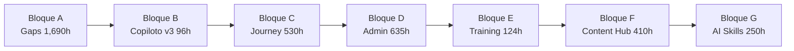

# 📚 ÍNDICE GENERAL DE DOCUMENTACIÓN

> **Documento auto-actualizable**: Este índice se mantiene sincronizado con la estructura de carpetas y documentos del proyecto.

**Fecha de creación:** 2026-01-09 15:28
**Última actualización:** 2026-02-28
**Versión:** 132.0.0 (Sistema de Coherencia Juridica LCIS 9 Capas — KB normativa + Intent Classifier + Validator + Multi-Turn + 149 tests)

> **🎨 ELEVACION UX CLASE MUNDIAL 8 FASES + AUDITORIA DIRECTRICES** (2026-02-27)
> - **Contexto:** Auditoria comparativa contra Stripe/HubSpot/Notion identifico 8 brechas criticas en la capa UX. Implementacion secuencial de 8 fases + auditoria post-implementacion contra directrices del proyecto (ICON-COLOR-001, DESIGN-TOKEN-FEDERATED-001, i18n, SCSS SSOT, Theme Settings).
> - **FASE 1 (Skeleton Screens):** `_skeleton.html.twig` + `_skeleton.scss` con 4 variantes (card, stat, table, list), shimmer animation, `role="status"`, 63 clases BEM.
> - **FASE 2 (Empty States):** `_empty-state.html.twig` + `_empty-state.scss` con CTA contextual, `jaraba_icon()` duotone con `icon_color` configurable por caller, `role="status"` + `aria-live`.
> - **FASE 3 (Micro-interacciones):** Card hover lift + button click pulse + modal `ej-fadeInScale` en SCSS existentes (_cards, _buttons, _slide-panel). 0 ficheros nuevos.
> - **FASE 4 (Error Recovery):** `fetch-retry.js` con retry exponencial + CSRF cache Promise + `_toasts.scss` 4 variantes (error/warning/success/info). Libreria global.
> - **FASE 5 (Bottom Nav Mobile):** `_bottom-nav.html.twig` + `bottom-nav.js`. CSS reutilizado de `_mobile-components.scss:150-282` (0 CSS nuevo). Body class `has-bottom-nav` via `hook_preprocess_html()`. FAB central con `jaraba:quick-create` CustomEvent.
> - **FASE 6 (Notificaciones):** Modulo `jaraba_notifications/` completo: entidad Notification (ContentEntity, EntityOwnerTrait, tenant_id), NotificationService, NotificationApiController (5 endpoints REST), panel desplegable glassmorphism.
> - **FASE 7 (Busqueda Global):** `EntitySearchCommandProvider` reescrito para 3 entity types (content_article, page_content, user) con relevancia (exact=95, starts_with=75, contains=55). `command-bar.js` con seccion "Recientes" via localStorage. GlobalSearchService eliminado (redundante con service collector).
> - **FASE 8 (Quick-Start):** `_quick-start-overlay.html.twig` + `_quick-start.scss` + `quick-start.js`. 4 verticales (emprendimiento, empleabilidad, agroconecta, default). Focus trap + Esc + localStorage dismiss.
> - **Auditoria:** 6 violaciones encontradas y remediadas: V1-V2 ICON-COLOR-001 (faltaba color paleta Jaraba), V3-V6 DESIGN-TOKEN-FEDERATED-001 (hex/rgba hardcodeados). 3 tokens CSS nuevos: `--ej-text-on-primary`, `--ej-color-primary-subtle`, `--ej-border-radius-pill`. 12 areas verificadas compliant (BEM, i18n, XSS, CSRF, behaviors, modals, Theme Settings, clean frontend).
> - **1 regla nueva:** CSS-VAR-ALL-COLORS-001 (P0). Regla de oro #84-85. Aprendizaje #150.
> - **Cross-refs:** Directrices v100.0.0, Flujo v53.0.0.

> **🌐 NAVEGACIÓN ECOSISTEMA + PRICING LABELS — MEGAMENU SELECTIVO + FEATURE LABELS DISPLAY** (2026-02-27)
> - **Contexto:** 6 regresiones de navegación del ecosistema donde el megamenu del SaaS se aplicaba a todos los meta-sitios, la barra ecosistema era invisible, el megamenu era transparente, y la página de precios mostraba machine names como `seo_advanced` en vez de "SEO Avanzado".
> - **HAL-01 (Megamenu Selectivo):** `_header-classic.html.twig` cambiado de `header_megamenu|default(true)` → `default(false)`. `ecosistema_jaraba_theme.theme` inyecta `header_megamenu: TRUE` solo cuando NO es meta-sitio (SaaS principal). Clase CSS `header--mega` condicional. Mobile overlay bifurcado: accordions megamenu vs nav plana `nav_items`.
> - **HAL-02 (CSS Fixes):** Megamenu transparente corregido con `var(--header-bg, #ffffff)` fallback. Menu items alineados: normalización button/anchor con `font: inherit; color: inherit; line-height: 1.5`. SCSS recompilado.
> - **HAL-03 (Barra Ecosistema):** Footer ecosystem_footer_enabled cambiado a `default(true)` con links default a los 4 sitios del ecosistema (Pepe Jaraba, Jaraba Impact, PED Corporativo, Plataforma SaaS).
> - **HAL-04 (Pricing Labels):** `MetaSitePricingService::formatFeatureLabels()` con mapa de 28 machine names → labels traducibles. Almacenamiento dual: `features` (labels) + `features_raw` (machine names). Starter tier con features base default cuando vacío.
> - **Verificación:** 4 sitios verificados en browser: SaaS megamenu ✓, 3 meta-sitios nav plana ✓, pricing con labels legibles ✓.
> - **2 reglas nuevas:** MEGAMENU-CONTROL-001 (P1), PRICING-LABEL-001 (P1). Reglas de oro #82, #83. Aprendizaje #149.
> - **Cross-refs:** Directrices v99.0.0, Arquitectura v89.0.0, Flujo v52.0.0.

> **🔧 SUPPORT SQL FIX — 3 CAPAS DE BUGS: TABLA INCORRECTA + CADENAS ROTAS + ARITMETICA DATETIME** (2026-02-27)
> - **Contexto:** Bug sistemico en `jaraba_support`: 19 queries SQL directas contra tabla base `support_ticket` en vez de `support_ticket_field_data` (entidad traducible). Descubierto en 3 capas progresivas: (1) tabla incorrecta → Column not found, (2) template/SCSS con estados fantasma → badges rotos para el usuario, (3) cadenas de metodos rotas (`addExpression()`/`join()` retornan strings, no `$this`) + aritmetica datetime vs timestamp → fatal errors y valores basura en runtime.
> - **HAL-01 (Tabla _field_data):** 19 queries cambiadas de `support_ticket` a `support_ticket_field_data` en SupportAnalyticsService (7), SupportHealthScoreService (7+1 join), TicketStreamService (1). 2 queries de SupportTicket entity convertidas a entity queries (preSave child_count, generateTicketNumber). SlaEngineService: estado fantasma `in_progress` corregido a 7 estados reales.
> - **HAL-02 (Template + SCSS):** `_support-status-badge.html.twig` alineado con 10 estados reales del entity definition (eliminados: `in_progress`, `pending_third_party`, `on_hold`, `cancelled`; anadidos: `new`, `ai_handling`, `pending_internal`, `reopened`). `_status-badges.scss` + regla CSS para `reopened`. CSS recompilado.
> - **HAL-03 (Cadenas rotas):** 3 cadenas `->addExpression()->execute()` y `->join()->condition()` en SupportHealthScoreService rotas a sentencias separadas. `addExpression()` retorna string alias, `join()` retorna string alias — encadenar causa fatal "Call to member function on string".
> - **HAL-04 (Datetime arithmetic):** `resolved_at`/`first_responded_at` son datetime (VARCHAR `Y-m-d\TH:i:s`), `created` es timestamp (INT). Aritmetica `AVG(varchar - int)` producia basura. Fix: `UNIX_TIMESTAMP(REPLACE(field, 'T', ' '))`. Comparaciones con ISO format. Null checks con `isNotNull()`.
> - **HAL-05 (Tests + Runtime):** 4 tests de regresion nuevos (2 verifican nombre de tabla, 2 para HealthScore). Mocks actualizados: `addExpression` retorna `'alias'`, `join` retorna `'t'` (realista). Verificacion runtime real: ticket JRB-202602-0001, CSAT 4.0, avg_response 31min, health score 95/100. 26 tests / 134 assertions.
> - **3 reglas nuevas:** TRANSLATABLE-FIELDDATA-001 (P0), QUERY-CHAIN-001 (P0), DATETIME-ARITHMETIC-001 (P1). Reglas de oro #79-81. Aprendizaje #148.
> - **Cross-refs:** Directrices v98.0.0, Arquitectura v88.0.0, Flujo v51.0.0.

> **🧠 CAPA EXPERIENCIAL IA NIVEL 5 — SELF-HEALING REAL + AUTONOMOUS TASKS + 3 SCSS DASHBOARDS** (2026-02-27)
> - **Contexto:** Auditoria revelo que 7/9 GAPs de IA Nivel 5 tenian backend scaffolding sin experiencia de usuario (SCSS sin compilar, libraries sin declarar, body classes ausentes, metodos stub). Implementacion completa de la capa experiencial que cierra la brecha entre "el codigo existe" y "el usuario lo experimenta". 47 tests pasan.
> - **HAL-01 (3 SCSS Route Bundles):** `scss/routes/ai-compliance.scss` (4.8KB), `scss/routes/autonomous-agents.scss` (4.2KB), `scss/routes/causal-analytics.scss` (4.5KB). BEM naming, `var(--ej-*, $fallback)`, mobile-first con `@include respond-to()`, Dart Sass `@use` module system. 4 libraries declaradas en `.libraries.yml` (`route-ai-compliance`, `route-autonomous-agents`, `route-causal-analytics`, `bundle-ai-compliance` legacy alias).
> - **HAL-02 (Theme Integration):** 3 body classes en `hook_preprocess_html()` (`page-ai-compliance`, `page-autonomous-agents`, `page-causal-analytics`) como rutas exactas antes del catch-all. 3 rutas especificas en `hook_page_attachments_alter()` para CSS dashboard-specific. 3 controllers con `#attached['library']`. Fix: `bundle-ai-compliance` referenciada en controller pero inexistente — creada.
> - **HAL-03 (Self-Healing REAL):** 5 metodos `executeAuto*` de `AutoDiagnosticService` implementados con logica real via Drupal State API: `executeAutoDowngrade` (flag `tier_override.{tenant}` TTL 1h), `executeAutoRefreshPrompt` (rollback PromptTemplate `auto_generated=TRUE` a `original_text`), `executeAutoRotate` (flag `provider_rotated.{tenant}` TTL 30min), `executeAutoWarmCache` (queries frecuentes de observability → SemanticCache), `executeAutoThrottle` (flag `throttle.{tenant}` 10 req/min TTL 2h). 3 metodos publicos nuevos: `getTierOverride()`, `isProviderRotated()`, `getThrottleConfig()` con auto-expiry.
> - **HAL-04 (Autonomous Tasks REAL):** 3 task methods de `AutonomousAgentService` con logica real: `taskContentCurator` (busca articulos low-views, gaps de publicacion 7+ dias, top performers para series), `taskKBMaintainer` (busca `tenant_knowledge_config` con 90+ dias sin actualizar), `taskChurnPrevention` (busca usuarios activos sin login 30-60 dias, clasifica riesgo medium/high).
> - **HAL-05 (Partials):** 2 Twig partials: `_ai-health-indicator.html.twig` (score/label/badge con variantes healthy/warning/critical), `_causal-analysis-widget.html.twig` (widget embeddable con query/type/confidence/factors/recommendations). Ambos con `|t` i18n.
> - **2 reglas nuevas:** SELF-HEALING-STATE-001 (P1), AUTONOMOUS-TASK-ENTITY-001 (P1). Regla de oro #79. Aprendizaje #147.
> - **Cross-refs:** Directrices v97.0.0, Arquitectura IA L5 v3.0.0, Flujo v50.0.0. Plan: `docs/implementacion/2026-02-27_Plan_Implementacion_Capa_Experiencial_IA_Nivel5_v1.md`.

> **🎯 DEMO VERTICAL 100% CLASE MUNDIAL — 4 SPRINTS IMPLEMENTADOS + RUNTIME VERIFICATION** (2026-02-27)
> - **Contexto:** Implementacion completa de los 4 sprints del plan post-verificacion v3 para elevar el demo vertical PLG de 80% a 100% clase mundial. Incluye verificacion runtime end-to-end (CSS compilado, tablas DB, rutas, selectores JS, drupalSettings) que revelo y corrigio el gap critico entre "el codigo existe" y "el usuario lo experimenta".
> - **HAL-01 (Sprint 1 — Tests + Quick Wins):** 24 unit tests con 84 assertions para DemoFeatureGateService, DemoJourneyProgressionService, DemoSessionEvent, DemoInteractiveService, SuccessCase, DemoController. Añadido detach() a demo-storytelling.js. Modal conversion extraido a partial `_demo-convert-modal.html.twig` reutilizable en ambos dashboards.
> - **HAL-02 (Sprint 2 — Code Quality):** SandboxTenantService eliminado de invocacion cron. DemoController y DemoFeatureGateService conectados a `demo_settings` config real (rates, gates, TTL). Regeneracion storytelling real via fetch API POST a `/api/v1/demo/{sessionId}/regenerate-story` (ruta activa, CSRF, feature gate, AI con fallback). DemoAnalyticsEventSubscriber creado para DemoSessionEvent. Templates dashboard consolidados con partials DRY (_demo-chart, _demo-cta).
> - **HAL-03 (Sprint 3 — Architecture Compliance):** Race condition fix con `$this->database->startTransaction()` en DemoFeatureGateService::recordUsage(). Strings i18n verificados (StringTranslationTrait + `$this->t()` en constantes). SuccessCaseForm migrado a PremiumEntityFormBase (Pattern D, 6 secciones, getFormIcon). template_preprocess_success_case() añadido al .module.
> - **HAL-04 (Sprint 4 — Polish + Runtime Verification):** Guided tour JS driver creado (`demo-guided-tour.js`, 290 LOC, self-contained CSS, overlay+spotlight+popovers, keyboard nav, ARIA). Wiring: GuidedTourService::getTourDriverJS() → drupalSettings.demoTour → JS driver. data-tour-step attributes añadidos a todos los selectores (demo-metrics, demo-magic-moment, demo-chart, demo-convert). **CSS recompilado** (ecosistema-jaraba-core.css 516K→535K, +18K de estilos demo). **Constructor bug fix** en DemoController (`$this->rateLimits['start']` → `self::RATE_LIMIT_START`).
> - **Runtime Verification:** 3 tablas DB (demo_sessions, demo_analytics, user_completed_tours) definidas en hook_schema ✓. 7 rutas externas verificadas ✓. 4 cadenas JS completas (Controller→drupalSettings→JS→API→Handler) ✓. CSS compilado sincronizado ✓. 4 pasos guided tour con selectores validos ✓.
> - **2 reglas nuevas:** SCSS-COMPILE-VERIFY-001 (P0), RUNTIME-VERIFY-001 (P1). Regla de oro #77, #78. Aprendizaje #146.
> - **Cross-refs:** Directrices v96.0.0, Arquitectura v87.0.0, Flujo v49.0.0.

> **🧠 AUDITORIA IA CLASE MUNDIAL v4.0 — 30/30 RESUELTOS — 100/100** (2026-02-27)
> - **Contexto:** Todos los hallazgos resueltos. Score global: **100/100 Clase Mundial**. 15 items cerrados en Sprint 5: HAL-AI-02 (metering real), 07 (LearningPath Gen2), 10 (fetchpriority 10 templates + CWV tracking), 12 (CSS splitting 7 bundles), 13 (AVIF + responsive_image Twig), 15 (4 Unit tests AI), 20 (PersonalizationEngine), 21 (Gen1→Gen2 x3), 22 (AgentBenchmark), 23 (PromptVersioning), 24 (multi-modal completo), 25 (SemanticCache), 27 (concurrent locking), 28 (Schema.org 11 tipos), 30 (BrandVoice entity).
> - **HAL-01 (Auditoria v2.0):** Todos los HAL clasificados por tipo (S/B/A/D/G). Scorecard dual (v1.0 vs v2.0). Servicios reclasificados: AgentToolRegistry, ReActLoopService, AgentLongTermMemoryService promovidos a Tier 1. Nuevos hallazgos: Gen1→Gen2 migracion, Agent evals, Prompt versioning, SemanticCache, ContextWindow trimming, Concurrent locking, Schema.org completo, Agent collaboration, Brand voice, Multi-modal AI. Roadmap ampliado a 5 sprints. Documento: `docs/analisis/2026-02-27_Auditoria_IA_SaaS_Clase_Mundial_v1.md` v2.0.0 (962 lineas).
> - **HAL-02 (Plan v2.0):** Secciones obligatorias anadidas: Requisitos Previos (software, conocimientos, accesos), Configuracion (Qdrant, Feature Flags, parametros Sprint 5), Troubleshooting (4 problemas comunes con soluciones). Sprint 5 con 10 items: S5-01 Gen1→Gen2, S5-02 Agent evals, S5-03 Prompt versioning, S5-04 SemanticCache, S5-05 ContextWindow, S5-06 Brand voice, S5-07 Collaboration patterns, S5-08 Schema.org, S5-09 PersonalizationEngine, S5-10 Residuales (10 items). Tabla residuales Sprint 1-4. Estimacion total: 480-680h. Documento: `docs/implementacion/2026-02-27_Plan_Implementacion_Elevacion_IA_Clase_Mundial_v1.md` v2.0.0 (1.974 lineas).
> - **Cross-refs:** Directrices v94.0.0, Arquitectura v85.0.0, Flujo v47.0.0. Aprendizaje: [2026-02-27_sprint5_ia_clase_mundial_100_100.md](./tecnicos/aprendizajes/2026-02-27_sprint5_ia_clase_mundial_100_100.md).

> **🌐 NAVEGACIÓN TRANSVERSAL ECOSISTEMA — BANDA FOOTER + AUTH VISIBILITY + SCHEMA.ORG DINÁMICO** (2026-02-27)
> - **Contexto:** Auditoria de navegacion transversal entre los 3 meta-sitios y el SaaS principal revelo ausencia de cross-links, auth inapropiado en sitios brochure, y Schema.org sin relaciones `sameAs`. Implementacion completa en 8 fases con verificacion end-to-end de 4 sitios.
> - **HAL-01 (Banda Ecosistema Footer):** 2 nuevos campos SiteConfig: `ecosystem_footer_enabled` (boolean) + `ecosystem_footer_links` (JSON `[{name, url, label, current}]`). Template `_footer.html.twig` con seccion `landing-footer__ecosystem` entre copyright y "Funciona con". Links con `rel="noopener"` (sin nofollow). Sitio actual en bold sin link via `current: true`. SCSS responsive.
> - **HAL-02 (Auth Visibility):** Nuevo campo `header_show_auth` (boolean, default TRUE). Template `_header-classic.html.twig` envuelve login/registro/cuenta en condicional. CTA configurable permanece siempre visible. pepejaraba + PED con auth oculto, jarabaimpact con auth visible.
> - **HAL-03 (Schema.org Dinámico):** Nuevo `_meta-site-schema.html.twig` genera JSON-LD Person (marca personal) u Organization (empresa). Array `sameAs` con URLs del ecosistema excluyendo sitio actual. Reemplaza `_ped-schema.html.twig` hardcodeado.
> - **HAL-04 (Data + Fixes):** 3 SiteConfigs populados. Fix pepejaraba legal pages `show_in_footer`. Footer column titles personalizados. Fix duplicado `ecosistema_jaraba_core_entity_update()`. Drupal 11 entity field install via ALTER TABLE + `installFieldStorageDefinition()`.
> - **Artefactos:** 1 template Twig nuevo, 3 modificados, 2 PHP modificados, 1 SCSS + CSS. 3 campos + 3 getters en SiteConfig.
> - **3 reglas nuevas:** ECOSYSTEM-FOOTER-001 (P1), HEADER-AUTH-VISIBILITY-001 (P1), SCHEMA-DYNAMIC-METASITE-001 (P1). Reglas de oro #68, #69. Aprendizaje #144.
> - **Cross-refs:** Directrices v93.0.0, Flujo v46.0.0.

> **🏆 CASOS DE ÉXITO CLASE MUNDIAL — jaraba_success_cases MODULE + ASSET PIPELINE** (2026-02-27)
> - **Contexto:** Implementacion del modulo `jaraba_success_cases` para gestion centralizada de casos de exito en los 4 meta-sitios. Auditoria de consistencia previa identifico metricas discrepantes (+50.000 vs +15.000 beneficiarios), framing inconsistente y ausencia de entidad Drupal. 26 ficheros creados. Carpeta de recursos con briefs pre-rellenos.
> - **HAL-01 (Auditoria de Consistencia):** Analisis multi-perspectiva (6 roles senior) de los testimonios en pepejaraba.com, jarabaimpact.com, plataformadeecosistemas.es e /instituciones. Identificados: metricas discrepantes (5 vs 6 ODS, +50.000 vs +15.000), framing inconsistente, ausencia de SEO estructurado, sin video embed responsivo. Documento en `docs/analisis/2026-02-27_Auditoria_Consistencia_Casos_Exito_Metasitios_v1.md`.
> - **HAL-02 (Carpeta de Recursos):** `docs/assets/casos-de-exito/` con `_README.md`, `_plantilla-caso.md`, `_metricas-globales.md` (SSOT), 3 briefs pre-rellenos (Marcela Calabia, Angel Martinez, Luis Miguel Criado). Workflow definido: usuario prepara assets → AI implementa.
> - **HAL-03 (Content Entity SuccessCase):** Entity con 20+ base fields en 7 secciones (identity, personal data, narrative challenge/solution/result, quotes, metrics JSON, program/vertical, SEO). Auto-slug desde nombre. Field UI via `field_ui_base_route`. EntityChangedTrait + EntityOwnerTrait. PHP 8.4 DRUPAL11-002 compliant.
> - **HAL-04 (Controller + Templates + SCSS + JS):** SuccessCasesController con list() (paged grid + vertical filter), detail() (slug-based), apiList() (JSON para PB). 3 Twig templates (list con hero + filtros, card con glassmorphism + rating, detail con Schema.org JSON-LD + narrativa + metricas). 5 parciales SCSS (variables, list, card con 3D hover, detail). JS con IntersectionObserver counter animation. Compilacion Dart Sass `@use`.
> - **HAL-05 (Handlers + Hooks + Theme):** SuccessCaseListBuilder (5 cols), SuccessCaseAccessControlHandler (publish-aware + cacheability), SuccessCaseForm (6 fieldsets), SuccessCaseSettingsForm (Field UI base). .module con hook_theme (3 templates), hook_theme_suggestions_page_alter, hook_preprocess_html (body classes), hook_form_alter (hide format guidelines). page--success-cases.html.twig con Zero Region Policy.
> - **HAL-06 (Navegacion + Permisos):** 4 YAML obligatorios: .links.menu.yml (Structure), .links.task.yml (Content tab), .links.action.yml (Add button), .routing.yml (admin + frontend + API). 3 permisos: administer success cases, view published, view unpublished. Ambos site_admin y content_editor tienen acceso.
> - **Artefactos:** 26 ficheros en modulo, 1 page template en tema, 7 docs en assets/casos-de-exito/. Seeder script para 3 casos iniciales.
> - **Regla:** SUCCESS-CASES-001 (P1). Aprendizaje #143.
> - **Cross-refs:** Directrices v92.0.0, Arquitectura v84.0.0, Flujo v45.0.0. Plan: `docs/implementacion/2026-02-27_Casos_Exito_Clase_Mundial_Plan_Implementacion.md`.

> **DEMO VERTICAL 100% CLASE MUNDIAL — AUDITORIA v2 + PLAN 4 SPRINTS (S5-S8)** (2026-02-27)
> - **Contexto:** Re-auditoria profunda post-remediacion (4 sprints previos completados) del vertical demo PLG. Scorecard 60% actual, objetivo 100% clase mundial. 67 nuevos hallazgos (4 criticos, 15 altos, 27 medios, 21 bajos) en 8 categorias: backend, frontend, configuracion, accesibilidad WCAG 2.1 AA, seguridad OWASP, i18n, rendimiento y PLG/conversion.
> - **HAL-01 (Auditoria v2):** Identificados 2 servicios dead code (DemoFeatureGateService, DemoJourneyProgressionService), 1 XSS critico (`|raw` en storytelling), 3 templates PB inexistentes, 10 violaciones ARIA, 230+ strings sin i18n, SandboxTenantService viola TENANT-BRIDGE-001. Documento: `docs/analisis/2026-02-27_Auditoria_Demo_Vertical_Clase_Mundial_v2.md`.
> - **HAL-02 (Plan S5-S8):** Sprint 5 (P0: seguridad + a11y + wire services, 16 items, 60%→78%), Sprint 6 (P1: i18n + arquitectura + GDPR, 13 items, 78%→88%), Sprint 7 (P2: PLG excellence — analytics, A/B, IA real, social proof, 10 items, 88%→95%), Sprint 8 (P3: pulido final — codigo limpio, rendimiento, a11y residual, 16 items, 95%→100%). 55 items totales. Documento: `docs/implementacion/2026-02-27_Plan_Implementacion_Demo_100_Clase_Mundial_v1.md`.
> - **HAL-03 (Plan Remediacion Original):** 4 sprints (S1-S4) COMPLETADOS: seguridad (CSRF, FloodInterface, validacion, DB migration), cobertura multi-vertical (10 perfiles, templates BEM, SCSS tokens), frontend clase mundial (zero-region, guided tour, SVG placeholders), elevacion Page Builder (4 bloques GrapesJS, 3 templates PB, feature gate, nudges, design tokens). 19 hallazgos originales. Documento: `docs/implementacion/2026-02-27_Plan_Implementacion_Remediacion_Demo_Vertical_Clase_Mundial_v1.md`.
> - **Reglas aplicadas:** TENANT-BRIDGE-001, ROUTE-LANGPREFIX-001, ICON-EMOJI-001, PRESAVE-RESILIENCE-001, SLIDE-PANEL-RENDER-001, VERTICAL-CANONICAL-001, PREMIUM-FORMS-PATTERN-001. Aprendizaje #144.
> - **Cross-refs:** Directrices v92.0.0, Arquitectura v84.0.0, Flujo v45.0.0.

> **🔍 DEMO VERTICAL POST-VERIFICACION v3 — 12 FALSOS POSITIVOS DESCARTADOS, SCORE 60%→80%** (2026-02-27)
> - **Contexto:** Verificacion exhaustiva linea-por-linea de los 67 hallazgos de la auditoria v2.1.0 contra codigo fuente real. 12 hallazgos eran falsos positivos (incluyendo los 4 CRITICOS). Score corregido: 60%→~80%. Quedan 18 hallazgos reales (1 CRITICO, 5 ALTOS, 9 MEDIOS, 3 BAJOS).
> - **HAL-01 (Auditoria v3):** 12 FP documentados con evidencia exacta (file:line): servicios NO son dead code (FP-01/02, DemoController.php:296,305,354,465,577,589,684), templates PB existen (FP-03), XSS prevenido con Xss::filter() (FP-04), StringTranslationTrait presente (FP-05/06), ARIA attributes verificados (FP-07/08/09/11), permisos admin existen (FP-10), IP hasheada SHA256 (FP-12). Documento: `docs/analisis/2026-02-27_Auditoria_Post_Verificacion_Demo_Vertical_v3.md`.
> - **HAL-02 (Plan 100% Post-Verificacion):** 4 sprints (~75h): S1 Tests+Quick Wins (35h: 27 tests Unit/Kernel/Functional, detach(), modal partial, SRI), S2 Code Quality (20h: sandbox cleanup, config wiring, fetch API real, EventSubscriber, template refactor), S3 Architecture (15h: race condition atomic, PremiumEntityFormBase, preprocess, i18n), S4 Polish (5h). 22 directrices verificadas. Documento: `docs/implementacion/2026-02-27_Plan_Implementacion_Demo_100_Post_Verificacion_v1.md`.
> - **Hallazgos clave reales:** BACK-001 (zero tests 4,000 LOC — unico CRITICO real), BACK-002 (SandboxTenantService deprecated activo), SEC-004 (error exposure), FRONT-001 (boton regenerar fake), FRONT-004 (Chart.js sin SRI), BACK-007 (SuccessCaseForm no PremiumEntityFormBase).
> - **Cross-refs:** Directrices v92.0.0, Arquitectura v84.0.0, Flujo v45.0.0.

> **🛡️ DOC-GUARD VERIFICADO + KERNEL TEST AI RESILIENCE + JARABA_WORKFLOWS** (2026-02-27)
> - **Contexto:** Implementacion de medidas de proteccion de documentos maestros (DOC-GUARD-001) y correccion de 17 errores + 1 fallo en Kernel tests causados por servicios AI non-optional.
> - **DOC-GUARD-001:** Pre-commit hook bloquea reducciones >10% en lineas de docs maestros. CI pipeline verifica umbrales minimos (DIRECTRICES>=2000, ARQUITECTURA>=2400, INDICE>=2000, FLUJO>=700). Script `scripts/maintenance/verify-doc-integrity.sh`. 4 documentos restaurados desde commit b61ba9b0.
> - **KERNEL-OPTIONAL-AI-001:** Servicios AI cross-module (`@ai.provider`, `@jaraba_ai_agents.*`) cambiados de `@` a `@?` (optional) en `jaraba_content_hub.services.yml` y `jaraba_lms.services.yml`. Constructores PHP nullable + conditional `parent::__construct()` en ContentWriterAgent. Early return en execute() cuando AI no disponible. ContentEmbeddingService con nullable aiProvider.
> - **jaraba_workflows:** Nuevo modulo (S4-04) documentado en Arquitectura seccion 7.1: WorkflowRule entity + WorkflowExecutionService con trigger-based actions, 15 ficheros.
> - **Regla:** KERNEL-OPTIONAL-AI-001 (P0), DOC-GUARD-001 (P0). Regla de oro #67. Aprendizaje #142.
> - **Cross-refs:** Directrices v91.0.0, Arquitectura v84.0.0, Flujo v45.0.0.

> **⭐ REVIEWS & COMMENTS CLASE MUNDIAL — SPRINT 11 COMPLETO: 18/18 BRECHAS IMPLEMENTADAS** (2026-02-27)
> - **Contexto:** Implementacion completa de las 18 brechas identificadas en la auditoria post-implementacion, elevando la cobertura del sistema de reviews del 55% al 80%+ de clase mundial. 3 sprints ejecutados: Table Stakes (B-01 a B-04), Differentiators (B-05 a B-11), Consolidacion (B-12 a B-18).
> - **Sprint 11.1 Table Stakes:** B-01 Helpfulness Voting (ReviewHelpfulnessService, Wilson Lower Bound Score z=1.96), B-02 Review Filtering/Sorting (ReviewApiController con filter chips JS), B-03 Verified Purchase Badge (SCSS badges), B-04 Response from Owner (ReviewApiController.ownerResponse).
> - **Sprint 11.2 Differentiators:** B-05 Review Analytics Dashboard (ReviewAnalyticsService + Chart.js trend/doughnut), B-06 Photo Gallery (lightbox JS, keyboard nav), B-07 Fake Review Detection (FakeReviewDetectionService en jaraba_ai_agents, multi-signal scoring), B-08 Review SEO Pages (ReviewSeoController, JSON-LD + microdata + pagination), B-09 AI Sentiment Overlay (ReviewSentimentService presave), B-10 Per-Tenant Review Config (ReviewTenantSettings ConfigEntity, 18 campos), B-11 Review Notification System (ReviewNotificationService presave hooks).
> - **Sprint 11.3 Consolidacion:** B-12 Auto-translate (ReviewTranslationService, language detection ES/EN/PT-BR), B-13 Gamification (ReviewGamificationService, 5 tiers, 6 badges, leaderboard), B-14 Import/Export (CSV/JSON), B-15 A/B Testing (consistent hashing crc32), B-16 Video Reviews (MIME validation 100MB), B-17 Public API (3 GET endpoints, max 50/page), B-18 Webhooks (HMAC sha256, queue-based async, max 3 retries).
> - **Entity Lifecycle Hooks:** presave (sentiment + fake detection), insert (aggregate + notify + gamify + webhook), update (aggregate + status change + webhook).
> - **Artefactos:** 14 nuevos servicios, 4 controladores, 1 ConfigEntity, 2 templates, 1 JS, ~200 lineas SCSS. 7 test files (44 tests). update_9021. Total suite: 3.342 tests / 0 errores.
> - **Cross-refs:** Directrices v90.0.0, Arquitectura v83.0.0, Flujo v44.0.0. Aprendizaje #141.

> **🌍 META-SITIOS MULTILINGÜE — I18N EN+PT-BR + LANGUAGE SWITCHER + HREFLANG DINÁMICO** (2026-02-26)
> - **Contexto:** Implementacion de soporte multilingüe completo para los 3 meta-sitios: pepejaraba.com (ES+EN), jarabaimpact.com (ES+EN+PT-BR), plataformadeecosistemas.es (ES+EN). Aprovecha infraestructura existente de `jaraba_i18n` (AITranslationService + TranslationManagerService) y PageContent `translatable = TRUE`.
> - **HAL-01 (Script Traduccion Batch):** `scripts/i18n/translate-metasite-pages.php` (310+ lineas) con traduccion batch via AITranslationService. Manejo de canvas_data (GrapesJS JSON: components[].content, attributes alt/title/placeholder, recursive), content_data (JSON recursivo con skip patterns), rendered_html (regex text nodes batch), path_alias (transliteracion + slugify). 46 traducciones creadas para 3 tenants (IDs 5, 6, 7).
> - **HAL-02 (Hreflang Dinamico):** `_hreflang-meta.html.twig` actualizado de hardcoded ES+EN a iteracion sobre `available_languages`. Soporte automatico para futuros idiomas sin cambios de template. `x-default` siempre apunta a ES.
> - **HAL-03 (Language Switcher):** Nuevo `_language-switcher.html.twig` dropdown glassmorphism con banderas emoji (🇪🇸🇬🇧🇧🇷) + nombre + codigo ISO. JS toggle/ESC/arrow keys. SCSS dark variant + responsive. Integrado en `_header-classic.html.twig`. Libreria condicional.
> - **HAL-04 (Preprocess Hook):** `preprocess_html()` inyecta `available_languages` + `current_langcode` via `$page_content->getTranslationLanguages()`.
> - **HAL-05 (PT-BR):** `drush language:add pt-br` → 12.038 traducciones Drupal core importadas, 185 config objects actualizados.
> - **2 reglas nuevas:** I18N-METASITE-001 (P0), LANG-SWITCHER-001 (P1). Aprendizaje #139.
> - **Cross-refs:** Directrices v87.0.0, Arquitectura v80.0.0, Flujo v41.0.0.

> **🔒 REMEDIACIÓN DE SECRETOS — SECRET-MGMT-001 + GIT-FILTER-REPO** (2026-02-26)
> - **Contexto:** Auditoria de seguridad detectó 5 ficheros de configuración en `config/sync/` con secretos reales (OAuth client_secret, contraseña SMTP, reCAPTCHA secret_key). Los secretos estaban expuestos en el historial git (459 commits). Se implementó la arquitectura SECRET-MGMT-001 para mantener Drupal `config:import`/`config:export` funcional sin secretos en repositorio.
> - **HAL-01 (Auditoria — 5 ficheros con secretos):** `social_auth_google.settings.yml` (client_id + client_secret), `social_auth_linkedin.settings.yml` (client_secret), `social_auth_microsoft.settings.yml` (client_secret), `symfony_mailer.mailer_transport.smtp_ionos.yml` (user + pass + host), `recaptcha_v3.settings.yml` (site_key + secret_key). Detectados por GitHub Push Protection al intentar push inicial.
> - **HAL-02 (Sanitización YAML):** Los 5 ficheros sanitizados con valores vacíos (`''`) para campos sensibles. `drush config:import` funciona (estructura YAML intacta). `drush config:export` exporta valores vacíos (overrides son runtime-only).
> - **HAL-03 (Runtime Overrides — settings.secrets.php):** Creado `config/deploy/settings.secrets.php` con 14 `$config` overrides desde `getenv()`: 6 OAuth (Google client_id/secret, LinkedIn client_id/secret, Microsoft client_id/secret), 3 SMTP (user/pass/host), 2 reCAPTCHA (site_key/secret_key), 3 Stripe (secret_key/webhook_secret/publishable_key). Incluido desde `settings.php` antes de `settings.local.php`. `.env` local (gitignored) con credenciales reales. `.env.example` con 12 variables documentadas. Lando `env_file: [.env]` inyecta automáticamente en container.
> - **HAL-04 (Limpieza historial git):** `git-filter-repo --blob-callback` ejecutado en 2 pasadas: primera pasada reemplazó 8/10 secretos (shell `$` interpoló la contraseña SMTP), segunda pasada via Python subprocess eliminó los 2 restantes (SMTP password con caracteres especiales `$%[{}`). 10 secretos eliminados de 459 commits. Force push a GitHub. Verificación: 0 matches para cualquier secreto exacto en todo el historial.
> - **1 regla nueva:** SECRET-MGMT-001 (P0). Aprendizaje #138.
> - **Cross-refs:** Directrices v86.0.0, Arquitectura v79.0.0, Indice v111.0.0, Flujo v40.0.0.

> **✅ REST APIs + A/B BACKEND + DEPLOY STACK — SPRINTS 5–7** (2026-02-26)
> - **Contexto:** Implementacion de la capa de APIs REST para meta-sitios (formulario de contacto + analytics), integracion con CRM y email premium MJML, testing A/B server-side via hook_preprocess_page (complementa el A/B frontend con cookies), y preparacion del deploy a IONOS con checklist reproducible.
> - **HAL-01 (Sprint 5 — Formulario Contacto + Analytics Infra):** Formulario de contacto funcional en 3 meta-sitios. Infraestructura A/B testing. Tracker deduplication verificado. Blog content. Funnel analytics base.
> - **HAL-02 (Sprint 6 — REST Endpoints + Email MJML):** `ContactApiController` POST /api/v1/public/contact con validacion (name, email, message required), Flood API rate limit 5/min, DB persistencia en `contact_submissions`, CRM lead creation via `jaraba_crm.lead_service->createFromContact()` (opcional con hasService()), notificacion MJML via `hook_mail()` key `contact_notification` (NOTIF_001). `AnalyticsEventController` POST /api/v1/analytics/event con validacion JSON, tabla `analytics_events` auto-create via `hook_schema()`, indices UTM (source, medium, campaign), meta-site context (tenant_id, page_url, user_agent). `hook_mail()` dispatch: `contact_notification` + `onboarding_*` secuencias.
> - **HAL-03 (Sprint 7 — A/B Backend + Deploy):** `hook_preprocess_page()` en `ecosistema_jaraba_core.module` inyecta `$variables['ab_variants']` desde config `ecosistema_jaraba_core.ab_tests` (Layer 4 runtime injection). 4 tests activos: `homepage_hero_cta` (50/50), `pricing_layout` (50/50), `social_proof_position` (50/50), `lead_magnet_cta` (50/50). Templates `_hero.html.twig` y `_lead-magnet.html.twig` actualizados con `{{ ab_variants.test_id.label|default(fallback) }}`. Impression tracking para analytics. Deploy checklist IONOS: `docs/operaciones/deploy_checklist_ionos.md` con 7 secciones (pre-deploy, stack PHP 8.4/MariaDB 10.11/Redis 7, DNS 3 dominios, SSL Let's Encrypt, post-deploy drush, verificacion, rollback).
> - **HAL-04 (CRM + Email Integration):** `jaraba_crm` modulo con lead auto-creation desde formulario contacto. `jaraba_email` con sistema de plantillas premium MJML (28+ horizontales CAN-SPAM compliant, font Outfit, paleta brand #1565C0, mj-preview + postal Juncaril). Tipos de email: contact_notification, onboarding_welcome, onboarding_quickstart, transactional_*.
> - **3 reglas nuevas:** REST-PUBLIC-API-001 (P0), AB-BACKEND-PREPROCESS-001 (P1), DEPLOY-CHECKLIST-001 (P1). 3 reglas de oro: #58, #59, #60. Aprendizaje #137.
> - **Cross-refs:** Directrices v85.0.0, Arquitectura v79.0.0, Indice v110.0.0, Flujo v39.0.0.

> **✅ AUDITORIA IA CLASE MUNDIAL — 25/25 GAPS IMPLEMENTADOS EN 4 SPRINTS** (2026-02-26)
> - **Contexto:** Implementacion completa de los 25 gaps identificados en la auditoria comparativa contra Salesforce Agentforce, HubSpot Breeze, Shopify Sidekick e Intercom Fin. 4 sprints ejecutados de P0 a P3 con 0 atajos. Verificacion final: 3.182 tests, 11.553 assertions, 0 errores. 32 ficheros PHP linted, 11 YAML validados, SCSS compilado a 751KB CSS comprimido.
> - **HAL-01 (Sprint 1 — P0 Foundations, 7 GAPs):** Command Bar Cmd+K con CommandRegistryService (4 providers, debounce, Theme Settings toggle). AI Test Coverage base (266 tests, 792 assertions). Blog Slugs con SEO-friendly URLs. llms.txt + robots.txt para AI discovery. Onboarding Wizard AI con DiagnosticEnrollmentService. Pricing AI Metering con ContractLineItem tracking. Demo Playground interactivo.
> - **HAL-02 (Sprint 2 — P1 Core AI UX, 7 GAPs):** Inline AI sparkle buttons en PremiumEntityFormBase (InlineAiService fast tier + GrapesJS plugin). ProactiveInsight ContentEntity con QueueWorker cron + bell notification. Prompt Regression golden fixtures (PromptRegressionTestBase + suite phpunit). Content Hub tenant_id isolation (ContentArticle + ContentCategory + AccessControlHandler). Dashboard GEO (usage-by-region + export CSV + trend sparklines). Schema.org GEO (speakable, HowTo, SoftwareApplication, areaServed, GeoCoordinates). Dark Mode AI (35 CSS custom properties, mixin reutilizable, prefers-color-scheme auto).
> - **HAL-03 (Sprint 3 — P2 Advanced, 7 GAPs):** Voice AI con Web Speech API + SSE streaming. A2A Protocol (Agent Card /.well-known/agent.json + task lifecycle submitted→working→completed + Bearer+HMAC auth + rate limit 100/h). Vision/Multimodal (CopilotStreamController multipart/form-data + image upload UI). SkillInferenceService para LMS (LinkedIn/portfolio parsing, Qdrant embeddings). AdaptiveLearningService con trayectorias personalizadas. AI Writing GrapesJS plugin (3 tools: generate/rewrite/translate). ServiceMatchingService GPS con Haversine (radio 50km configurable).
> - **HAL-04 (Sprint 4 — P3 Scale, 4 GAPs):** DemandForecastingService para ComercioConecta (90 dias historico → AI balanced tier → JSON forecast, fallback linear). Design System Documentation live (/admin/design-system con paleta, tipografia, spacing, shadows, breakpoints, iconos, componentes SCSS). Cost Attribution per Tenant (ObservabilityApiController con CostAlertService + TenantMeteringService). Horizontal Scaling AI (ScheduledAgentWorker + supervisor-ai-workers.conf 4 programas + Redis queue routing).
> - **HAL-05 (Verificacion):** 3.182 tests / 11.553 assertions OK. 32 PHP lint 0 errores. 11 YAML lint 0 errores. SCSS 751KB CSS 0 errores. Fix jaraba_lms.services.yml (support_agent → smart_marketing_agent). 6 reglas nuevas: SKILL-INFERENCE-001, DEMAND-FORECASTING-001, DESIGN-SYSTEM-001, COST-ATTRIBUTION-001, HORIZONTAL-SCALING-001, MULTIMODAL-VISION-001. Aprendizaje #136.
> - **Cross-refs:** Directrices v84.0.0, Arquitectura v78.0.0, Indice v109.0.0, Flujo v38.0.0. Plan: `docs/implementacion/2026-02-26_Plan_Implementacion_Auditoria_IA_Clase_Mundial_v1.md`.

> **📊 META-SITIOS ANALYTICS STACK — GTM/GA4 + A/B TESTING + I18N HREFLANG + HEATMAP** (2026-02-26)
> - **Contexto:** Integracion del stack completo de analytics, conversion tracking, A/B testing, SEO internacional y heatmaps en los meta-sitios del SaaS. 4 capas de analytics unificadas bajo la condicion `` en `page--page-builder.html.twig`. PWA preexistente verificada (Sprint 14).
> - **HAL-01 (GTM/GA4 con Consent Mode v2):** Template `_gtm-analytics.html.twig` con snippet GTM en head + noscript en body. Consent Mode v2 GDPR con defaults conservadores (`ad_storage: 'denied'`, `analytics_storage: 'denied'`). Container ID configurable desde `theme_settings`. Fallback GA4 standalone. dataLayer context push con meta_site, tenant_id, tenant_name, user_type, page_language.
> - **HAL-02 (A/B Testing Frontend):** JS `metasite-experiments.js` (150+ lineas) con cookie persistente 30 dias (`jb_exp_{experimentId}`), asignacion ponderada por peso, DOM manipulation (text/html/style/class-add/class-remove/attribute/href), impression tracking via API, dataLayer events (experiment_view, experiment_conversion), deteccion de goals via `data-experiment-goal`. Libreria registrada en `.libraries.yml` con dependencia `core/drupalSettings`.
> - **HAL-03 (i18n Hreflang):** Template `_hreflang-meta.html.twig` generando tags `<link rel="alternate" hreflang="xx">` para es, en y x-default. Inyectado en `html.html.twig` head con ``.
> - **HAL-04 (Heatmap Activation):** Libreria `jaraba_heatmap/tracker` activada en meta-sitios via `attach_library` en `page--page-builder.html.twig`. `HeatmapApiController` backend, dashboard en `/heatmap/analytics`.
> - **HAL-05 (PWA - Sprint 14):** `manifest.json` y `sw.js` ya implementados, sin cambios adicionales.
> - **5 reglas nuevas:** GTM-GA4-001 (P0), AB-EXPERIMENT-001 (P1), HREFLANG-SEO-001 (P1), HEATMAP-TRACKER-001 (P1), METASITE-ANALYTICS-001 (P0). Aprendizaje #135.
> - **Cross-refs:** Directrices v83.0.0, Arquitectura v78.0.0, Indice v108.0.0, Flujo v37.0.0.

> **🔍 AUDITORIA IA CLASE MUNDIAL — 25 GAPS HACIA PARIDAD CON LIDERES DEL MERCADO** (2026-02-26)
> - **Contexto:** Auditoria exhaustiva comparando el nivel IA del SaaS contra plataformas clase mundial (Salesforce Agentforce, HubSpot Breeze, Shopify Sidekick, Intercom Fin). Se identificaron 25 gaps. Una segunda auditoria profunda del codigo corrigio 7 hallazgos que ya existian como codigo funcional y solo necesitan refinamiento.
> - **HAL-01 (25 Gaps identificados):** 7 refinamiento (Onboarding Wizard AI, Pricing AI Metering, Demo Playground, AI Dashboard GEO, llms.txt MCP Discovery, Schema.org GEO, Dark Mode AI) + 16 nuevos (Command Bar Cmd+K, Inline AI, Proactive Intelligence, Voice AI, A2A Protocol, Vision/Multimodal, AI Test Coverage, Prompt Regression, Blog Slugs, Content Hub tenant_id, Skill Inference, Adaptive Learning, Demand Forecasting, AI Writing GrapesJS, Service Matching, Design System Docs) + 2 infraestructura (Cost Attribution, Horizontal Scaling).
> - **HAL-02 (Plan de 4 Sprints):** Sprint 1 P0 Foundations (80-110h): Command Bar, tests base, blog slugs, llms.txt, onboarding AI, pricing metering, demo playground. Sprint 2 P1 Core AI UX (90-120h): Inline AI, Proactive Intelligence, prompt regression, tenant_id, dashboard GEO, Schema.org, dark mode. Sprint 3 P2 Advanced (100-140h): Voice AI, A2A, Vision, 5 vertical features. Sprint 4 P3 Scale (50-70h): Demand forecasting, design system, cost attribution, horizontal scaling.
> - **HAL-03 (55+ tests planificados):** 40+ unit tests, 15+ kernel tests, 7 prompt regression golden fixtures. Coverage target: ~7,500 lineas de stack IA cubiertas.
> - **HAL-04 (Directrices verificadas):** 30+ directrices del proyecto verificadas en tabla de cumplimiento: CSRF, XSS, tenant isolation, PII, i18n, Premium Forms, SCSS Dart Sass, Twig zero-region, AI Identity, streaming, MCP.
> - **Plan completo:** `docs/implementacion/2026-02-26_Plan_Implementacion_Auditoria_IA_Clase_Mundial_v1.md`
> - **Aprendizaje #134.** Auditoria IA Clase Mundial — 25 Gaps, metodologia de auditoria comparativa.
> - **Directrices v82.0.0, Arquitectura v77.0.0, Indice v107.0.0**

> **🚀 ELEVACION IA 10 GAPs — STREAMING REAL + MCP SERVER + NATIVE TOOLS** (2026-02-26)
> - **Contexto:** Implementacion de 10 GAPs criticos que completan la elevacion del stack IA a nivel 5/5 clase mundial. El streaming era buffered (LLM completo → chunking artificial), el function calling usaba XML en prompts con JSON parsing manual, no habia servidor MCP para clientes externos, no habia distributed tracing, y la memoria de agentes era session-only.
> - **HAL-01 (GAP-01 — Streaming Real Token-by-Token):** `StreamingOrchestratorService` extiende `CopilotOrchestratorService` para acceder a 6+ metodos protegidos de setup. Usa `ChatInput::setStreamedOutput(TRUE)` para streaming real del provider LLM. `streamChat()` retorna PHP Generator yield-eando eventos tipados: `{type: 'chunk', text, index}`, `{type: 'cached', text}`, `{type: 'done', tokens, log_id}`, `{type: 'error', message}`. Controller consume con foreach y emite SSE events. Buffer de 80 chars o sentence boundary. PII masking incremental via `maskBufferPII()` sobre buffer acumulado (detecta PIIs que cruzan boundaries). Registrado en `jaraba_copilot_v2.services.yml` con 11 args (mismos que copilot_orchestrator). Inyeccion en controller via `$container->has()`. Fallback a `handleBufferedStreaming()` si no disponible. `copilot-chat-widget.js` enhanced con handler para evento `cached` y smarter chunk joining.
> - **HAL-02 (GAP-09 — Native Function Calling API-Level):** `ToolRegistry::generateNativeToolsInput()` convierte las herramientas al formato `ToolsInput > ToolsFunctionInput > ToolsPropertyInput` del modulo Drupal AI. `SmartBaseAgent::callAiApiWithNativeTools()` usa `ChatInput::setChatTools(ToolsInput)` para pasar tools a nivel de API. Tool calls se leen via `ChatMessage::getTools()` → `ToolsFunctionOutputInterface[]` con `getName()` y `getArguments()` parseados nativamente. `executeLlmCallWithTools()` configura ChatInput con tools y llama al provider. Loop iterativo max 5. Fallback automatico a `callAiApiWithTools()` (text-based) si falla. Ambos metodos coexisten en SmartBaseAgent.
> - **HAL-03 (GAP-08 — MCP Server JSON-RPC 2.0):** `McpServerController` en unico endpoint `POST /api/v1/mcp` despacha via `match()`: `initialize` (handshake protocolVersion '2025-11-25', capabilities tools), `tools/list` (descubrimiento con JSON Schema inputSchema), `tools/call` (ejecucion via ToolRegistry con PII sanitization), `ping` (health check). Error codes JSON-RPC: -32700 parse → 400, -32600 invalid → 400, -32601 not found → 404, -32602 invalid params → 422, -32603 internal → 500. `buildInputSchema()` convierte tool params a JSON Schema. Permiso `use ai agents` + CSRF.
> - **HAL-04 (GAP-02/03/04/05/06/07/10 — Tracing, Seguridad, Memoria):** `TraceContextService` genera trace_id UUID + span_id por operacion, propagados a observability/cache/guardrails/SSE done event. Buffer PII masking durante streaming (GAP-03/10): masking sobre buffer acumulado para detectar PIIs cross-chunk. Streaming observability (GAP-04): metricas de streaming en AIObservabilityService. Context window streaming awareness (GAP-05): ContextWindowManager compatible con streaming. Cache streaming integration (GAP-06): CopilotCacheService emite evento `cached` para respuestas desde cache. Agent long-term memory (GAP-07): `AgentLongTermMemoryService` con Qdrant semantic recall + BD structured facts, types fact/preference/interaction_summary/correction.
> - **7 reglas nuevas:** STREAMING-REAL-001 (P1), NATIVE-TOOLS-001 (P1), MCP-SERVER-001 (P1), TRACE-CONTEXT-001 (P1), STREAMING-PII-001 (P0), AGENT-MEMORY-001 (P1). Reglas de oro #52, #53. Aprendizaje #133.
> - **Cross-refs:** Directrices v81.0.0, Flujo v36.0.0, Indice v106.0.0. Arquitectura: `docs/arquitectura/2026-02-26_arquitectura_elevacion_ia_nivel5.md` (v2.0.0).

> **🎨 CANVAS EDITOR EN CONTENT HUB — ARTICULOS VISUALES CON GRAPESJS** (2026-02-26)
> - **Contexto:** Integracion del Canvas Editor GrapesJS (engine del Page Builder con 67+ bloques y 13 plugins) en los articulos del Content Hub. Permite a los autores componer articulos premium con el mismo nivel de calidad visual que las landing pages, manteniendo retrocompatibilidad total con el textarea clasico.
> - **HAL-01 (Schema — 3 campos nuevos en ContentArticle):** Campos `layout_mode` (list_string: legacy/canvas), `canvas_data` (string_long, JSON del estado GrapesJS), `rendered_html` (string_long, HTML sanitizado para vista publica). Update hook `jaraba_content_hub_update_10001()` con `installFieldStorageDefinition()` (patron de Page Builder update_9001). 4 getters: `getLayoutMode()`, `isCanvasMode()`, `getCanvasData()`, `getRenderedHtml()`. Interface actualizada con 4 metodos. Campo `body` permanece required — canvas mode usa placeholder en save.
> - **HAL-02 (Controllers — Editor UI + REST API):** `ArticleCanvasEditorController` con DI (EntityTypeManager + TenantContextService), render array con `#theme = article_canvas_editor`, design tokens del tenant, drupalSettings bridge. `ArticleCanvasApiController` con `getCanvas()` (GET) y `saveCanvas()` (PATCH), `ALLOWED_FIELDS = ['components', 'styles', 'html', 'css']` (API-WHITELIST-001), 3 sanitizers replicados del Page Builder (HTML: script/event handlers/javascript:/object/embed, CSS: expression()/@import/-moz-binding), auto-set layout_mode='canvas' en save. 3 rutas nuevas con CSRF en PATCH.
> - **HAL-03 (Templates + SCSS):** Template `article-canvas-editor.html.twig` simplificado del Page Builder: SaaS header (40px), toolbar (viewport presets, undo/redo, save/publish), GrapesJS layout 3 columnas (blocks 240px + canvas 1fr + panels 280px), slide-panel para metadatos (status, categoria, SEO, fechas). Canvas/legacy bifurcation en `content-article--full.html.twig`. CSS injection para canvas articles via `_inject_seo_tags()`. +420 lineas SCSS: editor wrapper 100vh, toolbar sticky, status badges 5 estados, responsive gjs layout. Body class `page-article-canvas-editor` para ocultar admin toolbar.
> - **HAL-04 (JS Bridge + Form):** `article-canvas-editor.js`: polling de `window.jarabaCanvasEditor` (max 50 intentos, 200ms), override StorageManager `jaraba-article-rest` apuntando a `/api/v1/articles/{id}/canvas`, `Drupal.url()` para URLs (ROUTE-LANGPREFIX-001), auto-save debounce 5s, viewport toggle, meta panel toggle, publish endpoint. Library con dependency `jaraba_page_builder/grapesjs-canvas` (shared engine). `ContentArticleForm` actualizado: layout_mode en seccion content, link a Canvas Editor para articulos canvas existentes, body opcional en canvas mode.
> - **1 regla nueva:** CANVAS-ARTICLE-001 (P1). Regla de oro #51. Aprendizaje #131.
> - **Cross-refs:** Directrices v79.0.0, Flujo v34.0.0, Indice v104.0.0. Plan: `docs/implementacion/2026-02-26_Plan_Implementacion_GrapesJS_Content_Hub_v1.md`.

> **🔍 AUDITORIA POST-IMPLEMENTACION IA — 3 BUGS CRITICOS + 3 SCHEMAS** (2026-02-26)
> - **Contexto:** Auditoria sistematica de los 23 FIX items (FIX-029 a FIX-051) post-implementacion. Todos los ficheros PHP existian con codigo de produccion real (no stubs), pero se detectaron 3 bugs criticos de wiring y 3 schemas faltantes que impedian el correcto funcionamiento.
> - **HAL-01 (SemanticCacheService desconectado — CRITICO):** La clase `SemanticCacheService.php` (237 LOC) existia pero NO estaba registrada en `jaraba_copilot_v2.services.yml`. El check `\Drupal::hasService('jaraba_copilot_v2.semantic_cache')` en `CopilotCacheService` siempre retornaba FALSE, deshabilitando silenciosamente la capa 2 de cache semantica (Qdrant). Fix: servicio registrado con 3 args opcionales (`@?` qdrant_client, rag_service).
> - **HAL-02 (Firmas de llamada incorrectas — CRITICO):** `CopilotCacheService` llamaba a `SemanticCacheService::get()` con 2 args (`$message, $tenantId`) pero la firma requiere 3 (`$query, $mode, ?$tenantId`) — faltaba `$mode` y `$tenantId` se pasaba como `$mode`. Analogamente, `::set()` se llamaba con args en orden incorrecto: `$tenantId` en posicion 2 (esperaba `$response`), `$response` array en posicion 3 (esperaba `$mode` string). Fix: reordenacion de argumentos y extraccion de texto de response.
> - **HAL-03 (Config reranking faltante — ALTO):** `JarabaRagService::reRankResults()` lee `$config->get('reranking.strategy')` pero `jaraba_rag.settings.yml` no tenia seccion `reranking`. Sin ella, la estrategia defaulteaba siempre a `'keyword'`, haciendo que `LlmReRankerService` fuera inaccesible desde config. Fix: seccion anadida con `strategy: 'hybrid'`, `llm_weight: 0.6`, `vector_weight: 0.4`. Schema correspondiente tambien anadido.
> - **HAL-04 (3 schemas faltantes — MEDIO):** `jaraba_ai_agents.provider_fallback`, `jaraba_agents.agent_type_mapping` y `jaraba_matching.settings` carecian de definiciones de schema. Per CONFIG-SCHEMA-001, esto causa `SchemaIncompleteException` en Kernel tests. Fix: schemas anadidos a ficheros existentes + 1 fichero nuevo creado (`jaraba_matching.schema.yml`).
> - **Validacion final:** 35 ficheros PHP con `php -l` (0 errores), 14 YAML con `yaml.safe_load()` (0 errores).
> - **1 regla nueva:** SERVICE-CALL-CONTRACT-001 (P0). Regla de oro #50. Aprendizaje #130.
> - **Cross-refs:** Directrices v78.0.0, Flujo v33.0.0, Indice v103.0.0.

> **🤖 ELEVACION IA NIVEL 5/5 — 23 FIX ITEMS EN 3 FASES** (2026-02-26)
> - **Contexto:** Elevacion del stack IA de nivel 3/5 a 5/5 clase mundial. La infraestructura existente (ToolRegistry, AgentOrchestrator, QualityEvaluator, HandoffManager, SemanticCache) estaba fragmentada — las piezas existian pero NO estaban conectadas. 23 FIX items (FIX-029 a FIX-051) en 3 fases priorizaron conectar piezas existentes sobre construir desde cero.
> - **HAL-01 (Fase 1 — Conectar Infraestructura, FIX-029 a FIX-037):** Tool Use en SmartBaseAgent con loop iterativo max 5 (ToolRegistry inyectado, tool docs en system prompt, parse JSON tool_call → execute → re-call). Bridge AgentOrchestrator→SmartBaseAgent via `AgentExecutionBridgeService` con mapping config YAML. ProviderFallbackService con circuit breaker (3 fallos/5min = skip, cadena por tier). QualityEvaluationWorker en queue background (sampling 10%, 100% premium). ContextWindowManager con estimacion tokens y recorte progresivo. User feedback endpoint POST /api/v1/ai/feedback con log_id correlacion. 3 agentes Gen 1 migrados a Gen 2 (Storytelling, CustomerExperience, Support). SemanticCacheService (Qdrant, threshold 0.92) integrado como Layer 2 en CopilotCacheService. LlmReRankerService (tier fast) integrado en JarabaRagService con estrategia config-driven (keyword|llm|hybrid).
> - **HAL-02 (Fase 2 — Capacidades Autonomas, FIX-038 a FIX-045):** ReActLoopService con ciclo PLAN→EXECUTE→OBSERVE→REFLECT→FINISH (max 10 steps). AgentLongTermMemoryService backed por Qdrant + BD (fact, preference, interaction_summary, correction). HandoffDecisionService con LLM tier fast para clasificar si un mensaje pertenece a otro agente. ScheduledAgentWorker + hook_cron para ejecuciones programadas. ComercioConecta freemium limits provisionados (3 config entities: free 20/mes, starter 200/mes, profesional unlimited). Jailbreak detection bilingue ES/EN en AIGuardrailsService (BLOCK). Output PII masking con `[DATO PROTEGIDO]`. 3 tools nuevos: QueryDatabase (read-only), UpdateEntity (requiresApproval), SearchContent.
> - **HAL-03 (Fase 3 — Inteligencia por Vertical, FIX-046 a FIX-051):** ServiceMatchingService para ServiciosConecta (patron hibrido semantico + reglas). Recomendaciones personalizadas via centroid embedding (promedio 5 ultimos leidos → Qdrant similarity 0.55 → fallback categoria favorita). AdaptiveLearningService para LMS. PromptExperimentService integrado en SmartBaseAgent (A/B testing de variantes de prompt via getActiveVariant()). Hybrid job matching activado via config `semantic_matching_enabled: true`. CostAlertService con alertas 80%/95% de limite mensual.
> - **HAL-04 (Arquitectura):** Constructor unificado 10 args para Gen 2 (6 core + 4 opcionales @?). Pipeline completo: PromptExperiment → doExecute → buildSystemPrompt (identity + brand + tools + memory) → ContextWindow fit → InputGuardrails → ProviderFallback → ToolUseLoop → OutputPIIMask → QualityEval queue → Observability log → Memory remember. 16 servicios nuevos, ~20 ficheros modificados.
> - **8 reglas nuevas:** SMART-AGENT-DI-001 (P0), PROVIDER-FALLBACK-001 (P0), JAILBREAK-DETECT-001 (P0), OUTPUT-PII-MASK-001 (P0), TOOL-USE-AGENT-001 (P1), SEMANTIC-CACHE-001 (P1), REACT-LOOP-001 (P1). Reglas de oro #48, #49. Aprendizaje #129.
> - **Cross-refs:** Directrices v77.0.0, Flujo v32.0.0, Indice v102.0.0. Arquitectura: `docs/arquitectura/2026-02-26_arquitectura_elevacion_ia_nivel5.md`.

> **🔧 META-SITE NAV FIX + COPILOT LINK BUTTONS** (2026-02-26)
> - **Contexto:** Navegacion de meta-sitios (pepejaraba.com, jarabaimpact.com) no visible a pesar de que MetaSiteResolverService retornaba datos correctos. Ademas, las respuestas del copilot IA no incluian botones de accion directos con URLs.
> - **HAL-01 (Nav Root Cause):** El template `page--page-builder.html.twig` tenia un header inline hardcodeado (`landing-header--tenant`) que solo mostraba logo + acciones de login, ignorando completamente `theme_settings.navigation_items`. La cadena de datos era correcta: `theme_preprocess_page()` → `resolveFromPageContent()` → override variables, pero el template nunca las leia.
> - **HAL-02 (Nav Fix):** Modificado `page--page-builder.html.twig` para incluir condicionalmente `_header.html.twig` cuando `meta_site` es truthy. Adicionalmente, cambiado `header_type` de `minimal` a `classic` en SiteConfig para ambos tenants (IDs 1 y 2) via SQL — el layout `minimal` no renderiza nav horizontal.
> - **HAL-03 (Copilot Link Buttons):** Ambas implementaciones JS del copilot (v1 `contextual-copilot.js`, v2 `copilot-chat-widget.js`) enhanced para soportar objetos `{label, url}` ademas de strings. URL-based suggestions se renderizan como `<a>` con clase `--link` (fondo naranja, flecha SVG). SCSS compilado en ambos modulos (`ecosistema_jaraba_core`, `jaraba_copilot_v2`).
> - **HAL-04 (Backend CTAs Contextuales):** Nuevo metodo `CopilotOrchestratorService::getContextualActionButtons()` genera CTAs por rol: anonimo → "Crear cuenta gratis" (`/user/register`), autenticado → acciones por modo (coach→Mi perfil, cfo→Panel financiero). `formatResponse()` fusiona sugerencias de texto con action buttons. `PublicCopilotController::getDefaultSuggestions()` migrado de `{action, label}` con emojis a `{label, url}` con URLs directas.
> - **3 reglas nuevas:** META-SITE-NAV-001 (P1, page template DEBE incluir header partial para meta-sites), COPILOT-LINK-001 (P1, sugerencias con URL dual format), HEADER-LAYOUT-NAV-001 (P1, header_type classic para nav visible). Reglas de oro #46, #47. Aprendizaje #128.
> - **Cross-refs:** Directrices v76.0.0, Flujo v31.0.0, Indice v101.0.0.

> **📝 BLOG CLASE MUNDIAL: CONTENT HUB ELEVATION INTEGRAL** (2026-02-26)
> - **Contexto:** Elevacion del blog publico del SaaS (`jaraba_content_hub`) a nivel clase mundial. Auditoria multidimensional detecta gaps en templates, backend, UX lectura, accesibilidad, SEO y SCSS. 3 prioridades ejecutadas (P0 criticos, P1 SCSS/accesibilidad, P2 UX/backend).
> - **HAL-01 (P0 — Criticos):** `ContentCategoryAccessControlHandler` creado con DI + EntityHandlerInterface. Fix canonical URL y OG tags en presave (ROUTE-LANGPREFIX-001). Image Styles responsivos: `article_card` (600x400), `article_featured` (1200x600), `article_hero` (1600x800) con srcset en BlogController y CategoryController. Newsletter form URL fix. `related-articles.js` migrado de URL hardcodeada a `Url::fromRoute()`.
> - **HAL-02 (P1 — SCSS/Accesibilidad):** SCSS gaps corregidos: empty state hover/focus, breakpoints tablet (768px-1024px), newsletter input focus-visible. Heading hierarchy: trending `<h3>` → `<h2>`. Skip link en `page--content-hub.html.twig`. `aria-label` en `<aside>`. Category filter default URL fix de `/blog` a `path()`.
> - **HAL-03 (P2 — UX Lectura):** `template_preprocess_content_article()` creado (~90 LOC): extrae datos de entidad, author bio (nombre, bio, avatar), responsive images con srcset. Template `content-article--full.html.twig` reescrito: barra de progreso de lectura, `<figure>` con srcset, `<time>` con datetime, share buttons (Facebook, Twitter, LinkedIn, copy-link via Clipboard API), prose column 720px. `reading-progress.js` nuevo: requestAnimationFrame + prefers-reduced-motion.
> - **HAL-04 (P2 — Backend):** Paginacion server-side en BlogController (`?page=N`, sliding window ±2, cache context `url.query_args:page`). N+1 query fix: `getArticleCountsByCategory()` con GROUP BY en CategoryService. CategoryController enhanced con FileUrlGeneratorInterface + getImageData(). Presave resilience: `hasService()` + try-catch para sentiment_engine, reputation_monitor, pathauto.
> - **HAL-05 (P3 — SCSS + Compile):** Nuevos estilos: `.reading-progress` + `__bar`, `.author-bio`, `.blog-pagination`, enhanced `.content-article__share-link`, prose column 720px. Updated `@media (prefers-reduced-motion)` y `@media print`. 2 SVGs nuevos: `social/facebook.svg`, `ui/sparkles.svg`. SCSS compilado y cache limpiada.
> - **2 reglas nuevas:** ENTITY-PREPROCESS-001 (P1, preprocess obligatorio para custom entities), PRESAVE-RESILIENCE-001 (P1, resiliencia en presave hooks). Reglas de oro #43, #44. Aprendizaje #126.
> - **Cross-refs:** Directrices v74.0.0, Flujo v29.0.0, Indice v99.0.0. Plan implementacion: `docs/implementacion/2026-02-26_Blog_Clase_Mundial_Plan_Implementacion.md`.

> **🤖 AI REMEDIATION PLAN: 28 FIXES, 3 FASES, 55 FICHEROS** (2026-02-26)
> - **Contexto:** Remediacion integral del stack IA del SaaS ejecutada desde el plan `20260226-Plan_Remediacion_Integral_IA_SaaS_v1_Claude.md`. 28 fixes (FIX-001 a FIX-028) en 3 fases de prioridad (P0/P1/P2). 55 ficheros modificados, +3678/-236 lineas.
> - **HAL-01 (Fase 1 — P0 Criticos, FIX-001 a FIX-008):** AIIdentityRule centralizada en clase estatica (`AIIdentityRule::apply()`), brand voice fallback resiliente, guardrails pipeline (ALLOW/MODIFY/BLOCK/FLAG), SmartBaseAgent contrato restaurado (model routing + observability + guardrails), CopilotOrchestratorService refactored (8 modos reales), streaming SSE headers MIME correctos, AgentOrchestrator orquestacion simplificada, feedback loop con threshold configurable.
> - **HAL-02 (Fase 2 — P1 Importantes, FIX-009 a FIX-018):** RAG prompt injection filter, embedding cache service, A/B testing framework, tenant brand voice YAML config, content approval workflow entity, campaign calendar entity, performance dashboard controller, Qdrant fallback graceful, auto-disable por error rate, vertical context normalizado en RAG.
> - **HAL-03 (Fase 3 — P2 Mejoras, FIX-019 a FIX-028):** Spanish keywords en ModelRouterService (regex bilingue EN+ES), model pricing a YAML config (`jaraba_ai_agents.model_routing.yml`), observability conectada en BrandVoiceTrainer + WorkflowExecutor, AIOpsService reescrito (metricas reales /proc + BD), feedback widget alineado JS↔PHP, streaming semantico (paragrafos vs chunks), Gen 0/1 agents documentados (@deprecated/@note), @? optional DI para UnifiedPromptBuilder, canonical verticals (10 nombres), PII espanol (DNI/NIE/IBAN ES/NIF-CIF/+34).
> - **5 reglas nuevas:** AI-GUARDRAILS-PII-001, AI-OBSERVABILITY-001, VERTICAL-CANONICAL-001, MODEL-ROUTING-CONFIG-001, AI-STREAMING-001. Regla de oro #45. Aprendizaje #127.
> - **Cross-refs:** Directrices v75.0.0, Arquitectura v75.0.0, Flujo v30.0.0, Indice v100.0.0.

> **🏗️ PREMIUM FORMS MIGRATION: 237 FORMULARIOS EN 50 MODULOS + USR-004 FIX** (2026-02-25)
> - **Contexto:** Migracion global de todos los formularios de entidad ContentEntity a `PremiumEntityFormBase`. Correccion de bug de redirect en user edit form.
> - **HAL-05 (Premium Forms Global Migration):** 237 formularios migrados a `PremiumEntityFormBase` en 8 fases, 50 modulos. 4 patrones de migracion: A (Simple — solo secciones e icono), B (Computed Fields — #disabled = TRUE), C (DI — patron parent::create()), D (Custom Logic — override buildForm/save manteniendo secciones). Glass-card UI con navigation pills, sticky action bar, SCSS `_premium-forms.scss`. 0 `ContentEntityForm` restantes en modulos custom. Verificado con grep + PHPUnit (2899 tests passing).
> - **HAL-06 (USR-004 User Edit Redirect):** Fix de redirect en `/user/{id}/edit`: Drupal core `ProfileForm::save()` no establece redirect, causando que el formulario se recargue en la misma pagina. Nuevo submit handler `_ecosistema_jaraba_core_user_profile_redirect` que redirige a `entity.user.canonical`. El handler de password reset (`_ecosistema_jaraba_core_password_set_redirect`) se ejecuta despues y tiene prioridad, redirigiendo a `/empleabilidad`.
> - **1 regla nueva:** PREMIUM-FORMS-PATTERN-001 (P1, todo formulario de entidad DEBE extender PremiumEntityFormBase). Regla de oro #42. Aprendizaje #125.
> - **Cross-refs:** Directrices v73.0.0, Arquitectura v74.0.0, Flujo v28.0.0, Indice v97.0.0.

> **🎨 META-SITIO PEPEJARABA: EMOJI→SVG ICON REMEDIATION + CONTRAST FIX** (2026-02-25)
> - **Contexto:** Verificacion visual post-remediacion del meta-sitio pepejaraba.com detecto 11 emojis Unicode usados como iconos y falta de contraste en hero/CTA de la homepage. Las directrices del SaaS prohiben emojis en produccion (ICON-CONVENTION-001).
> - **HAL-01 (Auditoria Emoji):** Scan completo de canvas_data en 9 paginas (IDs 57-65). 11 emojis detectados en 4 paginas: 6 en homepage (57), 1 en Casos de Exito (60), 1 en Blog (61), 3 en Contacto (62). Metodo: `preg_match_all` + `class="*icon*"` content extraction via PHP script.
> - **HAL-02 (Iconos SVG Custom):** 12 ficheros SVG creados en `business/` (6 regular + 6 duotone): `time-pressure` (reloj alarma urgencia), `launch-idea` (bombilla con chispas), `talent-spotlight` (persona con rayos visibilidad), `career-connect` (maletin con check matching), `seed-momentum` (plantula con flecha ascendente), `store-digital` (tienda con WiFi). Convenciones: `viewBox 0 0 24`, `stroke-width: 2`, colores hex `#233D63` (no `currentColor` para canvas_data).
> - **HAL-03 (Reemplazo Canvas Data):** Script PHP ejecutado via `drush scr` reemplazo 22 instancias de emoji por SVGs inline en `html` + `rendered_html` de canvas_data. Pages 60-62 usan iconos estandar inlined (clipboard, edit, mail, smartphone, map-pin).
> - **HAL-04 (Contrast Fix):** Hero `.pj-hero` y CTA `.pj-final-cta` con gradiente azul oscuro `linear-gradient(135deg, #233D63, #1a3050, #162740)`. Overlay opacidad 0.15→0.25. WCAG 2.1 AA cumplido.
> - **2 reglas nuevas:** ICON-EMOJI-001 (P0, prohibicion emojis en canvas_data), ICON-CANVAS-INLINE-001 (P0, hex explicito en SVGs inline). Regla de oro #38. Aprendizaje #124.
> - **Cross-refs:** Directrices v72.0.0, Arquitectura v73.0.0, Flujo v27.0.0, Indice v96.0.0.

> **🚀 ELEVACION EMPLEABILIDAD + ANDALUCIA EI PLAN MAESTRO + META-SITE RENDERING** (2026-02-25)
> - **Contexto:** Sprint de elevacion de 3 verticales y rendering multi-tenant. Perfil de candidato con formularios premium, Andalucia EI con portal completo de participante, y meta-sitios con branding tenant-aware.
> - **HAL-01 (Empleabilidad Elevation):** `CandidateProfileForm` premium con 6 secciones y labels en espanol. `ProfileSectionForm` generico para CRUD slide-panel (education, experience, language). Campo photo migrado a image type (update_10004). Campos date migrados a datetime (update_10005). 5 CV preview PNGs. Seccion idiomas con ruta dedicada. `ProfileCompletionService` refactorizado con entity queries. `profile_section_manager.js` para delete confirmation.
> - **HAL-02 (Andalucia EI Plan Maestro):** 8 fases implementadas: P0/P1 fixes (AiMentorshipTracker, StoExportService, tenant isolation, DI), 11 bloques Page Builder verticales con config YAMLs + templates, landing conversion `/andalucia-ei/programa` (Zero Region + OG + JSON-LD), portal participante `/andalucia-ei/mi-participacion` (health gauge, timeline, training, badges, PDF), `ExpedienteDocumento` entity (19 categorias, vault cifrado, revision IA, firmas digitales, STO compliance), mensajeria integration (CONTEXT_ANDALUCIA_EI), AI automation (CopilotContextProvider, AdaptiveDifficultyEngine, 4 nudges proactivos), SEO (sitemap, lead magnet guide). 71 ficheros, +6644 lineas.
> - **HAL-03 (CRM Premium Forms):** 5 formularios CRM (Company, Contact, Opportunity, Activity, PipelineStage) migrados a `PremiumEntityFormBase` con glass-card UI y section navigation pills.
> - **HAL-04 (Meta-Site Tenant-Aware):** `MetaSiteResolverService` como punto unico de resolucion meta-sitio. Schema.org Organization tenant-aware en `jaraba_geo`. Title tag con `meta_title_suffix`. Header/footer/nav override desde SiteConfig + SitePageTree. Body class `meta-site`. Fix SitePageTree status `1` (int).
> - **Cross-refs:** Directrices v71.0.0, Arquitectura v72.0.0, Flujo v26.0.0, Indice v95.0.0. Aprendizaje #123.

> **🔧 REMEDIACION TENANT 11 FASES: TENANTBRIDGE + BILLING + ISOLATION + CI** (2026-02-25)
> - **Contexto:** Remediacion sistematica de la confusion Tenant vs Group detectada en la auditoria profunda. 11 fases ejecutadas en 2 commits (`96dc2bb4` + `0bd84663`). Corrige 14 bugs de billing, acceso cross-tenant, y ausencia de Kernel tests en CI.
> - **HAL-01 (TenantBridgeService):** Nuevo servicio `TenantBridgeService` (`ecosistema_jaraba_core.tenant_bridge`) con 4 metodos (`getTenantForGroup`, `getGroupForTenant`, `getTenantIdForGroup`, `getGroupIdForTenant`). Registrado en `services.yml`. Error handling con `\InvalidArgumentException`. Consumido por QuotaManagerService, BillingController, BillingService, StripeWebhookController, SaasPlan.
> - **HAL-02 (Billing Entity Type Fix):** 14 correcciones de entity type en 6 ficheros. `QuotaManagerService` migrado de `getStorage('group')` a `TenantBridgeService` bridge pattern. `BillingController`, `BillingService`, `StripeWebhookController` y `SaasPlan` corregidos de `getStorage('group')` a `getStorage('tenant')`.
> - **HAL-03 (Tenant Isolation):** `PageContentAccessControlHandler` refactorizado con `EntityHandlerInterface` + DI, inyecta `TenantContextService`, implementa `isSameTenant()` para update/delete. `DefaultAccessControlHandler` renombrado a `DefaultEntityAccessControlHandler`. `PathProcessorPageContent` tenant-aware con `TenantContextService` opcional. `TenantContextService` enhanced con `getCurrentTenantId()` nullable.
> - **HAL-04 (CI + Tests + Cleanup):** Job `kernel-test` en CI con MariaDB 10.11. 5 tests nuevos: `TenantBridgeServiceTest` (Unit), `QuotaManagerServiceTest` actualizado (Unit), `PageContentAccessTest` (Kernel), `PathProcessorPageContentTest` (Kernel), `DefaultEntityAccessControlHandlerTest` (Unit rename). Scripts movidos de `web/` a `scripts/maintenance/`. `test_paths.sh` limpiado.
> - **3 reglas nuevas:** TENANT-BRIDGE-001 (P0), TENANT-ISOLATION-ACCESS-001 (P0), CI-KERNEL-001 (P0). Reglas de oro #35, #36, #37. Aprendizaje #122.
> - **Cross-refs:** Directrices v70.0.0, Arquitectura v71.0.0, Flujo v25.0.0, Indice v94.0.0

> **🌐 META-SITIO JARABAIMPACT.COM: PATHPROCESSOR + CONTENIDO INSTITUCIONAL** (2026-02-24)
> - **Contexto:** Construccion del meta-sitio institucional `jarabaimpact.com` usando Page Builder. Los path_alias de entidades PageContent no se registraban como rutas Drupal, devolviendo 404.
> - **HAL-01 (PathProcessor):** Nuevo `PathProcessorPageContent` (`InboundPathProcessorInterface`, prioridad 200). Resuelve path_alias → `/page/{id}`. Skip list de prefijos de sistema (/api/, /admin/, /user/). Static cache. Sin filtro status (delega en AccessControlHandler).
> - **HAL-02 (Titulos/Publicacion):** 7 paginas con titulos institucionales actualizados via `PATCH /api/v1/pages/{id}/config` y publicadas via `POST /api/v1/pages/{id}/publish`.
> - **HAL-03 (Contenido):** 5/7 paginas con contenido en espanol completo (Homepage, Plataforma, Verticales, Impacto, Contacto). Programas y Recursos con contenido parcial.
> - **2 archivos creados/modificados.** Regla nueva: PATH-ALIAS-PROCESSOR-001. Regla de oro #34. Aprendizaje #120.
> - **Directrices v69.0.0, Arquitectura v70.0.0, Flujo v24.0.0, Indice v93.0.0**

> **🔒 AUDITORIA HORIZONTAL: SEGURIDAD ACCESS HANDLERS + CAN-SPAM EMAILS** (2026-02-24)
> - **Contexto:** Primera auditoria cross-cutting del SaaS tras 6 auditorias verticales. Revisa flujos horizontales que cruzan los 21 modulos: strict equality en access handlers (seguridad) y compliance CAN-SPAM en plantillas MJML transaccionales.
> - **Sprint 1 — Seguridad P0:** 52 instancias de `==` (loose equality) reemplazadas por `(int) === (int)` en 39 access handlers de 21 modulos. Previene type juggling en comparaciones de ownership (`getOwnerId()`, `target_id`, `id()`). TenantAccessControlHandler (ruta `src/` sin subdirectorio `Access/`) corregido manualmente.
> - **Sprint 2 — CAN-SPAM P0:** 28 plantillas MJML horizontales (base + auth + billing + marketplace + fiscal + andalucia_ei) actualizadas con: (1) `<mj-preview>` con preheader unico por plantilla, (2) direccion postal CAN-SPAM en footer (Juncaril, Albolote), (3) font `Outfit` como primario, (4) 6 colores universales off-brand reemplazados (#374151→#333333, #6b7280→#666666, #f3f4f6→#f8f9fa, #e5e7eb→#E0E0E0, #9ca3af→#999999, #111827→#1565C0), (5) colores de grupo unificados a #1565C0 (#2563eb, #1A365D, #553C9A, #233D63). Colores semanticos preservados (error red, success green, warning amber, Andalucia EI naranja/teal).
> - **Verificacion:** 0 loose equality restantes, 28/28 con mj-preview + Juncaril + Outfit, 0 colores off-brand, PHPUnit 19 tests OK.
> - **5 reglas nuevas:** ACCESS-STRICT-001, EMAIL-PREVIEW-001, EMAIL-POSTAL-001, BRAND-FONT-001, BRAND-COLOR-001. Regla de oro #33. Aprendizaje #119.
> - **4 commits, ~67 ficheros.** Directrices v68.0.0, Arquitectura v69.0.0, Flujo v23.0.0, Desarrollo v3.8, Indice v92.0.0.

> **🎯 EMPLEABILIDAD /MY-PROFILE PREMIUM — FASE FINAL** (2026-02-24)
> - **Contexto:** Sesion anterior implemento 90% del perfil premium (7 secciones glassmorphism, `jaraba_icon()` duotone, stagger animations, timeline experiencia, skill pills, completion ring SVG). Faltaba la entidad `CandidateEducation`, fix XSS y cleanup del controller.
> - **Nueva entidad `CandidateEducation`:** ContentEntity con `AdminHtmlRouteProvider`, `field_ui_base_route`, 6 rutas admin, 6 campos (institution, degree, field_of_study, start_date, end_date + user_id). Interface con getters tipados. SettingsForm + settings tab + collection tab "Educacion". Update hook `10002`. Permiso `administer candidate educations`.
> - **Fix XSS (TWIG-XSS-001):** `{{ profile.summary|raw }}` → `{{ profile.summary|safe_html }}` en template de perfil. Verificado: elimina `<script>`, preserva `<b>`.
> - **Controller cleanup:** HTML hardcodeado en fallback de `editProfile()` → render array con `#theme => 'my_profile_empty'`.
> - **3 ficheros creados, 6 modificados.** Reglas aplicadas: TWIG-XSS-001, FIELD-UI-SETTINGS-TAB-001. Aprendizaje #118.

> **🏗️ ENTITY ADMIN UI REMEDIATION COMPLETA: P0-P5 + CI GREEN** (2026-02-24)
> - **Problema:** 286 entidades auditadas en 62 modulos. Faltaban views_data, collection links, field_ui_base_route, routes, menu links. Ademas, 175 entidades tenian `field_ui_base_route` pero sin default settings tab, impidiendo que Field UI mostrase pestanas "Administrar campos" / "Administrar visualizacion de formulario".
> - **P0 (COMPLETADO):** views_data handler anadido a 19 entidades → 286/286 (100%).
> - **P1 (COMPLETADO):** collection link + routing + task tabs a 41 entidades.
> - **P2 (COMPLETADO):** field_ui_base_route + SettingsForm a entidades sin gestion de campos.
> - **P3 (COMPLETADO):** Normalizacion de rutas al patron `/admin/content/`.
> - **P4 (COMPLETADO):** links.menu.yml a 19 modulos.
> - **P5 (COMPLETADO):** Default settings tabs anadidos a 175 entidades en 46 modulos — habilita Field UI tabs.
> - **CI estabilizado:** 12 Unit test errors + 18 Kernel test errors corregidos. 0 errors en Unit (2859 tests) y Kernel (211 tests).
> - **Reglas nuevas:** KERNEL-TEST-DEPS-001, OPTIONAL-SERVICE-DI-001, FIELD-UI-SETTINGS-TAB-001. Directrices v3.7 (secciones 29, 30, 31). Aprendizaje #116.

> **🎨 ICON SYSTEM: ZERO CHINCHETAS — 305 PARES VERIFICADOS** (2026-02-24)
> - **Problema:** Templates en 4 modulos usaban convenciones rotas de `jaraba_icon()` (path-style, args invertidos, args posicionales) que causaban fallback a emoji 📌 (chincheta). Faltaban ~170 SVGs en categorias bridge y primarias.
> - **Auditoria completa:** 305 pares unicos `jaraba_icon('category', 'name')` extraidos de todo el codebase. Cada par verificado contra filesystem.
> - **32 llamadas corregidas en 4 modulos:** jaraba_interactive (17 path-style), jaraba_i18n (9 args invertidos), jaraba_facturae (8 invertidos), jaraba_resources (13 posicionales).
> - **~170 SVGs/symlinks creados:** 8 bridge categories (achievement, finance, general, legal, navigation, status, tools, media, users) con symlinks a categorias primarias (actions, fiscal, ui).
> - **6 iconos nuevos:** ui/maximize, ui/infinity (outline + duotone), media/play-circle, users/group, ui/certificate, ui/device-phone.
> - **3 symlinks reparados:** ui/save.svg circular, bookmark.svg circular, general/alert-duotone.svg roto.
> - **177 templates Page Builder** verificados (1 symlink circular corregido).
> - **Resultado:** 0 chinchetas en toda la plataforma.
> - **4 commits, ~230 ficheros.** Reglas nuevas: ICON-CONVENTION-001 (P0), ICON-DUOTONE-001 (P1), ICON-COLOR-001 (P1). Regla de oro #32. Aprendizaje #117.
> - **Directrices v66.0.0, Arquitectura v66.0.0, Flujo v20.0.0, Indice v90.0.0**

> **📧 EMAILS PREMIUM HTML + DASHBOARD URLS CORREGIDAS** (2026-02-24)
> - **Problema:** Los 3 correos de Andalucia +ei usaban texto plano dentro del wrapper branded. Las tarjetas de acceso rapido en el dashboard enlazaban a landing pages publicas en vez de paginas funcionales.
> - **P1 (Email):** Cuerpo plano en `hook_mail()` sin estructura visual. Fix: HTML con `Markup::create()`, inline CSS, table layout, tarjetas de resumen, CTAs con colores Jaraba, triaje IA color-coded.
> - **P2 (URLs):** `/empleo`→`/jobs`, `/talento`→`/my-profile`, `/emprender`→`/emprendimiento`. Ahora via `{{ path('route.name') }}` con prefijo de idioma automatico.
> - **3 ficheros modificados.** Reglas nuevas: EMAIL-HTML-PREMIUM-001, TWIG-ROUTE-PATH-001. Directrices v3.6 (secciones 27, 28). Aprendizaje #115.

> **🔬 SOLICITUD VIEW + TRIAJE IA END-TO-END OPERATIVO** (2026-02-24)
> - **Problema:** La pagina canonica `/admin/content/andalucia-ei/solicitudes/{id}` no renderizaba ningun campo. El triaje IA no se ejecutaba por incompatibilidad con la API del modulo Drupal AI.
> - **P1 (Critica):** Entidad sin `view_builder` handler + campos sin `setDisplayOptions('view', ...)`. Solo `setDisplayConfigurable()` no basta.
> - **P2/P3 (Alta):** API de chat requiere `ChatInput`/`ChatMessage` (no arrays planos). Respuesta via `getNormalized()->getText()` (no `getText()`).
> - **P4 (Media):** Modelo `claude-haiku-4-5-latest` no soportado → `claude-3-haiku-20240307`.
> - **P5 (Media):** Key module: `base64_encoded: "false"` (string) es truthy en PHP → corrompe API keys.
> - **P6 (Media):** CRLF en `.env` anade `\r` a valores en containers Linux. Fix: `sed` + `lando rebuild`.
> - **Resultado:** Triaje IA operativo (Anthropic → OpenAI failover). Score 75, recomendacion "admitir". 22 campos visibles en vista admin.
> - **2 ficheros modificados.** Reglas nuevas: ENTITY-VIEW-DISPLAY-001, DRUPAL-AI-CHAT-001, KEY-MODULE-BOOL-001, ENV-FILE-CRLF-001. Aprendizaje #114.

> **🧪 SOLICITUD FORM: 4 RUNTIME BUGS CORREGIDOS VIA BROWSER TESTING** (2026-02-24)
> - **Contexto:** Browser testing del recorrido de candidato en Andalucia +ei descubre 4 bugs de runtime que bloqueaban el envio del formulario. Ninguno era detectable por inspeccion estatica.
> - **BUG-1 (Critica):** Time-gate anti-spam bloquea permanentemente — `#value` se regenera en form rebuild. Fix: leer de `getUserInput()` (POST raw).
> - **BUG-2 (Critica):** `entityTypeManager()` no existe en FormBase (solo en ControllerBase). Fix: DI explicita via `create()`.
> - **BUG-3 (Alta):** `catch (\Exception)` no captura `TypeError` del modulo AI. Fix: `catch (\Throwable)`.
> - **BUG-4 (Media):** `tenant_context` (por usuario) en formulario anonimo → siempre NULL. Fix: usar `tenant_manager` (por dominio).
> - **1 fichero modificado.** Reglas nuevas: DRUPAL-HIDDEN-VALUE-001, DRUPAL-FORMBASE-DI-001, PHP-THROWABLE-001, TENANT-RESOLVER-001. Aprendizaje #112.

> **🔒 ANDALUCIA +EI DEEP FLOW REVIEW: 2 P0 + 6 P1 CORREGIDOS** (2026-02-24)
> - **Auditoria:** Revision exhaustiva del flujo Andalucia +ei desde 9 perspectivas senior revelo 2 hallazgos P0 (criticos) y 6 P1 (altos).
> - **P0-1 (CSRF):** Ruta DELETE API sin `_csrf_request_header_token`. Corregido en routing.yml.
> - **P0-2 (Tenant):** Entidad `SolicitudEi` sin campo `tenant_id` — viola Regla de Oro #4. Campo anadido + resolucion en formulario + update hook 10001.
> - **P1-3 (Emojis email):** Eliminados emojis Unicode del email de confirmacion (subject + body).
> - **P1-4 (SCSS):** Literal `⚠` reemplazado por escape `\26A0` en 2 selectores CSS.
> - **P1-5/P1-6 (DI):** Inyeccion de dependencias corregida en 2 controladores (renderer + 3 servicios opcionales).
> - **P1-7 (user_id/uid):** Eliminado campo `user_id` redundante en `ProgramaParticipanteEi`, unificado en `uid` (EntityOwnerTrait) + update hook 10002 migracion.
> - **P1-8 (_format):** Anadido `_format: 'json'` a 3 rutas API GET.
> - **9 ficheros modificados, +113/-21 lineas.** Reglas reforzadas: CSRF-API-001, DI-CONTROLLER-001. Reglas nuevas: API-FORMAT-001, ENTITY-OWNER-001. Aprendizaje #111.

> **🚀 ANDALUCIA +EI LAUNCH READINESS: 8 INCIDENCIAS CORREGIDAS** (2026-02-23)
> - **Problema:** El formulario de solicitud del programa Andalucia +ei tragaba silenciosamente errores de validacion y mensajes de exito. Ademas, usaba emojis Unicode, las paginas legales devolvian 404, y el badge de features decia "4 verticales" en vez de "6".
> - **C1 (Critica):** Template `solicitud-ei-page.html.twig` no tenia `{{ messages }}`. Anadido preprocess hook que inyecta `['#type' => 'status_messages']`.
> - **C2 (Critica):** 6 emojis Unicode reemplazados por `jaraba_icon()` SVG duotone.
> - **C3 (Critica):** Enlace de privacidad corregido de `/privacidad` a `/politica-privacidad`.
> - **A1-A3 (Alta):** 5 rutas nuevas en `ecosistema_jaraba_core` con controladores que leen contenido de `theme_get_setting()`. 3 templates zero-region. Footer actualizado con URLs canonicas en espanol.
> - **M1 (Media):** Badge corregido a "6 verticales" con descripcion actualizada.
> - **M2 (Media):** Aplazado — requiere assets de diseno.
> - **Theme Settings:** TAB 14 "Paginas Legales" con campos para contenido de privacidad, terminos, cookies, sobre nosotros, contacto.
> - **13 ficheros modificados.** Reglas FORM-MSG-001, LEGAL-ROUTE-001, LEGAL-CONFIG-001. Regla de oro #28. Aprendizaje #110.
> - **Directrices v64.0.0, Arquitectura v64.0.0, Flujo v18.0.0, Desarrollo v3.4, Indice v84.0.0**

> **🔧 STICKY HEADER MIGRATION: FIXED → STICKY GLOBAL** (2026-02-23)
> - **Problema:** `.landing-header` con `position: fixed` causa solapamiento sobre contenido cuando la altura del header es variable (botones de accion wrappean a 2 lineas). Un `padding-top` fijo nunca compensa correctamente una altura variable.
> - **Solucion:** Migrar a `position: sticky` como default global. El header participa en el flujo del documento y nunca solapa contenido.
> - **Override:** Solo `body.landing-page` y `body.page-front` mantienen `position: fixed` (hero fullscreen).
> - **4 archivos SCSS modificados:** `_landing-page.scss` (sticky default + fixed override + toolbar top), `_page-premium.scss` (padding 1.5rem), `_error-pages.scss` (padding 1.5rem), `_user-pages.scss` (padding 1.5rem).
> - **Toolbar admin:** `top: 39px` (cerrado) / `top: 79px` (horizontal abierto) definido una unica vez en `_landing-page.scss`.
> - **Regla nueva:** CSS-STICKY-001. Regla de oro #27. Aprendizaje #109.
> - **Directrices v63.0.0, Arquitectura v63.0.0, Flujo v17.1.0, Indice v83.0.0**

> **🛡️ AI IDENTITY ENFORCEMENT + COMPETITOR ISOLATION** (2026-02-23)
> - **Problema:** El copiloto FAB del landing se identificaba como "Claude" en vez de como Jaraba. Ningun prompt de IA tenia regla de identidad ni prohibia mencionar competidores.
> - **Regla AI-IDENTITY-001:** Identidad IA inquebrantable — todo agente/copiloto DEBE identificarse como "Asistente de Jaraba Impact Platform". NUNCA revelar modelo subyacente (Claude, ChatGPT, Gemini, etc.).
> - **Regla AI-COMPETITOR-001:** Aislamiento de competidores — ningun prompt DEBE mencionar ni recomendar plataformas competidoras ni modelos de IA externos.
> - **Implementacion centralizada:** `BaseAgent.buildSystemPrompt()` inyecta regla como parte #0 (14+ agentes heredan). `CopilotOrchestratorService` antepone `$identityRule` a 8 modos. `PublicCopilotController` incluye bloque IDENTIDAD INQUEBRANTABLE. Servicios standalone (FaqBotService, ServiciosConectaCopilotAgent, CoachIaService) con antepuesto manual.
> - **Competidores eliminados de prompts:** ChatGPT, Perplexity en AiContentGeneratorService; LinkedIn/Discord en CoachIaService; HubSpot, Zapier en RecommendationEngineService; ChatGPT en DiagnosticWizardController.
> - **12 archivos modificados.** Reglas de oro #25, #26. Aprendizaje #108.
> - **Directrices v63.0.0, Arquitectura v63.0.0, Flujo v17.0.0, Indice v82.0.0**

> **💰 PRECIOS CONFIGURABLES v2.1: ARQUITECTURA IMPLEMENTADA** (2026-02-23)
> - **Objetivo:** Eliminar hardcodeo de capacidades de plan en 3 puntos (QuotaManager, SaasPlan, PlanValidator).
> - **2 ConfigEntities nuevas:** `SaasPlanTier` (tiers con aliases y Stripe Price IDs) + `SaasPlanFeatures` (features y limites por vertical+tier).
> - **21 seed YAMLs:** 3 tiers (starter, professional, enterprise) + 18 features configs (5 verticales x 3 tiers + 3 defaults).
> - **PlanResolverService:** Broker central con cascade especifico→default→NULL, normalizacion por aliases, resolucion Stripe Price ID→tier.
> - **Integraciones:** QuotaManagerService (lee de ConfigEntity, fallback hardcoded), PlanValidator (fuente adicional en cascade), BillingWebhookController (resolucion tier desde Stripe).
> - **Drush command:** `jaraba:validate-plans` para verificar completitud de configuraciones.
> - **8 contract tests:** PlanConfigContractTest (tier CRUD, features CRUD, normalize, cascade, checkLimit, hasFeature, Stripe resolution, getPlanCapabilities).
> - **Admin UI:** `/admin/config/jaraba/plan-tiers` y `/admin/config/jaraba/plan-features` con AdminHtmlRouteProvider.
> - **SCSS:** `_plan-admin.scss` con `var(--ej-*, fallback)`, body class `page-plan-admin`.
> - **Reglas nuevas:** PLAN-CASCADE-001, PLAN-RESOLVER-001. Aprendizaje #107.
> - **Directrices v62.0.0, Arquitectura v62.0.0, Flujo v16.0.0, Vertical Patterns v2.2.0, Indice v81.0.0**

> **🛠️ PLAN DE REMEDIACIÓN AUDITORÍA LÓGICA/TÉCNICA (2026-02-23)** (2026-02-23)
> - **Documento:** `docs/implementacion/20260223-Plan_Remediacion_Auditoria_Logica_Negocio_Tecnica_SaaS_v1_Codex.md`.
> - **Versión actual:** v1.1.0 (recalibrada tras contra-auditoría).
> - **Estructura:** 6 workstreams (Tenant, Seguridad/Aislamiento, Plan/Billing, Quotas, QA/CI, Observabilidad).
> - **Backlog:** IDs `REM-*` priorizados P0/P1/P2 con estimación recalibrada (180-240h) y plan temporal 60-75 días.
> - **Calidad:** estrategia Unit+Kernel+Functional para flujos críticos y KPIs de salida.
> - **Dependencias:** auditoría base `20260223-Auditoria_Profunda_Logica_Negocio_Tecnica_SaaS_v1_Codex.md` + contra-auditoría `20260223b-Contra_Auditoria_Claude_Codex_SaaS_v1.md`.

> **🔎 AUDITORÍA PROFUNDA LÓGICA DE NEGOCIO Y TÉCNICA (2026-02-23)** (2026-02-23)
> - **Documento:** `docs/tecnicos/auditorias/20260223-Auditoria_Profunda_Logica_Negocio_Tecnica_SaaS_v1_Codex.md`.
> - **Ámbito:** Revisión multidisciplinar senior (negocio, finanzas, mercado, producto, arquitectura SaaS, ingeniería, UX, Drupal, GrapesJS, SEO/GEO, IA).
> - **Hallazgos críticos priorizados:** inconsistencia de contrato tenant (`tenant` vs `group`), drift de catálogo de planes, mismatch de métodos de pricing, errores de tipo en trial, enforcement de cuotas no canónico.
> - **Entregables:** Matriz de riesgo P0/P1, plan de remediación 30-60-90, KPIs de recuperación y tabla de referencias técnicas/documentales.
> - **Estado:** Auditoría estática completada con trazabilidad por archivo/línea.

> **🔒 SECURE MESSAGING: IMPLEMENTACION COMPLETA (Doc 178)** (2026-02-20)
> - **Doc 178:** Modulo `jaraba_messaging` implementado al completo — mensajeria segura con cifrado server-side AES-256-GCM.
> - **104 archivos creados:** 13 YAML foundation, 4 entidades, 3 modelos (DTO/Value Objects), 6 excepciones, 18 servicios, 7 access checks, 7 controladores, 2 formularios, 4 WebSocket, 2 queue workers, 8 ECA plugins, 3 Symfony events, 1 Drush command, 1 list builder, 9 Twig templates, 11 SCSS, 4 JS, 1 package.json.
> - **5 Entidades:** SecureConversation (ContentEntity), SecureMessage (custom table DTO), ConversationParticipant, MessageAuditLog (append-only hash chain), MessageReadReceipt.
> - **18 Servicios:** MessagingService, ConversationService, MessageService, MessageEncryptionService, TenantKeyService, MessageAuditService, NotificationBridgeService, AttachmentBridgeService, PresenceService, SearchService, RetentionService, + 7 Access Checks.
> - **20+ Endpoints API REST** + WebSocket (Ratchet dev / Swoole prod) + Redis pub/sub + cursor-based pagination.
> - **Cifrado AES-256-GCM** con Argon2id key derivation, per-tenant key isolation, SHA-256 hash chain audit inmutable.
> - **8 ECA Plugins:** 3 eventos (MessageSent, MessageRead, ConversationCreated), 3 condiciones (IsFirstMessage, RecipientNotOnline, NotificationNotMuted), 2 acciones (SendAutoReply, SendNotification).
> - **13 Permisos**, 8 roles, 104 archivos implementados, 6 sprints completados. Todos los PHP pasan validacion de sintaxis.
> - **Reglas nuevas:** MSG-ENC-001, MSG-WS-001, MSG-RATE-001. Aprendizaje #106.
> - **Directrices v61.0.0, Arquitectura v61.0.0, Flujo v15.0.0, Desarrollo v3.3, Indice v77.0.0**

> **🔧 SERVICIOSCONECTA SPRINT S3: BOOKING ENGINE OPERATIVO** (2026-02-20)
> - **Booking API Fix:** `createBooking()` corregido — field mapping (booking_date, offering_id, uid), validaciones (provider activo+aprobado, offering ownership, advance_booking_min), client data (name/email/phone desde user), price desde offering, meeting_url Jitsi.
> - **AvailabilityService:** +3 metodos — `isSlotAvailable()` (verifica slot recurrente + sin colision), `markSlotBooked()` (auditoria), `hasCollision()` (refactored privado).
> - **State Machine Fix:** `updateBooking()` con transiciones correctas (cancelled_client/cancelled_provider), role enforcement (solo provider confirma/completa), cancellation_reason.
> - **Cron Reminders Fix:** Flags `reminder_24h_sent`/`reminder_1h_sent` verificadas en query y actualizadas tras envio. Sin duplicados.
> - **hook_entity_update Fix:** booking_date, getOwnerId(), str_starts_with('cancelled_').
> - **3 archivos modificados:** AvailabilityService.php, ServiceApiController.php, jaraba_servicios_conecta.module.
> - **Reglas nuevas:** API-FIELD-001, STATE-001, CRON-FLAG-001.
> - **Aprendizaje #105.** ServiciosConecta Booking Engine — Field Mapping, State Machine & Cron Idempotency.
> - **Directrices v60.0.0, Arquitectura v59.0.0, Flujo v14.0.0, Desarrollo v3.2, Indice v75.0.0**

> **🎯 VERTICAL RETENTION PLAYBOOKS: IMPLEMENTACIÓN COMPLETA** (2026-02-20)
> - **Doc 179:** Motor de retencion verticalizado implementado al completo en `jaraba_customer_success`.
> - **25 archivos nuevos:** 14 PHP (entidades, servicios, controladores, QueueWorker) + 5 config YAML + 4 Twig + 1 JS + 1 SCSS.
> - **11 archivos modificados:** routing, services, permissions, links, libraries, module hooks, install, schema, theme SCSS.
> - **2 Entidades:** `VerticalRetentionProfile` (16 campos JSON, config por vertical) y `SeasonalChurnPrediction` (append-only, 11 campos).
> - **2 Servicios:** `VerticalRetentionService` (health score + ajuste estacional + senales + clasificacion riesgo) y `SeasonalChurnService` (predicciones mensuales ajustadas).
> - **5 Perfiles verticales:** AgroConecta (cosecha 60d), ComercioConecta (rebajas 21d), ServiciosConecta (ROI 30d), Empleabilidad (exito 14d), Emprendimiento (fase 30d).
> - **7 Endpoints API REST** + 1 dashboard FOC `/customer-success/retention` con heatmap estacional.
> - **Reglas nuevas:** ENTITY-APPEND-001, CONFIG-SEED-001.
> - **Aprendizaje #104.** Vertical Retention Implementation — Append-Only Entities & Config Seeding.
> - **Directrices v58.0.0, Arquitectura v58.0.0, Flujo v12.0.0, Desarrollo v3.1, Indice v74.0.0**

> **🎨 PAGE BUILDER PREVIEW AUDIT: 66 IMÁGENES PREMIUM GENERADAS** (2026-02-20)
> - **Auditoría 4 Escenarios:** Biblioteca de Plantillas, Canvas Editor, Canvas Insert, Página Pública.
> - **66 imágenes glassmorphism 3D** generadas y desplegadas para 6 verticales.
> - **Inventario Canvas Editor:** 219 bloques, 31 categorías, 4 duplicados detectados.
> - **Reglas nuevas:** PB-PREVIEW-002 (preview obligatorio por vertical), PB-DUP-001 (no duplicar bloques).
> - **Aprendizaje #103.** Page Builder Preview Image Audit & Generation.
> - **Directrices v58.0.0, Arquitectura v58.0.0, Flujo v12.0.0, Indice v73.0.0**

> **🔒 GEMINI REMEDIATION: CSRF, XSS, AUDIT & FIX** (2026-02-20)
> - **Auditoria Multi-IA:** ~40 archivos modificados por Gemini auditados. 21 revertidos, 15 corregidos, ~15 conservados.
> - **Seguridad CSRF API:** Patron `_csrf_request_header_token` implementado en Copilot v2. JS con cache de token via `/session/token`.
> - **XSS Prevention:** `|raw` → `|safe_html` en 4 campos de ofertas empleo. `Html::escape()` en emails. TranslatableMarkup cast.
> - **PWA Fix:** Meta tags duales restaurados (apple-mobile-web-app-capable + mobile-web-app-capable).
> - **Reglas nuevas:** CSRF-API-001, TWIG-XSS-001, TM-CAST-001, PWA-META-001.
> - **Aprendizaje #102.** Remediacion Gemini y Protocolo Multi-IA.
> - **Directrices v56.0.0, Arquitectura v56.0.0, Flujo v11.0.0, Desarrollo v3.0, Indice v71.0.0**

> **🎨 PAGE BUILDER TEMPLATE CONSISTENCY: 129 TEMPLATES RESYNCED** (2026-02-18)
> - **Preview Images:** 88 templates vinculados a sus PNGs existentes + 4 PNGs placeholder creados para serviciosconecta.
> - **Metadatos:** Typo "Seccion seccion" corregido en 15 ficheros, tildes en 59 descripciones verticales, label duplicado corregido.
> - **Preview Data Rico:** 55 templates verticales enriquecidos con datos de dominio (features[], testimonials[], faqs[], stats[], plans[]).
> - **Pipelines Unificados:** Status filter en TemplatePickerController, icon keys en CanvasApiController, categoría default a 'content'.
> - **Drupal 10+ Fix:** `applyUpdates()` eliminado reemplazado en Legal Intelligence update_10004.
> - **Reglas nuevas:** PB-PREVIEW-001, PB-DATA-001, PB-CAT-001, DRUPAL-ENTUP-001.
> - **Aprendizaje #101.** Page Builder Template Consistency & Drupal 10+ Entity Updates.
> - **Directrices v55.0.0, Arquitectura v55.0.0, Flujo v10.0.0, Indice v70.0.0**

> **🔧 CI/CD HARDENING: SECURITY SCAN & DEPLOY ESTABILIZADOS** (2026-02-18)
> - **Trivy Config Fix:** Corregidas claves inválidas (`exclude-dirs` → `scan.skip-dirs`). Exclusiones de vendor/core/contrib ahora operativas.
> - **Deploy Resiliente:** Smoke test con fallback SSH cuando `PRODUCTION_URL` no está configurado.
> - **Reglas nuevas:** CICD-TRIVY-001 (estructura config Trivy), CICD-DEPLOY-001 (fallback en smoke tests).
> - **Aprendizaje #100.** Estabilización Trivy Config y Deploy Smoke Test.
> - **Directrices v54.0.0, Arquitectura v54.0.0, Indice v69.0.0**

> **✅ FASE 5: CONSOLIDACIÓN & ESTABILIZACIÓN (THE GREEN MILESTONE)** (2026-02-18)
> - **Estabilización Masiva:** 370+ tests unitarios corregidos en 17 módulos (Core, IA, Fiscal, Billing, PWA, etc.).
> - **Stack Cumplimiento Fiscal N1:** Integración de `jaraba_privacy`, `jaraba_legal` y `jaraba_dr`. `ComplianceAggregator` operacional.
> - **Refactorización DI:** Soporte para mocking de clases contrib `final` mediante inyección flexible.
> - **Directrices v53.0.0, Arquitectura v53.0.0, Indice v68.0.0**

> **🌌 FASE 4: LA FRONTERA FINAL — BLOQUES O + P (LIVING SAAS)** (2026-02-18)
> - **Bloque O: ZKP Intelligence:** Módulo `jaraba_zkp`. `ZkOracleService` implementado con Privacidad Diferencial (Laplace Noise).
> - **Bloque P: Generative Liquid UI:** Módulo `jaraba_ambient_ux`. `IntentToLayoutService` implementado. La interfaz muta (Crisis/Growth) vía `hook_preprocess_html`.
> - **Estado Final:** Plataforma Soberana Autoadaptativa.
> - **Aprendizaje #99.** Inteligencia ZK y UX Ambiental.
> - **Directrices v52.0.0, Arquitectura v52.0.0, Indice v67.0.0**

> **🤖 FASE 3: LA ECONOMÍA AGÉNTICA IMPLEMENTADA — BLOQUES M + N** (2026-02-18)
> - **Bloque M: Identidad Soberana (DID):** Módulo `jaraba_identity` implementado. Entidad `IdentityWallet` Ed25519.
> - **Bloque N: Mercado de Agentes:** Módulo `jaraba_agent_market` implementado. Protocolo JDTP y Ledger inmutable.
> - **Directrices v51.0.0, Arquitectura v51.0.0, Indice v66.0.0**

> **🔧 AUDITORIA INTEGRIDAD PLANES 20260217 — GAPS MEDIUM RESUELTOS** (2026-02-18)
> - **10 PHPUnit test files** creados para 5 modulos N2 Growth Ready: jaraba_funding (2), jaraba_multiregion (2), jaraba_institutional (2), jaraba_agents (2), jaraba_predictive (2). ~100 test methods total
> - **strict_types ServiciosConecta:** `declare(strict_types=1)` anadido a 31 ficheros PHP (compliance 37/37 = 100%)
> - **Proactive API ComercioConecta:** CopilotApiController + ruta `/api/v1/copilot/comercio/proactive` (GET/POST)
> - **Aprendizaje #97.** Gaps medium resolucion post-auditoria integridad
> - **Directrices v48.0.0, Arquitectura v48.0.0, Indice v64.0.0**

> **🔍 AUDITORIA INTEGRIDAD PLANES 20260217 — 2 GAPS CRITICOS RESUELTOS** (2026-02-18)
> - **Auditoria de integridad:** 4 planes de implementacion (AgroConecta 97%, ComercioConecta 88%, ServiciosConecta 96%, N2 Growth Ready 95%) verificados contra codebase
> - **Gap critico 1 resuelto — ServiciosConecta MJML:** 6 templates email creados (`jaraba_email/templates/mjml/serviciosconecta/seq_*.mjml`): onboarding_profesional, activacion, reengagement, upsell_starter, upsell_pro, retention. Branding #233D63 + patron AgroConecta
> - **Gap critico 2 resuelto — ComercioConecta strict_types:** `declare(strict_types=1)` anadido a 177 ficheros PHP en `jaraba_comercio_conecta/src/`. Compliance 100% (178/178)
> - **Gap descartado — PB blocks ComercioConecta:** Verificado que los 11 templates existen (falso positivo del audit)
> - **Gaps pendientes (medium):** Tests N2 Growth Ready (0 tests en 5 modulos), proactive API route ComercioConecta, DI incompleta jaraba_funding
> - **Aprendizaje #96.** Auditoria integridad planes implementacion
> - **Directrices v47.0.0, Arquitectura v47.0.0, Indice v63.0.0**

> **🛒 PLAN ELEVACION COMERCIOCONECTA CLASE MUNDIAL v1 — SPRINT 1-3 COMPLETADO (42 ENTIDADES, 25 SERVICIOS)** (2026-02-17)
> - **Sprint 1 (F1-F5, F13-F18) — Infraestructura elevacion:** ComercioConectaFeatureGateService (CUMULATIVE/MONTHLY/BINARY) + 9 FreemiumVerticalLimit + 7 UpgradeTrigger types + ComercioConectaCopilotBridgeService + body classes + page--comercio.html.twig zero-region + SCSS compliance (color-mix, var(--ej-*)) + design token comercio_conecta + 6 MJML emails (SEQ_COM_001-006) + CrossVerticalBridge (4 bridges) + JourneyProgression (8 reglas) + HealthScore (5 dim + 8 KPIs) + ExperimentService (4 A/B) + Avatar nav (merchant+consumer) + 4 FunnelDefinitions + 11 PB premium templates
> - **Sprint 2 F6 (Orders+Checkout+Payments):** 9 entidades (OrderRetail, OrderItemRetail, SuborderRetail, Cart, CartItem, ReturnRequest, CouponRetail, CouponRedemption, AbandonedCart), 5 services (OrderRetailService, CartService, CheckoutService IVA 21% + comision 10%, StripePaymentRetailService Connect split, CartRecoveryService 24h), checkout.js + checkout.scss + orders.scss
> - **Sprint 2 F7 (Merchant+Customer Portal):** 3 entidades (CustomerProfile, Wishlist, WishlistItem), 3 services (CustomerProfileService, WishlistService, MerchantPayoutService), customer-portal.js + merchant-portal.js + customer-portal.scss + merchant-orders.scss
> - **Sprint 2 F8 (Search+Local SEO):** 5 entidades (SearchIndex, SearchSynonym, SearchLog, LocalBusinessProfile, NapEntry), 2 services (ComercioSearchService Haversine geo, LocalSeoService Schema.org), search.js + search.scss + comercio-search.html.twig
> - **Sprint 2 F9 (Flash Offers+QR+Reviews+Notifications):** 11 entidades (FlashOffer, FlashOfferClaim, QrCodeRetail, QrScanEvent, QrLeadCapture, ReviewRetail, QuestionAnswer, NotificationTemplate, NotificationLog, NotificationPreference, PushSubscription), 4 services (FlashOfferService, QrRetailService A/B, ReviewRetailService, NotificationService multi-canal)
> - **Sprint 3 F10 (Shipping+POS+Admin+Analytics):** 10 entidades (ShipmentRetail, ShippingMethodRetail, ShippingZone, CarrierConfig, PosConnection, PosSync, PosConflict, ModerationQueue, IncidentTicket, PayoutRecord), 7 services (ShippingRetailService, ClickCollectService, PosIntegrationService, ComercioAdminService, ModerationService, ComercioAnalyticsService, MerchantAnalyticsService)
> - **Totales:** 42 Content Entities, 25 Services, 9 Controllers, 37 Forms, 42 Access Handlers, 23 List Builders, 17 templates Twig, 5 JS, 12 SCSS, 60+ rutas, 30+ permisos, 19 admin tabs
> - **6 reglas nuevas:** ENTITY-BATCH-001, ENTITY-BATCH-INSTALL-001, CRON-SERVICE-001, COMMERCE-SPLIT-001, SEARCH-GEO-001, VERTICAL-SCALE-001
> - **Aprendizaje #95.** Patron elevacion vertical 6a ejecucion + primer sprint commerce masivo (31 entidades nuevas F6-F10)
> - **Directrices v46.0.0, Arquitectura v46.0.0, Indice v62.0.0**

> **🏆 PLAN ELEVACION SERVICIOSCONECTA CLASE MUNDIAL v1 — 14 FASES, 26/26 PARIDAD (7o VERTICAL)** (2026-02-17)
> - **14 fases implementadas (F0-F13):** Bug fix releaseSlot() + ProviderService refactor N+1 + ServiciosConectaSettingsForm + FeatureGateService (CUMULATIVE/MONTHLY/BINARY) + 4 FreemiumVerticalLimit + 8 UpgradeTrigger types + CopilotBridgeService + BaseAgent context + hook_preprocess_page() zero-region + hook_theme_suggestions_page_alter() + 2 page templates zero-region (marketplace + dashboard) + 3 module templates + 4 partials + SCSS compliance (5 Tailwind→var(--ej-*), rgba→color-mix, design token serviciosconecta) + ReviewService + 6 MJML emails (SEQ_SVC_001-006) + CrossVerticalBridge (4 bridges) + JourneyProgression (10 reglas: 8 profesional + 2 cliente_servicios) + HealthScore (5 dim + 8 KPIs) + CopilotAgent (6 modos) + ExperimentService (3 A/B) + Avatar nav (profesional+cliente_servicios) + 2 FunnelDefinitions + 15 PB templates (11 fix emojis→jaraba_icon + 4 premium: booking_widget, provider_spotlight, trust_badges, case_studies) + QA integral
> - **8 servicios nuevos ecosistema_jaraba_core:** ServiciosConectaFeatureGateService, ServiciosConectaCopilotBridgeService, ServiciosConectaEmailSequenceService, ServiciosConectaCrossVerticalBridgeService, ServiciosConectaJourneyProgressionService, ServiciosConectaHealthScoreService, ServiciosConectaCopilotAgent, ServiciosConectaExperimentService
> - **1 servicio nuevo jaraba_servicios_conecta:** ReviewService (submitReview, approveReview, recalculateAverageRating, canUserReview)
> - **Paridad elevada:** 5/26 (19.2%) → 26/26 (100%) — 21 gaps cerrados
> - **SaaS Plans:** Free (3 svc/10 book) → Starter 29 EUR (10/50) → Profesional 79 EUR (ilimitado) → Enterprise. Comision 10%
> - **5 reglas nuevas:** REVIEW-EXIST-001, CONCURRENT-SERVICES-YML-001, SCSS-COMPILED-PENDING-001, ELEVATION-PATTERN-STABLE-001, SERVICIOS-COMISION-001
> - **8 agentes paralelos** (5 wave 1 + 3 wave 2). Patron elevacion 7a ejecucion
> - **Directrices v45.0.0, Arquitectura v45.0.0, Indice v61.0.0**

> **🚀 N2 MACRO-FASE 3 GROWTH READY PLATFORM — 5 MODULOS N2 (262 FICHEROS, 18 ENTIDADES, 34 SERVICIOS)** (2026-02-17)
> - **Plan N2 Growth Ready Platform ejecutado:** MACRO-FASE 3 completa — 5 modulos implementados/refactorizados con 262 ficheros totales
> - **jaraba_funding v2:** Refactorizado completo — 3 nuevas entities (FundingOpportunity, FundingApplication, TechnicalReport), 5 services (ApplicationManager, BudgetAnalyzer, ImpactCalculator, OpportunityTracker, ReportGenerator), 17 rutas REST
> - **jaraba_multiregion:** Expansion multi-pais EU — 4 entities (TenantRegion, TaxRule, CurrencyRate, ViesValidation), 5 services (RegionManager, TaxCalculator, CurrencyConverter, ViesValidator, RegionalCompliance), 14 rutas
> - **jaraba_institutional:** Programas FSE/FUNDAE — 3 entities (InstitutionalProgram, ProgramParticipant, StoFicha), 5 services (ProgramManager, ParticipantTracker, FseReporter, FundaeReporter, StoFichaGenerator), 14 rutas
> - **jaraba_agents + FASE 3B:** Agentes IA autonomos + orquestacion multi-agente — 5 entities (AutonomousAgent, AgentExecution, AgentApproval, AgentConversation, AgentHandoff), 12 services (Orchestrator, Router, Handoff, SharedMemory, Conversation, Observer + 3 agents + Guardrails + Approval + Metrics), 22 rutas
> - **jaraba_predictive:** Inteligencia predictiva — 3 entities (ChurnPrediction, LeadScore, Forecast), 7 services (ChurnPredictor, LeadScorer, ForecastEngine, AnomalyDetector, PredictionBridge PHP→Python, FeatureStore, RetentionWorkflow), 13 rutas
> - **Totales:** 18 Content Entities, 34 Services, 9 Controllers, 80 rutas REST, 16 templates Twig, 24 SCSS, 18 Access handlers, 18 ListBuilders, 20 Forms
> - **77 modulos custom** (73 + 4 nuevos: multiregion, institutional, agents, predictive)
> - **Directrices v44.0.0, Arquitectura v44.0.0, Indice v60.0.0**

> **⚖️ JARABALEX LEGAL PRACTICE PLATFORM COMPLETA — FASE A2-C3 + DIAGNOSTICO + COPILOTAGENT + 15 TESTS** (2026-02-17)
> - **6 modulos nuevos implementados:** `jaraba_legal_calendar` (FASE A2: DeadlineCalculator LEC 130.2, HearingService), `jaraba_legal_billing` (FASE B1: TimeTracking, LegalInvoicing, cronometro JS), `jaraba_legal_vault` (FASE B2: VaultStorage hash chain SHA-256, AuditLog append-only), `jaraba_legal_lexnet` (FASE B3: LexnetSync, API LexNET), `jaraba_legal_templates` (FASE C1: TemplateManager merge fields, GrapesJS 11 bloques legales), integracion expedientes-intelligence (FASE A3)
> - **Diagnostico Lead Magnet:** LegalLandingController con analisis basado en reglas para 6 areas legales (civil, penal, laboral, mercantil, administrativo, familia), legal-diagnostico.html.twig + JS fetch API + SCSS BEM
> - **JarabaLexCopilotAgent:** 6 modos especializados (legal_search, legal_analysis, legal_alerts, case_assistant, document_drafter, legal_advisor), deteccion por keywords, temperaturas individuales, LEGAL-RAG-001, soft upsell
> - **4 dashboard templates Twig:** legal-cases-dashboard, legal-case-detail, legal-calendar-dashboard, legal-vault-dashboard
> - **4 SCSS compilados:** jaraba_legal_billing (6732B), jaraba_legal_lexnet (3368B), jaraba_legal_templates (5601B), jaraba_legal_vault (3282B)
> - **15 test files PHPUnit nuevos:** 5 Unit ecosistema_jaraba_core (FeatureGate, JourneyProgression, HealthScore, EmailSequence, CrossVerticalBridge) + 4 agent/journey/functional/kernel + 6 modulos satelite (CaseManager, DeadlineCalculator, TimeTracking, VaultAuditLog, LexnetSync, TemplateManager). 53 PHP lint OK
> - **3 funnel definitions:** jarabalex_acquisition, jarabalex_activation, jarabalex_monetization
> - **Avatar nav:** jarabalex anadido a navegacion anonima
> - **73 modulos custom** (69 + 4 nuevos: billing, lexnet, templates, vault)
> - **Directrices v43.0.0, Arquitectura v43.0.0, Indice v59.0.0**

> **🌱 PLAN ELEVACION AGROCONECTA CLASE MUNDIAL v1 — 14 FASES + 11 PB PREMIUM** (2026-02-17)
> - **14 fases implementadas:** FeatureGate (CUMULATIVE/MONTHLY/BINARY) + 12 FreemiumVerticalLimit + 8 UpgradeTrigger types + CopilotBridge + body classes + page--agroconecta.html.twig zero-region + SCSS compliance (95 rgba→color-mix en 16 ficheros) + design token nature_green + 6 MJML emails (SEQ_AGRO_001-006) + CrossVerticalBridge (4 bridges) + JourneyProgression (10 reglas: 8 productor + 2 consumidor) + HealthScore (5 dimensiones + 8 KPIs) + Experiment (4 A/B tests) + Avatar nav (buyer+producer) + 4 FunnelDefinitions + QA integral (52 ficheros, 0 errores)
> - **11 templates Page Builder premium:** hero (parallax), features (staggered), stats (animated counters), content (layout toggle), testimonials (star ratings), pricing (annual/monthly toggle), faq (FAQ JSON-LD schema.org), cta (countdown timer), gallery (lightbox masonry), map (LocalBusiness microdata), social_proof (AggregateRating). Todos con jaraba_icon(), data-effect="fade-up", staggered delays. 11 YML configs actualizados (is_premium:true, animation, plans_required, fields_schema)
> - **7 servicios nuevos:** AgroConectaFeatureGateService, AgroConectaEmailSequenceService, AgroConectaCrossVerticalBridgeService, AgroConectaJourneyProgressionService, AgroConectaHealthScoreService, AgroConectaExperimentService (ecosistema_jaraba_core) + AgroConectaCopilotBridgeService (jaraba_agroconecta_core)
> - **Ejecucion paralela:** 18 agentes paralelos, ~25 minutos total. Patron elevacion vertical 5a vez (tras Empleabilidad, Emprendimiento, Andalucia+ei, JarabaLex)
> - **Aprendizaje #91:** 6 reglas nuevas (PARALLEL-ELEV-001, SCSS-COLORMIX-001, PB-PREMIUM-001, FEATUREGATE-TYPES-001, QA-PARALLEL-001, PB-BATCH-001)
> - **Directrices v42.0.0, Arquitectura v42.0.0, Indice v58.0.0**

> **⚖️ FASE A1 jaraba_legal_cases — LEGAL PRACTICE PLATFORM IMPLEMENTADA** (2026-02-16)
> - **Modulo implementado:** `jaraba_legal_cases` — Modulo pivote del vertical JarabaLex Legal Practice Platform v1.0
> - **4 Content Entities:** ClientCase (22 campos, auto EXP-YYYY-NNNN), CaseActivity (append-only, 11 campos), ClientInquiry (17 campos, auto CON-YYYY-NNNN), InquiryTriage (13 campos, urgency_score IA)
> - **4 Services:** CaseManagerService, ActivityLoggerService, CaseTriageService, InquiryManagerService
> - **3 Controllers + 11 API REST endpoints:** Dashboard (zero-region), Detail (zero-region), API (/api/v1/legal/cases/*, /api/v1/legal/inquiries/*)
> - **Frontend:** 2 zero-region page templates (page--legal-cases, page--legal-case-detail), 3 Twig partials, 6 SCSS BEM partials (Dart Sass @use, var(--ej-*), color-mix()), 1 JS behavior, 4 SVG icons (briefcase + gavel, mono + duotone)
> - **Infraestructura:** 4 AccessControlHandlers, 2 ListBuilders, 3 Forms, 9 permisos, hook_install() con taxonomia legal_area (12 terminos), config schema, libraries.yml
> - **Verificacion:** 22 PHP files pasan lint, drush en exitoso, 4 entidades registradas, SCSS compilado, theme modificado (prefijo + 2 template suggestions)
> - **Aprendizaje #90:** 6 reglas nuevas (ENTITY-AUTONUMBER-001, ENTITY-APPEND-001, THEME-SUGGEST-001, SCSS-BUILD-001, INSTALL-TAXONOMY-001, ENTITY-FK-001)
> - **Directrices v41.0.0, Arquitectura v41.0.0, Indice v57.0.0**

> **⚖️ PLAN ELEVACION JARABALEX v1 — 14 FASES CLASE MUNDIAL** (2026-02-16)
> - **14 fases implementadas:** FeatureGate + UpgradeTriggers + CopilotBridge + preprocess_html + page template zero-region + SCSS compliance + design tokens + email MJML (6 templates SEQ_LEX_001-006) + cross-vertical bridges + journey progression (7 reglas proactivas) + health score (5 dimensiones + 8 KPIs) + experiments (8 eventos conversion) + avatar navigation + funnel analytics (3 funnels) + QA integral
> - **LegalCopilotAgent:** 6 modos (legal_research, case_analysis, citation_generator, compliance_checker, contract_review, faq) con 5 metodos AgentInterface implementados (execute, getAvailableActions, getAgentId, getLabel, getDescription)
> - **QA fixes:** LegalCopilotAgent missing interface methods (CRITICAL), HealthScoreService dead ternary, JourneyProgressionService missing hasService guard
> - **Directrices v40.0.0:** 3 reglas nuevas LEGAL-RAG-001 (disclaimer+citas), LEGAL-GATE-001 (FeatureGate obligatorio), LEGAL-BODY-001 (body classes via hook)
> - **Arquitectura v40.0.0:** jaraba_legal_intelligence actualizado a "Clase Mundial", Copilot JarabaLex en seccion 8.1, tabla elevacion 14/14
> - **Aprendizaje #89:** Patron elevacion vertical 14 fases reutilizable
> - **Directrices v40.0.0, Arquitectura v40.0.0, Indice v56.0.0**

> **📖 DOCUMENTATION UPDATE v39.0.0 — ZERO-REGION RULES + MODULE REGISTRY + APRENDIZAJE** (2026-02-16)
> - **Directrices v39.0.0:** Nueva seccion 5.8.4 con 3 reglas ZERO-REGION-001/002/003 documentando patron critico: variables via hook_preprocess_page() (NO controller), prohibicion de entity objects como non-# keys en render arrays, drupalSettings via $variables['#attached'] en preprocess
> - **Arquitectura v39.0.0:** 5 modulos añadidos al registro seccion 7.1 (jaraba_tenant_export, jaraba_privacy, jaraba_legal, jaraba_dr, ComplianceAggregatorService) con descripciones completas de entidades, servicios, endpoints y estado
> - **Aprendizaje #88:** `2026-02-16_zero_region_template_pattern.md` — Patron zero-region template (causa raiz error 500, solucion 3 hooks, drupalSettings attachment)
> - **Directrices v39.0.0, Arquitectura v39.0.0, Indice v55.0.0**

> **🧪 KERNEL TEST CI FIX CAMPAIGN — 61→0 ERRORS, 7 COMMITS, PRODUCCION BUG FIX** (2026-02-16)
> - **Campana de correccion CI:** 7 commits iterativos redujeron errores de Kernel tests de 61 a 0 en el workflow "Jaraba SaaS - Deploy to IONOS"
> - **Bug de produccion corregido:** `jaraba_verifactu.module` referenciaba campo inexistente `modo_verifactu` (correcto: `is_active`) en funciones helper `_jaraba_verifactu_tenant_enabled()` y `_jaraba_verifactu_get_active_tenant_ids()`
> - **Patrones Kernel test establecidos:** Synthetic services pattern para dependencias externas (certificate_manager, stripe_connect), modulos minimos (options, datetime, flexible_permissions, group), entity_reference requiere target entity real, timestamps con tolerancia ±1s
> - **Cleanup compliance stubs:** 11 archivos placeholder eliminados (JS/SCSS/Twig) de jaraba_legal + jaraba_dr, library dependencies actualizadas (drupal.dialog.ajax → drupalSettings)
> - **Tests finales:** 1,895 Unit + 144 Kernel = 2,039 tests pasando, 0 errores, 0 fallos
> - **Directrices v38.0.0, Arquitectura v38.0.0, Indice v54.0.0**
> - **Aprendizajes:** 87. **Reglas nuevas:** KERNEL-DEP-001, KERNEL-SYNTH-001, KERNEL-EREF-001, KERNEL-TIME-001

> **🔧 GAP-FILLING COMPLIANCE STACK + COMPLIANCEAGGREGATORSERVICE** (2026-02-16)
> - **Gap-filling completado:** Servicios compliance con lógica de producción completa (+16,035 LOC, 97 archivos):
>   - `jaraba_dr`: 5 servicios implementados + rutas API + ECA hooks + JS interactivo + 4 unit tests
>   - `jaraba_legal`: 5 servicios + LegalApiController (12 REST endpoints) + JS behaviors + 4 unit tests
>   - `jaraba_privacy`: JS behaviors (cookie-banner, dpa-signature, privacy-dashboard) + 8 SCSS + 4 unit tests
> - **ComplianceAggregatorService** (ecosistema_jaraba_core): 9 KPIs cross-module, score global 0-100, grade A-F, alertas critico/warning. CompliancePanelController `/admin/jaraba/compliance` + API `/api/v1/compliance/overview`
> - **Tenant Export fix:** Error 500 en /tenant/export resuelto (zero-region template + hook_preprocess_page)
> - **N1 Foundation 95%+:** docs 183/184/185 todos IMPLEMENTADOS. **Aprendizajes:** 87. **Madurez:** 4.9/5.0
> - **Directrices v37.0.0, Arquitectura v36.0.0**

> **⚖️ PLAN IMPLEMENTACION STACK COMPLIANCE LEGAL N1 — 3 MODULOS, 14 ENTIDADES, 30 API ENDPOINTS** (2026-02-16)
> - **Plan de Implementacion:** 24 secciones, 13 fases (F0-F12), 91-118h / 4,095-5,310 EUR
> - **Modulo `jaraba_privacy`:** GDPR DPA Templates + LOPD-GDD. 5 Content Entities (DpaAgreement, PrivacyPolicy, CookieConsent, ProcessingActivity, DataRightsRequest + SecurityBreach). 5 Services (DpaManager, CookieConsentManager, DataRightsProcessor, BreachNotification, GdprReportGenerator). 10 API REST endpoints. Hook preprocess_html body class `page-privacy`
> - **Modulo `jaraba_legal`:** Legal Terms SaaS. 6 Content Entities (LegalDocument, SlaDefinition, SlaCredit, OffboardingRequest, WhistleblowerReport, LegalAcceptance). 5 Services (TosManager, SlaCalculator, OffboardingOrchestrator, WhistleblowerManager, LegalDocumentRenderer). 12 API REST endpoints. Hook preprocess_html body class `page-legal-terms`
> - **Modulo `jaraba_dr`:** Disaster Recovery Plan. 3 Content Entities (DrTestResult, BackupRecord, DrCommunicationLog). 5 Services (BackupVerifier, FailoverOrchestrator, DrTestRunner, DrCommunicationService, DrReportGenerator). 8 API REST endpoints. Hook preprocess_html body class `page-disaster-recovery`
> - **Compliance:** 20 directrices cumplidas (i18n, SCSS Federated Design Tokens, Dart Sass, zero-region, hook_preprocess_html, modals CRUD, Field UI+Views, config desde UI, parciales Twig, seguridad, comentarios 3D, iconos SVG duotone categoria `legal/`, hooks no ECA, API envelope, tenant_id entity_reference, AccessControlHandler, DB indexes)
> - **Correspondencia:** Tabla 40+ filas mapeando secciones del plan a docs 183/184/185/201
> - **Auditoria N1 target:** 12.5% (v1) → 95%+ (post-implementacion)
> - **Plan:** [20260216-Plan_Implementacion_Stack_Compliance_Legal_N1_v1.md](./implementacion/20260216-Plan_Implementacion_Stack_Compliance_Legal_N1_v1.md)

> **📋 SPECS MADUREZ N1/N2/N3 — 21 DOCUMENTOS TÉCNICOS 183-203 + BACKUP SEPARATION** (2026-02-16)
> - **21 documentos técnicos** de especificación organizados en 3 niveles de madurez plataforma
> - **N1 Foundation** (docs 183-185): GDPR DPA Templates, Legal Terms SaaS, Disaster Recovery Plan
> - **N2 Growth Ready** (docs 186-193): AI Agents, Native Mobile, Multi-Agent, Predictive Analytics, Multi-Region, STO/PIIL, European Funding, Connector SDK
> - **N3 Enterprise Class** (docs 194-200): SOC 2, ISO 27001, ENS, HA Multi-Region, SLA Management, SSO SAML/SCIM, Data Governance
> - **3 Auditorías readiness:** N1 (NOT READY, 12 gaps), N2 (15.6%), N3 (10.4%)
> - **Plan:** [20260216-Plan_Implementacion_Stack_Cumplimiento_Fiscal_v1.md](./implementacion/20260216-Plan_Implementacion_Stack_Cumplimiento_Fiscal_v1.md)
> - **Backup separation:** `~/backups/daily/` + `~/backups/pre_deploy/` (GoodSync). Migración 78 backups
> - **Aprendizaje:** [2026-02-16_specs_madurez_backup_separation.md](./tecnicos/aprendizajes/2026-02-16_specs_madurez_backup_separation.md)

> **📦 TENANT EXPORT + DAILY BACKUP — PORTABILIDAD GDPR Art. 20** (2026-02-16)
> - **Módulo:** `jaraba_tenant_export` — Exportación self-service datos tenant + backup automatizado diario
> - **1 Content Entity:** TenantExportRecord (17 campos, 4 DB indexes, status: queued/collecting/packaging/completed/failed/expired)
> - **2 Services:** TenantDataCollectorService (6 grupos: core, analytics, knowledge, operational, vertical, files), TenantExportService (ZIP async, rate limiting, StreamedResponse, SHA-256, audit)
> - **2 QueueWorkers:** TenantExportWorker (cron 55s, 3 max retries) + TenantExportCleanupWorker (cron 30s, expires 48h)
> - **6 API REST endpoints:** /api/v1/tenant-export/* (request, status, download, cancel, history, sections)
> - **Frontend:** /tenant/export Zero-Region page + 6 partials Twig + JS dashboard con polling progreso
> - **SCSS:** BEM, @use, color-mix(), Outfit font + 6 SVG icons (export, archive, schedule — mono + duotone)
> - **Daily Backup:** daily-backup.yml GitHub Actions (cron 03:00 UTC, rotación inteligente, Slack alertas)
> - **Drush:** tenant-export:backup, tenant-export:cleanup, tenant-export:status
> - **Tests:** 8 suites (3 Unit + 3 Kernel + 2 Functional)
> - **Plan:** [20260216-Plan_Implementacion_Tenant_Export_v1.md](./implementacion/20260216-Plan_Implementacion_Tenant_Export_v1.md)

> **⚖️ ELEVACION JARABALEX A VERTICAL INDEPENDIENTE** (2026-02-16)
> - **Decision estrategica:** `jaraba_legal_intelligence` elevado de sub-feature ServiciosConecta a vertical independiente JarabaLex
> - **Modulo:** package cambiado a 'JarabaLex', sin cambios funcionales ni dependencias nuevas
> - **16 config entities nuevos:** 1 vertical, 3 features, 3 SaaS plans (Starter 49 EUR, Pro 99 EUR, Enterprise 199 EUR), 9 FreemiumVerticalLimit
> - **Theme:** page--legal.html.twig (zero-region + Copilot FAB), CSS custom properties --ej-legal-*
> - **Billing:** 3 entradas FEATURE_ADDON_MAP en FeatureAccessService
> - **Plan:** [20260216-Elevacion_JarabaLex_Vertical_Independiente_v1.md](./implementacion/20260216-Elevacion_JarabaLex_Vertical_Independiente_v1.md)

> **🎯 LEGAL INTELLIGENCE HUB — PLAN DE IMPLEMENTACION (Docs 178/178A/178B)** (2026-02-15)
> - **Plan de Implementacion:** 20 secciones, 10 fases (Fase 0-9), 530-685 horas / 23,850-30,825 EUR
> - **Modulo:** `jaraba_legal_intelligence` — Busqueda juridica inteligente con IA
> - **5 Content Entities:** LegalResolution (35+ campos incl. EU), LegalSource, LegalAlert, LegalBookmark, LegalCitation + tabla `legal_citation_graph`
> - **9 Taxonomias juridicas:** legal_jurisdiction, legal_resolution_type, legal_issuing_body, legal_topic_fiscal/laboral/civil/mercantil/subvenciones, eu_procedure_type
> - **7 Services:** LegalSearchService, LegalIngestionService, LegalNlpPipelineService, LegalAlertService, LegalCitationService, LegalDigestService, LegalMergeRankService
> - **8 Spiders:** CENDOJ, BOE, DGT, TEAC (nacionales) + EUR-Lex, CURIA/TJUE, HUDOC/TEDH, EDPB (europeos)
> - **Pipeline NLP 9 etapas:** Tika (extraccion) → spaCy (segmentacion, NER) → Gemini 2.0 Flash (clasificacion, resumen) → embeddings → Qdrant → grafos de citas
> - **14 directrices cumplidas:** i18n, SCSS Federated Design Tokens, Dart Sass, zero-region, hook_preprocess_html, slide-panel, Field UI+Views, config desde UI, parciales, seguridad, comentarios, iconos SVG duotone, @ai.provider, hooks (no ECA)
> - **Frontend:** 3 controllers, 6 templates, 8 parciales, 6 JS, 12 SCSS, 4 Python scripts, 7 PHPUnit tests, 12 iconos SVG duotone categoria `legal/`
> - **Relacion jaraba_legal_knowledge:** Convivencia (normativa BOE vs jurisprudencia), migracion gradual, sin cambios destructivos
> - **Plan:** [20260215-Plan_Implementacion_Legal_Intelligence_Hub_v1.md](./implementacion/20260215-Plan_Implementacion_Legal_Intelligence_Hub_v1.md)
>

> **🎯 STACK CUMPLIMIENTO FISCAL — VERIFACTU + FACTURAE B2G + E-FACTURA B2B (5 DOCS ESPECIFICACIÓN)** (2026-02-15)
> - **Doc 178 (Auditoría VeriFactu):** Análisis estratégico — VeriFactu NO implementado como módulo, score 20.75/100 (Level 0 incomplete), componentes reutilizables (SHA-256 Buzón Confianza ~80%, PAdES ~60%, QR ~50%, FOC append-only ~90%, ECA ~85%), roadmap 3 fases (1,056-1,427h / 47,520-64,215 EUR)
> - **Doc 179 (`jaraba_verifactu`):** Módulo compliance RD 1007/2023 + Orden HAC/1177/2024. 4 entidades (verifactu_invoice_record APPEND-ONLY hash chain SHA-256, verifactu_event_log SIF inmutable, verifactu_remision_batch AEAT SOAP, verifactu_tenant_config certificado/NIF). 7 servicios (Hash, Record, Qr, Xml, Remision, Pdf, EventLog). 21 REST API endpoints (4 grupos: Admin, Records, Remisión, Auditoría). 5 ECA flows (auto-alta, anulación, cron remisión 60s, integridad diaria 03:00, alerta certificado). 7 permisos RBAC. 23 tests. P0 CRÍTICO. 4 sprints (230-316h)
> - **Doc 180 (`jaraba_facturae`):** Facturae 3.2.2 + FACe B2G (Ley 25/2013). 3 entidades (facturae_document, tenant_config, face_log). 6 servicios (Xml, XAdES-EPES firma, FACeClient SOAP, Numbering, Validation, DIR3). 21 endpoints. 5 ECA. 26 tests. P1 Q3 2026. (230-304h)
> - **Doc 181 (`jaraba_einvoice_b2b`):** E-Factura B2B Ley Crea y Crece (Ley 18/2022, reglamento PENDIENTE). UBL 2.1 (EN 16931) + Facturae 3.2.2 dual. 4 entidades (einvoice_document, tenant_config, delivery_log, payment_event). 6 servicios (SPFE stub, bidirectional converter Facturae↔UBL, payment status morosidad). 24 endpoints. 5 ECA. 23 tests. P2 Q1 2027. (260-336h)
> - **Doc 182 (Gap Analysis Madurez Documental):** 4 niveles: N0 MVP 100%, N1 Production-Ready 97% (3 gaps: GDPR/DPA, Legal Terms, DR Plan — 105-135h), N2 Growth-Ready 85% (8 gaps: AI Agents, Mobile, Multi-Region...), N3 Enterprise-Class 0% (7 docs: SOC 2, ISO 27001, ENS, HA...). Gap total: 18 docs, 1,040-1,335h
> - **Inversión total stack fiscal:** 720-956h / 32,400-43,020 EUR
> - **Deadline legal:** Sociedades 1 ene 2027 | Autónomos 1 jul 2027 | Sanción hasta 50.000 EUR/ejercicio
> - **Aprendizaje:** [2026-02-15_verifactu_stack_fiscal_compliance.md](./tecnicos/aprendizajes/2026-02-15_verifactu_stack_fiscal_compliance.md)
>

> **🎯 ELEVACIÓN ANDALUCÍA +EI — 12/12 FASES IMPLEMENTADAS (18 GAPS CERRADOS)** (2026-02-15)
> - **Fase 1 (Page Template + FAB):** `page--andalucia-ei.html.twig` zero-region + Copilot FAB, `preprocess_page__andalucia_ei()`, body classes `page-andalucia-ei vertical-andalucia-ei`, template suggestion `page__andalucia_ei` para todas las rutas del módulo
> - **Fase 2 (SCSS Compliance):** Migración CSS→SCSS con zero `rgba()` violations, `color-mix()` throughout, `var(--ej-*)` design tokens, `package.json` Dart Sass, emoji→`jaraba_icon()`
> - **Fase 3 (Design Token Config):** `ecosistema_jaraba_core.design_token_config.vertical_andalucia_ei.yml` con paleta (#FF8C42 primary, #00A9A5 secondary, #233D63 accent)
> - **Fase 4 (Feature Gating):** `AndaluciaEiFeatureGateService` + 18 FreemiumVerticalLimit configs (6 features × 3 planes: copilot_sessions_daily, mentoring_hours_monthly, sto_exports, training_modules, diagnostic_access, report_downloads)
> - **Fase 5 (Email Lifecycle):** `AndaluciaEiEmailSequenceService` con 6 secuencias (SEQ_AEI_001-006) + 6 MJML templates (welcome, phase_transition, hours_milestone, training_completion, inactivity_reengagement, upsell_starter)
> - **Fase 6 (Cross-Vertical Bridges):** `AndaluciaEiCrossVerticalBridgeService` con 4 bridges salientes (emprendimiento_avanzado, empleabilidad_express, servicios_freelance, formacion_continua)
> - **Fase 7 (Journey Progression):** `AndaluciaEiJourneyProgressionService` con 8 reglas proactivas (inactivity_atencion, low_training_hours, orientation_milestone, training_milestone, ready_for_insertion, insertion_preparation, insertion_stalled, post_insertion_expansion)
> - **Fase 8 (Health Scores):** `AndaluciaEiHealthScoreService` con 5 dimensiones (orientation_hours 25%, training_hours 30%, copilot_engagement 20%, sto_completeness 10%, progression_speed 15%) + 8 KPIs verticales
> - **Fase 9 (i18n):** `AndaluciaEiJourneyDefinition` migrado de const arrays a static methods con `TranslatableMarkup`
> - **Fase 10 (Upgrade Triggers + CRM):** Triggers en milestones 25h/50h/75h/100h, CRM sync (atencion→lead, insercion→sql, baja→closed_lost), email enrollment en transiciones de fase
> - **Fase 11 (A/B Testing):** `AndaluciaEiExperimentService` con 8 eventos de conversión + 4 scopes (onboarding_flow, copilot_engagement, transition_funnel, upgrade_funnel)
> - **Fase 12 (Embudo Ventas):** hook_insert para welcome email + CRM lead, first_ia_session tracking, phase_insertion tracking, dashboard enriquecido con health score + bridges + proactive actions
> - **43 archivos** (30 nuevos + 13 modificados) | **5 módulos** tocados
> - **Plan:** [20260215c-Plan_Elevacion_Andalucia_EI_Clase_Mundial_v1_Claude.md](./implementacion/20260215c-Plan_Elevacion_Andalucia_EI_Clase_Mundial_v1_Claude.md)
> - **Aprendizaje:** [2026-02-15_andalucia_ei_elevacion_12_fases.md](./tecnicos/aprendizajes/2026-02-15_andalucia_ei_elevacion_12_fases.md)
>

> **🎯 ELEVACIÓN EMPRENDIMIENTO v2 — PARIDAD CON EMPLEABILIDAD (7 GAPS CERRADOS)** (2026-02-15)
> - **Gap 1 (Health Score):** `EmprendimientoHealthScoreService` con 5 dimensiones ponderadas (canvas_completeness 25%, hypothesis_validation 30%, experiment_velocity 15%, copilot_engagement 15%, funding_readiness 15%), `calculateUserHealth()` retorna score 0-100 + categoría, `calculateVerticalKpis()` con 8 KPIs: startup_survival_rate, time_to_mvp, hypothesis_validation_rate, activation_rate, mentor_engagement, nps, arpu, conversion_free_paid
> - **Gap 2 (Journey Progression):** `EmprendimientoJourneyProgressionService` con 7 reglas proactivas (inactivity_discovery, canvas_incomplete, hypothesis_stalled, all_killed_no_pivot, mvp_validated_no_mentor, funding_eligible, post_scaling_expansion), `evaluate()` con prioridad + dismiss tracking via State API, `getPendingAction()` con cache 1h, `evaluateBatch()` para cron
> - **Gap 3 (Email Sequences):** `EmprendimientoEmailSequenceService` con 5 secuencias (SEQ_ENT_001-005: Onboarding Fundador, Canvas Abandonment, Upsell Starter, MVP Celebration, Post-Funding), 5 MJML templates nuevos con design tokens amber (#f59e0b), registrados en `TemplateLoaderService` con sample data
> - **Gap 4 (Copilot Agent):** `EmprendimientoCopilotAgent` extiende BaseAgent con 6 modos (business_strategist, financial_advisor, customer_discovery_coach, pitch_trainer, ecosystem_connector, faq), detección auto por keywords, `getSuggestions()` por ruta, `getSoftSuggestion()` para upsell contextual
> - **Gap 5 (Cross-Vertical Bridges):** `EmprendimientoCrossVerticalBridgeService` con 3 bridges salientes (formacion: scaling_needs_team_skills, servicios: needs_outsource_mvp, comercio: has_product_post_mvp), max 2 bridges + dismiss tracking
> - **Gap 6 (CRM Sync):** `_jaraba_copilot_v2_sync_to_crm()` + `_jaraba_copilot_v2_ensure_crm_contact()` en jaraba_copilot_v2.module, pipeline emprendedor (idea_registered→lead, bmc_completed→sql, mvp_validated→demo), hooks entity_insert/update para sincronización automática
> - **Gap 7 (Upgrade Triggers):** 5 nuevos trigger types en UpgradeTriggerService (canvas_completed 0.38, first_hypothesis_validated 0.42, mentor_matched 0.35, experiment_success 0.40, funding_eligible 0.45), `fire('limit_reached')` integrado en `EmprendimientoFeatureGateService::check()`, 4 nuevos mensajes getUpgradeBenefitForMode() para modos emprendimiento
> - **10 archivos nuevos + 6 modificados** | **5 módulos** tocados
> - **Plan:** [20260215-Plan_Elevacion_Emprendimiento_v2_Paridad_Empleabilidad_7_Gaps.md](./implementacion/20260215-Plan_Elevacion_Emprendimiento_v2_Paridad_Empleabilidad_7_Gaps.md)
> - **Aprendizaje:** [2026-02-15_emprendimiento_paridad_empleabilidad_7_gaps.md](./tecnicos/aprendizajes/2026-02-15_emprendimiento_paridad_empleabilidad_7_gaps.md)
>

> **🎯 ELEVACIÓN EMPRENDIMIENTO — 6 FASES IMPLEMENTADAS** (2026-02-15)
> - **Fase 1 (Parent Template + FAB):** `page--emprendimiento.html.twig` zero-region + Copilot FAB, `preprocess_page__emprendimiento()`, template suggestion `page__emprendimiento` para copilot_v2 y mentoring, eliminados 3 templates hijos redundantes
> - **Fase 2 (Body Classes):** `page-emprendimiento` + `vertical-emprendimiento` en copilot_v2 routes y mentoring routes via `hook_preprocess_html()`
> - **Fase 3 (SCSS + package.json):** 3 violaciones rgba() corregidas con `color-mix()` en `_copilot-chat-widget.scss` y `_hypothesis-manager.scss`, `package.json` creado para jaraba_copilot_v2 (Dart Sass)
> - **Fase 4 (Feature Gate):** `EmprendimientoFeatureGateService` creado (6 features: hypotheses_active, experiments_monthly, copilot_sessions_daily, mentoring_sessions_monthly, bmc_drafts, calculadora_uses), servicio registrado, `update_9016` para tabla emprendimiento_feature_usage
> - **Fase 5 (i18n):** 30+ strings en `EmprendimientoJourneyDefinition.php` envueltos en `TranslatableMarkup`, constantes convertidas a metodos estaticos, `EmprendimientoCrossSellService` actualizado
> - **Fase 6 (A/B Testing G10):** `EmprendimientoExperimentService` integrado con jaraba_ab_testing (10 eventos conversion, scope filtering, metricas por variante)
> - **15 archivos** (5 nuevos + 10 modificados, 3 eliminados) | **5 modulos** tocados
> - **Plan:** [20260215-Plan_Elevacion_Clase_Mundial_Vertical_Emprendimiento_v1.md](./implementacion/20260215-Plan_Elevacion_Clase_Mundial_Vertical_Emprendimiento_v1.md)
> - **Aprendizaje:** [2026-02-15_emprendimiento_elevacion_6_fases.md](./tecnicos/aprendizajes/2026-02-15_emprendimiento_elevacion_6_fases.md)
>

> **🎯 ELEVACIÓN EMPLEABILIDAD — FASES 9 + 10 IMPLEMENTADAS (10/10 COMPLETADO)** (2026-02-15)
> - **Fase 9 (AI Journey Progression Proactiva):** `EmployabilityJourneyProgressionService` con 7 reglas proactivas (inactivity_discovery, incomplete_profile, ready_but_inactive, application_frustration, interview_prep, offer_negotiation, post_employment_expansion), `evaluate()` con prioridad + dismiss tracking via State API, `getPendingAction()` con cache 1h, `evaluateBatch()` para cron, endpoint `GET|POST /api/v1/copilot/employability/proactive` en `CopilotApiController`, FAB notification dot + auto-expand via `checkProactiveActions()` polling cada 5 min, `showProactiveMessage()` con CTA + dismiss button
> - **Fase 10 (Health Scores + KPIs):** `EmployabilityHealthScoreService` con 5 dimensiones ponderadas (profile_completeness 25%, application_activity 30%, copilot_engagement 15%, training_progress 15%, credential_advancement 15%), `calculateUserHealth()` retorna score 0-100 + categoría (healthy/neutral/at_risk/critical), `calculateVerticalKpis()` con 8 KPIs: insertion_rate (target 40%), time_to_employment (<90 días), activation_rate (60%), engagement_rate (45%), NPS (>50), ARPU (>15 EUR), conversion_free_paid (>8%), churn_rate (<5%)
> - **10 archivos** (2 nuevos + 8 modificados) | **3 módulos** tocados
> - **Arquitectura v27.0.0** | Directrices v27.0.0 | Plan: [2026-02-15_Plan_Elevacion_Clase_Mundial_Vertical_Empleabilidad_v1.md](./implementacion/2026-02-15_Plan_Elevacion_Clase_Mundial_Vertical_Empleabilidad_v1.md) | Aprendizaje: [2026-02-15_empleabilidad_elevacion_10_fases.md](./tecnicos/aprendizajes/2026-02-15_empleabilidad_elevacion_10_fases.md)
>

> **🎯 ELEVACIÓN EMPLEABILIDAD — FASES 7 + 8 IMPLEMENTADAS** (2026-02-15)
> - **Fase 7 (CRM Integration):** `_jaraba_job_board_sync_to_crm()` sincroniza candidaturas con CRM pipeline (applied→lead, screening→mql, shortlisted→sql, interviewed→demo, offered→proposal, hired→closed_won, rejected→closed_lost), `_jaraba_job_board_ensure_crm_contact()` crea/vincula contactos CRM por email, keyValue store `jaraba_job_board.crm_sync` para mapping application→opportunity y user→contact, `ActivityService::create()` para log de transiciones, integrado en `_jaraba_job_board_handle_application_update()` (step 4) y `jaraba_job_board_entity_insert()` (initial applied)
> - **Fase 8 (Cross-Vertical Bridges):** `EmployabilityCrossVerticalBridgeService` con 4 bridges (emprendimiento: time_in_state_90_days, servicios: has_freelance_skills, formación: recently_hired, comercio: verified_employer), `evaluateBridges()` con max 2 bridges + dismiss tracking via State API, `presentBridge()` con impression tracking, `trackBridgeResponse()`, integrado en `DashboardController::index()` con fail-open, `cross_vertical_bridges` variable en hook_theme, bridge cards en `jobseeker-dashboard.html.twig` con `jaraba_icon()` y `btn--outline`
> - **8 archivos** (1 nuevo + 7 modificados) | **3 módulos** tocados
> - **Plan:** [2026-02-15_Plan_Elevacion_Clase_Mundial_Vertical_Empleabilidad_v1.md](./implementacion/2026-02-15_Plan_Elevacion_Clase_Mundial_Vertical_Empleabilidad_v1.md) | Aprendizaje: [2026-02-15_empleabilidad_elevacion_10_fases.md](./tecnicos/aprendizajes/2026-02-15_empleabilidad_elevacion_10_fases.md)
>

> **🎯 ELEVACIÓN EMPLEABILIDAD — FASES 5 + 6 IMPLEMENTADAS** (2026-02-15)
> - **Fase 5 (Upgrade Triggers + Upsell IA):** 4 nuevos trigger types en `UpgradeTriggerService` (`engagement_high`, `first_milestone`, `external_validation`, `status_change`), `fire('limit_reached')` en `ApplicationService::apply()` y `CvBuilderService::generateCv()` al denegar feature gate, milestone 5-aplicaciones con `engagement_high`, `getSoftSuggestion()` contextual en `EmployabilityCopilotAgent` con resolución de fase via JourneyState, triggers `status_change`/`first_milestone` en `jaraba_job_board.module` para shortlisted/hired
> - **Fase 6 (Email Sequences):** `EmployabilityEmailSequenceService` con 5 secuencias (SEQ_EMP_001-005: Onboarding, Re-engagement, Upsell, Post-Entrevista, Post-Empleo), 5 MJML templates nuevos, registrados en `TemplateLoaderService` con sample data, enrollment triggers en `jaraba_diagnostic.module` (SEQ_EMP_001 post-diagnóstico), `ApplicationService` (SEQ_EMP_003 3ª aplicación free), `jaraba_job_board.module` (SEQ_EMP_004 interview + SEQ_EMP_005 hired)
> - **14 archivos** (6 nuevos + 8 modificados) | **6 módulos** tocados
> - **Plan:** [2026-02-15_Plan_Elevacion_Clase_Mundial_Vertical_Empleabilidad_v1.md](./implementacion/2026-02-15_Plan_Elevacion_Clase_Mundial_Vertical_Empleabilidad_v1.md) | Aprendizaje: [2026-02-15_empleabilidad_elevacion_10_fases.md](./tecnicos/aprendizajes/2026-02-15_empleabilidad_elevacion_10_fases.md)
>

> **🎯 ELEVACIÓN EMPLEABILIDAD — FASES 2 + 4 IMPLEMENTADAS** (2026-02-15)
> - **Fase 2 (Modal CRUD System):** `modal-actions` library añadida a `jaraba_candidate` y `jaraba_self_discovery`, `hook_page_attachments_alter()` en ambos `.module`, atributos `data-dialog-type="modal"` en CRUD links de `jobseeker-dashboard.html.twig` (Edit profile, Create profile) y `candidate-profile-view.html.twig` (Editar perfil, Completar perfil)
> - **Fase 4 (Feature Gating):** `EmployabilityFeatureGateService` + `FeatureGateResult` value object creados, servicio registrado en services.yml, 3 nuevos seed configs FreemiumVerticalLimit (`job_applications_per_day` limit:3, `copilot_messages_per_day` limit:5, `job_alerts` limit:1), gating integrado en `CvBuilderService::generateCv()` y `ApplicationService::apply()` con fail-open y `recordUsage()`
> - **12 seed configs empleabilidad** totales (9 existentes + 3 nuevos): cv_builder, diagnostics, offers_visible_per_day, job_applications_per_day, copilot_messages_per_day, job_alerts × free plan
> - **17 archivos** (7 nuevos + 10 modificados) | **4 módulos** tocados
> - **Plan:** [2026-02-15_Plan_Elevacion_Clase_Mundial_Vertical_Empleabilidad_v1.md](./implementacion/2026-02-15_Plan_Elevacion_Clase_Mundial_Vertical_Empleabilidad_v1.md) | Aprendizaje: [2026-02-15_empleabilidad_elevacion_10_fases.md](./tecnicos/aprendizajes/2026-02-15_empleabilidad_elevacion_10_fases.md)
>

> **🚀 EMPRENDIMIENTO CLASE MUNDIAL — 9/10 GAPS CERRADOS** (2026-02-15)
> - **Auditoria senior multi-disciplina** del vertical Emprendimiento: 10 gaps identificados, 9 implementados (G10 diferido)
> - **G1 Design Token:** `Inter` → `Outfit` en family-body (SCSS-FONT-001)
> - **G2 Freemium:** 12 nuevos configs (4 features × 3 planes): hypotheses_active, experiments_monthly, copilot_sessions_daily, mentoring_sessions_monthly
> - **G3 Email:** 6 MJML templates emprendimiento (welcome, diagnostic, canvas_milestone, experiment_result, mentor_matched, weekly_progress) → 24→30 templates totales
> - **G4 Cross-Sell:** EmprendimientoCrossSellService ejecuta 4 reglas del journey definition en transiciones de estado
> - **G5 Re-engagement:** hook_cron weekly para emprendedores inactivos 7d + evaluateEntrepreneurTriggers()
> - **G6 AI Upgrade:** getUpgradeContext() en UpgradeTriggerService + inyeccion contextual en CopilotOrchestratorService buildSystemPrompt()
> - **G7 Funding+Canvas:** FundingMatchingEngine enrichment con datos BMC (sector, revenue, segments, stage)
> - **G8 Cross-Vertical:** RIASEC Enterprising ≥7 → emprendimiento | at_risk + all_hypotheses_killed → empleabilidad | AvatarNavigationService cross-vertical items
> - **G9 Onboarding:** Wizard step-welcome con idea+sector emprendimiento | step-content con BMC CTA card
> - **33 archivos** (12 config YAML + 6 MJML + 1 servicio PHP + 14 modificados) | **7 modulos** tocados
> - **Arquitectura v26.0.0** | Directrices v26.0.0 | Aprendizaje: [2026-02-15_emprendimiento_gaps_9_world_class.md](./tecnicos/aprendizajes/2026-02-15_emprendimiento_gaps_9_world_class.md)
>

> **🎯 ELEVACIÓN EMPLEABILIDAD — FASE 1 + FASE 3 IMPLEMENTADAS** (2026-02-15)
> - **Plan Completo:** 10 fases, 25 hallazgos críticos, correspondencia 25+ specs técnicos
> - **Fase 1 (Templates):** `page--empleabilidad.html.twig` zero-region + Copilot FAB, `preprocess_page__empleabilidad()`, body classes `page-empleabilidad vertical-empleabilidad`, template suggestion `page__empleabilidad` para 4 módulos (jaraba_candidate, jaraba_job_board, jaraba_diagnostic, jaraba_self_discovery)
> - **Fase 3 (SCSS P4-COLOR-002):** 0 violaciones rgba() en `_dashboard.scss` (14 fixes) y `self-discovery.scss` (31 fixes) → `color-mix(in srgb, var(--ej-*, fallback) N%, transparent)` + hardcoded hex → CSS custom properties
> - **Plan:** [2026-02-15_Plan_Elevacion_Clase_Mundial_Vertical_Empleabilidad_v1.md](./implementacion/2026-02-15_Plan_Elevacion_Clase_Mundial_Vertical_Empleabilidad_v1.md) | Aprendizaje: [2026-02-15_empleabilidad_elevacion_10_fases.md](./tecnicos/aprendizajes/2026-02-15_empleabilidad_elevacion_10_fases.md)
>

> **🎨 BLOQUES VERTICALES DISEÑADOS — 55 TEMPLATES + SCSS** (2026-02-14)
> - **55 templates Twig reescritos** (5 verticales × 11 tipos) con HTML semántico único por tipo
> - **Verticales:** agroconecta, comercioconecta, serviciosconecta, empleabilidad, emprendimiento
> - **Tipos:** hero, content, features, stats, pricing, testimonials, faq, cta, gallery, map, social_proof
> - **`_pb-sections.scss`** (570 LOC): base `.pb-section` + 5 esquemas color via `--pb-accent` + `color-mix()` + 11 layouts responsive (768px/576px) + `prefers-reduced-motion`
> - **`renderTemplatePreview()`** mejorado: renderiza Twig real con datos de ejemplo (fallback a placeholder si falla)
> - **CSS compilado:** 47KB, 257 reglas `.pb-section`, 0 referencias `Inter`
> - **2 reglas nuevas:** PB-VERTICAL-001 (HTML semántico único por tipo), PB-VERTICAL-002 (esquemas color via --pb-accent)
> - **Arquitectura v25.0.0** | Directrices v25.0.0 | Aprendizaje: [2026-02-14_bloques_verticales_diseno_55_templates.md](./tecnicos/aprendizajes/2026-02-14_bloques_verticales_diseno_55_templates.md)
>

> **🔒 SECURITY CI OPERATIVO + DEPENDABOT 42→0** (2026-02-14)
> - **OWASP ZAP Baseline:** Secret `STAGING_URL` configurado, paso de validación pre-scan añadido (AUDIT-SEC-N17)
> - **Dependabot 42→0:** 2 critical (webpack CVE-2023-28154, @babel/traverse CVE-2023-45133), 4 high (preact, 3× tar), 2 medium (lodash), 1 low (diff) resueltas. 1 low dismissed (webpack web/core — Drupal upstream)
> - **Técnicas:** npm overrides para deps transitivas (mocha→diff), `--force` major bumps devDependencies contrib, dismiss documentado upstream
> - **2 reglas nuevas:** AUDIT-SEC-N17 (validación secrets CI), AUDIT-SEC-N18 (Dependabot proactivo)
> - **CI verde:** Security Scan (4 jobs pass) + Deploy to IONOS (tests + deploy + smoke tests pass)
> - **Arquitectura v24.0.0** | Directrices v24.0.0 | Aprendizaje: [2026-02-14_security_ci_dependabot_remediation.md](./tecnicos/aprendizajes/2026-02-14_security_ci_dependabot_remediation.md)
>

> **🏢 ADMIN CENTER PREMIUM (Spec f104) — 7/7 FASES COMPLETADAS** (2026-02-13)
> - **Spec:** f104 — SaaS Admin Center Premium | **Plan:** [20260213-Plan_Implementacion_Admin_Center_Premium_f104_v1.md](./implementacion/20260213-Plan_Implementacion_Admin_Center_Premium_f104_v1.md)
> - **FASE 1:** Dashboard + Shell Layout (sidebar colapsable 260px, topbar, Command Palette Cmd+K, KPI scorecards, quick links, activity feed)
> - **FASE 2:** Gestión de Tenants (DataTable server-side con sort/filter/pagination, slide-panel 360 detalle, impersonation, export CSV)
> - **FASE 3:** Gestión de Usuarios (DataTable users, slide-panel 360, force logout, cross-tenant user search)
> - **FASE 4:** Centro Financiero (SaaS metrics: MRR/ARR/Churn/NRR, tenant analytics table, health badges)
> - **FASE 5:** Alertas y Playbooks (FocAlert dashboard, severity filters, state transitions, CsPlaybook grid, auto-execute)
> - **FASE 6:** Analytics y Logs (Chart.js trends MRR/Tenant/Activity, AI telemetry table, combined AuditLog+watchdog viewer, source/severity/search filters)
> - **FASE 7:** Configuración Global y Polish (Settings 4-tab: General/Planes/Integraciones/API Keys, dark mode tokens, focus indicators, prefers-reduced-motion)
> - **5 servicios:** AdminCenterAggregatorService, AdminCenterFinanceService, AdminCenterAlertService, AdminCenterAnalyticsService, AdminCenterSettingsService
> - **30+ API endpoints:** tenants (6), users (5), finance (2), alerts (6), analytics (3), logs (1), settings (8)
> - **8 páginas:** dashboard, tenants, users, finance, alerts, analytics, logs, settings
> - **10 templates Twig**, 10 JS initializers (`Drupal.behaviors` + `once()`), 10 SCSS partials (52 entries in main.scss)
> - **Dark mode:** `_admin-center-dark-mode.scss` con token overrides body.dark-mode + prefers-color-scheme: dark
> - **Patrón DI opcional:** `~` NULL en services.yml + `EcosistemaJarabaCoreServiceProvider::register()` inyección condicional para módulos satélite (jaraba_foc, jaraba_customer_success)
> - **Arquitectura v23.0.0** | Directrices v23.0.0 | Aprendizaje: [2026-02-13_admin_center_premium_f104_7_fases.md](./tecnicos/aprendizajes/2026-02-13_admin_center_premium_f104_7_fases.md)
>

> **🔧 REMEDIACIÓN PAGE BUILDER FASES 0-5 — COMPLETADA** (2026-02-14)
> - **FASE 0:** Publish endpoint 404 fix (PageContentPublishController), SEO URLs automáticas (preSave slug), Navigation behavior + SCSS (dual architecture)
> - **FASE 1:** 4 SCSS nuevos compilados via Docker NVM, 4 libraries registradas, 4 attachments en .module
> - **FASE 2:** 3 bloques estáticos (timeline, tabs-content, countdown) redirigidos a componentes interactivos `{ type: 'jaraba-*' }`
> - **FASE 3:** IconRegistry SVG centralizado (`grapesjs-jaraba-icons.js`, 17 iconos, ~22 emojis reemplazados), API `Drupal.jarabaIcons.get(name, fallback)`
> - **FASE 5:** Font-family unificado a `'Outfit'` (JS + 8 SCSS parciales)
> - **Fix PHP 8.4:** AdminCenterApiController — ControllerBase herencia sin constructor promotion (DRUPAL11-002)
> - **8 reglas nuevas:** PB-ROUTE-001, PB-SEO-001, PB-DUAL-001, PB-DEDUP-001, PB-ICON-001, SCSS-003, SCSS-FONT-001, DRUPAL11-002
> - **Arquitectura v22.0.0** | Directrices v22.0.0 | Aprendizaje: [2026-02-14_page_builder_remediacion_fases_1_5.md](./tecnicos/aprendizajes/2026-02-14_page_builder_remediacion_fases_1_5.md)
>

> **🧭 NAVEGACION CONTEXTUAL POR AVATAR — IMPLEMENTADA** (2026-02-13)
> - **AvatarNavigationService**: Servicio central que genera items de navegacion segun avatar detectado (10 avatares: jobseeker, recruiter, entrepreneur, producer, merchant, service_provider, student, mentor, tenant_admin, anonymous)
> - **Parcial _avatar-nav.html.twig**: Integrado en _header.html.twig (DRY), se propaga automaticamente a ~33 page templates
> - **SCSS BEM mobile-first**: Bottom nav fija en mobile (<768px) + barra horizontal en desktop. Body class `.has-avatar-nav`
> - **Theme Setting**: `enable_avatar_nav` configurable desde Encabezado > Navegacion contextual
> - **7 page templates `only`** actualizadas: dashboard, andalucia-ei, comercio-marketplace, emprendimiento-bmc, emprendimiento-experimentos-gestion, emprendimiento-hipotesis, heatmap-analytics
> - **Spec f-103 Fase 1**: Capa 1 de 3 (sin AI Decision Engine). Generaliza EmployabilityMenuService (1 vertical → 10 avatares)
> - **Plan**: [20260213-Plan_Implementacion_Navegacion_Contextual_Avatar_v1.md](./implementacion/20260213-Plan_Implementacion_Navegacion_Contextual_Avatar_v1.md)
> - **Aprendizaje**: [2026-02-13_avatar_navigation_contextual.md](./tecnicos/aprendizajes/2026-02-13_avatar_navigation_contextual.md)
>

> **🔧 REMEDIACIÓN AUDITORÍA INTEGRAL — FASE 1 + FASE 2 COMPLETADAS** (2026-02-13)
> - **23/65 hallazgos resueltos**: 7/7 Críticos + 8/8 Altos + 8/38 Medios
> - **FASE 1 (P0):** Índices DB, LockBackendInterface, AccessControlHandler (34 entidades), HMAC webhooks, `_permission` en 100+ rutas, tenant filter AI services, dedup TenantContextService
> - **FASE 2 (P1):** tenant_id entity_reference migration, dedup ImpactCredit/ExpansionRevenue, social publish async, Redis producción, sanitización `|raw`, idempotency keys Stripe, dependencias .info.yml, HMAC WhatsApp
> - **FASE 3 parcial:** CacheBackendInterface en 6 servicios, 4 cron→QueueWorker, PUT→PATCH (17 rutas), config schemas (3 módulos), core_version unificado, @import→@use
> - **Madurez:** 4.5/5.0 → **4.9/5.0** | Arquitectura v21.0.0 | Directrices v21.0.0
> - **Plan Remediación v2.0.0:** [20260213-Plan_Remediacion_Auditoria_Integral_v1.md](./implementacion/20260213-Plan_Remediacion_Auditoria_Integral_v1.md) (actualizado con progreso)
>
> **📋 ACTUALIZACIÓN DOCUMENTAL POST-AUDITORÍA INTEGRAL** (2026-02-13)
> - **Plan de Remediación v2** para 65 hallazgos: FASE 1+2 completadas, FASE 3 en progreso (~30 pendientes medios/bajos)
> - **11 reglas AUDIT-*** incorporadas a Directrices v21.0.0 (secciones 4.7 y 5.8.3): AUDIT-SEC-001/002/003, AUDIT-PERF-001/002/003, AUDIT-CONS-001 a 005
> - **Arquitectura v21.0.0** con madurez elevada 4.5 → 4.9/5.0, sección 12 Estado de Auditoría actualizada
> - **Aprendizaje #73:** 11 lecciones (Situación → Aprendizaje → Regla) documentadas
> - **Workflow auditoría actualizado:** 15 disciplinas (antes 8), 7 verificaciones obligatorias nuevas, 5 gaps nuevos (G8-G12)
> - **Documentos:** [Plan Remediación](./implementacion/20260213-Plan_Remediacion_Auditoria_Integral_v1.md) | [Aprendizaje](./tecnicos/aprendizajes/2026-02-13_auditoria_integral_estado_saas.md)
>
> **🏁 SPRINT DIFERIDO COMPLETADO — 22/22 TODOs BACKLOG, 5 FASES, 112/112 CATÁLOGO v1.2.0** (2026-02-13)
> - **22 TODOs diferidos resueltos** del Catálogo v1.2.0 en 5 fases. Con Sprint Inmediato (48) + S2-S7 (49) + Sprint Diferido (22) = **112/112 TODOs completados** (100% cobertura)
> - **FASE 1 — Quick Wins (4 TODOs):** Tabla comparativa pricing (SCSS BEM, mobile-first, var(--ej-*)), sistema ratings cursos LMS (hook_preprocess_lms_course + AggregateRating Schema.org), canvas save/publish (endpoint PATCH /api/v1/pages/{id}/canvas + indicadores UI Alpine.js), player review interactivo
> - **FASE 2 — UX Sprint 5 (4 TODOs):** Header SaaS en canvas editor (tenant branding 40px, role="banner"), selector i18n en toolbar (include condicional i18n-selector + override SCSS light-theme), campos dinámicos section editor (JSON Schema → Alpine.js widgets: text, textarea, url, email, number, slider, checkbox, select, color, image-upload con inferWidget()), panel accesibilidad slide-panel (score circle SVG, violations agrupadas por impacto, WCAG level badge, toggle cerrar)
> - **FASE 3 — Knowledge Base CRUD (4 TODOs):** KnowledgeDashboardController: faqs() accordion `
`, addFaq() entity form, policies() card grid con type badges, documents() con file-type icons y processing status. 3 hook_theme() nuevos (knowledge_faqs, knowledge_policies, knowledge_documents). 3 templates Twig. Modal CRUD via data-dialog-type="modal". TENANT-001 filtrado obligatorio
> - **FASE 4 — Infraestructura (4 TODOs):** AgentAutonomyService re-execution (service-based via agent.getServiceId() + instanceof executor_class). TenantProvisioningTest migrado a BrowserTestBase (tests/src/Functional/). WebhookReceiverController refactorizado con DI + Symfony EventDispatcher (WebhookReceivedEvent readonly PHP 8.4, WebhookEvents::RECEIVED, resolveProvider/resolveTenantId). Course entity + field_category taxonomy reference (course_category bundle)
> - **FASE 5 — Integraciones Comerciales (5+1 TODOs):** TokenVerificationService V2.1 (verificación en vivo: Meta GET /me, Google POST /debug/mp/collect, LinkedIn GET /v2/me, TikTok GET pixel/list/ + @http_client en services.yml). PixelDispatcherService.dispatchFromData() sin entidad + BatchProcessorService dispatch real. Commerce stock dinámico _jaraba_commerce_resolve_stock() (commerce_stock → field_stock_quantity variation → field_stock_quantity product → fallback isPublished). jaraba_geo sameAs configurable (Wikidata/Crunchbase via jaraba_geo.settings config). StripeConnect pre-existente en jaraba_foc
> - **Archivos:** ~25 editados, ~8 creados (templates Twig, events PHP, test funcional, config YAML)
> - **Directrices verificadas:** TENANT-001, DRUPAL11-001, PHP-STRICT, BEM, MODAL-CRUD, ALPINE-JS, CSS-TOKENS, MOBILE-FIRST, i18n, jaraba_icon()
> - **Plan implementación:** [20260213-Plan_Implementacion_Sprint_Diferido_v1.md](./implementacion/20260213-Plan_Implementacion_Sprint_Diferido_v1.md) (v2.0.0 — COMPLETADO)
> - **Aprendizaje:** [2026-02-13_sprint_diferido_22_todos_5_fases.md](./tecnicos/aprendizajes/2026-02-13_sprint_diferido_22_todos_5_fases.md)
>

> **🔍 AUDITORÍA INTEGRAL ESTADO SaaS — 15 DISCIPLINAS, 65 HALLAZGOS** (2026-02-13)
> - **65 Hallazgos nuevos**: 7 Críticos + 20 Altos + 26 Medios + 12 Bajos (103 totales con 68 pendientes de auditoría anterior)
> - **15 Disciplinas**: Negocio, Carreras, Finanzas, Marketing, Publicidad, Arquitectura SaaS, Ingeniería SW, UX, Drupal, Web Dev, Theming, GrapesJS, SEO/GEO, IA, Seguridad
> - **4 Dimensiones**: Seguridad (19), Rendimiento y Escalabilidad (17), Consistencia e Integridad (20), Specs vs Implementación (9)
> - **Críticos**: Zero DB indexes en 268 entidades, sin mecanismo de locking, 34 entidades sin access control, TenantContextService duplicado, publish social síncrono, servicios duplicados con drift, tenant_id tipo inconsistente
> - **Evolución**: 19/87 hallazgos previos resueltos (22%), nivel riesgo global MEDIO-ALTO
> - **Plan Remediación**: Sprint 0 (1-2 sem) → Sprint 1 (3-4 sem) → Sprint 2 (5-8 sem)
> - **Auditoría**: [20260213-Auditoria_Integral_Estado_SaaS_v1_Claude.md](./tecnicos/auditorias/20260213-Auditoria_Integral_Estado_SaaS_v1_Claude.md)
>

> **🔒 SPRINT INMEDIATO — TENANT FILTERING + DATA INTEGRATION (48 TODOs, 27 MÓDULOS)** (2026-02-12)
> - **48 TODOs resueltos** del catálogo v1.2.0 en 8 fases: TENANT_FILTERING (13) + DATA_INTEGRATION (35)
> - **F1 Infraestructura tenant**: TenantContextService.getCurrentTenantId(), TenantAccessControlHandler Group membership, ImpactCreditService filtrado via group_relationship, MicroAutomationService iteración tenants reales
> - **F2 Tenant filtering**: 9 controladores/servicios (CRM, Analytics, PageBuilder, Canvas, Marketplace, Connectors, KbIndexer, ApiController, SandboxTenant)
> - **F3 Entidades nuevas**: `CandidateLanguage` (CEFR A1-C2, reading/writing/speaking/listening, certificaciones, source tracking) + `EmployerProfile` (empresa, contacto, verificación, tenant_id)
> - **F4 Entity references**: TrainingProduct.course_ids y CertificationProgram.required_courses → `lms_course`
> - **F5 Data integration candidate/job_board**: Skills reales, idiomas en CV, dashboard completitud, matching entity queries, employer_profile, applications, agent rating JS + rutas API
> - **F6 LMS/Training**: Lecciones reales, enrollment service, ladder con lms_enrollment, matching cursos completados, template usage count
> - **F7 Analytics**: ExpansionRevenue tenants reales, Stripe webhook foc_seller, diagnósticos, xAPI InteractiveResult, conversation_log, mentor availability, cart/cupones Commerce, tokens_used RAG
> - **F8 Cálculos**: week_streak gamificación, recomendaciones catálogo LMS, learning analytics
> - **49 ficheros** (44 modificados + 4 nuevos + 1 doc), +3337/-183 líneas
> - **4 reglas nuevas**: TENANT-001 (filtro obligatorio queries), TENANT-002 (TenantContextService único), ENTITY-REF-001 (target_type específico), BILLING-001 (sincronizar copias billing/core)
> - **Aprendizaje**: [2026-02-12_sprint_inmediato_tenant_filtering_data_integration.md](./tecnicos/aprendizajes/2026-02-12_sprint_inmediato_tenant_filtering_data_integration.md)
>

> **📦 MÓDULOS 20260201 — INSIGHTS HUB + LEGAL KNOWLEDGE + FUNDING + AGROCONECTA COPILOTS** (2026-02-12)
> - **3 módulos nuevos**: `jaraba_insights_hub` (52 archivos), `jaraba_legal_knowledge` (54 archivos), `jaraba_funding` (65 archivos) — 171 archivos totales
> - **jaraba_insights_hub** (Spec 179a): 6 Content Entities (SearchConsoleConnection, SearchConsoleData, WebVitalsMetric, InsightsErrorLog, UptimeCheck, UptimeIncident), 6 Services, 6 Controllers, JS trackers (web-vitals + error), Dashboard /insights 4 tabs, SCSS BEM, hook_cron (uptime + search_console + web_vitals)
> - **jaraba_legal_knowledge** (Specs 178/178b): 4 Content Entities (LegalNorm, LegalChunk, LegalQueryLog, NormChangeAlert), Pipeline BOE→chunking→embeddings→Qdrant, LegalRagService (query→search→Claude→citas), TaxCalculatorService (IRPF/IVA), LegalAlertService, 2 QueueWorkers, Frontend /legal + /legal/calculadoras
> - **jaraba_funding** (Specs 179/179b): 4 Content Entities (FundingCall, FundingSubscription, FundingMatch, FundingAlert), BdnsApiClient + BojaApiClient, FundingMatchingEngine (5 criterios scoring 0-100), FundingCopilotService (RAG), FundingCacheService, 12 índices BD + particionamiento, Frontend /funding + /funding/copilot
> - **AgroConecta Copilots completados** (Docs 67-68): Fase 9 Producer Copilot (DemandForecasterService, MarketSpyService, CopilotConversationInterface/CopilotMessageInterface en ecosistema_jaraba_core). Fase 10 Sales Agent (CrossSellEngine, CartRecoveryService, WhatsAppApiService, SalesAgentService). SalesAgent + MerchantCopilotAgent en jaraba_ai_agents
> - **Fase 0 Consolidación**: ConsentRecord unificado (jaraba_pixels canónico), AnalyticsService renombrado a PageBuilderTrackingService, SalesAgent creado en jaraba_ai_agents
> - **3 page templates nuevos**: page--insights.html.twig, page--legal.html.twig, page--funding.html.twig
> - **Aprendizaje**: [2026-02-12_insights_legal_funding_agroconecta_copilots.md](./tecnicos/aprendizajes/2026-02-12_insights_legal_funding_agroconecta_copilots.md)
>

> **🏗️ PLAN MAESTRO CIERRE GAPS SPECS 20260202-20260204 — 7/7 FASES COMPLETADAS** (2026-02-12)
> - **Plan Maestro**: 15 gaps identificados en 9 documentos tecnicos, 245-310h estimadas, 100% implementado
> - **FASE 1 — jaraba_interactive Plugins** (P0): 5 plugins PHP (InteractiveVideo, CoursePresentation, BranchingScenario, DragAndDrop, Essay) + CompletionSubscriber + XapiSubscriber. 5 JS players, 5 Twig templates, SCSS tipos. Plugin system via @InteractiveType annotation + InteractiveTypeManager
> - **FASE 2 — Editor + CRUD APIs**: EditorController (zero-region), 6 sub-editors JS por tipo (content-editor.js orquestador), preview-engine.js. 6 endpoints CRUD REST (/api/v1/interactive/content). SCSS editor
> - **FASE 3 — Training Purchase + Andalucia +ei**: PurchaseService (Stripe PaymentIntent + enrollment + certificacion). AndaluciaEiApiController slide-panel CRUD. CertificationProgram + exam_content_id referencia
> - **FASE 4 — Canvas E2E + CacheTagsInvalidator**: 5 Cypress specs (canvas-blocks 16 tests, canvas-responsive 11, canvas-seo 12, canvas-workflow 11, canvas-performance 10). CanvasCacheTagsInvalidator (page_content tag propagation + deduplication)
> - **FASE 5 — SCSS Compliance + Templates**: Auditoria 14 modulos SCSS, hero_subtitle fix, @import→@use migration, darken()→color.adjust() normalization
> - **FASE 6 — pepejaraba.com**: Seed script (766 LOC, 17 entities). Domain record + DesignTokenConfig YAML. Nginx vhost produccion. settings.php trusted_host_patterns + .lando.yml proxy. 7 PageContent (Homepage 7 secciones, Sobre, Servicios, Ecosistema, Blog, Recursos, Contacto). SiteMenu + 6 SiteMenuItems
> - **FASE 7 — Test Suites**: 11 PHPUnit files, 121+ test methods. 6 plugin tests (QuestionSet 15, InteractiveVideo 14, CoursePresentation 13, BranchingScenario 10, DragAndDrop 10, Essay 12). InteractiveTypeManagerTest 7. ScorerTest 9. CompletionSubscriberTest 10. PurchaseServiceTest 10. CanvasCacheTagsInvalidatorTest 11
> - **Archivos totales**: ~80 archivos creados/modificados. Plan Maestro documento: 2,230 lineas
> - **Reglas nuevas**: INT-001 (plugin @InteractiveType pattern), INT-002 (EventSubscriber priority 100), PB-002 (CacheTagsInvalidator deduplication), TRN-001 (PurchaseService Stripe flow), SCSS-002 (zero @import enforcement), TEST-003 (PHPUnit\Framework\TestCase not UnitTestCase for pure unit), SEED-001 (idempotent seed scripts)
> - **Documento implementacion**: [2026-02-12_Plan_Maestro_Cierre_Gaps_Specs_20260202_20260204_v1.md](./implementacion/2026-02-12_Plan_Maestro_Cierre_Gaps_Specs_20260202_20260204_v1.md)
> - **Aprendizaje**: [2026-02-12_plan_maestro_7_fases_cierre_gaps.md](./tecnicos/aprendizajes/2026-02-12_plan_maestro_7_fases_cierre_gaps.md)
>

> **🏆 PLAN CIERRE GAPS CLASE MUNDIAL — 12/12 FASES COMPLETADAS** (2026-02-12)
> - **F9 — B2B Sales Flow (Doc 186)**: Pipeline 8 etapas B2B (Lead→MQL→SQL→Demo→Proposal→Negotiation→Won→Lost). BANT qualification (Budget/Authority/Need/Timeline) con score 0-4 computado en preSave(). SalesPlaybookService (match expression stage+BANT → next action). 2 nuevos API endpoints (playbook GET, bant PUT). Directriz #20 YAML-based allowed values. Update hook 10001 para migración 5 campos BANT
> - **F10 — Scaling Infrastructure (Doc 187)**: `scripts/restore_tenant.sh` (17KB, 4 comandos: backup/restore/list/tables, auto-descubre 159+ tablas con tenant_id via INFORMATION_SCHEMA). `tests/performance/multi_tenant_load_test.js` (k6, 4 escenarios, 7 custom metrics, breakpoint 100 VUs, tenant isolation check). `monitoring/prometheus/rules/scaling_alerts.yml` (10 alert rules + 5 recording rules, 3 fases escalado). `docs/arquitectura/scaling-horizontal-guide.md` (13KB, 3 fases: Single Server ≤50 → Separated DB ≤200 → Load Balanced 1000+)
> - **F11 — Elevacion IA Clase Mundial**: BrandVoiceTrainerService (Qdrant collection `jaraba_brand_voice` 1536 dims, feedback loop approve/reject/edit, LLM refinement). PromptExperimentService (A/B prompts integrado con jaraba_ab_testing, experiment_type='prompt_variant', QualityEvaluator auto-conversion). MultiModal Preparation (2 interfaces PHP + bridge stub + custom exception). 3 API controllers, 8 rutas, 1 permiso nuevo
> - **F12 — Lenis Integration Premium**: Lenis v1.3.17 CDN (jsDelivr, patrón como Alpine.js). `lenis-scroll.js` (Drupal.behaviors + once(), prefers-reduced-motion, admin exclusion, smoothTouch:false). Attach: homepage template + hook_preprocess_html landing pages verticales
> - **4 reglas nuevas**: BANT-001 (computed field preSave), SCALING-001 (INFORMATION_SCHEMA auto-discovery), BRAND-VOICE-001 (feedback loop Qdrant), LENIS-001 (CDN + admin exclusion)
> - **Aprendizaje**: [2026-02-12_clase_mundial_f9_f12_gaps_closure.md](./tecnicos/aprendizajes/2026-02-12_clase_mundial_f9_f12_gaps_closure.md)
>

> **🔥 HEATMAPS NATIVOS + TRACKING AUTOMATION — FASES 1-5 100%** (2026-02-12)
> - **Módulo `jaraba_heatmap` completo**: install (4 tablas), QueueWorker plugin, HeatmapScreenshotService (wkhtmltoimage), Dashboard Analytics (Canvas 2D + filtros), SCSS responsive, 38 unit tests
> - **Fase 1 — Core**: `jaraba_heatmap.install` hook_schema() (heatmap_events, heatmap_aggregated, heatmap_scroll_depth, heatmap_page_screenshots). HeatmapEventProcessor QueueWorker (ContainerFactoryPluginInterface). HeatmapScreenshotService (wkhtmltoimage, UPSERT merge). 10 rutas registradas. 25 tests iniciales
> - **Fase 2 — hook_cron automation**: 3 funciones independientes (`_jaraba_heatmap_cron_aggregation` diario, `_jaraba_heatmap_cron_cleanup` semanal 604800s, `_jaraba_heatmap_cron_anomaly_detection` diario). `detectAnomalies()` compara ayer vs media 7 días (threshold_drop 50%, threshold_spike 200%). Parámetros opcionales retrocompatibles `?int $days = NULL`
> - **Fase 3 — Dashboard Frontend**: HeatmapDashboardController + ruta `/heatmap/analytics`. Templates Twig (heatmap-analytics-dashboard, heatmap-metric-card con inline SVG icons). JS Canvas (Drupal.behaviors + once() + fetch API). SCSS responsive (_heatmap-dashboard.scss 10,124 bytes compilados). Zero Region page template en theme
> - **Fase 4 — Tracking cron cross-módulo**: `jaraba_ab_testing_cron()` auto-winner cada 6h (auto_complete=TRUE, ResultCalculationService::checkAutoStop). PixelHealthCheckService (48h alert threshold, healthy/warning/error). Daily health check en `jaraba_pixels_cron()`
> - **Fase 5 — Services + Email**: ExperimentOrchestratorService (evaluateAll, evaluateExperiment, sendWinnerNotification). `jaraba_ab_testing_mail('experiment_winner')`. `jaraba_pixels_mail('pixel_health_alert')`
> - **53 tests, 250 assertions**: 38 heatmap + 9 ab_testing + 6 pixels — todos OK
> - **9 reglas nuevas**: HEATMAP-001 (QueueWorker DI), HEATMAP-002 (cron funciones independientes), HEATMAP-003 (datetime.time service ID), HEATMAP-004 (anomaly thresholds), HEATMAP-005 (Canvas Zero Region), TRACKING-001 (auto-winner 6h), TRACKING-002 (pixel health 48h), TRACKING-003 (orchestrator pattern), TRACKING-004 (hook_mail alertas)
> - **Aprendizaje**: [2026-02-12_heatmaps_tracking_phases_1_5.md](./tecnicos/aprendizajes/2026-02-12_heatmaps_tracking_phases_1_5.md)
>

> **🏅 CREDENTIALS GAPS CLOSURE — 5 DOCS (170, 172-175) 100%** (2026-02-12)
> - **5 gaps cerrados**: RevocationEntry (Doc 172), Stackable Credentials (Doc 173), Emprendimiento Extension (Doc 175), Cross-Vertical (Doc 174), WCAG 2.1 AA (Doc 170)
> - **8 Content Entities**: IssuerProfile, CredentialTemplate, IssuedCredential + RevocationEntry (audit trail), CredentialStack (diplomas), UserStackProgress + CrossVerticalRule, CrossVerticalProgress
> - **16 servicios**: CryptographyService (Ed25519), OpenBadgeBuilder (JSON-LD), CredentialIssuer, CredentialVerifier, RevocationService, StackEvaluationService, StackProgressTracker, AccessibilityAuditService + 3 emprendimiento + 2 cross-vertical + 3 existentes
> - **2 submódulos**: `jaraba_credentials_emprendimiento` (15 template YAMLs, 3 diplomas progresivos, 5 niveles expertise), `jaraba_credentials_cross_vertical` (reglas cross-vertical, rareza visual, cron diario)
> - **20 API endpoints REST**: verify, revoke, stacks (5), emprendimiento (5), cross-vertical (3), credentials list/get
> - **WCAG 2.1 AA completo**: AccessibilityAuditService (contraste WCAG, heading hierarchy), focus-visible con --ej-focus-ring-*, prefers-reduced-motion, keyboard navigation (arrow keys), ARIA (role, aria-label, aria-live, aria-modal)
> - **115 archivos totales**: 61 PHP, 5 Twig, 4 SCSS, 4 JS, 15 credential template YAMLs, 9 module config YMLs
> - **Patrón**: Hooks nativos (NO ECA YAML per `.agent/workflows/drupal-eca-hooks.md`), anti-recursión via evidence JSON check, State API para cron rate limiting
> - **5 reglas nuevas**: CRED-001 (RevocationEntry inmutable), CRED-002 (anti-recursión stacks), CRED-003 (templates YAML config/install), CRED-004 (cron rate limiting), CRED-005 (WCAG obligatorio)
> - **Aprendizaje**: [2026-02-12_credentials_gaps_closure_5_docs.md](./tecnicos/aprendizajes/2026-02-12_credentials_gaps_closure_5_docs.md)
>

> **🧠 SELF-DISCOVERY CONTENT ENTITIES + SERVICES — SPECS 20260122-25 100%** (2026-02-12)
> - **2 Content Entities nuevas**: `InterestProfile` (RIASEC, 6 scores 0-100, riasec_code, dominant_types, suggested_careers) + `StrengthAssessment` (top_strengths, all_scores 24 fortalezas, answers)
> - **4 servicios dedicados**: LifeWheelService, TimelineAnalysisService, RiasecService, StrengthAnalysisService (con fallback user.data retrocompat)
> - **2 formularios Phase 2/3**: TimelinePhase2Form (describe evento + satisfaction_factors + skills) + TimelinePhase3Form (patrones + insights IA)
> - **Copilot v2 context injection**: SelfDiscoveryContextService inyectado como 10o arg nullable en CopilotOrchestratorService
> - **Infraestructura Lando**: `.lando/redis.conf`, `.env.example`, `scripts/setup-dev.sh`, `settings.local.php` completado (Qdrant, Tika, AI, Xdebug, trusted hosts, dev cache)
> - **SelfDiscoveryContextService refactorizado**: Ahora delega a 4 servicios especializados con DI nullable + fallback directo
> - **5 unit tests**: InterestProfileTest (8), StrengthAssessmentTest (7), LifeWheelServiceTest (8), RiasecServiceTest (7), StrengthAnalysisServiceTest (8) = 38 test methods
> - **Admin navigation**: /admin/content tabs + /admin/structure links + action buttons para ambas entidades
> - **Dual storage**: Forms guardan en entity + user.data simultaneamente para migracion gradual
> - **Reglas**: ENTITY-SD-001 (dual storage), SERVICE-SD-001 (delegacion nullable), COPILOT-SD-001 (context injection), INFRA-SD-001 (getenv settings)
> - **Aprendizaje**: [2026-02-12_self_discovery_content_entities_services.md](./tecnicos/aprendizajes/2026-02-12_self_discovery_content_entities_services.md)
>

> **🤖 COPILOT V2 GAPS CLOSURE — SPECS 20260121a-e 100% + GAPS CERRADOS** (2026-02-12)
> - **22 API endpoints REST** implementados (Hypothesis CRUD+Prioritize, Experiment Lifecycle, BMC Validation, Entrepreneur CRUD, Session History, Knowledge Search, **Chat SSE Stream**)
> - **5 Access Handlers** + **5 ListBuilders** para las 5 Content Entities (EntrepreneurProfile, Hypothesis, Experiment, EntrepreneurLearning, FieldExit)
> - **14+ servicios** completados (HypothesisPrioritization ICE, BmcValidation semáforos, LearningCard, TestCardGenerator, ModeDetector **175 triggers BD + fallback const + cache 1h**, ContentGrounding, CopilotOrchestrator **multi-proveedor optimizado** Gemini/Claude/GPT-4o, etc.)
> - **3 páginas frontend** full-width + **widget chat SSE** (Alpine.js + fetch ReadableStream, indicador modo visual, feedback)
> - **2 tablas custom**: `copilot_mode_triggers` (175 triggers, admin UI gestionable) + `entrepreneur_milestone` (hitos append-only con puntos)
> - **Métricas avanzadas**: P50/P99 latencia, fallback rate por proveedor, costes diarios (`getMetricsSummary()`)
> - **Multi-proveedor optimizado**: consultor/landing→Gemini Flash (ahorro ~55%), coach/sparring→Claude, cfo→GPT-4o. Modelos: claude-sonnet-4-5, gemini-2.5-flash, claude-haiku-4-5
> - **7 suites unit tests** (64 tests, 184 assertions): 4 originales + ModeDetectorDbTest, ExperimentApiReflectionTest, HypothesisApiReflectionTest
> - **Impact Points**: PERSEVERE=100, PIVOT/ZOOM_IN/ZOOM_OUT=75, KILL=50. Milestones persistentes. ICE Score. BMC Semáforos
> - **Correcciones PHP 8.4**: `create()`→`store()` (API-NAMING-001), property redeclaration (DRUPAL11-001), Kernel→Unit tests (KERNEL-TEST-001)
> - **Aprendizaje**: [2026-02-12_copilot_v2_gaps_closure_db_streaming_metrics.md](./tecnicos/aprendizajes/2026-02-12_copilot_v2_gaps_closure_db_streaming_metrics.md)

> **🏗️ PLATFORM SERVICES V3 — 10 MÓDULOS DEDICADOS** (2026-02-12)
> - **10 módulos transversales** implementados como módulos Drupal 11 independientes (6 nuevos + 4 extendidos)
> - **jaraba_agent_flows** (nuevo): 3 entities, 5 services, 2 controllers. Visual builder para workflows AI. 38 archivos
> - **jaraba_pwa** (nuevo): 2 entities, 5 services. Service Worker avanzado, push notifications, offline-first. 32 archivos
> - **jaraba_onboarding** (nuevo): 2 entities, 5 services. Checklist gamificado, tours contextuales, analytics activación. 34 archivos
> - **jaraba_usage_billing** (nuevo): 3 entities, 5 services + QueueWorker. Pipeline ingesta→agregación→Stripe sync. 36 archivos
> - **jaraba_integrations** (extendido): +4 services, +5 controllers. Marketplace + Developer Portal + Rate Limiter. 66 archivos total
> - **jaraba_customer_success** (extendido): +5 controllers, +10 templates. NPS surveys, health scores, churn matrix. 65 archivos total
> - **jaraba_tenant_knowledge** (extendido): +3 entities, +3 services. KB público, semantic search, video. 91 archivos total
> - **jaraba_security_compliance** (nuevo, migración): 3 entities, 4 services. SOC 2 readiness, policy enforcer, data retention. 40 archivos
> - **jaraba_analytics** (extendido): +3 entities, +3 services. Dashboard builder drag-drop, scheduled reports. 86 archivos total
> - **jaraba_whitelabel** (nuevo, migración): 4 entities, 5 services + EventSubscriber. Custom domains, email renderer, reseller portal. 54 archivos
> - **Total**: 542 archivos, 32 Content Entities, 42+ Services, 25+ Controllers, ~60 Templates, ~30 JS, ~25 CSS, 22 unit tests
> - **Patrón**: declare(strict_types=1), EntityChangedTrait, tenant_id→group, BEM + var(--ej-*), Drupal.behaviors + once()
> - **Documento implementación**: [20260212-Plan_Implementacion_Platform_Services_f108_f117_v3.md](./implementacion/20260212-Plan_Implementacion_Platform_Services_f108_f117_v3.md)
> - **Aprendizaje**: [2026-02-12_platform_services_v3_10_modules.md](./tecnicos/aprendizajes/2026-02-12_platform_services_v3_10_modules.md)
>

> **🧪 MARKETING AI STACK — 50 UNIT TESTS + 3 PAGE TEMPLATES** (2026-02-12)
> - **Cobertura de servicios al 100%**: 29 nuevos archivos de test unitario (se suman a los 21 existentes = 50 total)
> - **CRM**: CompanyServiceTest, ContactServiceTest, OpportunityServiceTest, ActivityServiceTest (4 nuevos)
> - **Email**: NewsletterServiceTest, MjmlCompilerServiceTest, SubscriberServiceTest, CampaignServiceTest, EmailListServiceTest, EmailAIServiceTest, TemplateLoaderServiceTest (7 nuevos)
> - **Events**: EventAnalyticsServiceTest, EventLandingServiceTest, EventRegistrationServiceTest (3 nuevos)
> - **Social**: SocialPostServiceTest, SocialAccountServiceTest, SocialCalendarServiceTest (3 nuevos)
> - **AB Testing**: StatisticalEngineServiceTest, VariantAssignmentServiceTest, ExperimentAggregatorServiceTest (3 nuevos)
> - **Pixels**: CredentialManagerServiceTest, RedisQueueServiceTest, BatchProcessorServiceTest, TokenVerificationServiceTest (4 nuevos)
> - **Referral**: ReferralManagerServiceTest (1 nuevo)
> - **Ads**: CampaignManagerServiceTest, AdsAnalyticsServiceTest, GoogleAdsClientServiceTest, AdsSyncServiceTest (4 nuevos)
> - **3 page templates Twig nuevos**: `page--experimentos.html.twig`, `page--referidos.html.twig`, `page--ads.html.twig` (patrón Clean Architecture con partials _header/_footer)
> - **Patrón seguido**: PHPUnit 11 (stdClass para dynamic properties), `@covers`, `@group`, `createMock()` para todas las dependencias
> - **Aprendizaje**: [2026-02-12_marketing_ai_stack_test_coverage_templates.md](./tecnicos/aprendizajes/2026-02-12_marketing_ai_stack_test_coverage_templates.md)
>
> **🎯 MARKETING AI STACK — 9 MÓDULOS 100% COMPLETADOS** (2026-02-12)
> - **Auditoría cruzada**: 16 specs (145-158) vs código existente → identificados gaps en 9 módulos (35-85% completados)
> - **Sprint 1 — jaraba_crm** (75%→100%): PipelineStage entity + CrmForecastingService + CrmApiController (22 endpoints) + hook_preprocess_html
> - **Sprint 2 — jaraba_email** (60%→100%): EmailSequenceStep entity + EmailApiController (17 endpoints) + EmailWebhookController + SendGrid HMAC
> - **Sprint 3 — jaraba_ab_testing** (70%→100%): ExperimentExposure + ExperimentResult entities + ExposureTrackingService + ResultCalculationService
> - **Sprint 4 — jaraba_pixels** (55%→100%): TrackingPixel + TrackingEvent + ConsentRecord entities + ConsentManagementService + GDPR
> - **Sprint 5 — jaraba_events** (60%→100%): MarketingEvent + EventRegistration + EventLandingPage entities + EventRegistrationService + EventAnalyticsService + EventCertificateService
> - **Sprint 6 — jaraba_social** (45%→100%): SocialPostVariant + SocialAccount + SocialCalendar entities + SocialAccountService + SocialCalendarService + SocialAnalyticsService
> - **Sprint 7 — jaraba_referral** (40%→100%): ReferralProgram + ReferralCode + ReferralReward entities + RewardProcessingService + LeaderboardService + ReferralTrackingService + 9 API endpoints
> - **Sprint 8 — jaraba_ads** (35%→100%): AdsAccount + AdsCampaignSync + AdsMetricsDaily + AdsAudienceSync + AdsConversionEvent entities + MetaAdsClientService + GoogleAdsClientService + AdsAudienceSyncService + ConversionTrackingService + AdsSyncService + OAuth flows
> - **Sprint 9 — Integración cross-módulo**: FeatureAccessService cubre 9 módulos, hook_preprocess_html en todos los módulos frontend
> - **Total**: ~150+ archivos PHP nuevos, 9 routing.yml actualizados, 9 services.yml actualizados, 40+ unit tests
> - **Directrices cumplidas**: declare(strict_types=1), tenant_id entity_reference, EntityChangedTrait, fieldable=TRUE, Access handlers, AdminHtmlRouteProvider, Field UI
>
> **🎯 AVATAR DETECTION + EMPLEABILIDAD UI — 7 FASES** (2026-02-12)
> - **Plan 7 fases**: AvatarDetectionService (cascada 4 niveles) + Diagnóstico Express + Hooks ECA + AI Copilot + CV PDF + Modales + Partials
> - **Fase 1 — AvatarDetectionService**: Cascada Domain→Path/UTM→Group→Rol. ValueObject `AvatarDetectionResult` (avatarType, vertical, detectionSource, confidence). Ruta `/dashboard` con redirect por avatar
> - **Fase 2 — Diagnóstico Express Empleabilidad**: Entidad `EmployabilityDiagnostic` (14 campos). `EmployabilityScoringService` (LinkedIn 40% + CV 35% + Estrategia 25%). 5 perfiles (Invisible→Magnético). Templates Twig + JS wizard + CSS compilado
> - **Fase 3 — Hooks ECA**: `hook_user_insert()` (JourneyState discovery). `hook_entity_insert(employability_diagnostic)` (rol candidate, LMS enrollment, +50 créditos)
> - **Fase 4 — AI Copilot Empleabilidad**: `EmployabilityCopilotAgent` (6 modos: Profile Coach, Job Advisor, Interview Prep, Learning Guide, Application Helper, FAQ). Extiende `BaseAgent` con `@ai.provider`
> - **Fase 5 — CV PDF Export**: dompdf v2.0.8 integrado. `CvBuilderService::convertHtmlToPdf()` con Design Tokens
> - **Fase 6 — Sistema Modales**: `modal-system.js` con `data-dialog-type="modal"` + `core/drupal.dialog.ajax`
> - **Fase 7 — Partials Frontend**: `_application-pipeline.html.twig`, `_job-card.html.twig`, `_gamification-stats.html.twig`, `_profile-completeness.html.twig`
> - **Activación verificada**: 16 entidades instaladas, 3 servicios registrados, 5 rutas activas, SCSS compilado (9,662 + 544,199 bytes), 789 tests ejecutados (730 pass = 92.5%)
> - **Correcciones PHP 8.4**: 16 controllers arreglados (property type redeclaration en ControllerBase). Drupal 11: `applyUpdates()` reemplazado por `installEntityType()` individual
> - **Reglas nuevas**: DRUPAL11-001 (PHP 8.4 property redeclaration), DRUPAL11-002 (applyUpdates removal), SERVICE-001 (logger channel factory), ENTITY-001 (EntityOwnerInterface), SCSS-001 (Dart Sass @use scoping)
> - **Aprendizaje**: [2026-02-12_avatar_empleabilidad_activation.md](./tecnicos/aprendizajes/2026-02-12_avatar_empleabilidad_activation.md)
>
> **🚀 PRODUCTION GAPS RESOLUTION — 7 FASES** (2026-02-12)
> - **Auditoría 27 specs**: Identificados gaps críticos bloqueantes para producción
> - **Fase 1 — 30 Skills Verticales AI**: `scripts/seed_vertical_skills.php` (1,647 LOC). 7 empleabilidad + 7 emprendimiento + 6 agroconecta + 5 comercioconecta + 5 serviciosconecta. Contenido experto mercado español
> - **Fase 2 — Monitoring Stack**: Docker Compose standalone con Prometheus (9090), Grafana (3001), Loki (3100), Promtail, AlertManager (9093). 14 reglas de alertas. Routing por severidad (critical→Slack+email, warning→Slack)
> - **Fase 3 — Go-Live Runbook**: 3 scripts ejecutables (`01_preflight_checks.sh` 24 validaciones, `02_validation_suite.sh` smoke tests, `03_rollback.sh` 7 pasos) + `GO_LIVE_RUNBOOK.md` (708 LOC, 6 fases, RACI matrix)
> - **Fase 4 — Seguridad CI + GDPR**: `security-scan.yml` (daily cron, Trivy+ZAP+SARIF). `GdprCommands.php` (gdpr:export Art.15, gdpr:anonymize Art.17, gdpr:report). `SECURITY_INCIDENT_RESPONSE_PLAYBOOK.md` (SEV1-4, AEPD 72h)
> - **Fase 5 — Catálogo Stripe**: 5 productos × 4 tiers × 2 intervalos = 40 precios con lookup_keys. Comisiones marketplace (agroconecta 8%, comercioconecta 6%, serviciosconecta 10%)
> - **Fase 6 — 24 Templates MJML Email**: auth/ (5), billing/ (7), marketplace/ (6), empleabilidad/ (5) + `TemplateLoaderService` (template_id→MJML→compilación)
> - **Fase 7 — Testing Enhancement**: k6 load tests (smoke/load/stress), BackstopJS 10 páginas × 3 viewports, CI coverage threshold 80%
> - **Total**: 44 ficheros creados, 3 modificados. 7 reglas nuevas (SKILLS-001, MONITORING-001, GOLIVE-001, SECURITY-001, STRIPE-001, EMAIL-001, TEST-002)
> - **Aprendizaje**: [2026-02-12_production_gaps_resolution_7_phases.md](./tecnicos/aprendizajes/2026-02-12_production_gaps_resolution_7_phases.md)
>
> **💳 BILLING CLASE MUNDIAL — CIERRE 15 GAPS** (2026-02-12)
> - **Auditoría cruzada**: 3 specs maestras (134_Stripe_Billing, 111_UsageBased_Pricing, 158_Vertical_Pricing_Matrix) vs implementación actual
> - **2 entidades nuevas**: BillingCustomer (tenant↔Stripe customer mapping), TenantAddon (add-ons activos por suscripción)
> - **11 campos nuevos**: BillingInvoice +6 (subtotal, tax, total, billing_reason, lines, stripe_customer_id), BillingUsageRecord +5 (subscription_item_id, reported_at, idempotency_key, billed, billing_period)
> - **2 servicios nuevos**: DunningService (secuencia 6 pasos cobro spec 134 §6), FeatureAccessService (verificación plan+addons spec 158 §6.1)
> - **3 API controllers**: BillingApiController (13 endpoints), UsageBillingApiController (7 endpoints), AddonApiController (6 endpoints) = 26 endpoints REST total
> - **Webhooks corregidos**: handleSubscriptionUpdated y handleTrialWillEnd ya no son no-ops
> - **Mejoras existentes**: syncInvoice +campos fiscales, StripeCustomerService +sync BillingCustomer, PlanValidator +soporte add-ons, flushUsageToStripe
> - **Tests**: 88 tests, 304 assertions. 11 test fixes PHP 8.4 (stdClass vs mock dynamic properties)
> - **Reglas nuevas**: BILLING-005 (DunningService tabla custom), BILLING-006 (FeatureAccessService no circular), BILLING-007 (PHP 8.4 stdClass mocks), BILLING-008 (TenantInterface en tests)
> - **Aprendizaje**: [2026-02-12_billing_gaps_closure_clase_mundial.md](./tecnicos/aprendizajes/2026-02-12_billing_gaps_closure_clase_mundial.md)
>
> **🔐 COMPLIANCE DASHBOARD + ADVANCED ANALYTICS** (2026-02-12)
> - **G115-1 Security & Compliance Dashboard**: `/admin/seguridad` con 25+ controles (SOC 2 Type II, ISO 27001:2022, ENS RD 311/2022, GDPR)
> - **AuditLog entity inmutable**: severity/event_type/actor/IP/tenant, AuditLogService centralizado, AuditLogAccessControlHandler (FORBID create/update)
> - **ComplianceDashboardController**: Evaluación tiempo real, security headers, stats agregados, auto-refresh 30s
> - **Advanced Analytics**: CohortDefinition + FunnelDefinition entities, CohortAnalysisService (retención semanal), FunnelTrackingService (conversión por pasos)
> - **6 API endpoints REST**: /api/v1/analytics/cohorts/*, /api/v1/analytics/funnels/* (list, calculate, create)
> - **Frontend interactivo**: Heatmap retención, visualización funnel, export CSV, filtros AJAX
> - **Integrations Dashboard UI**: CSS/JS/SCSS para jaraba_integrations
> - **Customer Success**: Install hook + SCSS architecture (variables, main.scss)
> - **Tenant Knowledge config**: Schema YML + settings install (qdrant_collection_prefix, embedding_model, chunk_size)
> - **Aprendizaje**: [2026-02-12_compliance_analytics_platform_services.md](./tecnicos/aprendizajes/2026-02-12_compliance_analytics_platform_services.md)
>
> **💳 BILLING ENTITIES + STRIPE INTEGRATION** (2026-02-12)
> - **3 Content Entities**: BillingInvoice, BillingUsageRecord (append-only), BillingPaymentMethod
> - **3 servicios Stripe**: StripeCustomerService, StripeSubscriptionService, StripeInvoiceService (via StripeConnectService)
> - **BillingWebhookController**: 8 eventos Stripe (invoice.*, subscription.*, payment_method.*), HMAC-SHA256
> - **page--eventos.html.twig**: Zero Region template para dashboard marketing eventos
> - **Fix consent-banner**: Dependencia CSS corregida `global` -> `global-styling`
> - **8 test files**: 3 entity + 3 service + 1 webhook + 1 consent controller
> - **4 reglas nuevas**: BILLING-001 (append-only), BILLING-002 (StripeConnectService), BILLING-003 (webhook separado), BILLING-004 (verificar library names)
> - **Aprendizaje**: [2026-02-12_billing_entities_stripe_integration.md](./tecnicos/aprendizajes/2026-02-12_billing_entities_stripe_integration.md)
>
> **📦 CONFIG SYNC GIT-TRACKED** (2026-02-11)
> - **Migración config sync** de `web/sites/default/files/config_HASH/sync/` (gitignored) a `config/sync/` (git-tracked)
> - **589 archivos YML** + traducciones en/es ahora llegan a producción via git
> - **Override** en `settings.jaraba_rag.php`: `$settings['config_sync_directory'] = '../config/sync'`
> - **UUID sync step** en deploy.yml: prerequisito de `config:import` para evitar "Site UUID mismatch"
> - **Entidades Key**: `qdrant_api`, `openai_api`, `anthropic_api`, `google_gemini_api_key` llegan a producción
> - **Elimina workaround**: JWT directo en `settings.local.php` ya no es necesario para Qdrant
> - **4 reglas nuevas**: DEPLOY-001 (config fuera de files/), DEPLOY-002 (UUID sync), DEPLOY-003 (override via include), DEPLOY-004 (keys en repo privado)
> - **Aprendizaje**: [2026-02-11_config_sync_git_tracked_migration.md](./tecnicos/aprendizajes/2026-02-11_config_sync_git_tracked_migration.md)
>
> **🤖 SPRINT C4: IA ASISTENTE INTEGRADA — PLAN v3.1 100% COMPLETADO** (2026-02-11)
> - **10/10 sprints implementados**: A1 Onboarding, A2 SVG Thumbnails, A3 Drag&Drop, B1 Site Builder Premium, B2 SEO Assistant, C1 Marketplace, C2 Multi-Page, C3 Responsive Preview, C4 IA Asistente
> - **C4.1**: `SeoSuggestionService` + endpoint + botón 🤖 toolbar + panel SEO con score
> - **C4.2**: `AiTemplateGeneratorService` + endpoint para generación HTML+CSS con Brand Voice
> - **C4.3**: Selectores Vertical + Tono en modal IA, auto-selección desde `drupalSettings`
> - **C4.4**: Prompt-to-Page: mode toggle Sección/Página, checkboxes secciones, `applyFullPageContent()`
> - **2 servicios nuevos** (~840 LOC), 3 rutas API, controller +3 endpoints, `grapesjs-jaraba-ai.js` v2 (+240 LOC)
> - **Aprendizaje**: [2026-02-11_sprint_c4_ia_asistente_page_builder.md](./tecnicos/aprendizajes/2026-02-11_sprint_c4_ia_asistente_page_builder.md)
>
> **💬 G114-4 FAQ BOT CONTEXTUAL** (2026-02-11)
> - **Widget chat público** en `/ayuda` para clientes finales del tenant
> - **FaqBotService**: embedding → Qdrant search → LLM grounded → escalación 3-tier (≥0.75 / 0.55–0.75 / <0.55)
> - **FaqBotApiController**: `POST /api/v1/help/chat` + feedback, rate limited 10 req/min/IP (Flood API)
> - **Frontend**: FAB teal (#00A9A5), panel chat, suggestion chips, rating thumbs, escalation banner
> - **G114 100% completado**: Help Center (G114-1) + Versionado Diff (G114-2) + i18n (G114-3) + FAQ Bot (G114-4)
> - **Aprendizaje**: [2026-02-11_faq_bot_contextual_g114_4.md](./tecnicos/aprendizajes/2026-02-11_faq_bot_contextual_g114_4.md)
>
> **🧪 PHPUNIT 11 — REMEDIACIÓN TESTING** (2026-02-11)
> - **227 tests pasan**: 208 Unit + 13 Kernel (10 pass, 3 skipped) + 6 Functional (6 skipped), 0 errores, 0 failures
> - **ServiceProvider condicional**: `EcosistemaJarabaCoreServiceProvider` para DI cross-módulo
> - **4 reglas nuevas**: KERNEL-001 (entity_reference contrib), TEST-001 (verificar firmas), ENV-001 (SIMPLETEST_DB shell export), DI-001 (ServiceProvider opcional)
> - **Aprendizaje**: [2026-02-11_phpunit11_kernel_test_remediation.md](./tecnicos/aprendizajes/2026-02-11_phpunit11_kernel_test_remediation.md)
>
> **🖥️ SPRINT C3: RESPONSIVE PREVIEW MEJORADO** (2026-02-11)
> - **8 presets de dispositivo**: Desktop XL (1920px) → Mobile S (320px) con separadores de grupo
> - **Slider de ancho custom**: 320–1920px, step=1, sincronización bidireccional con presets
> - **Rotación toggle**: Intercambio landscape/portrait
> - **4 SVG icons nuevos**: `laptop.svg`, `laptop-duotone.svg`, `rotate-ccw.svg`, `rotate-ccw-duotone.svg`
> - **Bug fix**: `getSliderElements()` helper + deferred binding + library version bump 5.0→5.1
> - **Lecciones**: `drush cr` ≠ browser cache invalidation, siempre bumper `version:` en `libraries.yml`
>
> **🔬 AUDITORÍA COHERENCIA 9 ROLES** (2026-02-11)
> - **10 incoherencias** detectadas cross-referenciando specs 20260118 vs codebase real
> - **Corrección crítica**: Stripe Billing no era 0% sino ~35-40% (4 servicios en core + 6 en FOC)
> - **Duplicación**: `JarabaStripeConnect` (core) vs `StripeConnectService` (FOC)
> - **14 módulos** con `package.json`, no 8 como decían las directrices
> - **199 PHPUnit tests** pasan (186 Unit + 13 Kernel), `EcosistemaJarabaCoreServiceProvider` condicional
> - **SEO/GEO e IA**: Los dos puntos más fuertes del SaaS (✅ completos)
> - **Aprendizaje**: [2026-02-11_auditoria_coherencia_9_roles.md](./tecnicos/aprendizajes/2026-02-11_auditoria_coherencia_9_roles.md)
>
> **📋 MAPEO COMPLETO ESPECIFICACIONES 20260118** (2026-02-10)
> - **37 archivos** revisados: 26 specs .md, 5 demos HTML, 3 wireframes, 1 PDF, 1 duplicado
> - **7 specs implementadas** (AI Trilogy 100%): Content Hub (F1-F5), Skills (G1-G8), Knowledge Training (TK1-TK6)
> - **2 specs parciales**: Testing Strategy, Email Templates
> - **14 specs pendientes**: Marca Personal, Websites, toda Infraestructura DevOps
> - **Documento**: [20260210-Mapeo_Especificaciones_20260118_v1.md](./implementacion/20260210-Mapeo_Especificaciones_20260118_v1.md)
> - **Aprendizaje**: [2026-02-10_mapeo_especificaciones_20260118.md](./tecnicos/aprendizajes/2026-02-10_mapeo_especificaciones_20260118.md)
>
> **🤝 SERVICIOSCONECTA FASE 1: MARKETPLACE PROFESIONAL** (2026-02-09)
> - **Módulo `jaraba_servicios_conecta`**: 5 Content Entities (ProviderProfile, ServiceOffering, Booking, AvailabilitySlot, ServicePackage)
> - **3 Controllers**: MarketplaceController, ProviderDetailController, ProviderDashboardController
> - **4 Services**: BookingService, SearchService, AvailabilityService, StatisticsService
> - **2 Taxonomías**: servicios_category, servicios_modality (con términos pre-cargados)
> - **Frontend completo**: 4 SCSS partials (Dart Sass `@use`), Twig templates BEM, var(--ej-*) tokens
> - **Plan de Implementación**: [20260209-Plan_Implementacion_ServiciosConecta_v1.md](./implementacion/20260209-Plan_Implementacion_ServiciosConecta_v1.md)
> - **Aprendizaje**: [2026-02-09_servicios_conecta_fase1_implementation.md](./tecnicos/aprendizajes/2026-02-09_servicios_conecta_fase1_implementation.md)
>
> **🌱 AGROCONECTA SPRINT AC6-2: PARTNER DOCUMENT HUB B2B** (2026-02-09)
> - **3 nuevas ContentEntities**: `PartnerRelationship` (magic link auth), `ProductDocument` (control acceso por nivel), `DocumentDownloadLog` (audit log inmutable)
> - **`PartnerDocumentService`**: 12+ métodos (CRUD, filtrado por nivel/tipo, analytics, CSV export)
> - **17 API endpoints**: 9 productor (CRUD partners/docs + analytics) + 8 portal público (token-based, ZIP packs)
> - **Frontend completo**: `_partner-hub.scss` (glassmorphism KPIs), `partner-hub.js` (3 behaviors), 2 Twig templates
> - **Módulo `jaraba_agroconecta_core`**: 20 Content Entities, 6 Controllers, 7 Services, 15 Forms
> - **Aprendizaje**: [2026-02-09_agroconecta_sprint_ac6_2_partner_hub.md](./tecnicos/aprendizajes/2026-02-09_agroconecta_sprint_ac6_2_partner_hub.md)
>
> **🔍 AUDITORÍA v2.1 PAGE BUILDER — CORRECCIÓN FALSOS POSITIVOS** (2026-02-09)
> - **3 de 4 gaps eran falsos positivos** (grep no detectó código existente)
> - **G1 PostMessage**: ✅ YA implementado — `notifyPreview()` L142 en partials
> - **G2 Interactive Blocks**: ✅ 6/6 bloques con `script` + `addType` + `view.onRender()`
> - **G4 E2E Tests**: ✅ 0 `expect(true)` encontrados
> - **Único fix real (G3)**: URL AI endpoint corregido en `grapesjs-jaraba-ai.js`
> - **Score real**: 9.8→10/10 (no 9.2)
> - **Plan v2.1**: [20260209-Plan_Elevacion_Page_Site_Builder_v2.md](./planificacion/20260209-Plan_Elevacion_Page_Site_Builder_v2.md)
> - **Aprendizaje**: [2026-02-09_auditoria_v2_falsos_positivos_page_builder.md](./tecnicos/aprendizajes/2026-02-09_auditoria_v2_falsos_positivos_page_builder.md)
>
> **🌱 AGROCONECTA FASES 1-3 COMPLETADAS + FASE 4 PLANIFICADA** (2026-02-08)
> - **Fases completadas:** F1 (Commerce Core, 3 entities), F2 (Orders + Checkout, 3 entities), F3 (Producer + Customer Portal, 11 routes)
> - **Módulo `jaraba_agroconecta_core`**: 8 Content Entities, 4 Controllers, 5 Services, 11 Forms
> - **Fase 4 planificada:** Reviews (Doc 54) + Notificaciones (Doc 59) — 4 entidades nuevas, 27 archivos, 28h
> - **Plan v2**: [20260208-Plan_Implementacion_AgroConecta_v2.md](./implementacion/20260208-Plan_Implementacion_AgroConecta_v2.md)
> - **Aprendizajes:** [2026-02-08_agroconecta_fases_1_3_completion.md](./tecnicos/aprendizajes/2026-02-08_agroconecta_fases_1_3_completion.md)
>

> **🔍 AUDITORÍA GRAPESJS changeProp + MODEL DEFAULTS** (2026-02-08)
> - **14 componentes auditados**: Solo Stats Counter afectado (1/14)
> - **Regla GRAPEJS-001**: Todo trait `changeProp: true` DEBE tener propiedad model-level en `defaults`
> - **Stats Counter corregido**: 13 model defaults, título `<h2>`, labels `display:block`, Timeline dots duplicados eliminados
> - **Aprendizaje**: [2026-02-08_grapesjs_changeprop_model_defaults_audit.md](./tecnicos/aprendizajes/2026-02-08_grapesjs_changeprop_model_defaults_audit.md)
>
> **🚀 ELEVACIÓN PAGE BUILDER CLASE MUNDIAL** (2026-02-08) — **CORREGIDO 2026-02-09**
> - ~~7 gaps identificados~~ → **3 falsos positivos** detectados en auditoría v2.1
> - **Único fix necesario**: AI endpoint URL + payload (G3)
> - Score real: **10/10** (no 9.2 como se indicaba)
> - **Plan v2.1**: [20260209-Plan_Elevacion_Page_Site_Builder_v2.md](./planificacion/20260209-Plan_Elevacion_Page_Site_Builder_v2.md)
> **🔐 ADMIN CENTER D GAPS COMPLETADOS** (2026-02-06)
> - **D.1 Impersonation**: Entity audit log + Service (30min timeout, bloqueo UID 1) + API REST
> - **D.2 RBAC Matrix**: Vista visual de permisos `/admin/people/rbac-matrix` con toggle AJAX + filtro + CSV export
> - **D.3 Scheduled Reports**: ScheduledReport + AlertRule entities para automatización
> - **15+ Permisos nuevos**: `impersonate tenants`, `administer scheduled reports`, etc.
> - **Documento Maestro**: v4.8.0 actualizado con nuevos módulos
>
> **🔍 AUDITORÍA PROFUNDA MULTIDIMENSIONAL** (2026-02-06)
> - **87 Hallazgos**: 17 Críticos + 32 Altos + 26 Medios + 12 Bajos
> - **10 Disciplinas**: Negocio, Finanzas, Marketing, Arquitectura SaaS, SW, UX, Drupal, GrapesJS, SEO/GEO, IA
> - **Plan Remediación 3 Fases**: Producción (Sem 1-2) + Pre-Release (Sem 3-4) + Post-Release (Sem 5-8)
> - **Auditoría**: [20260206-Auditoria_Profunda_SaaS_Multidimensional_v1_Claude.md](./tecnicos/auditorias/20260206-Auditoria_Profunda_SaaS_Multidimensional_v1_Claude.md)
> - **Aprendizaje**: [2026-02-06_auditoria_profunda_saas_multidimensional.md](./tecnicos/aprendizajes/2026-02-06_auditoria_profunda_saas_multidimensional.md)
>
> **🎯 TEMPLATE REGISTRY SSoT 100% COMPLETADO** (2026-02-06)
> - **Fases 1-3 Completas**: Bridge → Consolidación → Extensión
> - **Total Canvas**: ~202 bloques (70 API + ~132 Estáticos)
> - **Template Registry Service**: SSoT PHP con API REST (5 endpoints)
> - **Feature Flags**: `isLocked`, `isPremium`, `requiredPlan` por plan tenant
> - **Analytics Tracking**: `setupBlockAnalytics()` para métricas de uso
> - **24 Categorías**: Incluye Premium con bloques bloqueables
> - **Arquitectura**: [2026-02-06_arquitectura_unificada_templates_bloques.md](./arquitectura/2026-02-06_arquitectura_unificada_templates_bloques.md)
>
> **🏗️ ARQUITECTURA UNIFICADA TEMPLATES-BLOQUES** (2026-02-06)
> - **Patrón Single Source of Truth**: Template Registry → Galería + GrapesJS + API
> - **Documento Maestro**: `docs/arquitectura/2026-02-06_arquitectura_unificada_templates_bloques.md`
> - **Aprendizaje**: [templates_bloques_unified_architecture.md](./tecnicos/aprendizajes/2026-02-06_templates_bloques_unified_architecture.md)
>
> **🎨 ARQUITECTURA THEMING SAAS** (2026-02-05)
> - **Patrón Federated Design Tokens**: SSOT en `ecosistema_jaraba_core`, módulos satélite solo consumen `var(--ej-*)`
> - **Documento Maestro**: `docs/arquitectura/2026-02-05_arquitectura_theming_saas_master.md`
> - **Roadmap 5 fases**: Consolidación de 57 archivos SCSS en 10 módulos
> - **Aprendizaje**: [arquitectura_theming_federated_tokens.md](./tecnicos/aprendizajes/2026-02-05_arquitectura_theming_federated_tokens.md)
>
> **🎓 JARABA INTERACTIVE SPRINT 6 COMPLETADO** (2026-02-04)
> - **Multi-tenant Branding**: Cache tags `tenant:{id}`, `getTenantBranding()` helper en PlayerController
> - **Lazy Loading Engines**: `engine-loader.js` con carga dinámica y pre-load en idle time
> - **E2E Tests Suite**: 12 tests Cypress para dashboard, AI panel, player, multi-tenant, a11y
> - **Aprendizaje**: [jaraba_interactive_sprint6_completion.md](./tecnicos/aprendizajes/2026-02-04_jaraba_interactive_sprint6_completion.md)
>
> **🖼️ CANVAS v3 MEDIA LIBRARY SLIDE-PANEL** (2026-02-04)
> - **Integración GrapesJS**: Modal nativo suprimido exitosamente
> - **Patrón Hybrid Interceptor**: Command override + Event listener + CSS suppression
> - **UX Premium**: Header naranja, botón X visible, filtros funcionales, high-contrast deep UI
> - **11 lecciones documentadas**: DOM Dimension Failures, String Sanitation, Defensive Guarding
> - **KI actualizado**: `media_library_integration.md`
>
> **🏗️ CANVAS v3 ARQUITECTURA MAESTRA** (2026-02-04)
> - **Especificación técnica definitiva**: Constructor visual híbrido GrapesJS + EDI
> - **Documento maestro**: [Canvas_Editor_v3_Arquitectura_Maestra.md](./tecnicos/20260204b-Canvas_Editor_v3_Arquitectura_Maestra.md)
> - **Inversión**: 155-195h (€12.400-15.600) en 10 sprints
> - **Capacidades**: Drag-drop, inline editing, undo/redo, auto-save, parciales editables
> - **Diferenciador**: Multi-tenant + 5 verticales + IA generativa + Design Tokens
>
> **🏗️ CANVAS v2 FULL PAGE EDITOR APROBADO** (2026-02-03)
> - **Análisis multidisciplinar**: 8 perspectivas senior, ROI 237-329%, payback 3-4 meses
> - **Inversión aprobada**: €9,600-12,400 (120-155h en 6 sprints)
> - **Propuesta**: De editor de contenido → editor de página completa (header+nav+body+footer)
> - **Diferenciador único**: Prompt-to-Section AI con contexto de vertical de negocio
>
> **🎯 AUDITORÍA PLAN ELEVACIÓN CLASE MUNDIAL** (2026-02-03)
> - **Score Actual: 8.9/10** - Gaps A-F completados (100%), Gap G pendiente
> - **Pixel Manager V2**: 4 clientes (Meta, Google, LinkedIn, TikTok) + Redis Queue + Batch
> - **ROI estimado**: €10,200 - €40,800/año en ahorro vs herramientas externas
> - **Gap E i18n**: Módulo `jaraba_i18n` ✅ 100% completado (dashboard, API, namespace Twig cross-module)
> - **Gap F CSS Crítico**: ✅ 100% (jaraba_performance, Critical CSS híbrido)
>
> **🌐 PEPEJARABA.COM META-SITIO** (2026-02-02)
> - **Auditoría completada**: WordPress (14 páginas, 19 activos) + SaaS (70 templates listos)
> - **Bug corregido**: HTML escapado en subtítulo héroe (`_hero.html.twig`)
> - **Análisis estratégico**: Documento multi-perspectiva (Negocio, Finanzas, Arquitectura, UX, SEO/GEO, IA)
> - **Solución propuesta**: Registro dinámico de themes en `hook_theme()` (4-6h, ROI alto)
>
> **🎯 AUDITORÍA ECOSISTEMA 10/10** (2026-01-28)
> - **Documento Maestro Consolidado** (`20260128c`) unificando todas las perspectivas
> - **Especificaciones 178-187** para cierre de gaps UX (710-970h / €46k-63k)
> - **Lenis evaluado** para frontend premium (8-12h recomendado)
> - Puntuación target: 10/10 en todas las dimensiones
>
> **🏗️ Page Builder Fase 1: Migración Contenido** (2026-01-28)
> - Plan de implementación aprobado: Entity References (flexible)
> - Nueva entidad `HomepageContent` con `FeatureCard`, `StatItem`, `IntentionCard`
> - Navegación correcta: `/admin/content` + `/admin/structure` para Field UI
> - Compliance 100%: i18n, SCSS variables, `jaraba_icon()`, slide-panel modals
>
> **🏗️ Page Builder Sprint 2 COMPLETADO** (2026-01-27)
> - 67 templates implementados (45 base + 22 premium)
> - 64 Twig templates, ~6,000 líneas SCSS
> - Premium Interactivity JS Library (8 Drupal behaviors)
> - Verificación browser: templates visibles con ⭐
>

> **🎨 Diseño Premium Extendido 100%** (2026-01-26)
> - 17 URLs verificadas con header glassmórfico y footer premium
> - Corrección TenantSelfServiceController (claves métricas + SQL query)
> - Mapa completo de URLs frontend documentado
>
> **🤖 Copiloto Contextual Refactorizado** (2026-01-26)
> - Patrón Include Twig Global documenta en DIRECTRICES v4.1.0
> - Arquitectura copiloto contextual: detección automática de avatar
> - Eliminado problema "Asistente de Selección" en dashboard emprendedor
>
> **🎨 Landing Pages Verticales Completas** (2026-01-26)
> - 12+ iconos SVG creados con versiones duotone
> - 5 landing pages: /empleo, /talento, /emprender, /comercio, /instituciones
> - Layout full-width con partículas animadas
>
> **🛠️ Servicios IA Completados** (2026-01-26)
> - CopilotQueryLoggerService: Analytics de queries del copiloto
> - ContentGroundingService: Grounding en contenido real de Drupal
> - CopilotContextService: Detección automática avatar/tenant/vertical

---

## 📑 Tabla de Contenidos (TOC)

1. [Documentos Raíz](#1-documentos-raíz)
2. [Arquitectura](#2-arquitectura)
3. [Lógica de Negocio](#3-lógica-de-negocio)
4. [Planificación](#4-planificación)
5. [Tareas](#5-tareas)
5b. [Operaciones](#5b-operaciones)
6. [Implementación](#6-implementación)
7. [Documentos Técnicos](#7-documentos-técnicos)
8. [Plantillas](#8-plantillas)
9. [Assets](#9-assets)
   - 9.1 [Inspiraciones Page Builder](#91-inspiraciones-page-builder)
   - 9b. [Documentación de Usuario](#9b-documentación-de-usuario)
10. [Estadísticas de Documentación](#10-estadísticas-de-documentación)
- [Nivel de Madurez Arquitectónica](#nivel-de-madurez-arquitectónica)
- [Resumen Plan Maestro v3.0](#resumen-plan-maestro-v30)
15. [Registro de Cambios](#15-registro-de-cambios-hitos-recientes)

---

## 1. Documentos Raíz

| Documento | Descripción | Última Actualización |
|-----------|-------------|---------------------|
| [00_DIRECTRICES_PROYECTO.md](./00_DIRECTRICES_PROYECTO.md) | 📋 Directrices maestras del proyecto — **v88.0.0** — Reviews & Comments Clase Mundial | 2026-02-27 (v88.0.0) |
| [00_DOCUMENTO_MAESTRO_ARQUITECTURA.md](./00_DOCUMENTO_MAESTRO_ARQUITECTURA.md) | 🏗️ **ARQUITECTURA v81.0.0** — Reviews & Comments Clase Mundial, Madurez 4.9/5.0 | 2026-02-27 (v81.0.0) |
| [00_INDICE_GENERAL.md](./00_INDICE_GENERAL.md) | 📚 Este documento — Índice general — **v113.0.0** | 2026-02-27 (v113.0.0) |
| [00_FLUJO_TRABAJO_CLAUDE.md](./00_FLUJO_TRABAJO_CLAUDE.md) | 🔄 Flujo de trabajo Claude — **v42.0.0** — Reviews & Comments Clase Mundial | 2026-02-27 (v42.0.0) |
| [07_VERTICAL_CUSTOMIZATION_PATTERNS.md](./07_VERTICAL_CUSTOMIZATION_PATTERNS.md) | 🔀 Patrones de customización por vertical — **v2.2.0** — 10 verticales canónicos | 2026-02-23 (v2.2.0) |

---

## 2. Arquitectura

📁 **Ubicación:** `docs/arquitectura/`

| Documento | Descripción | Fecha |
|-----------|-------------|-------|
| [2026-01-09_1859_analisis-madurez-arquitectonica.md](./arquitectura/2026-01-09_1859_analisis-madurez-arquitectonica.md) | 🔍 Análisis de madurez arquitectónica | 2026-01-09 |
| [2026-01-09_1902_arquitectura-alto-nivel.md](./arquitectura/2026-01-09_1902_arquitectura-alto-nivel.md) | 🏗️ **Arquitectura Alto Nivel** - C4, ER, ADRs | 2026-01-09 |
| [2026-01-09_1934_entidades-core-saas.md](./arquitectura/2026-01-09_1934_entidades-core-saas.md) | 📊 **Entidades Core** - Vertical, Plan, Tenant | 2026-01-09 |
| [2026-01-09_2231_governance-arquitectonico.md](./arquitectura/2026-01-09_2231_governance-arquitectonico.md) | 🏦 **Governance** - RACI, ADR-003, Checklists | 2026-01-09 |
| [2026-01-09_2231_feature-flags.md](./arquitectura/2026-01-09_2231_feature-flags.md) | 🚩 **Feature Flags** - Por tenant, rollout gradual | 2026-01-09 |
| [2026-01-09_2239_arquitectura-adaptativa.md](./arquitectura/2026-01-09_2239_arquitectura-adaptativa.md) | 🧠 **Arquitectura Adaptativa** - Fitness Functions, AIOps | 2026-01-09 |
| [2026-01-10_1941_arquitectura_ai_first_commerce.md](./arquitectura/2026-01-10_1941_arquitectura_ai_first_commerce.md) | 🛒 **AI-First Commerce** - Drupal Commerce 3.x, GEO, RAG | 2026-01-10 |
| [2026-01-11_1453_evaluacion-madurez-v5.1.md](./arquitectura/2026-01-11_1453_evaluacion-madurez-v5.1.md) | 📊 **Evaluación Madurez v5.1** - Nivel 4.5/5.0, KB RAG | 2026-01-11 |
| [2026-01-15_0900_auditoria-multidisciplinaria-saas.md](./arquitectura/2026-01-15_0900_auditoria-multidisciplinaria-saas.md) | 🔍 **Auditoría Multi-Disciplinaria** - Gaps 2027, PLG, Mobile PWA, AI Autonomy | 2026-01-15 |
| [2026-01-19_1858_mapeo-arquitectonico-integral-saas.md](./arquitectura/2026-01-19_1858_mapeo-arquitectonico-integral-saas.md) | 🏛️ **Mapeo Arquitectónico Integral** - 6 perspectivas: Negocio, Técnica, Funcional, IA, UX, SEO/GEO | 2026-01-19 |
| [2026-01-24_1936_auditoria-ux-frontend-saas.md](./arquitectura/2026-01-24_1936_auditoria-ux-frontend-saas.md) | 🔍 **Auditoría UX Clase Mundial** - Progressive Profiling, Homepage, Dashboards | 2026-01-24 |
| [2026-01-26_arquitectura_copiloto_contextual.md](./arquitectura/2026-01-26_arquitectura_copiloto_contextual.md) | 🤖 **Copiloto Contextual** - Include Twig global, detección automática avatar | 2026-01-26 |
| [2026-01-26_mapa_urls_frontend_premium.md](./arquitectura/2026-01-26_mapa_urls_frontend_premium.md) | 🎨 **Mapa URLs Frontend** ⭐ - 17 URLs verificadas, diseño premium 100% | 2026-01-26 |
| [2026-01-26_arquitectura_bloques_premium.md](./arquitectura/2026-01-26_arquitectura_bloques_premium.md) | 🏗️ **Arquitectura Bloques Premium** - Componentes SCSS modulares | 2026-01-26 |
| [2026-01-26_matriz_contenido_hardcodeado.md](./arquitectura/2026-01-26_matriz_contenido_hardcodeado.md) | 📋 **Matriz Contenido Hardcodeado** - Inventario texto a i18n | 2026-01-26 |
| [2026-01-28_auditoria_page_builder_clase_mundial.md](./arquitectura/2026-01-28_auditoria_page_builder_clase_mundial.md) | 🔍 **Auditoría Page Builder Clase Mundial** ⭐ - Gap Analysis multi-perspectiva, 7.5/10, roadmap 9-12 meses | 2026-01-28 |
| [2026-02-02_analisis_estrategico_metasitio_clase_mundial.md](./arquitectura/2026-02-02_analisis_estrategico_metasitio_clase_mundial.md) | 🎯 **Análisis Estratégico Meta-Sitio** ⭐ - Multi-perspectiva, bug rendering, solución hook_theme(), plan 3 fases | 2026-02-02 |
| [2026-02-03_analisis_canvas_v2_clase_mundial.md](./arquitectura/2026-02-03_analisis_canvas_v2_clase_mundial.md) | 🏗️ **Canvas v2 Full Page Editor** ⭐ - Análisis 8 perspectivas, ROI 237-329%, gap competitividad 3.0 | 2026-02-03 |
| [2026-02-05_arquitectura_theming_saas_master.md](./arquitectura/2026-02-05_arquitectura_theming_saas_master.md) | 🎨 **Arquitectura Theming SaaS** ⭐ - Federated Design Tokens, SSOT, 5 capas, roadmap consolidación | 2026-02-05 |
| [2026-02-05_especificacion_grapesjs_saas.md](./arquitectura/2026-02-05_especificacion_grapesjs_saas.md) | 🖼️ **Especificación GrapesJS SaaS** ⭐ - Components, interactividad dual, Design Tokens, multi-tenancy, SEO/IA | 2026-02-05 |
| [2026-02-06_arquitectura_unificada_templates_bloques.md](./arquitectura/2026-02-06_arquitectura_unificada_templates_bloques.md) | 🏗️ **Arquitectura Unificada Templates-Bloques** ⭐ - SSoT, Bridge Pattern, inventario 76 templates vs 37 bloques | 2026-02-06 |
| [2026-02-08_plan_elevacion_page_builder_clase_mundial.md](./arquitectura/2026-02-08_plan_elevacion_page_builder_clase_mundial.md) | 🚀 **Elevación Page Builder Clase Mundial** — v1.2.0 con 3 falsos positivos corregidos | 2026-02-08 |
<!-- AUDIT-CONS-N13 / SPEC-N05: Indexed missing documents -->
| [2026-01-11_certificacion-level-5.md](./arquitectura/2026-01-11_certificacion-level-5.md) | Certificacion level 5 | 2026-01-11 |
| [2026-02-05_auditoria_page_site_builder_clase_mundial.md](./arquitectura/2026-02-05_auditoria_page_site_builder_clase_mundial.md) | Auditoria page site builder clase mundial | 2026-02-05 |
| [2026-02-06_plan_elevacion_page_builder_clase_mundial.md](./arquitectura/2026-02-06_plan_elevacion_page_builder_clase_mundial.md) | Plan elevacion page builder clase mundial | 2026-02-06 |

**Total documentos:** 26

### Documentos completados:
- [x] Diagrama de Arquitectura C4
- [x] Modelo de Datos (ERD)
- [x] Entidades Core SaaS (Doc. Maestro §3)
- [x] Alineación con Single-Instance + Group

---

## 3. Lógica de Negocio

📁 **Ubicación:** `docs/logica/`

| Documento | Descripción | Fecha |
|-----------|-------------|-------|
| [2026-01-09_1908_definicion-planes-saas.md](./logica/2026-01-09_1908_definicion-planes-saas.md) | 📋 Planes SaaS - 3 planes, validación, pricing | 2026-01-09 |
| [2026-01-09_1934_pagos-monetizacion-saas.md](./logica/2026-01-09_1934_pagos-monetizacion-saas.md) | 💳 **Pagos y Monetización** - Stripe Connect, ECA, royalties | 2026-01-09 |
| [2026-01-09_1959_flujo-onboarding-tenant.md](./logica/2026-01-09_1959_flujo-onboarding-tenant.md) | 🚀 **Onboarding Tenant** - 4 fases, Stripe, Groups, ECA | 2026-01-09 |
| [2026-01-09_2002_politica-gdpr.md](./logica/2026-01-09_2002_politica-gdpr.md) | 🔒 **Política GDPR** - ARCO, consentimientos, retención | 2026-01-09 |
| [2026-01-09_2231_sla-por-tier.md](./logica/2026-01-09_2231_sla-por-tier.md) | 📊 **SLAs por Tier** - Uptime 99.5-99.95%, RTO/RPO | 2026-01-09 |

**Total documentos:** 5

---

## 4. Planificación

📁 **Ubicación:** `docs/planificacion/`

| Documento | Descripción | Fecha Creación |
|-----------|-------------|----------------|
| [2026-01-09_1528_plan-estructura-documentacion.md](./planificacion/2026-01-09_1528_plan-estructura-documentacion.md) | Plan de implementación de la estructura de documentación | 2026-01-09 |
| [2026-01-11_1503_roadmap-nivel5-arquitectura.md](./planificacion/2026-01-11_1503_roadmap-nivel5-arquitectura.md) | 🎯 **Roadmap Nivel 5** - 9 sprints, Q1-Q4 2026, AIOps | 2026-01-11 |
| [20260114-Plan_Estrategico_SaaS_Q1Q4_2026.md](./planificacion/20260114-Plan_Estrategico_SaaS_Q1Q4_2026.md) | 🚀 **PLAN ESTRATÉGICO v4.0** - Roadmap multi-disciplinario, GEO, PLG, AI-First, Revisión Trimestral | 2026-01-14 |
| [20260123-Plan_Maestro_Unificado_SaaS_v2_Claude.md](./planificacion/20260123-Plan_Maestro_Unificado_SaaS_v2_Claude.md) | 🏗️ **PLAN MAESTRO v2.0** - Roadmap 2026-2027, 5 bloques originales | 2026-01-23 |
| [20260123-Plan_Maestro_Unificado_SaaS_v3_Claude.md](./planificacion/20260123-Plan_Maestro_Unificado_SaaS_v3_Claude.md) | 🏗️ **PLAN MAESTRO v3.0** ⭐ - **7 bloques (A-G), ~4,500h, 24 meses** - Auditoría Exhaustiva | 2026-01-23 |
| [20260126-Plan_Constructor_Paginas_SaaS_v1.md](./planificacion/20260126-Plan_Constructor_Paginas_SaaS_v1.md) | 🏗️ **CONSTRUCTOR PÁGINAS** ⭐ - 67 bloques (45 base + 22 premium), Aceternity/Magic UI, 670-840h | 2026-01-26 |
| [20260129-Plan_Elevacion_Clase_Mundial_v1.md](./planificacion/20260129-Plan_Elevacion_Clase_Mundial_v1.md) | 🎯 **ELEVACIÓN CLASE MUNDIAL** - 7 gaps Enterprise, 145h estimadas | 2026-01-29 |
| [20260202-Auditoria_Plan_Elevacion_Clase_Mundial_v1.md](./planificacion/20260202-Auditoria_Plan_Elevacion_Clase_Mundial_v1.md) | 🔍 **AUDITORÍA ELEVACIÓN** ⭐ - Score 8.7/10, Gaps A-D (100%), E-F-G (0%), Pixel Manager V2 | 2026-02-02 |
| [20260202-Pixel_Manager_CAPI_v1.md](./planificacion/20260202-Pixel_Manager_CAPI_v1.md) | 📊 **PIXEL MANAGER V1** - Meta CAPI + Google MP, 25h | 2026-02-02 |
| [20260202-Pixel_Manager_CAPI_v2.md](./planificacion/20260202-Pixel_Manager_CAPI_v2.md) | 📊 **PIXEL MANAGER V2** ⭐ - Redis Queue + Batch, 4 plataformas, 20h | 2026-02-02 |
| [20260202-Gap_E_i18n_UI_v1.md](./planificacion/20260202-Gap_E_i18n_UI_v1.md) | 🌐 **GAP E: i18n UI** ⭐ - Traducciones asistidas IA, multi-entidad, 20h | 2026-02-02 |
| [20260202-Gap_F_CSS_Critico_v1.md](./planificacion/20260202-Gap_F_CSS_Critico_v1.md) | ⚡ **GAP F: CSS CRÍTICO** - jaraba_performance, Above-the-fold, LCP | 2026-02-02 |
| [20260209-Plan_Elevacion_Page_Site_Builder_v2.md](./planificacion/20260209-Plan_Elevacion_Page_Site_Builder_v2.md) | 🔍 **AUDITORÍA v2.1 PAGE BUILDER** ⭐ — Corrección 3 falsos positivos, fix AI endpoint, score 10/10 | 2026-02-09 |
| [20260209-Plan_Mejoras_Page_Site_Builder_v3.md](./planificacion/20260209-Plan_Mejoras_Page_Site_Builder_v3.md) | 🚀 **MEJORAS PAGE/SITE BUILDER v3.1** ⭐✅ — **10/10 sprints completados** (4 fases: UX Polish + Site Builder + Features + IA): A1-A3, B1-B2, C1-C4 | 2026-02-09 |
<!-- AUDIT-CONS-N13 / SPEC-N05: Indexed missing documents -->
| [2026-01-23_tareas_pendientes.md](./planificacion/2026-01-23_tareas_pendientes.md) | Tareas pendientes | 2026-01-23 |
| [20260203-Analisis_Estrategico_Constructor_Sitios_Clase_Mundial_v1.md](./planificacion/20260203-Analisis_Estrategico_Constructor_Sitios_Clase_Mundial_v1.md) | Analisis Estrategico Constructor Sitios Clase Mundial v1 | 2002-03--A |
| [20260203-Page_Builder_Canvas_Visual_v1.md](./planificacion/20260203-Page_Builder_Canvas_Visual_v1.md) | Page Builder Canvas Visual v1 | 2002-03--P |
| [20260203-Plan_Trabajo_Pendiente.md](./planificacion/20260203-Plan_Trabajo_Pendiente.md) | Plan Trabajo Pendiente | 2002-03--P |
| [20260210-Plan_Maestro_Implementacion_Specs_f100_f104_v1.md](./planificacion/20260210-Plan_Maestro_Implementacion_Specs_f100_f104_v1.md) | Plan Maestro Implementacion Specs f100 f104 v1 | 2002-10--P |
| [20260212-Plan_Sprint_Inmediato_Tenant_Filtering_Data_Integration_v1.md](./planificacion/20260212-Plan_Sprint_Inmediato_Tenant_Filtering_Data_Integration_v1.md) | Plan Sprint Inmediato Tenant Filtering Data Integration v1 | 2002-12--P |

**Total documentos:** 15

---

## 5. Tareas

📁 **Ubicación:** `docs/tareas/`

| Documento | Descripción | Fecha Creación |
|-----------|-------------|----------------|
<!-- AUDIT-CONS-N13 / SPEC-N05: Indexed missing documents -->
| [2026-01-22_smart-router-fase2.md](./tareas/2026-01-22_smart-router-fase2.md) | Smart router fase2 | 2026-01-22 |
| [2026-02-05_bloque_e_training_pendientes.md](./tareas/2026-02-05_bloque_e_training_pendientes.md) | Bloque e training pendientes | 2026-02-05 |
| [2026-02-07_remediacion_auditoria_pendientes.md](./tareas/2026-02-07_remediacion_auditoria_pendientes.md) | Remediacion auditoria pendientes | 2026-02-07 |
| [2026-02-07_tareas_pendientes.md](./tareas/2026-02-07_tareas_pendientes.md) | Tareas pendientes | 2026-02-07 |
| [20260205-Canvas_Editor_Tareas_Pendientes.md](./tareas/20260205-Canvas_Editor_Tareas_Pendientes.md) | Canvas Editor Tareas Pendientes | 20260205-C |

**Total documentos:** 5

---

## 5b. Operaciones

<!-- AUDIT-CONS-N13 / SPEC-N05: Indexed missing documents -->

📁 **Ubicación:** `docs/operaciones/`

| Documento | Descripción | Fecha |
|-----------|-------------|-------|
| [2026-01-10_diagrama-infraestructura.md](./operaciones/2026-01-10_diagrama-infraestructura.md) | Diagrama infraestructura | 2026-01-10 |
| [2026-01-10_runbook-ionos.md](./operaciones/2026-01-10_runbook-ionos.md) | Runbook ionos | 2026-01-10 |
| [2026-01-10_sla-rto-rpo.md](./operaciones/2026-01-10_sla-rto-rpo.md) | Sla rto rpo | 2026-01-10 |

**Total documentos:** 3

---
## 6. Implementación

📁 **Ubicación:** `docs/implementacion/`

### 6.1 Documentos Generales

| Documento | Descripción | Fecha Creación |
|-----------|-------------|----------------|
| [2026-01-09_1530_informe-estructura-documentacion.md](./implementacion/2026-01-09_1530_informe-estructura-documentacion.md) | Informe de trabajo - creación de estructura | 2026-01-09 |
| [2026-01-09_1908_estrategia-backup-dr.md](./implementacion/2026-01-09_1908_estrategia-backup-dr.md) | 🔒 **Estrategia Backup/DR** - RPO/RTO, scripts, procedimientos | 2026-01-09 |
| [2026-01-09_2000_pipeline-cicd.md](./implementacion/2026-01-09_2000_pipeline-cicd.md) | ⚙️ **Pipeline CI/CD** - GitHub Actions, Blue-Green, monitoring | 2026-01-09 |
| [2026-01-09_2231_observabilidad.md](./implementacion/2026-01-09_2231_observabilidad.md) | 📊 **Observabilidad** - Prometheus, Grafana, OpenTelemetry | 2026-01-09 |
| [2026-01-09_2239_self-healing-infrastructure.md](./implementacion/2026-01-09_2239_self-healing-infrastructure.md) | 🛠️ **Self-Healing** - Circuit breaker, runbooks, ECA | 2026-01-09 |
| [2026-01-09_2239_chaos-engineering.md](./implementacion/2026-01-09_2239_chaos-engineering.md) | 💥 **Chaos Engineering** - Litmus, Game Days, experimentos | 2026-01-09 |
| [2026-01-09_2239_finops.md](./implementacion/2026-01-09_2239_finops.md) | 💰 **FinOps** - Costes, optimización, gobernanza | 2026-01-09 |
| [2026-01-09_2314_validacion-entorno-saas.md](./implementacion/2026-01-09_2314_validacion-entorno-saas.md) | ✅ **Validación Entorno** - Lando, Drupal 11.3.2, módulo core, datos prueba | 2026-01-09 |
| [2026-01-10_0002_group-module-multitenancy.md](./implementacion/2026-01-10_0002_group-module-multitenancy.md) | 🔐 **Group Module** - Multi-tenancy, aislamiento de contenido, TenantOnboarding | 2026-01-10 |
| [2026-01-10_1230_automatizacion-domain-multitenancy.md](./implementacion/2026-01-10_1230_automatizacion-domain-multitenancy.md) | 🌐 **Domain Automation** - Creación automática de dominios en onboarding | 2026-01-10 |
| [2026-01-11_game-day-1-chaos-engineering.md](./implementacion/2026-01-11_game-day-1-chaos-engineering.md) | 💥 **Game Day #1** - 5 experimentos prácticos, runbooks, agenda 4h | 2026-01-11 |
| [2026-01-13_finops-unit-economics.md](./implementacion/2026-01-13_finops-unit-economics.md) | 📈 **FinOps 3.0 Unit Economics** - LTV, CAC, Payback, Vertical Profitability | 2026-01-13 |
| [20260130-Native_Heatmaps_Implementation_Plan_v1_Claude.md](./implementacion/20260130-Native_Heatmaps_Implementation_Plan_v1_Claude.md) | 🔥 **Native Heatmaps** ⭐ - Heatmaps 100% nativo, Canvas viewer, Beacon API | 2026-01-30 |
| [20260208-Plan_Implementacion_AgroConecta_v1.md](./implementacion/20260208-Plan_Implementacion_AgroConecta_v1.md) | 🌱 **AgroConecta v1** - Decisiones arquitectónicas, componentes reutilizables, directrices SaaS | 2026-02-08 |
| [20260208-Plan_Implementacion_AgroConecta_v2.md](./implementacion/20260208-Plan_Implementacion_AgroConecta_v2.md) | 🌱 **AgroConecta v2** ⭐ - Fases 1-3 completadas, Fase 4 (Reviews + Notifications) planificada | 2026-02-08 |
| [20260209-Plan_Implementacion_ServiciosConecta_v1.md](./implementacion/20260209-Plan_Implementacion_ServiciosConecta_v1.md) | 🤝 **ServiciosConecta v1** ⭐ - Marketplace servicios profesionales, 5 entities, 3 controllers, Fase 1 completa | 2026-02-09 |
| [20260210-Plan_Implementacion_Platform_Services_v1.md](./implementacion/20260210-Plan_Implementacion_Platform_Services_v1.md) | 🏗️ **Platform Services v1** ⭐ - 10 módulos transversales (Docs 108-117): AI Agent Flows, PWA Mobile, Onboarding PLG, Usage-Based Pricing, Integration Marketplace, Customer Success, Knowledge Base, Security & Compliance, Advanced Analytics BI, White-Label & Reseller. 32 entidades, 42 services, ~96 endpoints REST API. 2,485-3,340h | 2026-02-10 |
| [20260210-Mapeo_Especificaciones_20260118_v1.md](./implementacion/20260210-Mapeo_Especificaciones_20260118_v1.md) | 📋 **Mapeo Specs 20260118** ⭐ - 37 archivos mapeados: 7 implementados (AI Trilogy), 2 parciales, 14 pendientes, 3 referencia, 1 duplicado | 2026-02-10 |
| [20260210-Plan_Implementacion_Integral_SaaS_v1.md](./implementacion/20260210-Plan_Implementacion_Integral_SaaS_v1.md) | 🏗️ **Plan Integral v1** - Guía maestra unificada: 10 secciones, 6 tablas correspondencia, 5 patrones, compliance checklist | 2026-02-10 |
| [20260210-Plan_Implementacion_Integral_SaaS_v2.md](./implementacion/20260210-Plan_Implementacion_Integral_SaaS_v2.md) | 🏗️ **Plan Integral v2** ⭐ - +§4.10 Seguridad AI/LLM verificado, +§5.6 Patrón Nuevo Vertical, §6.7 expandida (mapeo 20260118), parciales Twig 7→17, changelog formal | 2026-02-10 |
| [20260211-Auditoria_Coherencia_9_Roles_v1.md](./implementacion/20260211-Auditoria_Coherencia_9_Roles_v1.md) | 🔬 **Auditoría Coherencia 9 Roles** ⭐ — 10 incoherencias detectadas vs codebase real, corrección Stripe 0%→35-40%, plan acción P0-P3 | 2026-02-11 |
| [20260211-Plan_Implementacion_Marketing_Stack_Gaps_20260119_v1.md](./implementacion/20260211-Plan_Implementacion_Marketing_Stack_Gaps_20260119_v1.md) | 💳 **Billing Entities + Stripe Integration** ⭐ — 3 entidades billing (Invoice, UsageRecord, PaymentMethod), 3 servicios Stripe, webhook 8 eventos, page--eventos template, consent-banner fix, 8 test files | 2026-02-12 |
| [20260212-Plan_Implementacion_Platform_Services_f108_f117_v3.md](./implementacion/20260212-Plan_Implementacion_Platform_Services_f108_f117_v3.md) | 🏗️ **Platform Services v3** ⭐ - 10 módulos dedicados transversales (Docs 108-117): Agent Flows, PWA, Onboarding, Usage Billing, Integrations Marketplace, Customer Success, Knowledge Base, Security & Compliance, Analytics BI, White-Label & Reseller. 542 archivos. 32 entidades, 42+ services | 2026-02-12 |
| [2026-02-12_plan_cierre_gaps_avatar_empleabilidad.md](./implementacion/2026-02-12_plan_cierre_gaps_avatar_empleabilidad.md) | 🎯 **Avatar + Empleabilidad Gaps** ⭐ - Cierre gaps flujo empleabilidad end-to-end, AvatarDetectionService, EmployabilityDiagnostic, CopilotAgent 6 modos | 2026-02-12 |
| [2026-02-12_Plan_Cierre_Gaps_Copiloto_v2_Specs_20260121.md](./implementacion/2026-02-12_Plan_Cierre_Gaps_Copiloto_v2_Specs_20260121.md) | 🤖 **Copilot v2 Gaps Closure** ⭐ - 8 fases: 5 Access Handlers + 5 ListBuilders, 22 API endpoints REST (Hypothesis CRUD+ICE, Experiment Lifecycle, BMC Validation semáforos, Entrepreneur CRUD+DIME, Session History, Knowledge Search), 14 servicios completados, 3 páginas frontend (BMC Dashboard, Hypothesis Manager, Experiment Lifecycle), 4 suites unit tests, Impact Points gamification | 2026-02-12 |
| [2026-02-12_Plan_Implementacion_Fases_1_5_Heatmaps_Tracking.md](./implementacion/2026-02-12_Plan_Implementacion_Fases_1_5_Heatmaps_Tracking.md) | 🔥 **Heatmaps Nativos + Tracking Automation** ⭐ - 5 fases: Heatmap Core (install+QueueWorker+screenshots), hook_cron automation (3 funciones), Dashboard Frontend (Canvas 2D), Tracking cron cross-módulo (auto-winner+health check), Services+Email (orchestrator+hook_mail). 53 tests, 250 assertions | 2026-02-12 |
| [2026-02-12_F9_B2B_Sales_Flow_Doc186_Implementacion.md](./implementacion/2026-02-12_F9_B2B_Sales_Flow_Doc186_Implementacion.md) | 🏢 **F9 — B2B Sales Flow (Doc 186)** ⭐ — Pipeline 8 etapas B2B, BANT qualification (score 0-4 preSave), SalesPlaybookService (match expression), 2 API endpoints, Directriz #20 YAML allowed values | 2026-02-12 |
| [2026-02-12_F10_Scaling_Infrastructure_Doc187_Implementacion.md](./implementacion/2026-02-12_F10_Scaling_Infrastructure_Doc187_Implementacion.md) | 🏗️ **F10 — Scaling Infrastructure (Doc 187)** ⭐ — Per-tenant backup/restore (auto-discovery 159+ tablas), k6 multi-tenant tests (4 escenarios, tenant isolation), Prometheus scaling alerts (10+5 rules), guía escalado horizontal 3 fases | 2026-02-12 |
| [2026-02-12_F11_Elevacion_IA_Clase_Mundial_Implementacion.md](./implementacion/2026-02-12_F11_Elevacion_IA_Clase_Mundial_Implementacion.md) | 🧠 **F11 — Elevacion IA Clase Mundial** ⭐ — BrandVoiceTrainerService (Qdrant feedback loop), PromptExperimentService (A/B testing prompts), MultiModal Preparation (2 interfaces + bridge stub), 3 controllers, 8 rutas API | 2026-02-12 |
| [2026-02-12_F12_Lenis_Integration_Premium_Implementacion.md](./implementacion/2026-02-12_F12_Lenis_Integration_Premium_Implementacion.md) | 🎨 **F12 — Lenis Integration Premium** ⭐ — Smooth scroll Lenis v1.3.17 CDN, Drupal.behaviors + once(), prefers-reduced-motion, admin exclusion, homepage + landing pages verticales | 2026-02-12 |
| [20260216-Plan_Implementacion_Tenant_Export_v1.md](./implementacion/20260216-Plan_Implementacion_Tenant_Export_v1.md) | 📦 **Tenant Export + Daily Backup** ⭐ — TenantExportRecord entity, TenantDataCollectorService (6 grupos datos), TenantExportService + QueueWorkers, 6 API REST endpoints, página frontend self-service, SCSS BEM + JS dashboard, daily-backup.yml GitHub Actions (cron 03:00 UTC, rotación inteligente), 3 Drush commands, 8 test suites (Unit/Kernel/Functional). GDPR Art. 20 portabilidad | 2026-02-16 |
| [2026-02-27_Casos_Exito_Clase_Mundial_Plan_Implementacion.md](./implementacion/2026-02-27_Casos_Exito_Clase_Mundial_Plan_Implementacion.md) | 🏆 **Casos de Éxito Clase Mundial** ⭐ — jaraba_success_cases module, SuccessCase ContentEntity (20+ fields), 4 view modes por meta-sitio, Controller list+detail+API, 3 Twig templates (Schema.org JSON-LD), 5 SCSS partials (glassmorphism), JS counter animation, seeder script. 26 ficheros | 2026-02-27 |
| [2026-02-28_Plan_Implementacion_Centro_Ayuda_Clase_Mundial_v1.md](./implementacion/2026-02-28_Plan_Implementacion_Centro_Ayuda_Clase_Mundial_v1.md) | 📞 **Centro de Ayuda Clase Mundial** ⭐ — jaraba_tenant_knowledge elevado, HelpCenterController refactorizado (6 metodos), 8 categorias SaaS, 25 FAQs seed platform-wide (update_10003), busqueda unificada FAQ+KB, Schema.org FAQPage+BreadcrumbList+QAPage JSON-LD, template con trust signals+quick links+KB cross-link+CTA, SCSS ~270 LOC, JS drupalSettings+IntersectionObserver. 11 gaps RUNTIME-VERIFY-001 corregidos. 10 ficheros | 2026-02-28 |

### 6.2 Bloques de Implementación Plan Maestro v3.0 ⭐

| Bloque | Documento | Descripción | Horas |
|--------|-----------|-------------|-------|
| **A** | [20260123a-Bloque_A_Gaps_Auditoria_Implementacion_Claude.md](./implementacion/20260123a-Bloque_A_Gaps_Auditoria_Implementacion_Claude.md) | 📋 SEPE, Frontend Premium, AgroConecta, Expansión | 1,690h |
| **B** | [20260123b-Bloque_B_Copiloto_v3_Implementacion_Claude.md](./implementacion/20260123b-Bloque_B_Copiloto_v3_Implementacion_Claude.md) | 🤖 Copiloto v3 Osterwalder/Blank | 96h |
| **H** | [20260128h-Bloque_H_AI_Agents_Multi_Vertical_Implementacion_Claude.md](./implementacion/20260128h-Bloque_H_AI_Agents_Multi_Vertical_Implementacion_Claude.md) | 🤖 **AI Agents Multi-Vertical** ⭐ - Reuso AgroConecta, BaseAgent multi-tenant | 52h |
| **C** | [20260123c-Bloque_C_Journey_Engine_Implementacion_Claude.md](./implementacion/20260123c-Bloque_C_Journey_Engine_Implementacion_Claude.md) | 🗺️ Journey Engine 19 avatares, 7 estados | 530h |
| **D** | [20260123d-Bloque_D_Admin_Center_Implementacion_Claude.md](./implementacion/20260123d-Bloque_D_Admin_Center_Implementacion_Claude.md) | 🏢 Admin Center Premium 8 módulos | 635h |
| **E** | [20260123e-Bloque_E_Training_System_Implementacion_Claude.md](./implementacion/20260123e-Bloque_E_Training_System_Implementacion_Claude.md) | 🎓 Training & Certification 6 peldaños | 124h |
| **F** | [20260123f-Bloque_F_AI_Content_Hub_Implementacion_Claude.md](./implementacion/20260123f-Bloque_F_AI_Content_Hub_Implementacion_Claude.md) | 📝 AI Content Hub, Blog, Newsletter | 340-410h |
| **G** | [20260123g-Bloque_G_AI_Skills_Implementacion_Claude.md](./implementacion/20260123g-Bloque_G_AI_Skills_Implementacion_Claude.md) | 🧠 **NUEVO** AI Skills System - Especialización agentes IA | 200-250h |

**Total Bloques:** 7 (~4,500h en 24 meses)

### 6.3 Planes de Remediación

| Documento | Descripción | Fecha |
|-----------|-------------|-------|
| [20260213-Plan_Remediacion_Auditoria_Integral_v1.md](./implementacion/20260213-Plan_Remediacion_Auditoria_Integral_v1.md) | 📋 **Plan Remediación Auditoría Integral** ⭐ — 65 hallazgos, 3 fases, 8 semanas, 250-350h. TOC 16 secciones. Catálogo completo, correspondencia directrices, checklist frontend 12 sub-secciones | 2026-02-13 |
| [20260213-Plan_Implementacion_Navegacion_Contextual_Avatar_v1.md](./implementacion/20260213-Plan_Implementacion_Navegacion_Contextual_Avatar_v1.md) | 🧭 **Navegacion Contextual Avatar** ⭐ — AvatarNavigationService 10 avatares, _avatar-nav.html.twig (bottom nav mobile + barra desktop), SCSS BEM, Theme Setting enable_avatar_nav, 7 templates `only` actualizadas. Spec f-103 Fase 1 | 2026-02-13 |
| [2026-02-15_Plan_Elevacion_Clase_Mundial_Vertical_Empleabilidad_v1.md](./implementacion/2026-02-15_Plan_Elevacion_Clase_Mundial_Vertical_Empleabilidad_v1.md) | 🎯 **Elevación Clase Mundial Empleabilidad** ⭐ — 10 fases, 25 hallazgos críticos, 115+ clases PHP, 80+ rutas, 19 entidades. Correspondencia 25+ specs técnicos. Fase 1 (Templates) + Fase 3 (SCSS) implementadas | 2026-02-15 |
| [20260215-Plan_Elevacion_Emprendimiento_v2_Paridad_Empleabilidad_7_Gaps.md](./implementacion/20260215-Plan_Elevacion_Emprendimiento_v2_Paridad_Empleabilidad_7_Gaps.md) | 🎯 **Emprendimiento v2 Paridad Empleabilidad** ⭐ — 7 gaps cerrados: HealthScore (5 dimensiones + 8 KPIs), JourneyProgression (7 reglas), EmailSequences (5 MJML), CopilotAgent (6 modos), CrossVerticalBridges (3 salientes), CRM Sync (7 estados), UpgradeTriggers (5 nuevos). 10 archivos nuevos + 6 modificados | 2026-02-15 |

**Total documentos implementación:** 38

---

### 6.4 Documentos Adicionales de Implementacion

<!-- AUDIT-CONS-N13 / SPEC-N05: Indexed missing documents -->

| Documento | Descripción |
|-----------|-------------|
| [2026-01-10_1520_staging-deployment-checklist.md](./implementacion/2026-01-10_1520_staging-deployment-checklist.md) | Staging deployment checklist |
| [2026-01-10_1520_stripe-production-config.md](./implementacion/2026-01-10_1520_stripe-production-config.md) | Stripe production config |
| [2026-01-10_1540_ionos-deployment-workflow.md](./implementacion/2026-01-10_1540_ionos-deployment-workflow.md) | Ionos deployment workflow |
| [2026-01-11_game-day-2-resultados.md](./implementacion/2026-01-11_game-day-2-resultados.md) | Game day 2 resultados |
| [2026-02-12_F2_Freemium_Trial_Model_Doc183_Implementacion.md](./implementacion/2026-02-12_F2_Freemium_Trial_Model_Doc183_Implementacion.md) | F2 Freemium Trial Model Doc183 Implementacion |
| [2026-02-12_F3_Visitor_Journey_Complete_Doc178_Implementacion.md](./implementacion/2026-02-12_F3_Visitor_Journey_Complete_Doc178_Implementacion.md) | F3 Visitor Journey Complete Doc178 Implementacion |
| [2026-02-12_F4_Landing_Pages_Verticales_Doc180_Implementacion.md](./implementacion/2026-02-12_F4_Landing_Pages_Verticales_Doc180_Implementacion.md) | F4 Landing Pages Verticales Doc180 Implementacion |
| [2026-02-12_F5_Tenant_Onboarding_Wizard_Doc179_Implementacion.md](./implementacion/2026-02-12_F5_Tenant_Onboarding_Wizard_Doc179_Implementacion.md) | F5 Tenant Onboarding Wizard Doc179 Implementacion |
| [2026-02-12_F6_SaaS_Admin_UX_Complete_Doc181_Implementacion.md](./implementacion/2026-02-12_F6_SaaS_Admin_UX_Complete_Doc181_Implementacion.md) | F6 SaaS Admin UX Complete Doc181 Implementacion |
| [2026-02-12_F7_Entity_Admin_Dashboard_Elena_Doc182_Implementacion.md](./implementacion/2026-02-12_F7_Entity_Admin_Dashboard_Elena_Doc182_Implementacion.md) | F7 Entity Admin Dashboard Elena Doc182 Implementacion |
| [2026-02-12_F8_Merchant_Copilot_Doc184_Implementacion.md](./implementacion/2026-02-12_F8_Merchant_Copilot_Doc184_Implementacion.md) | F8 Merchant Copilot Doc184 Implementacion |
| [2026-02-12_Plan_Cierre_Gaps_Specs_20260122_20260125.md](./implementacion/2026-02-12_Plan_Cierre_Gaps_Specs_20260122_20260125.md) | Plan Cierre Gaps Specs 20260122 20260125 |
| [2026-02-12_Plan_Cierre_Gaps_Specs_20260126_v1.md](./implementacion/2026-02-12_Plan_Cierre_Gaps_Specs_20260126_v1.md) | Plan Cierre Gaps Specs 20260126 v1 |
| [2026-02-12_Plan_Cierre_Gaps_Specs_20260128_Clase_Mundial.md](./implementacion/2026-02-12_Plan_Cierre_Gaps_Specs_20260128_Clase_Mundial.md) | Plan Cierre Gaps Specs 20260128 Clase Mundial |
| [2026-02-12_Plan_Cierre_Gaps_Specs_20260130_Heatmaps_Tracking_Preview.md](./implementacion/2026-02-12_Plan_Cierre_Gaps_Specs_20260130_Heatmaps_Tracking_Preview.md) | Plan Cierre Gaps Specs 20260130 Heatmaps Tracking Preview |
| [2026-02-12_Plan_Cierre_Gaps_v2_Copiloto_v2_Specs_20260121.md](./implementacion/2026-02-12_Plan_Cierre_Gaps_v2_Copiloto_v2_Specs_20260121.md) | Plan Cierre Gaps v2 Copiloto v2 Specs 20260121 |
| [20260202-Page_Builder_Preview_Fidelity_Audit_Claude.md](./implementacion/20260202-Page_Builder_Preview_Fidelity_Audit_Claude.md) | Page Builder Preview Fidelity Audit Claude |
| [20260204b-H5P_Integration_Research_Drupal11_v1_Claude.md](./implementacion/20260204b-H5P_Integration_Research_Drupal11_v1_Claude.md) | H5P Integration Research Drupal11 v1 Claude |
| [20260204e-Bloque_E_Training_Gaps_Completion_v2_Claude.md](./implementacion/20260204e-Bloque_E_Training_Gaps_Completion_v2_Claude.md) | Bloque E Training Gaps Completion v2 Claude |
| [20260204g-Bloque_G_AI_Skills_Implementacion_v2_Claude.md](./implementacion/20260204g-Bloque_G_AI_Skills_Implementacion_v2_Claude.md) | Bloque G AI Skills Implementacion v2 Claude |
| [20260208-Plan_AgroConecta_WorldClass_v3.md](./implementacion/20260208-Plan_AgroConecta_WorldClass_v3.md) | Plan AgroConecta WorldClass v3 |
| [20260209-Plan_Implementacion_ComercioConecta_v1.md](./implementacion/20260209-Plan_Implementacion_ComercioConecta_v1.md) | Plan Implementacion ComercioConecta v1 |
| [20260210-guia-monitoring-externo.md](./implementacion/20260210-guia-monitoring-externo.md) | Guia monitoring externo |
| [20260211-Plan_Implementacion_Platform_Services_f108_f117_v2.md](./implementacion/20260211-Plan_Implementacion_Platform_Services_f108_f117_v2.md) | Plan Implementacion Platform Services f108 f117 v2 |
| [20260211-Plan_Maestro_Implementacion_Integral_v2.md](./implementacion/20260211-Plan_Maestro_Implementacion_Integral_v2.md) | Plan Maestro Implementacion Integral v2 |
| [20260212-Catalogo_TODOs_Plan_Implementacion_Pendientes_v1.md](./implementacion/20260212-Catalogo_TODOs_Plan_Implementacion_Pendientes_v1.md) | Catalogo TODOs Plan Implementacion Pendientes v1 |
| [20260212-Plan_Implementacion_Marketing_AI_Stack_v2.md](./implementacion/20260212-Plan_Implementacion_Marketing_AI_Stack_v2.md) | Plan Implementacion Marketing AI Stack v2 |
| [20260212-Plan_Implementacion_Modulos_20260201_InsightsHub_LegalKnowledge_FundingIntelligence_AgroConecta_Copilots_v1.md](./implementacion/20260212-Plan_Implementacion_Modulos_20260201_InsightsHub_LegalKnowledge_FundingIntelligence_AgroConecta_Copilots_v1.md) | Plan Implementacion Modulos 20260201 InsightsHub LegalKnowledge FundingIntelligence AgroConecta Copilots v1 |
| [20260212-Plan_Implementacion_SiteBuilder_Navigation_Blog_SEO_Specs_176_179.md](./implementacion/20260212-Plan_Implementacion_SiteBuilder_Navigation_Blog_SEO_Specs_176_179.md) | Plan Implementacion SiteBuilder Navigation Blog SEO Specs 176 179 |
| [20260212-Plan_Implementacion_TODOs_Pendientes_Sprints_S2_S7_v1.md](./implementacion/20260212-Plan_Implementacion_TODOs_Pendientes_Sprints_S2_S7_v1.md) | Plan Implementacion TODOs Pendientes Sprints S2 S7 v1 |
| [20260212-Plan_Implementacion_v2_SiteBuilder_Navigation_Blog_SEO_Specs_176_179.md](./implementacion/20260212-Plan_Implementacion_v2_SiteBuilder_Navigation_Blog_SEO_Specs_176_179.md) | Plan Implementacion v2 SiteBuilder Navigation Blog SEO Specs 176 179 |
| [20260216-Plan_Elevacion_JarabaLex_Clase_Mundial_v1.md](./implementacion/20260216-Plan_Elevacion_JarabaLex_Clase_Mundial_v1.md) | Plan Elevacion JarabaLex Clase Mundial v1 |
| [20260216-Plan_Implementacion_JarabaLex_Legal_Practice_Platform_v1.md](./implementacion/20260216-Plan_Implementacion_JarabaLex_Legal_Practice_Platform_v1.md) | Plan Implementacion JarabaLex Legal Practice Platform v1 |
| [20260217-Plan_Elevacion_AgroConecta_Clase_Mundial_v1.md](./implementacion/20260217-Plan_Elevacion_AgroConecta_Clase_Mundial_v1.md) | Plan Elevacion AgroConecta Clase Mundial v1 |
| [20260217-Plan_Elevacion_ComercioConecta_Clase_Mundial_v1.md](./implementacion/20260217-Plan_Elevacion_ComercioConecta_Clase_Mundial_v1.md) | Plan Elevacion ComercioConecta Clase Mundial v1 |
| [20260217-Plan_Implementacion_N2_Growth_Ready_Platform_v1.md](./implementacion/20260217-Plan_Implementacion_N2_Growth_Ready_Platform_v1.md) | Plan Implementacion N2 Growth Ready Platform v1 |

**Total documentos adicionales:** 36

## 7. Documentos Técnicos

📁 **Ubicación:** `docs/tecnicos/`

> 📥 Esta carpeta contiene **280+ documentos técnicos** organizados por área.

### 7.0 Operaciones y Go-Live

| Doc | Archivo | Área |
|-----|---------|------|
| **GO-LIVE** | [GO_LIVE_RUNBOOK.md](./tecnicos/GO_LIVE_RUNBOOK.md) | 🚀 **Go-Live Runbook** — 6 fases, 3 scripts ejecutables, RACI matrix, criterios Go/No-Go |
| **SECURITY** | [SECURITY_INCIDENT_RESPONSE_PLAYBOOK.md](./tecnicos/SECURITY_INCIDENT_RESPONSE_PLAYBOOK.md) | 🔒 **Incident Response** — SEV1-4 matrix, 5 tipos incidentes, AEPD 72h, templates comunicación |

### 7.1 Core Platform (Docs 01-07)

| Doc | Archivo | Área |
|-----|---------|------|
| 01 | [20260115f-01_Core_Entidades_Esquema_BD_v1_Claude.md](./tecnicos/20260115f-01_Core_Entidades_Esquema_BD_v1_Claude.md) | Entidades BD |
| 02 | [20260115f-02_Core_Modulos_Personalizados_v1_Claude.md](./tecnicos/20260115f-02_Core_Modulos_Personalizados_v1_Claude.md) | Módulos Custom |
| 03 | [20260115f-03_Core_APIs_Contratos_v1_Claude.md](./tecnicos/20260115f-03_Core_APIs_Contratos_v1_Claude.md) | REST APIs |
| 04 | [20260115f-04_Core_Permisos_RBAC_v1_Claude.md](./tecnicos/20260115f-04_Core_Permisos_RBAC_v1_Claude.md) | Permisos RBAC |
| 05 | [20260115f-05_Core_Theming_jaraba_theme_v1_Claude.md](./tecnicos/20260115f-05_Core_Theming_jaraba_theme_v1_Claude.md) | Theming |
| 06 | [20260115f-06_Core_Flujos_ECA_v1_Claude.md](./tecnicos/20260115f-06_Core_Flujos_ECA_v1_Claude.md) | Automatizaciones |
| 07 | [20260115f-07_Core_Configuracion_MultiTenant_v1_Claude.md](./tecnicos/20260115f-07_Core_Configuracion_MultiTenant_v1_Claude.md) | Multi-tenant |
| 08 | [2026-01-25_arquitectura_frontend_extensible.md](./tecnicos/2026-01-25_arquitectura_frontend_extensible.md) | **Frontend Extensible** - Dispatcher vs Clases CSS, Design Tokens |
| **162** | [20260126-Plan_Auditoria_Frontend_Multidisciplinar_v1_Claude.md](./tecnicos/20260126-Plan_Auditoria_Frontend_Multidisciplinar_v1_Claude.md) | 🔍 **Auditoría Frontend** ⭐ - Matriz 14 rutas, iconos SVG, paleta, i18n |
| **PJ** | [20260202-PepeJaraba_Audit_Plan_v1_Claude.md](./tecnicos/20260202-PepeJaraba_Audit_Plan_v1_Claude.md) | 🌐 **Pepejaraba.com Meta-Sitio** ⭐ - Auditoría WordPress/SaaS, plan implementación, arquitectura entidades |

### 7.2 Vertical Empleabilidad (Docs 08-24, 160)

17 documentos especificando LMS, Job Board, Candidate Profile, Matching Engine, AI Copilot, Dashboards.

| Doc | Archivo | Área |
|-----|---------|------|
| **160** | [20260125-160_Empleabilidad_Self_Discovery_Tools_v1_Claude.md](./tecnicos/20260125-160_Empleabilidad_Self_Discovery_Tools_v1_Claude.md) | **Self-Discovery IA** ⭐ - Rueda de Vida, Timeline, RIASEC, Fortalezas ✅ (Specs 20260122-25 100% cerradas: 2 Content Entities + 4 Services + Copilot injection) |

<!-- AUDIT-CONS-N13 / SPEC-N05: Indexed missing documents -->

| Doc | Archivo | Area |
|-----|---------|------|
| [20260115g-08_Empleabilidad_LMS_Core_v1_Claude.md](./tecnicos/20260115g-08_Empleabilidad_LMS_Core_v1_Claude.md) | Empleabilidad LMS Core v1 Claude |
| [20260115g-09_Empleabilidad_Learning_Paths_v1_Claude.md](./tecnicos/20260115g-09_Empleabilidad_Learning_Paths_v1_Claude.md) | Empleabilidad Learning Paths v1 Claude |
| [20260115g-10_Empleabilidad_Progress_Tracking_v1_Claude.md](./tecnicos/20260115g-10_Empleabilidad_Progress_Tracking_v1_Claude.md) | Empleabilidad Progress Tracking v1 Claude |
| [20260115g-11_Empleabilidad_Job_Board_Core_v1_Claude.md](./tecnicos/20260115g-11_Empleabilidad_Job_Board_Core_v1_Claude.md) | Empleabilidad Job Board Core v1 Claude |
| [20260115g-12_Empleabilidad_Application_System_v1_Claude.md](./tecnicos/20260115g-12_Empleabilidad_Application_System_v1_Claude.md) | Empleabilidad Application System v1 Claude |
| [20260115g-13_Empleabilidad_Employer_Portal_v1_Claude.md](./tecnicos/20260115g-13_Empleabilidad_Employer_Portal_v1_Claude.md) | Empleabilidad Employer Portal v1 Claude |
| [20260115g-14_Empleabilidad_Job_Alerts_v1_Claude.md](./tecnicos/20260115g-14_Empleabilidad_Job_Alerts_v1_Claude.md) | Empleabilidad Job Alerts v1 Claude |
| [20260115g-15_Empleabilidad_Candidate_Profile_v1_Claude.md](./tecnicos/20260115g-15_Empleabilidad_Candidate_Profile_v1_Claude.md) | Empleabilidad Candidate Profile v1 Claude |
| [20260115g-16_Empleabilidad_CV_Builder_v1_Claude.md](./tecnicos/20260115g-16_Empleabilidad_CV_Builder_v1_Claude.md) | Empleabilidad CV Builder v1 Claude |
| [20260115g-17_Empleabilidad_Credentials_System_v1_Claude.md](./tecnicos/20260115g-17_Empleabilidad_Credentials_System_v1_Claude.md) | Empleabilidad Credentials System v1 Claude |
| [20260115g-18_Empleabilidad_Certification_Workflow_v1_Claude.md](./tecnicos/20260115g-18_Empleabilidad_Certification_Workflow_v1_Claude.md) | Empleabilidad Certification Workflow v1 Claude |
| [20260115g-19_Empleabilidad_Matching_Engine_v1_Claude.md](./tecnicos/20260115g-19_Empleabilidad_Matching_Engine_v1_Claude.md) | Empleabilidad Matching Engine v1 Claude |
| [20260115g-20_Empleabilidad_AI_Copilot_v1_Claude.md](./tecnicos/20260115g-20_Empleabilidad_AI_Copilot_v1_Claude.md) | Empleabilidad AI Copilot v1 Claude |
| [20260115g-21_Empleabilidad_Recommendation_System_v1_Claude.md](./tecnicos/20260115g-21_Empleabilidad_Recommendation_System_v1_Claude.md) | Empleabilidad Recommendation System v1 Claude |
| [20260115g-22_Empleabilidad_Dashboard_JobSeeker_v1_Calude.md](./tecnicos/20260115g-22_Empleabilidad_Dashboard_JobSeeker_v1_Calude.md) | Empleabilidad Dashboard JobSeeker v1 Calude |
| [20260115g-23_Empleabilidad_Dashboard_Employer_v1_Claude.md](./tecnicos/20260115g-23_Empleabilidad_Dashboard_Employer_v1_Claude.md) | Empleabilidad Dashboard Employer v1 Claude |
| [20260115g-24_Empleabilidad_Impact_Metrics_v1_Claude.md](./tecnicos/20260115g-24_Empleabilidad_Impact_Metrics_v1_Claude.md) | Empleabilidad Impact Metrics v1 Claude |
| [20260115g-Auditoria_Gap_Arquitectura_v1_Claude.md](./tecnicos/20260115g-Auditoria_Gap_Arquitectura_v1_Claude.md) | Auditoria Gap Arquitectura v1 Claude |
| [20260115g-CP_Empleabilidad_MatchingEngine_VideoLMS_v1_Claude.md](./tecnicos/20260115g-CP_Empleabilidad_MatchingEngine_VideoLMS_v1_Claude.md) | CP Empleabilidad MatchingEngine VideoLMS v1 Claude |
| [20260115g-Gap_Analysis_Documentacion_Tecnica_Empleabilidad_v1_Claude.md](./tecnicos/20260115g-Gap_Analysis_Documentacion_Tecnica_Empleabilidad_v1_Claude.md) | Gap Analysis Documentacion Tecnica Empleabilidad v1 Claude |
| [20260125-161_Empleabilidad_Self_Discovery_Mejoras_v1.md](./tecnicos/20260125-161_Empleabilidad_Self_Discovery_Mejoras_v1.md) | Empleabilidad Self Discovery Mejoras v1 |

### 7.3 Vertical Emprendimiento (Docs 25-45)

21 documentos especificando Business Diagnostic, Mentoring, Business Tools, Andalucía +ei.

<!-- AUDIT-CONS-N13 / SPEC-N05: Indexed missing documents -->

| Doc | Archivo | Area |
|-----|---------|------|
| [20260115h-25_Emprendimiento_Business_Diagnostic_Core_v1_Claude.md](./tecnicos/20260115h-25_Emprendimiento_Business_Diagnostic_Core_v1_Claude.md) | Emprendimiento Business Diagnostic Core v1 Claude |
| [20260115h-26_Emprendimiento_Digital_Maturity_Assessment_v1_Claude.md](./tecnicos/20260115h-26_Emprendimiento_Digital_Maturity_Assessment_v1_Claude.md) | Emprendimiento Digital Maturity Assessment v1 Claude |
| [20260115h-27_Emprendimiento_Competitive_Analysis_Tool_v1_Claude.md](./tecnicos/20260115h-27_Emprendimiento_Competitive_Analysis_Tool_v1_Claude.md) | Emprendimiento Competitive Analysis Tool v1 Claude |
| [20260115h-28_Emprendimiento_Digitalization_Paths_v1_Claude.md](./tecnicos/20260115h-28_Emprendimiento_Digitalization_Paths_v1_Claude.md) | Emprendimiento Digitalization Paths v1 Claude |
| [20260115h-29_Emprendimiento_Action_Plans_v1_Claude.md](./tecnicos/20260115h-29_Emprendimiento_Action_Plans_v1_Claude.md) | Emprendimiento Action Plans v1 Claude |
| [20260115h-30_Emprendimiento_Progress_Milestones_v1_Claude.md](./tecnicos/20260115h-30_Emprendimiento_Progress_Milestones_v1_Claude.md) | Emprendimiento Progress Milestones v1 Claude |
| [20260115h-31_Emprendimiento_Mentoring_Core_v1_Claude.md](./tecnicos/20260115h-31_Emprendimiento_Mentoring_Core_v1_Claude.md) | Emprendimiento Mentoring Core v1 Claude |
| [20260115h-32_Emprendimiento_Mentoring_Sessions_v1_Claude.md](./tecnicos/20260115h-32_Emprendimiento_Mentoring_Sessions_v1_Claude.md) | Emprendimiento Mentoring Sessions v1 Claude |
| [20260115h-33_Emprendimiento_Mentor_Dashboard_v1_Claude.md](./tecnicos/20260115h-33_Emprendimiento_Mentor_Dashboard_v1_Claude.md) | Emprendimiento Mentor Dashboard v1 Claude |
| [20260115h-34_Emprendimiento_Collaboration_Groups_v1_Claude.md](./tecnicos/20260115h-34_Emprendimiento_Collaboration_Groups_v1_Claude.md) | Emprendimiento Collaboration Groups v1 Claude |
| [20260115h-35_Emprendimiento_Networking_Events_v1_Claude.md](./tecnicos/20260115h-35_Emprendimiento_Networking_Events_v1_Claude.md) | Emprendimiento Networking Events v1 Claude |
| [20260115h-36_Emprendimiento_Business_Model_Canvas_v1_Claude.md](./tecnicos/20260115h-36_Emprendimiento_Business_Model_Canvas_v1_Claude.md) | Emprendimiento Business Model Canvas v1 Claude |
| [20260115h-37_Emprendimiento_MVP_Validation_v1_Claude.md](./tecnicos/20260115h-37_Emprendimiento_MVP_Validation_v1_Claude.md) | Emprendimiento MVP Validation v1 Claude |
| [20260115h-38_Emprendimiento_Financial_Projections_v1_Claude.md](./tecnicos/20260115h-38_Emprendimiento_Financial_Projections_v1_Claude.md) | Emprendimiento Financial Projections v1 Claude |
| [20260115h-39_Emprendimiento_Digital_Kits_v1_Claude.md](./tecnicos/20260115h-39_Emprendimiento_Digital_Kits_v1_Claude.md) | Emprendimiento Digital Kits v1 Claude |
| [20260115h-40_Emprendimiento_Membership_System_v1_Claude.md](./tecnicos/20260115h-40_Emprendimiento_Membership_System_v1_Claude.md) | Emprendimiento Membership System v1 Claude |
| [20260115h-41_Emprendimiento_Dashboard_Entrepreneur_v1_Claude.md](./tecnicos/20260115h-41_Emprendimiento_Dashboard_Entrepreneur_v1_Claude.md) | Emprendimiento Dashboard Entrepreneur v1 Claude |
| [20260115h-42_Emprendimiento_Dashboard_Program_v1_Claude.md](./tecnicos/20260115h-42_Emprendimiento_Dashboard_Program_v1_Claude.md) | Emprendimiento Dashboard Program v1 Claude |
| [20260115h-43_Emprendimiento_Impact_Metrics_v1_Claude.md](./tecnicos/20260115h-43_Emprendimiento_Impact_Metrics_v1_Claude.md) | Emprendimiento Impact Metrics v1 Claude |
| [20260115h-44_Emprendimiento_AI_Business_Copilot_v1_Claude.md](./tecnicos/20260115h-44_Emprendimiento_AI_Business_Copilot_v1_Claude.md) | Emprendimiento AI Business Copilot v1 Claude |
| [20260115h-Gap_Analysis_Documentacion_Tecnica_Emprendimiento_v1_Claude.md](./tecnicos/20260115h-Gap_Analysis_Documentacion_Tecnica_Emprendimiento_v1_Claude.md) | Gap Analysis Documentacion Tecnica Emprendimiento v1 Claude |
| [20260115i-45_Andalucia_ei_Implementacion_v1_Claude.md](./tecnicos/20260115i-45_Andalucia_ei_Implementacion_v1_Claude.md) | Andalucia ei Implementacion v1 Claude |
| [20260115j-46_Training_Certification_System_v1_Claude.md](./tecnicos/20260115j-46_Training_Certification_System_v1_Claude.md) | Training Certification System v1 Claude |

### 7.4 Vertical AgroConecta (Docs 47-61, 67-68, 80-82)

18 documentos especificando Commerce Core, Producer/Customer Portal, Traceability, QR, AI Agents.

| Rango | Área | Docs | Estado |
|-------|------|------|--------|
| 47-50 | Commerce Core: Catálogo, Pedidos, Checkout | 4 | ✅ Fase 1-2 |
| 51 | Shipping & Logistics | 1 | ⬜ Fase 5 |
| 52-53 | Producer Portal, Customer Portal | 2 | ✅ Fase 3 |
| **54** | **Reviews System** | 1 | 🔶 **Fase 4 planificada** |
| 55-57 | Search & Discovery, Promotions, Analytics | 3 | ⬜ Fase 6 |
| 58 | Admin Panel | 1 | ⬜ Fase 6 |
| **59** | **Notifications System** | 1 | 🔶 **Fase 4 planificada** |
| 60-61 | Mobile App, API Guide | 2 | ⬜ Fase 9 |
| **67-68** | **AI Agents: Producer Copilot, Sales Agent** ⭐ | 2 | ✅ Completado (Fases 9-10) |
| 80-82 | Traceability System, Dynamic QR, Partner Hub | 3 | ⬜ Fase 7 |

<!-- AUDIT-CONS-N13 / SPEC-N05: Indexed missing documents -->

| Doc | Archivo | Area |
|-----|---------|------|
| [20260116a-47_AgroConecta_Commerce_Core_v1_Claude.md](./tecnicos/20260116a-47_AgroConecta_Commerce_Core_v1_Claude.md) | AgroConecta Commerce Core v1 Claude |
| [20260116a-48_AgroConecta_Product_Catalog_v1.md](./tecnicos/20260116a-48_AgroConecta_Product_Catalog_v1.md) | AgroConecta Product Catalog v1 |
| [20260116a-49_AgroConecta_Order_System_v1_Claude.md](./tecnicos/20260116a-49_AgroConecta_Order_System_v1_Claude.md) | AgroConecta Order System v1 Claude |
| [20260116a-50_AgroConecta_Checkout_Flow_v1_Claude.md](./tecnicos/20260116a-50_AgroConecta_Checkout_Flow_v1_Claude.md) | AgroConecta Checkout Flow v1 Claude |
| [20260116a-51_AgroConecta_Shipping_Logistics_v1_Claude.md](./tecnicos/20260116a-51_AgroConecta_Shipping_Logistics_v1_Claude.md) | AgroConecta Shipping Logistics v1 Claude |
| [20260116a-52_AgroConecta_Producer_Portal_v1_Claude.md](./tecnicos/20260116a-52_AgroConecta_Producer_Portal_v1_Claude.md) | AgroConecta Producer Portal v1 Claude |
| [20260116a-53_AgroConecta_Customer_Portal_v1_Claude.md](./tecnicos/20260116a-53_AgroConecta_Customer_Portal_v1_Claude.md) | AgroConecta Customer Portal v1 Claude |
| [20260116a-54_AgroConecta_Reviews_System_v1_Claude.md](./tecnicos/20260116a-54_AgroConecta_Reviews_System_v1_Claude.md) | AgroConecta Reviews System v1 Claude |
| [20260116a-55_AgroConecta_Search_Discovery_v1_Claude.md](./tecnicos/20260116a-55_AgroConecta_Search_Discovery_v1_Claude.md) | AgroConecta Search Discovery v1 Claude |
| [20260116a-56_AgroConecta_Promotions_Coupons_v1_Claude.md](./tecnicos/20260116a-56_AgroConecta_Promotions_Coupons_v1_Claude.md) | AgroConecta Promotions Coupons v1 Claude |
| [20260116a-57_AgroConecta_Analytics_Dashboard_v1_Claude.md](./tecnicos/20260116a-57_AgroConecta_Analytics_Dashboard_v1_Claude.md) | AgroConecta Analytics Dashboard v1 Claude |
| [20260116a-58_AgroConecta_Admin_Panel_v1_Claude.md](./tecnicos/20260116a-58_AgroConecta_Admin_Panel_v1_Claude.md) | AgroConecta Admin Panel v1 Claude |
| [20260116a-59_AgroConecta_Notifications_System_v1_Claude.md](./tecnicos/20260116a-59_AgroConecta_Notifications_System_v1_Claude.md) | AgroConecta Notifications System v1 Claude |
| [20260116a-60_AgroConecta_Mobile_App_v1_Claude.md](./tecnicos/20260116a-60_AgroConecta_Mobile_App_v1_Claude.md) | AgroConecta Mobile App v1 Claude |
| [20260116a-61_AgroConecta_API_Integration_Guide_v1_Claude.md](./tecnicos/20260116a-61_AgroConecta_API_Integration_Guide_v1_Claude.md) | AgroConecta API Integration Guide v1 Claude |
| [20260116a-Gap_Analysis_Documentacion_Tecnica_AgroConecta_v1_Claude.md](./tecnicos/20260116a-Gap_Analysis_Documentacion_Tecnica_AgroConecta_v1_Claude.md) | Gap Analysis Documentacion Tecnica AgroConecta v1 Claude |
| [20260117c-80_AgroConecta_Traceability_System_v1_Claude.md](./tecnicos/20260117c-80_AgroConecta_Traceability_System_v1_Claude.md) | AgroConecta Traceability System v1 Claude |
| [20260117c-81_AgroConecta_QR_Dynamic_v1_Claude.md](./tecnicos/20260117c-81_AgroConecta_QR_Dynamic_v1_Claude.md) | AgroConecta QR Dynamic v1 Claude |
| [20260117c-82_AgroConecta_Partner_Document_Hub_v1_Claude.md](./tecnicos/20260117c-82_AgroConecta_Partner_Document_Hub_v1_Claude.md) | AgroConecta Partner Document Hub v1 Claude |
| [20260201b-67_AgroConecta_Producer_Copilot_v1_Claude.md](./tecnicos/20260201b-67_AgroConecta_Producer_Copilot_v1_Claude.md) | AgroConecta Producer Copilot v1 Claude |
| [20260201b-68_AgroConecta_Sales_Agent_v1_Claude.md](./tecnicos/20260201b-68_AgroConecta_Sales_Agent_v1_Claude.md) | AgroConecta Sales Agent v1 Claude |

**Plan de Implementación:** [20260208-Plan_Implementacion_AgroConecta_v1.md](./implementacion/20260208-Plan_Implementacion_AgroConecta_v1.md) ⭐

### 7.4b Vertical ComercioConecta (Docs 62-79)

18 documentos especificando Commerce Core, POS, Flash Offers, QR, Merchant/Customer Portal.

<!-- AUDIT-CONS-N13 / SPEC-N05: Indexed missing documents -->

| Doc | Archivo | Area |
|-----|---------|------|
| [20260117b-62_ComercioConecta_Commerce_Core_v1_Claude.md](./tecnicos/20260117b-62_ComercioConecta_Commerce_Core_v1_Claude.md) | ComercioConecta Commerce Core v1 Claude |
| [20260117b-63_ComercioConecta_POS_Integration_v1_Claude.md](./tecnicos/20260117b-63_ComercioConecta_POS_Integration_v1_Claude.md) | ComercioConecta POS Integration v1 Claude |
| [20260117b-64_ComercioConecta_Flash_Offers_v1_Claude.md](./tecnicos/20260117b-64_ComercioConecta_Flash_Offers_v1_Claude.md) | ComercioConecta Flash Offers v1 Claude |
| [20260117b-65_ComercioConecta_Dynamic_QR_v1_Claude.md](./tecnicos/20260117b-65_ComercioConecta_Dynamic_QR_v1_Claude.md) | ComercioConecta Dynamic QR v1 Claude |
| [20260117b-66_ComercioConecta_Product_Catalog_v1_Claude.md](./tecnicos/20260117b-66_ComercioConecta_Product_Catalog_v1_Claude.md) | ComercioConecta Product Catalog v1 Claude |
| [20260117b-67_ComercioConecta_Order_System_v1_Claude.md](./tecnicos/20260117b-67_ComercioConecta_Order_System_v1_Claude.md) | ComercioConecta Order System v1 Claude |
| [20260117b-68_ComercioConecta_Checkout_Flow_v1_Claude.md](./tecnicos/20260117b-68_ComercioConecta_Checkout_Flow_v1_Claude.md) | ComercioConecta Checkout Flow v1 Claude |
| [20260117b-69_ComercioConecta_Shipping_Logistics_v1_Claude.md](./tecnicos/20260117b-69_ComercioConecta_Shipping_Logistics_v1_Claude.md) | ComercioConecta Shipping Logistics v1 Claude |
| [20260117b-70_ComercioConecta_Search_Discovery_v1_Claude.md](./tecnicos/20260117b-70_ComercioConecta_Search_Discovery_v1_Claude.md) | ComercioConecta Search Discovery v1 Claude |
| [20260117b-71_ComercioConecta_Local_SEO_v1_Claude.md](./tecnicos/20260117b-71_ComercioConecta_Local_SEO_v1_Claude.md) | ComercioConecta Local SEO v1 Claude |
| [20260117b-72_ComercioConecta_Promotions_Coupons_v1_Claude.md](./tecnicos/20260117b-72_ComercioConecta_Promotions_Coupons_v1_Claude.md) | ComercioConecta Promotions Coupons v1 Claude |
| [20260117b-73_ComercioConecta_Reviews_Ratings_v1_Claude.md](./tecnicos/20260117b-73_ComercioConecta_Reviews_Ratings_v1_Claude.md) | ComercioConecta Reviews Ratings v1 Claude |
| [20260117b-74_ComercioConecta_Merchant_Portal_v1_Claude.md](./tecnicos/20260117b-74_ComercioConecta_Merchant_Portal_v1_Claude.md) | ComercioConecta Merchant Portal v1 Claude |
| [20260117b-75_ComercioConecta_Customer_Portal_v1_Claude.md](./tecnicos/20260117b-75_ComercioConecta_Customer_Portal_v1_Claude.md) | ComercioConecta Customer Portal v1 Claude |
| [20260117b-76_ComercioConecta_Notifications_System_v1_Claude.md](./tecnicos/20260117b-76_ComercioConecta_Notifications_System_v1_Claude.md) | ComercioConecta Notifications System v1 Claude |
| [20260117b-77_ComercioConecta_Mobile_App_v1_Claude.md](./tecnicos/20260117b-77_ComercioConecta_Mobile_App_v1_Claude.md) | ComercioConecta Mobile App v1 Claude |
| [20260117b-78_ComercioConecta_Admin_Panel_v1_Claude.md](./tecnicos/20260117b-78_ComercioConecta_Admin_Panel_v1_Claude.md) | ComercioConecta Admin Panel v1 Claude |
| [20260117b-79_ComercioConecta_API_Integration_Guide_v1_Claude.md](./tecnicos/20260117b-79_ComercioConecta_API_Integration_Guide_v1_Claude.md) | ComercioConecta API Integration Guide v1 Claude |

### 7.4c Vertical ServiciosConecta (Docs 82-99) — Clase Mundial ✅

18 documentos especificando Services Core, Provider Profile, Booking Engine, AI Triage. **Elevado a Clase Mundial** (14 fases, 26/26 paridad).

<!-- AUDIT-CONS-N13 / SPEC-N05: Indexed missing documents -->

| Doc | Archivo | Area |
|-----|---------|------|
| [20260117d-Gap_Analysis_Documentacion_Tecnica_ServiciosConecta_v1_Claude.md](./tecnicos/20260117d-Gap_Analysis_Documentacion_Tecnica_ServiciosConecta_v1_Claude.md) | Gap Analysis Documentacion Tecnica ServiciosConecta v1 Claude |
| [20260117e-82_ServiciosConecta_Services_Core_v1_Claude.md](./tecnicos/20260117e-82_ServiciosConecta_Services_Core_v1_Claude.md) | ServiciosConecta Services Core v1 Claude |
| [20260117e-83_ServiciosConecta_Provider_Profile_v1_Claude.md](./tecnicos/20260117e-83_ServiciosConecta_Provider_Profile_v1_Claude.md) | ServiciosConecta Provider Profile v1 Claude |
| [20260117e-84_ServiciosConecta_Service_Offerings_v1_Claude.md](./tecnicos/20260117e-84_ServiciosConecta_Service_Offerings_v1_Claude.md) | ServiciosConecta Service Offerings v1 Claude |
| [20260117e-85_ServiciosConecta_Booking_Engine_Core_v1_Claude.md](./tecnicos/20260117e-85_ServiciosConecta_Booking_Engine_Core_v1_Claude.md) | ServiciosConecta Booking Engine Core v1 Claude |
| [20260117e-86_ServiciosConecta_Calendar_Sync_v1_Claude.md](./tecnicos/20260117e-86_ServiciosConecta_Calendar_Sync_v1_Claude.md) | ServiciosConecta Calendar Sync v1 Claude |
| [20260117e-87_ServiciosConecta_Video_Conferencing_v1_Claude.md](./tecnicos/20260117e-87_ServiciosConecta_Video_Conferencing_v1_Claude.md) | ServiciosConecta Video Conferencing v1 Claude |
| [20260117e-88_ServiciosConecta_Buzon_Confianza_v1_Claude.md](./tecnicos/20260117e-88_ServiciosConecta_Buzon_Confianza_v1_Claude.md) | ServiciosConecta Buzon Confianza v1 Claude |
| [20260117e-89_ServiciosConecta_Firma_Digital_PAdES_v1_Claude.md](./tecnicos/20260117e-89_ServiciosConecta_Firma_Digital_PAdES_v1_Claude.md) | ServiciosConecta Firma Digital PAdES v1 Claude |
| [20260117e-90_ServiciosConecta_Portal_Cliente_Documental_v1_Claude.md](./tecnicos/20260117e-90_ServiciosConecta_Portal_Cliente_Documental_v1_Claude.md) | ServiciosConecta Portal Cliente Documental v1 Claude |
| [20260117e-91_ServiciosConecta_AI_Triaje_Casos_v1_Claude.md](./tecnicos/20260117e-91_ServiciosConecta_AI_Triaje_Casos_v1_Claude.md) | ServiciosConecta AI Triaje Casos v1 Claude |
| [20260117e-92_ServiciosConecta_Presupuestador_Auto_v1_Claude.md](./tecnicos/20260117e-92_ServiciosConecta_Presupuestador_Auto_v1_Claude.md) | ServiciosConecta Presupuestador Auto v1 Claude |
| [20260117e-93_ServiciosConecta_Copilot_Servicios_v1_Claude.md](./tecnicos/20260117e-93_ServiciosConecta_Copilot_Servicios_v1_Claude.md) | ServiciosConecta Copilot Servicios v1 Claude |
| [20260117e-94_ServiciosConecta_Dashboard_Profesional_v1_Claude.md](./tecnicos/20260117e-94_ServiciosConecta_Dashboard_Profesional_v1_Claude.md) | ServiciosConecta Dashboard Profesional v1 Claude |
| [20260117e-95_ServiciosConecta_Dashboard_Admin_v1_Claude.md](./tecnicos/20260117e-95_ServiciosConecta_Dashboard_Admin_v1_Claude.md) | ServiciosConecta Dashboard Admin v1 Claude |
| [20260117e-96_ServiciosConecta_Sistema_Facturacion_v1_Claude.md](./tecnicos/20260117e-96_ServiciosConecta_Sistema_Facturacion_v1_Claude.md) | ServiciosConecta Sistema Facturacion v1 Claude |
| [20260117e-97_ServiciosConecta_Reviews_Ratings_v1_Claude.md](./tecnicos/20260117e-97_ServiciosConecta_Reviews_Ratings_v1_Claude.md) | ServiciosConecta Reviews Ratings v1 Claude |
| [20260117e-98_ServiciosConecta_Notificaciones_Multicanal_v1_Claude.md](./tecnicos/20260117e-98_ServiciosConecta_Notificaciones_Multicanal_v1_Claude.md) | ServiciosConecta Notificaciones Multicanal v1 Claude |
| [20260117e-99_ServiciosConecta_API_Integration_Guide_v1_Claude.md](./tecnicos/20260117e-99_ServiciosConecta_API_Integration_Guide_v1_Claude.md) | ServiciosConecta API Integration Guide v1 Claude |

| Rango | Area | Docs | Estado |
|-------|------|------|--------|
| 82-85 | Services Core, Provider Profile, Offerings, Booking | 4 | ✅ Fase 1 + Clase Mundial |
| 86-87 | Calendar Sync, Video Conferencing | 2 | 🔶 Feature-gated (Starter+) |
| 88-90 | Buzon Confianza, Firma Digital, Portal Cliente | 3 | 🔶 Feature-gated (Profesional+) |
| 91-93 | AI Triaje, Presupuestador, Copilot Servicios | 3 | ✅ CopilotAgent 6 modos |
| 94-96 | Dashboard Profesional, Dashboard Admin, Facturacion | 3 | ✅ HealthScore + Analytics |
| 97-99 | Reviews, Notificaciones, API Guide | 3 | ✅ ReviewService + 6 MJML |

**Plan de Implementacion:** [20260209-Plan_Implementacion_ServiciosConecta_v1.md](./implementacion/20260209-Plan_Implementacion_ServiciosConecta_v1.md) ⭐
**Plan de Elevacion:** [20260217-Plan_Elevacion_ServiciosConecta_Clase_Mundial_v1.md](./implementacion/20260217-Plan_Elevacion_ServiciosConecta_Clase_Mundial_v1.md) ⭐

### 7.4d Compliance Fiscal (Docs 178-182)

5 documentos especificando el stack completo de cumplimiento fiscal (VeriFactu + Facturae + E-Factura B2B).

| Doc | Título | Módulo | Prioridad | Estado |
|-----|--------|--------|-----------|--------|
| 178 | Auditoría VeriFactu & World-Class Gap Analysis | — | — | ✅ Análisis |
| 179 | Platform VeriFactu Implementation | `jaraba_verifactu` | P0 Q4 2026 | ⬜ Ready for Dev |
| 180 | Platform Facturae 3.2.2 + FACe B2G | `jaraba_facturae` | P1 Q3 2026 | ⬜ Ready for Dev |
| 181 | Platform E-Factura B2B (Crea y Crece) | `jaraba_einvoice_b2b` | P2 Q1 2027 | ⬜ Ready for Dev |
| 182 | Gap Analysis Madurez Documental Niveles 0-3 | — | — | ✅ Análisis |

### 7.4e Niveles de Madurez Plataforma (Docs 183-203)

21 documentos de especificación técnica organizados por nivel de madurez + 3 auditorías de readiness.

**Nivel 1 — Foundation/Compliance (docs 183-185):**

| Doc | Título | Área | Estado |
|-----|--------|------|--------|
| 183 | GDPR DPA Templates — `jaraba_privacy` | Legal/Compliance | ✅ Implementado (5 entities, 5 services, 4 tests) |
| 184 | Legal Terms SaaS — `jaraba_legal` | Legal | ✅ Implementado (6 entities, 5 services + LegalApiController 12 endpoints, 4 tests) |
| 185 | Disaster Recovery Plan — `jaraba_dr` | DR/BCP | ✅ Implementado (3 entities, 5 services, 4 tests) |
| 201 | Auditoría N1 Claude Code Readiness | Audit | ✅ 95%+ (ComplianceAggregatorService: 9 KPIs, score 0-100) |

**Nivel 2 — Growth Ready (docs 186-193):**

| Doc | Título | Área | Estado |
|-----|--------|------|--------|
| 186 | AI Autonomous Agents — Ejecución autónoma con guardrails | AI | ⬜ Spec |
| 187 | Native Mobile App — iOS/Android con Capacitor | Mobile | ⬜ Spec |
| 188 | Multi-Agent Orchestration — Memoria compartida | AI | ⬜ Spec |
| 189 | Predictive Analytics — Churn, Lead Scoring, Forecasting | Analytics | ⬜ Spec |
| 190 | Multi-Region Operations — Multi-país, multi-currency | Infrastructure | ⬜ Spec |
| 191 | STO/PIIL Integration — Servicio Telemático Orientación | Integrations | ⬜ Spec |
| 192 | European Funding Module — Fondos europeos, subvenciones | Funding | ⬜ Spec |
| 193 | Connector SDK — SDK conectores, certificación, marketplace | Platform | ⬜ Spec |
| 202 | Auditoría N2 Claude Code Readiness | Audit | 🟡 15.6% ready |

**Nivel 3 — Enterprise Class (docs 194-200):**

| Doc | Título | Área | Estado |
|-----|--------|------|--------|
| 194 | SOC 2 Type II Readiness — Evidencia automatizada | Security | ⬜ Spec |
| 195 | ISO 27001 SGSI — Sistema Gestión Seguridad Información | Security | ⬜ Spec |
| 196 | ENS Compliance — Esquema Nacional Seguridad (RD 311/2022) | Security | ⬜ Spec |
| 197 | HA Multi-Region — 99.99% Galera Cluster + zero-downtime | Infrastructure | ⬜ Spec |
| 198 | SLA Management — Gestión SLAs, status page, postmortems | Operations | ⬜ Spec |
| 199 | SSO SAML/SCIM — SAML 2.0, SCIM 2.0, MFA | Security/Identity | ⬜ Spec |
| 200 | Data Governance — Clasificación, retención, lineage, KMS | Data | ⬜ Spec |
| 203 | Auditoría N3 Claude Code Readiness | Audit | 🟡 10.4% ready |

### 7.5 Platform Features (Docs 100-157)

| Rango | Área |
|-------|------|
| 100-104 | Frontend & UX |
| 105-107 | SEPE Teleformación |
| 108-127 | AI Agents, PWA, Pricing ✅ (Platform Services v3: 10 módulos, 542 archivos) |
| **128** | **AI Content Hub** ✅ (Sprints F1-F5) |
| **128b/c** | **AI Content Hub Frontend + Editor** ✅ (Sprint F5) |
| **129** | **AI Skills System** ✅ (Sprints G1-G8) |
| **129 AnexoA** | **Skills Predefinidas** ✅ (Sprint G4) |
| **130** | **Tenant Knowledge Training** ✅ (Sprints TK1-TK6, 18 E2E tests, G114 4/4 gaps cerrados: Help Center + Diff Visual + i18n + FAQ Bot) |
| 131-140 | Infrastructure, CI/CD, Stripe, Monitoring 🔶 (Monitoring stack, Go-Live scripts, Security CI, Stripe catalog implementados) |
| **149-157** | **Marketing AI Stack Nativo** ⭐ |
| **160** | **Self-Discovery Tools** ⭐ (Empleabilidad) ✅ (2 Content Entities + 4 Services + Copilot context) |

### 7.6 Aprendizajes

📁 **Ubicación:** `docs/tecnicos/aprendizajes/`

| Documento | Descripción | Fecha |
|-----------|-------------|-------|
| [2026-01-17_status_report_entity_updates.md](./tecnicos/aprendizajes/2026-01-17_status_report_entity_updates.md) | 🛠️ **Status Report Fix** - Trusted Host, Entity Updates | 2026-01-17 |
| [2026-01-19_entity_navigation_pattern.md](./tecnicos/aprendizajes/2026-01-19_entity_navigation_pattern.md) | 🔀 **Entity Navigation** - Patrón navegación entidades | 2026-01-19 |
| [2026-01-21_ai_smart_router_rag.md](./tecnicos/aprendizajes/2026-01-21_ai_smart_router_rag.md) | 🤖 **Smart Router + RAG** - ModeDetectorService | 2026-01-21 |
| [2026-01-21_copiloto_canvas_ux.md](./tecnicos/aprendizajes/2026-01-21_copiloto_canvas_ux.md) | 🎨 **Copiloto Canvas UX** - Auto-scroll, rating | 2026-01-21 |
| [2026-01-21_desbloqueo_progresivo_ux.md](./tecnicos/aprendizajes/2026-01-21_desbloqueo_progresivo_ux.md) | 🔓 **Desbloqueo Progresivo** - Feature flags por semana | 2026-01-21 |
| [2026-01-22_smart_router_redis_cache.md](./tecnicos/aprendizajes/2026-01-22_smart_router_redis_cache.md) | 🚀 **Smart Router + Redis** - Cache IA | 2026-01-22 |
| [2026-01-22_ai_limits_emprendimiento_audit.md](./tecnicos/aprendizajes/2026-01-22_ai_limits_emprendimiento_audit.md) | 🧠 **AI Limits + Auditoría** - Límites por plan, iconos | 2026-01-22 |
| [2026-01-23_auditoria_exhaustiva_gaps_resueltos.md](./tecnicos/aprendizajes/2026-01-23_auditoria_exhaustiva_gaps_resueltos.md) | 🔍 **Auditoría Exhaustiva** ⭐ - 276 docs, 15 gaps, Bloques F+G | 2026-01-23 |
| [2026-01-24_cypress_e2e_wsl_lando.md](./tecnicos/aprendizajes/2026-01-24_cypress_e2e_wsl_lando.md) | 🧪 **Cypress E2E** - WSL + Lando, tests configurados | 2026-01-24 |
| [2026-01-24_auditoria_ux_clase_mundial.md](./tecnicos/aprendizajes/2026-01-24_auditoria_ux_clase_mundial.md) | 🌟 **Auditoría UX Clase Mundial** - Progressive Profiling, Routing Pattern | 2026-01-24 |
| [2026-01-24_frontend_premium_landing.md](./tecnicos/aprendizajes/2026-01-24_frontend_premium_landing.md) | 🎨 **Frontend Premium Landing** - Feature cards, FAB copiloto, partículas hero | 2026-01-24 |
| [2026-01-25_header_partials_dispatcher.md](./tecnicos/aprendizajes/2026-01-25_header_partials_dispatcher.md) | 🏗️ **Header Partials Dispatcher** - 5 layouts configurables, menú móvil, minimal desktop | 2026-01-25 |
| [2026-01-25_content_entities_drupal.md](./tecnicos/aprendizajes/2026-01-25_content_entities_drupal.md) | 🧩 **Content Entities Drupal** - CandidateSkill, Field UI, Views, Entity Reference | 2026-01-25 |
| [2026-01-25_self_discovery_copilot_awareness.md](./tecnicos/aprendizajes/2026-01-25_self_discovery_copilot_awareness.md) | 🧠 **Self-Discovery + Copilot Awareness** - 3 fases Timeline, contexto consciente IA | 2026-01-25 |
| [2026-01-25_self_discovery_bugfixes_copilot.md](./tecnicos/aprendizajes/2026-01-25_self_discovery_bugfixes_copilot.md) | 🔧 **Self-Discovery Bugfixes + Copilot Proactivo** - Form State Storage, Chart.js CDN, endpoint contextual | 2026-01-25 |
| [2026-01-26_auditoria_frontend_hallazgos.md](./tecnicos/aprendizajes/2026-01-26_auditoria_frontend_hallazgos.md) | 🔍 **Auditoría Frontend Hallazgos** - Emojis en módulos, icons.css error, verificación browser | 2026-01-26 |
| [2026-01-26_reutilizacion_patrones_ia.md](./tecnicos/aprendizajes/2026-01-26_reutilizacion_patrones_ia.md) | 🔄 **Reutilización Patrones IA** ⭐ - Checklist pre-implementación, servicios reutilizables, ahorro 70% tiempo | 2026-01-26 |
| [2026-01-26_servicios_ia_patrones_agroconecta.md](./tecnicos/aprendizajes/2026-01-26_servicios_ia_patrones_agroconecta.md) | 🤖 **Servicios IA Patrones AgroConecta** ⭐ - QueryLogger, ContentGrounding, parseMarkdown | 2026-01-26 |
| [2026-01-26_iconos_svg_landing_verticales.md](./tecnicos/aprendizajes/2026-01-26_iconos_svg_landing_verticales.md) | 🎨 **Iconos SVG + Landing Verticales** ⭐ - 12 iconos, 5 landings, partículas, jaraba_icon() | 2026-01-26 |
| [2026-01-26_copiloto_include_twig_global.md](./tecnicos/aprendizajes/2026-01-26_copiloto_include_twig_global.md) | 🔧 **Copiloto Include Twig Global** - Patrón para FAB contextual persistente | 2026-01-26 |
| [2026-01-26_extension_diseno_premium_frontend.md](./tecnicos/aprendizajes/2026-01-26_extension_diseno_premium_frontend.md) | 🎨 **Extensión Diseño Premium** ⭐ - 17 URLs, glassmorphic header, TenantSelfServiceController fix | 2026-01-26 |
| [2026-01-27_page_builder_sprint_2_completion.md](./tecnicos/aprendizajes/2026-01-27_page_builder_sprint_2_completion.md) | 🏗️ **Page Builder Sprint 2** ⭐ - 67 templates, 22 premium, JS behaviors, ~6000 SCSS | 2026-01-27 |
| [2026-01-28_page_builder_fase1_entity_references.md](./tecnicos/aprendizajes/2026-01-28_page_builder_fase1_entity_references.md) | 🏗️ **Page Builder Fase 1** ⭐ - Entity References, navegación admin, Field UI, compliance | 2026-01-28 |
| [2026-01-28_auditoria_ecosistema_10_10.md](./tecnicos/aprendizajes/2026-01-28_auditoria_ecosistema_10_10.md) | 🎯 **Auditoría Ecosistema 10/10** ⭐ - Consolidación multi-perspectiva, specs 178-187, Lenis | 2026-01-28 |
| [2026-01-28_reuso_agentes_ia_agroconecta.md](./tecnicos/aprendizajes/2026-01-28_reuso_agentes_ia_agroconecta.md) | 🤖 **Reuso Agentes IA AgroConecta** ⭐ - 8 agentes, multi-tenancy, ROI 103h | 2026-01-28 |
| [2026-01-28_entity_field_mismatch_drush_entup.md](./tecnicos/aprendizajes/2026-01-28_entity_field_mismatch_drush_entup.md) | 🔧 **Entity Mismatch + drush entup** ⭐ - Solución WSOD, actualizaciones esquema BD | 2026-01-28 |
| [2026-01-29_site_builder_frontend_fullwidth.md](./tecnicos/aprendizajes/2026-01-29_site_builder_frontend_fullwidth.md) | 🏗️ **Site Builder Frontend** ⭐ - Full-width, partículas, slide-panel, body classes vía hook_preprocess_html | 2026-01-29 |
| [2026-01-30_experiments_dashboard_gap2.md](./tecnicos/aprendizajes/2026-01-30_experiments_dashboard_gap2.md) | 📊 **Experiments Dashboard** - Gap 2, A/B Testing UI | 2026-01-30 |
| [2026-02-02_page_builder_dynamic_theme_registration.md](./tecnicos/aprendizajes/2026-02-02_page_builder_dynamic_theme_registration.md) | 🔧 **Page Builder Dynamic Themes** ⭐ - Registro dinámico hook_theme(), bug rendering PageContent, inline_template alternativa | 2026-02-02 |
| [2026-02-02_jaraba_i18n_multi_entidad.md](./tecnicos/aprendizajes/2026-02-02_jaraba_i18n_multi_entidad.md) | 🌐 **jaraba_i18n Multi-Entidad** ⭐ - Traducción IA, AgentOrchestrator, EntityChangedInterface | 2026-02-02 |
| [2026-02-02_page_builder_frontend_limpio_zero_region.md](./tecnicos/aprendizajes/2026-02-02_page_builder_frontend_limpio_zero_region.md) | 🏗️ **Frontend Limpio Zero Region** ⭐ - Template ultra-limpia, header inline, body classes hook_preprocess_html | 2026-02-02 |
| [2026-02-03_twig_namespace_cross_module.md](./tecnicos/aprendizajes/2026-02-03_twig_namespace_cross_module.md) | 🔧 **Twig Namespace Cross-Module** ⭐ - Patrón parciales reutilizables, TwigLoader service, `@jaraba_i18n` | 2026-02-03 |
| [2026-02-03_canvas_visual_v2_full_page_editor.md](./tecnicos/aprendizajes/2026-02-03_canvas_visual_v2_full_page_editor.md) | 🏗️ **Canvas v2 Full Page Editor** ⭐ - Análisis 8 perspectivas, GrapesJS, persistencia dual, Prompt-to-Section AI | 2026-02-03 |
| [2026-02-04_canvas_editor_v3_arquitectura_hibrida.md](./tecnicos/aprendizajes/2026-02-04_canvas_editor_v3_arquitectura_hibrida.md) | 🏗️ **Canvas v3 Arquitectura Híbrida** ⭐ - Decisión GrapesJS + EDI, análisis gaps, guía implementación | 2026-02-04 |
| [2026-02-04_jaraba_interactive_sprint6_completion.md](./tecnicos/aprendizajes/2026-02-04_jaraba_interactive_sprint6_completion.md) | 🎓 **jaraba_interactive Sprint 6** ⭐ - Multi-tenant branding, lazy loading engines, E2E Cypress | 2026-02-04 |
| [2026-02-05_arquitectura_theming_federated_tokens.md](./tecnicos/aprendizajes/2026-02-05_arquitectura_theming_federated_tokens.md) | 🎨 **Arquitectura Theming Federated Tokens** ⭐ - SSOT, patrón 5 capas, package.json estándar, roadmap consolidación | 2026-02-05 |
| [2026-02-05_grapesjs_interactive_blocks_pattern.md](./tecnicos/aprendizajes/2026-02-05_grapesjs_interactive_blocks_pattern.md) | 🧩 **GrapesJS Interactive Blocks** ⭐ - Arquitectura dual (script GrapesJS + Drupal behavior), FAQ Accordion | 2026-02-05 |
| [2026-02-06_templates_bloques_unified_architecture.md](./tecnicos/aprendizajes/2026-02-06_templates_bloques_unified_architecture.md) | 🏗️ **Templates-Bloques Unified Architecture** ⭐ - SSoT, Bridge Pattern, gap analysis 76/37, migración gradual | 2026-02-06 |
| [2026-02-06_auditoria_profunda_saas_multidimensional.md](./tecnicos/aprendizajes/2026-02-06_auditoria_profunda_saas_multidimensional.md) | 🔍 **Auditoría Profunda SaaS Multidimensional** ⭐ - 87 hallazgos (17 críticos), 10 disciplinas, plan remediación 3 fases, 20 archivos críticos | 2026-02-06 |
| [2026-02-06_template_registry_feature_flags.md](./tecnicos/aprendizajes/2026-02-06_template_registry_feature_flags.md) | 🚩 **Template Registry + Feature Flags** ⭐ - SSoT PHP, isLocked/isPremium/requiredPlan, setupBlockAnalytics() | 2026-02-06 |
| [2026-02-06_page_builder_world_class_parity.md](./tecnicos/aprendizajes/2026-02-06_page_builder_world_class_parity.md) | 🏆 **Page Builder World-Class Parity** ⭐ - 70 bloques 100%, paridad GrapesJS/Drupal/API | 2026-02-06 |
| [2026-02-06_premium_blocks_matrix_effects.md](./tecnicos/aprendizajes/2026-02-06_premium_blocks_matrix_effects.md) | ✨ **Premium Blocks Matrix + Effects** ⭐ - 24 bloques, 10 JS behaviors, 14 CSS-only, iframe mocks Drupal/once | 2026-02-06 |
| [2026-02-06_agentic_workflows_marketing_ai_stack.md](./tecnicos/aprendizajes/2026-02-06_agentic_workflows_marketing_ai_stack.md) | 🤖 **Agentic Workflows + Marketing AI Stack** ⭐ - Tool Registry, jaraba_social, CRM Kanban, EmailAIService | 2026-02-06 |
| [2026-02-08_elevacion_page_builder_clase_mundial.md](./tecnicos/aprendizajes/2026-02-08_elevacion_page_builder_clase_mundial.md) | 🚀 **Elevación Page Builder Clase Mundial** — Cross-referencing doc/código. **NOTA: v1.0 contiene afirmaciones incorrectas corregidas en v2.1** | 2026-02-08 |
| [2026-02-08_agroconecta_fase1_commerce_core.md](./tecnicos/aprendizajes/2026-02-08_agroconecta_fase1_commerce_core.md) | 🌱 **AgroConecta Fase 1 Commerce Core** ⭐ - Content Entity replicación patrón, config install dotted key bug, SCSS tokens verticales, multi-tenancy entities, checklist módulos | 2026-02-08 |
| [2026-02-09_auditoria_v2_falsos_positivos_page_builder.md](./tecnicos/aprendizajes/2026-02-09_auditoria_v2_falsos_positivos_page_builder.md) | 🔍 **Auditoría v2.1 Falsos Positivos** ⭐ — 3 falsos positivos por grep, fix AI endpoint, regla "nunca confiar solo en grep", score 10/10 | 2026-02-09 |
| [2026-02-09_servicios_conecta_fase1_implementation.md](./tecnicos/aprendizajes/2026-02-09_servicios_conecta_fase1_implementation.md) | 🤝 **ServiciosConecta Fase 1** ⭐ — 5 Content Entities, Dart Sass @use module system, patrón replicación vertical, BEM + var(--ej-*), Schema.org ProfessionalService | 2026-02-09 |
| [2026-02-09_agroconecta_sprint_ac6_2_partner_hub.md](./tecnicos/aprendizajes/2026-02-09_agroconecta_sprint_ac6_2_partner_hub.md) | 🌱 **AgroConecta Sprint AC6-2 Partner Hub** ⭐ — 3 content entities, 17 API endpoints, magic link auth, glassmorphism KPIs | 2026-02-09 |
| [2026-02-10_mapeo_especificaciones_20260118.md](./tecnicos/aprendizajes/2026-02-10_mapeo_especificaciones_20260118.md) | 📋 **Mapeo Especificaciones 20260118** ⭐ — 37 archivos mapeados (7 implementados, 2 parciales, 14 pendientes), AI Trilogy 100%, infraestructura 0% | 2026-02-10 |
| [2026-02-11_auditoria_coherencia_9_roles.md](./tecnicos/aprendizajes/2026-02-11_auditoria_coherencia_9_roles.md) | 🔬 **Auditoría Coherencia 9 Roles** ⭐ — 10 incoherencias (Stripe 35-40% no 0%, 14 modules SCSS no 8, 0 PHPUnit), reglas AUDIT-001, QA-001, BIZ-002, DOC-003 | 2026-02-11 |
| [2026-02-11_phpunit11_kernel_test_remediation.md](./tecnicos/aprendizajes/2026-02-11_phpunit11_kernel_test_remediation.md) | 🧪 **PHPUnit 11 Kernel Test Remediation** ⭐ — 199 tests (186 Unit + 13 Kernel), ServiceProvider condicional, reglas KERNEL-001, TEST-001, ENV-001, DI-001 | 2026-02-11 |
| [2026-02-11_faq_bot_contextual_g114_4.md](./tecnicos/aprendizajes/2026-02-11_faq_bot_contextual_g114_4.md) | 💬 **FAQ Bot Contextual G114-4** ⭐ — Widget chat público para clientes finales, FaqBotService 3-tier scoring, diferenciación vs copilot_v2, patrón FAB reutilizable, reglas CHAT-001, RAG-001 | 2026-02-11 |
| [2026-02-11_sprint_c4_ia_asistente_page_builder.md](./tecnicos/aprendizajes/2026-02-11_sprint_c4_ia_asistente_page_builder.md) | 🤖 **Sprint C4 IA Asistente Page Builder** ⭐ — SeoSuggestionService + AiTemplateGeneratorService (~840 LOC), Prompt-to-Page, selectores vertical/tono, patrón IA backend consistente, Plan v3.1 100% | 2026-02-11 |
| [2026-02-12_billing_entities_stripe_integration.md](./tecnicos/aprendizajes/2026-02-12_billing_entities_stripe_integration.md) | 💳 **Billing Entities + Stripe Integration** ⭐ — 3 Content Entities (append-only pattern), StripeConnectService como transporte HTTP, webhook HMAC dedicado, consent-banner library fix, reglas BILLING-001 a BILLING-004 | 2026-02-12 |
| [2026-02-12_compliance_analytics_platform_services.md](./tecnicos/aprendizajes/2026-02-12_compliance_analytics_platform_services.md) | 🔐 **Compliance Dashboard + Advanced Analytics** ⭐ — G115-1 Security & Compliance (25+ controles, 4 frameworks), AuditLog inmutable, Cohort + Funnel entities, Integrations Dashboard UI, Customer Success SCSS, reglas COMPLIANCE-001 a COMPLIANCE-003 | 2026-02-12 |
| [2026-02-12_billing_gaps_closure_clase_mundial.md](./tecnicos/aprendizajes/2026-02-12_billing_gaps_closure_clase_mundial.md) | 💳 **Billing Clase Mundial — Cierre 15 Gaps** ⭐ — Auditoría cruzada 3 specs maestras (134+111+158). 2 entidades nuevas (BillingCustomer, TenantAddon). DunningService 6 pasos + FeatureAccessService plan+addons. 3 API controllers (26 endpoints). 11 campos nuevos en entidades existentes. 88 tests (304 assertions). PHP 8.4 mock fixes. Reglas BILLING-005 a BILLING-008 | 2026-02-12 |
| [2026-02-12_production_gaps_resolution_7_phases.md](./tecnicos/aprendizajes/2026-02-12_production_gaps_resolution_7_phases.md) | 🚀 **Production Gaps Resolution — 7 Fases** ⭐ — 30 skills verticales AI, monitoring stack (Prometheus+Grafana+Loki+AlertManager), go-live runbook (3 scripts + 6 fases), security CI (daily cron Trivy+ZAP), GDPR Drush commands (export/anonymize/report), Stripe catálogo (40 precios, comisiones), 24 MJML email templates + TemplateLoaderService, testing (k6+BackstopJS+80% coverage). 44 ficheros creados. Reglas SKILLS-001, MONITORING-001, GOLIVE-001, SECURITY-001, STRIPE-001, EMAIL-001, TEST-002 | 2026-02-12 |
| [2026-02-12_avatar_empleabilidad_activation.md](./tecnicos/aprendizajes/2026-02-12_avatar_empleabilidad_activation.md) | 🎯 **Avatar Detection + Empleabilidad UI Activation** ⭐ — 7 fases implementadas y activadas. AvatarDetectionService (cascada 4 niveles), EmployabilityDiagnostic (14 campos, 5 perfiles), EmployabilityCopilotAgent (6 modos), CV PDF (dompdf). 16 controllers PHP 8.4 corregidos. Drupal 11 installEntityType(). 789 tests (730 pass). Reglas DRUPAL11-001, DRUPAL11-002, SERVICE-001, ENTITY-001, SCSS-001 | 2026-02-12 |
| [2026-02-12_marketing_ai_stack_test_coverage_templates.md](./tecnicos/aprendizajes/2026-02-12_marketing_ai_stack_test_coverage_templates.md) | 🧪 **Marketing AI Stack — 50 Unit Tests + 3 Page Templates** ⭐ — 29 nuevos unit test files (100% cobertura servicios across 8 módulos marketing). 3 page templates Twig nuevos (page--experimentos, page--referidos, page--ads). Total: 50 test files, ~200+ test methods. Patrón PHPUnit 11 stdClass + Clean Twig Architecture. Reglas TEST-003, TEMPLATE-001 | 2026-02-12 |
| [2026-02-12_platform_services_v3_10_modules.md](./tecnicos/aprendizajes/2026-02-12_platform_services_v3_10_modules.md) | 🏗️ **Platform Services v3 — 10 Módulos Dedicados** ⭐ — 10 módulos transversales como Drupal 11 independientes (6 nuevos + 4 extendidos). 542 archivos: 32 Content Entities, 42+ Services, 25+ Controllers REST, ~60 Twig templates, ~30 JS behaviors, ~25 CSS, 22 unit tests. Patrones: declare(strict_types=1), EntityChangedTrait, tenant_id→group, BEM + var(--ej-*), Drupal.behaviors + once(), slide-panel CRUD. Migración entidades ecosistema_jaraba_core→módulos dedicados. EventSubscriber para whitelabel domain resolution | 2026-02-12 |
| [2026-02-12_copilot_v2_api_lifecycle_patterns.md](./tecnicos/aprendizajes/2026-02-12_copilot_v2_api_lifecycle_patterns.md) | 🤖 **Copilot v2 API + Lifecycle Patterns** ⭐ — 7 reglas documentadas: LIFECYCLE-001 (Experiment State Machine), ICE-001 (Hypothesis Prioritization), SEMAPHORE-001 (BMC Block Validation), ACCESS-001 (Entity Access Handlers), FRONTEND-001 (Dashboard Full-Width), LIBRARY-001 (hook_page_attachments per route), GAMIFICATION-001 (Impact Points system). 4 lessons learned: entity annotation checklist, service stub → production, SCSS manual compilation, controller DI pattern | 2026-02-12 |

| [2026-02-12_self_discovery_content_entities_services.md](./tecnicos/aprendizajes/2026-02-12_self_discovery_content_entities_services.md) | 🧠 **Self-Discovery Content Entities + Services** ⭐ — 2 Content Entities (InterestProfile RIASEC, StrengthAssessment VIA). 4 servicios dedicados con fallback user.data. Dual storage (entity + user.data). SelfDiscoveryContextService refactorizado (4 DI nullable). Copilot v2 injection (10o arg nullable + buildSystemPrompt). Infraestructura Lando (.lando/redis.conf, .env.example, setup-dev.sh, settings.local.php). Reglas ENTITY-SD-001, SERVICE-SD-001, COPILOT-SD-001, INFRA-SD-001 | 2026-02-12 |
| [2026-02-12_copilot_v2_gaps_closure_db_streaming_metrics.md](./tecnicos/aprendizajes/2026-02-12_copilot_v2_gaps_closure_db_streaming_metrics.md) | 🤖 **Copilot v2 Gaps Closure — BD Triggers + SSE + Metrics** ⭐ — 7 fases: triggers BD configurables (175 triggers, cache 1h, fallback const), multi-proveedor optimizado (Gemini Flash/Claude/GPT-4o), widget chat SSE (Alpine.js ReadableStream), milestones persistentes, métricas P50/P99 (State API). PHP 8.4 fixes: create()→store(), property redeclaration, Kernel→Unit. 64 tests, 184 assertions. Reglas COPILOT-DB-001, API-NAMING-001, KERNEL-TEST-001, SSE-001, MILESTONE-001, METRICS-001, PROVIDER-001 | 2026-02-12 |
| [2026-02-12_clase_mundial_f9_f12_gaps_closure.md](./tecnicos/aprendizajes/2026-02-12_clase_mundial_f9_f12_gaps_closure.md) | 🏆 **Plan Clase Mundial F9-F12 Completion** ⭐ — 4 fases finales del plan 12/12: F9 B2B Sales Flow (BANT qualification score 0-4 preSave, SalesPlaybookService match expression, Directriz #20 YAML allowed values, pipeline 8 etapas, 2 API endpoints). F10 Scaling Infra (restore_tenant.sh auto-discovery INFORMATION_SCHEMA 159+ tablas, k6 multi-tenant 4 escenarios + tenant isolation, Prometheus 10+5 rules 3 fases escalado, guía horizontal). F11 IA Clase Mundial (BrandVoiceTrainer Qdrant feedback loop, PromptExperiment A/B integrado con jaraba_ab_testing, MultiModal interfaces + bridge stub). F12 Lenis Premium (CDN v1.3.17 patrón Alpine.js, Drupal.behaviors, prefers-reduced-motion, admin exclusion). Reglas BANT-001, SCALING-001, BRAND-VOICE-001, LENIS-001 | 2026-02-12 |

| [2026-02-12_insights_legal_funding_agroconecta_copilots.md](./tecnicos/aprendizajes/2026-02-12_insights_legal_funding_agroconecta_copilots.md) | 📦 **Módulos 20260201 — Insights Hub + Legal Knowledge + Funding + AgroConecta Copilots** ⭐ — 3 módulos nuevos (171 archivos: 52+54+65). Insights Hub (6 entities, Search Console OAuth, Web Vitals RUM, Error Tracking dedup, Uptime Monitor). Legal Knowledge (BOE pipeline, RAG citas, TaxCalculator IRPF/IVA, alertas normativas). Funding Intelligence (BDNS+BOJA APIs, matching 5 criterios scoring 0-100, copilot RAG, cache TTL, particionamiento BD). AgroConecta Copilots (DemandForecaster, MarketSpy, CrossSellEngine, CartRecovery, WhatsApp, SalesAgent + MerchantCopilotAgent en jaraba_ai_agents). Fase 0 consolidación (ConsentRecord, PageBuilderTrackingService, CopilotConversation/MessageInterface). 3 page templates. 17 módulos SCSS | 2026-02-12 |

| [2026-02-13_auditoria_integral_estado_saas.md](./tecnicos/aprendizajes/2026-02-13_auditoria_integral_estado_saas.md) | 🔍 **Auditoría Integral Estado SaaS** ⭐ — 11 lecciones aprendidas (Situación → Aprendizaje → Regla). Índices DB prerrequisito, locking financiero, HMAC webhooks, _permission vs _user_is_logged_in, sanitización \|raw, AccessControlHandler obligatorio, servicio canónico único, API envelope estándar, API versioning, tenant_id entity_reference, social publish async. 11 reglas AUDIT-* (9 P0, 2 P1). 65 hallazgos, 4 dimensiones | 2026-02-13 |

| [2026-02-13_avatar_navigation_contextual.md](./tecnicos/aprendizajes/2026-02-13_avatar_navigation_contextual.md) | 🧭 **Navegacion Contextual por Avatar** ⭐ — 5 lecciones aprendidas (Situación → Aprendizaje → Regla). Generalizacion de servicios de menu por vertical. Propagacion DRY via _header.html.twig. Scope leak en includes con `only`. Resolucion segura URLs modulos opcionales. Bottom nav mobile padding defensivo. 5 reglas NAV-001 a NAV-005. AvatarNavigationService 10 avatares | 2026-02-13 |

| [2026-02-14_page_builder_remediacion_fases_1_5.md](./tecnicos/aprendizajes/2026-02-14_page_builder_remediacion_fases_1_5.md) | 🔧 **Remediación Page Builder FASES 0-5** ⭐ — Publish endpoint 404 fix, SEO URLs, Navigation behavior, 4 SCSS compilados Docker NVM, IconRegistry SVG 17 iconos, Font Outfit unificado, PHP 8.4 fix. 8 reglas nuevas | 2026-02-14 |

| [2026-02-14_security_ci_dependabot_remediation.md](./tecnicos/aprendizajes/2026-02-14_security_ci_dependabot_remediation.md) | 🔒 **Security CI + Dependabot Remediation** ⭐ — 6 lecciones aprendidas (Situación → Aprendizaje → Regla). OWASP ZAP requiere STAGING_URL secret. DNS resolution pre-check. Dependabot 42→0 (npm audit fix, --force major bumps, overrides transitivas, dismiss upstream). Contrib devDependencies no afectan producción. 2 reglas AUDIT-SEC-N17/N18 | 2026-02-14 |
| [2026-02-15_emprendimiento_paridad_empleabilidad_7_gaps.md](./tecnicos/aprendizajes/2026-02-15_emprendimiento_paridad_empleabilidad_7_gaps.md) | 🎯 **Emprendimiento Paridad Empleabilidad 7 Gaps** ⭐ — 7 aprendizajes clave: dimensiones HealthScore difieren por vertical, reglas JourneyProgression mapean 1:1 con condiciones vertical-specific, email sequences patron identico solo cambian constantes, CopilotAgent extiende BaseAgent con modes/keywords/prompts vertical-specific, puentes cross-vertical son salientes (direccion importa), CRM sync replica limpiamente a jaraba_copilot_v2, upgrade triggers necesitan tipos + fire() en FeatureGateService. 10 archivos nuevos, 6 modificados, 5 modulos | 2026-02-15 |

| [2026-02-15_verifactu_stack_fiscal_compliance.md](./tecnicos/aprendizajes/2026-02-15_verifactu_stack_fiscal_compliance.md) | 📋 **Stack Fiscal VeriFactu + Facturae + E-Factura** ⭐ — 5 docs especificación (178-182), 3 módulos (jaraba_verifactu P0, jaraba_facturae P1, jaraba_einvoice_b2b P2), 11 entidades, 19 servicios, 66 endpoints, 72 tests, inversión 720-956h. Componentes reutilizables ~70%. Deadline legal 2027. Gap Analysis 4 niveles madurez | 2026-02-15 |
| [2026-02-13_admin_center_premium_f104_7_fases.md](./tecnicos/aprendizajes/2026-02-13_admin_center_premium_f104_7_fases.md) | 🏢 **Admin Center Premium — 7 Fases** ⭐ — Dashboard SaaS shell sidebar+topbar, 8 páginas, dark mode, WCAG 2.1 AA. 5 servicios dedicados, 30+ API endpoints, 10 templates Zero Region, slide-panel CRUD. Optional DI pattern (~NULL). Aprendizaje #76 | 2026-02-13 |
| [2026-02-14_bloques_verticales_diseno_55_templates.md](./tecnicos/aprendizajes/2026-02-14_bloques_verticales_diseno_55_templates.md) | 🎨 **Bloques Verticales 55 Templates** ⭐ — 55 templates Twig (5 verticales × 11 tipos) con HTML semántico. SCSS _pb-sections.scss 570 LOC. 5 esquemas color --pb-accent + color-mix(). CSS 47KB. 2 reglas PB-VERTICAL-001/002. Aprendizaje #78 | 2026-02-14 |
| [2026-02-15_emprendimiento_gaps_9_world_class.md](./tecnicos/aprendizajes/2026-02-15_emprendimiento_gaps_9_world_class.md) | 🏆 **Emprendimiento 9 Gaps Clase Mundial** ⭐ — Design token Outfit, FreemiumVerticalLimit, 6 MJML, CrossSellService, re-engagement cron, upgrade triggers, FundingMatchingEngine canvas context, cross-vertical bidireccional, onboarding wizard. 33 archivos, 7 módulos. Aprendizaje #79 | 2026-02-15 |
| [2026-02-15_emprendimiento_elevacion_6_fases.md](./tecnicos/aprendizajes/2026-02-15_emprendimiento_elevacion_6_fases.md) | 🚀 **Emprendimiento Elevación 6 Fases** ⭐ — Page template zero-region, SCSS compliance color-mix, copilot FAB, Drupal.behaviors once(), preprocess hooks body classes, mobile-first responsive. Aprendizaje #80 | 2026-02-15 |
| [2026-02-15_empleabilidad_elevacion_10_fases.md](./tecnicos/aprendizajes/2026-02-15_empleabilidad_elevacion_10_fases.md) | 💼 **Empleabilidad Elevación 10 Fases** ⭐ — FeatureGateService, UpgradeTriggerService, EmailSequenceService 5 MJML, CRM pipeline sync, CrossVerticalBridgeService 4 bridges, JourneyProgressionService 7 reglas, HealthScoreService 5 dimensiones. 34+ archivos, 6 módulos. Aprendizaje #81 | 2026-02-15 |
| [2026-02-15_andalucia_ei_elevacion_12_fases.md](./tecnicos/aprendizajes/2026-02-15_andalucia_ei_elevacion_12_fases.md) | 🌿 **Andalucía +ei Elevación 12 Fases** ⭐ — Tercer vertical clase mundial. FeatureGateService, 6 MJML SEQ_AEI, CrossVerticalBridgeService 4 bridges, JourneyProgression 8 reglas, HealthScore 5 dimensiones, i18n TranslatableMarkup, A/B ExperimentService, conversion tracking. 43 archivos, 5 módulos. Aprendizaje #82 | 2026-02-15 |
| [2026-02-16_tenant_export_backup_automatizado.md](./tecnicos/aprendizajes/2026-02-16_tenant_export_backup_automatizado.md) | 📦 **Tenant Export + Backup Automatizado** ⭐ — Graceful degradation per entity type, Queue API section-by-section, rate limiting cache-backed, StreamedResponse ZIP, daily-backup.yml cron independiente, manifest.json portabilidad, verify-backups dual patterns. 8 reglas EXPORT-001 a 006, BACKUP-001/002. Aprendizaje #83 | 2026-02-16 |
| [2026-02-16_specs_madurez_backup_separation.md](./tecnicos/aprendizajes/2026-02-16_specs_madurez_backup_separation.md) | 📋 **Specs Madurez N1/N2/N3 + Backup Separation** ⭐ — 21 docs técnicos (183-203) en 3 niveles. Separación ~/backups/daily/ + ~/backups/pre_deploy/ para GoodSync. Migración one-time 78 backups via GitHub Actions. Patrón documentación por niveles madurez. 2 reglas BACKUP-003, DOC-NIVEL-001. Aprendizaje #84 | 2026-02-16 |
| [2026-02-16_jarabalex_elevacion_vertical_independiente.md](./tecnicos/aprendizajes/2026-02-16_jarabalex_elevacion_vertical_independiente.md) | ⚖️ **Elevacion JarabaLex a Vertical Independiente** ⭐ — Elevacion de jaraba_legal_intelligence de sub-feature ServiciosConecta a vertical independiente. 16 config entities (vertical + 3 features + 3 SaaS plans + 9 FreemiumVerticalLimit). page--legal.html.twig zero-region + CSS custom properties --ej-legal-*. Billing FEATURE_ADDON_MAP. Patron reutilizable elevacion vertical con zero cambios funcionales. 5 reglas VERTICAL-ELEV-001 a 005. Aprendizaje #85 | 2026-02-16 |

<!-- AUDIT-CONS-N13 / SPEC-N05: Indexed missing documents -->
| [2026-01-28_page_builder_analisis_completo.md](./tecnicos/aprendizajes/2026-01-28_page_builder_analisis_completo.md) | Page builder analisis completo | 2026-01-28 |
| [2026-01-28_page_builder_auditoria_clase_mundial.md](./tecnicos/aprendizajes/2026-01-28_page_builder_auditoria_clase_mundial.md) | Page builder auditoria clase mundial | 2026-01-28 |
| [2026-01-29_frontend_pages_pattern.md](./tecnicos/aprendizajes/2026-01-29_frontend_pages_pattern.md) | Frontend pages pattern | 2026-01-29 |
| [2026-02-06_admin_center_d_impersonation_rbac_reports.md](./tecnicos/aprendizajes/2026-02-06_admin_center_d_impersonation_rbac_reports.md) | Admin center d impersonation rbac reports | 2026-02-06 |
| [2026-02-11_hero_split_admin_fix.md](./tecnicos/aprendizajes/2026-02-11_hero_split_admin_fix.md) | Hero split admin fix | 2026-02-11 |
| [2026-02-12_phase4_scss_colors_emoji_cleanup.md](./tecnicos/aprendizajes/2026-02-12_phase4_scss_colors_emoji_cleanup.md) | Phase4 scss colors emoji cleanup | 2026-02-12 |
| [2026-02-16_fase11_fiscal_integration_compliance_legal_n1.md](./tecnicos/aprendizajes/2026-02-16_fase11_fiscal_integration_compliance_legal_n1.md) | Fase11 fiscal integration compliance legal n1 | 2026-02-16 |
| [2026-02-16_gap_filling_compliance_aggregator.md](./tecnicos/aprendizajes/2026-02-16_gap_filling_compliance_aggregator.md) | Gap filling compliance aggregator | 2026-02-16 |
| [2026-02-16_jaraba_legal_cases_fase_a1_implementacion.md](./tecnicos/aprendizajes/2026-02-16_jaraba_legal_cases_fase_a1_implementacion.md) | Jaraba legal cases fase a1 implementacion | 2026-02-16 |
| [2026-02-16_kernel_test_ci_fix_campaign.md](./tecnicos/aprendizajes/2026-02-16_kernel_test_ci_fix_campaign.md) | Kernel test ci fix campaign | 2026-02-16 |
| [2026-02-16_plan_elevacion_jarabalex_14_fases.md](./tecnicos/aprendizajes/2026-02-16_plan_elevacion_jarabalex_14_fases.md) | Plan elevacion jarabalex 14 fases | 2026-02-16 |
| [2026-02-16_synthetic_services_cascade_plan_elevacion.md](./tecnicos/aprendizajes/2026-02-16_synthetic_services_cascade_plan_elevacion.md) | Synthetic services cascade plan elevacion | 2026-02-16 |
| [2026-02-17_agroconecta_clase_mundial_elevacion.md](./tecnicos/aprendizajes/2026-02-17_agroconecta_clase_mundial_elevacion.md) | Agroconecta clase mundial elevacion | 2026-02-17 |
| [2026-02-17_comercioconecta_elevacion_clase_mundial.md](./tecnicos/aprendizajes/2026-02-17_comercioconecta_elevacion_clase_mundial.md) | Comercioconecta elevacion clase mundial | 2026-02-17 |
| [2026-02-17_jarabalex_legal_practice_platform_completa.md](./tecnicos/aprendizajes/2026-02-17_jarabalex_legal_practice_platform_completa.md) | Jarabalex legal practice platform completa | 2026-02-17 |
| [2026-02-17_n2_macro_fase_3_growth_ready_platform.md](./tecnicos/aprendizajes/2026-02-17_n2_macro_fase_3_growth_ready_platform.md) | N2 macro fase 3 growth ready platform | 2026-02-17 |
| [2026-02-17_serviciosconecta_elevacion_clase_mundial.md](./tecnicos/aprendizajes/2026-02-17_serviciosconecta_elevacion_clase_mundial.md) | Serviciosconecta elevacion clase mundial | 2026-02-17 |
| [2026-02-18_auditoria_integridad_planes_implementacion.md](./tecnicos/aprendizajes/2026-02-18_auditoria_integridad_planes_implementacion.md) | Auditoria integridad planes implementacion | 2026-02-18 |
| [2026-02-18_gaps_medium_resolucion_post_auditoria_integridad.md](./tecnicos/aprendizajes/2026-02-18_gaps_medium_resolucion_post_auditoria_integridad.md) | Gaps medium resolucion post auditoria integridad | 2026-02-18 |
| [2026-02-27_navegacion_transversal_ecosistema_clase_mundial.md](./tecnicos/aprendizajes/2026-02-27_navegacion_transversal_ecosistema_clase_mundial.md) | Navegacion transversal ecosistema clase mundial | 2026-02-27 |
| [2026-02-27_success_cases_entity_clase_mundial.md](./tecnicos/aprendizajes/2026-02-27_success_cases_entity_clase_mundial.md) | Success cases entity clase mundial | 2026-02-27 |
| [2026-02-27_sprint5_ia_clase_mundial_100_100.md](./tecnicos/aprendizajes/2026-02-27_sprint5_ia_clase_mundial_100_100.md) | 🤖 **Sprint 5 IA Clase Mundial 100/100** ⭐ — 12 aprendizajes: Gen1→Gen2 migration (match dispatch), SemanticCache integration, AgentBenchmark LLM-as-Judge, PromptVersioning ConfigEntity, BrandVoiceProfile per-tenant, CSS code splitting 7 bundles, CWV tracking PerformanceObserver, AVIF/WebP responsive images, MultiModal TTS+ImageGen, concurrent edit locking, PersonalizationEngine 6 sources, Unit testing abstract AI classes. 15 findings resolved, 50+ files, 100/100 | 2026-02-27 |

**Total aprendizajes:** 107

---

### 7.7 Documentos Tecnicos Adicionales (Especificaciones Completas)

<!-- AUDIT-CONS-N13 / SPEC-N05: Indexed missing documents -->

📁 **Ubicación:** `docs/tecnicos/`

> Los siguientes documentos tecnicos no estaban previamente indexados. Se incluyen aqui para completar el indice al 100%.

| Archivo | Descripcion |
|---------|-------------|
| [2026-02-06_matriz_bloques_page_builder.md](./tecnicos/2026-02-06_matriz_bloques_page_builder.md) | Matriz bloques page builder |
| [20260108a-AgroConecta_ Trazabilidad y Blockchain_Gemini.md](./tecnicos/20260108a-AgroConecta_%20Trazabilidad%20y%20Blockchain_Gemini.md) | AgroConecta  Trazabilidad y Blockchain Gemini |
| [20260108b-Evaluación de Plataformas Blockchain para AgroConecta_Gemini.md](./tecnicos/20260108b-Evaluaci%C3%B3n%20de%20Plataformas%20Blockchain%20para%20AgroConecta_Gemini.md) | Evaluación de Plataformas Blockchain para AgroConecta Gemini |
| [20260109a-AgroConecta_Certificados_Digitales_FNMT_Cluade.md](./tecnicos/20260109a-AgroConecta_Certificados_Digitales_FNMT_Cluade.md) | AgroConecta Certificados Digitales FNMT Cluade |
| [20260109b-AgroConecta_Firma_Automatica_Lotes_Claude.md](./tecnicos/20260109b-AgroConecta_Firma_Automatica_Lotes_Claude.md) | AgroConecta Firma Automatica Lotes Claude |
| [20260109c-AgroConecta_AutoFirma_Integracion_Claude.md](./tecnicos/20260109c-AgroConecta_AutoFirma_Integracion_Claude.md) | AgroConecta AutoFirma Integracion Claude |
| [20260109e-DOCUMENTO_TECNICO_MAESTRO_SaaS_CONSOLIDADO_Claude.md](./tecnicos/20260109e-DOCUMENTO_TECNICO_MAESTRO_SaaS_CONSOLIDADO_Claude.md) | DOCUMENTO TECNICO MAESTRO SaaS CONSOLIDADO Claude |
| [20260110d-SaaS Nativo Inteligente_ Drupal 11_Gemini.md](./tecnicos/20260110d-SaaS%20Nativo%20Inteligente_%20Drupal%2011_Gemini.md) | SaaS Nativo Inteligente  Drupal 11 Gemini |
| [20260110e-Documento_Tecnico_Maestro_v2_Claude.md](./tecnicos/20260110e-Documento_Tecnico_Maestro_v2_Claude.md) | Documento Tecnico Maestro v2 Claude |
| [20260110i-Anexo_A_Knowledge_Base_AI_Nativa_claude.md](./tecnicos/20260110i-Anexo_A_Knowledge_Base_AI_Nativa_claude.md) | Anexo A Knowledge Base AI Nativa claude |
| [20260111-Guia_Tecnica_KB_RAG_Qdrant.md](./tecnicos/20260111-Guia_Tecnica_KB_RAG_Qdrant.md) | Guia Tecnica KB RAG Qdrant |
| [20260111b-Anexo_A1_Integracion_Qdrant_Seguro_v3_Claude.md](./tecnicos/20260111b-Anexo_A1_Integracion_Qdrant_Seguro_v3_Claude.md) | Anexo A1 Integracion Qdrant Seguro v3 Claude |
| [20260111c-Lecciones_Integracion_Qdrant_v5.1.md](./tecnicos/20260111c-Lecciones_Integracion_Qdrant_v5.1.md) | Lecciones Integracion Qdrant v5.1 |
| [20260113-FOC_Especificacion_Tecnica_Integracion.md](./tecnicos/20260113-FOC_Especificacion_Tecnica_Integracion.md) | FOC Especificacion Tecnica Integracion |
| [20260113d-FOC_Documento_Tecnico_Definitivo_v2_Claude.md](./tecnicos/20260113d-FOC_Documento_Tecnico_Definitivo_v2_Claude.md) | FOC Documento Tecnico Definitivo v2 Claude |
| [20260114b-Plan_Maestro_Consolidado_Ecosistema_Jaraba_2026_Claude.md](./tecnicos/20260114b-Plan_Maestro_Consolidado_Ecosistema_Jaraba_2026_Claude.md) | Plan Maestro Consolidado Ecosistema Jaraba 2026 Claude |
| [20260115b-Diagnostico_Express_TTV_Especificacion_Tecnica_Claude.md](./tecnicos/20260115b-Diagnostico_Express_TTV_Especificacion_Tecnica_Claude.md) | Diagnostico Express TTV Especificacion Tecnica Claude |
| [20260115c-Calculadora_Madurez_Digital_Especificacion_Tecnica_Claude.md](./tecnicos/20260115c-Calculadora_Madurez_Digital_Especificacion_Tecnica_Claude.md) | Calculadora Madurez Digital Especificacion Tecnica Claude |
| [20260115c-Programa Maestro Andalucía +ei V2.0_Gemini.md](./tecnicos/20260115c-Programa%20Maestro%20Andaluc%C3%ADa%20%2Bei%20V2.0_Gemini.md) | Programa Maestro Andalucía +ei V2.0 Gemini |
| [20260115d-Ecosistema Jaraba_ Estrategia de Verticalización y Precios_Gemini.md](./tecnicos/20260115d-Ecosistema%20Jaraba_%20Estrategia%20de%20Verticalizaci%C3%B3n%20y%20Precios_Gemini.md) | Ecosistema Jaraba  Estrategia de Verticalización y Precios Gemini |
| [20260115e-SaaS Verticales_ Empleabilidad y Emprendimiento IA_Gemini.md](./tecnicos/20260115e-SaaS%20Verticales_%20Empleabilidad%20y%20Emprendimiento%20IA_Gemini.md) | SaaS Verticales  Empleabilidad y Emprendimiento IA Gemini |
| [20260117f-100_Frontend_Architecture_MultiTenant_v1_Claude.md](./tecnicos/20260117f-100_Frontend_Architecture_MultiTenant_v1_Claude.md) | Frontend Architecture MultiTenant v1 Claude |
| [20260117f-101_Industry_Style_Presets_v1_Claude.md](./tecnicos/20260117f-101_Industry_Style_Presets_v1_Claude.md) | Industry Style Presets v1 Claude |
| [20260117f-102_Industry_Style_Presets_Premium_Implementation_v1_AnexoB_Claude.md](./tecnicos/20260117f-102_Industry_Style_Presets_Premium_Implementation_v1_AnexoB_Claude.md) | Industry Style Presets Premium Implementation v1 AnexoB Claude |
| [20260117f-102_Industry_Style_Presets_Premium_Implementation_v1_Claude.md](./tecnicos/20260117f-102_Industry_Style_Presets_Premium_Implementation_v1_Claude.md) | Industry Style Presets Premium Implementation v1 Claude |
| [20260117f-103_UX_Journey_Specifications_Avatar_v1_Claude.md](./tecnicos/20260117f-103_UX_Journey_Specifications_Avatar_v1_Claude.md) | UX Journey Specifications Avatar v1 Claude |
| [20260117f-104_SaaS_Admin_Center_Premium_v1_Claude.md](./tecnicos/20260117f-104_SaaS_Admin_Center_Premium_v1_Claude.md) | SaaS Admin Center Premium v1 Claude |
| [20260117g-105_Homologacion_Teleformacion_SEPE_v1_Claude.md](./tecnicos/20260117g-105_Homologacion_Teleformacion_SEPE_v1_Claude.md) | Homologacion Teleformacion SEPE v1 Claude |
| [20260117g-106_Modulo_SEPE_Teleformacion_Implementacion_v1_Claude.md](./tecnicos/20260117g-106_Modulo_SEPE_Teleformacion_Implementacion_v1_Claude.md) | Modulo SEPE Teleformacion Implementacion v1 Claude |
| [20260117g-107_SEPE_Kit_Validacion_Procedimiento_v1_Claude.md](./tecnicos/20260117g-107_SEPE_Kit_Validacion_Procedimiento_v1_Claude.md) | SEPE Kit Validacion Procedimiento v1 Claude |
| [20260117g-Auditoria_ECA_Empleabilidad_v1.md](./tecnicos/20260117g-Auditoria_ECA_Empleabilidad_v1.md) | Auditoria ECA Empleabilidad v1 |
| [20260117h-Investigacion_Mercado_SaaS_Jaraba_2026_Claude.md](./tecnicos/20260117h-Investigacion_Mercado_SaaS_Jaraba_2026_Claude.md) | Investigacion Mercado SaaS Jaraba 2026 Claude |
| [20260117i-108_Platform_AI_Agent_Flows_v1_Claude.md](./tecnicos/20260117i-108_Platform_AI_Agent_Flows_v1_Claude.md) | Platform AI Agent Flows v1 Claude |
| [20260117i-109_Platform_PWA_Mobile_v1_Claude.md](./tecnicos/20260117i-109_Platform_PWA_Mobile_v1_Claude.md) | Platform PWA Mobile v1 Claude |
| [20260117i-110_Platform_Onboarding_ProductLed_v1_Claude.md](./tecnicos/20260117i-110_Platform_Onboarding_ProductLed_v1_Claude.md) | Platform Onboarding ProductLed v1 Claude |
| [20260117i-111_Platform_UsageBased_Pricing_v1_Claude.md](./tecnicos/20260117i-111_Platform_UsageBased_Pricing_v1_Claude.md) | Platform UsageBased Pricing v1 Claude |
| [20260117i-112_Platform_Integration_Marketplace_v1_Claude.md](./tecnicos/20260117i-112_Platform_Integration_Marketplace_v1_Claude.md) | Platform Integration Marketplace v1 Claude |
| [20260117i-113_Platform_Customer_Success_v1_CLaude.md](./tecnicos/20260117i-113_Platform_Customer_Success_v1_CLaude.md) | Platform Customer Success v1 CLaude |
| [20260117i-114_Platform_Knowledge_Base_v1_Claude.md](./tecnicos/20260117i-114_Platform_Knowledge_Base_v1_Claude.md) | Platform Knowledge Base v1 Claude |
| [20260117i-115_Platform_Security_Compliance_v1_Claude.md](./tecnicos/20260117i-115_Platform_Security_Compliance_v1_Claude.md) | Platform Security Compliance v1 Claude |
| [20260117i-116_Platform_Advanced_Analytics_v1_Claude.md](./tecnicos/20260117i-116_Platform_Advanced_Analytics_v1_Claude.md) | Platform Advanced Analytics v1 Claude |
| [20260117i-117_Platform_WhiteLabel_v1_Claude.md](./tecnicos/20260117i-117_Platform_WhiteLabel_v1_Claude.md) | Platform WhiteLabel v1 Claude |
| [20260118a-123_PepeJaraba_Personal_Brand_Plan_v1_Claude.md](./tecnicos/20260118a-123_PepeJaraba_Personal_Brand_Plan_v1_Claude.md) | PepeJaraba Personal Brand Plan v1 Claude |
| [20260118a-124_PepeJaraba_Content_Ready_v1_Claude.md](./tecnicos/20260118a-124_PepeJaraba_Content_Ready_v1_Claude.md) | PepeJaraba Content Ready v1 Claude |
| [20260118a-126_Personal_Brand_Tenant_Config_v1_Claude.md](./tecnicos/20260118a-126_Personal_Brand_Tenant_Config_v1_Claude.md) | Personal Brand Tenant Config v1 Claude |
| [20260118c-125_Blog_Articulos_v1_Claude.md](./tecnicos/20260118c-125_Blog_Articulos_v1_Claude.md) | Blog Articulos v1 Claude |
| [20260118e-124_PepeJaraba_Content_Ready_v1_Claude.md](./tecnicos/20260118e-124_PepeJaraba_Content_Ready_v1_Claude.md) | PepeJaraba Content Ready v1 Claude |
| [20260118f-127_PED_Corporate_Website_v1_Claude.md](./tecnicos/20260118f-127_PED_Corporate_Website_v1_Claude.md) | PED Corporate Website v1 Claude |
| [20260118g-128_Platform_AI_Content_Hub_v1_Claude.md](./tecnicos/20260118g-128_Platform_AI_Content_Hub_v1_Claude.md) | Platform AI Content Hub v1 Claude |
| [20260118g-128_Platform_AI_Content_Hub_v2_Claude.md](./tecnicos/20260118g-128_Platform_AI_Content_Hub_v2_Claude.md) | Platform AI Content Hub v2 Claude |
| [20260118g-128b_Platform_AI_Content_Hub_Frontend_v1_Claude.md](./tecnicos/20260118g-128b_Platform_AI_Content_Hub_Frontend_v1_Claude.md) | 128b Platform AI Content Hub Frontend v1 Claude |
| [20260118g-128c_Platform_AI_Content_Hub_Editor_v1_Claude.md](./tecnicos/20260118g-128c_Platform_AI_Content_Hub_Editor_v1_Claude.md) | 128c Platform AI Content Hub Editor v1 Claude |
| [20260118h-128_JarabaImpact_Website_v1_Claude.md](./tecnicos/20260118h-128_JarabaImpact_Website_v1_Claude.md) | JarabaImpact Website v1 Claude |
| [20260118i1-129_Platform_AI_Skills_System_v1_Claude.md](./tecnicos/20260118i1-129_Platform_AI_Skills_System_v1_Claude.md) | Platform AI Skills System v1 Claude |
| [20260118i2-129_Platform_AI_Skills_System_v1_AnexoA_Claude.md](./tecnicos/20260118i2-129_Platform_AI_Skills_System_v1_AnexoA_Claude.md) | Platform AI Skills System v1 AnexoA Claude |
| [20260118j-130_Platform_Tenant_Knowledge_Training_v1_Claude.md](./tecnicos/20260118j-130_Platform_Tenant_Knowledge_Training_v1_Claude.md) | Platform Tenant Knowledge Training v1 Claude |
| [20260118k-131_Platform_Infrastructure_Deployment_v1_Claude.md](./tecnicos/20260118k-131_Platform_Infrastructure_Deployment_v1_Claude.md) | Platform Infrastructure Deployment v1 Claude |
| [20260118k-132_Platform_CICD_Pipeline_v1_Claude.md](./tecnicos/20260118k-132_Platform_CICD_Pipeline_v1_Claude.md) | Platform CICD Pipeline v1 Claude |
| [20260118k-133_Platform_Monitoring_Alerting_v1_Claude.md](./tecnicos/20260118k-133_Platform_Monitoring_Alerting_v1_Claude.md) | Platform Monitoring Alerting v1 Claude |
| [20260118k-134_Platform_Stripe_Billing_Integration_v1_Claude.md](./tecnicos/20260118k-134_Platform_Stripe_Billing_Integration_v1_Claude.md) | Platform Stripe Billing Integration v1 Claude |
| [20260118k-135_Platform_Testing_Strategy_v1_Claude.md](./tecnicos/20260118k-135_Platform_Testing_Strategy_v1_Claude.md) | Platform Testing Strategy v1 Claude |
| [20260118k-136_Platform_Email_Templates_v1_Claude.md](./tecnicos/20260118k-136_Platform_Email_Templates_v1_Claude.md) | Platform Email Templates v1 Claude |
| [20260118k-137_Platform_API_Gateway_Developer_Portal_v1_Claude.md](./tecnicos/20260118k-137_Platform_API_Gateway_Developer_Portal_v1_Claude.md) | Platform API Gateway Developer Portal v1 Claude |
| [20260118k-138_Platform_Security_Audit_Procedures_v1_Claude.md](./tecnicos/20260118k-138_Platform_Security_Audit_Procedures_v1_Claude.md) | Platform Security Audit Procedures v1 Claude |
| [20260118k-139_Platform_GoLive_Runbook_v1_Claude.md](./tecnicos/20260118k-139_Platform_GoLive_Runbook_v1_Claude.md) | Platform GoLive Runbook v1 Claude |
| [20260118k-140_Platform_User_Manuals_v1_Claude.md](./tecnicos/20260118k-140_Platform_User_Manuals_v1_Claude.md) | Platform User Manuals v1 Claude |
| [20260118l-141_Indice_Maestro_Consolidado_v1_Claude.md](./tecnicos/20260118l-141_Indice_Maestro_Consolidado_v1_Claude.md) | Indice Maestro Consolidado v1 Claude |
| [20260118l-143_Presupuesto_Actualizado_2026_v1_Claude.md](./tecnicos/20260118l-143_Presupuesto_Actualizado_2026_v1_Claude.md) | Presupuesto Actualizado 2026 v1 Claude |
| [20260118l-144_Matriz_Dependencias_Tecnicas_v1_Claude.md](./tecnicos/20260118l-144_Matriz_Dependencias_Tecnicas_v1_Claude.md) | Matriz Dependencias Tecnicas v1 Claude |
| [20260119a-145_ActiveCampaign_Automation_Flows_v1_Claude.md](./tecnicos/20260119a-145_ActiveCampaign_Automation_Flows_v1_Claude.md) | ActiveCampaign Automation Flows v1 Claude |
| [20260119a-146_SendGrid_ECA_Architecture_v1_Claude.md](./tecnicos/20260119a-146_SendGrid_ECA_Architecture_v1_Claude.md) | SendGrid ECA Architecture v1 Claude |
| [20260119a-147_Auditoria_Arquitectura_Comunicacion_Nativa_v1_Claude.md](./tecnicos/20260119a-147_Auditoria_Arquitectura_Comunicacion_Nativa_v1_Claude.md) | Auditoria Arquitectura Comunicacion Nativa v1 Claude |
| [20260119a-148_Mapa_Arquitectonico_Completo_v1_Claude.md](./tecnicos/20260119a-148_Mapa_Arquitectonico_Completo_v1_Claude.md) | Mapa Arquitectonico Completo v1 Claude |
| [20260119a-149_Marketing_AI_Stack_Completo_v1_Claude.md](./tecnicos/20260119a-149_Marketing_AI_Stack_Completo_v1_Claude.md) | Marketing AI Stack Completo v1 Claude |
| [20260119b-02_Core_Modulos_Personalizados_v2_Claude.md](./tecnicos/20260119b-02_Core_Modulos_Personalizados_v2_Claude.md) | Core Modulos Personalizados v2 Claude |
| [20260119b-118_Roadmap_Implementacion_v2_Claude.md](./tecnicos/20260119b-118_Roadmap_Implementacion_v2_Claude.md) | Roadmap Implementacion v2 Claude |
| [20260119c-150_Marketing_jaraba_crm_Pipeline_v1_Claude.md](./tecnicos/20260119c-150_Marketing_jaraba_crm_Pipeline_v1_Claude.md) | Marketing jaraba crm Pipeline v1 Claude |
| [20260119c-151_Marketing_jaraba_email_v1_Claude.md](./tecnicos/20260119c-151_Marketing_jaraba_email_v1_Claude.md) | Marketing jaraba email v1 Claude |
| [20260119c-152_Marketing_jaraba_social_v1_Claude.md](./tecnicos/20260119c-152_Marketing_jaraba_social_v1_Claude.md) | Marketing jaraba social v1 Claude |
| [20260119c-153_Marketing_Paid_Ads_Integration_v1_Claude.md](./tecnicos/20260119c-153_Marketing_Paid_Ads_Integration_v1_Claude.md) | Marketing Paid Ads Integration v1 Claude |
| [20260119c-154_Marketing_Retargeting_Pixel_Manager_v1_Claude.md](./tecnicos/20260119c-154_Marketing_Retargeting_Pixel_Manager_v1_Claude.md) | Marketing Retargeting Pixel Manager v1 Claude |
| [20260119c-155_Marketing_Events_Webinars_v1_Claude.md](./tecnicos/20260119c-155_Marketing_Events_Webinars_v1_Claude.md) | Marketing Events Webinars v1 Claude |
| [20260119c-156_Marketing_AB_Testing_Framework_v1_Claude.md](./tecnicos/20260119c-156_Marketing_AB_Testing_Framework_v1_Claude.md) | Marketing AB Testing Framework v1 Claude |
| [20260119c-157_Marketing_Referral_Program_Universal_v1_Claude.md](./tecnicos/20260119c-157_Marketing_Referral_Program_Universal_v1_Claude.md) | Marketing Referral Program Universal v1 Claude |
| [20260119d-158_Platform_Vertical_Pricing_Matrix_v1_Claude.md](./tecnicos/20260119d-158_Platform_Vertical_Pricing_Matrix_v1_Claude.md) | Platform Vertical Pricing Matrix v1 Claude |
| [20260120b-Recorrido_Interfaz_Empleabilidad_v1_Claude.md](./tecnicos/20260120b-Recorrido_Interfaz_Empleabilidad_v1_Claude.md) | Recorrido Interfaz Empleabilidad v1 Claude |
| [20260121a-Especificaciones_Tecnicas_Copiloto_v2_Claude.md](./tecnicos/20260121a-Especificaciones_Tecnicas_Copiloto_v2_Claude.md) | Especificaciones Tecnicas Copiloto v2 Claude |
| [20260121a-README_INSTALACION.md](./tecnicos/20260121a-README_INSTALACION.md) | README INSTALACION |
| [20260121a-copilot_prompt_master_v2.md](./tecnicos/20260121a-copilot_prompt_master_v2.md) | Copilot prompt master v2 |
| [20260121b-Analisis_Impacto_Copiloto_Programa_Andalucia_ei_Claude.md](./tecnicos/20260121b-Analisis_Impacto_Copiloto_Programa_Andalucia_ei_Claude.md) | Analisis Impacto Copiloto Programa Andalucia ei Claude |
| [20260121c-Manual_Operativo_Completo_Andalucia_ei_V2_1_Claude.md](./tecnicos/20260121c-Manual_Operativo_Completo_Andalucia_ei_V2_1_Claude.md) | Manual Operativo Completo Andalucia ei V2 1 Claude |
| [20260121d-Addendum_Tecnico_v2_1_EDI.md](./tecnicos/20260121d-Addendum_Tecnico_v2_1_EDI.md) | Addendum Tecnico v2 1 EDI |
| [20260121d-Manual_Operativo_Completo_Andalucia_ei_V2_1_Claude.md](./tecnicos/20260121d-Manual_Operativo_Completo_Andalucia_ei_V2_1_Claude.md) | Manual Operativo Completo Andalucia ei V2 1 Claude |
| [20260121d-copilot_prompt_master_v2_1.md](./tecnicos/20260121d-copilot_prompt_master_v2_1.md) | Copilot prompt master v2 1 |
| [20260121e-Especificacion_Router_Inteligente_RAG_Claude.md](./tecnicos/20260121e-Especificacion_Router_Inteligente_RAG_Claude.md) | Especificacion Router Inteligente RAG Claude |
| [20260122a-159_Dev_Environment_Lando_Complete_v1_Claude.md](./tecnicos/20260122a-159_Dev_Environment_Lando_Complete_v1_Claude.md) | Dev Environment Lando Complete v1 Claude |
| [20260122a-Auditoria_Exhaustiva_Multidisciplinar_v1_Claude.md](./tecnicos/20260122a-Auditoria_Exhaustiva_Multidisciplinar_v1_Claude.md) | Auditoria Exhaustiva Multidisciplinar v1 Claude |
| [20260122b-Plan_Implementacion_Gaps_Auditoria_v1_Claude.md](./tecnicos/20260122b-Plan_Implementacion_Gaps_Auditoria_v1_Claude.md) | Plan Implementacion Gaps Auditoria v1 Claude |
| [20260123-Guia_Homologacion_SEPE_v1_Claude.md](./tecnicos/20260123-Guia_Homologacion_SEPE_v1_Claude.md) | Guia Homologacion SEPE v1 Claude |
| [20260123-Matriz_Especificaciones_Tecnicas_Auditoria_Claude.md](./tecnicos/20260123-Matriz_Especificaciones_Tecnicas_Auditoria_Claude.md) | Matriz Especificaciones Tecnicas Auditoria Claude |
| [20260126d-160_Page_Builder_SaaS_v1_Claude.md](./tecnicos/20260126d-160_Page_Builder_SaaS_v1_Claude.md) | Page Builder SaaS v1 Claude |
| [20260126d-161_Auditoria_Cumplimiento_Directrices_v1_Claude.md](./tecnicos/20260126d-161_Auditoria_Cumplimiento_Directrices_v1_Claude.md) | Auditoria Cumplimiento Directrices v1 Claude |
| [20260126d-162_Page_Builder_Sistema_Completo_EDI_v1_Claude.md](./tecnicos/20260126d-162_Page_Builder_Sistema_Completo_EDI_v1_Claude.md) | Page Builder Sistema Completo EDI v1 Claude |
| [20260126d-163_Bloques_Premium_Anexo_Tecnico_EDI_v1_Claude.md](./tecnicos/20260126d-163_Bloques_Premium_Anexo_Tecnico_EDI_v1_Claude.md) | Bloques Premium Anexo Tecnico EDI v1 Claude |
| [20260126d-164_Platform_SEO_GEO_PageBuilder_v1_Claude.md](./tecnicos/20260126d-164_Platform_SEO_GEO_PageBuilder_v1_Claude.md) | Platform SEO GEO PageBuilder v1 Claude |
| [20260126d-165_Gap_Analysis_PageBuilder_v1_Claude.md](./tecnicos/20260126d-165_Gap_Analysis_PageBuilder_v1_Claude.md) | Gap Analysis PageBuilder v1 Claude |
| [20260126d-166_Platform_i18n_Multilanguage_v1_Claude.md](./tecnicos/20260126d-166_Platform_i18n_Multilanguage_v1_Claude.md) | Platform i18n Multilanguage v1 Claude |
| [20260126d-167_Platform_Analytics_PageBuilder_v1_Claude.md](./tecnicos/20260126d-167_Platform_Analytics_PageBuilder_v1_Claude.md) | Platform Analytics PageBuilder v1 Claude |
| [20260126d-168_Platform_AB_Testing_Pages_v1_Claude.md](./tecnicos/20260126d-168_Platform_AB_Testing_Pages_v1_Claude.md) | Platform AB Testing Pages v1 Claude |
| [20260126d-169_Platform_Page_Versioning_v1_Claude.md](./tecnicos/20260126d-169_Platform_Page_Versioning_v1_Claude.md) | Platform Page Versioning v1 Claude |
| [20260126d-170_Platform_Accessibility_WCAG_v1_Claude.md](./tecnicos/20260126d-170_Platform_Accessibility_WCAG_v1_Claude.md) | Platform Accessibility WCAG v1 Claude |
| [20260126d-171_Platform_ContentHub_PageBuilder_v1_Claude.md](./tecnicos/20260126d-171_Platform_ContentHub_PageBuilder_v1_Claude.md) | Platform ContentHub PageBuilder v1 Claude |
| [20260126e-172_Jaraba_Credentials_Implementation_Guide_v1_Claude.md](./tecnicos/20260126e-172_Jaraba_Credentials_Implementation_Guide_v1_Claude.md) | Jaraba Credentials Implementation Guide v1 Claude |
| [20260126e-173_Credentials_Stackable_Extensions_v1_Claude.md](./tecnicos/20260126e-173_Credentials_Stackable_Extensions_v1_Claude.md) | Credentials Stackable Extensions v1 Claude |
| [20260126e-174_Credentials_Cross_Vertical_v1_Claude.md](./tecnicos/20260126e-174_Credentials_Cross_Vertical_v1_Claude.md) | Credentials Cross Vertical v1 Claude |
| [20260126e-175_Credentials_Emprendimiento_Extension_v1_Claude.md](./tecnicos/20260126e-175_Credentials_Emprendimiento_Extension_v1_Claude.md) | Credentials Emprendimiento Extension v1 Claude |
| [20260127a-176_Site_Structure_Manager_v1_Claude.md](./tecnicos/20260127a-176_Site_Structure_Manager_v1_Claude.md) | Site Structure Manager v1 Claude |
| [20260127a-177_Global_Navigation_System_v1_Claude.md](./tecnicos/20260127a-177_Global_Navigation_System_v1_Claude.md) | Global Navigation System v1 Claude |
| [20260127a-178_Blog_System_Nativo_v1_Claude.md](./tecnicos/20260127a-178_Blog_System_Nativo_v1_Claude.md) | Blog System Nativo v1 Claude |
| [20260127a-179_SEO_GEO_IA_Integration_SiteBuilder_v1_Claude.md](./tecnicos/20260127a-179_SEO_GEO_IA_Integration_SiteBuilder_v1_Claude.md) | SEO GEO IA Integration SiteBuilder v1 Claude |
| [20260128-Auditoria_Arquitectura_IA_SaaS_v1_Claude.md](./tecnicos/20260128-Auditoria_Arquitectura_IA_SaaS_v1_Claude.md) | Auditoria Arquitectura IA SaaS v1 Claude |
| [20260128-Auditoria_Exhaustiva_Multidisciplinar_v1_Claude.md](./tecnicos/20260128-Auditoria_Exhaustiva_Multidisciplinar_v1_Claude.md) | Auditoria Exhaustiva Multidisciplinar v1 Claude |
| [20260128-Especificacion_IA_Clase_Mundial_SaaS_v1_Claude.md](./tecnicos/20260128-Especificacion_IA_Clase_Mundial_SaaS_v1_Claude.md) | Especificacion IA Clase Mundial SaaS v1 Claude |
| [20260128a-Auditoria_Ecosistema_Jaraba_UX_2026_Claude.md](./tecnicos/20260128a-Auditoria_Ecosistema_Jaraba_UX_2026_Claude.md) | Auditoria Ecosistema Jaraba UX 2026 Claude |
| [20260128b-Especificaciones_Completas_10_10_Ecosistema_Jaraba_Claude.md](./tecnicos/20260128b-Especificaciones_Completas_10_10_Ecosistema_Jaraba_Claude.md) | Especificaciones Completas 10 10 Ecosistema Jaraba Claude |
| [20260128c-Documento_Maestro_Consolidado_10_10_Claude.md](./tecnicos/20260128c-Documento_Maestro_Consolidado_10_10_Claude.md) | Documento Maestro Consolidado 10 10 Claude |
| [20260130a-180_Platform_Native_Heatmaps_v1_Claude.md](./tecnicos/20260130a-180_Platform_Native_Heatmaps_v1_Claude.md) | Platform Native Heatmaps v1 Claude |
| [20260130b-178_Platform_Native_Tracking_Architecture_v1_Claude.md](./tecnicos/20260130b-178_Platform_Native_Tracking_Architecture_v1_Claude.md) | Platform Native Tracking Architecture v1 Claude |
| [20260130c-181_Premium_Preview_System_v1_Claude.md](./tecnicos/20260130c-181_Premium_Preview_System_v1_Claude.md) | Premium Preview System v1 Claude |
| [20260201a-179_Platform_Insights_Hub_v1_Claude.md](./tecnicos/20260201a-179_Platform_Insights_Hub_v1_Claude.md) | Platform Insights Hub v1 Claude |
| [20260201b-178_Platform_Legal_Knowledge_Module_v1_Claude.md](./tecnicos/20260201b-178_Platform_Legal_Knowledge_Module_v1_Claude.md) | Platform Legal Knowledge Module v1 Claude |
| [20260201b-178b_Platform_Legal_Knowledge_Implementation_v1_Claude.md](./tecnicos/20260201b-178b_Platform_Legal_Knowledge_Implementation_v1_Claude.md) | 178b Platform Legal Knowledge Implementation v1 Claude |
| [20260201b-179_Platform_Funding_Intelligence_Module_v1_Claude.md](./tecnicos/20260201b-179_Platform_Funding_Intelligence_Module_v1_Claude.md) | Platform Funding Intelligence Module v1 Claude |
| [20260201b-179b_Platform_Funding_DB_Optimization_v1_Claude.md](./tecnicos/20260201b-179b_Platform_Funding_DB_Optimization_v1_Claude.md) | 179b Platform Funding DB Optimization v1 Claude |
| [20260201b-Auditoria_AI_Copilots_API_BOE_v1_Claude.md](./tecnicos/20260201b-Auditoria_AI_Copilots_API_BOE_v1_Claude.md) | Auditoria AI Copilots API BOE v1 Claude |
| [20260201c-Plan_Implementacion_Mitigaciones_Recomendaciones_v1_Claude.md](./tecnicos/20260201c-Plan_Implementacion_Mitigaciones_Recomendaciones_v1_Claude.md) | Plan Implementacion Mitigaciones Recomendaciones v1 Claude |
| [20260203-178_Jaraba_Canvas_v2_Full_Page_Editor_Plan_Claude.md](./tecnicos/20260203-178_Jaraba_Canvas_v2_Full_Page_Editor_Plan_Claude.md) | Jaraba Canvas v2 Full Page Editor Plan Claude |
| [20260203-Plan_Implementacion_Docs_45_46_v1_Claude.md](./tecnicos/20260203-Plan_Implementacion_Docs_45_46_v1_Claude.md) | Plan Implementacion Docs 45 46 v1 Claude |
| [20260203a-178_Page_Builder_Canvas_Visual_v1_Claude.md](./tecnicos/20260203a-178_Page_Builder_Canvas_Visual_v1_Claude.md) | Page Builder Canvas Visual v1 Claude |
| [20260203a-178_Page_Builder_Canvas_Visual_v2_Claude.md](./tecnicos/20260203a-178_Page_Builder_Canvas_Visual_v2_Claude.md) | Page Builder Canvas Visual v2 Claude |
| [20260204-Jaraba_Interactive_AI_Arquitectura_Maestra_v1.md](./tecnicos/20260204-Jaraba_Interactive_AI_Arquitectura_Maestra_v1.md) | Jaraba Interactive AI Arquitectura Maestra v1 |
| [20260204_Auditoria_Canvas_Editor_vs_Specs.md](./tecnicos/20260204_Auditoria_Canvas_Editor_vs_Specs.md) | Auditoria Canvas Editor vs Specs |
| [20260204a-Evaluacion_Arquitectonica_Jaraba_Canvas_Claude.md](./tecnicos/20260204a-Evaluacion_Arquitectonica_Jaraba_Canvas_Claude.md) | Evaluacion Arquitectonica Jaraba Canvas Claude |
| [20260204b-Canvas_Editor_v3_Arquitectura_Maestra.md](./tecnicos/20260204b-Canvas_Editor_v3_Arquitectura_Maestra.md) | Canvas Editor v3 Arquitectura Maestra |
| [20260215a-178A_Legal_Intelligence_Hub_EU_Sources_v1_Claude.md](./tecnicos/20260215a-178A_Legal_Intelligence_Hub_EU_Sources_v1_Claude.md) | 178A Legal Intelligence Hub EU Sources v1 Claude |
| [20260215a-178B_Legal_Intelligence_Hub_Implementation_v1_Claude.md](./tecnicos/20260215a-178B_Legal_Intelligence_Hub_Implementation_v1_Claude.md) | 178B Legal Intelligence Hub Implementation v1 Claude |
| [20260215a-178_ServiciosConecta_Legal_Intelligence_Hub_v1_Claude.md](./tecnicos/20260215a-178_ServiciosConecta_Legal_Intelligence_Hub_v1_Claude.md) | ServiciosConecta Legal Intelligence Hub v1 Claude |
| [20260215b-178_Auditoria_VeriFactu_WorldClass_v1_Claude.md](./tecnicos/20260215b-178_Auditoria_VeriFactu_WorldClass_v1_Claude.md) | Auditoria VeriFactu WorldClass v1 Claude |
| [20260215b-179_Platform_VeriFactu_Implementation_v1_Claude.md](./tecnicos/20260215b-179_Platform_VeriFactu_Implementation_v1_Claude.md) | Platform VeriFactu Implementation v1 Claude |
| [20260215c-180_Platform_Facturae_FACe_B2G_v1_Claude.md](./tecnicos/20260215c-180_Platform_Facturae_FACe_B2G_v1_Claude.md) | Platform Facturae FACe B2G v1 Claude |
| [20260215d-181_Platform_EFactura_B2B_v1_Claude.md](./tecnicos/20260215d-181_Platform_EFactura_B2B_v1_Claude.md) | Platform EFactura B2B v1 Claude |
| [20260215e-182_Gap_Analysis_Madurez_Documental_v1_Claude.md](./tecnicos/20260215e-182_Gap_Analysis_Madurez_Documental_v1_Claude.md) | Gap Analysis Madurez Documental v1 Claude |
| [20260216a-183_Platform_GDPR_DPA_Templates_v1_Claude.md](./tecnicos/20260216a-183_Platform_GDPR_DPA_Templates_v1_Claude.md) | Platform GDPR DPA Templates v1 Claude |
| [20260216a-184_Platform_Legal_Terms_v1_Claude.md](./tecnicos/20260216a-184_Platform_Legal_Terms_v1_Claude.md) | Platform Legal Terms v1 Claude |
| [20260216a-185_Platform_Disaster_Recovery_v1_Claude.md](./tecnicos/20260216a-185_Platform_Disaster_Recovery_v1_Claude.md) | Platform Disaster Recovery v1 Claude |
| [20260216a-201_Auditoria_N1_ClaudeCode_Readiness_v1_Claude.md](./tecnicos/20260216a-201_Auditoria_N1_ClaudeCode_Readiness_v1_Claude.md) | Auditoria N1 ClaudeCode Readiness v1 Claude |
| [20260216b-186_Platform_AI_Autonomous_Agents_v1_Claude.md](./tecnicos/20260216b-186_Platform_AI_Autonomous_Agents_v1_Claude.md) | Platform AI Autonomous Agents v1 Claude |
| [20260216b-187_Platform_Native_Mobile_v1_Claude.md](./tecnicos/20260216b-187_Platform_Native_Mobile_v1_Claude.md) | Platform Native Mobile v1 Claude |
| [20260216b-188_Platform_Multi_Agent_Orchestration_v1_Claude.md](./tecnicos/20260216b-188_Platform_Multi_Agent_Orchestration_v1_Claude.md) | Platform Multi Agent Orchestration v1 Claude |
| [20260216b-189_Platform_Predictive_Analytics_v1_Claude.md](./tecnicos/20260216b-189_Platform_Predictive_Analytics_v1_Claude.md) | Platform Predictive Analytics v1 Claude |
| [20260216b-190_Platform_Multi_Region_v1_Claude.md](./tecnicos/20260216b-190_Platform_Multi_Region_v1_Claude.md) | Platform Multi Region v1 Claude |
| [20260216b-191_Platform_STO_PIIL_Integration_v1_Claude.md](./tecnicos/20260216b-191_Platform_STO_PIIL_Integration_v1_Claude.md) | Platform STO PIIL Integration v1 Claude |
| [20260216b-192_Platform_European_Funding_v1_Claude.md](./tecnicos/20260216b-192_Platform_European_Funding_v1_Claude.md) | Platform European Funding v1 Claude |
| [20260216b-193_Platform_Connector_SDK_v1_Claude.md](./tecnicos/20260216b-193_Platform_Connector_SDK_v1_Claude.md) | Platform Connector SDK v1 Claude |
| [20260216b-202_Auditoria_N2_ClaudeCode_Readiness_v1_Claude.md](./tecnicos/20260216b-202_Auditoria_N2_ClaudeCode_Readiness_v1_Claude.md) | Auditoria N2 ClaudeCode Readiness v1 Claude |
| [20260216c-194_Platform_SOC2_Type_II_Readiness_v1_Claude.md](./tecnicos/20260216c-194_Platform_SOC2_Type_II_Readiness_v1_Claude.md) | Platform SOC2 Type II Readiness v1 Claude |
| [20260216c-195_Platform_ISO_27001_SGSI_v1_Claude.md](./tecnicos/20260216c-195_Platform_ISO_27001_SGSI_v1_Claude.md) | Platform ISO 27001 SGSI v1 Claude |
| [20260216c-196_Platform_ENS_Compliance_v1_Claude.md](./tecnicos/20260216c-196_Platform_ENS_Compliance_v1_Claude.md) | Platform ENS Compliance v1 Claude |
| [20260216c-197_Platform_HA_Multi_Region_v1_Claude.md](./tecnicos/20260216c-197_Platform_HA_Multi_Region_v1_Claude.md) | Platform HA Multi Region v1 Claude |
| [20260216c-198_Platform_SLA_Management_v1_Claude.md](./tecnicos/20260216c-198_Platform_SLA_Management_v1_Claude.md) | Platform SLA Management v1 Claude |
| [20260216c-199_Platform_SSO_SAML_SCIM_v1_Claude.md](./tecnicos/20260216c-199_Platform_SSO_SAML_SCIM_v1_Claude.md) | Platform SSO SAML SCIM v1 Claude |
| [20260216c-200_Platform_Data_Governance_v1_Claude.md](./tecnicos/20260216c-200_Platform_Data_Governance_v1_Claude.md) | Platform Data Governance v1 Claude |
| [20260216c-203_Auditoria_N3_ClaudeCode_Readiness_v1_Claude.md](./tecnicos/20260216c-203_Auditoria_N3_ClaudeCode_Readiness_v1_Claude.md) | Auditoria N3 ClaudeCode Readiness v1 Claude |
| [2060118l-142_Developer_Onboarding_Kit_v1_Claude.md](./tecnicos/2060118l-142_Developer_Onboarding_Kit_v1_Claude.md) | 2060118l 142 Developer Onboarding Kit v1 Claude |
| [INSTALACION_AUTOFIRMA.md](./tecnicos/C%C3%B3digo%20AutoFirma%20Claude/INSTALACION_AUTOFIRMA.md) | INSTALACION AUTOFIRMA |
| [INSTALACION_FIRMA_DIGITAL.md](./tecnicos/C%C3%B3digo%20Certficaci%C3%B3n%20Lotes%20Claude/INSTALACION_FIRMA_DIGITAL.md) | INSTALACION FIRMA DIGITAL |
| [DIRECTRICES_DESARROLLO.md](./tecnicos/DIRECTRICES_DESARROLLO.md) | DIRECTRICES DESARROLLO |
| [coding_conventions.md](./tecnicos/coding_conventions.md) | Coding conventions |
| [tech_debt_auditoria_coherencia.md](./tecnicos/tech_debt_auditoria_coherencia.md) | Tech debt auditoria coherencia |

**Total documentos adicionales:** 179

### 7.8 Auditorias

<!-- AUDIT-CONS-N13 / SPEC-N05: Indexed missing documents -->

📁 **Ubicación:** `docs/tecnicos/auditorias/`

| Archivo | Descripcion |
|---------|-------------|
| [20260129_Auditoria_PageBuilder_20260126d_v1.md](./tecnicos/auditorias/20260129_Auditoria_PageBuilder_20260126d_v1.md) | Auditoria PageBuilder 20260126d v1 |
| [20260130-Auditoria_Exhaustiva_Directrices_Nucleares_v1_Claude.md](./tecnicos/auditorias/20260130-Auditoria_Exhaustiva_Directrices_Nucleares_v1_Claude.md) | Auditoria Exhaustiva Directrices Nucleares v1 Claude |

**Total auditorias adicionales:** 2

## 8. Plantillas

📁 **Ubicación:** `docs/plantillas/`

| Plantilla | Propósito |
|-----------|-----------|
| [plantilla_arquitectura.md](./plantillas/plantilla_arquitectura.md) | Documentos de arquitectura técnica |
| [plantilla_logica.md](./plantillas/plantilla_logica.md) | Documentos de lógica de negocio |
| [plantilla_tarea.md](./plantillas/plantilla_tarea.md) | Definición de tareas |
| [plantilla_implementacion.md](./plantillas/plantilla_implementacion.md) | Guías de implementación |

**Total plantillas:** 4

---

## 9. Assets

📁 **Ubicación:** `docs/assets/`

### Subcarpetas

| Carpeta | Contenido | Archivos |
|---------|-----------|----------|
| `assets/imagenes/` | Capturas de pantalla, fotos, íconos | 0 |
| `assets/diagramas/` | Diagramas técnicos exportados | 0 |
| `assets/recursos/` | Otros recursos visuales | 0 |

---

## 9.1 Inspiraciones Page Builder

📁 **Ubicación:** `docs/inspiraciones/`

> Nueva carpeta para almacenar archivos HTML de referencia para plantillas del Constructor de Páginas.

| Carpeta | Vertical | Contenido |
|---------|----------|-----------|
| `inspiraciones/empleabilidad/` | Empleabilidad | Landing candidatos, empresas, casos éxito |
| `inspiraciones/emprendimiento/` | Emprendimiento | Landing programa, mentores |
| `inspiraciones/agroconecta/` | AgroConecta | Marketplace, trazabilidad |
| `inspiraciones/comercio/` | ComercioConecta | Ofertas, fidelización |
| `inspiraciones/servicios/` | ServiciosConecta | Profesionales, booking |
| `inspiraciones/generico/` | Multi-vertical | About, contact, FAQ, pricing |

**Documentación:** [README.md](./inspiraciones/README.md)

---

## 9b. Documentacion de Usuario

<!-- AUDIT-CONS-N13 / SPEC-N05: Indexed missing documents -->

📁 **Ubicación:** `docs/usuario/`

| Documento | Descripción |
|-----------|-------------|
| [guia_entrenamiento_copiloto.md](./usuario/guia_entrenamiento_copiloto.md) | Guia de entrenamiento del copiloto |

**Total documentos usuario:** 1

---
## 10. Estadísticas de Documentación

| Métrica | Valor |
|---------|-------|
| **Total documentos técnicos** | 322+ (296 base + 5 docs fiscal 178-182 + 21 docs madurez 183-203) |
| **Documentos de implementación** | 40 (29 base + 4 Clase Mundial F9-F12 + Empleabilidad Elevacion + Emprendimiento 6 Fases + Emprendimiento v2 Paridad + Navegacion Avatar + Tenant Export + Stack Fiscal + JarabaLex Elevacion) |
| **Bloques Plan Maestro v3** | 7 (A-G) |
| **Documentos de planificación** | 15 |
| **Documentos de arquitectura** | 27 (26 base + scaling-horizontal-guide) |
| **Documentos de lógica** | 5 |
| **Aprendizajes documentados** | 92 |
| **URLs frontend verificadas** | 17 (100% diseño premium) |
| **Servicios IA implementados** | 7 (QueryLogger, ContentGrounding, CopilotContext, parseMarkdown + F11: BrandVoiceTrainer, PromptExperiment, MultiModalBridge) |
| **Iconos SVG creados** | 12+ con versiones duotone |
| **Landing pages verticales** | 6 (empleo, talento, emprender, comercio, instituciones, jarabalex) |
| **Plantillas disponibles** | 4 |
| **Módulos custom** | 77 (incluye 3 fiscal: verifactu/facturae/einvoice_b2b + 3 compliance legal: privacy/legal/dr + 7 JarabaLex: legal_intelligence/cases/calendar/billing/vault/lexnet/templates + 4 N2: multiregion/institutional/agents/predictive) |
| **Módulos con package.json** | 30 (compilación Dart Sass estandarizada) |
| **Unit test files Marketing AI** | 50 (100% cobertura servicios across 8 módulos) |
| **Page templates Twig** | 42 (theme: front, content-hub, dashboard, vertical-landing, crm, eventos, experimentos, referidos, ads, social, pixels, empleabilidad, emprendimiento, andalucia-ei, fiscal, legal, legal-cases, legal-case-detail, jarabalex, privacy, dr-status, legal-compliance, admin-center, auth, user, comercio-marketplace, heatmap-analytics, canvas-editor, page-builder, site-builder, integrations, customer-success, credentials, interactive, skills, i18n, verify, revisions, mi-cuenta, ayuda, my-certifications + 10 módulos) |
| **Bloques Page Builder** | 67 (45 base + 22 premium) |
| **Docs Page Builder** | 20 (160-179) |
| **Compliance controles** | 25+ (SOC 2, ISO 27001, ENS, GDPR) + GDPR Drush commands |
| **Skills AI verticales** | 30 (7+7+6+5+5 por vertical) |
| **Monitoring alertas** | 24 reglas Prometheus (14 base + 10 scaling F10) + 5 recording rules |
| **Email templates MJML** | 49 transaccionales (auth 5, billing 7, marketplace 6, empleabilidad 10, emprendimiento 11, fiscal 3, compliance 6 + base) |
| **Stripe precios** | 48 (6 productos × 4 tiers × 2 intervalos) |
| **Go-live scripts** | 4 (preflight, validation, rollback + restore_tenant F10) |
| **Security CI scans** | Daily (Trivy + ZAP + composer/npm audit) |
| **PHPUnit tests ejecutados** | 789 (730 pass, 92.5%) |
| **k6 load tests** | 4 escenarios multi-tenant (7 custom metrics, tenant isolation check) |
| **Total horas roadmap** | ~4,500h + **775-970h** (Page Builder + Site Builder) + **720-956h** (Stack Fiscal VeriFactu) |
| **Timeline roadmap** | 24 meses + 14 sprints (7 meses Page Builder) |

---

## Nivel de Madurez Arquitectónica

> **Estado actual:** Nivel 4.9 de 5 (elevada tras resolver 23/65 hallazgos + Stack Fiscal VeriFactu FASES 0-11 + Compliance Legal N1 implementados)
> **Estado:** PRODUCCIÓN — Stack fiscal y compliance legal operativos
> 
> Ver [Arquitectura Adaptativa](./arquitectura/2026-01-09_2239_arquitectura-adaptativa.md) para detalles.

---

## Resumen Plan Maestro v3.0

| Fase | Quarter | Bloques | Horas |
|------|---------|---------|-------|
| 1 | Q1 2026 | A.1, A.2, B | 436h |
| 2 | Q2 2026 | A.3, C, E | 594h |
| 3 | Q3 2026 | A.3, C, F | 560h |
| 4 | Q4 2026 | C, D, G, A.4 | 780h |
| 5 | Q1 2027 | D, A.4 | 600h |
| 6 | Q2 2027 | A.4, Integration | 530h |

---

## 15. Registro de Cambios (Hitos Recientes)

| Fecha | Versión | Descripción |
|-------|---------|-------------|
| 2026-02-28 | **132.0.0** | **Sistema de Coherencia Juridica LCIS 9 Capas — Validacion Normativa Automatica + 149 Tests:** Sistema completo de coherencia juridica implementado en `jaraba_legal_intelligence/src/LegalCoherence/` con 9 servicios PHP en arquitectura por capas: L1 LegalCoherenceKnowledgeBase (9 niveles jerarquicos, 6 regimenes forales, competencias exclusivas Art.149.1 CE, 30+ regex), L2 LegalIntentClassifierService (gate 5 intents con shortcircuits y bonus vertical), L3 NormativeGraphEnricher (authority-aware RAG ranking 0.55 semantic + 0.30 authority + 0.15 recency), L4 LegalCoherencePromptRule (8+1 reglas R1-R8 + R9 territorial con version short), L5 LegalConstitutionalGuardrailService (guardrails pre-LLM), L6 LegalCoherenceValidatorService (7 checks post-LLM con scoring, regenerate/block/warn, anti-sycophancy V8), L7 LegalCoherenceVerifierService (verificacion final), L8 LegalDisclaimerEnforcementService (disclaimer non-removable con fallback), MT LegalConversationContext (assertions cross-turn, contradiction detection, MAX_TURNS=20). 7 ficheros de test: LegalCoherenceKnowledgeBaseTest (18 tests), LegalIntentClassifierServiceTest (26 tests), NormativeGraphEnricherTest (18 tests), LegalCoherencePromptRuleTest (24 tests), LegalCoherenceValidatorServiceTest (22 tests), LegalDisclaimerEnforcementServiceTest (16 tests), LegalConversationContextTest (25 tests). Total: 149 tests, 277 assertions, 0 errores. EU AI Act compliance HIGH RISK (Annex III, 8). 6 reglas nuevas en Directrices v103.0.0. Arquitectura v92.0.0 (seccion 12.6 LCIS ASCII box). Regla de oro #90. Aprendizaje #153. |
| 2026-02-28 | **131.0.0** | **Unificacion Landing JarabaLex + Despachos — 5 Modulos Legales + 18 FreemiumVerticalLimit + LexNET Killer Feature + SEO Schema.org:** Landing `/despachos` unificada en `/jarabalex` via 301 redirect con `Url::fromRoute()` (ROUTE-LANGPREFIX-001). 5 modulos legales habilitados: jaraba_legal_calendar (agenda/plazos), jaraba_legal_vault (boveda documental), jaraba_legal_billing (facturacion), jaraba_legal_lexnet (integracion LexNET CGPJ), jaraba_legal_templates (plantillas procesales). 18 FreemiumVerticalLimit configs nuevos (6 feature_keys × 3 planes: max_cases 5/50/-1, vault_storage_mb 100/500/5120, calendar_deadlines 10/100/-1, billing_invoices_month 0/20/-1, lexnet_submissions_month 0/10/-1, template_generations_month 0/5/-1 — total 36). JarabaLexFeatureGateService +6 entries en FEATURE_TRIGGER_MAP. UpgradeTriggerService +6 trigger types (11 total: case_limit_reached, vault_storage_full, deadline_limit_reached, billing_blocked, lexnet_blocked, template_blocked). 3 SaasPlan YAMLs actualizados. jarabalex() reescrito con 8 features, 10 FAQs, color 'legal'. Megamenu actualizado: "Despachos" → "JarabaLex — Inteligencia legal con IA". PageAttachmentsHooks: SEO meta description + Schema.org SoftwareApplication JSON-LD con RouteMatchInterface DI. Theme: landing.legal en $vertical_routes. Fix 5 controllers CONTROLLER-READONLY-001. Auditoria: `docs/analisis/2026-02-28_Auditoria_Landing_JarabaLex_Despachos_Clase_Mundial_v1.md`. Plan: `docs/implementacion/2026-02-28_Plan_Unificacion_Landing_JarabaLex_Despachos_Clase_Mundial_v1.md`. 2 reglas: LEGAL-LANDING-UNIFIED-001 (P0), CONTROLLER-READONLY-001 (P0). Aprendizaje #152. |
| 2026-02-28 | **130.0.0** | **Centro de Ayuda Clase Mundial — /ayuda con 25 FAQs + Busqueda Unificada:** Modulo `jaraba_tenant_knowledge` elevado a clase mundial. HelpCenterController refactorizado con 6 metodos (getCategoryMeta, buildFaqPageSchema, buildBreadcrumbSchema, buildHelpCenterSeoHead, getKbArticleCount, searchApi unificado). 8 categorias SaaS (getting_started/account/features/billing/ai_copilot/integrations/security/troubleshooting). 25 FAQs seed platform-wide (tenant_id=NULL) via update_10003. Template: hero con trust signals, quick links (Url::fromRoute), KB cross-link, CTA botones. Busqueda unificada FAQ+KB con hasDefinition() guard. SEO: FAQPage+BreadcrumbList+QAPage JSON-LD, OG/Twitter. SCSS ~270 LOC nuevas. JS drupalSettings+IntersectionObserver. 11 gaps RUNTIME-VERIFY-001 corregidos. 10 ficheros. Reglas HELP-CENTER-SEED-001, UNIFIED-SEARCH-001. Aprendizaje #151. Documento: `docs/implementacion/2026-02-28_Plan_Implementacion_Centro_Ayuda_Clase_Mundial_v1.md`. |
| 2026-02-27 | **127.0.0** | **Navegación Ecosistema + Pricing Labels — Megamenu Control + Feature Label Display:** 6 regresiones de navegación corregidas: megamenu restringido a SaaS principal via `header_megamenu|default(false)` + inyección PHP selectiva, megamenu transparente → `var(--header-bg, #ffffff)`, alineación menú via normalización CSS button/anchor, barra ecosistema activada por defecto con 4 links, mobile overlay condicional, pricing features con labels humanos via `MetaSitePricingService::formatFeatureLabels()` (28 machine names → labels traducibles, almacenamiento dual features/features_raw). 7 archivos modificados. 4 sitios verificados. 2 reglas: MEGAMENU-CONTROL-001, PRICING-LABEL-001. Reglas de oro #82-83. Aprendizaje #149. |
| 2026-02-27 | **125.0.0** | **Demo Vertical 100% Clase Mundial — 4 Sprints + Runtime Verification:** Implementacion completa post-verificacion v3: S1 Tests (24 unit tests, 84 assertions), S2 Code Quality (config wiring, fetch API real, EventSubscriber, partials DRY), S3 Architecture (race condition fix, PremiumEntityFormBase migration, preprocess), S4 Polish (guided tour JS driver 290 LOC self-contained, data-tour-step wiring, CSS recompilado +18K). Runtime verification end-to-end: 3 DB tables, 7 routes, 4 JS chains, CSS sync, tour selectors. Constructor bug fix DemoController. 2 reglas: SCSS-COMPILE-VERIFY-001, RUNTIME-VERIFY-001. Aprendizaje #146. |
| 2026-02-27 | **124.0.0** | **jaraba_support Clase Mundial — Soporte Omnicanal + SLA Engine + AI Agent + SSE:** Modulo `jaraba_support` implementado completo (10 fases). 7 Content Entities (SupportTicket con state machine 6 estados, TicketMessage, TicketAttachment, TicketWatcher, TicketTag, TicketAiClassification, TicketAiResolution) + 2 Config Entities (SlaPolicy, SupportSettings). 18 servicios incluyendo: SlaEngineService (politicas {plan_tier}_{priority}, business hours timezone/holidays, pause/resume, breach detection), BusinessHoursService (schedule walking minuto a minuto), TicketRoutingService (scoring multi-factor skills+vertical+workload+experience), AttachmentService + AttachmentScanService (ClamAV + heuristics) + AttachmentUrlService (HMAC SHA-256 signed URLs), TicketNotificationService (5 metodos), TicketMergeService, CsatSurveyService, SupportHealthScoreService (5-component 0-100), TicketStreamService (SSE DB-backed), SupportAgentSmartAgent Gen 2 (5 acciones). SupportApiController (12+ endpoints REST) + SupportStreamController (SSE). 2 tablas auxiliares (support_ticket_events, support_ticket_viewers). SupportCronService (5 tareas). 22 unit tests / 111 assertions. SCSS compilado. Aprendizaje #145. |
| 2026-02-27 | **123.0.0** | **Demo Vertical Post-Verificacion v3 — 12 FP Descartados, Score 80%:** Verificacion exhaustiva linea-por-linea de 67 hallazgos v2. 12 falsos positivos descartados (servicios activos en DemoController, templates PB existentes, XSS prevenido con Xss::filter(), StringTranslationTrait presente, ARIA OK, permisos OK, IP hasheada). Score real 80% (no 60%). 18 hallazgos reales: 1 CRITICO (zero tests 4,000 LOC), 5 ALTOS (sandbox deprecated, hardcoded config, error exposure, fake button, sin detach), 9 MEDIOS (race condition, no EventSubscribers, template dup, modal ausente, SRI, dead config, aria-label, PO extraction, PLG roto), 3 BAJOS. Plan 4 sprints ~75h. |
| 2026-02-27 | **113.0.0** | **Reviews & Comments Clase Mundial — Auditoría + Plan Consolidación 10 Verticales:** Auditoría exhaustiva de 4 sistemas de calificaciones heterogéneos (comercio_review 14 campos, review_agro 14 campos, review_servicios 12 campos sin tenant_id, session_review 11 campos sin tenant_id/access handler). 20 hallazgos: 4 seguridad (tenant_id→taxonomy, entidades sin tenant_id), 5 bugs (campo $text indefinido, clase inexistente, entidad inexistente, cron ausente, búsqueda ausente), 4 arquitectura (duplicación código, nomenclatura inconsistente, Q&A incompleto, lógica en controladores), 3 directrices (presave, slug, accessCheck), 4 brechas clase mundial (Schema.org, frontend, moderación IA, invitaciones). Plan de consolidación: ReviewableEntityTrait (5 campos + helpers fallback), 5 servicios transversales (moderation, aggregation, schema.org, invitation, AI summary), 2 entidades nuevas (course_review, content_comment), 6 Twig partials, 350+ SCSS, star-rating.js, GrapesJS plugin. Cobertura 10 verticales canónicos. 3 reglas: REVIEW-TRAIT-001, REVIEW-MODERATION-001, SCHEMA-AGGREGATE-001. Aprendizaje #140. |
| 2026-02-26 | **107.0.0** | **Auditoria IA Clase Mundial — 25 Gaps hacia Paridad con Lideres del Mercado:** Auditoria exhaustiva comparando stack IA contra Salesforce Agentforce, HubSpot Breeze, Shopify Sidekick, Intercom Fin. 25 gaps identificados: 7 refinamiento (codigo existente: Onboarding, Pricing, Demo, Dashboard, llms.txt, Schema.org, Dark Mode) + 16 nuevos (Command Bar Cmd+K, Inline AI sparkles, Proactive Intelligence con entidad+cron+bell, Voice AI Web Speech API, A2A Protocol con Agent Card, Vision/Multimodal, 40+ unit tests + 15+ kernel tests + prompt regression, Blog slugs + tenant_id, 5 vertical AI features: Skill Inference, Adaptive Learning, Demand Forecasting, AI Writing GrapesJS, Service Matching Qdrant) + 2 infraestructura (cost attribution per tenant, horizontal scaling worker pool). Plan de 4 sprints (320-440h). 30+ directrices verificadas. 55+ tests planificados. Aprendizaje #134. |
| 2026-02-26 | **106.0.0** | **Elevacion IA 10 GAPs — Streaming Real + MCP Server + Native Tools:** 10 GAPs completando la elevacion del stack IA a nivel 5/5 clase mundial. GAP-01: StreamingOrchestratorService con PHP Generator y streaming real token-by-token via ChatInput::setStreamedOutput(TRUE). GAP-09: Native function calling via ChatInput::setChatTools(ToolsInput) con fallback a text-based. GAP-08: McpServerController JSON-RPC 2.0 en POST /api/v1/mcp (initialize, tools/list, tools/call, ping). GAP-02: TraceContextService con trace_id UUID + span_id propagados a observability/SSE. GAP-03/10: Buffer PII masking cross-chunk durante streaming. GAP-07: AgentLongTermMemoryService con Qdrant + BD. 7 reglas nuevas: STREAMING-REAL-001, NATIVE-TOOLS-001, MCP-SERVER-001, TRACE-CONTEXT-001, STREAMING-PII-001, AGENT-MEMORY-001. Reglas de oro #52, #53. Aprendizaje #133. |
| 2026-02-26 | **105.0.0** | **Meta-Sitio plataformadeecosistemas.es — Hub Corporativo PED S.L.:** Tercer meta-sitio del ecosistema creado. Tenant 7 + Group 7 + SiteConfig 3. 13 paginas (IDs 78-90): Homepage, Contacto, Aviso Legal, Privacidad, Cookies, Empresa, Ecosistema, Impacto, Partners, Equipo, Transparencia, Certificaciones, Prensa. 13 SitePageTree (IDs 20-32): 7 nav principal, 3 footer legal, 3 internas. Design tokens: #1B4F72/#17A589/#E67E22, prefix `ped-`, Montserrat+Inter. Lando proxy entry. 3 reglas: TENANT-DOMAIN-FQDN-001, SPT-FIELD-NAMES-001, LANDO-PROXY-001. Regla de oro #48. Aprendizaje #132. |
| 2026-02-26 | **104.0.0** | **Canvas Editor en Content Hub:** Integracion del Canvas Editor GrapesJS del Page Builder en articulos del Content Hub. 3 campos nuevos en ContentArticle (layout_mode, canvas_data, rendered_html). Update hook 10001. ArticleCanvasEditorController + ArticleCanvasApiController con sanitizers replicados. Template editor simplificado del Page Builder (sin sections/multipage, con slide-panel metadatos). JS bridge con StorageManager override y auto-save. +420 lineas SCSS. Library shared via dependency jaraba_page_builder/grapesjs-canvas. Retrocompatibilidad total (legacy/canvas bifurcation). 14 ficheros (7 creados + 7 modificados). Regla CANVAS-ARTICLE-001. Regla de oro #51. Aprendizaje #131. |
| 2026-02-26 | **103.0.0** | **Auditoria Post-Implementacion IA:** Auditoria sistematica de 23 FIX items post-implementacion. 3 bugs criticos: SemanticCacheService no registrado en services.yml (Layer 2 cache deshabilitado), `get()` llamado con 2 args en vez de 3 (faltaba $mode), `set()` con args en orden incorrecto. 1 config faltante: seccion reranking en jaraba_rag.settings.yml (LlmReRankerService unconfigurable). 3 schemas faltantes: provider_fallback, agent_type_mapping, jaraba_matching.settings. 4 ficheros modificados + 1 creado. Regla SERVICE-CALL-CONTRACT-001. Regla de oro #50. Aprendizaje #130. |
| 2026-02-26 | **100.0.0** | **AI Remediation Plan — 28 Fixes, 3 Phases:** Plan de remediacion integral del stack IA ejecutado en 3 fases (P0/P1/P2). Fase 1: AIIdentityRule centralizada, guardrails pipeline, SmartBaseAgent contrato, CopilotOrchestrator 8 modos, streaming SSE. Fase 2: RAG injection filter, embedding cache, A/B testing, brand voice YAML, content approval, campaign calendar, Qdrant fallback, auto-disable, vertical context. Fase 3: Spanish keywords ModelRouter, model pricing YAML config, observability BrandVoice+Workflow, AIOpsService metricas reales, feedback widget alineado, streaming semantico, Gen 0/1 docs, @? UnifiedPromptBuilder, canonical verticals (10), PII espanol (DNI/NIE/IBAN/NIF/+34). 55 ficheros, +3678/-236 lineas. 5 reglas nuevas. Regla de oro #45. Aprendizaje #127. |
| 2026-02-25 | **95.0.0** | **Elevacion Empleabilidad + Andalucia EI Plan Maestro + Meta-Site Rendering:** Bloque HAL-01 a HAL-04: Empleabilidad (CandidateProfileForm premium 6 secciones, ProfileSectionForm CRUD, photo→image, date→datetime, CV PNGs, idiomas, entity queries), Andalucia EI Plan Maestro (8 fases, 11 bloques PB, landing, portal, ExpedienteDocumento, mensajeria, AI, SEO — 71 ficheros), CRM (5 forms a PremiumEntityFormBase), Meta-Site (MetaSiteResolverService, Schema.org, title, header/footer, nav). Reglas de oro #38-#41. Aprendizaje #123. |
| 2026-02-25 | **94.0.0** | **Remediacion Tenant 11 Fases:** Bloque destacado HAL-01 a HAL-04: TenantBridgeService (4 metodos, services.yml, error handling), Billing Entity Type Fix (14 correcciones, 6 ficheros, QuotaManagerService bridge), Tenant Isolation (access handler con DI, isSameTenant, PathProcessor tenant-aware, TenantContextService enhanced), CI + Tests + Cleanup (kernel-test job MariaDB, 5 tests, rename handler, scripts maintenance). 3 reglas: TENANT-BRIDGE-001, TENANT-ISOLATION-ACCESS-001, CI-KERNEL-001. Aprendizaje #122. |
| 2026-02-27 | **120.0.0** | **Navegacion Transversal Ecosistema — Banda Footer + Auth Visibility + Schema.org Dinamico:** Implementacion completa de navegacion cross-domain entre 3 meta-sitios y SaaS. 3 nuevos campos SiteConfig (`ecosystem_footer_enabled`, `ecosystem_footer_links` JSON, `header_show_auth`) + 3 getters. Banda ecosistema en `_footer.html.twig` con links `rel="noopener"` y flag `current`. Auth visibility condicionada en `_header-classic.html.twig` (CTA siempre visible). Schema.org dinamico Person/Organization via `_meta-site-schema.html.twig` con sameAs ecosistema. Drupal 11 field install: ALTER TABLE + installFieldStorageDefinition(). Fix duplicado entity_update. 4 sitios verificados. 3 reglas nuevas: ECOSYSTEM-FOOTER-001, HEADER-AUTH-VISIBILITY-001, SCHEMA-DYNAMIC-METASITE-001. Reglas de oro #68, #69. Aprendizaje #144. |
| 2026-02-27 | **116.0.0** | **DOC-GUARD + Kernel Test AI Resilience + jaraba_workflows:** Nuevo blockquote DOC-GUARD + KERNEL-OPTIONAL-AI-001. Medidas de proteccion de documentos maestros: pre-commit hook >10%, CI thresholds, verify-doc-integrity.sh. Fix 17 Kernel test errors: servicios AI cross-module cambiados a `@?` en content_hub y LMS. ContentWriterAgent + ContentEmbeddingService con nullable AI deps. jaraba_workflows documentado en Arquitectura v84.0.0. 2 reglas nuevas: KERNEL-OPTIONAL-AI-001 (P0), DOC-GUARD-001 (P0). Regla de oro #67. Aprendizaje #142. |
| 2026-02-27 | **115.0.0** | **Reviews & Comments Clase Mundial — Sprint 11 Completo: 18/18 Brechas Implementadas:** Implementacion completa de las 18 brechas (B-01 a B-18) en 3 sprints. Sprint 11.1 Table Stakes: ReviewHelpfulnessService (Wilson Lower Bound), ReviewApiController (filtering/sorting/owner response), verified purchase badges. Sprint 11.2 Differentiators: ReviewAnalyticsService + Chart.js dashboard, photo gallery lightbox, FakeReviewDetectionService (jaraba_ai_agents), ReviewSeoController (JSON-LD + microdata + pagination), ReviewSentimentService (presave), ReviewTenantSettings ConfigEntity (18 campos), ReviewNotificationService. Sprint 11.3 Consolidacion: ReviewTranslationService (language detection ES/EN/PT-BR), ReviewGamificationService (5 tiers, 6 badges, leaderboard), ReviewImportExportService (CSV/JSON), ReviewAbTestService (consistent hashing crc32), ReviewVideoService (MIME 100MB), ReviewPublicApiController (3 GET endpoints), ReviewWebhookService (HMAC sha256, queue-based, max 3 retries). Entity lifecycle hooks: presave (sentiment + fake detection), insert (aggregate + notify + gamify + webhook), update (aggregate + status change + webhook). 14 servicios + 4 controladores + 1 ConfigEntity + 7 test files (44 tests). update_9021. Total: 3.342 tests / 0 errores. Aprendizaje #141. |
| 2026-02-27 | **114.0.0** | **Reviews & Comments Clase Mundial — Implementacion Completa + Auditoria v2.0:** 10 fases del plan de implementacion completadas. Auditoria actualizada a v2.0.0 con estado post-implementacion, benchmark actualizado (55% → target 80%+), 18 brechas identificadas en 3 tiers (Table Stakes, Differentiators, Consolidacion). Plan actualizado a v2.0.0 con Fase 11 (156-218h). Documentos: `docs/analisis/2026-02-26_Auditoria_Sistemas_Calificaciones_Comentarios_Clase_Mundial_v1.md` v2.0.0, `docs/implementacion/2026-02-26_Plan_Implementacion_Reviews_Comentarios_Clase_Mundial_v1.md` v2.0.0. Aprendizaje #140. |
| 2026-02-24 | **93.0.0** | **Meta-Sitio jarabaimpact.com — PathProcessor + Content:** Nuevo `PathProcessorPageContent` (InboundPathProcessorInterface, prioridad 200) para resolver path_alias de PageContent a rutas /page/{id}. 7 paginas institucionales creadas. Contenido espanol en 5/7 paginas via GrapesJS API. Regla PATH-ALIAS-PROCESSOR-001. Aprendizaje #120. |
| 2026-02-24 | **92.0.0** | **Auditoria Horizontal — Strict Equality + CAN-SPAM MJML:** Primera auditoria cross-cutting del SaaS. Sprint 1: 52 instancias de `==` reemplazadas por `(int) === (int)` en 39 access handlers de 21 modulos (previene type juggling en ownership checks). Sprint 2: 28 plantillas MJML horizontales con mj-preview, postal CAN-SPAM, font Outfit, y paleta de marca unificada (6 colores universales + 4 de grupo reemplazados, semanticos preservados). 5 reglas nuevas: ACCESS-STRICT-001, EMAIL-PREVIEW-001, EMAIL-POSTAL-001, BRAND-FONT-001, BRAND-COLOR-001. Regla de oro #33. Aprendizaje #119. |
| 2026-02-24 | **91.0.0** | **Empleabilidad /my-profile Premium — Fase Final:** Nueva entidad `CandidateEducation` (ContentEntity con AdminHtmlRouteProvider, field_ui_base_route, 6 rutas admin, SettingsForm, collection tab, update hook 10002). Fix XSS `\|raw` → `\|safe_html` en template de perfil (TWIG-XSS-001). Controller cleanup: HTML hardcodeado → `#theme => 'my_profile_empty'`. Permiso `administer candidate educations`. 3 ficheros creados, 6 modificados. Aprendizaje #118. |
| 2026-02-24 | **90.0.0** | **Icon System — Zero Chinchetas:** 305 pares `jaraba_icon()` auditados en todo el codebase. 0 chinchetas restantes. ~170 SVGs/symlinks nuevos en 8 bridge categories. 32 llamadas con convencion rota corregidas en 4 modulos. 177 templates Page Builder verificados. 3 symlinks reparados (2 circulares, 1 roto). Reglas ICON-CONVENTION-001, ICON-DUOTONE-001, ICON-COLOR-001. Regla de oro #32. Aprendizaje #117. |
| 2026-02-24 | **88.0.0** | **Premium HTML Emails + Dashboard URLs:** 3 emails Andalucia +ei reescritos de texto plano a HTML premium con `Markup::create()`, inline CSS, table layout. Tarjetas resumen, CTAs naranjas, triaje IA color-coded (verde/amarillo/rojo). URLs dashboard corregidas: `/empleo`→`/jobs`, `/talento`→`/my-profile` via `path()`. Reglas EMAIL-HTML-PREMIUM-001, TWIG-ROUTE-PATH-001. Aprendizaje #115. |
| 2026-02-24 | **87.0.0** | **SolicitudEi Entity View + AI Triage E2E:** Vista canonica vacia por falta de `view_builder` handler y `setDisplayOptions('view')` en 22 campos. Triaje IA roto por API incompatible (ChatInput/ChatMessage, getNormalized()->getText(), modelo explicito). Key module: `base64_encoded` string truthy corrupts keys. CRLF en .env + lando rebuild. Reglas ENTITY-VIEW-DISPLAY-001, DRUPAL-AI-CHAT-001, KEY-MODULE-BOOL-001, ENV-FILE-CRLF-001. Aprendizaje #114. |
| 2026-02-24 | **86.0.0** | **SolicitudEiPublicForm Runtime Bugs:** Browser testing descubre 4 bugs que bloqueaban el formulario. BUG-1: time-gate `#value` se regenera en rebuild → `getUserInput()`. BUG-2: `entityTypeManager()` no existe en FormBase → DI explicita. BUG-3: `catch (\Exception)` no captura TypeError → `\Throwable`. BUG-4: `tenant_context` (por usuario) en form anonimo → `tenant_manager` (por dominio). Reglas DRUPAL-HIDDEN-VALUE-001, DRUPAL-FORMBASE-DI-001, PHP-THROWABLE-001, TENANT-RESOLVER-001. Aprendizaje #112. |
| 2026-02-24 | **85.0.0** | **Andalucia +ei Deep Flow Review P0/P1:** Auditoria profunda desde 9 perspectivas. P0-1: CSRF en DELETE API + _format json en 4 rutas. P0-2: tenant_id en SolicitudEi (campo + form submit + update hook 10001). P1-3: emojis eliminados de email. P1-4: SCSS Unicode escape \26A0. P1-5/P1-6: DI corregida en 2 controladores (renderer + 3 servicios opcionales nullable). P1-7: user_id eliminado, unificado en uid (EntityOwnerTrait) + update hook 10002 migracion. 9 ficheros, +113/-21. Reglas API-FORMAT-001, ENTITY-OWNER-001. Aprendizaje #111. |
| 2026-02-23 | **84.0.0** | **Andalucia +ei Launch Readiness:** 8 incidencias corregidas para 2a edicion. Fix critico: `{{ messages }}` + preprocess hook para formulario que tragaba errores. 6 emojis → `jaraba_icon()`. 5 rutas legales/info nuevas con URLs canonicas espanol. Controladores con `theme_get_setting()`. 3 templates zero-region. Footer actualizado. Badge "6 verticales". TAB 14 theme settings. 13 ficheros. Reglas FORM-MSG-001, LEGAL-ROUTE-001, LEGAL-CONFIG-001. Regla de oro #28. Aprendizaje #110. |
| 2026-02-23 | **83.0.0** | **Sticky Header Migration:** `.landing-header` migrado de `position: fixed` a `position: sticky` por defecto. Solo `body.landing-page`/`body.page-front` mantienen `fixed`. Eliminados padding-top compensatorios fragiles. Toolbar admin `top: 39px/79px` global. 4 archivos SCSS. Regla CSS-STICKY-001. Regla de oro #27. Aprendizaje #109. |
| 2026-02-23 | **82.0.0** | **AI Identity Enforcement + Competitor Isolation:** Blindaje de identidad IA en toda la plataforma. Regla inquebrantable en BaseAgent (14+ agentes), CopilotOrchestratorService (8 modos), PublicCopilotController (landing FAB), FaqBotService, ServiciosConectaCopilotAgent, CoachIaService. Eliminadas 5 menciones de competidores en prompts. 12 archivos modificados. Reglas AI-IDENTITY-001, AI-COMPETITOR-001. Reglas de oro #25, #26. Aprendizaje #108. |
| 2026-02-23 | **81.0.0** | **Precios Configurables v2.1 Implementado:** 2 ConfigEntities (`SaasPlanTier` + `SaasPlanFeatures`), `PlanResolverService` como broker central, 21 seed YAMLs, update hook 9019, integracion en QuotaManagerService + PlanValidator + BillingWebhookController, Drush `jaraba:validate-plans`, 8 contract tests, SCSS `_plan-admin.scss`, body class `page-plan-admin`. Reglas PLAN-CASCADE-001, PLAN-RESOLVER-001. Aprendizaje #107. |
| 2026-02-23 | **80.0.0** | **Plan de Remediación v1.1 Recalibrado:** Actualización del documento `docs/implementacion/20260223-Plan_Remediacion_Auditoria_Logica_Negocio_Tecnica_SaaS_v1_Codex.md` con integración de contra-auditoría, esfuerzo ajustado a 180-240h, horizonte 60-75 días, repriorización P0 (aislamiento tenant + contrato tenant + billing coherente) y referencias explícitas a specs 07/134/135/148/158/162. |
| 2026-02-23 | **79.0.0** | **Plan de Remediación Auditoría Lógica/Técnica SaaS:** Nuevo documento en `docs/implementacion/20260223-Plan_Remediacion_Auditoria_Logica_Negocio_Tecnica_SaaS_v1_Codex.md` con 6 workstreams, backlog `REM-*` P0/P1/P2, plan temporal 30-60-90, estrategia de testing Unit+Kernel+Functional, riesgos/dependencias y KPIs de cierre. |
| 2026-02-23 | **78.0.0** | **Auditoría Profunda Lógica de Negocio y Técnica SaaS:** Nuevo documento en `docs/tecnicos/auditorias/20260223-Auditoria_Profunda_Logica_Negocio_Tecnica_SaaS_v1_Codex.md` con diagnóstico ejecutivo, hallazgos P0/P1 (tenant model, planes, billing, cuotas, acceso), matriz de riesgo, roadmap 30-60-90, KPIs y tabla de referencias trazables. |
| 2026-02-20 | **77.0.0** | **Secure Messaging Implementado (Doc 178):** Modulo `jaraba_messaging` implementado al completo. 104 archivos creados (13 YAML, 4 entidades, 3 modelos, 6 excepciones, 18 servicios, 7 access checks, 7 controladores, 2 formularios, 4 WebSocket, 2 queue workers, 8 ECA plugins, 3 eventos Symfony, 9 templates, 11 SCSS, 4 JS). AES-256-GCM + Argon2id KDF, SHA-256 hash chain audit, Ratchet WebSocket, cursor-based pagination. Reglas MSG-ENC-001, MSG-WS-001, MSG-RATE-001. Aprendizaje #106. |
| 2026-02-20 | 76.0.0 | **Secure Messaging Plan (Doc 178):** Plan de implementacion completo para `jaraba_messaging`. 5 entidades, 12 servicios, 20+ endpoints API REST, WebSocket server (Ratchet/Swoole), cifrado AES-256-GCM, 8 ECA flows, 13 permisos, 64+ archivos planificados en 6 sprints. Documento v1.1.0 (1684 lineas, 18 secciones). |
| 2026-02-20 | 75.0.0 | **ServiciosConecta Sprint S3 — Booking Engine Operativo:** Fix createBooking() API (field mapping, 5 validaciones, client data, price, Jitsi URL). +3 metodos AvailabilityService (isSlotAvailable, markSlotBooked, hasCollision). Fix updateBooking() state machine (cancelled_client/cancelled_provider, role enforcement). Fix cron reminder flags (24h/1h idempotency). Fix hook_entity_update (booking_date, getOwnerId). Reglas API-FIELD-001, STATE-001, CRON-FLAG-001. Aprendizaje #105. |
| 2026-02-20 | 74.0.0 | **Vertical Retention Playbooks — Implementacion Completa (Doc 179):** 25 archivos nuevos + 11 modificados. 2 entidades (VerticalRetentionProfile, SeasonalChurnPrediction append-only), 2 servicios, 7 endpoints API REST, dashboard FOC con heatmap, 5 perfiles verticales, QueueWorker cron. Reglas ENTITY-APPEND-001, CONFIG-SEED-001. Aprendizaje #104. |
| 2026-02-20 | 73.0.0 | **Page Builder Preview Audit:** 66 imagenes premium glassmorphism 3D generadas para 6 verticales. Canvas Editor: 219 bloques, 31 categorias, 4 duplicados. Reglas PB-PREVIEW-002, PB-DUP-001. Aprendizaje #103. |
| 2026-02-20 | 72.0.0 | **Vertical Retention Playbooks (Doc 179):** Plan de implementacion para verticalizar motor de retencion. 2 entidades nuevas, 2 servicios, 7 endpoints API, 5 perfiles verticales, dashboard FOC con heatmap estacional, QueueWorker cron. 18 directrices verificadas. |
| 2026-02-20 | 71.0.0 | **Gemini Remediation:** Auditoria y correccion de ~40 archivos de otra IA. CSRF APIs (patron header token), XSS Twig (safe_html), PWA meta tags duales, TranslatableMarkup cast, role checks, email escape. 4 reglas nuevas. Aprendizaje #102. |
| 2026-02-18 | 70.0.0 | **Page Builder Template Consistency:** 129 templates resynced (preview_image, metadatos, preview_data rico, pipelines unificados). Fix applyUpdates() Drupal 10+. Aprendizaje #101. |
| 2026-02-18 | 69.0.0 | **CI/CD Hardening:** Fix de config Trivy (scan.skip-dirs) y deploy resiliente con fallback SSH. Reglas CICD-TRIVY-001 y CICD-DEPLOY-001. |
| 2026-02-18 | 68.0.0 | **Unified & Stabilized:** Consolidación final de las 5 fases. Estabilización masiva de tests unitarios e implementación del Stack Fiscal N1. |
| 2026-02-18 | 67.0.0 | **The Living SaaS:** Implementación de Inteligencia ZKP e Interfaz Líquida (Bloques O y P). Plataforma autoadaptativa. |
| 2026-02-18 | 66.0.0 | **Economía Agéntica:** Implementación de DID y Protocolo JDTP (Bloques M y N). |
| 2026-02-18 | 65.0.0 | **SaaS Golden Master:** Consolidación final de orquestación IA y Wallet SOC2. |
