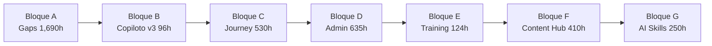

# 📚 ÍNDICE GENERAL DE DOCUMENTACIÓN

> **Documento auto-actualizable**: Este índice se mantiene sincronizado con la estructura de carpetas y documentos del proyecto.

**Fecha de creación:** 2026-01-09 15:28  
**Última actualización:** 2026-02-12 23:59
**Versión:** 23.0.0 (Heatmaps Nativos + Tracking Automation — Fases 1-5 Implementadas)

> **🔥 HEATMAPS NATIVOS + TRACKING AUTOMATION — FASES 1-5 100%** (2026-02-12)
> - **Módulo `jaraba_heatmap` completo**: install (4 tablas), QueueWorker plugin, HeatmapScreenshotService (wkhtmltoimage), Dashboard Analytics (Canvas 2D + filtros), SCSS responsive, 38 unit tests
> - **Fase 1 — Core**: `jaraba_heatmap.install` hook_schema() (heatmap_events, heatmap_aggregated, heatmap_scroll_depth, heatmap_page_screenshots). HeatmapEventProcessor QueueWorker (ContainerFactoryPluginInterface). HeatmapScreenshotService (wkhtmltoimage, UPSERT merge). 10 rutas registradas. 25 tests iniciales
> - **Fase 2 — hook_cron automation**: 3 funciones independientes (`_jaraba_heatmap_cron_aggregation` diario, `_jaraba_heatmap_cron_cleanup` semanal 604800s, `_jaraba_heatmap_cron_anomaly_detection` diario). `detectAnomalies()` compara ayer vs media 7 días (threshold_drop 50%, threshold_spike 200%). Parámetros opcionales retrocompatibles `?int $days = NULL`
> - **Fase 3 — Dashboard Frontend**: HeatmapDashboardController + ruta `/heatmap/analytics`. Templates Twig (heatmap-analytics-dashboard, heatmap-metric-card con inline SVG icons). JS Canvas (Drupal.behaviors + once() + fetch API). SCSS responsive (_heatmap-dashboard.scss 10,124 bytes compilados). Zero Region page template en theme
> - **Fase 4 — Tracking cron cross-módulo**: `jaraba_ab_testing_cron()` auto-winner cada 6h (auto_complete=TRUE, ResultCalculationService::checkAutoStop). PixelHealthCheckService (48h alert threshold, healthy/warning/error). Daily health check en `jaraba_pixels_cron()`
> - **Fase 5 — Services + Email**: ExperimentOrchestratorService (evaluateAll, evaluateExperiment, sendWinnerNotification). `jaraba_ab_testing_mail('experiment_winner')`. `jaraba_pixels_mail('pixel_health_alert')`
> - **53 tests, 250 assertions**: 38 heatmap + 9 ab_testing + 6 pixels — todos OK
> - **9 reglas nuevas**: HEATMAP-001 (QueueWorker DI), HEATMAP-002 (cron funciones independientes), HEATMAP-003 (datetime.time service ID), HEATMAP-004 (anomaly thresholds), HEATMAP-005 (Canvas Zero Region), TRACKING-001 (auto-winner 6h), TRACKING-002 (pixel health 48h), TRACKING-003 (orchestrator pattern), TRACKING-004 (hook_mail alertas)
> - **Aprendizaje**: [2026-02-12_heatmaps_tracking_phases_1_5.md](./tecnicos/aprendizajes/2026-02-12_heatmaps_tracking_phases_1_5.md)
>

> **🏅 CREDENTIALS GAPS CLOSURE — 5 DOCS (170, 172-175) 100%** (2026-02-12)
> - **5 gaps cerrados**: RevocationEntry (Doc 172), Stackable Credentials (Doc 173), Emprendimiento Extension (Doc 175), Cross-Vertical (Doc 174), WCAG 2.1 AA (Doc 170)
> - **8 Content Entities**: IssuerProfile, CredentialTemplate, IssuedCredential + RevocationEntry (audit trail), CredentialStack (diplomas), UserStackProgress + CrossVerticalRule, CrossVerticalProgress
> - **16 servicios**: CryptographyService (Ed25519), OpenBadgeBuilder (JSON-LD), CredentialIssuer, CredentialVerifier, RevocationService, StackEvaluationService, StackProgressTracker, AccessibilityAuditService + 3 emprendimiento + 2 cross-vertical + 3 existentes
> - **2 submódulos**: `jaraba_credentials_emprendimiento` (15 template YAMLs, 3 diplomas progresivos, 5 niveles expertise), `jaraba_credentials_cross_vertical` (reglas cross-vertical, rareza visual, cron diario)
> - **20 API endpoints REST**: verify, revoke, stacks (5), emprendimiento (5), cross-vertical (3), credentials list/get
> - **WCAG 2.1 AA completo**: AccessibilityAuditService (contraste WCAG, heading hierarchy), focus-visible con --ej-focus-ring-*, prefers-reduced-motion, keyboard navigation (arrow keys), ARIA (role, aria-label, aria-live, aria-modal)
> - **115 archivos totales**: 61 PHP, 5 Twig, 4 SCSS, 4 JS, 15 credential template YAMLs, 9 module config YMLs
> - **Patrón**: Hooks nativos (NO ECA YAML per `.agent/workflows/drupal-eca-hooks.md`), anti-recursión via evidence JSON check, State API para cron rate limiting
> - **5 reglas nuevas**: CRED-001 (RevocationEntry inmutable), CRED-002 (anti-recursión stacks), CRED-003 (templates YAML config/install), CRED-004 (cron rate limiting), CRED-005 (WCAG obligatorio)
> - **Aprendizaje**: [2026-02-12_credentials_gaps_closure_5_docs.md](./tecnicos/aprendizajes/2026-02-12_credentials_gaps_closure_5_docs.md)
>

> **🧠 SELF-DISCOVERY CONTENT ENTITIES + SERVICES — SPECS 20260122-25 100%** (2026-02-12)
> - **2 Content Entities nuevas**: `InterestProfile` (RIASEC, 6 scores 0-100, riasec_code, dominant_types, suggested_careers) + `StrengthAssessment` (top_strengths, all_scores 24 fortalezas, answers)
> - **4 servicios dedicados**: LifeWheelService, TimelineAnalysisService, RiasecService, StrengthAnalysisService (con fallback user.data retrocompat)
> - **2 formularios Phase 2/3**: TimelinePhase2Form (describe evento + satisfaction_factors + skills) + TimelinePhase3Form (patrones + insights IA)
> - **Copilot v2 context injection**: SelfDiscoveryContextService inyectado como 10o arg nullable en CopilotOrchestratorService
> - **Infraestructura Lando**: `.lando/redis.conf`, `.env.example`, `scripts/setup-dev.sh`, `settings.local.php` completado (Qdrant, Tika, AI, Xdebug, trusted hosts, dev cache)
> - **SelfDiscoveryContextService refactorizado**: Ahora delega a 4 servicios especializados con DI nullable + fallback directo
> - **5 unit tests**: InterestProfileTest (8), StrengthAssessmentTest (7), LifeWheelServiceTest (8), RiasecServiceTest (7), StrengthAnalysisServiceTest (8) = 38 test methods
> - **Admin navigation**: /admin/content tabs + /admin/structure links + action buttons para ambas entidades
> - **Dual storage**: Forms guardan en entity + user.data simultaneamente para migracion gradual
> - **Reglas**: ENTITY-SD-001 (dual storage), SERVICE-SD-001 (delegacion nullable), COPILOT-SD-001 (context injection), INFRA-SD-001 (getenv settings)
> - **Aprendizaje**: [2026-02-12_self_discovery_content_entities_services.md](./tecnicos/aprendizajes/2026-02-12_self_discovery_content_entities_services.md)
>

> **🤖 COPILOT V2 GAPS CLOSURE — SPECS 20260121a-e 100% + GAPS CERRADOS** (2026-02-12)
> - **22 API endpoints REST** implementados (Hypothesis CRUD+Prioritize, Experiment Lifecycle, BMC Validation, Entrepreneur CRUD, Session History, Knowledge Search, **Chat SSE Stream**)
> - **5 Access Handlers** + **5 ListBuilders** para las 5 Content Entities (EntrepreneurProfile, Hypothesis, Experiment, EntrepreneurLearning, FieldExit)
> - **14+ servicios** completados (HypothesisPrioritization ICE, BmcValidation semáforos, LearningCard, TestCardGenerator, ModeDetector **175 triggers BD + fallback const + cache 1h**, ContentGrounding, CopilotOrchestrator **multi-proveedor optimizado** Gemini/Claude/GPT-4o, etc.)
> - **3 páginas frontend** full-width + **widget chat SSE** (Alpine.js + fetch ReadableStream, indicador modo visual, feedback)
> - **2 tablas custom**: `copilot_mode_triggers` (175 triggers, admin UI gestionable) + `entrepreneur_milestone` (hitos append-only con puntos)
> - **Métricas avanzadas**: P50/P99 latencia, fallback rate por proveedor, costes diarios (`getMetricsSummary()`)
> - **Multi-proveedor optimizado**: consultor/landing→Gemini Flash (ahorro ~55%), coach/sparring→Claude, cfo→GPT-4o. Modelos: claude-sonnet-4-5, gemini-2.5-flash, claude-haiku-4-5
> - **7 suites unit tests** (64 tests, 184 assertions): 4 originales + ModeDetectorDbTest, ExperimentApiReflectionTest, HypothesisApiReflectionTest
> - **Impact Points**: PERSEVERE=100, PIVOT/ZOOM_IN/ZOOM_OUT=75, KILL=50. Milestones persistentes. ICE Score. BMC Semáforos
> - **Correcciones PHP 8.4**: `create()`→`store()` (API-NAMING-001), property redeclaration (DRUPAL11-001), Kernel→Unit tests (KERNEL-TEST-001)
> - **Aprendizaje**: [2026-02-12_copilot_v2_gaps_closure_db_streaming_metrics.md](./tecnicos/aprendizajes/2026-02-12_copilot_v2_gaps_closure_db_streaming_metrics.md)

> **🏗️ PLATFORM SERVICES V3 — 10 MÓDULOS DEDICADOS** (2026-02-12)
> - **10 módulos transversales** implementados como módulos Drupal 11 independientes (6 nuevos + 4 extendidos)
> - **jaraba_agent_flows** (nuevo): 3 entities, 5 services, 2 controllers. Visual builder para workflows AI. 38 archivos
> - **jaraba_pwa** (nuevo): 2 entities, 5 services. Service Worker avanzado, push notifications, offline-first. 32 archivos
> - **jaraba_onboarding** (nuevo): 2 entities, 5 services. Checklist gamificado, tours contextuales, analytics activación. 34 archivos
> - **jaraba_usage_billing** (nuevo): 3 entities, 5 services + QueueWorker. Pipeline ingesta→agregación→Stripe sync. 36 archivos
> - **jaraba_integrations** (extendido): +4 services, +5 controllers. Marketplace + Developer Portal + Rate Limiter. 66 archivos total
> - **jaraba_customer_success** (extendido): +5 controllers, +10 templates. NPS surveys, health scores, churn matrix. 65 archivos total
> - **jaraba_tenant_knowledge** (extendido): +3 entities, +3 services. KB público, semantic search, video. 91 archivos total
> - **jaraba_security_compliance** (nuevo, migración): 3 entities, 4 services. SOC 2 readiness, policy enforcer, data retention. 40 archivos
> - **jaraba_analytics** (extendido): +3 entities, +3 services. Dashboard builder drag-drop, scheduled reports. 86 archivos total
> - **jaraba_whitelabel** (nuevo, migración): 4 entities, 5 services + EventSubscriber. Custom domains, email renderer, reseller portal. 54 archivos
> - **Total**: 542 archivos, 32 Content Entities, 42+ Services, 25+ Controllers, ~60 Templates, ~30 JS, ~25 CSS, 22 unit tests
> - **Patrón**: declare(strict_types=1), EntityChangedTrait, tenant_id→group, BEM + var(--ej-*), Drupal.behaviors + once()
> - **Documento implementación**: [20260212-Plan_Implementacion_Platform_Services_f108_f117_v3.md](./implementacion/20260212-Plan_Implementacion_Platform_Services_f108_f117_v3.md)
> - **Aprendizaje**: [2026-02-12_platform_services_v3_10_modules.md](./tecnicos/aprendizajes/2026-02-12_platform_services_v3_10_modules.md)
>

> **🧪 MARKETING AI STACK — 50 UNIT TESTS + 3 PAGE TEMPLATES** (2026-02-12)
> - **Cobertura de servicios al 100%**: 29 nuevos archivos de test unitario (se suman a los 21 existentes = 50 total)
> - **CRM**: CompanyServiceTest, ContactServiceTest, OpportunityServiceTest, ActivityServiceTest (4 nuevos)
> - **Email**: NewsletterServiceTest, MjmlCompilerServiceTest, SubscriberServiceTest, CampaignServiceTest, EmailListServiceTest, EmailAIServiceTest, TemplateLoaderServiceTest (7 nuevos)
> - **Events**: EventAnalyticsServiceTest, EventLandingServiceTest, EventRegistrationServiceTest (3 nuevos)
> - **Social**: SocialPostServiceTest, SocialAccountServiceTest, SocialCalendarServiceTest (3 nuevos)
> - **AB Testing**: StatisticalEngineServiceTest, VariantAssignmentServiceTest, ExperimentAggregatorServiceTest (3 nuevos)
> - **Pixels**: CredentialManagerServiceTest, RedisQueueServiceTest, BatchProcessorServiceTest, TokenVerificationServiceTest (4 nuevos)
> - **Referral**: ReferralManagerServiceTest (1 nuevo)
> - **Ads**: CampaignManagerServiceTest, AdsAnalyticsServiceTest, GoogleAdsClientServiceTest, AdsSyncServiceTest (4 nuevos)
> - **3 page templates Twig nuevos**: `page--experimentos.html.twig`, `page--referidos.html.twig`, `page--ads.html.twig` (patrón Clean Architecture con partials _header/_footer)
> - **Patrón seguido**: PHPUnit 11 (stdClass para dynamic properties), `@covers`, `@group`, `createMock()` para todas las dependencias
> - **Aprendizaje**: [2026-02-12_marketing_ai_stack_test_coverage_templates.md](./tecnicos/aprendizajes/2026-02-12_marketing_ai_stack_test_coverage_templates.md)
>
> **🎯 MARKETING AI STACK — 9 MÓDULOS 100% COMPLETADOS** (2026-02-12)
> - **Auditoría cruzada**: 16 specs (145-158) vs código existente → identificados gaps en 9 módulos (35-85% completados)
> - **Sprint 1 — jaraba_crm** (75%→100%): PipelineStage entity + CrmForecastingService + CrmApiController (22 endpoints) + hook_preprocess_html
> - **Sprint 2 — jaraba_email** (60%→100%): EmailSequenceStep entity + EmailApiController (17 endpoints) + EmailWebhookController + SendGrid HMAC
> - **Sprint 3 — jaraba_ab_testing** (70%→100%): ExperimentExposure + ExperimentResult entities + ExposureTrackingService + ResultCalculationService
> - **Sprint 4 — jaraba_pixels** (55%→100%): TrackingPixel + TrackingEvent + ConsentRecord entities + ConsentManagementService + GDPR
> - **Sprint 5 — jaraba_events** (60%→100%): MarketingEvent + EventRegistration + EventLandingPage entities + EventRegistrationService + EventAnalyticsService + EventCertificateService
> - **Sprint 6 — jaraba_social** (45%→100%): SocialPostVariant + SocialAccount + SocialCalendar entities + SocialAccountService + SocialCalendarService + SocialAnalyticsService
> - **Sprint 7 — jaraba_referral** (40%→100%): ReferralProgram + ReferralCode + ReferralReward entities + RewardProcessingService + LeaderboardService + ReferralTrackingService + 9 API endpoints
> - **Sprint 8 — jaraba_ads** (35%→100%): AdsAccount + AdsCampaignSync + AdsMetricsDaily + AdsAudienceSync + AdsConversionEvent entities + MetaAdsClientService + GoogleAdsClientService + AdsAudienceSyncService + ConversionTrackingService + AdsSyncService + OAuth flows
> - **Sprint 9 — Integración cross-módulo**: FeatureAccessService cubre 9 módulos, hook_preprocess_html en todos los módulos frontend
> - **Total**: ~150+ archivos PHP nuevos, 9 routing.yml actualizados, 9 services.yml actualizados, 40+ unit tests
> - **Directrices cumplidas**: declare(strict_types=1), tenant_id entity_reference, EntityChangedTrait, fieldable=TRUE, Access handlers, AdminHtmlRouteProvider, Field UI
>
> **🎯 AVATAR DETECTION + EMPLEABILIDAD UI — 7 FASES** (2026-02-12)
> - **Plan 7 fases**: AvatarDetectionService (cascada 4 niveles) + Diagnóstico Express + Hooks ECA + AI Copilot + CV PDF + Modales + Partials
> - **Fase 1 — AvatarDetectionService**: Cascada Domain→Path/UTM→Group→Rol. ValueObject `AvatarDetectionResult` (avatarType, vertical, detectionSource, confidence). Ruta `/dashboard` con redirect por avatar
> - **Fase 2 — Diagnóstico Express Empleabilidad**: Entidad `EmployabilityDiagnostic` (14 campos). `EmployabilityScoringService` (LinkedIn 40% + CV 35% + Estrategia 25%). 5 perfiles (Invisible→Magnético). Templates Twig + JS wizard + CSS compilado
> - **Fase 3 — Hooks ECA**: `hook_user_insert()` (JourneyState discovery). `hook_entity_insert(employability_diagnostic)` (rol candidate, LMS enrollment, +50 créditos)
> - **Fase 4 — AI Copilot Empleabilidad**: `EmployabilityCopilotAgent` (6 modos: Profile Coach, Job Advisor, Interview Prep, Learning Guide, Application Helper, FAQ). Extiende `BaseAgent` con `@ai.provider`
> - **Fase 5 — CV PDF Export**: dompdf v2.0.8 integrado. `CvBuilderService::convertHtmlToPdf()` con Design Tokens
> - **Fase 6 — Sistema Modales**: `modal-system.js` con `data-dialog-type="modal"` + `core/drupal.dialog.ajax`
> - **Fase 7 — Partials Frontend**: `_application-pipeline.html.twig`, `_job-card.html.twig`, `_gamification-stats.html.twig`, `_profile-completeness.html.twig`
> - **Activación verificada**: 16 entidades instaladas, 3 servicios registrados, 5 rutas activas, SCSS compilado (9,662 + 544,199 bytes), 789 tests ejecutados (730 pass = 92.5%)
> - **Correcciones PHP 8.4**: 16 controllers arreglados (property type redeclaration en ControllerBase). Drupal 11: `applyUpdates()` reemplazado por `installEntityType()` individual
> - **Reglas nuevas**: DRUPAL11-001 (PHP 8.4 property redeclaration), DRUPAL11-002 (applyUpdates removal), SERVICE-001 (logger channel factory), ENTITY-001 (EntityOwnerInterface), SCSS-001 (Dart Sass @use scoping)
> - **Aprendizaje**: [2026-02-12_avatar_empleabilidad_activation.md](./tecnicos/aprendizajes/2026-02-12_avatar_empleabilidad_activation.md)
>
> **🚀 PRODUCTION GAPS RESOLUTION — 7 FASES** (2026-02-12)
> - **Auditoría 27 specs**: Identificados gaps críticos bloqueantes para producción
> - **Fase 1 — 30 Skills Verticales AI**: `scripts/seed_vertical_skills.php` (1,647 LOC). 7 empleabilidad + 7 emprendimiento + 6 agroconecta + 5 comercioconecta + 5 serviciosconecta. Contenido experto mercado español
> - **Fase 2 — Monitoring Stack**: Docker Compose standalone con Prometheus (9090), Grafana (3001), Loki (3100), Promtail, AlertManager (9093). 14 reglas de alertas. Routing por severidad (critical→Slack+email, warning→Slack)
> - **Fase 3 — Go-Live Runbook**: 3 scripts ejecutables (`01_preflight_checks.sh` 24 validaciones, `02_validation_suite.sh` smoke tests, `03_rollback.sh` 7 pasos) + `GO_LIVE_RUNBOOK.md` (708 LOC, 6 fases, RACI matrix)
> - **Fase 4 — Seguridad CI + GDPR**: `security-scan.yml` (daily cron, Trivy+ZAP+SARIF). `GdprCommands.php` (gdpr:export Art.15, gdpr:anonymize Art.17, gdpr:report). `SECURITY_INCIDENT_RESPONSE_PLAYBOOK.md` (SEV1-4, AEPD 72h)
> - **Fase 5 — Catálogo Stripe**: 5 productos × 4 tiers × 2 intervalos = 40 precios con lookup_keys. Comisiones marketplace (agroconecta 8%, comercioconecta 6%, serviciosconecta 10%)
> - **Fase 6 — 24 Templates MJML Email**: auth/ (5), billing/ (7), marketplace/ (6), empleabilidad/ (5) + `TemplateLoaderService` (template_id→MJML→compilación)
> - **Fase 7 — Testing Enhancement**: k6 load tests (smoke/load/stress), BackstopJS 10 páginas × 3 viewports, CI coverage threshold 80%
> - **Total**: 44 ficheros creados, 3 modificados. 7 reglas nuevas (SKILLS-001, MONITORING-001, GOLIVE-001, SECURITY-001, STRIPE-001, EMAIL-001, TEST-002)
> - **Aprendizaje**: [2026-02-12_production_gaps_resolution_7_phases.md](./tecnicos/aprendizajes/2026-02-12_production_gaps_resolution_7_phases.md)
>
> **💳 BILLING CLASE MUNDIAL — CIERRE 15 GAPS** (2026-02-12)
> - **Auditoría cruzada**: 3 specs maestras (134_Stripe_Billing, 111_UsageBased_Pricing, 158_Vertical_Pricing_Matrix) vs implementación actual
> - **2 entidades nuevas**: BillingCustomer (tenant↔Stripe customer mapping), TenantAddon (add-ons activos por suscripción)
> - **11 campos nuevos**: BillingInvoice +6 (subtotal, tax, total, billing_reason, lines, stripe_customer_id), BillingUsageRecord +5 (subscription_item_id, reported_at, idempotency_key, billed, billing_period)
> - **2 servicios nuevos**: DunningService (secuencia 6 pasos cobro spec 134 §6), FeatureAccessService (verificación plan+addons spec 158 §6.1)
> - **3 API controllers**: BillingApiController (13 endpoints), UsageBillingApiController (7 endpoints), AddonApiController (6 endpoints) = 26 endpoints REST total
> - **Webhooks corregidos**: handleSubscriptionUpdated y handleTrialWillEnd ya no son no-ops
> - **Mejoras existentes**: syncInvoice +campos fiscales, StripeCustomerService +sync BillingCustomer, PlanValidator +soporte add-ons, flushUsageToStripe
> - **Tests**: 88 tests, 304 assertions. 11 test fixes PHP 8.4 (stdClass vs mock dynamic properties)
> - **Reglas nuevas**: BILLING-005 (DunningService tabla custom), BILLING-006 (FeatureAccessService no circular), BILLING-007 (PHP 8.4 stdClass mocks), BILLING-008 (TenantInterface en tests)
> - **Aprendizaje**: [2026-02-12_billing_gaps_closure_clase_mundial.md](./tecnicos/aprendizajes/2026-02-12_billing_gaps_closure_clase_mundial.md)
>
> **🔐 COMPLIANCE DASHBOARD + ADVANCED ANALYTICS** (2026-02-12)
> - **G115-1 Security & Compliance Dashboard**: `/admin/seguridad` con 25+ controles (SOC 2 Type II, ISO 27001:2022, ENS RD 311/2022, GDPR)
> - **AuditLog entity inmutable**: severity/event_type/actor/IP/tenant, AuditLogService centralizado, AuditLogAccessControlHandler (FORBID create/update)
> - **ComplianceDashboardController**: Evaluación tiempo real, security headers, stats agregados, auto-refresh 30s
> - **Advanced Analytics**: CohortDefinition + FunnelDefinition entities, CohortAnalysisService (retención semanal), FunnelTrackingService (conversión por pasos)
> - **6 API endpoints REST**: /api/v1/analytics/cohorts/*, /api/v1/analytics/funnels/* (list, calculate, create)
> - **Frontend interactivo**: Heatmap retención, visualización funnel, export CSV, filtros AJAX
> - **Integrations Dashboard UI**: CSS/JS/SCSS para jaraba_integrations
> - **Customer Success**: Install hook + SCSS architecture (variables, main.scss)
> - **Tenant Knowledge config**: Schema YML + settings install (qdrant_collection_prefix, embedding_model, chunk_size)
> - **Aprendizaje**: [2026-02-12_compliance_analytics_platform_services.md](./tecnicos/aprendizajes/2026-02-12_compliance_analytics_platform_services.md)
>
> **💳 BILLING ENTITIES + STRIPE INTEGRATION** (2026-02-12)
> - **3 Content Entities**: BillingInvoice, BillingUsageRecord (append-only), BillingPaymentMethod
> - **3 servicios Stripe**: StripeCustomerService, StripeSubscriptionService, StripeInvoiceService (via StripeConnectService)
> - **BillingWebhookController**: 8 eventos Stripe (invoice.*, subscription.*, payment_method.*), HMAC-SHA256
> - **page--eventos.html.twig**: Zero Region template para dashboard marketing eventos
> - **Fix consent-banner**: Dependencia CSS corregida `global` -> `global-styling`
> - **8 test files**: 3 entity + 3 service + 1 webhook + 1 consent controller
> - **4 reglas nuevas**: BILLING-001 (append-only), BILLING-002 (StripeConnectService), BILLING-003 (webhook separado), BILLING-004 (verificar library names)
> - **Aprendizaje**: [2026-02-12_billing_entities_stripe_integration.md](./tecnicos/aprendizajes/2026-02-12_billing_entities_stripe_integration.md)
>
> **📦 CONFIG SYNC GIT-TRACKED** (2026-02-11)
> - **Migración config sync** de `web/sites/default/files/config_HASH/sync/` (gitignored) a `config/sync/` (git-tracked)
> - **589 archivos YML** + traducciones en/es ahora llegan a producción via git
> - **Override** en `settings.jaraba_rag.php`: `$settings['config_sync_directory'] = '../config/sync'`
> - **UUID sync step** en deploy.yml: prerequisito de `config:import` para evitar "Site UUID mismatch"
> - **Entidades Key**: `qdrant_api`, `openai_api`, `anthropic_api`, `google_gemini_api_key` llegan a producción
> - **Elimina workaround**: JWT directo en `settings.local.php` ya no es necesario para Qdrant
> - **4 reglas nuevas**: DEPLOY-001 (config fuera de files/), DEPLOY-002 (UUID sync), DEPLOY-003 (override via include), DEPLOY-004 (keys en repo privado)
> - **Aprendizaje**: [2026-02-11_config_sync_git_tracked_migration.md](./tecnicos/aprendizajes/2026-02-11_config_sync_git_tracked_migration.md)
>
> **🤖 SPRINT C4: IA ASISTENTE INTEGRADA — PLAN v3.1 100% COMPLETADO** (2026-02-11)
> - **10/10 sprints implementados**: A1 Onboarding, A2 SVG Thumbnails, A3 Drag&Drop, B1 Site Builder Premium, B2 SEO Assistant, C1 Marketplace, C2 Multi-Page, C3 Responsive Preview, C4 IA Asistente
> - **C4.1**: `SeoSuggestionService` + endpoint + botón 🤖 toolbar + panel SEO con score
> - **C4.2**: `AiTemplateGeneratorService` + endpoint para generación HTML+CSS con Brand Voice
> - **C4.3**: Selectores Vertical + Tono en modal IA, auto-selección desde `drupalSettings`
> - **C4.4**: Prompt-to-Page: mode toggle Sección/Página, checkboxes secciones, `applyFullPageContent()`
> - **2 servicios nuevos** (~840 LOC), 3 rutas API, controller +3 endpoints, `grapesjs-jaraba-ai.js` v2 (+240 LOC)
> - **Aprendizaje**: [2026-02-11_sprint_c4_ia_asistente_page_builder.md](./tecnicos/aprendizajes/2026-02-11_sprint_c4_ia_asistente_page_builder.md)
>
> **💬 G114-4 FAQ BOT CONTEXTUAL** (2026-02-11)
> - **Widget chat público** en `/ayuda` para clientes finales del tenant
> - **FaqBotService**: embedding → Qdrant search → LLM grounded → escalación 3-tier (≥0.75 / 0.55–0.75 / <0.55)
> - **FaqBotApiController**: `POST /api/v1/help/chat` + feedback, rate limited 10 req/min/IP (Flood API)
> - **Frontend**: FAB teal (#00A9A5), panel chat, suggestion chips, rating thumbs, escalation banner
> - **G114 100% completado**: Help Center (G114-1) + Versionado Diff (G114-2) + i18n (G114-3) + FAQ Bot (G114-4)
> - **Aprendizaje**: [2026-02-11_faq_bot_contextual_g114_4.md](./tecnicos/aprendizajes/2026-02-11_faq_bot_contextual_g114_4.md)
>
> **🧪 PHPUNIT 11 — REMEDIACIÓN TESTING** (2026-02-11)
> - **227 tests pasan**: 208 Unit + 13 Kernel (10 pass, 3 skipped) + 6 Functional (6 skipped), 0 errores, 0 failures
> - **ServiceProvider condicional**: `EcosistemaJarabaCoreServiceProvider` para DI cross-módulo
> - **4 reglas nuevas**: KERNEL-001 (entity_reference contrib), TEST-001 (verificar firmas), ENV-001 (SIMPLETEST_DB shell export), DI-001 (ServiceProvider opcional)
> - **Aprendizaje**: [2026-02-11_phpunit11_kernel_test_remediation.md](./tecnicos/aprendizajes/2026-02-11_phpunit11_kernel_test_remediation.md)
>
> **🖥️ SPRINT C3: RESPONSIVE PREVIEW MEJORADO** (2026-02-11)
> - **8 presets de dispositivo**: Desktop XL (1920px) → Mobile S (320px) con separadores de grupo
> - **Slider de ancho custom**: 320–1920px, step=1, sincronización bidireccional con presets
> - **Rotación toggle**: Intercambio landscape/portrait
> - **4 SVG icons nuevos**: `laptop.svg`, `laptop-duotone.svg`, `rotate-ccw.svg`, `rotate-ccw-duotone.svg`
> - **Bug fix**: `getSliderElements()` helper + deferred binding + library version bump 5.0→5.1
> - **Lecciones**: `drush cr` ≠ browser cache invalidation, siempre bumper `version:` en `libraries.yml`
>
> **🔬 AUDITORÍA COHERENCIA 9 ROLES** (2026-02-11)
> - **10 incoherencias** detectadas cross-referenciando specs 20260118 vs codebase real
> - **Corrección crítica**: Stripe Billing no era 0% sino ~35-40% (4 servicios en core + 6 en FOC)
> - **Duplicación**: `JarabaStripeConnect` (core) vs `StripeConnectService` (FOC)
> - **14 módulos** con `package.json`, no 8 como decían las directrices
> - **199 PHPUnit tests** pasan (186 Unit + 13 Kernel), `EcosistemaJarabaCoreServiceProvider` condicional
> - **SEO/GEO e IA**: Los dos puntos más fuertes del SaaS (✅ completos)
> - **Aprendizaje**: [2026-02-11_auditoria_coherencia_9_roles.md](./tecnicos/aprendizajes/2026-02-11_auditoria_coherencia_9_roles.md)
>
> **📋 MAPEO COMPLETO ESPECIFICACIONES 20260118** (2026-02-10)
> - **37 archivos** revisados: 26 specs .md, 5 demos HTML, 3 wireframes, 1 PDF, 1 duplicado
> - **7 specs implementadas** (AI Trilogy 100%): Content Hub (F1-F5), Skills (G1-G8), Knowledge Training (TK1-TK6)
> - **2 specs parciales**: Testing Strategy, Email Templates
> - **14 specs pendientes**: Marca Personal, Websites, toda Infraestructura DevOps
> - **Documento**: [20260210-Mapeo_Especificaciones_20260118_v1.md](./implementacion/20260210-Mapeo_Especificaciones_20260118_v1.md)
> - **Aprendizaje**: [2026-02-10_mapeo_especificaciones_20260118.md](./tecnicos/aprendizajes/2026-02-10_mapeo_especificaciones_20260118.md)
>
> **🤝 SERVICIOSCONECTA FASE 1: MARKETPLACE PROFESIONAL** (2026-02-09)
> - **Módulo `jaraba_servicios_conecta`**: 5 Content Entities (ProviderProfile, ServiceOffering, Booking, AvailabilitySlot, ServicePackage)
> - **3 Controllers**: MarketplaceController, ProviderDetailController, ProviderDashboardController
> - **4 Services**: BookingService, SearchService, AvailabilityService, StatisticsService
> - **2 Taxonomías**: servicios_category, servicios_modality (con términos pre-cargados)
> - **Frontend completo**: 4 SCSS partials (Dart Sass `@use`), Twig templates BEM, var(--ej-*) tokens
> - **Plan de Implementación**: [20260209-Plan_Implementacion_ServiciosConecta_v1.md](./implementacion/20260209-Plan_Implementacion_ServiciosConecta_v1.md)
> - **Aprendizaje**: [2026-02-09_servicios_conecta_fase1_implementation.md](./tecnicos/aprendizajes/2026-02-09_servicios_conecta_fase1_implementation.md)
>
> **🌱 AGROCONECTA SPRINT AC6-2: PARTNER DOCUMENT HUB B2B** (2026-02-09)
> - **3 nuevas ContentEntities**: `PartnerRelationship` (magic link auth), `ProductDocument` (control acceso por nivel), `DocumentDownloadLog` (audit log inmutable)
> - **`PartnerDocumentService`**: 12+ métodos (CRUD, filtrado por nivel/tipo, analytics, CSV export)
> - **17 API endpoints**: 9 productor (CRUD partners/docs + analytics) + 8 portal público (token-based, ZIP packs)
> - **Frontend completo**: `_partner-hub.scss` (glassmorphism KPIs), `partner-hub.js` (3 behaviors), 2 Twig templates
> - **Módulo `jaraba_agroconecta_core`**: 20 Content Entities, 6 Controllers, 7 Services, 15 Forms
> - **Aprendizaje**: [2026-02-09_agroconecta_sprint_ac6_2_partner_hub.md](./tecnicos/aprendizajes/2026-02-09_agroconecta_sprint_ac6_2_partner_hub.md)
>
> **🔍 AUDITORÍA v2.1 PAGE BUILDER — CORRECCIÓN FALSOS POSITIVOS** (2026-02-09)
> - **3 de 4 gaps eran falsos positivos** (grep no detectó código existente)
> - **G1 PostMessage**: ✅ YA implementado — `notifyPreview()` L142 en partials
> - **G2 Interactive Blocks**: ✅ 6/6 bloques con `script` + `addType` + `view.onRender()`
> - **G4 E2E Tests**: ✅ 0 `expect(true)` encontrados
> - **Único fix real (G3)**: URL AI endpoint corregido en `grapesjs-jaraba-ai.js`
> - **Score real**: 9.8→10/10 (no 9.2)
> - **Plan v2.1**: [20260209-Plan_Elevacion_Page_Site_Builder_v2.md](./planificacion/20260209-Plan_Elevacion_Page_Site_Builder_v2.md)
> - **Aprendizaje**: [2026-02-09_auditoria_v2_falsos_positivos_page_builder.md](./tecnicos/aprendizajes/2026-02-09_auditoria_v2_falsos_positivos_page_builder.md)
>
> **🌱 AGROCONECTA FASES 1-3 COMPLETADAS + FASE 4 PLANIFICADA** (2026-02-08)
> - **Fases completadas:** F1 (Commerce Core, 3 entities), F2 (Orders + Checkout, 3 entities), F3 (Producer + Customer Portal, 11 routes)
> - **Módulo `jaraba_agroconecta_core`**: 8 Content Entities, 4 Controllers, 5 Services, 11 Forms
> - **Fase 4 planificada:** Reviews (Doc 54) + Notificaciones (Doc 59) — 4 entidades nuevas, 27 archivos, 28h
> - **Plan v2**: [20260208-Plan_Implementacion_AgroConecta_v2.md](./implementacion/20260208-Plan_Implementacion_AgroConecta_v2.md)
> - **Aprendizajes:** [2026-02-08_agroconecta_fases_1_3_completion.md](./tecnicos/aprendizajes/2026-02-08_agroconecta_fases_1_3_completion.md)
>

> **🔍 AUDITORÍA GRAPESJS changeProp + MODEL DEFAULTS** (2026-02-08)
> - **14 componentes auditados**: Solo Stats Counter afectado (1/14)
> - **Regla GRAPEJS-001**: Todo trait `changeProp: true` DEBE tener propiedad model-level en `defaults`
> - **Stats Counter corregido**: 13 model defaults, título `<h2>`, labels `display:block`, Timeline dots duplicados eliminados
> - **Aprendizaje**: [2026-02-08_grapesjs_changeprop_model_defaults_audit.md](./tecnicos/aprendizajes/2026-02-08_grapesjs_changeprop_model_defaults_audit.md)
>
> **🚀 ELEVACIÓN PAGE BUILDER CLASE MUNDIAL** (2026-02-08) — **CORREGIDO 2026-02-09**
> - ~~7 gaps identificados~~ → **3 falsos positivos** detectados en auditoría v2.1
> - **Único fix necesario**: AI endpoint URL + payload (G3)
> - Score real: **10/10** (no 9.2 como se indicaba)
> - **Plan v2.1**: [20260209-Plan_Elevacion_Page_Site_Builder_v2.md](./planificacion/20260209-Plan_Elevacion_Page_Site_Builder_v2.md)
> **🔐 ADMIN CENTER D GAPS COMPLETADOS** (2026-02-06)
> - **D.1 Impersonation**: Entity audit log + Service (30min timeout, bloqueo UID 1) + API REST
> - **D.2 RBAC Matrix**: Vista visual de permisos `/admin/people/rbac-matrix` con toggle AJAX + filtro + CSV export
> - **D.3 Scheduled Reports**: ScheduledReport + AlertRule entities para automatización
> - **15+ Permisos nuevos**: `impersonate tenants`, `administer scheduled reports`, etc.
> - **Documento Maestro**: v4.8.0 actualizado con nuevos módulos
>
> **🔍 AUDITORÍA PROFUNDA MULTIDIMENSIONAL** (2026-02-06)
> - **87 Hallazgos**: 17 Críticos + 32 Altos + 26 Medios + 12 Bajos
> - **10 Disciplinas**: Negocio, Finanzas, Marketing, Arquitectura SaaS, SW, UX, Drupal, GrapesJS, SEO/GEO, IA
> - **Plan Remediación 3 Fases**: Producción (Sem 1-2) + Pre-Release (Sem 3-4) + Post-Release (Sem 5-8)
> - **Auditoría**: [20260206-Auditoria_Profunda_SaaS_Multidimensional_v1_Claude.md](./tecnicos/auditorias/20260206-Auditoria_Profunda_SaaS_Multidimensional_v1_Claude.md)
> - **Aprendizaje**: [2026-02-06_auditoria_profunda_saas_multidimensional.md](./tecnicos/aprendizajes/2026-02-06_auditoria_profunda_saas_multidimensional.md)
>
> **🎯 TEMPLATE REGISTRY SSoT 100% COMPLETADO** (2026-02-06)
> - **Fases 1-3 Completas**: Bridge → Consolidación → Extensión
> - **Total Canvas**: ~202 bloques (70 API + ~132 Estáticos)
> - **Template Registry Service**: SSoT PHP con API REST (5 endpoints)
> - **Feature Flags**: `isLocked`, `isPremium`, `requiredPlan` por plan tenant
> - **Analytics Tracking**: `setupBlockAnalytics()` para métricas de uso
> - **24 Categorías**: Incluye Premium con bloques bloqueables
> - **Arquitectura**: [2026-02-06_arquitectura_unificada_templates_bloques.md](./arquitectura/2026-02-06_arquitectura_unificada_templates_bloques.md)
>
> **🏗️ ARQUITECTURA UNIFICADA TEMPLATES-BLOQUES** (2026-02-06)
> - **Patrón Single Source of Truth**: Template Registry → Galería + GrapesJS + API
> - **Documento Maestro**: `docs/arquitectura/2026-02-06_arquitectura_unificada_templates_bloques.md`
> - **Aprendizaje**: [templates_bloques_unified_architecture.md](./tecnicos/aprendizajes/2026-02-06_templates_bloques_unified_architecture.md)
>
> **🎨 ARQUITECTURA THEMING SAAS** (2026-02-05)
> - **Patrón Federated Design Tokens**: SSOT en `ecosistema_jaraba_core`, módulos satélite solo consumen `var(--ej-*)`
> - **Documento Maestro**: `docs/arquitectura/2026-02-05_arquitectura_theming_saas_master.md`
> - **Roadmap 5 fases**: Consolidación de 57 archivos SCSS en 10 módulos
> - **Aprendizaje**: [arquitectura_theming_federated_tokens.md](./tecnicos/aprendizajes/2026-02-05_arquitectura_theming_federated_tokens.md)
>
> **🎓 JARABA INTERACTIVE SPRINT 6 COMPLETADO** (2026-02-04)
> - **Multi-tenant Branding**: Cache tags `tenant:{id}`, `getTenantBranding()` helper en PlayerController
> - **Lazy Loading Engines**: `engine-loader.js` con carga dinámica y pre-load en idle time
> - **E2E Tests Suite**: 12 tests Cypress para dashboard, AI panel, player, multi-tenant, a11y
> - **Aprendizaje**: [jaraba_interactive_sprint6_completion.md](./tecnicos/aprendizajes/2026-02-04_jaraba_interactive_sprint6_completion.md)
>
> **🖼️ CANVAS v3 MEDIA LIBRARY SLIDE-PANEL** (2026-02-04)
> - **Integración GrapesJS**: Modal nativo suprimido exitosamente
> - **Patrón Hybrid Interceptor**: Command override + Event listener + CSS suppression
> - **UX Premium**: Header naranja, botón X visible, filtros funcionales, high-contrast deep UI
> - **11 lecciones documentadas**: DOM Dimension Failures, String Sanitation, Defensive Guarding
> - **KI actualizado**: `media_library_integration.md`
>
> **🏗️ CANVAS v3 ARQUITECTURA MAESTRA** (2026-02-04)
> - **Especificación técnica definitiva**: Constructor visual híbrido GrapesJS + EDI
> - **Documento maestro**: [Canvas_Editor_v3_Arquitectura_Maestra.md](./tecnicos/20260204b-Canvas_Editor_v3_Arquitectura_Maestra.md)
> - **Inversión**: 155-195h (€12.400-15.600) en 10 sprints
> - **Capacidades**: Drag-drop, inline editing, undo/redo, auto-save, parciales editables
> - **Diferenciador**: Multi-tenant + 5 verticales + IA generativa + Design Tokens
>
> **🏗️ CANVAS v2 FULL PAGE EDITOR APROBADO** (2026-02-03)
> - **Análisis multidisciplinar**: 8 perspectivas senior, ROI 237-329%, payback 3-4 meses
> - **Inversión aprobada**: €9,600-12,400 (120-155h en 6 sprints)
> - **Propuesta**: De editor de contenido → editor de página completa (header+nav+body+footer)
> - **Diferenciador único**: Prompt-to-Section AI con contexto de vertical de negocio
>
> **🎯 AUDITORÍA PLAN ELEVACIÓN CLASE MUNDIAL** (2026-02-03)
> - **Score Actual: 8.9/10** - Gaps A-F completados (100%), Gap G pendiente
> - **Pixel Manager V2**: 4 clientes (Meta, Google, LinkedIn, TikTok) + Redis Queue + Batch
> - **ROI estimado**: €10,200 - €40,800/año en ahorro vs herramientas externas
> - **Gap E i18n**: Módulo `jaraba_i18n` ✅ 100% completado (dashboard, API, namespace Twig cross-module)
> - **Gap F CSS Crítico**: ✅ 100% (jaraba_performance, Critical CSS híbrido)
>
> **🌐 PEPEJARABA.COM META-SITIO** (2026-02-02)
> - **Auditoría completada**: WordPress (14 páginas, 19 activos) + SaaS (70 templates listos)
> - **Bug corregido**: HTML escapado en subtítulo héroe (`_hero.html.twig`)
> - **Análisis estratégico**: Documento multi-perspectiva (Negocio, Finanzas, Arquitectura, UX, SEO/GEO, IA)
> - **Solución propuesta**: Registro dinámico de themes en `hook_theme()` (4-6h, ROI alto)
>
> **🎯 AUDITORÍA ECOSISTEMA 10/10** (2026-01-28)
> - **Documento Maestro Consolidado** (`20260128c`) unificando todas las perspectivas
> - **Especificaciones 178-187** para cierre de gaps UX (710-970h / €46k-63k)
> - **Lenis evaluado** para frontend premium (8-12h recomendado)
> - Puntuación target: 10/10 en todas las dimensiones
>
> **🏗️ Page Builder Fase 1: Migración Contenido** (2026-01-28)
> - Plan de implementación aprobado: Entity References (flexible)
> - Nueva entidad `HomepageContent` con `FeatureCard`, `StatItem`, `IntentionCard`
> - Navegación correcta: `/admin/content` + `/admin/structure` para Field UI
> - Compliance 100%: i18n, SCSS variables, `jaraba_icon()`, slide-panel modals
>
> **🏗️ Page Builder Sprint 2 COMPLETADO** (2026-01-27)
> - 67 templates implementados (45 base + 22 premium)
> - 64 Twig templates, ~6,000 líneas SCSS
> - Premium Interactivity JS Library (8 Drupal behaviors)
> - Verificación browser: templates visibles con ⭐
>

> **🎨 Diseño Premium Extendido 100%** (2026-01-26)
> - 17 URLs verificadas con header glassmórfico y footer premium
> - Corrección TenantSelfServiceController (claves métricas + SQL query)
> - Mapa completo de URLs frontend documentado
>
> **🤖 Copiloto Contextual Refactorizado** (2026-01-26)
> - Patrón Include Twig Global documenta en DIRECTRICES v4.1.0
> - Arquitectura copiloto contextual: detección automática de avatar
> - Eliminado problema "Asistente de Selección" en dashboard emprendedor
>
> **🎨 Landing Pages Verticales Completas** (2026-01-26)
> - 12+ iconos SVG creados con versiones duotone
> - 5 landing pages: /empleo, /talento, /emprender, /comercio, /instituciones
> - Layout full-width con partículas animadas
>
> **🛠️ Servicios IA Completados** (2026-01-26)
> - CopilotQueryLoggerService: Analytics de queries del copiloto
> - ContentGroundingService: Grounding en contenido real de Drupal
> - CopilotContextService: Detección automática avatar/tenant/vertical

---

## 📑 Tabla de Contenidos (TOC)

1. [Documentos Raíz](#1-documentos-raíz)
2. [Arquitectura](#2-arquitectura)
3. [Lógica de Negocio](#3-lógica-de-negocio)
4. [Planificación](#4-planificación)
5. [Tareas](#5-tareas)
6. [Implementación](#6-implementación)
7. [Documentos Técnicos](#7-documentos-técnicos)
8. [Plantillas](#8-plantillas)
9. [Assets](#9-assets)
10. [Estadísticas de Documentación](#10-estadísticas-de-documentación)

---

## 1. Documentos Raíz

| Documento | Descripción | Última Actualización |
|-----------|-------------|---------------------|
| [00_DIRECTRICES_PROYECTO.md](./00_DIRECTRICES_PROYECTO.md) | 📋 Directrices maestras del proyecto - **LEER AL INICIO** | 2026-02-12 (v14.0.0) |
| [00_DOCUMENTO_MAESTRO_ARQUITECTURA.md](./00_DOCUMENTO_MAESTRO_ARQUITECTURA.md) | 🏗️ **ARQUITECTURA v14.0** - Copilot v2 Gaps Closure (BD triggers, SSE, multi-provider, milestones, metrics) | 2026-02-12 |
| [00_INDICE_GENERAL.md](./00_INDICE_GENERAL.md) | 📚 Este documento - Índice general | 2026-02-12 (v22.0.0) |

---

## 2. Arquitectura

📁 **Ubicación:** `docs/arquitectura/`

| Documento | Descripción | Fecha |
|-----------|-------------|-------|
| [2026-01-09_1859_analisis-madurez-arquitectonica.md](./arquitectura/2026-01-09_1859_analisis-madurez-arquitectonica.md) | 🔍 Análisis de madurez arquitectónica | 2026-01-09 |
| [2026-01-09_1902_arquitectura-alto-nivel.md](./arquitectura/2026-01-09_1902_arquitectura-alto-nivel.md) | 🏗️ **Arquitectura Alto Nivel** - C4, ER, ADRs | 2026-01-09 |
| [2026-01-09_1934_entidades-core-saas.md](./arquitectura/2026-01-09_1934_entidades-core-saas.md) | 📊 **Entidades Core** - Vertical, Plan, Tenant | 2026-01-09 |
| [2026-01-09_2231_governance-arquitectonico.md](./arquitectura/2026-01-09_2231_governance-arquitectonico.md) | 🏦 **Governance** - RACI, ADR-003, Checklists | 2026-01-09 |
| [2026-01-09_2231_feature-flags.md](./arquitectura/2026-01-09_2231_feature-flags.md) | 🚩 **Feature Flags** - Por tenant, rollout gradual | 2026-01-09 |
| [2026-01-09_2239_arquitectura-adaptativa.md](./arquitectura/2026-01-09_2239_arquitectura-adaptativa.md) | 🧠 **Arquitectura Adaptativa** - Fitness Functions, AIOps | 2026-01-09 |
| [2026-01-10_1941_arquitectura_ai_first_commerce.md](./arquitectura/2026-01-10_1941_arquitectura_ai_first_commerce.md) | 🛒 **AI-First Commerce** - Drupal Commerce 3.x, GEO, RAG | 2026-01-10 |
| [2026-01-11_1453_evaluacion-madurez-v5.1.md](./arquitectura/2026-01-11_1453_evaluacion-madurez-v5.1.md) | 📊 **Evaluación Madurez v5.1** - Nivel 4.5/5.0, KB RAG | 2026-01-11 |
| [2026-01-15_0900_auditoria-multidisciplinaria-saas.md](./arquitectura/2026-01-15_0900_auditoria-multidisciplinaria-saas.md) | 🔍 **Auditoría Multi-Disciplinaria** - Gaps 2027, PLG, Mobile PWA, AI Autonomy | 2026-01-15 |
| [2026-01-19_1858_mapeo-arquitectonico-integral-saas.md](./arquitectura/2026-01-19_1858_mapeo-arquitectonico-integral-saas.md) | 🏛️ **Mapeo Arquitectónico Integral** - 6 perspectivas: Negocio, Técnica, Funcional, IA, UX, SEO/GEO | 2026-01-19 |
| [2026-01-24_1936_auditoria-ux-frontend-saas.md](./arquitectura/2026-01-24_1936_auditoria-ux-frontend-saas.md) | 🔍 **Auditoría UX Clase Mundial** - Progressive Profiling, Homepage, Dashboards | 2026-01-24 |
| [2026-01-26_arquitectura_copiloto_contextual.md](./arquitectura/2026-01-26_arquitectura_copiloto_contextual.md) | 🤖 **Copiloto Contextual** - Include Twig global, detección automática avatar | 2026-01-26 |
| [2026-01-26_mapa_urls_frontend_premium.md](./arquitectura/2026-01-26_mapa_urls_frontend_premium.md) | 🎨 **Mapa URLs Frontend** ⭐ - 17 URLs verificadas, diseño premium 100% | 2026-01-26 |
| [2026-01-26_arquitectura_bloques_premium.md](./arquitectura/2026-01-26_arquitectura_bloques_premium.md) | 🏗️ **Arquitectura Bloques Premium** - Componentes SCSS modulares | 2026-01-26 |
| [2026-01-26_matriz_contenido_hardcodeado.md](./arquitectura/2026-01-26_matriz_contenido_hardcodeado.md) | 📋 **Matriz Contenido Hardcodeado** - Inventario texto a i18n | 2026-01-26 |
| [2026-01-28_auditoria_page_builder_clase_mundial.md](./arquitectura/2026-01-28_auditoria_page_builder_clase_mundial.md) | 🔍 **Auditoría Page Builder Clase Mundial** ⭐ - Gap Analysis multi-perspectiva, 7.5/10, roadmap 9-12 meses | 2026-01-28 |
| [2026-02-02_analisis_estrategico_metasitio_clase_mundial.md](./arquitectura/2026-02-02_analisis_estrategico_metasitio_clase_mundial.md) | 🎯 **Análisis Estratégico Meta-Sitio** ⭐ - Multi-perspectiva, bug rendering, solución hook_theme(), plan 3 fases | 2026-02-02 |
| [2026-02-03_analisis_canvas_v2_clase_mundial.md](./arquitectura/2026-02-03_analisis_canvas_v2_clase_mundial.md) | 🏗️ **Canvas v2 Full Page Editor** ⭐ - Análisis 8 perspectivas, ROI 237-329%, gap competitividad 3.0 | 2026-02-03 |
| [2026-02-05_arquitectura_theming_saas_master.md](./arquitectura/2026-02-05_arquitectura_theming_saas_master.md) | 🎨 **Arquitectura Theming SaaS** ⭐ - Federated Design Tokens, SSOT, 5 capas, roadmap consolidación | 2026-02-05 |
| [2026-02-05_especificacion_grapesjs_saas.md](./arquitectura/2026-02-05_especificacion_grapesjs_saas.md) | 🖼️ **Especificación GrapesJS SaaS** ⭐ - Components, interactividad dual, Design Tokens, multi-tenancy, SEO/IA | 2026-02-05 |
| [2026-02-06_arquitectura_unificada_templates_bloques.md](./arquitectura/2026-02-06_arquitectura_unificada_templates_bloques.md) | 🏗️ **Arquitectura Unificada Templates-Bloques** ⭐ - SSoT, Bridge Pattern, inventario 76 templates vs 37 bloques | 2026-02-06 |
| [2026-02-08_plan_elevacion_page_builder_clase_mundial.md](./arquitectura/2026-02-08_plan_elevacion_page_builder_clase_mundial.md) | 🚀 **Elevación Page Builder Clase Mundial** — v1.2.0 con 3 falsos positivos corregidos | 2026-02-08 |

**Total documentos:** 26

### Documentos completados:
- [x] Diagrama de Arquitectura C4
- [x] Modelo de Datos (ERD)
- [x] Entidades Core SaaS (Doc. Maestro §3)
- [x] Alineación con Single-Instance + Group

---

## 3. Lógica de Negocio

📁 **Ubicación:** `docs/logica/`

| Documento | Descripción | Fecha |
|-----------|-------------|-------|
| [2026-01-09_1908_definicion-planes-saas.md](./logica/2026-01-09_1908_definicion-planes-saas.md) | 📋 Planes SaaS - 3 planes, validación, pricing | 2026-01-09 |
| [2026-01-09_1934_pagos-monetizacion-saas.md](./logica/2026-01-09_1934_pagos-monetizacion-saas.md) | 💳 **Pagos y Monetización** - Stripe Connect, ECA, royalties | 2026-01-09 |
| [2026-01-09_1959_flujo-onboarding-tenant.md](./logica/2026-01-09_1959_flujo-onboarding-tenant.md) | 🚀 **Onboarding Tenant** - 4 fases, Stripe, Groups, ECA | 2026-01-09 |
| [2026-01-09_2002_politica-gdpr.md](./logica/2026-01-09_2002_politica-gdpr.md) | 🔒 **Política GDPR** - ARCO, consentimientos, retención | 2026-01-09 |
| [2026-01-09_2231_sla-por-tier.md](./logica/2026-01-09_2231_sla-por-tier.md) | 📊 **SLAs por Tier** - Uptime 99.5-99.95%, RTO/RPO | 2026-01-09 |

**Total documentos:** 5

---

## 4. Planificación

📁 **Ubicación:** `docs/planificacion/`

| Documento | Descripción | Fecha Creación |
|-----------|-------------|----------------|
| [2026-01-09_1528_plan-estructura-documentacion.md](./planificacion/2026-01-09_1528_plan-estructura-documentacion.md) | Plan de implementación de la estructura de documentación | 2026-01-09 |
| [2026-01-11_1503_roadmap-nivel5-arquitectura.md](./planificacion/2026-01-11_1503_roadmap-nivel5-arquitectura.md) | 🎯 **Roadmap Nivel 5** - 9 sprints, Q1-Q4 2026, AIOps | 2026-01-11 |
| [20260114-Plan_Estrategico_SaaS_Q1Q4_2026.md](./planificacion/20260114-Plan_Estrategico_SaaS_Q1Q4_2026.md) | 🚀 **PLAN ESTRATÉGICO v4.0** - Roadmap multi-disciplinario, GEO, PLG, AI-First, Revisión Trimestral | 2026-01-14 |
| [20260123-Plan_Maestro_Unificado_SaaS_v2_Claude.md](./planificacion/20260123-Plan_Maestro_Unificado_SaaS_v2_Claude.md) | 🏗️ **PLAN MAESTRO v2.0** - Roadmap 2026-2027, 5 bloques originales | 2026-01-23 |
| [20260123-Plan_Maestro_Unificado_SaaS_v3_Claude.md](./planificacion/20260123-Plan_Maestro_Unificado_SaaS_v3_Claude.md) | 🏗️ **PLAN MAESTRO v3.0** ⭐ - **7 bloques (A-G), ~4,500h, 24 meses** - Auditoría Exhaustiva | 2026-01-23 |
| [20260126-Plan_Constructor_Paginas_SaaS_v1.md](./planificacion/20260126-Plan_Constructor_Paginas_SaaS_v1.md) | 🏗️ **CONSTRUCTOR PÁGINAS** ⭐ - 67 bloques (45 base + 22 premium), Aceternity/Magic UI, 670-840h | 2026-01-26 |
| [20260129-Plan_Elevacion_Clase_Mundial_v1.md](./planificacion/20260129-Plan_Elevacion_Clase_Mundial_v1.md) | 🎯 **ELEVACIÓN CLASE MUNDIAL** - 7 gaps Enterprise, 145h estimadas | 2026-01-29 |
| [20260202-Auditoria_Plan_Elevacion_Clase_Mundial_v1.md](./planificacion/20260202-Auditoria_Plan_Elevacion_Clase_Mundial_v1.md) | 🔍 **AUDITORÍA ELEVACIÓN** ⭐ - Score 8.7/10, Gaps A-D (100%), E-F-G (0%), Pixel Manager V2 | 2026-02-02 |
| [20260202-Pixel_Manager_CAPI_v1.md](./planificacion/20260202-Pixel_Manager_CAPI_v1.md) | 📊 **PIXEL MANAGER V1** - Meta CAPI + Google MP, 25h | 2026-02-02 |
| [20260202-Pixel_Manager_CAPI_v2.md](./planificacion/20260202-Pixel_Manager_CAPI_v2.md) | 📊 **PIXEL MANAGER V2** ⭐ - Redis Queue + Batch, 4 plataformas, 20h | 2026-02-02 |
| [20260202-Gap_E_i18n_UI_v1.md](./planificacion/20260202-Gap_E_i18n_UI_v1.md) | 🌐 **GAP E: i18n UI** ⭐ - Traducciones asistidas IA, multi-entidad, 20h | 2026-02-02 |
| [20260202-Gap_F_CSS_Critico_v1.md](./planificacion/20260202-Gap_F_CSS_Critico_v1.md) | ⚡ **GAP F: CSS CRÍTICO** - jaraba_performance, Above-the-fold, LCP | 2026-02-02 |
| [20260209-Plan_Elevacion_Page_Site_Builder_v2.md](./planificacion/20260209-Plan_Elevacion_Page_Site_Builder_v2.md) | 🔍 **AUDITORÍA v2.1 PAGE BUILDER** ⭐ — Corrección 3 falsos positivos, fix AI endpoint, score 10/10 | 2026-02-09 |
| [20260209-Plan_Mejoras_Page_Site_Builder_v3.md](./planificacion/20260209-Plan_Mejoras_Page_Site_Builder_v3.md) | 🚀 **MEJORAS PAGE/SITE BUILDER v3.1** ⭐✅ — **10/10 sprints completados** (4 fases: UX Polish + Site Builder + Features + IA): A1-A3, B1-B2, C1-C4 | 2026-02-09 |

**Total documentos:** 15

---

## 5. Tareas

📁 **Ubicación:** `docs/tareas/`

| Documento | Descripción | Fecha Creación |
|-----------|-------------|----------------|
| *Sin documentos aún* | - | - |

**Total documentos:** 0

---

## 6. Implementación

📁 **Ubicación:** `docs/implementacion/`

### 6.1 Documentos Generales

| Documento | Descripción | Fecha Creación |
|-----------|-------------|----------------|
| [2026-01-09_1530_informe-estructura-documentacion.md](./implementacion/2026-01-09_1530_informe-estructura-documentacion.md) | Informe de trabajo - creación de estructura | 2026-01-09 |
| [2026-01-09_1908_estrategia-backup-dr.md](./implementacion/2026-01-09_1908_estrategia-backup-dr.md) | 🔒 **Estrategia Backup/DR** - RPO/RTO, scripts, procedimientos | 2026-01-09 |
| [2026-01-09_2000_pipeline-cicd.md](./implementacion/2026-01-09_2000_pipeline-cicd.md) | ⚙️ **Pipeline CI/CD** - GitHub Actions, Blue-Green, monitoring | 2026-01-09 |
| [2026-01-09_2231_observabilidad.md](./implementacion/2026-01-09_2231_observabilidad.md) | 📊 **Observabilidad** - Prometheus, Grafana, OpenTelemetry | 2026-01-09 |
| [2026-01-09_2239_self-healing-infrastructure.md](./implementacion/2026-01-09_2239_self-healing-infrastructure.md) | 🛠️ **Self-Healing** - Circuit breaker, runbooks, ECA | 2026-01-09 |
| [2026-01-09_2239_chaos-engineering.md](./implementacion/2026-01-09_2239_chaos-engineering.md) | 💥 **Chaos Engineering** - Litmus, Game Days, experimentos | 2026-01-09 |
| [2026-01-09_2239_finops.md](./implementacion/2026-01-09_2239_finops.md) | 💰 **FinOps** - Costes, optimización, gobernanza | 2026-01-09 |
| [2026-01-09_2314_validacion-entorno-saas.md](./implementacion/2026-01-09_2314_validacion-entorno-saas.md) | ✅ **Validación Entorno** - Lando, Drupal 11.3.2, módulo core, datos prueba | 2026-01-09 |
| [2026-01-10_0002_group-module-multitenancy.md](./implementacion/2026-01-10_0002_group-module-multitenancy.md) | 🔐 **Group Module** - Multi-tenancy, aislamiento de contenido, TenantOnboarding | 2026-01-10 |
| [2026-01-10_1230_automatizacion-domain-multitenancy.md](./implementacion/2026-01-10_1230_automatizacion-domain-multitenancy.md) | 🌐 **Domain Automation** - Creación automática de dominios en onboarding | 2026-01-10 |
| [2026-01-11_game-day-1-chaos-engineering.md](./implementacion/2026-01-11_game-day-1-chaos-engineering.md) | 💥 **Game Day #1** - 5 experimentos prácticos, runbooks, agenda 4h | 2026-01-11 |
| [2026-01-13_finops-unit-economics.md](./implementacion/2026-01-13_finops-unit-economics.md) | 📈 **FinOps 3.0 Unit Economics** - LTV, CAC, Payback, Vertical Profitability | 2026-01-13 |
| [20260130-Native_Heatmaps_Implementation_Plan_v1_Claude.md](./implementacion/20260130-Native_Heatmaps_Implementation_Plan_v1_Claude.md) | 🔥 **Native Heatmaps** ⭐ - Heatmaps 100% nativo, Canvas viewer, Beacon API | 2026-01-30 |
| [20260208-Plan_Implementacion_AgroConecta_v1.md](./implementacion/20260208-Plan_Implementacion_AgroConecta_v1.md) | 🌱 **AgroConecta v1** - Decisiones arquitectónicas, componentes reutilizables, directrices SaaS | 2026-02-08 |
| [20260208-Plan_Implementacion_AgroConecta_v2.md](./implementacion/20260208-Plan_Implementacion_AgroConecta_v2.md) | 🌱 **AgroConecta v2** ⭐ - Fases 1-3 completadas, Fase 4 (Reviews + Notifications) planificada | 2026-02-08 |
| [20260209-Plan_Implementacion_ServiciosConecta_v1.md](./implementacion/20260209-Plan_Implementacion_ServiciosConecta_v1.md) | 🤝 **ServiciosConecta v1** ⭐ - Marketplace servicios profesionales, 5 entities, 3 controllers, Fase 1 completa | 2026-02-09 |
| [20260210-Plan_Implementacion_Platform_Services_v1.md](./implementacion/20260210-Plan_Implementacion_Platform_Services_v1.md) | 🏗️ **Platform Services v1** ⭐ - 10 módulos transversales (Docs 108-117): AI Agent Flows, PWA Mobile, Onboarding PLG, Usage-Based Pricing, Integration Marketplace, Customer Success, Knowledge Base, Security & Compliance, Advanced Analytics BI, White-Label & Reseller. 32 entidades, 42 services, ~96 endpoints REST API. 2,485-3,340h | 2026-02-10 |
| [20260210-Mapeo_Especificaciones_20260118_v1.md](./implementacion/20260210-Mapeo_Especificaciones_20260118_v1.md) | 📋 **Mapeo Specs 20260118** ⭐ - 37 archivos mapeados: 7 implementados (AI Trilogy), 2 parciales, 14 pendientes, 3 referencia, 1 duplicado | 2026-02-10 |
| [20260210-Plan_Implementacion_Integral_SaaS_v1.md](./implementacion/20260210-Plan_Implementacion_Integral_SaaS_v1.md) | 🏗️ **Plan Integral v1** - Guía maestra unificada: 10 secciones, 6 tablas correspondencia, 5 patrones, compliance checklist | 2026-02-10 |
| [20260210-Plan_Implementacion_Integral_SaaS_v2.md](./implementacion/20260210-Plan_Implementacion_Integral_SaaS_v2.md) | 🏗️ **Plan Integral v2** ⭐ - +§4.10 Seguridad AI/LLM verificado, +§5.6 Patrón Nuevo Vertical, §6.7 expandida (mapeo 20260118), parciales Twig 7→17, changelog formal | 2026-02-10 |
| [20260211-Auditoria_Coherencia_9_Roles_v1.md](./implementacion/20260211-Auditoria_Coherencia_9_Roles_v1.md) | 🔬 **Auditoría Coherencia 9 Roles** ⭐ — 10 incoherencias detectadas vs codebase real, corrección Stripe 0%→35-40%, plan acción P0-P3 | 2026-02-11 |
| [20260211-Plan_Implementacion_Marketing_Stack_Gaps_20260119_v1.md](./implementacion/20260211-Plan_Implementacion_Marketing_Stack_Gaps_20260119_v1.md) | 💳 **Billing Entities + Stripe Integration** ⭐ — 3 entidades billing (Invoice, UsageRecord, PaymentMethod), 3 servicios Stripe, webhook 8 eventos, page--eventos template, consent-banner fix, 8 test files | 2026-02-12 |
| [20260212-Plan_Implementacion_Platform_Services_f108_f117_v3.md](./implementacion/20260212-Plan_Implementacion_Platform_Services_f108_f117_v3.md) | 🏗️ **Platform Services v3** ⭐ - 10 módulos dedicados transversales (Docs 108-117): Agent Flows, PWA, Onboarding, Usage Billing, Integrations Marketplace, Customer Success, Knowledge Base, Security & Compliance, Analytics BI, White-Label & Reseller. 542 archivos. 32 entidades, 42+ services | 2026-02-12 |
| [2026-02-12_plan_cierre_gaps_avatar_empleabilidad.md](./implementacion/2026-02-12_plan_cierre_gaps_avatar_empleabilidad.md) | 🎯 **Avatar + Empleabilidad Gaps** ⭐ - Cierre gaps flujo empleabilidad end-to-end, AvatarDetectionService, EmployabilityDiagnostic, CopilotAgent 6 modos | 2026-02-12 |
| [2026-02-12_Plan_Cierre_Gaps_Copiloto_v2_Specs_20260121.md](./implementacion/2026-02-12_Plan_Cierre_Gaps_Copiloto_v2_Specs_20260121.md) | 🤖 **Copilot v2 Gaps Closure** ⭐ - 8 fases: 5 Access Handlers + 5 ListBuilders, 22 API endpoints REST (Hypothesis CRUD+ICE, Experiment Lifecycle, BMC Validation semáforos, Entrepreneur CRUD+DIME, Session History, Knowledge Search), 14 servicios completados, 3 páginas frontend (BMC Dashboard, Hypothesis Manager, Experiment Lifecycle), 4 suites unit tests, Impact Points gamification | 2026-02-12 |
| [2026-02-12_Plan_Implementacion_Fases_1_5_Heatmaps_Tracking.md](./implementacion/2026-02-12_Plan_Implementacion_Fases_1_5_Heatmaps_Tracking.md) | 🔥 **Heatmaps Nativos + Tracking Automation** ⭐ - 5 fases: Heatmap Core (install+QueueWorker+screenshots), hook_cron automation (3 funciones), Dashboard Frontend (Canvas 2D), Tracking cron cross-módulo (auto-winner+health check), Services+Email (orchestrator+hook_mail). 53 tests, 250 assertions | 2026-02-12 |

### 6.2 Bloques de Implementación Plan Maestro v3.0 ⭐

| Bloque | Documento | Descripción | Horas |
|--------|-----------|-------------|-------|
| **A** | [20260123a-Bloque_A_Gaps_Auditoria_Implementacion_Claude.md](./implementacion/20260123a-Bloque_A_Gaps_Auditoria_Implementacion_Claude.md) | 📋 SEPE, Frontend Premium, AgroConecta, Expansión | 1,690h |
| **B** | [20260123b-Bloque_B_Copiloto_v3_Implementacion_Claude.md](./implementacion/20260123b-Bloque_B_Copiloto_v3_Implementacion_Claude.md) | 🤖 Copiloto v3 Osterwalder/Blank | 96h |
| **H** | [20260128h-Bloque_H_AI_Agents_Multi_Vertical_Implementacion_Claude.md](./implementacion/20260128h-Bloque_H_AI_Agents_Multi_Vertical_Implementacion_Claude.md) | 🤖 **AI Agents Multi-Vertical** ⭐ - Reuso AgroConecta, BaseAgent multi-tenant | 52h |
| **C** | [20260123c-Bloque_C_Journey_Engine_Implementacion_Claude.md](./implementacion/20260123c-Bloque_C_Journey_Engine_Implementacion_Claude.md) | 🗺️ Journey Engine 19 avatares, 7 estados | 530h |
| **D** | [20260123d-Bloque_D_Admin_Center_Implementacion_Claude.md](./implementacion/20260123d-Bloque_D_Admin_Center_Implementacion_Claude.md) | 🏢 Admin Center Premium 8 módulos | 635h |
| **E** | [20260123e-Bloque_E_Training_System_Implementacion_Claude.md](./implementacion/20260123e-Bloque_E_Training_System_Implementacion_Claude.md) | 🎓 Training & Certification 6 peldaños | 124h |
| **F** | [20260123f-Bloque_F_AI_Content_Hub_Implementacion_Claude.md](./implementacion/20260123f-Bloque_F_AI_Content_Hub_Implementacion_Claude.md) | 📝 AI Content Hub, Blog, Newsletter | 340-410h |
| **G** | [20260123g-Bloque_G_AI_Skills_Implementacion_Claude.md](./implementacion/20260123g-Bloque_G_AI_Skills_Implementacion_Claude.md) | 🧠 **NUEVO** AI Skills System - Especialización agentes IA | 200-250h |

**Total Bloques:** 7 (~4,500h en 24 meses)

**Total documentos implementación:** 29

---

## 7. Documentos Técnicos

📁 **Ubicación:** `docs/tecnicos/`

> 📥 Esta carpeta contiene **280+ documentos técnicos** organizados por área.

### 7.0 Operaciones y Go-Live

| Doc | Archivo | Área |
|-----|---------|------|
| **GO-LIVE** | [GO_LIVE_RUNBOOK.md](./tecnicos/GO_LIVE_RUNBOOK.md) | 🚀 **Go-Live Runbook** — 6 fases, 3 scripts ejecutables, RACI matrix, criterios Go/No-Go |
| **SECURITY** | [SECURITY_INCIDENT_RESPONSE_PLAYBOOK.md](./tecnicos/SECURITY_INCIDENT_RESPONSE_PLAYBOOK.md) | 🔒 **Incident Response** — SEV1-4 matrix, 5 tipos incidentes, AEPD 72h, templates comunicación |

### 7.1 Core Platform (Docs 01-07)

| Doc | Archivo | Área |
|-----|---------|------|
| 01 | [20260115f-01_Core_Entidades_Esquema_BD_v1_Claude.md](./tecnicos/20260115f-01_Core_Entidades_Esquema_BD_v1_Claude.md) | Entidades BD |
| 02 | [20260115f-02_Core_Modulos_Personalizados_v1_Claude.md](./tecnicos/20260115f-02_Core_Modulos_Personalizados_v1_Claude.md) | Módulos Custom |
| 03 | [20260115f-03_Core_APIs_Contratos_v1_Claude.md](./tecnicos/20260115f-03_Core_APIs_Contratos_v1_Claude.md) | REST APIs |
| 04 | [20260115f-04_Core_Permisos_RBAC_v1_Claude.md](./tecnicos/20260115f-04_Core_Permisos_RBAC_v1_Claude.md) | Permisos RBAC |
| 05 | [20260115f-05_Core_Theming_jaraba_theme_v1_Claude.md](./tecnicos/20260115f-05_Core_Theming_jaraba_theme_v1_Claude.md) | Theming |
| 06 | [20260115f-06_Core_Flujos_ECA_v1_Claude.md](./tecnicos/20260115f-06_Core_Flujos_ECA_v1_Claude.md) | Automatizaciones |
| 07 | [20260115f-07_Core_Configuracion_MultiTenant_v1_Claude.md](./tecnicos/20260115f-07_Core_Configuracion_MultiTenant_v1_Claude.md) | Multi-tenant |
| 08 | [2026-01-25_arquitectura_frontend_extensible.md](./tecnicos/2026-01-25_arquitectura_frontend_extensible.md) | **Frontend Extensible** - Dispatcher vs Clases CSS, Design Tokens |
| **162** | [20260126-Plan_Auditoria_Frontend_Multidisciplinar_v1_Claude.md](./tecnicos/20260126-Plan_Auditoria_Frontend_Multidisciplinar_v1_Claude.md) | 🔍 **Auditoría Frontend** ⭐ - Matriz 14 rutas, iconos SVG, paleta, i18n |
| **PJ** | [20260202-PepeJaraba_Audit_Plan_v1_Claude.md](./tecnicos/20260202-PepeJaraba_Audit_Plan_v1_Claude.md) | 🌐 **Pepejaraba.com Meta-Sitio** ⭐ - Auditoría WordPress/SaaS, plan implementación, arquitectura entidades |

### 7.2 Vertical Empleabilidad (Docs 08-24, 160)

17 documentos especificando LMS, Job Board, Candidate Profile, Matching Engine, AI Copilot, Dashboards.

| Doc | Archivo | Área |
|-----|---------|------|
| **160** | [20260125-160_Empleabilidad_Self_Discovery_Tools_v1_Claude.md](./tecnicos/20260125-160_Empleabilidad_Self_Discovery_Tools_v1_Claude.md) | **Self-Discovery IA** ⭐ - Rueda de Vida, Timeline, RIASEC, Fortalezas ✅ (Specs 20260122-25 100% cerradas: 2 Content Entities + 4 Services + Copilot injection) |

### 7.3 Vertical Emprendimiento (Docs 25-45)

21 documentos especificando Business Diagnostic, Mentoring, Business Tools, Andalucía +ei.

### 7.4 Vertical AgroConecta (Docs 47-61, 67-68, 80-82)

18 documentos especificando Commerce Core, Producer/Customer Portal, Traceability, QR, AI Agents.

| Rango | Área | Docs | Estado |
|-------|------|------|--------|
| 47-50 | Commerce Core: Catálogo, Pedidos, Checkout | 4 | ✅ Fase 1-2 |
| 51 | Shipping & Logistics | 1 | ⬜ Fase 5 |
| 52-53 | Producer Portal, Customer Portal | 2 | ✅ Fase 3 |
| **54** | **Reviews System** | 1 | 🔶 **Fase 4 planificada** |
| 55-57 | Search & Discovery, Promotions, Analytics | 3 | ⬜ Fase 6 |
| 58 | Admin Panel | 1 | ⬜ Fase 6 |
| **59** | **Notifications System** | 1 | 🔶 **Fase 4 planificada** |
| 60-61 | Mobile App, API Guide | 2 | ⬜ Fase 9 |
| **67-68** | **AI Agents: Producer Copilot, Sales Agent** ⭐ | 2 | ⬜ Fase 8 |
| 80-82 | Traceability System, Dynamic QR, Partner Hub | 3 | ⬜ Fase 7 |

**Plan de Implementación:** [20260208-Plan_Implementacion_AgroConecta_v1.md](./implementacion/20260208-Plan_Implementacion_AgroConecta_v1.md) ⭐

### 7.4b Vertical ComercioConecta (Docs 62-79)

18 documentos especificando Commerce Core, POS, Flash Offers, QR, Merchant/Customer Portal.

### 7.4c Vertical ServiciosConecta (Docs 82-99)

18 documentos especificando Services Core, Provider Profile, Booking Engine, AI Triage.

| Rango | Área | Docs | Estado |
|-------|------|------|--------|
| 82-85 | Services Core, Provider Profile, Offerings, Booking | 4 | ✅ Fase 1 |
| 86-87 | Calendar Sync, Video Conferencing | 2 | ⬜ Fase 2 |
| 88-90 | Buzón Confianza, Firma Digital, Portal Cliente | 3 | ⬜ Fase 3 |
| 91-93 | AI Triaje, Presupuestador, Copilot Servicios | 3 | ⬜ Fase 4 |
| 94-96 | Dashboard Profesional, Dashboard Admin, Facturación | 3 | ⬜ Fase 5 |
| 97-99 | Reviews, Notificaciones, API Guide | 3 | ⬜ Fase 6 |

**Plan de Implementación:** [20260209-Plan_Implementacion_ServiciosConecta_v1.md](./implementacion/20260209-Plan_Implementacion_ServiciosConecta_v1.md) ⭐

### 7.5 Platform Features (Docs 100-157)

| Rango | Área |
|-------|------|
| 100-104 | Frontend & UX |
| 105-107 | SEPE Teleformación |
| 108-127 | AI Agents, PWA, Pricing ✅ (Platform Services v3: 10 módulos, 542 archivos) |
| **128** | **AI Content Hub** ✅ (Sprints F1-F5) |
| **128b/c** | **AI Content Hub Frontend + Editor** ✅ (Sprint F5) |
| **129** | **AI Skills System** ✅ (Sprints G1-G8) |
| **129 AnexoA** | **Skills Predefinidas** ✅ (Sprint G4) |
| **130** | **Tenant Knowledge Training** ✅ (Sprints TK1-TK6, 18 E2E tests, G114 4/4 gaps cerrados: Help Center + Diff Visual + i18n + FAQ Bot) |
| 131-140 | Infrastructure, CI/CD, Stripe, Monitoring 🔶 (Monitoring stack, Go-Live scripts, Security CI, Stripe catalog implementados) |
| **149-157** | **Marketing AI Stack Nativo** ⭐ |
| **160** | **Self-Discovery Tools** ⭐ (Empleabilidad) ✅ (2 Content Entities + 4 Services + Copilot context) |

### 7.6 Aprendizajes

📁 **Ubicación:** `docs/tecnicos/aprendizajes/`

| Documento | Descripción | Fecha |
|-----------|-------------|-------|
| [2026-01-17_status_report_entity_updates.md](./tecnicos/aprendizajes/2026-01-17_status_report_entity_updates.md) | 🛠️ **Status Report Fix** - Trusted Host, Entity Updates | 2026-01-17 |
| [2026-01-19_entity_navigation_pattern.md](./tecnicos/aprendizajes/2026-01-19_entity_navigation_pattern.md) | 🔀 **Entity Navigation** - Patrón navegación entidades | 2026-01-19 |
| [2026-01-21_ai_smart_router_rag.md](./tecnicos/aprendizajes/2026-01-21_ai_smart_router_rag.md) | 🤖 **Smart Router + RAG** - ModeDetectorService | 2026-01-21 |
| [2026-01-21_copiloto_canvas_ux.md](./tecnicos/aprendizajes/2026-01-21_copiloto_canvas_ux.md) | 🎨 **Copiloto Canvas UX** - Auto-scroll, rating | 2026-01-21 |
| [2026-01-21_desbloqueo_progresivo_ux.md](./tecnicos/aprendizajes/2026-01-21_desbloqueo_progresivo_ux.md) | 🔓 **Desbloqueo Progresivo** - Feature flags por semana | 2026-01-21 |
| [2026-01-22_smart_router_redis_cache.md](./tecnicos/aprendizajes/2026-01-22_smart_router_redis_cache.md) | 🚀 **Smart Router + Redis** - Cache IA | 2026-01-22 |
| [2026-01-22_ai_limits_emprendimiento_audit.md](./tecnicos/aprendizajes/2026-01-22_ai_limits_emprendimiento_audit.md) | 🧠 **AI Limits + Auditoría** - Límites por plan, iconos | 2026-01-22 |
| [2026-01-23_auditoria_exhaustiva_gaps_resueltos.md](./tecnicos/aprendizajes/2026-01-23_auditoria_exhaustiva_gaps_resueltos.md) | 🔍 **Auditoría Exhaustiva** ⭐ - 276 docs, 15 gaps, Bloques F+G | 2026-01-23 |
| [2026-01-24_cypress_e2e_wsl_lando.md](./tecnicos/aprendizajes/2026-01-24_cypress_e2e_wsl_lando.md) | 🧪 **Cypress E2E** - WSL + Lando, tests configurados | 2026-01-24 |
| [2026-01-24_auditoria_ux_clase_mundial.md](./tecnicos/aprendizajes/2026-01-24_auditoria_ux_clase_mundial.md) | 🌟 **Auditoría UX Clase Mundial** - Progressive Profiling, Routing Pattern | 2026-01-24 |
| [2026-01-24_frontend_premium_landing.md](./tecnicos/aprendizajes/2026-01-24_frontend_premium_landing.md) | 🎨 **Frontend Premium Landing** - Feature cards, FAB copiloto, partículas hero | 2026-01-24 |
| [2026-01-25_header_partials_dispatcher.md](./tecnicos/aprendizajes/2026-01-25_header_partials_dispatcher.md) | 🏗️ **Header Partials Dispatcher** - 5 layouts configurables, menú móvil, minimal desktop | 2026-01-25 |
| [2026-01-25_content_entities_drupal.md](./tecnicos/aprendizajes/2026-01-25_content_entities_drupal.md) | 🧩 **Content Entities Drupal** - CandidateSkill, Field UI, Views, Entity Reference | 2026-01-25 |
| [2026-01-25_self_discovery_copilot_awareness.md](./tecnicos/aprendizajes/2026-01-25_self_discovery_copilot_awareness.md) | 🧠 **Self-Discovery + Copilot Awareness** - 3 fases Timeline, contexto consciente IA | 2026-01-25 |
| [2026-01-25_self_discovery_bugfixes_copilot.md](./tecnicos/aprendizajes/2026-01-25_self_discovery_bugfixes_copilot.md) | 🔧 **Self-Discovery Bugfixes + Copilot Proactivo** - Form State Storage, Chart.js CDN, endpoint contextual | 2026-01-25 |
| [2026-01-26_auditoria_frontend_hallazgos.md](./tecnicos/aprendizajes/2026-01-26_auditoria_frontend_hallazgos.md) | 🔍 **Auditoría Frontend Hallazgos** - Emojis en módulos, icons.css error, verificación browser | 2026-01-26 |
| [2026-01-26_reutilizacion_patrones_ia.md](./tecnicos/aprendizajes/2026-01-26_reutilizacion_patrones_ia.md) | 🔄 **Reutilización Patrones IA** ⭐ - Checklist pre-implementación, servicios reutilizables, ahorro 70% tiempo | 2026-01-26 |
| [2026-01-26_servicios_ia_patrones_agroconecta.md](./tecnicos/aprendizajes/2026-01-26_servicios_ia_patrones_agroconecta.md) | 🤖 **Servicios IA Patrones AgroConecta** ⭐ - QueryLogger, ContentGrounding, parseMarkdown | 2026-01-26 |
| [2026-01-26_iconos_svg_landing_verticales.md](./tecnicos/aprendizajes/2026-01-26_iconos_svg_landing_verticales.md) | 🎨 **Iconos SVG + Landing Verticales** ⭐ - 12 iconos, 5 landings, partículas, jaraba_icon() | 2026-01-26 |
| [2026-01-26_copiloto_include_twig_global.md](./tecnicos/aprendizajes/2026-01-26_copiloto_include_twig_global.md) | 🔧 **Copiloto Include Twig Global** - Patrón para FAB contextual persistente | 2026-01-26 |
| [2026-01-26_extension_diseno_premium_frontend.md](./tecnicos/aprendizajes/2026-01-26_extension_diseno_premium_frontend.md) | 🎨 **Extensión Diseño Premium** ⭐ - 17 URLs, glassmorphic header, TenantSelfServiceController fix | 2026-01-26 |
| [2026-01-27_page_builder_sprint_2_completion.md](./tecnicos/aprendizajes/2026-01-27_page_builder_sprint_2_completion.md) | 🏗️ **Page Builder Sprint 2** ⭐ - 67 templates, 22 premium, JS behaviors, ~6000 SCSS | 2026-01-27 |
| [2026-01-28_page_builder_fase1_entity_references.md](./tecnicos/aprendizajes/2026-01-28_page_builder_fase1_entity_references.md) | 🏗️ **Page Builder Fase 1** ⭐ - Entity References, navegación admin, Field UI, compliance | 2026-01-28 |
| [2026-01-28_auditoria_ecosistema_10_10.md](./tecnicos/aprendizajes/2026-01-28_auditoria_ecosistema_10_10.md) | 🎯 **Auditoría Ecosistema 10/10** ⭐ - Consolidación multi-perspectiva, specs 178-187, Lenis | 2026-01-28 |
| [2026-01-28_reuso_agentes_ia_agroconecta.md](./tecnicos/aprendizajes/2026-01-28_reuso_agentes_ia_agroconecta.md) | 🤖 **Reuso Agentes IA AgroConecta** ⭐ - 8 agentes, multi-tenancy, ROI 103h | 2026-01-28 |
| [2026-01-28_entity_field_mismatch_drush_entup.md](./tecnicos/aprendizajes/2026-01-28_entity_field_mismatch_drush_entup.md) | 🔧 **Entity Mismatch + drush entup** ⭐ - Solución WSOD, actualizaciones esquema BD | 2026-01-28 |
| [2026-01-29_site_builder_frontend_fullwidth.md](./tecnicos/aprendizajes/2026-01-29_site_builder_frontend_fullwidth.md) | 🏗️ **Site Builder Frontend** ⭐ - Full-width, partículas, slide-panel, body classes vía hook_preprocess_html | 2026-01-29 |
| [2026-01-30_experiments_dashboard_gap2.md](./tecnicos/aprendizajes/2026-01-30_experiments_dashboard_gap2.md) | 📊 **Experiments Dashboard** - Gap 2, A/B Testing UI | 2026-01-30 |
| [2026-02-02_page_builder_dynamic_theme_registration.md](./tecnicos/aprendizajes/2026-02-02_page_builder_dynamic_theme_registration.md) | 🔧 **Page Builder Dynamic Themes** ⭐ - Registro dinámico hook_theme(), bug rendering PageContent, inline_template alternativa | 2026-02-02 |
| [2026-02-02_jaraba_i18n_multi_entidad.md](./tecnicos/aprendizajes/2026-02-02_jaraba_i18n_multi_entidad.md) | 🌐 **jaraba_i18n Multi-Entidad** ⭐ - Traducción IA, AgentOrchestrator, EntityChangedInterface | 2026-02-02 |
| [2026-02-02_page_builder_frontend_limpio_zero_region.md](./tecnicos/aprendizajes/2026-02-02_page_builder_frontend_limpio_zero_region.md) | 🏗️ **Frontend Limpio Zero Region** ⭐ - Template ultra-limpia, header inline, body classes hook_preprocess_html | 2026-02-02 |
| [2026-02-03_twig_namespace_cross_module.md](./tecnicos/aprendizajes/2026-02-03_twig_namespace_cross_module.md) | 🔧 **Twig Namespace Cross-Module** ⭐ - Patrón parciales reutilizables, TwigLoader service, `@jaraba_i18n` | 2026-02-03 |
| [2026-02-03_canvas_visual_v2_full_page_editor.md](./tecnicos/aprendizajes/2026-02-03_canvas_visual_v2_full_page_editor.md) | 🏗️ **Canvas v2 Full Page Editor** ⭐ - Análisis 8 perspectivas, GrapesJS, persistencia dual, Prompt-to-Section AI | 2026-02-03 |
| [2026-02-04_canvas_editor_v3_arquitectura_hibrida.md](./tecnicos/aprendizajes/2026-02-04_canvas_editor_v3_arquitectura_hibrida.md) | 🏗️ **Canvas v3 Arquitectura Híbrida** ⭐ - Decisión GrapesJS + EDI, análisis gaps, guía implementación | 2026-02-04 |
| [2026-02-04_jaraba_interactive_sprint6_completion.md](./tecnicos/aprendizajes/2026-02-04_jaraba_interactive_sprint6_completion.md) | 🎓 **jaraba_interactive Sprint 6** ⭐ - Multi-tenant branding, lazy loading engines, E2E Cypress | 2026-02-04 |
| [2026-02-05_arquitectura_theming_federated_tokens.md](./tecnicos/aprendizajes/2026-02-05_arquitectura_theming_federated_tokens.md) | 🎨 **Arquitectura Theming Federated Tokens** ⭐ - SSOT, patrón 5 capas, package.json estándar, roadmap consolidación | 2026-02-05 |
| [2026-02-05_grapesjs_interactive_blocks_pattern.md](./tecnicos/aprendizajes/2026-02-05_grapesjs_interactive_blocks_pattern.md) | 🧩 **GrapesJS Interactive Blocks** ⭐ - Arquitectura dual (script GrapesJS + Drupal behavior), FAQ Accordion | 2026-02-05 |
| [2026-02-06_templates_bloques_unified_architecture.md](./tecnicos/aprendizajes/2026-02-06_templates_bloques_unified_architecture.md) | 🏗️ **Templates-Bloques Unified Architecture** ⭐ - SSoT, Bridge Pattern, gap analysis 76/37, migración gradual | 2026-02-06 |
| [2026-02-06_auditoria_profunda_saas_multidimensional.md](./tecnicos/aprendizajes/2026-02-06_auditoria_profunda_saas_multidimensional.md) | 🔍 **Auditoría Profunda SaaS Multidimensional** ⭐ - 87 hallazgos (17 críticos), 10 disciplinas, plan remediación 3 fases, 20 archivos críticos | 2026-02-06 |
| [2026-02-06_template_registry_feature_flags.md](./tecnicos/aprendizajes/2026-02-06_template_registry_feature_flags.md) | 🚩 **Template Registry + Feature Flags** ⭐ - SSoT PHP, isLocked/isPremium/requiredPlan, setupBlockAnalytics() | 2026-02-06 |
| [2026-02-06_page_builder_world_class_parity.md](./tecnicos/aprendizajes/2026-02-06_page_builder_world_class_parity.md) | 🏆 **Page Builder World-Class Parity** ⭐ - 70 bloques 100%, paridad GrapesJS/Drupal/API | 2026-02-06 |
| [2026-02-06_premium_blocks_matrix_effects.md](./tecnicos/aprendizajes/2026-02-06_premium_blocks_matrix_effects.md) | ✨ **Premium Blocks Matrix + Effects** ⭐ - 24 bloques, 10 JS behaviors, 14 CSS-only, iframe mocks Drupal/once | 2026-02-06 |
| [2026-02-06_agentic_workflows_marketing_ai_stack.md](./tecnicos/aprendizajes/2026-02-06_agentic_workflows_marketing_ai_stack.md) | 🤖 **Agentic Workflows + Marketing AI Stack** ⭐ - Tool Registry, jaraba_social, CRM Kanban, EmailAIService | 2026-02-06 |
| [2026-02-08_elevacion_page_builder_clase_mundial.md](./tecnicos/aprendizajes/2026-02-08_elevacion_page_builder_clase_mundial.md) | 🚀 **Elevación Page Builder Clase Mundial** — Cross-referencing doc/código. **NOTA: v1.0 contiene afirmaciones incorrectas corregidas en v2.1** | 2026-02-08 |
| [2026-02-08_agroconecta_fase1_commerce_core.md](./tecnicos/aprendizajes/2026-02-08_agroconecta_fase1_commerce_core.md) | 🌱 **AgroConecta Fase 1 Commerce Core** ⭐ - Content Entity replicación patrón, config install dotted key bug, SCSS tokens verticales, multi-tenancy entities, checklist módulos | 2026-02-08 |
| [2026-02-09_auditoria_v2_falsos_positivos_page_builder.md](./tecnicos/aprendizajes/2026-02-09_auditoria_v2_falsos_positivos_page_builder.md) | 🔍 **Auditoría v2.1 Falsos Positivos** ⭐ — 3 falsos positivos por grep, fix AI endpoint, regla "nunca confiar solo en grep", score 10/10 | 2026-02-09 |
| [2026-02-09_servicios_conecta_fase1_implementation.md](./tecnicos/aprendizajes/2026-02-09_servicios_conecta_fase1_implementation.md) | 🤝 **ServiciosConecta Fase 1** ⭐ — 5 Content Entities, Dart Sass @use module system, patrón replicación vertical, BEM + var(--ej-*), Schema.org ProfessionalService | 2026-02-09 |
| [2026-02-09_agroconecta_sprint_ac6_2_partner_hub.md](./tecnicos/aprendizajes/2026-02-09_agroconecta_sprint_ac6_2_partner_hub.md) | 🌱 **AgroConecta Sprint AC6-2 Partner Hub** ⭐ — 3 content entities, 17 API endpoints, magic link auth, glassmorphism KPIs | 2026-02-09 |
| [2026-02-10_mapeo_especificaciones_20260118.md](./tecnicos/aprendizajes/2026-02-10_mapeo_especificaciones_20260118.md) | 📋 **Mapeo Especificaciones 20260118** ⭐ — 37 archivos mapeados (7 implementados, 2 parciales, 14 pendientes), AI Trilogy 100%, infraestructura 0% | 2026-02-10 |
| [2026-02-11_auditoria_coherencia_9_roles.md](./tecnicos/aprendizajes/2026-02-11_auditoria_coherencia_9_roles.md) | 🔬 **Auditoría Coherencia 9 Roles** ⭐ — 10 incoherencias (Stripe 35-40% no 0%, 14 modules SCSS no 8, 0 PHPUnit), reglas AUDIT-001, QA-001, BIZ-002, DOC-003 | 2026-02-11 |
| [2026-02-11_phpunit11_kernel_test_remediation.md](./tecnicos/aprendizajes/2026-02-11_phpunit11_kernel_test_remediation.md) | 🧪 **PHPUnit 11 Kernel Test Remediation** ⭐ — 199 tests (186 Unit + 13 Kernel), ServiceProvider condicional, reglas KERNEL-001, TEST-001, ENV-001, DI-001 | 2026-02-11 |
| [2026-02-11_faq_bot_contextual_g114_4.md](./tecnicos/aprendizajes/2026-02-11_faq_bot_contextual_g114_4.md) | 💬 **FAQ Bot Contextual G114-4** ⭐ — Widget chat público para clientes finales, FaqBotService 3-tier scoring, diferenciación vs copilot_v2, patrón FAB reutilizable, reglas CHAT-001, RAG-001 | 2026-02-11 |
| [2026-02-11_sprint_c4_ia_asistente_page_builder.md](./tecnicos/aprendizajes/2026-02-11_sprint_c4_ia_asistente_page_builder.md) | 🤖 **Sprint C4 IA Asistente Page Builder** ⭐ — SeoSuggestionService + AiTemplateGeneratorService (~840 LOC), Prompt-to-Page, selectores vertical/tono, patrón IA backend consistente, Plan v3.1 100% | 2026-02-11 |
| [2026-02-12_billing_entities_stripe_integration.md](./tecnicos/aprendizajes/2026-02-12_billing_entities_stripe_integration.md) | 💳 **Billing Entities + Stripe Integration** ⭐ — 3 Content Entities (append-only pattern), StripeConnectService como transporte HTTP, webhook HMAC dedicado, consent-banner library fix, reglas BILLING-001 a BILLING-004 | 2026-02-12 |
| [2026-02-12_compliance_analytics_platform_services.md](./tecnicos/aprendizajes/2026-02-12_compliance_analytics_platform_services.md) | 🔐 **Compliance Dashboard + Advanced Analytics** ⭐ — G115-1 Security & Compliance (25+ controles, 4 frameworks), AuditLog inmutable, Cohort + Funnel entities, Integrations Dashboard UI, Customer Success SCSS, reglas COMPLIANCE-001 a COMPLIANCE-003 | 2026-02-12 |
| [2026-02-12_billing_gaps_closure_clase_mundial.md](./tecnicos/aprendizajes/2026-02-12_billing_gaps_closure_clase_mundial.md) | 💳 **Billing Clase Mundial — Cierre 15 Gaps** ⭐ — Auditoría cruzada 3 specs maestras (134+111+158). 2 entidades nuevas (BillingCustomer, TenantAddon). DunningService 6 pasos + FeatureAccessService plan+addons. 3 API controllers (26 endpoints). 11 campos nuevos en entidades existentes. 88 tests (304 assertions). PHP 8.4 mock fixes. Reglas BILLING-005 a BILLING-008 | 2026-02-12 |
| [2026-02-12_production_gaps_resolution_7_phases.md](./tecnicos/aprendizajes/2026-02-12_production_gaps_resolution_7_phases.md) | 🚀 **Production Gaps Resolution — 7 Fases** ⭐ — 30 skills verticales AI, monitoring stack (Prometheus+Grafana+Loki+AlertManager), go-live runbook (3 scripts + 6 fases), security CI (daily cron Trivy+ZAP), GDPR Drush commands (export/anonymize/report), Stripe catálogo (40 precios, comisiones), 24 MJML email templates + TemplateLoaderService, testing (k6+BackstopJS+80% coverage). 44 ficheros creados. Reglas SKILLS-001, MONITORING-001, GOLIVE-001, SECURITY-001, STRIPE-001, EMAIL-001, TEST-002 | 2026-02-12 |
| [2026-02-12_avatar_empleabilidad_activation.md](./tecnicos/aprendizajes/2026-02-12_avatar_empleabilidad_activation.md) | 🎯 **Avatar Detection + Empleabilidad UI Activation** ⭐ — 7 fases implementadas y activadas. AvatarDetectionService (cascada 4 niveles), EmployabilityDiagnostic (14 campos, 5 perfiles), EmployabilityCopilotAgent (6 modos), CV PDF (dompdf). 16 controllers PHP 8.4 corregidos. Drupal 11 installEntityType(). 789 tests (730 pass). Reglas DRUPAL11-001, DRUPAL11-002, SERVICE-001, ENTITY-001, SCSS-001 | 2026-02-12 |
| [2026-02-12_marketing_ai_stack_test_coverage_templates.md](./tecnicos/aprendizajes/2026-02-12_marketing_ai_stack_test_coverage_templates.md) | 🧪 **Marketing AI Stack — 50 Unit Tests + 3 Page Templates** ⭐ — 29 nuevos unit test files (100% cobertura servicios across 8 módulos marketing). 3 page templates Twig nuevos (page--experimentos, page--referidos, page--ads). Total: 50 test files, ~200+ test methods. Patrón PHPUnit 11 stdClass + Clean Twig Architecture. Reglas TEST-003, TEMPLATE-001 | 2026-02-12 |
| [2026-02-12_platform_services_v3_10_modules.md](./tecnicos/aprendizajes/2026-02-12_platform_services_v3_10_modules.md) | 🏗️ **Platform Services v3 — 10 Módulos Dedicados** ⭐ — 10 módulos transversales como Drupal 11 independientes (6 nuevos + 4 extendidos). 542 archivos: 32 Content Entities, 42+ Services, 25+ Controllers REST, ~60 Twig templates, ~30 JS behaviors, ~25 CSS, 22 unit tests. Patrones: declare(strict_types=1), EntityChangedTrait, tenant_id→group, BEM + var(--ej-*), Drupal.behaviors + once(), slide-panel CRUD. Migración entidades ecosistema_jaraba_core→módulos dedicados. EventSubscriber para whitelabel domain resolution | 2026-02-12 |
| [2026-02-12_copilot_v2_api_lifecycle_patterns.md](./tecnicos/aprendizajes/2026-02-12_copilot_v2_api_lifecycle_patterns.md) | 🤖 **Copilot v2 API + Lifecycle Patterns** ⭐ — 7 reglas documentadas: LIFECYCLE-001 (Experiment State Machine), ICE-001 (Hypothesis Prioritization), SEMAPHORE-001 (BMC Block Validation), ACCESS-001 (Entity Access Handlers), FRONTEND-001 (Dashboard Full-Width), LIBRARY-001 (hook_page_attachments per route), GAMIFICATION-001 (Impact Points system). 4 lessons learned: entity annotation checklist, service stub → production, SCSS manual compilation, controller DI pattern | 2026-02-12 |

| [2026-02-12_self_discovery_content_entities_services.md](./tecnicos/aprendizajes/2026-02-12_self_discovery_content_entities_services.md) | 🧠 **Self-Discovery Content Entities + Services** ⭐ — 2 Content Entities (InterestProfile RIASEC, StrengthAssessment VIA). 4 servicios dedicados con fallback user.data. Dual storage (entity + user.data). SelfDiscoveryContextService refactorizado (4 DI nullable). Copilot v2 injection (10o arg nullable + buildSystemPrompt). Infraestructura Lando (.lando/redis.conf, .env.example, setup-dev.sh, settings.local.php). Reglas ENTITY-SD-001, SERVICE-SD-001, COPILOT-SD-001, INFRA-SD-001 | 2026-02-12 |
| [2026-02-12_copilot_v2_gaps_closure_db_streaming_metrics.md](./tecnicos/aprendizajes/2026-02-12_copilot_v2_gaps_closure_db_streaming_metrics.md) | 🤖 **Copilot v2 Gaps Closure — BD Triggers + SSE + Metrics** ⭐ — 7 fases: triggers BD configurables (175 triggers, cache 1h, fallback const), multi-proveedor optimizado (Gemini Flash/Claude/GPT-4o), widget chat SSE (Alpine.js ReadableStream), milestones persistentes, métricas P50/P99 (State API). PHP 8.4 fixes: create()→store(), property redeclaration, Kernel→Unit. 64 tests, 184 assertions. Reglas COPILOT-DB-001, API-NAMING-001, KERNEL-TEST-001, SSE-001, MILESTONE-001, METRICS-001, PROVIDER-001 | 2026-02-12 |

**Total aprendizajes:** 69

---

## 8. Plantillas

📁 **Ubicación:** `docs/plantillas/`

| Plantilla | Propósito |
|-----------|-----------|
| [plantilla_arquitectura.md](./plantillas/plantilla_arquitectura.md) | Documentos de arquitectura técnica |
| [plantilla_logica.md](./plantillas/plantilla_logica.md) | Documentos de lógica de negocio |
| [plantilla_tarea.md](./plantillas/plantilla_tarea.md) | Definición de tareas |
| [plantilla_implementacion.md](./plantillas/plantilla_implementacion.md) | Guías de implementación |

**Total plantillas:** 4

---

## 9. Assets

📁 **Ubicación:** `docs/assets/`

### Subcarpetas

| Carpeta | Contenido | Archivos |
|---------|-----------|----------|
| `assets/imagenes/` | Capturas de pantalla, fotos, íconos | 0 |
| `assets/diagramas/` | Diagramas técnicos exportados | 0 |
| `assets/recursos/` | Otros recursos visuales | 0 |

---

## 9.1 Inspiraciones Page Builder

📁 **Ubicación:** `docs/inspiraciones/`

> Nueva carpeta para almacenar archivos HTML de referencia para plantillas del Constructor de Páginas.

| Carpeta | Vertical | Contenido |
|---------|----------|-----------|
| `inspiraciones/empleabilidad/` | Empleabilidad | Landing candidatos, empresas, casos éxito |
| `inspiraciones/emprendimiento/` | Emprendimiento | Landing programa, mentores |
| `inspiraciones/agroconecta/` | AgroConecta | Marketplace, trazabilidad |
| `inspiraciones/comercio/` | ComercioConecta | Ofertas, fidelización |
| `inspiraciones/servicios/` | ServiciosConecta | Profesionales, booking |
| `inspiraciones/generico/` | Multi-vertical | About, contact, FAQ, pricing |

**Documentación:** [README.md](./inspiraciones/README.md)

---

## 10. Estadísticas de Documentación

| Métrica | Valor |
|---------|-------|
| **Total documentos técnicos** | 290+ (37 con prefijo 20260118 mapeados + GO_LIVE_RUNBOOK + SECURITY_PLAYBOOK + learning #69) |
| **Documentos de implementación** | 29 |
| **Bloques Plan Maestro v3** | 7 (A-G) |
| **Documentos de planificación** | 15 |
| **Documentos de arquitectura** | 26 |
| **Documentos de lógica** | 5 |
| **Aprendizajes documentados** | 69 |
| **URLs frontend verificadas** | 17 (100% diseño premium) |
| **Servicios IA implementados** | 4 nuevos (QueryLogger, ContentGrounding, CopilotContext, parseMarkdown) |
| **Iconos SVG creados** | 12+ con versiones duotone |
| **Landing pages verticales** | 5 (empleo, talento, emprender, comercio, instituciones) |
| **Plantillas disponibles** | 4 |
| **Módulos custom** | 33 (9 Marketing AI + 10 Platform Services v3) |
| **Módulos con package.json** | 14 (compilación Dart Sass estandarizada) |
| **Unit test files Marketing AI** | 50 (100% cobertura servicios across 8 módulos) |
| **Page templates Twig** | 14 (front, content-hub, dashboard, vertical-landing, crm, eventos, experimentos, referidos, ads, social, pixels, bmc, hipotesis, experimentos-gestion) |
| **Bloques Page Builder** | 67 (45 base + 22 premium) |
| **Docs Page Builder** | 20 (160-179) |
| **Compliance controles** | 25+ (SOC 2, ISO 27001, ENS, GDPR) + GDPR Drush commands |
| **Skills AI verticales** | 30 (7+7+6+5+5 por vertical) |
| **Monitoring alertas** | 14 reglas Prometheus |
| **Email templates MJML** | 24 transaccionales (auth, billing, marketplace, empleabilidad) |
| **Stripe precios** | 40 (5 productos × 4 tiers × 2 intervalos) |
| **Go-live scripts** | 3 (preflight, validation, rollback) |
| **Security CI scans** | Daily (Trivy + ZAP + composer/npm audit) |
| **PHPUnit tests ejecutados** | 789 (730 pass, 92.5%) |
| **Total horas roadmap** | ~4,500h + **775-970h** (Page Builder + Site Builder) |
| **Timeline roadmap** | 24 meses + 14 sprints (7 meses Page Builder) |

---

## Nivel de Madurez Arquitectónica

> **Estado actual:** Nivel 5.0 de 5 (Arquitectura Adaptativa) 🌟  
> **Estado:** NIVEL MÁXIMO ALCANZADO
> 
> Ver [Arquitectura Adaptativa](./arquitectura/2026-01-09_2239_arquitectura-adaptativa.md) para detalles.

---

## Resumen Plan Maestro v3.0

| Fase | Quarter | Bloques | Horas |
|------|---------|---------|-------|
| 1 | Q1 2026 | A.1, A.2, B | 436h |
| 2 | Q2 2026 | A.3, C, E | 594h |
| 3 | Q3 2026 | A.3, C, F | 560h |
| 4 | Q4 2026 | C, D, G, A.4 | 780h |
| 5 | Q1 2027 | D, A.4 | 600h |
| 6 | Q2 2027 | A.4, Integration | 530h |

---

## Registro de Cambios

| Fecha | Versión | Descripción |
|-------|---------|-------------|
| 2026-02-12 | **23.0.0** | 🔥 **Heatmaps Nativos + Tracking Automation — Fases 1-5 100%:** Módulo `jaraba_heatmap` completado (install 4 tablas, QueueWorker, HeatmapScreenshotService, Dashboard Analytics Canvas 2D, SCSS responsive). hook_cron automation (3 funciones independientes: agregación diaria, limpieza semanal, anomalías). Dashboard Frontend (HeatmapDashboardController + Twig + JS Canvas + SCSS). Tracking cron cross-módulo (jaraba_ab_testing auto-winner 6h, jaraba_pixels PixelHealthCheckService 48h). ExperimentOrchestratorService + hook_mail (ab_testing winner + pixel health alert). 53 tests, 250 assertions. 9 reglas (HEATMAP-001 a 005, TRACKING-001 a 004). Plan implementación + Aprendizaje #69. Directrices v15.0.0, Maestro v15.0.0. 69 aprendizajes |
| 2026-02-12 | **20.0.0** | 🧠 **Self-Discovery Content Entities + Services — Specs 20260122-25 100%:** Cierre 14 gaps Docs 159-165. 2 Content Entities nuevas (InterestProfile RIASEC 6 scores + StrengthAssessment 24 fortalezas). 4 servicios dedicados (LifeWheelService, TimelineAnalysisService, RiasecService, StrengthAnalysisService) con fallback user.data. SelfDiscoveryContextService refactorizado (4 DI nullable). 2 forms Phase 2/3 (TimelinePhase2Form, TimelinePhase3Form). Copilot v2 context injection (10o arg nullable + buildSystemPrompt). Infraestructura Lando (.lando/redis.conf, .env.example, scripts/setup-dev.sh, settings.local.php completado). Admin navigation (2 tabs + 2 links + 2 actions). 5 unit tests (38 methods). Dual storage entity + user.data. 4 reglas: ENTITY-SD-001, SERVICE-SD-001, COPILOT-SD-001, INFRA-SD-001. Doc implementacion + Aprendizaje #68. Directrices v12.0.0, Maestro v12.0.0. 68 aprendizajes |
| 2026-02-12 | **19.0.0** | 🤖 **Copilot v2 Gaps Closure — Specs 20260121 100%:** 8 fases implementadas para cierre completo de gaps Copiloto v2 (Emprendimiento Digital). **Fase 1**: 5 Access Handlers + 5 ListBuilders para EntrepreneurProfile, Hypothesis, Experiment, EntrepreneurLearning, FieldExit. Navegación admin completa (/admin/content + /admin/structure). **Fase 2**: Hypothesis API — 5 endpoints REST (CRUD + Prioritize ICE), HypothesisPrioritizationService (Importance×Confidence×Evidence). **Fase 3**: Experiment Lifecycle API — 5 endpoints REST (create Test Card, start, record Learning Card), Impact Points (PERSEVERE=100, PIVOT/ZOOM=75, KILL=50). **Fase 4**: BMC Validation + Entrepreneur API — BmcValidationService (semáforos RED<33%, YELLOW 33-66%, GREEN>66%, GRAY sin datos), 6 endpoints. **Fase 5**: Session History + Knowledge Search — 2 endpoints, CopilotQueryLoggerService expandido. **Fase 6**: 9 servicios stub→producción (ModeDetector 100+ triggers, CopilotCache, CustomerDiscoveryGamification, PivotDetector, ContentGrounding, VPC, BusinessPatternDetector, ClaudeApi, FaqGenerator). **Fase 7**: 3 páginas frontend full-width (BMC Dashboard grid 5×3, Hypothesis Manager filtros/modales, Experiment Lifecycle Test→Learning Card), 7 Twig templates (3 page + 4 partials), SCSS BEM + var(--ej-*), CSS compilado, hook_theme() + hook_page_attachments() + hook_preprocess_html(). **Fase 8**: 4 unit test suites + doc implementación + aprendizaje #67. 22 API endpoints totales, 14 servicios, 3 page templates theme. Directrices v11.0.0, Maestro v11.0.0. 67 aprendizajes |
| 2026-02-12 | **18.0.0** | 🎯 **Avatar + Empleabilidad Gaps Closure:** Plan cierre gaps flujo empleabilidad end-to-end. AvatarDetectionService, EmployabilityDiagnostic, EmployabilityCopilotAgent. Implementación doc + aprendizaje |
| 2026-02-12 | **17.0.0** | 🏗️ **Platform Services v3 — 10 Módulos Dedicados:** 10 módulos transversales implementados (6 nuevos + 4 extendidos). 542 archivos totales: 32 Content Entities, 42+ Services, 25+ Controllers REST, ~60 Twig templates, ~30 JS behaviors, ~25 CSS, 22 unit tests. Módulos: jaraba_agent_flows, jaraba_pwa, jaraba_onboarding, jaraba_usage_billing, jaraba_integrations (ext), jaraba_customer_success (ext), jaraba_tenant_knowledge (ext), jaraba_security_compliance, jaraba_analytics (ext), jaraba_whitelabel. Doc implementación v3 + Aprendizaje #66. Directrices v10.0.0, Maestro v10.0.0. 66 aprendizajes |
| 2026-02-12 | **16.0.0** | 🎯 **Avatar Detection + Empleabilidad UI — 7 Fases:** AvatarDetectionService (cascada Domain→Path/UTM→Group→Rol, ValueObject inmutable). EmployabilityDiagnostic entity (14 campos, 5 perfiles: Invisible→Magnético). EmployabilityScoringService (LinkedIn 40%/CV 35%/Estrategia 25%). EmployabilityCopilotAgent (6 modos, BaseAgent @ai.provider). CV PDF Export (dompdf 2.0.8). Sistema modales (core/drupal.dialog.ajax). 4 partials Twig. Activación: 16 entidades instaladas, 3 servicios, 5 rutas, SCSS compilado. 789 tests ejecutados (730 pass). 16 controllers PHP 8.4 corregidos. Drupal 11 installEntityType(). 5 reglas: DRUPAL11-001/002, SERVICE-001, ENTITY-001, SCSS-001. Aprendizaje #64. Directrices v9.0.0, Maestro v9.0.0 |
| 2026-02-12 | **15.0.0** | 🚀 **Production Gaps Resolution — 7 Fases:** 30 skills verticales AI (seed script 1,647 LOC). Monitoring stack completo (Prometheus+Grafana+Loki+AlertManager, 14 alertas, routing severidad). Go-live runbook (3 scripts + documento 6 fases). Security CI daily (Trivy+ZAP+SARIF) + GDPR Drush commands (export/anonymize/report) + playbook incidentes (SEV1-4). Catálogo Stripe (40 precios, comisiones marketplace). 24 templates MJML email + TemplateLoaderService. Testing (k6 load, BackstopJS visual regression, CI coverage 80%). 44 ficheros creados, 3 modificados. 7 reglas nuevas. Aprendizaje #63. Directrices v8.0.0, Maestro v8.0.0. 63 aprendizajes |
| 2026-02-12 | **14.0.0** | 💳 **Billing Clase Mundial — Cierre 15 Gaps:** Auditoría cruzada 3 specs maestras (134_Stripe_Billing, 111_UsageBased_Pricing, 158_Vertical_Pricing_Matrix). 15 gaps cerrados (G1-G15). 2 entidades nuevas (BillingCustomer, TenantAddon). 2 servicios nuevos (DunningService, FeatureAccessService). 3 API controllers (26 endpoints). 11 campos nuevos en entidades existentes. Webhooks no-ops implementados. 88 tests (304 assertions). PHP 8.4 test fixes. Reglas BILLING-005 a BILLING-008. Aprendizaje #62. Directrices v7.0.0, Maestro v7.0.0. 62 aprendizajes |
| 2026-02-12 | **13.0.0** | 🔐 **Compliance Dashboard + Advanced Analytics:** G115-1 Security & Compliance Dashboard (`/admin/seguridad`) con 25+ controles (SOC 2, ISO 27001, ENS, GDPR). AuditLog entity inmutable + AuditLogService centralizado. CohortDefinition + FunnelDefinition entities con servicios análisis retención/conversión. 6 API endpoints REST. Frontend interactivo (heatmap, funnel). Integrations Dashboard UI (CSS/JS/SCSS). Customer Success install + SCSS. Tenant Knowledge config schema (Qdrant, embeddings). Aprendizaje #61. Directrices v6.9.0, Maestro v6.9.0. 61 aprendizajes |
| 2026-02-11 | **12.8.0** | 📦 **Config Sync Git-Tracked:** Migración de config sync a `config/sync/` (git-tracked). 589 YML + traducciones en/es. Override `config_sync_directory` en `settings.jaraba_rag.php`. UUID sync step en deploy.yml. Entidades Key llegan a producción via `config:import`. Elimina workaround JWT en settings.local.php. 4 reglas DEPLOY-001 a DEPLOY-004. Aprendizaje #60. Directrices v6.7.0, Maestro v6.7.0. 60 aprendizajes |
| 2026-02-11 | **12.6.0** | 💬 **G114-4 FAQ Bot Contextual:** Widget chat público `/ayuda` para clientes finales. FaqBotService (embedding → Qdrant → LLM grounded → escalación 3-tier). FaqBotApiController (POST /api/v1/help/chat + feedback). Rate limiting 10/min/IP Flood. Frontend FAB teal + panel + suggestions + rating + escalation. G114 100% completado (4/4 gaps). Aprendizaje #58. Directrices v6.5.0, Maestro v5.6.0. 58 aprendizajes |
| 2026-02-11 | **12.4.0** | 🧪 **PHPUnit 11 Remediación Testing:** 199 tests pasan (186 Unit + 13 Kernel: 8 pass, 5 skipped). `EcosistemaJarabaCoreServiceProvider` para DI cross-módulo condicional. Fixes: `text` module en `$modules`, entity_reference contrib skip, métodos incorrectos (getPriceMonthly, isPublished). 4 reglas: KERNEL-001, TEST-001, ENV-001, DI-001. phpunit.xml con SQLite para Lando. Aprendizaje #57. 57 aprendizajes |
| 2026-02-11 | **12.3.0** | 🖥️ **Sprint C3 Responsive Preview:** 8 presets dispositivo, slider ancho custom (320–1920px), rotación toggle, 4 SVG icons, bug fix slider sync (getSliderElements + deferred binding + version bump 5.0→5.1). KI actualizados: v3_core_architecture §3.3, canvas_editor_pattern §2.1, grapesjs_technical_spec §9, lessons §5.12–5.13, overview maturity |
| 2026-02-11 | **12.2.0** | 🔬 **Auditoría Coherencia 9 Roles:** 10 incoherencias detectadas (Stripe 0%→35-40%, 8→14 modules package.json, 0 PHPUnit, Consent Manager ausente). Nova entrada header. Estadísticas corregidas: 26 docs arquitectura, 15 planificación, 56 aprendizajes, 14 modules SCSS. Aprendizaje #56 documentado. Docs raíz actualizados (Directrices v6.3.0, Maestro v5.4.0) |
| 2026-02-10 | **12.0.0** | 📋 **Mapeo Especificaciones 20260118:** 37 archivos con prefijo 20260118 mapeados exhaustivamente. 7 implementados (AI Trilogy 100%: Content Hub F1-F5, Skills G1-G8, Knowledge TK1-TK6), 2 parciales (Testing, Email), 14 pendientes (Infra DevOps, Marca Personal, Websites). Sección 7.5 ampliada con detalle AI Trilogy. Aprendizaje #55. 23 docs implementación. |
| 2026-02-09 | **11.0.0** | 🤝 **ServiciosConecta Fase 1:** Nuevo vertical marketplace servicios profesionales. Módulo `jaraba_servicios_conecta` (5 entities, 3 controllers, 4 services, 2 taxonomías). Sección 7.4c ServiciosConecta (Docs 82-99). Aprendizaje #53. Plan implementación. 22 módulos custom. |
| 2026-02-09 | **10.9.0** | 🚀 **Plan Mejoras Page/Site Builder v3.0:** 8 mejoras en 3 fases (93-119h). Fase 1: Onboarding Tour Driver.js (G5), SVG Thumbnails (G6), Drag&Drop Polish, Responsive Preview 8 viewports. Fase 2: Site Builder Frontend Premium (KPIs, tree drag-drop, preview), SEO Assistant integrado (score 0-100). Fase 3: Template Marketplace (44+ templates por vertical), Multi-Page Editor con tabs. |
| 2026-02-09 | **10.8.0** | 🌱 **AgroConecta Sprint AC6-2 Partner Document Hub:** 3 content entities, 17 API endpoints, partner-hub.scss glassmorphism. |
| 2026-02-09 | **10.7.0** | 🔍 **Auditoría v2.1 Page Builder — Corrección Falsos Positivos:** Lectura completa de archivos reveló que G1 (PostMessage), G2 (Dual Architecture 6/6 bloques) y G7 (E2E tests) eran falsos positivos causados por grep. Único fix real: G3 AI endpoint URL+payload corregido en `grapesjs-jaraba-ai.js`. Score real: 10/10. Plan v2.1 y aprendizaje #52 documentados. Arquitectura actualizada a v1.2.0. |
| 2026-02-08 | **10.6.0** | 🔴 ~~Sprint 3 E2E + Auditoría GrapesJS changeProp~~ (parcialmente corregido en v10.7.0) |
| 2026-02-08 | **10.2.0** | 🌱 **Plan Implementación AgroConecta:** 18 documentos técnicos revisados (Docs 47-61, 67-68, 80-82). 3 módulos planificados. ~720h en 7 fases. |
| 2026-02-08 | **10.1.0** | 🚀 **Elevación Page Builder Clase Mundial:** Diagnóstico exhaustivo cruzando 6 docs arquitectura + 8 archivos código fuente. 7 gaps identificados (G1: Hot-Swap receptor, G2: Dual Architecture 5 bloques, G3: Traits Commerce/Social, G4: IA Prompt-to-Section, G5: Onboarding Tour, G6: SVG Thumbnails, G7: Tests E2E laxos). Plan 4 sprints (21h) para score 9.2→9.8. Documento arquitectura + aprendizaje #47 documentado. |
| 2026-02-06 | **10.0.0** | 🔒 **Auditoría Profunda - Remediación Fase 1+2:** 19/87 hallazgos resueltos. **Fase 1 (12 críticos):** SEC-01 prompt sanitization, SEC-02 HMAC webhooks, SEC-03 env vars, SEC-05/06 API auth, AI-01 rate limiting, AI-02 circuit breaker, AI-03 context window, AI-04 hallucination handling, BE-01 PlanValidator, BE-02 Qdrant isolation. **Fase 2 (7 altos):** SEC-08 CORS/CSP/HSTS headers + admin form, SEC-09 tenant ownership reindex, AI-05 embedding cache, AI-11 RAG response cache, FE-01/02 memory leaks, FE-05 WCAG lang. 2 formularios admin nuevos. Riesgo global MEDIO-ALTO → MEDIO. |
| 2026-02-06 | **9.9.0** | 🔐 **Admin Center D Gaps:** Sistema Impersonation completo (Entity audit log + Service 30min timeout + API REST), Matriz RBAC visual (`/admin/people/rbac-matrix`) con toggle AJAX y export CSV, entidades ScheduledReport y AlertRule para reportes automáticos. 15+ permisos nuevos. Documento maestro v4.8.0. |
| 2026-02-06 | 9.8.0 | 🤖 **Agentic Workflows + Marketing AI Stack A.4:** Framework Agentic Workflows (jaraba_ai_agents) con Tool Registry dinámico, 12+ herramientas IA, tracking ejecuciones. Marketing AI Stack completado: jaraba_social (AI Social Manager, 15 archivos), CRM Kanban (drag & drop, 5 archivos), EmailAIService (generación subjects/copy/A/B). Documento maestro v4.7.0. 46 aprendizajes. |
| 2026-02-06 | **9.7.0** | 🔍 **Auditoría Profunda SaaS Multidimensional:** 87 hallazgos (17 críticos, 32 altos, 26 medios, 12 bajos) desde 10 disciplinas senior. Áreas: Seguridad (prompt injection, APIs sin auth, Stripe keys), AI/RAG (sin rate limiting, circuit breaker, alucinaciones), Backend (20+ TODOs, N+1, god objects), Frontend (memory leaks, WCAG), Rendimiento (Redis inactivo, CSS 518KB). Plan remediación 3 fases. 42 aprendizajes. |
| 2026-02-04 | **9.0.0** | 🎓 **jaraba_interactive Sprint 6 Completo:** Multi-tenant branding con cache tags y `getTenantBranding()`, lazy loading engines via `engine-loader.js`, suite E2E Cypress (12 tests). Aprendizaje documentado. |
| 2026-02-02 | **8.3.0** | 🌐 **Pepejaraba.com Meta-Sitio:** Auditoría WordPress (14 páginas, 19 activos) + SaaS (70 templates). Bug HTML escapado corregido en `_hero.html.twig`. Arquitectura entidades PageContent documentada. Plan implementación aprobado. |
| 2026-02-02 | 8.2.0 | 🎯 **Auditoría Plan Elevación Clase Mundial:** Score 8.7/10. Gaps A-D completados (100%): A/B Testing, IA FormBuilder, Analytics Dashboard, Bloques Premium. Pixel Manager V2 operativo (4 clientes: Meta, Google, LinkedIn, TikTok + Redis Queue + Batch). Gaps E-F-G pendientes (i18n UI, CSS Crítico, Diff Visual). ROI €10k-€40k/año. 11 documentos planificación. |
| 2026-01-29 | 8.1.0 | 🏗️ **Site Builder Frontend Completo:** Dashboard full-width con partículas animadas y slide-panel. `hook_preprocess_html()` para clases body (NO `attributes.addClass()`). 30 aprendizajes. |
| 2026-01-28 | **8.0.0** | 🔍 **Page Builder Auditoría Clase Mundial:** Gap Analysis multi-perspectiva (7.5/10). 6 entidades, 66 templates, RBAC. Gaps: Schema.org, Site Structure Manager, A/B Testing, WCAG. Inversión: €44k-58k (550-720h). 28 aprendizajes. |
| 2026-01-28 | 7.9.0 | 🤖 **AI Clase Mundial + Bloque H:** Auditoría arquitectura IA, Especificación IA Clase Mundial (Notion/Jasper/Intercom benchmark), Bloque H AI Agents Multi-Vertical (52h, reuso AgroConecta). 8 gaps identificados: Model Routing, Agentic Workflows, Brand Voice entrenable, Observabilidad LLM-as-Judge. 26 aprendizajes. |
| 2026-01-28 | 7.8.0 | 🎯 **Auditoría Ecosistema 10/10:** Documento Maestro Consolidado (`20260128c`) + Especificaciones 178-187 (Visitor Journey, Onboarding Wizard, Landings, Admin UX, Entity Dashboard, Freemium, Merchant Copilot, ECA Registry, B2B Sales, Scaling). Lenis evaluado para frontend premium. 25 aprendizajes. |
| 2026-01-28 | 7.7.0 | 🏗️ **Page Builder Análisis Completo:** Docs 160-179 analizados. Estimación total **775-970h** (€62k-€77k). Site Builder Extensions (176-179): Structure, Navigation, Blog, SEO/IA. 5 fases, 14 sprints. |
| 2026-01-28 | 7.6.0 | 🏗️ **Page Builder Fase 1 Planificación:** Entity References aprobado, HomepageContent + FeatureCard/StatItem/IntentionCard. Navegación admin correcta (/admin/content + /admin/structure). Compliance 100% (i18n, SCSS, jaraba_icon, slide-panel). 23 aprendizajes. |
| 2026-01-27 | 7.5.0 | 🏗️ **Page Builder Sprint 2 COMPLETADO:** 67 templates (45 base + 22 premium), 64 Twig, ~6000 SCSS, Premium JS Library (8 behaviors). Verificación browser. 22 aprendizajes. |
| 2026-01-26 | 7.4.0 | 🏗️ **Constructor de Páginas SaaS:** Plan aprobado con 67 bloques. Matriz hardcodeado, inspiraciones HTML. |
| 2026-01-26 | 7.3.0 | 🎨 **Diseño Premium Extendido 100%:** 17 URLs verificadas con header glassmórfico y footer premium. Corrección `TenantSelfServiceController` (claves métricas + SQL query). Mapa URLs frontend documentado. 21 aprendizajes. |
| 2026-01-26 | 7.2.0 | 🤖 **Copiloto Contextual Refactorizado:** Patrón Include Twig Global, detección automática avatar. |
| 2026-01-26 | 7.1.0 | 🎨 **Landing Pages Verticales Completas:** 12+ iconos SVG creados (interview, canvas, institution, etc.). 5 landing pages con layout full-width y partículas animadas. |
| 2026-01-26 | 7.0.0 | 🤖 **Servicios IA Implementados:** CopilotQueryLoggerService (analytics queries), ContentGroundingService (grounding contenido Drupal), parseMarkdown (CTAs clickeables). |
| 2026-01-26 | 6.8.0 | 🔍 **Auditoría Frontend Multidisciplinar:** Plan completo con matriz 14 rutas públicas, verificación iconos SVG, paleta Jaraba, i18n, SCSS inyectable. |
| 2026-01-25 | 6.7.0 | **Self-Discovery Bugfixes + Copilot Proactivo:** Fortalezas Form State fix, RIASEC Chart.js CDN, endpoint `/api/v1/self-discovery/copilot/context` para respuestas personalizadas. 15 aprendizajes documentados. |
| 2026-01-25 | 6.6.0 | **Self-Discovery + Copilot Awareness:** Integración SelfDiscoveryContextService, 4 herramientas Self-Discovery completadas (Rueda Vida, Timeline, RIASEC, Fortalezas). |
| 2026-01-25 | 6.5.0 | **Header Partials Dispatcher:** Sistema 5 layouts configurables, menú móvil refactorizado, fix minimal desktop. |
| 2026-01-24 | 6.4.0 | **Frontend Premium Landing:** Feature cards con badges, FAB copiloto, partículas hero, menú móvil funcional. 11 aprendizajes documentados. |
| 2026-01-24 | 6.3.0 | **Auditoría UX Clase Mundial:** Plan Progressive Profiling, Homepage 2/10, Dashboards rotos. 11 docs arquitectura, 10 aprendizajes. |
| 2026-01-23 | **6.0.0** | **Auditoría Exhaustiva:** Plan Maestro v3.0 con 7 bloques (A-G), ~4,500h, 24 meses. Nuevos Bloques F (AI Content Hub) y G (AI Skills System). 276+ documentos técnicos clasificados. 8 aprendizajes documentados. |
| 2026-01-22 | 5.1.0 | **AI Limits + Vertical Emprendimiento** |
| 2026-01-22 | 5.0.0 | **Stack IA Completo:** Redis, Tika, Smart Router |
| 2026-01-21 | 4.9.0 | **Vertical Emprendimiento Completo** |
| 2026-01-21 | 4.8.0 | **Copiloto Canvas UX** |
| 2026-01-19 | 4.7.0 | **Mapeo Arquitectónico Integral** |
| 2026-01-17 | 4.6.0 | **Status Report Fix** |
| 2026-01-17 | 4.5.0 | **ECA Hooks + Bugs Fix** |
| 2026-01-17 | 4.4.0 | **Auditoría Técnica + Autoaprendizaje IA** |
| 2026-01-16 | 4.3.0 | **Módulos Empleabilidad Implementados** |
| 2026-01-16 | 4.2.0 | **Vertical Empleabilidad Completo** |
| 2026-01-15 | 4.1.0 | **Auditoría Gap Q1 2027** |
| 2026-01-15 | 4.0.0 | **Q1 2027 Gap Implementation** |

---

> **🔄 ACTUALIZACIÓN AUTOMÁTICA**: Este documento debe actualizarse cada vez que se añada, modifique o elimine un documento en la estructura de documentación.
