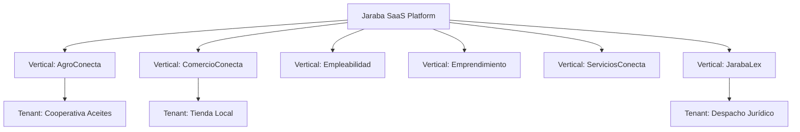

# Patrones de Customización por Vertical

> **Versión**: 2.1.0
> **Ultima actualizacion**: 2026-02-20

## 1. Arquitectura Multi-Vertical

La plataforma Jaraba SaaS implementa un modelo **multi-vertical** donde cada vertical puede tener configuraciones, features y agentes IA específicos.

### 1.1 Verticales Activos en Producción

| Vertical | Machine Name | Design Tokens | Preview Images (Page Builder) |
|----------|-------------|---------------|------------------------------|
| **AgroConecta** | `agroconecta` | `--ej-agro-*` | 11/11 ✅ (verde-dorado) |
| **ComercioConecta** | `comercioconecta` | `--ej-comercio-*` | 11/11 ✅ (naranja-ámbar) |
| **Empleabilidad** | `empleabilidad` | `--ej-empleo-*` | 11/11 ✅ (azul-teal) |
| **Emprendimiento** | `emprendimiento` | `--ej-emprende-*` | 11/11 ✅ (púrpura-violeta) |
| **ServiciosConecta** | `serviciosconecta` | `--ej-servicios-*` | 11/11 ✅ (teal-cyan) |
| **JarabaLex** | `jarabalex` | `--ej-legal-*` | 11/11 ✅ (navy-dorado #1E3A5F + #C8A96E) |



## 2. Entidad Vertical

Cada Vertical es una **config entity** con los siguientes campos:

| Campo | Tipo | Descripción |
|-------|------|-------------|
| `id` | int | ID único de la vertical |
| `name` | string | Nombre visible (ej: "AgroConecta") |
| `machine_name` | string | Machine name (ej: `agroconecta`) |
| `description` | text | Descripción de la vertical |
| `enabled_features` | entity_reference | Features habilitadas (ref a `feature`) |
| `ai_agents` | entity_reference | Agentes IA disponibles (ref a `ai_agent`) |

> **✅ Actualizado**: Los campos `enabled_features` y `ai_agents` ahora son referencias a las Config Entities `feature` y `ai_agent` respectivamente.

### 2.1 Features (Config Entity)

Las features ahora son **config entities** gestionables desde `/admin/structure/features`:

| Feature ID | Nombre | Categoría |
|------------|--------|------------|
| `trazabilidad` | Trazabilidad de productos | general |
| `qr_codes` | Códigos QR | general |
| `ecwid_integration` | Integración Ecwid | integraciones |
| `firma_digital` | Firma Digital | seguridad |
| `blockchain` | Blockchain/Timestamping | seguridad |
| `webhooks` | Webhooks | integraciones |
| `api_access` | Acceso API | integraciones |

### 2.2 Agentes IA (Config Entity)

Los agentes IA son **config entities** gestionables desde `/admin/structure/ai-agents`:

| Agent ID | Nombre | Service ID |
|----------|--------|------------|
| `producer_copilot` | Producer Copilot | ecosistema_jaraba_core.producer_copilot |
| `marketing_agent` | Marketing Agent | ecosistema_jaraba_core.marketing_agent |
| `storytelling_agent` | Storytelling Agent | ecosistema_jaraba_core.storytelling_agent |
| `customer_experience_agent` | CX Agent | ecosistema_jaraba_core.customer_experience_agent |
| `product_agent` | Product Agent | ecosistema_jaraba_core.product_agent |

## 3. Aislamiento por Tenant

Cada Tenant pertenece a **una sola Vertical** y tiene:

| Componente | Propósito | Entidad |
|------------|-----------|---------|
| **Group** | Aislamiento de contenido | `group` (tipo: tenant) |
| **Domain** | Aislamiento de acceso | `domain` |
| **Plan** | Límites de uso | `saas_plan` |

### 3.1 Creación Automática

Al crear un nuevo Tenant (desde admin o onboarding), el hook `postSave()` en `Tenant.php` crea automáticamente:

1. **Group** del tipo `tenant` con el nombre del tenant
2. **Domain** basado en el campo `domain`
3. Añade el `admin_user` como miembro del Group

```php
// Tenant.php::postSave()
public function postSave(..., $update = TRUE): void {
    if (!$update) {
        $this->provisionGroupIfNeeded();
        $this->provisionDomainIfNeeded();
    }
}
```

## 4. Patrones de Customización

### 4.1 Customización por Vertical (Nivel Macro)

La Vertical define **qué features y agentes** están disponibles para todos los tenants de esa vertical:

```php
// Verificar si una feature está habilitada en la vertical
$tenant = $this->tenantContext->getCurrentTenant();
$vertical = $tenant->getVertical();

if (in_array('trazabilidad', $vertical->get('features')->getValue())) {
    // Mostrar módulo de trazabilidad
}
```

### 4.2 Customización por Plan (Nivel Límites)

El Plan SaaS define **límites numéricos** aplicables a todos los tenants con ese plan:

```php
$plan = $tenant->getSubscriptionPlan();
$limits = $plan->getLimits();

$maxProductores = $limits['productores'] ?? 10;
$maxStorageMb = $limits['almacenamiento_mb'] ?? 1024;
```

### 4.3 Customización por Tenant (Nivel Visual)

Cada Tenant puede personalizar su **apariencia** mediante `theme_overrides`:

```php
$overrides = $tenant->getThemeOverrides();
// Retorna: ['primary_color' => '#1a73e8', 'logo' => 'path/to/logo.png']
```

## 5. Extensión de Verticales

### 5.1 Añadir Nueva Feature (Zero-Code) ✅

1. Ir a `/admin/structure/features/add`
2. Completar: Nombre, ID, Descripción, Categoría, Icono
3. Guardar
4. Editar Vertical y marcar la nueva feature

### 5.2 Añadir Nuevo Agente IA (Zero-Code) ✅

1. Ir a `/admin/structure/ai-agents/add`
2. Completar: Nombre, ID, Service ID, Color, Icono
3. Guardar
4. Editar Vertical y marcar el nuevo agente

> **✅ Implementado**: Ya no requiere modificar código. Gestión 100% desde admin.

## 6. Ejemplo: Verificar Acceso a Feature

```php
use Drupal\ecosistema_jaraba_core\Service\TenantContextService;

class MyController {
    public function __construct(
        protected TenantContextService $tenantContext
    ) {}

    public function checkFeatureAccess(string $feature): bool {
        $tenant = $this->tenantContext->getCurrentTenant();
        if (!$tenant) {
            return FALSE;
        }
        
        $vertical = $tenant->getVertical();
        if (!$vertical) {
            return FALSE;
        }
        
        $features = $vertical->get('features')->getValue();
        $enabledFeatures = array_column($features, 'value');
        
        return in_array($feature, $enabledFeatures);
    }
}
```

## 7. Capacidades Cross-Vertical

### 7.1 Mensajeria Segura (jaraba_messaging)

El modulo `jaraba_messaging` soporta conversaciones **contextualizadas por vertical** via el campo `context_type`:

| context_type | Vertical | Caso de Uso |
|-------------|----------|-------------|
| `service_booking` | ServiciosConecta | Comunicacion profesional-cliente sobre una reserva |
| `legal_case` | JarabaLex | Consulta abogado-cliente con confidencialidad |
| `mentoring` | Emprendimiento | Mentorias entre mentores y emprendedores |
| `job_application` | Empleabilidad | Comunicacion candidato-empresa sobre oferta |
| `order` | AgroConecta / ComercioConecta | Consultas sobre pedidos y trazabilidad |
| `general` | Todos | Conversaciones generales sin contexto especifico |

Cada conversacion hereda el `tenant_id` y las claves de cifrado son per-tenant (Argon2id KDF). Los permisos y roles de participante (`owner`, `member`, `observer`) permiten control granular por vertical.

## 8. Roadmap

| Item | Estado | Prioridad |
|------|--------|-----------|
| Features como config entity | ✅ Completado | - |
| Agentes IA como config entity | ✅ Completado | - |
| Mensajeria segura cross-vertical | ✅ Completado (jaraba_messaging) | - |
| UI para theme_overrides | ⏸️ Planeado | Alta |
| Herencia de features (Vertical → Plan) | ⏸️ Planeado | Baja |

---

## Registro de Cambios

| Fecha | Versión | Descripción |
|-------|---------|-------------|
| 2026-02-20 | **2.1.0** | Seccion 7 nueva: Capacidades Cross-Vertical — documentacion de `jaraba_messaging` como servicio cross-vertical con context_type por vertical. Tabla de 6 context_types con casos de uso. Roadmap actualizado (messaging como completado). |
| 2026-02-20 | 2.0.0 | Actualizacion con los 6 verticales activos en produccion. Tabla de design tokens y estado de preview images por vertical. |
| 2026-01-10 | 1.0.0 | Creación inicial con features hardcodeadas |
| 2026-01-10 | 1.1.0 | Actualización: Features y AIAgents ahora son config entities |
