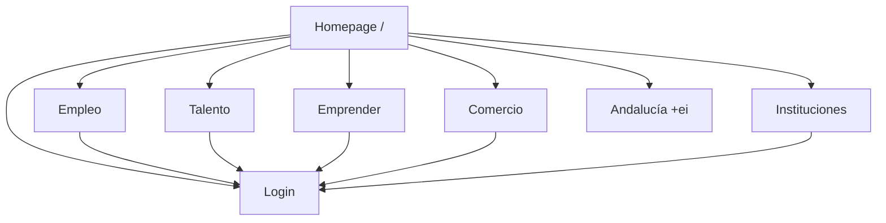
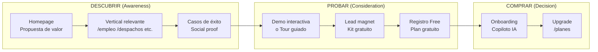

# Análisis Estratégico: Navegación, Verticales y Multiidioma

> **Perspectiva:** Consultor de negocio senior · Analista financiero · Experto en mercados · Consultor de marketing · Publicista  
> **Fecha:** 2026-02-27  
> **Objetivo:** Evaluar 3 cuestiones estratégicas para elevar el SaaS a clase mundial

---

## 1. ¿Sección Dedicada a Despachos/Abogados?

### Veredicto: **SÍ, absolutamente. Es el vertical con mayor ARPU potencial.**

### Tamaño del mercado

| Dato | Cifra | Fuente |
|------|-------|--------|
| Despachos de abogados en España | ~145.000 | CGAE (Consejo General de la Abogacía) |
| Abogados colegiados ejercientes | ~155.000 | CGAE 2024 |
| Facturación del sector legal en España | ~29.000M€/año | INE + estimaciones sectoriales |
| Penetración legaltech (software) | ~12-15% | LawtechES |
| Mercado legaltech España estimado | ~500-700M€ | LawtechES + inversiones |
| Crecimiento anual legaltech | 20-25% CAGR | Tendencia global |
| Ticket medio SaaS legal/despacho | 150-500€/mes | Benchmarks sector |

### Por qué es estratégico

1. **ARPU altísimo.** Un despacho medio paga 3-5x más por herramienta SaaS que un autónomo o pyme. El ticket medio de 150-500€/mes vs. 9-29€/mes de un emprendedor individual.

2. **Dolor real no resuelto.** El 85% de despachos pequeños-medianos (<10 abogados) siguen usando Excel, Word y carpetas físicas para gestionar expedientes. La digitalización es una necesidad urgente, no un "nice to have".

3. **Retención excepcional.** Los despachos que adoptan un sistema de gestión tienen un churn rate de <2% anual — una vez migrado el expediente, no se van.

4. **Sinergias con JarabaLex.** Ya tienes el vertical `/legal` (JarabaLex). Pero ahora mismo está posicionado como "servicios legales genéricos". **El reframing debería ser: "JarabaLex para Despachos"** — una solución vertical completa.

5. **Competencia fragmentada.** En España no hay un Clio (dominante en EEUU). Los competidores locales (Lefebvre, Wolters Kluwer) son caros y anticuados. Hay un hueco enorme para una solución moderna, con IA integrada, a precio competitivo.

### Recomendación de implementación

```
ACTUAL                              PROPUESTO
/legal → "Servicios legales"        /despachos → "Digitaliza tu despacho"
  (genérico, sin foco)                (específico, alta conversión)
                                    /legal → redirect 301 → /despachos
```

**Secciones clave de la landing `/despachos`:**
- Hero: "Tu despacho, ahora con IA" (pain: expedientes en papel)
- Pain points: Expedientes perdidos / Citas descontroladas / Facturación manual / Plazos que se escapan
- Features: Copiloto IA para borradores / Gestión de expedientes / Agenda inteligente / Facturación automatizada / Citaciones multi-formato
- Social proof: Testimonios de abogados reales
- Pricing: Plan Despacho desde X€/mes + Plan Bufete (>5 abogados)

> [!IMPORTANT]
> **Acción inmediata:** Renombrar `/legal` a `/despachos` con redirect 301. El naming "legal" es demasiado genérico; "despachos" habla directamente al decisor (el socio del despacho que busca digitalizar).

---

## 2. ¿Selector de Idioma?

### Veredicto: **SÍ, pero con matices sobre cuándo y cómo.**

### Análisis de coherencia con SaaS clase mundial

| Aspecto | Sin selector | Con selector |
|---------|:-----------:|:------------:|
| Percepción de escala | Regional | Global |
| Mercado potencial | 47M (España) | 600M+ (hispanohablantes + EU/EN) |
| Credibilidad institucional | Media | Alta (fondos EU exigen multilingüismo) |
| SEO internacional | Nulo | Significativo |
| Complejidad técnica | Baja | Media-alta |

### Los 3 niveles de multilingüismo

**Nivel 1 — Inmediato (Quick Win, 1-2 días):**
- Selector ES/EN en el header
- El frontend ya usa `` y `|t` → toda la interfaz es traducible
- Drupal ya tiene el motor de traducción preparado
- Solo necesitas exportar los `.po` files y traducir
- **ROI:** Desbloquea credibilidad con inversores/instituciones EU internacionales

**Nivel 2 — Corto plazo (1-2 semanas):**
- Añadir Portugués (PT) — mercado natural por proximidad geográfica + LATAM
- Añadir Francés (FR) — fondos EU, cooperación Magreb
- Prefijos `/es/`, `/en/`, `/pt/`, `/fr/` con `hreflang`

**Nivel 3 — Medio plazo:**
- IA de traducción automática para contenido dinámico (artículos, casos de éxito)
- Detección automática de idioma por geolocalización/browser

### Diseño del selector (best practice SaaS 2026)

```
┌──────────────────────────────────┐
│  [Logo]  Empleo  Emprender  ...  │  🌐 ES ▼  │  Login │  CTA  │
│                                  │  ├─ ES     │       │       │
│                                  │  ├─ EN     │       │       │
│                                  │  └─ PT     │       │       │
└──────────────────────────────────┘
```

- Posición: Header, antes de "Iniciar sesión"
- Icono: 🌐 (globo) + código ISO de 2 letras
- Dropdown minimalista, no banderas (las banderas son problemáticas: ¿bandera UK o US para inglés?)
- Persistencia: Cookie `lang_preference` + URL prefix

> [!TIP]
> **El selector de idioma NO es solo UX — es señal de credibilidad.** Cuando una institución pública europea evalúa un SaaS, el multilingüismo es un criterio de scoring. Sin él, quedas fuera de muchas licitaciones EU automáticamente.

---

## 3. ¿Flujo de Navegación Optimizado?

### Estado actual y diagnóstico



### Problemas detectados

| Problema | Impacto | Gravedad |
|----------|---------|----------|
| **No hay jerarquía de verticales** — todos tienen el mismo peso visual en el menú | El visitante no sabe cuál es para él | 🔴 Alto |
| **Falta la ruta Descubrir → Probar → Comprar** | No hay embudo, solo landing → login | 🔴 Alto |
| **No hay "/planes" ni "/precios" en la navegación principal** | El visitante no puede evaluar el coste | 🟡 Medio |
| **"Andalucía +ei" en la nav principal** es un programa, no un vertical | Confunde la arquitectura de información | 🟡 Medio |
| **No hay demo interactiva ni tour** | El visitante no puede "probar antes de comprar" | 🔴 Alto |
| **Falta sección "Despachos/Abogados"** en la nav (ver punto 1) | Se pierde el vertical de mayor ARPU | 🔴 Alto |

### Flujo óptimo: Descubrir → Probar → Comprar



### Propuesta de navegación renovada

**Actual:**
```
Empleo | Talento | Emprender | Comercio | Instituciones | [Login] | [Andalucía +ei]
```

**Propuesta:**
```
Soluciones ▼ | Precios | Casos de Éxito | Blog | [🌐 ES] | [Login] | [Empieza Gratis →]
```

Donde **"Soluciones ▼"** despliega un megamenú por audiencia:

| Para ti | Para tu empresa | Para tu institución |
|---------|-----------------|---------------------|
| Busca empleo | Digitaliza tu negocio | Desarrollo local |
| Reinvéntate profesionalmente | Despachos de abogados | Andalucía +ei |
| Emprende tu idea | AgroConecta | Programas de empleo |
| | ComercioConecta | |

### Cambios clave

1. **CTA principal "Empieza Gratis"** siempre visible — no "Login". El login es una acción secundaria.
2. **"Precios"** visible en la nav — el visitante necesita evaluar antes de registrarse.
3. **"Casos de Éxito"** en la nav principal — la prueba social es el mayor acelerador de conversión.
4. **Megamenú por audiencia** — en vez de listar verticales, agrupa por persona: "¿Quién eres?"
5. **"Andalucía +ei"** baja a submenu — es un programa, no una categoría de producto.

### Métricas esperadas de conversión

| Métrica | Actual (estimado) | Objetivo con cambios |
|---------|:-----------------:|:-------------------:|
| CTR nav → vertical | ~3% | 8-12% |
| Landing → registro | ~1-2% | 4-6% |
| Registro → activación | ~15% | 30-40% |
| Visitor → lead (kit) | ~0.5% | 3-5% |

---

## Resumen Ejecutivo

| Decisión | Recomendación | Prioridad | Esfuerzo | Impacto |
|----------|:------------:|:---------:|:--------:|:-------:|
| **Sección Despachos/Abogados** | ✅ SÍ | P0 | 2-3 días | 🔴 Muy alto |
| **Selector de idioma** | ✅ SÍ (nivel 1 ES/EN) | P1 | 1-2 días | 🟡 Alto |
| **Reestructurar navegación** | ✅ SÍ (megamenú + embudo) | P0 | 3-5 días | 🔴 Muy alto |

> [!IMPORTANT]
> **La navegación es el mayor freno a la conversión.** Un visitante que llega y ve 7 opciones planas sin jerarquía se paraliza. El patrón "Soluciones ▼ megamenú" + "Empieza Gratis" como CTA principal es el estándar de los SaaS que convierten (Notion, Canva, HubSpot, Monday.com).
