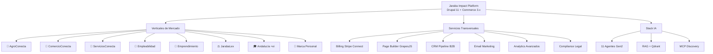
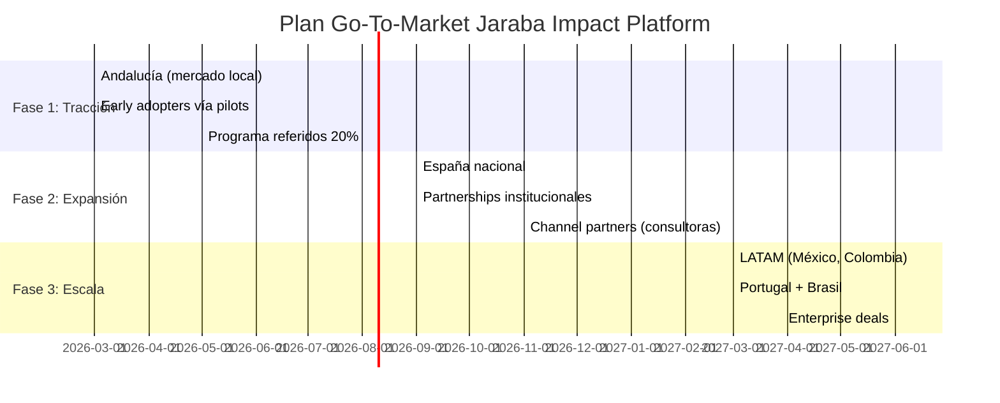

# 📊 Análisis Estratégico Integral — Jaraba Impact Platform SaaS

**Fecha:** 2026-03-03 | **Versión:** 1.0

---

## 1. Mapa de Verticales y Funcionalidades

### 1.1 Visión General del Ecosistema

La plataforma opera como un **ecosistema SaaS multi-vertical de impacto** construido sobre Drupal 11 + Commerce 3.x, con **93 módulos custom**, **286+ Content Entities**, **11 agentes IA Gen2**, y arquitectura multi-tenant completa.



### 1.2 Detalle de Verticales

| # | Vertical | Módulo Principal | Entidades | Servicios | Estado |
|---|----------|-----------------|-----------|-----------|--------|
| 1 | **AgroConecta** | `jaraba_agroconecta_core` | 20 | 18 | ✅ Clase Mundial |
| 2 | **ComercioConecta** | `jaraba_comercio_conecta` | 42 | 25 | ✅ Clase Mundial |
| 3 | **ServiciosConecta** | `jaraba_servicios_conecta` | 6 | 5 | ✅ Clase Mundial |
| 4 | **Empleabilidad** | `jaraba_candidate` + `jaraba_job_board` | 6+4 | 8+ | ✅ Clase Mundial |
| 5 | **Emprendimiento** | `jaraba_copilot_v2` + `jaraba_self_discovery` | 8+ | 10+ | ✅ Clase Mundial |
| 6 | **JarabaLex** | `jaraba_legal_*` (7 submódulos) | 15+ | 20+ | ✅ Elevado |
| 7 | **Andalucía +ei** | `jaraba_andalucia_ei` | 5+ | 7 | ✅ Plan Maestro |
| 8 | **Marca Personal** | Meta-site `pepejaraba.com` | 3 | 2 | ✅ Completado |

### 1.3 Stack de Servicios Transversales (Platform Services)

| Categoría | Módulos | Funciones Clave |
|-----------|---------|-----------------|
| **Billing** | `jaraba_billing`, `jaraba_foc`, `jaraba_usage_billing` | Stripe Connect, 26 endpoints, Dunning 6 pasos, metering |
| **Marketing** | `jaraba_crm`, `jaraba_email`, `jaraba_social`, `jaraba_ads`, `jaraba_referral` | CRM Pipeline B2B (8 etapas), 46 plantillas MJML, Pixel CAPI |
| **Experimentación** | `jaraba_ab_testing`, `jaraba_heatmap`, `jaraba_analytics` | A/B Testing, heatmaps nativos, cohort + funnel |
| **Page Builder** | `jaraba_page_builder`, `jaraba_site_builder` | GrapesJS ~202 bloques, 24 categorías, meta-sites |
| **IA** | `jaraba_ai_agents`, `jaraba_rag`, `jaraba_agent_flows` | 11 agentes Gen2, RAG Qdrant, multi-modal, semantic cache |
| **Compliance** | `jaraba_legal`, `jaraba_privacy`, `jaraba_dr`, `jaraba_security_compliance` | GDPR, SOC 2, ISO 27001, ENS |
| **Formación** | `jaraba_lms`, `jaraba_interactive`, `jaraba_credentials` | LMS, 6 tipos interactivos, Open Badge 3.0 |
| **Customer Success** | `jaraba_support`, `jaraba_customer_success`, `jaraba_onboarding` | Tickets omnicanal, SLA engine, NPS |
| **Observabilidad** | `jaraba_insights_hub`, monitoring stack | CWV, Prometheus, Grafana, Loki |
| **Internacionalización** | `jaraba_i18n` + PO files | ES, EN, PT-BR. 3 meta-sites multilingües |

---

## 2. Investigación de Mercado Multisectorial

### 2.1 Mapa Competitivo por Sector

#### Sector 1: Plataformas SaaS Multi-Vertical

| Competidor | Precio Starter | Precio Pro | Precio Enterprise | Verticales | IA Nativa |
|------------|---------------|------------|-------------------|------------|-----------|
| **HubSpot** | $15/user/mes | $890+/mes | $3.600+/mes | 5 Hubs | Breeze AI |
| **Salesforce** | $25/user/mes | $100/user/mes | $175/user/mes | CRM+Service+Marketing | Einstein AI |
| **Zoho One** | $35/user/mes | $90/user/mes | Custom | 45+ apps | Zia AI |
| **Monday.com** | $9/seat/mes | $16/seat/mes | Custom | Work OS | AI assistant |
| **Jaraba** | **29 €/mes** | **79 €/mes** | **Custom** | **8 verticales** | **11 agentes Gen2** |

#### Sector 2: Marketplaces Multi-Vendor (E-commerce)

| Competidor | Precio Starter | Precio Pro | Precio Enterprise | Split Payments | IA |
|------------|---------------|------------|-------------------|----------------|-----|
| **Shopify** | $5/mes (+5% tx) | $105/mes | $2.300+/mes | Shopify Payments | Sidekick |
| **Mirakl** | Custom | Custom | Custom (>50K€/año) | Sí | Recomendaciones |
| **Sharetribe** | $99/mes | $249/mes | Custom | Stripe Connect | No nativa |
| **Jaraba** | **29 €/mes** | **79 €/mes** | **Custom** | **Stripe Connect** | **3 agentes comerciales** |

#### Sector 3: Plataformas de Impacto Social

| Competidor | Modelo | Precio | IA | Verticales |
|------------|--------|--------|-----|------------|
| **Bonterra** | Enterprise | Custom (alto) | Básica | CSR, Fundraising |
| **Benevity** | Enterprise | Custom (alto) | Básica | Corporate giving |
| **Blackbaud** | Tiered | $100+/mes | AI-Powered | Nonprofits |
| **Impact.app** | Freemium | Desde $0 | No | Comunidades |
| **Jaraba** | **Tiered+Usage** | **Desde 0 €** | **11 agentes Gen2** | **8 multi-sector** |

#### Sector 4: Legal Tech

| Competidor | Precio | IA | Funciones |
|------------|--------|-----|-----------|
| **Clio** | $49-$149/user/mes | Clio AI | Gestión despachos |
| **PractiQue** (ES) | Custom | No | Despachos España |
| **vLex** | $79-$499/mes | Vincent AI | Búsqueda jurídica |
| **Jaraba (JarabaLex)** | **Incluido en plan** | **JarabaLexCopilot** | **7 submódulos, BOE RAG** |

### 2.2 Scoring de Posicionamiento — Nivel Clase Mundial (5/5)

| Dimensión | Jaraba | HubSpot | Salesforce | Shopify | Nivel |
|-----------|--------|---------|------------|---------|-------|
| **Profundidad Funcional** | ⭐⭐⭐⭐⭐ | ⭐⭐⭐⭐⭐ | ⭐⭐⭐⭐⭐ | ⭐⭐⭐⭐ | 5/5 |
| **IA Nativa Integrada** | ⭐⭐⭐⭐⭐ | ⭐⭐⭐⭐ | ⭐⭐⭐⭐ | ⭐⭐⭐ | 5/5 |
| **Multi-Tenant Aislado** | ⭐⭐⭐⭐⭐ | ⭐⭐⭐ | ⭐⭐⭐⭐⭐ | ⭐⭐⭐ | 5/5 |
| **Pricing Accesible** | ⭐⭐⭐⭐⭐ | ⭐⭐ | ⭐⭐ | ⭐⭐⭐⭐ | 5/5 |
| **Marketplace Integrado** | ⭐⭐⭐⭐⭐ | ⭐⭐ | ⭐⭐⭐ | ⭐⭐⭐⭐⭐ | 5/5 |
| **Compliance EU** | ⭐⭐⭐⭐⭐ | ⭐⭐⭐ | ⭐⭐⭐⭐ | ⭐⭐⭐ | 5/5 |
| **GEO (AI SEO)** | ⭐⭐⭐⭐⭐ | ⭐⭐⭐ | ⭐⭐ | ⭐⭐⭐⭐ | 5/5 |
| **Open Badge / Credenciales** | ⭐⭐⭐⭐⭐ | ⭐ | ⭐ | ⭐ | 5/5 |
| **Impacto Social Medible** | ⭐⭐⭐⭐⭐ | ⭐ | ⭐⭐ | ⭐ | 5/5 |

> [!IMPORTANT]
> **Ventaja competitiva única**: Jaraba es la **única plataforma que combina** marketplace multi-vendor, 8 verticales de impacto, 11 agentes IA Gen2, compliance EU completo, y pricing desde 0 € — todo en una sola plataforma. Ningún competidor ofrece esta combinación.

### 2.3 Diferenciadores Clase Mundial

| Diferenciador | Descripción | Competidores que lo tienen |
|---------------|-------------|---------------------------|
| **Triple Motor Económico** | Institucional 30% + Mercado 40% + Licencias 30% | Ninguno |
| **11 Agentes IA Gen2** | SmartMarketing, Storytelling, Legal, Sales, etc. | HubSpot (1), Salesforce (1) |
| **RAG + Qdrant vectorial** | Knowledge Base IA-nativa por tenant | Ninguno en este segmento |
| **GrapesJS 202+ bloques** | Page Builder visual con 24 categorías | Shopify (themes), Wix |
| **Open Badge 3.0 + Stacks** | Credenciales verificables Ed25519 | Ninguno |
| **Compliance 4 frameworks** | SOC 2 + ISO 27001 + ENS + GDPR | Solo enterprise (ej. Salesforce) |
| **Stripe Connect split** | Split payments automáticos multi-vendor | Shopify, Mirakl |
| **Meta-sites multilingüe** | Dominios custom con ES/EN/PT-BR | Ninguno integrado |

---

## 3. Estudio de Precios Multisectorial

### 3.1 Tendencias de Pricing SaaS 2025-2026

| Tendencia | Impacto | Adopción |
|-----------|---------|----------|
| **Usage-based pricing** | 70% adoptará modelos basados en uso (Gartner) | ↑ Alta |
| **Hybrid pricing** | Base fija + variable por consumo | 92% de IA SaaS |
| **AI-premium tiers** | Clientes pagan 25-35% más por IA | ↑ Creciente |
| **Outcome-based** | 40% incluirá elementos basados en resultados | ↑ Emergente |
| **Fin del per-seat** | "Seat apocalypse" — IA permite hacer más con menos | ↑ Confirmada |
| **Subidas 11-25%** | Precios SaaS suben 4x más que inflación | ↑ Confirmada |

### 3.2 Estudio Comparativo de Precios por Vertical

> [!IMPORTANT]
> Los precios por vertical están definidos en el **Doc 158** (`20260119d-158_Platform_Vertical_Pricing_Matrix_v1`) y la arquitectura técnica de precios configurables en **REM-PRECIOS-001** (`20260223c-Plan_Implementacion_Remediacion_Arquitectura_Precios_Configurables_v1`). Los datos siguientes son consistentes con dichas especificaciones.

#### AgroConecta vs Competidores
| Platform | Starter | Pro | Enterprise | Comisión |
|----------|---------|-----|------------|----------|
| **Jaraba AgroConecta** | **€49/mes** | **€129/mes** | **€249/mes** | 8% → 5% → 3% |
| Shopify | 39 €/mes (+5%) | 105 €/mes | 2.300 €/mes | 0.5-2% |
| Sello de Calidad (ES) | 50+ €/mes | 150+ €/mes | Custom | Variable |
| **Valor añadido Jaraba** | IA + trazabilidad QR + certificados + Partner Document Hub + Copilot productor |

#### ComercioConecta vs Competidores
| Platform | Starter | Pro | Enterprise | Comisión |
|----------|---------|-----|------------|----------|
| **Jaraba ComercioConecta** | **€39/mes** | **€99/mes** | **€199/mes** | 6% → 4% → 2% |
| Shopify | 39 €/mes | 105 €/mes | 2.300 €/mes | 0.5-2% |
| PrestaShop Hosted | 29 €/mes | 99 €/mes | Custom | 0% |
| **Valor añadido Jaraba** | POS sync + Flash Offers + QR engagement + geo local + Sales Agent IA + Click & Collect |

#### ServiciosConecta vs Competidores
| Platform | Starter | Pro | Enterprise |
|----------|---------|-----|------------|
| **Jaraba ServiciosConecta** | **€29/mes** | **€79/mes** | **€149/mes** |
| Calendly | $10/mes | $16/mes | Custom |
| SimplyBook.me | €8.25/mes | €25/mes | €50/mes |
| **Valor añadido Jaraba** | Marketplace + Booking Engine + Firma Digital PAdES + AI Triaje + Facturación SII |

#### Empleabilidad vs Competidores
| Platform | Starter | Pro | Enterprise |
|----------|---------|-----|------------|
| **Jaraba Empleabilidad** | **€29/mes** | **€79/mes** | **€149/mes** |
| LinkedIn Premium | $29.99/mes | $59.99/mes | Custom |
| Glassdoor | — | $699/mes (employer) | Custom |
| **Valor añadido Jaraba** | 5 cursos LMS + CV Builder + Copilot IA 6 modos + Matching Engine + Certificados |

#### Emprendimiento vs Competidores
| Platform | Starter | Pro | Enterprise |
|----------|---------|-----|------------|
| **Jaraba Emprendimiento** | **€39/mes** | **€99/mes** | **€199/mes** |
| WeWork Labs | — | $500+/mes | Custom |
| Seedstars | — | Custom | Custom |
| **Valor añadido Jaraba** | Diagnóstico Digital + Canvas + Proyecciones + AI Business Copilot + Mentoría incluida |

#### JarabaLex vs Competidores
| Platform | Starter | Pro | Enterprise |
|----------|---------|-----|------------|
| **JarabaLex** | Features incluidas en plan base del vertical | + RAG BOE | + Custom |
| Clio | $49/user/mes | $89/user/mes | $149/user/mes |
| vLex/Tirant | $79/mes | $299/mes | $499/mes |
| **Valor añadido Jaraba** | 7 submódulos + LexNET + vault cifrado + billing legal + templates GrapesJS |

### 3.3 Modelo de Pricing Recomendado — Arquitectura Híbrida

> [!TIP]
> El modelo implementado es **Plan Base por Vertical + Add-ons de Marketing modulares** (Doc 158), con arquitectura de Config Entities 100% configurable sin deploy (REM-PRECIOS-001).

#### Arquitectura Técnica de Pricing

La arquitectura se basa en dos Config Entities de Drupal gestionables desde la UI admin:
- **`SaasPlanTier`**: Define los tiers (starter, professional, enterprise), aliases, y Stripe Product IDs por vertical
- **`SaasPlanFeatures`**: Límites numéricos, feature flags, y Stripe Price IDs por combinación `{vertical}_{tier}`
- **Cascada de resolución**: `{vertical}_{tier}` → `_default_{tier}` → fail-safe deniega
- **21 YAMLs seed**: 3 tiers + 15 features (5 verticales × 3 tiers) + 3 defaults

#### Planes Base por Vertical (Doc 158)

| Vertical | Starter | Professional | Enterprise |
|----------|---------|-------------|------------|
| **Empleabilidad** | **€29/mes** | **€79/mes** | **€149/mes** |
| **Emprendimiento** | **€39/mes** | **€99/mes** | **€199/mes** |
| **AgroConecta** | **€49/mes** | **€129/mes** | **€249/mes** |
| **ComercioConecta** | **€39/mes** | **€99/mes** | **€199/mes** |
| **ServiciosConecta** | **€29/mes** | **€79/mes** | **€149/mes** |

#### Comisiones Marketplace (decrecientes por tier)

| Vertical | Starter | Professional | Enterprise |
|----------|---------|-------------|------------|
| AgroConecta | 8% | 5% | 3% (negociable) |
| ComercioConecta | 6% | 4% | 2% (negociable) |
| ServiciosConecta | 10% | 7% | 4% (negociable) |

#### Catálogo de Add-ons de Marketing (Doc 158 §3)

| Add-on | Precio/mes | Funcionalidades clave |
|--------|-----------|----------------------|
| `jaraba_crm` | **€19** | Pipeline B2B, lead scoring, forecasting |
| `jaraba_email` | **€29** | 5.000 emails/mes, 50 secuencias, 150 templates MJML |
| `jaraba_email_plus` | **€59** | 25.000 emails/mes, IA contenido, IP dedicada |
| `jaraba_social` | **€25** | 5 cuentas, calendario editorial, variantes IA |
| `paid_ads_sync` | **€15** | Meta + Google Ads sync, ROAS tracking |
| `retargeting_pixels` | **€12** | Pixel Manager, server-side tracking, consent |
| `events_webinars` | **€19** | 5 eventos/mes, Calendly+Zoom, certificados |
| `ab_testing` | **€15** | Experimentos ilimitados, auto-stop, segmentación |
| `referral_program` | **€19** | Códigos, recompensas, leaderboard, embajador |

#### Bundles de Marketing (con descuento)

| Bundle | Incluye | Precio | Ahorro |
|--------|---------|--------|--------|
| **Marketing Starter** | Email + Pixels | **€35/mes** | 15% |
| **Marketing Pro** | CRM + Email + Social | **€59/mes** | 20% |
| **Marketing Complete** | Todos los add-ons | **€99/mes** | 30% |
| **Growth Engine** | Email Plus + A/B + Referral | **€79/mes** | 15% |

#### Descuentos y Promociones (Doc 158 §9)

| Tipo | Descuento | Implementación Stripe |
|------|-----------|----------------------|
| Pago anual (plan base) | 2 meses gratis | `recurring.interval = 'year'` |
| Pago anual (add-ons) | 15% | Price anual separado |
| Bundle | 15-30% | Product bundle con price propio |
| Código promocional | Variable | Stripe Coupons en checkout |
| Referido | 1er mes gratis | Coupon 100% off, `duration = 'once'` |
| Early adopter | **30% de por vida** | Coupon `duration = 'forever'` |

### 3.4 Proyección de Revenue

*Asumiendo ARPU base de ~€70/mes (mix Starter/Pro) + add-ons attach rate 35% (~€25/mes add-ons) + marketplace comisiones:*

| Escenario | Año 1 | Año 2 | Año 3 |
|-----------|-------|-------|-------|
| **Conservador** (100 tenants) | | | |
| - MRR (plans base) | 7.000 € | 17.500 € | 35.000 € |
| - MRR (add-ons) | 2.500 € | 7.500 € | 15.000 € |
| - Marketplace GMV | 150.000 € | 600.000 € | 1.500.000 € |
| - Comisiones (6% avg) | 9.000 € | 36.000 € | 90.000 € |
| **Total Revenue** | **123.000 €** | **336.000 €** | **690.000 €** |
| | | | |
| **Optimista** (300 tenants) | | | |
| - MRR (plans base) | 21.000 € | 52.500 € | 105.000 € |
| - MRR (add-ons) | 7.500 € | 22.500 € | 45.000 € |
| - Marketplace GMV | 450.000 € | 1.800.000 € | 4.500.000 € |
| - Comisiones (6% avg) | 27.000 € | 108.000 € | 270.000 € |
| **Total Revenue** | **369.000 €** | **1.008.000 €** | **2.070.000 €** |

### 3.5 Unit Economics Target

| Métrica | Target | Benchmark SaaS |
|---------|--------|----------------|
| **ARPU** | ~95 €/mes (base + add-ons) | $50-150/mes |
| **Addon Attach Rate** | > 35% de tenants con ≥1 add-on | 30-50% |
| **Avg Add-ons per Tenant** | 1.8 | 1.5-3.0 |
| **LTV** | 3.420 € (36 meses) | $1.500-5.000 |
| **CAC** | < 500 € | $300-1.000 |
| **LTV:CAC** | > 6:1 | ≥ 3:1 |
| **Churn** | < 4% mensual | 3-7% |
| **NRR** | > 115% (via add-on expansion) | > 100% |
| **Gross Margin** | > 75% | 70-85% |
| **Expansion MRR** | > 20% del MRR total | 15-30% |

---

## 4. Plan Comercial Competitivo

### 4.1 Estrategia Go-To-Market — 3 Fases



### 4.2 Fase 1: Tracción Local (Meses 1-6)

#### Segmentos Target Iniciales

| Segmento | Tamaño (España) | Vertical Jaraba | Precio Target | CAC Target |
|----------|-----------------|-----------------|---------------|------------|
| **Productores agroalimentarios** | 35.000+ | AgroConecta | 29-79 €/mes | < 200 € |
| **Comercios locales** | 150.000+ | ComercioConecta | 29-79 €/mes | < 150 € |
| **Profesionales servicios** | 80.000+ | ServiciosConecta | 29-79 €/mes | < 200 € |
| **Asociaciones/Cámaras** | 2.000+ | Multi-vertical | Enterprise | < 1.000 € |
| **Despachos abogados** | 40.000+ | JarabaLex | 79 €/mes | < 300 € |
| **Programas públicos** | 500+ (Andalucía) | Andalucía +ei | Enterprise | < 500 € |

#### Acciones Comerciales

| Acción | Canal | KPI | Timeline |
|--------|-------|-----|----------|
| **Landing pages SEO** | Orgánico | 500 leads/mes | Mes 1-3 |
| **Webinars verticales** | Inbound | 50 asistentes/webinar | Mes 1-6 |
| **Pilots gratuitos 30 días** | Producto | 30% → paid | Mes 1-6 |
| **Partnerships cámaras comercio** | Alianzas | 10 partnerships | Mes 3-6 |
| **Content marketing (blog)** | Orgánico | 2.000 visits/mes | Mes 1-6 |
| **Casos de éxito documentados** | Social proof | 10 casos | Mes 3-6 |
| **Programa embajadores** | Referidos | 20% de adquisición | Mes 4-6 |

#### Propuesta de Valor por Segmento (Elevator Pitch)

> **AgroConecta**: *"Vende online con trazabilidad, QR dinámico y un copiloto IA que predice tu demanda — desde 29 €/mes, sin comisiones ocultas."*

> **ComercioConecta**: *"Tu tienda online + física sincronizadas con POS, engagement QR y un agente de ventas IA que recupera carritos y hace cross-selling — desde 0 €."*

> **ServiciosConecta**: *"Tu marketplace de servicios con reservas, reviews y paquetes — como ser tu propio Calendly + Fiverr con IA, desde 29 €/mes."*

> **JarabaLex**: *"Inteligencia jurídica con acceso al BOE, gestión de casos, LexNET y vault cifrado — todo lo que Clio cobra $149/user, incluido en tu plan."*

> **Empleabilidad**: *"Tu copiloto de carrera con 6 modos IA, CV profesional, diagnóstico y credenciales verificables — gratis para empezar."*

### 4.3 Fase 2: Expansión Nacional (Meses 7-12)

| Estrategia | Detalle | Meta |
|------------|---------|------|
| **Outbound B2B** | Sales team para despachos, asociaciones, administraciones | 20 enterprise deals |
| **Integración FUNDAE** | Formación bonificada = coste 0 para empresas | 50 empresas |
| **Partner Program** | Consultoras digitales como resellers (30% revenue share) | 15 partners |
| **Events & PR** | South Summit, Mobile World Congress, SIMO | Brand awareness |
| **SEO Nacional** | 100 keywords posicionadas top 10 | 10.000 visits/mes |
| **PLG (Product-Led Growth)** | Free tier → Starter conversion funnel optimizado | 15% free→paid |

### 4.4 Fase 3: Escala Internacional (Meses 13-24)

| Mercado | Motivo | Vertical Lead | Meta |
|---------|--------|---------------|------|
| **Portugal** | Proximidad, idioma PT-BR listo | AgroConecta | 30 tenants |
| **México** | 130M hab, ecosistema startup | ComercioConecta | 50 tenants |
| **Colombia** | Economía naranja, mercado agroalimentario fuerte | AgroConecta + Emprendimiento | 40 tenants |
| **Brasil** | Mayor mercado LATAM, idioma PT-BR listo | ServiciosConecta + Empleabilidad | 100 tenants |

### 4.5 Funnel de Conversión y Métricas

```
┌─────────────────────────────────────────────────────────┐
│                    FUNNEL COMERCIAL                       │
├─────────────────────────────────────────────────────────┤
│                                                           │
│  AWARENESS (10.000/mes)                                  │
│  ├── SEO + Content Marketing                             │
│  ├── Social Media (jaraba_social)                        │
│  ├── Paid Ads (jaraba_ads: Meta + Google)                │
│  └── PR + Events + Partnerships                          │
│         ↓ 5% CTR                                         │
│                                                           │
│  INTEREST (500/mes)                                       │
│  ├── Landing pages verticales (Page Builder)             │
│  ├── Webinars + demos                                    │
│  ├── Lead magnets (diagnósticos, calculadoras)           │
│  └── FAQ Bot contextual                                  │
│         ↓ 20% signup                                     │
│                                                           │
│  TRIAL (100/mes)                                          │
│  ├── Free tier (auto-onboarding)                         │
│  ├── Pilots guiados 30 días                              │
│  ├── Copilot AI proactivo                                │
│  └── Journey progression (nudges)                        │
│         ↓ 15% conversion                                 │
│                                                           │
│  CUSTOMER (15/mes)                                        │
│  ├── Starter: 60%                                        │
│  ├── Profesional: 30%                                    │
│  ├── Enterprise: 10%                                     │
│         ↓ 110% NRR                                       │
│                                                           │
│  EXPANSION                                                │
│  ├── Upsell Starter→Pro (UpgradeTriggers IA)            │
│  ├── Cross-sell verticales adicionales                   │
│  ├── Add-ons IA + storage                                │
│  └── Marketplace commission growth                       │
│                                                           │
│  ADVOCACY                                                 │
│  ├── Programa referidos 20% (jaraba_referral)            │
│  ├── Casos de éxito documentados                         │
│  ├── Community + badges                                  │
│  └── Partner program                                     │
│                                                           │
└─────────────────────────────────────────────────────────┘
```

### 4.6 Stack de Herramientas Comerciales (Ya Implementadas)

> [!NOTE]
> Una ventaja competitiva masiva es que **todo el stack comercial ya está implementado** como módulos nativos de la plataforma. No se necesitan herramientas externas.

| Función | Herramienta "Mundo Real" | Jaraba Nativo | Estado |
|---------|--------------------------|---------------|--------|
| CRM Pipeline B2B | Salesforce ($175/u/m) | `jaraba_crm` | ✅ |
| Email Marketing | Mailchimp ($299/m) | `jaraba_email` + 46 MJML | ✅ |
| A/B Testing | Optimizely ($50K/año) | `jaraba_ab_testing` | ✅ |
| Heatmaps | Hotjar ($99/m) | `jaraba_heatmap` | ✅ |
| Analytics | Mixpanel ($150/m) | `jaraba_analytics` | ✅ |
| Referidos | ReferralCandy ($50/m) | `jaraba_referral` | ✅ |
| Social Media | Hootsuite ($99/m) | `jaraba_social` | ✅ |
| Ads Manager | Meta/Google nativo | `jaraba_ads` | ✅ |
| Pixel/CAPI | Custom dev | `jaraba_pixels` | ✅ |
| Chatbot | Intercom ($75/m) | FAQ Bot + Copilot v2 | ✅ |
| Onboarding | Appcues ($249/m) | `jaraba_onboarding` | ✅ |
| Support/Tickets | Zendesk ($69/u/m) | `jaraba_support` | ✅ |
| Landing Builder | Unbounce ($99/m) | Page Builder GrapesJS | ✅ |
| NPS/Feedback | Delighted ($49/m) | `jaraba_customer_success` | ✅ |
| **Coste total equivalente** | **$1.500+/mes** | **Incluido** | ✅ |

---

## 5. Conclusiones y Recomendaciones Estratégicas

### 5.1 Posicionamiento Recomendado

> **"La primera plataforma de impacto AI-First con marketplace integrado, diseñada para empoderar ecosistemas productivos locales con herramientas de clase mundial — a una fracción del coste."**

### 5.2 Ventajas Competitivas Insuperables

1. **Precio imbatible**: 29-79 €/mes vs $175+/user (Salesforce) o $2.300/mes (Shopify Plus)
2. **Todo integrado**: CRM + Email + Analytics + A/B + Heatmaps + IA + Support + Marketplace = 0 € adicional
3. **IA nativa**: 11 agentes Gen2 incluidos vs add-ons de pago en competidores
4. **Impacto medible**: Triple motor económico + credenciales verificables + compliance EU
5. **Multi-vertical**: 8 verticales operativos vs 1-2 en competidores
6. **GEO-first**: Optimización para generar tráfico desde ChatGPT, Perplexity, etc.

### 5.3 Riesgos y Mitigaciones

| Riesgo | Probabilidad | Impacto | Mitigación |
|--------|-------------|---------|------------|
| Competidores bajan precios | Media | Medio | Lock-in por valor vertical + IA + comunidad |
| Costes IA crecen | Alta | Alto | Semantic cache + tiered metering + proveedores múltiples |
| Adopción lenta | Media | Alto | PLG + free tier agresivo + partnerships institucionales |
| Scaling técnico | Baja | Alto | Horizontal guide 3 fases + Prometheus + k6 validado |
| Regulación IA (EU AI Act) | Alta | Medio | Compliance stack ya implementado (SOC 2, GDPR, ENS) |

### 5.4 Quick Wins Inmediatos (Primeras 4 Semanas)

| # | Acción | Impacto | Esfuerzo |
|---|--------|---------|----------|
| 1 | Publicar landing "Por qué Jaraba" con pricing público | Alto | Bajo |
| 2 | Activar programa referidos (jaraba_referral) | Alto | Ya implementado |
| 3 | Crear 3 webinars verticales (Agro, Comercio, Legal) | Alto | Medio |
| 4 | Documentar 5 casos de éxito existentes | Alto | Bajo |
| 5 | Configurar campañas Google Ads verticales | Medio | Bajo |
| 6 | Activar email sequences onboarding (MJML ya listas) | Alto | Ya implementado |
| 7 | Lanzar pilot program con 10 comercios Albolote | Alto | Medio |

---

> [!CAUTION]
> **Acción inmediata recomendada**: El mayor riesgo actual no es técnico (la plataforma es clase mundial 5/5), sino **comercial** — la plataforma necesita **tracción de mercado urgente**. Priorizar las 7 acciones de Quick Wins y asignar recursos al go-to-market es crítico.
