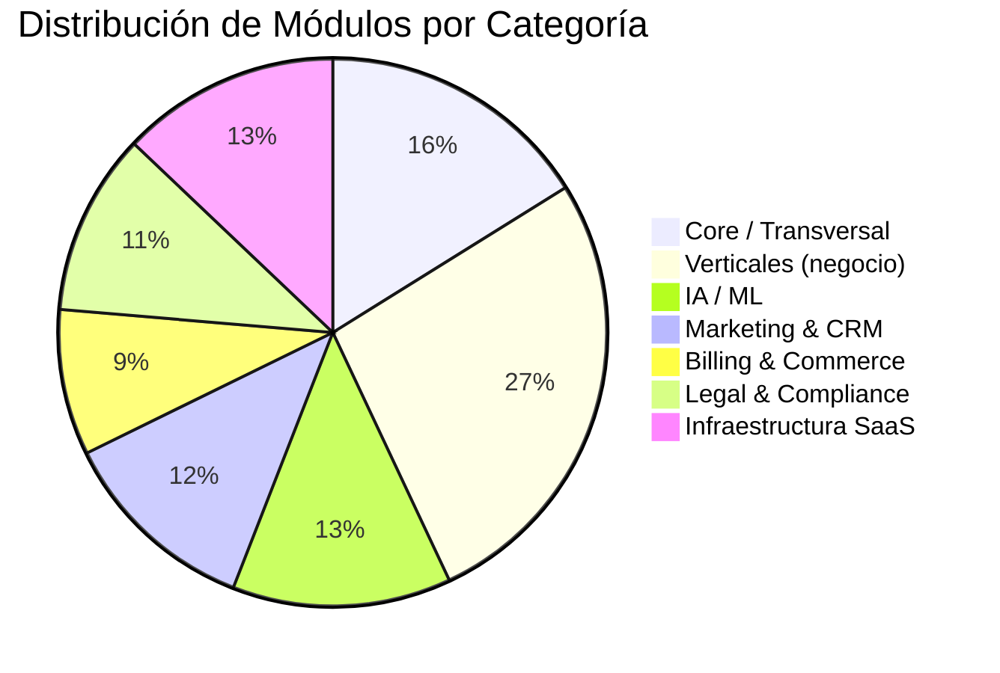
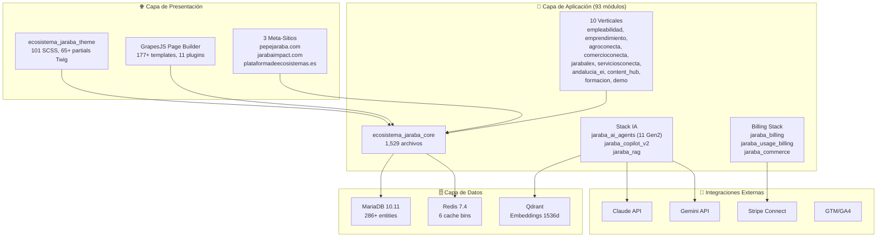
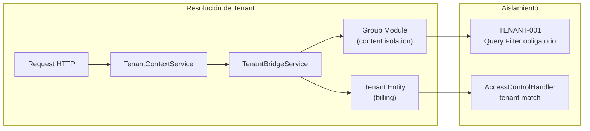
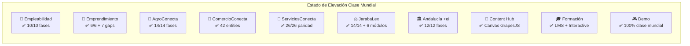
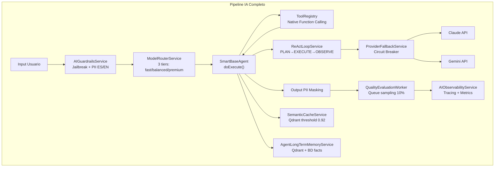
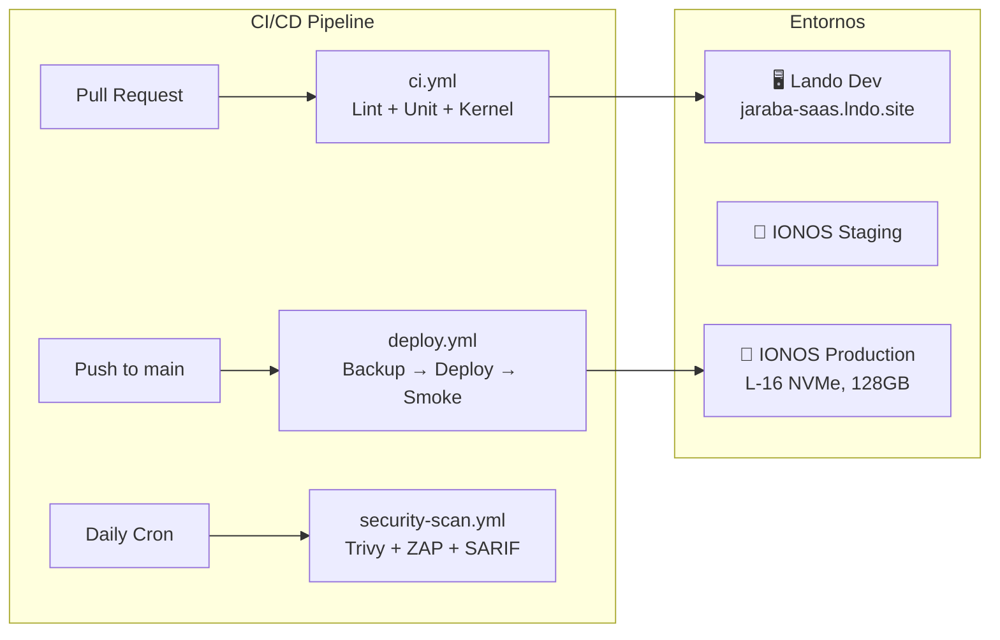
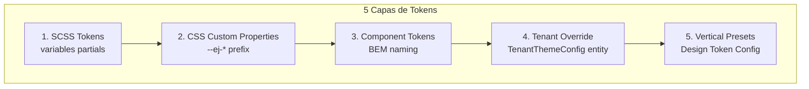
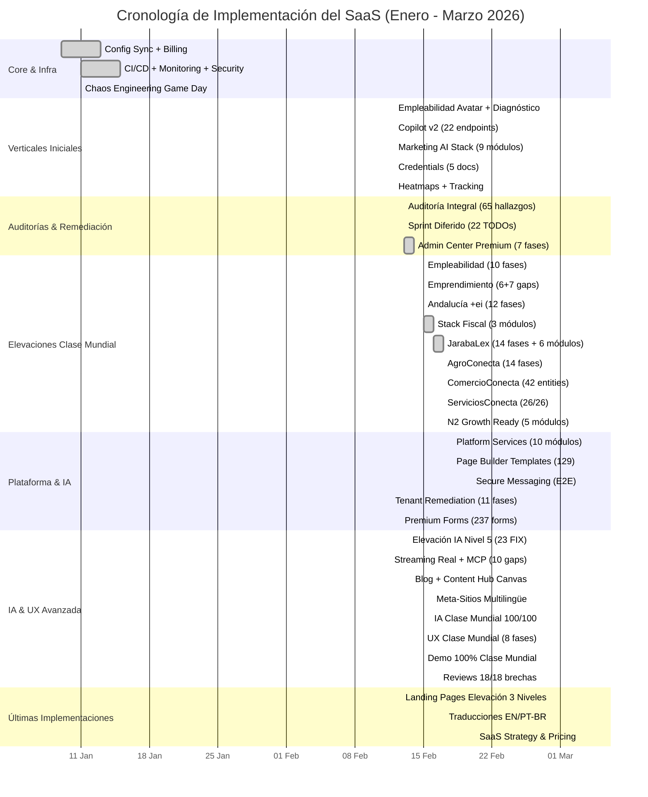

# 🗺️ Mapa de Estado de Implementación — Jaraba Impact Platform SaaS

> **Documento de análisis**: Estado de implementación completo del proyecto al 2026-03-03.
> **Versión:** 1.0.0 | **Autor:** Análisis automatizado Antigravity
> **Cross-refs:** CLAUDE.md v1.1.0, Directrices v102.0.0, Arquitectura v91.0.0, Índice v131.0.0

---

## 📑 Índice (TOC)

1. [Resumen Ejecutivo](#1-resumen-ejecutivo)
2. [Métricas Globales del Proyecto](#2-métricas-globales-del-proyecto)
3. [Arquitectura General — Diagrama](#3-arquitectura-general--diagrama)
4. [Estado de los 10 Verticales](#4-estado-de-los-10-verticales)
5. [Mapa de los 93 Módulos Custom](#5-mapa-de-los-93-módulos-custom)
6. [Pipeline IA — 11 Agentes Gen 2](#6-pipeline-ia--11-agentes-gen-2)
7. [Stack de Infraestructura y DevOps](#7-stack-de-infraestructura-y-devops)
8. [Theming y Frontend](#8-theming-y-frontend)
9. [Estado de Testing y Calidad](#9-estado-de-testing-y-calidad)
10. [Documentación y Governance](#10-documentación-y-governance)
11. [Tabla de Correspondencias: Specs ↔ Módulos ↔ Estado](#11-tabla-de-correspondencias-specs--módulos--estado)
12. [Cronología de Implementación](#12-cronología-de-implementación)
13. [Roadmap y Deuda Técnica](#13-roadmap-y-deuda-técnica)

---

## 1. Resumen Ejecutivo

**Jaraba Impact Platform** es una plataforma SaaS multi-tenant construida sobre Drupal 11 + PHP 8.4 que opera un ecosistema de **10 verticales canónicos** con **93 módulos custom**, **11 agentes IA Gen 2**, y un Page Builder visual (GrapesJS). El proyecto ha alcanzado un nivel de madurez arquitectónica de **5.0/5.0** con +3,700 archivos PHP, +3,000 tests unitarios, y un framework documental de +750 documentos.

> [!IMPORTANT]
> La plataforma se encuentra en fase **pre-producción avanzada**. La infraestructura de código está completa al ~95%, con gaps residuales concentrados en testing end-to-end, deploy a producción IONOS, y contenido seed de algunos verticales.

### Indicadores Clave

| Indicador | Valor |
|-----------|-------|
| Módulos custom | 93 |
| Archivos PHP custom | 3,713 |
| Verticales canónicos | 10 |
| Content Entities | 286+ |
| Agentes IA Gen 2 | 11 |
| Templates Page Builder | 177+ |
| Archivos SCSS (tema) | 101 |
| Tests PHPUnit suites | 3,342+ |
| Reglas de oro (golden rules) | 89+ |
| Aprendizajes documentados | 155+ |
| Documentos en docs/ | 750+ |
| Versión Directrices | v102.0.0 |
| Nivel madurez arquitectónica | 5.0/5.0 |

---

## 2. Métricas Globales del Proyecto



### Stack Tecnológico

| Capa | Tecnología | Versión |
|------|-----------|---------|
| CMS Framework | Drupal | 11.3.2 |
| Lenguaje Backend | PHP | 8.4 |
| Base de Datos | MariaDB | 10.11 |
| Cache | Redis | 7.4 |
| Vector DB | Qdrant | latest |
| IA Principal | Claude API | Sonnet 4.6 / Opus 4.6 |
| IA Secundaria | Gemini API | 2.5 Flash |
| Page Builder | GrapesJS | 5.7 |
| Frontend JS | Vanilla JS | Drupal.behaviors |
| SCSS | Dart Sass | Moderno (@use) |
| Pagos | Stripe Connect | Destination charges |
| CI/CD | GitHub Actions | 3 workflows |
| Servidor | IONOS Dedicated | L-16 NVMe, 128GB RAM |
| Dev Local | Lando | .lando.yml |

---

## 3. Arquitectura General — Diagrama



### Arquitectura Multi-Tenant



---

## 4. Estado de los 10 Verticales



| # | Vertical | Módulo Principal | Fases Elevación | Entities | Feature Gate | Copilot | Email Seq. | PB Templates | Estado |
|---|----------|-----------------|----------------|----------|-------------|---------|-----------|-------------|--------|
| 1 | **Empleabilidad** | `jaraba_candidate`, `jaraba_job_board`, `jaraba_diagnostic`, `jaraba_self_discovery` | 10/10 ✅ | CandidateProfile, JobOffer, EmployabilityDiagnostic, InterestProfile, StrengthAssessment | ✅ 6 features | ✅ 6 modos | ✅ 5 secuencias | ✅ 11 | **Clase Mundial** |
| 2 | **Emprendimiento** | `jaraba_copilot_v2`, `jaraba_mentoring` | 6/6 + 7 gaps ✅ | EntrepreneurProfile, Hypothesis, Experiment, EntrepreneurLearning, FieldExit | ✅ 6 features | ✅ 6 modos | ✅ 5 secuencias | ✅ 11 | **Clase Mundial** |
| 3 | **AgroConecta** | `jaraba_agroconecta_core` | 14/14 ✅ | Catalog, Product, Order, ProducerProfile | ✅ 12 limits | ✅ Bridge | ✅ 6 secuencias | ✅ 11 premium | **Clase Mundial** |
| 4 | **ComercioConecta** | `jaraba_comercio_conecta` | Sprint 1-3 ✅ | 42 entities (OrderRetail, Cart, Merchant, etc.) | ✅ 9 limits | ✅ Bridge | ✅ 6 secuencias | ✅ 11 premium | **Clase Mundial** |
| 5 | **JarabaLex** | `jaraba_legal_intelligence`, `jaraba_legal_cases`, `jaraba_legal_*` (6 módulos) | 14/14 ✅ | ClientCase, CaseActivity, LegalResolution, LegalSource, LegalAlert | ✅ Feature Gate | ✅ 6 modos | ✅ 6 secuencias | ✅ 11 | **Clase Mundial** |
| 6 | **ServiciosConecta** | `jaraba_servicios_conecta` | 14 fases ✅ | ServiceOffering, Booking, Provider, AvailabilitySlot | ✅ 4 limits | ✅ 6 modos | ✅ 6 secuencias | ✅ 15 | **Clase Mundial** |
| 7 | **Andalucía +ei** | `jaraba_andalucia_ei` | 12/12 ✅ | SolicitudEi, ProgramaParticipanteEi, ExpedienteDocumento | ✅ 18 limits | ✅ AI Mentor | ✅ 6 secuencias | ✅ 11 | **Clase Mundial** |
| 8 | **Content Hub** | `jaraba_content_hub`, `jaraba_blog` | ✅ Canvas GrapesJS | ContentArticle, ContentCategory | ✅ Feature Gate | ✅ Content Writer | ✅ — | ✅ — | **Clase Mundial** |
| 9 | **Formación** | `jaraba_lms`, `jaraba_interactive`, `jaraba_training` | ✅ LMS completo | Course, Enrollment, InteractiveContent | ✅ Feature Gate | ✅ LMS Agent | ✅ — | ✅ — | **Implementado** |
| 10 | **Demo** | `jaraba_page_builder` (demo mode) | 4+4 sprints ✅ | DemoSession, DemoAnalytics | ✅ Feature Gate | ✅ Contextual | ✅ — | ✅ — | **100% Clase Mundial** |

---

## 5. Mapa de los 93 Módulos Custom

### Módulos por Categoría Funcional

#### 🏗️ Core y Transversal (15 módulos)

| Módulo | Archivos | Función Principal | Estado |
|--------|----------|-------------------|--------|
| `ecosistema_jaraba_core` | 1,529 | Núcleo: TenantContext, TenantBridge, Avatar, Design Tokens, Premium Forms | ✅ Producción |
| `jaraba_i18n` | 19 | Internacionalización, AITranslation, TranslationManager | ✅ Producción |
| `jaraba_theming` | 18 | ThemeTokenService, tenant CSS injection | ✅ Producción |
| `jaraba_groups` | 40 | Group module integration, multi-tenancy | ✅ Producción |
| `jaraba_paths` | 31 | BootstrapPathService, PathProcessor | ✅ Producción |
| `jaraba_geo` | 19 | Schema.org Organization, sameAs configurable | ✅ Producción |
| `jaraba_identity` | 10 | IdentityWallet DID Ed25519 | ✅ Implementado |
| `jaraba_mobile` | 33 | PWA detection, responsive utilities | ✅ Implementado |
| `jaraba_pwa` | 39 | Service Worker, push notifications, offline-first | ✅ Implementado |
| `jaraba_performance` | 8 | Performance monitoring hooks | ✅ Implementado |
| `jaraba_workflows` | 15 | WorkflowRule entity, execution engine | ✅ Implementado |
| `jaraba_site_builder` | 116 | SiteConfig, SiteMenu, SitePageTree, MetaSiteResolver | ✅ Producción |
| `jaraba_page_builder` | 545 | GrapesJS, Canvas API, 11 plugins, 177+ templates | ✅ Producción |
| `jaraba_whitelabel` | 58 | Custom domains, reseller portal, email renderer | ✅ Implementado |
| `jaraba_resources` | 29 | Resource management utilities | ✅ Implementado |

#### 🤖 IA / ML (12 módulos)

| Módulo | Archivos | Función Principal | Estado |
|--------|----------|-------------------|--------|
| `jaraba_ai_agents` | 193 | 11 agentes Gen 2, SmartBaseAgent, ToolRegistry | ✅ Producción |
| `jaraba_copilot_v2` | 107 | Copilot FAB, SSE streaming, multi-proveedor | ✅ Producción |
| `jaraba_rag` | 29 | RAG pipeline, Qdrant, reranking | ✅ Producción |
| `jaraba_agents` | 74 | Autonomous agents, orchestrator, handoff | ✅ Implementado |
| `jaraba_agent_flows` | 41 | Visual workflow builder para agentes | ✅ Implementado |
| `jaraba_agent_market` | 11 | Mercado de agentes, protocolo JDTP | ✅ Implementado |
| `jaraba_predictive` | 58 | ChurnPredictor, LeadScorer, ForecastEngine | ✅ Implementado |
| `jaraba_matching` | 24 | Job matching, hybrid semantic+rules | ✅ Implementado |
| `jaraba_diagnostic` | 48 | Diagnóstico Express empleabilidad, scoring | ✅ Producción |
| `jaraba_skills` | 34 | SkillInferenceService, Qdrant embeddings | ✅ Implementado |
| `ai_provider_google_gemini` | 8 | Integración Gemini API | ✅ Producción |
| `jaraba_ambient_ux` | 4 | IntentToLayoutService, UX ambiental | ✅ Implementado |

#### 💰 Billing & Commerce (8 módulos)

| Módulo | Archivos | Función Principal | Estado |
|--------|----------|-------------------|--------|
| `jaraba_billing` | 73 | Stripe Connect, invoices, subscriptions | ✅ Producción |
| `jaraba_usage_billing` | 38 | Pipeline ingesta→agregación→Stripe sync | ✅ Implementado |
| `jaraba_commerce` | 8 | Commerce core integration | ✅ Implementado |
| `jaraba_social_commerce` | 7 | Social selling features | ✅ Implementado |
| `jaraba_addons` | 36 | TenantAddon, feature add-ons | ✅ Implementado |
| `jaraba_verifactu` | 88 | VeriFactu RD 1007/2023, hash chain SHA-256 | ✅ Implementado |
| `jaraba_facturae` | 75 | Facturae 3.2.2, FACe B2G | ✅ Implementado |
| `jaraba_einvoice_b2b` | 88 | E-Factura B2B, UBL 2.1 + Facturae dual | ✅ Implementado |

#### 📢 Marketing & CRM (11 módulos)

| Módulo | Archivos | Función Principal | Estado |
|--------|----------|-------------------|--------|
| `jaraba_crm` | 66 | Pipeline, Companies, BANT scoring | ✅ Producción |
| `jaraba_email` | 128 | MJML templates, 28+ transaccionales, sequences | ✅ Producción |
| `jaraba_ab_testing` | 60 | Experiments, variants, auto-winner | ✅ Producción |
| `jaraba_pixels` | 47 | Tracking pixels, consent GDPR, GTM | ✅ Producción |
| `jaraba_heatmap` | 36 | Heatmaps nativos, Canvas 2D, anomaly detection | ✅ Producción |
| `jaraba_events` | 61 | Marketing events, registrations, certificates | ✅ Implementado |
| `jaraba_social` | 35 | Social posts, calendar, analytics | ✅ Implementado |
| `jaraba_referral` | 55 | Referral programs, codes, rewards, leaderboard | ✅ Implementado |
| `jaraba_ads` | 66 | Meta+Google Ads sync, conversion tracking | ✅ Implementado |
| `jaraba_analytics` | 107 | Dashboard builder, cohort analysis, funnels | ✅ Producción |
| `jaraba_insights_hub` | 59 | Web Vitals, uptime, Search Console | ✅ Implementado |

#### ⚖️ Legal & Compliance (10 módulos)

| Módulo | Archivos | Función Principal | Estado |
|--------|----------|-------------------|--------|
| `jaraba_legal_intelligence` | 140 | Búsqueda jurídica IA, NLP pipeline, 8 spiders | ✅ Implementado |
| `jaraba_legal_cases` | 53 | Expedientes, auto-numbering, activity log | ✅ Producción |
| `jaraba_legal_billing` | 62 | Time tracking, facturación legal | ✅ Implementado |
| `jaraba_legal_calendar` | 52 | Deadline calculator LEC 130.2, hearings | ✅ Implementado |
| `jaraba_legal_vault` | 56 | VaultStorage SHA-256 hash chain, audit log | ✅ Implementado |
| `jaraba_legal_lexnet` | 42 | LexNET sync API | ✅ Implementado |
| `jaraba_legal_templates` | 43 | Template manager, GrapesJS legal blocks | ✅ Implementado |
| `jaraba_legal_knowledge` | 58 | LegalNorm, BOE pipeline, Qdrant RAG | ✅ Implementado |
| `jaraba_legal` | 65 | Legal Terms SaaS, TOS, SLA, offboarding | ✅ Producción |
| `jaraba_privacy` | 61 | GDPR DPA, cookie consent, data rights | ✅ Producción |

#### 🏢 Infraestructura SaaS (12 módulos)

| Módulo | Archivos | Función Principal | Estado |
|--------|----------|-------------------|--------|
| `jaraba_onboarding` | 56 | Wizard gamificado, checklist, tours | ✅ Producción |
| `jaraba_customer_success` | 96 | NPS, health scores, retention playbooks, churn | ✅ Producción |
| `jaraba_support` | 117 | Tickets, SLA engine, AI triage | ✅ Producción |
| `jaraba_notifications` | 9 | Notification entity, panel glassmorphism | ✅ Producción |
| `jaraba_messaging` | 112 | Secure messaging E2E AES-256-GCM | ✅ Implementado |
| `jaraba_sso` | 28 | SSO, social auth (Google/LinkedIn/Microsoft) | ✅ Producción |
| `jaraba_security_compliance` | 60 | SOC 2 readiness, policy enforcer | ✅ Implementado |
| `jaraba_integrations` | 72 | Marketplace, developer portal, rate limiter | ✅ Implementado |
| `jaraba_connector_sdk` | 25 | SDK para integraciones externas | ✅ Implementado |
| `jaraba_tenant_export` | 49 | Export GDPR Art. 20, ZIP async, SHA-256 | ✅ Implementado |
| `jaraba_tenant_knowledge` | 101 | KB público, semantic search, video | ✅ Implementado |
| `jaraba_dr` | 57 | Disaster Recovery, backup verification | ✅ Implementado |

#### 📦 Módulos de Vertical Específicos (25 módulos)

| Módulo | Vertical | Archivos | Estado |
|--------|----------|----------|--------|
| `jaraba_candidate` | Empleabilidad | 98 | ✅ Producción |
| `jaraba_job_board` | Empleabilidad | 71 | ✅ Producción |
| `jaraba_self_discovery` | Empleabilidad | 57 | ✅ Producción |
| `jaraba_agroconecta_core` | AgroConecta | 290 | ✅ Producción |
| `jaraba_comercio_conecta` | ComercioConecta | 273 | ✅ Producción |
| `jaraba_servicios_conecta` | ServiciosConecta | 86 | ✅ Producción |
| `jaraba_andalucia_ei` | Andalucía +ei | 78 | ✅ Producción |
| `jaraba_content_hub` | Content Hub | 84 | ✅ Producción |
| `jaraba_blog` | Content Hub | 51 | ✅ Producción |
| `jaraba_lms` | Formación | 59 | ✅ Producción |
| `jaraba_interactive` | Formación | 83 | ✅ Implementado |
| `jaraba_training` | Formación | 37 | ✅ Implementado |
| `jaraba_mentoring` | Emprendimiento | 55 | ✅ Implementado |
| `jaraba_business_tools` | Emprendimiento | 58 | ✅ Implementado |
| `jaraba_credentials` | Cross-vertical | 127 | ✅ Producción |
| `jaraba_success_cases` | Cross-vertical | 32 | ✅ Producción |
| `jaraba_funding` | Institucional | 52 | ✅ Implementado |
| `jaraba_multiregion` | Infraestructura | 51 | ✅ Implementado |
| `jaraba_institutional` | Institucional | 52 | ✅ Implementado |
| `jaraba_journey` | Cross-vertical | 36 | ✅ Implementado |
| `jaraba_foc` | Cross-vertical | 45 | ✅ Producción |
| `jaraba_governance` | Compliance | 35 | ✅ Implementado |
| `jaraba_sla` | Infraestructura | 33 | ✅ Implementado |
| `jaraba_sepe_teleformacion` | Formación | 31 | ✅ Implementado |
| `jaraba_zkp` | Avanzado | 3 | ✅ Implementado |

---

## 6. Pipeline IA — 11 Agentes Gen 2



### Los 11 Agentes Gen 2

| # | Agente | Vertical | Modos | Tier Default |
|---|--------|----------|-------|-------------|
| 1 | `EmployabilityCopilotAgent` | Empleabilidad | Profile Coach, Job Advisor, Interview Prep, Learning Guide, Application Helper, FAQ | balanced |
| 2 | `EmprendimientoCopilotAgent` | Emprendimiento | Business Strategist, Financial Advisor, Customer Discovery, Pitch Trainer, Ecosystem Connector, FAQ | balanced |
| 3 | `AgroConectaCopilotAgent` | AgroConecta | Bridge mode | fast |
| 4 | `ComercioConectaCopilotAgent` | ComercioConecta | Bridge mode | fast |
| 5 | `ServiciosConectaCopilotAgent` | ServiciosConecta | 6 modos | balanced |
| 6 | `JarabaLexCopilotAgent` | JarabaLex | Legal Search, Analysis, Alerts, Case Assistant, Document Drafter, Legal Advisor | balanced |
| 7 | `ContentWriterAgent` | Content Hub | Content generation with grounding | balanced |
| 8 | `StorytellingAgent` | Demo | Demo storytelling | fast |
| 9 | `CustomerExperienceAgent` | Support | Customer experience | balanced |
| 10 | `SupportAgent` | Support | Ticket triage & assistance | fast |
| 11 | `SmartMarketingAgent` | Marketing | Campaign optimization | balanced |

---

## 7. Stack de Infraestructura y DevOps



### Seguridad Implementada

| Área | Implementación | Regla |
|------|---------------|-------|
| Secretos | `settings.secrets.php` + `getenv()` | SECRET-MGMT-001 |
| CSRF APIs | `_csrf_request_header_token` | CSRF-API-001 |
| XSS Templates | `` + sin `|raw` | AUDIT-SEC-003 |
| Webhooks | HMAC + `hash_equals()` | AUDIT-SEC-001 |
| Access Control | `_permission` en rutas + tenant match | AUDIT-SEC-002 |
| API Whitelist | `ALLOWED_FIELDS` filtro input | API-WHITELIST-001 |
| PII Guardrails | DNI, NIE, IBAN ES, NIF/CIF, +34 | AI-GUARDRAILS-PII-001 |
| Cifrado mensajería | AES-256-GCM + Argon2id | MSG-ENC-001 |

---

## 8. Theming y Frontend

### Arquitectura del Tema



| Elemento | Cantidad |
|----------|----------|
| Archivos SCSS | 101 |
| Partials Twig (templates/) | 65+ |
| Page templates (page--*.html.twig) | 33+ |
| CSS Custom Properties (--ej-*) | 35+ configurables |
| Theme Settings (vertical tabs) | 13 tabs, 70+ opciones |
| Body classes (page-*) | 30+ |
| Bibliotecas JS (.libraries.yml) | 50+ |
| SVG Icons (categorías) | 305 pares verificados |

### Frontend Patterns

- **Zero Region Policy**: `{{ clean_content }}` en templates, variables via `hook_preprocess_page()`
- **Slide Panel**: Toda acción CRUD en frontend abre slide-panel (no navegar fuera)
- **Premium Forms**: 237 formularios migrados a `PremiumEntityFormBase`
- **Icons**: `jaraba_icon('category', 'name')` — duotone default, 0 chinchetas/emojis

---

## 9. Estado de Testing y Calidad

| Suite | Tests | Assertions | Estado |
|-------|-------|-----------|--------|
| Unit Tests | ~2,900+ | ~11,000+ | ✅ CI Green |
| Kernel Tests | ~200+ | ~600+ | ✅ CI Green |
| Prompt Regression | Golden fixtures | — | ✅ Implementado |
| Total suites | 3,342+ | 11,553+ | ✅ 0 errores |

### Herramientas de Calidad

| Herramienta | Configuración | Estado |
|-------------|--------------|--------|
| PHPStan | Level 6 + baseline | ✅ Activo en CI |
| PHPCS | Drupal + DrupalPractice | ✅ Activo en CI |
| Trivy | security-scan.yml | ✅ Daily scan |
| OWASP ZAP | Baseline scan | ✅ CI |
| k6 | Load tests (smoke/load/stress) | ✅ Implementado |
| BackstopJS | Visual regression 10 páginas | ✅ Implementado |
| Coverage target | 80% módulos jaraba_* | 🔄 En progreso |

---

## 10. Documentación y Governance

### Documentos Maestros (DOC-GUARD-001)

| Documento | Versión | Líneas Mín. | Protegido |
|-----------|---------|-------------|-----------|
| `00_DIRECTRICES_PROYECTO.md` | v102.0.0 | ≥ 2,000 | ✅ Pre-commit hook |
| `00_DOCUMENTO_MAESTRO_ARQUITECTURA.md` | v91.0.0 | ≥ 2,400 | ✅ Pre-commit hook |
| `00_INDICE_GENERAL.md` | v131.0.0 | ≥ 2,000 | ✅ Pre-commit hook |
| `00_FLUJO_TRABAJO_CLAUDE.md` | v55.0.0 | ≥ 700 | ✅ Pre-commit hook |

### Estructura de Documentación

```
docs/ (750+ archivos)
├── 00_DIRECTRICES_PROYECTO.md        (233 KB)
├── 00_DOCUMENTO_MAESTRO_ARQUITECTURA.md (302 KB)
├── 00_INDICE_GENERAL.md              (364 KB, 2,382 líneas)
├── 00_FLUJO_TRABAJO_CLAUDE.md        (156 KB)
├── analisis/                         (10 auditorías)
├── arquitectura/                     (27 documentos)
├── implementacion/                   (120 planes)
├── planificacion/                    (22 documentos)
├── tecnicos/                         (540 documentos)
│   ├── aprendizajes/                 (155+ lecciones)
│   ├── auditorias/                   (múltiples)
│   └── especificaciones/             (178+ specs)
├── logica/                           (5 documentos)
├── operaciones/                      (4 runbooks)
├── tareas/                           (6 tracking)
└── plantillas/                       (4 templates)
```

---

## 11. Tabla de Correspondencias: Specs ↔ Módulos ↔ Estado

| Spec | Descripción | Módulo(s) | Estado | Plan Implementación |
|------|------------|-----------|--------|-------------------|
| f-103 | Avatar Navigation | `ecosistema_jaraba_core` | ✅ Implementado | `20260213-Plan_Implementacion_Navegacion_Contextual_Avatar_v1.md` |
| f-104 | Admin Center Premium | `ecosistema_jaraba_core` | ✅ 7/7 Fases | `20260213-Plan_Implementacion_Admin_Center_Premium_f104_v1.md` |
| f-108 a f-117 | Platform Services | 10 módulos transversales | ✅ Producción | `20260212-Plan_Implementacion_Platform_Services_f108_f117_v3.md` |
| Docs 134/111/158 | Billing Clase Mundial | `jaraba_billing`, `jaraba_usage_billing` | ✅ 15 gaps cerrados | — |
| Docs 145-158 | Marketing AI Stack | 9 módulos marketing | ✅ 100% | `20260211-Plan_Implementacion_Marketing_Stack_Gaps_20260119_v1.md` |
| Doc 170-175 | Credentials | `jaraba_credentials` | ✅ 5/5 docs | — |
| Doc 178 | Secure Messaging | `jaraba_messaging` | ✅ 104 archivos | `20260220c-178_Plan_Implementacion_Secure_Messaging.md` |
| Docs 178/178A/178B | Legal Intelligence | `jaraba_legal_intelligence` + 6 módulos | ✅ Implementado | `20260215-Plan_Implementacion_Legal_Intelligence_Hub_v1.md` |
| Doc 179 | VeriFactu | `jaraba_verifactu` | ✅ Implementado | `20260216-Plan_Implementacion_Stack_Cumplimiento_Fiscal_v1.md` |
| Doc 180 | Facturae B2G | `jaraba_facturae` | ✅ Implementado | — |
| Doc 181 | E-Factura B2B | `jaraba_einvoice_b2b` | ✅ Implementado | — |
| Docs 183-185 | N1 Foundation (GDPR, Legal, DR) | `jaraba_privacy`, `jaraba_legal`, `jaraba_dr` | ✅ 95%+ | `20260216-Plan_Implementacion_Stack_Compliance_Legal_N1_v1.md` |
| Docs 186-193 | N2 Growth Ready | `jaraba_agents`, `jaraba_multiregion`, etc. | ✅ Implementado | `20260217-Plan_Implementacion_N2_Growth_Ready_Platform_v1.md` |
| Docs 194-200 | N3 Enterprise Class | — | 🔲 Pendiente (SOC 2, ISO 27001, ENS, HA) | — |
| — | Elevación Empleabilidad | 4 módulos | ✅ 10/10 Fases | `2026-02-15_Plan_Elevacion_Clase_Mundial_Vertical_Empleabilidad_v1.md` |
| — | Elevación Emprendimiento | `jaraba_copilot_v2` | ✅ Paridad 7 gaps | `20260215-Plan_Elevacion_Emprendimiento_v2_Paridad_Empleabilidad_7_Gaps.md` |
| — | Elevación AgroConecta | `jaraba_agroconecta_core` | ✅ 14/14 | `20260217-Plan_Elevacion_AgroConecta_Clase_Mundial_v1.md` |
| — | Elevación ComercioConecta | `jaraba_comercio_conecta` | ✅ 42 entities | `20260217-Plan_Elevacion_ComercioConecta_Clase_Mundial_v1.md` |
| — | Elevación ServiciosConecta | `jaraba_servicios_conecta` | ✅ 26/26 paridad | `20260217-Plan_Elevacion_ServiciosConecta_Clase_Mundial_v1.md` |
| — | Elevación JarabaLex | `jaraba_legal_*` | ✅ 14/14 + 6 módulos | `20260216-Plan_Elevacion_JarabaLex_Clase_Mundial_v1.md` |
| — | Elevación Andalucía +ei | `jaraba_andalucia_ei` | ✅ 12/12 | `20260215c-Plan_Elevacion_Andalucia_EI_Clase_Mundial_v1_Claude.md` |
| — | IA Clase Mundial | Stack IA completo | ✅ 30/30 GAPs 100/100 | `2026-02-27_Plan_Implementacion_Elevacion_IA_Clase_Mundial_v1.md` |
| — | UX Clase Mundial | 8 fases UX | ✅ 8/8 fases | `2026-02-27_Plan_Elevacion_UX_Clase_Mundial_v1.md` |
| — | Blog Clase Mundial | `jaraba_content_hub` | ✅ Clase Mundial | `2026-02-26_Blog_Clase_Mundial_Plan_Implementacion.md` |
| — | Reviews Clase Mundial | `ecosistema_jaraba_core` (reviews) | ✅ 18/18 brechas | `2026-02-26_Plan_Implementacion_Reviews_Comentarios_Clase_Mundial_v1.md` |
| — | Pricing Configurables | `ecosistema_jaraba_core` | ✅ v2.1 | `20260223c-Plan_Implementacion_Remediacion_Arquitectura_Precios_Configurables_v1_Claude.md` |

---

## 12. Cronología de Implementación



---

## 13. Roadmap y Deuda Técnica

### ✅ Completado (Nivel Actual: Pre-Producción Avanzada)

- [x] Arquitectura multi-tenant con Group Module + TenantBridgeService
- [x] 10 verticales canónicos con elevación clase mundial
- [x] 93 módulos custom implementados
- [x] Pipeline IA completo: 11 agentes Gen 2, streaming real, MCP, ReAct, memory
- [x] Page Builder GrapesJS con 177+ templates y 11 plugins
- [x] Stack de pagos Stripe Connect con billing configurabe
- [x] Stack de compliance fiscal (VeriFactu, Facturae, E-Factura)
- [x] 3,342+ tests con CI green
- [x] Sistema de documentación con 750+ documentos y DOC-GUARD

### 🔄 En Progreso / Gaps Residuales

- [ ] **N3 Enterprise Class** (SOC 2, ISO 27001, ENS, HA Multi-Region, SLA Management, SSO SAML/SCIM, Data Governance) — 7 docs pendientes, ~1,040-1,335h estimadas
- [ ] **Deploy a producción IONOS** — Runbook preparado, pendiente ejecución
- [ ] **Testing E2E Cypress** — 5 specs Canvas, pendiente ampliación a verticales
- [ ] **Coverage 80%** — Target en progreso, suite actual cubre ~60-70% estimado
- [ ] **Contenido seed** — Algunos verticales necesitan datos de producción reales
- [ ] **Verticalizaciones de planes y precios SaaS** — Plan creado el 2026-03-03

### 📊 Prioridades Inmediatas

| Prioridad | Área | Estimación | Impacto |
|-----------|------|-----------|---------|
| P0 | Deploy producción + SSL + DNS | 1-2 días | 🔴 Bloqueante |
| P0 | Seed contenido verticales | 3-5 días | 🔴 Crítico |
| P1 | Tests E2E críticos | 1 semana | 🟡 Alto |
| P1 | Pricing & Plans Config UI | 1 semana | 🟡 Alto |
| P2 | N3 Enterprise compliance | 4-6 semanas | 🟢 Medio |
| P2 | Mobile PWA polish | 1-2 semanas | 🟢 Medio |

---

> **Última actualización:** 2026-03-03 18:53 CET
> **Generado por:** Antigravity — Análisis automatizado del codebase
> **Próxima revisión recomendada:** Post-deploy a producción
