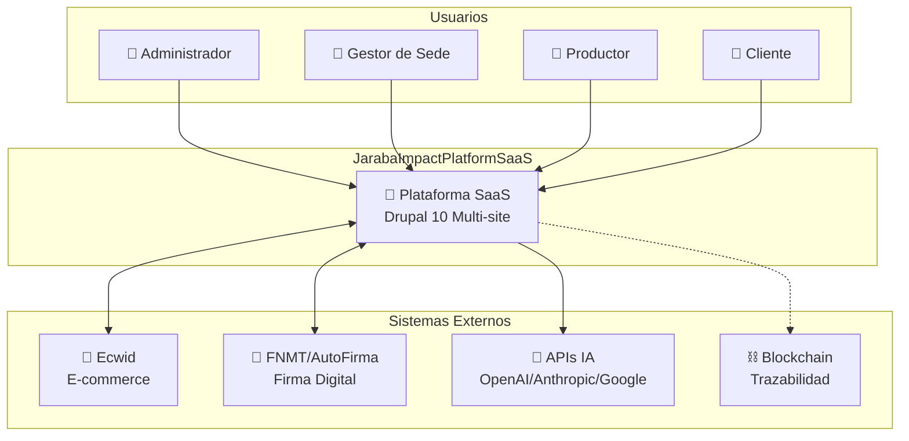
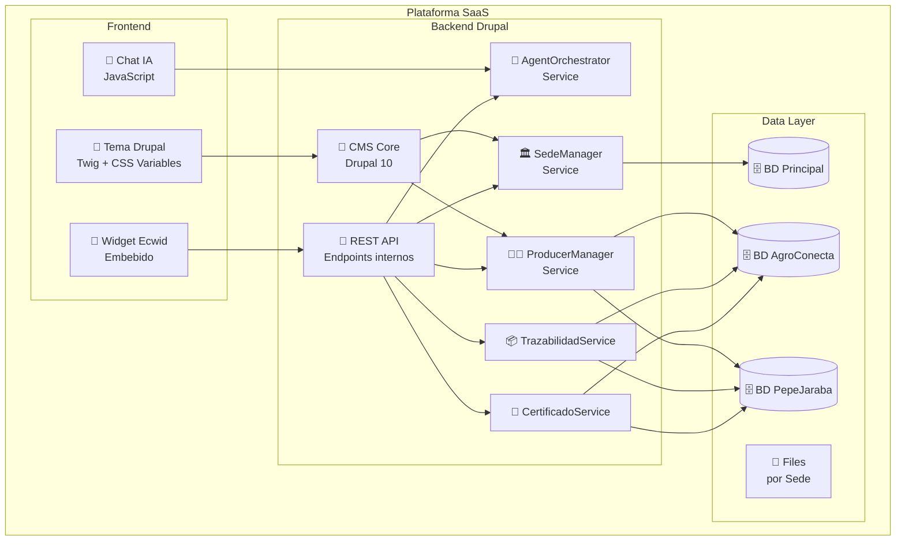

# Análisis de Madurez Arquitectónica SaaS

**Fecha de creación:** 2026-01-09 18:59  
**Última actualización:** 2026-01-09 22:25  
**Autor:** IA Asistente (Arquitecto SaaS Senior)  
**Versión:** 2.0.0  
**Categoría:** Arquitectura

---

## 📑 Tabla de Contenidos (TOC)

1. [Resumen Ejecutivo](#1-resumen-ejecutivo)
2. [Evaluación del Estado Actual](#2-evaluación-del-estado-actual)
3. [Nivel de Madurez Arquitectónica](#3-nivel-de-madurez-arquitectónica)
4. [Análisis de Gaps](#4-análisis-de-gaps)
5. [Arquitectura Conceptual Actual](#5-arquitectura-conceptual-actual)
6. [Modelo de Entidades Identificado](#6-modelo-de-entidades-identificado)
7. [Roadmap de Documentación](#7-roadmap-de-documentación)
8. [Registro de Cambios](#8-registro-de-cambios)

---

## 1. Resumen Ejecutivo

Este documento presenta un análisis de la madurez arquitectónica del proyecto **JarabaImpactPlatformSaaS** realizado desde la perspectiva de un Arquitecto de Soluciones SaaS Senior.

### Hallazgos Principales

| Aspecto | Estado |
|---------|--------|
| **Nivel de Madurez** | Entre Nivel 1 y Nivel 2 (de 5) |
| **Visión del Producto** | ✅ Clara |
| **Stack Tecnológico** | ✅ Definido |
| **Concepto Multi-tenant** | ✅ Entendido |
| **Modelo de Datos** | ⚠️ Parcialmente documentado |
| **Diagrama de Arquitectura** | ❌ Falta |
| **Flujos de Negocio** | ❌ No documentados |
| **Definición de Planes SaaS** | ⚠️ Mencionados pero no formalizados |

---

## 2. Evaluación del Estado Actual

### 2.1 Lo que SÍ está claro

| Aspecto | Nivel de Claridad | Documentación |
|---------|-------------------|---------------|
| **Concepto de Tenant** | 🟢 Alta | Single-Instance con aislamiento por Group Module |
| **Stack tecnológico** | 🟢 Alta | Drupal 11, PHP 8.4, Ecwid, Lando |
| **Módulos funcionales** | 🟢 Alta | E-commerce, Trazabilidad, Firma Digital, Agentes IA |
| **Roles de usuario** | 🟢 Alta | Admin, Gestor de Tenant, Productor, Cliente, Anónimo |
| **Entornos de desarrollo** | 🟢 Alta | Local (Lando), Staging (TBD), Producción (TBD) |
| **Integraciones externas** | 🟢 Alta | Ecwid, FNMT/AutoFirma, APIs IA, Blockchain (evaluación) |

### 2.2 Lo que NO está claro o falta

| Aspecto | Problema Identificado |
|---------|----------------------|
| **Relación entre entidades** | ¿Cómo se relaciona Sede → Productor → Producto → Pedido? |
| **Flujo de datos** | ¿Qué datos viven en Drupal vs Ecwid? ¿Cómo se sincronizan? |
| **Arquitectura de servicios** | ¿Monolito? ¿Servicios internos? ¿Comunicación entre módulos? |
| **Límites de plan SaaS** | Mencionados (básico=10, pro=50) pero no formalizados |
| **Flujo de onboarding** | ¿Cómo se crea una nueva Sede técnicamente? |
| **Billing y suscripciones** | Sin documentar |
| **Backup y DR** | Sin documentar |
| **CI/CD Pipeline** | Sin documentar |

---

## 3. Nivel de Madurez Arquitectónica

### 3.1 Modelo de Madurez (basado en TOGAF)

```
┌─────────────────────────────────────────────────────────────────┐
│ Nivel 5: Arquitectura Adaptativa                                │
│   - Evolución continua basada en métricas                       │
├─────────────────────────────────────────────────────────────────┤
│ Nivel 4: Arquitectura Optimizada                                │
│   - Mejora continua, métricas, governance                       │
├─────────────────────────────────────────────────────────────────┤
│ Nivel 3: Arquitectura Gestionada                                │
│   - Procesos definidos, revisiones, compliance                  │
├─────────────────────────────────────────────────────────────────┤
│ Nivel 3: Arquitectura Gestionada              ◄── AQUÍ (3.0)   │
│   - Procesos definidos, revisiones, compliance                  │
├─────────────────────────────────────────────────────────────────┤
│ Nivel 2: Arquitectura Documentada Básica            [SUPERADO]  │
│   - Visión clara, stack definido, diseño informal               │
├─────────────────────────────────────────────────────────────────┤
│ Nivel 0: Sin Arquitectura                                       │
│   - Desarrollo ad-hoc sin estructura                            │
└─────────────────────────────────────────────────────────────────┘
```

### 3.2 Justificación del Nivel 1.5

**Lo que tenemos (Nivel 1+):**
- ✅ Visión clara del problema y solución
- ✅ Stack tecnológico definido y justificado
- ✅ Concepto multi-tenant entendido
- ✅ Módulos principales identificados
- ✅ Trabajo de implementación avanzado (AgroConecta)

**Lo que falta para Nivel 2:**
- ❌ Modelo de datos formal
- ❌ Diagrama de arquitectura C4 (Contexto, Contenedores)
- ❌ Definición de interfaces entre componentes
- ❌ Documentación de flujos de negocio end-to-end
- ❌ ADRs (Architecture Decision Records)

---

## 4. Análisis de Gaps

### 4.1 Gaps Críticos (🔴 Bloquean producción)

| # | Gap | Impacto | Acción Requerida |
|---|-----|---------|------------------|
| 1 | **Definición formal de Planes SaaS** | No se pueden aplicar límites técnicos | Crear documento de planes con límites específicos |
| 2 | **Modelo de datos completo** | Riesgo de inconsistencias | Documentar ERD completo |
| 3 | **Estrategia de Backup/DR** | Pérdida de datos potencial | Definir RPO/RTO y procedimientos |
| 4 | **Política GDPR** | Riesgo legal | Documentar manejo de datos personales |

### 4.2 Gaps Importantes (🟠 Afectan calidad/velocidad)

| # | Gap | Impacto | Acción Requerida |
|---|-----|---------|------------------|
| 5 | **Diagrama de arquitectura** | Dificultad de comunicación | Crear diagrama C4 nivel 1 y 2 |
| 6 | **Pipeline CI/CD** | Despliegues manuales | Automatizar con GitHub Actions |
| 7 | **Documentación de APIs** | Dificultad de integración | Crear specs OpenAPI |
| 8 | **Testing strategy** | Riesgo de regresiones | Definir pirámide de tests |

### 4.3 Gaps Recomendados (🟡 Mejoran madurez)

| # | Gap | Impacto | Acción Requerida |
|---|-----|---------|------------------|
| 9 | **Monitorización/Logging** | Debugging difícil | Implementar logging estructurado |
| 10 | **Feature flags** | Rollouts arriesgados | Sistema de flags por tenant |
| 11 | **SLA documentados** | Expectativas poco claras | Definir niveles de servicio |

---

## 5. Arquitectura Conceptual Actual

### 5.1 Diagrama de Contexto (C4 Level 1)



### 5.2 Diagrama de Contenedores (C4 Level 2)



---

## 6. Modelo de Entidades Identificado

### 6.1 Entidades Principales

```
┌─────────────────────────────────────────────────────────────────┐
│                        ECOSISTEMA                               │
│  - Configuración global                                         │
│  - APIs compartidas                                             │
└───────────────────────┬─────────────────────────────────────────┘
                        │ 1:N
                        ▼
┌─────────────────────────────────────────────────────────────────┐
│                          SEDE                                   │
│  - id, nombre, slug                                             │
│  - plan_saas (básico|profesional|enterprise)                    │
│  - configuración_tema (colores, logo, tipografía)               │
│  - credenciales_ecwid                                           │
│  - límites (max_productores, storage)                           │
└───────────────────────┬─────────────────────────────────────────┘
                        │ 1:N
                        ▼
┌─────────────────────────────────────────────────────────────────┐
│                       PRODUCTOR                                 │
│  - id, nombre, email, telefono                                  │
│  - sede_id (FK)                                                 │
│  - ecwid_store_id                                               │
│  - estado (activo|suspendido|pendiente)                         │
└───────────────────────┬─────────────────────────────────────────┘
                        │ 1:N
                        ▼
┌─────────────────────────────────────────────────────────────────┐
│                       PRODUCTO                                  │
│  - id, nombre, descripción, precio                              │
│  - productor_id (FK)                                            │
│  - ecwid_product_id                                             │
│  - categoría, stock                                             │
└───────────────────────┬─────────────────────────────────────────┘
                        │ 1:N
                        ▼
┌─────────────────────────────────────────────────────────────────┐
│                         LOTE                                    │
│  - id, código_trazabilidad                                      │
│  - producto_id (FK)                                             │
│  - fecha_producción, origen, certificaciones                    │
│  - hash_blockchain (opcional)                                   │
└─────────────────────────────────────────────────────────────────┘
```

### 6.2 Relaciones Clave

| Relación | Cardinalidad | Notas |
|----------|--------------|-------|
| Ecosistema → Sede | 1:N | Un ecosistema contiene múltiples sedes |
| Sede → Productor | 1:N | Límite según plan SaaS |
| Productor → Producto | 1:N | Sin límite |
| Producto → Lote | 1:N | Para trazabilidad |
| Productor → Pedido | 1:N | Via Ecwid |
| Lote → Certificado | 1:N | Firma digital |

---

## 7. Roadmap de Documentación

### 7.1 Fase 1: Nivel 2 Básico (Próximas 2 semanas)

| # | Documento | Prioridad | Ubicación |
|---|-----------|-----------|-----------|
| 1 | Arquitectura de Alto Nivel (este análisis) | ✅ Completado | `docs/arquitectura/` |
| 2 | Diagrama de Arquitectura C4 Completo | 🔴 Alta | `docs/arquitectura/` |
| 3 | Modelo de Datos (ERD) | 🔴 Alta | `docs/arquitectura/` |
| 4 | Definición de Planes SaaS | 🔴 Alta | `docs/logica/` |
| 5 | Flujo de Onboarding de Sede | 🟠 Media | `docs/logica/` |

### 7.2 Fase 2: Nivel 2 Completo (Siguiente mes)

| # | Documento | Prioridad | Ubicación |
|---|-----------|-----------|-----------|
| 6 | Mapa de Integraciones | 🟠 Media | `docs/arquitectura/` |
| 7 | Flujos de Negocio (BPMN) | 🟠 Media | `docs/logica/` |
| 8 | Estrategia de Backup/DR | 🔴 Alta | `docs/implementacion/` |
| 9 | Pipeline CI/CD | 🟠 Media | `docs/implementacion/` |
| 10 | Política GDPR | 🔴 Alta | `docs/logica/` |

---

## 8. Registro de Cambios

| Fecha | Versión | Autor | Descripción |
|-------|---------|-------|-------------|
| 2026-01-09 | 1.0.0 | IA Asistente | Creación inicial del análisis de madurez |
