# Arquitectura de Alto Nivel - JarabaImpactPlatformSaaS

**Fecha de creación:** 2026-01-09 19:02  
**Última actualización:** 2026-01-09 19:55  
**Autor:** IA Asistente (Arquitecto SaaS Senior)  
**Versión:** 1.2.0  
**Categoría:** Arquitectura

---

## 📑 Tabla de Contenidos (TOC)

1. [Visión General](#1-visión-general)
2. [Diagrama de Contexto (C4 Level 1)](#2-diagrama-de-contexto-c4-level-1)
3. [Diagrama de Contenedores (C4 Level 2)](#3-diagrama-de-contenedores-c4-level-2)
4. [Diagrama de Componentes (C4 Level 3)](#4-diagrama-de-componentes-c4-level-3)
5. [Modelo de Datos](#5-modelo-de-datos)
6. [Flujo de Datos](#6-flujo-de-datos)
7. [Integraciones Externas](#7-integraciones-externas)
8. [Estrategia Multi-tenant](#8-estrategia-multi-tenant)
9. [Decisiones Arquitectónicas (ADRs)](#9-decisiones-arquitectónicas-adrs)
10. [Consideraciones de Escalabilidad](#10-consideraciones-de-escalabilidad)
11. [Registro de Cambios](#11-registro-de-cambios)

---

## 1. Visión General

### 1.1 Propósito del Sistema

**JarabaImpactPlatformSaaS** es una plataforma multi-tenant que permite a organizaciones (Tenants) gestionar ecosistemas de productores locales con capacidades de:

- **E-commerce**: Tiendas embebidas vía Ecwid
- **Trazabilidad**: Seguimiento de productos desde origen
- **Certificación Digital**: Firma electrónica con FNMT/AutoFirma
- **Inteligencia Artificial**: Agentes para marketing, storytelling, experiencia de cliente
- **Personalización Visual**: Theming dinámico por Tenant

### 1.2 Principios Arquitectónicos

| Principio | Descripción |
|-----------|-------------|
| **Multi-tenancy** | Aislamiento de datos y configuración por Tenant |
| **Extensibilidad** | Arquitectura modular basada en servicios Drupal |
| **Integración** | APIs externas como ciudadanos de primera clase |
| **Seguridad** | Roles granulares, validación estricta, credenciales externalizadas |
| **Experiencia de Usuario** | Interfaz unificada con personalización por Tenant |

### 1.3 Stakeholders

| Stakeholder | Interés Principal |
|-------------|-------------------|
| **Administrador de Plataforma** | Gestión global, onboarding de Tenants |
| **Gestor de Tenant** | Administración de productores de su organización |
| **Productor** | Gestión de tienda, productos, pedidos |
| **Cliente Final** | Compra de productos, trazabilidad |
| **Equipo de Desarrollo** | Mantenibilidad, extensibilidad |

---

## 2. Diagrama de Contexto (C4 Level 1)

Este diagrama muestra el sistema como una caja negra y sus interacciones con usuarios y sistemas externos.

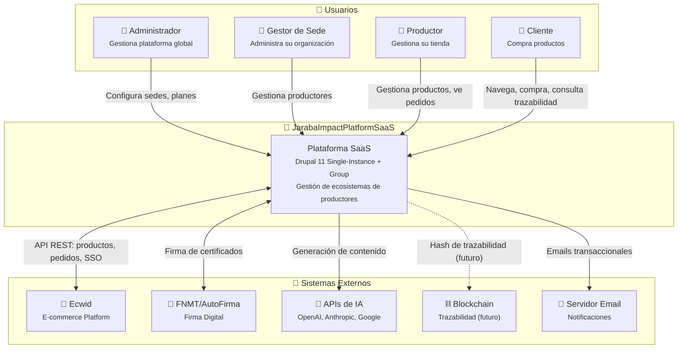

### 2.1 Descripción de Interacciones

| Origen | Destino | Descripción |
|--------|---------|-------------|
| Admin → Sistema | HTTP/Browser | Configuración global, gestión de Sedes |
| Gestor → Sistema | HTTP/Browser | Alta de productores, reportes |
| Productor → Sistema | HTTP/Browser | Panel de control, gestión de tienda |
| Cliente → Sistema | HTTP/Browser | Navegación, compras, consultas |
| Sistema ↔ Ecwid | REST API | Sincronización de productos, pedidos, SSO |
| Sistema ↔ FNMT | Certificados X.509 | Firma de lotes y certificados |
| Sistema → IA | REST API | Generación de contenido, respuestas |
| Sistema → Email | SMTP | Notificaciones, confirmaciones |

---

## 3. Diagrama de Contenedores (C4 Level 2)

Este diagrama descompone el sistema en contenedores de alto nivel (aplicaciones, almacenes de datos).

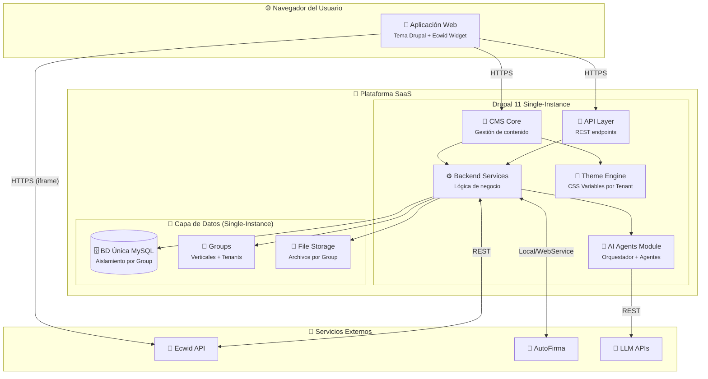

### 3.1 Descripción de Contenedores

| Contenedor | Tecnología | Responsabilidad |
|------------|------------|-----------------|
| **CMS Core** | Drupal 11 | Gestión de contenido, entidades, usuarios |
| **API Layer** | Drupal REST | Endpoints para frontend y widgets |
| **Backend Services** | PHP Services | Lógica de negocio, orquestación |
| **AI Agents Module** | Custom Module | Integración con LLMs, agentes especializados |
| **Theme Engine** | Twig + CSS | Renderizado con variables por Tenant |
| **BD Única** | MySQL | Todos los datos, aislamiento por Group |
| **Groups** | Group Module | Verticales y Tenants como Groups |
| **File Storage** | Sistema de archivos | Uploads con control de acceso por Group |

---

## 4. Diagrama de Componentes (C4 Level 3)

Detalle de los componentes dentro del módulo de Backend Services.

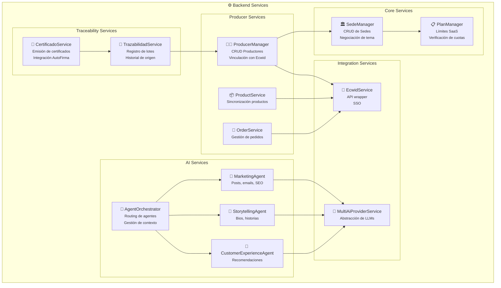

### 4.1 Descripción de Componentes Principales

| Componente | Archivo/Clase | Responsabilidad |
|------------|---------------|-----------------|
| **TenantManager** | `TenantManager.php` | CRUD de Tenants, negociación de tema por dominio |
| **PlanValidator** | `SaasPlan` Content Entity | Definición de límites por plan (productores, storage) |
| **ProducerManager** | `ProducerManager.php` | Alta/baja de productores, validación de cuotas |
| **EcwidService** | `EcwidService.php` | Wrapper para API Ecwid, SSO, sincronización |
| **TrazabilidadService** | `TrazabilidadService.php` | Registro de lotes, consulta de historial |
| **CertificadoService** | `CertificadoService.php` | Emisión y firma de certificados digitales |
| **AgentOrchestrator** | `AgentOrchestrator.php` | Routing de peticiones a agentes especializados |
| **MultiAiProviderService** | `MultiAiProviderService.php` | Abstracción de OpenAI, Anthropic, Google |

---

## 5. Modelo de Datos

### 5.1 Diagrama Entidad-Relación

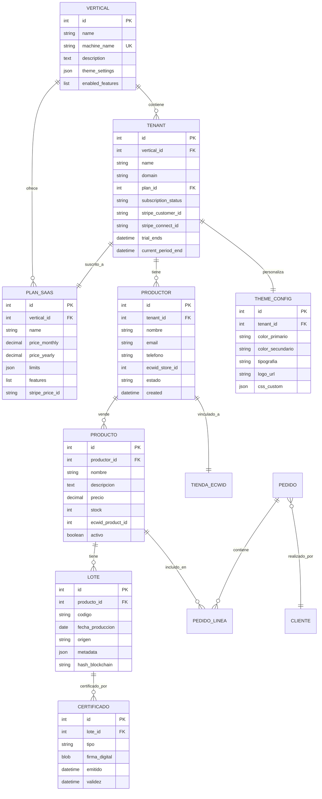

### 5.2 Descripción de Entidades

| Entidad | Descripción | Ubicación |
|---------|-------------|-----------|
| **Ecosistema** | Contenedor raíz, agrupa todas las Sedes | BD Principal |
| **Sede** | Tenant/organización con su configuración | BD Principal + BD propia |
| **Plan SaaS** | Configuración de límites y features | Config Entity Drupal |
| **Config Tema** | Variables visuales de la Sede | BD de Sede |
| **Productor** | Usuario vendedor con tienda | BD de Sede |
| **Producto** | Artículo a la venta | BD de Sede + Ecwid |
| **Lote** | Unidad de trazabilidad | BD de Sede |
| **Certificado** | Documento firmado digitalmente | BD de Sede |

---

## 6. Flujo de Datos

### 6.1 Flujo: Alta de Nueva Sede

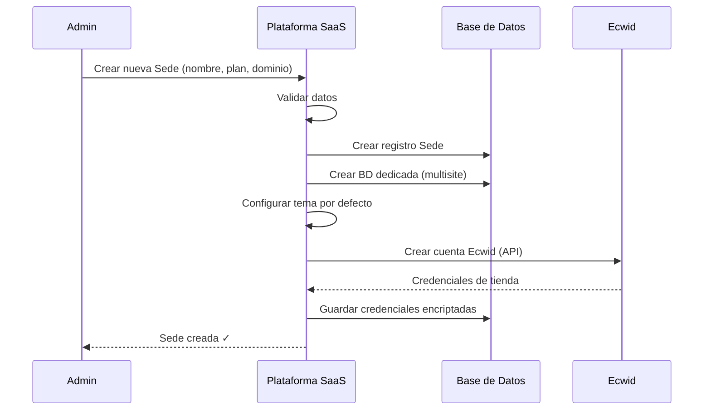

### 6.2 Flujo: Sincronización de Producto

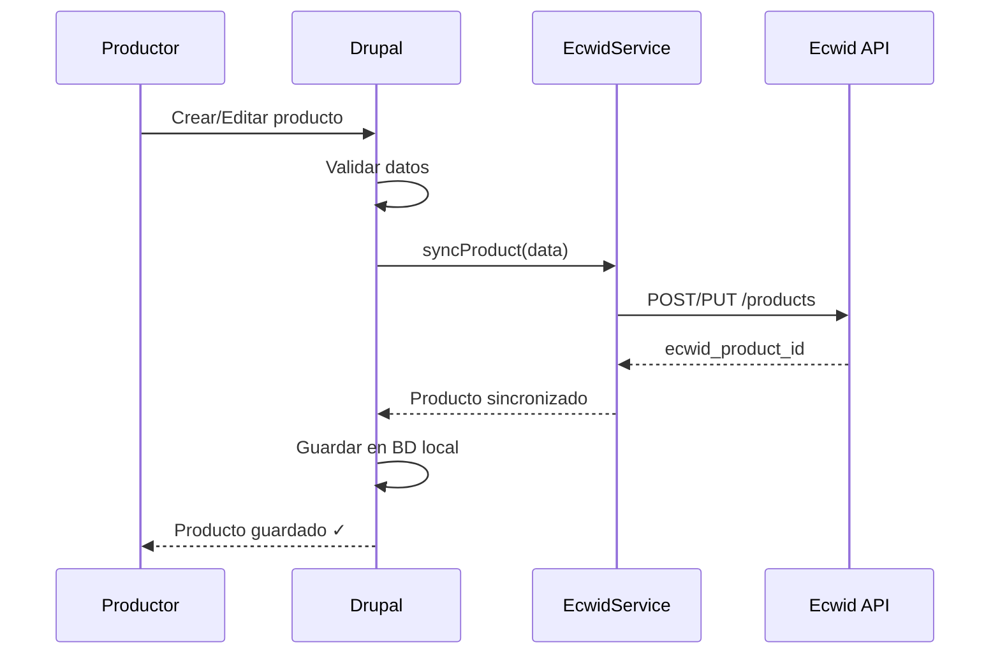

### 6.3 Flujo: Generación de Contenido IA

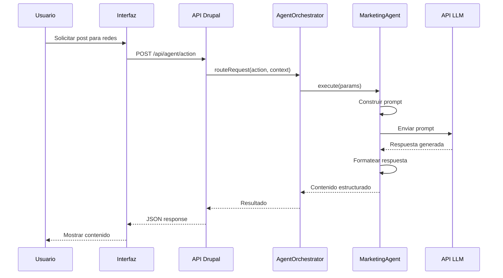

---

## 7. Integraciones Externas

### 7.1 Ecwid (E-commerce)

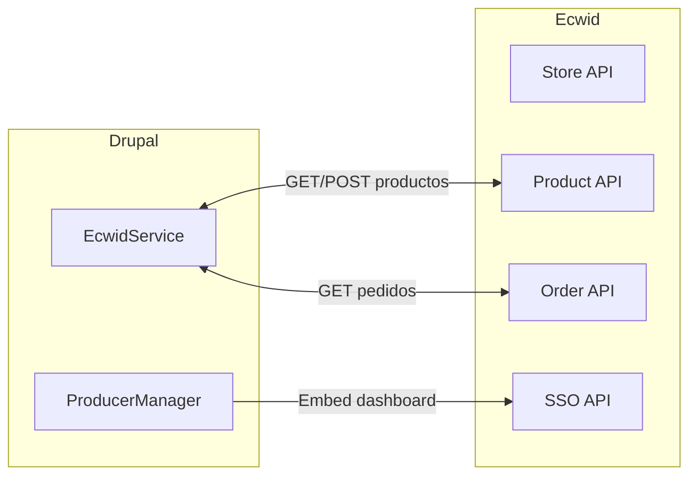

| Operación | Endpoint Ecwid | Frecuencia |
|-----------|----------------|------------|
| Crear producto | `POST /products` | On-demand |
| Actualizar producto | `PUT /products/{id}` | On-demand |
| Obtener pedidos | `GET /orders` | Polling/Webhook |
| SSO Panel | `GET /sso` | On-demand |

### 7.2 FNMT/AutoFirma (Firma Digital)

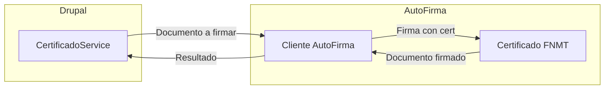

### 7.3 APIs de Inteligencia Artificial

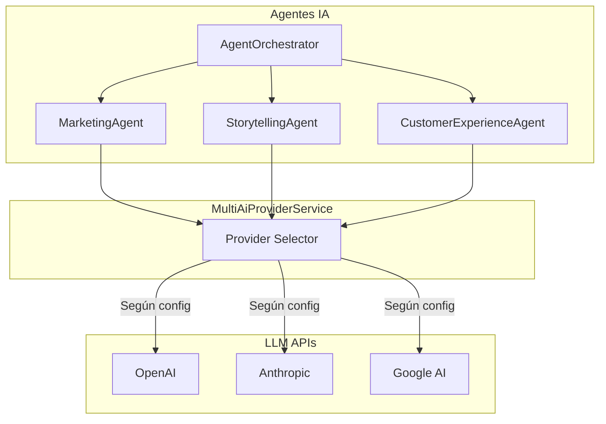

---

## 8. Estrategia Multi-tenant

### 8.1 Modelo de Aislamiento

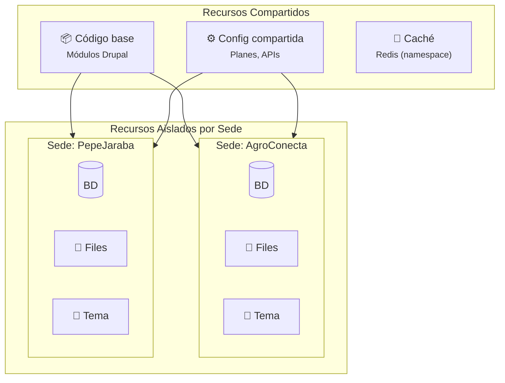

### 8.2 Resolución de Tenant

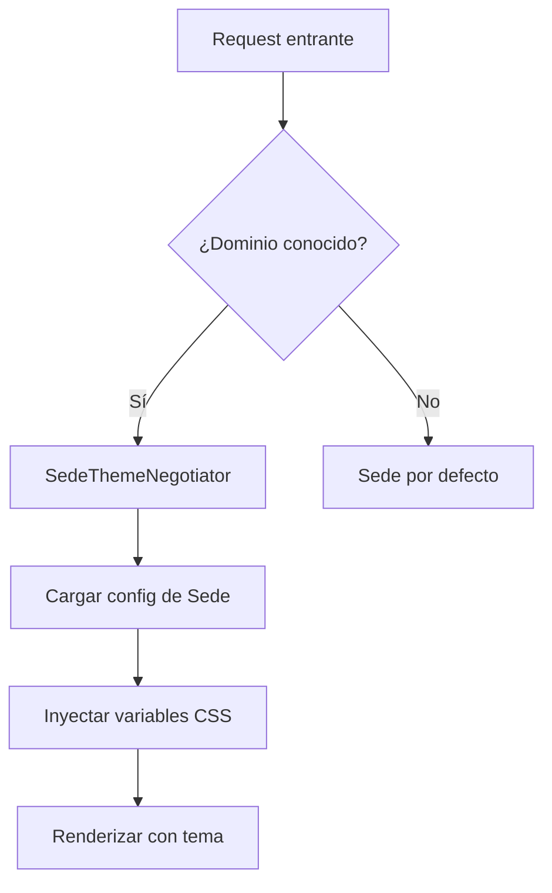

### 8.3 Límites por Plan

| Plan | Productores | Storage | Agentes IA | Trazabilidad | Firma Digital |
|------|-------------|---------|------------|--------------|---------------|
| **Básico** | 10 | 5 GB | ❌ | ❌ | ❌ |
| **Profesional** | 50 | 25 GB | ✅ Limitada | ✅ | ❌ |
| **Enterprise** | Ilimitado | 100 GB | ✅ Completa | ✅ | ✅ |

---

## 9. Decisiones Arquitectónicas (ADRs)

### ADR-001: Single-Instance + Group vs Multisite

| Aspecto | Decisión |
|---------|----------|
| **Contexto** | Necesitamos aislamiento de datos entre Tenants |
| **Decisión** | Single-Instance con Group Module + Domain Access |
| **Razón** | Efecto red (queries cruzadas), 1 actualización de core, escalabilidad |
| **Consecuencias** | Requiere auditoría de permisos, tests de aislamiento |

### ADR-002: Ecwid como Motor de E-commerce

| Aspecto | Decisión |
|---------|----------|
| **Contexto** | Necesitamos capacidades de e-commerce completas |
| **Decisión** | Integrar Ecwid en lugar de Drupal Commerce |
| **Razón** | Menor desarrollo, PCI compliance, panel nativo para productores |
| **Consecuencias** | Dependencia externa, costes por transacción, sincronización |

### ADR-003: Abstracción de Proveedores IA

| Aspecto | Decisión |
|---------|----------|
| **Contexto** | Múltiples proveedores de LLM con diferentes APIs |
| **Decisión** | MultiAiProviderService como capa de abstracción |
| **Razón** | Flexibilidad, fallback, optimización de costes |
| **Consecuencias** | Complejidad de abstracción, mínimo común denominador |

---

## 10. Consideraciones de Escalabilidad

### 10.1 Puntos de Escalado

| Componente | Estrategia | Trigger |
|------------|------------|---------|
| **Web/App** | Horizontal (load balancer) | CPU > 70% |
| **Base de datos** | Read replicas | Queries > 1000/s |
| **Archivos** | CDN + Object Storage | Storage > 80% |
| **Caché** | Redis Cluster | Hit rate < 80% |
| **IA** | Rate limiting + cola | Latencia > 5s |

### 10.2 Cuellos de Botella Identificados

1. **Sincronización Ecwid**: Rate limits de API
2. **Generación IA**: Latencia de LLMs externos
3. **Firma Digital**: Dependencia de cliente local

### 10.3 Estrategias de Mitigación

- **Colas**: Procesar sincronizaciones en background
- **Caché**: Cachear respuestas IA por contexto similar
- **Batch**: Agrupar operaciones de firma

---

## 11. Registro de Cambios

| Fecha | Versión | Autor | Descripción |
|-------|---------|-------|-------------|
| 2026-01-09 | 1.0.0 | IA Asistente | Creación inicial del documento de arquitectura |
| 2026-01-09 | 1.1.0 | IA Asistente | Alineado con Doc. Maestro: Single-Instance + Group, Drupal 11 |
| 2026-01-09 | 1.2.0 | IA Asistente | Correcciones de coherencia: Sede→Tenant, ERD actualizado, C4 L2 corregido |
