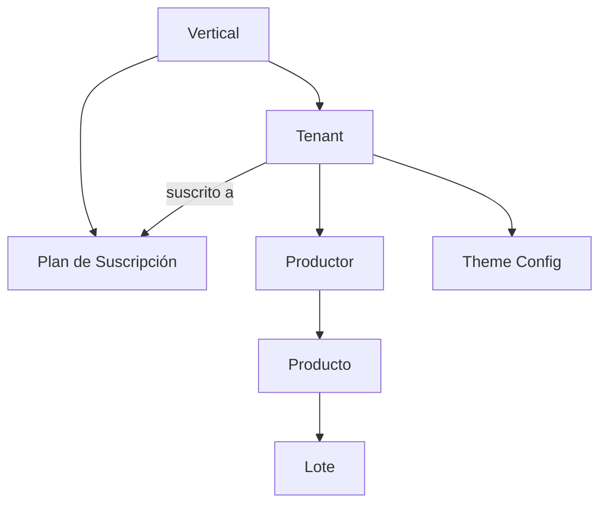
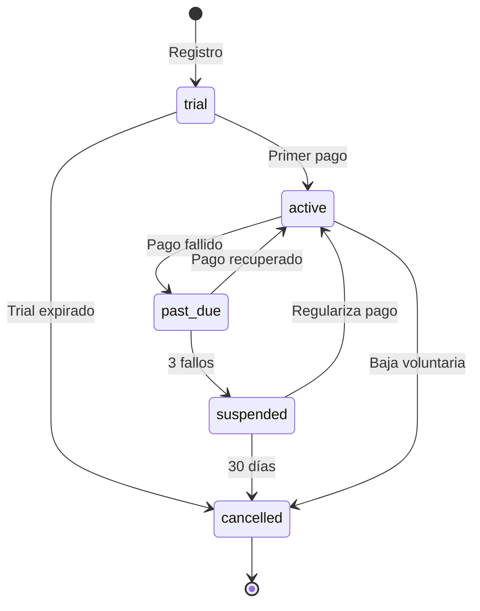
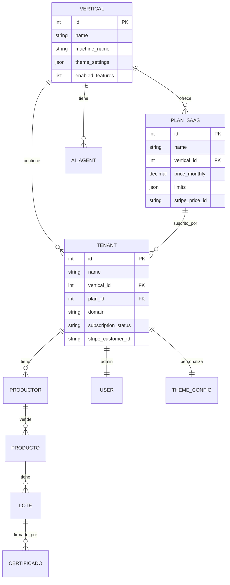

# Entidades Core SaaS - JarabaImpactPlatformSaaS

**Fecha de creación:** 2026-01-09 19:34  
**Última actualización:** 2026-01-09 19:34  
**Autor:** IA Asistente (Arquitecto SaaS Senior)  
**Versión:** 1.0.0  
**Categoría:** Arquitectura

> **Fuente**: [Documento Técnico Maestro](../tecnicos/20260109e-DOCUMENTO_TECNICO_MAESTRO_SaaS_CONSOLIDADO_Claude.md) - Sección 3

---

## 📑 Tabla de Contenidos (TOC)

1. [Visión General](#1-visión-general)
2. [Entidad: Vertical](#2-entidad-vertical)
3. [Entidad: Plan de Suscripción](#3-entidad-plan-de-suscripción)
4. [Entidad: Tenant](#4-entidad-tenant)
5. [Relaciones entre Entidades](#5-relaciones-entre-entidades)
6. [Implementación como Content Entities](#6-implementación-como-content-entities)
7. [Registro de Cambios](#7-registro-de-cambios)

---

## 1. Visión General

El sistema utiliza **Content Entities de Drupal** para máxima flexibilidad, permitiendo que los administradores configuren planes y servicios sin intervención técnica.

### 1.1 Jerarquía de Entidades



### 1.2 Principio de Diseño

> **⚠️ RECORDATORIO**: Todas las entidades son **Content Entities** para permitir:
> - Field UI (campos configurables)
> - Views (listados y filtros)
> - Entity Reference (relaciones)
> - Revisiones (historial)

---

## 2. Entidad: Vertical

Una **Vertical** representa un segmento de negocio especializado dentro del ecosistema.

### 2.1 Definición de Campos

| Campo | Tipo | Descripción |
|-------|------|-------------|
| `name` | string | Nombre de la vertical (AgroConecta, FormaTech, etc.) |
| `machine_name` | slug | Identificador único para código y URLs |
| `description` | text_long | Descripción para landing y marketing |
| `theme_settings` | json | Colores, logo, tipografía por defecto |
| `enabled_features` | list_string | Módulos/funcionalidades activas |
| `ai_agents` | entity_ref (multiple) | Agentes IA especializados para esta vertical |

### 2.2 Verticales Planificadas

| Vertical | Descripción | Features Específicas |
|----------|-------------|---------------------|
| **AgroConecta** | Productores agroalimentarios | Trazabilidad, QR, Ecwid |
| **FormaTech** | Formación y capacitación | Cursos, certificados, tutores IA |
| **TurismoLocal** | Turismo rural y experiencias | Reservas, rutas, guías |
| **ImpulsoEmpleo** | Empleabilidad y talento | Job offers, matching, CV IA |

### 2.3 Ejemplo de Instancia

```yaml
# Vertical: AgroConecta
name: "AgroConecta"
machine_name: "agroconecta"
description: "Ecosistema digital para productores agroalimentarios locales"
theme_settings:
  color_primario: "#FF8C42"
  color_secundario: "#2D3436"
  logo: "/sites/default/files/logos/agroconecta.svg"
enabled_features:
  - trazabilidad
  - qr_codes
  - ecwid_integration
  - ai_storytelling
ai_agents:
  - consumer_copilot
  - product_agent
  - recipe_agent
```

---

## 3. Entidad: Plan de Suscripción

Un **Plan de Suscripción** define los límites y características disponibles para un Tenant.

### 3.1 Definición de Campos

| Campo | Tipo | Descripción |
|-------|------|-------------|
| `name` | string | Starter, Professional, Enterprise |
| `vertical` | entity_ref | Vertical a la que pertenece |
| `price_monthly` | commerce_price | Precio mensual en EUR |
| `price_yearly` | commerce_price | Precio anual (con descuento) |
| `features` | list_string | Lista de características incluidas |
| `limits` | json | `{users: 5, storage_gb: 10, ai_queries: 100}` |
| `stripe_price_id` | string | ID del precio en Stripe |

### 3.2 Planes por Defecto

| Plan | vertical | price_monthly | limits |
|------|----------|---------------|--------|
| **Básico** | (todas) | 29€ | `{productores: 10, storage_gb: 5, ai_queries: 0}` |
| **Profesional** | (todas) | 79€ | `{productores: 50, storage_gb: 25, ai_queries: 100}` |
| **Enterprise** | (todas) | Consultar | `{productores: -1, storage_gb: 100, ai_queries: -1}` |

### 3.3 Features por Plan

```yaml
# Plan Profesional - Features
features:
  - productores_hasta_50
  - trazabilidad_basica
  - agentes_ia_limitados
  - soporte_email_chat
  - webhooks_5
  - analiticas_basicas
```

---

## 4. Entidad: Tenant

Un **Tenant** (antes "Sede") representa una organización cliente que utiliza la plataforma.

### 4.1 Definición de Campos

| Campo | Tipo | Descripción |
|-------|------|-------------|
| `name` | string | Nombre comercial del inquilino |
| `subscription_plan` | entity_ref | Plan contratado actualmente |
| `vertical` | entity_ref | Vertical a la que pertenece |
| `domain` | string | Subdominio o dominio personalizado |
| `theme_overrides` | json | Personalizaciones de marca |
| `stripe_customer_id` | string | ID de cliente en Stripe |
| `stripe_connect_id` | string | ID de cuenta conectada (franquicias) |
| `admin_user` | entity_ref | Usuario administrador principal |
| `subscription_status` | list_string | trial, active, past_due, cancelled |
| `trial_ends` | datetime | Fecha fin de período de prueba |
| `current_period_end` | datetime | Fecha próxima renovación |

### 4.2 Estados de Tenant



### 4.3 Ejemplo de Instancia

```yaml
# Tenant: Cooperativa Aceites Jaén
name: "Cooperativa Aceites Jaén"
vertical: agroconecta
subscription_plan: profesional
domain: "aceites-jaen.jaraba.io"
theme_overrides:
  color_primario: "#10B981"
  logo: "/files/tenants/aceites-jaen/logo.png"
stripe_customer_id: "cus_ABC123"
stripe_connect_id: null  # No es franquicia
admin_user: 42
subscription_status: "active"
current_period_end: "2026-02-09"
```

---

## 5. Relaciones entre Entidades

### 5.1 Diagrama ER Completo



### 5.2 Group Module Mapping

| Entidad | Group Type | Descripción |
|---------|------------|-------------|
| **Vertical** | `vertical` | Grupo de nivel superior |
| **Tenant** | `tenant` | Subgrupo dentro de Vertical |
| **Productor** | Group Member | Usuario miembro del Tenant |

---

## 6. Implementación como Content Entities

### 6.1 Estructura de Módulo

```
modules/custom/ecosistema_jaraba_core/
├── src/
│   ├── Entity/
│   │   ├── Vertical.php
│   │   ├── VerticalInterface.php
│   │   ├── SaasPlan.php
│   │   ├── SaasPlanInterface.php
│   │   ├── Tenant.php
│   │   └── TenantInterface.php
│   ├── Form/
│   │   ├── VerticalForm.php
│   │   ├── SaasPlanForm.php
│   │   └── TenantForm.php
│   └── Service/
│       ├── VerticalManager.php
│       ├── PlanValidator.php
│       └── TenantManager.php
├── config/
│   └── install/
│       ├── ecosistema_jaraba_core.vertical.agroconecta.yml
│       ├── ecosistema_jaraba_core.saas_plan.basico.yml
│       └── ...
└── ecosistema_jaraba_core.module
```

### 6.2 Ejemplo: Vertical Content Entity

```php
<?php

namespace Drupal\ecosistema_jaraba_core\Entity;

use Drupal\Core\Entity\ContentEntityBase;
use Drupal\Core\Entity\EntityTypeInterface;
use Drupal\Core\Field\BaseFieldDefinition;

/**
 * Define la entidad de contenido Vertical.
 *
 * @ContentEntityType(
 *   id = "vertical",
 *   label = @Translation("Vertical"),
 *   handlers = {
 *     "view_builder" = "Drupal\Core\Entity\EntityViewBuilder",
 *     "list_builder" = "Drupal\ecosistema_jaraba_core\VerticalListBuilder",
 *     "views_data" = "Drupal\views\EntityViewsData",
 *     "form" = {
 *       "default" = "Drupal\ecosistema_jaraba_core\Form\VerticalForm",
 *       "add" = "Drupal\ecosistema_jaraba_core\Form\VerticalForm",
 *       "edit" = "Drupal\ecosistema_jaraba_core\Form\VerticalForm",
 *       "delete" = "Drupal\Core\Entity\ContentEntityDeleteForm",
 *     },
 *   },
 *   base_table = "vertical",
 *   admin_permission = "administer verticals",
 *   fieldable = TRUE,
 *   entity_keys = {
 *     "id" = "id",
 *     "label" = "name",
 *     "uuid" = "uuid",
 *   },
 *   links = {
 *     "collection" = "/admin/structure/vertical",
 *     "add-form" = "/admin/structure/vertical/add",
 *     "canonical" = "/admin/structure/vertical/{vertical}",
 *     "edit-form" = "/admin/structure/vertical/{vertical}/edit",
 *     "delete-form" = "/admin/structure/vertical/{vertical}/delete",
 *   },
 *   field_ui_base_route = "entity.vertical.collection",
 * )
 */
class Vertical extends ContentEntityBase implements VerticalInterface {

  public static function baseFieldDefinitions(EntityTypeInterface $entity_type) {
    $fields = parent::baseFieldDefinitions($entity_type);

    $fields['name'] = BaseFieldDefinition::create('string')
      ->setLabel(t('Nombre'))
      ->setRequired(TRUE)
      ->setDisplayConfigurable('form', TRUE)
      ->setDisplayConfigurable('view', TRUE);

    $fields['machine_name'] = BaseFieldDefinition::create('string')
      ->setLabel(t('Machine Name'))
      ->setRequired(TRUE)
      ->addConstraint('UniqueField');

    $fields['description'] = BaseFieldDefinition::create('text_long')
      ->setLabel(t('Descripción'))
      ->setDisplayConfigurable('form', TRUE)
      ->setDisplayConfigurable('view', TRUE);

    $fields['enabled_features'] = BaseFieldDefinition::create('list_string')
      ->setLabel(t('Features Habilitadas'))
      ->setCardinality(BaseFieldDefinition::CARDINALITY_UNLIMITED)
      ->setDisplayConfigurable('form', TRUE);

    return $fields;
  }
}
```

---

## 7. Registro de Cambios

| Fecha | Versión | Descripción |
|-------|---------|-------------|
| 2026-01-09 | 1.0.0 | Creación inicial basada en Doc. Maestro §3 |
