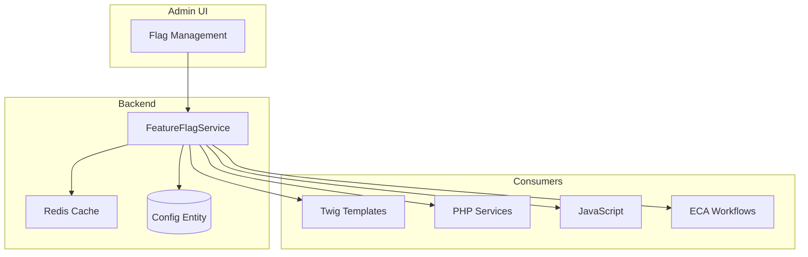

# Sistema de Feature Flags

**Fecha de creación:** 2026-01-09 22:31  
**Última actualización:** 2026-01-09 22:31  
**Versión:** 1.0.0  
**Categoría:** Arquitectura

---

## 📑 Tabla de Contenidos (TOC)

1. [Propósito](#1-propósito)
2. [Arquitectura del Sistema](#2-arquitectura-del-sistema)
3. [Tipos de Flags](#3-tipos-de-flags)
4. [Implementación Técnica](#4-implementación-técnica)
5. [Configuración por Tenant](#5-configuración-por-tenant)
6. [Integración con ECA](#6-integración-con-eca)
7. [Administración UI](#7-administración-ui)
8. [Best Practices](#8-best-practices)
9. [Registro de Cambios](#9-registro-de-cambios)

---

## 1. Propósito

El sistema de Feature Flags permite:

- **Rollout gradual** de nuevas funcionalidades
- **A/B testing** de características
- **Kill switches** para desactivar funciones problemáticas
- **Diferenciación por plan** SaaS
- **Personalización por tenant**

---

## 2. Arquitectura del Sistema

### 2.1 Diagrama de Componentes



### 2.2 Flujo de Evaluación

```
Request → TenantContext → FeatureFlagService → Cache Hit?
                                                   │
                                    ┌──────────────┴──────────────┐
                                    │                             │
                                   Sí                            No
                                    │                             │
                                    ▼                             ▼
                              Return value                Load from DB
                                                               │
                                                               ▼
                                                         Store in Cache
                                                               │
                                                               ▼
                                                         Return value
```

---

## 3. Tipos de Flags

### 3.1 Por Alcance

| Tipo | Descripción | Ejemplo |
|------|-------------|---------|
| **Global** | Afecta a toda la plataforma | `maintenance_mode` |
| **Por Plan** | Según tier del tenant | `ai_agents_enabled` |
| **Por Tenant** | Específico de un tenant | `custom_theme_v2` |
| **Por Usuario** | Individual | `beta_tester` |
| **Por Porcentaje** | Rollout gradual | `new_checkout:25%` |

### 3.2 Por Duración

| Tipo | Duración | Propósito |
|------|----------|-----------|
| **Release** | Permanente | Nueva funcionalidad |
| **Experiment** | Temporal | A/B testing |
| **Ops** | Variable | Kill switch, maintenance |
| **Permission** | Permanente | Control de acceso |

---

## 4. Implementación Técnica

### 4.1 Interfaz del Servicio

```php
<?php

namespace Drupal\ecosistema_jaraba_core\Service;

/**
 * Servicio para gestión de feature flags.
 */
interface FeatureFlagServiceInterface {

  /**
   * Verifica si una feature flag está activa.
   *
   * @param string $flag
   *   Nombre de la flag (ej: 'ai_agents', 'new_checkout').
   * @param int|null $tenantId
   *   ID del tenant (usa el actual si es NULL).
   * @param int|null $userId
   *   ID del usuario (usa el actual si es NULL).
   *
   * @return bool
   *   TRUE si la flag está activa.
   */
  public function isEnabled(string $flag, ?int $tenantId = NULL, ?int $userId = NULL): bool;

  /**
   * Obtiene todas las flags activas para un tenant.
   *
   * @param int $tenantId
   *   ID del tenant.
   *
   * @return array
   *   Array asociativo de flags y sus valores.
   */
  public function getFlags(int $tenantId): array;

  /**
   * Activa una flag para un tenant.
   *
   * @param string $flag
   *   Nombre de la flag.
   * @param int $tenantId
   *   ID del tenant.
   * @param mixed $value
   *   Valor de la flag (bool, string, array).
   */
  public function enable(string $flag, int $tenantId, $value = TRUE): void;

  /**
   * Desactiva una flag para un tenant.
   *
   * @param string $flag
   *   Nombre de la flag.
   * @param int $tenantId
   *   ID del tenant.
   */
  public function disable(string $flag, int $tenantId): void;

}
```

### 4.2 Configuración YAML

```yaml
# config/install/ecosistema_jaraba_core.feature_flags.yml
feature_flags:
  # Flags por defecto según plan
  defaults:
    basico:
      max_productores: 10
      ai_agents: false
      custom_domain: false
      api_access: false
      
    profesional:
      max_productores: 50
      ai_agents: true
      custom_domain: true
      api_access: true
      priority_support: false
      
    enterprise:
      max_productores: -1  # Sin límite
      ai_agents: true
      custom_domain: true
      api_access: true
      priority_support: true
      sla_custom: true

  # Flags globales
  global:
    maintenance_mode: false
    new_checkout_flow: false
    v2_api: false
```

### 4.3 Uso en Código PHP

```php
// En un controlador o servicio
$featureFlags = \Drupal::service('ecosistema_jaraba_core.feature_flags');

// Verificar flag simple
if ($featureFlags->isEnabled('ai_agents')) {
  // Mostrar panel de agentes IA
}

// Verificar con tenant específico
if ($featureFlags->isEnabled('custom_domain', $tenantId)) {
  // Permitir configuración de dominio
}

// Obtener valor numérico
$maxProductores = $featureFlags->getValue('max_productores') ?? 10;
```

### 4.4 Uso en Twig

```twig
{# En templates #}

  <div class="ai-agents-panel">
    
  </div>


{# Con valor #}

<p>Puedes añadir hasta {{ max }} productores.</p>
```

### 4.5 Uso en JavaScript

```javascript
// Flags inyectadas en drupalSettings
if (drupalSettings.featureFlags.ai_agents) {
  initAiAgentsPanel();
}

// API para verificar
Drupal.behaviors.featureFlags = {
  attach: function(context, settings) {
    const flags = settings.featureFlags || {};
    
    if (flags.new_checkout_flow) {
      this.initNewCheckout();
    }
  }
};
```

---

## 5. Configuración por Tenant

### 5.1 Schema de Datos

```yaml
# Campo en entidad Tenant
feature_flags:
  type: map
  label: 'Feature Flags Override'
  settings:
    # Override de flags por defecto
    ai_agents: true
    custom_branding: true
    experimental_features:
      - new_dashboard
      - beta_reports
```

### 5.2 Jerarquía de Prioridad

```
1. Override específico del Tenant (máxima prioridad)
   │
   ▼
2. Configuración del Plan SaaS
   │
   ▼
3. Flags globales de plataforma
   │
   ▼
4. Valores por defecto (mínima prioridad)
```

---

## 6. Integración con ECA

### 6.1 Condiciones en ECA

```yaml
# Condición: verificar feature flag
conditions:
  - plugin: feature_flag_enabled
    configuration:
      flag: ai_agents
      tenant: current
```

### 6.2 Acciones en ECA

```yaml
# Acción: activar flag
actions:
  - plugin: feature_flag_toggle
    configuration:
      flag: premium_trial
      tenant: "[tenant:id]"
      value: true
      expires: "+14 days"
```

### 6.3 Eventos

| Evento | Trigger |
|--------|---------|
| `feature_flag.enabled` | Al activar una flag |
| `feature_flag.disabled` | Al desactivar una flag |
| `feature_flag.expired` | Al expirar flag temporal |

---

## 7. Administración UI

### 7.1 Ruta Admin

```
/admin/config/ecosistema/feature-flags
```

### 7.2 Funcionalidades

- **Lista de flags** con estado por tenant
- **Activar/desactivar** con un click
- **Rollout gradual** con slider de porcentaje
- **Historial de cambios** por flag
- **Búsqueda y filtros** por tipo, estado, tenant

### 7.3 Permisos

| Permiso | Descripción |
|---------|-------------|
| `administer feature flags` | Gestión completa |
| `view feature flags` | Solo lectura |
| `toggle tenant flags` | Cambiar flags de su tenant |

---

## 8. Best Practices

### 8.1 Naming Convention

```
{scope}_{feature}_{variant}
```

**Ejemplos:**
- `checkout_new_flow` (feature)
- `experiment_pricing_v2` (A/B test)
- `ops_maintenance_mode` (operacional)
- `plan_ai_agents` (por plan)

### 8.2 Ciclo de Vida

1. **Crear flag** con valor `false` por defecto
2. **Rollout gradual** (10% → 25% → 50% → 100%)
3. **Monitorizar métricas** durante rollout
4. **Hacer permanente** (remover flag del código)
5. **Limpiar** flag obsoleta de config

### 8.3 Antipatterns a Evitar

| ❌ Evitar | ✅ Preferir |
|-----------|-------------|
| Flags anidadas | Flags planas |
| Flags con lógica compleja | Flags booleanas simples |
| Dejar flags indefinidamente | Limpiar tras 3 meses |
| Flags en hot paths sin cache | Siempre cachear |

---

## 9. Registro de Cambios

| Fecha | Versión | Autor | Descripción |
|-------|---------|-------|-------------|
| 2026-01-09 | 1.0.0 | IA Asistente | Creación inicial del documento |
