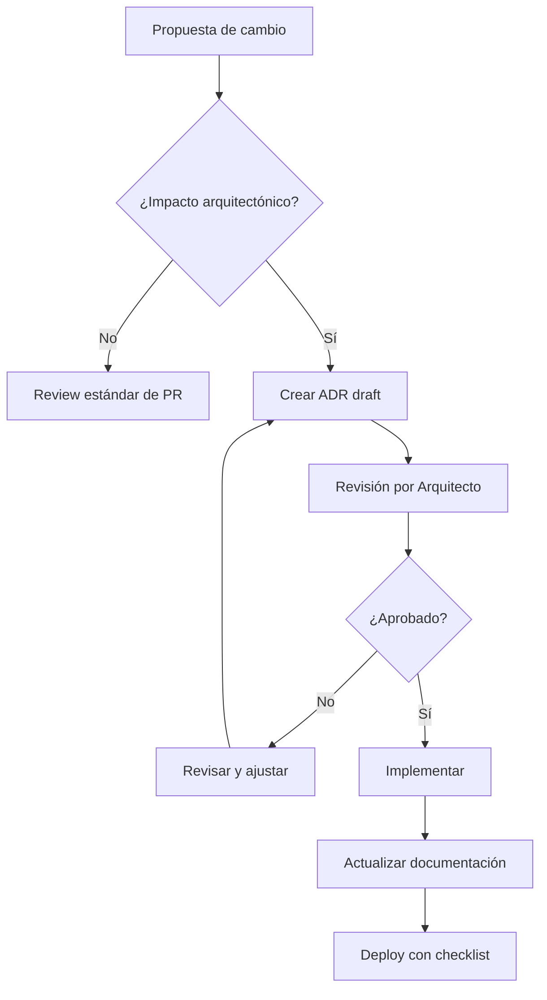

# Governance Arquitectónico

**Fecha de creación:** 2026-01-09 22:31  
**Última actualización:** 2026-01-09 22:31  
**Versión:** 1.0.0  
**Categoría:** Arquitectura

---

## 📑 Tabla de Contenidos (TOC)

1. [Propósito](#1-propósito)
2. [Roles y Responsabilidades](#2-roles-y-responsabilidades)
3. [Proceso de Revisión Arquitectónica](#3-proceso-de-revisión-arquitectónica)
4. [ADR-003: Proceso de Decisiones](#4-adr-003-proceso-de-decisiones)
5. [Checklist Pre-Deploy](#5-checklist-pre-deploy)
6. [Registro de Cambios](#6-registro-de-cambios)

---

## 1. Propósito

Este documento establece el marco de gobernanza arquitectónica para la plataforma **Ecosistema Jaraba SaaS**. Define los procesos, roles y responsabilidades para garantizar que las decisiones arquitectónicas se tomen de forma consistente, documentada y alineada con los objetivos del negocio.

---

## 2. Roles y Responsabilidades

### 2.1 Matriz RACI

| Actividad | Arquitecto | Tech Lead | Desarrollador | Product Owner |
|-----------|------------|-----------|---------------|---------------|
| Decisiones arquitectónicas | **A** | R | C | C |
| Revisión de código | R | **A** | R | I |
| Documentación técnica | R | R | **A** | I |
| Priorización de deuda técnica | C | R | I | **A** |
| Revisiones de seguridad | R | **A** | C | I |

**Leyenda:** R=Responsable, A=Aprobador, C=Consultado, I=Informado

### 2.2 Descripción de Roles

#### Arquitecto de Soluciones
- Define la arquitectura de alto nivel
- Mantiene ADRs actualizados
- Revisa cambios críticos
- Aprueba nuevas dependencias

#### Tech Lead
- Implementa decisiones arquitectónicas
- Revisa PRs con impacto arquitectónico
- Coordina refactorizaciones
- Escala problemas técnicos

#### Desarrollador
- Implementa código según guías
- Documenta cambios significativos
- Propone mejoras técnicas
- Ejecuta tests

---

## 3. Proceso de Revisión Arquitectónica

### 3.1 Triggers de Revisión

| Cambio | Requiere Revisión |
|--------|-------------------|
| Nueva entidad Drupal | ✅ Sí |
| Nuevo servicio/módulo | ✅ Sí |
| Cambio en API pública | ✅ Sí |
| Nueva integración externa | ✅ Sí |
| Cambio en base de datos | ✅ Sí |
| Refactoring interno | ⚠️ Según impacto |
| Corrección de bug | ❌ No |
| Actualización de dependencia | ⚠️ Según criticidad |

### 3.2 Flujo de Revisión



### 3.3 Reuniones de Revisión

| Tipo | Frecuencia | Participantes | Duración |
|------|------------|---------------|----------|
| **Tech Review** | Semanal | Tech Lead + Devs | 30 min |
| **Architecture Review** | Quincenal | Arquitecto + Tech Lead | 1h |
| **Security Review** | Mensual | Arquitecto + Security | 1h |

---

## 4. ADR-003: Proceso de Decisiones Arquitectónicas

### Status
**Aceptado** | 2026-01-09

### Contexto
Las decisiones arquitectónicas deben documentarse de forma sistemática para:
- Mantener trazabilidad histórica
- Facilitar onboarding de nuevos miembros
- Evitar repetir discusiones
- Justificar el estado actual del sistema

### Decisión
Adoptamos el formato ADR (Architecture Decision Records) con la siguiente estructura:

```markdown
# ADR-XXX: [Título]

## Status
[Propuesto | Aceptado | Obsoleto | Supersedido por ADR-YYY]

## Contexto
[Descripción del problema o situación]

## Decisión
[Lo que se decidió hacer]

## Consecuencias
### Positivas
- [Beneficio 1]
- [Beneficio 2]

### Negativas
- [Trade-off 1]
- [Trade-off 2]

### Riesgos
- [Riesgo identificado]
```

### Consecuencias

#### Positivas
- Trazabilidad de decisiones técnicas
- Base de conocimiento institucional
- Comunicación clara de trade-offs

#### Negativas
- Overhead de documentación
- Requiere disciplina del equipo

---

## 5. Checklist Pre-Deploy

### 5.1 Checklist General

- [ ] **Código revisado** por al menos 1 peer
- [ ] **Tests pasan** (unit + kernel)
- [ ] **PHPStan nivel 5** sin errores
- [ ] **Documentación actualizada** si aplica
- [ ] **ADR creado** si hay cambio arquitectónico
- [ ] **Migrations probadas** en staging
- [ ] **Rollback plan** documentado

### 5.2 Checklist Multi-tenant

- [ ] **Aislamiento verificado** entre tenants
- [ ] **Permisos Group** evaluados
- [ ] **Feature flags** configurados
- [ ] **Límites de plan** respetados

### 5.3 Checklist Seguridad

- [ ] **Sin secrets** en código
- [ ] **CSRF protection** activa
- [ ] **Input validation** implementada
- [ ] **Logs sin PII** sensible

---

## 6. Registro de Cambios

| Fecha | Versión | Autor | Descripción |
|-------|---------|-------|-------------|
| 2026-01-09 | 1.0.0 | IA Asistente | Creación inicial del documento |
