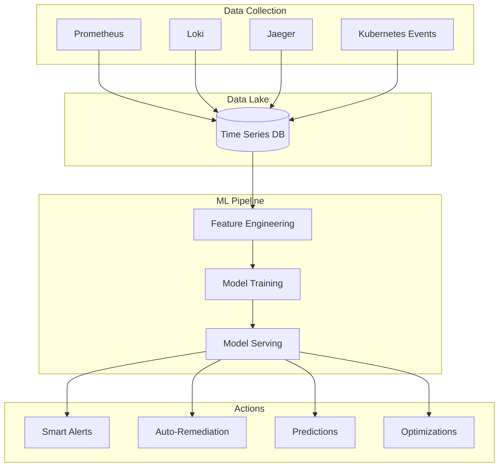
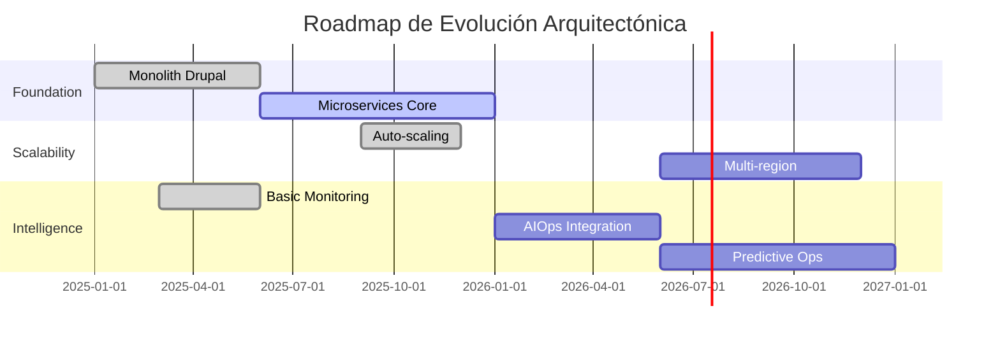

# Arquitectura Adaptativa

**Fecha de creación:** 2026-01-09 22:39  
**Última actualización:** 2026-01-09 22:39  
**Versión:** 1.0.0  
**Categoría:** Arquitectura

---

## 📑 Tabla de Contenidos (TOC)

1. [Propósito](#1-propósito)
2. [Principios de Arquitectura Adaptativa](#2-principios-de-arquitectura-adaptativa)
3. [Métricas de Evolución](#3-métricas-de-evolución)
4. [AI-Driven Operations](#4-ai-driven-operations)
5. [Feedback Loops](#5-feedback-loops)
6. [Continuous Architecture](#6-continuous-architecture)
7. [Roadmap de Madurez](#7-roadmap-de-madurez)
8. [Registro de Cambios](#8-registro-de-cambios)

---

## 1. Propósito

La **Arquitectura Adaptativa** (Nivel 5) representa el máximo nivel de madurez donde:

- El sistema **aprende** de su comportamiento
- Las decisiones arquitectónicas se basan en **datos**
- La evolución es **continua** y automatizada
- El negocio y la tecnología están **alineados en tiempo real**

---

## 2. Principios de Arquitectura Adaptativa

### 2.1 Los 5 Principios

```
┌─────────────────────────────────────────────────────────────┐
│                  ARQUITECTURA ADAPTATIVA                    │
├─────────────────────────────────────────────────────────────┤
│                                                             │
│   1. DATA-DRIVEN                                            │
│      Toda decisión arquitectónica respaldada por datos      │
│                                                             │
│   2. CONTINUOUS EVOLUTION                                   │
│      El sistema evoluciona sin "big bang" releases          │
│                                                             │
│   3. AUTONOMOUS OPERATION                                   │
│      Mínima intervención humana para el día a día           │
│                                                             │
│   4. BUSINESS ALIGNMENT                                     │
│      Métricas técnicas conectadas a KPIs de negocio         │
│                                                             │
│   5. LEARNING SYSTEMS                                       │
│      Mejora continua basada en patrones detectados          │
│                                                             │
└─────────────────────────────────────────────────────────────┘
```

### 2.2 Características del Nivel 5

| Característica | Descripción | Ejemplo |
|----------------|-------------|---------|
| **Self-Improving** | El sistema mejora sin intervención | Auto-tune de queries |
| **Predictive** | Anticipa problemas antes de que ocurran | Predicción de carga |
| **Context-Aware** | Adapta comportamiento según contexto | Pricing dinámico |
| **Resilient** | Se recupera y aprende de fallos | Auto-scaling + chaos |
| **Cost-Efficient** | Optimiza recursos continuamente | FinOps automatizado |

---

## 3. Métricas de Evolución

### 3.1 Architecture Fitness Functions

Las **fitness functions** son métricas automatizadas que validan que la arquitectura cumple sus objetivos:

```yaml
fitness_functions:
  performance:
    - name: api_latency_p99
      threshold: "< 500ms"
      frequency: continuous
      
    - name: page_load_time
      threshold: "< 2s"
      frequency: continuous
      
  reliability:
    - name: error_rate
      threshold: "< 0.1%"
      frequency: continuous
      
    - name: mttr
      threshold: "< 5min"
      frequency: weekly
      
  scalability:
    - name: requests_capacity
      threshold: "> 1000 rps"
      frequency: monthly
      
  security:
    - name: critical_vulnerabilities
      threshold: "= 0"
      frequency: daily
      
  cost:
    - name: cost_per_request
      threshold: "< €0.001"
      frequency: weekly
```

### 3.2 Technical Debt Metrics

```promql
# Deuda técnica cuantificada
technical_debt_hours = 
  sum(tech_debt_items * estimated_fix_hours)

# Ratio de deuda
debt_ratio = 
  sum(tech_debt_hours) / sum(total_development_hours) * 100

# Velocidad de pago de deuda
debt_payment_velocity = 
  sum(increase(tech_debt_resolved_total[30d])) / 
  sum(increase(tech_debt_created_total[30d]))
```

### 3.3 Architecture Health Score

```yaml
# Scoring compuesto 0-100
architecture_health_score:
  components:
    - metric: test_coverage
      weight: 15
      target: 80%
      
    - metric: documentation_coverage
      weight: 10
      target: 90%
      
    - metric: dependency_freshness
      weight: 10
      target: "< 6 months old"
      
    - metric: security_score
      weight: 20
      target: A+
      
    - metric: performance_score
      weight: 20
      target: 90/100
      
    - metric: reliability_score
      weight: 15
      target: 99.9%
      
    - metric: cost_efficiency
      weight: 10
      target: "< budget"
```

---

## 4. AI-Driven Operations

### 4.1 Machine Learning para Ops

| Caso de Uso | Modelo | Input | Output |
|-------------|--------|-------|--------|
| **Anomaly Detection** | Isolation Forest | Métricas timeseries | Alertas inteligentes |
| **Capacity Planning** | Prophet/ARIMA | Histórico de uso | Forecast 30 días |
| **Root Cause Analysis** | Causal Inference | Logs + métricas | Causa probable |
| **Auto-Remediation** | Decision Tree | Síntomas | Runbook sugerido |
| **Cost Optimization** | Reinforcement Learning | Uso + coste | Recomendaciones |

### 4.2 Arquitectura AIOps



### 4.3 Ejemplo: Predicción de Carga

```python
# Pseudocódigo: Predicción de carga con Prophet
from prophet import Prophet
import pandas as pd

# Datos históricos de requests/hour
df = pd.DataFrame({
    'ds': timestamps,
    'y': requests_per_hour
})

# Entrenar modelo
model = Prophet(
    yearly_seasonality=True,
    weekly_seasonality=True,
    daily_seasonality=True
)
model.fit(df)

# Predecir próximas 24h
future = model.make_future_dataframe(periods=24, freq='H')
forecast = model.predict(future)

# Si predicción > capacidad actual → scale up
if forecast['yhat'].max() > current_capacity * 0.8:
    trigger_scale_up(
        target_capacity=forecast['yhat'].max() * 1.2
    )
```

---

## 5. Feedback Loops

### 5.1 Tipos de Feedback Loops

```
                    ┌─────────────────┐
                    │   PRODUCTION    │
                    └────────┬────────┘
                             │
              ┌──────────────┼──────────────┐
              │              │              │
              ▼              ▼              ▼
    ┌─────────────┐ ┌─────────────┐ ┌─────────────┐
    │  TECHNICAL  │ │  BUSINESS   │ │   USER      │
    │  FEEDBACK   │ │  FEEDBACK   │ │  FEEDBACK   │
    │             │ │             │ │             │
    │  • Metrics  │ │  • Revenue  │ │  • NPS      │
    │  • Logs     │ │  • Churn    │ │  • Support  │
    │  • Traces   │ │  • Usage    │ │  • Reviews  │
    └──────┬──────┘ └──────┬──────┘ └──────┬──────┘
           │               │               │
           └───────────────┼───────────────┘
                           │
                           ▼
                  ┌─────────────────┐
                  │   INSIGHTS      │
                  │   ENGINE        │
                  └────────┬────────┘
                           │
              ┌────────────┼────────────┐
              │            │            │
              ▼            ▼            ▼
    ┌──────────────┐ ┌──────────┐ ┌──────────────┐
    │ ARCHITECTURE │ │ PRODUCT  │ │  BUSINESS    │
    │   CHANGES    │ │ BACKLOG  │ │  DECISIONS   │
    └──────────────┘ └──────────┘ └──────────────┘
```

### 5.2 Ciclo de Mejora Continua

| Loop | Frecuencia | Input | Output |
|------|------------|-------|--------|
| **Real-time** | Segundos | Métricas | Auto-scaling, alerts |
| **Hourly** | 1h | Aggregados | Trend detection |
| **Daily** | 24h | Digests | Anomaly reports |
| **Weekly** | 7d | Reviews | Tech debt tickets |
| **Monthly** | 30d | Analysis | Architecture ADRs |
| **Quarterly** | 90d | Strategy | Roadmap updates |

---

## 6. Continuous Architecture

### 6.1 Architecture as Code

```yaml
# architecture.yaml - Definición declarativa
version: "2.0"

services:
  appserver:
    type: drupal
    version: "11.x"
    replicas:
      min: 2
      max: 10
    resources:
      cpu: "500m-2000m"
      memory: "512Mi-2Gi"
    dependencies:
      - database
      - cache
      - queue
      
  database:
    type: mariadb
    version: "10.11"
    replication:
      enabled: true
      replicas: 2
    backup:
      frequency: "4h"
      retention: "30d"
      
  cache:
    type: redis
    version: "7.x"
    cluster: true
    
policies:
  security:
    encryption: "in-transit,at-rest"
    secrets: "vault"
  reliability:
    sla: "99.95%"
    dr: "active-passive"
  cost:
    budget: "€1000/month"
    optimization: "aggressive"
```

### 6.2 Arquitectura Evolutiva



### 6.3 Feature Evolution Tracking

| Feature | V1 | V2 | V3 (Current) | V4 (Planned) |
|---------|----|----|--------------|--------------|
| **Onboarding** | Manual | Semi-auto | Auto | AI-guided |
| **Pricing** | Fixed | Tiered | Dynamic | ML-optimized |
| **Scaling** | Manual | Scheduled | Reactive | Predictive |
| **Support** | Email | Chat | Chatbot | AI Agent |
| **Monitoring** | Basic | APM | Full observability | AIOps |

---

## 7. Roadmap de Madurez

### 7.1 Estado Actual vs Target

```
                              ACTUAL  TARGET
Nivel 1: Inicial              ████████ ✅
Nivel 2: Documentada          ████████ ✅
Nivel 3: Gestionada           ████████ ✅
Nivel 4: Optimizada           ████████ ✅
Nivel 5: Adaptativa           ██░░░░░░ 25%
```

### 7.2 Criterios de Nivel 5

| Criterio | Estado | Próximos Pasos |
|----------|--------|----------------|
| Self-healing | ✅ Documentado | Implementar runbooks |
| Chaos Engineering | ✅ Documentado | Ejecutar Game Days |
| FinOps | ✅ Documentado | Configurar dashboards |
| Fitness Functions | ⚠️ Parcial | Automatizar checks |
| AIOps | ❌ Pendiente | Integrar ML pipeline |
| Continuous Architecture | ⚠️ Parcial | Architecture as Code |

### 7.3 Próximas Acciones

1. **Q1 2026**: Implementar runbooks self-healing
2. **Q1 2026**: Primer Game Day de chaos engineering
3. **Q2 2026**: Dashboard FinOps completo
4. **Q2 2026**: Fitness functions automatizadas
5. **Q3 2026**: Piloto AIOps (anomaly detection)
6. **Q4 2026**: Full Level 5 compliance

---

## 8. Registro de Cambios

| Fecha | Versión | Autor | Descripción |
|-------|---------|-------|-------------|
| 2026-01-09 | 1.0.0 | IA Asistente | Creación inicial del documento |
