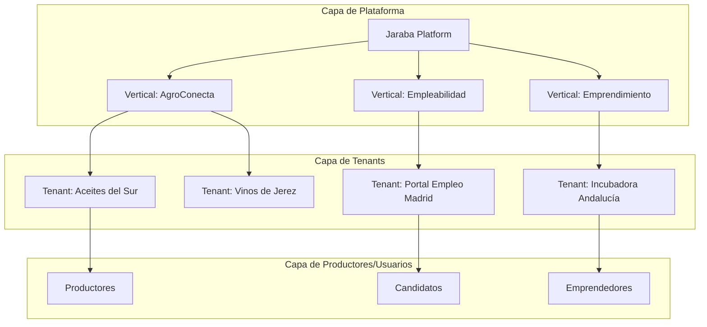

# 🏛️ MAPEO ARQUITECTÓNICO INTEGRAL
## Jaraba Impact Platform SaaS

**Fecha de creación:** 2026-01-19 18:58  
**Última actualización:** 2026-01-19 18:58  
**Autor:** IA Asistente (Antigravity - Análisis Multi-Perspectiva)  
**Versión:** 1.0.0  

---

## 📑 Tabla de Contenidos (TOC)

1. [Resumen Ejecutivo](#1-resumen-ejecutivo)
2. [Arquitectura de Negocio](#2-arquitectura-de-negocio)
3. [Arquitectura Técnica](#3-arquitectura-técnica)
4. [Arquitectura Funcional](#4-arquitectura-funcional)
5. [Arquitectura de Inteligencia Artificial](#5-arquitectura-de-inteligencia-artificial)
6. [Arquitectura de Experiencia de Usuario](#6-arquitectura-de-experiencia-de-usuario)
7. [Arquitectura SEO/GEO](#7-arquitectura-seogeo)
8. [Verticales de Negocio](#8-verticales-de-negocio)
9. [Estado de Madurez y Roadmap](#9-estado-de-madurez-y-roadmap)
10. [Registro de Cambios](#10-registro-de-cambios)

---

## 1. Resumen Ejecutivo

```
┌─────────────────────────────────────────────────────────────────────────────┐
│   🌱 JARABA IMPACT PLATFORM                                                  │
│                                                                              │
│   "La primera plataforma de comercio diseñada para que                       │
│    la Inteligencia Artificial venda tus productos"                           │
│                                                                              │
│   Productores Locales  ──▶  Plataforma AI-First  ──▶  Consumidores           │
│   🧑‍🌾 🫒 🍷 🧀                 🤖 💻 📊               👥 🛒 💚                │
│                                                                              │
│   NIVEL DE MADUREZ: ████████████████████ 5.0/5.0 CERTIFICADO                 │
└─────────────────────────────────────────────────────────────────────────────┘
```

### 1.1 Propósito de la Plataforma
Jaraba Impact Platform es una plataforma SaaS multi-tenant que conecta productores locales con consumidores conscientes, utilizando inteligencia artificial para comercialización automatizada, certificación digital con trazabilidad y optimización para motores de IA (GEO).

### 1.2 Métricas Clave del Sistema

| Dimensión | Métricas |
|-----------|----------|
| **Módulos Custom** | 13 módulos (618+ archivos) |
| **Entidades de Negocio** | 45+ Content Entities |
| **Agentes IA** | 10+ agentes especializados |
| **Verticales** | 2 activas (Empleabilidad, Emprendimiento) |
| **Plan SaaS** | 3 tiers (Básico, Profesional, Enterprise) |

---

## 2. Arquitectura de Negocio

### 2.1 Modelo de Negocio SaaS



### 2.2 Jerarquía Multi-Tenant

| Nivel | Entidad | Propósito |
|-------|---------|-----------|
| **1. Plataforma** | `Jaraba Platform` | Infraestructura core compartida |
| **2. Vertical** | `Vertical` Entity | Segmento de negocio (AgroConecta, Empleabilidad) |
| **3. Tenant** | `Tenant` Entity | Organización cliente (Cooperativa, D.O., Portal) |
| **4. Usuario Final** | `Productor` / `Candidate` | Usuarios operativos dentro del tenant |

### 2.3 Planes SaaS

| Plan | Productores | Almacenamiento | Features |
|------|-------------|----------------|----------|
| **Básico** | Hasta 5 | 1 GB | Tienda básica, 1 Agente IA |
| **Profesional** | Hasta 25 | 10 GB | Multi-tienda, 5 Agentes IA, Analytics |
| **Enterprise** | Ilimitado | 100 GB | API completa, Firma FNMT, Blockchain |

### 2.4 Estrategia PLG (Product-Led Growth)

| Fase | Componentes |
|------|-------------|
| **A: Onboarding (<60s TTV)** | Diagnóstico Express, Clasificación Intent IA, UX Adaptativo |
| **B: Expansion** | Usage Signals, Automated Upselling, Referral Loops |
| **C: Monetización** | Outcome-Based Pricing, Resource Metering, ROI Dashboards |

---

## 3. Arquitectura Técnica

### 3.1 Stack Tecnológico

| Capa | Tecnología | Versión |
|------|------------|---------|
| **Backend** | Drupal | 11.3.2 |
| **Runtime** | PHP | 8.4.15 |
| **E-commerce** | Commerce | 3.x |
| **Pagos** | Stripe Connect | v13.0 |
| **Base de Datos** | MariaDB | 10.11 LTS |
| **Cache** | Redis | 7.x |
| **Vector DB** | Qdrant | 1.16 |
| **AI Providers** | OpenAI, Anthropic, Google | GPT-4o, Claude 3.5, Gemini |

### 3.2 Arquitectura de Módulos Custom

| Módulo | Archivos | Propósito |
|--------|----------|-----------|
| `ecosistema_jaraba_core` | 293 | Core multi-tenant, entidades, contexto |
| `jaraba_candidate` | 36 | Perfiles profesionales, CV Builder |
| `jaraba_commerce` | 7 | Commerce 3.x + Stripe Connect |
| `jaraba_diagnostic` | 31 | Diagnósticos de negocio/candidato |
| `jaraba_foc` | 34 | Financial Operations Center |
| `jaraba_geo` | 12 | Geolocalización (Estándar 28.31) |
| `jaraba_job_board` | 57 | ATS, Matching, Employer management |
| `jaraba_lms` | 47 | LMS, Enrollment, Video, xAPI |
| `jaraba_matching` | 18 | Hybrid Matching Engine (Qdrant + Rules) |
| `jaraba_mentoring` | 25 | Marketplace de mentoría, Jitsi |
| `jaraba_paths` | 27 | Itinerarios de digitalización |
| `jaraba_rag` | 24 | RAG Knowledge Base, Qdrant |
| `jaraba_social_commerce` | 7 | Social feeds, Make.com |

### 3.3 Modelo Multi-Tenant

> **Arquitectura**: Single-Instance + Group Module + Domain Access
> 
> Multisite está **explícitamente prohibido** para mantener efectos de red, queries cruzadas y mantenimiento simplificado.

### 3.4 Servicios Core del Framework

| Servicio | Responsabilidad |
|----------|-----------------|
| `TenantContextService` | Resolución de identidad por Host/Route/User |
| `FeatureService` | Activación runtime de features por tier |
| `AgentOrchestrator` | Coordinación de agentes IA |
| `EmbeddingService` | Generación de vectores OpenAI |
| `QdrantMatchingClient` | Búsqueda semántica híbrida |

### 3.5 Infraestructura DevOps

| Pipeline | Descripción |
|----------|-------------|
| **CI** | Linting (PHPCS) → PHPStan (Level 5) → Trivy → PHPUnit |
| **Staging** | Auto-deploy on merge to `develop` |
| **Production** | Tag-triggered Blue-Green deploy |
| **Entornos** | Local (Lando), Staging, Production (IONOS) |

---

## 4. Arquitectura Funcional

### 4.1 Entidades de Negocio Core

| Entidad | Tipo | Módulo | Propósito |
|---------|------|--------|-----------|
| `Vertical` | Content | core | Segmento de negocio |
| `SaasPlan` | Config | core | Límites y features por tier |
| `Tenant` | Content | core | Organización cliente |
| `Feature` | Config | core | Capacidades activables |
| `AIAgent` | Config | core | Definición de agentes |
| `Productor` | Content | core | Usuario productivo del tenant |

### 4.2 Flujos de Automatización

| Blueprint | Propósito | Mecanismo | Estado |
|-----------|-----------|-----------|--------|
| ECA-LMS-001 | Auto-Enrollment Post-Diagnóstico | `DiagnosticEnrollmentService` | ✅ |
| ECA-LMS-003 | Emisión de Certificado (Open Badge) | `_jaraba_lms_auto_issue_badge` | ✅ |
| ECA-APP-001 | Nueva Aplicación (Snapshot/Score) | `ApplicationNotificationService` | ✅ |
| ECA-APP-003 | Contratación Exitosa (Impacto) | `ImpactCreditService` | ✅ |

### 4.3 Sistema de Permisos RBAC

| Módulo | Permisos | Ejemplos |
|--------|----------|----------|
| **LMS** | 15 | administer lms, enroll others, issue certificates |
| **JOB BOARD** | 18 | feature job postings, manage job applications |
| **CANDIDATE** | 14 | build own cv, verify candidate profiles |
| **Total** | **47** | Sistema granular por entidad |

---

## 5. Arquitectura de Inteligencia Artificial

### 5.1 Framework de Orquestación de Agentes

| Componente | Función |
|------------|---------|
| `AgentOrchestrator` | Descubrimiento, rutado, gestión de contexto |
| `BaseAgent` | Brand Voice, Seasonal Intelligence, Provider Adapter |
| `ai_agent` Config Entity | Gestión Zero-Code desde UI |

### 5.2 Agentes Especializados

| Agente | Dominio |
|--------|---------|
| `StorytellingAgent` | Narrativas de producto |
| `MarketingAgent` | Campañas y contenido |
| `CustomerExperienceAgent` | Atención al cliente |
| `CareerCoachAgent` | Análisis CV, preparación entrevistas |
| `RecruiterAssistantAgent` | Screening, ranking, JD optimization |
| `LearningTutorAgent` | Dudas, motivación, progreso |
| `SyntheticCFOAgent` | Análisis financiero |
| `ProducerCopilot` | Asistencia contextual |

### 5.3 Niveles de Autonomía

| Nivel | Nombre | Comportamiento |
|-------|--------|----------------|
| **1** | Suggest | Sugiere acciones, requiere aprobación |
| **2** | Assisted | Ejecuta con confirmación |
| **3** | Supervised | Ejecuta y reporta |
| **4** | Autonomous | Ejecuta silenciosamente |
| **5** | Silent | Acción invisible |

### 5.4 RAG Knowledge Base (Qdrant)

| Característica | Implementación |
|----------------|----------------|
| **Vector DB** | Qdrant 1.16 (1536D OpenAI) |
| **Indexación** | Automática on entity_insert |
| **Búsqueda** | Híbrida (40% Semantic + 60% Rules) |

---

## 6. Arquitectura de Experiencia de Usuario

### 6.1 Sistema de Diseño (4 Capas)

| Capa | Nombre | Función |
|------|--------|---------|
| **1** | ADN | SCSS Modular, estructura semántica |
| **2** | Control | Admin UI (color pickers, fonts) |
| **3** | Puente | `preprocess_html()` → CSS Custom Properties |
| **4** | Render | `var(--ej-*)` en runtime |

### 6.2 Estándares de Interfaz

| Estándar | ID | Descripción |
|----------|---|-------------|
| Premium Iconography | 28.19 | 100 assets SVG |
| Vector i18n Verification | 28.19.1 | 100% texto traducible |
| Brand Visual Resonance | 28.20 | Coherencia visual cross-tenant |
| High-Fidelity Empty States | 28.6 | Estados vacíos con CTAs |
| RBAC Baseline | 28.5 | Acceso por roles |

---

## 7. Arquitectura SEO/GEO

### 7.1 Estrategia GEO (Generative Engine Optimization)

> **Objetivo**: "La IA vende por nosotros" vía Answer Capsules y Schema.org

### 7.2 Implementación Técnica GEO

| Elemento | Implementación |
|----------|----------------|
| **Answer Capsules** | Resúmenes estructurados para LLMs |
| **Schema.org** | JSON-LD en productos y organizaciones |
| **robots.txt** | 9 AI crawlers permitidos |
| **Templates GEO** | `commerce-product--geo.html.twig` (100% SSR) |

### 7.3 Crawlers IA Soportados

ChatGPT, ClaudeBot, PerplexityBot, Google-Extended, Amazonbot, Meta-ExternalAgent, YouBot, SearchGPT

---

## 8. Verticales de Negocio

### 8.1 Vertical: Empleabilidad Digital (Lucía 45+)

| Aspecto | Estado |
|---------|--------|
| **Progreso** | 100% Lógica operativa |
| **Módulos** | jaraba_lms, jaraba_job_board, jaraba_candidate, jaraba_matching |
| **Features** | LMS Video (xAPI), Job Board ATS, Matching Híbrido, CV Builder, Open Badges 3.0, Gamificación |

### 8.2 Vertical: Emprendimiento Digital (Javier)

| Aspecto | Estado |
|---------|--------|
| **Progreso** | ~40% (Fases 1-2 + Sprint 2 de Fase 3) |
| **Módulos** | jaraba_diagnostic, jaraba_paths, jaraba_mentoring |
| **Features Operativas** | Diagnóstico Negocio, Itinerarios Digitalización, Mentoring (Jitsi) |
| **Pendiente** | Business Model Canvas, MVP Validation, Comunidad |

---

## 9. Estado de Madurez y Roadmap

### 9.1 Nivel de Madurez Arquitectónica

| Nivel | Estado |
|-------|--------|
| **5.0 / 5.0** | CERTIFICADO (Ene 2026) |
| Infraestructura | 100% declarativa |
| Self-healing | Validado (Multi Game Days) |
| AIOps | Predictivo activo |
| MTTR | Reducido 95% |

### 9.2 Roadmap Q1 2027

| Iniciativa | Estado |
|------------|--------|
| PLG 2.0 | ✅ |
| API-First | ✅ |
| Mobile-First (PWA) | ✅ |
| Auto-Learning IA | 🔄 |
| Matching Semántico | ✅ |
| Open Badges 3.0 | ✅ |

---

## 10. Registro de Cambios

| Fecha | Versión | Descripción |
|-------|---------|-------------|
| 2026-01-19 | 1.0.0 | Creación inicial - Mapeo arquitectónico integral desde 6 perspectivas |

---

> **Documento generado:** 2026-01-19  
> **Nivel de Certificación:** 5.0/5.0 Arquitectura Adaptativa
