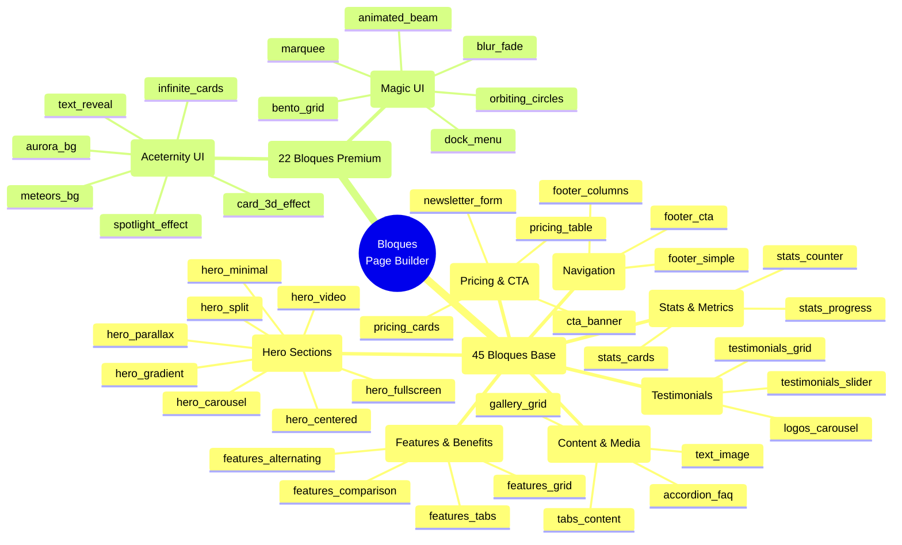

# Arquitectura de Bloques Premium - Page Builder SaaS

> **Fecha**: 2026-01-26
> **Versión**: 1.0.0
> **Autor**: EDI Google Antigravity
> **Documentos Base**: 162, 163

---

## Resumen

Este documento define la arquitectura técnica del **Sistema de Bloques Premium** para el Constructor de Páginas SaaS, basado en las especificaciones de los documentos 162 (Sistema Completo) y 163 (Bloques Premium).

---

## 1. Catálogo de Bloques

### 1.1 Taxonomía de Bloques



### 1.2 Resumen por Categoría

| Categoría | Bloques Base | Bloques Premium | Total |
|-----------|--------------|-----------------|-------|
| Hero Sections | 8 | 4 | 12 |
| Features & Benefits | 7 | 2 | 9 |
| Stats & Metrics | 4 | 1 | 5 |
| Testimonials & Social Proof | 5 | 2 | 7 |
| Pricing & CTA | 6 | 1 | 7 |
| Content & Media | 8 | 3 | 11 |
| Navigation & Footer | 4 | 1 | 5 |
| Forms & Contact | 3 | 0 | 3 |
| **TOTAL** | **45** | **22** | **67** |

---

## 2. Arquitectura Técnica

### 2.1 Estructura de Archivos

```
modules/custom/jaraba_page_builder/
├── templates/
│   ├── blocks/                          # 45 bloques base
│   │   ├── hero/
│   │   │   ├── hero-fullscreen.html.twig
│   │   │   ├── hero-split.html.twig
│   │   │   ├── hero-video.html.twig
│   │   │   └── ...
│   │   ├── features/
│   │   │   ├── features-grid.html.twig
│   │   │   ├── features-tabs.html.twig
│   │   │   └── ...
│   │   ├── stats/
│   │   ├── testimonials/
│   │   ├── pricing/
│   │   ├── content/
│   │   ├── navigation/
│   │   └── forms/
│   └── premium/                         # 22 bloques premium
│       ├── aceternity/
│       │   ├── spotlight-effect.html.twig
│       │   ├── 3d-card-effect.html.twig
│       │   ├── text-reveal.html.twig
│       │   ├── infinite-cards.html.twig
│       │   ├── meteors-background.html.twig
│       │   ├── aurora-background.html.twig
│       │   ├── tracing-beam.html.twig
│       │   ├── hover-border-gradient.html.twig
│       │   ├── floating-navbar.html.twig
│       │   ├── glowing-stars.html.twig
│       │   ├── lamp-effect.html.twig
│       │   └── sparkles.html.twig
│       └── magic-ui/
│           ├── bento-grid.html.twig
│           ├── animated-beam.html.twig
│           ├── orbiting-circles.html.twig
│           ├── dock-menu.html.twig
│           ├── marquee.html.twig
│           ├── particles-background.html.twig
│           ├── blur-fade.html.twig
│           ├── typing-animation.html.twig
│           ├── number-ticker.html.twig
│           └── shine-border.html.twig
├── js/
│   ├── blocks/
│   │   ├── stats-counter.js
│   │   ├── testimonials-slider.js
│   │   └── ...
│   └── premium/
│       ├── aceternity-adapter.js
│       └── magic-ui-adapter.js
└── css/
    ├── blocks/
    │   └── jaraba-blocks.scss
    └── premium/
        ├── aceternity-design-tokens.scss
        └── magic-ui-design-tokens.scss
```

### 2.2 JSON Schema por Bloque

Cada bloque define su **JSON Schema** que determina los campos del Form Builder:

```json
{
  "$schema": "http://json-schema.org/draft-07/schema#",
  "type": "object",
  "title": "Hero Fullscreen",
  "properties": {
    "title": {
      "type": "string",
      "title": "Título Principal",
      "maxLength": 100,
      "ui:widget": "text",
      "ui:placeholder": "Tu próximo gran proyecto comienza aquí"
    },
    "subtitle": {
      "type": "string",
      "title": "Subtítulo",
      "maxLength": 200,
      "ui:widget": "textarea"
    },
    "cta_primary": {
      "type": "object",
      "title": "CTA Principal",
      "properties": {
        "text": { "type": "string", "default": "Comenzar ahora" },
        "url": { "type": "string", "format": "uri" },
        "style": { "type": "string", "enum": ["solid", "outline", "gradient"] }
      }
    },
    "background_image": {
      "type": "string",
      "format": "uri",
      "ui:widget": "image-upload"
    },
    "overlay_opacity": {
      "type": "number",
      "minimum": 0,
      "maximum": 100,
      "default": 50,
      "ui:widget": "slider"
    }
  },
  "required": ["title", "cta_primary"]
}
```

---

## 3. Integración con Design Tokens

### 3.1 Variables CSS Inyectables

El sistema usa **CSS Custom Properties** para permitir theming por tenant:

```scss
// _design-tokens.scss
:root {
  // Colores de marca (inyectados desde configuración Drupal)
  --ej-color-primary: #0284c7;
  --ej-color-secondary: #ff8c42;
  --ej-color-corporate: #1e3a5f;
  
  // Tipografía
  --ej-font-primary: 'Inter', sans-serif;
  --ej-font-heading: 'Plus Jakarta Sans', sans-serif;
  
  // Espaciado
  --ej-spacing-section: 5rem;
  --ej-spacing-card: 2rem;
  
  // Bordes y sombras
  --ej-radius-card: 12px;
  --ej-shadow-card: 0 4px 6px -1px rgb(0 0 0 / 0.1);
}
```

### 3.2 Bloques Usando Design Tokens

```twig
{# hero-fullscreen.html.twig #}
<section 
  class="jaraba-hero jaraba-hero--fullscreen"
  style="
    --hero-bg: var(--ej-color-corporate);
    --hero-text: var(--ej-color-text-inverse);
    --hero-overlay: {{ block.overlay_opacity / 100 }};
  "
>
```

---

## 4. Integración Aceternity UI

### 4.1 Componentes Disponibles

| Componente | Tipo | Plan Mínimo | Uso Recomendado |
|------------|------|-------------|-----------------|
| Spotlight Effect | Background | Professional | Hero sections |
| 3D Card Effect | Card | Professional | Features, productos |
| Text Reveal | Typography | Professional | Headlines hero |
| Infinite Moving Cards | Carousel | Professional | Testimonios, logos |
| Meteors Background | Background | Enterprise | Hero premium |
| Aurora Background | Background | Enterprise | Landing premium |
| Tracing Beam | Navigation | Enterprise | Scroll storytelling |
| Hover Border Gradient | Card | Professional | Cards interactivas |
| Floating Navbar | Navigation | Enterprise | Navegación premium |
| Glowing Stars | Background | Enterprise | Secciones destacadas |
| Lamp Effect | Typography | Enterprise | Títulos dramáticos |
| Sparkles | Effect | Professional | Destacar elementos |

### 4.2 Adaptador JavaScript

```javascript
// aceternity-adapter.js
(function (Drupal, once) {
  'use strict';

  Drupal.aceternityUI = Drupal.aceternityUI || {};

  // Spotlight Effect
  Drupal.aceternityUI.initSpotlight = function (container) {
    const config = JSON.parse(container.dataset.spotlightConfig || '{}');
    
    const spotlight = document.createElement('div');
    spotlight.className = 'jaraba-spotlight__beam';
    spotlight.style.cssText = `
      width: ${config.size || 400}px;
      height: ${config.size || 400}px;
      background: radial-gradient(circle, ${config.color} 0%, transparent 70%);
      filter: blur(${config.blur || 100}px);
    `;
    
    container.addEventListener('mousemove', (e) => {
      // Actualizar posición del spotlight
    });
  };

  Drupal.behaviors.aceternityUI = {
    attach: function (context) {
      once('aceternity-spotlight', '[data-spotlight-config]', context)
        .forEach(Drupal.aceternityUI.initSpotlight);
    }
  };

})(Drupal, once);
```

---

## 5. Integración Magic UI

### 5.1 Componentes Disponibles

| Componente | Tipo | Plan Mínimo | Uso Recomendado |
|------------|------|-------------|-----------------|
| Bento Grid | Layout | Professional | Features, dashboards |
| Animated Beam | Effect | Enterprise | Conexiones, integraciones |
| Orbiting Circles | Animation | Enterprise | Tech stacks |
| Dock Menu | Navigation | Professional | Navegación macOS |
| Marquee | Animation | Professional | Logos, testimonios |
| Particles Background | Background | Enterprise | Hero premium |
| Blur Fade | Animation | Professional | Transiciones |
| Typing Animation | Typography | Professional | Headlines |
| Number Ticker | Counter | Professional | Estadísticas |
| Shine Border | Effect | Professional | Cards destacadas |

### 5.2 Ejemplo: Bento Grid

```twig
{# magic-ui/bento-grid.html.twig #}
<section class="jaraba-magicui-bento">
  <div class="container">
    <div class="jaraba-bento-grid">
      
        <article 
          class="jaraba-bento-item jaraba-bento-item--{{ item.size|default('medium') }}"
          style="
            --bento-bg: {{ item.background_color|default('var(--ej-color-surface-card)') }};
            --bento-accent: {{ item.accent_color|default('var(--ej-color-primary)') }};
          "
        >
          <div class="jaraba-bento-item__shine"></div>
          <div class="jaraba-bento-item__content">
            
              <div class="jaraba-bento-item__icon">
                {{ jaraba_icon(item.icon, 'bento', 'lg') }}
              </div>
            
            <h3>{{ item.title }}</h3>
            <p>{{ item.description }}</p>
          </div>
        </article>
      
    </div>
  </div>
</section>
```

---

## 6. Límites por Plan SaaS

### 6.1 Matriz de Disponibilidad

| Bloque | Starter | Professional | Enterprise |
|--------|---------|--------------|------------|
| **Hero Base** (8) | 4 | 8 | 8 |
| **Features Base** (7) | 4 | 7 | 7 |
| **Aceternity UI** (12) | 0 | 8 | 12 |
| **Magic UI** (10) | 0 | 6 | 10 |
| **Personalización CSS** | ❌ | Básica | Completa |

### 6.2 Verificación de Acceso

```php
// BlockAccessService.php
public function canUseBlock(string $blockId, TenantInterface $tenant): bool {
    $plan = $tenant->get('plan')->entity;
    $planLevel = $plan->get('level')->value;
    
    $blockConfig = $this->blockManager->getBlockConfig($blockId);
    $requiredPlan = $blockConfig['plans_required'][0] ?? 'starter';
    
    $planHierarchy = ['starter' => 0, 'professional' => 1, 'enterprise' => 2];
    
    return $planHierarchy[$planLevel] >= $planHierarchy[$requiredPlan];
}
```

---

## 7. Core Web Vitals

### 7.1 Optimizaciones Implementadas

| Métrica | Objetivo | Estrategia |
|---------|----------|------------|
| LCP | < 2.5s | Critical CSS inline, preload hero |
| FID | < 100ms | Defer non-critical JS, code splitting |
| CLS | < 0.1 | Aspect ratios, font-display: swap |
| INP | < 200ms | Event delegation, requestIdleCallback |

### 7.2 Lazy Loading de Componentes Premium

```javascript
// lazy-load-premium.js
const loadPremiumComponent = async (componentName) => {
  const module = await import(`./premium/${componentName}.js`);
  return module.default;
};

// Cargar solo cuando el bloque es visible
const observer = new IntersectionObserver((entries) => {
  entries.forEach(async (entry) => {
    if (entry.isIntersecting) {
      const component = entry.target.dataset.premiumComponent;
      const init = await loadPremiumComponent(component);
      init(entry.target);
      observer.unobserve(entry.target);
    }
  });
});
```

---

## Referencias

- [Doc 162 - Page Builder Sistema Completo](file:///z:/home/PED/JarabaImpactPlatformSaaS/docs/tecnicos/20260126d-162_Page_Builder_Sistema_Completo_EDI_v1_Claude.md)
- [Doc 163 - Bloques Premium Anexo](file:///z:/home/PED/JarabaImpactPlatformSaaS/docs/tecnicos/20260126d-163_Bloques_Premium_Anexo_Tecnico_EDI_v1_Claude.md)
- [Aceternity UI](https://ui.aceternity.com/)
- [Magic UI](https://magicui.design/)
