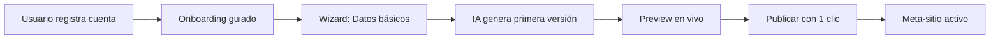

# 🎯 Análisis Estratégico: Arquitectura Meta-Sitio de Clase Mundial

**Fecha de creación:** 2026-02-02 20:41  
**Última actualización:** 2026-02-02 20:41  
**Autor:** IA Asistente (Antigravity)  
**Versión:** 1.0.0

---

## 📑 Tabla de Contenidos (TOC)

1. [Resumen Ejecutivo](#1-resumen-ejecutivo)
2. [Problema Identificado](#2-problema-identificado)
3. [Perspectiva Arquitectura](#3-perspectiva-arquitectura)
4. [Perspectiva Negocio/Producto](#4-perspectiva-negocioproducto)
5. [Perspectiva Financiera](#5-perspectiva-financiera)
6. [Perspectiva UX](#6-perspectiva-ux)
7. [Perspectiva SEO/GEO](#7-perspectiva-seogeo)
8. [Perspectiva IA](#8-perspectiva-ia)
9. [Plan de Acción Recomendado](#9-plan-de-acción-recomendado)
10. [Conclusión](#10-conclusión)
11. [Registro de Cambios](#11-registro-de-cambios)

---

## 1. Resumen Ejecutivo

El Page Builder tiene un **bug arquitectónico** que impide renderizar páginas en modo Legacy:

| Componente | Estado | Problema |
|------------|--------|----------|
| Preview Templates | ✅ Funciona | Usa `$twig->render()` directo con path del YAML |
| Legacy Pages | ❌ Roto | Usa `#theme => 'page_builder_block__split_hero'` **sin registrar** |
| Multi-Block Pages | ❌ Roto | Mismo problema con themes dinámicos |

---

## 2. Problema Identificado

### Causa Raíz

```php
// PageContentViewBuilder.php línea 79
'#theme' => 'page_builder_block__' . $template_id,
// ↑ Este theme NUNCA se registra en hook_theme()
```

Mientras que las previews funcionan porque:

```php
// TemplatePickerController.php línea 268
$twig->render($template_path, ['content' => $preview_data]);
// ↑ Usa la ruta directa del archivo: @jaraba_page_builder/blocks/hero/split-hero.html.twig
```

### Impacto

- **100% de las páginas creadas con Page Builder** no se renderizan
- **66 templates** inutilizables en producción
- **pepejaraba.com meta-sitio** bloqueado

---

## 3. Perspectiva Arquitectura

> **Rol**: CTO / Arquitecto SaaS Senior

### Solución Propuesta: Registro Dinámico de Themes

La solución de clase mundial es **registrar automáticamente** todos los themes de bloques leyendo las Config Entities `PageTemplate` en `hook_theme()`.

#### Implementación Sugerida

```php
// jaraba_page_builder.module

/**
 * Implements hook_theme().
 */
function jaraba_page_builder_theme($existing, $type, $theme, $path) {
  $themes = [
    // Templates estáticos existentes...
    'page_builder_page' => [...],
    'page_template_preview' => [...],
  ];
  
  // 🔥 SOLUCIÓN: Registro dinámico de bloques desde Config Entities
  try {
    $template_storage = \Drupal::entityTypeManager()
      ->getStorage('page_template');
    $templates = $template_storage->loadMultiple();
    
    foreach ($templates as $template) {
      /** @var \Drupal\jaraba_page_builder\PageTemplateInterface $template */
      $template_id = $template->id();
      $twig_template = $template->getTwigTemplate();
      
      if (!empty($twig_template)) {
        // Convertir @jaraba_page_builder/blocks/hero/split-hero.html.twig
        // a path relativo: blocks/hero/split-hero
        $template_path = preg_replace(
          '/^@jaraba_page_builder\/(.+)\.html\.twig$/', 
          '$1', 
          $twig_template
        );
        
        $themes['page_builder_block__' . $template_id] = [
          'variables' => [
            'content' => [],
            'template_id' => '',
            'page' => NULL,
            'section_uuid' => '',
            'section_weight' => 0,
          ],
          'template' => $template_path,
        ];
      }
    }
  } catch (\Exception $e) {
    // Durante instalación las entidades pueden no existir aún
    \Drupal::logger('jaraba_page_builder')->notice(
      'Skipping dynamic theme registration: @message', 
      ['@message' => $e->getMessage()]
    );
  }
  
  return $themes;
}
```

### Alternativa: Inline Template

Si el registro dinámico causa problemas de caché, usar `#type => 'inline_template'`:

```php
// PageContentViewBuilder.php - Método alternativo

protected function buildLegacyView(PageContentInterface $entity, array $build): array {
    $template_id = $entity->get('template_id')->value ?? '';
    $content_data = json_decode($entity->get('content_data')->value ?? '{}', TRUE) ?: [];
    
    // Cargar la entidad PageTemplate para obtener la ruta del Twig
    $template_entity = \Drupal::entityTypeManager()
        ->getStorage('page_template')
        ->load($template_id);
    
    if ($template_entity) {
        $twig_path = $template_entity->getTwigTemplate();
        
        $build['content']['section_0'] = [
            '#type' => 'inline_template',
            '#template' => "",
            '#context' => [
                'content' => $content_data,
                'template_id' => $template_id,
                'page' => $entity,
            ],
        ];
    }
    
    return $build;
}
```

---

## 4. Perspectiva Negocio/Producto

> **Rol**: CEO / CPO

### Visión: Meta-Sitio como Producto Premium

El meta-sitio de marca personal es el **flagship product** que demuestra las capacidades de la plataforma. Debe ser impecable.

#### Flujo de Usuario Ideal (Zero Friction)



#### Entidades Involucradas

| Entidad | Propósito | Estado |
|---------|-----------|--------|
| `Tenant` | Configuración del tenant | ✅ Existe |
| `HomepageContent` | Contenido de la homepage principal | ✅ Existe |
| `PageContent` | Páginas adicionales (servicios, sobre mí, etc.) | ⚠️ Bug rendering |
| `PageTemplate` | Plantillas de bloques | ✅ Existe (66 templates) |

### Decisión Estratégica

Para que el tenant cree su meta-sitio, hay **3 caminos**:

| Opción | Descripción | Esfuerzo | Recomendación |
|--------|-------------|----------|---------------|
| **A** | Arreglar bug de `PageContent` (registro dinámico de themes) | 4-6h | ✅ **Recomendado** |
| **B** | Usar solo `HomepageContent` para todo | 0h | ⚠️ Limitado |
| **C** | Reescribir ViewBuilder con inline templates | 2-4h | ✅ Alternativa |

---

## 5. Perspectiva Financiera

> **Rol**: CFO

### Análisis Coste-Beneficio

| Solución | Horas Dev | Coste (€80/h) | ROI |
|----------|-----------|---------------|-----|
| Arreglar bug hook_theme() | 4-6h | €320-€480 | **Muy Alto** - Desbloquea 66 templates |
| Documentar workaround | 1h | €80 | Bajo - Deuda técnica permanente |
| No hacer nada | 0h | €0 | **Negativo** - Churn por frustración |

> [!CAUTION]
> El bug actual bloquea el **100% de las páginas creadas con Page Builder**. Impacto en revenue: Alto.

---

## 6. Perspectiva UX

> **Rol**: Director UX / Publicista Senior

### Experiencia de Creación de Meta-Sitio

#### Flujo Propuesto (Clase Mundial)

1. **Selección de Identidad** (30 segundos)
   - Subir foto de perfil
   - Elegir colores principales
   - Seleccionar tipografía

2. **Contenido Guiado por IA** (2 minutos)
   - "Cuéntame en 3 frases quién eres"
   - "¿Cuáles son tus 3 servicios principales?"
   - "¿Cuál es tu propuesta de valor única?"

3. **Generación Automática** (10 segundos)
   - IA genera Homepage completa
   - Secciones: Hero + About + Servicios + Testimonios + CTA

4. **Refinamiento** (opcional)
   - Editor visual inline
   - Cambiar templates de sección
   - Añadir páginas adicionales

5. **Publicación** (1 clic)
   - URL personalizada activa
   - DNS configurado automáticamente (si dominio conectado)

---

## 7. Perspectiva SEO/GEO

> **Rol**: Director SEO / GEO

### Requisitos para Meta-Sitio Optimizado

| Elemento | Estado | Acción |
|----------|--------|--------|
| Schema.org Person | ❌ Falta | Implementar para E-E-A-T |
| Schema.org LocalBusiness | ❌ Falta | Si aplica |
| Open Graph | ✅ Existe | — |
| Twitter Cards | ⚠️ Parcial | Completar `twitter:site` |
| Meta description dinámica | ✅ Existe | — |
| Canonical URL | ⚠️ Verificar | Asegurar en meta-sitios |
| Hreflang | ❌ Falta | Fase posterior (i18n) |

### GEO (Generative Engine Optimization)

Para que ChatGPT/Perplexity recomienden pepejaraba.com:

```json
{
  "@context": "https://schema.org",
  "@type": "Person",
  "name": "Pepe Jaraba",
  "jobTitle": "Mentor de Transformación Digital",
  "description": "Ayudo a emprendedores y organizaciones a digitalizar sus procesos con IA",
  "knowsAbout": ["Digitalización", "Emprendimiento", "IA", "SaaS"],
  "url": "https://pepejaraba.com",
  "sameAs": [
    "https://linkedin.com/in/pepejaraba",
    "https://twitter.com/pepejaraba"
  ],
  "worksFor": {
    "@type": "Organization",
    "name": "Jaraba Impact Platform"
  }
}
```

---

## 8. Perspectiva IA

> **Rol**: Director IA

### Integración IA para Creación de Meta-Sitio

#### Agentes Disponibles

| Agente | Uso en Meta-Sitio | Estado |
|--------|-------------------|--------|
| `ContentWriterAgent` | Generar bio, descripciones de servicios | ✅ Listo |
| `TenantBrandVoiceService` | Personalizar tono según marca | ✅ Listo |
| `ImageGenerationAgent` | Generar ilustraciones personalizadas | 🔄 Planificado |

#### Prompts Optimizados

```text
Genera una bio profesional para {nombre}, experto en {especialidad}.
Debe ser convincente, en primera persona, y destacar:
- {años} años de experiencia
- Especialización en {áreas}
- Orientación a resultados
Máximo 150 palabras. Tono: {tone_id del tenant}.
```

---

## 9. Plan de Acción Recomendado

### Fase 1: Arreglar Bug de Rendering (Inmediato - 4-6h)

1. **Implementar registro dinámico de themes** en `hook_theme()`
2. **Limpiar caché de themes** con `drush cr`
3. **Verificar** que `/pepejaraba` renderiza correctamente

### Fase 2: Crear Flujo de Onboarding Meta-Sitio (Siguiente Sprint - 20-30h)

1. Diseñar wizard de creación guiada
2. Integrar ContentWriterAgent para generación automática
3. Implementar preview en tiempo real

### Fase 3: SEO/GEO Avanzado (Sprint +1 - 15-20h)

1. Añadir Schema.org Person/LocalBusiness
2. Completar Twitter Cards
3. Implementar meta tags dinámicos por sección

---

## 10. Conclusión

> [!IMPORTANT]
> **Recomendación Principal**: Implementar la **Opción A** (registro dinámico de themes) para desbloquear el Page Builder completo. Es la solución más robusta y escalable, con un ROI muy alto por el bajo esfuerzo requerido.

El bug actual es un **bloqueante crítico** que impide usar el 100% del catálogo de 66 templates. La solución técnica es clara y el impacto en la experiencia del usuario es inmediato.

---

## Referencias

- [Plan Constructor Páginas v1](file:///z:/home/PED/JarabaImpactPlatformSaaS/docs/planificacion/20260126-Plan_Constructor_Paginas_SaaS_v1.md)
- [Auditoría Page Builder Clase Mundial](file:///z:/home/PED/JarabaImpactPlatformSaaS/docs/arquitectura/2026-01-28_auditoria_page_builder_clase_mundial.md)
- [PageContentViewBuilder.php](file:///z:/home/PED/JarabaImpactPlatformSaaS/web/modules/custom/jaraba_page_builder/src/PageContentViewBuilder.php)
- [TemplatePickerController.php](file:///z:/home/PED/JarabaImpactPlatformSaaS/web/modules/custom/jaraba_page_builder/src/Controller/TemplatePickerController.php)

---

## 11. Registro de Cambios

| Fecha | Versión | Descripción |
|-------|---------|-------------|
| 2026-02-02 | 1.0.0 | Creación inicial del análisis estratégico multi-perspectiva |
