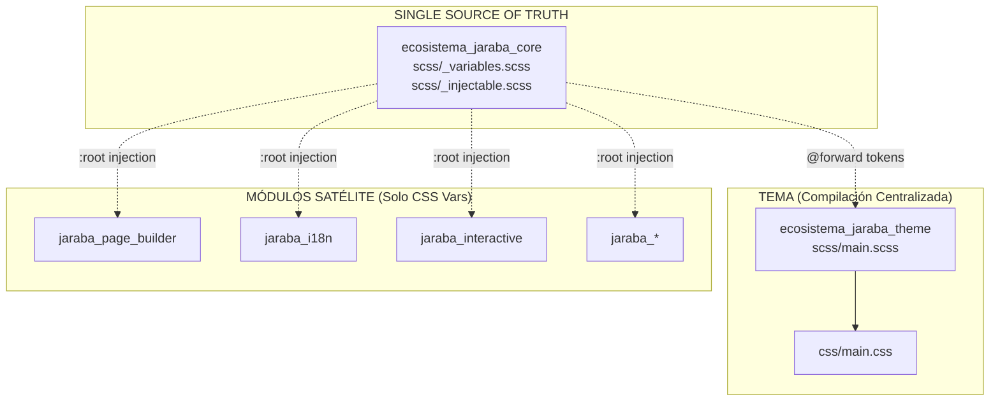

# 🎨 Arquitectura de Theming SaaS: Estándar Maestro

> **Tipo:** Documento de Arquitectura
> **Versión:** 2.1 (Consolidación SCSS Completada)
> **Fecha:** 2026-02-05 18:45
> **Estado:** Vigente ✅
> **Alcance:** Patrón "Federated Design Tokens" para SaaS de clase mundial

---

## 📑 Tabla de Contenidos

1. [Visión Arquitectónica](#1-visión-arquitectónica)
2. [Principios Fundamentales](#2-principios-fundamentales)
3. [Jerarquía de 5 Capas](#3-jerarquía-de-5-capas)
4. [Estructura de Archivos](#4-estructura-de-archivos)
5. [Patrón de Compilación](#5-patrón-de-compilación)
6. [Mixins y Utilidades](#6-mixins-y-utilidades)
7. [Tabla de Referencias Técnicas](#7-tabla-de-referencias-técnicas)
8. [Checklist de Cumplimiento](#8-checklist-de-cumplimiento)
9. [Migración de Código Legado](#9-migración-de-código-legado)
10. [Roadmap de Consolidación](#10-roadmap-de-consolidación)
11. [Registro de Cambios](#11-registro-de-cambios)

---

## 1. Visión Arquitectónica

### 1.1 Problema Identificado

En un SaaS multi-tenant con 57+ archivos SCSS distribuidos en 6+ módulos, la duplicación de variables SCSS genera:

| Problema | Impacto |
|----------|---------|
| Variables duplicadas | Inconsistencia visual entre módulos |
| Build descentralizado | Mayor superficie de error en compilación |
| Sin package.json | Comandos manuales, difícil CI/CD |
| Fragmentación | Dificultad para cambios globales de paleta |

### 1.2 Solución: Federated Design Tokens



### 1.3 Beneficios Esperados

1. **Consistencia Visual**: Un solo punto de verdad para tokens
2. **Personalización Runtime**: Cambios de branding sin recompilar
3. **Time-to-Market**: Nuevos módulos heredan estilos automáticamente
4. **Mantenibilidad**: Cambio de color en 1 archivo, no en 57

---

## 2. Principios Fundamentales

### 2.1 Single Source of Truth (SSOT)

| Componente | Ubicación | Responsabilidad |
|------------|-----------|-----------------|
| **Variables SCSS** | `ecosistema_jaraba_core/scss/_variables.scss` | Fallbacks de compilación |
| **CSS Custom Properties** | `ecosistema_jaraba_core/scss/_injectable.scss` | `:root` tokens inyectables |
| **Mixins** | `ecosistema_jaraba_core/scss/_mixins.scss` | Funciones reutilizables |

### 2.2 Regla de Oro: Módulos Solo Consumen

> ⛔ **REGLA INQUEBRANTABLE**
> 
> Los módulos satélite **NO DEBEN** definir variables SCSS.
> Solo consumen CSS Custom Properties con fallbacks inline.

**Ejemplo CORRECTO:**
```scss
// ✅ Solo CSS vars con fallback inline
.my-component {
    color: var(--ej-color-corporate, #233D63);
    background: var(--ej-bg-surface, #fff);
    padding: var(--ej-spacing-md, 1rem);
}
```

**Ejemplo INCORRECTO:**
```scss
// ❌ NUNCA duplicar variables SCSS en módulos
$ej-color-corporate: #233D63;  // NO hacer esto
$ej-spacing-md: 1rem;          // NO hacer esto
```

### 2.3 Inyección de Variables

El tema inyecta variables personalizadas en runtime:

```php
// En hook_preprocess_html()
$variables['#attached']['html_head'][] = [
  [
    '#type' => 'html_tag',
    '#tag' => 'style',
    '#value' => ':root { --ej-color-primary: #FF8C42; }',
  ],
  'ecosistema_jaraba_custom_vars',
];
```

---

## 3. Jerarquía de 5 Capas

| Capa | Nombre | Ubicación | Propósito | Personalizable |
|------|--------|-----------|-----------|----------------|
| 1 | **SCSS Tokens** | `_variables.scss` | Valores de compilación, fallbacks | No (build time) |
| 2 | **CSS Custom Properties** | `_injectable.scss` → `:root` | Base de tokens | Por defecto |
| 3 | **Component Tokens** | Parciales SCSS | Tokens con scope local | Por componente |
| 4 | **Tenant Override** | `hook_preprocess_html()` | Inyección desde Drupal UI | Por tenant |
| 5 | **Vertical Presets** | Config Entity | Paletas predefinidas por vertical | Por vertical |

### 3.1 Flujo de Resolución

```
CSS Cascade:
:root (L2) → .component (L3) → [data-tenant] (L4) → .vertical-* (L5)
```

---

## 4. Estructura de Archivos

### 4.1 Módulo Core (ecosistema_jaraba_core)

```
web/modules/custom/ecosistema_jaraba_core/
├── scss/
│   ├── _variables.scss      ← Paleta Jaraba, spacing, shadows
│   ├── _injectable.scss     ← :root con CSS Custom Properties
│   ├── _mixins.scss         ← css-var(), responsive-bp(), etc.
│   ├── _components.scss     ← Componentes base compartidos
│   ├── main.scss            ← Entry point único (37 parciales)
│   └── [feature].scss       ← Un parcial por dashboard/feature
├── css/
│   └── ecosistema-jaraba-core.css  ← Output compilado
└── package.json             ← Scripts de build
```

### 4.2 Tema (ecosistema_jaraba_theme)

```
web/themes/custom/ecosistema_jaraba_theme/
├── scss/
│   ├── _variables.scss      ← Forward desde core + extensiones
│   ├── main.scss            ← Importa core + componentes tema
│   ├── components/          ← Partials de UI (header, hero, cards)
│   │   ├── _header.scss
│   │   ├── _footer.scss
│   │   └── _grapesjs-canvas.scss
│   └── features/            ← Dark mode, promo-banner
├── css/
│   └── main.css             ← Output compilado
└── package.json             ← Scripts de build
```

### 4.3 Módulos Satélite

```
web/modules/custom/jaraba_page_builder/
├── scss/
│   ├── _canvas-editor.scss  ← Estilos del editor (usa var(--ej-*))
│   ├── _canvas-content.scss ← Contenido renderizado
│   ├── page-builder-blocks.scss ← Entry point para bloques
│   └── blocks/              ← Parciales de bloques
│       ├── _features.scss
│       └── _recommended-courses.scss
├── css/
│   ├── jaraba-page-builder.css
│   └── canvas-editor.css
└── package.json             ← Scripts de build (OBLIGATORIO)
```

---

## 5. Patrón de Compilación

### 5.1 Package.json Estándar

Todo módulo con SCSS **DEBE** tener un `package.json`:

```json
{
    "name": "jaraba-[module-name]",
    "version": "1.0.0",
    "description": "Estilos SCSS para [módulo]",
    "scripts": {
        "build": "sass scss/main.scss:css/[output].css --style=compressed",
        "build:all": "npm run build && echo '✅ Build completado'",
        "watch": "sass --watch scss:css --style=compressed"
    },
    "devDependencies": {
        "sass": "^1.71.0"
    }
}
```

### 5.2 Comandos de Compilación

#### Desde Docker (Ambiente de desarrollo)

```bash
# Módulo individual
docker exec jarabasaas_appserver_1 bash -c \
  "cd /app/web/modules/custom/jaraba_page_builder && npx sass scss/page-builder-blocks.scss css/jaraba-page-builder.css --style=compressed"

# Tema principal
docker exec jarabasaas_appserver_1 bash -c \
  "cd /app/web/themes/custom/ecosistema_jaraba_theme && npm run build"

# Core module
docker exec jarabasaas_appserver_1 bash -c \
  "cd /app/web/modules/custom/ecosistema_jaraba_core && npm run build"
```

#### Desde PowerShell (Windows directo)

```powershell
# Navegar al módulo
cd z:\home\PED\JarabaImpactPlatformSaaS\web\modules\custom\jaraba_page_builder

# Compilar con Dart Sass
npx sass scss/page-builder-blocks.scss:css/jaraba-page-builder.css --style=compressed
```

### 5.3 Header de Documentación SCSS

Cada archivo SCSS principal debe incluir:

```scss
/**
 * @file
 * [Descripción del archivo]
 *
 * DIRECTRIZ: Usa Design Tokens con CSS Custom Properties (var(--ej-*))
 *
 * COMPILACIÓN:
 * docker exec jarabasaas_appserver_1 bash -c \
 *   "cd /app/web/modules/custom/[module] && npx sass scss/[file].scss css/[output].css --style=compressed"
 */
```

---

## 6. Mixins y Utilidades

### 6.1 Mixin Obligatorio: `css-var`

Definido en `ecosistema_jaraba_core/scss/_mixins.scss`:

```scss
/// Aplica una propiedad CSS usando variable inyectable con fallback
/// @param {String} $property - Propiedad CSS (color, background, etc.)
/// @param {String} $var-name - Nombre de la variable sin prefijo --ej-
/// @param {*} $fallback - Valor de fallback SCSS
@mixin css-var($property, $var-name, $fallback) {
    #{$property}: var(--ej-#{$var-name}, $fallback);
}

// Uso
.stat-card {
    @include css-var(background, 'bg-surface', $ej-bg-surface);
    @include css-var(border-color, 'border-color', $ej-border-color);
    @include css-var(color, 'text-primary', $ej-text-primary);
}
```

### 6.2 Funciones de Color (Dart Sass)

```scss
@use 'sass:color';

// ✅ CORRECTO: Usar sass:color
.button-hover {
    background: color.adjust($ej-color-primary, $lightness: -10%);
}

// ❌ INCORRECTO: Funciones deprecadas
.button-hover {
    background: darken($ej-color-primary, 10%);  // NO usar
}
```

### 6.3 Variables Inyectables Disponibles

| Variable | Propósito | Fallback |
|----------|-----------|----------|
| `--ej-color-primary` | Color principal de marca | `$ej-color-primary-fallback` |
| `--ej-color-secondary` | Color secundario | `$ej-color-secondary-fallback` |
| `--ej-color-accent` | Color de acento | `$ej-color-accent-fallback` |
| `--ej-font-family` | Tipografía principal | `$ej-font-family-fallback` |
| `--ej-bg-surface` | Fondo de tarjetas | `#ffffff` |
| `--ej-text-primary` | Texto principal | `$ej-gray-900` |
| `--ej-spacing-md` | Espaciado medio | `1rem` |

---

## 7. Tabla de Referencias Técnicas

### 7.1 Archivos de Especificación

| Archivo | Ubicación | Descripción |
|---------|-----------|-------------|
| `_variables.scss` | `ecosistema_jaraba_core/scss/` | Paleta completa Jaraba |
| `_injectable.scss` | `ecosistema_jaraba_core/scss/` | CSS Custom Properties |
| `_mixins.scss` | `ecosistema_jaraba_core/scss/` | Mixins reutilizables |
| `main.scss` | `ecosistema_jaraba_core/scss/` | Entry point core (37 imports) |
| `main.scss` | `ecosistema_jaraba_theme/scss/` | Entry point tema |

### 7.2 Documentos Relacionados

| Documento | Ubicación | Descripción |
|-----------|-----------|-------------|
| Branding & Theming | `KI/standards/branding_and_theming.md` | Paleta y tokens de diseño |
| SCSS Workflow | `.agent/workflows/scss-estilos.md` | Directrices de compilación |
| Standards Overview | `KI/standards/standards_overview.md` | Estándares generales |
| Premium Card | `KI/standards/premium_card_standards.md` | Patrón de cards premium |

### 7.3 Inventario Completo SCSS (Feb 2026)

> **Total: 102 archivos SCSS** (57 en modules/custom + 45 en themes/custom)

#### 7.3.1 Tema Principal

| Componente | Archivos SCSS | Tiene package.json | Cumple SSOT |
|------------|---------------|-------------------|-------------|
| `ecosistema_jaraba_theme` | **45** | ✅ Sí | ✅ Sí |
| ├─ scss/ (raíz) | 15 | - | - |
| ├─ scss/components/ | 24 | - | - |
| ├─ scss/features/ | 3 | - | - |
| └─ components/ (SDC) | 2 | - | - |

#### 7.3.2 Módulo Core (SSOT)

| Módulo | Archivos SCSS | Tiene package.json | Cumple SSOT |
|--------|---------------|-------------------|-------------|
| `ecosistema_jaraba_core` | **27** | ✅ Sí | ✅ **ES SSOT** |
| ├─ _variables.scss | - | - | Paleta completa |
| ├─ _injectable.scss | - | - | CSS Custom Props |
| ├─ _mixins.scss | - | - | Utilidades |
| └─ 24 parciales feature | - | - | Dashboards |

#### 7.3.3 Módulos Satélite (Migración Completada)

| Módulo | Archivos SCSS | Tiene package.json | Cumple SSOT | Estado |
|--------|---------------|-------------------|-------------|--------|
| `jaraba_page_builder` | 7 | ✅ Sí | ✅ Sí | ✅ Completado |
| `jaraba_foc` | 3 | ✅ Sí | ✅ Sí | ✅ Migrado darken→color.adjust |
| `jaraba_site_builder` | 2 | ✅ Sí | ✅ Sí | ✅ Completado |
| `jaraba_i18n` | 2 | ✅ Sí | ⏳ Parcial | ✅ Completado |
| `jaraba_interactive` | 2 | ✅ Sí | ⏳ Parcial | ✅ Completado |
| `jaraba_self_discovery` | 1 | ✅ Sí | ⏳ Parcial | ✅ Completado |
| `jaraba_credentials` | 1 | ✅ Sí | ⏳ Parcial | ✅ Completado |
| `jaraba_candidate` | 1 | ✅ Sí | ⏳ Parcial | ✅ Completado |

#### 7.3.4 Detalle por Módulo

<details>
<summary><strong>ecosistema_jaraba_core (27 archivos)</strong></summary>

| Archivo | Propósito |
|---------|-----------|
| `main.scss` | Entry point |
| `_variables.scss` | **SSOT - Paleta** |
| `_injectable.scss` | **SSOT - CSS Vars** |
| `_mixins.scss` | Utilidades |
| `_components.scss` | Base components |
| `_marketplace.scss` | Marketplace UI |
| `_tenant-dashboard.scss` | Admin tenant |
| `_pixel-manager.scss` | Analytics config |
| `_diagnostic-wizard.scss` | Emprendimiento wizard |
| `_admin-forms.scss` | Forms premium |
| `_health-dashboard.scss` | Service monitoring |
| `_revision-diff.scss` | Diff visual |
| `_rag-dashboard.scss` | KB analytics |
| `_diagnostic.scss` | TTV diagnostic |
| `_canvas-list.scss` | BMC listing |
| `_contextual-copilot.scss` | AI FAB |
| `_onboarding.scss` | User onboarding |
| `_ai-field-generator.scss` | Field AI |
| `_agent-fab.scss` | Agent button |
| `_skills-dashboard.scss` | AI Skills UI |
| `_vertical-landing.scss` | Landing pages |
| `_crm-dashboard.scss` | CRM panel |
| `_journey-dashboard.scss` | Journey UI |
| `_recruiter-dashboard.scss` | Employer panel |
| `_lms-catalog.scss` | Course catalog |
| `_career-dashboard.scss` | Candidate panel |
| `_mobile-menu.scss` | Responsive menu |
| `_finops-dashboard.scss` | Cost dashboard |
| `_premium-card-pattern.scss` | Card effects |
| `_experiments-dashboard.scss` | A/B testing |
| `_path-catalog.scss` | Learning paths |
| `_employability-menu.scss` | Role menu |

</details>

<details>
<summary><strong>ecosistema_jaraba_theme (45 archivos)</strong></summary>

**scss/ (raíz):**
- `main.scss`, `admin-settings.scss`
- `_accessibility.scss`, `_ai-dashboard.scss`, `_analytics-dashboard.scss`
- `_auth.scss`, `_base.scss`, `_content-hub.scss`, `_layout.scss`
- `_page-builder-dashboard.scss`, `_site-builder.scss`, `_slide-panel.scss`
- `_typography.scss`, `_variables.scss`

**scss/components/ (24):**
- `_analytics-dashboard.scss`, `_autofirma.scss`, `_breadcrumbs.scss`
- `_buttons.scss`, `_cards.scss`, `_commerce-product-geo.scss`
- `_consent-banner.scss`, `_features.scss`, `_footer.scss`
- `_forms.scss`, `_glass-utilities.scss`, `_grapesjs-canvas.scss`
- `_header.scss`, `_heatmap-dashboard.scss`, `_hero-landing.scss`
- `_hero.scss`, `_landing-page.scss`, `_media-browser.scss`
- `_mobile-menu.scss`, `_page-builder.scss`, `_page-premium.scss`
- `_revision-diff.scss`, `_section-editor.scss`, `_sidebar.scss`
- `_template-picker.scss`, `_template-preview-premium.scss`

**scss/features/ (3):**
- `_back-to-top.scss`, `_dark-mode.scss`, `_promo-banner.scss`

**components/ SDC (2):**
- `card/card.scss`, `hero/hero.scss`

</details>

<details>
<summary><strong>jaraba_page_builder (7 archivos)</strong></summary>

- `page-builder-blocks.scss` (entry)
- `_canvas-editor.scss`
- `_canvas-content.scss`
- `_canvas-hot-swap.scss`
- `_ai-field-generator.scss`
- `blocks/_features.scss`
- `blocks/_recommended-courses.scss`

</details>

<details>
<summary><strong>Otros módulos satélite</strong></summary>

| Módulo | Archivos |
|--------|----------|
| **jaraba_foc** | `main.scss`, `_foc-dashboard.scss`, `_foc-variables.scss` ⚠️ |
| **jaraba_site_builder** | `main.scss`, `_site-tree.scss` |
| **jaraba_i18n** | `_i18n-dashboard.scss`, `_i18n-selector.scss` |
| **jaraba_interactive** | `player.scss`, `dashboard.scss` |
| **jaraba_self_discovery** | `self-discovery.scss` |
| **jaraba_credentials** | `_credentials.scss` |
| **jaraba_candidate** | `_dashboard.scss` |

</details>

## 8. Checklist de Cumplimiento

### 8.1 Al crear un nuevo módulo con SCSS

- [ ] NO definir variables `$ej-*` localmente
- [ ] Usar solo `var(--ej-*, $fallback)` inline
- [ ] Crear `package.json` con scripts de compilación
- [ ] Documentar comando de build en header del SCSS principal
- [ ] Registrar librería en `[module].libraries.yml`
- [ ] Añadir dependencia a `ecosistema_jaraba_theme/global` si corresponde

### 8.2 Al editar SCSS existente

- [ ] Verificar que no hay hex hardcodeados (usar tokens)
- [ ] Usar mixins del core cuando existan
- [ ] Compilar con Dart Sass (no LibSass)
- [ ] Ejecutar `drush cr` después de cambios
- [ ] Verificar en navegador que los estilos aplican

### 8.3 Al añadir un nuevo token

1. Definir variable SCSS en `_variables.scss`
2. Añadir CSS Custom Property en `_injectable.scss`
3. Documentar en esta tabla de referencias
4. Actualizar tema si requiere inyección desde UI

---

## 9. Migración de Código Legado

### 9.1 Proceso de Migración

Para módulos que actualmente duplican variables:

```bash
# Paso 1: Identificar duplicación
grep -r '\$ej-' web/modules/custom/[module]/scss/

# Paso 2: Eliminar definiciones y reemplazar por CSS vars
# Ejemplo de transformación:
```

**Antes:**
```scss
$ej-color-corporate: #233D63;

.my-component {
    color: $ej-color-corporate;
}
```

**Después:**
```scss
.my-component {
    color: var(--ej-color-corporate, #233D63);
}
```

### 9.2 Comandos de Verificación

```bash
# Verificar compilación
docker exec jarabasaas_appserver_1 bash -c \
  "cd /app/web/modules/custom/[module] && npx sass scss/main.scss css/output.css --style=compressed"

# Limpiar cache
docker exec jarabasaas_appserver_1 drush cr

# Verificar en navegador
# https://jaraba-saas.lndo.site/[ruta]
```

---

## 10. Roadmap de Consolidación

### 10.1 Fases de Implementación

| Fase | Módulos | Esfuerzo | Estado |
|------|---------|----------|--------|
| **Fase 1** | `jaraba_page_builder`, `jaraba_foc` | 1-2h | ✅ Completado |
| **Fase 2** | `jaraba_i18n`, `jaraba_interactive` | 30m | ✅ Completado |
| **Fase 3** | `jaraba_site_builder`, `jaraba_self_discovery` | 30m | ✅ Completado |
| **Fase 4** | `jaraba_credentials`, `jaraba_candidate` | 30m | ✅ Completado |
| **Fase 5** | Auditoría final + documentación | 1h | ✅ Completado |

### 10.2 Criterios de Completitud

- [x] 100% módulos con `package.json` (8/8)
- [x] 0 funciones `darken()`/`lighten()` deprecadas
- [x] Documentación actualizada
- [ ] 0 definiciones `$ej-*` fuera de core (parcial)
- [ ] 100% uso de `var(--ej-*, $fallback)` (parcial)
- [ ] CI/CD integrado para compilación SCSS (futuro)

---

## 11. Registro de Cambios

| Fecha | Versión | Autor | Descripción |
|-------|---------|-------|-------------|
| 2026-02-05 | 2.0 | Antigravity | Creación inicial con patrón Federated Design Tokens |

---

> **Nota:** Este documento es la fuente de verdad para la arquitectura de theming.
> Cualquier desviación debe documentarse con justificación técnica.

---

## Referencias Cruzadas

- [00_DIRECTRICES_PROYECTO.md](../00_DIRECTRICES_PROYECTO.md) - Directrices maestras
- [00_DOCUMENTO_MAESTRO_ARQUITECTURA.md](../00_DOCUMENTO_MAESTRO_ARQUITECTURA.md) - Arquitectura general
- [branding_and_theming.md](../../.gemini/knowledge/.../branding_and_theming.md) - Paleta y tokens (KI)
