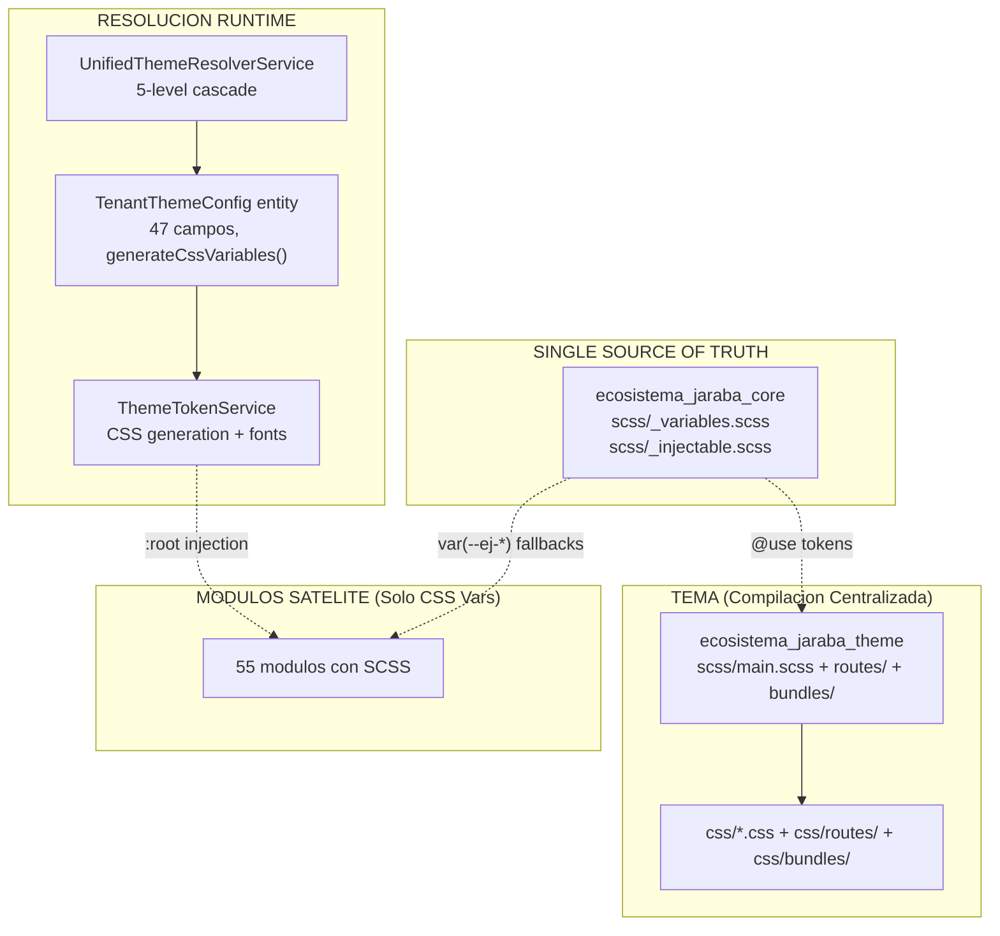

# Arquitectura de Theming SaaS: Estandar Maestro

> **Tipo:** Documento de Arquitectura
> **Version:** 3.1 (Correccion cascada + inventario actualizado)
> **Fecha original:** 2026-02-05 | **Actualizado:** 2026-03-24
> **Estado:** Vigente
> **Alcance:** Patron "Federated Design Tokens" + Resolucion Multi-Tenant Unificada

---

## Tabla de Contenidos

1. [Vision Arquitectonica](#1-vision-arquitectonica)
2. [Principios Fundamentales](#2-principios-fundamentales)
3. [Jerarquia de 5 Capas](#3-jerarquia-de-5-capas)
4. [Resolucion Multi-Tenant Unificada](#4-resolucion-multi-tenant-unificada)
5. [Estructura de Archivos](#5-estructura-de-archivos)
6. [Patron de Compilacion](#6-patron-de-compilacion)
7. [Mixins, Utilidades y Funciones de Color](#7-mixins-utilidades-y-funciones-de-color)
8. [CSS Custom Properties — Catalogo](#8-css-custom-properties--catalogo)
9. [TenantThemeConfig — Entity de Personalizacion](#9-tenantthemeconfig--entity-de-personalizacion)
10. [Inventario SCSS](#10-inventario-scss)
11. [Checklist de Cumplimiento](#11-checklist-de-cumplimiento)
12. [Directrices Criticas (Reglas Nombradas)](#12-directrices-criticas-reglas-nombradas)
13. [Registro de Cambios](#13-registro-de-cambios)

---

## 1. Vision Arquitectonica

### 1.1 Problema Original (Resuelto)

En un SaaS multi-tenant con cientos de archivos SCSS distribuidos en 55+ modulos, la duplicacion de variables SCSS generaba inconsistencia visual entre modulos, builds descentralizados y dificultad para cambios globales de paleta.

### 1.2 Solucion: Federated Design Tokens


```mermaid
graph TD
    subgraph "SINGLE SOURCE OF TRUTH"
        A["ecosistema_jaraba_core<br/>scss/_variables.scss<br/>scss/_injectable.scss"]
    end

    subgraph "TEMA (Compilacion Centralizada)"
        B["ecosistema_jaraba_theme<br/>scss/main.scss + routes/ + bundles/"]
        C["css/*.css + css/routes/ + css/bundles/"]
        B --> C
    end

    subgraph "RESOLUCION RUNTIME"
        D["UnifiedThemeResolverService<br/>5-level cascade"]
        E["TenantThemeConfig entity<br/>47 campos, generateCssVariables()"]
        F["ThemeTokenService<br/>CSS generation + fonts"]
        D --> E --> F
    end

    subgraph "MODULOS SATELITE (Solo CSS Vars)"
        G["55 modulos con SCSS"]
    end

    A -.->|"@use tokens"| B
    F -.->|":root injection"| G
    A -.->|"var(--ej-*) fallbacks"| G
```

### 1.3 Beneficios Logrados

1. **Consistencia Visual**: 290 CSS custom properties con prefijo `--ej-*`
2. **Personalizacion Runtime**: Cambios de branding sin recompilar — 70+ opciones desde UI
3. **Multi-Tenancy**: Cada tenant personaliza visual independientemente via TenantThemeConfig
4. **Presets Verticales**: 6 paletas industriales predefinidas con aplicacion en 1 clic
5. **Mantenibilidad**: 488 archivos SCSS, 44 modulos con package.json

---

## 2. Principios Fundamentales

### 2.1 Single Source of Truth (SSOT)

| Componente | Ubicacion | Responsabilidad |
|------------|-----------|-----------------|
| **Variables SCSS** | `ecosistema_jaraba_core/scss/_variables.scss` | Fallbacks de compilacion (184 lineas) |
| **CSS Custom Properties** | `ecosistema_jaraba_core/scss/_injectable.scss` | `:root` tokens inyectables |
| **Mixins** | `ecosistema_jaraba_core/scss/_mixins.scss` | css-var(), respond-to(), rtl |
| **Theme Variables** | `ecosistema_jaraba_theme/scss/_variables.scss` | Forward + extensiones del tema |

### 2.2 Regla de Oro: Modulos Solo Consumen

> **REGLA INQUEBRANTABLE**
>
> Los modulos satelite **NO DEBEN** definir variables SCSS.
> Solo consumen CSS Custom Properties con fallbacks inline.

```scss
// CORRECTO: Solo CSS vars con fallback inline
.my-component {
    color: var(--ej-color-corporate, #233D63);
    background: var(--ej-bg-surface, #fff);
    padding: var(--ej-spacing-md, 1rem);
}

// INCORRECTO: NUNCA duplicar variables SCSS en modulos
$ej-color-corporate: #233D63;  // NO hacer esto
```

### 2.3 SSOT Dual (SSOT-THEME-001)

| Entidad | Responsabilidad | Scope |
|---------|-----------------|-------|
| **TenantThemeConfig** | Visual SSOT: colores, tipografia, CTA, footer, botones, cards | Per-tenant |
| **SiteConfig** | Structural SSOT: layout, nombre, logo, nav, legal | Per-domain |

SiteConfig (Level 5) tiene **comportamiento dual**: es FALLBACK para campos visuales (CTA) — `applySiteConfigOverrides()` verifica `empty($overrides['field'])` antes de aplicar — pero es OVERRIDE para campos estructurales (layout, footer type).

---

## 3. Jerarquia de 5 Capas

| Capa | Nombre | Ubicacion | Proposito | Personalizable |
|------|--------|-----------|-----------|----------------|
| 1 | **SCSS Tokens** | `_variables.scss` | Valores de compilacion, fallbacks | No (build time) |
| 2 | **CSS Custom Properties** | `_injectable.scss` -> `:root` | Base de tokens globales | Por defecto |
| 3 | **Theme Settings (Platform)** | `ecosistema_jaraba_theme.settings` | Defaults globales SaaS (CTA, layout, footer) | Admin global |
| 4 | **Tenant Override** | `TenantThemeConfig.generateCssVariables()` | Inyeccion desde Drupal UI / Visual Customizer | Por tenant |
| 5 | **Meta-Site Override/Fallback** | `SiteConfig` entity | Override estructural (layout) + Fallback visual (CTA) por dominio | Por dominio |

> **IMPORTANTE:** La Capa 5 (SiteConfig) tiene comportamiento dual:
> - **Override** para campos estructurales (`header_layout`, `footer_type`, `auth_visibility`): SiteConfig GANA sobre Capa 4.
> - **Fallback** para campos visuales (`header_cta_text`, `header_cta_url`): SiteConfig solo aplica si Capa 4 NO definio el campo.

### 3.1 Flujo de Resolucion CSS

```
CSS Cascade:
:root (L2) -> Theme Settings (L3) -> TenantThemeConfig :root (L4) -> SiteConfig override/fallback (L5)
```

### 3.2 Flujo de Resolucion PHP

```
UnifiedThemeResolverService:
  L3. Platform defaults (ecosistema_jaraba_theme.settings)  <- base global
  --. Vertical preset (IndustryPresetService)               <- reservado
  --. Plan features                                         <- reservado
  L4. TenantThemeConfig (per-tenant)                        <- SSOT visual
  L5. SiteConfig (per-domain: override estructural + fallback visual)
```

### 3.3 Configuracion Per-Metasitio en Theme Settings (METASITE-CONTENT-001)

Desde 2026-03-24, la Capa 3 incluye **4 tabs per-metasitio** en `/admin/appearance/settings/ecosistema_jaraba_theme`:

| Tab | Variante | Dominio | group_id |
|-----|----------|---------|----------|
| Meta: SaaS Hub | `generic` | plataformadeecosistemas.com | — |
| Meta: PED Corporativo | `pde` | plataformadeecosistemas.es | 7 |
| Meta: Franquicia | `jarabaimpact` | jarabaimpact.com | 6 |
| Meta: Marca Personal | `pepejaraba` | pepejaraba.com | 5 |

Cada tab contiene 32 campos configurables agrupados en 6 secciones:
- **Hero** (7): eyebrow, headline, subtitle, CTA primario (texto+URL), CTA secundario (texto+URL)
- **Estadisticas** (12): 4 metricas × (valor, sufijo, etiqueta)
- **CTA Final** (3): titular, subtitulo, texto boton
- **Header CTA** (2): texto y URL del boton del encabezado
- **Footer** (6): copyright + 5 redes sociales
- **SEO** (2): title y description de la homepage

**Total: 128 config keys** (32 × 4 variantes). Convention: `{variant}_{section}_{field}`.

**Pipeline de inyeccion:**
1. `hook_preprocess_page()` resuelve `homepage_variant` desde `MetaSiteResolverService::VARIANT_MAP`
2. Lee campos `{variant}_*` de `ecosistema_jaraba_theme.settings` con fallback a `_ecosistema_jaraba_theme_get_metasite_defaults()`
3. Inyecta `$variables['metasite_content']` (hero, stats, cta_final)
4. Header CTA y footer: sobreescribe `$variables['theme_settings']` DESPUES de UnifiedThemeResolverService

**SSOT:** `MetaSiteResolverService::VARIANT_MAP` es la unica fuente del mapa group_id → variante. NUNCA hardcodear en .theme.

### 3.4 Propagacion de Cambios: CTA del Header

Modificar el CTA en Theme Settings (L3) **NO se propaga** a meta-sitios que tengan
`TenantThemeConfig` (L4) o `SiteConfig` (L5) con CTA propio. Sin embargo, los campos
per-metasitio `{variant}_header_cta_text/url` en los tabs de metasitio SI tienen
precedencia sobre la cascada L4/L5 (se aplican DESPUES de `UnifiedThemeResolverService`).

---

## 4. Resolucion Multi-Tenant Unificada

### 4.1 UnifiedThemeResolverService (THEMING-UNIFY-001)

**Servicio:** `ecosistema_jaraba_core.unified_theme_resolver`
**Ubicacion:** `ecosistema_jaraba_core/src/Service/UnifiedThemeResolverService.php`

Resolver unico para todas las peticiones. Estrategia dual:

| Contexto | Estrategia | Metodo |
|----------|-----------|--------|
| **Anonimo** | Hostname -> MetaSiteResolverService -> SiteConfig | `resolveByHostname()` |
| **Autenticado** | TenantContextService -> TenantThemeConfig | `resolveByUser()` |

**Cache:** Static `$resolvedContext` por peticion HTTP (previene N+1 queries).

### 4.2 ThemeTokenService

**Servicio:** `jaraba_theming.token_service`
**Ubicacion:** `jaraba_theming/src/Service/ThemeTokenService.php`

Responsabilidades:
- Resuelve TenantThemeConfig activa por tenant
- Genera CSS completo: `@font-face` + `:root { --ej-*: value; }`
- Gestiona Google Fonts vs. custom font URLs (WOFF2 + @import)
- 6 presets verticales: platform, empleabilidad, emprendimiento, agroconecta, comercio, servicios

### 4.3 Inyeccion en Runtime

La inyeccion de variables CSS se consolida en `jaraba_theming_page_attachments()`:

```php
// ThemeTokenService genera el CSS completo
$css = $themeTokenService->generateCss($tenantId);
// Se inyecta como <style> en <head>
$attachments['#attached']['html_head'][] = [
  ['#type' => 'html_tag', '#tag' => 'style', '#value' => $css],
  'jaraba_theming_tokens',
];
```

### 4.4 Reglas de Cache Multi-Tenant

| Regla | Descripcion |
|-------|-------------|
| **DOMAIN-ROUTE-CACHE-001** | Cada hostname DEBE tener Domain entity. RouteProvider cachea por `[domain]` key — sin Domain entity, cache HIT sirve rutas del default |
| **VARY-HOST-001** | `SecurityHeadersSubscriber` appends `Vary: Host` a prioridad -10 para CDN/reverse proxy |

---

## 5. Estructura de Archivos

### 5.1 Modulo Core (ecosistema_jaraba_core) — 59 archivos SCSS

```
web/modules/custom/ecosistema_jaraba_core/scss/
  _variables.scss         <- SSOT: Paleta Jaraba, spacing, shadows, breakpoints
  _injectable.scss        <- SSOT: :root con 290 CSS Custom Properties
  _mixins.scss            <- css-var(), respond-to(), rtl
  _components.scss        <- Componentes base compartidos
  main.scss               <- Entry point
  _admin-center-*.scss    <- 7 parciales Admin Center
  _admin-forms.scss       <- Premium forms
  _admin-premium.scss     <- Premium admin UI
  _*-dashboard.scss       <- 13 dashboards verticales
  _premium-card-pattern.scss <- Card effects (glassmorphism, shine)
  _premium-forms.scss     <- PREMIUM-FORMS-PATTERN-001
  _preset-picker.scss     <- PRESET-PICKER-001
  ... (36 parciales features)
```

### 5.2 Tema (ecosistema_jaraba_theme) — 123 archivos SCSS

```
web/themes/custom/ecosistema_jaraba_theme/
  scss/
    _variables.scss        <- Forward desde core + extensiones (184 lineas)
    main.scss              <- Entry point principal
    admin-settings.scss    <- Entry point admin
    _base.scss, _layout.scss, _typography.scss, _accessibility.scss
    _slide-panel.scss, _auth.scss, _content-hub.scss, ...

    components/            <- 70 parciales UI
      _header.scss, _footer.scss, _hero.scss, _cards.scss,
      _buttons.scss, _forms.scss, _glass-utilities.scss,
      _landing-page.scss, _landing-sections.scss, _lead-magnet.scss,
      _consent-banner.scss, _notification-panel.scss, _toasts.scss,
      _homepage-pain-points.scss, _homepage-pricing.scss,
      _homepage-comparison.scss, _homepage-features.scss, ...

    routes/                <- 19 route SCSS (compilacion independiente)
      coordinador-hub.scss, dashboard.scss, content-hub.scss,
      page-builder.scss, auth.scss, landing.scss, empleabilidad.scss,
      ai-features.scss, ai-compliance.scss, emprendimiento.scss,
      formacion.scss, legal-pages.scss, tenant-dashboard.scss,
      tenant-settings.scss, autonomous-agents.scss, causal-analytics.scss,
      case-study-landing.scss, quiz.scss, ...

    bundles/               <- 9 bundles (compilacion independiente)
      ai-dashboard.scss, agent-dashboard.scss, auth.scss,
      content-hub.scss, employability-pages.scss,
      jobseeker-dashboard.scss, page-builder-dashboard.scss,
      support.scss, ...

    features/              <- 3 utilidades
      _back-to-top.scss, _dark-mode.scss, _promo-banner.scss

  css/                     <- Output compilado
    ecosistema-jaraba-theme.css  <- main.scss output
    admin-settings.css
    routes/*.css           <- 19 CSS de ruta
    bundles/*.css          <- 9 CSS de bundle

  js/dist/                 <- 28 JS minificados
  package.json             <- Build scripts (build:css + build:routes + build:bundles + build:js)
```

### 5.3 Modulo de Theming (jaraba_theming)

```
web/modules/custom/jaraba_theming/
  src/
    Entity/TenantThemeConfig.php     <- 47 campos, generateCssVariables()
    Service/ThemeTokenService.php     <- CSS generation + font management
    Service/IndustryPresetService.php <- 6 presets verticales
    Form/TenantThemeCustomizerForm.php <- 10 vertical tabs, 70+ opciones
    Form/TenantThemeConfigForm.php    <- PREMIUM-FORMS-PATTERN-001
```

### 5.4 Modulos Satelite — 55 modulos con SCSS

| Tier | Modulos | Archivos SCSS |
|------|---------|--------------|
| **Heavy (15+)** | ecosistema_jaraba_core(59), jaraba_page_builder(28), jaraba_agroconecta_core(18), jaraba_andalucia_ei(14), jaraba_site_builder(14) | 133 |
| **Moderate (5-12)** | jaraba_support(12), jaraba_comercio_conecta(12), jaraba_messaging(11), jaraba_legal_intelligence(11), y 13 modulos mas | ~130 |
| **Light (1-4)** | 36 modulos con SCSS minimo | ~60 |

---

## 6. Patron de Compilacion

### 6.1 Entorno de Desarrollo: Lando

```bash
# Tema principal (compila main + routes + bundles + JS)
cd web/themes/custom/ecosistema_jaraba_theme && npm run build

# Modulo individual
cd web/modules/custom/ecosistema_jaraba_core && npm run build

# Route SCSS individual (si no esta en build:routes)
npx sass scss/routes/coordinador-hub.scss css/routes/coordinador-hub.css --style=compressed
```

### 6.2 Package.json del Tema (Referencia)

```json
{
    "scripts": {
        "lint:scss": "node scripts/check-scss-orphans.js",
        "build:css": "sass scss/main.scss css/ecosistema-jaraba-theme.css --style=compressed",
        "build:admin": "sass scss/admin-settings.scss css/admin-settings.css --style=compressed",
        "build:routes": "sass scss/routes/dashboard.scss css/routes/dashboard.css --style=compressed && ...",
        "build:bundles": "sass scss/bundles/ai-dashboard.scss css/bundles/ai-dashboard.css --style=compressed && ...",
        "build:js": "node scripts/minify-js.js",
        "build": "npm run lint:scss && npm run build:css && npm run build:admin && npm run build:routes && npm run build:bundles && npm run build:js"
    }
}
```

### 6.3 Patron Route SCSS

Cada ruta compleja tiene su propio SCSS/CSS compilado independientemente:

```
scss/routes/{name}.scss -> css/routes/{name}.css -> library route-{name}
  -> hook_page_attachments_alter() adjunta la library para esa ruta
```

### 6.4 Patron Bundle SCSS

Bundles agrupan estilos para features multi-ruta:

```
scss/bundles/{name}.scss -> css/bundles/{name}.css -> library bundle-{name}
```

### 6.5 Verificacion Post-Compilacion (SCSS-COMPILE-VERIFY-001)

Tras CADA edicion SCSS, SIEMPRE recompilar y verificar:
```bash
# Timestamp CSS DEBE ser > timestamp SCSS
ls -la scss/routes/coordinador-hub.scss css/routes/coordinador-hub.css
```

### 6.6 Huerfanos SCSS

`scripts/check-scss-orphans.js` detecta parciales sin `@use` en main.scss. Bloquea build si encuentra huerfanos.

---

## 7. Mixins, Utilidades y Funciones de Color

### 7.1 Mixin css-var

```scss
@mixin css-var($property, $var-name, $fallback) {
    #{$property}: var(--ej-#{$var-name}, $fallback);
}
```

### 7.2 Mixin respond-to (Breakpoints)

```scss
// Breakpoints definidos en _variables.scss
$ej-breakpoint-sm: 640px;
$ej-breakpoint-md: 768px;
$ej-breakpoint-lg: 1024px;
$ej-breakpoint-xl: 1280px;

@mixin respond-to($bp) {
    @media (max-width: map-get($breakpoints, $bp)) { @content; }
}
```

### 7.3 Funciones de Color — Dart Sass Moderno

```scss
@use 'sass:color';

// CORRECTO: sass:color para compile-time (variables SCSS estaticas)
.button-hover {
    background: color.adjust($ej-color-primary, $lightness: -10%);
}

// CORRECTO: color-mix() para runtime (CSS custom properties)
// SCSS-COLORMIX-001
.card-overlay {
    background: color-mix(in srgb, var(--ej-color-azul-corporativo, #233D63) 15%, transparent);
}

// INCORRECTO: rgba() con CSS vars NO funciona
.bad {
    background: rgba(var(--ej-color-primary), 0.15); // NO compilara
}
```

### 7.4 SCSS-COMPILETIME-001

Variables SCSS que alimentan `color.scale/adjust/change` DEBEN ser hex estatico, NUNCA `var()`. Para runtime alpha con CSS custom properties, usar `color-mix()`.

---

## 8. CSS Custom Properties — Catalogo

### 8.1 Prefijo Unico: `--ej-*`

**290 CSS custom properties unicas** con prefijo `--ej-*`. NUNCA usar `--jaraba-*` ni hex hardcodeado (CSS-VAR-ALL-COLORS-001).

### 8.2 Categorias Principales

| Categoria | Ejemplos | Cantidad aprox. |
|-----------|----------|----------------|
| **Colores de marca** | `--ej-color-azul-corporativo`, `--ej-color-naranja-impulso`, `--ej-color-verde-innovacion` | 3 core |
| **Colores extendidos** | `--ej-color-{blue,violet,indigo,green,orange,red,neutral,...}` | 20+ |
| **Colores semanticos** | `--ej-color-primary`, `--ej-color-secondary`, `--ej-color-accent`, `--ej-color-danger`, `--ej-color-success`, `--ej-color-warning` | 10+ |
| **Fondos** | `--ej-bg-{body,surface,card,dark,primary,glass,input,...}` | 12+ |
| **Texto** | `--ej-color-{heading,text,text-secondary,text-tertiary,muted}` | 8+ |
| **Bordes/Radios** | `--ej-border-{color,radius}, --ej-radius-{sm,md,lg,pill}` | 8+ |
| **Tipografia** | `--ej-font-{family-headings,family-body,size-base,size-xs,...,size-2xl}` | 10+ |
| **Spacing** | `--ej-spacing-{xs,sm,md,lg,xl,2xl}` | 6 |
| **Sombras** | `--ej-shadow-{sm,md,lg}` | 3 |
| **Componentes** | `--ej-btn-*`, `--ej-card-*`, `--ej-input-*`, `--ej-chart-*` | 30+ |

### 8.3 Colores de Marca Canonicos

| Token | Nombre | Hex |
|-------|--------|-----|
| `--ej-color-azul-corporativo` | Azul Corporativo | `#233D63` |
| `--ej-color-naranja-impulso` | Naranja Impulso | `#FF8C42` |
| `--ej-color-verde-innovacion` | Verde Innovacion | `#00A9A5` |

---

## 9. TenantThemeConfig — Entity de Personalizacion

### 9.1 Entity (jaraba_theming)

**Tipo:** Content Entity (`tenant_theme_config`)
**Campos:** 53 totales
**Metodo clave:** `generateCssVariables()` — genera `:root { --ej-*: value; }` desde campos de la entity
**Edicion principal:** Visual Customizer (slide-panel lateral 480px con preview en tiempo real, ruta `/my-settings/design`)

### 9.2 Campos por Grupo

| Grupo | Campos |
|-------|--------|
| **Identidad** | name, tenant_id, vertical, site_name, site_slogan, logo, logo_alt, favicon |
| **Colores (10)** | color_primary, color_secondary, color_accent, color_dark, color_success, color_warning, color_error, color_bg_body, color_bg_surface, color_text |
| **Tipografia (7)** | font_headings, font_body, font_size_base, font_heading_url, font_heading_family, font_body_url, font_body_family |
| **Header (5)** | header_variant, header_sticky, header_cta_enabled, header_cta_text, header_cta_url |
| **Hero (2)** | hero_variant, hero_overlay |
| **Cards (3)** | card_style, card_border_radius, card_hover_effect |
| **Botones (2)** | button_style, button_border_radius |
| **Footer (2)** | footer_variant, footer_copyright |
| **Social (5)** | social_facebook, social_twitter, social_linkedin, social_instagram, social_youtube |
| **Avanzado (4)** | dark_mode_enabled, animations_enabled, back_to_top_enabled, custom_css |
| **Sistema (3)** | is_active, created, changed |

### 9.3 Theme Customizer Form (Visual Customizer)

**Form:** `TenantThemeCustomizerForm` (1.011 lineas)
**Ruta:** `/my-settings/design` (acceso via Tenant Settings Hub)
**UX:** Slide-panel lateral 480px con preview en tiempo real
**10 Vertical Tabs, 70+ opciones:**

1. Ajuste Predefinido por Sector (preset picker con lightbox y filtros)
2. Identidad de Marca (nombre, slogan, logo, favicon)
3. Colores (10 color pickers HTML5)
4. Tipografia (9 Google Fonts + custom WOFF2 URLs)
5. Encabezado (5 variantes visuales: classic, centered, hero, split, minimal)
6. Hero Section (5 variantes + overlay)
7. Tarjetas (4 estilos: elevated, outlined, flat, glass)
8. Botones (4 estilos: solid, outline, ghost, gradient)
9. Pie de Pagina (4 variantes: minimal, standard, mega, split)
10. Opciones Avanzadas (dark mode, animaciones, back-to-top, CSS custom)

---

## 10. Inventario SCSS

### 10.1 Estadisticas Globales (Marzo 2026)

| Metrica | Valor | Anterior (v3.0) |
|---------|-------|-----------------|
| **Total archivos SCSS** | **505** | 488 |
| Tema (ecosistema_jaraba_theme) | 123 | 107 |
| Core (ecosistema_jaraba_core) | 59 | 59 |
| Modulos satelite | 382 | 322 |
| Modulos con SCSS | 57 | 55 |
| Modulos con package.json | 44 | 44 |
| CSS Custom Properties (_injectable.scss) | 52 unicas | — |
| CSS Custom Properties (total runtime incl. ThemeTokenService) | 290+ | 290 |
| Instancias color-mix() | 30+ | 30+ |

> **Nota:** Las 52 properties en `_injectable.scss` son la base estatica. ThemeTokenService
> genera properties adicionales en runtime desde TenantThemeConfig (colores, tipografia, etc.),
> alcanzando 290+ en total cuando un tenant tiene personalizacion activa.

### 10.2 Cobertura package.json

44 de 57 modulos con SCSS tienen package.json.

Modulos sin package.json (pendiente):
- jaraba_agent_flows, jaraba_facturae, jaraba_legal, jaraba_privacy, jaraba_rag

---

## 11. Checklist de Cumplimiento

### 11.1 Al Crear Nuevo Modulo con SCSS

- [ ] NO definir variables `$ej-*` localmente
- [ ] Usar solo `var(--ej-*, $fallback)` inline
- [ ] `@use '../variables' as *;` en cada parcial (SCSS-001)
- [ ] Crear `package.json` con scripts de compilacion
- [ ] Registrar library en `[module].libraries.yml`
- [ ] Si route SCSS: anadir a `build:routes` en package.json del tema
- [ ] Compilar y verificar timestamp (SCSS-COMPILE-VERIFY-001)

### 11.2 Al Editar SCSS Existente

- [ ] Verificar que no hay hex hardcodeados (CSS-VAR-ALL-COLORS-001)
- [ ] Usar `color-mix()` para alpha sobre CSS vars (SCSS-COLORMIX-001)
- [ ] Funciones color.adjust/scale solo con hex estatico (SCSS-COMPILETIME-001)
- [ ] No crear name.scss + _name.scss en mismo dir (SCSS-ENTRY-CONSOLIDATION-001)
- [ ] Compilar con Dart Sass y verificar timestamp
- [ ] Limpiar cache Drupal tras cambios

### 11.3 Al Anadir Nuevo Token

1. Definir variable SCSS en `_variables.scss`
2. Anadir CSS Custom Property en `_injectable.scss`
3. Si debe ser personalizable por tenant: anadir campo en `TenantThemeConfig`
4. Si es color de vertical: actualizar `IndustryPresetService`

---

## 12. Directrices Criticas (Reglas Nombradas)

| Regla | Descripcion |
|-------|-------------|
| **CSS-VAR-ALL-COLORS-001** (P0) | CADA color en SCSS DEBE ser `var(--ej-*, fallback)`. Sin excepciones. NUNCA hex hardcoded |
| **SCSS-001** | `@use` crea scope aislado. Cada parcial DEBE incluir `@use '../variables' as *;` |
| **SCSS-COMPILE-VERIFY-001** (P0) | Tras CADA edicion .scss, SIEMPRE recompilar y verificar timestamp CSS > SCSS |
| **SCSS-COLORMIX-001** | Migrar `rgba()` a `color-mix(in srgb, {token} {pct}%, transparent)` |
| **SCSS-COMPILETIME-001** | Variables para `color.scale/adjust/change` DEBEN ser hex estatico, NUNCA `var()` |
| **SCSS-ENTRY-CONSOLIDATION-001** | Si existen `name.scss` y `_name.scss` en mismo directorio, Dart Sass falla. Consolidar |
| **THEMING-UNIFY-001** | `UnifiedThemeResolverService` = single resolver, 5-level cascade |
| **SSOT-THEME-001** | TenantThemeConfig = visual SSOT, SiteConfig = structural SSOT (fallback) |
| **DOMAIN-ROUTE-CACHE-001** | Cada hostname multi-tenant DEBE tener Domain entity |
| **VARY-HOST-001** | `Vary: Host` en respuestas HTTP para CDN multi-tenant |
| **OVERFLOW-CLIP-STICKY-001** | `overflow-x: hidden` rompe `position: sticky`. Usar `overflow-x: clip` |
| **CSS-ANIM-INLINE-001** | `animation` en inline style sobreescribe class-based. Usar multi-animation en CSS class |
| **ICON-CONVENTION-001** | Iconos via `jaraba_icon('category', 'name', { variant, color, size })` |
| **ICON-DUOTONE-001** | Variante default: duotone. Solo outline para contextos minimalistas |
| **ICON-COLOR-001** | Colores SOLO de paleta: azul-corporativo, naranja-impulso, verde-innovacion, white, neutral |
| **SCSS-COMPILE-TARGET-001** | SIEMPRE encontrar que entry point importa el parcial SCSS editado antes de compilar. `main.scss` NO incluye route/bundle components — compilar el entry point correcto |

---

## 13. Registro de Cambios

| Fecha | Version | Descripcion |
|-------|---------|-------------|
| 2026-02-05 | 2.0 | Creacion inicial con patron Federated Design Tokens |
| 2026-02-05 | 2.1 | Consolidacion SCSS completada (8 modulos migrados) |
| 2026-03-11 | 3.0 | Actualizacion mayor: UnifiedThemeResolverService, TenantThemeConfig (47 campos), ThemeTokenService, inventario actualizado (488 SCSS, 55 modulos), 16 route SCSS + 8 bundles, color-mix(), directrices nombradas, entorno Lando |
| 2026-03-24 | 3.1 | Correcciones: (1) Capa 3 (Theme Settings) explicitada en jerarquia — antes sin capa asignada. (2) SiteConfig documentado como comportamiento dual: override estructural + fallback visual (no solo fallback). (3) Seccion 3.3 nueva: propagacion CTA header entre meta-sitios. (4) TenantThemeConfig actualizado a 53 campos. (5) Inventario SCSS actualizado: 505 total, 123 tema, 382 satelite, 57 modulos, 19 routes, 9 bundles, 70 components. (6) CSS Custom Properties: distincion entre 52 estaticas y 290+ runtime. (7) SCSS-COMPILE-TARGET-001 anadida a directrices. (8) Visual Customizer documentado |

---

## Referencias Cruzadas

- [00_DIRECTRICES_PROYECTO.md](../00_DIRECTRICES_PROYECTO.md) — Directrices maestras del proyecto
- [00_DOCUMENTO_MAESTRO_ARQUITECTURA.md](../00_DOCUMENTO_MAESTRO_ARQUITECTURA.md) — Arquitectura general
- [CLAUDE.md](../../CLAUDE.md) — Seccion THEMING con todas las reglas nombradas
- `memory/theming-unify.md` — Detalles de implementacion de la unificacion
- `memory/preset-picker.md` — Detalles del preset picker
