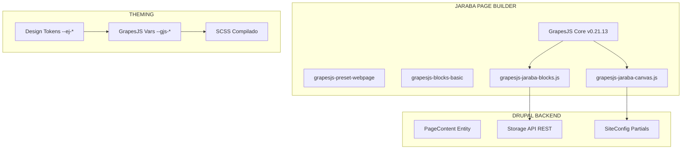

# 🎨 Especificación Técnica GrapesJS para SaaS Multi-Tenant

> **Tipo:** Especificación Técnica de Arquitectura
> **Versión:** 1.0
> **Fecha:** 2026-02-05 20:00
> **Estado:** Vigente ✅
> **Alcance:** Integración GrapesJS en Jaraba Impact Platform SaaS

---

## 📑 Tabla de Contenidos

1. [Visión Arquitectónica](#1-visión-arquitectónica)
2. [Arquitectura de Componentes](#2-arquitectura-de-componentes)
3. [Patrón de Bloques Jaraba](#3-patrón-de-bloques-jaraba)
4. [Interactividad y Scripts](#4-interactividad-y-scripts)
5. [Theming y Design Tokens](#5-theming-y-design-tokens)
6. [Persistencia y Storage](#6-persistencia-y-storage)
7. [Multi-Tenancy y Aislamiento](#7-multi-tenancy-y-aislamiento)
8. [SEO y Accesibilidad](#8-seo-y-accesibilidad)
9. [IA Generativa](#9-ia-generativa)
10. [Checklist de Implementación](#10-checklist-de-implementación)

---

## 1. Visión Arquitectónica

### 1.1 ¿Qué es GrapesJS?

GrapesJS es un **Web Builder Framework** multipropósito que permite crear constructores drag-and-drop para estructuras HTML. Diseñado para reemplazar editores WYSIWYG tradicionales en CMS, proporciona:

- **Edición visual inline** sin necesidad de código
- **Sistema de bloques** reutilizables y extensibles  
- **Gestor de estilos** visual con soporte responsive
- **Sistema de traits** para atributos personalizados
- **Exportación limpia** de HTML/CSS

### 1.2 Integración con Jaraba SaaS



### 1.3 Versiones y Dependencias

| Componente | Versión | CDN |
|------------|---------|-----|
| **GrapesJS Core** | 0.21.13 | unpkg.com/grapesjs@0.21.13 |
| **preset-webpage** | 1.0.3 | unpkg.com/grapesjs-preset-webpage@1.0.3 |
| **blocks-basic** | 1.0.2 | unpkg.com/grapesjs-blocks-basic@1.0.2 |

---

## 2. Arquitectura de Componentes

### 2.1 Component Type Stack (Pila de Tipos)

GrapesJS procesa el HTML usando una **pila de tipos de componentes** (Component Type Stack). Cada elemento HTML es evaluado contra la pila desde arriba hasta encontrar un match:

```
→ jaraba-faq      (Custom - específico Jaraba)
→ jaraba-button   (Custom - específico Jaraba)
→ cell            (Built-in - <td>, <th>)
→ row             (Built-in - <tr>)
→ table           (Built-in - <table>)
→ link            (Built-in - <a>)
→ video           (Built-in - <video>)
→ image           (Built-in - )
→ text            (Built-in - editable inline)
→ default         (Base - cualquier elemento)
```

### 2.2 Componentes Built-in (18 tipos)

| Tipo | Elemento | Comportamiento Especial |
|------|----------|-------------------------|
| `cell` | `<td>`, `<th>` | Edición de celdas |
| `row` | `<tr>` | Fila de tabla |
| `table` | `<table>` | Tabla completa |
| `link` | `<a>` | Edición de href |
| `video` | `<video>` | Reproductor |
| `image` | `` | Asset Manager al doble-clic |
| `text` | Cualquiera | Rich Text Editor inline |
| `script` | `<script>` | Código JS |
| `svg` | `<svg>` | Gráficos vectoriales |
| `default` | Cualquiera | Base sin comportamiento especial |

### 2.3 Definición de Componente Custom

```javascript
// Patrón estándar Jaraba para componentes custom
editor.DomComponents.addType('jaraba-component-name', {
    // Determina si un elemento HTML pertenece a este tipo
    isComponent(el) {
        if (el.classList && el.classList.contains('jaraba-component')) {
            return { type: 'jaraba-component-name' };
        }
        return false;
    },
    
    // Definición del Model (datos y comportamiento)
    model: {
        defaults: {
            tagName: 'div',
            classes: ['jaraba-component'],
            
            // Atributos HTML por defecto
            attributes: {
                'data-jaraba': 'component-name',
            },
            
            // Restricciones de arrastre
            draggable: '.page-content, section',
            droppable: true,
            
            // Traits (panel de propiedades)
            traits: [
                { type: 'text', name: 'title', label: 'Título' },
                { type: 'select', name: 'variant', label: 'Variante',
                  options: [
                    { value: 'default', name: 'Por defecto' },
                    { value: 'premium', name: 'Premium' },
                  ]
                },
            ],
            
            // Estilos CSS del componente (se eliminan si se elimina el componente)
            styles: `
                .jaraba-component {
                    padding: var(--ej-spacing-md, 1rem);
                    background: var(--ej-bg-surface, #ffffff);
                }
            `,
            
            // Script para interactividad (ver sección 4)
            script: null,
            
            // Propiedades a pasar al script
            'script-props': [],
        },
    },
    
    // View (renderizado en el canvas)
    view: {
        events: {
            dblclick: 'onDblClick',
        },
        
        onDblClick() {
            // Comportamiento al doble-clic (ej: abrir editor)
        },
        
        onRender() {
            // Código ejecutado cuando el componente se renderiza en el canvas
        },
    },
});
```

---

## 3. Patrón de Bloques Jaraba

### 3.1 Estructura de Bloque

Un **Block** es una pieza reutilizable de HTML que el usuario puede arrastrar al canvas:

```javascript
editor.BlockManager.add('jaraba-block-id', {
    // OBLIGATORIO: ID único del bloque
    id: 'jaraba-block-id',
    
    // Etiqueta visible en el panel de bloques
    label: 'Mi Bloque',
    
    // Categoría para agrupación
    category: 'Jaraba Blocks',
    
    // Atributos del contenedor del bloque en el panel
    attributes: { class: 'gjs-fonts gjs-f-b2' },
    
    // Contenido HTML o definición de componente
    content: `
        <div class="jaraba-block" data-gjs-type="jaraba-component-name">
            <h2>Título del Bloque</h2>
            <p>Contenido editable</p>
        </div>
    `,
    
    // O usando tipo de componente registrado
    content: { type: 'jaraba-component-name' },
    
    // Seleccionar el componente al soltarlo
    select: true,
    
    // Activar el componente (ej: abrir Asset Manager para imágenes)
    activate: false,
});
```

### 3.2 Categorías de Bloques Jaraba

| Categoría | Bloques | Descripción |
|-----------|---------|-------------|
| **Layout** | Grid 2/3/4, Section, Container | Estructura de página |
| **Hero** | Centered, Split, Video Background | Cabeceras visuales |
| **Content** | Text, FAQ, Testimonials, Team | Contenido estructurado |
| **Features** | Feature Cards, Icon Boxes | Destacados de producto |
| **Navigation** | Menu, Footer, CTA | Elementos de navegación |
| **Media** | Image, Video, Gallery | Contenido multimedia |
| **Forms** | Contact, Newsletter, Login | Formularios |

### 3.3 Nomenclatura de Bloques

```
jaraba-{categoria}-{variante}

Ejemplos:
- jaraba-hero-centered
- jaraba-hero-split
- jaraba-grid-3col
- jaraba-faq-accordion
- jaraba-testimonial-carousel
```

---

## 4. Interactividad y Scripts

### 4.1 El Problema: onclick Sanitizado

> ⚠️ **IMPORTANTE**: GrapesJS **sanitiza** atributos `onclick` inline. No usar `onclick` en el HTML de bloques.

```html
<!-- ❌ NO FUNCIONA - onclick será eliminado -->
<button onclick="toggle()">Expandir</button>

<!-- ✅ CORRECTO - usar script property -->
<button class="jaraba-toggle">Expandir</button>
```

### 4.2 Arquitectura Dual para Interactividad

Para bloques interactivos (FAQ, tabs, carousels), implementar **dos mecanismos**:

```
┌──────────────────────────────────────────────────────────┐
│                    BLOQUE INTERACTIVO                    │
├───────────────────────────┬──────────────────────────────┤
│       GRAPESJS EDITOR     │      PÁGINAS PÚBLICAS        │
├───────────────────────────┼──────────────────────────────┤
│  model.defaults.script    │   Drupal.behaviors.xxx       │
│  view.onRender()          │   jaraba-xxx-accordion.js    │
│  (Ejecutado en iframe)    │   (Cargado via library)      │
└───────────────────────────┴──────────────────────────────┘
```

### 4.3 Script Property (Editor)

```javascript
// Script ejecutado en el iframe del canvas
// IMPORTANTE: No usar arrow functions, usar function()
const faqScript = function() {
    // `this` está vinculado al elemento del componente
    const items = this.querySelectorAll('.jaraba-faq__item');
    
    items.forEach(function(item) {
        const toggle = item.querySelector('.jaraba-faq__toggle');
        if (toggle) {
            toggle.addEventListener('click', function() {
                item.classList.toggle('jaraba-faq__item--open');
            });
        }
    });
};

editor.DomComponents.addType('jaraba-faq', {
    model: {
        defaults: {
            script: faqScript,
            // ...
        },
    },
    view: {
        onRender() {
            // También ejecutar en el editor para preview funcional
            faqScript.call(this.el);
        },
    },
});
```

### 4.4 Drupal Behavior (Páginas Públicas)

```javascript
// js/jaraba-faq-accordion.js
(function(Drupal) {
    'use strict';
    
    function initFaqAccordions(context) {
        const containers = context.querySelectorAll('.jaraba-faq');
        
        containers.forEach(function(container) {
            // Usar delegación de eventos
            container.addEventListener('click', function(event) {
                const toggle = event.target.closest('.jaraba-faq__toggle');
                if (!toggle) return;
                
                const item = toggle.closest('.jaraba-faq__item');
                if (item) {
                    item.classList.toggle('jaraba-faq__item--open');
                }
            });
        });
    }
    
    // Como Drupal behavior (carga automática)
    Drupal.behaviors.jarabaFaqAccordion = {
        attach: function(context) {
            initFaqAccordions(context);
        },
    };
    
    // Exponer para uso desde GrapesJS iframe
    window.jarabaInitFaqAccordions = initFaqAccordions;
    
})(Drupal);
```

### 4.5 script-props: Pasar Propiedades al Script

```javascript
const counterScript = function(props) {
    const target = parseInt(props.targetNumber) || 100;
    const duration = parseInt(props.animationDuration) || 2000;
    
    // Lógica de contador animado...
    animateCounter(this, target, duration);
};

editor.DomComponents.addType('jaraba-counter', {
    model: {
        defaults: {
            script: counterScript,
            targetNumber: '100',
            animationDuration: '2000',
            
            traits: [
                { type: 'number', name: 'targetNumber', label: 'Número objetivo', changeProp: true },
                { type: 'number', name: 'animationDuration', label: 'Duración (ms)', changeProp: true },
            ],
            
            // Propiedades a pasar al script (re-ejecuta script al cambiar)
            'script-props': ['targetNumber', 'animationDuration'],
        },
    },
});
```

### 4.6 Dependencias Externas

**Opción A: Component-Related** (Recomendado)
```javascript
const sliderScript = function(props) {
    const initSlider = () => {
        new Swiper(this, { slidesPerView: props.slidesPerView });
    };
    
    if (typeof Swiper === 'undefined') {
        const script = document.createElement('script');
        script.onload = initSlider.bind(this);
        script.src = 'https://cdn.jsdelivr.net/npm/swiper@11/swiper-bundle.min.js';
        document.body.appendChild(script);
    } else {
        initSlider();
    }
};
```

**Opción B: Template-Related** (Global)
```javascript
grapesjs.init({
    // ...
    canvas: {
        scripts: [
            'https://cdn.jsdelivr.net/npm/swiper@11/swiper-bundle.min.js',
        ],
        styles: [
            'https://cdn.jsdelivr.net/npm/swiper@11/swiper-bundle.min.css',
        ],
    },
});
```

> ⚠️ Las dependencias de `canvas` NO se exportan en `editor.getHtml()`. Deben incluirse manualmente en la página final.

---

## 5. Theming y Design Tokens

### 5.1 Variables CSS de GrapesJS

GrapesJS usa CSS Custom Properties para theming del editor:

```css
:root {
    /* Paleta principal del editor */
    --gjs-primary-color: #233D63;         /* Corporate Blue Jaraba */
    --gjs-secondary-color: rgba(255, 255, 255, 0.7);
    --gjs-tertiary-color: #FF8C42;        /* Impulse Orange Jaraba */
    --gjs-quaternary-color: #FF8C42;
    
    /* Backgrounds */
    --gjs-main-bg: #1e1e1e;
    --gjs-canvas-bg: #ffffff;
    
    /* Fonts */
    --gjs-font-family: 'Inter', sans-serif;
}
```

### 5.2 Mapeo Design Tokens Jaraba → GrapesJS

| Token Jaraba | Token GrapesJS | Valor |
|--------------|----------------|-------|
| `--ej-color-corporate` | `--gjs-primary-color` | #233D63 |
| `--ej-color-impulse` | `--gjs-tertiary-color` | #FF8C42 |
| `--ej-color-impulse` | `--gjs-quaternary-color` | #FF8C42 |
| `--ej-font-family` | `--gjs-font-family` | Inter, sans-serif |

### 5.3 Estilos en Componentes

```javascript
editor.DomComponents.addType('jaraba-card', {
    model: {
        defaults: {
            styles: `
                /* Usar SIEMPRE variables inyectables con fallback */
                .jaraba-card {
                    background: var(--ej-bg-surface, #ffffff);
                    border-radius: var(--ej-radius-md, 0.5rem);
                    box-shadow: var(--ej-shadow-md, 0 4px 6px -1px rgba(0,0,0,0.1));
                    padding: var(--ej-spacing-lg, 1.5rem);
                }
                
                .jaraba-card__title {
                    color: var(--ej-text-primary, #1e293b);
                    font-family: var(--ej-font-family, Inter, sans-serif);
                }
                
                /* Media queries para responsive */
                @media (max-width: 768px) {
                    .jaraba-card {
                        padding: var(--ej-spacing-md, 1rem);
                    }
                }
            `,
        },
    },
});
```

### 5.4 Integración con SCSS del Tema

```scss
// En ecosistema_jaraba_theme/scss/components/_grapesjs-canvas.scss

// Variables de GrapesJS mapeadas a Design Tokens Jaraba
:root {
    --gjs-primary-color: var(--ej-color-corporate, #{$ej-color-corporate});
    --gjs-secondary-color: rgba(255, 255, 255, 0.7);
    --gjs-tertiary-color: var(--ej-color-impulse, #{$ej-color-impulse});
    --gjs-quaternary-color: var(--ej-color-impulse, #{$ej-color-impulse});
    --gjs-font-family: var(--ej-font-family, 'Inter', sans-serif);
}

// Personalización del editor
.gjs-one-bg {
    background-color: var(--gjs-primary-color);
}

.gjs-two-color {
    color: var(--gjs-secondary-color);
}

.gjs-three-bg {
    background-color: var(--gjs-tertiary-color);
    color: white;
}

.gjs-four-color,
.gjs-four-color-h:hover {
    color: var(--gjs-quaternary-color);
}
```

---

## 6. Persistencia y Storage

### 6.1 Estrategia "Store Both"

El Canvas Editor Jaraba usa una estrategia de **persistencia dual**:

```mermaid
graph LR
    A[GrapesJS Editor] --> B{editor.store()}
    B --> C[JSON GrapesJS]
    B --> D[HTML Exportado]
    C --> E[PageContent.canvas_data]
    D --> F[PageContent.sections JSON]
```

### 6.2 Configuración de Storage Manager

```javascript
grapesjs.init({
    // ...
    storageManager: {
        type: 'remote',
        autosave: true,
        autoload: true,
        stepsBeforeSave: 5,  // Cambios antes de auto-guardar
        
        options: {
            remote: {
                headers: {
                    'Content-Type': 'application/json',
                    'X-CSRF-Token': drupalSettings.csrfToken,
                },
                urlStore: `/api/v1/page-builder/${pageId}/canvas`,
                urlLoad: `/api/v1/page-builder/${pageId}/canvas`,
                
                // Transformar datos antes de enviar
                onStore: (data, editor) => {
                    return {
                        canvas_data: data,
                        html: editor.getHtml(),
                        css: editor.getCss(),
                    };
                },
                
                // Procesar respuesta al cargar
                onLoad: (result) => result.canvas_data,
            },
        },
    },
});
```

### 6.3 API REST de Persistencia

```yaml
# Endpoints para PageContent
POST   /api/v1/page-builder/{id}/canvas   # Guardar canvas
GET    /api/v1/page-builder/{id}/canvas   # Cargar canvas
DELETE /api/v1/page-builder/{id}/canvas   # Limpiar canvas

# Estructura del JSON
{
    "canvas_data": {         # Formato GrapesJS (componentes + estilos)
        "components": [...],
        "styles": [...],
        "assets": [...]
    },
    "html": "...",           # HTML exportado limpio
    "css": "...",            # CSS exportado
    "updated_at": "2026-02-05T20:00:00Z"
}
```

---

## 7. Multi-Tenancy y Aislamiento

### 7.1 Aislamiento de Contenido

```javascript
// Cargar solo assets del tenant actual
grapesjs.init({
    // ...
    assetManager: {
        upload: `/api/v1/media/upload?tenant=${tenantId}`,
        uploadName: 'files',
        assets: drupalSettings.tenantAssets || [],
    },
});
```

### 7.2 Design Tokens por Tenant

```php
// En hook_preprocess_html()
// Inyectar tokens personalizados del tenant
$tenant_config = \Drupal::service('jaraba_tenant.config')->get();

$css_vars = [
    '--ej-color-primary' => $tenant_config->get('color_primary') ?? '#FF8C42',
    '--ej-font-family' => $tenant_config->get('font_family') ?? 'Inter',
    // ...
];

$css_string = ':root { ';
foreach ($css_vars as $var => $value) {
    $css_string .= "{$var}: {$value}; ";
}
$css_string .= '}';

$variables['#attached']['html_head'][] = [
    ['#type' => 'html_tag', '#tag' => 'style', '#value' => $css_string],
    'tenant_design_tokens',
];
```

### 7.3 Límites por Plan

| Plan | Páginas | Bloques Premium | Assets | Almacenamiento |
|------|---------|-----------------|--------|----------------|
| Starter | 5 | ❌ | 50 | 100MB |
| Pro | 20 | ✅ | 200 | 500MB |
| Enterprise | ∞ | ✅ | ∞ | 5GB |

---

## 8. SEO y Accesibilidad

### 8.1 Panel SEO Integrado

```javascript
// grapesjs-jaraba-seo.js
editor.Panels.addPanel({
    id: 'seo-panel',
    // ...
});

// Reglas de auditoría SEO
const seoRules = [
    { id: 'h1-single', check: () => document.querySelectorAll('h1').length === 1 },
    { id: 'alt-images', check: () => [...document.images].every(img => img.alt) },
    { id: 'meta-description', check: () => !!document.querySelector('meta[name="description"]') },
];
```

### 8.2 Atributos ARIA en Componentes

```javascript
editor.DomComponents.addType('jaraba-faq', {
    model: {
        defaults: {
            attributes: {
                role: 'region',
                'aria-label': 'Preguntas frecuentes',
            },
            components: `
                <div class="jaraba-faq__item">
                    <button class="jaraba-faq__toggle" 
                            aria-expanded="false"
                            aria-controls="faq-answer-1">
                        <span class="question">¿Pregunta?</span>
                        <span aria-hidden="true">+</span>
                    </button>
                    <div id="faq-answer-1" 
                         class="jaraba-faq__answer"
                         role="region"
                         aria-hidden="true">
                        Respuesta...
                    </div>
                </div>
            `,
        },
    },
});
```

---

## 9. IA Generativa

### 9.1 Prompt-to-Section

```javascript
// grapesjs-jaraba-ai.js
editor.Commands.add('jaraba-ai-generate', {
    run(editor, sender, options = {}) {
        const prompt = options.prompt;
        const vertical = drupalSettings.jarabaPageBuilder.vertical;
        
        // Llamar a API de generación IA
        fetch('/api/v1/ai/generate-section', {
            method: 'POST',
            body: JSON.stringify({ prompt, vertical, context: getPageContext() }),
        })
        .then(response => response.json())
        .then(data => {
            // Insertar HTML generado en el canvas
            editor.addComponents(data.html);
        });
    },
});
```

### 9.2 Contexto de Vertical

```javascript
// Pasar contexto de vertical para generación relevante
const verticalContext = {
    emprendimiento: {
        blocks: ['business-model-canvas', 'investor-pitch', 'milestone-timeline'],
        tone: 'profesional, inspirador',
    },
    empleabilidad: {
        blocks: ['job-listing', 'skills-showcase', 'cv-builder'],
        tone: 'profesional, motivador',
    },
    // ...
};
```

---

## 10. Checklist de Implementación

### 10.1 Nuevo Componente Custom

- [ ] Definir `isComponent(el)` con clase CSS única `jaraba-*`
- [ ] Agregar `model.defaults` con tagName, classes, attributes
- [ ] Configurar `traits` para propiedades editables
- [ ] Añadir `styles` con variables inyectables `var(--ej-*, $fallback)`
- [ ] Si interactivo: implementar `script` property + Drupal behavior
- [ ] Registrar bloque en `BlockManager.add()`
- [ ] Añadir a categoría apropiada
- [ ] Documentar en biblioteca de bloques

### 10.2 Nuevo Bloque Interactivo

- [ ] Crear componente con `script` function (NO arrow function)
- [ ] Implementar `view.onRender()` para preview en editor
- [ ] Crear `js/jaraba-{component}.js` con `Drupal.behaviors`
- [ ] Registrar biblioteca en `libraries.yml`
- [ ] Cargar biblioteca en `hook_page_attachments()`
- [ ] Crear SCSS en `scss/blocks/_component.scss`
- [ ] Compilar SCSS con Dart Sass
- [ ] Verificar en editor Y página pública

### 10.3 Auditoría de Bloque Existente

- [ ] ¿Usa `var(--ej-*, $fallback)` en todos los colores?
- [ ] ¿Tiene atributos ARIA para accesibilidad?
- [ ] ¿Funciona en el editor de GrapesJS?
- [ ] ¿Funciona en páginas públicas?
- [ ] ¿Tiene texto traducible con `t()` o ``?
- [ ] ¿Sigue la nomenclatura `jaraba-{categoria}-{variante}`?

---

## Referencias

- [GrapesJS Documentation](https://grapesjs.com/docs/)
- [Components Manager](https://grapesjs.com/docs/modules/Components.html)
- [Components & JS](https://grapesjs.com/docs/modules/Components-js.html)
- [Arquitectura Theming SaaS](./2026-02-05_arquitectura_theming_saas_master.md)
- [SCSS Workflow](/.agent/workflows/scss-estilos.md)

---

> **Nota:** Este documento debe actualizarse con cada nuevo patrón o aprendizaje significativo sobre GrapesJS.
