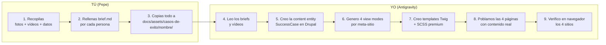

# 📂 Propuesta: Carpeta de Recursos para Casos de Éxito Clase Mundial

**Fecha:** 27 de febrero de 2026  
**Roles:** Arquitecto SaaS · Ingeniero UX · Desarrollador Web · Diseñador Theming · GrapesJS · SEO/GEO

---

## 1. Estructura de Carpeta Propuesta

```
docs/assets/casos-de-exito/
├── _README.md                    ← Instrucciones para ti (qué copiar, formato, naming)
├── _plantilla-caso.md            ← Plantilla que rellenarás por cada caso
│
├── marcela-calabia/              ← Un subdirectorio por persona
│   ├── brief.md                  ← Datos del caso (rellenas con la plantilla)
│   ├── foto-perfil.jpg           ← Foto profesional (mín. 800x800, cuadrada)
│   ├── foto-antes.jpg            ← Foto situación anterior (opcional)
│   ├── logo-empresa.svg          ← Logo del negocio/marca (si aplica)
│   ├── video-entrevista.mp4      ← ✅ Sí, puedes copiar vídeos
│   ├── video-youtube-id.txt      ← O simplemente el ID de YouTube si ya está subido
│   └── recursos-extra/           ← Capturas, documentos, métricas
│       ├── captura-web-antes.png
│       └── captura-web-despues.png
│
├── angel-martinez/
│   ├── brief.md
│   ├── foto-perfil.jpg
│   ├── video-entrevista.mp4
│   └── ...
│
├── luis-miguel-criado/
│   ├── brief.md
│   ├── foto-perfil.jpg
│   └── ...
│
└── _metricas-globales.md         ← Fuente única de verdad para KPIs del ecosistema
```

---

## 2. Plantilla de Brief por Caso (`_plantilla-caso.md`)

Cada caso debe tener un `brief.md` con esta estructura. **Yo me encargo de transformar esto en código**; tú solo rellenas los datos:

```markdown
# Nombre Completo de la Persona

## Datos Básicos
- **Nombre:** 
- **Cargo/Profesión actual:** 
- **Empresa/Marca:** 
- **Ubicación:** (ciudad, provincia)
- **Programa:** (ej: Andalucía +ei, otro)
- **Vertical:** (Emprendimiento / Empleabilidad / Pymes)
- **Fecha aproximada de participación:** 

## La Historia (Narrativa)

### Reto (Antes)
[Describe la situación de partida: ¿qué problema tenía? ¿qué le frenaba? 
¿cuál era su estado profesional/empresarial?]

### Solución (Durante)
[¿Qué servicios/herramientas usó? ¿Cómo fue el proceso? 
¿Qué hitos clave hubo durante el acompañamiento?]

### Resultado (Después)
[¿Qué logró? Sé específico con números cuando sea posible:
incremento de facturación, clientes nuevos, tiempo hasta primer cliente, etc.]

## Métricas Cuantificables
- Incremento de facturación: X€ → Y€ (Z%)
- Nuevos clientes: N
- Tiempo hasta primer resultado: X meses
- Otra métrica relevante: ...

## Quote Testimonial
> "Frase textual de la persona que resuma su experiencia."
> — Nombre, Cargo

## Recursos Multimedia
- [ ] Foto profesional (800x800 mín, cuadrada, fondo neutro)
- [ ] Vídeo entrevista (MP4, máx 5 min ideal)
- [ ] Logo empresa/marca (SVG preferido, PNG aceptable)
- [ ] Capturas antes/después (si hay web/proyecto visible)

## Permisos
- [ ] Tiene permiso firmado para usar su imagen/vídeo/nombre
- [ ] Ha revisado y aprobado el texto del caso
```

---

## 3. Flujo de Trabajo



### Detalle del flujo:

| Paso | Quién | Qué | Entregable |
|------|-------|-----|------------|
| **1** | Pepe | Recopilar material de cada caso | Fotos, vídeos, datos |
| **2** | Pepe | Rellenar `brief.md` con la plantilla | 1 brief.md por persona |
| **3** | Pepe | Copiar a `docs/assets/casos-de-exito/{nombre}/` | Carpeta completa |
| **4** | Antigravity | Leer briefs y analizar vídeos | Comprensión del caso |
| **5** | Antigravity | Crear entity `SuccessCase` + migraciones | Entidad Drupal funcional |
| **6** | Antigravity | Crear view modes para cada meta-sitio | 4 framings distintos |
| **7** | Antigravity | Templates Twig + SCSS premium clase mundial | Frontend operativo |
| **8** | Antigravity | Seedar contenido desde los briefs | Páginas pobladas |
| **9** | Antigravity | Verificar en navegador las 4 URLs | Capturas de validación |

---

## 4. Sobre los Vídeos

### ✅ Sí puedes copiar vídeos

| Formato | Uso | Notas |
|---------|-----|-------|
| **MP4 (H.264)** | Reproducción directa en el sitio | Máx 100MB por vídeo (Drupal file upload) |
| **YouTube ID** | Embed iframe responsivo | Solo copia el ID (ej: `dQw4w9WgXcQ`) en un `.txt` |
| **Vimeo ID** | Embed iframe | Similar a YouTube |

### Recomendaciones para vídeos:

1. ✅ **Duración ideal**: 2-5 minutos (testimonial conciso)
2. ✅ **Formato preferido**: MP4 H.264 para máxima compatibilidad
3. ✅ **Resolución**: 1080p mínimo (para que se vea bien en pantalla completa)
4. ✅ **Si ya están en YouTube**: solo necesito el ID, no el fichero
5. ⚠️ **Tamaño**: Si un vídeo supera 100MB, mejor subirlo a YouTube y darme el ID
6. ⚠️ **Permisos**: Asegúrate de que la persona ha dado permiso para usar el vídeo públicamente

### Cómo los usaré técnicamente:

- **Vídeos locales (MP4)**: Los subiré como Media en Drupal, se servirán con `<video>` HTML5 con lazy loading
- **YouTube/Vimeo**: Embed responsivo con `lite-youtube-embed` o iframe con consent (GDPR)
- **Thumbnails**: Generaré automáticamente una miniatura desde el vídeo o la foto de perfil

---

## 5. Lo que debes preparar por caso

### Mínimo imprescindible (obligatorio):
- [ ] `brief.md` rellenado con la plantilla
- [ ] 1 foto de perfil profesional (JPG/PNG, mín 800x800)
- [ ] 1 quote testimonial textual
- [ ] Permiso de uso de imagen/nombre

### Ideal (clase mundial):
- [ ] Todo lo mínimo +
- [ ] Vídeo entrevista (MP4 o YouTube ID)
- [ ] Logo de su empresa/marca
- [ ] 1-2 capturas antes/después
- [ ] Métricas cuantificables verificables

### Premium (diferenciador):
- [ ] Todo lo ideal +
- [ ] Segundo vídeo corto (30s, para redes/hero)
- [ ] Infografía de resultados
- [ ] Foto del proyecto/producto en acción

---

## 6. Métricas Globales (`_metricas-globales.md`)

Será la **fuente única de verdad** que alimentará los 4 sitios:

```markdown
# Métricas Globales del Ecosistema Jaraba

## KPIs Institucionales (Fuente de verdad)
- Años de experiencia: 30+
- Fondos europeos gestionados: +100M€
- Beneficiarios directos: +50,000
- Personas formadas: +15,000
- Empleos facilitados: +3,200
- Pymes digitalizadas: +800
- Municipios impactados: +120
- Tasa de éxito: 98%

## ODS Alineados
- ODS 4: Educación de calidad
- ODS 8: Trabajo decente y crecimiento económico
- ODS 9: Industria, innovación e infraestructuras
- ODS 10: Reducción de desigualdades
- ODS 11: Ciudades y comunidades sostenibles
- ODS 17: Alianzas para los objetivos (SI/NO — resolver discrepancia 5 vs 6)
```

> [!IMPORTANT]
> **Este fichero resuelve la inconsistencia detectada** entre +50.000 / +15.000 / "100" sin unidad / 5 ODS vs 6 ODS. Tú decides los números correctos, yo los propago a los 4 sitios automáticamente.

---

## 7. Prioridad de los 3 Casos Actuales

Ya tenemos material de estas 3 personas. ¿Puedes prepararme el brief + fotos + vídeos?

| Caso | Material existente | Lo que falta |
|------|-------------------|--------------|
| **Marcela Calabia** | Quote en /instituciones, historia en jarabaimpact | Foto profesional, brief detallado, métricas |
| **Ángel Martínez** | Quote + vídeo MP4 en /instituciones, historia | Foto profesional, brief detallado, métricas |
| **Luis Miguel Criado** | Quote + vídeo YouTube en /instituciones, historia | Foto profesional, brief detallado, métricas |

Si me preparas estos 3 primeros, podemos tener los 4 meta-sitios consistentes en **una sola sesión**.
