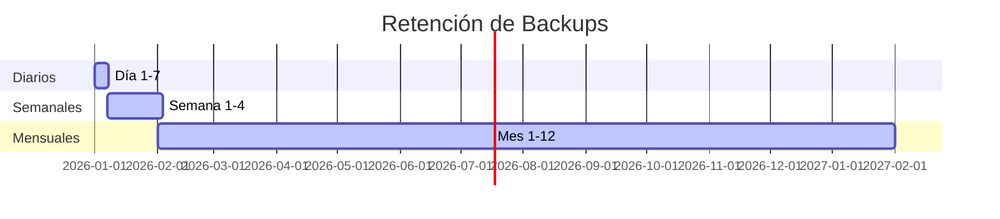
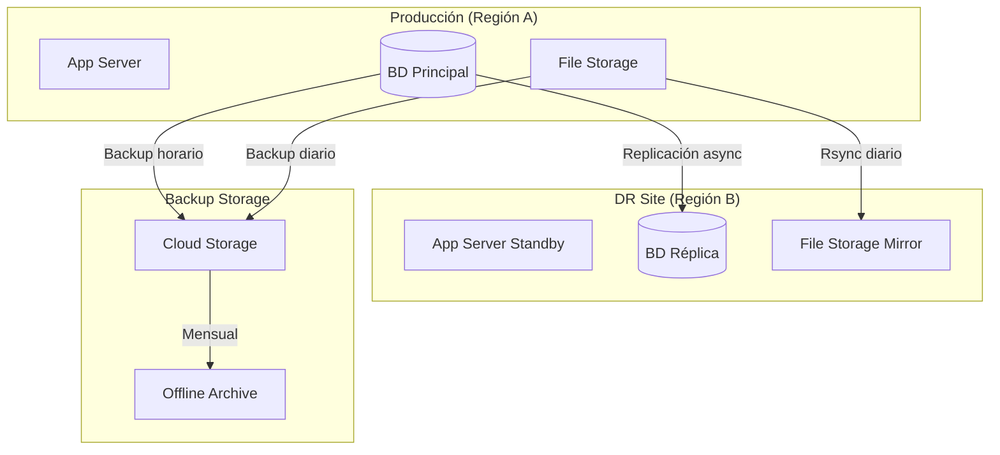

# Estrategia de Backup y Disaster Recovery

**Fecha de creación:** 2026-01-09 19:08  
**Última actualización:** 2026-01-09 19:08  
**Autor:** IA Asistente (Arquitecto SaaS Senior)  
**Versión:** 1.0.0  
**Categoría:** Implementación

---

## 📑 Tabla de Contenidos (TOC)

1. [Objetivos](#1-objetivos)
2. [Alcance](#2-alcance)
3. [Política de Backups](#3-política-de-backups)
4. [Procedimientos de Backup](#4-procedimientos-de-backup)
5. [Estrategia de Disaster Recovery](#5-estrategia-de-disaster-recovery)
6. [Procedimientos de Restauración](#6-procedimientos-de-restauración)
7. [Pruebas y Validación](#7-pruebas-y-validación)
8. [Responsabilidades](#8-responsabilidades)
9. [Registro de Cambios](#9-registro-de-cambios)

---

## 1. Objetivos

### 1.1 RPO y RTO

| Métrica | Valor Objetivo | Descripción |
|---------|----------------|-------------|
| **RPO** (Recovery Point Objective) | 24 horas | Máxima pérdida de datos aceptable |
| **RTO** (Recovery Time Objective) | 4 horas | Tiempo máximo para restaurar servicio |

### 1.2 Objetivos de Continuidad

- Garantizar la recuperación de datos en caso de fallo
- Minimizar el impacto en usuarios durante incidentes
- Mantener la integridad de datos de todas las Sedes
- Cumplir con requisitos de retención de datos

---

## 2. Alcance

### 2.1 Componentes Cubiertos

| Componente | Tipo de Backup | Frecuencia |
|------------|----------------|------------|
| **Base de datos principal** | Full + Incremental | Diario/Horario |
| **Bases de datos por Sede** | Full + Incremental | Diario/Horario |
| **Archivos de usuarios** | Sincronización | Continuo |
| **Configuración Drupal** | Export YAML | En cada deploy |
| **Código fuente** | Git | Continuo |
| **Certificados/Secrets** | Vault backup | Diario |

### 2.2 Entornos

| Entorno | Backup Automático | Retención |
|---------|-------------------|-----------|
| **Producción** | ✅ Sí | 30 días |
| **Staging** | ✅ Sí | 7 días |
| **Desarrollo** | ❌ No (bajo demanda) | 1 día |

---

## 3. Política de Backups

### 3.1 Esquema de Retención



| Tipo | Retención | Cantidad | Almacenamiento |
|------|-----------|----------|----------------|
| **Horario** | 24 horas | 24 | Local |
| **Diario** | 7 días | 7 | Local + Remoto |
| **Semanal** | 4 semanas | 4 | Remoto |
| **Mensual** | 12 meses | 12 | Remoto (archivado) |

### 3.2 Almacenamiento

| Ubicación | Propósito | Encriptación |
|-----------|-----------|--------------|
| **Local** | Restauración rápida | AES-256 |
| **Cloud (S3/GCS)** | Redundancia geográfica | AES-256 + TLS |
| **Offline** | Disaster Recovery extremo | AES-256 |

---

## 4. Procedimientos de Backup

### 4.1 Backup de Base de Datos

#### Automático (Cron)

```bash
#!/bin/bash
# /scripts/backup-database.sh
# Ejecutar via cron: 0 * * * * (cada hora)

DATE=$(date +%Y%m%d_%H%M)
BACKUP_DIR="/backups/database"
RETENTION_HOURS=24

# Backup de cada base de datos
for DB in principal agroconecta pepejaraba; do
    mysqldump -u backup_user -p${DB_PASS} \
        --single-transaction \
        --routines \
        --triggers \
        ${DB} | gzip > "${BACKUP_DIR}/${DB}_${DATE}.sql.gz"
    
    # Encriptar
    gpg --encrypt --recipient backup@jaraba.es \
        "${BACKUP_DIR}/${DB}_${DATE}.sql.gz"
    
    rm "${BACKUP_DIR}/${DB}_${DATE}.sql.gz"
done

# Limpiar backups antiguos
find ${BACKUP_DIR} -name "*.gpg" -mmin +$((RETENTION_HOURS * 60)) -delete

# Sincronizar a remoto
rclone sync ${BACKUP_DIR} remote:backups/database/
```

#### Manual (Emergencia)

```bash
# Backup manual inmediato
lando drush sql-dump --gzip --result-file=/backups/emergency_$(date +%Y%m%d_%H%M).sql.gz

# Backup de sede específica
lando drush @agroconecta sql-dump --gzip --result-file=/backups/agroconecta_emergency.sql.gz
```

### 4.2 Backup de Archivos

```bash
#!/bin/bash
# /scripts/backup-files.sh
# Ejecutar: 0 2 * * * (diario a las 2am)

DATE=$(date +%Y%m%d)
FILES_DIR="/var/www/html/sites"
BACKUP_DIR="/backups/files"

# Backup incremental con rsync
rsync -avz --delete \
    --backup --backup-dir="${BACKUP_DIR}/incremental/${DATE}" \
    ${FILES_DIR}/ ${BACKUP_DIR}/current/

# Crear tarball semanal (domingos)
if [ $(date +%u) -eq 7 ]; then
    tar -czf "${BACKUP_DIR}/weekly/files_${DATE}.tar.gz" \
        -C ${BACKUP_DIR}/current .
fi
```

### 4.3 Backup de Configuración Drupal

```bash
#!/bin/bash
# /scripts/backup-config.sh
# Ejecutar: En cada deploy

DATE=$(date +%Y%m%d_%H%M)
CONFIG_DIR="/backups/config"

# Exportar configuración
lando drush cex -y

# Crear snapshot
cp -r config/sync "${CONFIG_DIR}/config_${DATE}"

# Mantener últimas 10 versiones
ls -t ${CONFIG_DIR} | tail -n +11 | xargs -I {} rm -rf "${CONFIG_DIR}/{}"
```

---

## 5. Estrategia de Disaster Recovery

### 5.1 Escenarios de Desastre

| Escenario | Probabilidad | Impacto | Estrategia |
|-----------|--------------|---------|------------|
| **Fallo de servidor** | Media | Alto | Failover a réplica |
| **Corrupción de BD** | Baja | Crítico | Restore desde backup |
| **Ataque ransomware** | Baja | Crítico | Backups offline |
| **Error humano** | Alta | Medio | Snapshots horarios |
| **Fallo de datacenter** | Muy baja | Crítico | DR en otra región |

### 5.2 Diagrama de DR



### 5.3 Prioridades de Recuperación

| Prioridad | Componente | RTO | Justificación |
|-----------|------------|-----|---------------|
| **1** | BD Principal | 1 hora | Core del sistema |
| **2** | BD Sedes activas | 2 horas | Operación de clientes |
| **3** | Aplicación | 2 horas | Acceso de usuarios |
| **4** | Archivos | 4 horas | Menos crítico |
| **5** | Históricos | 24 horas | Baja prioridad |

---

## 6. Procedimientos de Restauración

### 6.1 Restauración de Base de Datos

```bash
#!/bin/bash
# restore-database.sh [DB_NAME] [BACKUP_FILE]

DB_NAME=$1
BACKUP_FILE=$2

# Verificar backup
gpg --decrypt ${BACKUP_FILE} > /tmp/restore.sql.gz
gunzip /tmp/restore.sql.gz

# Crear backup de seguridad del estado actual
mysqldump ${DB_NAME} > /tmp/pre_restore_backup.sql

# Restaurar
mysql ${DB_NAME} < /tmp/restore.sql

# Limpiar caché Drupal
lando drush cr

echo "Restauración completada. Verificar en: https://..."
```

### 6.2 Restauración de Archivos

```bash
#!/bin/bash
# restore-files.sh [DATE] [SEDE]

DATE=$1
SEDE=$2

BACKUP_DIR="/backups/files"
TARGET_DIR="/var/www/html/sites/${SEDE}/files"

# Backup de seguridad
mv ${TARGET_DIR} ${TARGET_DIR}_pre_restore_$(date +%Y%m%d)

# Restaurar desde backup
if [ -d "${BACKUP_DIR}/incremental/${DATE}" ]; then
    cp -r "${BACKUP_DIR}/incremental/${DATE}" ${TARGET_DIR}
else
    tar -xzf "${BACKUP_DIR}/weekly/files_${DATE}.tar.gz" -C $(dirname ${TARGET_DIR})
fi

# Corregir permisos
chown -R www-data:www-data ${TARGET_DIR}
chmod -R 755 ${TARGET_DIR}
```

### 6.3 Restauración Completa (Full DR)

```bash
#!/bin/bash
# full-dr-restore.sh

echo "=== INICIANDO RESTAURACIÓN COMPLETA DE DR ==="

# 1. Restaurar BD principal
./restore-database.sh principal /backups/latest/principal.sql.gz.gpg

# 2. Restaurar BD de cada sede
for sede in agroconecta pepejaraba; do
    ./restore-database.sh ${sede} /backups/latest/${sede}.sql.gz.gpg
done

# 3. Restaurar archivos
for sede in default agroconecta pepejaraba; do
    ./restore-files.sh latest ${sede}
done

# 4. Importar configuración
lando drush cim -y

# 5. Limpiar cachés
lando drush cr

# 6. Verificar estado
lando drush status

echo "=== RESTAURACIÓN COMPLETADA ==="
echo "Verificar funcionamiento en cada URL"
```

---

## 7. Pruebas y Validación

### 7.1 Calendario de Pruebas

| Tipo de Prueba | Frecuencia | Responsable |
|----------------|------------|-------------|
| **Verificación de backup** | Diario (automático) | Sistema |
| **Restauración parcial** | Mensual | DevOps |
| **DR Drill completo** | Trimestral | Equipo completo |
| **Auditoría de retención** | Semestral | Seguridad |

### 7.2 Checklist de Verificación

```markdown
## Verificación de Backup Diario

- [ ] Backup de BD principal completado
- [ ] Backup de BD de sedes completado
- [ ] Archivos sincronizados a remoto
- [ ] Hash de integridad verificado
- [ ] Notificación enviada (éxito/fallo)

## Verificación de Restauración Mensual

- [ ] Entorno de prueba limpio
- [ ] Restauración de BD exitosa
- [ ] Restauración de archivos exitosa
- [ ] Aplicación funcional post-restore
- [ ] Datos verificados (muestreo)
- [ ] Tiempo de restauración documentado
```

---

## 8. Responsabilidades

| Rol | Responsabilidad |
|-----|-----------------|
| **DevOps** | Configurar y mantener sistemas de backup |
| **SysAdmin** | Monitorear ejecución y alertas |
| **Desarrollo** | Exportar config antes de deploys |
| **Seguridad** | Auditar políticas y accesos |
| **Product Owner** | Aprobar cambios en políticas |

---

## 9. Registro de Cambios

| Fecha | Versión | Descripción |
|-------|---------|-------------|
| 2026-01-09 | 1.0.0 | Creación inicial de la estrategia de Backup/DR |
