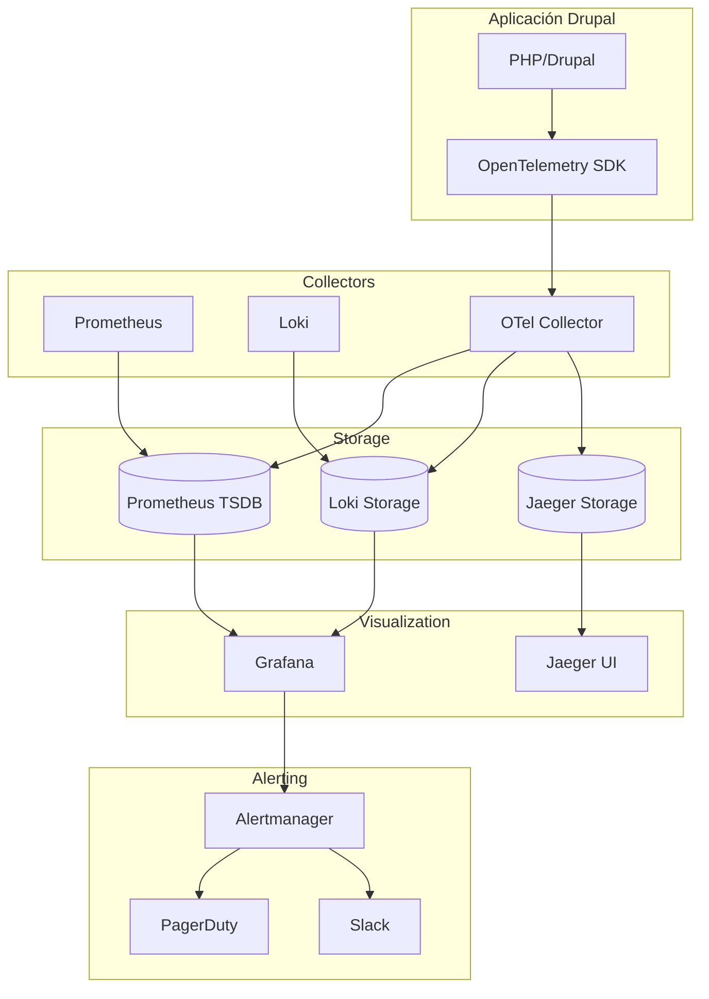

# Estrategia de Observabilidad

**Fecha de creación:** 2026-01-09 22:31  
**Última actualización:** 2026-01-11 19:10  
**Versión:** 2.0.0  
**Categoría:** Implementación

---

## 📑 Tabla de Contenidos (TOC)

1. [Propósito](#1-propósito)
2. [Pilares de Observabilidad](#2-pilares-de-observabilidad)
3. [Stack Tecnológico](#3-stack-tecnológico)
4. [Métricas Clave](#4-métricas-clave)
5. [Logging](#5-logging)
6. [Tracing Distribuido](#6-tracing-distribuido)
7. [Alertas](#7-alertas)
8. [Dashboards](#8-dashboards)
9. [Implementación en Drupal](#9-implementación-en-drupal)
10. [Dashboards Drupal Nativos](#10-dashboards-drupal-nativos)
11. [Registro de Cambios](#11-registro-de-cambios)

---

## 1. Propósito

La observabilidad permite:

- **Detectar problemas** antes de que afecten al usuario
- **Diagnosticar** incidentes rápidamente
- **Optimizar rendimiento** con datos reales
- **Cumplir SLAs** con métricas objetivas
- **Auditar** acciones por tenant

---

## 2. Pilares de Observabilidad

```
                    OBSERVABILIDAD
                         │
        ┌────────────────┼────────────────┐
        │                │                │
        ▼                ▼                ▼
    ┌───────┐       ┌───────┐       ┌───────┐
    │ LOGS  │       │METRICS│       │TRACES │
    │       │       │       │       │       │
    │ Qué   │       │Cuánto │       │Por qué│
    │pasó   │       │       │       │       │
    └───────┘       └───────┘       └───────┘
        │                │                │
        ▼                ▼                ▼
    ELK Stack       Prometheus       OpenTelemetry
    Loki            Grafana          Jaeger
```

| Pilar | Responde a | Herramientas |
|-------|------------|--------------|
| **Logs** | ¿Qué pasó? | Drupal Watchdog, Loki, ELK |
| **Metrics** | ¿Cuánto? ¿Cuándo? | Prometheus, Grafana |
| **Traces** | ¿Por qué? ¿Dónde? | OpenTelemetry, Jaeger |

---

## 3. Stack Tecnológico

### 3.1 Arquitectura



### 3.2 Componentes

| Componente | Versión | Propósito |
|------------|---------|-----------|
| **Prometheus** | 2.x | Métricas time-series |
| **Grafana** | 10.x | Dashboards y alertas |
| **Loki** | 2.x | Agregación de logs |
| **Jaeger** | 1.x | Distributed tracing |
| **OpenTelemetry** | 1.x | Instrumentación |
| **Alertmanager** | 0.26.x | Gestión de alertas |

---

## 4. Métricas Clave

### 4.1 Métricas RED (Rate, Errors, Duration)

| Métrica | Descripción | Umbral Warning | Umbral Critical |
|---------|-------------|----------------|-----------------|
| `http_requests_total` | Requests por segundo | - | - |
| `http_request_duration_seconds` | Latencia P50/P95/P99 | P95 > 1s | P99 > 3s |
| `http_errors_total` | Errores 4xx/5xx | > 1% | > 5% |

### 4.2 Métricas USE (Utilization, Saturation, Errors)

| Recurso | Utilization | Saturation | Errors |
|---------|-------------|------------|--------|
| **CPU** | % uso | Queue length | OOM kills |
| **Memoria** | % usado | Swap usage | OOM events |
| **Disco** | % capacidad | IO wait | IO errors |
| **DB** | Conexiones activas | Pool exhaustion | Query errors |

### 4.3 Métricas de Negocio

| Métrica | Query Prometheus |
|---------|------------------|
| Tenants activos | `count(tenant_active == 1)` |
| Productores por tenant | `sum by (tenant) (productores_count)` |
| Pedidos/hora | `rate(orders_total[1h])` |
| Revenue diario | `sum(increase(order_amount_total[24h]))` |

### 4.4 Métricas Multi-tenant

```yaml
# Labels obligatorios para todas las métricas
labels:
  - tenant_id
  - plan_tier
  - vertical
```

---

## 5. Logging

### 5.1 Niveles de Log

| Nivel | Uso | Ejemplo |
|-------|-----|---------|
| **DEBUG** | Desarrollo | Variables, estados internos |
| **INFO** | Operacional | Requests, eventos normales |
| **NOTICE** | Eventos significativos | Login usuario, cambio config |
| **WARNING** | Potenciales problemas | Deprecated, retry |
| **ERROR** | Errores recuperables | DB timeout, API fallback |
| **CRITICAL** | Errores graves | Servicio caído |
| **EMERGENCY** | Sistema inutilizable | Pérdida de datos |

### 5.2 Formato Estructurado

```json
{
  "timestamp": "2026-01-09T22:31:45.123Z",
  "level": "ERROR",
  "message": "Failed to process payment",
  "context": {
    "tenant_id": 42,
    "user_id": 1234,
    "order_id": "ORD-5678",
    "stripe_error": "card_declined",
    "trace_id": "abc123def456"
  },
  "source": {
    "file": "StripeController.php",
    "line": 156,
    "function": "processPayment"
  }
}
```

### 5.3 Configuración Drupal

```php
// settings.php
$settings['logging'] = [
  'level' => 'notice',
  'channels' => [
    'default' => ['loki', 'watchdog'],
    'security' => ['loki', 'watchdog', 'file'],
    'performance' => ['prometheus'],
  ],
];
```

### 5.4 Retención de Logs

| Tier | Hot (SSD) | Warm (HDD) | Cold (S3) |
|------|-----------|------------|-----------|
| **Básico** | 7 días | - | - |
| **Profesional** | 14 días | 30 días | - |
| **Enterprise** | 30 días | 90 días | 1 año |

---

## 6. Tracing Distribuido

### 6.1 Spans Clave

```
[Request] ─────────────────────────────────────────────►
    │
    ├─[Middleware: Auth] ──────►
    │
    ├─[Controller] ────────────────────────►
    │      │
    │      ├─[Service: TenantManager] ────►
    │      │
    │      ├─[DB: Query] ────►
    │      │
    │      └─[External: Stripe API] ──────────►
    │
    └─[Response] ────►
```

### 6.2 Atributos de Span

```php
$span->setAttributes([
  'tenant.id' => $tenantId,
  'tenant.plan' => 'profesional',
  'user.id' => $userId,
  'http.method' => 'POST',
  'http.route' => '/api/orders',
  'db.statement' => 'SELECT * FROM orders WHERE...',
]);
```

### 6.3 Propagación de Contexto

| Header | Propósito |
|--------|-----------|
| `traceparent` | W3C Trace Context |
| `X-Request-ID` | ID único de request |
| `X-Tenant-ID` | Contexto de tenant |

---

## 7. Alertas

### 7.1 Severidades

| Severidad | Acción | Tiempo Respuesta |
|-----------|--------|------------------|
| 🔴 **P1 Critical** | PagerDuty + llamada | Inmediato |
| 🟠 **P2 Major** | PagerDuty + Slack | 30 min |
| 🟡 **P3 Minor** | Slack canal #alerts | 2 horas |
| 🔵 **P4 Info** | Slack canal #monitoring | Siguiente día |

### 7.2 Alertas Críticas (P1)

```yaml
# alertmanager/rules/critical.yml
groups:
  - name: critical
    rules:
      - alert: ServiceDown
        expr: up == 0
        for: 1m
        labels:
          severity: critical
        annotations:
          summary: "Servicio {{ $labels.job }} caído"
          
      - alert: HighErrorRate
        expr: rate(http_errors_total[5m]) / rate(http_requests_total[5m]) > 0.05
        for: 5m
        labels:
          severity: critical
        annotations:
          summary: "Error rate > 5% en {{ $labels.service }}"
          
      - alert: DatabaseDown
        expr: mysql_up == 0
        for: 1m
        labels:
          severity: critical
```

### 7.3 Alertas por Tenant

```yaml
- alert: TenantOverQuota
  expr: tenant_productores_count > on(tenant_id) group_left tenant_plan_limit
  for: 1h
  labels:
    severity: warning
  annotations:
    summary: "Tenant {{ $labels.tenant_id }} excede límite de productores"
```

---

## 8. Dashboards

### 8.1 Dashboard Overview

| Panel | Métricas |
|-------|----------|
| **Requests/s** | `rate(http_requests_total[5m])` |
| **Latencia P99** | `histogram_quantile(0.99, ...)` |
| **Error Rate** | `rate(http_errors_total[5m])` |
| **Active Tenants** | `count(tenant_last_activity > time()-3600)` |
| **DB Connections** | `mysql_connection_pool_size` |
| **Redis Hit Rate** | `redis_hits / (redis_hits + redis_misses)` |

### 8.2 Dashboard por Tenant

| Panel | Propósito |
|-------|-----------|
| **Productores activos** | Gauge con límite |
| **Pedidos últimas 24h** | Timeseries |
| **Revenue acumulado** | Stat panel |
| **Errores** | Tabla con detalles |
| **Top APIs** | Bar chart de endpoints |

### 8.3 Dashboard SLA

| Panel | Descripción |
|-------|-------------|
| **Uptime actual** | 99.95% con indicador verde/rojo |
| **Incidentes mes** | Tabla con duración |
| **Burn rate** | Error budget restante |
| **MTTR** | Mean Time To Recovery |

---

## 9. Implementación en Drupal

### 9.1 Módulo de Métricas

```php
// src/Service/MetricsService.php
namespace Drupal\ecosistema_jaraba_core\Service;

use Prometheus\CollectorRegistry;
use Prometheus\Counter;
use Prometheus\Histogram;

class MetricsService {

  private Counter $requestCounter;
  private Histogram $requestDuration;

  public function __construct(CollectorRegistry $registry) {
    $this->requestCounter = $registry->getOrRegisterCounter(
      'jaraba',
      'http_requests_total',
      'Total HTTP requests',
      ['method', 'route', 'status', 'tenant_id']
    );
    
    $this->requestDuration = $registry->getOrRegisterHistogram(
      'jaraba',
      'http_request_duration_seconds',
      'HTTP request duration',
      ['method', 'route', 'tenant_id'],
      [0.01, 0.05, 0.1, 0.5, 1.0, 2.0, 5.0]
    );
  }

  public function recordRequest(string $method, string $route, int $status, int $tenantId, float $duration): void {
    $this->requestCounter->inc([
      'method' => $method,
      'route' => $route,
      'status' => (string) $status,
      'tenant_id' => (string) $tenantId,
    ]);
    
    $this->requestDuration->observe(
      $duration,
      ['method' => $method, 'route' => $route, 'tenant_id' => (string) $tenantId]
    );
  }

}
```

### 9.2 Endpoint de Métricas

```yaml
# ecosistema_jaraba_core.routing.yml
ecosistema_jaraba_core.metrics:
  path: '/metrics'
  defaults:
    _controller: '\Drupal\ecosistema_jaraba_core\Controller\MetricsController::export'
  requirements:
    _permission: 'access metrics'
```

### 9.3 Middleware de Tracing

```php
// src/EventSubscriber/TracingSubscriber.php
public function onKernelRequest(RequestEvent $event): void {
  $request = $event->getRequest();
  
  $span = $this->tracer->spanBuilder('http.request')
    ->setSpanKind(SpanKind::SERVER)
    ->setAttribute('http.method', $request->getMethod())
    ->setAttribute('http.url', $request->getUri())
    ->setAttribute('tenant.id', $this->tenantManager->getCurrentTenantId())
    ->startSpan();
    
  $request->attributes->set('_trace_span', $span);
}

public function onKernelResponse(ResponseEvent $event): void {
  $span = $event->getRequest()->attributes->get('_trace_span');
  if ($span) {
    $span->setAttribute('http.status_code', $event->getResponse()->getStatusCode());
    $span->end();
  }
}
```

## 10. Dashboards Drupal Nativos

> **Estado:** ✅ Implementado (2026-01-11)
> **Decisión Arquitectónica:** Dashboards Drupal nativos como alternativa a Grafana para entornos donde Prometheus no está disponible.

### 10.1 Health Dashboard (`/admin/health`)

Dashboard de estado de servicios integrado en Drupal:

| Feature | Descripción |
|---------|-------------|
| **Estado de servicios** | Database, Qdrant, Cache, Site Response |
| **Métricas** | Uptime, Health %, Request Count |
| **Histórico BD** | Tabla `health_check_log` (últimos 1000 registros) |
| **Alertas Email** | Notificación automática cuando servicio → critical |
| **Rate-limiting** | Máximo 1 alerta cada 5 minutos |

**Archivos:**
- `HealthDashboardController.php`
- `templates/health-dashboard.html.twig`
- `css/health-dashboard.css`

**Rutas:**
```yaml
/admin/health       # Dashboard visual
/admin/health/api   # API JSON
```

**Tabla de histórico:**
```sql
CREATE TABLE health_check_log (
  id INT PRIMARY KEY,
  timestamp INT,
  service VARCHAR(64),
  status VARCHAR(32),
  latency FLOAT,
  message TEXT,
  overall_health INT
);
```

### 10.2 FinOps Dashboard (`/admin/finops`)

Dashboard de optimización de costes:

| Métrica | Descripción |
|---------|-------------|
| **Costes por Tenant** | Storage, API requests, CPU hours |
| **Proyecciones** | Mensual, % de presupuesto |
| **Alertas** | Budget warning (75%), critical (90%) |
| **Recomendaciones** | Sugerencias de optimización con savings |

**Archivos:**
- `FinOpsDashboardController.php`
- `templates/finops-dashboard.html.twig`
- `scss/_finops-dashboard.scss` (variables CSS inyectables)

**Rutas:**
```yaml
/admin/finops       # Dashboard visual
/admin/finops/api   # API JSON
```

### 10.3 Acceso desde Menú Admin

Ambos dashboards están integrados en:
- **Admin → Reports → Platform Health Dashboard**
- **Admin → Reports → FinOps Dashboard**

---

## 11. Registro de Cambios

| Fecha | Versión | Autor | Descripción |
|-------|---------|-------|-------------|
| 2026-01-09 | 1.0.0 | IA Asistente | Creación inicial del documento |
| 2026-01-11 | 2.0.0 | IA Asistente | Añadidos Health Dashboard y FinOps Dashboard nativos Drupal |

