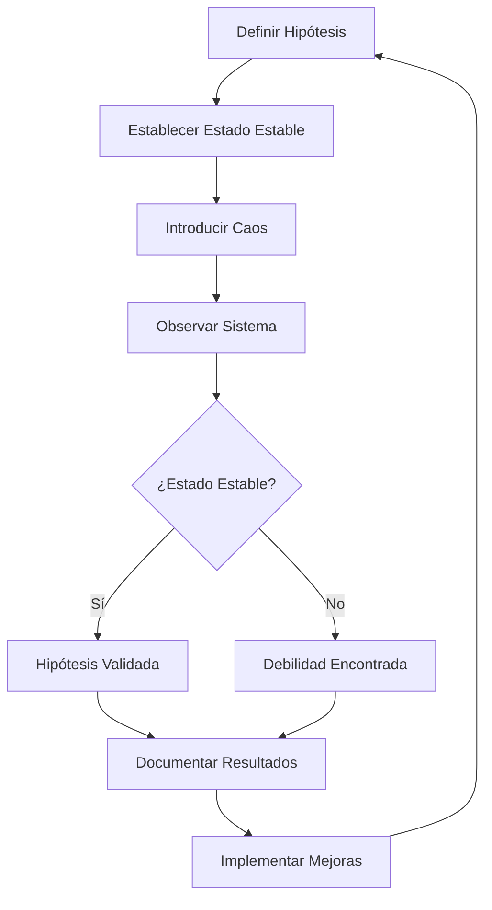
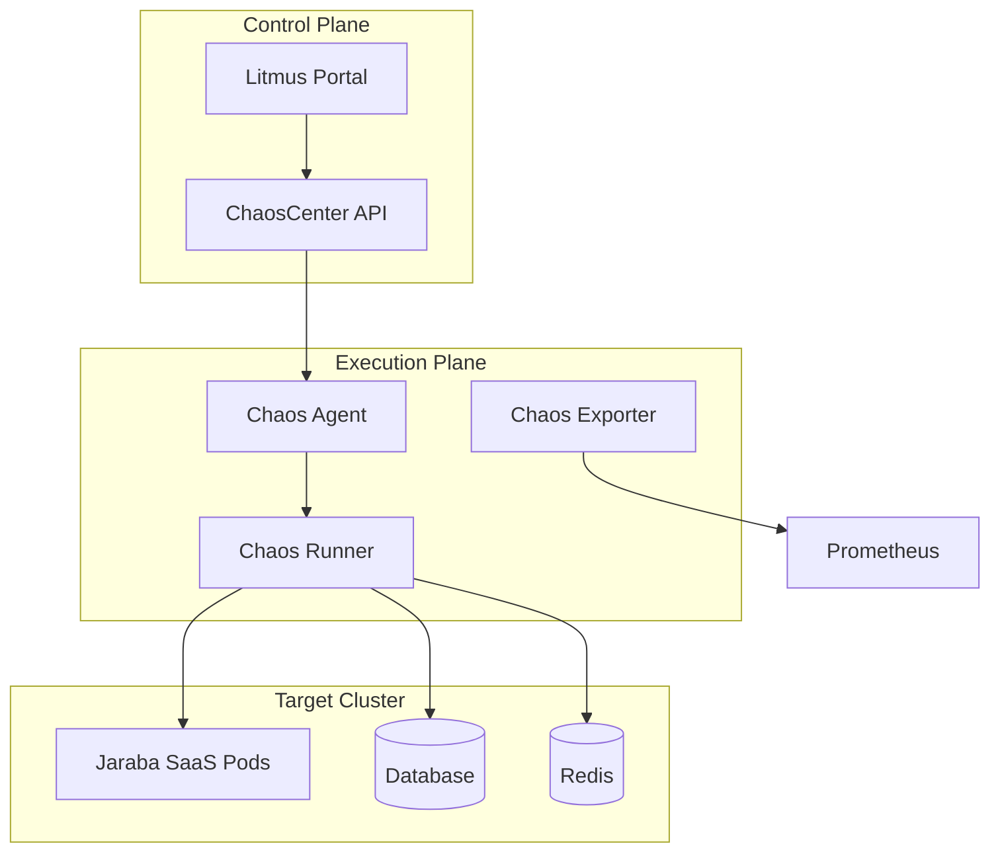

# Chaos Engineering

**Fecha de creación:** 2026-01-09 22:39  
**Última actualización:** 2026-01-09 22:39  
**Versión:** 1.0.0  
**Categoría:** Implementación

---

## 📑 Tabla de Contenidos (TOC)

1. [Propósito](#1-propósito)
2. [Principios de Chaos Engineering](#2-principios-de-chaos-engineering)
3. [Categorías de Experimentos](#3-categorías-de-experimentos)
4. [Experimentos Definidos](#4-experimentos-definidos)
5. [Implementación con Litmus](#5-implementación-con-litmus)
6. [Game Days](#6-game-days)
7. [Métricas y Reporting](#7-métricas-y-reporting)
8. [Registro de Cambios](#8-registro-de-cambios)

---

## 1. Propósito

Chaos Engineering permite:

- **Validar** hipótesis de resiliencia en producción
- **Descubrir** debilidades antes de que causen incidentes
- **Mejorar** la confianza en sistemas distribuidos
- **Entrenar** al equipo en respuesta a incidentes
- **Verificar** que el self-healing funciona correctamente

---

## 2. Principios de Chaos Engineering

### 2.1 Manifiesto

1. **Hipótesis sobre estado estable**: Define qué significa "funcionando"
2. **Variar eventos del mundo real**: Simula fallos reales
3. **Ejecutar en producción**: O en entorno lo más similar posible
4. **Automatizar experimentos**: Ejecución continua
5. **Minimizar radio de explosión**: Limitar impacto

### 2.2 Flujo de Experimento



---

## 3. Categorías de Experimentos

### 3.1 Matriz de Experimentos

| Categoría | Ejemplos | Impacto | Frecuencia |
|-----------|----------|---------|------------|
| **Aplicación** | Kill process, memory pressure | Medio | Semanal |
| **Red** | Latencia, packet loss, DNS failure | Alto | Mensual |
| **Infraestructura** | Node failure, disk full | Alto | Mensual |
| **Dependencias** | API timeout, DB failure | Crítico | Trimestral |
| **Seguridad** | Certificate expiry, secret rotation | Medio | Mensual |

### 3.2 Blast Radius

```
                    IMPACTO
                       ▲
                       │
    ┌──────────────────┼──────────────────┐
    │                  │                  │
    │  💀 CRÍTICO      │  ⚠️ ALTO        │
    │  - Full DB down  │  - Node failure │
    │  - Network part. │  - API timeout  │
    │                  │                  │
    ├──────────────────┼──────────────────┤
    │                  │                  │
    │  🟡 MEDIO        │  🟢 BAJO        │
    │  - Pod restart   │  - Latencia     │
    │  - Cache clear   │  - CPU spike    │
    │                  │                  │
    └──────────────────┴──────────────────┘
                       │
                       └──────────────────► FRECUENCIA
                    Trimestral        Semanal
```

---

## 4. Experimentos Definidos

### 4.1 Experimento: Pod Termination

| Campo | Valor |
|-------|-------|
| **ID** | CHAOS-001 |
| **Nombre** | Pod Termination Random |
| **Hipótesis** | El sistema mantiene disponibilidad cuando un pod es eliminado |
| **Estado Estable** | Latencia P99 < 500ms, Error rate < 0.1% |
| **Acción** | Kill 1 pod aleatorio del deployment appserver |
| **Duración** | 5 minutos |
| **Rollback** | Automático por Kubernetes |
| **Frecuencia** | Semanal |
| **Entorno** | Staging → Producción |

```yaml
# litmus/pod-termination.yaml
apiVersion: litmuschaos.io/v1alpha1
kind: ChaosExperiment
metadata:
  name: pod-terminate-jaraba
spec:
  definition:
    scope: Namespaced
    permissions:
      - apiGroups: [""]
        resources: ["pods"]
        verbs: ["delete"]
    env:
      - name: TARGET_PODS
        value: "1"
      - name: PODS_AFFECTED_PERC
        value: "25"
      - name: TOTAL_CHAOS_DURATION
        value: "300"
```

### 4.2 Experimento: Network Latency

| Campo | Valor |
|-------|-------|
| **ID** | CHAOS-002 |
| **Nombre** | Network Latency Injection |
| **Hipótesis** | El sistema degrada gracefully con latencia de red |
| **Estado Estable** | Timeouts < 1%, Circuit breakers no abiertos |
| **Acción** | Añadir 500ms latencia a tráfico DB |
| **Duración** | 10 minutos |
| **Rollback** | Remover regla tc |
| **Frecuencia** | Mensual |

```yaml
# litmus/network-latency.yaml
apiVersion: litmuschaos.io/v1alpha1
kind: ChaosExperiment
metadata:
  name: network-latency-jaraba
spec:
  definition:
    env:
      - name: NETWORK_LATENCY
        value: "500"
      - name: TARGET_SERVICE
        value: "database"
      - name: CONTAINER_RUNTIME
        value: "docker"
```

### 4.3 Experimento: Database Failover

| Campo | Valor |
|-------|-------|
| **ID** | CHAOS-003 |
| **Nombre** | Database Primary Failure |
| **Hipótesis** | El failover automático completa en < 30s |
| **Estado Estable** | Queries exitosos, RTO < 30s |
| **Acción** | SIGKILL proceso MySQL primary |
| **Duración** | Hasta failover completo |
| **Rollback** | Restaurar primary como replica |
| **Frecuencia** | Trimestral |

### 4.4 Experimento: Memory Pressure

| Campo | Valor |
|-------|-------|
| **ID** | CHAOS-004 |
| **Nombre** | Memory Pressure Test |
| **Hipótesis** | El OOM killer mata procesos esperados, no críticos |
| **Estado Estable** | Servicio recupera en < 60s |
| **Acción** | Consumir 90% memoria del pod |
| **Duración** | 3 minutos |
| **Rollback** | Kill stress process |
| **Frecuencia** | Mensual |

```bash
# Script para memory pressure
stress-ng --vm 1 --vm-bytes 90% --timeout 180s
```

### 4.5 Experimento: Stripe API Failure

| Campo | Valor |
|-------|-------|
| **ID** | CHAOS-005 |
| **Nombre** | Stripe API Timeout |
| **Hipótesis** | El checkout muestra error amigable y no pierde pedidos |
| **Estado Estable** | Pedidos en cola, mensaje de error claro |
| **Acción** | Block outbound to api.stripe.com |
| **Duración** | 5 minutos |
| **Rollback** | Unblock iptables |
| **Frecuencia** | Mensual |

---

## 5. Implementación con Litmus

### 5.1 Arquitectura Litmus



### 5.2 Instalación

```bash
# Instalar Litmus en cluster
kubectl apply -f https://litmuschaos.github.io/litmus/3.0.0/litmus-3.0.0.yaml

# Crear namespace para experimentos
kubectl create ns jaraba-chaos

# Instalar experimentos genéricos
kubectl apply -f https://hub.litmuschaos.io/api/chaos/3.0.0?file=charts/generic/experiments.yaml -n jaraba-chaos
```

### 5.3 ChaosEngine para Jaraba

```yaml
apiVersion: litmuschaos.io/v1alpha1
kind: ChaosEngine
metadata:
  name: jaraba-chaos-engine
  namespace: jaraba-saas
spec:
  appinfo:
    appns: jaraba-saas
    applabel: "app=appserver"
    appkind: deployment
  chaosServiceAccount: litmus-admin
  experiments:
    - name: pod-delete
      spec:
        components:
          env:
            - name: TOTAL_CHAOS_DURATION
              value: '300'
            - name: CHAOS_INTERVAL
              value: '60'
            - name: FORCE
              value: 'true'
```

---

## 6. Game Days

### 6.1 Definición

Los **Game Days** son sesiones programadas donde el equipo ejecuta experimentos de chaos en un entorno controlado para:

- Practicar respuesta a incidentes
- Validar runbooks
- Identificar gaps en observabilidad
- Mejorar documentación

### 6.2 Calendario

| Mes | Tipo | Experimentos | Participantes |
|-----|------|--------------|---------------|
| Enero | Aplicación | CHAOS-001, CHAOS-004 | Dev Team |
| Febrero | Red | CHAOS-002 | Dev + Ops |
| Marzo | Base de Datos | CHAOS-003 | Full Team |
| Abril | Integraciones | CHAOS-005 | Dev + PM |

### 6.3 Checklist Pre-Game Day

- [ ] Notificar stakeholders
- [ ] Confirmar ventana de bajo tráfico
- [ ] Verificar rollback automático funcional
- [ ] Preparar dashboards de monitorización
- [ ] Tener runbooks accesibles
- [ ] Confirmar canales de comunicación
- [ ] Designar "incident commander"

### 6.4 Template de Reporte Post-Game Day

```markdown
# Game Day Report: [Fecha]

## Resumen Ejecutivo
- Experimentos ejecutados: X
- Duración total: Xh
- Incidentes encontrados: X

## Experimentos Ejecutados

### CHAOS-00X: [Nombre]
- **Resultado**: ✅ Pasó / ❌ Falló
- **Tiempo de recuperación**: Xs
- **Observaciones**: ...
- **Acciones**: ...

## Lecciones Aprendidas
1. ...
2. ...

## Acciones de Seguimiento
| Acción | Owner | Deadline |
|--------|-------|----------|
| ... | ... | ... |
```

---

## 7. Métricas y Reporting

### 7.1 KPIs de Chaos Engineering

| Métrica | Target | Actual |
|---------|--------|--------|
| Experimentos/mes | 4 | - |
| Tasa de éxito | > 80% | - |
| MTTR durante chaos | < 5m | - |
| Debilidades encontradas/Q | > 2 | - |
| Cobertura de servicios | 100% | - |

### 7.2 Dashboard Grafana

```yaml
# Paneles sugeridos
panels:
  - title: "Chaos Experiments Status"
    type: stat
    query: 'count(chaos_experiment_status == 1)'
    
  - title: "MTTR During Chaos"
    type: gauge
    query: 'avg(chaos_recovery_duration_seconds)'
    
  - title: "Experiments Timeline"
    type: timeseries
    query: 'chaos_experiment_duration_seconds'
    
  - title: "Failures Discovered"
    type: table
    query: 'chaos_experiment_result{status="failed"}'
```

---

## 8. Registro de Cambios

| Fecha | Versión | Autor | Descripción |
|-------|---------|-------|-------------|
| 2026-01-09 | 1.0.0 | IA Asistente | Creación inicial del documento |
