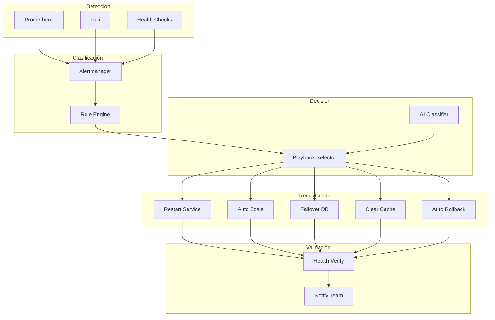

# Self-Healing Infrastructure

**Fecha de creación:** 2026-01-09 22:39  
**Última actualización:** 2026-01-09 22:39  
**Versión:** 1.0.0  
**Categoría:** Implementación

---

## 📑 Tabla de Contenidos (TOC)

1. [Propósito](#1-propósito)
2. [Arquitectura Self-Healing](#2-arquitectura-self-healing)
3. [Patrones de Recuperación](#3-patrones-de-recuperación)
4. [Implementación por Capa](#4-implementación-por-capa)
5. [Automatización con ECA](#5-automatización-con-eca)
6. [Runbooks Automatizados](#6-runbooks-automatizados)
7. [Métricas de Efectividad](#7-métricas-de-efectividad)
8. [Registro de Cambios](#8-registro-de-cambios)

---

## 1. Propósito

La infraestructura self-healing permite que el sistema:

- **Detecte** problemas automáticamente
- **Diagnostique** la causa raíz
- **Remedie** sin intervención humana
- **Escale** solo cuando sea necesario
- **Aprenda** de incidentes pasados

---

## 2. Arquitectura Self-Healing

### 2.1 Diagrama de Flujo



### 2.2 Niveles de Automatización

| Nivel | Descripción | Acción |
|-------|-------------|--------|
| **L0** | Detección automática | Solo alerta |
| **L1** | Diagnóstico automático | Sugiere acción |
| **L2** | Remediación semi-auto | Requiere aprobación |
| **L3** | Remediación automática | Sin intervención |
| **L4** | Prevención predictiva | Actúa antes del fallo |

---

## 3. Patrones de Recuperación

### 3.1 Circuit Breaker

```php
<?php

namespace Drupal\ecosistema_jaraba_core\Service;

class CircuitBreaker {

  private const STATE_CLOSED = 'closed';
  private const STATE_OPEN = 'open';
  private const STATE_HALF_OPEN = 'half_open';

  private int $failureThreshold = 5;
  private int $recoveryTimeout = 30;
  private int $failureCount = 0;
  private string $state = self::STATE_CLOSED;
  private int $lastFailureTime = 0;

  public function call(callable $action, callable $fallback): mixed {
    if ($this->state === self::STATE_OPEN) {
      if (time() - $this->lastFailureTime > $this->recoveryTimeout) {
        $this->state = self::STATE_HALF_OPEN;
      } else {
        return $fallback();
      }
    }

    try {
      $result = $action();
      $this->onSuccess();
      return $result;
    } catch (\Exception $e) {
      $this->onFailure();
      return $fallback();
    }
  }

  private function onSuccess(): void {
    $this->failureCount = 0;
    $this->state = self::STATE_CLOSED;
  }

  private function onFailure(): void {
    $this->failureCount++;
    $this->lastFailureTime = time();
    
    if ($this->failureCount >= $this->failureThreshold) {
      $this->state = self::STATE_OPEN;
    }
  }

}
```

### 3.2 Retry con Backoff Exponencial

```php
public function retryWithBackoff(callable $action, int $maxRetries = 3): mixed {
  $attempt = 0;
  $lastException = null;
  
  while ($attempt < $maxRetries) {
    try {
      return $action();
    } catch (\Exception $e) {
      $lastException = $e;
      $attempt++;
      
      // Backoff exponencial: 1s, 2s, 4s, 8s...
      $delay = pow(2, $attempt - 1);
      sleep($delay);
      
      $this->logger->warning('Retry attempt {attempt} after {delay}s: {error}', [
        'attempt' => $attempt,
        'delay' => $delay,
        'error' => $e->getMessage(),
      ]);
    }
  }
  
  throw $lastException;
}
```

### 3.3 Bulkhead Pattern

```php
// Aislamiento de recursos por tenant
class TenantBulkhead {

  private array $semaphores = [];
  private int $maxConcurrent = 10;

  public function execute(int $tenantId, callable $action): mixed {
    $semaphore = $this->getSemaphore($tenantId);
    
    if (!$semaphore->acquire()) {
      throw new OverloadException("Tenant {$tenantId} at capacity");
    }
    
    try {
      return $action();
    } finally {
      $semaphore->release();
    }
  }

}
```

---

## 4. Implementación por Capa

### 4.1 Capa de Aplicación (Drupal)

| Problema | Detección | Remediación Automática |
|----------|-----------|------------------------|
| OOM | Memory > 90% | Restart PHP-FPM graceful |
| Deadlock | Lock timeout | Kill query + retry |
| Cache miss spike | Hit rate < 50% | Warm cache |
| Session corruption | Session errors | Clear sessions |

### 4.2 Capa de Base de Datos

| Problema | Detección | Remediación Automática |
|----------|-----------|------------------------|
| Conexiones agotadas | Pool > 95% | Kill idle connections |
| Replication lag | Lag > 10s | Redirect reads to primary |
| Slow queries | Query > 5s | EXPLAIN + kill |
| Disk 90% | df > 90% | Purge old backups |

### 4.3 Capa de Infraestructura

| Problema | Detección | Remediación Automática |
|----------|-----------|------------------------|
| Container crash | Exit code != 0 | Restart container |
| Node unresponsive | Kubelet timeout | Cordon + reschedule |
| Certificate expiry | < 7 días | Renew cert-manager |
| DNS failure | Resolution timeout | Failover DNS |

---

## 5. Automatización con ECA

### 5.1 Modelo ECA: Auto-Restart de Servicio

```yaml
id: self_healing_service_restart
label: 'Self-Healing: Restart Servicio Fallido'
events:
  - plugin: webhook_received
    id: prometheus_alert
    configuration:
      path: /api/webhooks/prometheus
      
conditions:
  - plugin: data_value_matches
    id: check_alert_type
    configuration:
      key: alertname
      value: ServiceDown
      operator: equals
      
actions:
  - plugin: exec_command
    id: restart_service
    configuration:
      command: 'docker restart {{ service_name }}'
      
  - plugin: wait
    id: wait_startup
    configuration:
      duration: 30
      
  - plugin: http_request
    id: verify_health
    configuration:
      url: 'https://{{ service_name }}.jaraba-saas.lndo.site/health'
      method: GET
      
  - plugin: slack_notification
    id: notify_team
    configuration:
      channel: '#ops-alerts'
      message: '✅ Servicio {{ service_name }} reiniciado automáticamente'
```

### 5.2 Modelo ECA: Auto-Scaling

```yaml
id: self_healing_autoscale
label: 'Self-Healing: Auto-Scaling por Carga'
events:
  - plugin: cron
    id: check_load
    configuration:
      frequency: '*/5 * * * *'
      
conditions:
  - plugin: prometheus_query
    id: high_cpu
    configuration:
      query: 'avg(cpu_usage) > 80'
      
actions:
  - plugin: kubernetes_scale
    id: scale_up
    configuration:
      deployment: jaraba-appserver
      replicas: '+1'
      max: 10
      
  - plugin: slack_notification
    id: notify_scaling
    configuration:
      message: '📈 Escalado automático: +1 réplica appserver'
```

---

## 6. Runbooks Automatizados

### 6.1 Runbook: Database Failover

```yaml
runbook:
  name: database_failover
  trigger: mysql_primary_down
  
  steps:
    - name: verify_primary_down
      action: health_check
      target: mysql_primary
      timeout: 30s
      retries: 3
      
    - name: promote_replica
      action: mysql_promote
      target: mysql_replica_1
      condition: primary_confirmed_down
      
    - name: update_dns
      action: dns_update
      record: db.jaraba-saas.lndo.site
      target: mysql_replica_1_ip
      
    - name: notify_oncall
      action: pagerduty_incident
      severity: high
      message: "Database failover ejecutado automáticamente"
      
    - name: create_new_replica
      action: mysql_replica_create
      source: mysql_replica_1
      delay: 5m
```

### 6.2 Runbook: Deploy Rollback

```yaml
runbook:
  name: auto_rollback
  trigger: error_rate_spike
  
  conditions:
    - error_rate > 5% for 2m
    - deploy_age < 30m
    
  steps:
    - name: identify_previous_version
      action: git_get_previous_tag
      
    - name: execute_rollback
      action: deploy_version
      version: "{{ previous_version }}"
      
    - name: verify_health
      action: health_check_full
      timeout: 5m
      
    - name: notify_team
      action: slack_send
      channel: '#deploys'
      message: "⚠️ Rollback automático a {{ previous_version }}"
```

---

## 7. Métricas de Efectividad

### 7.1 KPIs de Self-Healing

| Métrica | Target | Fórmula |
|---------|--------|---------|
| **MTTR** | < 5 min | Tiempo medio de recuperación |
| **Auto-remediation rate** | > 80% | Incidentes resueltos automáticamente |
| **False positive rate** | < 5% | Remediaciones innecesarias |
| **Prevention rate** | > 30% | Problemas evitados proactivamente |

### 7.2 Dashboard Self-Healing

```promql
# Tasa de auto-remediación
sum(rate(self_healing_actions_success_total[24h])) / 
sum(rate(self_healing_actions_total[24h])) * 100

# MTTR promedio
avg(self_healing_recovery_duration_seconds)

# Incidentes prevenidos
sum(increase(predictive_actions_total[7d]))
```

---

## 8. Registro de Cambios

| Fecha | Versión | Autor | Descripción |
|-------|---------|-------|-------------|
| 2026-01-09 | 1.0.0 | IA Asistente | Creación inicial del documento |
