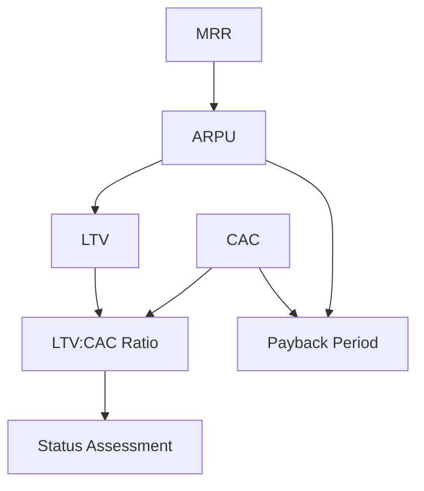
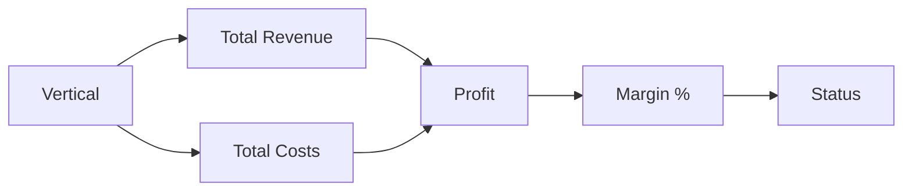

# FinOps 3.0 - Unit Economics y Vertical Profitability

**Fecha de creación:** 2026-01-13 12:55  
**Última actualización:** 2026-01-13 15:10  
**Versión:** 1.1.0  
**Categoría:** Implementación

---

## 📑 Tabla de Contenidos (TOC)

1. [Propósito](#1-propósito)
2. [Métricas Implementadas](#2-métricas-implementadas)
3. [Unit Economics](#3-unit-economics)
4. [Vertical Profitability](#4-vertical-profitability)
5. [Arquitectura Técnica](#5-arquitectura-técnica)
6. [Configuración de Datos](#6-configuración-de-datos)
7. [Visualización en Dashboard](#7-visualización-en-dashboard)
8. [Internacionalización (i18n) y UX](#8-internacionalización-i18n-y-ux)
9. [Registro de Cambios](#9-registro-de-cambios)

---

## 1. Propósito

La implementación de **FinOps 3.0** extiende el dashboard de operaciones financieras con:

- **Unit Economics**: Métricas SaaS avanzadas (LTV, CAC, Payback) por tenant
- **Vertical Profitability**: Análisis P&L por vertical de negocio
- **Alertas de Margen**: Detección de tenants con margen crítico o en pérdida
- **Transparencia Financiera**: Visibilidad total de rentabilidad a nivel granular

---

## 2. Métricas Implementadas

### 2.1 Estado Actual del Dashboard

| Métrica | Valor | Estado |
|---------|-------|--------|
| MRR (Monthly Recurring Revenue) | **€328** | ✅ Activo |
| ARR (Annual Recurring Revenue) | **€3,936** | ✅ Activo |
| Suscripciones Activas | **2** | ✅ Activo |
| Margen de Beneficio | **99.5%** | ✅ Activo |

### 2.2 Desglose por Plan

| Plan | Tenants | Ingreso Mensual |
|------|---------|-----------------|
| Basic (Starter) | 1 | €29/mes |
| Professional | 0 | €0/mes |
| Enterprise | 1 | €299/mes |

---

## 3. Unit Economics

### 3.1 Métricas por Tenant



### 3.2 Fórmulas Implementadas

| Métrica | Fórmula | Descripción |
|---------|---------|-------------|
| **ARPU** | `MRR` | Average Revenue Per User (1 tenant = 1 user en este contexto) |
| **LTV** | `(ARPU × Gross Margin) / Churn Rate` | Valor de vida del cliente |
| **CAC** | `€200 (default)` | Coste de adquisición de cliente (configurable) |
| **LTV:CAC** | `LTV / CAC` | Ratio de retorno de inversión en adquisición |
| **Payback** | `CAC / (ARPU × Gross Margin)` | Meses para recuperar CAC |

### 3.3 Parámetros de Configuración

```yaml
finops_config:
  default_cac: 200          # €200 CAC por defecto
  churn_rate: 0.05          # 5% mensual (12 meses retention)
  gross_margin: 0.75        # 75% margen bruto SaaS
```

### 3.4 Clasificación de Status

| Status | Criterio | Indicador |
|--------|----------|-----------|
| ⭐ **VIP** | LTV:CAC ≥ 5:1 | Cliente de alto valor |
| ✅ **Healthy** | LTV:CAC ≥ 3:1 | Cliente saludable |
| ⚠️ **At Risk** | LTV:CAC < 3:1 | Requiere atención |
| ⛔ **Loss** | Margen < 0% | Generando pérdidas |

### 3.5 Datos Actuales

| Tenant | MRR | LTV | CAC | LTV:CAC | Payback | Status |
|--------|-----|-----|-----|---------|---------|--------|
| Cooperativa Aceites del Sur | €299 | €4,485 | €200 | **22.4:1** | 0.9 mo | ⭐ VIP |
| Academia Talento Digital | €29 | €435 | €200 | **2.2:1** | 9.2 mo | ⚠️ At Risk |

---

## 4. Vertical Profitability

### 4.1 Métricas por Vertical



### 4.2 Clasificación de Verticales

| Status | Criterio | Indicador |
|--------|----------|-----------|
| ⭐ **Star** | Margen ≥ 50% | Vertical estrella |
| ✅ **Healthy** | Margen ≥ 20% | Rentabilidad saludable |
| ⚠️ **Warning** | Margen < 20% | Requiere optimización |
| ⛔ **Critical** | Margen < 0% | Generando pérdidas |

### 4.3 Datos Actuales

| Vertical | Tenants | Revenue | Costs | Profit | Margen | Status |
|----------|---------|---------|-------|--------|--------|--------|
| AgroConecta | 1 | €299 | €0.75 | €298.25 | **99.7%** | ⭐ Star |
| ImpactHub | 1 | €29 | €0.75 | €28.25 | **97.4%** | ⭐ Star |

---

## 5. Arquitectura Técnica

### 5.1 Flujo de Datos

```
┌─────────────────────────────────┐
│     FinOpsDashboardController   │
└─────────────────┬───────────────┘
                  │
      ┌───────────┼───────────┐
      │           │           │
      ▼           ▼           ▼
┌─────────┐ ┌─────────┐ ┌─────────────────┐
│getTenant│ │getRevenue│ │getUnitEconomics│
│ Usage() │ │  Data() │ │      ()        │
└────┬────┘ └────┬────┘ └───────┬────────┘
     │           │              │
     │ ┌─────────▼──────────┐   │
     └─►  plan_cost['mrr']  ◄───┘
       └────────────────────┘
                  │
                  ▼
       ┌──────────────────┐
       │ getVertical      │
       │ Profitability()  │
       └──────────────────┘
```

### 5.2 Cambios Clave en Código

#### 5.2.1 Acceso al Plan del Tenant

```php
// ANTES (incorrecto - campo 'plan' no existe)
if ($tenant->hasField('plan')) {
    $plan = $tenant->get('plan')->entity;
}

// DESPUÉS (correcto - usa método getSubscriptionPlan())
if (method_exists($tenant, 'getSubscriptionPlan')) {
    $plan_entity = $tenant->getSubscriptionPlan();
    if ($plan_entity) {
        $plan_mrr = $plan_entity->getPriceMonthly();
    }
}
```

#### 5.2.2 Render Array del Dashboard

```php
// AÑADIDO: Variables para Unit Economics
return [
    // ... variables existentes ...
    '#unit_economics' => $finops_data['unit_economics'],
    '#vertical_profitability' => $finops_data['vertical_profitability'],
];
```

### 5.3 Archivos Modificados

| Archivo | Cambio |
|---------|--------|
| `FinOpsDashboardController.php` | Métodos getUnitEconomics(), getVerticalProfitability(), correcciones acceso plan |
| `finops-dashboard.html.twig` | Secciones Unit Economics y Vertical Profitability |
| `_finops-dashboard.scss` | Estilos para nuevas secciones |

---

## 6. Configuración de Datos

### 6.1 Planes SaaS

Configurados en `/admin/structure/saas-plans`:

| Plan | ID | Precio Mensual | Precio Anual |
|------|-----|----------------|--------------|
| Basic (Starter) | 1 | €29 | €290 |
| Professional | 2 | €99 | €990 |
| Enterprise | 3 | €299 | €2,990 |

### 6.2 Asignación Tenant → Plan

Configurado en `/admin/structure/tenants`:

| Tenant | Campo `subscription_plan` | Vertical |
|--------|---------------------------|----------|
| Cooperativa Aceites del Sur | Enterprise (3) | AgroConecta |
| Academia Talento Digital | Basic (1) | ImpactHub |

---

## 7. Visualización en Dashboard

### 7.1 URL de Acceso

```
/admin/finops
```

### 7.2 Secciones Visibles

1. **📊 Cost Overview** - Métricas de coste por recurso
2. **🏢 Cost by Tenant** - Desglose por inquilino
3. **💵 Revenue** - MRR, ARR, suscripciones por plan
4. **📉 Net Results (P&L)** - Ingresos vs costos
5. **📈 Unit Economics** - LTV, CAC, Payback por tenant ⭐ **NUEVO**
6. **🏢 Vertical Profitability** - P&L por vertical ⭐ **NUEVO**

---

## 8. Internacionalización (i18n) y UX

### 8.1 Textos Traducidos

Todos los textos de las secciones Unit Economics y Vertical Profitability están en español:

| Elemento | Traducción |
|----------|------------|
| Título sección | "Analítica de Inquilinos" |
| Subtítulo | "Métricas de rentabilidad y valor de cliente por inquilino" |
| Encabezados tabla | Inquilino, Coste Op., Margen, Estado |
| Estados | Saludable, En Riesgo, VIP, Pérdida, Estrella |
| Unidades | meses (no "mo"), inquilino/s |

### 8.2 Glosario de Métricas

Se añadió un glosario explicativo con definiciones en español:

- **MRR**: Ingresos Recurrentes Mensuales
- **LTV**: Valor de Vida del Cliente
- **CAC**: Coste de Adquisición de Cliente
- **LTV:CAC**: Ratio valor del cliente vs coste de adquisición (objetivo: ≥3:1)
- **Payback**: Meses para recuperar el coste de adquisición

### 8.3 Estilos CSS

| Cambio | Descripción |
|--------|-------------|
| Gap glosario | `margin-bottom: $ej-spacing-xl` entre glosario y tarjetas |
| Texto tabla | Color blanco (`$finops-text`) para legibilidad |
| Nombre inquilino | `font-weight: semibold` y tamaño base |

---

## 9. Registro de Cambios

| Fecha | Versión | Autor | Descripción |
|-------|---------|-------|-------------|
| 2026-01-09 | 1.0.0 | IA Asistente | Creación inicial FinOps dashboard |
| 2026-01-13 | 2.0.0 | IA Asistente | Añadidas secciones Unit Economics y Vertical Profitability |
| 2026-01-13 | 2.1.0 | IA Asistente | i18n: Todos los textos en español, glosario de métricas, UX mejorada |
