# Plan Maestro de Cierre de Gaps — Especificaciones Tecnicas 20260202 + 20260204

## 15 Gaps en 9 Documentos Tecnicos — 7 Fases de Implementacion

**Fecha de creacion:** 2026-02-12
**Ultima actualizacion:** 2026-02-12
**Autor:** IA Asistente (Claude Opus 4.6) — Arquitecto SaaS Senior
**Version:** 1.0.0
**Categoria:** Plan Maestro de Implementacion — Cierre de Gaps
**Codigo:** PLAN-20260202-20260204-GAPS-MAESTRO-v1
**Roles:** Arquitecto SaaS, Ingeniero Drupal Senior, Ingeniero Frontend Senior, QA Lead

---

## Tabla de Contenidos (TOC)

1. [Resumen Ejecutivo](#1-resumen-ejecutivo)
2. [Contexto y Alcance](#2-contexto-y-alcance)
   - 2.1 [Documentos Fuente Auditados](#21-documentos-fuente-auditados)
   - 2.2 [Estado Actual vs Target](#22-estado-actual-vs-target)
   - 2.3 [Inversion Total Estimada](#23-inversion-total-estimada)
3. [Catalogo Completo de 15 Gaps](#3-catalogo-completo-de-15-gaps)
   - 3.1 [Tabla Maestra de Gaps](#31-tabla-maestra-de-gaps)
   - 3.2 [Clasificacion por Prioridad](#32-clasificacion-por-prioridad)
   - 3.3 [Clasificacion por Modulo](#33-clasificacion-por-modulo)
4. [Arquitectura General del Plan](#4-arquitectura-general-del-plan)
   - 4.1 [Diagrama de Dependencias entre Fases](#41-diagrama-de-dependencias-entre-fases)
   - 4.2 [Diagrama de Arquitectura de Modulos](#42-diagrama-de-arquitectura-de-modulos)
   - 4.3 [Flujo de Ejecucion Temporal](#43-flujo-de-ejecucion-temporal)
5. [FASE 1 — jaraba_interactive: Plugins PHP + EventSubscribers (P0, 80-100h)](#5-fase-1--jaraba_interactive-plugins-php--eventsubscribers-p0-80-100h)
   - 5.1 [Gaps Cubiertos: INT-001, INT-002](#51-gaps-cubiertos-int-001-int-002)
   - 5.2 [Arquitectura del Sistema de Plugins](#52-arquitectura-del-sistema-de-plugins)
   - 5.3 [JSON Schemas de los 5 Plugins](#53-json-schemas-de-los-5-plugins)
   - 5.4 [EventSubscribers: Completion + xAPI](#54-eventsubscribers-completion--xapi)
   - 5.5 [Motores JS, Twig Templates, SCSS](#55-motores-js-twig-templates-scss)
   - 5.6 [Patron de Referencia: Plugin PHP](#56-patron-de-referencia-plugin-php)
   - 5.7 [Arbol de Archivos Fase 1](#57-arbol-de-archivos-fase-1)
6. [FASE 2 — jaraba_interactive: Editor + CRUD APIs (P0/P1, 45-55h)](#6-fase-2--jaraba_interactive-editor--crud-apis-p0p1-45-55h)
   - 6.1 [Gaps Cubiertos: INT-003, INT-004](#61-gaps-cubiertos-int-003-int-004)
   - 6.2 [Arquitectura del Editor](#62-arquitectura-del-editor)
   - 6.3 [API CRUD: 6 Endpoints](#63-api-crud-6-endpoints)
   - 6.4 [Patron de Referencia: EditorController](#64-patron-de-referencia-editorcontroller)
7. [FASE 3 — Training Purchase + Andalucia EI Slide-Panel (P0/P1, 30-40h)](#7-fase-3--training-purchase--andalucia-ei-slide-panel-p0p1-30-40h)
   - 7.1 [Gaps Cubiertos: TRN-001, TRN-002, AND-001](#71-gaps-cubiertos-trn-001-trn-002-and-001)
   - 7.2 [PurchaseService y Flujo de Compra](#72-purchaseservice-y-flujo-de-compra)
   - 7.3 [Andalucia EI Slide-Panel CRUD](#73-andalucia-ei-slide-panel-crud)
   - 7.4 [Integracion H5P/Exam en CertificationProgram](#74-integracion-h5pexam-en-certificationprogram)
8. [FASE 4 — Canvas Editor E2E + CacheTagsInvalidator (P1/P3, 25-30h)](#8-fase-4--canvas-editor-e2e--cachetagsinvalidator-p1p3-25-30h)
   - 8.1 [Gaps Cubiertos: PB-001, CV3-001](#81-gaps-cubiertos-pb-001-cv3-001)
   - 8.2 [CanvasCacheTagsInvalidator Service](#82-canvascachetagsinvalidator-service)
   - 8.3 [Cypress E2E: 5 Specs Nuevas](#83-cypress-e2e-5-specs-nuevas)
9. [FASE 5 — SCSS Compliance + Template Normalization (P1/P3, 20-25h)](#9-fase-5--scss-compliance--template-normalization-p1p3-20-25h)
   - 9.1 [Gaps Cubiertos: SCSS-001, TMPL-001, PJ-002](#91-gaps-cubiertos-scss-001-tmpl-001-pj-002)
   - 9.2 [Auditoria SCSS: 14 Modulos](#92-auditoria-scss-14-modulos)
   - 9.3 [hero_subtitle Bug Fix](#93-hero_subtitle-bug-fix)
   - 9.4 [Migracion @import a @use](#94-migracion-import-a-use)
10. [FASE 6 — pepejaraba.com: Contenido + Infraestructura (P2, 30-40h)](#10-fase-6--pepejarabacom-contenido--infraestructura-p2-30-40h)
    - 10.1 [Gaps Cubiertos: PJ-001, PJ-003](#101-gaps-cubiertos-pj-001-pj-003)
    - 10.2 [Tenant personal_brand](#102-tenant-personal_brand)
    - 10.3 [Provisionamiento de Contenido](#103-provisionamiento-de-contenido)
    - 10.4 [Infraestructura DNS/SSL/vhost](#104-infraestructura-dnssslvhost)
11. [FASE 7 — Test Suites (P1/P2, 15-20h)](#11-fase-7--test-suites-p1p2-15-20h)
    - 11.1 [Gaps Cubiertos: INT-005 + Transversales](#111-gaps-cubiertos-int-005--transversales)
    - 11.2 [11 Archivos PHPUnit](#112-11-archivos-phpunit)
    - 11.3 [Estrategia de Cobertura](#113-estrategia-de-cobertura)
12. [Matriz de Cumplimiento de Directrices](#12-matriz-de-cumplimiento-de-directrices)
    - 12.1 [14 Directrices Obligatorias](#121-14-directrices-obligatorias)
    - 12.2 [Verificacion por Fase](#122-verificacion-por-fase)
13. [Grupos de Auditoria](#13-grupos-de-auditoria)
14. [Estrategia de Testing y Verificacion](#14-estrategia-de-testing-y-verificacion)
15. [Roadmap de Ejecucion](#15-roadmap-de-ejecucion)
16. [Metricas de Exito](#16-metricas-de-exito)
17. [Glosario de Terminos](#17-glosario-de-terminos)
18. [Referencias Cruzadas](#18-referencias-cruzadas)
19. [Registro de Cambios](#19-registro-de-cambios)

---

## 1. Resumen Ejecutivo

Este Plan Maestro consolida el cierre de **15 gaps** identificados en **9 documentos tecnicos** con fecha 20260202 y 20260204 del proyecto Jaraba Impact Platform SaaS. La auditoria exhaustiva revelo que el nivel de implementacion actual se situa en torno al **76%**, con gaps concentrados principalmente en el modulo `jaraba_interactive` (sistema de contenido interactivo), el flujo de compra de formacion, la integracion con Andalucia EI, las pruebas E2E del Canvas Editor, la compliance SCSS y la infraestructura de pepejaraba.com.

El plan se estructura en **7 fases** con una estimacion total de **245-310 horas** y se organiza en **5 grupos de auditoria** para verificacion progresiva.

| Metrica | Valor |
|---------|-------|
| Gaps totales identificados | 15 |
| Documentos tecnicos auditados | 9 |
| Modulos afectados | 8 + Infraestructura |
| Fases de implementacion | 7 |
| Horas estimadas (rango) | 245-310h |
| Coste estimado (a 65 EUR/h) | 15,925-20,150 EUR |
| Nivel actual de implementacion | ~76% |
| Nivel objetivo | 100% |
| Grupos de auditoria | 5 |
| Prioridad maxima (P0) | Fases 1-2 (jaraba_interactive core) |

**Principio rector:**
> Cada componente debe cumplir con las 14 directrices del proyecto: documentacion en castellano, SCSS con tokens federados `var(--ej-*)`, Twig Zero-Region, Slide-Panel CRUD, textos traducibles con `t()` / ``, Entity Pattern (4 YAML), iconos duales SVG via `jaraba_icon()`, paleta de colores brand, IA via `@ai.provider`, comentarios 3D en castellano, comandos Docker/Lando, compilacion NVM/WSL, body classes via `hook_preprocess_html`, y verificacion del codigo existente antes de crear.

---

## 2. Contexto y Alcance

### 2.1 Documentos Fuente Auditados

| # | Codigo Documento | Titulo | Fecha | Modulo Principal |
|---|------------------|--------|-------|------------------|
| 1 | `20260204-Jaraba_Interactive_AI_Arquitectura_Maestra_v1` | Arquitectura Maestra Contenido Interactivo | 2026-02-04 | `jaraba_interactive` |
| 2 | `20260204b-Canvas_Editor_v3_Arquitectura_Maestra` | Canvas Editor v3 Hibrido GrapesJS | 2026-02-04 | `jaraba_page_builder` |
| 3 | `20260204a-Evaluacion_Arquitectonica_Jaraba_Canvas_Claude` | Evaluacion Arquitectonica Canvas | 2026-02-04 | `jaraba_page_builder` |
| 4 | `20260204_Auditoria_Canvas_Editor_vs_Specs` | Auditoria Canvas vs Specs | 2026-02-04 | `jaraba_page_builder` |
| 5 | `20260202-PepeJaraba_Audit_Plan_v1_Claude` | Auditoria y Plan pepejaraba.com | 2026-02-02 | Multiple / Infra |
| 6 | `20260204e-Bloque_E_Training_Gaps_Completion_v2_Claude` | Training Gaps Completion v2 | 2026-02-04 | `jaraba_training` |
| 7 | `20260204b-H5P_Integration_Research_Drupal11_v1_Claude` | H5P Integration Research | 2026-02-04 | `jaraba_interactive` |
| 8 | `20260121b-Analisis_Impacto_Copiloto_Programa_Andalucia_ei` | Impacto Copiloto Andalucia EI | 2026-01-21 | `jaraba_andalucia_ei` |
| 9 | `20260204g-Bloque_G_AI_Skills_Implementacion_v2_Claude` | AI Skills Implementacion v2 | 2026-02-04 | `jaraba_ai_agents` |

### 2.2 Estado Actual vs Target

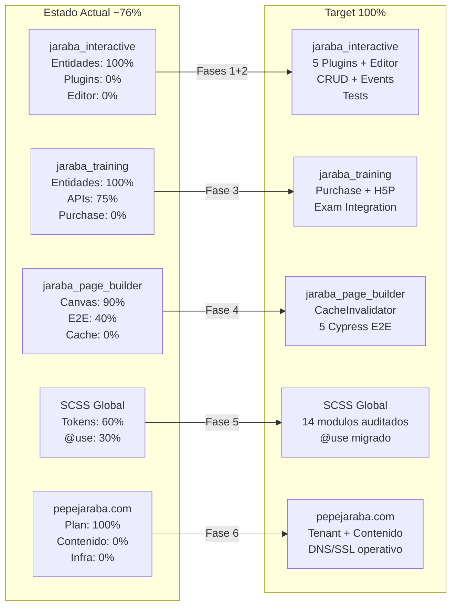

### 2.3 Inversion Total Estimada

| Fase | Descripcion | Horas Min | Horas Max | Coste Min (EUR) | Coste Max (EUR) |
|------|-------------|-----------|-----------|-----------------|-----------------|
| F1 | Plugins PHP + EventSubscribers | 80 | 100 | 5,200 | 6,500 |
| F2 | Editor + CRUD APIs | 45 | 55 | 2,925 | 3,575 |
| F3 | Training Purchase + Andalucia EI | 30 | 40 | 1,950 | 2,600 |
| F4 | Canvas E2E + CacheInvalidator | 25 | 30 | 1,625 | 1,950 |
| F5 | SCSS Compliance + Templates | 20 | 25 | 1,300 | 1,625 |
| F6 | pepejaraba.com Contenido + Infra | 30 | 40 | 1,950 | 2,600 |
| F7 | Test Suites | 15 | 20 | 975 | 1,300 |
| **TOTAL** | | **245** | **310** | **15,925** | **20,150** |

---

## 3. Catalogo Completo de 15 Gaps

### 3.1 Tabla Maestra de Gaps

| Gap ID | Modulo | Descripcion | Prioridad | Fase | Horas Est. | Doc Fuente |
|--------|--------|-------------|-----------|------|------------|------------|
| INT-001 | `jaraba_interactive` | 5 plugins PHP de tipo interactivo faltantes (InteractiveVideo, CoursePresentation, BranchingScenario, DragAndDrop, Essay) | P0 | F1 | 50-60 | 20260204 |
| INT-002 | `jaraba_interactive` | CompletionSubscriber + XapiSubscriber event subscribers faltantes | P0 | F1 | 30-40 | 20260204 |
| INT-003 | `jaraba_interactive` | Sistema de editor completo (EditorController, content-editor.js, preview-engine.js, 6 editores por tipo) | P0 | F2 | 30-35 | 20260204 |
| INT-004 | `jaraba_interactive` | 6 endpoints CRUD REST en ApiController | P1 | F2 | 15-20 | 20260204 |
| INT-005 | `jaraba_interactive` | Cobertura de tests unitarios insuficiente | P1 | F7 | 8-12 | 20260204 |
| TRN-001 | `jaraba_training` | Endpoint de compra (`purchase()`) faltante en TrainingApiController | P0 | F3 | 10-15 | 20260204e |
| TRN-002 | `jaraba_training` | Integracion H5P/examen: campo `exam_content_id` en CertificationProgram | P1 | F3 | 8-10 | 20260204b |
| AND-001 | `jaraba_andalucia_ei` | Slide-panel CRUD faltante (AndaluciaEiApiController) | P1 | F3 | 12-15 | 20260121b |
| PB-001 | `jaraba_page_builder` | Suite Cypress E2E incompleta (5 specs nuevas necesarias) | P1 | F4 | 15-18 | 20260204b |
| CV3-001 | `jaraba_page_builder` | CanvasCacheTagsInvalidator service faltante | P3 | F4 | 10-12 | 20260204a |
| SCSS-001 | Multiple (14 modulos) | Auditoria SCSS tokens: `darken()`/`lighten()` a `color.adjust()`, `@import` a `@use` | P1 | F5 | 12-15 | 20260204b |
| TMPL-001 | `jaraba_page_builder` | Normalizacion de nombres de templates Twig | P3 | F5 | 4-5 | 20260204_Auditoria |
| PJ-001 | Multiple | Contenido de pepejaraba.com (14 paginas, medios, textos) | P2 | F6 | 18-24 | 20260202 |
| PJ-002 | `ecosistema_jaraba_theme` | Bug `hero_subtitle` con `striptags\|raw` — HTML escapado | P1 | F5 | 4-5 | 20260202 |
| PJ-003 | Infraestructura | Infraestructura produccion pepejaraba.com (DNS, SSL, vhost, tenant) | P2 | F6 | 12-16 | 20260202 |

### 3.2 Clasificacion por Prioridad

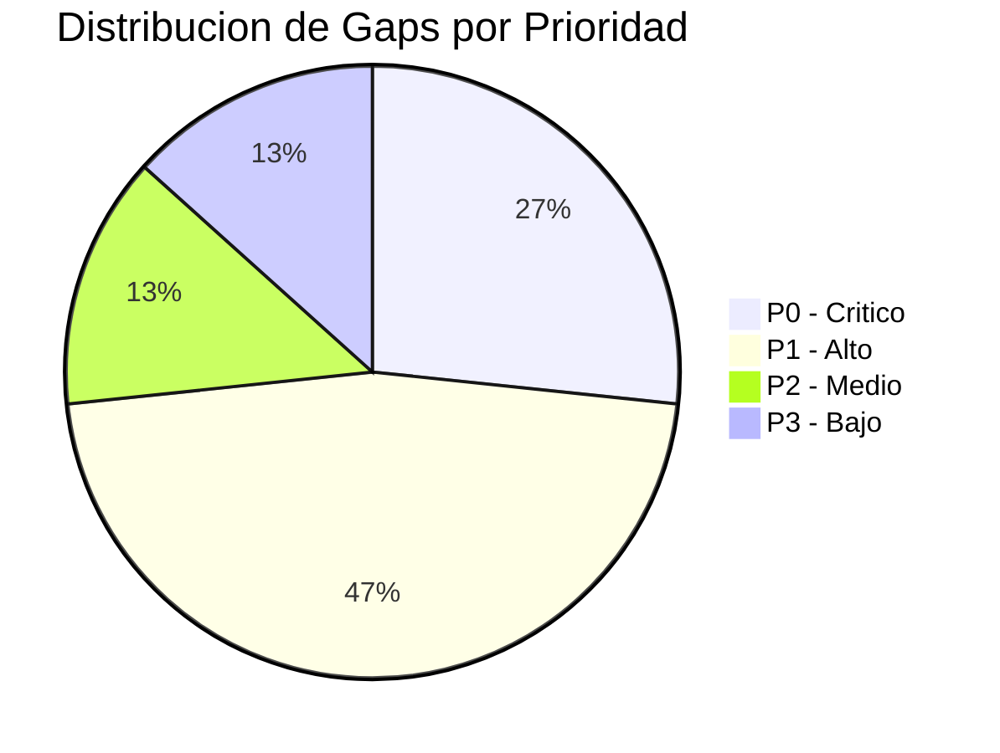

| Prioridad | Gaps | IDs | Horas Acumuladas |
|-----------|------|-----|------------------|
| P0 (Critico) | 4 | INT-001, INT-002, INT-003, TRN-001 | 120-150h |
| P1 (Alto) | 7 | INT-004, INT-005, TRN-002, AND-001, PB-001, SCSS-001, PJ-002 | 63-82h |
| P2 (Medio) | 2 | PJ-001, PJ-003 | 30-40h |
| P3 (Bajo) | 2 | CV3-001, TMPL-001 | 14-17h |

### 3.3 Clasificacion por Modulo

| Modulo | Gaps | IDs | Horas |
|--------|------|-----|-------|
| `jaraba_interactive` | 5 | INT-001 a INT-005 | 133-167h |
| `jaraba_training` | 2 | TRN-001, TRN-002 | 18-25h |
| `jaraba_andalucia_ei` | 1 | AND-001 | 12-15h |
| `jaraba_page_builder` | 3 | PB-001, CV3-001, TMPL-001 | 29-35h |
| `ecosistema_jaraba_theme` | 1 | PJ-002 | 4-5h |
| Multiple (SCSS) | 1 | SCSS-001 | 12-15h |
| Multiple (pepejaraba.com) | 1 | PJ-001 | 18-24h |
| Infraestructura | 1 | PJ-003 | 12-16h |

---

## 4. Arquitectura General del Plan

### 4.1 Diagrama de Dependencias entre Fases

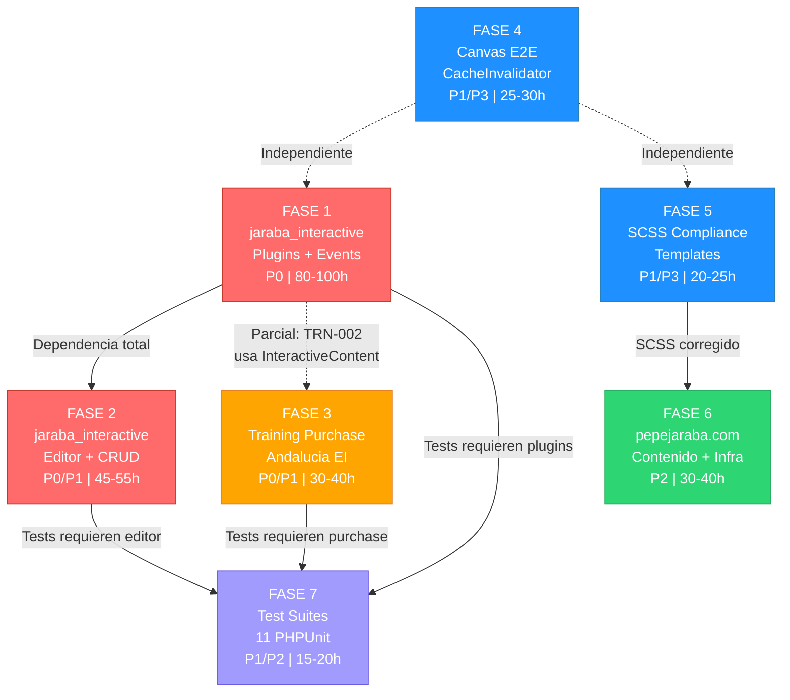

**Leyenda de colores:**
- Rojo: P0 (Critico, bloqueante)
- Naranja: P0/P1 (Mixto, alta prioridad)
- Azul: P1/P3 (Alto/Bajo, independiente)
- Verde: P2 (Medio, contenido)
- Morado: P1/P2 (Testing, dependiente)

### 4.2 Diagrama de Arquitectura de Modulos

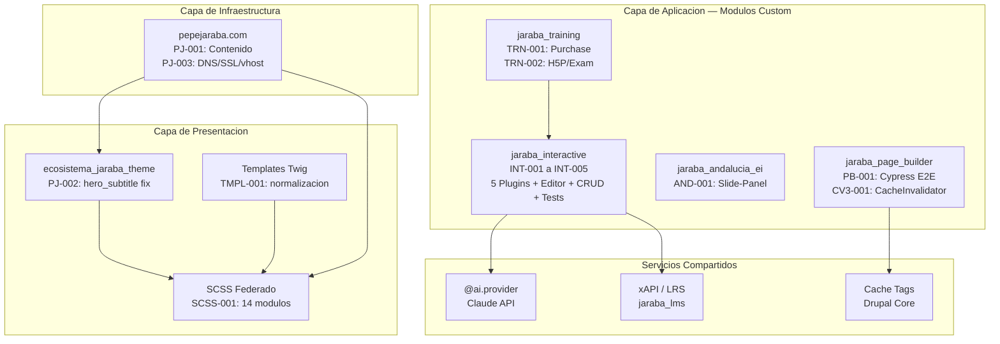

### 4.3 Flujo de Ejecucion Temporal

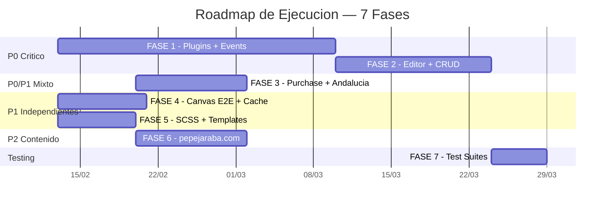

---

## 5. FASE 1 — jaraba_interactive: Plugins PHP + EventSubscribers (P0, 80-100h)

### 5.1 Gaps Cubiertos: INT-001, INT-002

| Gap | Componente | Estado Actual | Target |
|-----|-----------|---------------|--------|
| INT-001 | 5 plugins InteractiveType PHP | 0% — No existen | 100% — 5 plugins completos con anotaciones |
| INT-002 | CompletionSubscriber + XapiSubscriber | 0% — No existen | 100% — 2 event subscribers registrados |

**Modulo:** `web/modules/custom/jaraba_interactive`

**Contexto:** La especificacion `20260204-Jaraba_Interactive_AI_Arquitectura_Maestra_v1` define un sistema de contenido interactivo 100% propio (sin H5P) con un sistema de plugins Drupal para cada tipo de contenido. La entidad `InteractiveContent` ya existe, pero los 5 plugins de tipo que implementan la logica de rendering, validacion y scoring no han sido creados. Tampoco existen los EventSubscribers para completar el ciclo de tracking xAPI y marcado de completitud.

### 5.2 Arquitectura del Sistema de Plugins

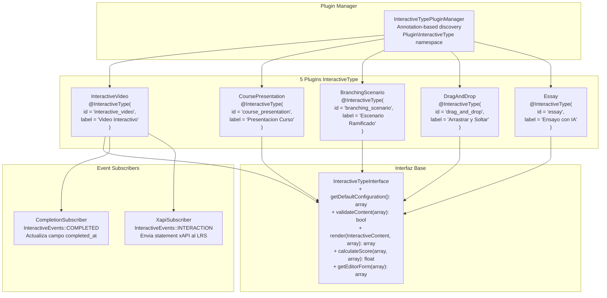

### 5.3 JSON Schemas de los 5 Plugins

#### 5.3.1 InteractiveVideo — Schema de Contenido

```json
{
  "$schema": "https://json-schema.org/draft/2020-12/schema",
  "$id": "jaraba_interactive://schemas/interactive_video.json",
  "title": "InteractiveVideo Content Schema",
  "description": "Esquema para contenido de tipo Video Interactivo en jaraba_interactive",
  "type": "object",
  "required": ["video", "interactions"],
  "properties": {
    "video": {
      "type": "object",
      "required": ["source", "duration"],
      "properties": {
        "source": {
          "type": "string",
          "description": "URL del video (YouTube, Vimeo, o file managed por Drupal)",
          "pattern": "^(https?://|public://|private://)"
        },
        "duration": {
          "type": "integer",
          "minimum": 1,
          "description": "Duracion en segundos"
        },
        "poster": {
          "type": "string",
          "description": "URL de imagen poster"
        },
        "subtitles": {
          "type": "array",
          "items": {
            "type": "object",
            "required": ["language", "src"],
            "properties": {
              "language": { "type": "string", "pattern": "^[a-z]{2}$" },
              "src": { "type": "string" },
              "label": { "type": "string" }
            }
          }
        }
      }
    },
    "interactions": {
      "type": "array",
      "items": {
        "type": "object",
        "required": ["type", "time", "data"],
        "properties": {
          "type": {
            "type": "string",
            "enum": ["quiz", "hotspot", "text_overlay", "branch_point", "pause_screen"]
          },
          "time": {
            "type": "number",
            "minimum": 0,
            "description": "Segundo en el que aparece la interaccion"
          },
          "duration": {
            "type": "number",
            "minimum": 0,
            "description": "Duracion de la interaccion en segundos (0 = hasta interactuar)"
          },
          "position": {
            "type": "object",
            "properties": {
              "x": { "type": "number", "minimum": 0, "maximum": 100 },
              "y": { "type": "number", "minimum": 0, "maximum": 100 }
            }
          },
          "data": {
            "type": "object",
            "description": "Datos especificos del tipo de interaccion"
          },
          "required_for_completion": {
            "type": "boolean",
            "default": false
          }
        }
      }
    },
    "settings": {
      "type": "object",
      "properties": {
        "allow_skip": { "type": "boolean", "default": false },
        "show_progress_bar": { "type": "boolean", "default": true },
        "passing_score": { "type": "number", "minimum": 0, "maximum": 100, "default": 70 },
        "max_attempts": { "type": "integer", "minimum": 0, "default": 0 },
        "show_solutions": { "type": "boolean", "default": true }
      }
    }
  }
}
```

#### 5.3.2 CoursePresentation — Schema de Contenido

```json
{
  "$schema": "https://json-schema.org/draft/2020-12/schema",
  "$id": "jaraba_interactive://schemas/course_presentation.json",
  "title": "CoursePresentation Content Schema",
  "description": "Esquema para contenido de tipo Presentacion de Curso",
  "type": "object",
  "required": ["slides"],
  "properties": {
    "slides": {
      "type": "array",
      "minItems": 1,
      "items": {
        "type": "object",
        "required": ["elements"],
        "properties": {
          "title": { "type": "string" },
          "background": {
            "type": "object",
            "properties": {
              "type": { "type": "string", "enum": ["color", "image", "gradient"] },
              "value": { "type": "string" }
            }
          },
          "elements": {
            "type": "array",
            "items": {
              "type": "object",
              "required": ["type", "position", "size"],
              "properties": {
                "type": {
                  "type": "string",
                  "enum": ["text", "image", "video", "quiz", "code_block", "chart", "embed"]
                },
                "position": {
                  "type": "object",
                  "properties": {
                    "x": { "type": "number" },
                    "y": { "type": "number" }
                  }
                },
                "size": {
                  "type": "object",
                  "properties": {
                    "width": { "type": "number" },
                    "height": { "type": "number" }
                  }
                },
                "data": { "type": "object" },
                "animation": {
                  "type": "object",
                  "properties": {
                    "type": { "type": "string", "enum": ["fade", "slide", "zoom", "none"] },
                    "delay": { "type": "number", "default": 0 }
                  }
                }
              }
            }
          },
          "notes": {
            "type": "string",
            "description": "Notas del presentador"
          },
          "transition": {
            "type": "string",
            "enum": ["slide", "fade", "none"],
            "default": "slide"
          }
        }
      }
    },
    "settings": {
      "type": "object",
      "properties": {
        "auto_advance": { "type": "boolean", "default": false },
        "auto_advance_delay": { "type": "integer", "default": 5000 },
        "show_navigation": { "type": "boolean", "default": true },
        "enable_keyboard": { "type": "boolean", "default": true },
        "passing_score": { "type": "number", "minimum": 0, "maximum": 100, "default": 70 }
      }
    }
  }
}
```

#### 5.3.3 BranchingScenario — Schema de Contenido

```json
{
  "$schema": "https://json-schema.org/draft/2020-12/schema",
  "$id": "jaraba_interactive://schemas/branching_scenario.json",
  "title": "BranchingScenario Content Schema",
  "description": "Esquema para contenido de tipo Escenario Ramificado",
  "type": "object",
  "required": ["start_node", "nodes"],
  "properties": {
    "start_node": {
      "type": "string",
      "description": "ID del nodo inicial del escenario"
    },
    "nodes": {
      "type": "object",
      "additionalProperties": {
        "type": "object",
        "required": ["type", "content"],
        "properties": {
          "type": {
            "type": "string",
            "enum": ["content", "question", "ending"]
          },
          "content": {
            "type": "object",
            "properties": {
              "title": { "type": "string" },
              "body": { "type": "string" },
              "media": {
                "type": "object",
                "properties": {
                  "type": { "type": "string", "enum": ["image", "video", "none"] },
                  "src": { "type": "string" }
                }
              }
            }
          },
          "choices": {
            "type": "array",
            "items": {
              "type": "object",
              "required": ["text", "next_node"],
              "properties": {
                "text": { "type": "string" },
                "next_node": { "type": "string" },
                "score": { "type": "number", "default": 0 },
                "feedback": { "type": "string" }
              }
            }
          },
          "ending_score": {
            "type": "number",
            "description": "Puntuacion final si es nodo ending"
          },
          "ending_feedback": {
            "type": "string",
            "description": "Retroalimentacion final personalizada"
          }
        }
      }
    },
    "settings": {
      "type": "object",
      "properties": {
        "scoring_mode": { "type": "string", "enum": ["cumulative", "ending_only"], "default": "cumulative" },
        "allow_backtrack": { "type": "boolean", "default": false },
        "show_score": { "type": "boolean", "default": true },
        "passing_score": { "type": "number", "minimum": 0, "maximum": 100, "default": 60 }
      }
    }
  }
}
```

#### 5.3.4 DragAndDrop — Schema de Contenido

```json
{
  "$schema": "https://json-schema.org/draft/2020-12/schema",
  "$id": "jaraba_interactive://schemas/drag_and_drop.json",
  "title": "DragAndDrop Content Schema",
  "description": "Esquema para contenido de tipo Arrastrar y Soltar",
  "type": "object",
  "required": ["background", "drop_zones", "draggables"],
  "properties": {
    "background": {
      "type": "object",
      "required": ["type"],
      "properties": {
        "type": { "type": "string", "enum": ["image", "color", "grid"] },
        "src": { "type": "string" },
        "color": { "type": "string" },
        "width": { "type": "integer" },
        "height": { "type": "integer" }
      }
    },
    "drop_zones": {
      "type": "array",
      "items": {
        "type": "object",
        "required": ["id", "position", "size", "accepts"],
        "properties": {
          "id": { "type": "string" },
          "label": { "type": "string" },
          "position": {
            "type": "object",
            "properties": {
              "x": { "type": "number" },
              "y": { "type": "number" }
            }
          },
          "size": {
            "type": "object",
            "properties": {
              "width": { "type": "number" },
              "height": { "type": "number" }
            }
          },
          "accepts": {
            "type": "array",
            "items": { "type": "string" },
            "description": "IDs de draggables que son respuestas correctas"
          },
          "max_items": { "type": "integer", "default": 1 }
        }
      }
    },
    "draggables": {
      "type": "array",
      "items": {
        "type": "object",
        "required": ["id", "type"],
        "properties": {
          "id": { "type": "string" },
          "type": { "type": "string", "enum": ["text", "image"] },
          "content": { "type": "string" },
          "image_src": { "type": "string" },
          "reusable": { "type": "boolean", "default": false }
        }
      }
    },
    "settings": {
      "type": "object",
      "properties": {
        "instant_feedback": { "type": "boolean", "default": true },
        "show_correct_on_fail": { "type": "boolean", "default": true },
        "max_attempts": { "type": "integer", "minimum": 0, "default": 0 },
        "passing_score": { "type": "number", "minimum": 0, "maximum": 100, "default": 70 },
        "shuffle_draggables": { "type": "boolean", "default": true }
      }
    }
  }
}
```

#### 5.3.5 Essay — Schema de Contenido

```json
{
  "$schema": "https://json-schema.org/draft/2020-12/schema",
  "$id": "jaraba_interactive://schemas/essay.json",
  "title": "Essay Content Schema",
  "description": "Esquema para contenido de tipo Ensayo con evaluacion IA",
  "type": "object",
  "required": ["prompt", "evaluation"],
  "properties": {
    "prompt": {
      "type": "object",
      "required": ["instructions"],
      "properties": {
        "instructions": {
          "type": "string",
          "description": "Instrucciones del ensayo para el estudiante"
        },
        "context": {
          "type": "string",
          "description": "Material de contexto proporcionado al estudiante"
        },
        "word_limit": {
          "type": "object",
          "properties": {
            "min": { "type": "integer", "minimum": 0, "default": 100 },
            "max": { "type": "integer", "minimum": 1, "default": 2000 }
          }
        },
        "reference_material": {
          "type": "array",
          "items": {
            "type": "object",
            "properties": {
              "title": { "type": "string" },
              "content": { "type": "string" },
              "url": { "type": "string" }
            }
          }
        }
      }
    },
    "evaluation": {
      "type": "object",
      "required": ["mode"],
      "properties": {
        "mode": {
          "type": "string",
          "enum": ["ai_auto", "ai_assist", "manual", "rubric"],
          "default": "ai_auto"
        },
        "rubric": {
          "type": "array",
          "items": {
            "type": "object",
            "required": ["criterion", "weight"],
            "properties": {
              "criterion": { "type": "string" },
              "description": { "type": "string" },
              "weight": { "type": "number", "minimum": 0, "maximum": 100 },
              "levels": {
                "type": "array",
                "items": {
                  "type": "object",
                  "properties": {
                    "label": { "type": "string" },
                    "score": { "type": "number" },
                    "description": { "type": "string" }
                  }
                }
              }
            }
          }
        },
        "ai_system_prompt": {
          "type": "string",
          "description": "System prompt personalizado para la evaluacion IA (via @ai.provider)"
        },
        "keywords": {
          "type": "array",
          "items": { "type": "string" },
          "description": "Palabras clave esperadas en la respuesta"
        }
      }
    },
    "settings": {
      "type": "object",
      "properties": {
        "allow_drafts": { "type": "boolean", "default": true },
        "max_submissions": { "type": "integer", "minimum": 1, "default": 3 },
        "peer_review": { "type": "boolean", "default": false },
        "show_ai_feedback": { "type": "boolean", "default": true },
        "passing_score": { "type": "number", "minimum": 0, "maximum": 100, "default": 60 }
      }
    }
  }
}
```

### 5.4 EventSubscribers: Completion + xAPI

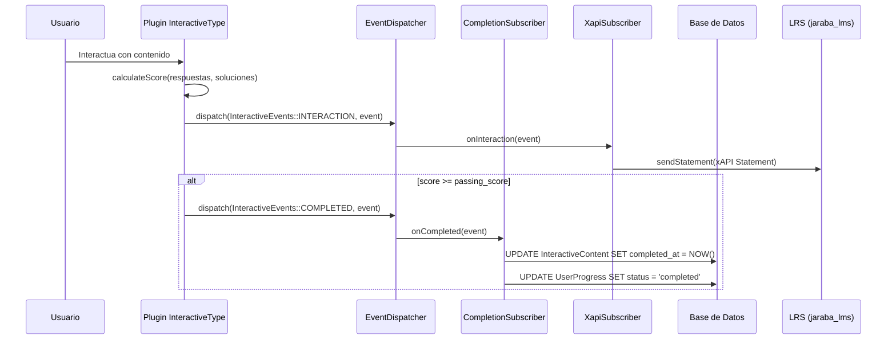

**Archivos a crear:**

| Archivo | Descripcion |
|---------|-------------|
| `src/EventSubscriber/CompletionSubscriber.php` | Escucha `InteractiveEvents::COMPLETED`, actualiza `completed_at` y progreso del usuario |
| `src/EventSubscriber/XapiSubscriber.php` | Escucha `InteractiveEvents::INTERACTION`, construye y envia xAPI Statement al LRS |
| `src/Event/InteractiveEvents.php` | Clase de constantes de eventos |
| `src/Event/InteractionEvent.php` | Value Object del evento de interaccion |
| `src/Event/CompletionEvent.php` | Value Object del evento de completitud |

### 5.5 Motores JS, Twig Templates, SCSS

Cada plugin requiere su terna de archivos frontend:

| Plugin | Motor JS | Template Twig | SCSS |
|--------|----------|---------------|------|
| InteractiveVideo | `js/engines/interactive-video-engine.js` | `templates/interactive-video.html.twig` | `scss/components/_interactive-video.scss` |
| CoursePresentation | `js/engines/course-presentation-engine.js` | `templates/course-presentation.html.twig` | `scss/components/_course-presentation.scss` |
| BranchingScenario | `js/engines/branching-scenario-engine.js` | `templates/branching-scenario.html.twig` | `scss/components/_branching-scenario.scss` |
| DragAndDrop | `js/engines/drag-and-drop-engine.js` | `templates/drag-and-drop.html.twig` | `scss/components/_drag-and-drop.scss` |
| Essay | `js/engines/essay-engine.js` | `templates/essay.html.twig` | `scss/components/_essay.scss` |

**Patron JS obligatorio:** `Drupal.behaviors` + `once()` + `fetch` API para comunicacion con el backend.

**Patron Twig obligatorio:** Zero-Region, `` para todos los textos, `jaraba_icon()` para iconos SVG duales.

**Patron SCSS obligatorio:** Dart Sass con `@use`, tokens `var(--ej-*)`, BEM naming.

### 5.6 Patron de Referencia: Plugin PHP

```php
<?php

declare(strict_types=1);

namespace Drupal\jaraba_interactive\Plugin\InteractiveType;

use Drupal\jaraba_interactive\InteractiveTypeInterface;
use Drupal\jaraba_interactive\InteractiveTypePluginBase;
use Drupal\jaraba_interactive\Entity\InteractiveContent;

/**
 * Plugin de tipo interactivo: Video Interactivo.
 *
 * ── Proposito ──
 * Renderiza un reproductor de video con puntos de interaccion
 * sincronizados temporalmente (quizzes, hotspots, overlays).
 *
 * ── Integracion ──
 * - Usa @ai.provider para generacion automatica de interacciones
 * - Emite eventos xAPI para cada interaccion del usuario
 * - Calcula puntuacion basada en interacciones obligatorias
 *
 * @InteractiveType(
 *   id = "interactive_video",
 *   label = @Translation("Video Interactivo"),
 *   description = @Translation("Video con puntos de interaccion sincronizados"),
 *   icon = "video",
 *   weight = 0
 * )
 */
class InteractiveVideo extends InteractiveTypePluginBase implements InteractiveTypeInterface {

  /**
   * {@inheritdoc}
   *
   * ── Configuracion por defecto ──
   * Define la estructura base del contenido de video interactivo,
   * incluyendo source vacio, interacciones vacias y settings razonables.
   */
  public function getDefaultConfiguration(): array {
    return [
      'video' => [
        'source' => '',
        'duration' => 0,
        'poster' => '',
        'subtitles' => [],
      ],
      'interactions' => [],
      'settings' => [
        'allow_skip' => FALSE,
        'show_progress_bar' => TRUE,
        'passing_score' => 70,
        'max_attempts' => 0,
        'show_solutions' => TRUE,
      ],
    ];
  }

  /**
   * {@inheritdoc}
   *
   * ── Validacion del contenido ──
   * Verifica que el video tenga source y duracion validos,
   * y que las interacciones no excedan la duracion del video.
   */
  public function validateContent(array $content): bool {
    if (empty($content['video']['source'])) {
      return FALSE;
    }
    if (empty($content['video']['duration']) || $content['video']['duration'] <= 0) {
      return FALSE;
    }

    $duration = $content['video']['duration'];
    foreach ($content['interactions'] as $interaction) {
      if ($interaction['time'] > $duration) {
        return FALSE;
      }
    }

    return TRUE;
  }

  /**
   * {@inheritdoc}
   *
   * ── Render del contenido ──
   * Construye el render array con el template Twig del video interactivo,
   * adjuntando la biblioteca JS del motor y pasando la configuracion JSON.
   */
  public function render(InteractiveContent $entity, array $settings): array {
    $content = $entity->getContent();

    return [
      '#theme' => 'interactive_video',
      '#content' => $content,
      '#settings' => array_merge(
        $content['settings'] ?? [],
        $settings
      ),
      '#entity_id' => $entity->id(),
      '#attached' => [
        'library' => ['jaraba_interactive/interactive-video-engine'],
        'drupalSettings' => [
          'jarabaInteractive' => [
            'interactiveVideo' => [
              'entityId' => $entity->id(),
              'content' => $content,
            ],
          ],
        ],
      ],
    ];
  }

  /**
   * {@inheritdoc}
   *
   * ── Calculo de puntuacion ──
   * Evalua las respuestas del usuario contra las soluciones correctas.
   * Solo cuenta las interacciones marcadas como required_for_completion.
   */
  public function calculateScore(array $responses, array $solutions): float {
    $required = array_filter(
      $solutions,
      fn(array $s): bool => ($s['required_for_completion'] ?? FALSE) === TRUE
    );

    if (empty($required)) {
      return 100.0;
    }

    $correct = 0;
    foreach ($required as $key => $solution) {
      if (isset($responses[$key]) && $this->evaluateResponse($responses[$key], $solution)) {
        $correct++;
      }
    }

    return round(($correct / count($required)) * 100, 2);
  }

  /**
   * {@inheritdoc}
   *
   * ── Formulario del editor ──
   * Retorna la estructura del formulario para el editor de contenido,
   * con campos para video, interacciones y configuracion.
   */
  public function getEditorForm(array $current_content): array {
    return [
      'video_source' => [
        'type' => 'url',
        'label' => t('URL del video'),
        'required' => TRUE,
        'value' => $current_content['video']['source'] ?? '',
      ],
      'video_duration' => [
        'type' => 'number',
        'label' => t('Duracion (segundos)'),
        'required' => TRUE,
        'value' => $current_content['video']['duration'] ?? 0,
      ],
      'interactions_editor' => [
        'type' => 'interactive_timeline',
        'label' => t('Editor de interacciones'),
        'value' => $current_content['interactions'] ?? [],
      ],
    ];
  }

  /**
   * Evalua una respuesta individual contra la solucion.
   *
   * ── Logica interna ──
   * Compara la respuesta del usuario con la solucion correcta
   * segun el tipo de interaccion (quiz, hotspot, etc.).
   */
  private function evaluateResponse(array $response, array $solution): bool {
    return ($response['answer'] ?? NULL) === ($solution['correct_answer'] ?? NULL);
  }

}
```

### 5.7 Arbol de Archivos Fase 1

```
web/modules/custom/jaraba_interactive/
├── src/
│   ├── Annotation/
│   │   └── InteractiveType.php                        # Anotacion del plugin
│   ├── Plugin/
│   │   └── InteractiveType/
│   │       ├── InteractiveVideo.php                   # INT-001
│   │       ├── CoursePresentation.php                 # INT-001
│   │       ├── BranchingScenario.php                  # INT-001
│   │       ├── DragAndDrop.php                        # INT-001
│   │       └── Essay.php                              # INT-001
│   ├── EventSubscriber/
│   │   ├── CompletionSubscriber.php                   # INT-002
│   │   └── XapiSubscriber.php                         # INT-002
│   ├── Event/
│   │   ├── InteractiveEvents.php                      # INT-002
│   │   ├── InteractionEvent.php                       # INT-002
│   │   └── CompletionEvent.php                        # INT-002
│   ├── InteractiveTypeInterface.php                   # Interfaz base
│   ├── InteractiveTypePluginBase.php                  # Clase base abstracta
│   └── InteractiveTypePluginManager.php               # Plugin manager
├── js/
│   └── engines/
│       ├── interactive-video-engine.js                # Motor JS video
│       ├── course-presentation-engine.js              # Motor JS presentacion
│       ├── branching-scenario-engine.js               # Motor JS escenario
│       ├── drag-and-drop-engine.js                    # Motor JS drag&drop
│       └── essay-engine.js                            # Motor JS ensayo
├── templates/
│   ├── interactive-video.html.twig                    # Template video
│   ├── course-presentation.html.twig                  # Template presentacion
│   ├── branching-scenario.html.twig                   # Template escenario
│   ├── drag-and-drop.html.twig                        # Template drag&drop
│   └── essay.html.twig                                # Template ensayo
├── scss/
│   └── components/
│       ├── _interactive-video.scss                    # Estilos video
│       ├── _course-presentation.scss                  # Estilos presentacion
│       ├── _branching-scenario.scss                   # Estilos escenario
│       ├── _drag-and-drop.scss                        # Estilos drag&drop
│       └── _essay.scss                                # Estilos ensayo
└── config/
    └── schema/
        ├── interactive_video.schema.json              # JSON Schema video
        ├── course_presentation.schema.json            # JSON Schema presentacion
        ├── branching_scenario.schema.json             # JSON Schema escenario
        ├── drag_and_drop.schema.json                  # JSON Schema drag&drop
        └── essay.schema.json                          # JSON Schema ensayo
```

**Total archivos Fase 1:** 33 archivos nuevos

---

## 6. FASE 2 — jaraba_interactive: Editor + CRUD APIs (P0/P1, 45-55h)

### 6.1 Gaps Cubiertos: INT-003, INT-004

| Gap | Componente | Estado Actual | Target |
|-----|-----------|---------------|--------|
| INT-003 | Sistema de editor completo | 0% — No existe | 100% — EditorController + JS + 6 editores tipo |
| INT-004 | 6 endpoints CRUD REST | 0% — No existen | 100% — CRUD completo en ApiController |

### 6.2 Arquitectura del Editor

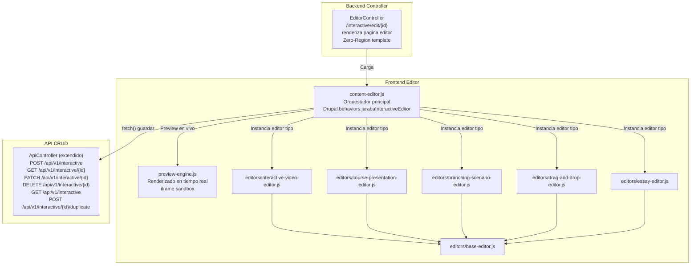

**Ruta del editor:** `/interactive/edit/{interactive_content}`

**Template:** `page--interactive-edit.html.twig` (Zero-Region, sin sidebars, toolbar Drupal preservado)

### 6.3 API CRUD: 6 Endpoints

| Metodo | Ruta | Descripcion | Permiso |
|--------|------|-------------|---------|
| `POST` | `/api/v1/interactive` | Crear contenido interactivo nuevo | `create interactive_content` |
| `GET` | `/api/v1/interactive/{id}` | Obtener contenido por ID | `view interactive_content` |
| `PATCH` | `/api/v1/interactive/{id}` | Actualizar contenido existente | `edit interactive_content` |
| `DELETE` | `/api/v1/interactive/{id}` | Eliminar contenido | `delete interactive_content` |
| `GET` | `/api/v1/interactive` | Listar contenidos (paginado, filtrado) | `view interactive_content` |
| `POST` | `/api/v1/interactive/{id}/duplicate` | Duplicar contenido existente | `create interactive_content` |

**Formato de respuesta estandar:**

```json
{
  "status": "success",
  "data": {
    "id": 42,
    "type": "interactive_video",
    "title": "Introduccion al Marketing Digital",
    "content": { "...schema del tipo..." },
    "status": "draft",
    "created": "2026-02-12T10:30:00+01:00",
    "changed": "2026-02-12T14:15:00+01:00",
    "author": { "id": 1, "name": "admin" },
    "tenant_id": "agroconecta"
  },
  "meta": {
    "cache_tags": ["interactive_content:42", "interactive_content_list"]
  }
}
```

### 6.4 Patron de Referencia: EditorController

```php
<?php

declare(strict_types=1);

namespace Drupal\jaraba_interactive\Controller;

use Drupal\Core\Controller\ControllerBase;
use Drupal\jaraba_interactive\Entity\InteractiveContent;
use Drupal\jaraba_interactive\InteractiveTypePluginManager;
use Symfony\Component\DependencyInjection\ContainerInterface;

/**
 * Controlador del editor de contenido interactivo.
 *
 * ── Proposito ──
 * Renderiza la pagina del editor visual para un contenido interactivo
 * concreto. Usa template Zero-Region (sin sidebars de Drupal) para
 * maximizar el espacio de edicion.
 *
 * ── Ruta ──
 * /interactive/edit/{interactive_content}
 *
 * ── Patron ──
 * - Inyeccion via ContainerInterface (NO create() estatico por PHP 8.4)
 * - Template propio en ecosistema_jaraba_theme
 * - JS editor cargado como biblioteca Drupal
 */
class EditorController extends ControllerBase {

  public function __construct(
    protected readonly InteractiveTypePluginManager $pluginManager,
  ) {}

  /**
   * {@inheritdoc}
   */
  public static function create(ContainerInterface $container): static {
    return new static(
      $container->get('plugin.manager.interactive_type'),
    );
  }

  /**
   * Pagina principal del editor.
   *
   * ── Flujo ──
   * 1. Carga la entidad InteractiveContent
   * 2. Obtiene el plugin de tipo correspondiente
   * 3. Genera el formulario del editor via getEditorForm()
   * 4. Retorna render array con template Zero-Region
   */
  public function edit(InteractiveContent $interactive_content): array {
    $type_id = $interactive_content->getType();
    $plugin = $this->pluginManager->createInstance($type_id);
    $editor_form = $plugin->getEditorForm($interactive_content->getContent());

    return [
      '#theme' => 'interactive_editor',
      '#entity' => $interactive_content,
      '#editor_form' => $editor_form,
      '#plugin_type' => $type_id,
      '#attached' => [
        'library' => [
          'jaraba_interactive/content-editor',
          'jaraba_interactive/preview-engine',
          'jaraba_interactive/' . str_replace('_', '-', $type_id) . '-editor',
        ],
        'drupalSettings' => [
          'jarabaInteractiveEditor' => [
            'entityId' => $interactive_content->id(),
            'type' => $type_id,
            'content' => $interactive_content->getContent(),
            'apiBase' => '/api/v1/interactive',
            'previewUrl' => '/interactive/preview/' . $interactive_content->id(),
          ],
        ],
      ],
    ];
  }

  /**
   * Titulo dinamico de la pagina del editor.
   */
  public function editTitle(InteractiveContent $interactive_content): string {
    return $this->t('Editar: @title', [
      '@title' => $interactive_content->getTitle(),
    ]);
  }

}
```

**Arbol de archivos Fase 2:**

```
web/modules/custom/jaraba_interactive/
├── src/
│   └── Controller/
│       └── EditorController.php                       # INT-003
│       └── ApiController.php (extender)               # INT-004 — 6 metodos CRUD
├── js/
│   ├── content-editor.js                              # INT-003 — Orquestador
│   ├── preview-engine.js                              # INT-003 — Preview iframe
│   └── editors/
│       ├── base-editor.js                             # INT-003 — Clase base
│       ├── interactive-video-editor.js                # INT-003
│       ├── course-presentation-editor.js              # INT-003
│       ├── branching-scenario-editor.js               # INT-003
│       ├── drag-and-drop-editor.js                    # INT-003
│       └── essay-editor.js                            # INT-003
└── templates/
    └── interactive-editor.html.twig                   # INT-003 — Template editor
```

**Total archivos Fase 2:** 10 archivos nuevos + 1 modificado

---

## 7. FASE 3 — Training Purchase + Andalucia EI Slide-Panel (P0/P1, 30-40h)

### 7.1 Gaps Cubiertos: TRN-001, TRN-002, AND-001

| Gap | Componente | Estado Actual | Target |
|-----|-----------|---------------|--------|
| TRN-001 | `PurchaseService` + endpoint `purchase()` | 0% | 100% — Flujo de compra completo |
| TRN-002 | Campo `exam_content_id` en `CertificationProgram` | 0% | 100% — Referencia a `InteractiveContent` |
| AND-001 | `AndaluciaEiApiController` slide-panel CRUD | 0% | 100% — 4 operaciones CRUD via slide-panel |

### 7.2 PurchaseService y Flujo de Compra

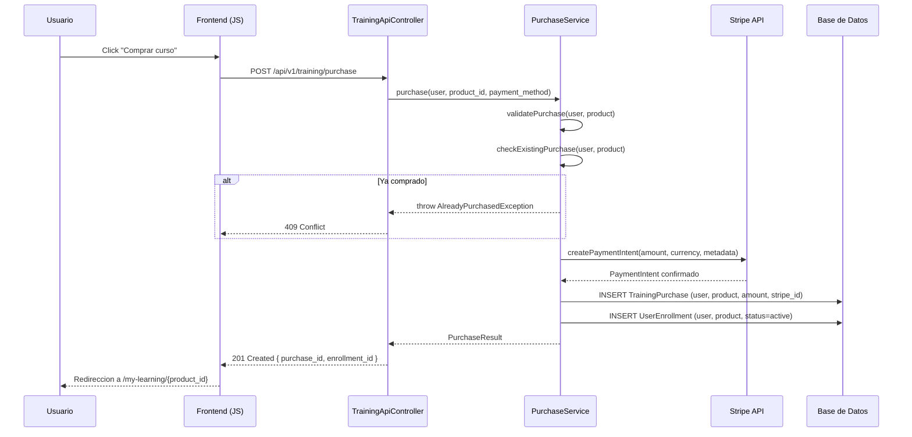

**Archivos a crear/modificar:**

| Archivo | Accion | Descripcion |
|---------|--------|-------------|
| `src/Service/PurchaseService.php` | Crear | Logica de compra con Stripe + enrollment |
| `src/Controller/TrainingApiController.php` | Modificar | Agregar metodo `purchase()` |
| `jaraba_training.routing.yml` | Modificar | Agregar ruta `POST /api/v1/training/purchase` |
| `jaraba_training.services.yml` | Modificar | Registrar PurchaseService |

### 7.3 Andalucia EI Slide-Panel CRUD

El modulo `jaraba_andalucia_ei` requiere un controlador API para operaciones CRUD accesibles via slide-panel (directriz D-004).

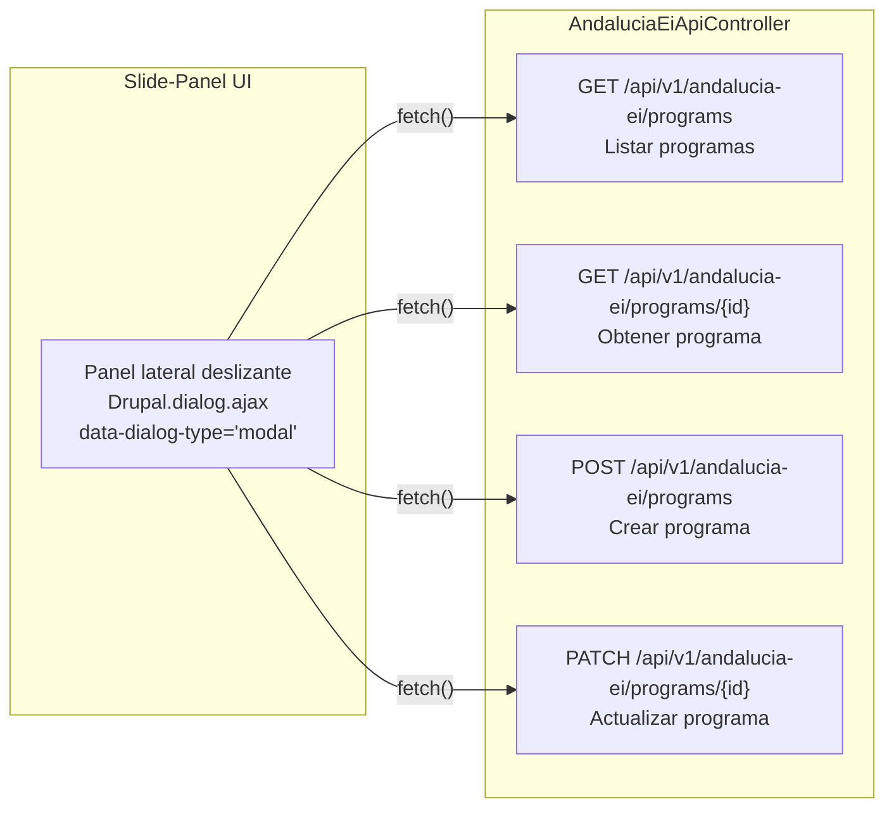

### 7.4 Integracion H5P/Exam en CertificationProgram

El gap TRN-002 requiere agregar un campo `exam_content_id` a la entidad `CertificationProgram` que referencie contenido interactivo del modulo `jaraba_interactive`. Esto permite vincular un examen (quiz, branching scenario, etc.) a cada programa de certificacion.

```php
// Agregar en CertificationProgram.php — definicion del campo
// ── Campo exam_content_id ──
// Referencia a la entidad InteractiveContent que sirve como examen
// de evaluacion final para este programa de certificacion.
$fields['exam_content_id'] = BaseFieldDefinition::create('entity_reference')
  ->setLabel(t('Contenido de examen'))
  ->setDescription(t('Contenido interactivo usado como examen de certificacion'))
  ->setSetting('target_type', 'interactive_content')
  ->setSetting('handler', 'default')
  ->setDisplayOptions('form', [
    'type' => 'entity_reference_autocomplete',
    'weight' => 10,
  ])
  ->setDisplayConfigurable('form', TRUE)
  ->setDisplayConfigurable('view', TRUE);
```

**Nota:** Este campo depende parcialmente de la Fase 1, ya que la entidad `InteractiveContent` y sus plugins deben existir para que el autocomplete funcione correctamente.

---

## 8. FASE 4 — Canvas Editor E2E + CacheTagsInvalidator (P1/P3, 25-30h)

### 8.1 Gaps Cubiertos: PB-001, CV3-001

| Gap | Componente | Estado Actual | Target |
|-----|-----------|---------------|--------|
| PB-001 | Suite Cypress E2E para Canvas Editor | ~40% — Specs basicas | 100% — 5 specs nuevas |
| CV3-001 | `CanvasCacheTagsInvalidator` service | 0% — No existe | 100% — Invalidacion automatica |

### 8.2 CanvasCacheTagsInvalidator Service

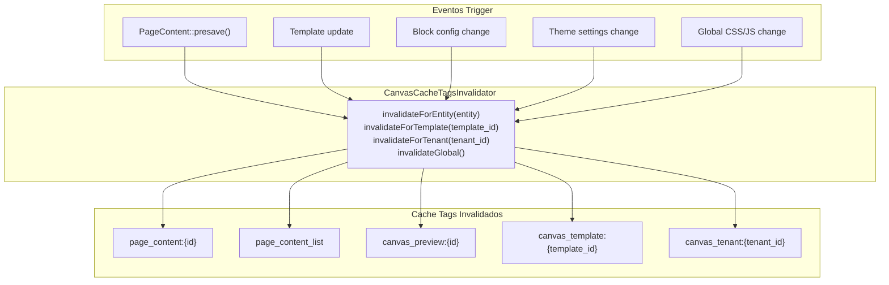

**Patron de referencia para el servicio:**

```php
<?php

declare(strict_types=1);

namespace Drupal\jaraba_page_builder\Service;

use Drupal\Core\Cache\CacheTagsInvalidatorInterface;
use Drupal\Core\Entity\EntityInterface;
use Psr\Log\LoggerInterface;

/**
 * Invalidador de cache tags para el Canvas Editor.
 *
 * ── Proposito ──
 * Centraliza la invalidacion de cache tags cuando se modifican
 * paginas, templates, bloques o configuracion del Canvas Editor.
 * Garantiza coherencia entre el editor y la vista publica.
 *
 * ── Patron ──
 * Servicio registrado en services.yml, inyectado donde se necesite.
 * NO usa hooks: se invoca explicitamente desde presave/EventSubscriber.
 */
class CanvasCacheTagsInvalidator {

  public function __construct(
    protected readonly CacheTagsInvalidatorInterface $cacheTagsInvalidator,
    protected readonly LoggerInterface $logger,
  ) {}

  /**
   * Invalida cache tags asociados a una entidad PageContent.
   */
  public function invalidateForEntity(EntityInterface $entity): void {
    $tags = [
      'page_content:' . $entity->id(),
      'page_content_list',
      'canvas_preview:' . $entity->id(),
    ];

    $this->cacheTagsInvalidator->invalidateTags($tags);
    $this->logger->info('Cache tags invalidados para PageContent @id', [
      '@id' => $entity->id(),
    ]);
  }

  /**
   * Invalida cache tags de un template especifico.
   */
  public function invalidateForTemplate(string $template_id): void {
    $this->cacheTagsInvalidator->invalidateTags([
      'canvas_template:' . $template_id,
      'page_content_list',
    ]);
  }

  /**
   * Invalida todos los cache tags de un tenant.
   */
  public function invalidateForTenant(string $tenant_id): void {
    $this->cacheTagsInvalidator->invalidateTags([
      'canvas_tenant:' . $tenant_id,
      'page_content_list',
    ]);
  }

  /**
   * Invalida cache global del Canvas Editor.
   */
  public function invalidateGlobal(): void {
    $this->cacheTagsInvalidator->invalidateTags([
      'page_content_list',
      'canvas_global',
    ]);
  }

}
```

### 8.3 Cypress E2E: 5 Specs Nuevas

| Spec | Archivo | Descripcion | Assertions |
|------|---------|-------------|------------|
| 1 | `canvas-editor-crud.cy.js` | Crear, editar, guardar y eliminar pagina | 12+ |
| 2 | `canvas-blocks-library.cy.js` | Insertar bloques de las 17 categorias, reordenar | 15+ |
| 3 | `canvas-responsive-preview.cy.js` | Verificar 8 viewports del responsive preview | 8+ |
| 4 | `canvas-template-apply.cy.js` | Aplicar template, verificar renderizado, cambiar template | 10+ |
| 5 | `canvas-publish-flow.cy.js` | Flujo draft -> review -> published, permisos | 8+ |

**Ubicacion:** `tests/cypress/e2e/canvas/`

**Patron Cypress obligatorio:**

```javascript
// ── Spec E2E: Canvas Editor CRUD ──
// Verifica el ciclo completo de vida de una pagina en el Canvas Editor:
// creacion, edicion, guardado, preview y eliminacion.
describe('Canvas Editor — CRUD completo', () => {
  beforeEach(() => {
    cy.login('admin');
    cy.visit('/admin/content/page-builder');
  });

  it('debe crear una pagina nueva desde el editor', () => {
    cy.get('[data-action="create-page"]').click();
    cy.url().should('include', '/page-builder/edit/');
    cy.get('#page-title-input').type('Pagina de prueba E2E');
    cy.get('[data-action="save-draft"]').click();
    cy.get('.messages--status').should('contain', 'guardado');
  });

  it('debe editar contenido de una pagina existente', () => {
    cy.get('.page-list-item').first().find('[data-action="edit"]').click();
    cy.get('.gjs-frame').should('be.visible');
    // ... mas assertions
  });

  it('debe eliminar una pagina con confirmacion', () => {
    cy.get('.page-list-item').first().find('[data-action="delete"]').click();
    cy.get('.ui-dialog-buttonset .button--danger').click();
    cy.get('.messages--status').should('contain', 'eliminado');
  });
});
```

---

## 9. FASE 5 — SCSS Compliance + Template Normalization (P1/P3, 20-25h)

### 9.1 Gaps Cubiertos: SCSS-001, TMPL-001, PJ-002

| Gap | Componente | Estado Actual | Target |
|-----|-----------|---------------|--------|
| SCSS-001 | Auditoria SCSS tokens en 14 modulos | ~60% | 100% — `color.adjust()`, `@use`, `var(--ej-*)` |
| TMPL-001 | Normalizacion nombres templates Twig | ~80% | 100% — Convencion unificada |
| PJ-002 | Bug `hero_subtitle` con `striptags\|raw` | Bug activo | Corregido |

### 9.2 Auditoria SCSS: 14 Modulos

Los 14 modulos que requieren auditoria SCSS son:

| # | Modulo | Archivos SCSS | Issues Detectados |
|---|--------|---------------|-------------------|
| 1 | `jaraba_page_builder` | 12 | `darken()` en 3 archivos, `@import` en 2 |
| 2 | `jaraba_interactive` | 5 (nuevos F1) | Deben crearse con `@use` desde inicio |
| 3 | `jaraba_training` | 3 | `lighten()` en 1 archivo |
| 4 | `jaraba_agroconecta_core` | 4 | `@import` en 2 archivos |
| 5 | `jaraba_crm` | 3 | `darken()` en 1 archivo |
| 6 | `jaraba_heatmap` | 2 | OK (creados recientemente con `@use`) |
| 7 | `jaraba_credentials` | 4 | `@import` en 1 archivo |
| 8 | `jaraba_diagnostic` | 2 | `lighten()` en 1 archivo |
| 9 | `jaraba_billing` | 3 | OK |
| 10 | `jaraba_customer_success` | 5 | `@import` en 3 archivos |
| 11 | `jaraba_analytics` | 3 | `darken()` en 1 archivo |
| 12 | `jaraba_onboarding` | 2 | OK |
| 13 | `jaraba_servicios_conecta` | 4 | OK (creados con `@use`) |
| 14 | `ecosistema_jaraba_theme` | 8 | `darken()`/`lighten()` en 4 archivos, PJ-002 |

**Reglas de refactorizacion obligatorias:**

| Antes (Deprecado) | Despues (Dart Sass) | Ejemplo |
|--------------------|---------------------|---------|
| `darken($color, 10%)` | `color.adjust($color, $lightness: -10%)` | `color.adjust(var(--ej-primary), $lightness: -10%)` |
| `lighten($color, 10%)` | `color.adjust($color, $lightness: 10%)` | `color.adjust(var(--ej-primary), $lightness: 10%)` |
| `@import 'variables'` | `@use 'variables' as vars` | `@use '../tokens/variables' as tokens` |
| `$ej-primary` | `var(--ej-primary)` | Tokens CSS custom properties |

### 9.3 hero_subtitle Bug Fix

**Ubicacion:** `web/themes/custom/ecosistema_jaraba_theme/templates/`

**Problema:** El campo `hero_subtitle` renderiza HTML escapado cuando se usa el filtro `striptags|raw` en el template Twig. Esto provoca que los usuarios vean etiquetas HTML literales en lugar de texto limpio.

**Causa raiz:** El orden de filtros es incorrecto. `striptags` elimina tags HTML, pero `raw` marca el resultado como seguro sin necesidad, y el contenido llega pre-escapado desde el campo de texto.

**Solucion:**

```twig
{# ANTES (buggy) — PJ-002 #}
{{ hero_subtitle|striptags|raw }}

{# DESPUES (corregido) — PJ-002 #}
{{ hero_subtitle|striptags }}
```

Si el campo contiene HTML intencional (negritas, enlaces), la solucion alternativa es:

```twig
{# Alternativa: permitir tags especificos #}
{{ hero_subtitle|striptags('<strong><em><a>')|raw }}
```

### 9.4 Migracion @import a @use

**Patron de migracion:**

```scss
// ── ANTES (deprecado por Dart Sass) ──
@import '../tokens/colors';
@import '../tokens/spacing';
@import '../mixins/responsive';

.ej-component {
  color: $ej-primary;
  padding: $ej-spacing-md;

  @include respond-to('tablet') {
    padding: $ej-spacing-lg;
  }
}

// ── DESPUES (Dart Sass @use) ──
@use '../tokens/colors' as colors;
@use '../tokens/spacing' as spacing;
@use '../mixins/responsive' as responsive;

.ej-component {
  color: var(--ej-primary);
  padding: var(--ej-spacing-md);

  @include responsive.respond-to('tablet') {
    padding: var(--ej-spacing-lg);
  }
}
```

**Comando de compilacion (Docker/Lando + NVM/WSL):**

```bash
# Dentro del contenedor Lando
lando ssh -c "cd /app/web/themes/custom/ecosistema_jaraba_theme && npm run sass:compile"

# O directamente con NVM en WSL
nvm use 20 && npx sass scss/main.scss css/main.css --style=compressed
```

---

## 10. FASE 6 — pepejaraba.com: Contenido + Infraestructura (P2, 30-40h)

### 10.1 Gaps Cubiertos: PJ-001, PJ-003

| Gap | Componente | Estado Actual | Target |
|-----|-----------|---------------|--------|
| PJ-001 | Contenido de 14 paginas pepejaraba.com | Plan auditado, 0% contenido | 100% — 14 paginas provisionadas |
| PJ-003 | Infraestructura DNS/SSL/vhost | 0% — No configurado | 100% — Produccion operativa |

### 10.2 Tenant personal_brand

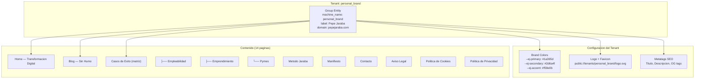

### 10.3 Provisionamiento de Contenido

Las 14 paginas se crean como entidades `PageContent` del Page Builder, usando los templates existentes (70 templates disponibles, 17 categorias de bloques).

| Pagina | Template Base | Bloques Principales |
|--------|--------------|---------------------|
| Home | `hero-fullwidth` + `social-proof` + `avatar-cards` | Hero video, testimonios, CTA |
| Blog | `blog-grid` + `sidebar-categories` | Grid posts, categorias, busqueda |
| Casos de Exito | `portfolio-matrix` + `filter-tabs` | Matriz filtrable, stats |
| Metodo | `timeline-vertical` + `features-grid` | Timeline 6 pasos, iconos |
| Manifiesto | `text-hero` + `quote-blocks` | Texto largo, citas destacadas |
| Contacto | `contact-form` + `map-embed` | Formulario, mapa, datos contacto |
| Legales (x3) | `legal-text` | Texto legal estructurado |

### 10.4 Infraestructura DNS/SSL/vhost

| Componente | Configuracion | Proveedor |
|------------|---------------|-----------|
| DNS | `pepejaraba.com` CNAME a servidor IONOS | IONOS |
| SSL | Let's Encrypt via Certbot auto-renewal | Let's Encrypt |
| vhost | Apache VirtualHost con `ServerName pepejaraba.com` | IONOS VPS |
| Drupal | Domain resolution via `jaraba_whitelabel` EventSubscriber | Custom |

**Configuracion Apache:**

```apache
<VirtualHost *:443>
    ServerName pepejaraba.com
    ServerAlias www.pepejaraba.com
    DocumentRoot /var/www/html/web

    SSLEngine on
    SSLCertificateFile /etc/letsencrypt/live/pepejaraba.com/fullchain.pem
    SSLCertificateKeyFile /etc/letsencrypt/live/pepejaraba.com/privkey.pem

    # Resolucion multi-tenant via Drupal
    SetEnv JARABA_TENANT personal_brand

    <Directory /var/www/html/web>
        AllowOverride All
        Require all granted
    </Directory>
</VirtualHost>
```

---

## 11. FASE 7 — Test Suites (P1/P2, 15-20h)

### 11.1 Gaps Cubiertos: INT-005 + Transversales

| Gap | Componente | Estado Actual | Target |
|-----|-----------|---------------|--------|
| INT-005 | Tests unitarios jaraba_interactive | 0% | 100% — 7 archivos PHPUnit nuevos |
| Transversal | Tests PurchaseService, Andalucia EI, CacheInvalidator | 0% | 100% — 4 archivos PHPUnit adicionales |

### 11.2 11 Archivos PHPUnit

| # | Archivo | Modulo | Clase Testeada | Test Methods | Gap |
|---|---------|--------|---------------|--------------|-----|
| 1 | `InteractiveVideoTest.php` | `jaraba_interactive` | `InteractiveVideo` plugin | 8 | INT-005 |
| 2 | `CoursePresentationTest.php` | `jaraba_interactive` | `CoursePresentation` plugin | 7 | INT-005 |
| 3 | `BranchingScenarioTest.php` | `jaraba_interactive` | `BranchingScenario` plugin | 8 | INT-005 |
| 4 | `DragAndDropTest.php` | `jaraba_interactive` | `DragAndDrop` plugin | 7 | INT-005 |
| 5 | `EssayTest.php` | `jaraba_interactive` | `Essay` plugin | 6 | INT-005 |
| 6 | `CompletionSubscriberTest.php` | `jaraba_interactive` | `CompletionSubscriber` | 5 | INT-005 |
| 7 | `XapiSubscriberTest.php` | `jaraba_interactive` | `XapiSubscriber` | 6 | INT-005 |
| 8 | `PurchaseServiceTest.php` | `jaraba_training` | `PurchaseService` | 8 | TRN-001 |
| 9 | `AndaluciaEiApiControllerTest.php` | `jaraba_andalucia_ei` | `AndaluciaEiApiController` | 6 | AND-001 |
| 10 | `CanvasCacheTagsInvalidatorTest.php` | `jaraba_page_builder` | `CanvasCacheTagsInvalidator` | 5 | CV3-001 |
| 11 | `InteractiveApiControllerTest.php` | `jaraba_interactive` | `ApiController` CRUD | 8 | INT-004 |

**Total:** 11 archivos, ~74 test methods, ~200+ assertions estimadas

### 11.3 Estrategia de Cobertura

**Patron PHPUnit obligatorio del proyecto:**

```php
<?php

declare(strict_types=1);

namespace Drupal\Tests\jaraba_interactive\Unit\Plugin\InteractiveType;

use Drupal\jaraba_interactive\Plugin\InteractiveType\InteractiveVideo;
use Drupal\Tests\UnitTestCase;

/**
 * Tests para el plugin InteractiveVideo.
 *
 * ── Cobertura ──
 * - getDefaultConfiguration(): estructura valida
 * - validateContent(): video con/sin source, interacciones fuera de rango
 * - calculateScore(): 100% correcto, 0% correcto, parcial, sin required
 * - getEditorForm(): campos presentes y tipos correctos
 *
 * @covers \Drupal\jaraba_interactive\Plugin\InteractiveType\InteractiveVideo
 * @group jaraba_interactive
 */
class InteractiveVideoTest extends UnitTestCase {

  /**
   * Plugin bajo test.
   */
  protected InteractiveVideo $plugin;

  /**
   * {@inheritdoc}
   */
  protected function setUp(): void {
    parent::setUp();
    // Instanciar plugin con configuracion mock
    $configuration = [];
    $plugin_id = 'interactive_video';
    $plugin_definition = new \stdClass();
    $plugin_definition->id = 'interactive_video';
    $this->plugin = new InteractiveVideo($configuration, $plugin_id, $plugin_definition);
  }

  /**
   * @covers ::getDefaultConfiguration
   */
  public function testGetDefaultConfigurationReturnsValidStructure(): void {
    $config = $this->plugin->getDefaultConfiguration();

    $this->assertArrayHasKey('video', $config);
    $this->assertArrayHasKey('interactions', $config);
    $this->assertArrayHasKey('settings', $config);
    $this->assertArrayHasKey('source', $config['video']);
    $this->assertIsArray($config['interactions']);
  }

  /**
   * @covers ::validateContent
   */
  public function testValidateContentReturnsFalseWithoutSource(): void {
    $content = [
      'video' => ['source' => '', 'duration' => 120],
      'interactions' => [],
    ];

    $this->assertFalse($this->plugin->validateContent($content));
  }

  /**
   * @covers ::validateContent
   */
  public function testValidateContentReturnsTrueWithValidContent(): void {
    $content = [
      'video' => [
        'source' => 'https://youtube.com/watch?v=test',
        'duration' => 300,
      ],
      'interactions' => [
        ['type' => 'quiz', 'time' => 60, 'data' => []],
      ],
    ];

    $this->assertTrue($this->plugin->validateContent($content));
  }

  /**
   * @covers ::calculateScore
   */
  public function testCalculateScorePerfect(): void {
    $responses = [
      0 => ['answer' => 'correct_value'],
      1 => ['answer' => 'another_correct'],
    ];
    $solutions = [
      0 => ['correct_answer' => 'correct_value', 'required_for_completion' => TRUE],
      1 => ['correct_answer' => 'another_correct', 'required_for_completion' => TRUE],
    ];

    $this->assertEquals(100.0, $this->plugin->calculateScore($responses, $solutions));
  }

  /**
   * @covers ::calculateScore
   */
  public function testCalculateScoreZero(): void {
    $responses = [
      0 => ['answer' => 'wrong'],
    ];
    $solutions = [
      0 => ['correct_answer' => 'correct', 'required_for_completion' => TRUE],
    ];

    $this->assertEquals(0.0, $this->plugin->calculateScore($responses, $solutions));
  }

  /**
   * @covers ::calculateScore
   */
  public function testCalculateScoreWithNoRequiredReturns100(): void {
    $responses = [];
    $solutions = [
      0 => ['correct_answer' => 'x', 'required_for_completion' => FALSE],
    ];

    $this->assertEquals(100.0, $this->plugin->calculateScore($responses, $solutions));
  }

  /**
   * @covers ::getEditorForm
   */
  public function testGetEditorFormContainsExpectedFields(): void {
    $form = $this->plugin->getEditorForm([]);

    $this->assertArrayHasKey('video_source', $form);
    $this->assertArrayHasKey('video_duration', $form);
    $this->assertArrayHasKey('interactions_editor', $form);
  }

  /**
   * @covers ::validateContent
   */
  public function testValidateContentRejectsInteractionBeyondDuration(): void {
    $content = [
      'video' => ['source' => 'https://example.com/video.mp4', 'duration' => 60],
      'interactions' => [
        ['type' => 'quiz', 'time' => 120, 'data' => []],
      ],
    ];

    $this->assertFalse($this->plugin->validateContent($content));
  }

}
```

---

## 12. Matriz de Cumplimiento de Directrices

### 12.1 14 Directrices Obligatorias

| ID | Directriz | Descripcion | Verificacion |
|----|-----------|-------------|--------------|
| D-001 | Documentacion en castellano | Todos los documentos, comentarios y textos en castellano | Revision manual de cada archivo |
| D-002 | SCSS Federated Tokens | Variables CSS custom `var(--ej-*)`, Dart Sass `@use`, `color.adjust()` | `grep -r "darken\|lighten\|@import" scss/` debe dar 0 resultados |
| D-003 | Zero-Region Twig | Paginas frontend sin sidebars de Drupal, template propio en theme | Verificar `page--*.html.twig` en theme |
| D-004 | Slide-Panel CRUD | Operaciones CRUD via paneles laterales deslizantes (Drupal dialog) | Test E2E de apertura/cierre panel |
| D-005 | i18n todos los textos | `t()` en PHP, `` en Twig, sin strings hardcoded | `grep -r "'>.*[a-zA-Z]" src/` para detectar strings sin t() |
| D-006 | Entity Pattern (4 YAML) | Cada entidad: `.info.yml`, `.routing.yml`, `.permissions.yml`, `.services.yml` | Verificar existencia de 4 archivos por modulo |
| D-007 | Dual SVG icons | Iconos via `jaraba_icon()` con soporte light/dark | Verificar llamadas en templates |
| D-008 | Brand color palette | Colores del tenant via CSS custom properties | Verificar `var(--ej-*)` en SCSS |
| D-009 | IA via @ai.provider | Toda integracion IA a traves del servicio `@ai.provider` | Verificar DI en services.yml |
| D-010 | Comentarios 3D castellano | Comentarios PHP con Proposito/Integracion/Patron en castellano | Revision manual |
| D-011 | Docker/Lando commands | Todos los comandos ejecutables dentro de Lando | Documentar `lando ssh -c "..."` |
| D-012 | NVM/WSL SCSS compile | Compilacion SCSS con NVM en WSL, `nvm use 20` | Documentar en cada modulo con SCSS |
| D-013 | Body classes hook_preprocess_html | Rutas frontend registradas en `hook_preprocess_html` del theme | Verificar hook en `.theme` |
| D-014 | Verificar codigo existente | Antes de crear, verificar si ya existe en el codebase | Auditoria pre-implementacion obligatoria |

### 12.2 Verificacion por Fase

| Directriz | F1 | F2 | F3 | F4 | F5 | F6 | F7 |
|-----------|----|----|----|----|----|----|-----|
| D-001 Castellano | SI | SI | SI | SI | SI | SI | SI |
| D-002 SCSS Tokens | SI | -- | -- | -- | SI (core) | SI | -- |
| D-003 Zero-Region | SI | SI | -- | -- | -- | SI | -- |
| D-004 Slide-Panel | -- | -- | SI | -- | -- | -- | -- |
| D-005 i18n | SI | SI | SI | SI | SI | SI | SI |
| D-006 Entity 4 YAML | SI | SI | SI | -- | -- | -- | -- |
| D-007 Dual SVG | SI | SI | SI | -- | -- | SI | -- |
| D-008 Brand palette | SI | SI | -- | -- | SI | SI | -- |
| D-009 @ai.provider | SI | -- | -- | -- | -- | -- | -- |
| D-010 Comentarios 3D | SI | SI | SI | SI | SI | SI | SI |
| D-011 Docker/Lando | SI | SI | SI | SI | SI | SI | SI |
| D-012 NVM/WSL SCSS | SI | -- | -- | -- | SI | SI | -- |
| D-013 Body classes | SI | SI | SI | -- | -- | SI | -- |
| D-014 Verificar existente | SI | SI | SI | SI | SI | SI | SI |

**Leyenda:** SI = Aplica y debe verificarse | -- = No aplica en esta fase

---

## 13. Grupos de Auditoria

La verificacion se organiza en 5 grupos de auditoria que se ejecutan progresivamente:

| Grupo | Fases | Alcance | Criterio de Exito |
|-------|-------|---------|-------------------|
| GA-1 | F1 | 5 plugins renderizan, events dispatched, JS engines cargan | `drush eval` + test manual en navegador |
| GA-2 | F1 + F2 | Editor carga, CRUD funciona, preview en vivo | Crear contenido E2E manual + API tests |
| GA-3 | F3 | Purchase completo, Andalucia EI panel funciona, exam_content_id migrado | Stripe test mode + slide-panel E2E |
| GA-4 | F4 + F5 | Cypress pasa, SCSS compila sin warnings, hero_subtitle corregido | `npm run sass:compile` + `npx cypress run` |
| GA-5 | F6 + F7 | pepejaraba.com accesible via HTTPS, 74 tests pasan | `curl -I https://pepejaraba.com` + `phpunit` |

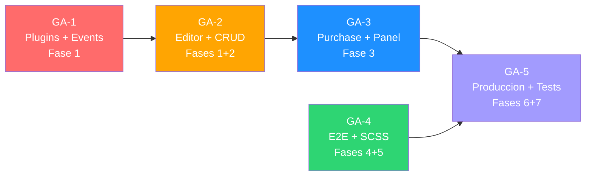

---

## 14. Estrategia de Testing y Verificacion

### 14.1 Piramide de Testing

| Nivel | Herramienta | Archivos | Cobertura |
|-------|------------|----------|-----------|
| Unit Tests | PHPUnit 11 | 11 archivos nuevos (Fase 7) | Services, Plugins, Subscribers |
| Integration Tests | PHPUnit Kernel | 3 archivos (existentes + nuevos) | Entity CRUD, DI container |
| E2E Tests | Cypress | 5 specs nuevas (Fase 4) | Canvas Editor flujos completos |
| Visual Tests | BackstopJS | Configs existentes + 3 nuevos | pepejaraba.com paginas |
| Performance | k6 | Config existente | API endpoints nuevos |

### 14.2 Checklist Pre-Commit por Fase

Antes de cada commit, verificar obligatoriamente:

- [ ] `phpcs --standard=Drupal,DrupalPractice web/modules/custom/{modulo}/`
- [ ] `phpstan analyse web/modules/custom/{modulo}/ --level=6`
- [ ] `phpunit tests/src/Unit/{modulo}/` (todos los tests pasan)
- [ ] `npm run sass:compile` (sin warnings Dart Sass)
- [ ] `grep -r "darken\|lighten" scss/` da 0 resultados
- [ ] `grep -r "@import" scss/` da 0 resultados (excepto node_modules)
- [ ] Todos los textos usan `t()` o ``
- [ ] Comentarios en castellano con formato 3D
- [ ] `declare(strict_types=1)` en todos los archivos PHP nuevos

---

## 15. Roadmap de Ejecucion

### 15.1 Camino Critico

El camino critico del proyecto es: **F1 -> F2 -> F7** (140-175h), ya que la Fase 2 depende totalmente de la Fase 1 y la Fase 7 depende de las Fases 1, 2 y 3.

### 15.2 Ejecucion en Paralelo

Las siguientes fases pueden ejecutarse en paralelo con el camino critico:

- **F4** (Canvas E2E + Cache) es completamente independiente
- **F5** (SCSS Compliance) es completamente independiente
- **F3** puede iniciarse parcialmente en paralelo con F1 (TRN-001 y AND-001 no dependen de F1, solo TRN-002)
- **F6** solo depende de F5 para la correccion SCSS

### 15.3 Timeline Optimo (2 desarrolladores)

| Semana | Desarrollador A | Desarrollador B |
|--------|----------------|----------------|
| S1 | F1 (Plugins 1-3) | F4 (Cypress + Cache) |
| S2 | F1 (Plugins 4-5 + Events) | F5 (SCSS + Templates) |
| S3 | F2 (Editor + Preview) | F3 (Purchase + Andalucia) |
| S4 | F2 (CRUD APIs) | F6 (pepejaraba.com) |
| S5 | F7 (Tests interactive) | F7 (Tests transversales) |

**Duracion total con 2 desarrolladores:** ~5 semanas

### 15.4 Timeline Minimo (1 desarrollador)

| Semana | Actividad |
|--------|-----------|
| S1-S3 | F1 (80-100h) |
| S4-S5 | F2 (45-55h) |
| S5 | F4 (25-30h, en paralelo ultimos dias de F2) |
| S6 | F3 (30-40h) |
| S6-S7 | F5 (20-25h) |
| S7 | F6 (30-40h) |
| S8 | F7 (15-20h) |

**Duracion total con 1 desarrollador:** ~8 semanas

---

## 16. Metricas de Exito

| Metrica | Valor Actual | Objetivo | Medicion |
|---------|-------------|----------|----------|
| Nivel de implementacion global | ~76% | 100% | Auditoria cruzada specs vs codigo |
| Gaps abiertos | 15 | 0 | Catalogo de gaps |
| Tests unitarios nuevos | 0 | 74+ methods | `phpunit --group jaraba_interactive,jaraba_training` |
| Cypress specs Canvas | ~3 existentes | 8+ | `npx cypress run --spec 'tests/cypress/e2e/canvas/*'` |
| SCSS warnings Dart Sass | >10 | 0 | `npm run sass:compile 2>&1 \| grep -c "Warning"` |
| `@import` en SCSS | >8 archivos | 0 | `grep -r "@import" scss/ \| wc -l` |
| `darken()/lighten()` | >6 usos | 0 | `grep -r "darken\|lighten" scss/ \| wc -l` |
| pepejaraba.com HTTPS | No operativo | 200 OK + SSL A+ | `curl -sI https://pepejaraba.com` |
| Cobertura codigo interactive | 0% | >80% | PHPUnit coverage report |
| Tiempo respuesta API interactive | N/A | p95 < 200ms | k6 load test |

---

## 17. Glosario de Terminos

| Termino | Definicion |
|---------|-----------|
| **InteractiveType Plugin** | Plugin Drupal que implementa la logica de un tipo de contenido interactivo (rendering, validacion, scoring, editor) |
| **xAPI** | Experience API (xAPI/Tin Can) — estandar para registrar experiencias de aprendizaje. Los statements se envian al LRS |
| **LRS** | Learning Record Store — almacen de datos de aprendizaje que recibe statements xAPI |
| **CompletionSubscriber** | Event Subscriber que escucha el evento de completitud y actualiza el progreso del usuario |
| **Zero-Region** | Patron de template Twig que renderiza la pagina sin sidebars ni regiones de Drupal, maximizando el area util |
| **Slide-Panel** | Panel lateral deslizante para operaciones CRUD, implementado con `Drupal.dialog.ajax` y `data-dialog-type` |
| **Dart Sass** | Implementacion principal de Sass que depreca `@import` en favor de `@use`/`@forward` y funciones como `darken()`/`lighten()` en favor de `color.adjust()` |
| **Federated Tokens** | Sistema de design tokens CSS custom properties (`var(--ej-*)`) que permite theming por tenant sin recompilar SCSS |
| **BEM** | Block Element Modifier — convencion de nomenclatura CSS: `.block__element--modifier` |
| **Entity Pattern 4 YAML** | Convencion del proyecto que requiere 4 archivos YAML base por modulo: `.info.yml`, `.routing.yml`, `.permissions.yml`, `.services.yml` |
| **@ai.provider** | Service ID del proveedor de IA en el contenedor de servicios de Drupal, usado para toda integracion con LLMs |
| **Cache Tags** | Sistema de invalidacion de cache de Drupal basado en etiquetas asociadas a entidades y contenido |
| **CacheTagsInvalidator** | Servicio que invalida cache tags programaticamente cuando cambian datos del Canvas Editor |
| **GrapesJS** | Framework JavaScript de editor visual (page builder) integrado en el Canvas Editor de jaraba_page_builder |
| **Cypress** | Framework de testing E2E para aplicaciones web, usado para las pruebas del Canvas Editor |
| **PHPUnit** | Framework de testing unitario para PHP, version 11 compatible con Drupal 11 y PHP 8.4 |
| **P0/P1/P2/P3** | Niveles de prioridad: P0=Critico (bloqueante), P1=Alto, P2=Medio, P3=Bajo |
| **Tenant** | Organizacion cliente en la plataforma SaaS multi-tenant, representada como Group entity en Drupal |
| **hook_preprocess_html** | Hook de Drupal para agregar body classes a paginas, necesario para rutas frontend custom |
| **Lando** | Herramienta de desarrollo local basada en Docker, configurada como entorno estandar del proyecto |
| **NVM** | Node Version Manager — gestor de versiones de Node.js, usado con `nvm use 20` para compilar SCSS |

---

## 18. Referencias Cruzadas

### 18.1 Documentos Tecnicos Relacionados

| Referencia | Documento | Ubicacion |
|------------|-----------|-----------|
| Directrices del Proyecto | `00_DIRECTRICES_PROYECTO.md` | `docs/00_DIRECTRICES_PROYECTO.md` |
| Documento Maestro Arquitectura | `00_DOCUMENTO_MAESTRO_ARQUITECTURA.md` | `docs/00_DOCUMENTO_MAESTRO_ARQUITECTURA.md` |
| Indice General | `00_INDICE_GENERAL.md` | `docs/00_INDICE_GENERAL.md` |
| Spec Interactive AI | `20260204-Jaraba_Interactive_AI_Arquitectura_Maestra_v1.md` | `docs/tecnicos/` |
| Spec Canvas v3 | `20260204b-Canvas_Editor_v3_Arquitectura_Maestra.md` | `docs/tecnicos/` |
| Evaluacion Canvas | `20260204a-Evaluacion_Arquitectonica_Jaraba_Canvas_Claude.md` | `docs/tecnicos/` |
| Auditoria Canvas vs Specs | `20260204_Auditoria_Canvas_Editor_vs_Specs.md` | `docs/tecnicos/` |
| Auditoria pepejaraba.com | `20260202-PepeJaraba_Audit_Plan_v1_Claude.md` | `docs/tecnicos/` |
| Training Gaps v2 | `20260204e-Bloque_E_Training_Gaps_Completion_v2_Claude.md` | `docs/implementacion/` |
| H5P Integration Research | `20260204b-H5P_Integration_Research_Drupal11_v1_Claude.md` | `docs/implementacion/` |
| Andalucia EI Manual | `20260121c-Manual_Operativo_Completo_Andalucia_ei_V2_1_Claude.md` | `docs/tecnicos/` |

### 18.2 Planes de Implementacion Relacionados

| Plan | Relacion con este documento |
|------|-----------------------------|
| `Plan_Cierre_Gaps_Specs_20260128_Clase_Mundial.md` | Plan anterior (12 fases completadas) que llevo al 76% |
| `Plan_Cierre_Gaps_Specs_20260130_Heatmaps_Tracking_Preview.md` | Fases de heatmaps ya cerradas, patron de auditoria reutilizado |
| `Plan_Cierre_Gaps_Specs_20260126_v1.md` | Cierre de gaps credentials, patron de testing reutilizado |
| `Plan_Implementacion_Marketing_AI_Stack_v2.md` | Stack de marketing 9 modulos, patron Entity+Service reutilizado |

### 18.3 Modulos del Codebase

| Modulo | Ruta | Gaps Asociados |
|--------|------|----------------|
| `jaraba_interactive` | `web/modules/custom/jaraba_interactive/` | INT-001 a INT-005 |
| `jaraba_training` | `web/modules/custom/jaraba_training/` | TRN-001, TRN-002 |
| `jaraba_andalucia_ei` | `web/modules/custom/jaraba_andalucia_ei/` | AND-001 |
| `jaraba_page_builder` | `web/modules/custom/jaraba_page_builder/` | PB-001, CV3-001, TMPL-001 |
| `ecosistema_jaraba_theme` | `web/themes/custom/ecosistema_jaraba_theme/` | PJ-002, SCSS-001 |

---

## 19. Registro de Cambios

| Version | Fecha | Autor | Cambio |
|---------|-------|-------|--------|
| 1.0.0 | 2026-02-12 | IA Asistente (Claude Opus 4.6) | Creacion del Plan Maestro con 15 gaps, 7 fases, 5 grupos de auditoria |

---

> **Nota final:** Este documento debe consultarse junto con las Directrices del Proyecto (`docs/00_DIRECTRICES_PROYECTO.md`) y el Documento Maestro de Arquitectura (`docs/00_DOCUMENTO_MAESTRO_ARQUITECTURA.md`). Toda implementacion derivada de este plan debe pasar por la checklist pre-commit de la seccion 14.2 y la verificacion del grupo de auditoria correspondiente de la seccion 13.
