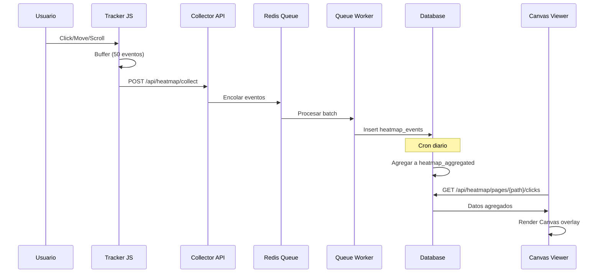

# 180b - Native Heatmaps: Plan de Implementación

> **Documento de diseño aprobado**: Este documento complementa la especificación técnica `180_Platform_Native_Heatmaps_v1_Claude.md`.

**Fecha de creación:** 2026-01-30
**Última actualización:** 2026-01-30
**Versión:** 1.0.0
**Módulo:** `jaraba_heatmap`
**Estimación:** 55-70 horas

---

## 📑 Tabla de Contenidos

1. [Objetivo](#1-objetivo)
2. [Alcance](#2-alcance)
3. [Arquitectura del Módulo](#3-arquitectura-del-módulo)
4. [Modelo de Datos](#4-modelo-de-datos)
5. [Orden de Implementación](#5-orden-de-implementación)
6. [Integración con Analytics Dashboard](#6-integración-con-analytics-dashboard)
7. [Plan de Verificación](#7-plan-de-verificación)
8. [Dependencias](#8-dependencias)

---

## 1. Objetivo

Implementar un sistema de heatmaps 100% nativo para la plataforma Jaraba, eliminando dependencias externas (Microsoft Clarity) y proporcionando:

- **Privacidad**: Datos almacenados en infraestructura propia
- **Control**: Configuración granular por tenant
- **Rendimiento**: Tracking no bloqueante con Beacon API
- **Visualización**: Canvas renderer con gradientes profesionales

---

## 2. Alcance

### Incluido en esta versión

| Funcionalidad | Estado |
|---------------|--------|
| Tracking de clics | ✅ Planificado |
| Tracking de movimiento mouse | ✅ Planificado |
| Tracking de scroll depth | ✅ Planificado |
| Agregación diaria por cron | ✅ Planificado |
| Canvas viewer con overlay | ✅ Planificado |
| Filtros por fecha/dispositivo | ✅ Planificado |

### Fuera de alcance (v2)

- Screenshots automáticos con Puppeteer
- Grabación de sesiones (session replay)
- Click maps con elementos identificados
- Exportación a CSV/PDF

---

## 3. Arquitectura del Módulo

```
modules/custom/jaraba_heatmap/
├── jaraba_heatmap.info.yml
├── jaraba_heatmap.module
├── jaraba_heatmap.install          # Schema 4 tablas
├── jaraba_heatmap.routing.yml
├── jaraba_heatmap.services.yml
├── jaraba_heatmap.permissions.yml
├── jaraba_heatmap.libraries.yml
├── config/
│   ├── install/jaraba_heatmap.settings.yml
│   └── schema/jaraba_heatmap.schema.yml
├── src/
│   ├── Controller/
│   │   ├── HeatmapCollectorController.php    # POST /api/heatmap/collect
│   │   └── HeatmapApiController.php          # GET endpoints
│   ├── Service/
│   │   ├── HeatmapCollectorService.php       # Queue + batch insert
│   │   └── HeatmapAggregatorService.php      # Cron aggregation
│   ├── Plugin/QueueWorker/
│   │   └── HeatmapEventProcessor.php
│   └── Form/
│       └── HeatmapSettingsForm.php
└── js/
    └── heatmap-tracker.js                    # Beacon API + throttling
```

### Diagrama de Flujo



---

## 4. Modelo de Datos

### 4.1 Tabla `heatmap_events` (Raw)

| Campo | Tipo | Descripción |
|-------|------|-------------|
| `id` | SERIAL | PK |
| `tenant_id` | INT | FK a tenant |
| `session_id` | VARCHAR(64) | ID de sesión |
| `page_path` | VARCHAR(2048) | URL de la página |
| `event_type` | VARCHAR(16) | click, move, scroll |
| `x_percent` | DECIMAL(5,2) | Posición X (0-100%) |
| `y_pixel` | INT | Posición Y en píxeles |
| `viewport_width` | INT | Ancho viewport |
| `scroll_depth` | INT | Profundidad scroll (0-100) |
| `element_selector` | VARCHAR(512) | CSS selector del elemento |
| `device_type` | VARCHAR(16) | desktop, tablet, mobile |
| `created_at` | INT | Unix timestamp |

**Retención**: 7 días (limpieza automática)

### 4.2 Tabla `heatmap_aggregated`

| Campo | Tipo | Descripción |
|-------|------|-------------|
| `id` | SERIAL | PK |
| `tenant_id` | INT | FK a tenant |
| `page_path` | VARCHAR(2048) | URL de la página |
| `event_type` | VARCHAR(16) | click, move |
| `x_bucket` | INT | Bucket X (0-20 para 5% cada uno) |
| `y_bucket` | INT | Bucket Y (píxeles, múltiplos de 50) |
| `device_type` | VARCHAR(16) | desktop, tablet, mobile |
| `event_count` | INT | Número de eventos |
| `unique_sessions` | INT | Sesiones únicas |
| `date` | DATE | Fecha de agregación |

**Retención**: 90 días

---

## 5. Orden de Implementación

| # | Tarea | Estimación | Dependencias |
|---|-------|------------|--------------|
| 1 | Estructura básica del módulo (.info, .module, .routing) | 1h | - |
| 2 | Schema .install con 4 tablas | 2h | #1 |
| 3 | HeatmapCollectorController (POST endpoint) | 2h | #2 |
| 4 | heatmap-tracker.js con Beacon API | 4h | #3 |
| 5 | HeatmapCollectorService + Redis Queue | 4h | #3 |
| 6 | HeatmapEventProcessor (Queue Worker) | 3h | #5 |
| 7 | HeatmapAggregatorService (cron) | 5h | #6 |
| 8 | API GET endpoints (pages, clicks, scroll) | 6h | #7 |
| 9 | Canvas Viewer (React/Vanilla JS) | 8h | #8 |
| 10 | Integración Analytics Dashboard | 6h | #9 |
| 11 | Settings Form + slide-panel | 3h | #10 |
| 12 | Tests + documentación | 4h | #11 |

**Total**: 48-58 horas

---

## 6. Integración con Analytics Dashboard

### 6.1 Modificaciones Necesarias

#### AnalyticsDashboardController.php

```php
// Actualizar quick_actions para abrir modal nativo
[
    'title' => $this->t('Ver Heatmaps'),
    'icon' => 'fire',
    'url' => '#',
    'data_attrs' => [
        'heatmap-modal-trigger' => 'true',
    ],
    'color' => 'impulse',
],
```

#### Modal de Heatmaps

El modal actual de "instrucciones MS Clarity" se reemplazará por un visor nativo con:

- Selector de página (dropdown con páginas que tienen datos)
- Selector de tipo (clicks, movimiento, scroll)
- Filtros de fecha (últimos 7/30/90 días)
- Filtro de dispositivo (desktop, tablet, mobile)
- Canvas con overlay sobre screenshot

---

## 7. Plan de Verificación

### 7.1 Tracker JavaScript

```bash
# 1. Verificar carga del tracker
# Navegador: Console → Network → buscar heatmap-tracker.js

# 2. Hacer interacciones
# Click en varios elementos, scroll, mover mouse

# 3. Verificar envío
# Network → POST /api/heatmap/collect (status 204)

# 4. Verificar datos en BD
docker exec jarabasaas_appserver_1 drush sql:query \
  "SELECT COUNT(*) FROM heatmap_events"
```

### 7.2 Agregación Cron

```bash
# Ejecutar agregación manual
docker exec jarabasaas_appserver_1 drush php:eval \
  '\Drupal::service("jaraba_heatmap.aggregator")->aggregateDaily();'

# Verificar datos agregados
docker exec jarabasaas_appserver_1 drush sql:query \
  "SELECT * FROM heatmap_aggregated LIMIT 10"
```

### 7.3 Visualización

1. Navegar a `/page-builder/analytics`
2. Click en "Ver Heatmaps"
3. Seleccionar página con datos
4. Verificar renderizado Canvas
5. Verificar filtros funcionan

---

## 8. Dependencias

### 8.1 Módulos Drupal

| Módulo | Propósito |
|--------|-----------|
| `jaraba_tenant` | Contexto multi-tenant |
| `jaraba_page_builder` | Integración Analytics |

### 8.2 Infraestructura

| Servicio | Propósito |
|----------|-----------|
| Redis | Cola de procesamiento |
| MySQL/MariaDB | Almacenamiento |

### 8.3 Frontend

| Librería | Propósito |
|----------|-----------|
| Canvas API | Renderizado heatmap |
| Beacon API | Envío no bloqueante |

---

## 9. Anexo: Gaps y Frontends Pendientes del Page Builder

> Esta sección documenta los elementos pendientes del ecosistema Page Builder para visibilidad del backlog.

### 9.1 Gaps Pendientes (Prioridad Alta)

| Gap | Nombre | Descripción | Esfuerzo |
|-----|--------|-------------|----------|
| **D** | Premium Blocks | 6 bloques premium faltantes para completar catálogo | 30h |
| **E** | Advanced i18n UI | Flujo de traducción asistido por IA | 20h |

### 9.2 Frontends Pendientes por Página

| Página | Ruta | Frontend Pendiente | Estado |
|--------|------|-------------------|--------|
| Analytics Dashboard | `/page-builder/analytics` | Modal nativo Heatmaps (reemplazo Clarity) | 🔄 Este plan |
| Template Picker | `/page-builder/templates` | Filtros por categoría/vertical | ⏳ Backlog |
| Mis Páginas | `/page-builder/pages` | Búsqueda y ordenación avanzada | ⏳ Backlog |
| Editor de Página | `/page-builder/pages/{id}/edit` | Modal de SEO inline | ⏳ Backlog |
| Preview Premium | `/page-builder/templates/.../preview` | Anotaciones interactivas | ⏳ Backlog |
| Experimentos A/B | `/page-builder/experiments` | Gráficos de conversión (Chart.js) | ⏳ Backlog |

### 9.3 Gaps de Plataforma Core (Referencia)

| Gap | Nombre | Documento |
|-----|--------|-----------|
| #1 | Agentes IA Autónomos | `108_Platform_AI_Agent_Flows` |
| #2 | PWA/Mobile | `109_Platform_PWA_Mobile` |
| #3 | Onboarding Product-Led | `110_Platform_Onboarding` |
| #4 | Usage-Based Pricing | `111_Platform_UsageBased_Pricing` |
| #9 | Analytics Avanzado | Relacionado con este plan |

---

## Registro de Cambios

| Fecha | Versión | Descripción |
|-------|---------|-------------|
| 2026-01-30 | 1.0.0 | Documento inicial creado |
| 2026-01-30 | 1.1.0 | Añadido Anexo de Gaps y Frontends Pendientes |

---

> **Referencia**: [Especificación Técnica Completa](./20260130a-180_Platform_Native_Heatmaps_v1_Claude.md)

