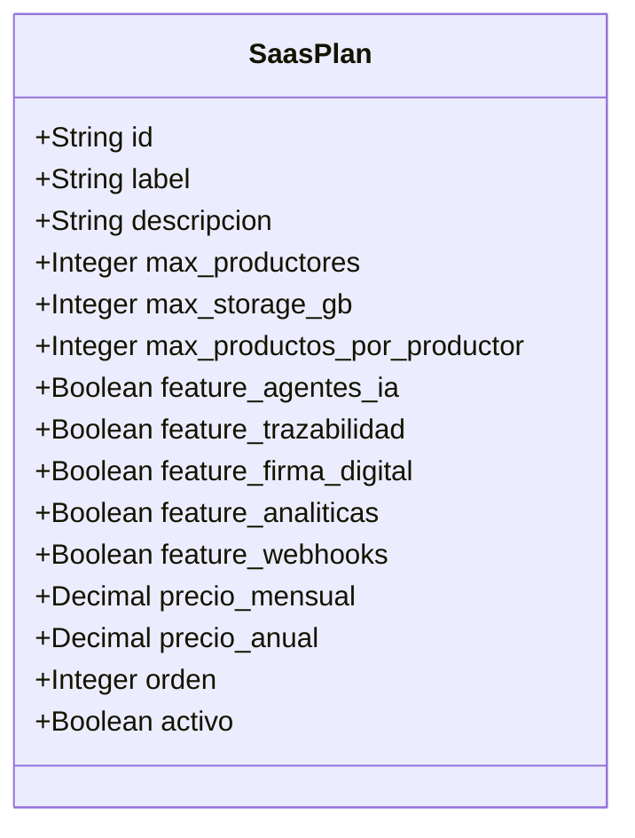
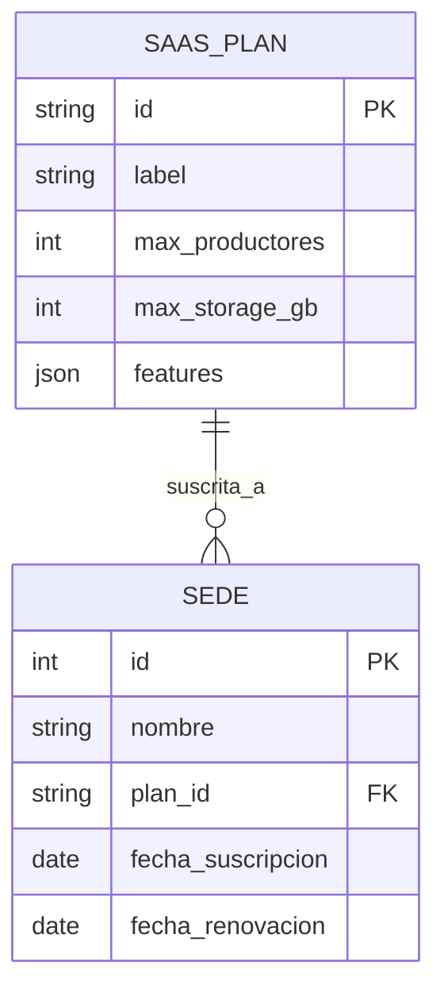
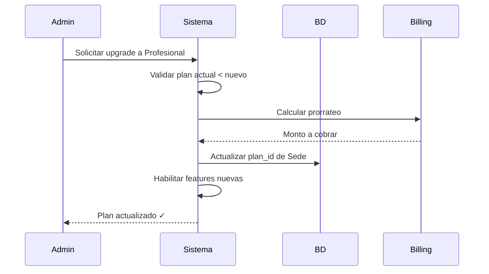

# Definición de Planes SaaS - JarabaImpactPlatformSaaS

**Fecha de creación:** 2026-01-09 19:08  
**Última actualización:** 2026-01-09 19:08  
**Autor:** IA Asistente (Arquitecto SaaS Senior)  
**Versión:** 1.0.0  
**Categoría:** Lógica de Negocio

---

## 📑 Tabla de Contenidos (TOC)

1. [Propósito](#1-propósito)
2. [Modelo de Planes](#2-modelo-de-planes)
3. [Definición de Cada Plan](#3-definición-de-cada-plan)
4. [Implementación como Config Entity](#4-implementación-como-config-entity)
5. [Validación de Límites](#5-validación-de-límites)
6. [Gestión de Cambios de Plan](#6-gestión-de-cambios-de-plan)
7. [Configuración Inicial](#7-configuración-inicial)
8. [Registro de Cambios](#8-registro-de-cambios)

---

## 1. Propósito

Este documento define los **Planes de Suscripción SaaS** de la plataforma JarabaImpactPlatformSaaS. Los planes determinan:

- Límites de recursos por Sede
- Features disponibles
- Pricing (referencial)

> **⚠️ DIRECTRIZ CRÍTICA**: Todos los límites y features se configuran mediante **Config Entities de Drupal**, nunca hardcodeados en el código. Ver [Principios de Desarrollo](../00_DIRECTRICES_PROYECTO.md#5-principios-de-desarrollo).

---

## 2. Modelo de Planes

### 2.1 Estructura del Plan

Cada plan se define con los siguientes atributos:



### 2.2 Relación con Sedes



---

## 3. Definición de Cada Plan

### 3.1 Plan Básico

| Atributo | Valor |
|----------|-------|
| **ID** | `basico` |
| **Nombre** | Plan Básico |
| **Descripción** | Para pequeños productores o pruebas iniciales |
| **Productores máx.** | 10 |
| **Storage máx.** | 5 GB |
| **Productos/productor** | 50 |
| **Agentes IA** | ❌ No incluido |
| **Trazabilidad** | ❌ No incluido |
| **Firma Digital** | ❌ No incluido |
| **Analíticas** | ❌ No incluido |
| **Webhooks** | ❌ No incluido |
| **Precio mensual** | 29€ |
| **Precio anual** | 290€ (1 mes gratis) |

**Caso de uso**: Cooperativas pequeñas que quieren iniciar en e-commerce.

---

### 3.2 Plan Profesional

| Atributo | Valor |
|----------|-------|
| **ID** | `profesional` |
| **Nombre** | Plan Profesional |
| **Descripción** | Para sedes en crecimiento con necesidades de automatización |
| **Productores máx.** | 50 |
| **Storage máx.** | 25 GB |
| **Productos/productor** | 200 |
| **Agentes IA** | ✅ Limitada (100 peticiones/mes) |
| **Trazabilidad** | ✅ Incluido |
| **Firma Digital** | ❌ No incluido |
| **Analíticas** | ✅ Básicas |
| **Webhooks** | ✅ 5 webhooks |
| **Precio mensual** | 79€ |
| **Precio anual** | 790€ (1 mes gratis) |

**Caso de uso**: Denominaciones de origen, asociaciones de productores.

---

### 3.3 Plan Enterprise

| Atributo | Valor |
|----------|-------|
| **ID** | `enterprise` |
| **Nombre** | Plan Enterprise |
| **Descripción** | Para grandes organizaciones con requisitos avanzados |
| **Productores máx.** | Ilimitado (-1) |
| **Storage máx.** | 100 GB |
| **Productos/productor** | Ilimitado (-1) |
| **Agentes IA** | ✅ Completa (ilimitado) |
| **Trazabilidad** | ✅ Incluido + Blockchain |
| **Firma Digital** | ✅ FNMT/AutoFirma |
| **Analíticas** | ✅ Avanzadas + Exportación |
| **Webhooks** | ✅ Ilimitados |
| **Precio mensual** | Contactar |
| **Precio anual** | Contactar |

**Caso de uso**: Consejos reguladores, grandes cooperativas, instituciones.

---

### 3.4 Tabla Comparativa

| Feature | Básico | Profesional | Enterprise |
|---------|--------|-------------|------------|
| **Productores** | 10 | 50 | ∞ |
| **Storage** | 5 GB | 25 GB | 100 GB |
| **Productos/productor** | 50 | 200 | ∞ |
| **Agentes IA** | ❌ | ⚠️ Limitada | ✅ |
| **Trazabilidad** | ❌ | ✅ | ✅ + Blockchain |
| **Firma Digital** | ❌ | ❌ | ✅ |
| **Analíticas** | ❌ | ✅ Básicas | ✅ Avanzadas |
| **Webhooks** | ❌ | 5 | ∞ |
| **Soporte** | Email | Email + Chat | Dedicado |
| **Precio/mes** | 29€ | 79€ | Consultar |

---

## 4. Implementación como Config Entity

### 4.1 Definición de la Entidad

```php
<?php

namespace Drupal\ecosistema_jaraba_core\Entity;

use Drupal\Core\Config\Entity\ConfigEntityBase;

/**
 * Define la entidad de configuración para Planes SaaS.
 *
 * PROPÓSITO:
 * Permite definir planes de suscripción con límites y features
 * configurables desde la UI de Drupal, sin hardcodear valores.
 *
 * ESTRUCTURA:
 * - Config Entity exportable vía drush cex
 * - Editable desde /admin/structure/saas-plan
 * - Campos tipados con validación
 *
 * @ConfigEntityType(
 *   id = "saas_plan",
 *   label = @Translation("Plan SaaS"),
 *   label_collection = @Translation("Planes SaaS"),
 *   label_singular = @Translation("plan SaaS"),
 *   label_plural = @Translation("planes SaaS"),
 *   handlers = {
 *     "list_builder" = "Drupal\ecosistema_jaraba_core\SaasPlanListBuilder",
 *     "form" = {
 *       "add" = "Drupal\ecosistema_jaraba_core\Form\SaasPlanForm",
 *       "edit" = "Drupal\ecosistema_jaraba_core\Form\SaasPlanForm",
 *       "delete" = "Drupal\Core\Entity\EntityDeleteForm",
 *     },
 *     "route_provider" = {
 *       "html" = "Drupal\Core\Entity\Routing\AdminHtmlRouteProvider",
 *     },
 *   },
 *   config_prefix = "plan",
 *   admin_permission = "administer saas plans",
 *   entity_keys = {
 *     "id" = "id",
 *     "label" = "label",
 *     "weight" = "weight",
 *   },
 *   config_export = {
 *     "id",
 *     "label",
 *     "description",
 *     "max_productores",
 *     "max_storage_gb",
 *     "max_productos_por_productor",
 *     "feature_agentes_ia",
 *     "feature_trazabilidad",
 *     "feature_firma_digital",
 *     "feature_analiticas",
 *     "feature_webhooks",
 *     "limite_peticiones_ia",
 *     "limite_webhooks",
 *     "precio_mensual",
 *     "precio_anual",
 *     "weight",
 *     "status",
 *   },
 *   links = {
 *     "collection" = "/admin/structure/saas-plan",
 *     "add-form" = "/admin/structure/saas-plan/add",
 *     "edit-form" = "/admin/structure/saas-plan/{saas_plan}/edit",
 *     "delete-form" = "/admin/structure/saas-plan/{saas_plan}/delete",
 *   },
 * )
 */
class SaasPlan extends ConfigEntityBase implements SaasPlanInterface {

  /**
   * ID del plan (machine name).
   */
  protected $id;

  /**
   * Nombre del plan.
   */
  protected $label;

  /**
   * Descripción del plan.
   */
  protected $description;

  /**
   * Máximo de productores permitidos (-1 = ilimitado).
   */
  protected $max_productores = 10;

  /**
   * Máximo storage en GB.
   */
  protected $max_storage_gb = 5;

  /**
   * Máximo productos por productor (-1 = ilimitado).
   */
  protected $max_productos_por_productor = 50;

  /**
   * Features como booleanos.
   */
  protected $feature_agentes_ia = FALSE;
  protected $feature_trazabilidad = FALSE;
  protected $feature_firma_digital = FALSE;
  protected $feature_analiticas = FALSE;
  protected $feature_webhooks = FALSE;

  /**
   * Límites numéricos para features (-1 = ilimitado).
   */
  protected $limite_peticiones_ia = 0;
  protected $limite_webhooks = 0;

  /**
   * Pricing.
   */
  protected $precio_mensual = 0;
  protected $precio_anual = 0;

  /**
   * Peso para ordenación.
   */
  protected $weight = 0;

  // ========== GETTERS ==========

  /**
   * Verifica si el límite de productores es ilimitado.
   */
  public function hasUnlimitedProductores(): bool {
    return $this->max_productores === -1;
  }

  /**
   * Obtiene el límite de productores.
   */
  public function getMaxProductores(): int {
    return (int) $this->max_productores;
  }

  /**
   * Verifica si una feature específica está habilitada.
   *
   * @param string $feature
   *   Nombre de la feature: 'agentes_ia', 'trazabilidad', etc.
   */
  public function hasFeature(string $feature): bool {
    $property = 'feature_' . $feature;
    return !empty($this->{$property});
  }

  /**
   * Obtiene el límite de peticiones IA por mes.
   */
  public function getLimitePeticionesIa(): int {
    return (int) $this->limite_peticiones_ia;
  }

}
```

### 4.2 Schema de Configuración

```yaml
# config/schema/ecosistema_jaraba_core.schema.yml

ecosistema_jaraba_core.plan.*:
  type: config_entity
  label: 'Plan SaaS'
  mapping:
    id:
      type: string
      label: 'ID'
    label:
      type: label
      label: 'Nombre'
    description:
      type: text
      label: 'Descripción'
    max_productores:
      type: integer
      label: 'Máximo productores'
    max_storage_gb:
      type: integer
      label: 'Máximo storage (GB)'
    max_productos_por_productor:
      type: integer
      label: 'Máximo productos por productor'
    feature_agentes_ia:
      type: boolean
      label: 'Agentes IA habilitados'
    feature_trazabilidad:
      type: boolean
      label: 'Trazabilidad habilitada'
    feature_firma_digital:
      type: boolean
      label: 'Firma digital habilitada'
    feature_analiticas:
      type: boolean
      label: 'Analíticas habilitadas'
    feature_webhooks:
      type: boolean
      label: 'Webhooks habilitados'
    limite_peticiones_ia:
      type: integer
      label: 'Límite peticiones IA/mes'
    limite_webhooks:
      type: integer
      label: 'Límite webhooks'
    precio_mensual:
      type: float
      label: 'Precio mensual'
    precio_anual:
      type: float
      label: 'Precio anual'
    weight:
      type: integer
      label: 'Peso'
    status:
      type: boolean
      label: 'Estado'
```

---

## 5. Validación de Límites

### 5.1 Servicio de Validación

```php
<?php

namespace Drupal\ecosistema_jaraba_core\Service;

/**
 * Servicio para validar límites del plan SaaS.
 *
 * PROPÓSITO:
 * Encapsula toda la lógica de validación de límites,
 * leyendo siempre desde Config Entities, nunca valores fijos.
 *
 * DEPENDENCIAS:
 * - EntityTypeManager: Para cargar planes y sedes
 * - FileSystem: Para calcular storage usado
 */
class PlanLimitValidator {

  /**
   * Verifica si la sede puede añadir más productores.
   *
   * @param \Drupal\ecosistema_jaraba_core\Entity\SedeInterface $sede
   *   La sede a validar.
   *
   * @return bool
   *   TRUE si puede añadir, FALSE si alcanzó el límite.
   */
  public function canAddProducer(SedeInterface $sede): bool {
    $plan = $this->getPlanForSede($sede);
    
    if (!$plan) {
      return FALSE;
    }
    
    // -1 significa ilimitado
    if ($plan->hasUnlimitedProductores()) {
      return TRUE;
    }
    
    $currentCount = $this->countProducers($sede);
    return $currentCount < $plan->getMaxProductores();
  }

  /**
   * Verifica si una feature está disponible para la sede.
   *
   * @param \Drupal\ecosistema_jaraba_core\Entity\SedeInterface $sede
   *   La sede a validar.
   * @param string $feature
   *   Nombre de la feature.
   *
   * @return bool
   *   TRUE si la feature está habilitada en el plan.
   */
  public function hasFeature(SedeInterface $sede, string $feature): bool {
    $plan = $this->getPlanForSede($sede);
    return $plan ? $plan->hasFeature($feature) : FALSE;
  }

  /**
   * Obtiene el uso actual de recursos.
   *
   * @return array
   *   Array con 'used' y 'limit' para cada recurso.
   */
  public function getResourceUsage(SedeInterface $sede): array {
    $plan = $this->getPlanForSede($sede);
    
    return [
      'productores' => [
        'used' => $this->countProducers($sede),
        'limit' => $plan->getMaxProductores(),
        'unlimited' => $plan->hasUnlimitedProductores(),
      ],
      'storage_gb' => [
        'used' => $this->calculateStorageUsed($sede),
        'limit' => $plan->get('max_storage_gb'),
        'unlimited' => FALSE,
      ],
      'peticiones_ia' => [
        'used' => $this->countIaRequestsThisMonth($sede),
        'limit' => $plan->getLimitePeticionesIa(),
        'unlimited' => $plan->getLimitePeticionesIa() === -1,
      ],
    ];
  }

}
```

### 5.2 Uso en Controladores

```php
// En ProducerController.php

public function create(Request $request) {
    $sede = $this->sedeManager->getCurrentSede();
    
    // Validar límite usando el servicio (lee de Config Entity)
    if (!$this->planValidator->canAddProducer($sede)) {
        $plan = $this->planValidator->getPlanForSede($sede);
        throw new PlanLimitException(
            sprintf(
                'Has alcanzado el límite de %d productores de tu plan %s. Actualiza tu plan para añadir más.',
                $plan->getMaxProductores(),
                $plan->label()
            )
        );
    }
    
    // Continuar con la creación...
}
```

---

## 6. Gestión de Cambios de Plan

### 6.1 Upgrade de Plan



### 6.2 Downgrade de Plan

> **⚠️ IMPORTANTE**: El downgrade solo es posible si los recursos actuales no exceden los límites del nuevo plan.

```php
public function canDowngrade(SedeInterface $sede, SaasPlanInterface $newPlan): array {
    $issues = [];
    
    $currentProducers = $this->countProducers($sede);
    if (!$newPlan->hasUnlimitedProductores() && 
        $currentProducers > $newPlan->getMaxProductores()) {
        $issues[] = sprintf(
            'Tienes %d productores pero el plan %s solo permite %d. Elimina %d productores primero.',
            $currentProducers,
            $newPlan->label(),
            $newPlan->getMaxProductores(),
            $currentProducers - $newPlan->getMaxProductores()
        );
    }
    
    // Similar para storage, productos, etc.
    
    return $issues;
}
```

---

## 7. Configuración Inicial

### 7.1 YAML de Configuración por Defecto

Crear en `config/install/`:

```yaml
# ecosistema_jaraba_core.plan.basico.yml
id: basico
label: 'Plan Básico'
description: 'Para pequeños productores o pruebas iniciales'
max_productores: 10
max_storage_gb: 5
max_productos_por_productor: 50
feature_agentes_ia: false
feature_trazabilidad: false
feature_firma_digital: false
feature_analiticas: false
feature_webhooks: false
limite_peticiones_ia: 0
limite_webhooks: 0
precio_mensual: 29.00
precio_anual: 290.00
weight: 0
status: true
```

```yaml
# ecosistema_jaraba_core.plan.profesional.yml
id: profesional
label: 'Plan Profesional'
description: 'Para sedes en crecimiento con necesidades de automatización'
max_productores: 50
max_storage_gb: 25
max_productos_por_productor: 200
feature_agentes_ia: true
feature_trazabilidad: true
feature_firma_digital: false
feature_analiticas: true
feature_webhooks: true
limite_peticiones_ia: 100
limite_webhooks: 5
precio_mensual: 79.00
precio_anual: 790.00
weight: 1
status: true
```

```yaml
# ecosistema_jaraba_core.plan.enterprise.yml
id: enterprise
label: 'Plan Enterprise'
description: 'Para grandes organizaciones con requisitos avanzados'
max_productores: -1
max_storage_gb: 100
max_productos_por_productor: -1
feature_agentes_ia: true
feature_trazabilidad: true
feature_firma_digital: true
feature_analiticas: true
feature_webhooks: true
limite_peticiones_ia: -1
limite_webhooks: -1
precio_mensual: 0
precio_anual: 0
weight: 2
status: true
```

### 7.2 Instalación

```bash
# Importar configuración tras habilitar el módulo
lando drush cim -y

# Verificar planes creados
lando drush config:list | grep ecosistema_jaraba_core.plan
```

---

## 8. Registro de Cambios

| Fecha | Versión | Descripción |
|-------|---------|-------------|
| 2026-01-09 | 1.0.0 | Creación inicial con 3 planes (Básico, Profesional, Enterprise) |
