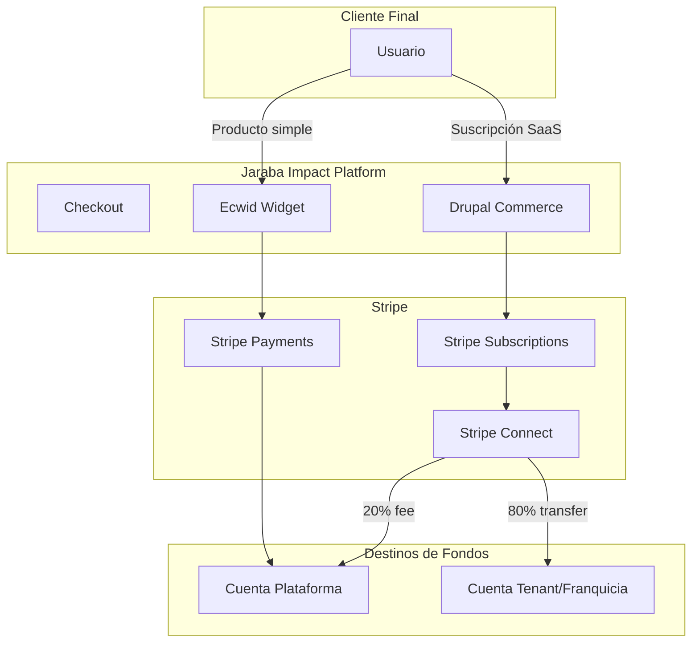
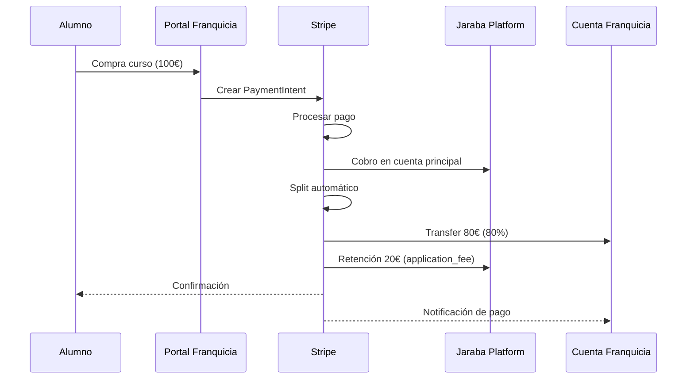
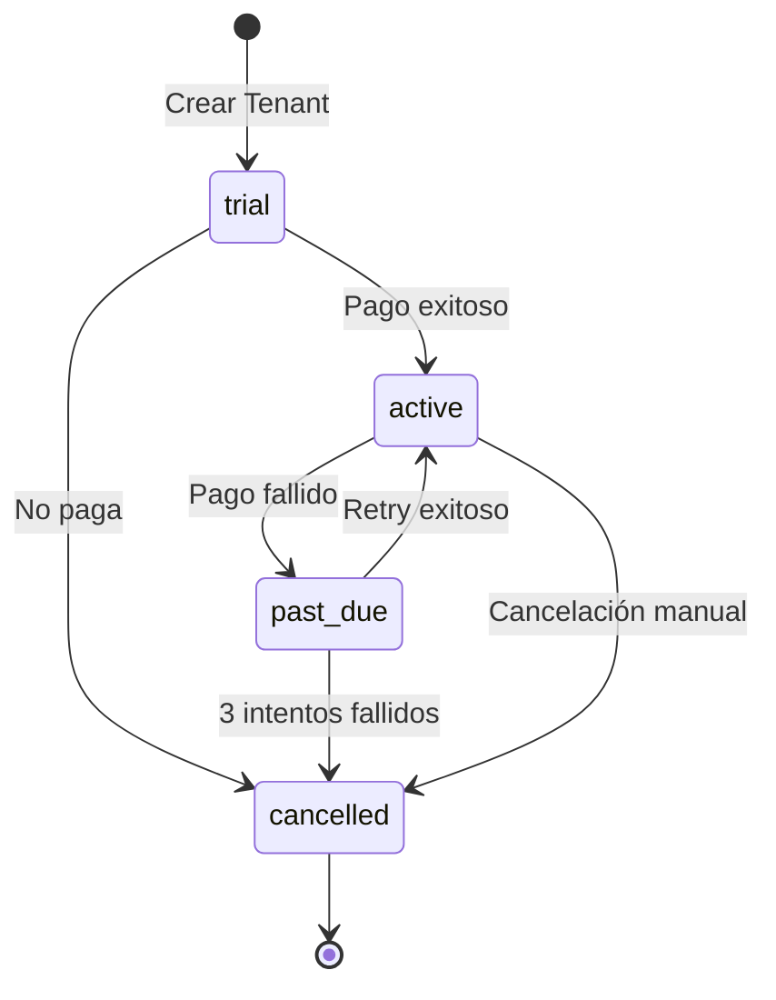
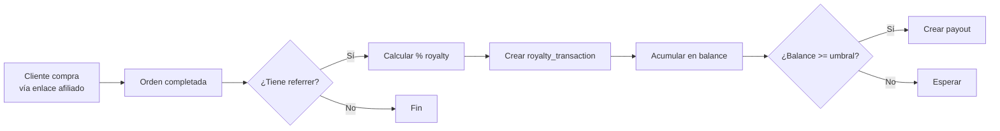

# Pagos y Monetización SaaS - JarabaImpactPlatformSaaS

**Fecha de creación:** 2026-01-09 19:34  
**Última actualización:** 2026-01-09 19:34  
**Autor:** IA Asistente (Arquitecto SaaS Senior)  
**Versión:** 1.0.0  
**Categoría:** Lógica de Negocio

> **Fuente**: [Documento Técnico Maestro](../tecnicos/20260109e-DOCUMENTO_TECNICO_MAESTRO_SaaS_CONSOLIDADO_Claude.md) - Sección 7

---

## 📑 Tabla de Contenidos (TOC)

1. [Arquitectura de Pagos](#1-arquitectura-de-pagos)
2. [Stripe Connect para Franquicias](#2-stripe-connect-para-franquicias)
3. [Suscripciones SaaS](#3-suscripciones-saas)
4. [Sistema de Royalties](#4-sistema-de-royalties)
5. [Automatización con ECA](#5-automatización-con-eca)
6. [Implementación Técnica](#6-implementación-técnica)
7. [Registro de Cambios](#7-registro-de-cambios)

---

## 1. Arquitectura de Pagos

### 1.1 Tipos de Transacción

| Tipo | Herramienta | Flujo |
|------|-------------|-------|
| **Productos simples** | Ecwid | Checkout rápido, widget embebido, sincronización con Drupal |
| **Suscripciones SaaS** | Commerce Recurring | Cobro automático mensual/anual, gestión de estados |
| **Franquicias (split)** | Stripe Connect | Cobro a plataforma → transfer a franquicia − fee |
| **Royalties** | Commerce + Custom | Cálculo automático, acumulación, liquidación periódica |

### 1.2 Diagrama de Flujo de Pagos



---

## 2. Stripe Connect para Franquicias

### 2.1 Modelo de Split Payments

El modelo de franquicia digital requiere **split payments automatizados**. Stripe Connect con Express Accounts es la solución:



### 2.2 Configuración en Tenant

```php
/**
 * Campos del Tenant para Stripe Connect.
 */
// En la Content Entity Tenant
$fields['stripe_customer_id'] = BaseFieldDefinition::create('string')
  ->setLabel(t('Stripe Customer ID'))
  ->setDescription(t('ID del cliente en Stripe para cobro de suscripción'));

$fields['stripe_connect_id'] = BaseFieldDefinition::create('string')
  ->setLabel(t('Stripe Connect Account ID'))
  ->setDescription(t('ID de cuenta conectada (solo franquicias)'));

$fields['commission_rate'] = BaseFieldDefinition::create('decimal')
  ->setLabel(t('Tasa de Comisión (%)'))
  ->setDescription(t('Porcentaje que retiene la plataforma'))
  ->setDefaultValue(20)
  ->setDisplayConfigurable('form', TRUE);
```

### 2.3 Onboarding de Cuenta Conectada

```php
/**
 * Servicio para gestionar Stripe Connect.
 */
class StripeConnectService {

  /**
   * Crea una cuenta Express para un nuevo franquiciado.
   */
  public function createConnectedAccount(TenantInterface $tenant): string {
    $account = $this->stripeClient->accounts->create([
      'type' => 'express',
      'country' => 'ES',
      'email' => $tenant->getAdminEmail(),
      'capabilities' => [
        'card_payments' => ['requested' => true],
        'transfers' => ['requested' => true],
      ],
      'business_profile' => [
        'name' => $tenant->getName(),
        'mcc' => '5815', // Digital goods
      ],
    ]);
    
    // Guardar ID en el tenant
    $tenant->set('stripe_connect_id', $account->id);
    $tenant->save();
    
    return $account->id;
  }

  /**
   * Genera URL de onboarding para completar datos bancarios.
   */
  public function getOnboardingUrl(TenantInterface $tenant): string {
    $accountLink = $this->stripeClient->accountLinks->create([
      'account' => $tenant->get('stripe_connect_id')->value,
      'refresh_url' => $this->getRefreshUrl($tenant),
      'return_url' => $this->getReturnUrl($tenant),
      'type' => 'account_onboarding',
    ]);
    
    return $accountLink->url;
  }
}
```

---

## 3. Suscripciones SaaS

### 3.1 Ciclo de Vida de Suscripción



### 3.2 Estados de Suscripción

| Estado | Descripción | Acciones |
|--------|-------------|----------|
| `trial` | Período de prueba (14 días por defecto) | Acceso completo, email de recordatorio |
| `active` | Suscripción activa, pagos al día | Acceso completo |
| `past_due` | Pago fallido, en reintentos | Acceso limitado, emails de aviso |
| `cancelled` | Suscripción cancelada | Acceso de solo lectura, luego bloqueo |

### 3.3 Campos de Plan de Suscripción

Según el documento maestro, la Content Entity `Plan de Suscripción` debe incluir:

| Campo | Tipo | Descripción |
|-------|------|-------------|
| `name` | string | Starter, Professional, Enterprise |
| `vertical` | entity_ref | Vertical a la que pertenece |
| `price_monthly` | commerce_price | Precio mensual en EUR |
| `price_yearly` | commerce_price | Precio anual (con descuento) |
| `features` | list_string | Lista de características incluidas |
| `limits` | json | `{users: 5, storage_gb: 10, ai_queries: 100}` |
| `stripe_price_id` | string | ID del precio en Stripe para cobro automático |

---

## 4. Sistema de Royalties

### 4.1 Modelo de Royalties

Para consultores/afiliados que traen clientes:



### 4.2 Entidad: Royalty Transaction

| Campo | Tipo | Descripción |
|-------|------|-------------|
| `order_id` | entity_ref | Orden que generó el royalty |
| `referrer` | entity_ref | Usuario que refirió |
| `tenant` | entity_ref | Tenant donde ocurrió la venta |
| `amount` | commerce_price | Monto del royalty |
| `status` | list_string | pending, paid, cancelled |
| `payout_id` | string | ID del pago cuando se liquida |

---

## 5. Automatización con ECA

### 5.1 ¿Qué es ECA?

**ECA** (Event-Condition-Action) es el módulo de Drupal para automatización de workflows sin código. Reemplaza a Rules en Drupal 8+.

### 5.2 Reglas ECA para Monetización

| Regla | Evento | Condición | Acción |
|-------|--------|-----------|--------|
| **Cobro de Suscripción** | Cron diario | `renewal_date == hoy` | Crear order → Cobrar → Actualizar fecha → Email |
| **Gestión de Impagos** | Pago fallido | - | Incrementar retry_count → Notificar → Si 3 fallos → Downgrade plan |
| **Cálculo de Royalties** | `order.paid` | Tenant tiene referrer | Calcular % → Crear royalty_transaction |
| **Liquidación Royalties** | Cron mensual | `balance >= umbral` | Crear payout → Marcar liquidado → Email |
| **Trial Expiring** | Cron diario | 3 días antes fin trial | Email recordatorio con CTA upgrade |
| **Onboarding Tenant** | `tenant.create` | - | Crear grupo → Asignar domain → Clonar contenido base → Email welcome |

### 5.3 Ejemplo: Regla de Impago

```yaml
# config/eca/eca.model.payment_failed.yml
id: payment_failed
label: 'Gestión de pago fallido'
events:
  - plugin: commerce_payment_failed
conditions:
  - plugin: entity_field_value
    config:
      field: retry_count
      operator: '<'
      value: 3
actions:
  - plugin: entity_field_value_set
    config:
      field: retry_count
      value: '[entity:retry_count] + 1'
  - plugin: send_email
    config:
      to: '[entity:subscription:owner:mail]'
      subject: 'Problema con tu pago - Jaraba Impact Platform'
      body: |
        Hola [entity:subscription:owner:name],
        
        No hemos podido procesar tu pago. Por favor, actualiza tu método de pago.
        
        Intentos restantes: [3 - entity:retry_count]
```

---

## 6. Implementación Técnica

### 6.1 Módulos Requeridos

| Módulo | Propósito |
|--------|-----------|
| `commerce` | E-commerce core |
| `commerce_recurring` | Suscripciones |
| `commerce_stripe` | Integración Stripe |
| `stripe_connect` | Split payments (custom o contrib) |
| `eca` | Automatización de workflows |
| `eca_commerce` | Eventos de Commerce para ECA |

### 6.2 Configuración de Stripe

```php
// settings.php o settings.local.php
$settings['stripe'] = [
  'secret_key' => getenv('STRIPE_SECRET_KEY'),
  'publishable_key' => getenv('STRIPE_PUBLISHABLE_KEY'),
  'webhook_secret' => getenv('STRIPE_WEBHOOK_SECRET'),
  'connect_client_id' => getenv('STRIPE_CONNECT_CLIENT_ID'),
];
```

### 6.3 Webhooks de Stripe

| Evento Stripe | Acción en Drupal |
|---------------|------------------|
| `invoice.paid` | Actualizar subscription_status a 'active' |
| `invoice.payment_failed` | Disparar ECA de impago |
| `customer.subscription.deleted` | Marcar tenant como cancelled |
| `account.updated` | Actualizar estado de cuenta conectada |

---

## 7. Registro de Cambios

| Fecha | Versión | Descripción |
|-------|---------|-------------|
| 2026-01-09 | 1.0.0 | Creación inicial basada en Doc. Maestro §7 |
