# Flujo de Onboarding de Tenant - JarabaImpactPlatformSaaS

**Fecha de creación:** 2026-01-09 19:59  
**Última actualización:** 2026-01-09 19:59  
**Autor:** IA Asistente (Arquitecto SaaS Senior)  
**Versión:** 1.0.0  
**Categoría:** Lógica de Negocio

> **Fuente**: [Documento Técnico Maestro](../tecnicos/20260109e-DOCUMENTO_TECNICO_MAESTRO_SaaS_CONSOLIDADO_Claude.md) - Sección 4

---

## 📑 Tabla de Contenidos (TOC)

1. [Visión General](#1-visión-general)
2. [Diagrama de Flujo Completo](#2-diagrama-de-flujo-completo)
3. [Fase 1: Registro Inicial](#3-fase-1-registro-inicial)
4. [Fase 2: Configuración de Tenant](#4-fase-2-configuración-de-tenant)
5. [Fase 3: Activación del Servicio](#5-fase-3-activación-del-servicio)
6. [Fase 4: Post-Onboarding](#6-fase-4-post-onboarding)
7. [Automatizaciones ECA](#7-automatizaciones-eca)
8. [Implementación Técnica](#8-implementación-técnica)
9. [Registro de Cambios](#9-registro-de-cambios)

---

## 1. Visión General

### 1.1 Objetivo del Proceso

El onboarding de Tenant es el proceso mediante el cual una nueva organización se registra en la plataforma, configura su entorno y comienza a operar. Este flujo es **crítico** porque:

- Es la **primera impresión** del cliente con la plataforma
- Establece la **estructura de datos** para todo el ciclo de vida
- Conecta múltiples sistemas: Drupal, Stripe, Domain Access, Group

### 1.2 Actores Involucrados

| Actor | Rol en Onboarding |
|-------|-------------------|
| **Prospecto** | Inicia el registro, proporciona datos |
| **Sistema** | Automatiza creación de recursos |
| **Admin Plataforma** | Aprueba dominios personalizados (opcional) |
| **Stripe** | Gestiona trial y suscripción |

### 1.3 Tiempo Objetivo

| Métrica | Objetivo |
|---------|----------|
| **Registro → Tenant activo** | < 5 minutos |
| **Primer productor creado** | < 10 minutos |
| **Tienda operativa** | < 30 minutos |

---

## 2. Diagrama de Flujo Completo

```mermaid
flowchart TB
    subgraph registro["📝 Fase 1: Registro"]
        A[Usuario visita landing] --> B[Selecciona Vertical]
        B --> C[Selecciona Plan]
        C --> D[Formulario de registro]
        D --> E{Validación datos}
        E -->|Inválido| D
        E -->|Válido| F[Crear cuenta usuario]
    end
    
    subgraph config["⚙️ Fase 2: Configuración"]
        F --> G[Crear entidad Tenant]
        G --> H[Asignar a Vertical Group]
        H --> I[Crear Tenant Group]
        I --> J[Configurar Domain Access]
        J --> K[Aplicar tema por defecto]
    end
    
    subgraph stripe["💳 Fase 3: Stripe"]
        K --> L[Crear Stripe Customer]
        L --> M{Plan requiere pago?}
        M -->|Trial| N[Iniciar período trial]
        M -->|Pago| O[Checkout Stripe]
        O --> P{Pago exitoso?}
        P -->|No| Q[Reintentar/Cancelar]
        P -->|Sí| R[Activar suscripción]
        N --> R
    end
    
    subgraph activar["✅ Fase 4: Activación"]
        R --> S[Marcar Tenant como activo]
        S --> T[Enviar email bienvenida]
        T --> U[Redirigir a panel admin]
        U --> V[Mostrar wizard inicial]
    end
    
    subgraph post["🚀 Post-Onboarding"]
        V --> W[Configurar marca/tema]
        W --> X[Crear primer productor]
        X --> Y[Conectar Ecwid]
        Y --> Z[Tenant operativo]
    end
```



---

## 3. Fase 1: Registro Inicial

### 3.1 Landing de Captación

```yaml
# URL: /{vertical}/registro o /registro?vertical=agroconecta
Elementos:
  - Hero con propuesta de valor
  - Selector de planes (cards comparativas)
  - CTA "Empezar prueba gratuita"
  - Testimonios/casos de éxito
```

### 3.2 Formulario de Registro

| Campo | Tipo | Validación | Obligatorio |
|-------|------|------------|-------------|
| `nombre_empresa` | string | min:3, max:100 | ✅ |
| `email_admin` | email | unique, valid | ✅ |
| `password` | password | min:8, complexity | ✅ |
| `telefono` | phone | formato válido | ❌ |
| `subdominio` | slug | unique, alphanumeric | ✅ |
| `vertical` | select | exists in verticals | ✅ |
| `plan` | select | exists in plans | ✅ |
| `acepta_terminos` | checkbox | must be true | ✅ |
| `acepta_marketing` | checkbox | - | ❌ |

### 3.3 Validaciones en Tiempo Real

```javascript
// Validación de subdominio disponible
async function checkSubdomain(slug) {
  const response = await fetch(`/api/check-subdomain?slug=${slug}`);
  const { available, suggestions } = await response.json();
  
  if (!available) {
    showSuggestions(suggestions); // ej: slug-1, slug-empresa
  }
  return available;
}
```

### 3.4 Creación de Usuario Admin

```php
// TenantOnboardingService::createAdminUser()
public function createAdminUser(array $data): UserInterface {
  $user = User::create([
    'name' => $data['email'],
    'mail' => $data['email'],
    'pass' => $data['password'],
    'status' => 1,
    'roles' => ['tenant_admin'],
  ]);
  $user->save();
  
  // Enviar email de verificación
  _user_mail_notify('register_no_approval_required', $user);
  
  return $user;
}
```

---

## 4. Fase 2: Configuración de Tenant

### 4.1 Crear Entidad Tenant

```php
// TenantOnboardingService::createTenant()
public function createTenant(array $data, UserInterface $admin): TenantInterface {
  $vertical = $this->entityTypeManager
    ->getStorage('vertical')
    ->loadByProperties(['machine_name' => $data['vertical']]);
  
  $plan = $this->entityTypeManager
    ->getStorage('saas_plan')
    ->load($data['plan_id']);

  $tenant = Tenant::create([
    'name' => $data['nombre_empresa'],
    'vertical' => reset($vertical)->id(),
    'subscription_plan' => $plan->id(),
    'domain' => $data['subdominio'] . '.jaraba.io',
    'admin_user' => $admin->id(),
    'subscription_status' => 'pending',
    'theme_overrides' => $this->getDefaultTheme($vertical),
  ]);
  $tenant->save();
  
  return $tenant;
}
```

### 4.2 Configuración de Groups

```php
// TenantOnboardingService::setupGroups()
public function setupGroups(TenantInterface $tenant): void {
  // 1. Obtener Vertical Group
  $vertical_group = $this->groupManager->loadByEntity($tenant->getVertical());
  
  // 2. Crear Tenant Group (subgrupo de Vertical)
  $tenant_group = Group::create([
    'type' => 'tenant',
    'label' => $tenant->getName(),
    'field_tenant_ref' => $tenant->id(),
  ]);
  $tenant_group->save();
  
  // 3. Establecer relación padre-hijo
  $vertical_group->addContent($tenant_group, 'subgroup:tenant');
  
  // 4. Añadir admin como miembro con rol
  $tenant_group->addMember($tenant->getAdminUser(), ['group_roles' => ['tenant-admin']]);
}
```

### 4.3 Configuración de Domain Access

```php
// TenantOnboardingService::setupDomain()
public function setupDomain(TenantInterface $tenant): void {
  // Crear registro de dominio
  $domain = Domain::create([
    'id' => $tenant->get('domain')->value,
    'hostname' => $tenant->get('domain')->value,
    'name' => $tenant->getName(),
    'scheme' => 'https',
    'status' => TRUE,
    'is_default' => FALSE,
  ]);
  $domain->save();
  
  // Asociar dominio al Tenant Group
  $tenant->set('domain_id', $domain->id());
  $tenant->save();
}
```

### 4.4 Aplicar Tema por Defecto

```php
// TenantOnboardingService::applyDefaultTheme()
public function applyDefaultTheme(TenantInterface $tenant): void {
  $vertical = $tenant->getVertical();
  $theme_settings = $vertical->get('theme_settings')->getValue();
  
  // Copiar configuración de tema de Vertical a Tenant
  $tenant->set('theme_overrides', [
    'color_primary' => $theme_settings['color_primario'] ?? '#FF8C42',
    'color_secondary' => $theme_settings['color_secundario'] ?? '#2D3436',
    'logo' => NULL, // Se configura después
    'font_family' => $theme_settings['tipografia'] ?? 'Inter',
  ]);
  $tenant->save();
}
```

---

## 5. Fase 3: Activación del Servicio

### 5.1 Integración con Stripe

```php
// StripeOnboardingService::createCustomer()
public function createCustomer(TenantInterface $tenant): string {
  $customer = $this->stripe->customers->create([
    'email' => $tenant->getAdminUser()->getEmail(),
    'name' => $tenant->getName(),
    'metadata' => [
      'tenant_id' => $tenant->id(),
      'vertical' => $tenant->getVertical()->get('machine_name')->value,
      'plan' => $tenant->getSubscriptionPlan()->id(),
    ],
  ]);
  
  $tenant->set('stripe_customer_id', $customer->id);
  $tenant->save();
  
  return $customer->id;
}
```

### 5.2 Inicio de Trial

```php
// StripeOnboardingService::startTrial()
public function startTrial(TenantInterface $tenant, int $trial_days = 14): void {
  $plan = $tenant->getSubscriptionPlan();
  
  // Crear suscripción con trial
  $subscription = $this->stripe->subscriptions->create([
    'customer' => $tenant->get('stripe_customer_id')->value,
    'items' => [
      ['price' => $plan->get('stripe_price_id')->value],
    ],
    'trial_period_days' => $trial_days,
    'metadata' => [
      'tenant_id' => $tenant->id(),
    ],
  ]);
  
  $tenant->set('subscription_status', 'trial');
  $tenant->set('trial_ends', date('Y-m-d\TH:i:s', $subscription->trial_end));
  $tenant->set('stripe_subscription_id', $subscription->id);
  $tenant->save();
}
```

### 5.3 Checkout para Planes de Pago

```php
// StripeOnboardingService::createCheckoutSession()
public function createCheckoutSession(TenantInterface $tenant): string {
  $plan = $tenant->getSubscriptionPlan();
  
  $session = $this->stripe->checkout->sessions->create([
    'customer' => $tenant->get('stripe_customer_id')->value,
    'mode' => 'subscription',
    'line_items' => [
      [
        'price' => $plan->get('stripe_price_id')->value,
        'quantity' => 1,
      ],
    ],
    'success_url' => $this->urlGenerator->generateFromRoute(
      'ecosistema_jaraba_core.onboarding.success',
      ['tenant' => $tenant->id()],
      ['absolute' => TRUE]
    ),
    'cancel_url' => $this->urlGenerator->generateFromRoute(
      'ecosistema_jaraba_core.onboarding.cancel',
      ['tenant' => $tenant->id()],
      ['absolute' => TRUE]
    ),
    'metadata' => [
      'tenant_id' => $tenant->id(),
    ],
  ]);
  
  return $session->url;
}
```

---

## 6. Fase 4: Post-Onboarding

### 6.1 Email de Bienvenida

```yaml
# Plantilla: tenant_welcome
Asunto: "¡Bienvenido a {{ vertical.name }}! Tu cuenta está lista"
Contenido:
  - Saludo personalizado
  - Resumen del plan contratado
  - Enlace al panel de administración
  - Primeros pasos sugeridos
  - Enlace a documentación/ayuda
  - Datos de contacto soporte
```

### 6.2 Wizard de Configuración Inicial


### 6.3 Checklist de Onboarding

| Paso | Acción | Obligatorio | Tracking |
|------|--------|-------------|----------|
| 1 | Subir logo | ❌ | `onboarding_logo_uploaded` |
| 2 | Configurar colores | ❌ | `onboarding_theme_configured` |
| 3 | Crear primer productor | ✅ | `onboarding_first_producer` |
| 4 | Conectar Ecwid | ✅ | `onboarding_ecwid_connected` |
| 5 | Crear primer producto | ✅ | `onboarding_first_product` |
| 6 | Verificar dominio | ❌ | `onboarding_domain_verified` |

---

## 7. Automatizaciones ECA

### 7.1 Evento: Tenant Creado

```yaml
# ECA Model: tenant_created_onboarding
id: tenant_created_onboarding
label: "Onboarding - Tenant Creado"
events:
  - plugin: "entity:insert"
    configuration:
      entity_type_id: tenant
conditions:
  - plugin: "entity_field_value"
    configuration:
      field: subscription_status
      value: pending
actions:
  - plugin: "action:send_email"
    configuration:
      to: "[tenant:admin_user:mail]"
      subject: "Bienvenido a [tenant:vertical:name]"
      body: "tenant_welcome"
  - plugin: "action:log"
    configuration:
      message: "Nuevo tenant creado: [tenant:name]"
```

### 7.2 Evento: Trial a Punto de Expirar

```yaml
# ECA Model: trial_expiring_reminder
id: trial_expiring_reminder
label: "Trial - Recordatorio 3 días antes"
events:
  - plugin: "cron"
    configuration:
      frequency: "daily"
conditions:
  - plugin: "entity_query"
    configuration:
      entity_type: tenant
      conditions:
        - field: subscription_status
          value: trial
        - field: trial_ends
          operator: "<="
          value: "+3 days"
actions:
  - plugin: "action:send_email"
    configuration:
      to: "[tenant:admin_user:mail]"
      subject: "Tu período de prueba termina pronto"
      body: "trial_expiring"
```

### 7.3 Evento: Pago Fallido

```yaml
# ECA Model: payment_failed_notification
id: payment_failed_notification
label: "Pagos - Notificación de fallo"
events:
  - plugin: "webhook:stripe"
    configuration:
      event_type: "invoice.payment_failed"
conditions:
  - plugin: "entity_exists"
    configuration:
      entity_type: tenant
      lookup_field: stripe_customer_id
      lookup_value: "[webhook:customer]"
actions:
  - plugin: "action:entity_update"
    configuration:
      entity_type: tenant
      field: subscription_status
      value: past_due
  - plugin: "action:send_email"
    configuration:
      to: "[tenant:admin_user:mail]"
      subject: "Problema con tu pago"
      body: "payment_failed"
```

---

## 8. Implementación Técnica

### 8.1 Servicios Necesarios

```yaml
# ecosistema_jaraba_core.services.yml
services:
  ecosistema_jaraba_core.tenant_onboarding:
    class: Drupal\ecosistema_jaraba_core\Service\TenantOnboardingService
    arguments:
      - '@entity_type.manager'
      - '@ecosistema_jaraba_core.stripe_service'
      - '@ecosistema_jaraba_core.group_manager'
      - '@domain.loader'
      - '@logger.factory'
      
  ecosistema_jaraba_core.stripe_onboarding:
    class: Drupal\ecosistema_jaraba_core\Service\StripeOnboardingService
    arguments:
      - '@ecosistema_jaraba_core.stripe_client'
      - '@url_generator'
      - '@logger.factory'
```

### 8.2 Rutas

```yaml
# ecosistema_jaraba_core.routing.yml
ecosistema_jaraba_core.onboarding.register:
  path: '/registro'
  defaults:
    _controller: '\Drupal\ecosistema_jaraba_core\Controller\OnboardingController::registerForm'
    _title: 'Registrar nueva cuenta'
  requirements:
    _access: 'TRUE'

ecosistema_jaraba_core.onboarding.process:
  path: '/registro/procesar'
  defaults:
    _controller: '\Drupal\ecosistema_jaraba_core\Controller\OnboardingController::processRegistration'
  methods: [POST]
  requirements:
    _access: 'TRUE'

ecosistema_jaraba_core.onboarding.success:
  path: '/registro/exito/{tenant}'
  defaults:
    _controller: '\Drupal\ecosistema_jaraba_core\Controller\OnboardingController::success'
  requirements:
    _permission: 'access content'

ecosistema_jaraba_core.onboarding.wizard:
  path: '/admin/configuracion-inicial'
  defaults:
    _controller: '\Drupal\ecosistema_jaraba_core\Controller\OnboardingController::wizard'
  requirements:
    _role: 'tenant_admin'
```

### 8.3 Dependencias de Módulos

| Módulo | Propósito |
|--------|-----------|
| `group` | Aislamiento de contenido |
| `domain` | Gestión de dominios |
| `commerce_recurring` | Suscripciones |
| `eca` | Automatizaciones |
| `symfony_mailer` | Emails transaccionales |

---

## 9. Registro de Cambios

| Fecha | Versión | Descripción |
|-------|---------|-------------|
| 2026-01-09 | 1.0.0 | Creación inicial del documento |
