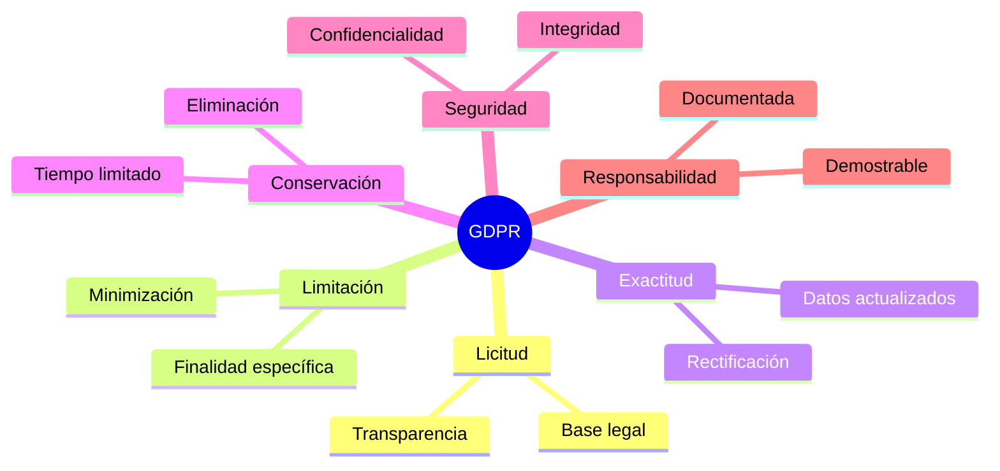
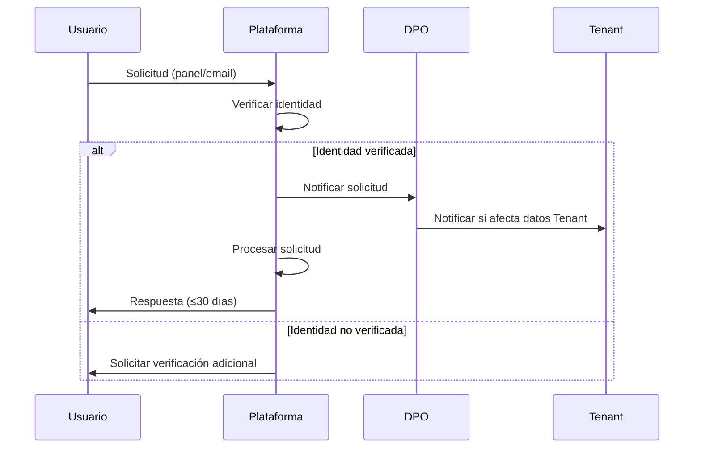
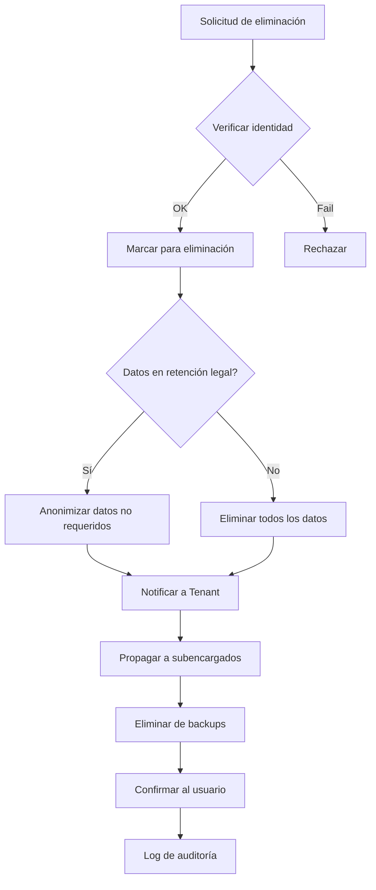
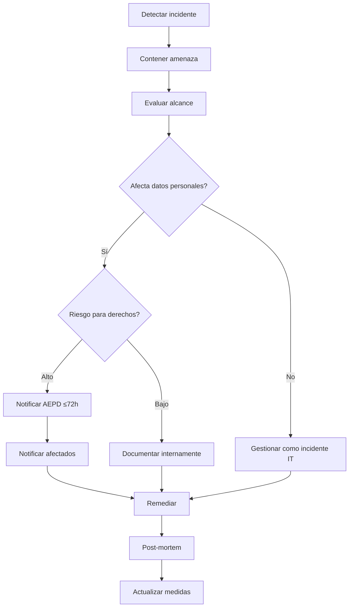

# Política GDPR y Protección de Datos - JarabaImpactPlatformSaaS

**Fecha de creación:** 2026-01-09 20:02  
**Última actualización:** 2026-01-09 20:02  
**Autor:** IA Asistente (Arquitecto SaaS Senior)  
**Versión:** 1.0.0  
**Categoría:** Compliance / Legal

---

## 📑 Tabla de Contenidos (TOC)

1. [Visión General](#1-visión-general)
2. [Roles y Responsabilidades](#2-roles-y-responsabilidades)
3. [Categorías de Datos](#3-categorías-de-datos)
4. [Bases Legales para el Tratamiento](#4-bases-legales-para-el-tratamiento)
5. [Derechos de los Interesados](#5-derechos-de-los-interesados)
6. [Consentimiento y Preferencias](#6-consentimiento-y-preferencias)
7. [Retención y Eliminación de Datos](#7-retención-y-eliminación-de-datos)
8. [Seguridad de Datos](#8-seguridad-de-datos)
9. [Transferencias Internacionales](#9-transferencias-internacionales)
10. [Gestión de Brechas de Seguridad](#10-gestión-de-brechas-de-seguridad)
11. [Implementación Técnica](#11-implementación-técnica)
12. [Registro de Cambios](#12-registro-de-cambios)

---

## 1. Visión General

### 1.1 Objetivo

Este documento define las políticas y procedimientos para el cumplimiento del **Reglamento General de Protección de Datos (RGPD/GDPR)** en JarabaImpactPlatformSaaS.

### 1.2 Ámbito de Aplicación

| Aspecto | Descripción |
|---------|-------------|
| **Territorial** | Datos de ciudadanos/residentes de la UE |
| **Material** | Datos personales tratados total o parcialmente por medios automatizados |
| **Responsable** | Jaraba Impact S.L. (plataforma) |
| **Encargados** | Tenants, proveedores externos |

### 1.3 Principios Fundamentales



---

## 2. Roles y Responsabilidades

### 2.1 Matriz RACI

| Rol | Responsable | Accountable | Consultado | Informado |
|-----|-------------|-------------|------------|-----------|
| **Plataforma (Jaraba)** | Responsable del tratamiento | DPO | Legal | Tenants |
| **Tenant** | Encargado del tratamiento | Admin Tenant | Plataforma | Productores |
| **Productor** | Sub-encargado | Tenant | Plataforma | Clientes |
| **Proveedor Externo** | Encargado | Plataforma | Legal | - |

### 2.2 Data Protection Officer (DPO)

```yaml
DPO:
  nombre: "[Nombre del DPO]"
  email: dpo@jaraba.io
  telefono: "+34 XXX XXX XXX"
  funciones:
    - Supervisar cumplimiento GDPR
    - Asesorar sobre evaluaciones de impacto
    - Punto de contacto con AEPD
    - Formación del personal
```

### 2.3 Contratos de Encargado del Tratamiento

| Contrato | Partes | Contenido Obligatorio |
|----------|--------|----------------------|
| **DPA Tenant** | Plataforma ↔ Tenant | Art. 28 GDPR, subcontratación, auditorías |
| **DPA Proveedor** | Plataforma ↔ Stripe/AWS | Cláusulas contractuales tipo |
| **Términos Productor** | Tenant ↔ Productor | Instrucciones de tratamiento |

---

## 3. Categorías de Datos

### 3.1 Inventario de Datos Personales

| Categoría | Datos | Sensible | Retención |
|-----------|-------|----------|-----------|
| **Identificación** | Nombre, email, teléfono | No | Mientras activo + 5 años |
| **Autenticación** | Hash de contraseña, tokens | No | Mientras activo |
| **Financieros** | Últimos 4 dígitos tarjeta, facturas | No | 10 años (fiscal) |
| **Ubicación** | Dirección de envío, país | No | Mientras activo + 5 años |
| **Comportamiento** | Historial de compras, navegación | No | 2 años |
| **Comunicaciones** | Preferencias, historial emails | No | 2 años post-unsubscribe |

### 3.2 Datos por Entidad

```mermaid
erDiagram
    USER ||--o{ CONSENT : otorga
    USER ||--o{ DATA_REQUEST : solicita
    
    TENANT ||--o{ USER : contiene
    
    PRODUCTOR ||--o{ PRODUCTO : vende
    
    CLIENTE ||--o{ PEDIDO : realiza
    CLIENTE ||--o{ CONSENT : otorga
    
    USER {
        string email PII
        string nombre PII
        string telefono PII
        string password_hash
        datetime created
        datetime last_login
    }
    
    CLIENTE {
        string email PII
        string nombre PII
        string direccion PII
        string telefono PII
    }
    
    CONSENT {
        string tipo
        boolean valor
        datetime timestamp
        string ip
    }
```

### 3.3 Datos NO Recopilados

- ❌ Datos de salud
- ❌ Datos biométricos
- ❌ Origen étnico
- ❌ Opiniones políticas
- ❌ Creencias religiosas
- ❌ Datos de menores (< 16 años)

---

## 4. Bases Legales para el Tratamiento

### 4.1 Matriz de Bases Legales

| Tratamiento | Base Legal | Artículo GDPR |
|-------------|------------|---------------|
| Creación de cuenta | Consentimiento | Art. 6.1.a |
| Ejecución de pedidos | Contrato | Art. 6.1.b |
| Facturación | Obligación legal | Art. 6.1.c |
| Marketing directo | Consentimiento | Art. 6.1.a |
| Analytics agregados | Interés legítimo | Art. 6.1.f |
| Prevención de fraude | Interés legítimo | Art. 6.1.f |
| Comunicaciones de servicio | Contrato | Art. 6.1.b |

### 4.2 Evaluación de Interés Legítimo (LIA)

```yaml
# Para Analytics agregados
Tratamiento: Análisis de uso de la plataforma
Interés_legítimo: Mejora del servicio y UX
Necesidad: Sí, datos imprescindibles para optimización
Equilibrio:
  - Impacto en interesado: Bajo (datos anonimizados)
  - Expectativas razonables: Sí
  - Salvaguardas: Agregación, pseudonimización
Conclusión: Interés legítimo válido
```

---

## 5. Derechos de los Interesados

### 5.1 Derechos ARCO-POL

| Derecho | Descripción | Plazo | Canal |
|---------|-------------|-------|-------|
| **Acceso** | Obtener copia de datos | 30 días | Panel o email |
| **Rectificación** | Corregir datos inexactos | 30 días | Panel o email |
| **Cancelación** | Eliminar datos | 30 días | Email a DPO |
| **Oposición** | Oponerse a tratamiento | 30 días | Panel o email |
| **Portabilidad** | Exportar datos en formato estándar | 30 días | Panel (JSON/CSV) |
| **Limitación** | Suspender tratamiento | 30 días | Email a DPO |

### 5.2 Flujo de Solicitud de Derechos



### 5.3 Panel de Privacidad del Usuario

```yaml
# Funcionalidades del panel /mi-cuenta/privacidad
Funcionalidades:
  - Ver todos los datos almacenados
  - Descargar datos (JSON/CSV)
  - Modificar preferencias de consentimiento
  - Solicitar eliminación de cuenta
  - Ver historial de consentimientos
  - Revocar accesos de terceros
```

---

## 6. Consentimiento y Preferencias

### 6.1 Tipos de Consentimiento

| Consentimiento | Obligatorio | Por defecto | Granular |
|----------------|-------------|-------------|----------|
| **Términos de servicio** | ✅ | - | No |
| **Cookies esenciales** | - | ✅ | No |
| **Cookies analíticas** | ❌ | ❌ | Sí |
| **Cookies marketing** | ❌ | ❌ | Sí |
| **Email marketing** | ❌ | ❌ | Sí |
| **Compartir con terceros** | ❌ | ❌ | Sí |

### 6.2 Implementación de Consent Management

```php
// ConsentService.php
namespace Drupal\ecosistema_jaraba_core\Service;

class ConsentService {
  
  /**
   * Registra un consentimiento del usuario.
   */
  public function recordConsent(
    int $user_id,
    string $consent_type,
    bool $value,
    string $source = 'web'
  ): void {
    $consent = Consent::create([
      'user_id' => $user_id,
      'consent_type' => $consent_type,
      'value' => $value,
      'ip_address' => \Drupal::request()->getClientIp(),
      'user_agent' => \Drupal::request()->headers->get('User-Agent'),
      'source' => $source,
      'timestamp' => time(),
    ]);
    $consent->save();
    
    // Log para auditoría
    $this->logger->info('Consent recorded: @type=@value for user @uid', [
      '@type' => $consent_type,
      '@value' => $value ? 'granted' : 'revoked',
      '@uid' => $user_id,
    ]);
  }
  
  /**
   * Obtiene el estado actual de consentimiento.
   */
  public function getConsentStatus(int $user_id, string $consent_type): ?bool {
    $consent = $this->entityTypeManager
      ->getStorage('consent')
      ->loadByProperties([
        'user_id' => $user_id,
        'consent_type' => $consent_type,
      ]);
    
    if (!$consent) {
      return NULL; // No ha dado consentimiento
    }
    
    // Obtener el más reciente
    usort($consent, fn($a, $b) => $b->get('timestamp')->value - $a->get('timestamp')->value);
    return (bool) reset($consent)->get('value')->value;
  }
  
  /**
   * Exporta historial de consentimientos para ARCO.
   */
  public function exportConsentHistory(int $user_id): array {
    $consents = $this->entityTypeManager
      ->getStorage('consent')
      ->loadByProperties(['user_id' => $user_id]);
    
    return array_map(fn($c) => [
      'type' => $c->get('consent_type')->value,
      'value' => $c->get('value')->value,
      'timestamp' => date('c', $c->get('timestamp')->value),
      'source' => $c->get('source')->value,
    ], $consents);
  }
}
```

### 6.3 Cookie Banner

```javascript
// Cookie consent banner
window.cookieConsent = {
  init() {
    if (!this.hasConsented()) {
      this.showBanner();
    }
  },
  
  showBanner() {
    const banner = document.createElement('div');
    banner.id = 'cookie-consent';
    banner.innerHTML = `
      <div class="cookie-banner">
        <p>Utilizamos cookies para mejorar tu experiencia. 
           <a href="/politica-cookies">Más información</a></p>
        <div class="cookie-actions">
          <button onclick="cookieConsent.acceptAll()">Aceptar todas</button>
          <button onclick="cookieConsent.showPreferences()">Configurar</button>
          <button onclick="cookieConsent.rejectNonEssential()">Solo esenciales</button>
        </div>
      </div>
    `;
    document.body.appendChild(banner);
  },
  
  acceptAll() {
    this.setConsent({ analytics: true, marketing: true });
    this.hideBanner();
  },
  
  rejectNonEssential() {
    this.setConsent({ analytics: false, marketing: false });
    this.hideBanner();
  },
  
  setConsent(preferences) {
    localStorage.setItem('cookie_consent', JSON.stringify({
      ...preferences,
      timestamp: Date.now(),
      version: '1.0'
    }));
    
    // Enviar a backend
    fetch('/api/consent', {
      method: 'POST',
      body: JSON.stringify(preferences)
    });
  }
};
```

---

## 7. Retención y Eliminación de Datos

### 7.1 Política de Retención

| Tipo de Dato | Retención Activa | Post-Baja | Base Legal |
|--------------|------------------|-----------|------------|
| Datos de cuenta | Mientras activo | 30 días | Contrato |
| Facturas | 10 años | 10 años | Obligación fiscal |
| Logs de acceso | 1 año | 1 año | Seguridad |
| Historial de pedidos | 5 años | 5 años | Garantías |
| Datos de marketing | 2 años inactivo | 0 | Consentimiento |
| Consentimientos | Indefinido | Indefinido | Prueba |
| Backups | 90 días | 90 días | Recuperación |

### 7.2 Proceso de Eliminación



### 7.3 Automatización de Retención

```yaml
# ECA Model: data_retention_cleanup
id: data_retention_cleanup
label: "GDPR - Limpieza automática de datos"
events:
  - plugin: "cron"
    configuration:
      frequency: "daily"
      time: "03:00"
actions:
  # Anonimizar usuarios inactivos > 2 años (marketing)
  - plugin: "action:entity_query_action"
    configuration:
      entity_type: user
      conditions:
        - field: last_login
          operator: "<"
          value: "-2 years"
        - field: status
          value: 1
      action: anonymize_marketing_data
      
  # Eliminar logs > 1 año
  - plugin: "database:delete"
    configuration:
      table: watchdog
      condition: "timestamp < UNIX_TIMESTAMP(DATE_SUB(NOW(), INTERVAL 1 YEAR))"
```

### 7.4 Script de Anonimización

```php
// DataRetentionService::anonymizeUser()
public function anonymizeUser(UserInterface $user): void {
  // Reemplazar datos personales con hash
  $hash = hash('sha256', $user->id() . time());
  
  $user->set('mail', "deleted-{$hash}@anonymized.local");
  $user->set('name', "Usuario Eliminado {$hash}");
  $user->set('field_telefono', NULL);
  $user->set('field_direccion', NULL);
  $user->setPassword(bin2hex(random_bytes(32)));
  $user->block();
  $user->save();
  
  // Mantener registro de pedidos pero anonimizar
  $orders = $this->getOrdersForUser($user);
  foreach ($orders as $order) {
    $order->set('billing_address', $this->anonymizeAddress($order->get('billing_address')));
    $order->save();
  }
  
  // Log
  $this->logger->notice('User @uid anonymized per retention policy', [
    '@uid' => $user->id(),
  ]);
}
```

---

## 8. Seguridad de Datos

### 8.1 Medidas Técnicas

| Medida | Implementación | Estado |
|--------|----------------|--------|
| **Cifrado en tránsito** | TLS 1.3 obligatorio | ✅ |
| **Cifrado en reposo** | AES-256 para backups | ✅ |
| **Hash de contraseñas** | bcrypt con cost 12 | ✅ |
| **2FA** | TOTP para admins | ✅ |
| **WAF** | Cloudflare | ✅ |
| **Audit logs** | Inmutables en S3 | ✅ |

### 8.2 Medidas Organizativas

| Medida | Descripción |
|--------|-------------|
| **Formación** | Anual obligatoria en GDPR |
| **Acceso mínimo** | Solo datos necesarios |
| **Revisión de accesos** | Trimestral |
| **Política de contraseñas** | Rotación 90 días, complejidad |
| **NDA** | Obligatorio para empleados |

### 8.3 Pseudonimización

```php
// Pseudonimización para analytics
public function pseudonymizeForAnalytics(array $data): array {
  return [
    'user_hash' => hash('sha256', $data['user_id'] . $this->salt),
    'tenant_id' => $data['tenant_id'], // Se mantiene para segmentación
    'event' => $data['event'],
    'timestamp' => $data['timestamp'],
    // NO incluir: email, nombre, IP
  ];
}
```

---

## 9. Transferencias Internacionales

### 9.1 Proveedores y Ubicación

| Proveedor | Servicio | País | Mecanismo |
|-----------|----------|------|-----------|
| **AWS** | Hosting | Irlanda (EU) | EU Data Act |
| **Stripe** | Pagos | USA | SCCs + DPF |
| **OpenAI** | IA | USA | SCCs + DPF |
| **Cloudflare** | CDN | Global | SCCs |
| **Google Analytics** | Analytics | USA | Consent + SCCs |

### 9.2 Cláusulas Contractuales Tipo (SCCs)

Todos los proveedores fuera del EEE tienen firmadas las SCCs de la Comisión Europea (Decisión 2021/914).

### 9.3 Data Privacy Framework (DPF)

Proveedores USA certificados en DPF:
- ✅ Stripe
- ✅ OpenAI
- ✅ Cloudflare

---

## 10. Gestión de Brechas de Seguridad

### 10.1 Procedimiento de Respuesta



### 10.2 Clasificación de Brechas

| Nivel | Descripción | Acción | Plazo AEPD |
|-------|-------------|--------|------------|
| **Crítico** | Datos sensibles expuestos | AEPD + afectados | 72h |
| **Alto** | Datos personales accedidos | AEPD | 72h |
| **Medio** | Intento de acceso, datos cifrados | Documentar | - |
| **Bajo** | Vulnerabilidad detectada, no explotada | Documentar | - |

### 10.3 Plantilla de Notificación a AEPD

```yaml
Notificación_Brecha:
  responsable: "Jaraba Impact S.L."
  nif: "BXXXXXXXX"
  dpo: "dpo@jaraba.io"
  
  brecha:
    fecha_deteccion: "YYYY-MM-DD HH:MM"
    fecha_ocurrencia: "YYYY-MM-DD HH:MM (estimada)"
    naturaleza: "Acceso no autorizado / Pérdida / Destrucción"
    categorias_datos: ["Identificación", "Contacto", "Financieros"]
    numero_afectados: "X usuarios"
    
  consecuencias:
    - "Posible usurpación de identidad"
    - "Acceso no autorizado a cuentas"
    
  medidas_tomadas:
    - "Bloqueo de accesos comprometidos"
    - "Reset de contraseñas"
    - "Notificación a afectados"
    
  medidas_futuras:
    - "Implementación de 2FA obligatorio"
    - "Auditoría de seguridad externa"
```

---

## 11. Implementación Técnica

### 11.1 Módulos Drupal Requeridos

| Módulo | Propósito |
|--------|-----------|
| `gdpr` | Framework base GDPR |
| `gdpr_consent` | Gestión de consentimientos |
| `gdpr_tasks` | Cola de solicitudes ARCO |
| `eu_cookie_compliance` | Banner de cookies |
| `anonymizer` | Anonimización de datos |

### 11.2 Entidad Consent

```php
/**
 * @ContentEntityType(
 *   id = "consent",
 *   label = @Translation("Consentimiento"),
 *   base_table = "consent",
 *   entity_keys = {
 *     "id" = "id",
 *     "uuid" = "uuid",
 *   },
 * )
 */
class Consent extends ContentEntityBase {
  
  public static function baseFieldDefinitions(EntityTypeInterface $entity_type) {
    $fields = parent::baseFieldDefinitions($entity_type);
    
    $fields['user_id'] = BaseFieldDefinition::create('entity_reference')
      ->setLabel(t('Usuario'))
      ->setSetting('target_type', 'user')
      ->setRequired(TRUE);
    
    $fields['consent_type'] = BaseFieldDefinition::create('list_string')
      ->setLabel(t('Tipo de consentimiento'))
      ->setSetting('allowed_values', [
        'terms' => 'Términos de servicio',
        'marketing' => 'Comunicaciones comerciales',
        'analytics' => 'Cookies analíticas',
        'third_party' => 'Compartir con terceros',
      ])
      ->setRequired(TRUE);
    
    $fields['value'] = BaseFieldDefinition::create('boolean')
      ->setLabel(t('Valor'))
      ->setRequired(TRUE);
    
    $fields['timestamp'] = BaseFieldDefinition::create('timestamp')
      ->setLabel(t('Fecha/hora'))
      ->setRequired(TRUE);
    
    $fields['ip_address'] = BaseFieldDefinition::create('string')
      ->setLabel(t('Dirección IP'));
    
    $fields['source'] = BaseFieldDefinition::create('string')
      ->setLabel(t('Origen'))
      ->setDefaultValue('web');
    
    return $fields;
  }
}
```

### 11.3 API de Portabilidad

```php
// GdprController::exportUserData()
public function exportUserData(): JsonResponse {
  $user = $this->currentUser();
  
  $data = [
    'meta' => [
      'export_date' => date('c'),
      'format_version' => '1.0',
      'platform' => 'JarabaImpactPlatform',
    ],
    'personal_data' => [
      'email' => $user->getEmail(),
      'name' => $user->getDisplayName(),
      'created' => date('c', $user->getCreatedTime()),
      'last_login' => date('c', $user->getLastLoginTime()),
    ],
    'consents' => $this->consentService->exportConsentHistory($user->id()),
    'orders' => $this->orderService->exportUserOrders($user->id()),
    'content' => $this->contentService->exportUserContent($user->id()),
  ];
  
  return new JsonResponse($data, 200, [
    'Content-Disposition' => 'attachment; filename="mis-datos.json"',
  ]);
}
```

---

## 12. Registro de Cambios

| Fecha | Versión | Descripción |
|-------|---------|-------------|
| 2026-01-09 | 1.0.0 | Creación inicial del documento |
