# Diagrama de Infraestructura - Jaraba SaaS Platform

> **Versión**: 1.0  
> **Fecha**: 2026-01-10

---

## Arquitectura General

```mermaid
graph TB
    subgraph "DESARROLLO (Local)"
        DEV_PC["💻 Windows + WSL"]
        DEV_PC --> LANDO["🐳 Lando/Docker"]
        LANDO --> DRUPAL_DEV["Drupal 11.3.2"]
        LANDO --> MARIADB_DEV["MariaDB 10.11"]
        DRUPAL_DEV --> LOCAL_URL["jaraba-saas.lndo.site"]
    end

    subgraph "REPOSITORIO"
        GITHUB["🐙 GitHub"]
    end

    subgraph "PRODUCCIÓN (IONOS)"
        IONOS["🖥️ IONOS L-16 NVMe"]
        IONOS --> PHP84["PHP 8.4.16 CLI"]
        IONOS --> DRUPAL_PROD["Drupal 11.3.2"]
        IONOS --> MARIADB_PROD["MariaDB 10.11"]
        DRUPAL_PROD --> PROD_URL["plataformadeecosistemas.com"]
    end

    subgraph "SERVICIOS EXTERNOS"
        STRIPE["💳 Stripe"]
        DNS["🌐 DNS (IONOS)"]
    end

    DEV_PC -->|git push| GITHUB
    GITHUB -->|git pull| IONOS
    DRUPAL_PROD --> STRIPE
    DNS --> PROD_URL
```

---

## Flujo de Deployment

```mermaid
sequenceDiagram
    participant Dev as 💻 Developer
    participant Git as 🐙 GitHub
    participant IONOS as 🖥️ IONOS Server
    participant DB as 🗄️ MariaDB

    Dev->>Dev: lando drush cex -y
    Dev->>Git: git push origin main
    Dev->>IONOS: ssh ionos-jaraba
    IONOS->>Git: git pull
    IONOS->>IONOS: composer install
    IONOS->>DB: drush updb -y
    IONOS->>DB: drush cim -y
    IONOS->>IONOS: drush cr
    IONOS-->>Dev: ✅ Deploy complete
```

---

## Stack Tecnológico

### Desarrollo Local

| Componente | Versión | Puerto |
|------------|---------|--------|
| Lando | 3.x | - |
| Docker | 24.x | - |
| PHP | 8.4 | - |
| MariaDB | 10.11 | 3306 |
| Nginx | 1.x | 80/443 |
| Drupal | 11.3.2 | - |
| Drush | 13.7.0 | - |

### Producción IONOS

| Componente | Versión | Ruta |
|------------|---------|------|
| OS | Debian 11 | - |
| PHP CLI | 8.4.16 | /usr/bin/php8.4-cli |
| MariaDB | 10.11 | db5018953276.hosting-data.io |
| Composer | 2.9.3 | ~/bin/composer.phar |
| Drupal | 11.3.2 | ~/JarabaImpactPlatformSaaS |
| Drush | 13.7.0 | vendor/bin/drush.php |

---

## Arquitectura Drupal

---

## Red y DNS

| Dominio | Tipo | Destino |
|---------|------|---------|
| plataformadeecosistemas.com | A | [IP IONOS] |
| *.plataformadeecosistemas.com | CNAME | plataformadeecosistemas.com |

---

## Seguridad

```mermaid
graph TB
    subgraph "Capas de Seguridad"
        HTTPS["🔒 HTTPS/TLS"]
        SSH["🔑 SSH Key Auth"]
        FW["🛡️ Firewall IONOS"]
        DRUPAL_SEC["🔐 Drupal Permissions"]
    end

    USER["👤 Usuario"] --> HTTPS
    HTTPS --> FW
    FW --> DRUPAL_SEC

    ADMIN["👨‍💻 Admin"] --> SSH
    SSH --> FW
```

### Puertos Abiertos

| Puerto | Servicio | Acceso |
|--------|----------|--------|
| 22 | SSH | Restringido (key auth) |
| 80 | HTTP | Público (redirect) |
| 443 | HTTPS | Público |
| 3306 | MySQL | Solo interno |

---

## Backups y DR

```mermaid
graph LR
    subgraph "Datos Primarios"
        DB_PROD["🗄️ MariaDB IONOS"]
        FILES["📁 Files (uploads)"]
        CODE["💻 Código"]
    end

    subgraph "Backups"
        BACKUP_DB["💾 DB Backup (diario)"]
        BACKUP_FILES["💾 Files Backup (semanal)"]
        GITHUB["🐙 GitHub (código)"]
    end

    DB_PROD -->|cron 02:00| BACKUP_DB
    FILES -->|cron domingo| BACKUP_FILES
    CODE -->|git push| GITHUB
```

---

## Escalabilidad Futura

| Componente | Estado Actual | Siguiente Paso |
|------------|---------------|----------------|
| Servidor | Single IONOS | Load Balancer + 2 nodos |
| BD | Single MariaDB | Replicación Primary-Replica |
| Archivos | Local disk | Object Storage (S3) |
| Cache | Drupal internal | Redis cluster |
| CDN | Ninguno | Cloudflare |
