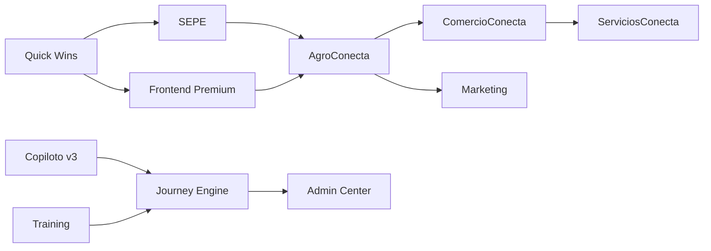

# Plan Maestro Unificado SaaS v2.0
## Jaraba Impact Platform - Roadmap 2026-2027

**Fecha de creación:** 2026-01-23 08:38  
**Última actualización:** 2026-01-23 09:46

---

## 📋 Documentos de Implementación por Bloque

> **Cada bloque tiene un documento detallado con matriz de specs, checklists y pasos:**

| Bloque | Documento de Implementación |
|--------|----------------------------|
| A | [20260123a-Bloque_A_Gaps_Auditoria_Implementacion_Claude.md](../implementacion/20260123a-Bloque_A_Gaps_Auditoria_Implementacion_Claude.md) |
| B | [20260123b-Bloque_B_Copiloto_v3_Implementacion_Claude.md](../implementacion/20260123b-Bloque_B_Copiloto_v3_Implementacion_Claude.md) |
| C | [20260123c-Bloque_C_Journey_Engine_Implementacion_Claude.md](../implementacion/20260123c-Bloque_C_Journey_Engine_Implementacion_Claude.md) |
| D | [20260123d-Bloque_D_Admin_Center_Implementacion_Claude.md](../implementacion/20260123d-Bloque_D_Admin_Center_Implementacion_Claude.md) |
| E | [20260123e-Bloque_E_Training_System_Implementacion_Claude.md](../implementacion/20260123e-Bloque_E_Training_System_Implementacion_Claude.md) |  
**Autor:** IA Asistente (Claude)  
**Versión:** 2.0.0

---

## 📑 Tabla de Contenidos (TOC)

1. [Resumen Ejecutivo](#1-resumen-ejecutivo)
2. [Bloque A: Gaps Auditoría](#2-bloque-a-gaps-auditoría)
3. [Bloque B: Copiloto v3](#3-bloque-b-copiloto-emprendimiento-v3)
4. [Bloque C: Journey Engine](#4-bloque-c-journey-engine)
5. [Bloque D: Admin Center](#5-bloque-d-admin-center)
6. [Bloque E: Training System](#6-bloque-e-training--certification)
7. [Timeline Integrado](#7-timeline-integrado)
8. [Criterios de Éxito](#8-criterios-de-éxito)
9. [Registro de Cambios](#9-registro-de-cambios)

---

## 1. Resumen Ejecutivo

> **Este plan unifica TODOS los componentes pendientes en un roadmap coherente de 18-19 meses.**

| Bloque | Documento Fuente | Horas | Timeline |
|--------|------------------|-------|----------|
| **A. Gaps Auditoría** | [20260122b](./20260122b-Plan_Implementacion_Gaps_Auditoria_v1_Claude.md) | 1,690h | Q1-Q4 2026 |
| **B. Copiloto v3** | Especificaciones Osterwalder | 96h | Q1-Q2 2026 |
| **C. Journey Engine** | [103_UX_Journey](./20260117f-103_UX_Journey_Specifications_Avatar_v1_Claude.md) | 530h | Q2-Q4 2026 |
| **D. Admin Center** | [104_Admin_Center](./20260117f-104_SaaS_Admin_Center_Premium_v1_Claude.md) | 635h | Q3 2026 - Q1 2027 |
| **E. Training System** | [46_Training](./20260115j-46_Training_Certification_System_v1_Claude.md) | 124h | Q2-Q3 2026 |
| **TOTAL** | | **3,075h** | **~19 meses** |

### 1.1 Estrategia de Reuso (Directriz Obligatoria)

> ⚠️ **VERIFICACIÓN PREVIA OBLIGATORIA**: Antes de iniciar cualquier paso del roadmap, ejecutar el análisis de reuso.

#### A. Reuso Cross-Vertical (Verticales Ya Implementados)

Orden de implementación de verticales:
```
1. Empleabilidad (base) → 2. Emprendimiento → 3. AgroConecta → 4. ComercioConecta → 5. ServiciosConecta
```

**Al implementar un nuevo vertical, revisar qué existe en los anteriores:**

| Si implementas... | Revisar reuso de... |
|-------------------|---------------------|
| Emprendimiento | Empleabilidad |
| AgroConecta | Empleabilidad, Emprendimiento |
| ComercioConecta | Empleabilidad, Emprendimiento, AgroConecta |
| ServiciosConecta | Empleabilidad, Emprendimiento, AgroConecta, ComercioConecta |

**Componentes típicamente reutilizables entre verticales:**

| Componente | Módulo Origen | Reutilizable Para |
|------------|---------------|-------------------|
| Matching Engine | `jaraba_matching` | Todos los verticales |
| Copiloto Modos Base | `jaraba_copilot_v2` | Todos los verticales |
| Dashboard Patterns | `ecosistema_jaraba_core` | Todos los verticales |
| Commerce Core | `jaraba_commerce` | AgroConecta, ComercioConecta, ServiciosConecta |
| LMS/Training | `jaraba_training` | Emprendimiento, ServiciosConecta |
| Profile Entities | `jaraba_candidates` | Empleabilidad, ServiciosConecta |

#### B. Reuso AgroConecta Anterior (Proyecto Legacy)

> **IGNORAR** todo lo relacionado con **Ecwid** → usar Drupal Commerce + Stripe.

| Componente | Ruta Original | Aplicación SaaS |
|------------|---------------|------------------|
| **8 Agentes IA** | `z:/home/PED/AgroConecta/src/Agent/` | Adaptar a copilotos |
| **SeasonCore** | `Service/SeasonCore.php` | Estacionalidad productos |
| **Brand Voice** | Config | Personalización tenant |
| **Workflows ECA** | `config/install/eca.*` | Adaptar (no ECA UI) |
| **Tema "Sin Humo"** | `agroconecta_theme` | Base presets industria |

#### C. Checklist de Reuso (Ejecutar antes de cada paso)

```markdown
## Paso: [NOMBRE DEL PASO]

### Análisis de Reuso (OBLIGATORIO)
- [ ] ¿Existe funcionalidad similar en verticales anteriores?
- [ ] ¿Hay servicios/entidades reutilizables en módulos core?
- [ ] ¿Existe código en AgroConecta legacy aplicable?
- [ ] ¿Se puede abstraer a módulo compartido?

### Componentes Identificados para Reuso
| Componente | Origen | Acción (Copiar/Adaptar/Referencia) |
|------------|--------|------------------------------------|
| ... | ... | ... |

### Decisión
- [ ] Reusar componente(s) existente(s)
- [ ] Implementar desde cero (justificar)
```

---

## 2. Bloque A: Gaps Auditoría

> **Referencia:** [20260122b-Plan_Implementacion_Gaps_Auditoria_v1_Claude.md](./20260122b-Plan_Implementacion_Gaps_Auditoria_v1_Claude.md)

### A.1 Quick Wins + SEPE (P0) - Q1 2026

| Item | Sprints | Horas | Entregables |
|------|---------|-------|-------------|
| Quick Wins | 1-2 | 40h | llms.txt, PHPStan CI, PHPUnit críticos |
| SEPE Teleformación | 3-6 | 100h | Módulo jaraba_sepe, WSDL, Kit validación |
| **Subtotal** | | **140h** | |

### A.2 Frontend Premium (P1) - Q1-Q2 2026

| Item | Sprints | Horas | Entregables |
|------|---------|-------|-------------|
| Design Tokens | 7-8 | 32h | Cascada Plataforma→Vertical→Tenant |
| Component Library | 9-10 | 56h | 6 headers, 8 cards, 5 heroes |
| Visual Picker | 11-12 | 40h | tenant_theme_config, admin panel |
| Industry Presets | 13-14 | 32h | 15 presets por sector |
| Testing (Cypress) | paralelo | 40h | E2E básico |
| **Subtotal** | | **200h** | |

### A.3 AgroConecta Commerce (P1) - Q2-Q3 2026

| Item | Sprints | Horas | Entregables |
|------|---------|-------|-------------|
| Commerce Core | 15-18 | 80h | Entidades, Commerce 3.x |
| Pagos + Shipping | 19-22 | 80h | Stripe Connect, envíos |
| Portales + QR | 23-26 | 80h | Producer Portal, trazabilidad |
| Launch | 27-30 | 60h | k6, go-live MVP |
| **Subtotal** | | **300h** | |

### A.4 Expansión (P2-P3) - Q4 2026 - Q2 2027

| Item | Sprints | Horas |
|------|---------|-------|
| ComercioConecta | 42-53 | 300h |
| Platform Features (PWA full) | 54-59 | 200h |
| ServiciosConecta | 60-71 | 300h |
| Marketing AI Stack Nativo | 72-83 | 250h |
| **Subtotal** | | **1,050h** |

> ⚠️ **MARKETING AI STACK NATIVO** (Docs 150-157)
> 
> Reemplaza ActiveCampaign, HubSpot, Mailchimp con módulos propios:
> 
> | Módulo | Doc | Horas | Reemplaza |
> |--------|-----|-------|-----------|
> | `jaraba_crm` | 150 | 40-50h | HubSpot, Pipedrive |
> | `jaraba_email` | 151 | 115-155h | Mailchimp, ActiveCampaign |
> | `jaraba_social` | 152 | 50-70h | Buffer, Hootsuite |
> | Paid Ads Integration | 153 | 15-20h | - |
> | Pixel Manager | 154 | 10-15h | GTM |
> | Events & Webinars | 155 | 15-20h | Calendly+Zoom |
> | A/B Testing | 156 | 12-18h | Optimizely |
> | Referral Program | 157 | 8-12h | ReferralCandy |

**Total Bloque A:** 1,690h

---

## 3. Bloque B: Copiloto Emprendimiento v3

> **Fuentes:** Libros Osterwalder (6), Blank/Dorf, Kaufman

### B.1 Objetivos
- Hiperpersonalización desde BD del emprendedor
- Integración 6 libros Osterwalder + Lean Startup
- Procesos Customer Development estructurados 4 fases

### B.2 Componentes

| Componente | Tipo | Horas |
|------------|------|-------|
| `EntrepreneurContextService` | Service | 16h |
| `ValuePropositionCanvasService` | Service | 24h |
| `CustomerDiscoveryService` | Service | 24h |
| Test/Learning Cards | Services | 16h |
| Patrones + Pivot Detector | Services | 16h |
| **Subtotal** | | **96h** |

### B.3 Nuevos Modos Copiloto
- 🎯 VPC Designer (propuesta de valor, diferencial)
- 🔍 Customer Discovery Coach (entrevistas, validación)
- 📊 Business Pattern Expert (modelo negocio, monetización)
- 🔄 Pivot Advisor (señales de pivote)

---

## 4. Bloque C: Journey Engine

> **Referencia:** [103_UX_Journey_Specifications_Avatar_v1_Claude.md](./20260117f-103_UX_Journey_Specifications_Avatar_v1_Claude.md)

### C.1 Arquitectura
- Context Engine → Decision Engine → Presentation Engine
- **19 avatares** en 7 verticales
- **7 estados** de journey: Discovery → Activation → Engagement → Conversion → Retention → Expansion → At-Risk

### C.2 Roadmap

| Item | Sprints | Horas |
|------|---------|-------|
| Core + Estado tracking | C1-C2 | 90h |
| AgroConecta (3 avatares) | C3-C4 | 70h |
| ComercioConecta + Servicios (4) | C5-C6 | 70h |
| Empleabilidad (3) | C7-C8 | 70h |
| **Emprendimiento (3)** | C9-C10 | 70h |
| Andalucía +ei + Certificación (6) | C11-C12 | 90h |
| IA proactiva + Polish | C13-C14 | 70h |
| **Subtotal** | | **530h** |

---

## 5. Bloque D: Admin Center

> **Referencia:** [104_SaaS_Admin_Center_Premium_v1_Claude.md](./20260117f-104_SaaS_Admin_Center_Premium_v1_Claude.md)

### D.1 Módulos
Dashboard Ejecutivo, Gestión Tenants, Usuarios, Centro Financiero, Analytics, Alertas, Configuración, Logs

### D.2 Roadmap

| Item | Sprints | Horas |
|------|---------|-------|
| Design System + Layout | D1-D2 | 70h |
| Dashboard ejecutivo | D3-D4 | 70h |
| Tenants + Health Score | D5-D6 | 70h |
| Users + RBAC | D7-D8 | 60h |
| Finance + Stripe | D9-D10 | 80h |
| Analytics + Reports | D11-D12 | 70h |
| Alerts + Playbooks | D13-D14 | 60h |
| Settings + API Keys | D15-D16 | 50h |
| Logs + Audit | D17-D18 | 45h |
| WebSockets + QA | D19-D20 | 60h |
| **Subtotal** | | **635h** |

---

## 6. Bloque E: Training & Certification

> **Referencia:** [46_Training_Certification_System_v1_Claude.md](./20260115j-46_Training_Certification_System_v1_Claude.md)

### E.1 Escalera de Valor (6 Peldaños)

| Nivel | Producto | Precio | Modelo |
|-------|----------|--------|--------|
| 0 | Lead Magnets | €0 | Captura |
| 1 | Microcursos | €29-97 | Pago único |
| 2 | Club Jaraba | €19-99/mes | Suscripción |
| 3 | Mentoría Grupal | €297-497 | Cohorte |
| 4 | Mentoría 1:1 | €997-1.997 | Premium |
| 5 | Certificación | €2.000-5.000 | Licencia |

### E.2 Roadmap

| Item | Sprints | Horas |
|------|---------|-------|
| training_product + APIs | E1-E2 | 24h |
| certification_program | E3-E4 | 24h |
| Exámenes + Open Badge | E5-E6 | 24h |
| ECA flows + Royalties | E7-E8 | 20h |
| Dashboard + Directorio | E9-E10 | 16h |
| Territorios + Franquicias | E11-E12 | 16h |
| **Subtotal** | | **124h** |

---

## 7. Timeline Integrado

### Resumen por Fase

| Fase | Quarter | Meses | Horas | Bloques |
|------|---------|-------|-------|---------|
| 1 | Q1 2026 | 1-3 | 280h | A.1, A.2, B |
| 2 | Q2 2026 | 4-6 | 440h | A.2, A.3, C, E |
| 3 | Q3 2026 | 7-9 | 420h | A.3, C |
| 4 | Q4 2026 | 10-12 | 490h | C, D, A.4 |
| 5 | Q1 2027 | 13-15 | 450h | D, A.4 |
| 6 | Q2 2027 | 16-18 | 350h | A.4, Integración |

**Total:** 3,075h en ~19 meses (equipo de 4 desarrolladores)

### Dependencias Críticas



---

## 8. Criterios de Éxito

| Área | Métrica | Target |
|------|---------|--------|
| SEPE | Centro piloto | 1 en producción Q1 |
| Frontend | Visual Picker funcional | Q2 2026 |
| AgroConecta | GMV mensual | €10K Q3 |
| Copiloto v3 | NPS Personalización | >8/10 |
| Journey Engine | Time to Value | <5 min |
| Admin Center | First Contentful Paint | <1.5s |
| Training | Conversion Lead→Micro | 12% |

---

## 9. Registro de Cambios

| Fecha | Versión | Descripción |
|-------|---------|-------------|
| 2026-01-23 | 2.0.0 | Plan Maestro Unificado - Integra Auditoría + 4 Pilares |
| 2026-01-22 | 1.0.0 | Plan de Gaps Auditoría original |
