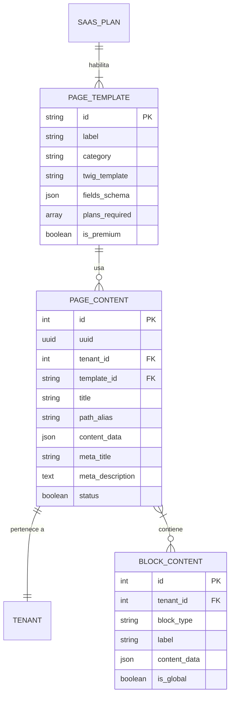

# Plan de Implementación: Constructor de Páginas SaaS

> **Fecha**: 2026-01-28
> **Versión**: 1.2.0
> **Autor**: EDI Google Antigravity
> **Documentos Base**: 160-179 (Page Builder + Site Builder Extensions)
> **Estado**: ✅ APROBADO + ANÁLISIS COMPLETADO (2026-01-28)

---

## Resumen Ejecutivo

Este documento define el plan de implementación para el **Constructor de Páginas SaaS** del Ecosistema Jaraba, basado en el análisis de los documentos técnicos 162-171. El sistema permitirá:

1. **Eliminar contenido hardcodeado** de los templates Twig actuales
2. **Crear páginas mediante un constructor visual** gestionado por permisos
3. **Ofrecer bloques premium** con bibliotecas Aceternity UI y Magic UI
4. **Proporcionar un repositorio de 55 plantillas** por vertical
5. **Cumplir con las directrices del proyecto** (SCSS, i18n, Content Entities)

---

## Decisiones Aprobadas

> [!NOTE]
> **Decisiones confirmadas por el usuario (2026-01-26 20:19)**:
> 1. ✅ **Migración a Content Entities**: Aprobada
> 2. ✅ **Bloques Premium**: Ambos frameworks (Aceternity UI + Magic UI)
> 3. ✅ **Límites de páginas**: Configurables por Vertical y Plan (no valores fijos)

---

## 1. Análisis de Situación Actual

### 1.1 Documentos Técnicos Revisados (160-179)

#### Core Page Builder (Docs 160-165)

| Doc | Título | Contenido Clave |
|-----|--------|-----------------|
| 160 | Page Builder SaaS v1 | Matriz hardcodeado, arquitectura base, migraciones |
| 162 | Page Builder Sistema Completo | 67 bloques (45 base + 22 premium), 55 plantillas, RBAC |
| 163 | Bloques Premium Anexo | Templates Twig, JS Adapters, CSS Design Tokens |
| 164 | SEO/GEO Avanzado | Schema.org por vertical, Sitemap dinámico, Core Web Vitals |
| 165 | Gap Analysis | 6 documentos adicionales necesarios (166-171) |

#### Site Builder Extensions (Docs 176-179) ⭐ NEW

| Doc | Título | Contenido Clave | Horas |
|-----|--------|-----------------|-------|
| 176 | Site Structure Manager | Árbol páginas, URLs jerárquicas, Redirects, Sitemap visual | 40-50h |
| 177 | Global Navigation System | Header/Footer Builder, Menús multinivel, Mega menus | 50-60h |
| 178 | Blog System Nativo | Posts, Categorías, Tags, RSS, SEO BlogPosting | 60-80h |
| 179 | SEO/GEO + IA Integration | Schema.org global, Hreflang, Core Web Vitals, IA nativa | 50-60h |

#### Gap Docs Pendientes (166-171)

| Doc | Título | Contenido Clave |
|-----|--------|-----------------|
| 166 | i18n Multi-idioma | ES/CA/EU/GL/EN + traducción IA |
| 167 | Analytics Page Builder | Tracking por bloque, Heatmaps, Dashboard |
| 168 | A/B Testing | Variantes, significancia estadística, auto-promoción |
| 169 | Versionado | Historial, rollback, scheduled publish |
| 170 | Accesibilidad WCAG | WCAG 2.1 AA, ARIA, contraste |
| 171 | Content Hub Integration | Generación IA por bloque |

### 1.2 Estimación Total Actualizada

| Componente | Doc | Horas | Coste (€80/h) |
|------------|-----|-------|---------------|
| Page Builder Core | 160 | ~40h | €3,200 |
| Sistema Completo | 162-164 | 420-520h | €33,600-€41,600 |
| Site Structure Manager | 176 | 40-50h | €3,200-€4,000 |
| Navigation System | 177 | 50-60h | €4,000-€4,800 |
| Blog System | 178 | 60-80h | €4,800-€6,400 |
| SEO/IA Integration | 179 | 50-60h | €4,000-€4,800 |
| Gap Docs | 166-171 | 115-160h | €9,200-€12,800 |
| **TOTAL ECOSISTEMA** | | **775-970h** | **€62,000-€77,600** |

---

## 2. Matriz de Contenido Hardcodeado

### 2.1 Templates Twig con Contenido Directo en Código

| Template | Contenido Hardcodeado | Criticidad | Migración |
|----------|----------------------|------------|-----------|
| `_hero.html.twig` | Título, subtítulo, eyebrow, 2 CTAs | **ALTA** | Content Entity |
| `_features.html.twig` | 3 cards completas (icono, título, descripción, badge) | **ALTA** | Content Entity |
| `_stats.html.twig` | 4 métricas (candidatos=1500, empresas=120, emprendimientos=85, satisfacción=98%) | **ALTA** | Content Entity |
| `_intentions-grid.html.twig` | 5 cards de intención (empleo, talento, emprender, comercio, instituciones) | **MEDIA** | Content Entity |
| `_footer.html.twig` | Enlaces navegación (parcialmente configurable vía theme_settings) | **MEDIA** | Mixto |

### 2.2 Contenido Hardcodeado Detallado

#### Hero Section (`_hero.html.twig`)
```
- Eyebrow: "Plataforma SaaS para Ecosistemas de Impacto"
- Título: "Impulsa tu ecosistema digital"
- Subtítulo: "La plataforma que conecta talento, negocios y productores con inteligencia artificial"
- CTA Primario: "Empezar gratis" → /user/register
- CTA Secundario: "Ya tengo cuenta" → /user/login
- Scroll Indicator: "Descubre más"
```

#### Features Section (`_features.html.twig`)
```
Card 1:
- Título: "Configuración en minutos"
- Descripción: "Tu ecosistema digital funcionando desde el día uno, sin código"
- Badge: "Rápido"

Card 2:
- Título: "IA integrada"
- Descripción: "Copiloto de carrera, matching inteligente, asistente de emprendimiento..."
- Badge: "Con IA"

Card 3:
- Título: "Multi-vertical"
- Descripción: "Empleabilidad, emprendimiento, comercio y servicios profesionales y públicos"
- Badge: "4 verticales"
```

#### Stats Section (`_stats.html.twig`)
```
- 1500 Candidatos activos
- 120 Empresas
- 85 Emprendimientos
- 98% Satisfacción
```

---

## 3. Arquitectura Propuesta

### 3.1 Modelo de Datos - Entidades Principales



### 3.2 Entidad `page_template` (Config Entity)

Plantillas de página predefinidas por el sistema. **NO editables por tenants**.

| Campo | Tipo | Descripción |
|-------|------|-------------|
| `id` | string | Machine name: `hero_fullscreen`, `landing_saas` |
| `label` | string | Nombre visible: 'Hero Pantalla Completa' |
| `category` | enum | `hero`, `features`, `pricing`, `landing`, `dashboard` |
| `twig_template` | string | Ruta: `@jaraba_page_builder/hero-fullscreen.html.twig` |
| `fields_schema` | json | JSON Schema para Form Builder dinámico |
| `plans_required` | array | `['starter','professional','enterprise']` |
| `is_premium` | boolean | Si usa bloques Aceternity/Magic UI |

### 3.3 Entidad `page_content` (Content Entity)

Páginas creadas por tenants. **Cumple directriz Content Entity**:
- ✅ Field UI integrado
- ✅ Views compatible  
- ✅ Admin en `/admin/structure/page-content` y `/admin/content/pages`

| Campo | Tipo | Descripción |
|-------|------|-------------|
| `id` | serial | ID autoincremental |
| `uuid` | uuid | Identificador único |
| `tenant_id` | entity_ref | Referencia a Group (multi-tenant) |
| `template_id` | string | Referencia a page_template.id |
| `title` | string | Título de la página |
| `path_alias` | string | URL amigable: `/sobre-nosotros` |
| `content_data` | json | Datos del formulario según `fields_schema` |
| `menu_link` | string | Menú destino: `main`, `footer`, `secondary` |

---

## 4. Sistema de Permisos RBAC

### 4.1 Permisos del Módulo

| Permiso | Descripción |
|---------|-------------|
| `access page builder` | Acceder al constructor (verificado por plan) |
| `view page templates` | Ver galería de plantillas disponibles |
| `use premium templates` | Usar plantillas Aceternity/Magic UI |
| `create page content` | Crear nuevas páginas |
| `edit own page content` | Editar páginas propias |
| `edit any page content` | Editar cualquier página del tenant |
| `manage page menus` | Añadir/quitar páginas de menús |
| `administer page builder` | ADMIN: Configuración global |

### 4.2 Límites por Plan SaaS (Configurables por Vertical)

> [!NOTE]
> Los límites son **configurables por Vertical y Plan** desde la entidad `SaasPlan`.
> Valores por defecto mostrados a continuación.

| Capacidad | Starter | Professional | Enterprise |
|-----------|---------|--------------|------------|
| Plantillas básicas | Configurable | Configurable | Todas |
| Plantillas premium | 0 | Configurable | Todas |
| Máximo páginas | Configurable | Configurable | Ilimitado |
| Bloques base | Configurable | Configurable | Todos |
| Bloques premium | 0 | Configurable | Todos |
| SEO avanzado | — | ✓ | ✓ + Schema.org |
| A/B Testing | — | Configurable | Ilimitado |

---

## 5. Validación de Directrices del Proyecto

### 5.1 Cumplimiento Content Entities ✅

La arquitectura propuesta cumple con la directriz de **"Configuración de negocio editable desde UI"**:

- [x] `page_content` es Content Entity con Field UI
- [x] Integración con Views para listados
- [x] Admin en `/admin/structure/` y `/admin/content/`
- [x] Entity Reference para relaciones con Tenant/Plan

### 5.2 Cumplimiento SCSS con Variables Inyectables ✅

El sistema de bloques utilizará **Design Tokens**:

```scss
// _variables.scss - Compilado desde configuración Drupal
$ej-color-primary: var(--ej-color-primary, #0284c7);
$ej-color-corporate: var(--ej-color-corporate, #1e3a5f);
$ej-font-primary: var(--ej-font-primary, 'Inter');

// Bloques del Page Builder heredan variables
.jaraba-hero {
  background: var(--ej-color-corporate);
  font-family: var(--ej-font-primary);
}
```

### 5.3 Cumplimiento i18n - Textos Traducibles ✅

Todos los templates usarán `` para cadenas de interfaz:

```twig
{# ✅ CORRECTO: Traducible #}
<h1>Impulsa tu ecosistema</h1>

{# ✅ CORRECTO: Contenido de BD (ya traducible vía Drupal) #}
<h1>{{ page.content_data.title }}</h1>
```

### 5.4 Cumplimiento Iconos SVG ✅

El sistema usará la función `jaraba_icon()` existente:

```twig
{# Sistema de iconos existente #}
{{ jaraba_icon('briefcase', 'empleo', 'md', 'primary') }}
```

---

## 6. Propuesta de Cambios

### 6.1 Migración de Homepage a Content Entity

#### [MODIFY] `_hero.html.twig`

Refactorizar para leer contenido desde Content Entity en lugar de texto hardcodeado:

```diff
- <h1>Impulsa tu ecosistema digital</h1>
+ <h1>{{ homepage_content.hero_title }}</h1>
```

#### [MODIFY] `_features.html.twig`

Migrar cards a loop sobre entidades:

```diff
- {# Card 1: Configuración rápida #}
- <article class="feature-card">
-   <h3>Configuración en minutos</h3>
+ 
+   <article class="feature-card">
+     <h3>{{ feature.title }}</h3>
+     ...
+   </article>
+ 
```

#### [NEW] Content Entity: `homepage_content`

Entidad para almacenar contenido de homepage configurable desde UI:

| Campo | Tipo | Descripción |
|-------|------|-------------|
| `hero_eyebrow` | string | Texto eyebrow |
| `hero_title` | string | Título principal |
| `hero_subtitle` | text | Subtítulo |
| `hero_cta_primary_text` | string | Texto CTA primario |
| `hero_cta_primary_url` | link | URL CTA primario |
| `features` | entity_ref (multiple) | Referencia a Feature Cards |
| `stats` | entity_ref (multiple) | Referencia a Stats Items |

### 6.2 Nuevos Módulos Drupal

#### [NEW] `jaraba_page_builder`

Módulo principal del Constructor de Páginas:

```
modules/custom/jaraba_page_builder/
├── jaraba_page_builder.info.yml
├── jaraba_page_builder.module
├── jaraba_page_builder.install
├── jaraba_page_builder.routing.yml
├── jaraba_page_builder.permissions.yml
├── src/
│   ├── Entity/
│   │   ├── PageTemplate.php      # Config Entity
│   │   ├── PageContent.php       # Content Entity
│   │   └── BlockContent.php      # Content Entity
│   ├── Controller/
│   │   ├── TemplatePickerController.php
│   │   └── PreviewController.php
│   └── Service/
│       ├── TemplateManager.php
│       └── DesignTokensInjector.php
└── templates/
    └── blocks/                   # 45 bloques base
```

---

## 7. Carpeta de Inspiraciones HTML

### 7.1 Estructura Propuesta

```
docs/
└── inspiraciones/
    ├── README.md                    # Instrucciones de uso
    ├── empleabilidad/
    │   ├── landing-candidatos.html
    │   ├── portal-empresas.html
    │   └── casos-exito.html
    ├── emprendimiento/
    │   ├── landing-programa.html
    │   └── mentores.html
    ├── agroconecta/
    │   ├── marketplace.html
    │   └── trazabilidad.html
    ├── comercio/
    │   └── ofertas-flash.html
    └── servicios/
        └── booking.html
```

### 7.2 Formato de Archivos de Inspiración

Cada archivo HTML de inspiración debe incluir:

```html
<!--
  PLANTILLA DE INSPIRACIÓN - Page Builder Jaraba
  
  Vertical: Empleabilidad
  Template Target: emp_landing_main
  Bloques Sugeridos: hero_fullscreen, features_grid, testimonials_slider
  Fuente: [URL de inspiración]
  Fecha: 2026-01-26
-->
<!DOCTYPE html>
<html>
<head>
  <title>Landing Candidatos - Inspiración</title>
</head>
<body>
  <!-- Contenido HTML limpio para análisis -->
</body>
</html>
```

---

## 8. Roadmap de Implementación

### Fase 1 - Fundamentos (Sprints 1-2: 4 semanas)

| Sprint | Entregables | Horas |
|--------|-------------|-------|
| 1 | Entidades `PageTemplate`, `PageContent`. CRUD básico. Migraciones BD. | 50-60h |
| 2 | Visual Template Picker UI. Galería con filtros. Preview básico. | 60-70h |

### Fase 2 - Bloques Base (Sprints 3-5: 6 semanas)

| Sprint | Entregables | Horas |
|--------|-------------|-------|
| 3 | Form Builder dinámico basado en JSON Schema. | 50-60h |
| 4 | 25 bloques base nativos. Templates Twig. | 70-80h |
| 5 | 20 bloques adicionales. Integración Design Tokens. | 50-60h |

### Fase 3 - Premium (Sprints 6-8: 6 semanas)

| Sprint | Entregables | Horas |
|--------|-------------|-------|
| 6 | Integración Aceternity UI (12 componentes). | 60-70h |
| 7 | Integración Magic UI (10 componentes). 55 plantillas. | 50-70h |
| 8 | Permisos RBAC por plan. Testing E2E. Documentación. | 30-50h |

### Fase 4 - Site Builder Extensions ⭐ NEW (Sprints 9-12: 8 semanas)

| Sprint | Entregables | Doc | Horas |
|--------|-------------|-----|-------|
| 9 | Site Structure Manager: Árbol drag-drop, URLs jerárquicas | 176 | 40-50h |
| 10 | Global Navigation: Header/Footer Builder, 5 tipos cada uno | 177 | 50-60h |
| 11 | Blog System: Posts, Categorías, Tags, RSS, autores | 178 | 60-80h |
| 12 | SEO/IA Integration: Schema.org, Hreflang, Core Web Vitals | 179 | 50-60h |

### Fase 5 - Gaps Documentation (Sprints 13-14: 4 semanas)

| Sprint | Entregables | Doc | Horas |
|--------|-------------|-----|-------|
| 13 | i18n Multi-idioma + Analytics | 166-167 | 35-50h |
| 14 | A/B Testing + Versioning + WCAG + Content Hub | 168-171 | 80-110h |

---

## 9. Verificación Plan

### 9.1 Checklist de Directrices

| Directriz | Estado | Notas |
|-----------|--------|-------|
| Content Entities para datos de negocio | ✅ | `page_content` cumple |
| Field UI integrado | ✅ | Campos configurables desde UI |
| Views compatible | ✅ | Handler `views_data` incluido |
| Admin en `/admin/structure/` | ✅ | Rutas definidas |
| SCSS con variables inyectables | ✅ | Design Tokens CSS |
| Textos traducibles `` | ✅ | Interfaz traducible |
| Iconos via `jaraba_icon()` | ✅ | Sistema existente |
| Templates Twig limpias | ✅ | Sin regiones Drupal |

### 9.2 Integración con Gestión Financiera

El Constructor de Páginas se integrará en el modelo de planes:

```php
// FeatureService.php - Verificación de acceso
public function hasPageBuilderAccess(TenantInterface $tenant): bool {
    $plan = $tenant->get('plan')->entity;
    return in_array('page_builder', $plan->get('features')->getValue());
}
```

---

## Próximos Pasos

1. ✅ **APROBACIÓN**: Plan de implementación aprobado (2026-01-26)
2. ✅ **ANÁLISIS**: Documentos 160-179 analizados (2026-01-28)
3. ✅ **DOCUMENTACIÓN**: Matriz de contenido hardcodeado completada
4. ✅ **CARPETA**: `/docs/inspiraciones/` creada con estructura
5. ✅ **FASE 1 EN PROGRESO**: Migración Homepage con Entity References
6. ✅ **COMPLETADO**: Integración `jaraba_icon()` en templates (2026-01-28)
7. ✅ **COMPLETADO**: Meta tags dinámicos SEO/OG con fallbacks (2026-01-28)
8. ✅ **COMPLETADO**: Admin UI HomepageContent con campos SEO verificado (2026-01-28)
9. ✅ **COMPLETADO**: Contenido de prueba con datos SEO y OG image (2026-01-28)
10. ✅ **COMPLETADO**: Documentar aprendizajes entity updates (2026-01-28)
11. ✅ **COMPLETADO**: Fase 2 - Form Builder verificado funcionando (2026-01-28)
12. ✅ **COMPLETADO**: Fase 3 - RBAC por Plan/Tenant integrado (2026-01-28)
13. ✅ **COMPLETADO**: Template Picker corregido - 66 plantillas visibles (2026-01-28)
14. ✅ **COMPLETADO**: Auditoría Clase Mundial - Calificación 7.5/10 (2026-01-28)

### Estado de Auditoría Clase Mundial (2026-01-28)

| Área | Implementado | Estado |
|------|--------------|--------|
| Entidades Core | 6 de 3 | ✅ Superado |
| Templates Config | 66 de 55 | ✅ Superado |
| Form Builder | 100% | ✅ Completado |
| Template Picker | 100% | ✅ Completado |
| RBAC Multi-tenant | 100% | ✅ Completado |
| Schema.org | 0% | ❌ Pendiente (P0) |
| Site Builder Extensions | 0% | ❌ Pendiente (P1) |
| A/B Testing | 0% | ❌ Pendiente (P1) |
| WCAG 2.1 AA | 0% | ❌ Pendiente (P1) |

**Inversión restante para clase mundial**: 550-720h (€44,000-€57,600)

---

## Referencias

### Core Page Builder
- [Doc 160 - Page Builder SaaS v1](file:///z:/home/PED/JarabaImpactPlatformSaaS/docs/tecnicos/20260126d-160_Page_Builder_SaaS_v1_Claude.md)
- [Doc 162 - Page Builder Sistema Completo](file:///z:/home/PED/JarabaImpactPlatformSaaS/docs/tecnicos/20260126d-162_Page_Builder_Sistema_Completo_EDI_v1_Claude.md)
- [Doc 163 - Bloques Premium](file:///z:/home/PED/JarabaImpactPlatformSaaS/docs/tecnicos/20260126d-163_Bloques_Premium_Anexo_Tecnico_EDI_v1_Claude.md)
- [Doc 165 - Gap Analysis](file:///z:/home/PED/JarabaImpactPlatformSaaS/docs/tecnicos/20260126d-165_Gap_Analysis_PageBuilder_v1_Claude.md)

### Site Builder Extensions ⭐
- [Doc 176 - Site Structure Manager](file:///z:/home/PED/JarabaImpactPlatformSaaS/docs/tecnicos/20260127a-176_Site_Structure_Manager_v1_Claude.md)
- [Doc 177 - Global Navigation System](file:///z:/home/PED/JarabaImpactPlatformSaaS/docs/tecnicos/20260127a-177_Global_Navigation_System_v1_Claude.md)
- [Doc 178 - Blog System Nativo](file:///z:/home/PED/JarabaImpactPlatformSaaS/docs/tecnicos/20260127a-178_Blog_System_Nativo_v1_Claude.md)
- [Doc 179 - SEO/GEO IA Integration](file:///z:/home/PED/JarabaImpactPlatformSaaS/docs/tecnicos/20260127a-179_SEO_GEO_IA_Integration_SiteBuilder_v1_Claude.md)

### Directrices
- [Directrices del Proyecto](file:///z:/home/PED/JarabaImpactPlatformSaaS/docs/00_DIRECTRICES_PROYECTO.md)
- [Mapa URLs Frontend](file:///z:/home/PED/JarabaImpactPlatformSaaS/docs/arquitectura/2026-01-26_mapa_urls_frontend_premium.md)
