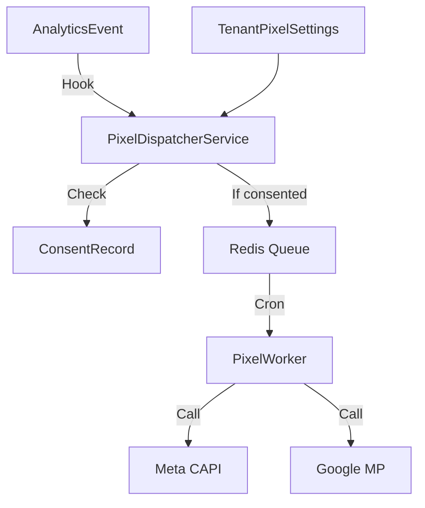

# Plan de Implementación: Pixel Manager (CAPI)

**Fecha**: 2026-02-02  
**Versión**: 1.0  
**Autor**: Equipo Técnico Jaraba  
**Prioridad**: CRÍTICA (cierre del sistema de tracking nativo)  
**Esfuerzo estimado**: 25 horas (~€2,000)

---

## 1. Objetivo

Implementar un sistema nativo de gestión de pixels que reemplace GTM con soporte para:
1. **Meta CAPI** (Facebook/Instagram Conversions API)
2. **Google Measurement Protocol** (Google Ads / GA4)
3. **Deduplicación** automática de eventos (client+server)

### Valor de Negocio
- **Ahorro**: €3,000-€12,000/año en GTM Server-Side
- **Soberanía**: 100% de datos en infraestructura propia
- **Cumplimiento**: GDPR integrado con Consent Manager nativo
- **Precisión**: Bypass de ad-blockers via server-side

---

## 2. Arquitectura



### Componentes Principales

| Componente | Descripción |
|------------|-------------|
| `PixelDispatcherService` | Orquesta el dispatch de eventos a pixels |
| `MetaCapiClient` | Cliente HTTP para Meta Conversions API v18 |
| `GoogleMeasurementClient` | Cliente para Google Measurement Protocol |
| `EventMapperService` | Mapeo de eventos internos a formato de cada plataforma |
| `CredentialManagerService` | Gestión segura de tokens per-tenant |

---

## 3. Mapeo de Eventos (Spec 178)

| Evento Interno | Meta (Pixel/CAPI) | Google (Ads/GA4) |
|----------------|-------------------|------------------|
| `page_view` | `PageView` | `page_view` |
| `lead` | `Lead` | `generate_lead` |
| `signup` | `CompleteRegistration` | `sign_up` |
| `add_to_cart` | `AddToCart` | `add_to_cart` |
| `purchase` | `Purchase` | `purchase` |

---

## 4. Archivos a Crear

### Módulo `jaraba_pixels`

| Archivo | Propósito |
|---------|-----------|
| `jaraba_pixels.info.yml` | Metadatos del módulo |
| `jaraba_pixels.install` | Schema de tablas |
| `jaraba_pixels.services.yml` | Definición de servicios |
| `jaraba_pixels.routing.yml` | Rutas API y admin |
| `jaraba_pixels.permissions.yml` | Permisos |
| `jaraba_pixels.module` | Hooks (insert, cron) |

### Servicios

| Archivo | Propósito |
|---------|-----------|
| `src/Service/PixelDispatcherService.php` | Servicio principal |
| `src/Service/EventMapperService.php` | Mapeo de eventos |
| `src/Service/CredentialManagerService.php` | Gestión de credenciales |
| `src/Client/MetaCapiClient.php` | Cliente Meta CAPI |
| `src/Client/GoogleMeasurementClient.php` | Cliente Google MP |

### Controllers y UI

| Archivo | Propósito |
|---------|-----------|
| `src/Controller/PixelSettingsController.php` | Panel de configuración |
| `src/Controller/PixelApiController.php` | APIs REST |
| `templates/pixel-settings-dashboard.html.twig` | UI de gestión |

---

## 5. Schema de Base de Datos

### Tabla `pixel_credentials`
- `id`: ID único
- `tenant_id`: Referencia a tenant
- `platform`: meta, google, linkedin, tiktok
- `pixel_id`: ID del pixel o measurement ID
- `access_token`: Token encriptado
- `status`: enabled, disabled, error
- `test_mode`: Modo test

### Tabla `pixel_event_log`
- `id`: ID único
- `tenant_id`: Referencia a tenant
- `event_id`: UUID para deduplicación
- `platform`: Plataforma destino
- `status`: pending, sent, failed
- `response_code`: Código HTTP

---

## 6. Fases de Implementación

| Fase | Descripción | Horas |
|------|-------------|-------|
| 1 | Infraestructura (módulo, schema, servicios base) | 6h |
| 2 | Meta CAPI (cliente, mapeo, UI) | 8h |
| 3 | Google Measurement Protocol | 6h |
| 4 | Integración (hooks, deduplicación, consent) | 5h |
| **Total** | | **25h** |

---

## 7. Integración con Consent Manager

```php
$consent = $this->consentService->getConsentRecord($visitorId, $tenantId);
if (!$consent || !$consent->hasConsent('marketing')) {
  return; // No enviar a pixels de marketing
}
```

---

## 8. Deduplicación de Eventos

1. `event_id` se genera en el tracker JS
2. Se incluye en el Beacon payload
3. Se guarda en `analytics_event.event_id`
4. Se envía el mismo `event_id` a Meta/Google
5. Las plataformas deduplicarán automáticamente

---

## 9. Verificación

### Automática
- UI panel pixels se renderiza correctamente
- Test conexión Meta (mock response)
- Test conexión Google (mock response)

### Manual
- Configurar credenciales reales en tenant de prueba
- Ejecutar evento de conversión
- Verificar en Meta Events Manager / Google Analytics

---

## 10. Riesgos y Mitigaciones

| Riesgo | Probabilidad | Impacto | Mitigación |
|--------|--------------|---------|------------|
| Rate limiting APIs | Media | Bajo | Queue + batch processing |
| Tokens expirados | Alta | Medio | Verificación periódica + alertas |
| Datos PII en logs | Media | Alto | Hashear email/phone |

---

*Documento creado siguiendo directrices de documentación del proyecto.*
