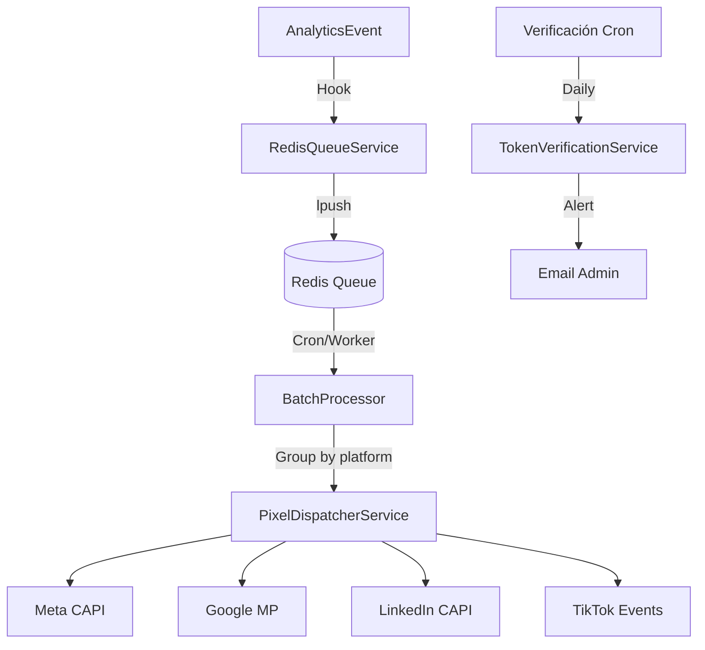

# Plan de Implementación: Pixel Manager V2 (Queue + Batch)

**Fecha**: 2026-02-02  
**Versión**: 2.0  
**Autor**: Equipo Técnico Jaraba  
**Prioridad**: MEDIA (optimización de rendimiento)  
**Esfuerzo estimado**: 20 horas (~€1,600)  
**Prerrequisito**: V1 completada

---

## 1. Objetivo

Evolucionar el Pixel Manager V1 a una arquitectura de alto rendimiento con:

1. **Queue Redis Asíncrona** - Desacoplar el dispatch del request HTTP
2. **Batch Processing** - Agrupar eventos para reducir llamadas API
3. **Dashboard de Estadísticas** - Visualización de métricas por plataforma
4. **Sistema de Alertas** - Notificaciones de tokens expirados

### Valor de Negocio
- **Rendimiento**: Requests 50ms más rápidos al no esperar APIs externas
- **Fiabilidad**: Reintentos automáticos si APIs fallan
- **Visibilidad**: Dashboard con métricas en tiempo real
- **Proactividad**: Alertas antes de que expiren tokens

---

## 2. Arquitectura V2



---

## 3. Archivos a Crear

### Servicios

| Archivo | Propósito |
|---------|-----------|
| `src/Service/RedisQueueService.php` | Encolar/desencolar eventos en Redis |
| `src/Service/BatchProcessorService.php` | Procesar lotes de eventos |
| `src/Service/TokenVerificationService.php` | Verificar tokens y enviar alertas |
| `src/Controller/PixelStatsController.php` | API para dashboard de estadísticas |

### Templates

| Archivo | Propósito |
|---------|-----------|
| `templates/pixel-stats-dashboard.html.twig` | Dashboard con gráficos Chart.js |

---

## 4. Archivos a Modificar

| Archivo | Cambio |
|---------|--------|
| `jaraba_pixels.module` | Usar `enqueue()` en hook_insert, añadir cron batch |
| `jaraba_pixels.services.yml` | Registrar nuevos servicios |
| `jaraba_pixels.routing.yml` | Nueva ruta para stats dashboard |
| `MetaCapiClient.php` | Implementar `sendBatch()` |
| `TikTokEventsClient.php` | Implementar `sendBatch()` |

---

## 5. Schema Adicional

### Queue en Redis
```
Key: jaraba_pixels:queue
Type: List (FIFO)
TTL: 24h (eventos no procesados se descartan)
```

### Estructura de mensaje
```json
{
  "event_id": "uuid-v4",
  "tenant_id": 1,
  "event_type": "page_view",
  "platforms": ["meta", "google"],
  "data": {...},
  "enqueued_at": 1706889600
}
```

---

## 6. Fases de Implementación

| Fase | Descripción | Horas |
|------|-------------|-------|
| 1 | Queue Redis Asíncrona | 6h |
| 2 | Batch Processing | 6h |
| 3 | Dashboard de Estadísticas | 5h |
| 4 | Sistema de Alertas | 3h |
| **Total** | | **20h** |

---

## 7. Configuración

```yaml
# jaraba_pixels.settings.yml
queue:
  enabled: true
  batch_size: 100
  processing_interval: 60  # segundos
  max_retries: 3

alerts:
  enabled: true
  email: admin@jaraba.es
  check_interval: 86400  # 24h
```

---

## 8. Fallback

Si Redis no está disponible, el sistema debe:
1. Detectar la falta de conexión
2. Fallback a envío síncrono (V1)
3. Log de warning

```php
if (!$this->redis->isConnected()) {
    $this->logger->warning('Redis unavailable, using sync dispatch');
    return $this->dispatcher->dispatch($event);
}
```

---

## 9. Verificación

### Automática
- [ ] Eventos se encolan en Redis correctamente
- [ ] Batch processor agrupa y envía en lotes
- [ ] Dashboard muestra métricas en tiempo real
- [ ] Alertas se disparan para tokens inválidos
- [ ] Fallback a sync funciona si Redis falla

### Manual
- [ ] Simular alto volumen de eventos
- [ ] Verificar en Redis CLI: `LLEN jaraba_pixels:queue`
- [ ] Confirmar emails de alerta llegan

---

## 10. Riesgos y Mitigaciones

| Riesgo | Probabilidad | Impacto | Mitigación |
|--------|--------------|---------|------------|
| Redis no disponible | Baja | Medio | Fallback a sync |
| Batch muy grande | Media | Bajo | Límite de 100 eventos |
| Cron no ejecutando | Baja | Alto | Health check en dashboard |
| Memory leak en queue | Baja | Medio | TTL 24h en mensajes |

---

*Documento creado siguiendo directrices de documentación del proyecto.*
