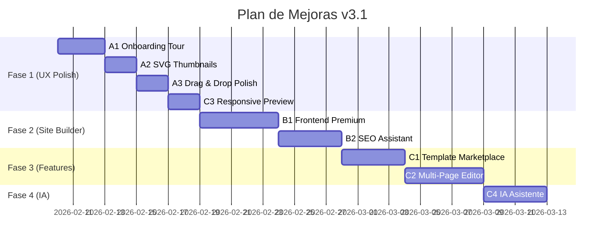
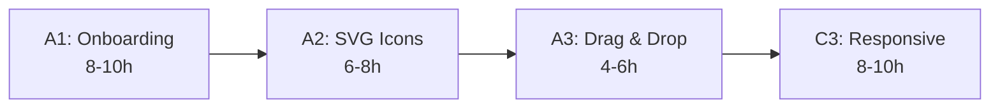
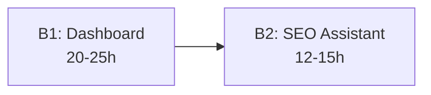
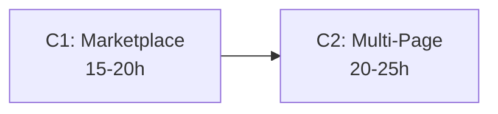
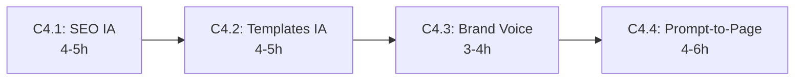

# Plan de Mejoras Page Builder & Site Builder v3.0

**Fecha de creación:** 2026-02-09 18:30  
**Última actualización:** 2026-02-09 18:30  
**Autor:** IA Asistente  
**Versión:** 3.1.0  
**Estado:** Planificado  

---

## 📑 Tabla de Contenidos (TOC)

1. [Contexto y Score Actual](#1-contexto-y-score-actual)
2. [Resumen Ejecutivo de Mejoras](#2-resumen-ejecutivo-de-mejoras)
3. [Sprint A1: Onboarding Tour (G5)](#3-sprint-a1-onboarding-tour-g5)
4. [Sprint A2: SVG Thumbnails Registry (G6)](#4-sprint-a2-svg-thumbnails-registry-g6)
5. [Sprint A3: Drag & Drop Polish](#5-sprint-a3-drag--drop-polish)
6. [Sprint B1: Site Builder Frontend Premium](#6-sprint-b1-site-builder-frontend-premium)
7. [Sprint B2: SEO Assistant Integrado](#7-sprint-b2-seo-assistant-integrado)
8. [Sprint C1: Template Marketplace](#8-sprint-c1-template-marketplace)
9. [Sprint C2: Multi-Page Editor](#9-sprint-c2-multi-page-editor)
10. [Sprint C3: Responsive Preview Mejorado](#10-sprint-c3-responsive-preview-mejorado)
11. [Sprint C4: IA Asistente Integrada](#11-sprint-c4-ia-asistente-integrada)
12. [Roadmap y Dependencias](#12-roadmap-y-dependencias)
13. [Control de Cumplimiento de Directrices](#13-control-de-cumplimiento-de-directrices)
14. [Verificación](#14-verificación)
15. [Registro de Cambios](#15-registro-de-cambios)

---

## 1. Contexto y Score Actual

### Score Page Builder: 10/10 ✅

La auditoría v2.1 (2026-02-09) confirmó que **TODOS los gaps originales (G1-G7)** están resueltos:

| Gap | Descripción | Estado |
|-----|-------------|--------|
| G1 | PostMessage Hot-Swap | ✅ Ya implementado (`notifyPreview()`) |
| G2 | Dual Architecture 6/6 bloques | ✅ Ya implementado |
| G3 | Commerce/Social traits | ✅ Ya implementado (4/4 bloques con traits + `Drupal.t()`) |
| G4 | AI endpoint URL | ✅ Corregido |
| G5 | Onboarding Tour | 🔶 Planificado en este documento |
| G6 | SVG Thumbnails | 🔶 Planificado en este documento |
| G7 | E2E Tests robustos | ✅ Ya implementado |

### Inventario actual

| Componente | Cantidad | Ubicación |
|-----------|----------|-----------|
| Bloques estáticos | 67+ (14 categorías) | `grapesjs-jaraba-blocks.js` (3628 LOC) |
| Plugins GrapesJS | 7 (blocks, seo, partials, ai, canvas, assets, command-palette) | `js/grapesjs-jaraba-*.js` |
| Content Entities | 6 | `src/Entity/` |
| APIs REST | 25+ | `jaraba_page_builder.routing.yml` (682 LOC) |
| SCSS parciales | 8 bloques | `scss/blocks/` |
| E2E Tests | 12 suites | `canvas-editor.cy.js` (666 LOC) |
| Site Builder APIs | 15 endpoints | `jaraba_site_builder.routing.yml` (267 LOC) |
| Site Builder Entities | 4 | SiteConfig, SitePageTree, SiteRedirect, SiteUrlHistory |
| Site Builder Services | 5 | Header/FooterVariant, Redirect, SiteStructure, Sitemap |

---

## 2. Resumen Ejecutivo de Mejoras

| Sprint | Mejora | Prioridad | Horas Est. | Dependencias |
|--------|--------|-----------|------------|--------------|
| **A1** | Onboarding Tour (G5) | 🟡 Media | 8-10h | Ninguna |
| **A2** | SVG Thumbnails Registry (G6) | 🟡 Media | 6-8h | Ninguna |
| **A3** | Drag & Drop Polish | 🟢 Baja | 4-6h | Ninguna |
| **B1** | Site Builder Frontend Premium | 🔴 Alta | 20-25h | A3 |
| **B2** | SEO Assistant Integrado | 🔴 Alta | 12-15h | B1 |
| **C1** | Template Marketplace | 🟡 Media | 15-20h | A2 |
| **C2** | Multi-Page Editor | 🔴 Alta | 20-25h | B1 |
| **C3** | Responsive Preview Mejorado | 🟡 Media | 8-10h | Ninguna |
| **C4** | IA Asistente Integrada | 🔴 Alta | 15-20h | B2, C1 |
| — | **TOTAL** | — | **108-139h** | — |

### Fases propuestas



---

## 3. Sprint A1: Onboarding Tour (G5)

**Estimación:** 8-10h  
**Objetivo:** Tour interactivo para nuevos usuarios del Canvas Editor con Driver.js

### Arquitectura

```
jaraba_page_builder/
├── js/
│   └── grapesjs-jaraba-onboarding.js  ← [NEW] Plugin GrapesJS
├── scss/
│   └── _onboarding.scss               ← [NEW] Estilos del tour
└── src/
    └── Service/
        └── OnboardingStateService.php  ← [NEW] Persistencia usuario
```

### Implementación detallada

#### [NEW] `js/grapesjs-jaraba-onboarding.js`

Driver.js v1.x como dependencia (CDN o npm). Tour de 8-10 pasos:

| Paso | Selector | Descripción |
|------|----------|-------------|
| 1 | `#gjs-blocks-container` | "Aquí encuentras todos los bloques disponibles" |
| 2 | `.gjs-frame` | "Este es tu canvas — arrastra bloques aquí" |
| 3 | `#gjs-traits-container` | "Personaliza las propiedades de cada bloque" |
| 4 | `#gjs-styles-container` | "Ajusta los estilos visuales" |
| 5 | `.canvas-editor__viewport-btn[data-viewport=mobile]` | "Previsualiza en diferentes dispositivos" |
| 6 | `.jaraba-seo-toggle` | "Auditoría SEO en tiempo real" |
| 7 | `[data-cmd=jaraba:save]` | "Guarda con Ctrl+S o este botón" |
| 8 | `.canvas-editor__preview` | "Vista previa final aquí" |

**Comportamiento:**
- Tour se activa automáticamente en el **primer uso** (persistido en `localStorage` + backend vía API)
- Botón "?" en el toolbar para relanzar
- Respeta preferencia `prefers-reduced-motion`
- Textos con `Drupal.t()` para i18n

#### [NEW] `src/Service/OnboardingStateService.php`

```php
class OnboardingStateService {
    public function hasCompletedTour(int $uid): bool;
    public function markTourCompleted(int $uid): void;
    public function resetTour(int $uid): void;
}
```

Persistencia en `user_data` service de Drupal.

#### [NEW] Ruta API

```yaml
jaraba_page_builder.api.onboarding_state:
  path: '/api/v1/page-builder/onboarding'
  methods: [GET, POST]
  requirements:
    _permission: 'use page builder'
```

### SCSS

```scss
// _onboarding.scss — Solo var(--ej-*) con fallback
.jaraba-onboarding {
    &__highlight {
        border: 2px solid var(--ej-color-innovation, #00A9A5);
        border-radius: var(--ej-radius-md, 12px);
    }
    &__tooltip {
        background: var(--ej-bg-surface, #fff);
        box-shadow: var(--ej-shadow-lg, 0 10px 40px rgba(0,0,0,0.12));
    }
}
```

---

## 4. Sprint A2: SVG Thumbnails Registry (G6)

**Estimación:** 6-8h  
**Objetivo:** Iconos SVG específicos en la paleta de bloques para navegación visual intuitiva

### Estado actual

Actualmente los bloques usan SVGs genéricos definidos en `getDefaultBlockIcon()` (solo 3 iconos: hero, features, cta). El 90% de bloques heredan el SVG `<rect>` por defecto.

### Implementación

#### [NEW] `images/block-icons/` — 14 SVGs mínimo (1 por categoría)

| Categoría | SVG | Diseño |
|-----------|-----|--------|
| Básicos | `basic.svg` | Tipografía T |
| Layout | `layout.svg` | Grid 2x2 |
| Hero | `hero.svg` | Banner con texto |
| Contenido | `content.svg` | Párrafo con imagen |
| CTA | `cta.svg` | Botón con flecha |
| Estadísticas | `stats.svg` | Gráfico barras |
| Precios | `pricing.svg` | Tabla 3 columnas |
| Contacto | `contact.svg` | Sobre correo |
| Multimedia | `media.svg` | Play video |
| Commerce | `commerce.svg` | Carrito compra |
| Social | `social.svg` | Compartir |
| Advanced | `advanced.svg` | Engranaje |
| Utilities | `utilities.svg` | Herramienta |
| Interactivos | `interactive.svg` | Toggle switch |
| Premium | `premium.svg` | Estrella |

#### [MODIFY] `grapesjs-jaraba-blocks.js`

Actualizar `media` de cada bloque para usar SVG específico por categoría:

```javascript
// Antes (genérico)
media: '<svg viewBox="0 0 24 24"><rect.../></svg>'

// Después (específico por categoría + bloque)
media: blockIconRegistry[block.id] || categoryIcons[block.category]
```

Crear objeto `blockIconRegistry` con iconos específicos para bloques premium (product-card, pricing-table, etc.).

#### [NEW] `js/block-icon-registry.js`

```javascript
const blockIconRegistry = {
    'jaraba-product-card': '<svg...>📦</svg>',
    'jaraba-pricing-table': '<svg...>💰</svg>',
    'jaraba-contact-form': '<svg...>✉️</svg>',
    'jaraba-social-links': '<svg...>🔗</svg>',
    'jaraba-faq-accordion': '<svg...>❓</svg>',
    'jaraba-stats-counter': '<svg...>📊</svg>',
    // ... 67+ bloques
};
```

---

## 5. Sprint A3: Drag & Drop Polish

**Estimación:** 4-6h  
**Objetivo:** Feedback visual mejorado al arrastrar bloques al canvas

### Mejoras

#### 1. Ghost Element Premium

```scss
// _canvas-editor.scss — Agregar
.gjs-block.gjs-block--dragging {
    opacity: 0.6;
    transform: scale(0.95);
    box-shadow: var(--ej-shadow-xl, 0 20px 60px rgba(0,0,0,0.2));
    border: 2px dashed var(--ej-color-innovation, #00A9A5);
}
```

#### 2. Drop Zones Visuales

```javascript
// grapesjs-jaraba-canvas.js — Mejorar
editor.on('block:drag:start', (model, block) => {
    document.querySelectorAll('.gjs-comp-selected').forEach(el => {
        el.classList.add('jaraba-drop-zone--active');
    });
});

editor.on('block:drag:stop', () => {
    document.querySelectorAll('.jaraba-drop-zone--active').forEach(el => {
        el.classList.remove('jaraba-drop-zone--active');
    });
});
```

#### 3. Snap-to-Grid con Feedback

- Guías de alineación magnéticas al arrastrar
- Indicador de posición "antes de" / "después de"
- Animación spring al soltar (`transition: transform 200ms cubic-bezier(0.34, 1.56, 0.64, 1)`)

#### 4. Toast de Confirmación

Al soltar un bloque, micro-animación de confirmación:
- ✅ Icono check animado
- Nombre del bloque insertado
- Se auto-oculta en 1.5s

---

## 6. Sprint B1: Site Builder Frontend Premium

**Estimación:** 20-25h  
**Objetivo:** Dashboard mejorado con tree view interactivo, drag-drop de páginas, preview en vivo

### Estado actual

- `SiteTreePageController` con 10 métodos (admin + frontend variants)
- `site-tree-manager.js` (16KB) — JS básico para el árbol
- 5 tabs: Dashboard, Tree, Config, Redirects, Sitemap
- 15 API endpoints operativos (CRUD tree, config, logo, variants)

### Arquitectura de mejoras

```
jaraba_site_builder/
├── js/
│   ├── site-tree-manager.js        ← [MODIFY] Mejorar con drag-drop nativo
│   ├── site-builder-dashboard.js   ← [NEW] Dashboard premium con KPIs
│   └── site-preview-panel.js       ← [NEW] Preview en vivo
├── scss/
│   ├── _site-builder.scss          ← [NEW] Glassmorphism dashboard
│   └── _site-tree.scss             ← [NEW] Tree view premium
├── templates/
│   └── site-builder-dashboard.html.twig ← [MODIFY] Layout mejorado
└── src/
    └── Service/
        └── SiteAnalyticsService.php ← [NEW] KPIs: páginas, visitas, SEO score
```

### Componentes del Dashboard

#### 1. KPIs Row (glassmorphism)

| KPI | Fuente | API |
|-----|--------|-----|
| Total Páginas | `SitePageTree::count()` | `/api/v1/site/stats` |
| Páginas Publicadas | `status = published` | `/api/v1/site/stats` |
| SEO Score Medio | `SEOAuditor` aggregated | `/api/v1/site/stats` |
| Última Actualización | `changed` timestamp | `/api/v1/site/stats` |

#### 2. Tree View Interactivo

```javascript
// site-tree-manager.js — Mejorar
class SiteTreeManager {
    // Drag-drop nativo para reordenar páginas
    initDragDrop() {
        new Sortable(this.treeContainer, {
            group: 'nested',
            animation: 150,
            fallbackOnBody: true,
            swapThreshold: 0.65,
            handle: '.site-tree__drag-handle',
            onEnd: (evt) => this.handleReorder(evt),
        });
    }

    // Preview inline al hover sobre una página
    showInlinePreview(pageId) {
        const thumbnail = await fetch(`/api/v1/site/pages/${pageId}/thumbnail`);
        this.previewTooltip.show(thumbnail);
    }

    // Acciones contextuales (editar, duplicar, mover, eliminar)
    showContextMenu(pageId, event) { ... }
}
```

#### 3. Panel Preview en Vivo

Iframe lateral que muestra la página seleccionada en tiempo real. Cuando se selecciona una página del tree, el preview se actualiza.

### Nuevas rutas API

```yaml
jaraba_site_builder.api.stats:
  path: '/api/v1/site/stats'
  methods: [GET]
  requirements:
    _permission: 'view site structure'

jaraba_site_builder.api.page_thumbnail:
  path: '/api/v1/site/pages/{id}/thumbnail'
  methods: [GET]
  requirements:
    _permission: 'view site structure'
```

---

## 7. Sprint B2: SEO Assistant Integrado

**Estimación:** 12-15h  
**Objetivo:** SEO scoring en tiempo real por página desde el Site Builder

### Estado actual

El plugin `grapesjs-jaraba-seo.js` (853 LOC) ya tiene un `SEOAuditor` con 5 checks:
- H1 único
- Jerarquía headings
- Alt text imágenes
- Accesibilidad enlaces
- Longitud contenido

### Mejoras

#### 1. SEO Score Numérico (0-100)

```javascript
// Extender SEOAuditor
class SEOScoreCalculator extends SEOAuditor {
    calculateScore() {
        const weights = {
            h1_unique: 20,
            heading_hierarchy: 15,
            images_alt: 20,
            links_accessibility: 10,
            content_length: 10,
            meta_description: 15,  // NUEVO
            internal_links: 5,     // NUEVO
            keyword_density: 5,    // NUEVO
        };
        // ... calcular score ponderado
        return { score, issues, suggestions };
    }
}
```

#### 2. Nuevos checks

| Check | Peso | Descripción |
|-------|------|-------------|
| Meta Title Length | 15 | 30-60 caracteres |
| Meta Description | 15 | 120-160 caracteres |
| Internal Links | 5 | ≥2 enlaces internos |
| Keyword Density | 5 | 1-3% keyword principal |
| URL Slug | 5 | Corto, sin caracteres especiales |
| OG Tags | 5 | Open Graph meta tags |

#### 3. Integración con Site Builder

```
Site Builder Dashboard
  └── Tabla de Páginas
       └── Columna "SEO Score"
            └── Badge color: 🟢 80-100, 🟡 50-79, 🔴 0-49
            └── Click → Panel lateral con sugerencias
```

#### [NEW] `js/site-builder-seo.js`

```javascript
class SiteBuilderSEO {
    async auditAllPages() {
        const pages = await fetch('/api/v1/site/tree');
        const results = [];
        for (const page of pages.data) {
            const score = await this.auditPage(page.id);
            results.push({ pageId: page.id, title: page.title, score });
        }
        return results;
    }

    renderScoreBadge(score) {
        const color = score >= 80 ? 'success' : score >= 50 ? 'warning' : 'error';
        return `<span class="seo-badge seo-badge--${color}">${score}</span>`;
    }
}
```

#### [NEW] API Endpoint

```yaml
jaraba_page_builder.api.seo_audit:
  path: '/api/v1/page-builder/pages/{id}/seo-audit'
  methods: [GET]
  requirements:
    _permission: 'use page builder'
```

---

## 8. Sprint C1: Template Marketplace

**Estimación:** 15-20h  
**Objetivo:** Catálogo de plantillas pre-diseñadas por vertical

### Estado actual

El `loadBlocksFromRegistry()` ya consulta `/api/v1/page-builder/templates?format=blocks` y el Template Registry maneja `isLocked`, `isPremium`, `requiredPlan`.

### Arquitectura

```
jaraba_page_builder/
├── js/
│   └── grapesjs-jaraba-marketplace.js  ← [NEW] UI del marketplace
├── scss/
│   └── _marketplace.scss               ← [NEW] Glassmorphism cards
├── src/
│   ├── Controller/
│   │   └── TemplateMarketplaceController.php ← [NEW]
│   └── Service/
│       └── TemplateMarketplaceService.php    ← [NEW]
└── config/
    └── install/
        └── jaraba_page_builder.marketplace.yml ← [NEW] Config templates
```

### Funcionalidad

#### 1. Slide Panel Marketplace

Activado desde botón "📦 Marketplace" en el toolbar del Canvas Editor. Slide panel con:

| Filtro | Opciones |
|--------|----------|
| Vertical | Empleabilidad, Emprendimiento, Formación, AgroConecta, Genérica |
| Categoría | Landing, About, Pricing, Contact, Blog, Portfolio |
| Plan | Free, Profesional, Premium |
| Tipo | Página completa, Sección, Bloque |

#### 2. Preview de Templates

Cada template muestra:
- Thumbnail SVG o captura
- Nombre + descripción
- Badge de plan requerido (🔒 si locked)
- Botón "Usar" → inserta en canvas
- Botón "Previsualizar" → vista modal

#### 3. Backend

```php
class TemplateMarketplaceService {
    public function getTemplates(string $vertical, string $category, string $plan): array;
    public function getTemplateById(string $id): ?array;
    public function installTemplate(string $id, int $pageId): bool;
    public function getVerticalDefaults(string $vertical): array;
}
```

#### 4. Templates por vertical

| Vertical | Templates | Categorías |
|----------|-----------|------------|
| Empleabilidad | 8 | CV Builder, Job Board, Skills Assessment |
| Emprendimiento | 10 | BMC Canvas, Pitch Deck, Investor Dashboard |
| AgroConecta | 6 | Product Catalog, Producer Profile, Farm Dashboard |
| Formación | 8 | Course Landing, Certification, Schedule |
| Genérica | 12 | Landing, About, Pricing, Contact, Blog, FAQ |

**Total:** ~44 templates

---

## 9. Sprint C2: Multi-Page Editor

**Estimación:** 20-25h  
**Objetivo:** Editar varias páginas del sitio sin abandonar el editor

### Concepto

Tabs de páginas en la parte superior del Canvas Editor, similar a un IDE:

```
┌─────────────────────────────────────────────────────┐
│ [Home ×] [Sobre Nosotros ×] [Servicios ×] [+ Nueva] │
├────────────────┬────────────────────────────────────┤
│  Bloques       │         Canvas                     │
│  ├── Básicos   │                                    │
│  ├── Hero      │    (página activa)                 │
│  ├── CTA       │                                    │
│  └── ...       │                                    │
├────────────────┼────────────────────────────────────┤
│  Propiedades   │         Preview                    │
└────────────────┴────────────────────────────────────┘
```

### Implementación

#### [NEW] `js/grapesjs-jaraba-multipage.js`

```javascript
class JarabaMultiPageEditor {
    constructor(editor) {
        this.editor = editor;
        this.pages = new Map(); // pageId → { components, styles, isDirty }
        this.activePageId = null;
    }

    // Abre una página en una nueva tab
    async openPage(pageId) {
        if (!this.pages.has(pageId)) {
            const data = await fetch(`/api/v1/pages/${pageId}/canvas`);
            this.pages.set(pageId, await data.json());
        }
        this.switchToPage(pageId);
    }

    // Cambia entre tabs guardando estado
    switchToPage(pageId) {
        // Guardar estado actual
        if (this.activePageId) {
            this.pages.set(this.activePageId, {
                components: this.editor.getComponents(),
                styles: this.editor.getStyle(),
                isDirty: true,
            });
        }

        // Cargar nueva página
        const pageData = this.pages.get(pageId);
        this.editor.setComponents(pageData.components);
        this.editor.setStyle(pageData.styles);
        this.activePageId = pageId;
        this.updateTabsUI();
    }

    // Guarda todas las páginas modificadas
    async saveAll() {
        for (const [pageId, data] of this.pages) {
            if (data.isDirty) {
                await this.savePage(pageId, data);
            }
        }
    }
}
```

#### [MODIFY] `templates/page--jaraba-canvas-editor.html.twig`

Añadir tabs de páginas:

```twig
<div class="canvas-editor__page-tabs" id="page-tabs">
    {# Las tabs se generan dinámicamente desde JS #}
</div>
```

#### Nuevas rutas API

```yaml
jaraba_page_builder.api.pages_list:
  path: '/api/v1/page-builder/pages'
  methods: [GET]
  requirements:
    _permission: 'use page builder'

jaraba_page_builder.api.page_create:
  path: '/api/v1/page-builder/pages'
  methods: [POST]
  requirements:
    _permission: 'create page content'
```

### Integración con Site Builder

El multi-page editor se conecta al Site Builder tree: al hacer click en una página del árbol, se abre como tab en el editor.

---

## 10. Sprint C3: Responsive Preview Mejorado

**Estimación:** 8-10h  
**Objetivo:** Vista mobile/tablet/desktop con breakpoints reales y más dispositivos

### Estado actual

El `deviceManager` tiene 3 dispositivos básicos:
- Desktop: `100%`
- Tablet: `768px` (media: `992px`)
- Mobile: `375px` (media: `480px`)

### Mejoras

#### 1. Más dispositivos

```javascript
deviceManager: {
    devices: [
        { id: 'desktop-xl', name: 'Desktop XL', width: '' },
        { id: 'desktop', name: 'Desktop', width: '1280px' },
        { id: 'laptop', name: 'Laptop', width: '1024px' },
        { id: 'tablet-landscape', name: 'Tablet Horizontal', width: '1024px', widthMedia: '1024px' },
        { id: 'tablet', name: 'Tablet', width: '768px', widthMedia: '992px' },
        { id: 'mobile-large', name: 'Móvil Grande', width: '428px', widthMedia: '480px' },
        { id: 'mobile', name: 'Móvil', width: '375px', widthMedia: '480px' },
        { id: 'mobile-small', name: 'Móvil Pequeño', width: '320px', widthMedia: '375px' },
    ],
}
```

#### 2. Device Selector Premium

Reemplazar los 3 botones simples del toolbar por un selector visual:

```
┌──────────────────────────────────────┐
│  📱 320   📱 375   📱 428            │
│  📲 768   💻 1024  🖥️ 1280  🖥️ Full │
│                                      │
│  ← Deslizar para ancho custom →      │
│  ████████████░░░░░░░░  768px         │
└──────────────────────────────────────┘
```

#### 3. Ancho Custom con Slider

```javascript
// Slider para ancho personalizado
setupCustomWidth() {
    const slider = document.getElementById('viewport-width-slider');
    slider.addEventListener('input', (e) => {
        const width = e.target.value + 'px';
        this.editor.setDevice('custom');
        this.editor.Canvas.getFrameEl().style.width = width;
        document.getElementById('viewport-width-label').textContent = width;
    });
}
```

#### 4. Rotación Portrait/Landscape

Toggle para rotar el dispositivo:

```javascript
toggleOrientation() {
    const frame = this.editor.Canvas.getFrameEl();
    const current = frame.style.width;
    const height = frame.style.height;
    frame.style.width = height;
    frame.style.height = current;
}
```

#### 5. Device Frame Visual

Opcional: Marco visual del dispositivo (iPhone, iPad, Desktop) alrededor del canvas para que el usuario tenga contexto visual real.

### SCSS

```scss
// _responsive-preview.scss
.canvas-editor__device-selector {
    display: flex;
    gap: 0.5rem;
    background: var(--ej-bg-tertiary, #f8fafc);
    border-radius: var(--ej-radius-lg, 16px);
    padding: 0.5rem;

    &__btn {
        padding: 0.5rem 1rem;
        border-radius: var(--ej-radius-md, 8px);
        transition: all 200ms ease;

        &.is-active {
            background: var(--ej-color-corporate, #233D63);
            color: white;
        }
    }

    &__slider {
        appearance: none;
        height: 4px;
        background: var(--ej-border-color, #e2e8f0);
        border-radius: 2px;

        &::-webkit-slider-thumb {
            appearance: none;
            width: 16px;
            height: 16px;
            border-radius: 50%;
            background: var(--ej-color-innovation, #00A9A5);
        }
    }
}
```

---

## 11. Roadmap y Dependencias

### Fase 1: UX Polish (Semana 1-2)



**Criterio de aceptación:** Canvas Editor tiene tour, iconos visuales, drag-drop mejorado y 8 viewports.

### Fase 2: Site Builder Premium (Semana 3-4)



**Criterio de aceptación:** Site Builder con KPIs glassmorphism, tree drag-drop, preview inline, SEO score por página.

### Fase 3: Features Avanzadas (Semana 5-7)



**Criterio de aceptación:** Marketplace de 44+ templates por vertical, editor multi-página con tabs.

---

## 11. Sprint C4: IA Asistente Integrada

**Estimación:** 15-20h  
**Objetivo:** Potenciar Page Builder y Site Builder con capacidades de IA generativa usando el patrón `@ai.provider`

### Estado actual

El plugin `grapesjs-jaraba-ai.js` (306 LOC) ya tiene:
- `showAIModal()` — Modal para escribir prompt de contenido
- `generateAIContent()` — POST `/api/page-builder/generate-content` vía `AiContentController`
- `applyGeneratedContent()` — Insertar resultado en componente GrapesJS

Servicios IA existentes (reutilizables):
- `ContentGroundingService` — Enriquece prompts con contenido real de Drupal
- `CopilotQueryLoggerService` — Analytics de todas las queries IA
- `@ai.provider` con failover Anthropic → OpenAI

### 4 Funcionalidades IA Nuevas

#### C4.1 — Sugerencias SEO con IA (integración con B2)

Extiende el SEO Assistant para generar **sugerencias accionables** con LLM:

```php
// SeoSuggestionService.php — Usa siempre @ai.provider
class SeoSuggestionService {
    public function __construct(
        private AiProviderPluginManager $aiProvider,
        private ContentGroundingService $grounding,
        private CopilotQueryLoggerService $queryLogger,
    ) {}

    /**
     * Genera sugerencias SEO para una página específica.
     *
     * @param string $html Contenido HTML de la página.
     * @param string $keyword Keyword objetivo.
     * @return array Sugerencias priorizadas.
     */
    public function suggestImprovements(string $html, string $keyword): array {
        $prompt = $this->buildSeoPrompt($html, $keyword);
        
        // Failover pattern (directriz @ai.provider)
        foreach (['anthropic', 'openai'] as $provider) {
            try {
                $llm = $this->aiProvider->createInstance($provider);
                $response = $llm->chat([
                    ['role' => 'user', 'content' => $prompt]
                ], 'claude-3-5-sonnet-20241022');
                
                $this->queryLogger->logQuery('seo', $prompt, $response->getText(), []);
                return $this->parseSuggestions($response->getText());
            } catch (\Exception $e) {
                continue;
            }
        }
        return $this->getFallbackSuggestions($html);
    }
}
```

**Frontend:** Botón "🤖 Sugerir mejoras" en el panel SEO del Site Builder, resultado en slide-panel:

```javascript
// site-builder-seo.js
async showAISuggestions(pageId) {
    const response = await fetch(`/api/v1/page-builder/pages/${pageId}/seo-ai-suggest`);
    const { suggestions } = await response.json();
    
    // Renderizar en slide-panel
    this.openSlidePanel(
        Drupal.t('Sugerencias SEO con IA'),
        this.renderSuggestionsList(suggestions)
    );
}
```

#### C4.2 — Generación IA de Templates por Vertical (integración con C1)

Desde el Marketplace, botón "✨ Generar con IA" que crea una landing completa a partir de prompt:

```javascript
// grapesjs-jaraba-marketplace.js
async generateAITemplate(prompt, vertical) {
    const response = await fetch('/api/v1/page-builder/ai/generate-template', {
        method: 'POST',
        headers: { 'Content-Type': 'application/json' },
        body: JSON.stringify({
            prompt: prompt,
            vertical: vertical,  // 'empleabilidad', 'emprendimiento', 'agroconecta'...
            tone: Drupal.t('profesional'),
        }),
    });
    const { html, css } = await response.json();
    
    // Insertar en canvas
    this.editor.setComponents(html);
    this.editor.setStyle(css);
}
```

**Backend:**

```php
// AiTemplateGeneratorService.php
class AiTemplateGeneratorService {
    public function generateTemplate(string $prompt, string $vertical): array {
        // Grounding con templates existentes de la vertical
        $context = $this->grounding->getVerticalContext($vertical);
        $brandVoice = $this->getBrandVoice($vertical);
        
        $fullPrompt = "Genera HTML de landing page para vertical '{$vertical}'.\n"
            . "Brand Voice: {$brandVoice}\n"
            . "Contexto templates existentes:\n{$context}\n"
            . "Instrucciones del usuario: {$prompt}\n"
            . "REGLAS: Usar clases CSS con prefijo 'jaraba-', "
            . "estructura semántica (header/main/footer), responsive.";
        
        // @ai.provider con failover
        $response = $this->callWithFailover($fullPrompt);
        return $this->parseTemplateResponse($response);
    }
}
```

#### C4.3 — Optimización de Contenido por Vertical con Brand Voice

Evolución del actual `grapesjs-jaraba-ai.js` para soportar:

| Feature | Descripción |
|---------|-------------|
| **Brand Voice** | Tono adaptado por vertical (corporativo/emprendimiento/agro) |
| **Content Grounding** | Enriquece prompts con datos reales de Drupal |
| **Multi-tonalidad** | Formal, Cercano, Técnico, Inspirador |
| **Historial** | Log de todas las generaciones vía `CopilotQueryLoggerService` |

**Modificación en** `grapesjs-jaraba-ai.js`:

```javascript
// Añadir selector de vertical al modal de IA existente
showAIModal(editor, component, context) {
    // ... modal existente + añadir:
    const verticalSelect = `
        <label>${Drupal.t('Vertical')}</label>
        <select id="ai-vertical">
            <option value="empleabilidad">${Drupal.t('Empleabilidad')}</option>
            <option value="emprendimiento">${Drupal.t('Emprendimiento')}</option>
            <option value="agroconecta">${Drupal.t('AgroConecta')}</option>
            <option value="formacion">${Drupal.t('Formación')}</option>
            <option value="generica">${Drupal.t('Genérica')}</option>
        </select>
    `;
    // Enviar vertical + tone al backend
}
```

#### C4.4 — Prompt-to-Page (evolución de Prompt-to-Section)

El actual "Prompt-to-Section" genera UNA sección. Evolución a página completa:

```
Usuario escribe: "Landing para bootcamp Python con hero, features, pricing y CTA"
  → IA genera 4 secciones con contenido coherente
  → Se insertan todas en el canvas en orden
  → Estilos aplicados según vertical seleccionada
```

**Implementación:**

```php
// AiContentController::generateFullPage()
public function generateFullPage(Request $request): JsonResponse {
    $prompt = $request->get('prompt');
    $vertical = $request->get('vertical', 'generica');
    $sections = $request->get('sections', ['hero', 'features', 'pricing', 'cta']);
    
    $results = [];
    foreach ($sections as $section) {
        $results[] = $this->aiService->generateSection($prompt, $section, $vertical);
    }
    
    return new JsonResponse(['sections' => $results]);
}
```

**Nueva ruta:**

```yaml
jaraba_page_builder.api.ai_generate_page:
  path: '/api/v1/page-builder/ai/generate-page'
  methods: [POST]
  defaults:
    _controller: '\Drupal\jaraba_page_builder\Controller\AiContentController::generateFullPage'
  requirements:
    _permission: 'use page builder'
  options:
    _admin_route: FALSE
```

### Arquitectura de archivos C4

```
jaraba_page_builder/
├── js/
│   └── grapesjs-jaraba-ai.js             ← [MODIFY] +Brand Voice, +Vertical, +Prompt-to-Page
├── src/
│   ├── Controller/
│   │   └── AiContentController.php        ← [MODIFY] +generateFullPage(), +seoSuggest()
│   └── Service/
│       ├── AiTemplateGeneratorService.php ← [NEW] Genera templates completos con IA
│       └── SeoSuggestionService.php       ← [NEW] Sugerencias SEO con LLM
└── jaraba_page_builder.services.yml    ← [MODIFY] +2 services con '@ai.provider'
```

### Compliance IA

| Directriz | Aplicación |
|-----------|------------|
| `@ai.provider` siempre | ✅ Todos los services usan inyección `AiProviderPluginManager` |
| Failover multi-proveedor | ✅ Anthropic → OpenAI con `getFallbackResponse()` |
| `CopilotQueryLoggerService` | ✅ Todas las queries logueadas para analytics |
| `ContentGroundingService` | ✅ Prompts enriquecidos con contenido real de Drupal |
| Keys en Key module | ✅ `/admin/config/system/keys`, nunca hardcodeadas |
| `Drupal.t()` en JS | ✅ Todos los textos del modal IA traducibles |
| `$this->t()` en PHP | ✅ Mensajes y labels en controladores |

---

## 12. Roadmap y Dependencias

### Fase 1: UX Polish (Semana 1-2)


**Criterio de aceptación:** Canvas Editor tiene tour, iconos visuales, drag-drop mejorado y 8 viewports.

### Fase 2: Site Builder Premium (Semana 3-4)


**Criterio de aceptación:** Site Builder con KPIs glassmorphism, tree drag-drop, preview inline, SEO score por página.

### Fase 3: Features Avanzadas (Semana 5-7)


**Criterio de aceptación:** Marketplace de 44+ templates por vertical, editor multi-página con tabs.

### Fase 4: IA Integrada (Semana 7-8)



**Criterio de aceptación:** Sugerencias SEO con IA, generación de templates por vertical, Brand Voice, Prompt-to-Page.

---

## 13. Control de Cumplimiento de Directrices

> **CADA sprint DEBE cumplir TODAS estas directrices.** — `00_DIRECTRICES_PROYECTO.md`

### Checklist Obligatorio

| Directriz | Referencia | Aplicación |
|-----------|------------|------------|
| SCSS: Solo `var(--ej-*, $fallback)` | §2.2.1 | Todos los nuevos SCSS parciales |
| Dart Sass compilación | §2.2.1 | `npx sass` para cada nuevo parcial |
| i18n: `Drupal.t()` en JS, `` en Twig | §2.2.2 | Todos los textos de UI (tour, tooltips, labels) |
| Content Entities para datos de negocio | §5.1-5.7 | `OnboardingState` si se persiste en entidad |
| `@ai.provider` para IA | §2.10 + `/ai-integration` | C4 completo: SEO IA, Templates IA, Brand Voice |
| Failover multi-proveedor | `/ai-integration` | Anthropic → OpenAI en todos los services IA |
| `CopilotQueryLoggerService` | `/ai-integration` | Log de todas las queries IA para analytics |
| Tests E2E | §10 | Nuevos tests para marketplace, multi-page e IA |
| Docblocks en español | §10 | Todos los archivos nuevos |
| `_admin_route: FALSE` | Frontend | Todas las rutas nuevas del Site Builder |
| Permisos por endpoint | §4.5 | Cada nueva ruta API |

---

## 14. Verificación

### Fase 1 — Tests

```bash
# E2E: Verificar onboarding tour
npx cypress run --spec tests/e2e/cypress/e2e/onboarding-tour.cy.js

# E2E: Verificar responsive toggle
npx cypress run --spec tests/e2e/cypress/e2e/responsive-preview.cy.js

# Compilar SCSS nuevos
cd web/modules/custom/jaraba_page_builder
npx sass scss/page-builder-blocks.scss:css/page-builder-blocks.css --style=compressed
```

### Fase 2 — Tests

```bash
# E2E: Verificar Site Builder dashboard
npx cypress run --spec tests/e2e/cypress/e2e/site-builder-dashboard.cy.js

# E2E: Verificar SEO scores
npx cypress run --spec tests/e2e/cypress/e2e/site-builder-seo.cy.js
```

### Fase 4 — Tests

```bash
# E2E: Verificar IA integrada
npx cypress run --spec tests/e2e/cypress/e2e/ai-assistant.cy.js
```

### Verificación Manual

1. Abrir Canvas Editor → Tour se activa para usuario nuevo
2. Verificar que SVG thumbnails se muestran en la paleta
3. Arrastrar bloque → feedback visual mejorado
4. Cambiar viewport → 8 opciones + slider
5. Site Builder → KPIs + tree drag-drop + SEO scores
6. Marketplace → filtrar por vertical → insertar template
7. Multi-page → abrir 3 tabs → cambiar entre ellas → guardar todo
8. SEO panel → botón "🤖 Sugerir mejoras" → slide-panel con sugerencias IA
9. Marketplace → botón "✨ Generar con IA" → landing generada por vertical
10. Modal IA → selector vertical + Brand Voice → contenido adaptado
11. Prompt-to-Page → escribir prompt → 4 secciones generadas e insertadas

---

## 15. Registro de Cambios

| Fecha | Versión | Descripción |
|-------|---------|-------------|
| 2026-02-09 | 3.0.0 | Creación del plan con 8 mejoras en 3 fases (93-119h) |
| 2026-02-09 | 3.1.0 | Añadido Sprint C4 IA Asistente (15-20h, 4 funcionalidades). Revisión compliance 8 gaps corregidos. Total: 9 sprints, 108-139h, 4 fases |
