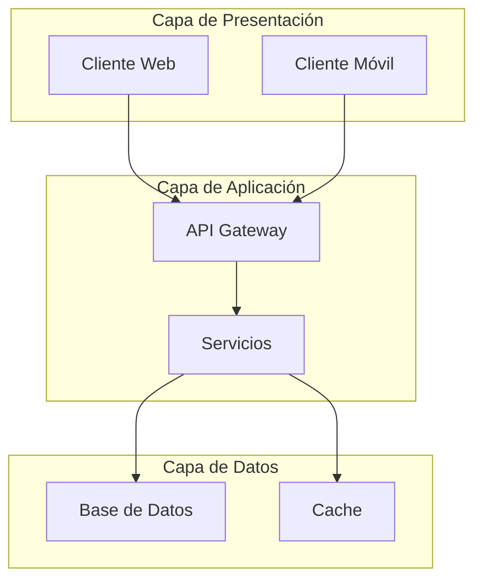

# [Título del Documento de Arquitectura]

**Fecha de creación:** YYYY-MM-DD HH:mm  
**Última actualización:** YYYY-MM-DD HH:mm  
**Autor:** [Nombre o "IA Asistente"]  
**Versión:** 1.0.0  
**Categoría:** Arquitectura

---

## 📑 Tabla de Contenidos (TOC)

1. [Resumen Ejecutivo](#1-resumen-ejecutivo)
2. [Contexto y Objetivos](#2-contexto-y-objetivos)
3. [Visión General de la Arquitectura](#3-visión-general-de-la-arquitectura)
4. [Componentes del Sistema](#4-componentes-del-sistema)
5. [Diagramas](#5-diagramas)
6. [Tecnologías Utilizadas](#6-tecnologías-utilizadas)
7. [Decisiones Arquitectónicas](#7-decisiones-arquitectónicas)
8. [Consideraciones de Seguridad](#8-consideraciones-de-seguridad)
9. [Escalabilidad y Rendimiento](#9-escalabilidad-y-rendimiento)
10. [Referencias](#10-referencias)
11. [Registro de Cambios](#11-registro-de-cambios)

---

## 1. Resumen Ejecutivo

<!-- 
Descripción breve de alto nivel del documento.
Máximo 2-3 párrafos que permitan entender rápidamente el contenido.
-->

[Escribir resumen aquí]

---

## 2. Contexto y Objetivos

### 2.1 Problema a Resolver
[Describir el problema o necesidad que esta arquitectura aborda]

### 2.2 Objetivos
- Objetivo 1
- Objetivo 2
- Objetivo 3

### 2.3 Alcance
[Definir qué está incluido y qué está excluido]

---

## 3. Visión General de la Arquitectura

### 3.1 Descripción General
[Explicación de alto nivel de la arquitectura]

### 3.2 Principios Arquitectónicos
- **Principio 1**: [Descripción]
- **Principio 2**: [Descripción]

---

## 4. Componentes del Sistema

### 4.1 [Nombre del Componente 1]

| Aspecto | Descripción |
|---------|-------------|
| **Responsabilidad** | [Qué hace] |
| **Tecnología** | [Stack utilizado] |
| **Dependencias** | [De qué depende] |
| **Interfaces** | [APIs, puertos, etc.] |

### 4.2 [Nombre del Componente 2]

[Repetir estructura anterior]

---

## 5. Diagramas

### 5.1 Diagrama de Arquitectura General

### 5.2 Diagrama de Componentes
[Añadir diagrama o enlace a asset]

---

## 6. Tecnologías Utilizadas

| Capa | Tecnología | Versión | Propósito |
|------|------------|---------|-----------|
| Frontend | [Tech] | [X.Y] | [Para qué] |
| Backend | [Tech] | [X.Y] | [Para qué] |
| Base de Datos | [Tech] | [X.Y] | [Para qué] |
| Infraestructura | [Tech] | [X.Y] | [Para qué] |

---

## 7. Decisiones Arquitectónicas

### ADR-001: [Título de la Decisión]

| Aspecto | Detalle |
|---------|---------|
| **Estado** | Aceptada / Propuesta / Deprecada |
| **Contexto** | [Por qué se tomó esta decisión] |
| **Decisión** | [Qué se decidió] |
| **Consecuencias** | [Impacto positivo y negativo] |

---

## 8. Consideraciones de Seguridad

- [ ] Autenticación implementada
- [ ] Autorización por roles
- [ ] Cifrado en tránsito (HTTPS)
- [ ] Cifrado en reposo
- [ ] Validación de entrada
- [ ] Protección contra inyecciones

[Detallar medidas específicas]

---

## 9. Escalabilidad y Rendimiento

### 9.1 Estrategia de Escalado
[Horizontal / Vertical / Híbrido]

### 9.2 Puntos de Optimización
- [Punto 1]
- [Punto 2]

### 9.3 Métricas Clave
| Métrica | Objetivo | Actual |
|---------|----------|--------|
| Tiempo de respuesta | < X ms | - |
| Throughput | X req/s | - |
| Disponibilidad | 99.X% | - |

---

## 10. Referencias

- [Enlace a documentación relacionada]
- [Enlace a recursos externos]

---

## 11. Registro de Cambios

| Fecha | Versión | Autor | Descripción |
|-------|---------|-------|-------------|
| YYYY-MM-DD | 1.0.0 | [Autor] | Creación inicial |

---

> **💡 Nota**: Recuerda actualizar el índice general (`00_INDICE_GENERAL.md`) después de crear este documento.
