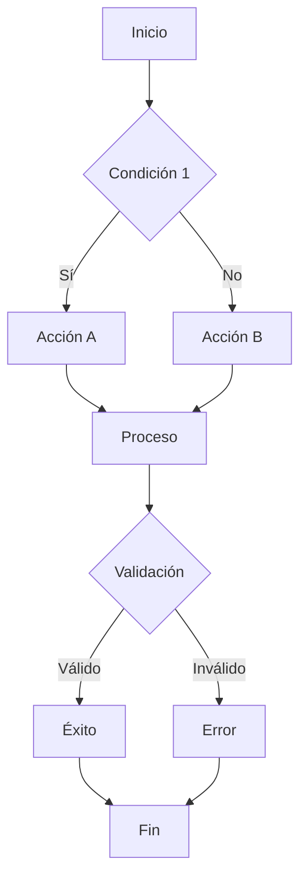

# [Título del Documento de Lógica de Negocio]

**Fecha de creación:** YYYY-MM-DD HH:mm  
**Última actualización:** YYYY-MM-DD HH:mm  
**Autor:** [Nombre o "IA Asistente"]  
**Versión:** 1.0.0  
**Categoría:** Lógica de Negocio

---

## 📑 Tabla de Contenidos (TOC)

1. [Resumen](#1-resumen)
2. [Contexto de Negocio](#2-contexto-de-negocio)
3. [Actores Involucrados](#3-actores-involucrados)
4. [Reglas de Negocio](#4-reglas-de-negocio)
5. [Flujos de Proceso](#5-flujos-de-proceso)
6. [Casos de Uso](#6-casos-de-uso)
7. [Validaciones](#7-validaciones)
8. [Excepciones y Casos Especiales](#8-excepciones-y-casos-especiales)
9. [Integraciones](#9-integraciones)
10. [Registro de Cambios](#10-registro-de-cambios)

---

## 1. Resumen

<!-- 
Descripción breve del proceso o lógica documentada.
¿Qué problema de negocio resuelve? ¿Por qué es importante?
-->

[Escribir resumen aquí]

---

## 2. Contexto de Negocio

### 2.1 Descripción del Dominio
[Explicar el área de negocio a la que pertenece esta lógica]

### 2.2 Objetivos de Negocio
- Objetivo 1
- Objetivo 2

### 2.3 Métricas de Éxito
| Métrica | Definición | Meta |
|---------|------------|------|
| [Nombre] | [Cómo se mide] | [Valor objetivo] |

---

## 3. Actores Involucrados

| Actor | Rol | Responsabilidades |
|-------|-----|-------------------|
| [Actor 1] | [Rol en el sistema] | [Qué hace en este proceso] |
| [Actor 2] | [Rol en el sistema] | [Qué hace en este proceso] |

---

## 4. Reglas de Negocio

### RN-001: [Nombre de la Regla]

| Aspecto | Descripción |
|---------|-------------|
| **Descripción** | [Explicación detallada de la regla] |
| **Condición** | [Cuándo aplica] |
| **Acción** | [Qué ocurre cuando se aplica] |
| **Excepciones** | [Casos donde no aplica] |
| **Prioridad** | Alta / Media / Baja |

### RN-002: [Nombre de la Regla]

[Repetir estructura]

---

## 5. Flujos de Proceso

### 5.1 Flujo Principal

### 5.2 Descripción del Flujo

| Paso | Descripción | Actor | Sistema |
|------|-------------|-------|---------|
| 1 | [Descripción] | [Quién actúa] | [Qué hace el sistema] |
| 2 | [Descripción] | [Quién actúa] | [Qué hace el sistema] |

---

## 6. Casos de Uso

### CU-001: [Nombre del Caso de Uso]

| Aspecto | Descripción |
|---------|-------------|
| **Actor Principal** | [Quién inicia] |
| **Precondiciones** | [Qué debe existir antes] |
| **Postcondiciones** | [Qué existe después] |
| **Flujo Principal** | 1. [Paso 1] 2. [Paso 2] 3. [Paso 3] |
| **Flujos Alternativos** | [Variaciones del flujo] |

---

## 7. Validaciones

### 7.1 Validaciones de Entrada

| Campo | Tipo | Requerido | Validación | Mensaje de Error |
|-------|------|-----------|------------|------------------|
| [Campo 1] | [Tipo] | Sí/No | [Regla] | [Mensaje] |
| [Campo 2] | [Tipo] | Sí/No | [Regla] | [Mensaje] |

### 7.2 Validaciones de Negocio

| Código | Validación | Condición | Acción si Falla |
|--------|------------|-----------|-----------------|
| VAL-001 | [Nombre] | [Cuándo valida] | [Qué hacer] |

---

## 8. Excepciones y Casos Especiales

### 8.1 Excepciones Conocidas

| Código | Excepción | Causa | Manejo |
|--------|-----------|-------|--------|
| EXC-001 | [Nombre] | [Por qué ocurre] | [Cómo se maneja] |

### 8.2 Casos Especiales

- **Caso 1**: [Descripción y cómo se maneja]
- **Caso 2**: [Descripción y cómo se maneja]

---

## 9. Integraciones

### 9.1 Sistemas Relacionados

| Sistema | Tipo de Integración | Datos Intercambiados |
|---------|--------------------|--------------------- |
| [Sistema 1] | API / Webhook / Archivo | [Qué datos] |

### 9.2 Dependencias

- [Dependencia 1]
- [Dependencia 2]

---

## 10. Registro de Cambios

| Fecha | Versión | Autor | Descripción |
|-------|---------|-------|-------------|
| YYYY-MM-DD | 1.0.0 | [Autor] | Creación inicial |

---

> **💡 Nota**: Recuerda actualizar el índice general (`00_INDICE_GENERAL.md`) después de crear este documento.
