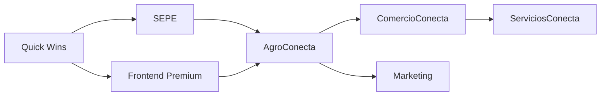

# Plan de Implementación - Gaps Auditoría 2026
## Roadmap de Desarrollo Pendiente

**Fecha de creación:** 2026-01-22 22:47  
**Última actualización:** 2026-01-22 22:47  
**Autor:** IA Asistente (Claude)  
**Versión:** 1.0.0

---

## 📑 Tabla de Contenidos (TOC)

1. [Resumen Ejecutivo](#1-resumen-ejecutivo)
2. [Priorización de Gaps](#2-priorización-de-gaps)
3. [Detalle por Fase](#3-detalle-por-fase)
4. [Estimaciones de Esfuerzo](#4-estimaciones-de-esfuerzo)
5. [Dependencias](#5-dependencias)
6. [Criterios de Aceptación](#6-criterios-de-aceptación)
7. [Registro de Cambios](#7-registro-de-cambios)

---

## 1. Resumen Ejecutivo

> **Esfuerzo Total Pendiente:** ~2,000 horas (~50 semanas dev, ~12 meses equipo 4)

Este plan prioriza la implementación de gaps identificados en la auditoría exhaustiva, ordenados por:
1. **Revenue inmediato** (SEPE)
2. **Experiencia de usuario** (Frontend Premium)
3. **Nuevos verticales** (Commerce)
4. **Estabilidad** (Testing)

---

## 2. Priorización de Gaps

| P | Área | Justificación | Horas | Timeline |
|---|------|---------------|-------|----------|
| **P0** | SEPE Teleformación | Revenue institucional inmediato | 100h | Q1 2026 |
| **P1** | Frontend Premium | UX diferenciador, Time-to-Value | 180h | Q1-Q2 2026 |
| **P1** | Testing Infrastructure | Calidad, CI/CD | 80h | Q1 2026 |
| **P1** | AgroConecta Commerce | Primer vertical marketplace | 300h | Q2-Q3 2026 |
| **P1** | **AI Content Hub** | Blog, Newsletter, Contenido IA | **340-410h** | **Q2-Q4 2026** |
| **P2** | ComercioConecta | Segundo vertical commerce | 300h | Q4 2026 |
| **P2** | Platform Features | PWA completa, webhooks | 200h | Q2-Q3 2026 |
| **P3** | ServiciosConecta | Tercer vertical services | 300h | Q1 2027 |
| **P3** | Marketing Nativo | CRM, Email, Social | 250h | Q1-Q2 2027 |

> 📄 **Bloque F**: [20260123f-Bloque_F_AI_Content_Hub_Implementacion_Claude.md](../implementacion/20260123f-Bloque_F_AI_Content_Hub_Implementacion_Claude.md)

---

## 3. Detalle por Fase

### 3.1 Fase 1: Quick Wins + SEPE (Q1 2026)

**Duración:** 12 semanas | **Esfuerzo:** 220h

#### Sprint 1-2: Quick Wins (40h)
- [ ] Crear `llms.txt` en web root (1h)
- [ ] Configurar PHPStan en GitHub Actions (4h)
- [ ] Auditoría Lighthouse Accessibility (4h)
- [ ] PHPUnit para servicios críticos: `TenantManager`, `PlanValidator`, `MatchingService` (30h)

#### Sprint 3-6: SEPE Teleformación (100h)
- [ ] Módulo `jaraba_sepe_teleformacion`
- [ ] Entidades: `SepeCentro`, `SepeAccionFormativa`, `SepeParticipante` (30h)
- [ ] Servicios: SOAP Controller, DataMapper, Calculator (40h)
- [ ] WSDL + Kit Validación SEPE (20h)
- [ ] Testing + Documentación (10h)

### 3.2 Fase 2: Frontend Premium (Q1-Q2 2026)

**Duración:** 10 semanas | **Esfuerzo:** 180h

#### Sprint 7-8: Design Tokens + Cascada (32h)
- [ ] Sistema de tokens en `_tokens.scss`
- [ ] Cascada PHP: Plataforma → Vertical → Tenant
- [ ] Hook `hook_preprocess_html` para inyección CSS

#### Sprint 9-10: Component Library (56h)
- [ ] 6 variantes header: classic, transparent, centered, mega, sidebar, minimal
- [ ] 8 variantes cards: default, horizontal, product, profile, course, metric, testimonial, cta
- [ ] 5 variantes hero: fullscreen, split, compact, animated, slider

#### Sprint 11-12: Visual Picker (40h)
- [ ] Entidad `tenant_theme_config`
- [ ] Panel admin `/admin/appearance/jaraba-customizer`
- [ ] Preview iframe en tiempo real
- [ ] Integración Feature Flags por plan

#### Sprint 13-14: Industry Style Presets (32h)
- [ ] 15 presets: agro_gourmet, servicios_legal, comercio_barrio, etc.
- [ ] JSON schema por preset
- [ ] Galería de selección en onboarding

### 3.3 Fase 3: AgroConecta Commerce MVP (Q2-Q3 2026)

**Duración:** 24 semanas | **Esfuerzo:** 300h

#### Sprint 15-18: Commerce Core (80h)
- [ ] Entidades: `product_agro`, `product_variation_agro`, `producer_profile`
- [ ] Integración Drupal Commerce 3.x
- [ ] APIs REST catálogo

#### Sprint 19-22: Pagos + Shipping (80h)
- [ ] Stripe Connect Destination Charges
- [ ] Sistema de envíos configurables
- [ ] Checkout optimizado

#### Sprint 23-26: Portales + QR (80h)
- [ ] Producer Portal
- [ ] Customer Portal
- [ ] Traceability QR

#### Sprint 27-30: Testing + Launch (60h)
- [ ] Cypress E2E para flujos commerce
- [ ] k6 load testing
- [ ] Go-live MVP

### 3.4 Fases 4-5: Expansión (Q4 2026 - Q2 2027)

| Fase | Área | Sprints | Horas |
|------|------|---------|-------|
| 4.1 | ComercioConecta | 31-42 | 300h |
| 4.2 | Platform Features (PWA full) | 43-48 | 200h |
| 5.1 | ServiciosConecta | 49-60 | 300h |
| 5.2 | Marketing Nativo | 61-72 | 250h |

---

## 4. Estimaciones de Esfuerzo

| Componente | Horas | Sprints | FTE Meses |
|------------|-------|---------|-----------|
| Quick Wins | 40 | 2 | 0.5 |
| SEPE | 100 | 4 | 1.5 |
| Frontend Premium | 180 | 8 | 2.5 |
| AgroConecta | 300 | 16 | 4.0 |
| ComercioConecta | 300 | 12 | 4.0 |
| ServiciosConecta | 300 | 12 | 4.0 |
| Platform | 200 | 6 | 2.5 |
| Marketing | 250 | 12 | 3.0 |
| **TOTAL** | **1,670** | **72** | **22** |

---

## 5. Dependencias

---

## 6. Criterios de Aceptación

### 6.1 Frontend Premium
- [ ] Visual Picker funcional para tenants Professional+
- [ ] 15 Industry Presets seleccionables en onboarding
- [ ] Design Tokens cascada operativa

### 6.2 SEPE
- [ ] Web Service SOAP validado con kit SEPE
- [ ] Declaración Responsable presentada
- [ ] 1 centro piloto en producción

### 6.3 AgroConecta Commerce
- [ ] 10 productores publicando productos
- [ ] 100 transacciones completadas
- [ ] Split payments Stripe operativo

---

## 7. Directrices Obligatorias ⚠️

> **VERIFICAR ANTES DE CADA COMMIT**

### 7.1 Referencias Obligatorias

Consultar SIEMPRE estos documentos:

- 📋 [DIRECTRICES_DESARROLLO.md](file:///z:/home/PED/JarabaImpactPlatformSaaS/docs/tecnicos/DIRECTRICES_DESARROLLO.md) - Checklist central
- 📁 Workflows `.agent/workflows/`:
  - `/scss-estilos` - SCSS y variables inyectables
  - `/i18n-traducciones` - Internacionalización
  - `/sdc-components` - SDC con Compound Variants
  - `/drupal-custom-modules` - Content Entities

### 7.2 Checklist Rápido

| Área | Verificar |
|------|-----------|
| **i18n** | `` en Twig, `$this->t()` en PHP |
| **SCSS** | Archivos `.scss`, NO `.css`. Variables `var(--ej-*)` |
| **Colores** | Paleta Jaraba: corporate, impulse, innovation, agro |
| **Iconos** | `jaraba_icon('category', 'name', {options})` |
| **SDC** | component.yml + twig + scss (Compound Variants) |
| **Compilar** | `npm run build` + `lando drush cr` |

---

## 8. Registro de Cambios

| Fecha | Versión | Descripción |
|-------|---------|-------------|
| 2026-01-22 | 1.0.0 | Creación inicial - Plan basado en auditoría exhaustiva |
| 2026-01-23 | 1.1.0 | Añadida sección 7 - Directrices Obligatorias |

