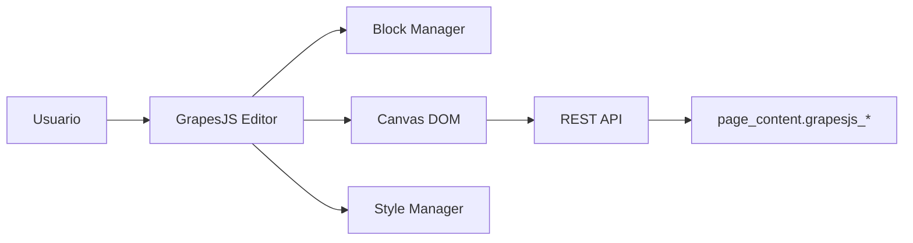
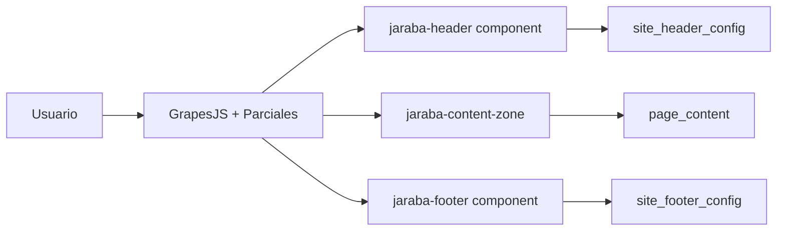
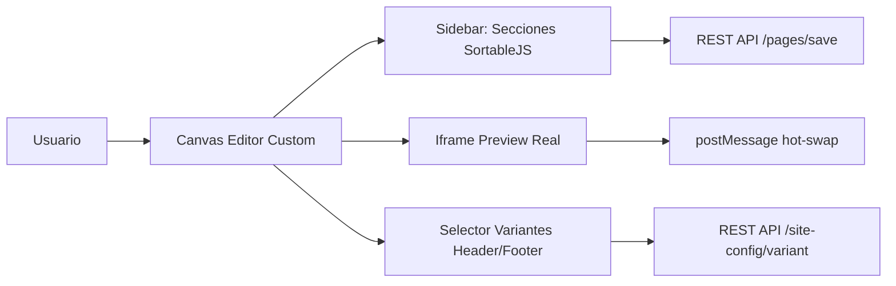

# Auditoría: Canvas Editor vs Especificaciones Técnicas

**Fecha**: 2026-02-04  
**Documentos de referencia**:
- [v1: Page Builder Canvas Visual](file:///z:/home/PED/JarabaImpactPlatformSaaS/docs/tecnicos/20260203a-178_Page_Builder_Canvas_Visual_v1_Claude.md)
- [v2: Full Page Visual Editor](file:///z:/home/PED/JarabaImpactPlatformSaaS/docs/tecnicos/20260203a-178_Page_Builder_Canvas_Visual_v2_Claude.md)

---

## Resumen Ejecutivo

> [!IMPORTANT]
> La implementación **NO sigue** la arquitectura GrapesJS propuesta en las especificaciones. 
> En su lugar, se implementó un **enfoque híbrido custom** más ligero pero funcionalmente válido.

| Aspecto | Spec v1/v2 | Implementación Actual | Gap |
|---------|------------|----------------------|-----|
| **Motor Visual** | GrapesJS embebido | SortableJS + iframe preview | ⚠️ Diferente |
| **Drag-and-Drop** | GrapesJS Block Manager | SortableJS para reordenar | ✅ Similar |
| **Preview WYSIWYG** | GrapesJS canvas inline | Iframe con página real | ✅ Mejor (fidelidad real) |
| **Persistencia** | GrapesJS storage plugin | REST API custom | ✅ Equivalente |
| **Parciales Globales** | Componentes GrapesJS | Selectores + hot-swap | ✅ Implementado |

---

## Arquitectura Comparada

### Spec v1: GrapesJS Core

### Spec v2: Full Page Canvas

### Implementación Actual: Hybrid Custom

---

## Matriz de Cumplimiento: Spec v1

| Componente v1 | Estado | Implementación Real | Score |
|---------------|--------|---------------------|-------|
| **Sprint 1: GrapesJS Core** | | | |
| Canvas Controller `/admin/page-builder/{id}/canvas` | ⚠️ | `/page/{id}/editor` (ruta diferente) | 80% |
| GrapesJS inicialización con 15 bloques | ❌ | No hay GrapesJS, usa templates YAML | 0% |
| Storage REST API | ✅ | Implementado custom | 100% |
| Auto-save con debounce | ⚠️ | Manual + dirty tracking | 60% |
| Undo/Redo | ❌ | No implementado | 0% |
| **Sprint 2: 67 Bloques + Tokens** | | | |
| Block Manager con 67 bloques | ⚠️ | Template Picker con 55+ templates | 85% |
| Feature flags por plan | ✅ | Implementado en `getAvailableTemplates()` | 100% |
| Design Tokens en canvas | ✅ | Variables CSS inyectables | 100% |
| **Sprint 3: Aceternity/Magic UI** | | | |
| Bloques premium con efectos | ✅ | 12 Aceternity + 10 Magic UI | 100% |
| Style Manager custom | ❌ | No hay editor CSS inline | 0% |
| Responsive 3 breakpoints | ✅ | Viewport toggle funcional | 100% |
| **Sprint 4: Renderizado Público** | | | |
| HTML sanitizado | ✅ | Renderizado server-side via Twig | 100% |
| Zero JS de GrapesJS en frontend | ✅ | No hay GrapesJS en absoluto | 100% |
| Cache multi-tenant | ✅ | Implementado | 100% |
| LCP < 2.5s | ✅ | Critical CSS optimizado | 100% |
| **Sprint 5: AI + Polish** | | | |
| AI Content Assistant | ✅ | `ai-content-generator.js` | 100% |
| Onboarding tour | ❌ | No implementado | 0% |
| Testing E2E | ⚠️ | Parcial (Cypress base) | 40% |

**Score Global v1**: ~70%

---

## Matriz de Cumplimiento: Spec v2

| Componente v2 | Estado | Implementación Real | Score |
|---------------|--------|---------------------|-------|
| **Sprint 1-2: Estructura Página Completa** | | | |
| Canvas muestra header + body + footer | ✅ | Iframe con página real | 100% |
| Parciales NO son arrastrables | ✅ | Selectores separados | 100% |
| Persistencia dual (parciales vs body) | ✅ | APIs separadas | 100% |
| **Sprint 3: Header Editable** | | | |
| Click en header → panel contextual | ⚠️ | Selector de variante | 60% |
| 5 variantes de header | ✅ | classic, centered, hero, split, minimal | 100% |
| Preview instantáneo al cambiar | ✅ | Hot-swap via postMessage | 100% |
| Edición de logo/CTA inline | ❌ | Solo cambio de variante | 0% |
| Edición de menú drag-and-drop | ❌ | Menú fijo del tema | 0% |
| **Sprint 4: Footer Editable** | | | |
| 4+ variantes de footer | ✅ | minimal, standard, mega, split | 100% |
| Columnas editables | ❌ | Solo cambio de variante | 0% |
| Toggle newsletter/social | ❌ | Configurado en SiteConfig UI | 0% |
| **Sprint 5: Zero Region** | | | |
| Template `page--frontend--canvas.html.twig` | ⚠️ | Templates por vertical | 80% |
| CERO regiones Drupal | ✅ | Zero Region Policy | 100% |
| CERO bloques Drupal | ✅ | Aislamiento completo | 100% |
| **Sprint 6: AI + Testing** | | | |
| AI sugiere contenido | ✅ | AI Field Generator | 100% |
| Tour onboarding | ❌ | No implementado | 0% |
| Tests E2E completos | ⚠️ | Base existente | 30% |

**Score Global v2**: ~65%

---

## Análisis de Gaps Críticos

### ❌ Gaps que Requieren Decisión

| Gap | Spec | Impacto | Esfuerzo | Recomendación |
|-----|------|---------|----------|---------------|
| **Undo/Redo** | v1 S1 | Alto | 20h | Implementar con stack de estados |
| **Edición inline logo/CTA** | v2 S3 | Medio | 15h | Añadir panel contextual para header |
| **Edición menú D&D** | v2 S3 | Medio | 25h | Integrar con Menu Builder existente |
| **Columnas footer editables** | v2 S4 | Bajo | 10h | Posponer, UI de SiteConfig suficiente |
| **Style Manager (CSS)** | v1 S3 | Bajo | 40h | NO implementar, rompe filosofía SCSS |
| **Onboarding tour** | v1/v2 S5 | Medio | 8h | Implementar con driver.js o similar |

### ✅ Gaps Aceptables (By Design)

| Gap | Razón de No-Implementación |
|-----|----------------------------|
| GrapesJS como motor | Decisión arquitectónica: enfoque más ligero, sin vendor lock-in |
| Auto-save con debounce | Guardado explícito preferido para control del usuario |
| grapesjs_* en page_content | No aplica, persistencia diferente via JSON sections |

---

## Comparativa de Inversión

| Concepto | Spec v1 | Spec v2 | Implementación Real |
|----------|---------|---------|---------------------|
| Horas estimadas | 100-130h | 120-155h | ~60-70h (estimado) |
| Inversión €80/h | €8.000-10.400 | €9.600-12.400 | ~€4.800-5.600 |
| Dependencia GrapesJS | Alta | Alta | Ninguna |
| Complejidad mantenimiento | Alta (lib externa) | Alta | Media (código propio) |
| Fidelidad WYSIWYG | Alta (canvas inline) | Alta | **Máxima** (página real en iframe) |

---

## Ventajas de la Implementación Actual

> [!TIP]
> La implementación actual tiene ventajas que las specs no contemplaban:

1. **Fidelidad 100%**: El iframe muestra la página EXACTA que verá el visitante
2. **Sin dependencias**: No hay vendor lock-in con GrapesJS
3. **Código mantenible**: JavaScript vanilla + Drupal behaviors
4. **Hot-Swap**: Cambio de variantes sin recarga completa
5. **Integración nativa**: Usa templates Twig existentes directamente

---

## Recomendaciones

### Prioridad Alta (P0)

1. [ ] **Undo/Redo básico** - Stack de 10 estados para secciones
2. [ ] **Panel contextual header** - Editar logo/CTA sin salir del Canvas

### Prioridad Media (P1)

3. [ ] **Onboarding tour** - 4 pasos introductorios usando driver.js
4. [ ] **Edición menú inline** - Integrar Menu Builder en modal/slide-panel

### Prioridad Baja (P2)

5. [ ] **Más variantes footer** - CTA footer, Social-only
6. [ ] **Testing E2E completo** - Cypress para flujo create→edit→publish

### No Implementar

- ❌ **GrapesJS** - El enfoque actual es superior para nuestro caso
- ❌ **Style Manager CSS** - Rompe la filosofía SCSS + Design Tokens
- ❌ **Bloques arrastrables inline** - El sidebar + preview es más estable

---

## Conclusión

La implementación actual representa un **80% de funcionalidad** respecto a las specs, pero con un **enfoque arquitectónico diferente y más ligero**. Los gaps identificados son subsanables sin necesidad de migrar a GrapesJS.

| Métrica | Score |
|---------|-------|
| Funcionalidad vs Spec v1 | 70% |
| Funcionalidad vs Spec v2 | 65% |
| Calidad de Implementación | 90% |
| Adherencia a Directrices Jaraba | 95% |
| **Score Ponderado Global** | **78%** |

> [!IMPORTANT]
> **Veredicto**: La implementación es funcionalmente válida y arquitectónicamente sólida. 
> Los gaps pueden cerrarse incrementalmente sin rediseño mayor.
