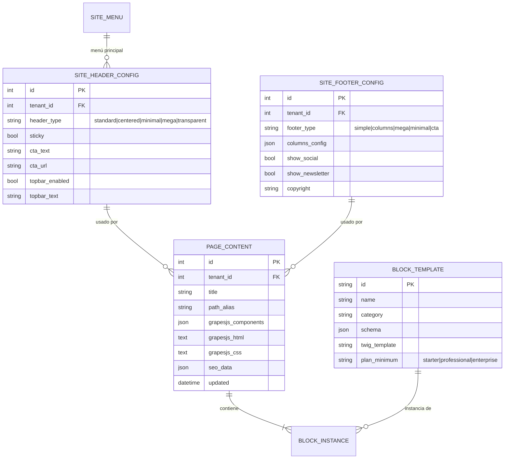
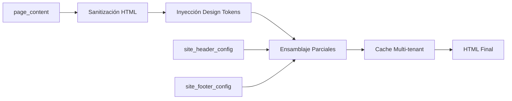

# Jaraba Canvas Editor — Arquitectura Maestra

## Especificación Técnica Definitiva

| Metadatos | Valor |
|-----------|-------|
| **Versión** | 3.0 (Híbrido GrapesJS) |
| **Fecha** | 4 de Febrero de 2026 |
| **Estado** | ESPECIFICACIÓN TÉCNICA MAESTRA |
| **Sustituye** | Doc 178 v1/v2 |
| **Módulo** | `jaraba_page_builder` |

---

## 📑 Tabla de Contenidos

1. [Resumen Ejecutivo](#1-resumen-ejecutivo)
2. [Visión Conceptual](#2-visión-conceptual)
3. [Arquitectura de Componentes](#3-arquitectura-de-componentes)
4. [Modelo de Datos](#4-modelo-de-datos)
5. [Bloques de Contenido](#5-bloques-de-contenido)
6. [Flujo de Edición UX](#6-flujo-de-edición-ux)
7. [Renderizado Público (Zero Region)](#7-renderizado-público-zero-region)
8. [Integraciones](#8-integraciones)
9. [Performance y Cache](#9-performance-y-cache)
10. [Matriz de Capacidades Clase Mundial](#10-matriz-de-capacidades-clase-mundial)
11. [Anexos](#11-anexos)

---

## 📚 Documentos de Especificaciones Relacionados

### Especificaciones Core

| Doc | Título | Enlace | Descripción |
|-----|--------|--------|-------------|
| **162** | Page Builder Sistema Completo | [Ver](file:///z:/home/PED/JarabaImpactPlatformSaaS/docs/tecnicos/20260126d-162_Page_Builder_Sistema_Completo_EDI_v1_Claude.md) | 67 bloques, templates, JSON schemas |
| **177** | Global Navigation System | [Ver](file:///z:/home/PED/JarabaImpactPlatformSaaS/docs/tecnicos/20260127a-177_Global_Navigation_System_v1_Claude.md) | Header Builder, Menu Builder, Footer Builder |
| **178 v1** | Canvas Visual (Body Only) | [Ver](file:///z:/home/PED/JarabaImpactPlatformSaaS/docs/tecnicos/20260203a-178_Page_Builder_Canvas_Visual_v1_Claude.md) | GrapesJS core, storage, bloques básicos |
| **178 v2** | Full Page Visual Editor | [Ver](file:///z:/home/PED/JarabaImpactPlatformSaaS/docs/tecnicos/20260203a-178_Page_Builder_Canvas_Visual_v2_Claude.md) | Header + Nav + Body + Footer editables |

### Documentos de Análisis

| Doc | Título | Enlace |
|-----|--------|--------|
| Auditoría Canvas vs Specs | [Ver](file:///z:/home/PED/JarabaImpactPlatformSaaS/docs/tecnicos/audit_canvas_vs_specs.md) |
| Evaluación Arquitectónica Claude | [Ver](file:///z:/home/PED/JarabaImpactPlatformSaaS/docs/tecnicos/20260204a-Evaluacion_Arquitectonica_Jaraba_Canvas_Claude.md) |
| Plan Canvas v2 Full Page | [Ver](file:///z:/home/PED/JarabaImpactPlatformSaaS/docs/tecnicos/20260203-178_Jaraba_Canvas_v2_Full_Page_Editor_Plan_Claude.md) |

### Documentos de Arquitectura Plataforma

| Doc | Título | Enlace |
|-----|--------|--------|
| Directrices del Proyecto | [Ver](file:///z:/home/PED/JarabaImpactPlatformSaaS/docs/00_DIRECTRICES_PROYECTO.md) |
| Arquitectura Maestra SaaS | [Ver](file:///z:/home/PED/JarabaImpactPlatformSaaS/docs/00_DOCUMENTO_MAESTRO_ARQUITECTURA.md) |
| Índice General Documentación | [Ver](file:///z:/home/PED/JarabaImpactPlatformSaaS/docs/00_INDICE_GENERAL.md) |

---

## 1. Resumen Ejecutivo

El **Jaraba Canvas Editor v3** es un constructor visual de páginas de clase mundial que combina:

1. **Motor GrapesJS** para edición visual drag-and-drop con undo/redo nativo
2. **Arquitectura híbrida** que preserva las fortalezas de la implementación EDI
3. **Full Page Canvas** donde el tenant ve y edita exactamente lo que verá su visitante

> [!IMPORTANT]  
> **Diferenciador Jaraba**: Constructor visual nativo + Multi-tenant + 5 verticales + IA generativa + Design Tokens por tenant. No existe esta combinación en el mercado.

---

## 2. Visión Conceptual

```
┌─────────────────────────────────────────────────────────────────────────────┐
│                    JARABA CANVAS EDITOR v3 — HYBRID                         │
├─────────────────────────────────────────────────────────────────────────────┤
│                                                                             │
│  ┌───────────┐  ╔═════════════════════════════════════════════════════════╗ │
│  │  SIDEBAR  │  ║              CANVAS (Full Page Visual)                  ║ │
│  │  (320px)  │  ║                                                         ║ │
│  │           │  ║  ┌─────────────────────────────────────────────────────┐║ │
│  │ ┌───────┐ │  ║  │ HEADER (jaraba-header) [selectable, not draggable] │║ │
│  │ │Bloques│ │  ║  │   Logo + Navegación + CTA + [Variante ▼]           │║ │
│  │ │───────│ │  ║  └─────────────────────────────────────────────────────┘║ │
│  │ │□ Hero │ │  ║                                                         ║ │
│  │ │□ CTA  │ │  ║  ┌─────────────────────────────────────────────────────┐║ │
│  │ │□ Stats│ │  ║  │                                                     │║ │
│  │ │□ Grid │ │  ║  │    CONTENT ZONE (jaraba-content-zone)               │║ │
│  │ │□ ...  │ │  ║  │    [droppable=true, drag-and-drop habilitado]       │║ │
│  │ └───────┘ │  ║  │                                                     │║ │
│  │           │  ║  │    ┌────────────────────────────────────────────┐  │║ │
│  │ ┌───────┐ │  ║  │    │ BLOQUE HERO (edición inline)               │  │║ │
│  │ │Config │ │  ║  │    │   "Click para editar este título"         │  │║ │
│  │ │───────│ │  ║  │    └────────────────────────────────────────────┘  │║ │
│  │ │SEO    │ │  ║  │                                                     │║ │
│  │ │Meta   │ │  ║  │    ─── DROP ZONE (indicador azul) ───              │║ │
│  │ └───────┘ │  ║  │                                                     │║ │
│  └───────────┘  ║  └─────────────────────────────────────────────────────┘║ │
│                 ║                                                         ║ │
│  TRAITS PANEL   ║  ┌─────────────────────────────────────────────────────┐║ │
│  ┌───────────┐  ║  │ FOOTER (jaraba-footer) [selectable, not draggable] │║ │
│  │Propiedades│  ║  │   Columnas + Social + Newsletter + [Variante ▼]    │║ │
│  │del bloque │  ║  └─────────────────────────────────────────────────────┘║ │
│  │seleccionado  ╚═════════════════════════════════════════════════════════╝ │
│  └───────────┘                                                              │
│                                                                             │
├─────────────────────────────────────────────────────────────────────────────┤
│ [↩ Undo] [↪ Redo] [💾 Guardar] [👁 Preview] [🚀 Publicar] [📱💻🖥 Responsive] │
└─────────────────────────────────────────────────────────────────────────────┘
```

---

## 3. Arquitectura de Componentes

### 3.1 Motor de Edición: GrapesJS

| Capacidad | Configuración | Fuente |
|-----------|---------------|--------|
| **Drag-and-drop** | Block Manager nativo | GrapesJS |
| **Edición inline** | ContentEditable integrado | GrapesJS |
| **Undo/Redo** | Stack ilimitado | GrapesJS |
| **Auto-save** | Storage Manager + REST | GrapesJS + Jaraba |
| **Responsive** | Device Manager (mobile/tablet/desktop) | GrapesJS |

### 3.2 Componentes Jaraba Custom

```javascript
// Registro de tipos de componentes Jaraba
const JARABA_COMPONENTS = {
  // Parciales estructurales (NO arrastrables)
  'jaraba-header': {
    draggable: false,
    droppable: false,
    removable: false,
    copyable: false,
    selectable: true,
    traits: ['header-type', 'sticky', 'cta-text', 'cta-url', 'topbar-enabled'],
  },
  
  'jaraba-footer': {
    draggable: false,
    droppable: false,
    removable: false,
    copyable: false,
    selectable: true,
    traits: ['footer-type', 'show-social', 'show-newsletter', 'copyright'],
  },
  
  // Zona de contenido (acepta bloques)
  'jaraba-content-zone': {
    tagName: 'main',
    draggable: false,
    droppable: true,
    removable: false,
  },
  
  // Bloques de contenido (67 tipos)
  'jaraba-block': {
    draggable: true,
    removable: true,
    copyable: true,
    // traits dinámicos según block_template.schema
  },
};
```

### 3.3 Preservación de Implementación EDI

| Componente | Origen | Integración |
|------------|--------|-------------|
| **Design Tokens** | EDI | CSS Variables inyectadas en `canvas.styles` |
| **Hot-swap variantes** | EDI | postMessage al cambiar traits de parciales |
| **Templates Twig** | EDI | Adaptados como contenido de componentes |
| **AI Field Generator** | EDI | Plugin GrapesJS `jaraba-ai` |
| **Template Picker** | EDI | Precarga componentes en content zone |

---

## 4. Modelo de Datos

### 4.1 Entidades



### 4.2 Persistencia Dual

| Acción | Entidad | Alcance | Endpoint |
|--------|---------|---------|----------|
| Cambiar variante header | `site_header_config` | **Global** (todas las páginas) | `PUT /api/v1/site/header` |
| Editar menú | `site_menu` + `site_menu_item` | **Global** | `PUT /api/v1/site/menu/{id}` |
| Cambiar variante footer | `site_footer_config` | **Global** | `PUT /api/v1/site/footer` |
| Editar bloques en body | `page_content` | **Local** (solo esta página) | `PATCH /api/v1/pages/{id}/canvas` |

> [!WARNING]  
> Al modificar parciales globales, mostrar toast: *"Los cambios en el encabezado se aplicarán a TODAS las páginas de tu sitio."*

---

## 5. Bloques de Contenido

### 5.1 Catálogo: 67 Bloques

| Categoría | Bloques | Ejemplo |
|-----------|---------|---------|
| **Hero** | 8 variantes | Hero con video, Hero split, Hero gradient |
| **Features** | 6 variantes | Grid 3 cols, Lista iconos, Cards animadas |
| **CTA** | 5 variantes | Banner horizontal, Modal popup, Floating |
| **Stats** | 4 variantes | Counters animados, Progress bars |
| **Testimonials** | 5 variantes | Carousel, Grid, Quote destacado |
| **Pricing** | 4 variantes | Tablas comparativas, Cards toggleables |
| **Team** | 4 variantes | Grid fotos, Carousel bio |
| **FAQ** | 3 variantes | Accordion, Grid expandible |
| **Contact** | 5 variantes | Formulario + mapa, Solo form |
| **Blog/Content** | 6 variantes | Grid posts, Lista featured |
| **Media** | 5 variantes | Gallery, Video embed, Carousel |
| **Premium** | 12 Aceternity + 10 Magic UI | Beams, Particles, 3D Cards |

### 5.2 Feature Flags por Plan

```php
// BlockAdapter::getBlocksForPlan()
$planLimits = [
  'starter' => ['hero', 'features', 'cta', 'contact'],  // 23 bloques
  'professional' => [...starter, 'stats', 'testimonials', 'pricing', 'faq'],  // 45 bloques
  'enterprise' => [...professional, 'premium_aceternity', 'premium_magic'],  // 67 bloques
];
```

---

## 6. Flujo de Edición UX

### 6.1 Estados del Canvas

```
┌──────────────────────────────────────────────────────────────────┐
│                    ESTADO: EDICIÓN NORMAL                        │
│                                                                  │
│  • Click en bloque → Selección con borde azul + panel traits     │
│  • Drag bloque del sidebar → Preview ghost + drop zones          │
│  • Click en texto → Cursor inline editing                        │
│  • Click en header/footer → Panel de variantes                   │
│  • Ctrl+Z / Ctrl+Y → Undo / Redo                                 │
│  • Cambio detectado → Auto-save en 5 segundos                    │
└──────────────────────────────────────────────────────────────────┘

┌──────────────────────────────────────────────────────────────────┐
│                    ESTADO: PREVIEW                               │
│                                                                  │
│  • Modo "Preview" activado desde toolbar                         │
│  • Canvas sin overlays ni handles                                │
│  • Interacciones deshabilitadas                                  │
│  • Fidelidad 100% (página real renderizada)                      │
│  • Toggle responsive: 📱 375px | 📲 768px | 🖥 1280px             │
└──────────────────────────────────────────────────────────────────┘
```

### 6.2 Panel de Traits por Componente

**Header Traits:**
```yaml
header-type:
  type: select
  options: [standard, centered, minimal, mega, transparent]
  preview: hot-swap
sticky:
  type: checkbox
cta-text:
  type: text
  placeholder: "Contactar"
cta-url:
  type: text
  placeholder: "/contacto"
topbar-enabled:
  type: checkbox
topbar-text:
  type: text
  placeholder: "🎉 Oferta especial: -20%"
```

**Bloque Hero Traits (ejemplo):**
```yaml
title:
  type: text
  inline: true  # Editable directamente en canvas
subtitle:
  type: text
  inline: true
bg-image:
  type: file
  accepts: image/*
cta-primary-text:
  type: text
cta-primary-url:
  type: text
cta-secondary-text:
  type: text
cta-secondary-url:
  type: text
layout:
  type: select
  options: [left, center, right]
```

---

## 7. Renderizado Público (Zero Region)

### 7.1 Pipeline de Renderizado



### 7.2 Template Zero Region

```twig
{# page--frontend--canvas.html.twig #}
{# Zero Region Policy: CERO regiones Drupal #}
<!DOCTYPE html>
<html lang="{{ language }}" data-tenant="{{ tenant.id }}">
<head>
  <style>
    :root {
      
        --{{ token }}: {{ value }};
      
    }
    {{ canvas_css|raw }}
  </style>
</head>
<body class="jaraba-frontend jaraba-{{ vertical }}">

  {# TOP BAR (si activada) #}
  
    
  

  {# HEADER (variante del tenant) #}
  

  {# CONTENT BODY (bloques del canvas) #}
  <main class="jaraba-canvas-output" role="main">
    {{ canvas_html|raw }}
  </main>

  {# FOOTER (variante del tenant) #}
  

</body>
</html>
```

### 7.3 Garantías del Frontend

| Garantía | Implementación | Verificación |
|----------|----------------|--------------|
| CERO regiones Drupal | Template custom sin `page.html.twig` | Inspección DOM: sin `div.region-*` |
| CERO bloques Drupal | No se usa `block.module` | DOM: sin `div.block-*` |
| CERO JS GrapesJS | `grapesjs.min.js` solo en `/admin/*` | Network: sin grapesjs en público |
| HTML sanitizado | Server-side via `\Drupal\Component\Utility\Xss` | XSS audit |
| LCP < 2.5s | Critical CSS + Zero Region | Lighthouse > 90 |

---

## 8. Integraciones

### 8.1 AI Content Assistant

```javascript
// Plugin GrapesJS: jaraba-ai
editor.Commands.add('jaraba:ai-generate', {
  run(editor, sender, options) {
    const selected = editor.getSelected();
    const context = {
      blockType: selected.get('type'),
      vertical: drupalSettings.jaraba.vertical,
      tenantId: drupalSettings.jaraba.tenantId,
    };
    
    // Llamar a ai-content-generator.js existente
    jarabaAI.generateContent(context).then(content => {
      // Aplicar contenido generado al bloque
      selected.components(content.html);
    });
  }
});

// Añadir botón "✨ IA" en toolbar del bloque
editor.on('component:selected', (component) => {
  component.set('toolbar', [
    ...component.get('toolbar'),
    { command: 'jaraba:ai-generate', label: '✨ IA' }
  ]);
});
```

### 8.2 Menú Editor (Doc 177)

El menú NO se edita con traits de GrapesJS. Se abre un modal dedicado con el Menu Builder existente:

```javascript
// Click en zona de navegación del header
editor.on('component:selected', (component) => {
  if (component.get('type') === 'jaraba-header') {
    // Mostrar botón "Editar Menú" en traits panel
    traits.push({
      type: 'button',
      label: 'Editar Menú →',
      command: 'jaraba:open-menu-editor'
    });
  }
});

editor.Commands.add('jaraba:open-menu-editor', {
  run(editor) {
    // Abrir modal con Menu Builder (SortableJS tree del Doc 177)
    Drupal.dialog('<div id="menu-editor-modal"></div>', {
      title: 'Editor de Navegación',
      width: 600,
    }).showModal();
    
    // Inicializar Menu Builder dentro del modal
    Drupal.behaviors.menuBuilder.attach('#menu-editor-modal');
  }
});
```

---

## 9. Performance y Cache

### 9.1 Estrategia de Cache

```php
// CacheTagsInvalidator para páginas canvas
$cacheTags = [
  "page_content:{$pageId}",           // Invalida al editar página
  "site_header_config:{$tenantId}",   // Invalida al cambiar header global
  "site_footer_config:{$tenantId}",   // Invalida al cambiar footer global
  "block_template:{$blockId}",        // Invalida al actualizar template
];
```

### 9.2 Pre-caché de Variantes

```php
// Al cargar editor, pre-renderizar todas las variantes
$variants = [
  'header' => ['standard', 'centered', 'minimal', 'mega', 'transparent'],
  'footer' => ['simple', 'columns', 'mega', 'minimal', 'cta'],
];

foreach ($variants as $partial => $types) {
  foreach ($types as $type) {
    $cache["jaraba:{$partial}:{$type}:{$tenantId}"] = 
      $this->twigRenderer->render("@jaraba/{$partial}--{$type}.html.twig");
  }
}
// Servir desde cache, no re-renderizar por cada cambio de trait
```

---

## 10. Matriz de Capacidades Clase Mundial

| Capacidad | Estándar 2026 | Jaraba v3 | Implementación |
|-----------|---------------|-----------|----------------|
| Drag-drop bloques al canvas | ✅ Obligatorio | ✅ | GrapesJS Block Manager |
| Edición inline de texto | ✅ Obligatorio | ✅ | GrapesJS ContentEditable |
| Undo/Redo (≥20 pasos) | ✅ Obligatorio | ✅ | GrapesJS Stack ilimitado |
| Preview responsive | ✅ Obligatorio | ✅ | GrapesJS Device Manager |
| Auto-save | ✅ Obligatorio | ✅ | GrapesJS Storage Manager |
| Header/Footer editables | ⭐ Diferenciador | ✅ | Componentes con traits |
| Bloques premium (animaciones) | ⭐ Diferenciador | ✅ | 22 Aceternity/Magic UI |
| Multi-tenant nativo | ⭐ Único | ✅ | Aislamiento por tenant_id |
| Design Tokens en editor | ⭐ Diferenciador | ✅ | CSS Variables inyectadas |
| IA generativa nativa | ⭐ Diferenciador | ✅ | AI Content Assistant |
| 5 verticales especializados | ⭐ Único | ✅ | Bloques por vertical |

**Score Objetivo**: 10/10 en obligatorios + 6/6 en diferenciadores = **Clase Mundial** ✅

---

## 11. Guía de Implementación para el Equipo Técnico

### 11.1 Estructura de Archivos a Crear

```
web/modules/custom/jaraba_page_builder/
├── js/
│   ├── lib/
│   │   ├── grapesjs.min.js              # [NEW] GrapesJS core
│   │   └── driver.min.js                # [NEW] Onboarding tour
│   ├── grapesjs-jaraba-canvas.js        # [NEW] Plugin principal Jaraba
│   ├── grapesjs-jaraba-blocks.js        # [NEW] Adaptador de bloques
│   ├── grapesjs-jaraba-partials.js      # [NEW] Componentes header/footer
│   ├── grapesjs-jaraba-ai.js            # [NEW] Integración AI Assistant
│   └── canvas-onboarding.js             # [NEW] Tour onboarding
├── src/
│   ├── Controller/
│   │   └── CanvasEditorController.php   # [MODIFY] Añadir modo dual
│   ├── Service/
│   │   └── BlockToGrapesJSAdapter.php   # [NEW] Convertir Twig → componentes
│   └── Plugin/rest/resource/
│       ├── CanvasDataResource.php       # [MODIFY] Storage Manager
│       └── HeaderPreviewResource.php    # [NEW] Hot-swap preview
├── css/
│   └── grapesjs-overrides.css           # [NEW] Estilos custom GrapesJS
└── jaraba_page_builder.libraries.yml    # [MODIFY] Nueva biblioteca
```

### 11.2 Orden de Implementación por Sprint

#### Sprint 1-2: Core GrapesJS (20-25h)

**Prioridad 1 - Infraestructura:**

```bash
# 1. Instalar dependencias npm
cd web/modules/custom/jaraba_page_builder
npm init -y
npm install grapesjs grapesjs-preset-webpage grapesjs-blocks-basic

# 2. Copiar libs a js/lib/
cp node_modules/grapesjs/dist/grapes.min.js js/lib/grapesjs.min.js
cp node_modules/grapesjs/dist/css/grapes.min.css css/grapesjs.min.css

# 3. Limpiar caché
lando drush cr
```

**Prioridad 2 - Controlador dual:**

```php
// CanvasEditorController.php - Añadir parámetro mode
public function build(string $page_id, Request $request): array {
  $mode = $request->query->get('mode', 'config'); // 'canvas' | 'config'
  
  $libraries = ['jaraba_page_builder/canvas-editor'];
  if ($mode === 'canvas') {
    $libraries[] = 'jaraba_page_builder/grapesjs-canvas';
  }
  
  $build['#attached']['library'] = $libraries;
  $build['#attached']['drupalSettings']['jarabaCanvas']['editorMode'] = $mode;
  
  return $build;
}
```

**Criterio de Aceptación Sprint 1-2:**
- [ ] GrapesJS carga en `/page/{id}/editor?mode=canvas`
- [ ] Toggle UI funcional entre modos
- [ ] Storage REST persiste cambios

---

#### Sprint 3-4: Adaptador Bloques (25-30h)

**Prioridad 1 - BlockToGrapesJSAdapter:**

```php
// src/Service/BlockToGrapesJSAdapter.php
namespace Drupal\jaraba_page_builder\Service;

class BlockToGrapesJSAdapter {
  
  public function adaptAll(string $plan): array {
    $templates = $this->templateStorage->loadByPlan($plan);
    return array_map([$this, 'adapt'], $templates);
  }
  
  public function adapt(BlockTemplate $template): array {
    return [
      'id' => 'jaraba-' . $template->id(),
      'label' => $template->getName(),
      'category' => $template->getCategory(),
      'media' => $this->getThumbnailSvg($template),
      'content' => $this->renderTwigToHtml($template),
      'activate' => TRUE,
      'attributes' => [
        'data-block-id' => $template->id(),
        'data-block-schema' => json_encode($template->getSchema()),
      ],
    ];
  }
}
```

**Criterio de Aceptación Sprint 3-4:**
- [ ] 67 bloques visibles en Block Manager
- [ ] Thumbnails SVG en sidebar
- [ ] Feature flags bloquean bloques premium en planes inferiores

---

#### Sprint 5-6: Parciales Editables (20-25h)

**Prioridad 1 - Componentes GrapesJS:**

```javascript
// grapesjs-jaraba-partials.js
export default (editor, opts) => {
  
  // HEADER - No arrastrable, seleccionable
  editor.Components.addType('jaraba-header', {
    model: {
      defaults: {
        tagName: 'header',
        draggable: false,
        droppable: false,
        removable: false,
        selectable: true,
        traits: [
          {
            type: 'select',
            name: 'header-type',
            label: 'Tipo de Header',
            options: opts.headerVariants.map(v => ({ value: v.id, name: v.label })),
          },
          { type: 'checkbox', name: 'sticky', label: 'Sticky al scroll' },
          { type: 'text', name: 'cta-text', label: 'Texto CTA' },
        ],
      },
      init() {
        this.on('change:attributes', this.onAttrChange);
      },
      onAttrChange() {
        // Hot-swap via postMessage al iframe de preview
        const type = this.getAttributes()['header-type'];
        window.postMessage({ type: 'JARABA_HEADER_CHANGE', variant: type }, '*');
      },
    },
  });
  
  // FOOTER - Misma estructura
  // ... (similar pattern)
};
```

**Criterio de Aceptación Sprint 5-6:**
- [ ] Click en header abre panel de traits
- [ ] Cambio de variante actualiza preview instantáneamente
- [ ] Toast de advertencia para cambios globales

---

### 11.3 Testing y Verificación

#### Tests Automatizados (Cypress)

```bash
# Ubicación: tests/e2e/cypress/e2e/canvas-editor/
cd z:/home/PED/JarabaImpactPlatformSaaS/tests/e2e
npm run cypress:open
```

**Tests a implementar:**

| Test | Descripción | Prioridad |
|------|-------------|-----------|
| `grapesjs-loads.cy.js` | Canvas GrapesJS carga sin errores | P0 |
| `block-dragdrop.cy.js` | Drag-drop bloque al canvas | P0 |
| `inline-edit.cy.js` | Edición inline de texto | P0 |
| `undo-redo.cy.js` | Ctrl+Z / Ctrl+Y funcional | P0 |
| `header-traits.cy.js` | Cambio variante header | P1 |
| `auto-save.cy.js` | Auto-guardado después de cambios | P1 |

#### Verificación Manual

```bash
# 1. Compilar SCSS si hay cambios
lando npm run sass -- scss/main.scss:css/jaraba-page-builder.css --style=compressed

# 2. Limpiar caché
lando drush cr

# 3. Abrir Canvas Editor
# URL: https://jaraba-saas.lndo.site/es/page/{id}/editor?mode=canvas
```

### 11.4 Consideraciones de Rendimiento

| Aspecto | Implementación | Métrica Target |
|---------|----------------|----------------|
| Lazy-load GrapesJS | Solo en `/admin/*` con `?mode=canvas` | 0 KB en frontend |
| Pre-caché variantes | Renderizar 5 headers + 5 footers al cargar | < 200ms hot-swap |
| Auto-save debounce | 5 segundos después del último cambio | Sin pérdida datos |
| CSS Scoping | `.gjs-` prefix para estilos GrapesJS | 0 conflictos CSS |

### 11.5 Manejo de Errores

```javascript
// grapesjs-jaraba-canvas.js - Error handling
editor.on('storage:error', (err) => {
  console.error('Canvas save error:', err);
  Drupal.announce(Drupal.t('Error al guardar. Reintentando...'));
  
  // Reintentar con backoff exponencial
  setTimeout(() => editor.store(), 2000);
});

editor.on('load', () => {
  // Verificar integridad de componentes
  const wrapper = editor.getWrapper();
  if (!wrapper.find('[data-gjs-type=jaraba-content-zone]').length) {
    console.warn('Content zone missing, reinitializing...');
    editor.setComponents(opts.initialComponents);
  }
});
```

---

## 12. Anexos

### A. Dependencias npm

```json
{
  "dependencies": {
    "grapesjs": "^0.21.x",
    "grapesjs-preset-webpage": "^1.0.x",
    "grapesjs-blocks-basic": "^1.0.x",
    "driver.js": "^1.3.x"
  }
}
```

### B. Bibliotecas Drupal

```yaml
# jaraba_page_builder.libraries.yml

grapesjs-canvas:
  version: 1.0.0
  js:
    js/lib/grapesjs.min.js: { minified: true }
    js/grapesjs-jaraba-canvas.js: {}
    js/grapesjs-jaraba-blocks.js: {}
    js/grapesjs-jaraba-partials.js: {}
    js/grapesjs-jaraba-ai.js: {}
  css:
    theme:
      css/grapesjs.min.css: {}
      css/grapesjs-overrides.css: {}
  dependencies:
    - core/drupal
    - core/drupalSettings
    - jaraba_page_builder/ai-content-generator

canvas-onboarding:
  version: 1.0.0
  js:
    js/lib/driver.min.js: { minified: true }
    js/canvas-onboarding.js: {}
  css:
    theme:
      css/driver-overrides.css: {}
```

### C. Comandos Útiles

```bash
# Desarrollo
lando npm run sass -- scss/:css/ --watch
lando drush cr

# Testing
cd tests/e2e && npm run cypress:open

# Deploy
lando drush cex -y
git add -A && git commit -m "feat(canvas): GrapesJS integration sprint X"
```

---

**Fin del Documento Arquitectónico Maestro**

*Jaraba Canvas Editor v3 — Constructor Visual de Clase Mundial*  
*Plataforma de Ecosistemas Digitales S.L. © 2026*
