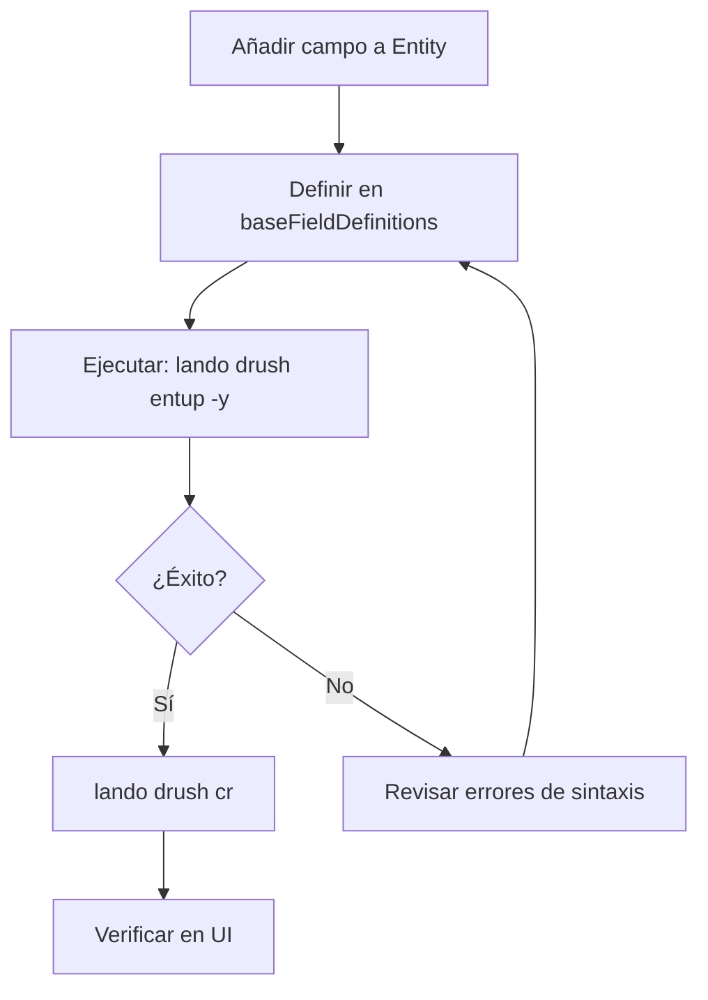

# Aprendizaje: Entity/Field Definitions Mismatch en Drupal 11

> **Fecha**: 2026-01-28
> **Contexto**: Implementación de campos SEO en `HomepageContent` entity
> **Tags**: `drupal`, `entity-updates`, `drush`, `content-entity`, `troubleshooting`

---

## El Problema

Al añadir nuevos campos (`meta_title`, `meta_description`, `og_image`) a una Content Entity existente (`HomepageContent`), el sistema muestra errores de **"Entity and field definitions mismatch"**.

### Síntomas
1. **WSOD** (White Screen of Death) al acceder a formularios de la entidad
2. **Warnings** en el Status Report de Drupal:
   ```
   Entity/field definitions: Mismatched entity and/or field definitions
   The following changes were detected in the entity type and field definitions:
   - homepage_content entity type
     - El campo SEO: Meta Title necesita ser instalado.
     - El campo SEO: Meta Description necesita ser instalado.
     - El campo SEO: Open Graph Image necesita ser instalado.
   ```
3. Formularios no muestran los nuevos campos
4. Contenido guardado anteriormente puede causar errores

### Causa Raíz
Los campos están definidos en el código PHP (`baseFieldDefinitions()`), pero **no existen en la base de datos**. Drupal detecta este desajuste pero no lo corrige automáticamente.

---

## La Solución

### Comando Principal: `drush entup`

```bash
# Vía Lando (desarrollo local)
lando drush entup -y

# Directo en servidor
drush entup -y

# Después, siempre limpiar caché
lando drush cr
```

### Salida Esperada
```
The following updates are pending:

homepage_content entity type :
El campo SEO: Meta Title necesita ser instalado.
El campo SEO: Meta Description necesita ser instalado.
El campo SEO: Open Graph Image necesita ser instalado.

// Do you wish to run all pending updates?: yes.

[success] Finished performing updates.
```

---

## Alternativas (Drupal 11)

### ❌ Devel Entity Updates UI
En **Drupal 11.3.2**, la ruta `/admin/config/development/entity-updates` no existe por defecto. El módulo `devel_entity_updates` no proporciona interfaz web utilizable.

### ❌ update.php
El script `update.php` ejecuta **hook_update_N()**, no actualizaciones de esquema de entidades.

### ✅ drush entup (Única opción confiable)
El comando `drush entup` (entity-updates) es la única forma confiable de aplicar cambios de esquema a entidades.

---

## Workflow Recomendado



### Checklist para Nuevos Campos

- [ ] Añadir campo en `baseFieldDefinitions()` de la Entity
- [ ] Si es necesario, añadir método getter/setter
- [ ] Ejecutar `lando drush entup -y`
- [ ] Ejecutar `lando drush cr`
- [ ] Verificar en Status Report: no debe haber warnings de entity mismatch
- [ ] Probar formulario de edición
- [ ] Si el campo usa widget especial, añadirlo al Form

---

## Código de Referencia

### Definición de Campo String
```php
$fields['meta_title'] = BaseFieldDefinition::create('string')
  ->setLabel(t('SEO: Meta Title'))
  ->setDescription(t('Título para Open Graph y buscadores'))
  ->setSettings([
    'max_length' => 255,
  ])
  ->setDisplayOptions('form', [
    'type' => 'string_textfield',
    'weight' => 100,
  ])
  ->setDisplayConfigurable('form', TRUE)
  ->setDisplayConfigurable('view', TRUE);
```

### Definición de Campo Imagen
```php
$fields['og_image'] = BaseFieldDefinition::create('image')
  ->setLabel(t('SEO: Open Graph Image'))
  ->setDescription(t('Imagen para compartir en redes sociales (1200x630px recomendado)'))
  ->setSettings([
    'file_directory' => 'seo/og-images',
    'alt_field' => TRUE,
    'file_extensions' => 'png jpg jpeg webp',
    'max_filesize' => '2MB',
  ])
  ->setDisplayOptions('form', [
    'type' => 'image_image',
    'weight' => 102,
  ])
  ->setDisplayConfigurable('form', TRUE);
```

---

## Errores Comunes

| Error | Causa | Solución |
|-------|-------|----------|
| WSOD en formulario | Fields no instalados en BD | `drush entup -y` |
| Campo no aparece en form | Falta `setDisplayOptions('form')` | Añadir configuración de display |
| "Field storage definition not found" | Typo en nombre de campo | Verificar consistencia de nombres |
| "Cannot drop field that has data" | Datos existentes en campo a eliminar | Exportar datos, eliminar, reimportar |

---

## Notas Finales

> [!TIP]
> **Siempre ejecutar `drush entup`** después de modificar `baseFieldDefinitions()` en cualquier Content Entity.

> [!WARNING]
> En producción, hacer backup de la BD antes de ejecutar `drush entup` si hay datos en la entidad.
